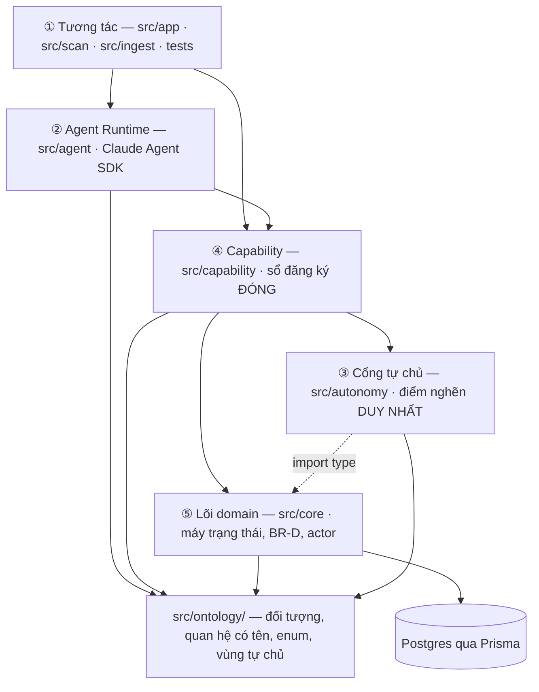
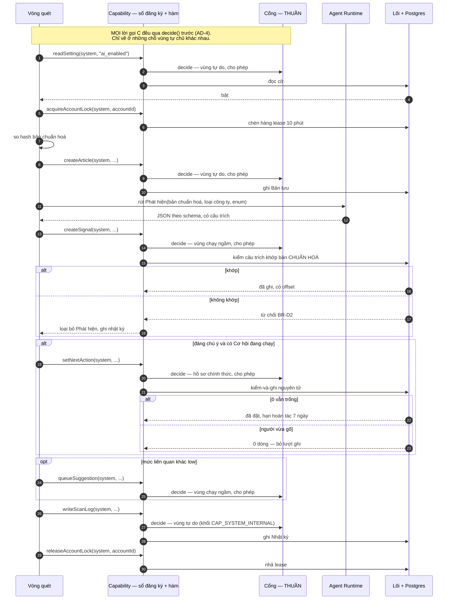
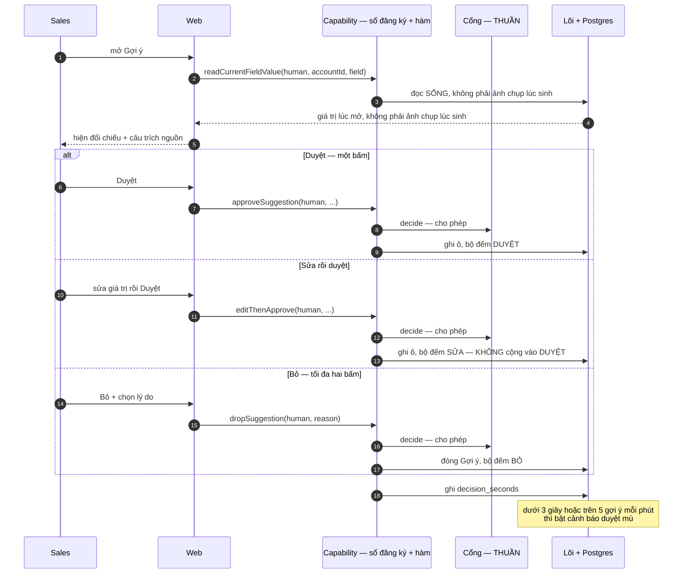
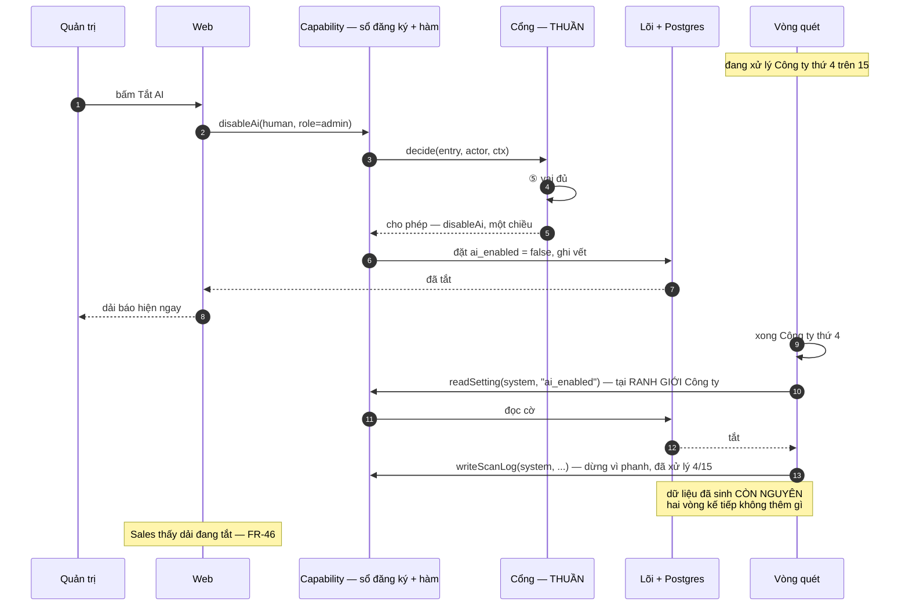
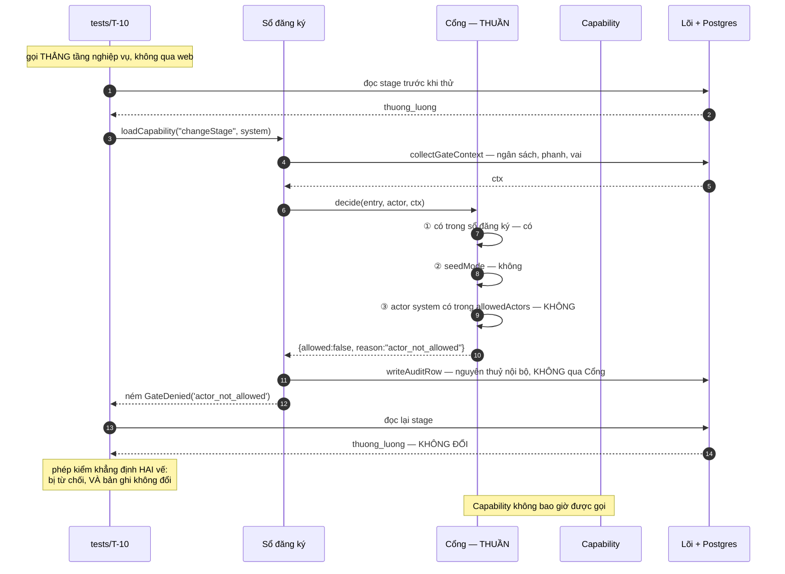
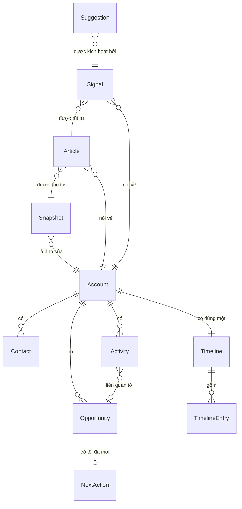
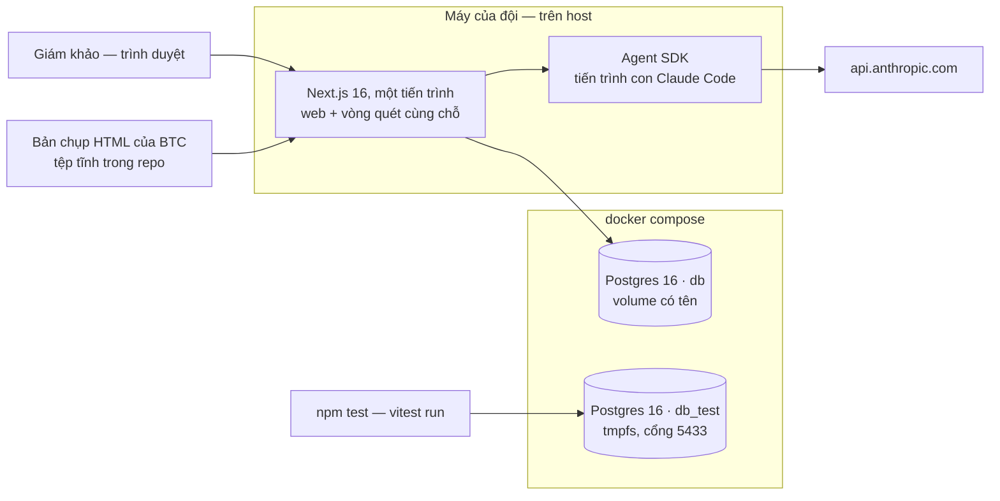

# Architecture Spine — Why Now

## Hình thái bài toán

Kiến trúc cho hình thái sai là sai từ gốc, nên nó được chốt trước mọi quyết định khác.

**Hình thái trội: vòng đời bản ghi.** Một Cơ hội đi qua bảy trạng thái, dưới luật, với quyền
theo vai. Bộ kỹ thuật đi kèm — mô hình quy trình, mô hình trạng thái, phân tích luật nghiệp vụ,
ma trận vai × hành động, mô hình dữ liệu — đã chạy ở bước PRD và là đầu vào của spine này.

**Hình thái phụ ①, mượn ở nhánh đọc: nền tảng dữ liệu.** Bản chụp → Bản lưu → Phát hiện là một
đường ống có hợp đồng lược đồ, nguồn gốc, độ tươi, và chạy bù. Mối lo đó khác hẳn vòng đời bản
ghi, nên `AD-8`, `AD-17`, `AD-18` tồn tại riêng cho nó.

**Hình thái phụ ②, mượn ở nhánh nạp: thay hệ cũ.** Có một hệ đang chạy: ~1.200 công ty rà tay
cộng Airtable, tăng ~50/tháng. `TR-3` là *"Báo cáo đối soát"*, `docs/CRM clone từ Airtable/`
mang cả `fieldId` lẫn `legacyAirtableId` với chú thích *"bắt buộc, để đối soát"*, và giả định
của `Q15` chính là *"lược đồ BTC khớp thư mục đó"*. Năm mã `TR` cho một nhánh phụ là đúng dấu
hiệu hình thái này.

Bộ kỹ thuật của hình thái này có bốn, đội chạy **hai** và loại hai, nói rõ để không đọc thành
bỏ sót: **Document Analysis** chạy (xem dưới) và **transition requirements** chạy (`TR-1`–`TR-5`,
`prd.md` §9.2). **Process Analysis** loại — dựng lại quy trình as-is của việc rà tay không đổi
được quyết định nào trong 4,5 tiếng. **Data Mining** loại — chưa có dữ liệu thật, BTC phát sáng
15/08.

Hệ quả **cụ thể** — và đường này đã đi thử rồi, kết quả **ngược với kỳ vọng**. Kỹ thuật mở đầu
của hình thái này là phân tích tài liệu, và tài liệu nằm sẵn trong repo: bảng ánh xạ trường của
Tomahawk PRD §12. Bước ① đã đối chiếu và **bác giả thuyết**: chỉ ~19% số dòng chạm mô hình Why
Now, `Snapshot` khớp **0** trường, và enum nguồn hẹp hơn đích (5 giai đoạn so với 7). Đó là
migration sang **một sản phẩm khác**, không phải lược đồ BTC.

Nên `Q15` **không giảm được bất định**, chỉ giảm được thiệt hại. Giá trị thu về là ở chỗ khác và
vẫn đáng: phạm vi phải chờ co lại còn **đúng một tệp `mapping.ts`**, mọi thứ khác dựng được tối
14/08. Ghi lại phép thử này để không ai đi lại đường cụt sáng mai.

**Hai bổ ngữ đang hoạt động:**

| Bổ ngữ | Đổi cách làm thế nào |
|---|---|
| **Bị bó thời gian** — 4,5 tiếng ngày thi (9:30–12:00 + 13:00–15:00), `D41` giữ trống một nửa | Suy giảm theo **mức độ đảo ngược được**, không theo lịch. Giữ ranh giới phạm vi, luật nghiệp vụ, ma trận quyền — sửa sau rất đắt. Bỏ sơ đồ đầy đủ, persona chi tiết — bổ sung sau vẫn được. **Không cắt UX**: nguyên mẫu đã dựng và vòng 3 chấm đúng phần nhìn thấy được |
| **Đội nhỏ, gộp vai** — 2 dev + 1 Sales Manager | Xem hai đoạn dưới — cặp vai đáng lo không phải cặp hay bị nêu |

**Về gộp vai, nói cho đúng phạm vi.** Cặp *người viết mã kiêm người viết kiểm thử* **có** mối
kiểm từ ngoài: `T-1`…`T-10` do BTC ra đề, và bộ kiểm thử bám sát `T` chứ không tự nghĩ ca. Nhưng
mối kiểm đó phủ **10 kịch bản** trên 51 `FR`, 19 `NFR`, 17 luật và 22 `AD` — phần còn lại đội tự
viết cả yêu cầu lẫn tiêu chí đạt. Bằng chứng ngay trong spine này: `T-10` chỉ đòi *"cả ba đều bị
từ chối"*, `AD-2` tự nâng lên hai vế. Việc nâng là đúng, nhưng nó chứng minh đội **đang viết
tiêu chí nghiệm thu**, `T` chỉ là sàn.

**Cặp thật sự không có mối kiểm nào là Domain SME ≡ End User.** Sales Manager của đội vừa là chủ
quy trình vừa được dùng làm người dùng cuối — trong khi 5/6 giám khảo vòng 3 là Sales thị trường
JP mà chính người đó **quản lý trực tiếp**. Chủ quy trình không tự động là người dùng cuối, và ở
đây không có `T` nào đỡ.

**Mối kiểm có tồn tại — bộ câu hỏi đã tách đúng cặp vai bị gộp**: Phần A hỏi *đồng đội, vai quản
lý*, Phần B hỏi *rep dùng hằng ngày*, kèm lý do viết thẳng *"hỏi quản lý câu này sẽ nhận về quy
trình trên giấy"*. Khiếm khuyết nằm ở hai chỗ khác:

- **Kênh truyền chưa độc lập.** Phần B ghi *"nhờ anh chuyển"* — người quản lý là kênh cho cả câu
  hỏi lẫn câu trả lời của cấp dưới mình. Tách vai trên giấy mà không tách kênh thì mối kiểm mất
  phần lớn hiệu lực.
- **Chưa gửi.** Nó là việc số 3 của Giai đoạn 1. Chừng nào chưa gửi, `D46` và `D47` vẫn là **lời
  Domain SME nói thay End User** — đúng thứ đoạn trên cảnh báo.

**Không phải hình thái nào:** không phải *sản phẩm ra thị trường* — người dùng cuối ở **trong tổ
chức**, nên hỏi được người thật. So chuẩn đối thủ vì thế không cần. Nhưng **khảo sát thì có
chạy**, và chạy đúng: dân số end user là **6 người có tên**, nên bộ câu hỏi không phải proxy mà
là **điều tra toàn bộ** — `docs/Đề bài/Câu hỏi cho ban giám khảo vòng 3.md`, 116 dòng có cấu
trúc. *Dựng nguyên mẫu* cũng đang chạy thật và nằm trên đường găng.
Không phải *API/nền tảng* — bên tiêu thụ là người, không phải hệ thống khác.

## Design Paradigm

**Năm tầng, một cổng, một chiều.** Agent ở trên, dữ liệu ở dưới, và **mọi đường xuống đều đi
qua đúng một cổng**.



Đọc từ trên xuống thì đây là hệ AI-native. Đọc chiều mũi tên thì đây vẫn là hệ có ranh giới
cứng. Hai điều đó không mâu thuẫn, và giữ được cả hai là toàn bộ mục đích của spine này.

**Cổng không chắn ngang đường đi xuống — nó là thứ sổ đăng ký hỏi trước khi làm.** Không tầng
nào ngoài `src/capability` nhập được `src/autonomy` (`AD-1`), và `registry.ts` là nơi duy nhất
gọi `decide()` (`AD-4`). Nên "đi qua đúng một cổng" đúng về hiệu lực, nhưng cạnh vẽ ra là
`cap --> gate`, **không phải** `ui --> gate` hay `agent --> gate`: hai cạnh đó là tàn dư của
chiều trước bản vá `M1`, và dựng theo chúng thì `no-restricted-imports` chặn ngay lúc biên dịch.
Nét đứt `gate ⤍ core` là ngoại lệ **chỉ-kiểu** duy nhất, xoá sạch lúc biên dịch.

| Tầng | Thư mục | Trách nhiệm | **Không** chịu trách nhiệm |
|---|---|---|---|
| Ontology | `src/ontology/` | ngữ nghĩa domain, enum, vùng tự chủ | mọi thứ khác — nó là markdown |
| ① Tương tác | `src/app` `src/scan` `src/ingest` `tests` | khởi phát việc | quyết định được phép hay không |
| ② Agent Runtime | `src/agent` | suy luận, lập kế hoạch, chọn công cụ | quyền hạn, chính sách rủi ro, truy cập dữ liệu |
| ③ Cổng tự chủ | `src/autonomy` | *"được phép không"* | *"nên làm gì"* |
| ④ Capability | `src/capability` | thao tác nghiệp vụ có tên | SQL, lược đồ, giao dịch |
| ⑤ Lõi domain | `src/core` | máy trạng thái, ràng buộc `BR-D`, ghi vết | HTTP, React, Claude |

**Câu phân vai, mượn nguyên từ bản `imagine-architect`:** Agent nói *"tôi nghĩ nên làm gì"*;
Cổng tự chủ nói *"anh có được phép không"*. Hai câu đó không bao giờ ở cùng một tệp.

---

## Invariants & Rules

### AD-1 — Không có đường nào tới lõi mà không đi qua Capability, và không Capability nào chạy mà không qua Cổng

- **Binds:** toàn bộ `src/`
- **Prevents:** một người thêm đường ghi tắt từ handler HTTP thẳng xuống Prisma, rồi ranh giới
  máy chỉ chặn ở đường cũ
- **Rule (luật trung tâm, đặt trước vì nó là chỗ duy nhất có thể bị vi phạm):** **bộ công cụ
  dựng sẵn của Agent SDK phải tắt sạch, và capability của đội phải được cấp phép tường minh.**
  Bốn tuỳ chọn, thiếu một là hỏng:

  ```ts
  query({ prompt, options: {
    tools: [],                                   // xoá sạch built-in: KHÔNG còn Bash
    mcpServers: { crm: sdkServer },              // capability của đội
    allowedTools: ["mcp__crm__*"],               // tầng CẤP PHÉP — tách khỏi tầng hiện diện
    permissionMode: "dontAsk",                   // §4/nhóm 5 cấm dừng chờ ai
  }})
  ```

  Vì sao `tools: []`: nếu để mặc định, agent có `Bash` — và `Bash` chạy được `psql`, tức **một
  đường xuống Postgres đi vòng qua cả bốn tầng dưới**, qua mặt sổ đăng ký, qua mặt Cổng, qua
  mặt ghi vết.

  Vì sao **hai dòng còn lại**: `tools` chỉ điều khiển *cái gì hiện diện*; cấp phép là **tầng
  riêng**. Đội đã đo, cùng một lời nhắc, cùng một MCP server:

  | Cấu hình | Agent gọi capability | Handler chạy thật | Chi phí một lượt |
  |---|---|---|---|
  | chỉ `tools: []` + `mcpServers` | có | **0 lần** | **$1,607** |
  | thêm `allowedTools` + `dontAsk` | có | **1 lần** | $0,091 |

  Thiếu hai dòng đó thì vòng quét chạy, agent *trông như* đang gọi capability, **không gì được
  ghi**, và chi phí gấp gần **18 lần** vì agent thử lại — `T-4`, `T-6`, `T-8` đỏ cùng lúc với
  triệu chứng đánh lạc hướng sang "mô hình không chịu dùng tool".

  **Ba cái bẫy lúc DỰNG, đều đã đo, đều giết tiến trình trước khi giám khảo bấm gì:**

  | Bẫy | Đúng phải là |
  |---|---|
  | `tool()` nhận `ZodObject` | nhận **`AnyZodRawShape`** — `{ a: z.string() }`, không phải `z.object({...})`. Tên kiểu là `AnyZodRawShape`, không phải `ZodRawShape`; gõ nhầm thì không import được (`sdk.d.ts` 0.3.232) |
  | `z.date()` trong tham số tool | `z.iso.datetime()` — `z.date()` ném *"Date cannot be represented in JSON Schema"* **lúc dựng** (`AD-6`) |
  | `Prisma.TransactionClient` làm kiểu `tx` | kiểu suy ra từ client **đã gắn extension** của `AD-14`; `Prisma.TransactionClient` là kiểu của client trần, không mang extension |

  Cả ba là lỗi biên dịch hoặc lỗi khởi động, không phải lỗi lúc chạy — nên chúng không lộ ra ở
  bất kỳ phép kiểm `T` nào, chúng chặn `npm start`.

  **Glob `mcp__crm__*` đã đo, có khớp** — hai lượt, handler chạy đúng một lần mỗi lượt, chi phí
  ngang với liệt kê đủ tên ($0,075 so với $0,076). Giữ glob. Đường lui nếu sáng 15/08 nó im lặng
  không khớp: liệt kê đủ tên tool, triệu chứng nhận ra ngay bằng *handler chạy 0 lần*.

  Phép đối chứng chiều ngược cũng đã đo: cùng một lời nhắc phá hoại, `tools: []` thì tệp mồi
  còn nguyên, `allowedTools: ["Read","Bash"]` thì tệp mồi bị xoá sau sáu lượt. Cả hai phép đo
  là ca nghiệm thu bắt buộc, không phải ghi chú.

- **Rule (ranh giới nhập, cưỡng chế bằng `no-restricted-imports`, viết theo DANH SÁCH CHO PHÉP):**

  Danh sách **cho phép**, không phải danh sách chặn. Đây không phải sở thích: danh sách chặn
  liệt kê thư mục, nên nó bỏ sót đúng những tệp không ai nghĩ tới — và tệp nguy hiểm nhất
  (`instrumentation.ts`, nơi khởi động vòng quét) nằm ở **gốc dự án**, ngoài mọi thư mục `src/`.

  **Phạm vi quét: mã của đội, không phải cây do công cụ sinh.** `eslint.config.mjs` bỏ qua
  `_bmad-output/**`, `_bmad/**`, `docs/**` — chúng được theo dõi trong git nên `.gitignore` không
  giúp, và không có mấy dòng đó thì `npm run lint` **đỏ** vì `_ds_bundle.js` của nguyên mẫu, một
  tệp không ai trong đội sở hữu (đã đo 14/08: 2 lỗi, 18 cảnh báo, toàn bộ từ cây sinh).

  | Nhập cái gì | Được phép ở | Mọi nơi khác trong repo |
  |---|---|---|
  | `@prisma/client` · đường dẫn client sinh ra · **`@prisma/adapter-pg`** | `src/core/**` · `prisma/**` · `tests/**` (**chỉ đọc**) | **cấm** |
  | `src/core/**` | `src/capability/**` · `tests/**` (chỉ đọc) | **cấm** |
  | `src/capability/**` | `src/scan/**` · `src/app/**` · `src/agent/**` · `tests/**` · `prisma/**` · `instrumentation.ts` | **cấm** |
  | `src/autonomy/**` | `src/capability/**` · `tests/**` | **cấm** |
  | `src/core/**` — **chỉ `import type`** | `src/autonomy/**` | **cấm** |
  | `process.env` | `src/config.ts` · `instrumentation.ts` · `prisma.config.ts` (xem `AD-15`) | **cấm** |

  Hàng cuối là ngoại lệ **chỉ-kiểu**, có tên và có lý do: `gate.ts` phải gõ được `Actor`
  (`AD-5`), mà `import type` **xoá sạch lúc biên dịch** nên nó không tạo phụ thuộc lúc chạy và
  `AD` này không thủng. Cưỡng chế bằng `no-restricted-imports` với `allowTypeImports`, cộng
  `no-import-type-side-effects` để chặn dạng nội dòng `import { type X }` — dạng đó **còn lại**
  một lệnh nhập rỗng lúc chạy nếu `verbatimModuleSyntax` bật. Không có hàng này thì `gate.ts`
  không biên dịch được, và tầng ③ là tầng duy nhất không có đường hợp lệ nào.

  Hàng đầu chặn **hai** tên, không phải một: Prisma 7 sinh client ra thư mục do `generator`
  khai, nên chặn mỗi chuỗi `@prisma/client` để lọt đường nhập thẳng vào thư mục sinh ra. Ghim
  `output` trong `schema.prisma` và đưa **cả hai** vào luật lint. (Phân xử `C7` của tầng ④, **ba mệnh đề tách riêng**: ⓐ Prisma 7 cấm `url` trong `datasource` —
  **nhận**, đã tái hiện `P1012`; ⓑ bắt buộc driver adapter — **nhận**, xem hàng `@prisma/adapter-pg`
  của Stack; ⓒ *"đường nhập không còn là `@prisma/client`"* — **bác**, module vẫn resolve được.
  Bản trước bác trọn gói, nuốt luôn ⓑ là mệnh đề **chặn**.)

  **Chiều phụ thuộc sau `AD-4`:** mọi tầng khởi phát gọi `src/capability/registry.ts`, và **chỉ
  sổ đăng ký** gọi `src/autonomy/gate.ts`. Cổng **không** nhập ngược sổ đăng ký — nó nhận
  `RegistryEntry` làm tham số — nên hai hàng cuối không tạo chu trình. Viết bảng theo chiều cũ
  (Cổng gọi sổ đăng ký) làm hàng `src/capability` thành hàng chết và **chặn điểm vào của toàn
  hệ**: `src/scan`, `src/app`, `tests`, `prisma/seed.ts` đều rơi vào ô *"mọi nơi khác: cấm"*.

  Capability **chỉ lấy được qua sổ đăng ký**, và sổ đăng ký gọi Cổng trước khi trả về hàm — nên
  một capability quên gọi Cổng **không tồn tại được**. Không có dòng `@prisma/client` thì luật
  đó vô nghĩa: một server action gọi thẳng `prisma.account.update()` **không nhập `src/core`,
  không gọi `src/capability`**, nên lint xanh, ghi vết rỗng, và `T-10` chứng minh *"chỉ có chín
  capability"* trên một sản phẩm ghi dữ liệu bằng chục đường không tên.

  - Ngoại lệ duy nhất, có tên: `tests/` đọc thẳng Prisma để khẳng định vế hai của `AD-2` —
    **chỉ đọc**. Ghi trong kiểm thử đi qua Cổng dựng ở chế-độ-gieo (`AD-4`).
  - **`src/app` không có ngoại lệ nào — kể cả để ĐỌC.** Xem `AD-19`: sổ đăng ký phủ cả đọc lẫn
    ghi, nên mọi màn hình lấy dữ liệu bằng capability đọc. Thiếu luật này thì `src/app` không
    có một dòng mã hợp pháp nào để hiện danh sách Công ty, và người dựng sẽ đi tắt.
  - **Lọc `deleted_at IS NULL` ở đúng một chỗ** (Prisma extension trong `src/core`), không ở
    từng truy vấn — xem `AD-14`.

  **Composition root có chủ, khai tên ở đây vì nó là thứ duy nhất được nhập nhiều tầng.**
  `src/agent` là bộ biến đổi thuần: nó **không tự lấy** MCP server, không tự đọc cấu hình, mà
  nhận chúng qua tham số. Ba người ráp, mỗi người một nhánh, **không nhánh nào chia sổ đăng ký
  với nhánh khác**:

  | Nhánh | Ai gọi `createRegistry` | `seedMode` |
  |---|---|---|
  | máy — vòng quét | **`src/scan/bootstrap.ts`** dựng **một** thể hiện mức module, khi `instrumentation.ts` **nhập động** nó | `false` |
  | người — web | `src/app/_registry.ts`, module-level singleton, dựng ở lần nhập đầu | `false` |
  | gieo | `prisma/seed.ts` | `true` |
  | kiểm thử | `tests/` dựng **hai** thể hiện độc lập trong cùng tiến trình | `true` và `false` |

  **`instrumentation.ts` không nhập `src/capability`** — nó chỉ `await import('./src/scan/bootstrap')`
  (`AD-UI-1`). Lời nhập **tĩnh** ở tệp đó chạy **trước** guard `NEXT_RUNTIME` và kéo cả cây
  `src/capability → src/core/db.ts → @prisma/client` vào **edge runtime**; cờ chặn khi đó chỉ ngăn
  việc *khởi động*, không ngăn việc *nạp*.

  `src/app` không có vòng đời khởi động như `instrumentation.ts`, nên nó dùng singleton mức
  module — hợp lệ vì `seedMode` của nhánh này là hằng số `false`, không phải thứ đổi giữa
  request. Chỉ `tests/` cần hai thể hiện, và đó chính là lý do `seedMode` là tham số dựng của
  **sổ đăng ký** chứ không phải của Cổng (`AD-4`). Không khai chỗ này thì sáng mai không tệp nào *"được phép"* dựng phụ thuộc cho agent,
  và người dựng sẽ tự mở một lỗ.

### AD-2 — Sổ đăng ký Capability là tập đóng, và phép kiểm khẳng định đúng tập đó

- **Binds:** `NFR-14`–`NFR-17`, `NFR-19`, `T-10`
- **Prevents:** capability thứ mười xuất hiện qua một pull request và không ai nhận ra ranh giới
  máy vừa bị nới
- **Rule:** `src/capability/registry.ts` khai một danh sách **đóng**. Mỗi mục mang
  `{ name, zone, risk, allowedActors, requiresSignalSource, cascades, selfLimiting }`.
  `zone` nhận đúng ba giá trị `'tu_do' | 'chay_ngam' | 'ho_so_chinh_thuc'`, khớp từng chữ bảng §6
  của ontology; một phép kiểm đối chiếu hai danh sách.

  **Phạm vi của sổ đăng ký, khai tường minh: mọi thao tác chạm dữ liệu — ĐỌC lẫn GHI — vào bất
  kỳ bảng nào, bất kể actor.** Không phải "những gì máy chạm được", và không phải "chỉ thao tác
  ghi": `AD-1` cấm `src/app` nhập `src/core` và `@prisma/client`, nên nếu đọc nằm ngoài phạm vi
  thì **không màn hình nào có đường lấy dữ liệu hợp pháp**. Ba khối tách bạch, mỗi khối một
  hằng số:

  | Khối | Gồm gì | `T-10` khẳng định thế nào |
  |---|---|---|
  | `CAP_MACHINE_ALLOWED` — **hạng ghi** | `createArticle` · `createSignal` · `queueSuggestion` · `appendTimelineEntry` · `setNextAction` · `disableAi` | **bằng đúng sáu** — thêm hay bớt đều đỏ |
  | `CAP_MACHINE_ALLOWED` — **hạng đọc-chung** | `readArticle` · `readAccountType` · `listEnums` · `readAccountList` · `readSetting` | **không có đường ghi nào** (xem dưới) |
  | `CAP_HUMAN_ONLY` | `enableAi` (**chỉ Quản trị** — máy không bao giờ có, `AD-3`) · CRM làm tay `§4`/nhóm 1 · ba lối ra Gợi ý (`approveSuggestion`, `editThenApprove`, `dropSuggestion`) · `undo` · bật/tắt Đang theo dõi · phản hồi Phát hiện `FR-42` · sửa `settings` `FR-44` · đổi phiên bản Bản chụp `§3` · `softDeleteAccount` `D26` · **capability đọc CÓ THAM SỐ LỌC theo người dùng** (`readAccountDetail`, `readCurrentFieldValue`, `readMetrics`…). Đọc **không lọc** thì thuộc hạng đọc-chung của khối một, vì vòng quét cũng cần | **không giao** với khối một |
  | `CAP_SYSTEM_INTERNAL` | **vị từ, không phải danh sách**: mọi mục `allowedActors: ['system']` chạm **chỉ** bảng hạ tầng — `scan_log` · `scan_log_entry` · `account_lock` · `inference_cache` · `notification` · `user` (chỉ đọc). Hiện có: `writeScanLog` · `acquireAccountLock` · `releaseAccountLock` · `recordAccountCost` · `readUserForAuth` · `readLoginCandidates` | **không giao** với khối một |

  Khối ba khẳng định bằng **vị từ**, không bằng con số — thêm một màn hình vận hành thì thêm mục
  ở đây mà `T-10` **không** đỏ. Đếm cứng thì mỗi lần tầng con cần một lượt đọc hạ tầng lại phải
  xin cha sửa số, và đó đúng là chỗ ba tài liệu vừa lệch nhau (5 so với 10).

  **Gia hạn khoá KHÔNG phải capability thứ ba** — nó là `acquireAccountLock` gọi lại với cùng
  `process_id` (`AD-UI-13`). Thêm `renewAccountLock` làm `T-10` đỏ.

  **Hệ quả dây chuyền KHÔNG nằm trong khối ba** — `AD-21` khai chúng là hàm nội bộ `src/core`,
  không đi qua `loadCapability`, nên chúng không phải mục sổ đăng ký. `closeSuggestionBySystem`
  là một trong số đó.

  **Ghi vết KHÔNG nằm trong ba khối** — nó là nguyên thuỷ nội bộ của `src/core`, xem `AD-4`.
  Đưa nó vào sổ đăng ký là tạo đệ quy vô hạn ngay lời gọi capability đầu tiên.

  **Vì sao khối một phải tách hai hạng.** `NFR-14`–`NFR-17` nói về chỗ máy **ghi**, không nói về
  chỗ máy **đọc** — nên mệnh đề đáng khẳng định là *"máy ghi được đúng sáu chỗ"*. Nếu gộp đọc và
  ghi thành một con số cứng, vòng quét chết kẹt: nó là `actor=system` và phải đọc danh sách Công
  ty (`AD-12`), đọc cờ phanh và trần ngân sách (`AD-11`) — mà đưa `readAccountList`/`readSetting`
  vào thì khối một hết bằng chín và `T-10` đỏ, còn không đưa vào thì bước ③ từ chối mọi lời gọi
  và `T-8`, `T-9` đỏ. Không có lối ra thứ ba.

  Hạng đọc-chung mang `zone: 'tu_do'`, `risk: 'low'`, `allowedActors: ['human','system']`,
  và một phép kiểm khẳng định **không mục nào của hạng này nhập hàm ghi của `src/core`**. Không
  liệt `'seed'` — bước ② của `AD-4` đã cho actor gieo qua trước khi tới bước ③, nên liệt thêm chỉ
  tạo hai chỗ khai cùng một quyền. Đó là
  thứ giữ cho hạng mở mà ranh giới máy không nới một chút nào.

  Capability đọc **có tham số lọc theo người dùng** (`readAccountDetail`, `readCurrentFieldValue`,
  `readMetrics`) thuộc khối hai, `allowedActors: ['human']`. Thêm màn hình mới thì thêm vào đó —
  **không** làm đỏ `T-10`.

  Đây là hình thức mạnh hơn của *"chứng minh bằng vắng mặt"*: không phải *"chúng tôi không thấy
  capability xoá"* mà *"máy **ghi** được đúng sáu chỗ, đây là cả sáu, và phép kiểm đỏ nếu có cái
  thứ bảy"*.

  **`risk` không tham gia quyết định** — nó chỉ vào ghi vết và vào giao diện (ô rủi ro cao
  buộc hiện diff). Vùng quyết định cho phép hay không; rủi ro quyết định trình bày thế nào. Nói
  rõ ở đây để không ai tưởng có hai núm vặn.

  **Phép kiểm ranh giới phải khẳng định hai vế**, không phải một. Bị Cổng từ chối là vế thứ
  nhất; **bản ghi mục tiêu không hề đổi** là vế thứ hai. Thiếu vế hai thì phép kiểm không phân
  biệt được *"chính sách chặn"* với *"capability vốn không tồn tại"* — và đó đúng là điều
  `T-10` phải chứng minh.

### AD-3 — Máy có đúng ba chạm ghi vào Hồ sơ chính thức

- **Binds:** `§4`, `D16`, `D17`, `D12`, `FR-45`
- **Prevents:** chạm thứ tư trườn vào vì "cũng tiện"
- **Rule:** capability ghi mà `allowedActors` gồm `system` **chỉ có ba**:

  | Capability | Điều kiện |
  |---|---|
  | `appendTimelineEntry` | chỉ Công ty **Đang theo dõi**; gắn nhãn *do hệ thống thêm*; đòi `signalId` nguồn |
  | `setNextAction` | Cơ hội ở giai đoạn **đang chạy** (`D11`), **và** một trong ba: ⓐ ô **đang trống**; ⓑ ô do **chính hệ thống** đặt trước đó **và** hạn mới **không xa hơn** hạn đang có; ⓒ ô do **người** đặt và **đã quá hạn**, chỉ khi `settings.next_action_overwrite_overdue_manual = true`. Kiểm-và-ghi nguyên tử (`AD-10`); đòi `signalId` nguồn |
  | `disableAi` | **một chiều** — máy tắt được, không bao giờ bật được |

  Ba nhánh chép đúng `D12` nguyên văn: *"Ô đang trống **hoặc ô do chính hệ thống đặt trước
  đó** thì tự điền… Có cờ `nextAction.overwriteOverdueManual`, mặc định `false`"* — khoá trong bảng `settings` viết snake_case: `next_action_overwrite_overdue_manual`. Nhánh ⓑ là
  chỗ dễ đánh rơi nhất, và không có nó thì bất biến *"hạn máy đặt không bao giờ bị đẩy xa hơn,
  nhiều tin cùng lúc thì lấy hạn ngắn nhất"* (ontology §9) **không có đường cài**: vòng quét sau
  gặp tin gấp hơn sẽ thấy ô không trống, không phải người đặt, và không nhánh nào khớp.

  Nhánh ⓒ là đường thoát duy nhất của rủi ro `F36` **của Mục 0** (không phải `FT`-n ở mục Phân loại thất bại) — `D12` là rủi ro nghiệm thu duy nhất trong 47
  quyết định, vì nếu dữ liệu BTC điền sẵn mọi ô thì *"chỉ khi trống"* làm `T-6` đỏ. Cờ mặc định
  `false`; bật nó **không sinh capability mới**, chỉ nới vị từ — nên `T-10` không đổi. Kiểm thử
  phủ **cả hai** nhánh cờ, và ghi vết ghi rõ nhánh nào đã chạy.

  **Tên capability đổi thành `setNextAction`**: tên cũ khai một vị từ
  đã hết đúng, mà `T-10` khẳng định khối một **theo tên** — tên là hợp đồng, không phải nhãn.

  Ghi ở **tầng AI-native** (Bản lưu, Phát hiện, Gợi ý) không tính là chạm — đó là vùng chạy
  ngầm, chưa chạm dữ liệu chính thức.

### AD-4 — Cổng tự chủ có chuỗi quyết định cố định, và nó ghi vết cả khi từ chối

- **Binds:** `D25`, `D28`, `T-10`, `T-5`
- **Prevents:** hai người dựng hai thứ tự kiểm khác nhau, rồi cùng một lời gọi cho hai kết quả
- **Rule:** đúng thứ tự này, dừng ở lần từ chối đầu tiên:

  ```
  ① capability có trong sổ đăng ký?       không → TỪ CHỐI (unknown_capability)
  ② actor.kind === 'seed' VÀ Cổng được
     dựng ở chế-độ-gieo?                   có   → CHO PHÉP (xem AD-20)
  ③ actor có trong allowedActors?         không → TỪ CHỐI (actor_not_allowed)
  ④ chạm một trong năm ranh giới cấm?      có   → TỪ CHỐI (boundary)
  ⑤ vai người dùng có đủ? (chỉ-Quản-trị)   không → TỪ CHỐI (role)
  ⑥ actor=hệ thống: còn trần lượt/ngân sách? hết → TỪ CHỐI (limit)
  ⑦ actor=hệ thống: phanh AI đang bật?     tắt  → TỪ CHỐI (brake)
  → CHO PHÉP
  ```

  **Thứ tự này là quyết định, không phải ngẫu nhiên** — nó chọn mã lý do khi một lời gọi vi
  phạm nhiều bước cùng lúc. Nguyên tắc: **từ hẹp tới rộng**, tức từ *"thứ này không tồn tại"*
  tới *"thứ này tồn tại nhưng lúc này không được"*. Nên `changeStage(system)` — vi phạm cả ②
  và ③ — trả `actor_not_allowed`, vì "hệ thống không bao giờ được làm việc này" là sự thật bền
  hơn "lần này chạm ranh giới".

- **Rule — Cổng là hàm THUẦN; sổ đăng ký cưỡng chế và ghi vết.** Đây là chỗ chia việc, không
  phải chi tiết cài đặt:

  ```ts
  // src/autonomy/gate.ts — thuần, không I/O, không nhập gì ngoài src/ontology
  function decide(entry: RegistryEntry | undefined,
                  actor: Actor,
                  ctx: GateContext): GateDecision   // {allowed:true} | {allowed:false, reason}

  // src/capability/registry.ts — nơi DUY NHẤT gọi decide()
  const { loadCapability } = createRegistry({ seedMode })   // AD-20
  async function loadCapability(name: string, actor: Actor): Promise<CapabilityFn> {
    const entry = REGISTRY[name]
    const ctx   = await collectGateContext(actor)   // ngân sách, phanh, vai, seedMode
    const d     = decide(entry, actor, ctx)         // thuần
    if (!d.allowed) {
      await writeAuditRow({ actor, name, decision: d })     // từ chối: ghi ngay, chưa có tx
      throw new GateDenied(d.reason)
    }
    return async (...args) => core.tx(async (tx) => {       // MỘT giao dịch bao trọn
      // KHÔNG chụp before ở đây: nó nằm NGOÀI giao dịch của lõi, nên giá trị cũ
      // có thể lệch với thứ lõi thật sự ghi đè — hỏng im lặng ở đúng cột T-10 đọc.
      // Lõi đọc before/after TRONG giao dịch của nó — AD-CR-7 bước ⑥.
      return entry.fn(actor, { auditId: d.auditId, causedBy: null }, ...args)
    })
  }
  ```

  **Vì sao phải tách.** Nếu Cổng tự ghi vết, nó cần Prisma — mà `AD-1` cấm `src/autonomy` nhập
  `@prisma/client`; còn đi qua capability thì phải qua chính Cổng, tức **đệ quy vô hạn**. Tách
  ra thì không cần ngoại lệ nào: sổ đăng ký ở `src/capability` **được phép** nhập `src/core`,
  nên nó đọc ngữ cảnh và ghi vết hợp lệ.

  Tách còn khớp đúng bảng phân tầng: Cổng chịu trách nhiệm *"được phép không"*, **không** chịu
  trách nhiệm truy cập dữ liệu. Và nó làm `gate.ts` kiểm thử được bằng bảng đầu-vào/đầu-ra
  thuần — không cần cơ sở dữ liệu để chứng minh chuỗi bảy bước đúng thứ tự.

  Hệ quả: bước ⑥ và ⑦ **không tự đọc** ngân sách hay cờ phanh; chúng đọc từ `ctx`, do
  `collectGateContext` gom trước. `ctx` chụp một lần cho mỗi lời gọi, nên quyết định của Cổng
  là hàm của đầu vào — không phụ thuộc thời điểm nó chạy.

  **Ghi vết không nằm trong ba khối của `AD-2` và không đi qua `loadCapability`** — nó là nguyên
  thuỷ nội bộ của `src/core/audit.ts`, gọi thẳng từ sổ đăng ký. Đó là điều bắt buộc, nếu không
  thì đệ quy quay lại ngay lời gọi đầu tiên.

  **Và nó đi CÙNG giao dịch của capability, không đứng trước.** `loadCapability` chỉ *trả hàm*;
  ghi vết commit trước rồi `entry.fn` ném `BusinessRuleError` (`AD-9`) hay kiểm-và-ghi trả 0 dòng
  (`AD-10`) thì dòng ghi vết khai một thao tác **chưa hề xảy ra** — đúng ca `T-10` phải phân
  biệt. Ở thời điểm đó cũng chưa ai đọc bản ghi đích, nên `giá trị cũ`/`giá trị mới` mà quy ước
  đòi **không tồn tại** để ghi. Từ chối thì ghi ngay (không có giao dịch nào để bám); cho phép
  thì ghi trong `tx`, commit cùng lúc với thao tác.

  **Bất biến, không phải cơ chế:** ① không lời gọi nào đi qua Cổng mà không để lại dòng ghi vết —
  kể cả lời gọi **thử rồi hỏng**; ② dòng đó mang `giá trị cũ`/`giá trị mới` khi có ghi thật; ③ nó
  không bao giờ khai một thao tác **chưa xảy ra**.

  Cả ba không thoả được bằng một lần ghi trong giao dịch: `entry.fn` ném `BusinessRuleError`
  (`AD-9`) thì giao dịch cuộn lại và **dòng ghi vết biến mất cùng nó** — mất đúng bằng chứng mà
  `FT6` cần để chẩn đoán, và mất đúng thứ *Penalty hộp đen* của barem hỏi tới. Cơ chế thoả cả ba
  (ghi hai pha trên một hàng, cột `outcome`) thuộc **tầng ⑤ `src/core/audit.ts`** — xem
  `AD-CR-8` (**spine tầng ⑤**, không phải `AD` của tệp này); `AD` này chỉ chốt ba bất biến trên.

  Phép kiểm đếm: **số dòng ghi vết = số lần `decide` được gọi** — không phải số lần
  `loadCapability` được gọi. `collectGateContext` chạy **trước** `decide` và có thể ném (Postgres
  chớp); lời gọi đó **chưa hề đi qua Cổng**, chưa có quyết định nào để ghi. Đếm theo
  `loadCapability` làm phép kiểm đỏ vĩnh viễn sau một lần mạng chớp, với triệu chứng trỏ vào ghi
  vết chứ không vào mạng. Loại trừ
  `actor.kind='seed'` khi không có cờ `--keep-audit` (`AD-20`).

  Nhánh gieo đứng ở **②, không phải đầu chuỗi** — nó là vị từ **rộng nhất** (*"actor này luôn
  được"*), nên đặt trước bước hẹp nhất (*"thứ này không tồn tại"*) là đi ngược đúng nguyên tắc
  vừa nêu. Sau khi hạ xuống, seeder gõ nhầm tên capability vẫn nhận `unknown_capability` chứ
  không nhận CHO PHÉP rồi nổ ở tầng dưới với thông điệp không liên quan.

  **Chế-độ-gieo là tham số DỰNG của SỔ ĐĂNG KÝ, không phải của Cổng** — vì sổ đăng ký mới là
  thứ có điểm vào: `createRegistry({ seedMode }) → { loadCapability }`. Cổng vẫn thuần và **nhận
  `seedMode` trong `ctx`**, đúng như nhận ngân sách và cờ phanh, nên `decide()` vẫn kiểm thử được
  bằng bảng vào/ra. `prisma/seed.ts` dựng với `true`; `instrumentation.ts` và `src/app` dựng với
  `false` một lần lúc khởi động; `tests/` dựng **hai thực thể độc lập trong cùng tiến trình** —
  `seedRegistry` cho `beforeEach` và `appRegistry` cho phần khẳng định. Singleton mức module
  không cho phép điều đó, và đó chính là lý do tham số đặt ở đây: `npm test` chạy `T-10` (đòi
  `seedMode=false`) và tiện ích gieo (đòi `true`) trong **cùng một tiến trình Vitest**.
  Không tiến trình nào đọc `npm_lifecycle_event`, `process.argv`, hay bất kỳ tín hiệu môi trường
  nào để suy ra chế độ này — đó đúng là *ngữ cảnh ngầm* mà `AD-5` cấm, và `AD-15` cũng không cho
  `gate.ts` đọc `process.env`.

  Không có tham số dựng thì **mọi `T` đỏ ở `beforeEach`**: `npm test` không phải `npm run seed`,
  nên Cổng sẽ chặn ngay bước dựng dữ liệu nền, mà `AD-1` chỉ cho `tests/` đọc thẳng Prisma —
  **chỉ đọc**, không ghi.

  **Bước ⑥ và ⑦ bỏ qua với mục mang cờ `selfLimiting: true` — đúng NĂM mục.** Luật phát biểu
  theo **hình dạng lỗi**, không theo từng ca, vì vá từng ca thì sót: *một capability chạy **tại
  hoặc sau** thời điểm trần chạm, hoặc phải sống khi phanh tắt, không được để chính trần đó chặn
  — nếu không, hệ mất đúng cái van nó vừa dựng.*

  | Mục | Bị chặn khi nào | Nếu chặn thì hỏng gì |
  |---|---|---|
  | `disableAi` | bước ⑥ `limit` ở 100% ngân sách | điều kiện dừng 4 của `AD-11` **không bao giờ chạy được** — AI không tự tắt |
  | `writeScanLog` | bước ⑦ `brake` khi phanh tắt | không điều kiện dừng nào để lại dòng Nhật ký mà `T-8` đòi truy vấn |
  | `releaseAccountLock` | ⑥/⑦ ở ranh giới Công ty sau khi trần chạm | **khoá không nhả.** `AD-12` suy *"vòng đang chạy"* từ khoá, lease 10 phút — ở nhịp 60 giây là **10 vòng liên tiếp bị bỏ**. Bật lại AI thì mười phút không có gì xảy ra |
  | `recordAccountCost` | như trên | `estimated_cost_per_account` mất mẫu đo đúng ở Công ty đắt nhất |
  | `readUserForAuth` | bước ⑦ `brake` | lượt đọc **dựng nên `actor`** chạy trước khi có actor nên phải đi bằng `system`; **bấm Tắt AI thì không ai đăng nhập được**, `T-9` và `T-1` đỏ cùng lúc |
  | `readLoginCandidates` | bước ⑦ `brake` | `S11` phải liệt **hai** tài khoản để bấm, mà `readUserForAuth` chỉ đọc **một**. Cùng hình dạng: chạy trước khi actor tồn tại. Chặn nó thì **màn đăng nhập trống** |

  Ba mục giữa và cuối là **cùng một hình dạng** với hai mục đầu, chỉ khác chỗ đứng: hạ tầng bị
  chặn bởi chính cái phanh mà nó phục vụ. Bản trước của `AD` này vá `readUserForAuth` mà không
  quét lại hình dạng — đó là lý do luật giờ viết theo hình dạng.

  **Hai phương án đã loại, ghi ra vì `selfLimiting` là quyết định vá dồn (2 → 3 → 5 mục qua ba
  lượt) chứ không phải quyết định chọn** — không có tập phương án thì lần sau gặp mục thứ sáu
  cùng hình dạng, không ai có tiêu chí nói *"đúng năm"* còn đúng không, mà `T-10` khẳng định
  **theo tên**:

  | Phương án | Vì sao loại |
  |---|---|
  | Tách một đường **không qua Cổng** cho năm mục hạ tầng | Phá `AD-1` (*không capability nào chạy mà không qua Cổng*), **và** mất chính dòng ghi vết mà `FT10` cần để chẩn đoán |
  | Bỏ bước ⑥⑦ khỏi Cổng, để `src/scan/loop.ts` tự cưỡng chế trần | `T-9` đòi Cổng chặn **lời gọi tiếp theo** ngay lập tức; vòng quét chỉ kiểm ở ranh giới Công ty nên phanh trễ cả một Công ty |

  Cờ này **không nới ranh giới nào**: `disableAi` một chiều theo `AD-3`; `writeScanLog`,
  `releaseAccountLock`, `recordAccountCost` chỉ chạm bảng hạ tầng; `readUserForAuth` chỉ đọc.
  Cả năm `allowedActors: ['system']` (trừ `disableAi` thêm Quản trị). Một phép kiểm khẳng định
  `selfLimiting` bật ở **đúng sáu** mục, và nó là trường **bắt buộc** — không `?:`, vì
  `undefined` là mặc định ngầm.

  Bước ⑦ kiểm phanh ở **mỗi lời gọi**; `AD-11` điều kiện dừng 2 kiểm phanh ở **ranh giới Công
  ty**. Hai hạt khác nhau là **có chủ đích**: Cổng chặn *lời gọi tiếp theo* để `T-9` có hiệu
  lực ngay; vòng quét dừng ở ranh giới Công ty để `AD-11` giữ đơn vị công việc nguyên vẹn.

  **Từ chối cũng ghi một dòng ghi vết**, kèm mã lý do. Cổng không có nhánh nào im lặng.

### AD-5 — Actor là tham số bắt buộc, không phải ngữ cảnh ngầm

- **Binds:** mọi capability
- **Prevents:** hai đường ghi, một nhận biết actor một không
- **Rule:** mọi capability nhận `actor: Actor` làm **tham số đầu tiên**, kiểu
  `{ kind: 'human', userId, role } | { kind: 'system' } | { kind: 'seed' }`, với
  `role: 'sales' | 'admin'` — **từ vựng đóng, hai giá trị**, lấy đúng token của Mục 0. Không
  `vai`, không `quan_tri`: ba cách viết cho một khái niệm làm bước ⑤ từ chối Quản trị đúng lúc
  bấm Tắt AI, và `T-9` đỏ vì một lỗi chính tả. Không đọc
  từ session, biến toàn cục, hay `AsyncLocalStorage`. Không mặc định. Thiếu nó là lỗi biên dịch.

  **Xác thực: chọn người dùng, không mật khẩu.** Bảng `user` của `AD-CR-13` **không có cột mật
  khẩu** — màn hình đăng nhập liệt hai tài khoản `TR-2` gieo sẵn và người dùng bấm một cái.
  Phương án đã loại: ⓐ thêm `password_hash` — tốn thời gian dựng và tốn thời gian **của giám
  khảo** ở mọi lượt thử, đổi lại không điểm nào của barem chấm nó; ⓑ hai actor là hằng số biên
  dịch trong mã — rẻ hơn nữa, và nó **không** phá `T-1` (hằng số vẫn mang vai thật). Nó phá
  **`AD-UI-10`**: vai phải đọc **sống**, vì giám khảo gieo lại dữ liệu giữa buổi demo thì phiên
  cũ giữ vai cũ; và nó làm `audit_record.actor_user_id` trỏ vào hư không (`AD-CR-13`). Đây là phạm vi hackathon chạy cục bộ, dữ liệu giả, không triển khai — ghi rõ
  để không ai đọc nhầm thành khuyến nghị sản phẩm.

  **Nhánh thứ ba tồn tại vì seeder không có nhánh nào hợp lệ để dùng** — xem `AD-20`. Với hai
  nhánh, `npm run seed` hoặc bị Cổng chặn ở bước ② (không gieo được Công ty nào), hoặc phải giả
  mạo một `userId` chưa tồn tại và sinh gấp đôi ghi vết ở lần chạy thứ hai, phá `NFR-8`.

### AD-6 — Tầng AI không nhập lõi; cả hai đọc ontology

- **Binds:** `src/agent`, `src/core`, `D22`, `§4/nhóm 2`
- **Prevents:** enum trôi khỏi nhau giữa lời nhắc AI và lược đồ
- **Rule:** `src/agent/` **không nhập gì** từ `src/core/`. Nó dựng JSON Schema từ §8 của
  `src/ontology/crm.ontology.md`. Lõi đối chiếu cùng tệp đó. Một phép kiểm so enum trong
  ontology với `prisma/schema.prisma`; lệch là đỏ.

  **JSON Schema phải khai draft-07.** SDK kiểm lược đồ theo draft-07 và **từ chối** lược đồ khai
  bản mới hơn — lược đồ không hợp lệ làm hỏng lượt chạy ngay lúc khởi động, chứ không báo lỗi ở
  chỗ dễ thấy. Zod 4 mặc định sinh draft 2020-12, nên bắt buộc
  `z.toJSONSchema(schema, { target: "draft-7" })`, kèm một phép kiểm khẳng định `$schema` sinh
  ra đúng draft-07. Không có dòng này thì `D22` không cưỡng chế được gì.

  **Và không dùng `z.date()` ở bất kỳ lược đồ nào đi ra biên hay vào MCP.** Đã đo với Zod 4.4.3:
  `z.toJSONSchema` ném *"Date cannot be represented in JSON Schema"* — **lúc dựng**, không phải
  lúc chạy, nên nó giết tiến trình web khi khởi động chứ không hỏng lặng lẽ. Dùng
  `z.iso.datetime()` (đã đo: sinh draft-07 hợp lệ). Ngày tháng đi qua ranh giới là **chuỗi ISO**,
  đổi sang `Date` ở lõi.

  Agent chạm dữ liệu **chỉ qua Capability**, như mọi tầng khác — không có đường riêng.

### AD-7 — Ra biên đúng ba thứ, chốt tại một hàm

- **Binds:** `§4.3`, `NFR-16`, `D25`
- **Prevents:** giá trị tiền hay thông tin Người liên hệ rời khỏi máy vì ai đó thêm trường
- **Rule:** một hàm duy nhất dựng lời nhắc gửi ra ngoài, nhận **đúng ba tham số**: nội dung Bản
  lưu đã chuẩn hoá · Loại công ty · danh sách enum. Không nhận đối tượng Công ty hay Cơ hội.
  Danh sách cho phép gọi mạng **mở cho lệnh gọi mô hình** (`NFR-16`) — ranh giới là chạm người
  thật, không phải cấm mạng.

  **Đầu ra của `src/agent` là đúng lược đồ Phát hiện**, không trường nào của Gợi ý — xem `AD-22`.
  Mô hình không được nhìn giá trị hiện tại của ô, nên nó không ở vị trí đề nghị giá trị mới.

### AD-8 — Bốn nguyên thủy, và Claim không neo nguồn thì không tồn tại

- **Binds:** `BR-D1`, `BR-D2`, `T-2`, `T-3`
- **Prevents:** một bảng thứ tư mà không ai gọi được tên loại của nó, rồi không biết có cần neo
  nguồn không
- **Rule:** mọi bảng máy ghi xếp vào **đúng một** loại — Observation, Claim, hay Proposal — khai
  ở ontology §4. Observation ghi chép 1–1, không cần neo. **Claim buộc neo**: không câu trích
  thì không lưu được; câu trích không khớp thì Phát hiện bị loại bỏ và ghi nhật ký. Proposal
  trace được về Claim sinh ra nó. Bảng mới không xếp được là dấu hiệu thiết kế sai, **không
  phải** lý do thêm **nhóm phân loại** thứ tư. (Nguyên thủy thứ tư — Provenance — là sợi dây
  neo, không phải một ngăn để xếp bảng vào.)

  **Đích so khớp là bản chuẩn hoá, không phải bản nguyên văn.** Mô hình chỉ nhìn thấy bản chuẩn
  hoá (`AD-7`), nên nó chỉ trích được từ bản chuẩn hoá. Ai cài phép so đối chiếu với bản thô sẽ
  làm **mọi** Phát hiện rụng theo `BR-D2` — `T-2` và `T-3` đỏ cùng lúc, với triệu chứng giống
  hệt *"mô hình bịa câu trích"*. Một ca kiểm cố định chốt điều này: Bản lưu chứa `&amp;amp;` và
  xuống dòng kép, câu trích lấy từ bản chuẩn hoá, khẳng định **lưu được**.

### AD-9 — `BR-D` là ràng buộc, `BR-B` là cờ. Không trộn

- **Binds:** `BR-D1`–`BR-D11`, `BR-B1`–`BR-B6`, `T-1`, `T-2`
- **Prevents:** hai lỗi ngược nhau — chặn thứ đề bài nói không chặn, lọt thứ đề bài nói phải
  từ chối
- **Rule:** `BR-D` thành ràng buộc cơ sở dữ liệu cộng kiểm ở lõi; vi phạm **ném lỗi**. `BR-B`
  **vẫn ghi thành công** và bật cờ. Một luật đứng đúng một bên.

  `BR-B` chia **hai hạng, không trộn** — vì hai hạng không cùng hình dạng:

  | Hạng | Gồm | Tính ở đâu |
  |---|---|---|
  | **Cờ trên hàng** | `BR-B1`–`BR-B4` | **lúc ghi**, lưu thành cột. Mỗi capability khai tường minh **danh sách cờ nó làm bẩn**; lõi tính lại **ít nhất** danh sách đó trong **cùng giao dịch** — tính dư là hợp lệ và an toàn hơn tính thiếu, vì cờ là hàm thuần của bản ghi, còn khai thiếu thì cờ sai im lặng |
  | **Chỉ số trên quần thể** | `BR-B5` (tỉ lệ `unclassified`), `BR-B6` (nhịp duyệt mù) | **lúc đọc**, bằng đúng một hàm `src/core/metrics.ts`, đọc ngưỡng từ `settings` mỗi lần gọi (`AD-15`) |

  Hạng hai **không lưu thành cột** vì không có hàng nào để đặt cột lên — chúng là tổng hợp trên
  quần thể và trên cửa sổ thời gian. Và cờ đông cứng lúc ghi sẽ chọi thẳng `D38`: Quản trị đổi
  ngưỡng có hiệu lực ngay, cột đã lưu thì không bao giờ tính lại.

  Danh sách cờ làm bẩn là bắt buộc vì `BR-B1` **liên bảng**: cờ ở `Opportunity`, sự thật ở
  `NextAction`, và `BR-B4` gỡ miễn trừ khi Cơ hội rời `tam_dung`. Không khai thì mỗi người viết
  capability chỉ tính lại phần mình biết.

  Bảng đo Quản trị và mọi cảnh báo lấy số qua capability `readMetrics` (khối `CAP_HUMAN_ONLY`),
  và `readMetrics` là **nơi duy nhất** gọi `src/core/metrics.ts`. `src/app` không nhập
  `src/core` ở bất kỳ đường nào (`AD-1`) — không truy vấn tự chế, và cũng không nhập tắt.

### AD-10 — Máy ghi bằng kiểm-và-ghi nguyên tử

- **Binds:** `FR-34`, `§4/nhóm 4`
- **Prevents:** máy ghi đè giá trị người vừa gõ, trong khoảng giữa đọc và ghi
- **Rule:** ghi với `actor.kind === 'system'` chạy dạng `UPDATE … WHERE id = ? AND <vị từ>`,
  rồi kiểm số dòng ảnh hưởng. Bằng 0 thì **bỏ lượt ghi và ghi nhật ký**, không thử lại. Giá trị
  so sánh đọc **ngay trước khi ghi**, không phải lúc vòng quét bắt đầu.

  **Vế `WHERE` lặp lại TOÀN BỘ vị từ cho phép ghi của `AD-3`**, không chỉ đẳng thức trên ô đích:

  ```sql
  UPDATE next_action SET … WHERE id = ?
    AND content  IS NOT DISTINCT FROM ?    -- giá trị đã đọc
    AND due_date IS NOT DISTINCT FROM ?
    AND set_by   = ?
  ```

  Thiếu `due_date` thì người **dời hạn mà không đổi nội dung** vẫn bị máy ghi đè: ô đã hết quá
  hạn nhưng câu lệnh vẫn khớp một dòng — đúng thứ `AD` này sinh ra để chặn, chỉ đổi cột. Cột nào
  tham gia vị từ thì cột đó phải có mặt trong vế `WHERE`; đó là lý do vị từ của `AD-3` viết
  thành danh sách điều kiện chứ không thành câu văn.

### AD-11 — Giới hạn thực thi và điều kiện dừng đều tường minh, không ngầm

- **Binds:** `NFR-1`, `NFR-2`, `NFR-3`, `FR-45`, `T-9`
- **Prevents:** vòng quét chạy mãi, hoặc dừng vì lý do không ai giải thích được
- **Rule — giới hạn:** mọi con số dưới đây là **hàng trong bảng `settings`** (`AD-15`), không
  phải tệp cấu hình riêng — `D38` đòi sửa được lúc chạy, và hai cơ chế cấu hình cho cùng một
  loại giá trị là cách chắc chắn để hai người đọc hai chỗ:

  | Khoá | Giá trị | Nguồn |
  |---|---|---|
  | `model_calls_per_scan` | 20 | `NFR-2` — đếm ở **hạt lệnh gọi**, tăng ngay sau mỗi `query()`; chủ cài đặt là `src/scan/loop.ts`. Hạt Công ty làm bước ⑥ thành trang trí |
  | `budget_warn_ratio` | 0.80 | `NFR-3` |
  | `budget_stop_ratio` | 1.00 | `NFR-3` |
  | — | — | **Tử số `cost_used_usd` là CỘT trên hàng `ScanLog`**, không phải hàng `settings`. `src/scan/loop.ts` cộng dồn `costUsd` do `extractSignals` trả về **ngay sau mỗi `query()`**, cùng lời gọi đã tăng `model_calls_used`. `costUsd === null` thì **không cộng 0** — ghi một dòng `ScanLogEntry` mã `FT10`. Không có cột này thì `budgetUsedRatio` là `NaN`, bước ⑥ **không bao giờ** chặn, và điều kiện dừng 4 là đường chết |
  | `scan_budget_usd` | đội đặt | ⚠ **giả định chưa kiểm**: `maxBudgetUsd` mà SDK nhận và `total_cost_usd` mà đội đọc **cùng gốc đô-la**. Nếu không, bước ⑥ so tử số với mẫu số khác đơn vị và phanh hoặc không bao giờ nổ hoặc nổ ở 30%. Phép thử: đặt `maxBudgetUsd = 0,05`, chạy một vòng, khẳng định `error_max_budget_usd` xuất hiện đúng lúc tổng `total_cost_usd` chạm 0,05. Ngân sách **tuyệt đối của một vòng**. Hai tỉ lệ trên nhân với nó ra hai ngưỡng; không có nó thì `budget_*_ratio` là tỉ lệ **của cái gì** không ai trả lời được.<br><br>**HAI con số, hai cơ chế, đừng trộn.** `maxBudgetUsd` là trần của **một** `query()` (`sdk.d.ts`: *"Maximum budget in USD for **the query**"*), và `AD-AG-2` chốt một Bản lưu = một `query()` độc lập, không `resume` — nên **không có tích luỹ xuyên lời gọi**. Truyền `scan_budget_usd` vào đó thì SDK không bao giờ phát `error_max_budget_usd` và điều kiện dừng 4 thành mã chết.<br><br>① **Trần vòng** = bộ đếm cộng dồn `cost_used_usd` trong `src/scan/loop.ts` so với `scan_budget_usd` — đây mới là nguồn của điều kiện dừng 4.<br>② **`maxBudgetUsd`** = trần **một lượt**, đặt ~2× giá trị lớn nhất quan sát (~$1,5), làm phanh chống đúng ca $0,727 hoá $7. Khi ấy `error_max_budget_usd` nghĩa là *"Bản lưu này quá đắt — bỏ, vòng đi tiếp"*, **không** phải điều kiện dừng 4 |
  | `max_consecutive_denials` | 3 | đội đặt — ngưỡng chẩn đoán, xem dưới |

  **`estimated_cost_per_account` KHÔNG phải hàng `settings`** — nó là **số đo**, suy từ
  `ScanLogEntry` của các vòng trước, ghi qua `recordAccountCost`. Đặt nó vào `settings` là mời
  người ta gõ tay một con số mà máy đo được chính xác hơn. Nó ghi lại từ chi phí thật của từng
  Công ty ngay từ vòng đầu, không phải hằng số đoán sẵn.

  **Và nó lấy GIÁ TRỊ LỚN NHẤT quan sát được, không lấy trung bình — chi phí một lượt gọi tản
  rất rộng, đã đo.** Cùng một lời nhắc, cùng cấu hình: ba lượt cho $0,075 · $0,076 · $0,073, một
  lượt cho **$0,727** — gấp **10 lần** trung vị. Đặt trần bằng trung bình thì một Công ty xui làm
  vòng quét cắt sớm giữa chừng, đúng thứ luật đơn vị công việc dưới đây sinh ra để chặn. Gặp lượt
  đắt hơn thì tăng, không bao giờ giảm.

- **Rule — năm điều kiện dừng**, mỗi cái ghi một dòng Nhật ký vòng quét kèm mã:

  | # | Điều kiện | Trạng thái để lại |
  |---|---|---|
  | 1 | hết Công ty trong tập đã chốt | vòng hoàn tất |
  | 2 | phanh AI tắt — kiểm ở **ranh giới Công ty** | cắt sạch, giữ nguyên dữ liệu đã sinh |
  | 3 | chạm trần 20 lệnh gọi | **lưu con trỏ**, vòng sau resume từ Công ty còn dở |
  | 4 | chạm 100% ngân sách | tự tắt AI, một chiều |
  | 5 | lỗi không phục hồi | ghi nhật ký, kết thúc vòng, **không** dồn hàng đợi |

  **SDK tự sinh ba nhánh kết thúc riêng, phải ánh xạ về năm điều kiện trên** — không ánh xạ thì
  `FT9` kích hoạt vì một nhánh spine không biết, và mã lý do trong Nhật ký không trỏ về đâu:

  | `result.subtype` của SDK | Về điều kiện | Lưu ý |
  |---|---|---|
  | `error_max_budget_usd` | — | **không phải điều kiện dừng vòng.** Trần **một lượt** chạm → Bản lưu quá đắt, ghi `FT10`, vòng đi tiếp. Trần vòng do bộ đếm `cost_used_usd` canh, xem trên |
  | `error_max_turns` | — | **không phải điều kiện dừng vòng.** Cạn `maxTurns` của một lượt `query()`; xử như một Bản lưu không rút được Phát hiện, vòng đi tiếp |
  | `error_max_structured_output_retries` | — | như trên — lược đồ thử lại hết lượt, nghi `AD-6` draft-07. Ghi mã `FT5`, vòng đi tiếp |
  | `error_during_execution` | 5 | **mọi trường chi phí có thể về 0** — bộ đếm ngân sách khôi phục từ result trước đó, không tin số của lượt này |

  **Chỉ `error_during_execution` và `error_max_budget_usd` mới kết thúc vòng.** Hai subtype còn
  lại là **lỗi của một Bản lưu**, không phải lỗi của vòng: để chúng kết thúc vòng thì một trang
  web dị dạng giết cả 15 Công ty, nghịch thẳng luật *"đơn vị công việc là một Công ty trọn vẹn"*
  ngay dưới, và `T-8` mất dữ liệu vì lý do không liên quan đến `T-8`. Bản lưu hỏng ghi mã `FT`
  tương ứng vào Nhật ký rồi vòng đi tiếp.

  **Không có điều kiện dừng "chờ người duyệt"** — `§4/nhóm 5` nói vòng lặp không dừng chờ ai ở
  bất kỳ bước nào. Đây là chỗ đề bài khác hẳn mô hình agent thông thường.

- **Rule — đơn vị công việc là một Công ty trọn vẹn, không phải một lệnh gọi.** Trước khi bắt đầu Công
  ty kế tiếp, vòng quét kiểm ngân sách còn lại có đủ cho chi phí một Công ty không; không đủ thì
  **dừng sạch tại ranh giới** và ghi *"đã xử lý 9/15, dừng vì chạm trần"*. Không bao giờ cắt
  giữa lúc đang xử lý một Công ty.

  Vì mọi thao tác ghi là nguyên tử ở mức một capability, và ranh giới cắt là ranh giới Công ty,
  dừng giữa chừng **không để lại bản ghi nửa vời** — chỉ để lại việc chưa làm.

- **Rule — lượt bị Cổng từ chối không tính vào trần 20.** `NFR-2` đếm **lệnh gọi mô hình**, mà
  một capability bị từ chối ở Cổng thì chưa chạm tới mô hình. Nhưng nó có trần riêng:
  **`max_consecutive_denials` lần từ chối liên tiếp trên cùng một capability thì kết thúc
  vòng** và ghi nhật ký — chống vòng thử-lại quay vô hạn, và bản thân con số đó là tín hiệu
  chẩn đoán đáng giá hơn con số 20.

### AD-12 — Vòng quét chốt tập Công ty lúc bắt đầu, khoá theo Công ty

- **Binds:** `FR-36`, `FR-37`, `FR-38`, `NFR-1`, `D19`
- **Prevents:** hai lần chạy cùng đầu vào cho hai kết quả, vì danh sách đổi giữa vòng; và hai
  vòng chạy song song trên cùng Công ty
- **Rule — tập Công ty:** đọc danh sách Công ty **một lần** lúc vòng bắt đầu; thay đổi giữa
  vòng có hiệu lực vòng sau. Vòng trước chưa xong thì vòng mới **bị bỏ và ghi nhật ký**.

- **Rule — vòng quét sống ở đâu:** một điểm vào worker khởi động từ `instrumentation.ts`
  (`register()`), **chặn ở `process.env.NEXT_RUNTIME !== 'nodejs'`** và bảo vệ bằng một cờ
  singleton mức module. Không đặt trong route handler — vòng quét sẽ không khởi động cho tới
  khi có người mở trang đầu tiên, và `T-8` phụ thuộc vào việc giám khảo bấm gì trước.

  Nguy cơ đã biết: hot-reload lúc phát triển đánh giá lại module và sinh **hai vòng song song**.
  Phép đo nghiệm thu: chạy 5 phút, đếm dòng Nhật ký vòng quét — phải đúng 5, không phải 10.

- **Rule — khoá là hàng trong bảng, không phải biến trong bộ nhớ:** bảng `account_lock` mang
  `{ account_id, process_id, expires_at }`, lease 10 phút, gia hạn ở mỗi ranh giới Công ty.
  Hết hạn thì hàng đó **coi như không có khoá** — không cần xoá, hợp với `AD-14`. Lúc khởi
  động, tiến trình dọn khoá mang `process_id` cũ của chính nó.

  **Hai phương án đã loại:** *biến trong bộ nhớ* — với một tiến trình duy nhất nó thoạt nhìn là
  đủ, nhưng tiến trình khởi động lại giữa vòng thì biến **biến mất không để lại vết**, còn hàng
  có lease thì tự hết hạn và vẫn kể được chuyện. *`pg_advisory_lock`* — chuẩn mực cho đúng bài
  toán này trên Postgres, nhưng nó **chết theo phiên**, nên `docker compose down` giữa vòng nhả
  khoá **quá sớm** thay vì để lại dấu một vòng bị cắt.

  Trạng thái *"vòng đang chạy"* **suy từ khoá**, không lưu cột riêng. Không có luật này thì
  `docker compose down` giữa vòng — chính thao tác dùng để chứng minh dữ liệu còn nguyên — để
  lại một cột `running` kẹt vĩnh viễn, và mọi vòng sau bị bỏ với lý do sai.

  Khoá này và kiểm-và-ghi của `AD-10` chặn **hai cuộc đua khác nhau**, không cái nào thừa: khoá
  chặn vòng-với-vòng; kiểm-và-ghi chặn máy-với-người-đang-gõ.

### AD-13 — Ontology ở `src/`, là nguồn sự thật chung

- **Binds:** `src/agent`, `src/core`, `src/capability`, `tests`
- **Prevents:** hai bản enum trôi khỏi nhau; và hai tài liệu cùng khai một con số mà không ai
  biết bên nào thắng
- **Rule — vai trò:** `src/ontology/crm.ontology.md` là **tài sản lúc chạy**, không phải tài
  liệu. Danh sách vùng và ranh giới trong `src/autonomy/` đối chiếu §6 của nó.

  Nó phải **có mặt trong bản đã build**: `next build` chỉ truy vết tệp qua `import`, nên một
  `readFileSync` đường dẫn động vào tệp `.md` sẽ chạy tốt dưới `npm run dev` rồi **biến mất** ở
  bản standalone. Nghiệm thu bằng **build production rồi chạy**, không chỉ `dev`.
  (`outputFileTracingIncludes` **không** bảo đảm gì ở đây — nó chỉ tác động `output: 'standalone'`,
  mà cha chốt chạy `next start` ngay trong thư mục dự án nên tệp `.md` vốn nằm sẵn trên đĩa. Giữ
  khoá thì vô hại, nhưng đừng coi nó là cơ chế.)

- **Rule — thứ tự phân xử khi hai tài liệu nói khác nhau:**

  ```
  nội dung VÀ ngữ nghĩa:  đề bài chính thức §1–§7 > Mục 0 (D1–D47) > PRD > ontology > lược đồ
  hình dạng lưu trữ:      lược đồ > mọi tài liệu khác
  ```

  **Một thứ tự cho cả nội dung lẫn ngữ nghĩa.** Tách hai dòng chỉ tạo chỗ cho hai người đọc ra
  hai kết quả, vì không tranh chấp thật nào tự khai mình thuộc loại nào.

  **Hàng trên cùng là đề bài, không phải Mục 0** — Mục 0 có những dòng tự khai *"làm chặt hơn"*
  (`D11`, `D12`, `D43`), tức cố ý khác đề bài. Chúng hợp lệ vì chúng **bỏ bớt quyền của hệ
  thống**, không phải lật thứ tự; nới rộng hơn đề bài thì không được.

  **"Hình dạng lưu trữ" có định nghĩa hẹp, liệt kê hết:** kiểu dữ liệu, độ chính xác, tên
  bảng/cột, chỉ mục, khoá, ràng buộc. Mọi thứ khác thuộc tài liệu — kể cả *"trường này có tồn
  tại không"* và *"giá trị này lưu sẵn hay tính lúc đọc"*.

  Không có dòng đầu thì một xung đột sống không có trọng tài — và đang có đúng một: định nghĩa
  mẫu số của `error-detection rate`. Định nghĩa tử số/mẫu số của **cả hai** chỉ số sống ở đúng
  một chỗ, `src/core/metrics.ts`, cộng một phép kiểm đối chiếu nó với bảng `D30` của PRD.

### AD-14 — Mọi xoá là xoá mềm; thời gian lưu UTC

- **Binds:** `D26`, `D30`, `NFR-9`, `D9`, `BR-D7`
- **Prevents:** mất dữ liệu đo `error-detection rate`; và lệch một ngày giữa JP và Global
- **Rule:** mọi bảng có `deleted_at`; lõi không phát sinh câu `DELETE` nào; Phát hiện không có
  đường xoá kể cả cho người.

  **Lọc là bắt buộc và nằm ở đúng một chỗ:** một Prisma extension trong `src/core` thêm
  `deleted_at IS NULL` vào mọi truy vấn đọc. Không có nó, xoá mềm là bẫy im lặng — sau khi giám
  khảo bấm Xoá theo `D26`, một màn hình còn hiện Công ty và màn hình kia báo không tìm thấy, và
  không lint nào bắt được.

  Cột thời gian là `timestamptz` ghi UTC, đổi múi giờ chỉ ở tầng trình bày. Ngày làm việc tính
  theo lịch **thị trường của Công ty khách**, không theo giờ máy chủ — bảng ngày lễ JP nằm
  trong `settings`, gieo cùng seeder; thiếu nó thì hạn rơi vào ngày lễ tính sai.

### AD-15 — Cấu hình hai lớp: env cho bí mật, bảng tham số cho nghiệp vụ

- **Binds:** `NFR-6`, `D38`, `FR-44`, `§7.3`
- **Prevents:** tham số nghiệp vụ nằm trong env, rồi `D38` đòi sửa lúc chạy mà phải khởi động lại
- **Rule:** env chỉ chứa **bí mật và địa chỉ hạ tầng**. Toàn bộ bảng `0.2.1` và `0.2.2` nằm
  trong bảng `settings`, đọc **mỗi lần dùng**. Không hằng số nghiệp vụ biên dịch cứng.

  **Đúng ba tệp trong repo được đọc `process.env`**, khai ở đây để không tệp nào thành ngoại
  lệ ngầm:

  | Tệp | Đọc gì |
  |---|---|
  | `src/config.ts` | bí mật và địa chỉ hạ tầng |
  | `instrumentation.ts` | **đúng một biến, `NEXT_RUNTIME`** — nó chạy trước khi mọi module của đội được nạp (`AD-12`) |
  | `prisma.config.ts` | `DATABASE_URL` — Prisma 7 chuyển cấu hình ra tệp riêng ở gốc; không phải lựa chọn của đội |

  Phép kiểm cưỡng chế quét **toàn repo**, không chỉ `src/**` — `instrumentation.ts` nằm ở gốc
  dự án, nên một luật giới hạn ở `src/**` biến nó thành vùng không luật, và nó lại đúng là tệp
  khởi động vòng quét. Xem bảng danh-sách-cho-phép ở `AD-1`.

  Phát biểu có phạm vi *"trong mã của đội"* vì **ba** phụ thuộc tự đọc môi trường và đội không
  đổi được: Prisma đọc `DATABASE_URL`, Next.js đọc `NEXT_PUBLIC_*` lúc build, và Agent SDK đọc
  ba biến ghim model ở bảng ngay dưới. Một bất biến tuyệt đối có ngoại lệ sẵn thì sẽ bị vi phạm
  rồi bị bỏ qua.

  **Ghim model: Haiku ở cả ba tầng.** Đội chốt lớp AI chạy Haiku cho mọi lệnh gọi. Đặt **một**
  biến là chưa đủ — subagent và các lệnh gọi nền thoát ra ngoài:

  | Biến | Điều khiển | Vì sao không bỏ được |
  |---|---|---|
  | `options.model` (không phải env) | Agent chính | |
  | `CLAUDE_CODE_SUBAGENT_MODEL` | Mọi subagent, agent team, agent trong workflow | **Ghi đè cả `model` trong `AgentDefinition` lẫn frontmatter subagent** — thiếu nó, một subagent khai `model: "opus"` vẫn chạy Opus |
  | `ANTHROPIC_DEFAULT_HAIKU_MODEL` | Alias `haiku` trỏ bản nào, **và các lệnh gọi nền** | Tóm tắt hội thoại và xử lý lệnh chạy ngay cả khi không ai tương tác |

  `ANTHROPIC_SMALL_FAST_MODEL` đã deprecated, thay bằng `ANTHROPIC_DEFAULT_HAIKU_MODEL`. Ba biến
  này **không đi qua `src/config.ts`** — chúng thuộc môi trường tiến trình mà SDK sinh ra, cùng
  loại ngoại lệ với `DATABASE_URL` của Prisma.

  **Một ngoại lệ nghiệp vụ, do đề bài ép:** `§7.3` xếp *chu kỳ vòng quét* vào biến môi trường,
  còn `D38` đòi sửa được lúc chạy. Giải: env là **giá trị khởi tạo**, `settings` ghi đè lúc
  chạy. Ghi rõ ở đây vì nó là chỗ duy nhất hai nguồn cấu hình cùng chạm một giá trị.

### AD-16 — Cache hai tầng, hai mục đích khác nhau

- **Binds:** `NFR-4`, `NFR-2`
- **Prevents:** nhầm prompt caching của Anthropic với cache mà `NFR-4` đo, rồi báo sai chỉ số
- **Rule:** **tầng đội** — bảng `inference_cache` khoá bằng hash **đúng ba tham số của `AD-7`**
  (nội dung Bản lưu đã chuẩn hoá · Loại công ty · danh sách enum) cộng phiên bản lời nhắc. TTL
  24 giờ; trúng thì **không gọi mô hình**, và đây là con số `NFR-4` đo.

  Khoá **không được chứa ngày, giờ, hay số ngẫu nhiên nào** — chèn một cái là tỉ lệ trúng bằng
  0 vĩnh viễn và `NFR-4` không đo được gì. Chỉ thị này tồn tại vì lỗi đó im lặng: hệ thống vẫn
  chạy đúng, chỉ tốn tiền và trượt một chỉ tiêu.

  **Tầng Anthropic** — prompt caching, TTL tối đa 1 giờ, chỉ cắt chi phí input. Không phải thứ
  `NFR-4` đo. Bảng đo Quản trị hiện tầng đội.

### AD-17 — Lược đồ BTC vào qua đúng một module ánh xạ

- **Binds:** `TR-1`, `Q15`, `D32`
- **Prevents:** tên trường BTC rò rỉ khắp mã, rồi sáng 15/08 phải sửa mười chỗ
- **Rule:** `src/ingest/mapping.ts` là **nơi duy nhất** biết tên trường nguồn. Nghiệm thu: đổi
  tên một trường nguồn chỉ sửa tệp này.

### AD-18 — Vị trí câu trích lưu sẵn, không tính lại lúc hiển thị

- **Binds:** `T-3`, `D21`, `UX-3`
- **Prevents:** đánh dấu lệch chỗ vì bản chuẩn hoá lúc hiển thị khác lúc rút
- **Rule:** Bản lưu lưu **hai dạng** — bản thô và bản chuẩn hoá. Phát hiện lưu `quote_start`,
  `quote_end` tính trên bản chuẩn hoá, trả qua API.

  **Hàm chuẩn hoá sống ở đúng một tệp — `src/core/normalize.ts` — thuần, không phụ thuộc gì.**
  `src/ingest` **không tự chuẩn hoá**; nó nộp bản thô qua `createArticle`, và bản chuẩn hoá là
  thứ lõi sinh ra.

  **Mốc cắt giữa hai bên, khai tường minh vì không suy ra được:**

  | Bên | Chịu gì | Không bao giờ chạm |
  |---|---|---|
  | `src/ingest` | mọi thứ **phụ thuộc định dạng nguồn** — chọn nút DOM chứa thân bài, gỡ thẻ, giải mã thực thể HTML, quyết định `readable = false` | khoảng trắng, Unicode |
  | `src/core/normalize.ts` | mọi thứ **không phụ thuộc định dạng nguồn** — khoảng trắng, `
`, NBSP, NFC/NFD | **một thẻ HTML nào** |

  Đầu ra của ingest là **văn bản thuần**, và chính văn bản thuần đó là bản thô nộp qua
  `createArticle`. Nhờ mốc này `normalize.ts` giữ được lời hứa *thuần, không phụ thuộc gì*, còn
  `AD-17` giữ được nghiệm thu *"đổi cấu trúc bản chụp chỉ sửa một tệp"*.

  Hệ quả cho phép kiểm cưỡng chế: `.replace(/\s+/` và `.normalize(` bị cấm ở **cả `src/ingest`**
  — bộ bóc thẻ gỡ thẻ xong để nguyên xuống dòng và khoảng trắng thừa, lõi dọn sau. `src/agent` không cần hàm này: nó nhận bản chuẩn hoá đã lưu qua
  `readArticle`. "Thuần" thôi thì chưa đủ — hai hàm thuần khác nhau, mỗi hàm một bộ kiểm thử
  xanh, vẫn lệch nhau ở NBSP, `\r\n`, hay NFC/NFD, và lệch một ký tự là **lệch offset**, tức
  đúng thứ `AD` này sinh ra để chặn, chỉ đổi nguyên nhân.

  Cưỡng chế: một phép kiểm khẳng định không tệp nào ngoài nó chứa `.replace(/\s+/` hay
  `.normalize(`. Thêm cột `normalizer_version` trên Bản lưu — đổi hàm là tăng phiên bản và
  tính lại offset của Phát hiện thuộc phiên bản cũ, thay vì tính lại tất cả.

### AD-19 — Sổ đăng ký phủ mọi thao tác ghi, không chỉ thao tác của máy

- **Binds:** `T-10`, `§4/nhóm 1`, `FR-42`, `FR-44`, `D26`
- **Prevents:** nhóm chức năng lớn nhất của đề bài hoặc làm đỏ `T-10`, hoặc rơi xuống ghi thẳng
  Prisma — hai kết cục, không có kết cục thứ ba
- **Rule:** phạm vi và ba khối khai ở `AD-2`. `T-10` khẳng định **hạng ghi của khối một bằng đúng sáu**; khối hai
  và ba khẳng định bằng *"không giao với khối một"*. `AD` này tồn tại vì `AD-2` khai một tập
  đóng mà không khai **phạm vi** của tập, nên người đọc không biết sổ đăng ký phủ *mọi thao tác
  ghi* hay chỉ *thao tác máy chạm được*.

### AD-20 — Nạp dữ liệu là actor thứ ba, không phải người giả cũng không phải hệ thống

- **Binds:** `TR-2`, `TR-3`, `TR-4`, `NFR-8`, `AD-5`
- **Prevents:** seeder hoặc bị Cổng chặn không gieo được gì, hoặc giả mạo `userId` rồi nhân đôi
  ghi vết ở lần chạy thứ hai
- **Rule:** `{ kind: 'seed' }` đi qua Cổng như mọi actor khác, ở **bước ②**. Nó chỉ chạy được
  khi **sổ đăng ký được dựng ở chế-độ-gieo** (`AD-4`); nó được **mọi** capability ghi; nó **bỏ qua các
  vị từ chỉ có nghĩa lúc vận hành** (`AD-3`: *Đang theo dõi*, *đòi `signalId`*); và nó **không
  sinh dòng ghi vết** trừ khi có cờ `--keep-audit` (`TR-4`).

  Cờ `BR-B` do lõi tính, một đường duy nhất — seeder không tự tính. Lập luận cũ của `AD-9`
  (*"vì seeder cũng phải sinh ra cờ đúng"*) đã bỏ: nó chỉ đúng nếu seeder đi vòng qua lõi, mà
  `AD-1` và `AD-5` cấm đúng điều đó.

### AD-21 — Hiệu ứng dây chuyền giữ nguyên actor khởi phát

- **Binds:** `D26`, `FR-51`, `AD-5`, `T-10`
- **Prevents:** ghi vết khai một nhân viên Sales đã đóng 12 Gợi ý mà người đó chưa từng thấy —
  hoặc Cổng chặn một hệ quả mà đề bài yêu cầu
- **Rule:** mỗi mục sổ đăng ký có trường `cascades: string[]` — danh sách **hàm nội bộ của
  `src/core`**, không phải tên mục sổ đăng ký. Chúng **không đi qua `loadCapability`**: chúng
  nhận `actor` rồi `tx` của lời gọi gốc (`AD-4`, `AD-5`), nên *"cùng giao dịch, cùng actor"* là hệ quả
  của chữ ký chứ không phải một lời hứa. Nếu chúng là mục sổ đăng ký thì mỗi cái mở giao dịch
  riêng, và `D26` để lại trạng thái nửa vời khi bước hai hỏng.

  Chúng chạy **trong cùng giao dịch, cùng `actor`**, và ghi vết mang thêm
  `causedBy: <capability gốc>` để phân biệt *người tự bấm* với *hệ quả của cái người bấm*.
  Chúng **không nằm trong ba khối** của `AD-2` — chúng không phải mục sổ đăng ký, nên không vào
  tập mà `T-10` khẳng định.

  Ca sinh ra luật này: `softDeleteAccount` (`D26`) đóng kèm mọi Gợi ý đang chờ với
  `system_close_reason`. Người bấm là Sales; kẻ đóng là hệ thống. `AD-5` chỉ cho một giá trị
  actor mỗi lời gọi, nên không có luật này thì cả ba lối đều hỏng.

### AD-22 — Mô hình sinh Claim; hệ thống sinh Proposal

- **Binds:** `AD-7`, `AD-8`, `FR-18`, `FR-51`
- **Prevents:** hai đường sinh Gợi ý cho cùng một ô, phá vỡ bất biến *một Gợi ý chờ mỗi ô* ngay
  Công ty đầu tiên
- **Rule:** đầu ra của `src/agent` là **đúng lược đồ Phát hiện** — câu nhận định, loại tin, phân
  loại phụ, câu trích, mức chắc chắn, mức liên quan. **Không trường nào của Gợi ý.**

  `queueSuggestion` chạy sau, trong lõi, **suy xác định** từ Phát hiện đã lưu cộng giá trị hiện tại
  đọc sống, và giữ bất biến bằng ràng buộc unique một phần trên
  `(account_id, target_field, status='cho', deleted_at IS NULL)` — tên cột là **`target_field`**, không phải `o`; `AD-CR-11` và ontology §2b dùng cùng tên. Đó cũng là chỗ `AD-8` nói *"Proposal trace được về
  Claim"* trở thành khoá ngoại thật.

  Lý do phân công thế này chứ không ngược lại: `AD-7` cấm gửi hồ sơ Công ty ra biên, nên mô
  hình **không nhìn thấy giá trị hiện tại của ô** — nó không ở vị trí đề nghị giá trị mới.

---

## Consistency Conventions

| Mối lo | Quy ước |
|---|---|
| Tên bảng và cột | `snake_case`, Prisma ánh xạ `camelCase` phía TS qua `@map` |
| Tên thực thể trong mã | Tiếng Anh (`Account`, `Opportunity`, `Signal`) |
| Tên capability | Tiếng Anh, camelCase, động từ trước: `appendTimelineEntry`, `setNextAction` |
| Enum | Chuỗi `snake_case` đúng như Mục 0. Không dùng số thứ tự |
| Chữ hiển thị | Tiếng Việt, ở tầng trình bày. Lõi không chứa chuỗi hiển thị |
| Thời gian | `timestamptz` UTC; tên cột kết thúc `_at` |
| Tiền | `Decimal(14,2)` + `currency` `char(3)`; một đơn vị duy nhất (`BR-D9`) |
| Lỗi | Lõi ném `BusinessRuleError` có mã (`BR-D1`, `NFR-14`…); web đổi thành HTTP; phép kiểm bắt mã |
| Ghi vết | Mọi lời gọi capability sinh một dòng — **trừ `actor.kind='seed'` chạy mặc định** (`AD-20`): actor · capability · vùng · rủi ro · **quyết định** · lý do từ chối · `causedBy` (`AD-21`) · giá trị cũ · giá trị mới |
| Nhật ký | Ghi vào **bảng**, không ghi ra tệp — `T-8` đòi truy vấn được |
| Kiểm thử | `tests/T-<n>.test.ts`; `describe('T-<n> …')` + `it('Scenario: …')` (`NFR-13`) |
| Cấu hình | Qua `getSetting(key)`; `process.env` chỉ ở `src/config.ts`, `instrumentation.ts` và `prisma.config.ts` (`AD-15`) |
| Phân loại lỗi | Mỗi lỗi ghi mã `FT1`–`FT10` (xem §Phân loại thất bại) |

---

## Phân tích ranh giới

Năm tầng nghĩa là **năm ranh giới trong** (bốn giữa các tầng, cộng một xuống kho dữ liệu), cộng **ba ranh giới ngoài**. Tám chỗ trao đổi, và
chỗ nào cũng phải trả lời được: cái gì đi qua, định dạng nào, bao lâu một lần, khối lượng bao
nhiêu, bên nào chịu trách nhiệm gì, và hỏng thì sao.

### Cái gì đi qua

| # | Ranh giới | Cái gì | Định dạng | Tần suất | Khối lượng |
|---|---|---|---|---|---|
| 1 | ① → ② Agent Runtime | ý định *"rút Phát hiện từ Bản lưu này"* | lời gọi hàm TS | ≤ 20 / vòng | nhỏ |
| 2 | ② → ③ Cổng | `(actor, capabilityName, args)` | lời gọi hàm TS | mọi lời gọi capability | một đối tượng |
| 3 | ③ → ④ Capability | hàm đã được cấp phép | closure trả từ sổ đăng ký | mọi lời gọi được duyệt | — |
| 4 | ④ → ⑤ Lõi | thao tác nghiệp vụ | lời gọi hàm TS, actor tham số đầu | mọi capability | bản ghi đơn |
| 5 | ⑤ → Postgres | truy vấn | SQL qua Prisma | mọi thao tác | cỡ 15 Công ty — không có truy vấn nào lớn |
| 6 | Bản chụp BTC → `src/ingest` | HTML tĩnh, hai phiên bản | tệp trong repo | mỗi lần `npm run seed` | 15 công ty × 2 bản |
| 7 | `src/agent` → tiến trình con Claude Code | lời nhắc + JSON Schema | stdio JSON, do SDK quản | mỗi lệnh gọi mô hình | ~2,5k token phí tổn + 2–5 KB Bản lưu |
| 8 | Claude Code → `api.anthropic.com` | lệnh gọi mô hình | HTTPS | mỗi lệnh gọi mô hình | **đo được**: 2.548 token nạp bộ đệm (⚠ số của cấu hình **trước** `AD-AG-8`), ~490 token ra. Chi phí **tản rộng**: trung vị ~0,075 đô, đã quan sát **0,727 đô** — xem `AD-11`, đừng nhân trung vị với 20 |

### Ai chịu gì, và hỏng thì sao

| # | Bên gọi chịu | Bên nhận chịu | Hỏng thì |
|---|---|---|---|
| 1 | chọn đúng Bản lưu, chốt tập Công ty | không chạm lõi, chỉ trả dữ liệu | Agent trả rỗng → không tạo Phát hiện, ghi nhật ký, đi tiếp Công ty sau |
| 2 | truyền actor thật, không giả mạo | quyết định theo bảy bước cố định | **không có nhánh im lặng** — mọi từ chối ghi một dòng ghi vết kèm mã |
| 3 | — | không trả hàm nếu chưa duyệt | capability quên gọi Cổng **không tồn tại được** (`AD-1`) |
| 4 | dựng tham số hợp lệ | cưỡng chế `BR-D`, ném `BusinessRuleError` có mã | lỗi có mã → web đổi thành HTTP, phép kiểm bắt mã |
| 5 | giao dịch đúng phạm vi | ràng buộc, khoá | kiểm-và-ghi 0 dòng → **bỏ lượt ghi**, không thử lại (`AD-10`) |
| 6 | — | `mapping.ts` là **nơi duy nhất** biết tên trường nguồn | lược đồ lệch → sửa **một tệp** (`AD-17`) |
| 7 | tắt sạch tool dựng sẵn (`AD-1`) | trả JSON đúng schema | schema sai → SDK tự thử lại; hết lượt → Phát hiện bị loại |
| 8 | kiểm ngân sách **trước** mỗi lệnh gọi | — | hết ngân sách → **tự tắt AI, một chiều** (`AD-11`) |

Ranh giới **7 và 8 là hai chỗ duy nhất rời khỏi tiến trình của đội**; chỉ **ranh giới 8** rời khỏi máy — ranh giới 7 là tiến trình con Claude Code chạy ngay trên host, và cả hai chỉ mang đúng ba thứ
mà `AD-7` cho phép.

---

## Bốn kịch bản đáng vẽ

Hình thái *vòng đời bản ghi* nên vẽ **chuyển trạng thái kèm duyệt** và **tích hợp ngoài** —
**cố ý** không vẽ đủ bộ.

Ba kịch bản đầu gộp *sổ đăng ký* và *Cổng* vào một lane cho dễ đọc; chỗ chia việc thật giữa hai
thứ đó — Cổng quyết định thuần, sổ đăng ký gom ngữ cảnh và ghi vết (`AD-4`) — vẽ đủ ở kịch bản
D, nơi nó là thứ đang được chứng minh.

### A · Vòng quét một Công ty — từ Bản chụp tới Việc tiếp theo



### B · Duyệt một Gợi ý — ba lối ra, đếm tách bạch



### C · Phanh AI cắt vòng đang chạy



### D · Máy bị TỪ CHỐI ở Cổng



---

## Vòng đời vai và tài khoản

Ma trận vai đòi trả lời ba câu. Hai câu đầu đã có; câu thứ ba trả lời bằng
cách nói rõ nó nằm ngoài phạm vi — im lặng không phải là trả lời.

| Câu hỏi | Trả lời |
|---|---|
| Quyền kiểm ở tầng nào? | Cổng tự chủ, bước ⑤. **Chặn ở tầng nghiệp vụ, không chỉ ẩn menu** (`D28`) |
| Phạm vi bản ghi mỗi vai thấy được xác định bởi gì? | **Không gì cả — ai cũng thấy mọi bản ghi.** *Người sở hữu* trên Công ty dùng để **định tuyến việc**, không phải phân quyền. Đây là quyết định có chủ đích, không phải thiếu sót |
| Vai đổi, hoặc người rời tổ chức, thì sao? | **Ngoài phạm vi kỳ thi, có chủ đích.** `TR-2` gieo đúng hai tài khoản và đề bài **không có màn hình quản lý tài khoản**. Đổi vai nghĩa là sửa dữ liệu gieo rồi nạp lại |

**Cái giá của việc để ngoài phạm vi, nói thẳng để không ai ngạc nhiên sau này:** nếu một người
rời tổ chức, các Công ty họ sở hữu vẫn trỏ tới một tài khoản không còn người dùng, và việc sẽ
được định tuyến vào hư không. Không có gì phát hiện điều đó. Với một sản phẩm thật thì đây là
lỗ hổng; với hai tài khoản gieo sẵn trong một ngày thi thì không. Ghi ở đây để lần mở rộng đầu
tiên biết chỗ mà nhìn.

---

## Stack

Xác minh ngày 2026-08-14 — npm cho gói Node; trang phát hành cho Node.js, PostgreSQL, Docker.
**Mọi dòng ghim tường minh trong `package.json`**: `§7` đòi chạy được từ clone sạch, nên một ô
để trống là một trạng thái không ai trong đội đã thử.

| Tên | Phiên bản | Ghi chú |
|---|---|---|
| Node.js | **24.19.0** | ✅ **đã nâng 14/08** (`winget`, gói `OpenJS.NodeJS.LTS`; npm lên 11.17.0). Không dùng 24.15.0 — bản vá 24.18.1 (29/07) đóng **11** CVE, ba mức High |
| TypeScript | **~5.9** | ghim có chủ đích. `typescript@latest` **đã là 7.0.2**, nên bỏ trống nghĩa là `npm i` kéo về 7 giữa ngày thi. TS 7 chạy được với Next 16 nhưng đổi lại mất code frame cho route/page/layout — không đáng thử hôm nay |
| Next.js | 16.3.1 | peer React `^19.0.0` — khớp dòng dưới |
| React · React DOM | 19.2.8 | |
| @fluentui/react-components | **9.74.6** | Lớp token của `DESIGN.md` **là** Fluent 2 — bọc `<FluentProvider theme={webLightTheme}>`, không theme tuỳ biến. `DataGrid` · `Tag` · `Badge` gánh ba chỗ nặng nhất. peer React `>=16.14 <20` khớp dòng trên. ⚠ **62 dependencies — `npm ci` tối 14/08**, đừng để nó ăn vào quỹ 4,5 tiếng |
| @fluentui/react-icons | 2.0.337 | |
| ~~@fluentui/tokens~~ | **không cài** | Gói độc lập vẫn là `1.0.0-alpha.24`. `tokens` đã re-export sẵn trong `react-components` |
| Prisma · @prisma/client | 7.9.1 | `engines.node` gồm `>=24` |
| **`@prisma/adapter-pg`** | **7.9.1** | **BẮT BUỘC.** Prisma 7 **không dựng được** `PrismaClient` nếu thiếu driver adapter — đã tái hiện: `PrismaClientInitializationError: PrismaClient was instantiated without any options. A driver adapter is required`. Nó kéo `pg ^8.16.3` theo, không cần thêm `pg` riêng |
| PostgreSQL | 16 (`postgres:16-alpine`) | EOL 2028-11 |
| Vitest | 4.1.10 | `engines.node` gồm `>=24` |
| Zod | 4.4.3 | khớp `peerDependencies.zod ^4` của SDK |
| @anthropic-ai/claude-agent-sdk | 0.3.232 | ⚠ xác thực bằng subscription — xem dưới bảng |
| @anthropic-ai/sdk · @modelcontextprotocol/sdk | `0.117.1` · `^1.29.0` (peer thật là `>=0.93.0`; ghim bản mới nhất cho nhất quán) | **peer bắt buộc** của SDK, `AD-1` xây trên MCP |
| @vitejs/plugin-react | **6.0.5** | Vitest 4 khai `peerDependencies.vite` **không optional**; Next dùng Turbopack nên không mang vite theo. Plugin kéo vite phù hợp |
| jsdom · @testing-library/react · @testing-library/dom · vite-tsconfig-paths | **30.0.1 · 16.3.2 · 10.4.1 · 6.1.1** | hướng dẫn Vitest chính thức của Next.js đòi đủ bốn. **Đã cài thật 14/08** — bốn số này là số thật, bản trước ghi `^28`/`^17`/`^11`/`^6` và npm bác cả bốn |
| @fluentui/react-components | 9.74.6 | ⚠ **68 gói · 51.725 tệp** — đo 14/08, chiếm phần lớn khối lượng `node_modules`. Trên Windows có Defender quét từng tệp thì đây là toàn bộ lý do `npm install` lê thê. Nếu sáng 15/08 phải cài lại vì bất kỳ lý do gì thì mất hàng chục phút trong quỹ 4,5 tiếng — **đừng xoá `node_modules`** |
| eslint | **`9.39.5`** — ghim, không dải mở. Đo: `npm i -D "eslint@>=9.37.0"` cùng `eslint-config-next@16.3.1` chọn ra **9.39.5**, tức bộ peer quyết chứ không tất định theo thời gian; sàn cứng là 9.37.0. ⚠ Ma trận lint đo trên **10.8.1 · typescript-eslint 8.67 · TS 6.0.3**; Stack ghim **≥9.37 · TS ~5.9** — không bộ nào trùng. `allowTypeImports` mới xác nhận **tồn tại** ở 9.37, chưa xác nhận **hành vi** giống 10.8.1. Sau `npm ci`, dựng bốn tệp mồi A/B/C/D rồi chạy `npx eslint` — dưới một phút | `allowTypeImports` vào luật **lõi** đúng ở 9.37.0. Bung tarball từng bản: `9.36` **không có** → cấu hình làm **ESLint chết lúc nạp**, tức cơ chế cưỡng chế **duy nhất** của `AD-1` và `AD-15` biến mất mà không ai biết |
| eslint-config-next · typescript-eslint | ghim theo `create-next-app` | `no-import-type-side-effects` là luật **duy nhất** bắt được dạng `import { type X }` — `consistent-type-imports` im lặng ở ca đó (đã đo) |
| Claude Code CLI | đi kèm `@anthropic-ai/claude-agent-sdk`, không ghim riêng | tiến trình con của ranh giới 7 |
| Docker Engine · Compose | 28.5.1 · v2.40.2 | **phiên bản đang cài trên máy đội**, không phải bản hiện hành (29.x · v5.x). Hành vi `docker compose up -d` không đổi |

**`"test": "vitest run"` — không phải `"vitest"`.** Hướng dẫn của Next.js đặt `"vitest"`, chạy ở
**chế độ theo dõi** và không bao giờ trả mã thoát. Giám khảo gõ `npm test` sẽ thấy tiến trình
treo, và `NFR-7`/`NFR-8`/`NFR-13` đỏ vì một dòng script chứ không vì mã sai.

**⚠ Rủi ro xác thực, ghi ở đây để hai dev đọc spine biết mà phòng:** tài liệu Agent SDK vẫn nói
đăng nhập bằng gói thuê bao không dành cho ứng dụng bên thứ ba, và khuyến nghị API key. Đội đã
đo là **hôm nay nó chạy** (14/08), và giảm thiểu bằng giao diện hẹp: đổi sang API key chỉ bằng
biến môi trường, không sửa mã. Kiểm lại sáng 15/08 trước khi tin.

---

## Structural Seed

### Sổ đăng ký Capability — tập đóng

**Hạng ghi — `T-10` khẳng định BẰNG ĐÚNG SÁU.**

| Capability | Vùng | Rủi ro | Actor | Đòi nguồn Phát hiện | `selfLimiting` |
|---|---|---|---|---|---|
| `createArticle` | tự do | thấp | hệ thống | — | — |
| `createSignal` | chạy ngầm | trung bình | hệ thống | — | — |
| `queueSuggestion` | chạy ngầm | trung bình | hệ thống | **có** | — |
| **`appendTimelineEntry`** | **hồ sơ chính thức** | trung bình | người · **hệ thống** | **có** (khi actor=hệ thống) | — |
| **`setNextAction`** | **hồ sơ chính thức** | trung bình | người · **hệ thống** | **có** (khi actor=hệ thống) | — |
| **`disableAi`** | **hồ sơ chính thức** | cao | Quản trị · **hệ thống (chỉ tắt)** | — | **có** |

**Hạng đọc-chung — mở, nhưng không mục nào có đường ghi.**

| Capability | Actor |
|---|---|
| `readArticle` · `readAccountType` · `listEnums` · `readAccountList` · `readSetting` | người · hệ thống |

Cột **Đòi nguồn Phát hiện** chỉ có nghĩa ở khối `CAP_MACHINE_ALLOWED`. Trường `cascades` áp cho
cả ba khối. Mọi phần tử của `cascades` là **hàm nội bộ `src/core`** (`AD-21`), không phải mục sổ
đăng ký — `softDeleteAccount` kéo `closeSuggestionBySystem`, và các mục khác kéo hàm của mình.
Con số bao nhiêu mục có `cascades` khác rỗng là việc của tầng ④; cha không chốt.

Cộng các capability **chỉ dành cho người** — đổi Giai đoạn, sửa giá trị tiền, mở lại Cơ hội đã
đóng, duyệt / sửa rồi duyệt / bỏ Gợi ý, hoàn tác, bật/tắt Đang theo dõi. Ba khối gộp lại là một danh sách đóng mà
`tests/T-10.test.ts` khẳng định từng phần tử.

**Không tồn tại, và phép kiểm chứng minh điều đó:** capability xoá với `actor=system` · sửa Mục dòng thời gian ·
đổi Giai đoạn với `actor=system` · sửa giá trị tiền với `actor=system` · gửi thư hay tin
nhắn ra ngoài.

### Ba lệnh một-bước

`§7` đòi **ba** lệnh — kiểm nguyên văn ngày 14/08. Lệnh dừng vẫn nên có vì `§7.3` đòi *"dữ liệu
còn nguyên sau khi khởi động lại tiến trình"*, nhưng là phương tiện chứng minh, không phải mục
nộp bài.

| Yêu cầu | Lệnh |
|---|---|
| `§7.3` khởi động | `docker compose up -d` |
| `§7.5` nạp dữ liệu, idempotent | `npm run seed` (cờ `--keep-audit` cho `TR-4`) |

**npm 11.17 chặn install script của gói phụ thuộc theo mặc định.** Sau `npm ci` nó cảnh báo
*"3 packages have install scripts not yet covered by allowScripts"* — `prisma` (preinstall) nằm
trong số đó. Đã đo: `next build` và `npm run lint` **vẫn xanh** khi chúng bị chặn, nên không phải
việc chặn. Nhưng nếu sáng 15/08 gặp lỗi lạ ở tầng Prisma thì đây là chỗ nhìn đầu tiên —
`npm approve-scripts --allow-scripts-pending`.

**`seed` là ba lệnh, không một:** `prisma generate && prisma migrate deploy && node prisma/seed.ts`.
Prisma 7 **không tự chạy `generate` khi cài** — đã tái hiện trên thư mục sạch:
`Error: Cannot find module '.prisma/client/default'` ngay dòng import đầu tiên. Thêm
`"postinstall": "prisma generate"` cho chắc. Node 24 chạy `.ts` thẳng (đã kiểm), **không cần
`tsx`**. Đây đúng cổng `§7` chấm: giám khảo clone → `npm ci` → ba lệnh.
| `§7.4` kiểm thử | `npm test` → `vitest run` |

Phương tiện chứng minh, **không phải mục nộp bài**: `docker compose down` rồi `up` — dữ liệu
còn. Ổ đĩa của Postgres là **volume có tên**, không phải bind mount trên Windows (quyền sẽ
hỏng); và `down -v` xoá sạch, nên lệnh chứng minh không bao giờ mang cờ đó.

**Ứng dụng chạy TRÊN HOST, không trong container.** Chỉ Postgres ở trong compose. Đây là quyết
định, không phải chỗ chưa nghĩ tới — và nó bị ép bởi tầng AI:

| | App trong container | **App trên host (đã chọn)** |
|---|---|---|
| Credential subscription | **không có trong ảnh** — phải mount, đúng kiểu dùng mà tài liệu SDK cảnh báo | có sẵn; thực nghiệm 14/08 chạy đúng thế |
| Claude Code CLI + Node trong ảnh | phải cài | có sẵn |
| Dockerfile | phải viết, chưa có | không cần |

Cái giá phải trả và cách trả: `docker compose up -d` **chỉ dựng Postgres**, nên tiến trình web
khởi động ở đâu? **Không phải bằng `npm run dev`** — đề bài `§7` viết nguyên văn *"Bản dựng
production: không dev server, không hot reload, không bật chế độ gỡ lỗi"*. Giải: đội chạy
`npm ci && npm run build` một lần lúc dựng máy, rồi `npm start` (tức `next start`, bản
production) mở tiến trình web **trước khi giám khảo ngồi xuống**, đúng như một buổi demo. Ba
lệnh nộp bài giữ nguyên và chạy trên host.

Luật này cũng gỡ nguy cơ của `AD-12`: không hot-reload thì không có chuyện module bị đánh giá
lại và sinh hai vòng quét song song. Nếu BTC đòi một lệnh dựng cả web thì
đường lui là API key qua biến môi trường — phương án 93 điểm — và khi đó container hợp hơn hẳn.

Hai bẫy còn lại của chuỗi ba lệnh, đều rơi đúng vào cổng nộp bài:

- **`docker compose up -d` trả về khi container *khởi động*, không phải khi Postgres *sẵn
  sàng*.** Bắt buộc có `healthcheck` trên service `db` cộng `depends_on: condition:
  service_healthy`, nếu không `npm run seed` ngay sau đó hỏng trên máy nguội.
- **`npm run seed` phải tự chạy `prisma migrate deploy` trước khi gieo**, không phải
  `migrate dev` — `migrate dev` là lệnh dành cho phát triển, có thể hỏi tương tác và có thể
  **reset cơ sở dữ liệu**.

Nghiệm thu cả cụm: clone sạch sang thư mục khác, cơ sở dữ liệu rỗng, chạy đúng ba lệnh theo thứ
tự, không `sleep`, không `npm run dev` xen giữa. Và `npm test` chạy **hai lần liên tiếp** phải
vẫn xanh — nếu không, bộ kiểm thử đang bẩn dữ liệu demo.

### Cây nguồn

```text
src/
  ontology/
    crm.ontology.md    # AD-13 — mọi tầng đọc, không tầng nào sở hữu
  agent/               # ② AD-6 — KHÔNG nhập src/core
    client.ts          #   AD-1 — bốn tuỳ chọn query(): tools/mcpServers/allowedTools/permissionMode
    prompt.ts          #   AD-7: đúng ba tham số ra biên
    schema.ts          #   D22: JSON Schema dựng từ ontology §8
  autonomy/            # ③ AD-4 — cổng, chuỗi bảy bước; THUẦN, không I/O
    gate.ts            #   decide(entry, actor, ctx) — THUẦN. Không nhà máy, không thể hiện
    zones.ts            #   đối chiếu ontology §6
    limits.ts        #   AD-11
  capability/          # ④ AD-1, AD-2 — sổ đăng ký ĐÓNG
    registry.ts        #   AD-2 — createRegistry({seedMode, auditSink}); nơi DUY NHẤT gọi decide()
    gate-context.ts    #   AD-4 — collectGateContext(actor, seedMode)
    mcp-server.ts      #   AD-1 — dựng SDK MCP server từ sổ đăng ký
    read.ts · write.ts
  core/                # ⑤ không nhập http, react, hay claude
    actor.ts           #   AD-5, AD-20 — ba nhánh actor
    opportunity/       #   máy trạng thái §5.1
    signal/            #   BR-D1, BR-D2
    normalize.ts       #   AD-18 — nơi DUY NHẤT chuẩn hoá văn bản
    metrics.ts          #   AD-9, AD-13 — nơi DUY NHẤT định nghĩa hai chỉ số
    db.ts              #   AD-1, AD-14 — nơi DUY NHẤT nhập @prisma/client
    audit.ts
  scan/                # ① AD-11, AD-12
    loop.ts            #   AD-11 — vòng quét, năm điều kiện dừng
    lock.ts            #   AD-12 — lease trong bảng account_lock
  ingest/mapping.ts     #   AD-17
  app/                 # ① Next.js — 11/12 bề mặt; chỉ S7 hoãn (Deferred)
  config.ts            #   AD-15 — nơi duy nhất trong mã đội đọc process.env
  scan/bootstrap.ts    #   AD-1 composition root nhánh máy; instrumentation NHẬP ĐỘNG nó
instrumentation.ts     # AD-12 — ba việc, nhập ĐỘNG. Turbopack vẫn phân giải lúc build
tests/                 # T-1.test.ts … T-10.test.ts (+ tiện ích gieo, Cổng seedMode)
prisma/
  schema.prisma        # AD-14 deleted_at mọi bảng; AD-9 cột cờ BR-B
  seed.ts              # AD-20 actor 'seed'; migrate deploy; cờ --keep-audit
next.config.ts         # sinh bởi create-next-app
prisma.config.ts       # AD-15 — tệp THỨ BA đọc process.env; Prisma 7 cấm url trong datasource
vitest.config.ts       # fileParallelism: false — T-1..T-10 chạm cùng một DB
.env.example           # AD-15 — .gitignore có ngoại lệ !.env.example
public/ · next-env.d.ts # sinh bởi create-next-app
eslint.config.mjs      # AD-1, AD-15 — DANH SÁCH CHO PHÉP; bỏ qua cây do công cụ sinh
docker-compose.yml     # HAI service: db (volume có tên) + db_test (tmpfs, cổng 5433)
package.json           # "test": "vitest run"; "start": "next start"
```

### Thực thể lõi



Chiều mũi tên đọc **từ chủ ngữ của câu quan hệ trong ontology §3**, không phải từ bảng cha —
`Snapshot }o--|| Account : "là ảnh của"` đọc thành *"Bản chụp là ảnh của Công ty"*, đúng câu
ontology viết. ERD chỉ vẽ **thực thể domain**; năm bảng hạ tầng — `settings` (`AD-15`),
`account_lock` (`AD-12`), `inference_cache` (`AD-16`), `scan_log` (`AD-11`), `audit_record`
(`AD-4`) — cố ý không vẽ. `audit_record.account_id` là **nullable**: nhiều lời gọi capability
không gắn Công ty nào.

Tên quan hệ lấy nguyên từ ontology §3 — không phải nhãn trang trí, chúng **là** ngữ nghĩa.

### Triển khai



Vòng quét **cùng tiến trình** với web. Lý do thật là `§7.3` — một lệnh khởi động, không hai
tiến trình phải trông nhau. Lý do *không* phải `T-9`: kịch bản C cho thấy phanh đi qua Postgres
(web ghi `ai_enabled`, vòng quét đọc lại ở ranh giới Công ty), tức nó **chạy xuyên tiến trình
hoàn hảo**. Nói rõ để không ai tưởng tách tiến trình là phá `T-9` — cái giá thật của việc tách
nằm ở chỗ khác.

---

## Phân loại thất bại

Chắt lọc từ `imagine-architect` §30. Mỗi lỗi ghi nhật ký kèm mã — phục vụ `D40` và vấn đáp vòng 2.

| Mã | Loại | Ai sửa |
|---|---|---|
| `FT1` | suy luận sai | lời nhắc |
| `FT2` | thiếu tri thức | playbook |
| `FT3` | thiếu ngữ cảnh | ontology hoặc `AD-7` |
| `FT4` | chọn nhầm capability | mô tả capability |
| `FT5` | sai tham số | JSON Schema |
| `FT6` | vi phạm luật nghiệp vụ | lõi — **đáng lẽ phải bị chặn** |
| `FT7` | capability không đủ | thiết kế |
| `FT8` | cổng tự chủ quyết sai | `src/autonomy` — **nghiêm trọng nhất** |
| `FT9` | điều kiện dừng hỏng | `AD-11` |
| `FT10` | hạ tầng | vận hành |

`FT6` và `FT8` là hai loại **không được phép xảy ra** — nếu xảy ra thì lỗi ở kiến trúc, không ở
mô hình.

---

## Capability → Architecture Map

| Nhóm `§4` | Tầng nào làm | Bị chi phối bởi |
|---|---|---|
| 1 — CRM làm tay | ①→③→④→⑤ | `AD-5`, `AD-9`, `AD-14`, `AD-19` khối `CAP_HUMAN_ONLY`. **Không phụ thuộc ② chiều nào** |
| 2 — Đọc nguồn, rút Phát hiện | ②→③→④ | `AD-6`, `AD-7`, `AD-8`, `AD-18` |
| 3 — Hàng đợi gợi ý | ④→⑤ | `AD-9`. Không duyệt thì không có gì xảy ra |
| 4 — Tự đặt Việc tiếp theo | ②→③→④ | `AD-3`, `AD-10`. Hoàn tác 7 ngày |
| 5 — Vòng quét | ①`src/scan` | `AD-11`, `AD-12` |
| 6 — Bảng Quản trị | ①→③ | `AD-4` bước ⑤ (`D28`), `AD-15` |
| Nạp dữ liệu BTC | ①→③→④→⑤ | `AD-17`, `AD-20` actor `seed`, `TR-2`–`TR-5` |
| Nội bộ hệ thống — Nhật ký, ghi vết, hệ quả dây chuyền | ③→④→⑤ | `AD-19` khối `CAP_SYSTEM_INTERNAL`, `AD-21` |

---

## Xuất xứ — chắt lọc từ `imagine-architect.md`

Bản đó **chưa qua kiểm chứng** và đang được rà soát riêng. Thứ đã lấy và thứ đã loại:

| Lấy | Vào đâu |
|---|---|
| Capability layer thành tầng có tên | `AD-1`, `AD-2` |
| *"Autonomy không thuộc Agent"* | Paradigm, `AD-4` |
| Chuỗi quyết định của cổng | `AD-4` |
| Risk trên mỗi action | sổ đăng ký, quy ước ghi vết |
| Execution limits thành khối cấu hình | `AD-11` |
| Stop conditions liệt kê tường minh | `AD-11` |
| Failure taxonomy `FT1`–`FT10` | §Phân loại thất bại |

| Đã loại | Vì sao |
|---|---|
| Bốn mức `L0`–`L3` | Núm vặn. `D16` dùng **vùng theo loại thao tác** |
| `Customer · Lead · Task` | Không khớp đề bài — cả mười `T` sẽ đỏ |
| `Human Intervention Rate` là chi phí phải giảm | Đảo dấu so với AI human-centric |
| Điều kiện dừng *"chờ người duyệt"* | `§4/nhóm 5` cấm vòng lặp dừng chờ ai |
| SQLite · Python · chat-first | Ma trận quyết định đã loại, có điểm số |

---

## Deferred

**Đã gỡ khỏi Deferred — `S4` Bảng Pipeline phải dựng.** Bước UX hoãn nó vì *"không hành trình
nào dẫn tới"*, nhưng `T-1` viết nguyên văn *"**kéo** cơ hội qua ba giai đoạn"* và `FR-4` là
`phải có`. `T-1` **chính là** hành trình dẫn tới nó. Hoãn `S4` là mất một điểm `T` cho một lý do
đã hết đúng — thực dựng **11/12** bề mặt, chỉ `S7` hoãn.

**Chặn — đúng một mục:**

- **Lược đồ dữ liệu BTC (`Q15`).** BTC phát đề sáng 15/08. `AD-17` cô lập vào một tệp; và mục
  *Hình thái bài toán* ghi phép thử đã chạy và **kết quả bác giả thuyết** — Tomahawk §12 không
  phải lược đồ BTC. `Q15` **không giảm được bất định**, chỉ giảm được thiệt hại.

**Không chặn — hoãn có chủ đích:**
- **Bốn thí nghiệm A/B/C/D** (`imagine-architect` §25) — đo xem context có thực sự giúp không.
  Giá trị cao cho vấn đáp vòng 2, nhưng là phạm vi thêm; quyết sau khi lõi chạy.
> **Hai mục hoãn ở đây đã biến mất ngày 14/08** khi `DESIGN.md` được viết lại trên lớp token
> Fluent 2. Nối `_ds_bundle.js` của Claude Design vào React 19 **không còn cần** — dùng
> `@fluentui/react-components` thẳng. Và `tokens/fonts.css` gọi Google Fonts cho Noto Serif
> **không còn cần** — `fontFamilyBase` của Fluent đặt Segoe UI đầu chuỗi, đã kiểm có đủ 90/90
> glyph khối `U+1EA0–U+1EF9` bằng cách đọc bảng `cmap` của chính tệp font. Không webfont, nên
> ràng buộc chạy offline cũng hết.
- **Chiến lược thử lại khi gọi mô hình lỗi.** `NFR-1` cấm dồn hàng đợi nhưng không nói gì về
  thử lại trong một vòng.
- **Chỉ mục cơ sở dữ liệu.** Cỡ 15 Công ty thì mọi truy vấn đều nhanh.
- **`S7` Danh sách Đang theo dõi.** Bước UX ghi rõ không hành trình nào dẫn tới, và không `T` nào
  chạm. Không phát minh ra.
- **Chatbot.** Không có trong `§4`, không phép kiểm nào chạm tới. Cố ý không làm.
- **`ToolSearch` có bị `tools: []` xoá không.** SDK bật tìm-công-cụ mặc định và nó **hoãn nạp**
  lược đồ MCP, tức thêm lượt — mà `AD-11` đếm trần 20 theo **lệnh gọi mô hình**, `maxTurns` đếm
  theo lượt tool. Thực nghiệm 14/08 cho thấy capability **gọi được** với `tools: []`, nên rủi
  ro chặn đã loại; còn lại là rủi ro **đếm lệch**, đo bằng cách in số lượt của một Công ty thật.
- **Ứng dụng đóng gói vào container.** Đã quyết chạy trên host vì credential subscription —
  xem *Ba lệnh một-bước*. Nếu đổi sang API key thì dựng lại quyết định này, không vá.
