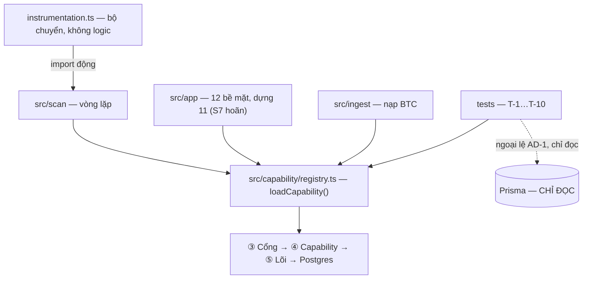
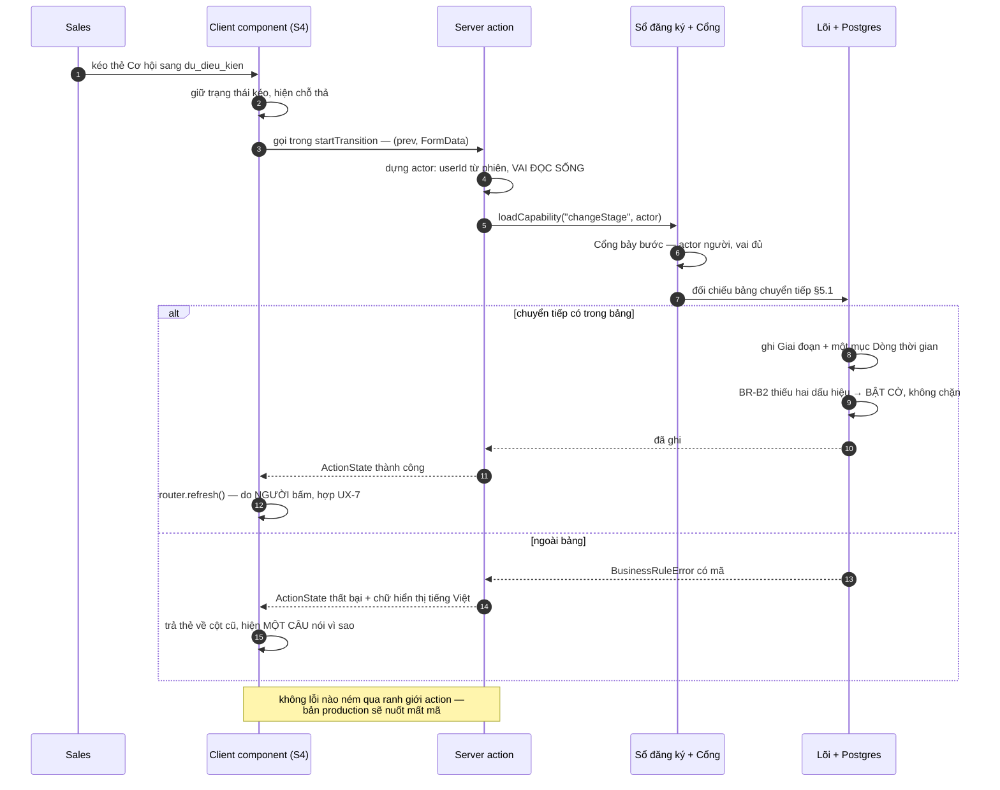
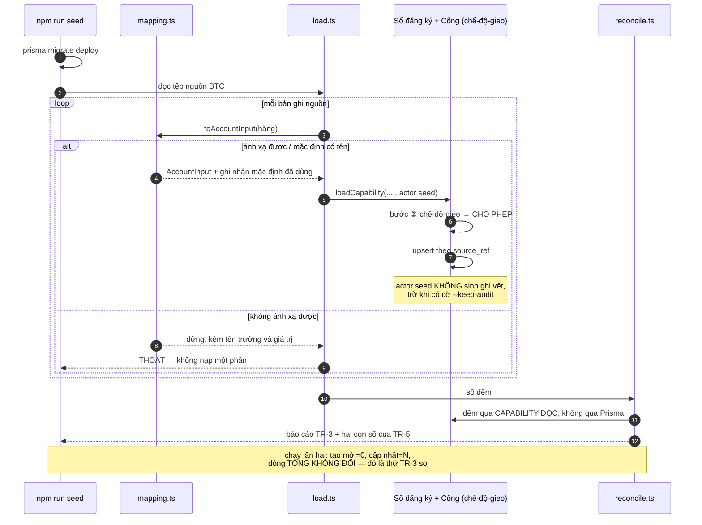
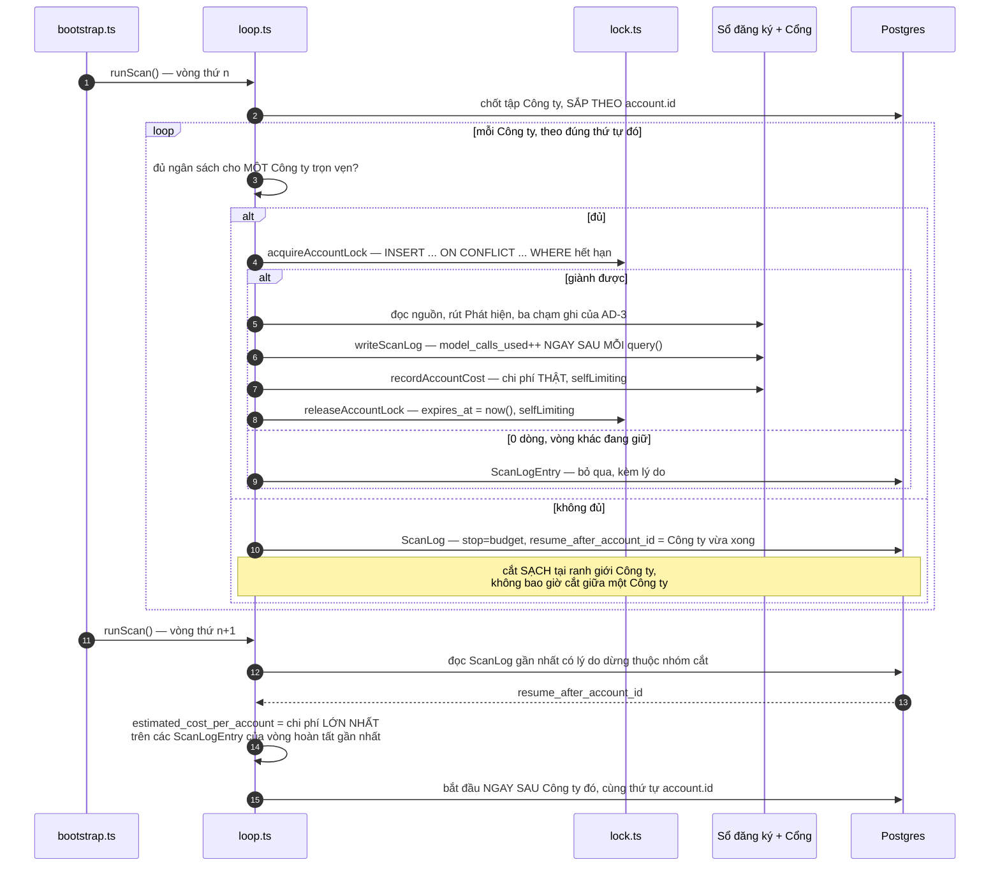

# Architecture Spine — Tầng ① Tương tác

## Design Paradigm

**Ba hình thái, một điểm hội tụ.** Tầng này không có một hình thái, nó có ba — và đó là lý do
nó cần spine riêng thay vì vài dòng trong spine cha.

| Nhánh | Hình thái | Mối lo riêng |
|---|---|---|
| `src/app` | vòng đời bản ghi | 12 bề mặt `S0`–`S11`, **thực dựng 11/12** (chỉ `S7` hoãn), chuyển trạng thái kèm duyệt, ma trận vai |
| `src/scan` | **không thuộc hình thái nào** trong bảng Bước 0; chỉ mang bổ ngữ *bị bó thời gian* | idempotent, khoá, con trỏ resume, hạch toán ngân sách. Khai đúng thế còn hơn bịa một hình thái thứ bảy |
| `src/ingest` | thay hệ cũ + nền tảng dữ liệu | ánh xạ lược đồ, đối soát, chạy lại không đổi kết quả |

Ba nhánh **không dùng chung module nào**. Điểm hội tụ duy nhất của chúng là
`loadCapability()` — cùng một hàm, cùng một actor tường minh, cùng một Cổng.



Mũi tên nào **không** có ở sơ đồ cũng là luật: `src/app` không trỏ `src/scan`, `tests` không
trỏ `src/ingest`, và không có nút nào tên `src/shared`.

## Inherited Invariants

`AD-1`…`AD-22` của spine cha là **ràng buộc read-only**. Bảng dưới chỉ nói mỗi cái **buộc gì ở
tầng này** — không diễn giải lại, không nới.

| Inherited | Buộc gì trong phạm vi này |
|---|---|
| `AD-1` | `src/app` không nhập `@prisma/client` và không nhập `src/core`, **kể cả để đọc**. `tests/` được đọc thẳng Prisma — **chỉ đọc**. Danh sách cho phép quét **toàn repo**, gồm cả `instrumentation.ts` ở gốc |
| `AD-2` | Thêm bề mặt mới thì thêm capability **đọc** vào khối `CAP_HUMAN_ONLY`; **hạng ghi** của `CAP_MACHINE_ALLOWED` giữ đúng **sáu** (`createArticle` · `createSignal` · `queueSuggestion` · `appendTimelineEntry` · `setNextAction` · `disableAi`), nếu không `T-10` đỏ. Hạng **đọc-chung** mở nhưng không mục nào có đường ghi. `CAP_SYSTEM_INTERNAL` gồm **năm** mục: `writeScanLog` · `acquireAccountLock` · `releaseAccountLock` · `recordAccountCost` · `readUserForAuth` |
| `AD-3` | `src/scan` chỉ có ba chạm ghi vào Hồ sơ chính thức. Không có chạm thứ tư, kể cả "cũng tiện" |
| `AD-4` | Chế-độ-gieo là tham số dựng của **sổ đăng ký**, không phải của Cổng: `createRegistry({ seedMode, auditSink }) → { loadCapability }`. `gate.ts` xuất hàm thuần `decide` cùng các kiểu `GateEntry`/`GateContext`/`GateDecision` — **không** nhà máy, **không** thể hiện, **không** kiểu `Gate`; tầng ④ khai `RegistryEntry extends GateEntry`. `src/app` và `instrumentation.ts` **dùng** sổ đăng ký `seedMode=false`, `prisma/seed.ts` dựng với `true`, `tests/` dựng hai thực thể độc lập. Bước ⑥ và ⑦ bỏ qua với `selfLimiting: true` — **đúng năm** mục, trường **bắt buộc**, không `?:` |
| `AD-5` | Mọi lời gọi từ tầng này truyền `actor` làm tham số đầu, kiểu `{ kind:'human', userId, role } \| { kind:'system' } \| { kind:'seed' }` với `role: 'sales' \| 'admin'` — **từ vựng đóng hai giá trị**, không `vai`, không `quan_tri`. Không session, không biến toàn cục, không `AsyncLocalStorage` |
| `AD-6`, `AD-7`, `AD-8`, `AD-22` | Tầng này **không chạm** lời nhắc, lược đồ, hay ranh giới ra biên. `src/scan` gọi `src/agent`, không cấu hình nó |
| `AD-9` | `src/app` lấy mọi số đo qua capability `readMetrics`; không truy vấn tự chế, không nhập `src/core/metrics.ts` |
| `AD-10` | Mọi ghi của `src/scan` là kiểm-và-ghi nguyên tử; 0 dòng thì **bỏ lượt ghi**, không thử lại |
| `AD-11` | Năm điều kiện dừng, ba `subtype` SDK ánh xạ về chúng, giới hạn nằm trong bảng `settings`, đơn vị công việc là **một Công ty trọn vẹn**. `model_calls_used` đếm ở **hạt lệnh gọi** — tăng ngay sau mỗi `query()` — và **chủ cài đặt là `src/scan/loop.ts`**, tức tầng này (`AD-UI-21`) |
| `AD-12` | Tập Công ty chốt lúc vòng bắt đầu; điểm vào là `instrumentation.ts` `register()` chặn ở `NEXT_RUNTIME`; khoá là **hàng trong bảng**, lease 10 phút; *"vòng đang chạy"* **suy từ khoá** |
| `AD-13` | Ontology phải có mặt trong bản đã build qua `outputFileTracingIncludes`. Thứ tự phân xử khi tài liệu chọi nhau |
| `AD-14` | Không câu `DELETE` nào; lọc `deleted_at IS NULL` ở một chỗ trong `src/core`; giờ lưu UTC, đổi múi giờ **chỉ ở tầng trình bày** — tức trong `src/app` |
| `AD-15` | **Đúng ba tệp** đọc `process.env`: `src/config.ts` · `instrumentation.ts` (đúng một biến `NEXT_RUNTIME`) · `prisma.config.ts` (`DATABASE_URL`, do Prisma 7 ép). Phép kiểm quét toàn repo |
| `AD-16` | `src/scan` không tự dựng khoá cache; nó nằm dưới tầng capability |
| `AD-17` | `src/ingest/mapping.ts` là **nơi duy nhất** biết tên trường nguồn |
| `AD-18` | `src/ingest` gỡ thẻ và quyết định *đọc được*, **không bao giờ** chạm khoảng trắng hay Unicode. Cấm `.replace(/\s+/` và `.normalize(` trong `src/ingest` |
| `AD-19` | Sổ đăng ký phủ **cả đọc lẫn ghi**, mọi actor — nên mọi bề mặt lấy dữ liệu bằng capability đọc |
| `AD-20` | `src/ingest` chạy dưới actor `seed`, bỏ qua vị từ chỉ có nghĩa lúc vận hành, **không sinh ghi vết** trừ khi có cờ `--keep-audit` |
| `AD-21` | Hệ quả dây chuyền là việc của sổ đăng ký. Tầng này **không tự xâu chuỗi** hai lời gọi để mô phỏng nó |
| Quy ước cha | Nhật ký ghi vào **bảng**, không ghi ra tệp (`T-8` đòi truy vấn được) · kiểm thử đặt tên `tests/T-<n>.test.ts`, `describe('T-<n> …')` + `it('Scenario: …')` (`NFR-13`) · lõi **không chứa chuỗi hiển thị** |
| Stack cha | Next.js 16.3.1 · React 19.2.8 · TypeScript ~5.9 · Node 24.19.0 · Prisma 7.9.1 · Vitest 4.1.10. Ứng dụng chạy **trên host** bằng `next start`, chỉ Postgres trong compose |

---

## Invariants & Rules

### AD-UI-1 — `instrumentation.ts` là bộ chuyển, không phải nơi chứa logic

- **Binds:** `instrumentation.ts`, `src/scan/bootstrap.ts`, `AD-12`, `AD-15`
- **Prevents:** lịch trình vòng quét nằm ở tệp duy nhất mà lint theo thư mục không với tới và `tests/` không nạp được nếu không khởi động luôn vòng lặp
- **Rule:** `instrumentation.ts` làm đúng ba việc và **không có việc thứ tư**: chặn
  `process.env.NEXT_RUNTIME !== 'nodejs'`, kiểm cờ singleton mức module, rồi
  `await import('./src/scan/bootstrap')`.

  Import phải **động**. Import tĩnh nạp cả cây `src/scan` trong edge runtime **trước khi** dòng
  chặn kịp chạy — cờ chặn khi đó chỉ ngăn việc *khởi động*, không ngăn việc *nạp*.

  **Nhưng nhập động KHÔNG làm tệp thành tuỳ chọn — đã đo 14/08.** Turbopack phân giải
  `await import()` **lúc build**: thiếu `src/scan/bootstrap.ts` thì `next build` đỏ ngay với
  `Module not found`, chứ không phải đỏ lúc chạy. Nhập động tránh việc *nạp*, không tránh việc
  *phân giải*. Nên tệp đó phải tồn tại từ đầu, dù rỗng.

  Mọi thứ khác — chu kỳ, lịch, khôi phục khoá cũ, xử lý tín hiệu dừng — sống ở
  `src/scan/bootstrap.ts`, nơi lint và kiểm thử với tới được.

### AD-UI-2 — Ba nhánh không dùng chung module; không có `src/shared`

- **Binds:** `src/app`, `src/scan`, `src/ingest`, `AD-5`
- **Prevents:** một hàm bọc chung `callCapability` ra đời, kéo theo việc hợp nhất cách xử lỗi của hai nhánh vốn phải xử khác nhau — rồi một helper actor ngầm hạ cánh cạnh nó
- **Rule:** `src/app`, `src/scan`, `src/ingest` **không nhập lẫn nhau** và **không có module dùng
  chung**. Thư mục `src/shared` (hay `src/lib`, `src/utils` dùng chung ba nhánh) **không được tạo**.

  Bề mặt chung duy nhất là `loadCapability()` của `src/capability`.

  Lý do không bọc chung, phát biểu để không ai "dọn dẹp" nó về sau: hai nhánh xử `GateDenied`
  khác nhau **một cách có lý** — `src/app` đổi nó thành chữ hiển thị tiếng Việt, `src/scan` đổi
  nó thành một dòng nhật ký cộng bộ đếm `max_consecutive_denials` (`AD-11`). Một hàm bọc chung
  hoặc rò HTTP vào vòng quét, hoặc rò bộ đếm từ chối vào web.

### AD-UI-3 — `tests` và `src/ingest` gieo bằng hai đường, hội tụ ở tầng capability

- **Binds:** `tests/factory.ts`, `src/ingest`, `AD-20`, `Q15`, `T-1`…`T-10`
- **Prevents:** cả bộ kiểm thử phụ thuộc câu chặn duy nhất của dự án, tức mười điểm `T` không viết được trước sáng 15/08
- **Rule:** `tests/factory.ts` dựng dữ liệu nền bằng cách gọi **thẳng capability** với
  `actor.kind === 'seed'` qua Cổng dựng ở chế-độ-gieo. Nó **không bao giờ** nhập `src/ingest`,
  và `tests` **không bao giờ** chạy `npm run seed`.

  `src/ingest` đi đường riêng: tệp BTC → `mapping.ts` → cùng bộ capability đó.

  Hai đường hội tụ **ở tầng capability, không ở trên nó**. Cái giá — hai chỗ biết cách dựng một
  Công ty hợp lệ — là có thật và được chấp nhận, vì hai chỗ đó dựng hai thứ khác nhau: `ingest`
  dựng bộ dữ liệu BTC đầy đủ, `factory` dựng ca kiểm thử tối thiểu.

### AD-UI-4 — Fluent UI v9 dùng thẳng; một tệp registry, flush đúng một lần

- **Binds:** `src/app/layout.tsx`, `src/app/providers.tsx`, `next.config.ts`, toàn bộ `S0`–`S11`
- **Prevents:** stylesheet bị nhân bản khi trang stream nhiều chunk — lỗi chỉ lộ ở trang lớn, tức qua mắt lúc thử rồi vỡ đúng lúc chấm; và `next build` thất bại vì một khối `webpack` không cần thiết
- **Rule — dùng thư viện thật, không dựng cầu:** `@fluentui/react-components` nhập theo module
  như mọi phụ thuộc khác. **Không** viết tệp nối cho `_ds_bundle.js`.

  Đây là chỗ mục `Deferred` của cha (*"nối bộ component Claude Design vào React 19"*) được
  **giải tán** chứ không phải được giải: `DESIGN.md` viết lại ngày 14/08 đã chốt Fluent UI v9 và
  hạ nguyên mẫu Claude Design xuống mức *"chỉ còn giá trị tham khảo về luồng, không còn về thị
  giác"*. Cầu nối một bundle IIFE biên dịch cho React 18 toàn cục là công dựng cho một thứ đã
  hết vai trò.

- **Rule — registry Griffel, đúng một tệp:** một tệp `'use client'` gom `createDOMRenderer`,
  `RendererProvider`, `renderToStyleElements` qua `useServerInsertedHTML`, và `FluentProvider`
  bọc bên trong nó. Đặt quanh phần thân trong `app/layout.tsx`, **không** bọc thẻ `html`.

  **Cờ flush-một-lần là bắt buộc, không phải tối ưu.** `renderToStyleElements()` trả về **toàn
  bộ** CSS đã thu thập ở **mỗi** lần gọi, còn Next gọi callback một lần cho **mỗi** lần flush
  stream. Thiếu cờ thì toàn bộ stylesheet nhân bản vào thân trang và bản cũ ghi đè style sau khi
  điều hướng phía client.

- **Rule — không khối `webpack` nào trong `next.config.ts`:** Next 16 mặc định Turbopack cho cả
  `dev` lẫn `build`, và một cấu hình webpack tuỳ biến làm `next build` **thất bại**. Griffel chạy
  đủ ở runtime; `@griffel/webpack-loader` chỉ là tối ưu lúc build và **không được dùng**.
  `outputFileTracingIncludes` mà `AD-13` đòi là khoá cấu hình Next thường, không phải khối
  webpack — nó an toàn.

### AD-UI-5 — `page.tsx` và `layout.tsx` là server component, và là nơi duy nhất gọi `loadCapability`

- **Binds:** toàn bộ `src/app`, `AD-1`, `AD-19`, `UX-1`
- **Prevents:** một nửa số bề mặt lấy dữ liệu bằng server component, nửa kia bằng route handler cộng fetch phía client — hai đường đọc, hai chỗ dựng actor, hai chỗ quên nó
- **Rule:** trong `src/app`, **chỉ** `page.tsx` và `layout.tsx` được gọi `loadCapability()`. Chúng
  luôn là server component (`async` khi cần). Mọi tệp mang `'use client'` **nhận dữ liệu qua
  props đã tuần tự hoá** và chỉ ghi qua server action (`AD-UI-6`).

  Fluent v9 **không ship directive `'use client'`** — kiểm bằng bundle đã publish — nên mọi
  component Fluent phải nằm trong một tệp `'use client'` của đội.

  Điều làm luật này khả thi thay vì phải kéo cả cây thành client: ranh giới `'use client'` áp cho
  **module graph**, **không** áp cho server component truyền vào qua slot con hay qua prop —
  chúng vẫn render ở server rồi đi xuống dưới dạng đầu ra đã render.

  Phương án đã loại: route handler cộng fetch phía client. Mỗi lần đọc phải dựng thêm một
  endpoint HTTP **bên cạnh** capability đọc, tức nhân đôi bề mặt và thêm một chỗ quên truyền
  actor; và `UX-1` (≤10 giây tới câu trả lời) dễ đạt hơn khi trang đã render sẵn ở server.

  | Loại bề mặt | Bề mặt | Hình dạng |
  |---|---|---|
  | Đọc thuần | `S6` `S9` `S10` | server component đọc, lá Fluent hiển thị |
  | Đọc + ghi | `S1` `S2` `S3` `S5` `S8` | server component đọc, server action ghi |
  | Kéo thả | `S4` | client component giữ trạng thái kéo, server action chốt |
  | Khung | `S0` | layout server component đọc cờ AI, dải báo là lá client |
  | Ngoài phiên | `S11` | server action đăng nhập, không đọc gì **ngoài** `readUserForAuth` (`AD-UI-10`) trước khi có phiên |

- **Rule — không bề mặt nào được render tĩnh:** mọi `page.tsx` và `layout.tsx` của tầng này render
  **động mỗi lượt yêu cầu**. Điều này đến miễn phí vì `_session.ts` đọc cookie, và đọc cookie ép
  Next render động — nhưng nó phải được **phát biểu**, vì `T-9` treo vào đó: nếu khung `S0` bị
  cache tĩnh, dải báo *"phần AI đang tắt"* sẽ không bao giờ đổi sau khi Quản trị bấm phanh, và
  `T-9` đỏ với triệu chứng trỏ sang vòng quét thay vì sang tầng render.

  Hệ quả cưỡng chế: không `page.tsx`/`layout.tsx` nào khai `revalidate` hay dùng `'use cache'`.

### AD-UI-6 — Chữ ký server action là một; không lỗi nào băng qua ranh giới bằng cách ném

- **Binds:** mọi thao tác ghi từ `src/app`, `NFR-11`, `AD-5`, `AD-21`
- **Prevents:** một thiết kế lỗi chạy đúng dưới `npm run dev` rồi câm lặng ở bản production — chính bản mà `NFR-11` bắt dùng và giám khảo sẽ chạy
- **Rule — chữ ký:** mọi server action mang đúng chữ ký
  `(prev: ActionState, form: FormData) => Promise<ActionState>`, dùng với `useActionState` của
  React 19 (nằm ở package `react`, trả tuple **ba** phần tử; `useFormState` của React 18 đã bị
  thay tên và deprecate).

  `ActionState` là union phân biệt được: thành công, hoặc thất bại mang **mã** và **chữ hiển thị**.
  Nó khai ở **`src/app/_contract.ts`** — và **không tệp nào khác được khai lại nó**. Tệp đó là
  **tệp đầu tiên được viết**, trước bất kỳ bề mặt nào. Không có dòng này thì hai người dựng hai bề
  mặt sẽ khai hai `ActionState` hơi khác nhau, và cái sai chỉ lộ khi một lá hiển thị lỗi dùng
  chung phải nhận cả hai.

- **Rule — không ném, và cưỡng chế được:** mọi server action bọc thân hàm trong `try/catch` và
  **trả về** kết quả. Lỗi **mong đợi** — `GateDenied`, `BusinessRuleError` — không bao giờ được
  ném qua ranh giới.

  Lý do là một cái bẫy chỉ hiện ở bản production: Next nuốt thông điệp của lỗi chưa bắt trong
  server action và trả một câu chung kèm `digest`, nên mọi thiết kế dựa vào việc bắt lỗi **có mã**
  ở phía client sẽ đúng dưới `dev` và mất mã lúc chấm. Ném chỉ dành cho lỗi **bất ngờ**, và khi
  đó nó đúng là việc của error boundary.

  **Một luật không có dòng cưỡng chế thì không phải bất biến, chỉ là nguyện vọng** — nên nó có
  dòng cưỡng chế: mọi server action đi qua **đúng một helper `action(fn)`** khai ở
  `src/app/_contract.ts`, và helper đó là chỗ duy nhất có `try/catch`. Một phép kiểm quét
  `src/app/**` khẳng định **không tệp nào** khai `'use server'` mà không nhập `action`. Dev nhớ
  hay quên không còn là biến số.

- **Rule — một action, một capability:** một server action gọi **đúng một** `loadCapability()`.
  Ghi kèm theo là việc của `cascades` trong sổ đăng ký (`AD-21`), không phải việc xâu hai lời
  gọi trong action. Actor dựng **trong chính action** từ `userId` của phiên (`AD-UI-10`).

  Server action là một endpoint POST công khai; chặn lúc render **không phải** ranh giới bảo
  mật. Không action nào bỏ qua `loadCapability` vì "màn hình này chỉ Quản trị mới vào được".

### AD-UI-7 — Ánh xạ lỗi hai chặng, một tệp; HTTP chỉ tồn tại ở route handler

- **Binds:** `src/app`, quy ước lỗi của cha, `NFR-14`…`NFR-17`, `NFR-19`
- **Prevents:** ba người viết ba câu tiếng Việt khác nhau cho cùng một mã `BR-D`, và chữ hiển thị rò xuống lõi
- **Rule:** đúng một tệp trong `src/app` giữ **hai bảng**, và nó là nơi duy nhất trong repo dịch
  mã lỗi sang chữ người đọc:

  ```
  chặng 1   mã lõi (BR-D*, GateDenied.reason)  →  mã giao diện
  chặng 2   mã giao diện                        →  chữ hiển thị tiếng Việt
  ```

  Cha nói *"web đổi thành HTTP"* mà không nói đổi thế nào. Đổi thế này:

  | Lý do từ chối của Cổng | Mã giao diện | HTTP (chỉ route handler) |
  |---|---|---|
  | `unknown_capability` | `loi_he_thong` | 500 |
  | `actor_not_allowed`, `boundary` | `khong_duoc_phep` | 403 |
  | `role` | `khong_du_quyen` | 403 |
  | `limit`, `brake` | `ai_dang_tat` | 409 |
  | `BusinessRuleError(BR-D*)` | mã `BR-D` giữ nguyên | 422 |

  **HTTP status không tồn tại ở server action** — action trả `ActionState`, không trả mã HTTP.
  Cột HTTP chỉ có nghĩa cho route handler, nếu tầng này sinh ra cái nào.

  Chữ hiển thị theo giọng của `EXPERIENCE.md`: nói **việc phải làm**, không nói mã lỗi. Lõi
  không chứa chuỗi hiển thị nào — đó là quy ước cha, và bảng này là chỗ nó được giữ.

### AD-UI-8 — Khối hỏng độc lập thì tải độc lập; rỗng không bao giờ dùng chung component với đang tải

- **Binds:** `S1`, `S2`, `S3`, `S8`, Mẫu trạng thái của `EXPERIENCE.md`
- **Prevents:** Timeline chậm chặn cả hồ sơ, một khối hỏng đổ cả trang, và màn hình báo *"chưa có account nào"* trong lúc dữ liệu còn đang về
- **Rule:** bề mặt có nhiều khối hỏng độc lập được — `S1` bốn khối, `S3` bốn khối — ghép bằng các
  ranh giới `Suspense` **anh em**, mỗi khối một `error.tsx` riêng. **Không** một lần `await` ở
  mức trang.

  Trạng thái **rỗng** chỉ tới được **sau** một lượt đọc thành công trả về 0 dòng. Nó không bao
  giờ là cùng một component với trạng thái **đang tải**, và không bao giờ là giá trị mặc định
  trước khi đọc.

  Khung xương lúc tải giữ **đúng số dòng của lần trước** để trang không nhảy (`EXPERIENCE.md`,
  và `UX-4` đòi phản hồi thấy được trong 200 ms).

### AD-UI-9 — Vòng quét không bao giờ làm mới giao diện; người bấm mới nạp

- **Binds:** `UX-7`, `src/scan`, `src/app`, `FR-37`
- **Prevents:** chu kỳ demo 60 giây bảo đảm một vòng quét chạy đúng lúc giám khảo đang bấm, và trang tự nhảy ngay giữa thao tác của họ
- **Rule:** `src/scan` **không bao giờ** gọi `revalidatePath`, `revalidateTag`, hay bất kỳ API
  làm mới nào của Next. `src/app` chỉ làm mới **sau một thao tác của người** — `router.refresh()`
  sau khi một server action trả về thành công.

  Dữ liệu mới do vòng quét sinh ra được báo bằng **một dải bấm được**; nội dung đang mở **không**
  bị thay.

  **Dải đó hiện số Gợi ý đang chờ tại thời điểm render server — một con số tuyệt đối, không phải
  một delta.** Mốc *"người này đã xem tới đâu"* **nằm ngoài phạm vi kỳ thi**, nói thẳng ở đây vì
  im lặng sẽ khiến một người dựng nó theo nghĩa delta rồi đi tìm một cột không tồn tại. Hệ quả
  chấp nhận có ý thức: con số chỉ đổi khi trang render lại, tức sau một thao tác của người —
  đúng cái giá của `UX-7`, và là cái giá rẻ hơn việc trang tự nhảy giữa lúc giám khảo đang bấm.

  Phương án đã loại: polling hoặc SSE tự nạp lại. Cả hai thoả *"dữ liệu tươi"* rồi vi phạm
  `UX-7`, mà `EXPERIENCE.md` gọi đúng nó là *"ngưỡng dễ bỏ nhất và đắt nhất"*.

  Ghi kèm để không ai chép mẫu cũ: ở Next 16 `revalidateTag` **bắt buộc** tham số thứ hai; dạng
  một tham số đã deprecate và lỗi biên dịch.

### AD-UI-10 — `role` đọc sống từ cơ sở dữ liệu qua `readUserForAuth`; màn 403 là kết quả từ chối của Cổng

- **Binds:** PRD §6, `D28`, `S8`, `TR-2`, `AD-5`
- **Prevents:** một phiên cũ mang vai cũ sau khi gieo lại dữ liệu, và một phép kiểm vai ở client chạy **song song** với Cổng thay vì nằm **trên** đường đi
- **Rule — vai:** cookie phiên mang **chỉ `userId`**. `role` đọc từ cơ sở dữ liệu **mỗi lượt yêu
  cầu**, khi dựng `actor`. Trường là `role`, từ vựng đóng `'sales' | 'admin'` (`AD-5`) — **không**
  `vai`, **không** `quan_tri`. Ba cách viết cho một khái niệm làm bước ⑤ từ chối Quản trị đúng lúc
  bấm Tắt AI, và `T-9` đỏ vì một lỗi chính tả.

- **Rule — con gà và quả trứng, giải bằng đúng một lối:** dựng `actor` người cần `role`
  (`AD-5` khai `role` là trường bắt buộc), mà đọc `role` lại là một lượt đọc — và `AD-19` bắt
  **mọi** lượt đọc đi qua sổ đăng ký. Vòng này **không có đáy** nếu không khai một lối ra.

  Lối ra, và **chỉ một**: capability **`readUserForAuth`** — tên và chỗ đứng do cha chốt ở `AD-2`,
  trong khối `CAP_SYSTEM_INTERNAL` — gọi bằng `actor: { kind: 'system' }`. Nó là **lời gọi
  capability duy nhất trong repo được phép chạy trước khi `actor` người tồn tại**. Tầng này gọi nó
  ở đúng hai chỗ, cả hai trong `src/app`: `_session.ts` khi dựng `actor` cho mỗi lượt yêu cầu, và
  server action đăng nhập của `S11`. Nên câu *"`S11` không đọc gì trước khi có phiên"* ở bảng của
  `AD-UI-5` đọc là *"không đọc gì **ngoài** lối này"*.

  Tên cũ mà bản trước của tầng này dùng — `readActorIdentity` — **đã bỏ**: `T-10` khẳng định sổ
  đăng ký **theo tên**, nên tên là hợp đồng chứ không phải nhãn.

  Va chạm cũ với bước ⑦ của Cổng **đã được cha đóng**: `readUserForAuth` mang `selfLimiting: true`
  (`AD-4`, một trong **năm** mục), nên nó chạy được **sau** khi phanh tắt và **sau** khi trần chạm.
  Không có cờ đó thì bấm Tắt AI là không ai đăng nhập được và `T-9` cùng `T-1` đỏ một lượt, với
  triệu chứng trỏ sang vòng quét thay vì sang phiên đăng nhập.

  Đây là câu trả lời cho *"vai đổi thì sao"* mà cha để ngoài phạm vi: vai chỉ đổi bằng cách gieo
  lại dữ liệu (`TR-2`, không có màn hình quản lý tài khoản), và đọc vai sống làm cho một phiên
  mở từ trước lần gieo lại **không thể** mang vai cũ. Nhét vai vào cookie hay JWT thì giám khảo
  gieo lại giữa buổi demo sẽ giữ nguyên vai cũ và không có gì phát hiện.

- **Rule — cưỡng chế:** bề mặt chỉ-Quản-trị (`S8`) render qua một server component mà **hành
  động đầu tiên** là lời gọi capability sẽ bị Cổng từ chối với lý do `role`. Màn 403 là **kết
  quả** của lần từ chối đó, không phải sản phẩm của một phép kiểm vai riêng.

  Nhờ vậy `D28` (*"chặn ở tầng nghiệp vụ, không phải ẩn menu"*) nằm **trên chính đường đi**,
  không nằm song song với nó. Ẩn mục menu vẫn làm — nhưng nó là thẩm mỹ, và một phép kiểm khẳng
  định vào thẳng địa chỉ `S8` bằng phiên Sales vẫn nhận 403.

  Toàn bộ khác biệt Sales/Quản trị là **bốn** hành động (PRD §6): mở lại Cơ hội đã đóng · xem
  màn hình đo lường · chỉnh tham số vận hành · tắt/bật AI. Mọi khác biệt khác chỉ là hiển thị,
  nên tầng này cần **đúng một** điểm kiểm quyền, và nó đã có sẵn ở bước ⑤ của Cổng.

### AD-UI-11 — `runScan()` có một kiểu trả về; lỗi một Công ty không kết thúc vòng

- **Binds:** `src/scan/loop.ts`, `AD-11`, `FR-39`, `NFR-1`
- **Prevents:** năm điều kiện dừng được biểu diễn ba kiểu khác nhau ở ba chỗ; và một Công ty hỏng kéo sập cả vòng, làm `T-8` đỏ vì một nguồn không đọc được
- **Rule — một kiểu trả về:** `runScan()` trả về đúng một union
  `{ stop, processed, total, cursor }`. Năm điều kiện dừng của `AD-11` và ba `subtype` của SDK
  quy về **một hàm `classifyStop()` duy nhất** — đó là nơi duy nhất trong repo biết cách đọc
  `subtype`.

- **Rule — hai loại lỗi, đừng trộn:**

  | Loại | Quy được về | Vòng quét làm gì |
  |---|---|---|
  | Lỗi của một Công ty — nguồn không đọc được, mô hình trả rỗng, lược đồ hỏng | đúng một Công ty | ghi một dòng `ScanLogEntry` kèm lý do, **đi tiếp** Công ty sau |
  | Lỗi không phục hồi — xác thực, cơ sở dữ liệu, hạch toán ngân sách | không Công ty nào | điều kiện dừng 5: kết thúc vòng, **không** dồn hàng đợi |

  **Không thử lại ở mức ứng dụng.** Lần thử lại duy nhất trong hệ là lần SDK tự thử lại structured
  output. Đây là chỗ mục `Deferred` *"chiến lược thử lại"* của cha được đóng: `NFR-1` cấm dồn hàng
  đợi, và thử lại trong vòng tiêu trần 20 lệnh gọi của `NFR-2` cho một Công ty đang hỏng.

### AD-UI-12 — Con trỏ resume nằm trên dòng Nhật ký, và tập Công ty sắp theo toàn thứ tự ổn định

- **Binds:** `src/scan/loop.ts`, `AD-11` điều kiện 3, `AD-12`, `AD-15`, `FR-39`
- **Prevents:** con trỏ resume xuất hiện trên màn hình Quản trị như một tham số nghiệp vụ; và con trỏ trỏ vào chỗ sai vì thứ tự duyệt đổi giữa chừng
- **Rule — chỗ lưu:** con trỏ là **một cột trên chính dòng `ScanLog` của vòng bị cắt**
  (`resume_after_account_id`). Vòng kế đọc dòng `ScanLog` gần nhất có lý do dừng thuộc nhóm cắt
  giữa chừng và bắt đầu **ngay sau** Công ty đó.

  Phương án đã loại: một hàng trong bảng `settings`. Theo `AD-15` và `D38`, `settings` là tham số
  **nghiệp vụ** mà Quản trị sửa được lúc chạy — con trỏ resume không phải tham số nghiệp vụ và
  không bao giờ được hiện trên màn hình đó. `FR-39` vốn đã đòi một dòng `ScanLog` cho vòng không
  trọn kèm *số Công ty đã quét trên tổng*; con trỏ **là chính sự thật đó**, không phải một sự thật
  thứ hai.

- **Rule — thứ tự:** tập Công ty đã chốt luôn sắp theo một **toàn thứ tự ổn định** (`account.id`),
  **không bao giờ** theo `updated_at` hay bất cứ cột nào vòng quét tự ghi vào. Vòng quét ghi lên
  chính các hàng nó đang duyệt, nên sắp theo cột bị ghi sẽ xáo lại thứ tự giữa chừng và con trỏ
  trỏ vào một chỗ khác hẳn.

### AD-UI-13 — Khoá đi qua capability; giành khoá là một câu ghi có điều kiện

- **Binds:** `src/scan/lock.ts`, `AD-1`, `AD-12`, `AD-19`, `FR-38`
- **Prevents:** `src/scan` chứa SQL — điều `AD-1` cấm thẳng — hoặc khoá được giành bằng đọc-rồi-ghi, tức đúng cuộc đua mà nó sinh ra để chặn
- **Rule — chỗ ở:** dùng **đúng hai capability mà cha đã khai** trong `CAP_SYSTEM_INTERNAL` —
  `acquireAccountLock` và `releaseAccountLock`. **Không thêm capability khoá thứ ba.**

  Cha viết *"ba khối gộp lại là một danh sách đóng mà `tests/T-10.test.ts` khẳng định **từng phần
  tử**"* — nên một `renewAccountLock` mới sẽ làm `T-10` đỏ, kể cả khi con số **sáu** của hạng ghi
  `CAP_MACHINE_ALLOWED` không đổi. Gia hạn vì thế **không phải** thao tác riêng: nó là
  `acquireAccountLock` gọi lại với **cùng `process_id`**.

  `releaseAccountLock` mang `selfLimiting: true` (`AD-4`), nên nó nhả được khoá **sau** khi trần
  ngân sách hay trần lượt đã chạm. Đó chính là bug *khoá không nhả → `AD-12` suy "vòng đang chạy"
  từ khoá còn sống → ở nhịp 60 giây là 10 vòng liên tiếp bị bỏ*. `acquireAccountLock` **không**
  mang cờ đó, và đúng như vậy: giành khoá cho một Công ty mới sau khi trần chạm là việc không nên
  xảy ra.

  `src/scan/lock.ts` chỉ **xâu chuỗi** hai lời gọi đó và **không chứa một dòng SQL nào** —
  bắt buộc, vì `AD-1` cấm `src/scan` nhập `@prisma/client`.

- **Rule — cách giành, và cùng câu đó gia hạn:** một câu ghi có điều kiện duy nhất, rồi kiểm số
  dòng ảnh hưởng:

  ```sql
  INSERT INTO account_lock (account_id, process_id, expires_at)
  VALUES (?, ?, now() + interval '10 minutes')
  ON CONFLICT (account_id) DO UPDATE
    SET process_id = EXCLUDED.process_id, expires_at = EXCLUDED.expires_at
    WHERE account_lock.expires_at < now()
       OR account_lock.process_id = EXCLUDED.process_id
  ```

  Vế `OR` là thứ biến *giành* thành *gia hạn* mà không cần capability thứ ba: tiến trình đang giữ
  khoá luôn khớp chính nó.

  0 dòng nghĩa là Công ty đang bị **vòng khác** giữ — **bỏ qua Công ty đó**, ghi một dòng
  `ScanLogEntry`, đi tiếp. Cùng kỷ luật kiểm-và-ghi của `AD-10`, chỉ khác bảng.

  Gia hạn ở **mỗi ranh giới Công ty**. Nhả khoá là đặt `expires_at = now()`, **không** `DELETE`
  — `AD-12` đã nói hàng hết hạn coi như không có khoá.

  Hai điều kiện lược đồ, không tự đến: `account_lock.account_id` phải có **ràng buộc unique**
  (không có thì `ON CONFLICT (account_id)` là lỗi cú pháp lúc chạy), và trong `SET` **không** được
  viết `account_lock.<cột>` — chỉ trong `WHERE` mới được.

### AD-UI-14 — Nhật ký hai bảng; chi phí mỗi Công ty suy từ đó, không lưu trong `settings`

- **Binds:** `FR-39`, `T-8`, `AD-11`, `AD-2`
- **Prevents:** dòng tổng hợp 10 vòng nằm ở bảng khác nên `T-8` phải ghép hai truy vấn; và một capability thứ mười ra đời chỉ để ghi một con số ước lượng
- **Rule — hai bảng:** `ScanLog` một dòng **mỗi vòng**; `ScanLogEntry` một dòng **mỗi Công ty
  trong vòng** (gồm chi phí thật, số Phát hiện, lỗi nếu có).

  Dòng `ScanLog` mang thêm **ba cột mà Cổng đọc**: `model_calls_used` (bộ đếm hạt lệnh-gọi của
  `AD-UI-21`), `budget_usd` (mẫu số của `budgetUsedRatio`), và **`cost_used_usd` (tử số)**. Cả ba
  nằm trên **cùng một hàng** để `collectGateContext` của tầng ④ lấy tử số và mẫu số bằng một lượt
  đọc, không phải hai nguồn có thể lệch nhau.

  **`cost_used_usd` có người ghi, khai ở đây vì không khai thì không ai ghi:** `src/scan/loop.ts`
  cộng dồn `costUsd` do `extractSignals` trả về (`AD-AG-10`) **ngay sau mỗi `query()`**, cùng lời
  gọi đã tăng `model_calls_used`. `costUsd === null` thì **không cộng `0`** — ghi một dòng
  `ScanLogEntry` mã `FT10`. Thiếu cột này thì `budgetUsedRatio` là `NaN`, bước ⑥ không bao giờ
  chặn, và điều kiện dừng 4 của `AD-11` là đường chết.

  Chi phí thật của một Công ty được ghi qua capability **`recordAccountCost`** (`AD-2`, khối
  `CAP_SYSTEM_INTERNAL`, `selfLimiting: true`) gọi ở **ranh giới Công ty**, ngay trước
  `releaseAccountLock`. Cờ `selfLimiting` là thứ giữ cho mẫu đo ở **Công ty đắt nhất** — đúng Công
  ty làm trần chạm — không bị chính trần đó nuốt mất.

  Dòng tổng hợp mỗi 10 vòng là **một dòng `ScanLog` mang `kind = 'tong_hop'`** trong **cùng
  bảng**, để `T-8` lấy cả *"dòng tổng kết cho từng vòng"* lẫn dòng tổng hợp bằng **một** truy vấn.
  Vòng không trọn mang `kind = 'vong'` và **không** đếm vào chuỗi 10 vòng (`FR-39`).

- **Rule — `estimated_cost_per_account` là một CHẠY-MAX trong bộ nhớ của vòng**, không phải một
  con số chốt lúc mở vòng. Khởi tạo bằng chi phí lớn nhất trên một Công ty của vòng hoàn tất gần
  nhất, hoặc **`0` khi chưa có lịch sử**. Sau **mỗi** `recordAccountCost`, cập nhật
  `max(giá trị hiện tại, chi phí Công ty vừa xong)`. Khi giá trị là `0` thì phép kiểm trước Công
  ty kế tiếp cho qua vô điều kiện.

  Chốt nó lúc mở vòng thì **cả 15 Công ty của vòng đầu chạy vô điều kiện** — vì lịch sử vẫn rỗng
  ở Công ty thứ hai, thứ ba… Mà vòng đầu chính là vòng chạy trước mặt giám khảo, tức luật *đơn vị
  công việc là một Công ty trọn vẹn* mất hiệu lực đúng lúc nó được chấm. Với chạy-max, chỉ **Công
  ty đầu tiên** không được bảo vệ.

  Không lưu nó trong `settings`. Đây là chỗ tầng này **lệch cách đọc mặt chữ của `AD-11`** — nhưng
  lệch đã hẹp lại một nửa sau khi cha thêm `recordAccountCost`: đường **ghi** chi phí thật giờ hợp
  pháp và không đụng hạng ghi sáu mục, nên phần còn lại chỉ là *con số suy ra có phải một hàng
  `settings` hay không*. Xem mục *Xung đột với spine cha* ②.

### AD-UI-15 — `src/ingest` tách ba tệp; chỉ `mapping.ts` phải chờ sáng 15/08

- **Binds:** `src/ingest`, `AD-17`, `Q15`, `TR-1`, `NFR-8`
- **Prevents:** cả nhánh nạp nằm chờ `Q15`, rồi 45 phút đầu giờ thi phải viết cả đọc tệp, đối soát lẫn ánh xạ
- **Rule:** ba tệp, một đường nối cứng:

  | Tệp | Biết gì | Dựng được khi nào |
  |---|---|---|
  | `mapping.ts` | **nơi duy nhất** gọi tên trường nguồn và giá trị enum nguồn (`AD-17`) | **sáng 15/08** |
  | `load.ts` | đọc tệp, lặp, gọi capability với actor `seed`; **không biết** tên trường nguồn | tối 14/08 |
  | `reconcile.ts` | dựng báo cáo `TR-3` từ số đếm | tối 14/08 |

  Đường nối: `mapping.ts` xuất các hàm **thuần** trả về **kiểu đích** — `AccountInput`,
  `ContactInput`, `OpportunityInput`, `SnapshotInput`. Kiểu đích suy ra từ ontology §2 và đã biết
  từ tối nay, nên `load.ts` và `reconcile.ts` dựng xong trước ngày thi và sáng 15/08 chỉ còn
  **một tệp** phải viết.

  **Bốn kiểu đích đó do `src/capability` sở hữu, không do `src/ingest` sở hữu** — chúng chính là
  kiểu tham số của các capability ghi tương ứng. `src/ingest` **nhập** chúng, không khai lại.
  Khai lại là cách chắc chắn nhất để sáng 15/08 có hai định nghĩa lệch nhau một trường, và trình
  biên dịch không bắt được vì hai bên chưa bao giờ gặp nhau trong một tệp.

  Bằng chứng buộc phải nói thẳng: bảng ánh xạ trường của Tomahawk §12 — đường giảm bất định mà
  cha chỉ ra — **không phải** lược đồ BTC. Nó là migration của một base Airtable sang một sản
  phẩm khác, và chỉ ~19% số dòng của nó chạm được mô hình Why Now; riêng `Snapshot` khớp **0**
  trường, vì Airtable không có khái niệm ảnh chụp web. Đọc nó tối nay vẫn đáng — nó cho biết
  **hình dạng** một bản xuất Airtable — nhưng nó **không** rút ngắn được `mapping.ts`.

### AD-UI-16 — Không ép giá trị enum ngầm: ba kết cục có tên

- **Binds:** `src/ingest/mapping.ts`, `TR-5`, `BR-D11`, ontology §8
- **Prevents:** lần nạp đầu tiên hoặc nổ giữa chừng, hoặc âm thầm dồn mọi Cơ hội vào một giai đoạn sai — rồi `T-1` và `T-6` đỏ với triệu chứng trỏ sang chỗ khác
- **Rule:** mỗi trường được ánh xạ khai **đúng một** trong ba kết cục, tường minh trong
  `mapping.ts`:

  | Kết cục | Nghĩa |
  |---|---|
  | ánh xạ được | có giá trị đích tương ứng |
  | mặc định **có tên** | không có giá trị nguồn; dùng một hằng số **được đặt tên và ghi vào báo cáo đối soát** |
  | không ánh xạ được | **dừng lệnh nạp** kèm tên trường và giá trị gây dừng |

  Luật này sinh từ phép đo, không từ nguyên tắc chung: enum trạng thái Cơ hội phía Airtable có
  **năm** giá trị trong khi `stage` của Mục 0 có **bảy** — thiếu hẳn `du_dieu_kien`,
  `thuong_luong`, `tam_dung`; và `account_type` thì chính tài liệu nguồn ghi *"không có ở nguồn,
  để null"*. Nghĩa là ánh xạ enum **chắc chắn** có ô không biết, và nó phải có tên thay vì bị ép.

  `BR-D11` khoá bảy giá trị `stage` — nên mọi hoà giải diễn ra **trong `mapping.ts`**, không bao
  giờ bằng cách thêm giá trị vào enum đích.

  Kết quả đếm của `TR-5` — bao nhiêu Cơ hội đang chạy có ô Việc tiếp theo trống, bao nhiêu có ô
  đã điền nhưng quá hạn — in ra **cùng** báo cáo đối soát, vì đó là lần duy nhất nhìn thấy dữ
  liệu thật trước khi quyết cờ `next_action_overwrite_overdue_manual`.

### AD-UI-17 — Idempotent bằng khoá tự nhiên từ nguồn, không bằng xoá-rồi-chèn

- **Binds:** `§7.5`, `NFR-8`, `TR-4`, `AD-14`, `AD-20`
- **Prevents:** lần nạp thứ hai nhân đôi dữ liệu, hoặc huỷ đúng phần ghi vết mà cờ `--keep-audit` sinh ra để giữ
- **Rule:** mọi thực thể nạp mang `source_ref` **duy nhất**, lấy từ định danh bản ghi nguồn. Nạp
  là **upsert theo `source_ref`**.

  Phương án đã loại: xoá sạch rồi chèn lại. `AD-14` chỉ cho xoá mềm nên "xoá sạch" thật ra là
  đánh dấu hàng loạt, và nó huỷ đúng phần lịch sử mà `TR-4` tồn tại để đối chiếu trước-sau.

  Tên `source_ref` **trung tính có chủ đích**: tài liệu nguồn gọi nó `legacyAirtableId` và đặt
  ngưỡng *"không record nào mất `legacyAirtableId`"* — ý tưởng lấy nguyên, cái tên thì không, vì
  bộ dữ liệu BTC chưa chắc đến từ Airtable.

  Bản ghi nguồn không có định danh ổn định thì **dừng lệnh nạp** — không tự chế khoá từ tên
  Công ty. Tên đổi là sinh bản ghi thứ hai, và `NFR-8` đỏ ở lần chạy thứ hai.

### AD-UI-18 — Báo cáo đối soát đếm qua capability đọc, và dòng `TỔNG` là thứ `TR-3` so

- **Binds:** `TR-3`, `NFR-8`, `AD-1`, `AD-19`
- **Prevents:** báo cáo đối soát đọc thẳng Prisma — con đường tắt hiển nhiên nhất trong cả tầng, và là chỗ `AD-1` dễ bị phá nhất vì "chỉ đếm thôi mà"
- **Rule:** `reconcile.ts` lấy mọi con số **qua capability đọc**, không qua Prisma. Báo cáo in ra
  stdout ở cuối `npm run seed`, mỗi thực thể một dòng:

  ```
  <thực thể>  nguồn=N  tạo mới=A  cập nhật=B  bỏ qua=C (kèm lý do)  TỔNG=T
  ```

  Nghiệm thu *"hai lần chạy cho cùng con số"* của `TR-3` áp lên dòng **`TỔNG`**. Cặp
  *tạo mới / cập nhật* **được phép** khác nhau giữa hai lần chạy — lần một tạo mới hết, lần hai
  cập nhật hết — và một phép kiểm khẳng định đúng điều đó, để không ai "sửa" cho hai lần giống
  hệt nhau bằng cách bỏ upsert.

- **Rule — chỉ đếm thứ do nạp sinh ra:** báo cáo đếm **chỉ** các hàng có `source_ref IS NOT NULL`.
  Công ty do người tạo tay ở `§4`/nhóm 1 **không có** `source_ref`, nên nếu đếm chung thì giám
  khảo bấm tạo một Công ty giữa hai lượt `npm run seed` sẽ làm `TR-3` đỏ — một lỗi không ai
  nghĩ tới vì nó do **người dùng** gây ra chứ không do mã. Một phép kiểm khẳng định dòng `TỔNG`
  không đổi sau khi tạo một Công ty bằng capability làm tay.

### AD-UI-19 — Kiểm thử chạy trên cơ sở dữ liệu riêng, dọn TRƯỚC, chạy nối tiếp

- **Binds:** `tests`, `vitest.config.ts`, `NFR-13`, `NFR-8`, `AD-1`, `AD-15`
- **Prevents:** `npm test` xoá bộ dữ liệu demo mà giám khảo đang nhìn; và lượt chạy thứ hai đỏ vì lượt thứ nhất chết giữa chừng không kịp dọn
- **Rule — cơ sở dữ liệu riêng:** bộ kiểm thử chạy trên một cơ sở dữ liệu **khác** bản demo.
  `npm run seed` dựng đúng bộ dữ liệu giám khảo đang xem; dùng chung nghĩa là một lượt `npm test`
  giữa buổi chấm xoá nó.

- **Rule — dọn trước, không dọn sau, và dọn bằng ĐÚNG đường mà lệnh nộp bài dùng:**
  `globalSetup` của Vitest gọi **Prisma CLI** — `prisma migrate reset --force --skip-seed` —
  **một lần trước mỗi lượt chạy**. Bốn lý do, cả bốn đều là quyết định:

  1. Prisma CLI **không phải** là nhập `@prisma/client`, nên nó không đụng danh sách cho phép
     của `AD-1` và `tests/` giữ nguyên ngoại lệ *chỉ đọc*.
  2. Dọn **trước**: một ca kiểm thử nổ giữa chừng thì không dọn sau được. Dọn trước làm mỗi lượt
     chạy bắt đầu từ trạng thái đã biết **bất kể lượt trước kết thúc thế nào** — đó chính xác là
     điều *"`npm test` chạy hai lần liên tiếp phải vẫn xanh"* đòi hỏi.
  3. `fileParallelism: false`: mười tệp kiểm thử tranh nhau một cơ sở dữ liệu là một lớp bất định
     không cần thiết. Đổi vài giây lấy việc không bao giờ phải đoán vì sao một lượt đỏ.
  4. **`migrate reset`, không `db push`.** `npm run seed` dựng lược đồ bằng `prisma migrate
     deploy` (cha). Nếu bộ kiểm thử dựng lược đồ bằng `db push` — vốn **bỏ qua** thư mục
     migration — thì một migration thiếu, gõ sai, hay chưa commit vẫn cho `npm test` xanh 10/10
     rồi giết `npm run seed` trên máy giám khảo. Bộ kiểm thử phải đi **đúng con đường** mà lệnh
     nộp bài đi, nếu không nó không chứng minh được thứ sẽ được chấm.

- **Rule — `globalSetup` chỉ dựng LƯỢC ĐỒ; cô lập là việc của từng tệp:** mỗi
  `tests/T-<n>.test.ts` mở bằng một `beforeAll` gọi **một tiện ích cắt sạch dùng chung**
  (`tests/reset.ts`, truncate mọi bảng theo thứ tự khoá ngoại), và một **phép kiểm meta** khẳng
  định cả mười tệp đều gọi nó.

  Không có luật này thì `globalSetup` chỉ bảo đảm trạng thái sạch cho **tệp đầu tiên**: `T-8`
  chạy lẻ thì đếm đúng 5 dòng Nhật ký, chạy trong cả lượt thì đếm phải 23 — xanh khi chạy lẻ, đỏ
  khi chạy đủ, và triệu chứng trỏ sang vòng quét.

- **Rule — địa chỉ cơ sở dữ liệu kiểm thử là một hằng số, khai một lần, truyền tường minh:**
  `vitest.config.ts` khai địa chỉ đó dạng **chuỗi literal** (đây là Postgres cục bộ, không phải
  bí mật) và dùng nó ở **hai chỗ**: `test.env`, **và** trường `env` khi `globalSetup` sinh tiến
  trình Prisma CLI.

  **Truyền tường minh là bắt buộc, không phải thừa.** `test.env` của Vitest chỉ có hiệu lực
  **trong lúc chạy ca kiểm thử**; tài liệu Vitest nói thẳng nó **không** có mặt ở tiến trình
  chính, mà `globalSetup` chạy đúng ở tiến trình chính. Thiếu vế thứ hai thì Prisma CLI không
  thấy địa chỉ kiểm thử và **reset nhầm cơ sở dữ liệu demo** — đúng thứ luật *cơ sở dữ liệu
  riêng* ở trên sinh ra để chặn, chỉ khác đường vào.

  `src/config.ts` vẫn là nơi duy nhất **trong mã sản phẩm** đọc `process.env`. Phương án đã
  loại: thêm `vitest.config.ts` vào danh sách cho phép của `AD-15` — đó là **nới một `AD` cha**,
  tức xung đột phải nêu lên, không phải override cục bộ.

- **Rule — `globalSetup` chạy `prisma generate` trước `migrate reset`:** Prisma 7 **không còn** tự
  chạy `generate` sau khi dựng lược đồ, và cờ `--skip-generate` đã bị gỡ. (Luật 4 trên đã loại
  `db push`; câu này trước đây còn ghi `db push` là tàn dư của bản trước.) Bỏ bước này thì client lệch lược đồ
  và mọi ca kiểm thử đỏ với thông điệp trỏ sang chỗ khác.

### AD-UI-20 — Bốn tệp dùng chung có chủ; không ai khác ghi vào chúng

- **Binds:** `prisma/schema.prisma`, `prisma/migrations/`, `src/capability/registry.ts`, `tests/T-10.test.ts`, `src/app/_contract.ts`, `src/ingest/_contract.ts`
- **Prevents:** hai dev sinh hai migration cùng cha khác checksum — `git merge` xanh vì khác thư mục, rồi `prisma migrate deploy` báo drift **trên clone sạch**, đúng cổng nghiệm thu; và `T-10` đỏ cả buổi vì hai người cùng thêm capability
- **Rule — lược đồ có một chủ:** `prisma/schema.prisma` và `prisma/migrations/` do **một người**
  sửa. **Không dev nào chạy `prisma migrate dev`.** Một thay đổi lược đồ chỉ hợp lệ khi
  `prisma migrate deploy` trên một cơ sở dữ liệu **rỗng** chạy sạch từ commit đó.

  `prisma/` nằm **ngoài** `scope` của spine này, nhưng sáu `AD-UI` ở trên ra lệnh tạo bảng và cột
  trong đó — `resume_after_account_id`, `account_lock` cùng ràng buộc unique, `ScanLog`,
  `ScanLogEntry`, `kind`, `source_ref`, và hai cột `ScanLog.model_calls_used` ·
  `ScanLog.budget_usd` (`AD-UI-14`, `AD-UI-21`). Ghi ở đây để việc đó có **một** người nhận, thay
  vì hai người cùng nhận.

- **Rule — sổ đăng ký và `T-10` là một cặp bất khả phân:** `src/capability/registry.ts` và
  `tests/T-10.test.ts` có **cùng một chủ**, và sửa **trong cùng một lượt commit**. Cha khẳng
  định `T-10` kiểm **từng phần tử** của cả ba khối, nên mọi mục thêm vào bất kỳ khối nào cũng
  làm nó đỏ cho tới khi hai tệp khớp lại.

  Dev cần capability mới **nộp ba thứ** cho chủ đó — tên · khối · `allowedActors` — và không tự
  sửa hai tệp này. Tầng này **không nộp mục nào**: cả hai thứ nó cần —
  `readUserForAuth` (`AD-UI-10`) và `recordAccountCost` (`AD-UI-14`, `AD-UI-21`) — cha đã khai sẵn
  trong `CAP_SYSTEM_INTERNAL` ở `AD-2`.

- **Rule — hai tệp hợp đồng viết TRƯỚC mọi bề mặt:** `src/app/_contract.ts` (giữ `ActionState`,
  mã giao diện, helper `action`) và `src/ingest/_contract.ts` — nếu bốn kiểu `*Input` không thể
  sống trong `src/capability`. Chúng là **tệp đầu tiên được gõ**, trước dòng giao diện đầu tiên.
  Viết sau nghĩa là hai bề mặt đã tồn tại với hai hình dạng khác nhau và ai đó phải hoà giải.

### AD-UI-21 — `src/scan/loop.ts` là chủ cài đặt bộ đếm lệnh gọi, và nó đếm ở hạt LỆNH GỌI

- **Binds:** `src/scan/loop.ts`, `AD-11` khoá `model_calls_per_scan` và điều kiện dừng 3, `AD-4`
  bước ⑥, `AD-UI-14`, `NFR-2`, `T-8`
- **Prevents:** trần 20 lệnh gọi thành **trang trí** — Cổng đọc một con số không đổi suốt cả một
  Công ty, nên điều kiện dừng 3 mất hiệu lực đúng trong cửa sổ nó cần; và hai bên cùng tưởng bên
  kia tăng bộ đếm nên không ai tăng
- **Rule — chủ và hạt:** `src/scan/loop.ts` **tăng `ScanLog.model_calls_used` ngay sau mỗi lượt
  `query()`**, không phải ở ranh giới Công ty. Đây là **lời phân công**, không phải một gợi ý: mặt
  cắt ③↔④ đã hoà giải và chốt *chủ cài đặt là tầng ①*. Tầng này phản đối thì phản đối **vào đây**,
  không vào `AD-GT-1` của ③ hay `AD-CP-7` của ④.

  Vì sao hạt lệnh-gọi chứ không hạt Công ty: bước ⑥ của Cổng so `modelCallsUsed >= modelCallsLimit`
  ở **mỗi lời gọi capability**. Tăng ở ranh giới Công ty thì suốt một Công ty Cổng đọc một con số
  cũ, và một Công ty nhiều Bản lưu vượt trần 20 mà không bước nào chặn.

  Ghi qua capability `writeScanLog` (`CAP_SYSTEM_INTERNAL`, `selfLimiting: true`), **không** qua
  Prisma — `AD-1` cấm `src/scan` nhập `@prisma/client`, và cờ `selfLimiting` là thứ giữ cho đúng
  **lượt tăng làm trần chạm** vẫn ghi được thay vì bị chính trần đó chặn.

- **Rule — hai lời gọi `selfLimiting` ở ranh giới Công ty, theo đúng thứ tự này:** kết thúc một
  Công ty, vòng quét gọi `recordAccountCost` **rồi** `releaseAccountLock`, cả hai trước khi kiểm
  điều kiện dừng cho Công ty kế tiếp.

  | Lời gọi | Bị chặn nếu thiếu cờ | Hỏng thì thấy gì |
  |---|---|---|
  | `recordAccountCost` | bước ⑥ `limit` ở đúng Công ty làm chạm trần | mất mẫu đo ở **Công ty đắt nhất**, nên `estimated_cost_per_account` của `AD-UI-14` suy ra thấp một cách có hệ thống — và luật *đơn vị công việc trọn vẹn* cắt giữa Công ty |
  | `releaseAccountLock` | bước ⑥/⑦ sau khi trần chạm hoặc phanh tắt | **khoá không nhả**; `AD-12` suy *"vòng đang chạy"* từ khoá, lease 10 phút, ở nhịp 60 giây là **10 vòng liên tiếp bị bỏ**. Bật lại AI thì mười phút không có gì xảy ra |

  Cả hai chạy **cả trên nhánh dừng**. Đây là chỗ dễ đánh rơi nhất của cả tầng: nhánh thoát viết ra
  tự nhiên là *ghi `ScanLog` rồi `break`*, và nó bỏ qua đúng hai lời gọi này. Một phép kiểm khẳng
  định sau một vòng bị cắt vì ngân sách, **không hàng `account_lock` nào còn `expires_at > now()`**.

- **Rule — mẫu số của tỉ lệ ngân sách có chủ, dù cha chưa phát biểu:** `budget_usd` trên hàng
  `ScanLog` là mẫu số mà bước ⑥ dùng. Tầng này dựng theo cách đọc: đó là chính con số
  **`maxBudgetUsd` mà `src/scan/loop.ts` truyền cho SDK** ở lượt `query()` đầu của vòng, ghi lên
  hàng `ScanLog` lúc mở vòng. Cách đọc này khớp `AD-11` (`error_max_budget_usd` là *"`maxBudgetUsd`
  chạm trần phía SDK"*) và **không phát minh khoá `settings` nào** — `AD-11` chỉ có
  `budget_warn_ratio` và `budget_stop_ratio`, không có ngân sách tuyệt đối. Nhưng cha chưa nói ai
  đặt con số đó, nên nó đứng ở *Xung đột với spine cha* ⑦ như một câu hỏi có tên chứ không phải
  một khoảng lặng.

---

## Consistency Conventions

| Mối lo | Quy ước |
|---|---|
| Định danh trong mã | **Tiếng Anh** — hàm, tệp, kiểu, capability, bảng, cột (`resume_after_account_id`, `source_ref`, `classifyStop`) |
| Mã lý do và mã lỗi | **Tiếng Anh**, đứng cùng hệ với mã từ chối của Cổng ở cha: `completed` · `brake` · `call_cap` · `budget` · `error` |
| Giá trị enum nghiệp vụ | **Tiếng Việt không dấu** theo Mục 0 (`tiep_can`, `chac`, `thong_tin_sai`). Enum nghiệp vụ mới của tầng cũng theo kiểu đó: `ScanLog.kind` ∈ `vong` \| `tong_hop` |
| Chữ hiển thị | **Tiếng Việt có dấu**, chỉ ở `src/app`, chỉ trong tệp ánh xạ lỗi và tệp giao diện |
| Tệp trong `src/app` | `page.tsx` · `layout.tsx` · `loading.tsx` · `error.tsx` là server; mọi tệp khác có UI mang `'use client'` |
| Server action | Đặt cạnh bề mặt dùng nó, tên động từ tiếng Anh, chữ ký `(prev, form)` của `AD-UI-6` |
| Kiểm thử | `tests/T-<n>.test.ts` · `describe('T-<n> …')` + `it('Scenario: …')` (`NFR-13`) |
| Tiện ích kiểm thử | `tests/factory.ts` (dựng dữ liệu nền) · `tests/db.ts` (đọc thẳng Prisma để khẳng định — **chỉ đọc**) |
| Múi giờ | Đổi từ UTC sang giờ người dùng **chỉ ở `src/app`**; `src/scan` và `src/ingest` không format ngày |

---

## Phân tích ranh giới

Sáu chỗ trao đổi: **một** bên trong tầng (`instrumentation.ts` → `src/scan`), **bốn** xuống tầng
dưới, **một** ra người dùng.

Điều đáng chú ý của bảng này là thứ nó **không** có: không có ranh giới nào giữa `src/app`,
`src/scan` và `src/ingest`. Ba nhánh chỉ gặp nhau ở tầng dưới, và đó chính là `AD-UI-2` nhìn từ
góc ranh giới.

| # | Ranh giới | Cái gì đi qua | Định dạng | Tần suất | Khối lượng |
|---|---|---|---|---|---|
| 1 | `instrumentation.ts` → `src/scan/bootstrap` | tín hiệu khởi động | `await import()` động | **một lần** mỗi lần khởi tạo server | không có tham số |
| 2 | `src/scan` → `src/capability` | `(actor hệ thống, tên, tham số)` | lời gọi hàm TS | ≤ 20 lệnh gọi mô hình + khoá và nhật ký mỗi vòng | một đối tượng |
| 3 | `src/app` → `src/capability` | `(actor người, tên, tham số)` | lời gọi hàm TS | mỗi lượt render server + mỗi server action | một đối tượng |
| 4 | `src/ingest` → `src/capability` | `(actor seed, tên, tham số)` | lời gọi hàm TS | mỗi bản ghi nguồn, **một lần** mỗi `npm run seed` | ~15 Công ty × 4 thực thể |
| 5 | `tests` → `src/capability` · Prisma | dựng dữ liệu nền; khẳng định | lời gọi hàm TS; truy vấn **chỉ đọc** | mỗi ca kiểm thử | nhỏ |
| 6 | Trình duyệt → `src/app` | điều hướng; `FormData` của server action | HTTP / POST server action | mỗi thao tác của người | < 1 MB (trần của Next) |

**Ai chịu gì, và hỏng thì sao:**

| # | Bên gọi chịu | Bên nhận chịu | Hỏng thì |
|---|---|---|---|
| 1 | chặn runtime, cờ singleton | toàn bộ lịch trình và khôi phục khoá | hai vòng song song → đếm dòng Nhật ký trong 5 phút phải đúng 5, không phải 10 (`AD-12`) |
| 2 | truyền actor hệ thống thật | chuỗi bảy bước của Cổng | `GateDenied` → dòng nhật ký + bộ đếm `max_consecutive_denials`, **không** đổi thành HTTP |
| 3 | truyền actor người dựng từ `userId` phiên | như trên | `GateDenied` → `ActionState` thất bại có mã, **không** ném (`AD-UI-6`) |
| 4 | dựng kiểu đích hợp lệ từ `mapping.ts` | cưỡng chế `BR-D` | giá trị enum không ánh xạ được → **dừng lệnh nạp** kèm tên trường (`AD-UI-16`) |
| 5 | dựng Cổng ở chế-độ-gieo | — | ghi trong kiểm thử **không** đi thẳng Prisma; `AD-1` chỉ cho đọc |
| 6 | — | tự xác thực và phân quyền trong **mọi** action | server action là endpoint POST công khai; chặn lúc render không phải ranh giới bảo mật |

---

## Ba kịch bản đáng vẽ — bên trong tầng

Cha đã vẽ bốn kịch bản **xuyên tầng**. Ba kịch bản dưới đây vẽ thứ **chỉ nhìn thấy bên trong**
tầng ①, và mỗi cái thuộc một hình thái khác nhau.

### A · Vòng đời bản ghi — kéo thả đổi Giai đoạn ở `S4`



### B · Nền tảng dữ liệu — `npm run seed`, và lần chạy thứ hai



### C · Vòng lặp bị bó thời gian — cắt vì ngân sách rồi chạy bù



---

## Mô hình cưỡng chế quyền ở tầng giao diện

PRD §6 có ma trận vai × hành động. Ở tầng này nó trở thành ba câu, và cả ba đã có câu trả lời
cưỡng chế được.

| Câu | Trả lời ở tầng ① |
|---|---|
| Bề mặt nào vai nào thấy? | `S8` chỉ Quản trị. Mười một bề mặt còn lại: cả hai vai. **Ai cũng thấy mọi bản ghi** — *người sở hữu* định tuyến việc, không phân quyền (`AD` cha) |
| Chặn ở đâu? | Bước ⑤ của Cổng, **một điểm duy nhất**. `src/app` không có phép kiểm vai nào của riêng nó (`AD-UI-10`) |
| Vai đổi thì sao? | Vai đọc **sống** mỗi lượt yêu cầu; cookie chỉ mang `userId`. Vai chỉ đổi bằng gieo lại dữ liệu, và phiên cũ không thể mang vai cũ |

Bốn hành động là **toàn bộ** khác biệt Sales/Quản trị trên 27 dòng của PRD §6 — mở lại Cơ hội đã
đóng · xem màn hình đo lường · chỉnh tham số vận hành · tắt/bật AI. Mọi khác biệt khác chỉ là
hiển thị. Ba phép kiểm cưỡng chế điều đó:

1. Phiên Sales vào thẳng địa chỉ `S8` → **403**, và 403 đó đến từ `GateDenied(role)`.
2. Phiên Sales gọi thẳng server action mở lại Cơ hội đã đóng → từ chối, **và bản ghi không đổi**
   (vế hai của `AD-2`).
3. Ẩn mục menu bị **tắt** trong ca kiểm thử — nếu chặn thật nằm ở việc ẩn menu, hai ca trên đỏ.

---

## Stack

Kế thừa toàn bộ stack cha. Bảng này chỉ ghi thứ **tầng này thêm vào**, xác minh trên npm ngày
2026-08-14.

| Name | Version |
|---|---|
| @fluentui/react-components | 9.74.6 |
| @fluentui/react-icons | 2.0.337 |
| @griffel/react | 1.7.7 |

`@fluentui/react-components@9.74.6` khai `peerDependencies.react` là `>=16.14.0 <20.0.0`, nên
React 19.2.8 mà cha đã ghim **nằm trong dải**. React 19 vào từ `9.70.0`; các bản `9.66`–`9.69`
còn khai `<19.0.0`. Mọi bài viết và issue nói *"Fluent UI không hỗ trợ React 19"* đều thuộc giai
đoạn đó và **đã lỗi thời** — bằng chứng dứt điểm là `package.json` đã publish, không phải issue
tracker.

`@griffel/react` đi kèm `@fluentui/react-components`, ghi ở đây vì `AD-UI-4` nhập thẳng từ nó.
**Không** cài `@fluentui/tokens` riêng (gói độc lập vẫn là alpha) và **không** cài
`@griffel/webpack-loader`.

⚠ `npm install` kéo 62 phụ thuộc. Chạy nó **và một lượt `next build`** trước ngày thi — không để
nó ăn vào quỹ 4,5 tiếng, và một lượt build là cách duy nhất biết trước có va Turbopack hay không.

**Sàn `eslint >= 9.37.0`, kế thừa từ cha, ghi lại vì tầng này sống nhờ nó.** Ba luật cưỡng chế của
tầng — danh sách cho phép của `AD-1`, ba tệp `process.env` của `AD-15`, và cấm
`src/capability/caps/**` — đều là `no-restricted-imports` với `allowTypeImports`. Cha đã đo: khoá
đó vào **luật lõi** đúng ở `9.37.0`; ở `9.36` cấu hình làm **ESLint chết lúc nạp**, tức cơ chế
cưỡng chế **duy nhất** biến mất mà lint vẫn báo xanh. Ghim một con số, đừng để `^9`.

---

## Structural Seed

```text
instrumentation.ts        # AD-UI-1 — ba việc, rồi import động
src/
  app/
    layout.tsx            # AD-UI-4 — registry Griffel + FluentProvider quanh phần thân
    providers.tsx         #   'use client' — createDOMRenderer, flush MỘT LẦN
    _contract.ts          # AD-UI-6, AD-UI-20 — ActionState, mã giao diện, helper action()
    _errors.ts            # AD-UI-7 — hai bảng: mã lõi→mã giao diện→chữ tiếng Việt
    _session.ts           # AD-UI-10 — userId từ cookie; readUserForAuth dựng role SỐNG
    (sales)/
      today/              #   S1 — bốn khối, bốn ranh giới Suspense anh em
      queue/              #   S2
      accounts/           #   S6, và [id]/ là S3
      opportunities/[id]/ #   S5
      pipeline/           #   S4 — kéo thả; FR-4 'phải có', T-1 đòi
      watching/           #   S7 — HOÃN, bề mặt duy nhất không dựng (11/12)
      snapshots/[id]/     #   S10
    (admin)/
      dashboard/          #   S8 — chỉ Quản trị, 403 đến TỪ Cổng
    scan-log/             #   S9
    login/                #   S11 — server action gọi readUserForAuth
  scan/
    bootstrap.ts          # AD-UI-1 — chu kỳ, lịch, khôi phục khoá cũ
    loop.ts               # AD-UI-11, AD-UI-21 — runScan(), classifyStop(),
                          #   CHỦ bộ đếm model_calls_used ở hạt lệnh gọi
    lock.ts               # AD-UI-13 — xâu chuỗi HAI capability khoá, KHÔNG có SQL
  ingest/
    mapping.ts            # AD-UI-15, AD-UI-16 — nơi DUY NHẤT biết tên trường nguồn
    load.ts               # AD-UI-17 — upsert theo source_ref, actor seed
    reconcile.ts          # AD-UI-18 — đếm qua capability đọc
tests/
  T-1.test.ts … T-10.test.ts   # mỗi tệp mở bằng beforeAll gọi reset.ts
  factory.ts              # AD-UI-3 — Cổng chế-độ-gieo; KHÔNG nhập src/ingest
  reset.ts                # AD-UI-19 — cắt sạch mọi bảng, cô lập GIỮA các tệp
  db.ts                   # AD-1 ngoại lệ — đọc thẳng Prisma, CHỈ ĐỌC
vitest.config.ts          # AD-UI-19 — globalSetup, fileParallelism false, env truyền hai chỗ
prisma.config.ts          # ⚠ Prisma 7 — xem ghi chú dưới Xung đột
```

---

## Capability → Architecture Map

| Nhóm việc | Sống ở | Bị chi phối bởi |
|---|---|---|
| `§4`/nhóm 1 — CRM làm tay | `src/app` `(sales)` | `AD-UI-5`, `AD-UI-6`, `AD-UI-7`, `AD-UI-8` |
| `§4`/nhóm 3 — Hàng đợi gợi ý | `src/app/(sales)/queue` | `AD-UI-6`, `AD-UI-8`, `UX-2` |
| `§4`/nhóm 5 — Vòng quét | `src/scan` + `instrumentation.ts` | `AD-UI-1`, `AD-UI-11`…`AD-UI-14` |
| `§4`/nhóm 6 — Bảng Quản trị | `src/app/(admin)` | `AD-UI-10`, `AD-9` (số qua `readMetrics`) |
| Nạp dữ liệu BTC — `TR-1`…`TR-5` | `src/ingest` | `AD-UI-15`…`AD-UI-18` |
| Bộ nghiệm thu `T-1`…`T-10` | `tests` | `AD-UI-3`, `AD-UI-19` |
| Phân biệt máy/người trên màn hình | `src/app` lá client | `DESIGN.md` — nền `machine-bg` + ray trái + ký hiệu ⚙ |

---

## Xung đột với spine cha

Bảy chỗ, và **bốn trong số đó cha đã đóng** ở bản 14/08 — giữ lại nguyên văn thay vì xoá, vì mỗi
mục đã đóng là bằng chứng cho một `AD-UI` đang dựng theo cách đọc nào. Ba mục còn mở là ②, ⑤, ⑦;
chỉ ⑤ chặn dòng mã đầu tiên.

| # | Trạng thái |
|---|---|
| ① Đường nhập của `src/app` | ✅ **cha đã đóng** — bảng `AD-1` hiện hành liệt đúng cách đọc của tầng này |
| ② `estimated_cost_per_account` trong `settings` | ◑ **đã hẹp lại** — đường ghi hợp pháp đã có, còn lại chỗ lưu con số suy ra |
| ③ `S4` bị hoãn | ✅ **cha đã đóng** — `S4` đã gỡ khỏi `Deferred`, thực dựng 11/12 |
| ④ Bước ⑦ chặn lượt đọc dựng `actor` | ✅ **cha đã đóng** — `readUserForAuth` mang `selfLimiting` |
| ⑤ Ai dựng sổ đăng ký `seedMode=false` | ⚠ **còn mở, chặn** |
| ⑥ `prisma.config.ts` là tệp thứ ba đọc `process.env` | ✅ **cha đã đóng** — `AD-15` đã liệt ba tệp |
| ⑦ Ai đặt `budget_usd` của một vòng | ⚠ **còn mở, không chặn** |

### ① `AD-1` không cho `src/app` một đường nhập hợp pháp nào tới capability — ✅ ĐÃ ĐÓNG

Bản trước của `AD-1` ghi: *nhập `src/capability/**` — được phép ở `src/autonomy/**`, mọi nơi khác
cấm*, tức `src/app` không có **một dòng mã hợp pháp nào** để lấy dữ liệu.

Cha đã sửa. Bảng danh-sách-cho-phép hiện hành ghi `src/capability/**` được nhập ở `src/scan/**` ·
`src/app/**` · `src/agent/**` · `tests/**` · `prisma/**` · `instrumentation.ts`, và chiều bị cấm
là `src/autonomy` **không** nhập `src/capability` — đúng cách đọc mà tầng này đã dựng theo. Mọi
`AD-UI` gọi `loadCapability` giữ nguyên.

### ② `AD-11` đòi máy ghi vào `settings` — ◑ ĐÃ HẸP LẠI

`AD-11` khai `estimated_cost_per_account` là **hàng trong bảng `settings`** và
*"ghi lại từ chi phí thật của từng Công ty ngay từ vòng đầu"*. Nhưng ba chạm ghi của `AD-3`
không gồm việc ghi `settings`, và thêm một capability để làm việc đó sẽ khiến `CAP_MACHINE_ALLOWED`
khác sáu — tức `T-10` đỏ.

**Cha đã đóng một nửa.** `AD-2` hiện hành có `recordAccountCost` trong `CAP_SYSTEM_INTERNAL`
(`AD-11` — *"ghi chi phí thật từng Công ty"*), nên máy đã có **đường ghi hợp pháp** cho chi phí và
hạng ghi vẫn đúng sáu mục. Bảng hai cách đọc cũ hết hiệu lực.

Phần còn mở, và nó nhỏ: `AD-11` vẫn liệt `estimated_cost_per_account` là **một hàng trong bảng
`settings`**, còn `AD-UI-14` **suy ra** con số đó lúc mở vòng từ các dòng `ScanLogEntry` của vòng
hoàn tất gần nhất, lấy chi phí lớn nhất trên một Công ty. Hai cách nói cho hai chỗ chứa. Suy ra thì
đúng ngay sau vòng đầu và không bao giờ cũ; một hàng `settings` thì `D38` cho Quản trị sửa được
lúc chạy — mà đây không phải tham số nghiệp vụ để sửa, nó là số đo.

Đề nghị cha bỏ hàng đó khỏi bảng `settings` của `AD-11` và ghi thay bằng *"suy ra từ
`ScanLogEntry`, xem `AD-UI-14`"*.

### ③ Cha hoãn `S4`, nhưng `FR-4` là *phải có* và `T-1` đòi kéo thả — ✅ ĐÃ ĐÓNG

Bản trước của mục `Deferred` xếp *"`S4` Bảng Pipeline"* vào nhóm hoãn có chủ đích với lý do
*"không hành trình nào dẫn tới"*, trong khi `FR-4` mang nhãn **`phải có`** và `T-1` viết nguyên văn
*"**kéo** cơ hội qua ba giai đoạn"*.

Cha đã sửa: `S4` **đã gỡ khỏi `Deferred`**, và cha chốt *thực dựng **11/12** bề mặt, chỉ `S7`
hoãn* — đúng con số mà tầng này dựng theo. `S4` giữ mức tối thiểu đã khai: một bảng bảy cột, kéo
thả được, cộng lối bàn phím thay thế mà `EXPERIENCE.md` đòi.

### ④ Bước ⑦ của Cổng chặn chính lượt đọc dựng nên `actor` — ✅ ĐÃ ĐÓNG

Bản trước của chuỗi bảy bước áp bước ⑦ (`brake`) cho **mọi** actor hệ thống không phân biệt
capability, nên **Quản trị bấm Tắt AI → lượt đọc dựng `actor` bị từ chối → không ai đăng nhập được
và không trang nào render**, làm `T-9` và `T-1` đỏ cùng lúc.

Cha đã đóng, và đóng theo một đường tổng quát hơn cả hai phương án tầng này đề xuất: `AD-4` phát
biểu luật theo **hình dạng lỗi** — *một capability chạy tại hoặc sau thời điểm trần chạm, hoặc phải
sống khi phanh tắt, không được để chính trần đó chặn* — rồi liệt **năm** mục `selfLimiting`, trong
đó có `readUserForAuth`. Cách đó tốt hơn phương án *"miễn trừ cả khối `CAP_SYSTEM_INTERNAL`"* mà
tầng này đề nghị: `acquireAccountLock` thuộc khối đó nhưng **không** được miễn, và đúng như vậy —
giành khoá cho một Công ty mới sau khi trần chạm là việc không nên xảy ra.

`AD-UI-10` đã đổi theo: tên capability là `readUserForAuth`, cờ `selfLimiting: true`.

### ⑤ `AD-4` giao `instrumentation.ts` dựng sổ đăng ký, `AD-UI-1` lại chỉ cho nó ba việc — ⚠ CÒN MỞ

Cha đã chốt **cái gì được dựng**: `createRegistry({ seedMode, auditSink }) → { loadCapability }`,
tham số dựng nằm ở **sổ đăng ký** chứ không ở Cổng, và `gate.ts` không xuất nhà máy nào. Cách đọc
cũ của tầng này (`createGate`) đã bỏ.

Nhưng **ai gọi `createRegistry` cho nhánh không-gieo** thì vẫn chưa được trả lời: `AD-4` viết
*"`instrumentation.ts` và `src/app` dựng với `false` một lần lúc khởi động"*, còn `AD-UI-1` nói
`instrumentation.ts` làm **đúng ba việc và không có việc thứ tư**. Sâu hơn: `src/app` *"dựng"* ở
đâu? Không tệp nào trong `src/app` có vòng đời khởi động, `AD-UI-5` chỉ cho `page.tsx`/`layout.tsx`
gọi `loadCapability()`, dựng ở mức module trong từng `page.tsx` cho N thể hiện, và dựng ở một
`src/app/_registry.ts` thì va `AD-UI-2`.

Cách đọc tầng này dựng theo, cần cha xác nhận: **sổ đăng ký chế-độ-không-gieo dựng đúng một lần, ở
mức module trong `src/capability/registry.ts`**; `instrumentation.ts` và `src/app` **dùng** nó chứ
không **dựng** nó. Chỉ `prisma/seed.ts` và `tests/factory.ts` mới gọi `createRegistry` riêng, vì
chúng cần chế-độ-gieo và cần **hai thực thể độc lập trong cùng tiến trình** như `AD-4` đã đòi. Đọc
như vậy thì *"dựng với `false`"* nghĩa là *"thấy một sổ đăng ký `false`"*, và điểm hội tụ duy nhất
của tầng có đúng một chủ.

### ⑥ Prisma 7 đòi `prisma.config.ts` — tệp thứ ba đọc `process.env` — ✅ ĐÃ ĐÓNG

`AD-15` hiện hành liệt **đúng ba** tệp: `src/config.ts` · `instrumentation.ts` · `prisma.config.ts`
(`DATABASE_URL`, kèm ghi chú *"Prisma 7 chuyển cấu hình ra tệp riêng ở gốc; không phải lựa chọn của
đội"*). Phép kiểm quét toàn repo không còn đỏ ngay khi tệp đó xuất hiện.

### ⑦ Ai đặt `budget_usd` của một vòng — ⚠ CÒN MỞ, không chặn

`AD-11` có `budget_warn_ratio` và `budget_stop_ratio` nhưng **không có** khoá ngân sách tuyệt đối,
nên **mẫu số** của `budgetUsedRatio` mà bước ⑥ của Cổng so không có nguồn trong `settings`. Mặt cắt
③↔④ đã chốt tử số và mẫu số phải lấy từ **cùng một hàng `ScanLog`**, và giao chủ cho tầng này.

`AD-UI-21` chốt cách đọc: `budget_usd` là chính con số **`maxBudgetUsd` mà `src/scan/loop.ts`
truyền cho SDK**, ghi lên hàng `ScanLog` lúc mở vòng. Nó khớp `AD-11` — `error_max_budget_usd` được
mô tả là *"`maxBudgetUsd` chạm trần phía SDK"*, tức cha đã giả định con số đó tồn tại — nhưng cha
chưa nói **ai đặt nó và nó lấy từ đâu** (một khoá `settings` mới? một hằng số của vòng quét?).

Không chặn dòng mã đầu tiên vì tầng này có một giá trị dựng được ngay. Chặn `T-9` nếu cha muốn
Quản trị đổi ngân sách lúc chạy như `D38` cho phép với mọi tham số vận hành khác.

**Ghi chú kèm, không phải xung đột:** `outputFileTracingIncludes` mà `AD-13` đòi chỉ có tác dụng
với `output: 'standalone'` hoặc server trace. Cha lại chốt chạy `next start` **ngay trong thư mục
dự án** — khi đó tệp ontology vốn đã nằm trên đĩa và khoá đó không bảo đảm thêm điều gì. Không
sai, nhưng là **độ chính xác giả**; phép nghiệm thu thật vẫn là *build production rồi chạy*, đúng
như `AD-13` đã viết.

---

## Xung đột với spine anh em

Tầng này dựng **trước** lượt hoà giải mặt cắt ③↔④ ngày 14/08. Bảng dưới ghi mọi chỗ va ngang; ba
mục đầu **đã hoà giải xong** và tầng này đã sửa theo cột *Ai thắng* trong cùng lượt này.

| # | `AD` của tôi | `AD` của anh em | Lệch cái gì | Ai thắng, và vì sao |
|---|---|---|---|---|
| ① | `AD-UI-11`…`AD-UI-14` (`src/scan/loop.ts`) | `AD-GT-1` của ③ · `AD-CP-7` của ④, mục ⑤ ở cả hai bảng | Không ai khai **ai tăng `ScanLog.model_calls_used`** và ở **hạt nào**. Cả ③ lẫn ④ chỉ đọc con số; tầng này chưa nhận việc ghi | **③ và ④ thắng, và tôi nhận việc.** Chốt hạt: **ngay sau mỗi lệnh gọi mô hình**, chủ cài đặt là `src/scan/loop.ts`. Tăng ở ranh giới Công ty thì suốt một Công ty bước ⑥ đọc số cũ và trần 20 thành trang trí — `AD-11` điều kiện dừng 3 mất hiệu lực đúng cửa sổ nó cần. Ghi thành `AD-UI-21`; tôi **không phản đối** |
| ② | `AD-UI-10` capability `readActorIdentity` | `AD-2` của cha; khối ba của ④ (`authenticateUser`, xếp **ngoài** sổ) | Ba tên cho một thứ, và hai chỗ đứng khác nhau | **Cha thắng**, cả tên lẫn chỗ đứng: `readUserForAuth`, **trong** `CAP_SYSTEM_INTERNAL`, `selfLimiting: true`. Cả tên của tôi lẫn tên của ④ đều bỏ; `T-10` khẳng định sổ đăng ký **theo tên** nên đây là hợp đồng, không phải nhãn |
| ③ | `AD-UI-14` `estimated_cost_per_account` | `AD-CP-7` của ④ | ④ gom `budgetSpentUsd`/`budgetLimitUsd` từ `settings`; tôi suy chi phí từ `ScanLogEntry` và không lưu đâu cả | **④ đã đổi sang tỉ lệ, và mẫu số về tay tôi.** `AD-11` không có khoá ngân sách tuyệt đối, nên `budget_usd` nằm trên hàng `ScanLog` do vòng quét ghi (`AD-UI-21`). Hai con số của bước ⑥ giờ lấy từ **cùng một hàng**, không phải hai nguồn có thể lệch |
| ④ | `AD-UI-13` hai capability khoá | Khối ba của ④, bảng `selfLimiting` | Bản trước của ④ bật `selfLimiting` ở **đúng hai** mục, thiếu `releaseAccountLock` | **Cha thắng** — năm mục, trường bắt buộc. Đây là mục ảnh hưởng tôi nặng nhất: thiếu cờ trên `releaseAccountLock` thì khoá không nhả, `AD-12` suy *"vòng đang chạy"* từ khoá còn sống, và ở nhịp 60 giây là **10 vòng liên tiếp bị bỏ** — một bug im lặng, không lỗi, không dòng nhật ký |
| ⑤ | `AD-UI-5` bảng loại bề mặt (`S4` kéo thả) | *Deferred* của cha; `backlog-giao-dien.md` của bước UX | Bước UX hoãn `S4`; tôi dựng nó | **Tôi, và cha đã theo.** `S4` đã gỡ khỏi `Deferred`; thực dựng 11/12, chỉ `S7` hoãn |

Không có va chạm nào với **tầng ②** (`src/agent`): `AD-UI-11` gọi `src/agent` như một bộ biến đổi
thuần và không cấu hình nó, đúng ranh giới `AD-6`/`AD-7` của cha. Với **tầng ⑤** cũng không: tầng
này không nhập `src/core` ở bất kỳ đường nào (`AD-1`), nên hai bên chỉ gặp nhau qua tên bảng và tên
cột mà `AD-UI-20` đã giao cho **một** chủ.

---

## Deferred

**Chặn — đúng một mục, và nó đã hẹp lại:**

- **Tên trường nguồn và bảng ánh xạ giá trị enum của bộ dữ liệu BTC (`Q15`).** BTC phát đề sáng
  15/08. Phạm vi chờ đã thu về **đúng một tệp** `src/ingest/mapping.ts` (`AD-UI-15`); `load.ts`,
  `reconcile.ts`, `src/app`, `src/scan` và cả mười tệp kiểm thử dựng được tối 14/08.
  ⚠ Đường giảm bất định mà cha chỉ ra — Tomahawk §12 — **đã đi và không rút ngắn được việc**:
  chỉ ~19% số dòng chạm mô hình Why Now, `Snapshot` khớp 0 trường, và enum nguồn hẹp hơn enum
  đích. Nó vẫn đáng đọc để biết hình dạng một bản xuất Airtable, nhưng đừng tính nó vào lịch.

**Không chặn — hoãn có chủ đích:**

- **`S7` Danh sách Đang theo dõi.** Là Account list đã lọc; không `T` nào chạm. (`S4` thì
  **không** hoãn — xem *Xung đột* ③.)
- **Cập nhật lạc quan (`useOptimistic`).** Ghi của máy chạy kiểm-và-ghi nguyên tử và **được
  phép bỏ lượt ghi** (`AD-10`); một giao diện lạc quan phải có đường lùi cho đúng trường hợp đó.
  `UX-4` đã đạt bằng trạng thái chờ sẵn có của Fluent. Làm sau khi lõi chạy.
- **Phân trang và chỉ mục.** 15 Công ty.
- **Webfont tiếng Việt.** `DESIGN.md` đã bỏ serif và dùng `fontFamilyBase` của Fluent, mà Segoe
  UI đứng đầu chuỗi và đủ 90/90 glyph. Giả định: máy demo là Windows. Trên máy khác chữ rơi về
  phông dự phòng — chấp nhận, không nạp webfont. Mục `tokens/fonts.css` của cha **giải tán** theo.
- **Biến đổi Griffel lúc build.** `@griffel/webpack-loader` không có bản Turbopack, và Next 16
  làm `next build` thất bại khi có cấu hình webpack tuỳ biến. Runtime là đủ (`AD-UI-4`).
- **Kiểm khả năng tiếp cận bằng máy.** Sàn của `EXPERIENCE.md` kiểm tay trong kỳ thi.
- **Bug đang mở giữa Fluent 9.74.6 × React 19.2 × Turbopack.** Chưa xác minh được — issue tracker
  không truy cập được từ môi trường dựng spine. Giảm thiểu: chạy `next build` trước ngày thi;
  nếu gặp *"React Element from an older version of React"* thì kiểm `npm ls react` chỉ ra **đúng
  một** bản.
