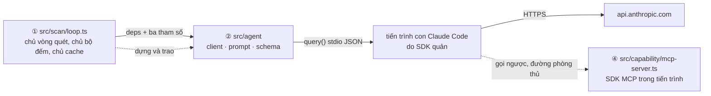
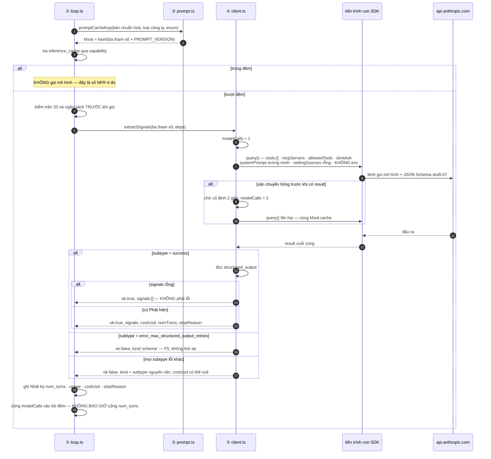

# Architecture Spine — Tầng ② Agent Runtime

## Design Paradigm

**Bộ biến đổi thuần sau một biên tiến trình.** `src/agent` nhận ba giá trị, trả một cấu trúc,
và không biết gì về thế giới còn lại. Mọi thứ nó cần từ bên ngoài — MCP server, mã mô hình,
trần lượt, trần ngân sách — **tiêm vào qua tham số**, không nhập, không đọc tệp, không đọc
biến môi trường.



Đường nét đứt là đường **không dùng trong kỳ thi** nhưng vẫn phải đúng: MCP server được đăng ký
để `AD-1` có hiệu lực và để phép đối chứng phá hoại còn ý nghĩa, chứ không phải để agent đi lấy
dữ liệu (`AD-AG-3`).

Ba tệp, ba trách nhiệm, không chồng lấn:

| Tệp | Chịu | **Không** chịu |
|---|---|---|
| `client.ts` | dựng tuỳ chọn `query()`, tiêu thụ generator, phân loại lỗi, đếm lượt | nội dung lời nhắc, hình dạng lược đồ |
| `prompt.ts` | một hàm dựng lời nhắc, `PROMPT_VERSION`, hàm tính khoá cache | gọi mạng, biết về Postgres |
| `schema.ts` | Zod → JSON Schema draft-07 từ enum được truyền vào | đọc ontology từ đĩa |

## Inherited Invariants

Đọc-chỉ. Không suy diễn lại, không nới. Mã giữ nguyên số của spine cha.

| Inherited | From parent | Binds here |
| --- | --- | --- |
| `AD-1` | spine cha | Bốn tuỳ chọn `query()` là một khối không tách rời; `src/agent` không được nhập `src/capability`, `src/core`, `@prisma/client` |
| `AD-2` | spine cha | Sổ đăng ký là tập đóng — tầng ② không thêm, không bớt, không đọc trực tiếp |
| `AD-3` | spine cha | Ba chạm ghi của máy do lõi quyết định, không do mô hình đề nghị |
| `AD-4` | spine cha | Cấp phép là việc của Cổng; tầng ② không bao giờ tự quyết cho phép |
| `AD-5` | spine cha | Actor là tham số bắt buộc — mô hình không bao giờ được chọn actor (`AD-AG-4`) |
| `AD-6` | spine cha | Không nhập `src/core`; JSON Schema **draft-07**; nguồn enum là ontology §8 |
| `AD-7` | spine cha | Đúng ba tham số ra biên; đầu ra là đúng lược đồ Phát hiện |
| `AD-8` | spine cha | Claim buộc neo nguồn; đích so khớp câu trích là bản **chuẩn hoá** |
| `AD-9` | spine cha | Tầng ② không tính cờ `BR-B` nào |
| `AD-10` | spine cha | Kiểm-và-ghi nguyên tử thuộc lõi; tầng ② không ghi gì |
| `AD-11` | spine cha | Trần 20 lệnh gọi mô hình, năm điều kiện dừng, đơn vị công việc là một Công ty |
| `AD-12` | spine cha | Tập Công ty chốt lúc bắt đầu; tầng ② không biết tới danh sách đó |
| `AD-13` | spine cha | Ontology là trọng tài ngữ nghĩa và là nguồn enum |
| `AD-14` | spine cha | Thời gian UTC; tầng ② không sinh mốc thời gian nghiệp vụ nào |
| `AD-15` | spine cha | `src/agent` **không** nằm trong hai tệp được đọc `process.env` |
| `AD-16` | spine cha | Khoá cache là hash ba tham số cộng phiên bản lời nhắc; không ngày, không giờ, không số ngẫu nhiên |
| `AD-17` | spine cha | Tên trường BTC không bao giờ xuất hiện trong `src/agent` |
| `AD-18` | spine cha | `src/agent` nhận bản chuẩn hoá đã lưu và **không** có hàm chuẩn hoá riêng; cấm `.replace(/\s+/` và `.normalize(` |
| `AD-19` | spine cha | Mọi chạm dữ liệu đi qua sổ đăng ký — kể cả cache suy luận |
| `AD-20` | spine cha | Actor `seed` không bao giờ chạm tầng ② |
| `AD-21` | spine cha | Hệ quả dây chuyền giữ nguyên actor khởi phát |
| `AD-22` | spine cha | Mô hình sinh Claim; hệ thống sinh Proposal — không trường Gợi ý nào trong đầu ra |
| Quy ước ghi vết, quy ước lỗi, mã `FT1`–`FT10` | spine cha, §Consistency Conventions | Tầng ② không thêm mã `F` mới (`AD-AG-11`) |

---

## Invariants & Rules

### AD-AG-1 — Bề mặt công khai là một hàm; mọi phụ thuộc tiêm vào

- **Binds:** `src/agent/client.ts`, `AD-1`, `AD-6`, `AD-13`, `AD-15`
- **Prevents:** một dòng `import` từ `src/agent` vào `src/capability` để lấy MCP server — và
  danh sách cho phép của `AD-1` bị nới bằng thứ trông vô hại nhất trong repo
- **Rule:** `client.ts` xuất **đúng hai thứ**: kiểu `AgentDeps` và hàm
  `extractSignals(input, deps)`. Bên gọi thuộc tầng ① dựng `AgentDeps` và trao vào:

  ```ts
  export type AgentDeps = {
    crmMcpServer: unknown   // giá trị mờ, kiểu lấy từ SDK — KHÔNG nhập src/capability
    modelId: string
    maxTurns: number
    maxBudgetUsd: number
    abortSignal?: AbortSignal
  }
  ```

  `src/agent` **không** đọc tệp, **không** đọc `process.env`, **không** đọc bảng `settings`,
  **không** nhập `src/core`, `src/capability`, `@prisma/client`. Phép kiểm cưỡng chế: không tệp
  nào dưới `src/agent/**` chứa `process.env`, `readFileSync`, `@prisma/client`, `src/core`,
  `src/capability`.

  Kiểu của `crmMcpServer` để **mờ** là có chủ đích: gõ chặt nó đòi nhập kiểu từ tầng ④, mà
  chính điều đó là thứ `AD-1` cấm. Ràng buộc thật nằm ở `AD-AG-4`, cưỡng chế bằng phép kiểm ở
  tầng ④, không bằng bộ kiểm kiểu.

### AD-AG-2 — Một Bản lưu là một `query()`; không phiên dùng lại, không gộp lô

- **Binds:** `AD-11`, `AD-12`, `AD-16`, `NFR-2`
- **Prevents:** ai đó gộp 15 Công ty vào một lượt để chia đều phí tổn ~2,5k token, rồi khoá
  cache, con trỏ resume và đơn vị công việc một Công ty **cùng mất nghĩa một lúc**
- **Rule:** mỗi lệnh gọi rút Phát hiện là **một** `query()` độc lập cho **một** Bản lưu. Không
  truyền `resume`, `continue`, `sessionId`. Không nối nhiều Bản lưu vào một lời nhắc.

  `query()` là generator một lượt: nó **phát ra result lỗi rồi ném**. Nên `client.ts` phải tiêu
  thụ hết generator bằng `for await` **bên trong** `try/catch`, và giữ lại result cuối cùng đã
  thấy trước khi ngoại lệ nổ — nếu không, mọi lượt lỗi mất sạch `total_cost_usd` và `num_turns`.

  Bù chi phí phí tổn bằng **prompt caching phía Anthropic** (`AD-16` tầng hai): tiền tố hệ thống
  giống nhau giữa các tiến trình con liên tiếp nên vẫn trúng đệm trong TTL một giờ.

### AD-AG-3 — `src/agent` là bộ biến đổi thuần: không gọi capability nào

- **Binds:** `AD-7`, `AD-16`, `AD-22`, `NFR-2`, `§4/nhóm 2`
- **Prevents:** trần 20 lệnh gọi của `NFR-2` bị **việc đi lấy dữ liệu** ăn hết, thay vì bị việc
  suy luận ăn — và khoá cache không dựng được vì đầu vào chưa xác định lúc gọi
- **Rule:** dữ liệu vào bằng **tham số** (đúng ba thứ của `AD-7`), ra bằng `structured_output`.
  Lời nhắc không yêu cầu tool nào. MCP server **vẫn** đăng ký đủ bốn tuỳ chọn của `AD-1` — nó là
  lớp phòng thủ và là chỗ để phép đối chứng phá hoại còn ý nghĩa, không phải đường lấy dữ liệu.

  Mô hình gọi tool trong đường này là **bất thường có tên**: ghi mã `FT4` vào Nhật ký vòng quét,
  không coi là lỗi vòng quét, không dừng.

### AD-AG-4 — Hợp đồng tên và tham số của tool MCP

- **Binds:** `AD-1`, `AD-2`, `AD-5`, ranh giới ② ↔ ④
- **Prevents:** khoá server đổi thành `crm-server`, `allowedTools: ["mcp__crm__*"]` khớp rỗng,
  và triệu chứng đã đo quay lại nguyên vẹn — agent *trông như* gọi capability, handler chạy **0
  lần**, chi phí **$1,607** một lượt
- **Rule:** ba mệnh đề, cưỡng chế bằng phép kiểm ở tầng ④:

  | Mệnh đề | Nội dung |
  |---|---|
  | Khoá server | chuỗi `crm` **nguyên văn**, khai một lần, dùng chung cho `mcpServers` và `allowedTools` |
  | Tên tool | **bằng đúng** tên capability trong sổ đăng ký. Mô hình thấy `mcp__crm__<capabilityName>` |
  | Tham số | input schema của mọi tool MCP **không bao giờ** chứa `actor`, `userId`, `role`, `seedMode`. Handler đóng kín trên actor hệ thống |

  Vế thứ ba là ranh giới quyền: `AD-5` bắt actor là tham số bắt buộc, nhưng một tham số **mô
  hình điền được** là một tham số mô hình leo thang được. Phép kiểm khẳng định cả hai vế — tên
  khớp sổ đăng ký, và không tool nào lộ trường danh tính.

### AD-AG-5 — Lược đồ Phát hiện: một đối tượng bọc, sáu trường, đóng

- **Binds:** `AD-6`, `AD-8`, `AD-18`, `AD-22`, `D22`, `T-2`, `T-3`
- **Prevents:** offset câu trích được tính ở **hai** nơi, rồi lệch một ký tự — đúng lỗi `AD-18`
  sinh ra để chặn, chỉ đổi nguyên nhân
- **Rule:**

  ```jsonc
  {
    "type": "object",
    "additionalProperties": false,
    "required": ["signals"],
    "properties": {
      "signals": {
        "type": "array",
        "items": {
          "type": "object",
          "additionalProperties": false,
          "required": ["statement","signal_type","signal_subtype","quote","confidence","relevance"],
          "properties": {
            "statement":      { "type": "string", "minLength": 1, "maxLength": 300 },
            "signal_type":    { "type": "string", "enum": ["…6 giá trị từ ontology §8…"] },
            "signal_subtype": { "type": ["string","null"], "enum": ["…13 giá trị…", null] },
            "quote":          { "type": "string", "minLength": 1 },
            "confidence":     { "type": "string", "enum": ["chac","co_the","doan"] },
            "relevance":      { "type": "string", "enum": ["high","medium","low"] }
          }
        }
      }
    }
  }
  ```

  **Không có** `quote_start` / `quote_end` — lõi tính trên bản chuẩn hoá (`AD-18`).
  **Không có** trường nào của Gợi ý: không `current_value`, không `proposed_value`, không tên ô
  (`AD-22`). `additionalProperties: false` ở mọi mức, mọi trường `required`: một trường thừa
  thành lỗi lược đồ nhìn thấy được, thay vì thành dữ liệu trôi vào lõi.

  Gốc là **đối tượng bọc**, không phải mảng trần: mảng trần không có chỗ cho kênh trả lời rỗng
  đọc được và một số đường structured output đòi gốc là object. `signals: []` là câu trả lời hợp
  lệ, không phải lỗi (`AD-AG-11`).

### AD-AG-6 — Enum vào bằng dữ liệu; một hàm dựng lược đồ; luật có điều kiện nằm ở lõi

- **Binds:** `AD-6`, `AD-13`, `D22`, ontology §8
- **Prevents:** một lược đồ khai sai draft giết cả lượt chạy ngay lúc khởi động, ở chỗ **không**
  dễ thấy
- **Rule:** `schema.ts` xuất **một** hàm `buildSignalSchema(enums)`. Danh sách enum là **tham số
  thứ ba của `AD-7`**, truyền vào dưới dạng dữ liệu — `src/agent` **không** đọc ontology từ đĩa.
  Dựng bằng `z.toJSONSchema(schema, { target: "draft-7" })`, và một phép kiểm khẳng định
  `$schema` sinh ra đúng draft-07.

  Đây là **cách chở**, không phải đổi nguồn: `AD-6` nói lược đồ dựng từ ontology §8, và nó vẫn
  dựng từ đúng §8 — chỉ là §8 đi vào qua capability `listEnums` thay vì qua `readFileSync`.
  `AD-13` vẫn phải ghim tệp `.md` vào bản build, vì `listEnums`, Cổng và `tests/` đều đọc nó.

  Luật *"`signal_subtype` chỉ có nghĩa khi `signal_type = other`"* **không** cài bằng `if`/`then`
  của JSON Schema. Nó là `BR-D` cưỡng chế ở lõi. Lược đồ chỉ khai `signal_subtype` là
  enum-hoặc-`null` và `required` — mô hình luôn phải phát trường đó, giá trị `null` là câu trả
  lời hợp lệ khi loại tin khác `other`.

  Lý do: mức hỗ trợ `if`/`then` draft-07 của bộ kiểm phía SDK **chưa xác minh**, mà `AD-6` đã ghi
  rõ lược đồ không hợp lệ hỏng lượt chạy ngay lúc khởi động. Đổi một luật nghiệp vụ lấy một rủi
  ro khởi động là đổi sai chiều.

### AD-AG-7 — `PROMPT_VERSION` phủ cả lời nhắc lẫn lược đồ, và khoá cache tính ở tầng này

- **Binds:** `AD-16`, `AD-7`, `NFR-4`
- **Prevents:** ai đó thêm một enum vào `schema.ts`, byte gửi ra biên đổi, khoá cache **không**
  đổi — và cache trả về kết quả của lược đồ cũ trong 24 giờ, im lặng
- **Rule:** `prompt.ts` xuất hằng số `PROMPT_VERSION` dạng chuỗi tăng dần. Nó phủ **cả**
  `prompt.ts` **lẫn** `schema.ts`: đổi bất cứ thứ gì làm đổi byte gửi ra biên đều phải tăng
  phiên bản.

  `prompt.ts` cũng xuất `promptCacheKey(input)` — hàm thuần, băm đúng ba tham số của `AD-7` cộng
  `PROMPT_VERSION`, không nhận thêm gì. Tra và ghi cache là việc của tầng trên qua capability
  (`AD-19`); tầng ② chỉ **định nghĩa khoá**, vì nó là tầng duy nhất biết hết những gì đi ra biên.

  Đây là chỗ lấp khoảng trống của `AD-16` — `AD-16` nhắc *"phiên bản lời nhắc"* mà không nhắc
  phiên bản lược đồ — bằng cách **mở rộng nghĩa của một khoá đã có**, không thêm khoá mới.

### AD-AG-8 — Lượt chạy không phụ thuộc máy người chạy; đường lui API key không có mã nào

- **Binds:** `AD-15`, `AD-16`, `NFR-4`, `§7`, ma trận quyết định §4
- **Prevents:** hai dev chạy cùng một Bản lưu ra hai kết quả vì một người có `CLAUDE.md` trong
  thư mục làm việc — và cache `NFR-4` trúng chéo hai ngữ cảnh khác nhau
- **Rule — ghim lượt chạy:**

  | Tuỳ chọn | Giá trị | Vì sao |
  |---|---|---|
  | `systemPrompt` | chuỗi tường minh của đội | **không** dùng preset `claude_code`: preset kéo theo phí tổn nạp bộ đệm và hành vi tool mà đường thuần biến đổi không cần |
  | `settingSources` | mảng rỗng | không nạp `CLAUDE.md`, settings, hook nào từ đĩa |
  | `model` | ghim tường minh qua `deps.modelId` | bí danh mô hình trôi theo thời gian; khoá cache thì không |
  | `cwd` | cố định, gốc dự án | tiến trình con không đi lang thang theo nơi ai đó gõ lệnh |
  | `env` | **không bao giờ truyền** | xem dưới |

- **Rule — đường lui API key:** đổi bằng **biến môi trường của tiến trình cha**, không sửa một
  dòng mã nào. Đặt `ANTHROPIC_API_KEY` trước `npm start`; tiến trình con **thừa kế** môi trường
  và thứ tự chọn xác thực của SDK ưu tiên khoá API hơn đăng nhập subscription. `src/agent`
  **không đọc, không đặt, không xoá** biến xác thực nào — phép kiểm khẳng định không tệp nào
  dưới `src/agent/**` chứa chuỗi `ANTHROPIC_` hay `apiKey`.

  **Vì sao cấm tuỳ chọn `env`, dù nó tồn tại:** bản TypeScript của SDK **thay thế** toàn bộ môi
  trường tiến trình con chứ không hợp nhất. Truyền nó là xoá `HOME` và `PATH`, tức xoá luôn
  đường đọc `~/.claude/.credentials.json` — chính đường lui lại phá đường chính, và triệu chứng
  là *"đăng nhập subscription đột nhiên hỏng"* đúng vào lúc đội đang thử đường lui.

  Giao diện hẹp của ma trận quyết định §4 vì thế **hẹp hơn một tham số**: nó là **không tham số
  nào**.

### AD-AG-9 — Ba lớp lỗi, ba cách xử; kết quả trả về là union phân biệt được

- **Binds:** `AD-11`, `NFR-1`, `NFR-3`, mục *Deferred* của cha (*"thử lại trong một vòng"*)
- **Prevents:** một lỗi mạng tạm thời bị đối xử như lỗi lược đồ, rồi vòng quét thử lại ba lần
  trên 15 Công ty và **vượt chu kỳ**, làm vòng kế bị bỏ theo `NFR-1` — đổi một lỗi tạm thời lấy
  một vòng mất trắng
- **Rule — ba lớp:**

  | Lớp | Nhận diện | Xử |
  |---|---|---|
  | **Lược đồ không khớp** | SDK tự thử lại; hết lượt thì `subtype = error_max_structured_output_retries` | Đội **không** thử lại thêm lần nào. Trả `kind: 'schema'`. Mã `FT5` |
  | **Vận chuyển** | `query()` ném **trước khi** có bất kỳ result nào: tiến trình con không khởi động được, đứt mạng, `ENOENT` | Thử lại **đúng một lần**, chờ **cố định 2 giây**, cùng Bản lưu, cùng khoá cache. Vẫn hỏng thì trả `kind: 'transport'` |
  | **Mọi subtype lỗi có result** | `error_during_execution`, `error_max_turns`, `error_max_budget_usd` | **Không** thử lại. Trả `kind` tương ứng kèm `subtype` nguyên văn |

  Chờ **cố định**, không cấp số nhân, không ngẫu nhiên hoá: `NFR-1` đo chu kỳ **cuối-đến-đầu**,
  nên mọi giây chờ là giây trừ thẳng vào ngân sách thời gian của vòng.

- **Rule — hình dạng trả về.** `extractSignals` **không ném**. Nó trả:

  ```ts
  type ExtractionResult =
    | { ok: true;  signals: SignalDraft[]; modelCalls: number; costUsd: number | null;
        numTurns: number; stopReason: string | null }
    | { ok: false; kind: 'schema' | 'transport' | 'execution' | 'turns' | 'budget';
        subtype: string | null; modelCalls: number; costUsd: number | null }
  ```

  Ánh xạ sang năm điều kiện dừng của `AD-11` là việc của tầng ①, **không** của tầng ②. Tầng ②
  chỉ cam kết: mỗi nhánh có một `kind` phân biệt được, và không nhánh nào im lặng.

### AD-AG-10 — Luật đếm: `NFR-2` đếm `query()`, không bao giờ đếm `num_turns`

- **Binds:** `NFR-2`, `NFR-3`, `AD-11`, mục *Deferred* của cha (*"`ToolSearch` có ăn vào trần 20 không"*)
- **Prevents:** `ToolSearch` thêm một lượt tool, `num_turns` nhảy, và trần 20 của `NFR-2` bị tiêu
  hết trước khi quét xong nửa danh sách — với triệu chứng đánh lạc hướng sang *"mô hình nói
  nhiều quá"*
- **Rule — đếm lượt:** `extractSignals` trả `modelCalls` = **số lần `query()` được gọi** trong
  lời gọi đó: `1` bình thường, `2` khi có thử lại vận chuyển (`AD-AG-9`), `0` khi chưa kịp gọi.
  Bộ đếm `model_calls_per_scan` của tầng ① cộng đúng con số đó và **không bao giờ đọc**
  `num_turns`. Tầng ① kiểm trần **trước** khi gọi, không sau.

  Đếm `2` cho một lượt thử lại là **cố ý bảo thủ**: không phân biệt được lỗi vận chuyển đã tiêu
  token hay chưa, nên đếm về phía an toàn của trần.

  `maxTurns` là **phanh phụ chống chạy loạn**, không phải ngân sách: đặt `4`, đủ chứa một lượt
  `ToolSearch` cộng vài lượt thử lại lược đồ. Hai bộ đếm khác đơn vị và **không bao giờ so với
  nhau**.

- **Rule — cách đo, chạy trên một Công ty thật:** ghi `num_turns`, `usage`, `total_cost_usd`,
  `stop_reason` của **mỗi** lượt vào Nhật ký vòng quét. `num_turns > 1` trên một lượt không gọi
  tool nào chính là `ToolSearch` đang kích hoạt — ghi nhận, không dừng. Đây là phép đo bắt buộc
  sáng 15/08, không phải việc để sau.

- **Rule — chi phí:** `costUsd` là `number | null`. `null` nghĩa là **không đo được**, không bao
  giờ trả `0`. Spine cha đã ghi rằng `error_during_execution` có thể trả mọi trường chi phí bằng
  0; trả `0` làm phanh ngân sách `NFR-3` **rò rỉ im lặng**.

### AD-AG-11 — Đầu ra rỗng không phải lỗi; từ chối nhận diện bằng cấu trúc, không bằng chuỗi

- **Binds:** `FT1`, `FT4`, `FT5`, `AD-8`, `D40`
- **Prevents:** *"không có Phát hiện nào"* bị coi là thất bại, rồi vòng quét thử lại và **đốt
  trần 20** trên đúng những Bản lưu vốn không có gì để rút
- **Rule:** `signals: []` với lược đồ hợp lệ là **câu trả lời đúng**: ghi một dòng nhật ký, đi
  tiếp, không thử lại, không đánh mã lỗi. Từ chối nhận diện bằng `result.stop_reason === 'refusal'`
  — **không** bằng so khớp chuỗi trong văn bản trả về, thứ đổi theo phiên bản mô hình và theo
  ngôn ngữ.

- **Rule — không thêm mã `F` mới.** Phân loại theo đúng cột *"ai sửa"* của spine cha:

  | Hiện tượng | Mã | Sửa ở |
  |---|---|---|
  | `error_max_structured_output_retries` | `FT5` | JSON Schema — và kiểm lại `$schema` có đúng draft-07 không (`AD-6`) |
  | `stop_reason = 'refusal'`, hoặc `signals: []` liên tiếp trên **nhiều Bản lưu khác nhau** | `FT1` | lời nhắc |
  | Câu trích không khớp bản chuẩn hoá, bị lõi loại theo `BR-D2` | `FT1` | lời nhắc |
  | Mô hình gọi tool trong đường thuần biến đổi | `FT4` | mô tả capability |

  Mười mã của cha đủ phủ; thêm mã thứ mười một chỉ để đặt tên cho *"rỗng"* là đặt tên cho một
  thứ **không phải thất bại**.

---

## Xung đột với spine cha

Năm mục. Không mục nào bị tầng ② tự nới — nêu lên để spine cha quyết.

### X1 — Danh sách cho phép của `AD-1` không cấp đường nào cho composition root

`AD-1` cho phép nhập `src/capability/**` **chỉ ở** `src/autonomy/**`. Nhưng `AD-4` đặt
`loadCapability` trong `src/capability/registry.ts` và gọi nó là lối vào duy nhất, còn `AD-19`
bắt `src/app` lấy dữ liệu bằng capability đọc. Kết quả: `src/app`, `src/scan`, `prisma/seed.ts`,
`tests/` đều **cần** nhập `src/capability` và **đều bị cấm**. Riêng với tầng ②, hệ quả cụ thể là
**không ai được phép nhập `src/capability/mcp-server.ts`** để trao MCP server cho `query()`.

Tầng ② né bằng tiêm (`AD-AG-1`) — nước đi duy nhất đúng dù xung đột được giải theo hướng nào.
Nhưng ai dựng `AgentDeps` thì vẫn chưa có chủ.

### X2 — Bảng ánh xạ `subtype` của `AD-11` thiếu một nhánh

SDK 0.3.232 có **năm** `subtype`: `success`, `error_max_turns`, `error_max_budget_usd`,
`error_during_execution`, `error_max_structured_output_retries`. `AD-11` ánh xạ **ba**.
`error_max_turns` chưa có ánh xạ — và theo lập luận của chính `AD-11`, một nhánh không ánh xạ
kích hoạt `FT9`. Tầng ② trả nó dưới `kind: 'turns'` để tầng ① có thứ để ánh xạ; **luật ánh xạ vẫn
thuộc cha**.

### X3 — `error_during_execution` về điều kiện dừng 5 giết cả vòng vì một Bản lưu

`AD-11` đưa `error_during_execution` về điều kiện dừng 5, tức **kết thúc vòng**. Một Bản lưu
hỏng khi đang ở Công ty thứ hai sẽ bỏ lại 13 Công ty chưa quét — nghịch với luật *"đơn vị công
việc là một Công ty trọn vẹn"* của chính `AD-11`, vốn tồn tại để **không cắt giữa chừng một cách
tuỳ tiện**.

Tầng ② **tuân thủ**: nó chỉ báo cáo `kind: 'execution'` và không tự quyết đi tiếp. Nêu lên vì cái
giá rơi đúng vào `T-8` — kịch bản đòi vòng quét hoàn tất trong hai chu kỳ.

### X4 — Quy ước tên capability của cha tự mâu thuẫn, và mâu thuẫn đó rò ra dây

§Consistency Conventions của cha ghi *"Tên capability: tiếng Việt không dấu"* nhưng ví dụ đi kèm
là `appendTimelineEntry` — tiếng Anh. `AD-AG-4` đặt tên tool MCP **bằng đúng** tên capability,
nên mơ hồ này không còn nằm trong mã: nó thành chuỗi mô hình nhìn thấy, và thành chuỗi trong
`allowedTools`.

Tầng ② chọn **tiếng Anh** theo quy ước định danh của dự án và theo chính các ví dụ của cha
(`appendTimelineEntry`, `setNextAction`, `queueSuggestion`). Cha cần sửa một chữ trong bảng quy
ước.

---

### X5 — Tầng ② dùng hình thái *API/nền tảng* mà cha đã loại

Cha loại dứt khoát ở mục *Hình thái bài toán*: *"Không phải API/nền tảng — bên tiêu thụ là người,
không phải hệ thống khác."* Nhưng tầng này chọn kịch bản đáng vẽ theo đúng bộ của hình thái đó —
*thử lại, chạm giới hạn, idempotency* — và chọn thế là **hợp lý về nội dung**: `src/agent` chỉ
được `src/scan` gọi, tức bên tiêu thụ của **tầng này** đúng là một hệ thống, không phải người.

Đề nghị cha: hình thái khai ở cha là hình thái của **sản phẩm**, không tự động áp cho từng tầng.
Một tầng có bên tiêu thụ là máy thì mượn bộ kỹ thuật tương ứng — nói ra để việc mượn không đọc
thành vi phạm.

## Phân tích ranh giới

Bốn chỗ trao đổi. Ranh giới 7 và 8 của cha được mở ra ở đây; hai ranh giới còn lại là mới.

| # | Ranh giới | Cái gì đi qua | Định dạng | Tần suất | Khối lượng |
|---|---|---|---|---|---|
| A | ① `src/scan` → ② `src/agent` | ba tham số `AD-7` + `AgentDeps` | lời gọi hàm TS, trong tiến trình | ≤ 20 lần / vòng, tuần tự | 2–5 KB Bản lưu + vài trăm byte enum |
| B | ② → tiến trình con Claude Code | lời nhắc + JSON Schema draft-07 + tuỳ chọn `query()` | stdio JSON do SDK quản | một lần / lệnh gọi mô hình | ~2,5 KB lời nhắc; phí tổn hệ thống **đo lại sau `AD-AG-8`** |
| C | tiến trình con → `api.anthropic.com` | lệnh gọi mô hình | HTTPS | 1–4 lượt / `query()` | đo 14/08: 2.548 token nạp bộ đệm (⚠ cấu hình TRƯỚC `AD-AG-8`), ~490 token ra. Chi phí **tản rộng** — trung vị ~0,075 đô, đã quan sát **0,727 đô** |
| D | tiến trình con → ④ MCP trong tiến trình | lời gọi tool `mcp__crm__*` | JSON-RPC qua bộ nhớ, gọi ngược vào tiến trình cha | **kỳ vọng 0 lần** trong kỳ thi (`AD-AG-3`) | — |

### Ai chịu gì, và hỏng thì sao

| # | Bên gọi chịu | Bên nhận chịu | Hỏng thì |
|---|---|---|---|
| A | chốt Bản lưu, kiểm trần **trước** khi gọi, dựng `AgentDeps`, tra cache theo `promptCacheKey` | không chạm dữ liệu, không ném, trả union phân biệt được | `ok: false` kèm `kind` → tầng ① ánh xạ về điều kiện dừng `AD-11` |
| B | tắt sạch built-in, ghim `systemPrompt`/`settingSources`/`model`/`cwd`, **không** truyền `env` | trả `structured_output` đúng lược đồ | lược đồ sai → SDK tự thử lại; hết lượt → `FT5`, đội **không** thử thêm |
| C | kiểm ngân sách trước mỗi lệnh gọi (`NFR-3`) | — | hết ngân sách → `error_max_budget_usd` → điều kiện dừng 4, tự tắt AI một chiều |
| D | `allowedTools` khớp đúng tiền tố `mcp__crm__` | Cổng quyết định, sổ đăng ký ghi vết (`AD-4`) | lượt gọi tool bất kỳ ở đây là `FT4` — ghi nhật ký, không dừng |

Ranh giới **B và C là hai chỗ duy nhất rời khỏi máy của đội**, và cả hai chỉ mang đúng ba thứ mà
`AD-7` cho phép. Ranh giới **D đi ra rồi quay lại cùng tiến trình** — nó trông như ranh giới
ngoài nhưng không phải, và đó chính là lý do `AD-1` phải cấp phép tường minh cho nó.

---

## Kịch bản đáng vẽ — một lệnh gọi rút Phát hiện

Cha đã vẽ bốn kịch bản xuyên tầng. Kịch bản đáng vẽ **bên trong** tầng này là kịch bản hình thái
*API/nền tảng* gọi tên: **thử lại, chạm giới hạn, và ba nhánh kết thúc**.



Ba thứ kịch bản này chứng minh, và không kịch bản nào của cha chứng minh: cache đứng **trước**
tầng ② chứ không trong nó; bộ đếm tăng theo `query()` chứ không theo lượt; và `costUsd` có thể
`null` mà vẫn là kết quả hợp lệ.

---

## Đánh giá nhà cung cấp — Claude Agent SDK

| Mối lo | Trạng thái ngày 14/08/2026 |
|---|---|
| Mô hình cấp phép | Gói thuê bao Team, đăng nhập qua `~/.claude/.credentials.json`. Không hạn mức tính theo lệnh gọi ở phía đội |
| Điều khoản | ⚠ **Rủi ro sống.** Tài liệu chính thức vẫn nói đăng nhập subscription **không dành cho** ứng dụng bên thứ ba và khuyến nghị API key. Trang hỗ trợ từng khai gói Pro/Max/Team/Enterprise dùng được từ 15/06/2026, **nhưng cùng trang ghi thay đổi đó đã bị tạm dừng** |
| Bằng chứng ngược lại | Đội **đã đo hôm nay nó chạy**: `query()` trả kết quả đúng, `outputFormat` ép enum đúng, `maxTurns` chặn được, `total_cost_usd` có số |
| Độ ổn định API | Bề mặt `query()` ổn định; ba điểm **chưa xác minh**: tên tuỳ chọn giới hạn số lần thử lại lược đồ, hành vi thử lại lỗi mạng tầng HTTP, và mỗi `query()` có sinh tiến trình con mới hay không |
| Khoá chặt | Thấp ở tầng ②: `client.ts` là tệp **duy nhất** biết tới SDK. Đổi sang Messages API + Tool Runner (phương án 88 điểm) là viết lại một tệp |
| Đường lui | `ANTHROPIC_API_KEY` ở môi trường tiến trình cha — **không sửa mã** (`AD-AG-8`). Đúng phương án 93 điểm của ma trận quyết định §4 |
| Việc phải làm | Kiểm lại đường subscription **sáng 15/08 trước mọi việc khác**. Nếu hỏng: đặt biến môi trường, khởi động lại, chạy tiếp |

Quyết định giữ nguyên như ma trận quyết định §4 đã chốt — spine này **không** mở lại nó, chỉ ghi
lại cái giá và đường lui đã đo được.

---

## Phân tích tài chính — phanh ngân sách dựa trên gì

`NFR-3` là phanh ngân sách, và nó đọc `total_cost_usd`. Ba giả định chống đỡ con số đó, phát biểu
rõ để chúng bị chất vấn được:

1. **`total_cost_usd` là ước lượng phía client**, tính từ token đếm được nhân đơn giá mô hình.
   Dưới đăng nhập subscription **không có hoá đơn nào để đối chiếu**. Với dự án này nó là **đại
   lượng thay thế cho khối lượng token**, không phải tiền quyết toán — nên `NFR-3` thực chất là
   **phanh khối lượng dùng đơn vị đô la**. Nói rõ vì một giám khảo hỏi *"số này lấy ở đâu"* là
   câu hỏi vòng 2 rất tự nhiên.
2. **Trường chi phí có thể bằng 0 khi lượt chạy lỗi** — cha đã ghi cho `error_during_execution`.
   `AD-AG-10` trả `null` thay vì `0` để bộ đếm không cộng nhầm một số không có thật.
3. **Số đo 0,025–0,039 đô mỗi lệnh gọi là của cấu hình lúc đo**, gồm cả phí tổn ~2.548 token nạp
   bộ đệm. `AD-AG-8` bỏ preset `claude_code` nên con số này **dự kiến giảm** — chưa đo lại, và
   **không được** đưa vào bất kỳ tính toán ngân sách nào trước khi đo lại.

Khung ngân sách một vòng **không nhân được từ trung vị**: chi phí một lượt tản rộng (0,073 · 0,075 · 0,076 rồi **0,727** đô — gấp 10 lần). Một lượt xui đã vượt cận trên của cả vòng. Dùng **giá trị lớn nhất quan sát được**, xem `AD-11` của cha. Với
`D18` chỉ tạo Bản lưu mới khi dấu vân nội dung khác, cộng cache 24 giờ của `NFR-4`, kịch bản `T-8`
đổi nguồn hai Công ty rơi vào khoảng **0,05 đô**.

---

## Consistency Conventions

Chỉ những dòng tầng ② thêm vào so với spine cha.

| Mối lo | Quy ước |
|---|---|
| Tên tệp và định danh | Tiếng Anh. `client.ts`, `prompt.ts`, `schema.ts`, `extractSignals`, `AgentDeps`, `PROMPT_VERSION` |
| Giá trị enum | Tiếng Việt không dấu đúng Mục 0, chép nguyên từ ontology §8. Không dịch, không viết hoa lại |
| Chữ trong lời nhắc | Tiếng Việt có dấu — câu nhận định mô hình sinh ra là tiếng Việt (ontology §2) |
| Câu trích | Giữ **nguyên ngôn ngữ gốc** của Bản lưu, không dịch, không cắt gọn |
| Lỗi | Tầng ② **không ném**; mọi thất bại về `ok: false` kèm `kind` (`AD-AG-9`) |
| Nhật ký | Mỗi lượt ghi `num_turns` · `usage` · `total_cost_usd` · `stop_reason` · `modelCalls` (`AD-AG-10`) |
| Phiên bản | `PROMPT_VERSION` tăng khi **bất kỳ** byte ra biên đổi, kể cả do `schema.ts` (`AD-AG-7`) |

---

## Stack

Chỉ những dòng tầng ② trực tiếp phụ thuộc. Phần còn lại thừa kế bảng Stack của spine cha.

| Name | Version |
|---|---|
| @anthropic-ai/claude-agent-sdk | 0.3.232 |
| Claude Code CLI | bản đi kèm SDK 0.3.232, không ghim riêng |
| @anthropic-ai/sdk | >=0.117 |
| @modelcontextprotocol/sdk | ^1.29 |
| Zod | 4.4.3 |
| JSON Schema | draft-07 |
| TypeScript | ~5.9 |
| Node.js | 24.19.0 |

---

## Structural Seed

```text
src/agent/
  client.ts    # AD-AG-1 AgentDeps + extractSignals — tệp DUY NHẤT biết tới SDK
               # AD-AG-2 một query() mỗi Bản lưu, tiêu thụ generator trong try/catch
               # AD-AG-8 systemPrompt · settingSources · model · cwd; KHÔNG env
               # AD-AG-9 ba lớp lỗi, union trả về
               # AD-AG-10 modelCalls, costUsd number|null
  prompt.ts    # AD-7 một hàm dựng lời nhắc, đúng ba tham số
               # AD-AG-7 PROMPT_VERSION + promptCacheKey
  schema.ts    # AD-AG-5 lược đồ Phát hiện, sáu trường, đóng
               # AD-AG-6 buildSignalSchema(enums), draft-07
tests/
  agent-boundary.test.ts   # AD-AG-1 không nhập cấm, không process.env, không ANTHROPIC_
  agent-schema.test.ts     # AD-AG-5 AD-AG-6 $schema là draft-07; enum khớp ontology §8
```

Không thư mục con. Ba tệp là toàn bộ tầng — nếu cần tệp thứ tư, gần như chắc chắn nó thuộc tầng
khác.

---

## Capability → Architecture Map

| Việc | Nằm ở | Bị chi phối bởi |
|---|---|---|
| Rút Phát hiện từ Bản lưu (`§4/nhóm 2`) | `client.ts` + `prompt.ts` + `schema.ts` | `AD-6`, `AD-7`, `AD-8`, `AD-22`, `AD-AG-3`, `AD-AG-5` |
| Cấp phép capability cho agent | **không nằm ở tầng ②** — `src/autonomy` + `src/capability` | `AD-1`, `AD-4`, `AD-AG-4` |
| Tra và ghi cache suy luận (`NFR-4`) | **không nằm ở tầng ②** — tầng ① qua capability | `AD-16`, `AD-19`, `AD-AG-7` |
| Đếm lượt và ngân sách (`NFR-2`, `NFR-3`) | bộ đếm ở tầng ①; **luật đếm** ở tầng ② | `AD-11`, `AD-AG-10` |
| Ánh xạ lỗi về năm điều kiện dừng | **không nằm ở tầng ②** — tầng ① | `AD-11`, `AD-AG-9`, `X2`, `X3` |
| Tính offset câu trích | **không nằm ở tầng ②** — `src/core` | `AD-18`, `AD-AG-5` |

---

## Deferred

Hoãn có chủ đích — mỗi mục kèm lý do nó chờ được.

- **Nội dung lời nhắc.** Chữ nghĩa cụ thể là việc của bước story. Spine chốt chữ ký, phiên bản
  và khoá cache; chốt thêm là chốt thứ sẽ đổi mười lần trong ngày thi.
- **Nhúng playbook vào lời nhắc** (ontology §13, phương pháp luận Phần 6). `AD-7` cho ra biên
  đúng ba thứ; thêm playbook là **tham số thứ tư**, tức phải sửa `AD-7` của cha. Ngoài phạm vi
  kỳ thi.
- **`ENABLE_TOOL_SEARCH=false` như một đòn cắt chi phí.** Có biến môi trường điều khiển, nhưng
  `AD-AG-3` khiến `ToolSearch` gần như không kích hoạt. Đo trước theo `AD-AG-10`, rồi mới quyết.
- **Tuỳ chọn `effort` và `thinking`.** Chưa đo. Mặc định trước; chúng đổi cả chi phí lẫn chất
  lượng, nên chỉnh mà không đo là đổi hai biến cùng lúc.
- **Số lần thử lại vận chuyển và thời gian chờ thành khoá `settings`.** `AD-AG-9` chốt *một lần,
  2 giây* làm giá trị dựng sẵn. Đưa vào `settings` chỉ đáng khi có số đo nói giá trị đó sai.
- **Claim đa nguồn** — so hai phiên bản Bản chụp để rút Phát hiện *"vừa đổi định hướng"*
  (phương pháp luận Phần 4). Lược đồ `AD-AG-5` neo **đúng một** câu trích trong **đúng một** Bản
  lưu, khớp ontology §3. Mở rộng đòi đổi cả `AD-8`.
- **Hàng đợi song song nhiều Bản lưu.** `AD-AG-2` chốt tuần tự. Song song đổi ý nghĩa của trần
  20 và của khoá theo Công ty (`AD-12`); cỡ 15 Công ty không đáng đổi.
- **Xác minh ba điểm còn mờ của SDK:** tên tuỳ chọn giới hạn thử lại lược đồ, hành vi thử lại lỗi
  mạng tầng HTTP, và mỗi `query()` có sinh tiến trình con mới không. `AD-AG-9` được viết để đúng
  **dù ba điểm đó ngã về bên nào** — nên chúng là việc cần biết, không phải việc chặn.
