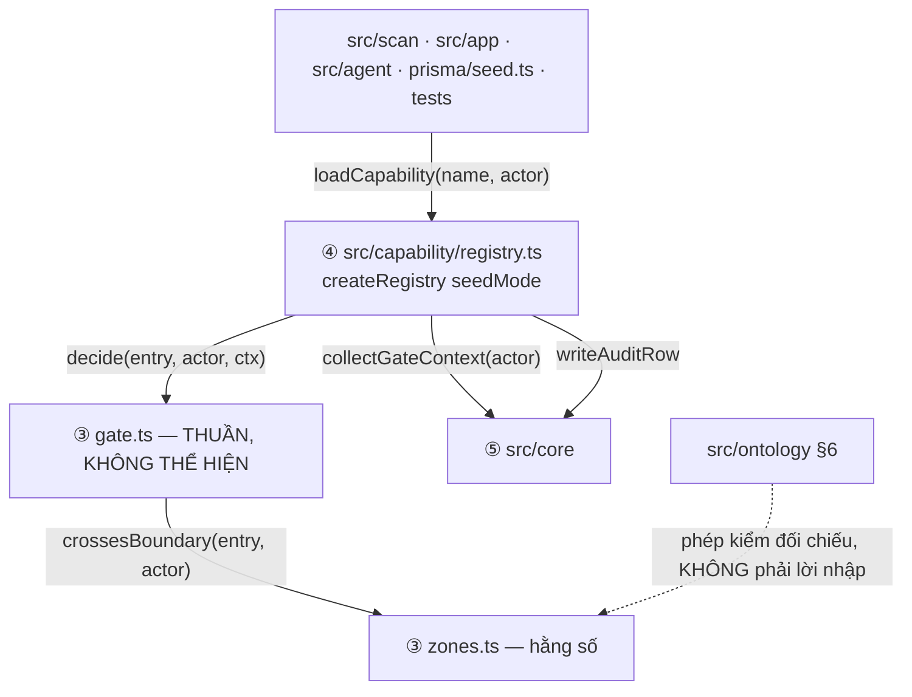
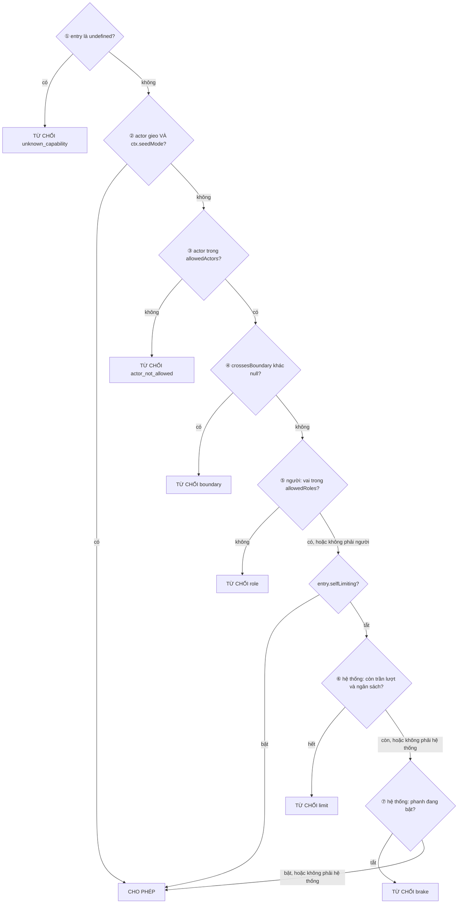
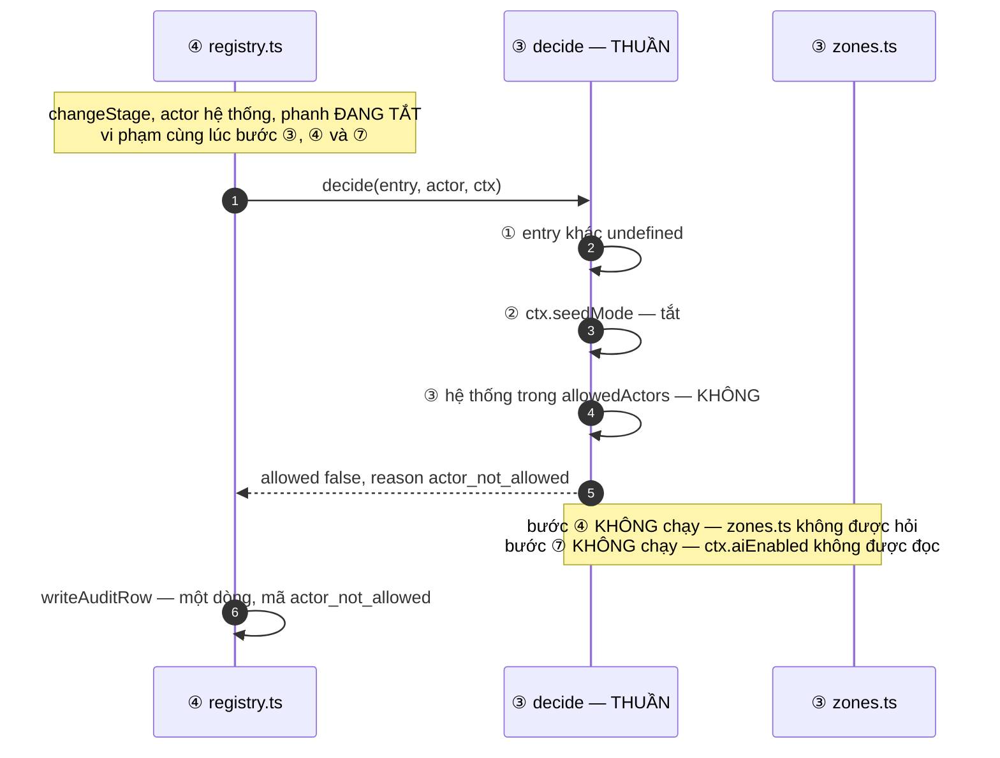

# Architecture Spine — Tầng ③ Cổng tự chủ

> Thừa kế từ spine cha **bản 1.396 dòng, đọc lại 14/08 sau lượt vá `AD-4`**: `selfLimiting` trên
> **năm** mục và là trường **bắt buộc** · phép kiểm đếm ghi vết theo **số lần `decide` được gọi** ·
> cơ chế ghi vết hai pha thuộc `AD-CR-8` của **tầng ⑤**, cha chỉ chốt ba bất biến ·
> `createRegistry({ seedMode })` với `seedMode` vào Cổng qua `ctx`. Chỗ nào lệch thì **cha
> thắng**; *Xung đột với spine cha* báo lên cha, *Xung đột với spine anh em* báo ngang.

## Design Paradigm

Tầng này là **một tập hàm thuần và một bảng hằng số**. Không tệp nào trong `src/autonomy/` mở
kết nối, đọc tệp, đọc biến môi trường, giữ trạng thái, hay trả `Promise`.

| Tệp | Chứa gì | Không bao giờ chứa |
|---|---|---|
| `gate.ts` | `decide`, các kiểu `GateEntry` · `GateContext` · `GateDecision` · `GateDenyReason` | I/O, thể hiện dựng sẵn, nhà máy, ngưỡng bằng số, chuỗi hiển thị |
| `zones.ts` | `BoundaryCode` — năm mã ranh giới của ontology §6 — và `crossesBoundary` | kiểu `Zone` (`AD-2` giao cho tầng ④), đọc tệp `.md`, mã sinh lúc build |

**Tầng này SỞ HỮU hình dạng đầu vào của chính nó** (`AD-GT-12`): `GateEntry` và `GateContext`
khai ở `gate.ts`; tầng ④ **nhập** chúng và mở rộng. Tầng ③ không nhập gì từ tầng ④ — nên Zod và
Prisma không có mặt trong đồ thị **kiểu** của `src/autonomy`, và `npm test` trên clone sạch chạy
được **trước** `prisma generate`.

`FT8` — *"cổng tự chủ quyết sai"* — là loại lỗi cha đánh dấu nghiêm trọng nhất. Tính thuần
không phải sở thích: nó là thứ duy nhất làm cho **toàn bộ hành vi của tầng này kiểm được bằng
một bảng đầu-vào/đầu-ra, không cần cơ sở dữ liệu**.

## Inherited Invariants

Ràng buộc read-only. Không suy diễn lại, không nới.

| Thừa kế | Ràng buộc gì ở tầng này |
|---|---|
| `AD-1` | `src/autonomy` cấm nhập `@prisma/client`, `src/core/**`, `src/capability/**`; `src/autonomy/**` được nhập ở `src/capability/**` và `tests/**`. Ngoại lệ **chỉ-kiểu** duy nhất: `src/core/**`. Cưỡng chế bằng `no-restricted-imports`, danh sách cho phép quét toàn repo |
| `AD-2` | Sổ đăng ký là tập đóng; mục mang `name`, `zone`, `risk`, `allowedActors`, `requiresSignalSource`, `cascades`, `selfLimiting`. `zone` nhận đúng ba giá trị và **do tầng ④ sở hữu**. **`risk` không tham gia quyết định**. Tầng ④ khai `RegistryEntry extends GateEntry` (`AD-GT-12`) |
| `AD-3` | Ba chạm ghi của máy; vị từ ⓐⓑⓒ của `setNextAction` là luật **lõi**, không phải luật Cổng |
| `AD-4` | Chuỗi bảy bước, dừng ở lần từ chối đầu, thứ tự từ hẹp tới rộng · `decide(entry, actor, ctx)` thuần · `registry.ts` là nơi duy nhất gọi `decide` · **`seedMode` vào qua `ctx`**, tham số dựng nằm ở `createRegistry` · **bước ⑥ và ⑦ bỏ qua với `selfLimiting: true`**, đúng **NĂM** mục — `disableAi` · `writeScanLog` · `releaseAccountLock` · `recordAccountCost` · `readUserForAuth` — và trường đó **bắt buộc**, không `?:` · bước ⑦ kiểm phanh mỗi lời gọi · từ chối cũng ghi vết |
| `AD-4` — phép đếm | **số dòng ghi vết = số lần `decide` được gọi**, **không** phải số lần `loadCapability` được gọi: `collectGateContext` chạy trước `decide` và có thể ném, lời gọi đó chưa hề đi qua Cổng. Trừ `actor.kind='seed'` khi không có `--keep-audit` |
| `AD-4` — ghi vết | Cha chỉ chốt **ba bất biến** (không lời gọi nào không để lại dòng · dòng mang giá trị cũ/mới khi có ghi thật · không bao giờ khai thao tác chưa xảy ra). **Cơ chế** hai pha thuộc `AD-CR-8` của **spine tầng ⑤** — không phải luật của tầng này, và không phải `AD` của cha |
| `AD-5` | `actor` là tham số đầu tiên, ba nhánh; nhánh người **mang sẵn `userId` và vai** |
| `AD-11` | Ngưỡng là hàng trong `settings`; **chỉ có tỉ lệ** `budget_warn_ratio` / `budget_stop_ratio`, **không có** khoá tuyệt đối; lượt bị Cổng từ chối không tính vào trần 20; đếm từ chối liên tiếp là việc của vòng quét |
| `AD-13` | Ontology là tài sản lúc chạy. **Ranh giới** thuộc tầng này (`zones.ts`, `AD-GT-3`); **vùng** thuộc `AD-2` và tầng ④. Mỗi bên đối chiếu §6 bằng phép kiểm của riêng mình |
| `AD-15` | `gate.ts` không đọc `process.env` |
| `AD-19` | Sổ đăng ký phủ mọi thao tác chạm dữ liệu, đọc lẫn ghi — Cổng nằm trên đường của cả truy vấn đọc phục vụ giao diện |
| `AD-20` | Actor gieo chỉ chạy được ở chế-độ-gieo; nó bỏ qua vị từ chỉ có nghĩa lúc vận hành; nó không sinh ghi vết trừ khi có cờ `--keep-audit` |
| `AD-21` | Hệ quả dây chuyền giữ nguyên actor, chạy cùng giao dịch |

---

## Invariants & Rules



### AD-GT-1 — `GateContext` do `gate.ts` SỞ HỮU, gồm đúng sáu trường, toàn là sự kiện

- **Binds:** `gate.ts`, `registry.ts`, `src/capability/gate-context.ts`, `AD-4` bước ②, ⑥ và ⑦
- **Prevents:** hai người dựng hai hình dạng `ctx`; vai có hai nguồn sự thật mà không ai khai
  bên nào thắng; và — nặng nhất — `ctx.seedMode` là `undefined` lúc chạy vì bên gom không gom nó
- **Rule — một chủ sở hữu, một danh sách trường.** Kiểu khai ở `gate.ts`;
  `src/capability/gate-context.ts` **nhập kiểu này** và khai trả về **đúng nó**:

  ```ts
  // src/autonomy/gate.ts — tầng ③ SỞ HỮU
  export type GateContext = {
    seedMode: boolean          // AD-4: tham số dựng của createRegistry, vào Cổng qua ctx
    aiEnabled: boolean         // settings.ai_enabled
    modelCallsUsed: number     // hàng ScanLog của lượt quét ĐANG chạy
    modelCallsLimit: number    // settings.model_calls_per_scan
    budgetUsedRatio: number    // chi phí đã tiêu / ngân sách, cùng MỘT hàng ScanLog
    budgetStopRatio: number    // settings.budget_stop_ratio
  }

  // src/capability/gate-context.ts — tầng ④, AD-CP-7
  function collectGateContext(actor: Actor, seedMode: boolean): Promise<GateContext>
  ```

  **`seedMode` là THAM SỐ của bên gom, không phải thứ bên gom tự tìm.** `createRegistry` giữ nó
  và chuyền xuống. Thiếu luật này thì `ctx.seedMode` là `undefined`, bước ② không bao giờ cho
  phép, `prisma/seed.ts` không gieo được gì, và **mọi `T` đỏ ở `beforeEach`** với triệu chứng
  trỏ vào dữ liệu nền chứ không vào Cổng. Với chữ ký trên, cùng lỗi đó là **`TS2739` lúc biên
  dịch** — thiếu một trường là hỏng build, không phải hỏng lúc chạy.

  **Sáu trường, không hơn.** Bốn luật kèm theo:

  1. **Không có trường vai.** Vai vào qua `actor` (`AD-5`). `ctx` mang vai là hai nguồn sự thật.
  2. **`ctx` mang sự kiện, không mang phán quyết.** Không có `limitExceeded`, không có
     `isAdmin`. Một cờ dựng sẵn chuyển quyết định ra khỏi hàm thuần vào bên gom — khi đó
     hai chỗ cùng quyết và `FT8` mất chỗ để tìm.
  3. **Ngân sách vào bằng tỉ lệ, không bằng số tuyệt đối** — `AD-11` khai `budget_warn_ratio`
     và `budget_stop_ratio` và **không có** khoá tuyệt đối `budget_limit_usd`, nên tỉ lệ thắng
     và **không ai được phát minh khoá `settings` mới**. So sánh vẫn ở trong Cổng:
     `budgetUsedRatio >= budgetStopRatio`. Ai cần số tuyệt đối thì tự nhân — nhưng không phải
     Cổng, và không phải `ctx`.

     Tử số và mẫu số lấy **cùng một hàng `ScanLog` của lượt quét đang chạy** (`AD-CP-7`), nên
     tỉ lệ là hàm của một dòng dữ liệu, không phải phép ghép hai nguồn. Ai đặt mẫu số ấy — đó
     chính là con số `maxBudgetUsd` mà `src/scan/loop.ts` truyền cho SDK (`AD-11`) — xem *Xung
     đột với spine anh em*, mục ⑤.
  4. **Một hình dạng `ctx` duy nhất cho mọi actor.** Với actor người, bốn số cuối không được
     đọc tới, nhưng vẫn được gom — một đường mã, không hai.

  **Thiếu hàng `settings` hay không ép được kiểu thì `collectGateContext` ném** (`AD-GT-2`),
  cấm thay bằng giá trị mặc định. Ngược lại, **không có lượt quét nào đang chạy là trạng thái
  hợp lệ**: `modelCallsUsed = 0`, `budgetUsedRatio = 0`. Thiếu vế sau thì mọi lần người dùng
  bấm giao diện ngoài giờ quét đều thành `FT10`.

### AD-GT-2 — `collectGateContext` chạy mỗi lời gọi capability; lỗi gom không thành từ chối

- **Binds:** `registry.ts`, `T-9`, `FR-45`, `NFR-10`
- **Prevents:** phanh bấm rồi mà vòng quét vẫn ghi tiếp; và một dòng ghi vết khai *"chính sách
  chặn"* trong khi thật ra cơ sở dữ liệu chết
- **Rule — tần suất:** gom **một lần cho mỗi lời gọi capability**, ngay trước `decide`. Không
  chụp trước, không dùng lại giữa hai lời gọi, không bộ nhớ đệm.

  Cửa sổ đua còn lại — phanh bấm giữa lúc gom và lúc quyết — **không cần cơ chế bù**: giữa
  `collect` và `decide` không có I/O, `decide` thuần và đồng bộ, nên cửa sổ đó là một nhịp vòng
  lặp sự kiện, nhỏ hơn hẳn ranh giới Công ty mà `FR-45` vốn đã cho phép chạy nốt.

- **Rule — hỏng thì sao:** `collectGateContext` ném thì lỗi **ném xuyên ra ngoài**. Không
  capability nào chạy, và **không sinh dòng `GateDenied` nào**. Xếp `FT10`, không xếp `FT8`.

- **Rule — `decide` đồng bộ.** Chữ ký trả `GateDecision`, không trả `Promise`. Một chữ ký
  `async` là lời mời nhét `await` vào giữa bảy bước.

### AD-GT-3 — `zones.ts` khai hằng số; ontology đối chiếu bằng phép kiểm, không bằng lời nhập

- **Binds:** `zones.ts`, `AD-13`, `NFR-13`
- **Prevents:** danh sách ranh giới trôi khỏi ontology §6; và I/O lọt vào `src/autonomy` qua
  cửa sau
- **Rule:** `zones.ts` khai **năm mã ranh giới** thành hằng số TypeScript. **Không đọc tệp
  `.md` lúc chạy, không sinh mã lúc build.**

  Mã ranh giới **là mã `NFR`**, không đặt tên mới: `NFR-14` đổi Giai đoạn · `NFR-15` Thắng/Thua
  và giá trị tiền · `NFR-16` tự liên hệ khách hàng · `NFR-17` xoá dữ liệu người tạo · `NFR-19`
  sửa Mục dòng thời gian do người tạo. Truy vết từ quyết định về yêu cầu là miễn phí khi mã
  trùng. `D46` trong ô thứ năm của §6 là **mã truy vết Mục 0, không phải `BoundaryCode`**.

- **Rule — `zones.ts` không sở hữu `Zone`.** `AD-2` đã giao ba giá trị vùng cho `registry.ts`
  và đã có phép kiểm đối chiếu §6 của riêng nó. Hai chủ cho một kiểu là đúng thứ spine sinh ra
  để chặn.

- **Rule — hình thức đối chiếu:** phép kiểm rút **mã `NFR`** trong mục *Năm ranh giới* của §6
  bằng biểu thức chính quy trên chuỗi mã, **không phân tích bảng markdown**: cột *Vùng* của §6
  có một hàng tên là *"Ba chạm ghi được phép"* chứ không phải tên vùng, và chữ hiển thị có dấu
  không khớp giá trị enum. Lệch số lượng hay lệch mã là đỏ.

  Phương án đã loại — sinh `.ts` lúc build từ §6 — ghi ở memlog. Hệ quả kèm theo:
  `outputFileTracingIncludes` của `AD-13` **không** gánh tầng này; nó chỉ còn gánh `src/agent`.

### AD-GT-4 — `src/autonomy` không có lời nhập giá trị nào ra ngoài chính nó

- **Binds:** `gate.ts`, `zones.ts`, `eslint.config.mjs`, `tsconfig.json`
- **Prevents:** `gate.ts` không gõ được kiểu tham số của chính nó mà không vi phạm `AD-1` —
  một bức tường dựng đúng lúc 9:30 sáng
- **Rule:** sau `AD-GT-12`, tầng này nhập **đúng một** thứ ra ngoài chính nó: `Actor`,
  `ActorKind` và `Role` từ `src/core/actor.ts`, bằng `import type` và **chỉ** bằng `import
  type`. **`RegistryEntry` không còn được nhập** — `gate.ts` khai `GateEntry` của riêng nó, nên
  hàng *"`src/capability/**` chỉ-kiểu"* của `AD-1` không cần tồn tại. Sau khi biên dịch,
  `gate.ts` và `zones.ts` không còn lời nhập nào ngoài lẫn nhau.

- **Rule — dạng câu lệnh, không dạng specifier nội dòng.** Viết `import type { X } from '…'`;
  **cấm** `import { type X } from '…'`. Với `verbatimModuleSyntax` bật, dạng nội dòng bị viết
  lại thành một lời nhập rỗng **vẫn còn lúc chạy** — tác dụng phụ của module vẫn nạp, và
  `src/autonomy` kéo `registry.ts` cùng Prisma vào đồ thị module đúng chỗ luật này cần nhất.

- **Rule — cưỡng chế, HAI luật hai vai. Đo lại 14/08 bằng cài thật** (ESLint 10.8.1 ·
  typescript-eslint 8.67.0 · TypeScript 6.0.3 · Node 24.15.0), bốn hình dạng nhập, cấu hình
  **không** type-aware:

  | # | Hình dạng viết trong `gate.ts` | lõi `no-restricted-imports` + `allowTypeImports: true` | `@typescript-eslint/no-import-type-side-effects` |
  |---|---|---|---|
  | A | `import { createRegistry } from '…'` | **đỏ** | im lặng |
  | B | `import type { X } from '…'` | im lặng | im lặng |
  | C | `import { type X } from '…'` | **im lặng** | **đỏ** |
  | D | `import { createRegistry, type X } from '…'` | **đỏ** | im lặng |

  Ba điều đọc ra, cả ba là kết quả đo chứ không phải suy luận:

  1. **Lõi ESLint CÓ `allowTypeImports`** — nhưng **chỉ từ 9.37.0**. Đã bung tarball từng bản:
     `8.57.1 · 9.0 · 9.10 · 9.15 · 9.20 · 9.26 · 9.30 · 9.32 · 9.34 · 9.36` → khoá này **không
     tồn tại**; `9.37 · 9.38 · 9.39 · 10.8.1` → có. Trên `9.36.0` cấu hình dưới đây làm **ESLint
     chết ngay lúc nạp**, không lint được tệp nào: *"Unexpected property `allowTypeImports`"*.
     Hỏng **cứng**, không im lặng — nhưng nó hỏng ở `eslint.config.mjs`, tức cơ chế cưỡng chế
     **duy nhất** của `AD-1` biến mất chứ không báo đúng chỗ.
  2. **Hình dạng D vẫn đỏ.** `allowTypeImports` xét ở mức **cả câu lệnh import** (báo lỗi từ cột
     1 tới hết dòng), không ở mức từng specifier — nhập hỗn hợp không lách được.
  3. **Hình dạng C là lỗ hổng thật, và `consistent-type-imports` KHÔNG bịt nó.** Luật đó im lặng
     ở cả bốn hình dạng — nó chỉ báo khi một lời nhập **chưa có** qualifier kiểu, mà C đã có.
     Luật bịt C là `no-import-type-side-effects`, **một mình nó**. Bản trước của `AD` này khai
     ba luật ba vai và giao cho `consistent-type-imports` một vai nó không làm được.

- **Rule — cấu hình chốt, hai dòng, không hơn:**

  ```js
  // eslint.config.mjs
  'no-restricted-imports': ['error', { patterns: [
    { group: ['**/capability/*'], allowTypeImports: true, message: '…' } ]}],
  '@typescript-eslint/no-import-type-side-effects': 'error',
  ```

  Không dùng `@typescript-eslint/no-restricted-imports`: đã đo cho kết quả **y hệt** trên cả bốn
  hình dạng, và nó đã đánh dấu ngừng dùng. Không dùng `consistent-type-imports` làm cơ chế cưỡng
  chế: nó **đòi type info** (đắt) và không bịt được C. Nếu vẫn bật nó cho mục đích khác thì
  **giữ `fixStyle: 'separate-type-imports'`** — mặc định vốn đã thế; đổi sang
  `inline-type-imports` làm autofix của nó sinh ra đúng hình dạng C mà luật kia cấm.

- **Rule — sàn phiên bản là một dòng `package.json`, không phải một ghi chú.** `eslint` phải
  **≥ 9.37.0** và ghim tường minh. Stack của cha ghi *"ghim theo `create-next-app`"*; template
  ghim `^9`, nên hôm nay resolve về 9.39.x và luật chạy — nhưng một lockfile cũ hay một lần
  `npm i` không may kéo về 9.36.x là **ESLint chết lúc nạp cấu hình**. Xem *Xung đột với spine
  cha*, mục 10.

- **Rule — hình dạng `patterns`.** Luật so khớp **chuỗi được nhập**, không so khớp thư mục của
  bên nhập, nên danh sách cho phép của `AD-1` phải viết thành nhiều khối `files:` riêng, và
  `patterns` phải phủ **cả** dạng tương đối **lẫn** dạng bí danh. **Đã dựng thật 14/08:**
  `create-next-app@16.3.1 --src-dir` sinh `"@/*": ["./src/*"]`, tức bí danh trỏ vào `src/`, nên
  dạng đúng là **`@/capability/*`** — **không** phải `@/src/capability/*`. (Bản rà trước kết luận
  ngược, vì đọc template **không** dùng `--src-dir`.) Viết thừa tiền tố `src` là một mẫu không
  bao giờ khớp, tức một luật xanh vĩnh viễn. Chọn **một**, và
  `eslint.config.mjs` với `tsconfig.json` phải khớp nhau.

- **Ghi chú cưỡng chế, để không ai đi tìm triệu chứng không tồn tại:** `create-next-app` 16.3.1
  **không** khai `verbatimModuleSyntax`, và đã đo rằng bật hay tắt cờ đó **không đổi một dòng
  kết quả lint nào** ở bảng trên (`tsc --noEmit` sạch ở cả hai). Nó chỉ đổi thứ TypeScript phát
  ra: bật thì hình dạng C để lại `import {} from '…'` **thật** trong đầu ra. Nên đừng trông vào
  lint để phát hiện sự khác biệt đó — bật `no-import-type-side-effects` một cách chủ động, bất
  kể cờ kia ở trạng thái nào.

- **Chưa đo, nói thẳng:** mốc chính xác trong khoảng `(9.36.0, 9.37.0]` — chưa thử bản vá lẻ
  9.36.x nào khác · nhánh `paths` của cùng luật cũng khai `allowTypeImports` trong schema nhưng
  chưa đo hành vi · chưa thử `eslint-plugin-import-x` `no-restricted-paths`, phương án lui nếu
  vì lý do nào đó phải ở dưới 9.37.

### AD-GT-5 — Ranh giới gắn vào capability, không gắn vào tham số lời gọi

- **Binds:** `AD-4` bước ④ và ⑤, sổ đăng ký của tầng ④, `NFR-14`–`NFR-17`, `NFR-19`
- **Prevents:** `decide` phải hiểu chín hình dạng tham số khác nhau, tức chín phép kiểm tự chế
- **Rule — chữ ký:**

  ```ts
  function crossesBoundary(entry: GateEntry, actor: Actor): BoundaryCode | null
  ```

  **Không nhận tham số lời gọi.** Trả `null` khi `actor.kind !== 'system'` — ontology §6 viết
  *"Máy không bao giờ…"*, ranh giới chỉ ràng buộc máy.

- **Rule — `touches` và `allowedRoles` là trường của `GateEntry`**, tức **hợp đồng ③ áp lên ④**
  (`AD-GT-12`), không phải *"hai trường xin thêm"* vào `AD-2`. Bước ④ và ⑤ không có đầu vào nếu
  thiếu, nên trình biên dịch cưỡng chế thay cho văn bản:

  | Trường | Kiểu | Ai đọc | Nghĩa |
  |---|---|---|---|
  | `touches` | `readonly BoundaryCode[]` | bước ④ | ranh giới mà **thực thi capability này nhất thiết thực hiện hành vi bị cấm** — **không phải** bảng nó chạm tới |
  | `allowedRoles` | `readonly Role[]` | bước ⑤ | vai người dùng qua được. Xem `AD-GT-11` |

  Cả hai **bắt buộc trên mọi mục**, mảng rỗng là giá trị hợp lệ và phải viết ra. Không suy từ
  `zone`: `zone` là ba giá trị thô, không chỉ ra được ranh giới nào trong năm — và `zone` không
  có mặt trong `GateEntry`, đúng vì Cổng không đọc nó.

  Ngữ nghĩa của `touches` viết đậm ở trên là chỗ dễ hỏng nhất: `appendTimelineEntry` **chạm**
  bảng dòng thời gian nhưng chỉ *thêm mới*, nên `touches` của nó là **rỗng**. Đặt `NFR-19` vào
  đó thì máy bị từ chối `boundary` ở mọi vòng quét và `T-6`, `T-8` đỏ. **Mọi mục thật trong sổ
  đăng ký hiện có `touches: []`** — phép kiểm khẳng định *"không mục nào có `touches` khác
  rỗng"*, không khẳng định một con số, để nó không đỏ mỗi lần thêm màn hình. Mục nào khác rỗng
  là thay đổi có chủ ý và phải sửa cùng lúc bảng của `AD-GT-6`.

  `touches` có nhiều mã thì `crossesBoundary` trả **mã đầu tiên theo thứ tự §6**
  (`NFR-14` → `NFR-15` → `NFR-16` → `NFR-17` → `NFR-19`). Không có luật này thì mã trong dòng
  ghi vết không xác định, đúng thứ luật dừng-ở-lần-từ-chối-đầu sinh ra để chặn.

- **Rule — phụ thuộc giá trị giải bằng cách TÁCH CAPABILITY, không bằng cách soi tham số.**
  Capability nào chạm được ô tiền thì khai `NFR-15` và chỉ người dùng được. Cần cho máy thì
  tách ra một capability hẹp hơn **không** chạm ô tiền. Sổ đăng ký là tập đóng mà `T-10` khẳng
  định **theo tên** — tách là thao tác thấy được; soi tham số thì không.

### AD-GT-6 — Bước ④ hiện không có đường tới, và ca kiểm phải dựng đường đó bằng entry tổng hợp

- **Binds:** `AD-4` bước ④, `T-10`, `NFR-13`
- **Prevents:** một ca kiểm khẳng định mã `boundary` rồi đỏ với `actor_not_allowed`, và người
  dựng đi sửa Cổng thay vì sửa ca kiểm
- **Rule:** với sổ capability hiện tại, **cả năm ranh giới bị chặn sớm hơn bước ④**:

  | Ranh giới | Bị chặn ở | Vì sao |
  |---|---|---|
  | `NFR-19` sửa Mục dòng thời gian | ① `unknown_capability` | capability đó **không tồn tại** |
  | `NFR-16` tự liên hệ khách hàng | ① `unknown_capability` | không có capability **gửi thông tin tới khách hàng**. Không phải *"cấm gọi mạng"* — ontology §6 mở đường cho lệnh gọi mô hình |
  | `NFR-14` đổi Giai đoạn | ③ `actor_not_allowed` | `allowedActors` không có `system` |
  | `NFR-15` Thắng/Thua và tiền | ③ `actor_not_allowed` | như trên |
  | `NFR-17` xoá dữ liệu người tạo | ③ `actor_not_allowed` | như trên |

  Bước ④ **vẫn giữ nguyên** — `AD-4` là read-only, và nó là lưới bắt đúng lần nới
  `allowedActors` đầu tiên. Đổi lại nó được chứng minh bằng một **`GateEntry` tổng hợp dựng
  trong kiểm thử** — `allowedActors` gồm `system`, `touches` gồm `NFR-15`, `allowedRoles` đủ cả
  hai vai, `selfLimiting: false` — phải nhận `boundary`. Entry đó **không nằm trong sổ đăng ký
  thật**, nên phép đếm của `T-10` không đổi.

  Dựng được nó là **hệ quả trực tiếp của `AD-GT-12`**: `GateEntry` có năm trường và không trường
  nào là `z.ZodType` hay `PrismaTx`, nên ca kiểm này viết bằng một object literal năm dòng, chạy
  không cơ sở dữ liệu và không cần `prisma generate`.

### AD-GT-7 — Cổng không có vòng đời: `gate.ts` xuất hàm thuần, không thể hiện, không nhà máy

- **Binds:** `gate.ts`, `registry.ts`, `tests/`, `AD-4`
- **Prevents:** chế-độ-gieo do **thứ tự nhập module** quyết định; và ba tệp gốc dựng phải nhập
  `src/autonomy`, thứ `AD-1` không cho phép
- **Rule — `gate.ts` xuất `decide` và các kiểu; KHÔNG xuất nhà máy, KHÔNG xuất thể hiện, và
  KHÔNG xuất kiểu `Gate`.** Cổng không giữ trạng thái nào, kể cả `seedMode`.

- **Rule — chữ ký `createRegistry`, chốt một lần cho cả ba tài liệu đang khai ba bản khác nhau:**

  ```ts
  createRegistry({ seedMode, auditSink }) → { loadCapability, …bốn danh sách tên }
  ```

  | Bản đang lưu hành | Ở đâu | Vì sao thua |
  |---|---|---|
  | `createRegistry({ seedMode })` | `AD-4` của cha | đúng, chỉ thiếu `auditSink` mà `AD-CR-8` (tầng ⑤) đòi |
  | `createGate({ seedMode }) → decide()` | *Cây nguồn* của cha, dòng `gate.ts` | Cổng có vòng đời — trái chính `AD-4` trong cùng tệp. Xem *Xung đột với spine cha*, mục 9 |
  | `createRegistry({ gate, auditSink })` | `AD-CP-1` tầng ④ | tiêm một kiểu `Gate` mà `gate.ts` **không còn xuất** |

  `registry.ts` **nhập thẳng hàm `decide`** — `AD-1` cho `src/capability/**` nhập
  `src/autonomy/**` bằng lời nhập giá trị, nên không cần tiêm. Tiêm chỉ có nghĩa khi bên bị
  tiêm có trạng thái; hàm thuần thì không.

  Câu trả lời cho *"dựng mỗi request hay singleton lúc khởi động"* là **không dựng gì cả**.
  Vòng đời nằm ở `createRegistry` (tầng ④), và nó không phải việc của tầng này.

  Hệ quả cho `tests/`: hai giá trị `seedMode` trong cùng tiến trình lấy được **bằng cách đổi
  `ctx`** khi gọi thẳng `decide`, và bằng hai thực thể `createRegistry` khi kiểm xuyên tầng —
  `seedRegistry` cho `beforeEach`, `appRegistry` cho phần khẳng định (`AD-4`).

  *"`registry.ts` là nơi duy nhất gọi `decide`"* áp cho **mã sản phẩm**. `tests/` gọi thẳng
  `decide` và `crossesBoundary` — đó chính là điều `AD-GT-10` đòi, và `AD-1` đã cho `tests/`
  nhập `src/autonomy/**`.

### AD-GT-8 — *(đã rút)*

Bản đầu của spine này khai *"`allowedActors` không bao giờ chứa nhánh gieo"*. `AD-2` của cha
khai hạng đọc-chung mang `allowedActors: ['human','system','seed']`. Luật đó **mâu thuẫn với
cha**, nên nó bị rút và chuyển thành mục 5 của *Xung đột với spine cha*. Số hiệu giữ chỗ, không
dùng lại.

### AD-GT-9 — `GateDecision` là giá trị; sáu mã lý do; ánh xạ HTTP là đề nghị cho tầng ①

- **Binds:** `gate.ts`, `registry.ts`, tầng ①, `T-10`, `NFR-10`
- **Prevents:** tầng ① đoán mã HTTP cho từng mã lý do; `T-10` khẳng định nhầm mã; và
  `decide` nổ `TypeError` ở một nhánh không ai đi tìm
- **Rule — chữ ký và kiểu:**

  ```ts
  function decide(entry: GateEntry | undefined,
                  actor: Actor,
                  ctx: GateContext): GateDecision      // đồng bộ

  type GateDenyReason =
    | 'unknown_capability' | 'actor_not_allowed' | 'boundary'
    | 'role' | 'limit' | 'brake'

  type GateDecision =
    | { allowed: true }
    | { allowed: false; reason: GateDenyReason; boundary?: BoundaryCode }
  ```

  `entry` là `GateEntry | undefined` (`AD-4`; hình dạng ở `AD-GT-12`). Tầng ④ truyền một
  `RegistryEntry`, và vì `RegistryEntry extends GateEntry` nên nó vừa khít — **không** ép kiểu,
  **không** nhập ngược. **Bước ① chính là `entry === undefined`**;
  sổ đăng ký truyền thẳng kết quả tra bảng và **cấm kiểm tồn tại trước khi gọi `decide`** —
  làm thế thì mã `unknown_capability` đi đường khác và bước ① thành mã chết.

  Bảo chứng nằm ở đúng hai luật trên, **không** ở trình biên dịch: đã đo trên TypeScript 5.9.3
  rằng `noUncheckedIndexedAccess` **không bắt được** ca này — nó đổi `REGISTRY[name]` thành
  `RegistryEntry | undefined`, mà thứ đó gán vừa khít vào tham số đã khai `| undefined`; và với
  sổ đăng ký là object literal khoá cố định (`AD-2`) thì cờ đó trơ hoàn toàn.

  `decide` **trả về giá trị, không bao giờ ném**. `GateDenied` là lớp lỗi của **tầng ④**
  (`registry.ts`), mang đúng `reason` và `boundary` — **không** mang mã `NFR` làm mã chính.
  Cổng không mang chuỗi hiển thị nào.

- **Rule — ánh xạ HTTP. Đề nghị cho tầng ①, không ràng buộc tầng ①**, khai ở đây để tầng ①
  khỏi hỏi:

  | Mã lý do | HTTP | Tới được tầng ①? |
  |---|---|---|
  | `unknown_capability` | **500** | có — lỗi lập trình. **Không phải 404**: trong từ vựng giao diện, 404 nghĩa là không tìm thấy **bản ghi** |
  | `actor_not_allowed` | 403 | có |
  | `boundary` | 403 | có |
  | `role` | 403 | có — đây là `D28`, chặn ở tầng nghiệp vụ chứ không chỉ ẩn menu |
  | `limit` | 503 | **không** — bước ⑥ chỉ áp cho actor hệ thống |
  | `brake` | 503 | **không** — bước ⑦ chỉ áp cho actor hệ thống |

  Thân phản hồi mang **mã lý do**, không mang tên capability và không mang nội dung `ctx`.

- **Rule — mã `T-10` mong đợi:** cả **ba** lần thử của `T-10` — đổi Giai đoạn, đổi giá trị
  tiền, xoá Công ty dưới danh nghĩa hệ thống — nhận `actor_not_allowed`, **không** nhận
  `boundary`. Hệ quả trực tiếp của thứ tự hẹp-tới-rộng ở `AD-4`. Ca kiểm khẳng định đúng mã đó.

### AD-GT-10 — Bảng ca kiểm của `decide` là hợp đồng

- **Binds:** `tests/`, `NFR-13`, `AD-4`
- **Prevents:** bảy bước có bộ kiểm phủ *một* nhánh mỗi bước và không phủ **thứ tự** giữa
  chúng — mà thứ tự chính là chỗ `FT8` sống
- **Rule:** bộ kiểm của `gate.ts` phủ **đủ bảng dưới**, chạy **không cơ sở dữ liệu**. Mọi dòng
  khai đủ `ctx`, kể cả `seedMode`.

  **Bảy ca một-bước-một:**

  | # | Đầu vào | Kết quả |
  |---|---|---|
  | 1 | `entry` là `undefined` | `unknown_capability` |
  | 2 | actor gieo, `ctx.seedMode` bật | cho phép |
  | 3 | actor hệ thống, `changeStage` | `actor_not_allowed` |
  | 4 | **entry tổng hợp** — hệ thống được, `touches` gồm `NFR-15` | `boundary` |
  | 5 | actor người vai `sales`, `allowedRoles` chỉ `admin` | `role` |
  | 6 | actor hệ thống, `modelCallsUsed >= modelCallsLimit`, `selfLimiting` tắt | `limit` |
  | 7 | actor hệ thống, `aiEnabled` tắt, `selfLimiting` tắt | `brake` |

  **Sáu cặp ưu tiên** — mỗi cặp là một lời gọi vi phạm nhiều bước cùng lúc:

  | Cặp | Đầu vào | Mã đúng | Chứng minh gì |
  |---|---|---|---|
  | ① trước ② | actor gieo, `seedMode` bật, **`entry` là `undefined`** | `unknown_capability` | nhánh gieo không đứng đầu chuỗi |
  | ③ trước ④ | actor hệ thống, `changeStage` | `actor_not_allowed` | đây chính là `T-10` |
  | ⑤ trước ⑥ | người vai `sales`, capability chỉ Quản trị, **đang hết ngân sách** | `role` | bước ⑥ và ⑦ không áp cho người |
  | ⑥ trước ⑦ | hệ thống, hết trần lượt **và** phanh đang tắt | `limit` | thứ tự trong nhóm hệ thống |
  | `selfLimiting` trước ⑥⑦ | hệ thống, `writeScanLog`, hết trần lượt **và** phanh đang tắt | **cho phép** | `AD-4` — không có cờ này thì không điều kiện dừng nào ghi được Nhật ký |
  | ② cần `seedMode` | actor gieo, `ctx.seedMode` **tắt**, capability hạng ghi | `actor_not_allowed` | chế-độ-gieo là điều kiện, không phải trang trí |

  **Năm ca `selfLimiting`, một ca một mục** — `AD-4` phát biểu luật theo **hình dạng lỗi**, nên
  bộ kiểm phải phủ cả năm chỗ đứng, không phủ một đại diện:

  | Mục | `ctx` | Kết quả | Nếu đỏ thì hỏng gì |
  |---|---|---|---|
  | `disableAi` | ngân sách 100% | cho phép | điều kiện dừng 4 của `AD-11` không chạy được — AI không tự tắt |
  | `writeScanLog` | phanh tắt | cho phép | không điều kiện dừng nào để lại dòng Nhật ký cho `T-8` |
  | `releaseAccountLock` | hết trần lượt | cho phép | khoá không nhả, `AD-12` treo 10 vòng |
  | `recordAccountCost` | hết trần lượt | cho phép | mất mẫu đo `estimated_cost_per_account` ở Công ty đắt nhất |
  | `readUserForAuth` | phanh tắt | cho phép | bấm Tắt AI thì không ai đăng nhập được — `T-9` và `T-1` đỏ cùng lúc |

  Cộng **một ca đếm**: `selfLimiting` bật ở **đúng năm** mục trên toàn sổ đăng ký, khẳng định
  **theo tên**. Và vì trường là **bắt buộc** (`AD-4`, không `?:`), mục viết thiếu là lỗi biên
  dịch chứ không phải `undefined` đọc thành *"tắt"*.

  Cộng **ba ca cho phép**: người `sales` gọi capability đọc · hệ thống gọi
  `appendTimelineEntry` khi còn ngân sách và phanh đang bật · actor gieo ở chế-độ-gieo.

### AD-GT-11 — Mỗi bước điều kiện chỉ áp cho hạng actor của nó; `allowedRoles` rỗng nghĩa là không ai

- **Binds:** `AD-4` bước ⑤, ⑥, ⑦; sổ đăng ký; `T-6`, `T-8`, `T-9`, `D28`
- **Prevents:** hai kết cục ngược nhau — vòng quét chết vì actor hệ thống không có vai để qua
  bước ⑤; hoặc mọi màn hình trả 403 vì một mảng rỗng bị đọc là *"chưa hạn chế"*
- **Rule — hạng actor của từng bước:**

  | Bước | Áp cho | Bỏ qua với |
  |---|---|---|
  | ⑤ vai | `actor.kind === 'human'` | hệ thống, gieo |
  | ⑥ trần lượt và ngân sách | `actor.kind === 'system'` | người, gieo — **và** mục `selfLimiting` |
  | ⑦ phanh | `actor.kind === 'system'` | người, gieo — **và** mục `selfLimiting` |

  Bước ⑤ áp cho mọi actor thì `appendTimelineEntry(system)` không có vai, không nằm trong
  `allowedRoles`, và **toàn bộ vòng quét chết** với mã `role` — `T-6`, `T-8`, `T-9` đỏ cùng
  lúc với một triệu chứng không trỏ về đâu.

- **Rule — mảng rỗng:** `allowedRoles: []` nghĩa là **không vai người nào** qua được bước ⑤.
  Mục mở cho cả hai vai phải viết tường minh cả hai giá trị. Một phép kiểm khẳng định: mọi mục
  có `'human'` trong `allowedActors` đều có `allowedRoles` khác rỗng.

  Đọc ngược lại — rỗng là *"ai cũng được"* — thì một mục viết rỗng vì *"chưa quyết"* mở cho
  Sales tắt AI, `D28` mất hiệu lực, và không phép kiểm nào bắt vì `T-10` chỉ đếm tên.

### AD-GT-12 — `GateEntry` do tầng ③ sở hữu; tầng ④ **mở rộng** nó, không cấp nó

- **Binds:** `gate.ts`, `zones.ts`, `types.ts` và `registry.ts` của tầng ④, `AD-1`, `AD-2`,
  `AD-4`, `§7` nghiệm thu clone sạch
- **Prevents:** `src/autonomy` kéo Zod và Prisma vào đồ thị **kiểu** của nó, rồi `npm test` trên
  clone sạch đỏ ở `gate.ts` vì `prisma generate` chưa chạy — trong khi bộ kiểm của Cổng không
  cần một byte dữ liệu nào
- **Rule — chiều sở hữu đảo lại:**

  ```ts
  // src/autonomy/gate.ts — tầng ③ SỞ HỮU
  export type GateEntry = {
    name: string
    allowedActors: readonly ActorKind[]
    allowedRoles:  readonly Role[]
    touches:       readonly BoundaryCode[]
    selfLimiting:  boolean          // BẮT BUỘC — AD-4, không ?:
  }

  // src/capability/types.ts — tầng ④ MỞ RỘNG
  import type { GateEntry } from '@/autonomy/gate'
  export interface RegistryEntry extends GateEntry {
    zone: Zone; risk: Risk; requiresSignalSource: boolean; cascades: readonly string[]
    kind: 'read' | 'write'; params: z.ZodObject<z.ZodRawShape>; dirtyFlags: readonly BrBFlag[]
    exposeToMcp: boolean; fn: …; snapshot: …
  }
  ```

  **Năm trường, đúng bằng thứ bảy bước đọc tới, không hơn một trường.** `zone` và `risk` không
  có mặt: `AD-2` nói `risk` không tham gia quyết định, và bước ④ đọc `touches` chứ không đọc
  `zone`.

- **Rule — vì sao chiều này, không chiều kia.** Bản trước cho `gate.ts` nhập `RegistryEntry` từ
  tầng ④. Ba hệ quả, cái thứ ba là cái giết người:

  | Hệ quả | Chi tiết |
  |---|---|
  | Chu trình kiểu ③↔④ | ③ nhập `RegistryEntry` từ ④, ④ nhập `GateContext`/`GateDecision` từ ③ |
  | Zod và Prisma vào đồ thị kiểu của ③ | `RegistryEntry` mang `params: z.ZodType` và `fn` mang `PrismaTx` (`AD-CP-4`), mà `PrismaTx` rút từ client **đã sinh** |
  | `§7` đỏ trên clone sạch | thứ tự nghiệm thu là `npm ci` → `npm test`; `prisma generate` chưa chạy nên `PrismaTx` chưa tồn tại, `gate.ts` **đỏ** — và câu *"Cổng kiểm thử được bằng bảng vào/ra, không cần cơ sở dữ liệu"* (`AD-4`) trở thành sai theo nghĩa đen |

  Đảo lại thì cả ba biến mất cùng lúc, và **không** cần một ngoại lệ lint nào: tầng ③ không nhập
  gì từ tầng ④ nữa, kể cả `import type`.

- **Rule — hệ quả về hợp đồng, không chỉ về đồ thị nhập.** `touches` và `allowedRoles` thôi là
  *"hai trường tầng ③ xin thêm vào `AD-2`"* — chúng là **hợp đồng ③ áp lên ④**, và bên cưỡng chế
  là **trình biên dịch**, không phải một câu trong tài liệu này. Mục sổ đăng ký viết thiếu
  `touches` là `TS2741`, không phải một bước ④ im lặng đọc `undefined`.

  Cùng lý do cho `selfLimiting`: `AD-4` đòi nó **bắt buộc** vì `undefined` là *"tắt"* ngầm; khai
  nó trên `GateEntry` không `?:` làm điều đó thành luật máy kiểm.

- **Rule — `GateEntry` không được có trường nào mà bảy bước không đọc.** Thêm một trường vào đây
  là mở đường cho quyết định thứ tám. Thêm trường mà tầng ④ cần thì thêm vào `RegistryEntry`.

---

## Chuỗi bảy bước — thứ tự ưu tiên, vẽ bên trong tầng



Một lời gọi vi phạm nhiều bước chỉ trả **một** mã — mã của bước **hẹp nhất** bị chạm trước:



Dừng ở lần từ chối đầu **không phải tối ưu tốc độ** — nó là thứ làm cho mã lý do trong ghi vết
xác định được, và ghi vết là bằng chứng của `T-10`.

---

## Hợp đồng giao diện

### ③ ↔ ④

| Chiều | Cái gì đi qua | Định dạng | Tần suất | Khối lượng |
|---|---|---|---|---|
| ④ → ③ | `decide(entry, actor, ctx)` | lời gọi hàm TS **đồng bộ** | **mỗi lời gọi capability** — ước lượng 75 lần mỗi vòng quét 15 Công ty | ba đối tượng nhỏ |
| ③ → ④ | `GateDecision` | giá trị trả về, không ném | như trên | một đối tượng, tối đa ba trường |
| ④ → ⑤ | `collectGateContext(actor, seedMode)` | hai truy vấn nhỏ — `settings` và hàng `ScanLog` của lượt quét đang chạy | **mỗi lời gọi capability** | ước lượng 150 truy vấn mỗi vòng, dưới 3 truy vấn/giây ở nhịp demo 60 giây |
| ③ → ④ | kiểu `GateEntry`, `GateContext`, `GateDecision`, `GateDenyReason`, `BoundaryCode` | `import type` | lúc biên dịch | — |
| ④ → ③ | **không kiểu nào** | — | — | `AD-GT-12`: chiều kiểu là một chiều |

| Bên | Chịu gì | Không bao giờ chịu |
|---|---|---|
| ④ `registry.ts` | gom `ctx` **đủ sáu trường kể cả `seedMode`**, truyền `actor` thật, khai `RegistryEntry extends GateEntry`, ghi vết mọi quyết định **trừ `actor.kind === 'seed'` khi `auditSink` rỗng** (`AD-20`, `AD-CR-8`), ném `GateDenied` | quyết định cho phép hay không; đổi hình dạng `GateContext` hay `GateEntry` |
| ③ `gate.ts` | khai `GateEntry` và `GateContext`; quyết định theo bảy bước, trả mã lý do | đọc dữ liệu, ghi vết, đổi mã sang HTTP, sinh chữ hiển thị, giữ trạng thái, **nhập bất cứ gì từ ④** |

**Hỏng thì sao:** `collectGateContext` ném → lỗi ném xuyên, không capability nào chạy, **không
dòng ghi vết `GateDenied` nào** (`AD-GT-2`). `decide` ném → lỗi lập trình, không phải đường đi
hợp lệ; bảng `AD-GT-10` phủ đủ để nó không xảy ra.

**Đã chốt** (trước đây để ngỏ): `collectGateContext` sống ở **`src/capability/gate-context.ts`**
— `AD-CP-7` của tầng ④. Nó chạm Prisma **qua nguyên thuỷ nội bộ của `src/core`**, và `AD-1` cho
`src/capability/**` nhập `src/core/**`, nên không cần tệp mới trong `src/core` và không cần
ngoại lệ nào. Kiểu trả về là `GateContext` của `gate.ts` (`AD-GT-1`).

### ③ → ontology §6

| Cái gì đi qua | Định dạng | Tần suất | Bên chịu |
|---|---|---|---|
| năm mã ranh giới | so sánh trong một ca kiểm | **một lần mỗi `npm test`**, không phải lúc chạy | `tests/` chịu việc đối chiếu; `zones.ts` chịu việc khai đúng; ontology là trọng tài (`AD-13`) |

Lúc chạy, khối lượng qua ranh giới này là **không**. Đó là chủ ý.

---

## Mô hình cưỡng chế vai

PRD §6 có 27 hành động và **bốn** khác biệt thật giữa Sales và Quản trị. Chúng thành bước ⑤,
một điểm kiểm, không rải khắp giao diện (`D28`).

| Câu | Trả lời ở tầng này |
|---|---|
| Vai lấy từ đâu? | Từ trường vai của `actor` (`AD-5`). **Không** từ `ctx`, không từ session bên trong Cổng. Tên trường và giá trị đang có ba cách viết trong cha — xem *Xung đột*, mục 3 |
| Ai quyết vai nào đủ? | `entry.allowedRoles`, khai trên từng mục (`AD-GT-5`, `AD-GT-11`). Bốn mục hẹp lại còn Quản trị: mở lại Cơ hội đã đóng · `readMetrics` · sửa `settings` · bật hoặc tắt AI |
| Cổng có xác thực lại actor không? | **Không.** `AD-4` đặt trách nhiệm *"truyền actor thật"* lên bên gọi. Xác thực là việc của tầng ① |
| Vai đổi giữa phiên thì sao? | Vai đã dựng vào `actor` nên **phiên đang mở giữ vai cũ tới khi kết thúc**. Cha đã đặt việc đổi vai ngoài phạm vi — hai tài khoản gieo sẵn, không có màn hình quản lý tài khoản — nên đường sửa duy nhất là sửa dữ liệu gieo rồi nạp lại |

Cái giá của câu cuối, nói thẳng: nếu sau này vai đổi được lúc chạy thì `AD-GT-1` phải dựng lại,
vì lúc đó `ctx` đọc vai tươi mới là phương án đúng. Đây là chỗ để nhìn khi mở rộng.

---

## Consistency Conventions

| Mối lo | Quy ước |
|---|---|
| Định danh trong mã | Tiếng Anh, kể cả tên tệp: `gate.ts`, `zones.ts`, `crossesBoundary`, `GateDenyReason` |
| Mã lý do từ chối | Tiếng Anh `snake_case`, sáu giá trị đóng của `AD-4`. Không thêm mã mới mà không sửa `AD-4` |
| Mã ranh giới | **Chính là mã `NFR`** — `NFR-14`…`NFR-17`, `NFR-19`. Không đặt tên song song |
| Giá trị vai | Tiếng Việt không dấu theo Mục 0: `sales`, `admin` |
| Kiểu vào tầng này | `import type` dạng câu lệnh, và chỉ thế (`AD-GT-4`) |
| Chữ hiển thị | Không có trong `src/autonomy` |

---

## Structural Seed

```text
src/autonomy/
  gate.ts    # decide + GateEntry, GateContext, GateDecision, GateDenyReason (AD-GT-12)
             #   không thể hiện, không nhà máy, không kiểu Gate
  zones.ts   # BoundaryCode, crossesBoundary — hằng số đối chiếu ontology §6
```

Toàn bộ thư mục nhập **đúng ba định danh** ra ngoài chính nó: `Actor`, `ActorKind`, `Role` từ
`src/core/actor.ts`, bằng `import type`. Không Zod, không Prisma, không `RegistryEntry`.

Cây nguồn của cha còn liệt kê `src/autonomy/limits.ts` gắn `AD-11`. Bước ⑥ quyết định bằng sự
kiện trong `ctx`, nên **không phần nào của Cổng cần tệp đó** — nội dung còn lại của nó chưa
xác định. Xem *Xung đột*, mục 8.

---

## Xung đột với spine cha

Không mục nào dưới đây được tự sửa ở tầng này. Chúng cần cha quyết.

| # | Chỗ | Vấn đề | Hệ quả nếu để nguyên |
|---|---|---|---|
| 1 | `AD-1` danh sách cho phép, và chú thích mã của `AD-4` | **Đã hạ mức từ *Chặn* xuống *Xác nhận*.** Cha đã có hàng *"`src/core/**` — chỉ `import type`"* cho `src/autonomy/**`, và `AD-GT-12` bỏ hẳn lời nhập `RegistryEntry`, nên chỉ còn cần **một** hàng đó. Còn lại: `AD-4` viết `gate.ts` *"không nhập gì ngoài `src/ontology`"*, trong khi `AD-GT-3` bỏ luôn lời nhập ontology | Không chặn nữa. Cha sửa chú thích mã của `AD-4` thành *"chỉ nhập kiểu từ `src/core/actor.ts`"* cho khớp bảng của chính `AD-1` |
| 2 | `AD-4` chú thích so với `AD-5` | `AD-4` viết `collectGateContext` gom *"ngân sách, phanh, **vai**, seedMode"*; `AD-5` đặt vai bên trong `actor` | Hai nguồn sự thật cho cùng một giá trị, không AD nào nói bên nào thắng. `AD-GT-1` chọn `actor` |
| 3 | `AD-5`, kịch bản C, và Mục 0 | Ba cách viết cho một thứ: `AD-5` khai trường là `vai`; kịch bản C viết `disableAi(human, role=admin)`; Mục 0 và PRD dùng giá trị `admin` | **Chặn.** Người viết `actor.ts` khai `vai`, người viết `gate.ts` đọc `role` — Quản trị bị từ chối `role` khi bấm Tắt AI, `T-9` đỏ. Đề nghị: trường `role`, giá trị `sales` và `admin`, sở hữu bởi `src/core/actor.ts` |
| 4 | `AD-2` hình dạng mục sổ đăng ký | `AD-2` liệt kê bảy trường; bước ④ và ⑤ **không có đầu vào** nếu thiếu `touches` và `allowedRoles` | **Đã tự giải bằng `AD-GT-12`**: hai trường đó nằm trên `GateEntry` do tầng ③ sở hữu, và `RegistryEntry extends GateEntry`, nên chúng có mặt **bắt buộc** mà không sửa một chữ nào của `AD-2`. Cha không phải quyết gì; nêu lại chỉ để cha biết hình dạng mục giờ là *bảy trường của `AD-2` ∪ năm trường của `GateEntry`* |
| 5 | `AD-2` hạng đọc-chung | `allowedActors: ['human','system','seed']` — actor gieo **đọc được** trong một tiến trình dựng với `seedMode` tắt, vì bước ③ cho qua | Lỗ hổng còn lại của chế-độ-gieo, chỉ đổi từ ghi sang đọc. Đây là chỗ `AD-GT-8` bị rút thay vì tự sửa cha |
| 6 | Kịch bản D so với mã mẫu `AD-4` | Kịch bản D vẽ `ném GateDenied(NFR-14)`; mã mẫu viết `new GateDenied(d.reason)` | `T-10` viết theo kịch bản D sẽ bắt `NFR-14` và đỏ. `AD-GT-9` chốt `reason`; cha sửa kịch bản D |
| 7 | `AD-11` bảng khoá `settings` | Không có khoá ngân sách **tuyệt đối** — chỉ `budget_warn_ratio` và `budget_stop_ratio` — nên **mẫu số** của `budgetUsedRatio` không có nguồn trong `settings`. Chủ của `collectGateContext` thì **đã chốt**: `src/capability/gate-context.ts` (`AD-CP-7`) | `AD-GT-1` nhận **tỉ lệ** và chốt tử/mẫu lấy **cùng một hàng `ScanLog`**, nên không phát minh khoá mới. Cha vẫn phải nói **ai đặt** con số ngân sách của một vòng — nghi là `maxBudgetUsd` mà `src/scan/loop.ts` truyền cho SDK (`AD-11`); xem *Xung đột với spine anh em*, mục ⑤ |
| 8 | Cây nguồn, `src/autonomy/limits.ts` | Gắn `AD-11`, nhưng ngưỡng sống trong `settings` và bước ⑥ quyết bằng `ctx` | Tệp không còn nội dung nào thuộc về Cổng. Cha bỏ dòng đó, hoặc tầng khác nhận nó |
| 9 | Cây nguồn, dòng `gate.ts` so với `AD-4` | Cây nguồn viết `createGate({ seedMode }) → decide()`; `AD-4` trong **cùng tệp** viết *"chế-độ-gieo là tham số dựng của SỔ ĐĂNG KÝ, không phải của Cổng"* và `createRegistry({ seedMode })`. Mâu thuẫn **nội tại** | `AD-GT-7` theo `AD-4`: **không có `createGate`**. Cha sửa dòng cây nguồn. Đây cũng là nguồn của bản `createRegistry({ gate })` mà tầng ④ đang khai |
| 10 | Stack, dòng `eslint` | Ghi *"ghim theo `create-next-app`"*, tức `^9`. Đã đo: `allowTypeImports` của luật lõi **chỉ có từ 9.37.0**; ở 9.36.x ESLint **chết lúc nạp cấu hình** | `AD-GT-4` đặt sàn **≥ 9.37.0**. Cha ghim một con số vào ô đó — mọi dòng khác trong bảng Stack đều đã ghim, dòng này là ô trống duy nhất, và nó gánh cơ chế cưỡng chế **duy nhất** của `AD-1` |

---

## Xung đột với spine anh em

Mặt cắt ③↔④ là chỗ va chạm nặng nhất trong năm tầng — cả hai spine con dựng trên **hai ảnh chụp
khác nhau** của cha. Mục này là chỗ báo ngang; *Xung đột với spine cha* ở trên là chỗ báo lên.
Bảng đã **hoà giải xong** ở lượt 14/08; tầng ④ đã sửa theo cột *Ai thắng* trong cùng lượt.

| # | `AD` của tôi | `AD` của anh em | Lệch cái gì | Ai thắng, và vì sao |
|---|---|---|---|---|
| ① | `AD-GT-12` (mới) | `AD-CP-3` · `AD-CP-1` của ④ | ④ khai `RegistryEntry` rồi ③ **nhập** nó, tức chiều sở hữu ngược | **Tôi.** `RegistryEntry` mang `z.ZodType` và `PrismaTx`, nên chiều cũ kéo Zod + Prisma vào đồ thị **kiểu** của `src/autonomy`; `§7` nghiệm thu chạy `npm test` **trước** `prisma generate` nên `gate.ts` đỏ trên clone sạch. `GateEntry` do ③ sở hữu, ④ `extends` |
| ② | `AD-GT-1` | `AD-CP-7` của ④ | ③ khai **sáu** trường `ctx`, ④ gom **năm**, và **không trường ngân sách nào trùng tên** (`budgetUsedRatio`/`budgetStopRatio` so với `budgetSpentUsd`/`budgetLimitUsd`). Nặng nhất: ④ **không gom `seedMode`** | **Tôi, hai vế.** Kiểu `GateContext` do `gate.ts` sở hữu và `gate-context.ts` khai trả **đúng nó** — lệch là lỗi biên dịch. Ngân sách bằng **tỉ lệ** vì `AD-11` của cha không có khoá `budget_limit_usd`. Không chốt thì `ctx.seedMode` là `undefined` → bước ② không bao giờ cho phép → `prisma/seed.ts` gieo rỗng → **mọi `T` đỏ ở `beforeEach`** |
| ③ | `AD-GT-7` | `AD-CP-1` của ④; *Cây nguồn* của cha | Ba chữ ký `createRegistry` khác nhau đang lưu hành, và `AD-CP-1` tiêm một kiểu `Gate` mà `gate.ts` **không xuất** | **`AD-4` của cha thắng**, tôi chỉ chép: `createRegistry({ seedMode, auditSink }) → { loadCapability }`. `gate.ts` xuất hàm thuần `decide` và các kiểu, hết |
| ④ | `AD-GT-5` · `AD-GT-11` | `AD-CP-3` của ④ | ④ đếm *"bảy trường `AD-2` cộng đúng năm trường của tầng ④"* và **không có** `touches`/`allowedRoles` trong danh sách | **Tôi** — nhưng bằng `AD-GT-12`, không bằng tranh luận: hai trường đó vào qua `extends`, nên phép đếm của ④ vẫn đúng và bước ④/⑤ vẫn có đầu vào |
| ⑤ | `AD-GT-1` trường `modelCallsUsed` và `budgetUsedRatio` | `AD-UI-11`…`AD-UI-14` của **tầng ①** (`src/scan/loop.ts`) | Không ai khai **ai tăng `ScanLog.model_calls_used`**, và tăng ở **hạt nào** | **Chốt hạt: ngay sau MỖI lệnh gọi mô hình**, do `src/scan/loop.ts` ghi qua `writeScanLog`. Bước ⑥ so `modelCallsUsed >= modelCallsLimit` ở **mỗi lời gọi capability**; tăng ở ranh giới Công ty thì suốt một Công ty Cổng đọc một con số cũ và trần 20 thành **trang trí** — `AD-11` điều kiện dừng 3 mất hiệu lực trong đúng cửa sổ nó cần. **Chủ cài đặt: tầng ①**; nếu tầng ① phản đối thì phản đối vào đây, không vào `AD-GT-1`. Mẫu số của `budgetUsedRatio` cùng chủ: đó là `maxBudgetUsd` mà vòng quét truyền cho SDK, ghi lên cùng hàng `ScanLog` |
| ⑥ | `AD-GT-8` *(đã rút)* | `C4` của ④ | ④ trích `AD-GT-8` như một luật còn hiệu lực rồi dựng `C4` trên nó | **`AD-2` của cha thắng.** Luật đã rút; `C4` của ④ không còn đối tượng. Lỗ hổng còn lại nêu ở *Xung đột với spine cha*, mục 5 |
| ⑦ | Consistency Conventions | ④ dùng mã lỗi `F10`, `F4` | Cha đã đổi dải sang `FT1`–`FT10` | **Cha thắng.** ④ đổi `F10` → `FT10`, `F4` → `FT4` |

Nguyên nhân chung của ①–④: cha bị viết lại giữa lúc năm lượt tầng chạy song song, và **không
spine con nào có mục để ghi va chạm với anh em** — chúng chỉ báo lên cha, nên bốn va chạm nặng
nhất không có chỗ nào hiện ra. Mục này là chỗ đó. Bên nào cũng không sai lúc viết; trọng tài là
bản cha hiện hành, và khi cha im lặng thì trọng tài là **bên nào bị lỗi biên dịch nếu sai**.

## Deferred

- **Bỏ gom `ctx` cho actor không phải hệ thống.** Bốn số cuối không được đọc tới khi actor là
  người, nên bỏ được truy vấn ở mỗi lần bấm giao diện. Chưa làm vì nó sinh hai hình dạng `ctx`
  và một bẫy im lặng cho bước thứ tám nào đó sau này. *Xem lại khi:* độ trễ p95 của một
  capability đọc trở thành vấn đề thấy được trên màn hình.
- **Bộ nhớ đệm ngắn hạn cho `ctx`.** Cùng lý do, và nó đánh thẳng vào `T-9`. *Xem lại khi:* số
  truy vấn mỗi vòng vượt xa con số 150 đã ước lượng — con số đó **chưa đo**, nó suy từ 75 lời
  gọi nhân hai truy vấn.
- **Tách `limit` thành hai mã** — hết trần lượt so với hết ngân sách. `AD-4` chốt một mã. Phân
  biệt được khi dòng ghi vết mang bốn số của `ctx`, mà quy ước ghi vết của cha **chưa có** cột
  đó; thêm cột là việc của tầng ⑤. Đổi mã là sửa `AD-4`.
- **Trần theo actor hoặc theo Công ty.** Không yêu cầu nào đòi; `AD-11` chỉ có trần theo vòng.
- **Cổng trên đường đọc phục vụ giao diện.** `AD-19` đặt chúng qua Cổng, và với các mục đó bước
  ④ ⑥ ⑦ đều không áp. Nếu số màn hình tăng và đường đọc thành nút cổ chai thì đó là chỗ đo
  trước tiên.
- **Vai đổi lúc chạy.** Cha đã đặt ngoài phạm vi. `AD-GT-1` phải dựng lại nếu điều đó đổi.
