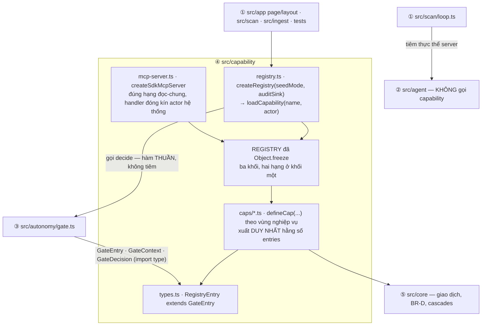
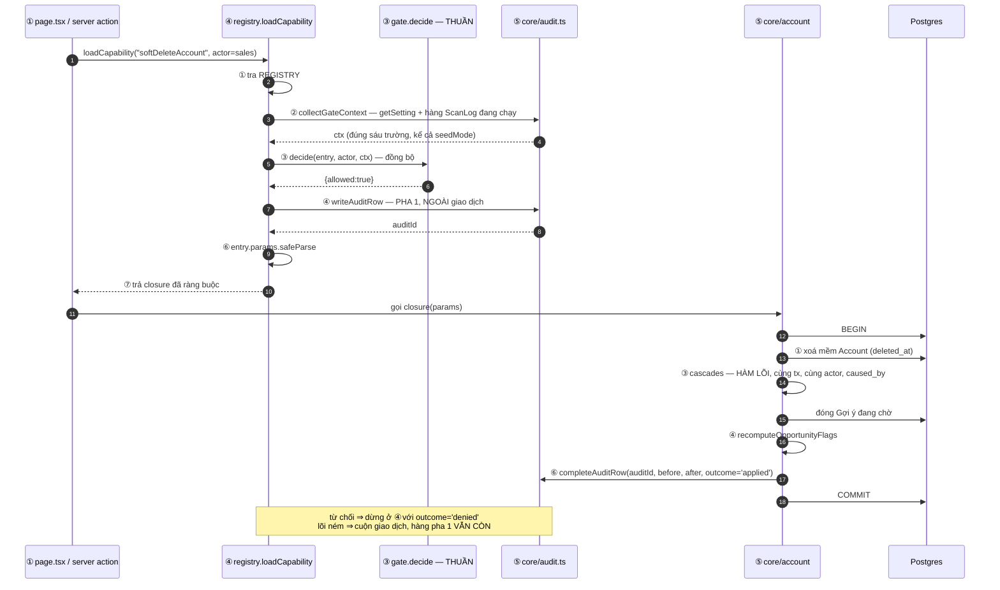

# Architecture Spine — Tầng ④ Capability

## Design Paradigm

**Sổ đăng ký đóng, dựng bằng tiêm phụ thuộc, một điểm vào trả closure bọc giao dịch.**

Tầng ④ không phải một thư viện hàm. Nó là **một cái cửa**, và cửa đó được **dựng** chứ không
được nhập sẵn: `createRegistry({ seedMode, auditSink })` (`AD-4`, `AD-GT-7`, `AD-CR-8`). Mọi thứ
khác trong thư mục chỉ tồn tại để cửa đó mở đúng.

**Cổng KHÔNG được tiêm vào.** `gate.ts` xuất một hàm thuần `decide` và các kiểu — không nhà máy,
không thể hiện, không kiểu `Gate` (`AD-GT-7`, `AD-GT-12`). `registry.ts` nhập thẳng `decide` —
`AD-1` cho `src/capability/**` nhập `src/autonomy/**` bằng lời nhập **giá trị**, nên không cần
tiêm. Tiêm chỉ có nghĩa khi bên bị tiêm có trạng thái.

Tầng này viết **sau cùng** trong năm tầng, nên phần lớn câu hỏi khó đã được cha và bốn spine
anh em chốt. Việc còn lại đúng bằng bốn thứ: **liệt kê đủ sổ đăng ký**, **hình dạng một mục**,
**gom ngữ cảnh Cổng**, và **tập phơi lên MCP**.



Ba điều đọc ra từ hình, cả ba là luật:

1. **Chiều kiểu là MỘT chiều: ③ → ④.** Tầng ④ nhập kiểu từ tầng ③ và gọi hàm của tầng ③; tầng ③
   không nhập gì từ tầng ④ (`AD-GT-12`). Cạnh *"tiêm Cổng vào sổ đăng ký"* của bản nháp đầu
   **không còn** — Cổng không có gì để tiêm.
2. `src/agent` **không có mũi tên nào** vào tầng ④. Nó là bộ biến đổi thuần (`AD-AG-3`); MCP
   server là **lớp phòng thủ**, không phải đường lấy dữ liệu.
3. Giao dịch nằm ở **tầng ⑤** (`AD-CR-7`), không ở đây. Tầng ④ chỉ mở closure và chuyền `tx`.

## Inherited Invariants

Toàn bộ `AD-1`…`AD-22` của cha, cộng những mục của bốn spine anh em ràng buộc trực tiếp lên
`src/capability/`. Read-only, không suy diễn lại, giữ nguyên số hiệu gốc.

| Inherited | Từ | Ràng buộc gì ở tầng này |
|---|---|---|
| `AD-1` | cha | Capability **chỉ lấy được qua sổ đăng ký**. Tầng ④ là tầng **duy nhất** được nhập `src/core` |
| `AD-2` | cha | Mục mang **bảy** trường `{ name, zone, risk, allowedActors, requiresSignalSource, cascades, selfLimiting }`; `zone ∈ 'tu_do' \| 'chay_ngam' \| 'ho_so_chinh_thuc'`. `CAP_MACHINE_ALLOWED` tách **hai hạng**: hạng ghi **bằng đúng sáu**, hạng đọc-chung khẳng định bằng *"không có đường ghi nào"*. `CAP_SYSTEM_INTERNAL` gồm cả **`readUserForAuth`** |
| `AD-3` | cha | Ba mục ghi mang `system`, kèm vị từ ⓐⓑⓒ |
| `AD-4` | cha | `createRegistry({ seedMode }) → { loadCapability }`; `loadCapability` **trả closure** bọc đúng một giao dịch; từ chối ghi vết ngay, ngoài giao dịch; `selfLimiting: true` bỏ qua bước ⑥⑦, **đúng NĂM mục** — `disableAi` · `writeScanLog` · `releaseAccountLock` · `recordAccountCost` · `readUserForAuth` — và trường đó **bắt buộc**, không `?:` |
| `AD-4` — phép đếm | cha | **số dòng ghi vết = số lần `decide` được gọi**, **không** phải số lần `loadCapability` được gọi. `collectGateContext` chạy trước `decide` và có thể ném; lời gọi đó chưa hề đi qua Cổng |
| `AD-5` | cha | `actor` là **tham số đầu tiên** của mọi capability |
| `AD-9` · `AD-CR-4` | cha · ⑤ | Tầng ④ **khai** danh sách cờ `BR-B` làm bẩn; lõi tính lại **cả bốn** |
| `AD-10` | cha | Kiểm-và-ghi nguyên tử khi `actor.kind === 'system'` |
| `AD-15` | cha | Tham số nghiệp vụ đọc **mỗi lần dùng** — cấm đệm |
| `AD-19` | cha | Sổ đăng ký phủ **mọi** thao tác ghi lẫn đọc |
| `AD-20` | cha | Đường của actor gieo là **bước ②**, và nó cần `ctx.seedMode` bật. `AD-GT-8` của ③ (*"`allowedActors` không bao giờ chứa nhánh gieo"*) **đã bị rút** — `AD-2` của cha khai hạng đọc-chung có `'seed'`, và cha thắng |
| `AD-21` | cha | `cascades` là **danh sách hàm nội bộ của `src/core`**, *không phải* tên mục sổ đăng ký, và **không đi qua `loadCapability`** |
| `AD-22` | cha | `queueSuggestion` suy **xác định** trong lõi |
| `AD-GT-1` | ③ | Kiểu `GateContext` **do `gate.ts` sở hữu**; **đúng sáu trường** sự kiện gồm `seedMode`; ngân sách vào bằng **tỉ lệ**; không trường vai; **một hình dạng duy nhất cho mọi actor** |
| `AD-GT-2` | ③ | `collectGateContext` chạy **mỗi lời gọi**, không đệm; lỗi gom **ném xuyên ra ngoài** và **không sinh dòng `GateDenied` nào** (`FT10`) |
| `AD-GT-7` | ③ | `gate.ts` **không xuất nhà máy, không xuất thể hiện, không xuất kiểu `Gate`**. `createRegistry({ seedMode, auditSink })`; sổ đăng ký **nhập thẳng** `decide` |
| `AD-GT-9` | ③ | Sáu mã lý do từ chối; ánh xạ HTTP thuộc tầng ① |
| `AD-GT-12` | ③ | **`GateEntry` do tầng ③ sở hữu** — `name`, `allowedActors`, `allowedRoles`, `touches`, `selfLimiting`. Tầng ④ khai `RegistryEntry extends GateEntry` và **thêm** trường của mình; tầng ③ không nhập gì từ tầng ④ |
| `AD-AG-3` | ② | `src/agent` **không gọi capability nào**; MCP server là lớp phòng thủ |
| `AD-AG-4` | ② | Khoá server `crm` nguyên văn; tên tool **bằng đúng** tên capability; input schema **không bao giờ** chứa `actor`/`userId`/`role`/`seedMode`. Cưỡng chế **ở tầng ④** |
| `AD-CR-7` | ⑤ | Một thao tác ghi là **một** giao dịch, sáu bước cố định — mở **trong lõi** |
| `AD-CR-8` | ⑤ | Ghi vết **hai pha, một hàng**: pha 1 ở sổ đăng ký ngay sau `decide`, **ngoài** giao dịch; pha 2 `completeAuditRow` **trong** lõi. `outcome` là từ vựng đóng bốn giá trị. Miễn ghi vết cho `seed` đặt ở **`auditSink` lúc dựng** |
| `AD-UI-5` | ① | Trong `src/app`, **chỉ** `page.tsx` và `layout.tsx` gọi `loadCapability` |
| `AD-UI-13` | ① | Khoá dùng **đúng hai** capability: `acquireAccountLock` · `releaseAccountLock`. **Không có `renewAccountLock`** — gia hạn là gọi lại `acquireAccountLock` với cùng `process_id`. Thêm cái thứ ba làm `T-10` đỏ |
| `AD-UI-14` | ① | Nhật ký **hai bảng**; `estimated_cost_per_account` **suy ra** từ `ScanLogEntry`, không lưu `settings` |

**Câu hỏi ranh giới giao dịch của ghi vết — đã được cha và tầng ⑤ chốt, tầng này không còn
quyền quyết.** `AD-CR-8` chọn hai pha một hàng. Nghĩa vụ còn lại của tầng ④ ghi ở `AD-CP-2`.

---

## Invariants & Rules

### AD-CP-1 — `createRegistry({ seedMode, auditSink })`; `loadCapability` trả closure, không trả thân hàm

- **Binds:** `AD-4`, `AD-GT-7`, `AD-GT-12`, `AD-CR-8`, `AD-UI-5`
- **Prevents:** một thể hiện sổ đăng ký dùng chung ở mức module, khiến `tests/` không dựng được
  hai chế-độ-gieo trong cùng tiến trình Vitest — và `entry.fn` lọt ra ngoài, phá *"chỉ lấy được
  qua sổ đăng ký"*
- **Rule — chữ ký, chốt lần cuối:**

  ```ts
  export function createRegistry(deps: { seedMode: boolean; auditSink: AuditSink }): {
    loadCapability<N extends CapName>(name: N, actor: Actor): Promise<BoundCapability<N>>
    CAP_MACHINE_ALLOWED_GHI: readonly CapName[]      // sáu tên
    CAP_MACHINE_ALLOWED_DOC: readonly CapName[]      // năm tên
    CAP_HUMAN_ONLY: readonly CapName[]
    CAP_SYSTEM_INTERNAL: readonly CapName[]
  }
  ```

  **`gate` KHÔNG còn là tham số dựng.** Bản trước tiêm một kiểu `Gate` mà `gate.ts` **không xuất**
  (`AD-GT-7`), nên nó không biên dịch được — không phải một lệch phong cách. `registry.ts` nhập
  thẳng hàm thuần `decide`; `AD-1` cho phép, và `AD-4` đặt `seedMode` ở **đúng chỗ này**:

  > *"Chế-độ-gieo là tham số DỰNG của SỔ ĐĂNG KÝ, không phải của Cổng"* — `AD-4`

  Sổ đăng ký xuất ra ngoài **đúng bốn danh sách tên** cộng `loadCapability`. **Không bao giờ**
  xuất `entry`, `entry.fn`, hay `REGISTRY`.

  `auditSink` chọn **một lần lúc dựng** (`AD-CR-8`): sink thật, hoặc sink rỗng khi chế-độ-gieo
  bật mà không có cờ giữ-ghi-vết. Tầng ④ **không có nhánh `if (seed)`** trong thân hàm nào — kể
  cả trong `loadCapability`. Chỗ duy nhất đọc `seedMode` trong thân hàm là lời gọi
  `collectGateContext(actor, seedMode)` ở `AD-CP-5` bước ②, và đó là **chuyền tham số**, không
  phải rẽ nhánh.

  `tests/` dựng **hai thực thể độc lập trong cùng tiến trình** — `seedRegistry({ seedMode: true,
  auditSink: nullSink })` cho `beforeEach`, `appRegistry({ seedMode: false, auditSink: realSink })`
  cho phần khẳng định (`AD-4`). Singleton mức module không cho phép điều đó.

### AD-CP-2 — Nghĩa vụ ghi vết của tầng ④ là **pha 1 và chỉ pha 1**

- **Binds:** `AD-4`, `AD-CR-8`, `AD-GT-2`, `NFR-10`
- **Prevents:** hai tầng cùng ghi một hàng, hoặc `outcome` bị đặt bởi bên không nhìn thấy kết
  quả thật
- **Rule:** ngay sau `decide()`, sổ đăng ký gọi `writeAuditRow(...) → auditId` cho **cả hai
  nhánh**, **ngoài** giao dịch. Nhánh từ chối dừng tại đó với `outcome = 'denied'` rồi ném
  `GateDenied`. Nhánh cho phép chuyền `auditId` xuống lõi qua `ctx`.

  Tầng ④ **không bao giờ gọi `completeAuditRow`** — đó là bước ⑥ của `AD-CR-7`, và lõi là bên
  duy nhất thấy đủ giá trị cũ lẫn giá trị mới.

  **Ba đường không sinh dòng nào, và cả ba là đúng:**

  | Đường | Vì sao không có dòng |
  |---|---|
  | `collectGateContext` ném | `AD-GT-2` — cơ sở dữ liệu chết, không phải chính sách chặn. Xếp `FT10` |
  | `actor.kind === 'seed'` không cờ | `auditSink` rỗng đã chọn lúc dựng (`AD-CR-8`) — **không** phải một nhánh `if` trong `loadCapability` |
  | Tham số sai lược đồ **trước** `decide` | không xảy ra — kiểm tham số chạy **sau** `decide` (`AD-CP-5`) |

- **Rule — phép đếm phát biểu theo `decide`, không theo `loadCapability`.** Trên từng sink:

  > **số dòng ghi vết = số lần `decide` được gọi**

  Đây là mặt chữ của `AD-4` và nó **không thay được** bằng *"số lần `loadCapability` được gọi"*:
  `collectGateContext` chạy **trước** `decide` và có thể ném (Postgres chớp một nhịp); lời gọi
  đó chưa hề đi qua Cổng nên chưa có quyết định nào để ghi. Đếm theo `loadCapability` làm phép
  kiểm **đỏ vĩnh viễn sau một lần mạng chớp**, với triệu chứng trỏ vào ghi vết chứ không vào
  mạng — đúng loại lỗi tốn nhất một giờ sáng thi.

### AD-CP-3 — Hình dạng một mục: `RegistryEntry extends GateEntry`, cộng **đúng năm** trường của tầng ④

- **Binds:** `AD-2`, `AD-9`, `AD-GT-12`, `AD-CR-4`, `AD-AG-4`
- **Prevents:** mỗi người dựng thêm một trường tiện tay, rồi `T-10` khẳng định trên một hình
  dạng không ai khai; và bước ④/⑤ của Cổng đọc `undefined` vì mục quên khai `touches`
- **Rule — chân đế là `GateEntry` của tầng ③, không phải một object trần:**

  ```ts
  import type { GateEntry } from '@/autonomy/gate'   // AD-GT-12
  export interface RegistryEntry extends GateEntry { /* … năm trường dưới … */ }
  ```

  `GateEntry` mang `name`, `allowedActors`, `allowedRoles`, `touches`, `selfLimiting`; bốn
  trường còn lại của `AD-2` — `zone`, `risk`, `requiresSignalSource`, `cascades` — tầng này khai.
  Hệ quả: `touches` và `allowedRoles` không còn là *"hai trường tầng ③ xin thêm"* mà là **hợp
  đồng ③ áp lên ④, cưỡng chế bởi trình biên dịch**. Mục viết thiếu `touches` là `TS2741`, không
  phải một bước ④ im lặng.

  Và `selfLimiting` là **bắt buộc, không `?:`** (`AD-4`) — `undefined` đọc thành *"tắt"* là đúng
  loại mặc định ngầm mà `AD` này sinh ra để chặn.

- **Rule:** năm trường thêm, **không thêm nữa**, mỗi trường có một mục bắt buộc nó:

  | Trường | Vì sao bắt buộc |
  |---|---|
  | `kind: 'read' \| 'write'` | quyết định có mở giao dịch không, và là vế khẳng định *"hạng đọc-chung không có đường ghi nào"* (`AD-2`) |
  | `params: z.ZodObject<z.ZodRawShape>` | `AD-AG-4` đòi kiểm được hình dạng tham số. **Không phải `z.ZodType`**: `AD-CP-6` truyền `entry.params.shape` cho `tool()`, mà `.shape` chỉ có trên `ZodObject` — khai rộng hơn là `TS2339` ở `mcp-server.ts`, tức lỗi **lúc biên dịch**, `npm start` chết. Helper: `defineCap<S extends z.ZodObject<z.ZodRawShape>, R>(…)`. Hệ quả phụ đúng ý: mọi `params` là object ở mức gốc — đúng thứ MCP đòi |
  | `dirtyFlags: BrBFlag[]` | `AD-9` và `AD-CR-4` đòi tầng ④ **khai** danh sách |
  | `exposeToMcp: boolean` | `AD-CP-6` |
  | `fn` · `snapshot` | thân hàm và ảnh chụp trước-ghi của `AD-4` |

  **Mọi mục viết bằng helper generic `defineCap`, không viết object literal trần.** Đây là kết
  quả đo, không phải sở thích: `satisfies Record<string, RegistryEntry>` giữ đúng suy diễn cho
  `ParamsOf<N>`, nhưng **không** nối `params` của một mục với tham số `p` trong `fn` của chính
  mục đó — `p` rơi về `any` và một lỗi gõ sai tên trường **biên dịch sạch**.

  ```ts
  function defineCap<S extends z.ZodType, R>(e: {
    /* GateEntry + bốn trường AD-2 */ params: S
    fn: (actor: Actor, p: z.infer<S>, ctx: CapContext) => Promise<R>
  }) { return e }
  ```

  **Hai trường có điều kiện, khai ở đây để không ai tưởng chúng là trường thứ sáu tiện tay:**
  `settingKeys` (`AD-CP-9`, bắt buộc trên mọi mục ghi bảng `settings`) và `writesTables`
  (`AD-CP-10`, bắt buộc trên mọi mục `kind: 'write'` của khối ba). Cả hai `?:` trên
  `RegistryEntry`, và phép kiểm khẳng định chúng **có mặt ở đúng tập mục** mà `AD` sở hữu đòi.

  Với helper, cùng lỗi đó thành `TS2551`. `z.ZodTypeAny` **không còn** ở Zod 4 — ràng buộc
  generic viết `S extends z.ZodType`.

  **Cấm `z.date()` trong `params`.** Zod 4 ném *"Date cannot be represented in JSON Schema"*
  **lúc dựng server**, và sổ đăng ký này có tham số ngày (`appendTimelineEntry`,
  `setNextAction`). Dùng `z.iso.datetime()`. Lỗi này giết tiến trình web **trước khi** giám
  khảo bấm gì, nên nó là luật chứ không phải ghi chú.

  **`params` của MỌI mục bị cấm chứa `actor`, `userId`, `role`, `seedMode`** — không chỉ mục
  phơi lên MCP như `AD-AG-4` đòi. Nâng phạm vi vì server action tầng ① chuyển thân yêu cầu
  thẳng vào `params`, nên một trường danh tính ở mục **không** phơi MCP vẫn là đường leo thang.

### AD-CP-4 — Chữ ký thân hàm giữ đúng mặt chữ `AD-5`: `actor` trước, `tx` trong `ctx`

- **Binds:** `AD-5`, `AD-4`, `AD-CR-7`
- **Prevents:** hai vùng nghiệp vụ viết hai thứ tự tham số, và `AD-5` bị nới im lặng
- **Rule:**

  ```ts
  type CapContext = { auditId: string; causedBy: CapName | null }
  // KHÔNG mang `tx`: AD-CR-7 đặt giao dịch trong LÕI. Tầng ④ mở thêm một giao dịch
  // nữa là hai giao dịch trên hai kết nối — completeAuditRow rơi ra ngoài giao dịch
  // chính và phá bất biến "pha 2 trong tx" của AD-CR-8.
  fn: (actor: Actor, params: P, ctx: CapContext) => Promise<R>
  ```

  Đoạn mã minh hoạ của `AD-4` viết `entry.fn(tx, actor, ...args)` — `tx` **trước** `actor`.
  Tầng này giữ `actor` ở vị trí đầu; xem *Xung đột với spine cha* `C1`.

  **`PrismaTx` rút kiểu từ chính `$transaction`, không đặt tên `Prisma.TransactionClient`:**

  ```ts
  type Db = ReturnType<typeof makeClient>          // client ĐÃ $extends
  type PrismaTx = Parameters<Parameters<Db['$transaction']>[0]>[0]
  ```

  `AD-14` bắt buộc lọc `deleted_at` bằng Prisma extension, tức client đã `$extends`; khi đó
  `tx` **không assignable** vào `Prisma.TransactionClient` (`TS2345`, đã đo trên Prisma 7.9.1),
  vì kiểu đó neo vào client mặc định. Đây là lỗi biên dịch chặn ngay lời gọi capability đầu tiên.

### AD-CP-5 — Kiểm tham số chạy **sau** `decide`, **trước** giao dịch

- **Binds:** `AD-4`, `AD-CR-8`, `AD-GT-1`
- **Prevents:** hoặc Cổng phải nhìn thấy tham số (phá tính thuần của `AD-GT-1`), hoặc một tham
  số rác mở một giao dịch rồi mới rơi
- **Rule:** thứ tự cố định trong `loadCapability`:

  ```
  ① tra REGISTRY[name]                  → không có: truyền thẳng undefined, decide trả
                                           unknown_capability. CẤM kiểm tồn tại tại đây
  ② collectGateContext(actor, seedMode) → seedMode do createRegistry giữ (AD-CP-1);
                                           ném thì ném xuyên (AD-GT-2), KHÔNG ghi vết
  ③ decide(entry, actor, ctx)           → đồng bộ, thuần
  ④ writeAuditRow(...)                  → pha 1, cả hai nhánh (AD-CP-2)
  ⑤ từ chối: ném GateDenied
  ⑥ entry.params.safeParse(params) → hỏng: outcome 'rule_rejected', ném, KHÔNG mở giao dịch
  ⑦ trả closure: (params) => entry.fn(actor, parsed, { auditId, causedBy })
     — tầng ④ KHÔNG mở giao dịch; lõi mở nó bên trong hàm (AD-CR-7)
  ```

  Bước ② nhận `seedMode` làm **tham số**, không tự đi tìm. Không có luật này thì `ctx.seedMode`
  là `undefined`, bước ② của `AD-4` không bao giờ cho phép, `prisma/seed.ts` gieo rỗng, và **mọi
  `T` đỏ ở `beforeEach`** — với triệu chứng trỏ vào dữ liệu nền chứ không vào Cổng.

  Bước ⑥ dùng `outcome: 'rule_rejected'` của `AD-CR-8` — **không** thêm mã mới vào từ vựng đóng.

### AD-CP-6 — `exposeToMcp` phủ **đúng hạng đọc-chung**; năm tool, `alwaysLoad`, handler đóng kín actor

- **Binds:** `AD-1`, `AD-2`, `AD-AG-3`, `AD-AG-4`, `AD-11`
- **Prevents:** `allowedTools: ["mcp__crm__*"]` khớp rỗng — triệu chứng đã đo: agent *trông
  như* gọi capability, handler chạy **0 lần**, **$1,607** một lượt
- **Rule:** `mcp-server.ts` phơi **đúng năm** mục của hạng đọc-chung (`AD-2`): `readArticle`,
  `readAccountType`, `listEnums`, `readAccountList`, `readSetting`. **Không mục ghi nào.**

  | Mối lo | Luật |
  |---|---|
  | Tên tool | **nguyên văn** tên capability; khoá server chuỗi `crm`, khai **một lần**, dùng chung cho `mcpServers` và `allowedTools` (`AD-AG-4`) |
  | Lược đồ | `tool()` của SDK nhận **`ZodRawShape`** — truyền `entry.params.shape`, **không** truyền `entry.params`, và **không** gọi `z.toJSONSchema` |
  | draft-07 | **SDK bảo đảm**, không phải đội cưỡng chế. Phép kiểm khẳng định `$schema` trong **đầu ra `tools/list`** |
  | Actor | handler **đóng kín trên actor hệ thống** (`AD-AG-4`); không tool nào nhận trường danh tính |
  | Lượt | `alwaysLoad: true` cả năm tool — SDK bật tool search mặc định và **hoãn** nạp lược đồ MCP, tốn thêm một lượt mà `AD-11` đếm |

  `AD-AG-3` nói agent **không gọi capability nào**, nên tập này là **lớp phòng thủ** và là đối
  tượng của phép đối chứng phá hoại — không phải đường lấy dữ liệu. Phương án đã loại: phơi
  rỗng, vì khi đó glob khớp rỗng và phép đo nghiệm thu của `AD-1` mất đối tượng.

### AD-CP-7 — `collectGateContext` sống ở tầng ④, trả **đúng kiểu của tầng ③**, hai truy vấn, không đệm

- **Binds:** `AD-GT-1`, `AD-GT-2`, `AD-GT-12`, `AD-11`, `AD-15`, `AD-UI-14`
- **Prevents:** vòng quét đọc bộ đếm từ `settings` trong khi `AD-UI-14` đặt nó ở Nhật ký — hai
  nguồn cho một con số; và hai tầng khai hai hình dạng `ctx` không trường ngân sách nào trùng tên
- **Rule — chữ ký, và nó là chỗ cưỡng chế:**

  ```ts
  import type { GateContext } from '@/autonomy/gate'      // AD-GT-1 sở hữu kiểu
  export function collectGateContext(actor: Actor, seedMode: boolean): Promise<GateContext>
  ```

  Kiểu **nhập từ tầng ③**, không khai lại. Thiếu một trường là `TS2739` lúc biên dịch, không
  phải `undefined` lúc chạy. Hàm sống ở `src/capability/gate-context.ts`, chạy **mỗi lời gọi**,
  không đệm, và gom **đủ sáu trường cho mọi actor** — kể cả actor người, nơi bốn số cuối không
  được đọc tới (`AD-GT-1` luật 4: một đường mã, không hai).

  | Trường | Nguồn | Truy vấn |
  |---|---|---|
  | `seedMode` | **tham số**, do `createRegistry` giữ (`AD-CP-1`) | — |
  | `aiEnabled` | `settings.ai_enabled` | ① `getSetting` gộp |
  | `modelCallsLimit` | `settings.model_calls_per_scan` | ① cùng truy vấn |
  | `budgetStopRatio` | `settings.budget_stop_ratio` | ① cùng truy vấn |
  | `modelCallsUsed` | `model_calls_used` trên hàng `ScanLog` của lượt quét **đang chạy** | ② một truy vấn |
  | `budgetUsedRatio` | `cost_used_usd / budget_usd`, **cùng một hàng `ScanLog`** | ② cùng truy vấn |

  **Ngân sách vào bằng TỈ LỆ, không bằng số tuyệt đối.** `AD-11` của cha khai `budget_warn_ratio`
  và `budget_stop_ratio` và **không có** khoá `budget_limit_usd` — bản trước của `AD` này đọc một
  khoá `settings` **không tồn tại**, tức `getSetting` ném và `FT10` nổ ở lời gọi capability đầu
  tiên. Tỉ lệ thắng; ai cần số tuyệt đối thì tự nhân, ngoài `ctx`.

  Tử số và mẫu số lấy **cùng một hàng**, nên tỉ lệ là hàm của một dòng dữ liệu chứ không phải
  phép ghép `settings` với Nhật ký. `budget_usd` của hàng đó là con số `maxBudgetUsd` mà vòng
  quét truyền cho SDK (`AD-11`) — chủ của nó là tầng ①; xem *Xung đột với spine anh em*, mục ⑤.

  **Hai truy vấn, và cả hai đi qua nguyên thuỷ nội bộ của `src/core`, không qua capability** —
  đi qua capability là đệ quy vô hạn, cùng hình dạng mà `AD-4` đã carve-out cho ghi vết.

  Không lượt quét nào đang chạy thì `modelCallsUsed = 0` và `budgetUsedRatio = 0`. Đó là giá trị
  đúng, không phải thiếu dữ liệu: `actor=human` không thuộc lượt quét nào, và bước ⑥ chỉ áp cho
  `actor=system`. Nhưng **có** hàng đang chạy mà `budget_usd` rỗng thì hàm **ném** (`AD-GT-1`) —
  cấm thay bằng giá trị mặc định, vì mặc định ở đây nghĩa là *"ngân sách vô hạn"*.

### AD-CP-8 — Tổ chức theo vùng nghiệp vụ; mỗi tệp xuất **duy nhất** `entries`

- **Binds:** `AD-1` (*"chỉ lấy được qua sổ đăng ký"*), `AD-2`
- **Prevents:** hoặc hơn năm mươi tệp với chừng ấy dòng nhập và hai dev đụng nhau ở
  `registry.ts` suốt buổi sáng, hoặc một sổ tự-đăng-ký mà tính **tập đóng** thành tai nạn lúc chạy
- **Rule:** `src/capability/caps/<area>.ts`, mỗi tệp xuất **đúng một** hằng số `entries`, mọi
  mục bọc `defineCap` (`AD-CP-3`). `registry.ts` nhập các mảnh, gộp, `Object.freeze`.

  Cưỡng chế **hai vế**: `no-restricted-imports` cấm mọi tệp **ngoài** `registry.ts` nhập
  `src/capability/caps/**`; một phép kiểm khẳng định mỗi tệp `caps/*.ts` có **đúng một** export
  tên `entries`.

  **Mẫu phải phủ cả hai dạng viết**, vì luật so khớp **chuỗi được nhập** chứ không so khớp thư
  mục: dạng tương đối `**/caps/*` **và** dạng bí danh. **Đã dựng thật 14/08:**
  `create-next-app@16.3.1 --src-dir` sinh `"@/*": ["./src/*"]`, nên dạng đúng là
  **`@/capability/caps/*`** — **không** phải `@/src/capability/caps/*`. (Bản rà trước kết luận
  ngược vì đọc template không dùng `--src-dir`.) Viết thừa `src` là mẫu không bao giờ khớp; chọn
  **một**, và `eslint.config.mjs` với `tsconfig.json` phải khớp nhau (`AD-GT-4`).

### AD-CP-9 — `enableAi` là mục riêng; mỗi mục ghi `settings` khai danh sách khoá cho phép

- **Binds:** `AD-3`, `FR-45`, `FR-47`, `T-9`, PRD §6
- **Prevents:** sau khi máy tự tắt vì chạm ngân sách, **không có đường hợp pháp nào bật lại** —
  `T-9` chỉ diễn được **một lần**; và một mục ghi `settings` chung tay bật lại phanh qua cửa sau
- **Rule:** `enableAi` nằm ở `CAP_HUMAN_ONLY`, chỉ Quản trị. `AD-3` cho `disableAi` **một
  chiều**, nhưng PRD §6 và `FR-45` cho Quản trị *"tắt/bật"* — không có mục này thì không ai bật
  lại được.

  **Mỗi capability ghi bảng `settings` khai một `settingKeys` cho phép**, và giao của mọi danh
  sách với `ai_enabled` là **rỗng** trừ `enableAi` và `disableAi`. Một phép kiểm khẳng định
  điều đó. Thiếu luật này thì `updateSetting` (`FR-44`) bật lại được phanh và tính một chiều
  của `AD-3` mất hiệu lực mà không vi phạm chữ nào.

### AD-CP-10 — Luật xếp khối, cưỡng chế được, không dựa trực giác

- **Binds:** `AD-2`, `AD-19`, `AD-21`, `T-10`
- **Prevents:** một lượt ghi được đẩy sang khối ba để giữ con số sáu
- **Rule:**

  | Khối | Vị từ thành viên |
  |---|---|
  | `CAP_MACHINE_ALLOWED` hạng **ghi** | `system ∈ allowedActors` ∧ `kind === 'write'`. **Bằng đúng sáu** |
  | `CAP_MACHINE_ALLOWED` hạng **đọc-chung** | `kind === 'read'` ∧ `allowedActors ⊇ {human, system}` ∧ `exposeToMcp`. Khẳng định: **không mục nào nhập hàm ghi của `src/core`** |
  | `CAP_HUMAN_ONLY` | `allowedActors` **không chứa** `system` |
  | `CAP_SYSTEM_INTERNAL` | `allowedActors` chỉ gồm `system`, ∧ `kind === 'read'` — **hoặc** `kind === 'write'` ∧ `writesTables` là tập con của `scan_log` · `scan_log_entry` · `account_lock` · `inference_cache` |

  Vế cuối là chỗ bịt cửa hậu: **khối ba không được ghi vào bảng domain nào.** Bốn bảng liệt kê
  hết, không có *"và tương tự"*. `closeSuggestionBySystem` **không** phải mục sổ đăng ký —
  `AD-21` khai `cascades` là **hàm nội bộ `src/core`** — nên nó không cần một ngoại lệ ở đây.

  **`readUserForAuth` khớp vế đọc của khối ba, không cần ngoại lệ:** `allowedActors: ['system']`,
  `kind: 'read'`. `AD-2` của cha đặt nó **trong** khối này, và `AD-4` cho nó `selfLimiting: true`
  vì lượt đọc **dựng nên `actor`** chạy trước khi có actor, nên phải đi bằng `system` — bấm Tắt
  AI mà bước ⑦ chặn nó thì **không ai đăng nhập được**, `T-9` và `T-1` đỏ cùng lúc.

  **Năm khẳng định của `T-10`:** hạng ghi bằng đúng sáu theo tên · hạng đọc-chung không có
  đường ghi · ba khối đôi một rời nhau · **hợp ba khối bằng đúng `Object.keys(REGISTRY)`** ·
  **`selfLimiting` bật ở đúng năm mục, theo tên** (`AD-4`). Vế thứ tư bắt được mục thêm vào
  `caps/` mà quên khai vào khối nào — không có nó, tập đóng mất nghĩa **im lặng**. Vế thứ năm
  bắt được lần nới cờ đầu tiên, và cờ đó là thứ duy nhất cho phép một capability chạy **sau khi**
  trần chạm.

---

## Sổ đăng ký — ba khối, đầy đủ

`zone` dùng ba giá trị của `AD-2`: `tu_do` · `chay_ngam` · `ho_so_chinh_thuc`. `risk` **không
tham gia quyết định**. `allowedActors` **chính là ma trận vai × hành động của PRD §6 ở dạng
mã**; hạng đọc-chung liệt thêm `'seed'` đúng như `AD-2` của cha viết. Mọi mục đều có
`touches: []` và `allowedRoles` tường minh (`AD-GT-5`, `AD-GT-12`) — hai cột đó không lặp lại
trong các bảng dưới vì chúng đồng nhất; phép kiểm khẳng định, không phải bảng.

### Khối 1 — `CAP_MACHINE_ALLOWED`

**Hạng ghi — bằng đúng sáu**, `T-10` khẳng định theo tên.

| Capability | `zone` | `risk` | `allowedActors` | Nguồn Phát hiện | `cascades` (hàm lõi) | `selfLimiting` |
|---|---|---|---|---|---|---|
| `createArticle` | `tu_do` | low | system | — | — | — |
| `createSignal` | `chay_ngam` | medium | system | — | — | — |
| `queueSuggestion` | `chay_ngam` | medium | system | **có** | `closeSupersededSuggestion` (`FR-51`) | — |
| `appendTimelineEntry` | `ho_so_chinh_thuc` | medium | sales · admin · **system** | **có** khi system | — | — |
| `setNextAction` | `ho_so_chinh_thuc` | medium | sales · admin · **system** | **có** khi system | `createNotification` (`FR-31`) | — |
| `disableAi` | `ho_so_chinh_thuc` | high | admin · **system** (chỉ tắt) | — | — | **có** |

**Hạng đọc-chung — năm mục**, khẳng định bằng *"không có đường ghi nào"*. Tất cả
`kind: read`, `zone: tu_do`, `risk: low`, `exposeToMcp: true`, `alwaysLoad: true`.

| Capability | `allowedActors` | Ai dùng |
|---|---|---|
| `readArticle` | sales · admin · system | vòng quét so hash (`FR-11`, `D18`) · `S3` · `S10` |
| `readAccountType` | sales · admin · system | dựng lời nhắc (`AD-7`) · `S3` |
| `listEnums` | sales · admin · system | biểu mẫu (`S3` `S5`) · lược đồ Phát hiện |
| `readAccountList` | sales · admin · system | tập Công ty của vòng quét (`FR-36`, `AD-12`) · `S6` |
| `readSetting` | sales · admin · system | phanh ở ranh giới Công ty (`AD-11`) · dải báo `S0` |

### Khối 2 — `CAP_HUMAN_ONLY` · 35 mục, `allowedActors` **không chứa** `system`

**Ghi — CRM làm tay, `§4`/nhóm 1**

| Capability | `zone` | `risk` | Vai | Nguồn | `dirtyFlags` | `cascades` (hàm lõi) |
|---|---|---|---|---|---|---|
| `createAccount` | `ho_so_chinh_thuc` | medium | sales · admin | `FR-1` | — | — |
| `updateAccount` | `ho_so_chinh_thuc` | medium | sales · admin | `FR-1` | — | — |
| `softDeleteAccount` | `ho_so_chinh_thuc` | **high** | sales · admin | `FR-1` `D26` | — | `closeSuggestionBySystem` · `cascadeSoftDelete` |
| `createContact` | `ho_so_chinh_thuc` | low | sales · admin | `FR-2` | — | — |
| `updateContact` | `ho_so_chinh_thuc` | low | sales · admin | `FR-2` `BR-D4` | — | — |
| `softDeleteContact` | `ho_so_chinh_thuc` | medium | sales · admin | `FR-2` | — | — |
| `createOpportunity` | `ho_so_chinh_thuc` | medium | sales · admin | `FR-3` `D44` | `BR-B1` | — |
| `updateOpportunity` | `ho_so_chinh_thuc` | medium | sales · admin | `FR-3` `BR-D9` | `BR-B1` `BR-B2` `BR-B3` | — |
| `softDeleteOpportunity` | `ho_so_chinh_thuc` | **high** | sales · admin | `FR-3` | — | — |
| `changeStage` | `ho_so_chinh_thuc` | **high** | sales · admin | `FR-4` `FR-5` `FR-8` §5.1 | `BR-B1` `BR-B2` `BR-B3` `BR-B4` | `appendStageChangeEntry` |
| `reopenOpportunity` | `ho_so_chinh_thuc` | **high** | **admin** | PRD §6 | `BR-B1` | — |
| `createActivity` | `ho_so_chinh_thuc` | low | sales · admin | `FR-6` | — | — |
| `updateActivity` | `ho_so_chinh_thuc` | low | sales · admin | `FR-6` `NFR-19` | — | — |
| `softDeleteActivity` | `ho_so_chinh_thuc` | medium | sales · admin | `FR-6` | — | — |
| `softDeleteTimelineEntry` | `ho_so_chinh_thuc` | medium | sales · admin | `FR-40` | — | — |
| `setWatching` | `ho_so_chinh_thuc` | low | sales · admin | `FR-35` | — | — |
| `markNotificationSeen` | `tu_do` | low | sales · admin | `FR-31` | — | — |

**Ghi — ba lối ra Gợi ý, hoàn tác, phản hồi Phát hiện**

| Capability | `zone` | `risk` | Vai | Nguồn | `dirtyFlags` |
|---|---|---|---|---|---|
| `approveSuggestion` | `ho_so_chinh_thuc` | medium | sales · admin | `FR-20` `FR-22` `T-5` | `BR-B1` |
| `editThenApprove` | `ho_so_chinh_thuc` | medium | sales · admin | `FR-20` `FR-22` `T-5` | `BR-B1` |
| `dropSuggestion` | `chay_ngam` | low | sales · admin | `FR-20` `FR-42` | — |
| `undo` | `ho_so_chinh_thuc` | medium | sales · admin | `FR-26` `FR-32` `D14` `T-7` | `BR-B1` |
| `rateSignal` | `chay_ngam` | low | sales · admin | `FR-42` | — |

**Ghi — vận hành và Quản trị**

| Capability | `zone` | `risk` | Vai | Nguồn | `settingKeys` |
|---|---|---|---|---|---|
| `switchSnapshotVersion` | `tu_do` | medium | sales · admin | `FR-50` §3 | — |
| `updateSetting` | `ho_so_chinh_thuc` | **high** | **admin** | `FR-44` `D38` | mọi khoá **trừ** `ai_enabled` |
| `enableAi` | `ho_so_chinh_thuc` | **high** | **admin** | `FR-45` `FR-47` `AD-CP-9` | **chỉ** `ai_enabled` |

**Đọc — bề mặt giao diện.** Tất cả `kind: read`, `zone: tu_do`, `risk: low`,
`exposeToMcp: false`. `S4` và `S7` đã hoãn ở spine cha nên không có mục tương ứng.
`readAccountList` **không** ở đây — nó thuộc hạng đọc-chung (`AD-2`).

| Capability | Bề mặt | Vai | Nguồn |
|---|---|---|---|
| `readTodayBoard` | `S1` | sales · admin | `FR-7` `FR-9` `FR-10` `FR-25` `FR-30` `FR-48` |
| `readAccountDetail` | `S3` | sales · admin | `FR-1` `FR-2` `FR-6` `FR-11`–`FR-17` `FR-35` `FR-42` |
| `readOpportunityDetail` | `S5` | sales · admin | `FR-3` `FR-7` `FR-8` `FR-27`–`FR-34` |
| `readCurrentFieldValue` | `S2` | sales · admin | `FR-19` `FR-51` — giá trị **sống lúc mở** |
| `readSuggestionQueue` | `S2` | sales · admin | `FR-18` `FR-19` `FR-51` |
| `readSnapshotView` | `S10` | sales · admin | `FR-15` `FR-50` `T-3` |
| `readScanLog` | `S9` | sales · admin | `FR-38` `FR-39` `AD-UI-14` |
| `readNotifications` | `S0` | sales · admin | `FR-31` |
| `readMetrics` | `S8` | **admin** | `FR-41`–`FR-43` `D28` `AD-CR-5` |
| `readSettings` | `S8` | **admin** | `FR-44` `D28` |

Bốn mục **chỉ Quản trị** — `reopenOpportunity`, `updateSetting` + `enableAi`, `readMetrics`,
`readSettings` — đúng bằng bốn dòng in đậm của PRD §6, và đó là chỗ `D28` sống: **chặn ở tầng
nghiệp vụ**, không chỉ ẩn menu.

### Khối 3 — `CAP_SYSTEM_INTERNAL` · 10 mục, `allowedActors` chỉ gồm `system`

| Capability | `kind` | `zone` | `writesTables` | `selfLimiting` | Nguồn |
|---|---|---|---|---|---|
| `readSnapshot` | read | `tu_do` | — | — | `FR-36` `FR-50` — vòng quét đọc lại nguồn |
| `readScanCursor` | read | `tu_do` | — | — | `AD-11` điều kiện dừng 3 · `AD-UI-12` |
| `readInferenceCache` | read | `tu_do` | — | — | `AD-16` `NFR-4` |
| `readUserForAuth` | read | `tu_do` | — | **có** | `AD-2` `AD-4` `T-1` `T-9` — lượt đọc dựng nên `actor` |
| `writeInferenceCache` | write | `tu_do` | `inference_cache` | — | `AD-16` |
| `acquireAccountLock` | write | `tu_do` | `account_lock` | — | `AD-UI-13` `FR-38` |
| `releaseAccountLock` | write | `tu_do` | `account_lock` | **có** | `AD-UI-13` `AD-4` |
| `writeScanLog` | write | `tu_do` | `scan_log` | **có** | `FR-39` `AD-UI-14` |
| `recordAccountCost` | write | `tu_do` | `scan_log_entry` | **có** | `AD-11` `FR-39` `AD-UI-14` — chi phí thật mỗi Công ty |

**`selfLimiting: true` bật ở ĐÚNG NĂM mục trên toàn sổ** (`AD-4`): `disableAi` ở khối một, cộng
`writeScanLog` · `releaseAccountLock` · `recordAccountCost` · `readUserForAuth` ở khối này.
`AD-4` phát biểu luật theo **hình dạng lỗi**, không theo từng ca: *một capability chạy tại hoặc
sau thời điểm trần chạm, hoặc phải sống khi phanh tắt, không được để chính trần đó chặn.*

| Mục | Nếu bị chặn thì hỏng gì |
|---|---|
| `releaseAccountLock` | **khoá không nhả.** `AD-12` suy *"vòng đang chạy"* từ khoá, lease 10 phút — ở nhịp 60 giây là **10 vòng liên tiếp bị bỏ** |
| `recordAccountCost` | `estimated_cost_per_account` (`AD-UI-14`) mất mẫu đo đúng ở Công ty **đắt nhất** — chính chỗ luật đơn vị công việc cần |
| `readUserForAuth` | bấm Tắt AI thì **không ai đăng nhập được**; `T-9` và `T-1` đỏ cùng lúc |

`acquireAccountLock` **cố ý không mang cờ**: nó chỉ có nghĩa khi vòng
còn được phép làm việc mới, nên để trần chặn chúng là **đúng** — vòng dừng sạch ở ranh giới Công
ty (`AD-11`) rồi nhả khoá bằng mục đã miễn ở trên.

**Hai đổi tên theo cha, không phải theo tầng này:**

| Tên tầng ④ dùng trước | Tên đúng | Vì sao |
|---|---|---|
| `writeScanLogEntry` | **`recordAccountCost`** | `AD-2` và `AD-11` của cha gọi thế; `T-10` khẳng định **theo tên**, nên tên là hợp đồng chứ không phải nhãn |
| `authenticateUser`, xếp **ngoài** sổ | **`readUserForAuth`**, **trong** khối ba | `AD-2` của cha đặt nó trong khối này. Lý do loại cũ — *"chạy trước khi có `actor`"* — không đứng được: `AD-4` chốt nó đi bằng `actor.kind = 'system'`, đúng như mọi mục khối ba |

**Không phải capability, cố ý:** dòng ghi vết (`AD-2`) · `getSetting` và hàng `ScanLog` mà
`collectGateContext` đọc (`AD-CP-7`) · mọi hàm `cascades` (`AD-21`: hàm nội bộ `src/core`) ·
cờ `BR-B` (`AD-CR-4`) · `estimated_cost_per_account` (`AD-UI-14`: suy ra, không ghi) · **tài
khoản người dùng** — PRD §6 khai cả ba vai đều `❌`, nên `prisma/seed.ts` gieo hai tài khoản của
`TR-2` bằng quyền nhập Prisma mà `AD-1` cấp riêng cho `prisma/**`.

**Tổng: 11 + 35 + 10 = 56 mục.** Thêm màn hình thì thêm mục đọc vào khối hai — hạng ghi vẫn
bằng đúng sáu, `T-10` không đỏ.

---

## Consistency Conventions

| Mối lo | Quy ước |
|---|---|
| Tên capability | Tiếng Anh, động từ trước, `camelCase` |
| Tên tệp trong `caps/` | `kebab-case` theo vùng nghiệp vụ |
| Khai một mục | `defineCap({...})`, **không** object literal trần (`AD-CP-3`) |
| Xuất từ `caps/*.ts` | **duy nhất** `entries` |
| Xuất từ `registry.ts` | `createRegistry` · bốn danh sách **tên**. Không bao giờ `entry` hay `entry.fn` |
| Tham số ngày | `z.iso.datetime()`. **Cấm** `z.date()` — ném lúc dựng server |
| Lỗi | Cổng: `GateDenied(reason)` (`AD-GT-9`, sáu mã). Tham số: `rule_rejected`. Lõi: `BusinessRuleError` (`AD-CR-3`). Tầng ④ **không bắt** cái nào |
| Giao dịch | Mở trong **lõi** (`AD-CR-7`); tầng ④ chỉ chuyền `tx` qua `ctx` |
| Ghi vết | Tầng ④ gọi **pha 1**; lõi gọi **pha 2** (`AD-CR-8`) |
| Kiểm thử | `tests/capability/<area>.test.ts`; tập đóng ở `tests/T-10.test.ts` |

---

## Phân tích ranh giới

| # | Ranh giới | Cái gì đi qua | Định dạng | Tần suất | Khối lượng |
|---|---|---|---|---|---|
| 1 | ④ → ③ `decide` | `(entry, actor, ctx)` vào; `GateDecision` ra | lời gọi hàm TS **thuần, đồng bộ** | **một lần** mỗi `loadCapability` | `ctx` đúng sáu trường |
| 2 | ④ → ⑤ Lõi | `(actor, params, ctx)` vào; bản ghi hoặc `BusinessRuleError` ra | lời gọi hàm TS, `actor` tham số đầu | một lần mỗi lời gọi được duyệt | bản ghi đơn, hoặc danh sách chặn trên ≤15 Công ty |
| 3 | ④ → ② MCP | năm tool chỉ-đọc | stdio JSON do SDK quản; lược đồ **SDK sinh** từ `ZodRawShape` | **kỳ vọng bằng 0** (`AD-AG-3`); mỗi lần gọi là bất thường ghi mã `FT4` | `readArticle` 2–5 KB · `listEnums` ~1 KB |

| # | Bên gọi chịu | Bên nhận chịu | Hỏng thì |
|---|---|---|---|
| 1 | gom `ctx` đủ **sáu** trường kể cả `seedMode`, **mỗi lời gọi**, không đệm | quyết định theo bảy bước, không I/O | gom hỏng ⇒ ném xuyên, **không dòng ghi vết nào**, xếp `FT10` (`AD-GT-2`) |
| 2 | ghi vết pha 1; chuyền `tx` và `auditId` | mở giao dịch, sáu bước `AD-CR-7`, gọi `completeAuditRow` | lõi ném ⇒ giao dịch cuộn; hàng ghi vết pha 1 **vẫn còn**, `outcome` giữ nguyên |
| 3 | tên tool khớp sổ đăng ký; không lộ trường danh tính; `alwaysLoad` | không giữ trạng thái | mô hình gọi tool ⇒ ghi `FT4` vào Nhật ký, **không** dừng vòng (`AD-AG-3`) |

Ranh giới 3 là ranh giới duy nhất mà một bên không phải mã của đội, và vì nó **chỉ-đọc**, một
lượt mô hình bị chiếm quyền hoàn toàn vẫn không đổi được một byte nào.

---

## Kịch bản đáng vẽ — `loadCapability` từ gom tới ghi

Chọn kịch bản này vì nó là chỗ **duy nhất** ba quyết định của tầng gặp nhau: thứ tự bảy bước
(`AD-CP-5`), ghi vết hai pha chia giữa hai tầng (`AD-CP-2`), và giao dịch thuộc về lõi
(`AD-CR-7`). Ca vẽ: `softDeleteAccount` do Sales bấm, kéo theo hàm cascade `D26`.



Hai vế phải đọc ra được: **hàng ghi vết ra đời trước giao dịch nên không lời gọi nào biến mất
không dấu vết**, và **`outcome` chỉ được đặt bởi bên nhìn thấy kết quả thật**.

---

## Structural Seed

```text
src/capability/
  registry.ts          # AD-CP-1 — createRegistry(seedMode, auditSink) -> loadCapability
                       #   nơi DUY NHẤT gọi decide() và nơi DUY NHẤT gọi writeAuditRow pha 1
  types.ts             # AD-CP-3, AD-CP-4 — RegistryEntry extends GateEntry (③ sở hữu chân đế)
                       #   defineCap, CapContext, PrismaTx
  gate-context.ts      # AD-CP-7 — trả GateContext của tầng ③ (sáu trường)
                       #   getSetting + hàng ScanLog đang chạy; ngân sách là TỈ LỆ
  mcp-server.ts        # AD-CP-6 — createSdkMcpServer('crm'), năm tool, .shape, alwaysLoad
  caps/                # AD-CP-8 — mỗi tệp xuất DUY NHẤT `entries`; chỉ registry.ts nhập được
    accounts.ts        #   create/update/softDeleteAccount · readAccountList · readAccountDetail
                       #   readAccountType · setWatching
    contacts.ts        #   create/update/softDeleteContact
    opportunities.ts   #   create/update/softDelete · changeStage · reopenOpportunity
                       #   readOpportunityDetail · readTodayBoard
    activities.ts      #   create/update/softDeleteActivity
    timeline.ts        #   appendTimelineEntry (AD-3) · softDeleteTimelineEntry
    articles.ts        #   createArticle · readArticle · readSnapshot · readSnapshotView
                       #   switchSnapshotVersion
    signals.ts         #   createSignal · rateSignal · listEnums
    suggestions.ts     #   queueSuggestion · approve/editThenApprove/drop
                       #   readSuggestionQueue · readCurrentFieldValue
    next-action.ts     #   setNextAction (AD-3) · undo · readNotifications · markNotificationSeen
    scan.ts            #   readSetting · readScanCursor · read/writeInferenceCache
                       #   acquire/renew/releaseAccountLock · writeScanLog · recordAccountCost
                       #   readUserForAuth (AD-2 khối ba)
    admin.ts           #   disableAi · enableAi · updateSetting · readSettings · readMetrics
                       #   readScanLog
tests/
  capability/          # một tệp một vùng, đối xứng caps/
  T-10.test.ts         # AD-2 + AD-CP-10 — bốn khẳng định, và hai vế của phép kiểm ranh giới
```

Mười hai tệp trong `caps/`, không phải 55. Hai dev chia theo tệp mà không đụng `registry.ts`
quá một lần mỗi người.

---

## Capability → Architecture Map

| Nhóm `§4` / bề mặt | Khối | Chi phối bởi |
|---|---|---|
| 1 — CRM làm tay | khối 2 (17 ghi) | `AD-5`, `AD-CR-4`, `AD-14`, `AD-CP-3` |
| 2 — Đọc nguồn, rút Phát hiện | khối 1 hạng ghi + hạng đọc-chung | `AD-AG-3`, `AD-AG-4`, `AD-CP-6` |
| 3 — Hàng đợi gợi ý | `queueSuggestion` + ba lối ra ở khối 2 | `AD-22`, `FR-51`, `AD-21` |
| 4 — Tự đặt Việc tiếp theo | `setNextAction` + `undo` | `AD-3`, `AD-10`, `AD-CR-7` |
| 5 — Vòng quét | khối 3 (9 mục) + hạng đọc-chung | `AD-11`, `AD-UI-13`, `AD-UI-14` |
| 6 — Bảng Quản trị | khối 2 (4 mục Quản trị) + `disableAi` | `AD-4` bước ⑤, `AD-CP-9` |
| Nạp dữ liệu BTC | mọi mục ghi, qua bước ② | `AD-20`, `AD-4` bước ②, `AD-CR-8` `auditSink` |

---

## Xung đột với spine cha

Tám mục, một đã đóng. Tầng này **không sửa** spine cha, ontology, hay ma trận — nêu lên để cha
quyết. Va chạm với **spine anh em** đi ở mục riêng bên dưới, không trộn vào đây.

| # | Chỗ | Vấn đề | Tầng ④ làm gì |
|---|---|---|---|
| `C1` | `AD-4` đoạn mã | Viết `entry.fn(tx, actor, ...args)` — `tx` **trước** `actor` — trong khi `AD-5` đòi `actor` là **tham số đầu tiên** của mọi capability | `AD-CP-4` giữ đúng mặt chữ `AD-5`: `fn(actor, params, ctx)` với `tx` trong `ctx`. Cần cha xác nhận đoạn mã là minh hoạ |
| `C2` | `AD-2` khối ba · Structural Seed | Cả hai vẫn liệt kê `closeSuggestionBySystem` như **một mục sổ đăng ký**, trong khi `AD-21` bản mới khai `cascades` là **hàm nội bộ `src/core`, không phải tên mục, không đi qua `loadCapability`**. Mâu thuẫn **nội tại trong cùng một tệp** | `AD-CP-10` theo `AD-21`: nó không phải mục. **Chặn** — nếu cha giữ nó là mục thì `AD-CP-10` và bảng khối ba phải đổi |
| `C3` | Structural Seed của cha | Bảng *"Sổ đăng ký Capability — tập đóng"* vẫn in **chín mục cũ**, không có `readAccountList` và `readSetting`, trong khi `AD-2` bản mới đã tách **sáu ghi + năm đọc-chung**. Hai chỗ trong cùng tệp nói khác nhau | Spine này theo `AD-2`. **Chặn** — `T-10` viết theo bảng nào thì ra hai kết quả khác nhau |
| `C4` | `AD-2` dòng hạng đọc-chung | **Đã đóng.** `AD-GT-8` của tier ③ đã bị rút ở lượt 14/08 — cha thắng, hạng đọc-chung giữ `['human','system','seed']` | Spine này theo `AD-2`. Lỗ hổng còn lại — actor gieo **đọc được** trong tiến trình dựng với `seedMode` tắt, vì bước ③ cho qua — vẫn mở, và nó là lỗ hổng của **cha**, không của tầng này |
| `C5` | `AD-3` | `disableAi` **một chiều**, không mục nào bật AI lại, trong khi PRD §6 và `FR-45` cho Quản trị *"tắt/bật"* | `AD-CP-9` thêm `enableAi` vào khối hai. Không đỏ `T-10` |
| `C6` | `AD-6` ở ranh giới ④↔② | *"JSON Schema bắt buộc draft-07, phép kiểm khẳng định `$schema` sinh ra"* mô tả một lời gọi `z.toJSONSchema` mà **đội không còn thực hiện**: `tool()` của SDK nhận `ZodRawShape` và **tự** chuyển đổi, tự ghim draft-07 (đã đo trên 0.3.232) | `AD-CP-6` khẳng định trên **đầu ra `tools/list`**. `AD-6` vẫn đúng cho lược đồ Phát hiện của `src/agent`, chỉ **không** đúng cho lược đồ tool |
| `C7` | `AD-1` dòng `@prisma/client` | Prisma 7 **cấm `url` trong `datasource`** (`P1012`), bắt buộc driver adapter cộng `prisma.config.ts`, và generator đổi sang `prisma-client` có `output` bắt buộc — **đường nhập không còn là `@prisma/client`** | Ngoài phạm vi tầng ④ nhưng nó làm dòng danh-sách-cho-phép của `AD-1` trỏ vào một tên module không còn tồn tại. Báo lên cha và tier ⑤ |
| `C8` | *Cây nguồn* của cha, dòng `gate.ts` | In `createGate({ seedMode }) → decide()`, trong khi `AD-4` **trong cùng tệp** viết *"chế-độ-gieo là tham số dựng của SỔ ĐĂNG KÝ, không phải của Cổng"*. Mâu thuẫn **nội tại**, và nó chính là nguồn của bản `createRegistry({ gate })` mà `AD-CP-1` từng khai | `AD-CP-1` theo `AD-4`: `createRegistry({ seedMode, auditSink })`, **không có `createGate`**. Cha sửa dòng cây nguồn — nếu không, người đọc cây nguồn trước `AD-4` sẽ dựng lại đúng lỗi này |

---

## Xung đột với spine anh em

Mặt cắt ③↔④ là chỗ va chạm nặng nhất trong năm tầng: hai spine con dựng trên **hai ảnh chụp khác
nhau** của cha, và cho tới lượt 14/08 **không spine con nào có mục để ghi va chạm với anh em** —
chỉ có mục *Xung đột với spine cha*, nên bốn va chạm nặng nhất không có chỗ nào hiện ra. Bảng
dưới đã **hoà giải xong**; tầng ③ ghi bảng đối xứng ở spine của nó.

| # | `AD` của tôi | `AD` của anh em | Lệch cái gì | Ai thắng, và vì sao |
|---|---|---|---|---|
| ① | `AD-CP-3` · `AD-CP-1` | `AD-GT-12` của ③ (mới) | Tôi khai `RegistryEntry` rồi ③ nhập nó — chiều sở hữu ngược | **③ thắng.** `RegistryEntry` mang `params: z.ZodType` và `fn` mang `PrismaTx`, nên chiều cũ kéo Zod + Prisma vào đồ thị **kiểu** của `src/autonomy`. `§7` nghiệm thu chạy `npm test` **trước** `prisma generate`, nên `gate.ts` đỏ trên clone sạch dù bộ kiểm của Cổng không cần một byte dữ liệu. Tôi khai `RegistryEntry extends GateEntry` |
| ② | `AD-CP-7` | `AD-GT-1` của ③ | Tôi gom **năm** trường, ③ khai **sáu**, và **không trường ngân sách nào trùng tên**: tôi có `budgetSpentUsd`/`budgetLimitUsd`, ③ có `budgetUsedRatio`/`budgetStopRatio`. Nặng nhất: tôi **không gom `seedMode`** | **③ thắng ở hình dạng, CHA thắng ở ngân sách.** Kiểu `GateContext` do `gate.ts` sở hữu, tôi nhập và trả **đúng nó** — lệch là lỗi biên dịch. `AD-11` của cha **không có** khoá `budget_limit_usd`, nên bản cũ của tôi đọc một khoá `settings` không tồn tại: `getSetting` ném và `FT10` nổ ở lời gọi capability **đầu tiên**. Và `ctx.seedMode` `undefined` làm bước ② không bao giờ cho phép → `prisma/seed.ts` gieo rỗng → **mọi `T` đỏ ở `beforeEach`** |
| ③ | `AD-CP-1` | `AD-GT-7` của ③; `AD-4` của cha; *Cây nguồn* của cha | Ba chữ ký `createRegistry` đang lưu hành, và tôi tiêm một kiểu `Gate` mà `gate.ts` **không xuất** | **`AD-4` của cha thắng:** `createRegistry({ seedMode, auditSink }) → { loadCapability }`. Bản của tôi không biên dịch được, không phải một lệch phong cách |
| ④ | Khối ba, bảng `selfLimiting` | `AD-4` của cha | Tôi khai `selfLimiting` bật ở **đúng hai** mục; cha đã vá lên **năm** và làm trường đó **bắt buộc** | **Cha thắng.** Thiếu `releaseAccountLock` thì khoá không nhả và `AD-12` treo 10 vòng; thiếu `readUserForAuth` thì bấm Tắt AI là không ai đăng nhập được |
| ⑤ | `AD-CP-7` trường `modelCallsUsed` và `budgetUsedRatio` | `AD-UI-11`…`AD-UI-14` của **tầng ①** (`src/scan/loop.ts`) | Không ai khai **ai tăng `ScanLog.model_calls_used`** và ở **hạt nào**; cũng không ai khai ai đặt mẫu số của tỉ lệ ngân sách | **Chốt hạt: ngay sau MỖI lệnh gọi mô hình**, do `src/scan/loop.ts` ghi qua `writeScanLog`. Bước ⑥ so `modelCallsUsed >= modelCallsLimit` ở **mỗi lời gọi capability**; tăng ở ranh giới Công ty thì suốt một Công ty Cổng đọc số cũ và trần 20 thành **trang trí** — `AD-11` điều kiện dừng 3 mất hiệu lực đúng cửa sổ nó cần. **Chủ cài đặt: tầng ①.** Mẫu số cùng chủ: `budget_usd` trên hàng `ScanLog` là con số `maxBudgetUsd` vòng quét truyền cho SDK. Tầng ① phản đối thì phản đối vào đây |
| ⑥ | Khối ba, *"Không phải capability"* | `AD-2` của cha | Tôi gọi nó `authenticateUser` và xếp **ngoài** sổ; cha gọi `readUserForAuth` và đặt **trong** `CAP_SYSTEM_INTERNAL` | **Cha thắng**, cả tên lẫn chỗ đứng. Lý do loại cũ — *"chạy trước khi có `actor`"* — không đứng được: `AD-4` chốt nó đi bằng `actor.kind = 'system'` |
| ⑦ | `C4` | `AD-GT-8` của ③ | Tôi dựng `C4` trên `AD-GT-8` | **`AD-2` của cha thắng.** ③ đã rút `AD-GT-8`; `C4` không còn đối tượng |
| ⑧ | `AD-CP-2` phép đếm | `AD-4` của cha | Tôi đếm *"số lần `loadCapability` chạy tới sau `decide`"*; cha đếm **số lần `decide` được gọi** | **Cha thắng** — hai cách nói không tương đương khi `collectGateContext` ném, và cách của tôi làm phép kiểm đỏ vĩnh viễn sau một lần Postgres chớp |

Nguyên nhân chung: cha bị viết lại giữa lúc năm lượt tầng chạy song song. Bên nào cũng không sai
lúc viết. Trọng tài là bản cha hiện hành, và khi cha im lặng thì trọng tài là **bên nào bị lỗi
biên dịch nếu sai**.

---

## Deferred

- **Gộp hay tách `undo`.** Đang là **một** mục với `targetKind` phân nhánh, theo cách `AD-2`
  viết tên nó. Tách thành hai là đổi tên **trong khối hai** — không chạm `T-10`. Quyết khi viết
  `tests/T-7`.
- **Glob `mcp__crm__*` có thực sự khớp không.** Tài liệu cho phép glob **sau** tiền tố server
  có thật, nhưng có một báo lỗi mở nói nó im lặng không khớp, và người rà **không tái hiện
  được**. Kiểm tay sáng 15/08; hỏng thì liệt kê **năm tên tool đầy đủ** thay cho glob. Đây là
  đường ngắn nhất tới triệu chứng `$1,607` mà `AD-AG-4` mô tả.
- **Phân trang cho capability đọc.** Cỡ 15 Công ty không đòi. `readAccountList` nhận tham số lọc
  nhưng chưa nhận con trỏ trang.

**Không hoãn, cố ý:** thêm capability lúc chạy (tập đóng của `AD-2` cấm) · một cơ chế cấu hình
thứ hai cho ngưỡng (`AD-15`) · bất kỳ đường nào cho `src/agent` gọi capability (`AD-AG-3`).
