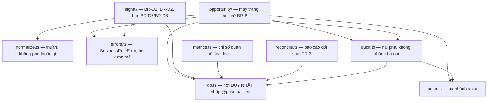
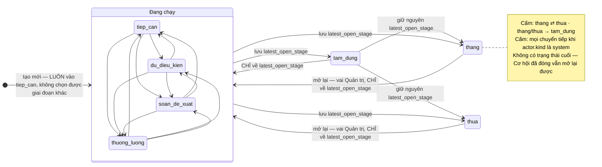
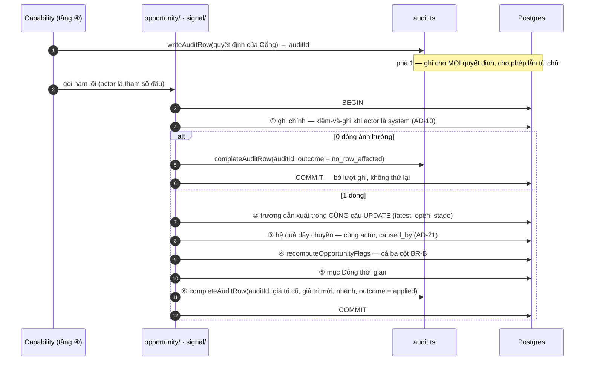

# Architecture Spine — Tầng ⑤ Lõi domain

Đây là spine con. Nó **không** phát biểu lại `AD-1`…`AD-22`; nó chỉ chốt cái cha để mở.
Lý do của từng quyết định nằm ở `.memlog.md`, kèm phương án đã loại.

## Design Paradigm

**Luật là hàm; kho dữ liệu canh hình dạng.** Mỗi luật `BR-D` có đúng một nơi phát biểu.
Ràng buộc CSDL không lặp lại luật — nó chỉ giữ những hình dạng mà một hàm TypeScript
không giữ nổi khi ai đó đi vòng qua mã ứng dụng (migration, sửa tay, `psql`).

Bên trong `src/core`, chiều phụ thuộc một chiều, không vòng:



`normalize.ts`, `errors.ts`, `actor.ts` **không nhập gì** — kể cả `db.ts`. `opportunity/`
và `signal/` không nhập nhau: điểm nối duy nhất giữa Phát hiện và Cơ hội là
`setNextAction`, và nó sống ở `opportunity/` vì ô đích thuộc Cơ hội.

## Inherited Invariants

Ràng buộc chỉ đọc, mang mã gốc. Không suy diễn lại, không nới.

| Thừa kế | Ràng buộc gì ở tầng này |
| --- | --- |
| `AD-1` | `src/core` là nơi **duy nhất** nhập `@prisma/client`; lọc `deleted_at` ở đúng một chỗ trong lõi. Cưỡng chế bằng `no-restricted-imports` + `allowTypeImports`, và khoá đó vào luật lõi đúng ở **`eslint >= 9.37.0`** — ở `9.36` cấu hình làm ESLint **chết lúc nạp**, tức ranh giới `src/core` không còn ai canh |
| `AD-2` | Sổ đăng ký là tập đóng ba khối; lõi không tự khai capability. **Hạng ghi** của `CAP_MACHINE_ALLOWED` đúng **sáu** mục; `CAP_SYSTEM_INTERNAL` đúng **năm**: `writeScanLog` · `acquireAccountLock` · `releaseAccountLock` · `recordAccountCost` · `readUserForAuth`. Hai mục cuối là mới — chúng đòi lõi có chỗ chứa, xem `AD-CR-13`. Ghi vết **không** nằm trong ba khối |
| `AD-3` | Ba chạm ghi của máy; vị từ ba nhánh ⓐⓑⓒ của `setNextAction` là hợp đồng lõi phải cài |
| `AD-4` | `writeAuditRow` là nguyên thuỷ nội bộ, gọi thẳng, **không** qua Cổng, **không** có nhánh bỏ ghi. Phép đếm ghi vết là **số lần `decide` được gọi**, không phải số lần `loadCapability` được gọi. Chế-độ-gieo và `auditSink` là tham số dựng của **sổ đăng ký**: `createRegistry({ seedMode, auditSink }) → { loadCapability }`; kiểu `GateEntry`/`GateContext` do tầng ③ sở hữu, `RegistryEntry extends GateEntry`. Bước ⑥/⑦ bỏ qua với `selfLimiting: true` — **đúng năm** mục, trường **bắt buộc**, không `?:` |
| `AD-5` | `actor` là tham số đầu tiên; kiểu `{ kind:'human', userId, role } \| { kind:'system' } \| { kind:'seed' }` với `role: 'sales' \| 'admin'` — **từ vựng đóng hai giá trị**, không `vai`, không `quan_tri`. Không mặc định, không ngữ cảnh ngầm |
| `AD-6` | Lõi đối chiếu ontology §8; một phép kiểm so enum ontology với `schema.prisma` |
| `AD-7` | Lõi không bao giờ dựng lời nhắc và không biết gì về ra biên |
| `AD-8` | Claim buộc neo nguồn; đích so khớp câu trích là **bản chuẩn hoá** |
| `AD-9` | `BR-D` ném lỗi; `BR-B` hai hạng — cờ trên hàng lúc ghi, chỉ số quần thể lúc đọc trong `metrics.ts` |
| `AD-10` | Ghi với `actor.kind` là `system` chạy kiểm-và-ghi nguyên tử, vế `WHERE` lặp **toàn bộ** vị từ |
| `AD-11` | Trần lượt và điều kiện dừng ở `src/scan`; lõi chỉ cấp `settings` và bảng Nhật ký |
| `AD-12` | Khoá vòng quét là hàng `account_lock` có lease; trạng thái *đang chạy* suy từ khoá |
| `AD-13` | Thứ tự phân xử; riêng **hình dạng lưu trữ** thì lược đồ thắng. Hai chỉ số định nghĩa ở đúng `metrics.ts` |
| `AD-14` | Mọi bảng có `deleted_at`; lõi không phát sinh `DELETE`; `timestamptz` UTC; ngày làm việc theo thị trường khách |
| `AD-15` | Mọi tham số nghiệp vụ ở bảng `settings`, đọc **mỗi lần dùng**; lõi không có hằng số nghiệp vụ biên dịch cứng |
| `AD-16` | Khoá `inference_cache` không chứa thời gian |
| `AD-17` | Lõi không biết tên trường nguồn của BTC |
| `AD-18` | `normalize.ts` là nơi **duy nhất** chuẩn hoá, thuần, không thấy thẻ HTML; có `normalizer_version` |
| `AD-19` | Mọi hàm đọc của lõi đều có một capability đọc tương ứng ở tầng ④ |
| `AD-20` | `seed` bỏ qua vị từ vận hành, mặc định **không** sinh ghi vết; cờ `BR-B` vẫn do lõi tính |
| `AD-21` | Hệ quả dây chuyền chạy **cùng giao dịch, cùng actor**, ghi vết mang `caused_by` |
| `AD-22` | `queueSuggestion` suy xác định trong lõi; bất biến giữ bằng ràng buộc unique một phần |
| Consistency Conventions (cha) | `snake_case` cột, tên thực thể tiếng Anh, `Decimal(14,2)` + `currency`, `BusinessRuleError` có mã, ghi vết vào **bảng** |

---

## Invariants & Rules

### AD-CR-1 — Máy trạng thái Cơ hội cưỡng chế hai lớp: hàm thuần quyết định, CSDL canh hình dạng

- **Binds:** `src/core/opportunity/transitions.ts`, `prisma/schema.prisma`, PRD §5.1, `D42`, `D43`, `D44`, `BR-D11`, `T-1`
- **Prevents:** hai người dựng hai bảng chuyển tiếp khác nhau — một người đọc PRD §5.1, một người đọc dòng chú thích trong cây nguồn — rồi cùng một cú kéo thả cho hai kết quả
- **Rule — bảng chuyển tiếp là một hằng số thuần**, `TRANSITIONS`, và
  `canTransition(from, to, actorKind)` là **nơi duy nhất** đọc nó. Mọi chuyển tiếp **không có
  trong bảng** bị từ chối bằng `BusinessRuleError('STATE_TRANSITION_NOT_ALLOWED')`.

  Ba nhóm giai đoạn, dùng nguyên vẹn từ vựng PRD §3.1:

  | Nhóm | Giá trị |
  | --- | --- |
  | **Đang chạy** | `tiep_can` · `du_dieu_kien` · `soan_de_xuat` · `thuong_luong` |
  | **Tạm dừng** | `tam_dung` |
  | **Đã đóng** | `thang` · `thua` |

  | # | Từ | Sang | Canh | Mã từ chối khi sai |
  | --- | --- | --- | --- | --- |
  | 1 | tạo mới | `tiep_can` **duy nhất** | hàm tạo **không nhận** tham số giai đoạn (`D44`) | `STATE_INITIAL` |
  | 2 | đang chạy | đang chạy **khác** | không canh. Cùng giá trị là **không hợp lệ** | `STATE_TRANSITION_NOT_ALLOWED` |
  | 3 | đang chạy | `tam_dung` | không canh | — |
  | 4 | đang chạy | `thang` · `thua` | không canh (`BR-B2`, `BR-B3` chỉ bật cờ) | — |
  | 5 | `tam_dung` | **đúng** `latest_open_stage` | đích **không do người gọi chọn** | `STATE_TARGET_FIXED` |
  | 6 | `tam_dung` | `thang` · `thua` | không canh | — |
  | 7 | `thang` · `thua` | **đúng** `latest_open_stage` | vai Quản trị, kiểm ở Cổng bước ⑤ (`D43`) | `STATE_TARGET_FIXED` · Cổng trả `role` |
  | 8 | bất kỳ | bất kỳ, `actor.kind` là `system` | **chặn tuyệt đối** ở lõi, độc lập với Cổng | `NFR-14` |

  Chuyển tiếp **bị cấm**, nêu tên vì chúng là thứ người ta hay thử: `thang` ⇄ `thua` ·
  `tam_dung` sang một giai đoạn đang chạy **không phải** `latest_open_stage` ·
  `thang`/`thua` sang `tam_dung` · một giai đoạn sang chính nó · mọi chuyển tiếp do máy.

- **Rule — `latest_open_stage` cập nhật theo ba luật, và chúng gộp thành một bất biến hai chiều:**

  | Sự kiện | `latest_open_stage` |
  | --- | --- |
  | vào một giai đoạn **đang chạy** (gồm cả tạo mới) | `NULL` |
  | rời một giai đoạn đang chạy sang `tam_dung`/`thang`/`thua` | = giai đoạn **vừa rời** |
  | `tam_dung` sang `thang`/`thua` | **giữ nguyên** (`D42`) |

  Bất biến: `latest_open_stage IS NOT NULL` **khi và chỉ khi** `stage` thuộc
  `tam_dung`/`thang`/`thua`; và giá trị của nó **luôn** là một giai đoạn đang chạy. Hai vế
  đó là hai `CHECK` trong lược đồ — xem `AD-CR-11`.

- **Rule — hai lối vào, không ba:** lõi xuất đúng
  `changeStage(actor, id, to)` và `resumeOrReopen(actor, id)`. Cái thứ hai **không nhận
  giai đoạn đích**; nó tự đọc `latest_open_stage`. Dòng 5 và dòng 7 dùng chung nó.

- **Rule — cưỡng chế chia việc dứt khoát:** hàm thuần giữ *chuyển tiếp nào hợp lệ* (nó thấy
  cả `from` lẫn `to`); CSDL giữ *hình dạng nào là hợp lệ* (`CHECK` chỉ thấy một hàng, không
  thấy giá trị cũ). Không có trigger PL/pgSQL nào trong dự án này.



### AD-CR-2 — `BR-D1`…`BR-D11` có bảng phân bổ cố định: cái nào vào CSDL, cái nào vào lõi, cái nào cả hai

- **Binds:** `prisma/schema.prisma`, `src/core/**`, `AD-9`, `T-2`
- **Prevents:** một luật cưỡng chế ở hai nơi rồi hai nơi trôi khỏi nhau; hoặc một luật không cưỡng chế ở đâu cả vì mỗi bên tưởng bên kia lo
- **Rule — nguyên tắc phân bổ, phát biểu trước bảng:** một luật vào CSDL **chỉ khi** nó phát
  biểu được trên **một hàng hoặc một chỉ mục** *và* **không cần** tham số từ bảng `settings`
  (`AD-15` cấm giá trị nghiệp vụ đông cứng ở nơi thứ hai).

  | Luật | Ràng buộc CSDL | Kiểm ở lõi | Mã lỗi |
  | --- | --- | --- | --- |
  | `BR-D1` Phát hiện không câu trích thì không tồn tại | `quote NOT NULL`, `CHECK (length(btrim(quote)) > 0)` | có — chặn trước khi chạm CSDL để lỗi mang mã nghiệp vụ | `BR-D1` |
  | `BR-D2` câu trích khớp nguyên văn bản chuẩn hoá | không — cần nội dung bảng khác | **chỉ lõi**; không khớp thì **loại bỏ** Phát hiện, ghi nhật ký, **không** ném ra ngoài | `BR-D2` |
  | `BR-D3` Bản lưu thuộc đúng một Công ty, Phát hiện thừa kế | khoá ngoại `article.account_id`, `signal.account_id` **NOT NULL** | có — gán từ Bản lưu, cấm truyền tay | `BR-D3` |
  | `BR-D4` tối đa một Đầu mối chính | chỉ mục **unique một phần** trên `contact(account_id)` với `is_primary AND deleted_at IS NULL` | có | `BR-D4` |
  | `BR-D5` định nghĩa *đáng chú ý* | không | **hàm thuần** `isNotable(relevance, confidence)` — không ném lỗi, nó là vị từ | — |
  | `BR-D6` lệch tối đa một bậc | không | có — lệch quá thì **kẹp về biên ±1** và ghi nhật ký `F1`; không loại Phát hiện | — |
  | `BR-D7` ngày hạn theo bảng `0.2.1` | không — bảng nằm trong `settings` | **chỉ lõi**, hàm thuần `computeDueDate`; ngoài cửa sổ cơ hội trả `null` (không tự đặt) | — |
  | `BR-D8` nhiều tin: lấy hạn ngắn nhất, gộp nội dung | không | **chỉ lõi**, hàm thuần `mergeNextAction`; hạn máy đặt **không bao giờ đẩy xa hơn** | — |
  | `BR-D9` một đơn vị tiền duy nhất | `CHECK (amount >= 0)`, `currency char(3) NOT NULL` | có — so với `getSetting('currency')`; **không** `CHECK` chữ cứng vì đó là tham số | `BR-D9` |
  | `BR-D10` enum chọn trong danh sách | kiểu enum Postgres cho **mọi** enum của ontology §8 | có — biên giải mã đầu ra mô hình | `BR-D10` |
  | `BR-D11` bảy Giai đoạn, cố định | enum Postgres `stage`, bảy giá trị đúng thứ tự | có — không khoá `settings` nào định nghĩa Giai đoạn | `BR-D11` |

  `BR-D2` là luật **duy nhất** không ném ra ngoài: nó **loại bỏ** đầu vào của máy chứ không
  báo lỗi cho người. `BR-D5` và `BR-D6` không có mã vì chúng không bao giờ từ chối gì.

### AD-CR-3 — Mã lỗi là từ vựng đóng, một luật một mã

- **Binds:** `src/core/errors.ts`, tầng ①, `AD-9`, Consistency Conventions (cha)
- **Prevents:** tầng ① phải so khớp chuỗi thông điệp để biết chuyện gì đã xảy ra
- **Rule:** lõi ném **đúng một** lớp lỗi:

  ```ts
  class BusinessRuleError extends Error {
    readonly code: CoreErrorCode   // từ vựng ĐÓNG dưới đây
    readonly detail?: Record<string, string | number | null>  // máy đọc, không hiển thị
  }
  ```

  Từ vựng: `BR-D1` · `BR-D2` · `BR-D3` · `BR-D4` · `BR-D9` · `BR-D10` · `BR-D11` ·
  `NFR-14` · `NFR-15` · `NFR-16` · `NFR-17` · `NFR-19` ·
  `STATE_TRANSITION_NOT_ALLOWED` · `STATE_TARGET_FIXED` · `STATE_INITIAL` ·
  `STATE_CLOSED_NO_LATEST_OPEN` (bất biến `AD-CR-1` bị phá bởi dữ liệu cũ).

  Lỗi của Cổng là `GateDenied`, **không phải** `BusinessRuleError` — hai loại khác nhau
  (`AD-4` sinh cái trước, tầng này sinh cái sau) và tầng ① ánh xạ chúng sang hai họ HTTP
  khác nhau. Lõi **không** chứa chuỗi hiển thị: mọi chữ tiếng Việt có dấu ở tầng trình bày.

### AD-CR-4 — Cờ `BR-B1`…`BR-B4`: tầng ④ khai danh sách làm bẩn, lõi tính lại cả bốn

- **Binds:** `src/core/opportunity/flags.ts`, `src/capability/registry.ts`, `AD-9`, `AD-20`, `BR-B1`–`BR-B4`
- **Prevents:** một cờ liên bảng đứng yên sau khi sự thật ở bảng khác đã đổi, và không phép kiểm nào bắt được
- **Rule — bốn cờ, đều là cột trên `opportunity`, đều tính **lúc ghi**, trong **cùng giao dịch**:

  | Cờ | Đúng khi | Nguồn sự thật |
  | --- | --- | --- |
  | `flag_missing_next_action` (`BR-B1`) | `stage` đang chạy **và** thiếu nội dung hoặc thiếu hạn | bảng `next_action` — **liên bảng** |
  | `flag_missing_qualification` (`BR-B2`) | đã từng vào `du_dieu_kien` **và** thiếu dấu hiệu nhu cầu hoặc ngân sách | cột trên `opportunity` |
  | `flag_missing_loss_reason` (`BR-B3`) | `stage` là `thua` **và** `loss_reasons` rỗng | cột trên `opportunity` |
  | `BR-B4` | **không phải cột** — nó là vế *đang chạy* trong `BR-B1`, tức `tam_dung` làm cờ tắt | `stage` |

  `BR-B4` cố ý **không** có cột riêng: nó là miễn trừ, và cài miễn trừ thành cột thứ hai là
  cách chắc chắn để hai cột nói ngược nhau.

- **Rule — ai khai, ai tính:** mỗi mục sổ đăng ký khai danh sách cờ nó làm bẩn (`AD-9`, tầng
  ④). Lõi **không nhận danh sách đó**: `recomputeOpportunityFlags(tx, opportunityId)` tính
  lại **cả ba cột** từ dữ liệu sống. Tính siêu tập không bao giờ cho cờ sai; khai thiếu thì
  có. Danh sách khai vẫn có việc: một phép kiểm khẳng định **mọi** capability ghi chạm
  `opportunity` hoặc `next_action` đều khai danh sách khác rỗng.

- **Rule:** cờ **không bao giờ chặn** thao tác, kể cả với `actor.kind` là `seed` (`AD-20`:
  seeder không tự tính, lõi tính).

### AD-CR-5 — `metrics.ts` là nơi duy nhất định nghĩa ba tỉ lệ, và cả ba đếm theo thực thể phân biệt

- **Binds:** `src/core/metrics.ts`, `D30`, `AD-13`, `BR-B5`, `BR-B6`, `T-5`
- **Prevents:** hai màn hình cùng gọi tên *auto-accept rate* mà ra hai con số; và mẫu số của `error-detection rate` trôi thành thứ luôn bằng tử số
- **Rule — `auto-accept rate`:**

  | | Đếm gì |
  | --- | --- |
  | Tử số | Gợi ý **phân biệt** có `outcome = 'duyet'` |
  | Mẫu số | Gợi ý **phân biệt** đã có người quyết: `duyet` + `sua_roi_duyet` + `bo` |

  *Sửa-rồi-duyệt* **không** cộng vào tử số (`T-5`). Gợi ý còn chờ, và Gợi ý đóng bởi hệ
  thống (`system_close_reason IS NOT NULL`), **đứng ngoài mẫu số** — không ai quyết gì cả.

- **Rule — `error-detection rate`, chốt theo `D30` vì `AD-13` cho `D30` thắng ontology:**

  | | Đếm gì (Phát hiện **phân biệt**) |
  | --- | --- |
  | Tử số | bị bác vì **sai**: có phản hồi `khong_huu_ich` (`FR-42`), **hoặc** có một Gợi ý sinh từ nó bị Bỏ với lý do `thong_tin_sai` |
  | Mẫu số | có **bất kỳ** phản hồi nào theo đúng hai đường đó: phản hồi `FR-42` **cả hai chiều**, **hoặc** một Gợi ý sinh từ nó bị Bỏ với lý do **bất kỳ** |

  Mẫu số rộng hơn tử số ở đúng hai chỗ — bấm *hữu ích*, và Bỏ với bốn lý do còn lại. Đọc
  mẫu số thành *"đúng hai đường của tử số"* làm tỉ lệ **luôn bằng 1**; đó là cách hỏng im
  lặng, nên nó được nêu tên ở đây.

  Lý do ngắn khi Sales xoá mục do hệ thống thêm là **tuỳ chọn**, nên **không** vào mẫu số
  (`D30` nguyên văn). Mục đã xoá mềm **vẫn đếm** — `metrics.ts` là một trong ba nơi được
  dùng đường thoát ở `AD-CR-6`.

- **Rule — `BR-B5`, tỉ lệ `unclassified`:** tử số là Phát hiện có
  `signal_subtype = 'unclassified'`; mẫu số là **mọi** Phát hiện trong cửa sổ. Không phải
  chỉ Phát hiện `signal_type = 'other'`: thứ cần đo là bao nhiêu phần đầu ra của mô hình rơi
  vào ngăn không dùng được.

- **Rule — `BR-B6`, duyệt mù:** một lần quyết bị đánh dấu khi `decision_seconds` dưới ngưỡng
  **hoặc** nhịp quyết vượt ngưỡng trong một phút trượt. Cả hai ngưỡng đọc từ `settings`
  **mỗi lần gọi** (`AD-15`, `D38`).

- **Rule — sàn cỡ mẫu:** cả ba tỉ lệ trả kèm `sample_size`; dưới `metrics_min_sample` thì
  trả cờ *chưa đủ mẫu* và **không** bật cảnh báo. Ở chế độ demo 60 giây, một Phát hiện bị
  bác cho 100% và bật đèn đỏ trước mặt giám khảo.

- **Rule — khoá `settings` tầng này thêm** (`AD-15`; ba khoá đầu chỉ đặt tên cho giá trị đã
  có ở bảng `0.2.2`):

  | Khoá | Mặc định | Nguồn |
  | --- | --- | --- |
  | `metrics_window_hours` | 24 | `0.2.2`, `D29` |
  | `blind_decision_seconds` | 3 | `0.2.2`, `D29` |
  | `blind_decisions_per_minute` | 5 | `0.2.2`, `D29` |
  | `unclassified_warn_ratio` | 0.30 | đội đặt — `0.2.2` không có hàng này |
  | `metrics_min_sample` | 10 | đội đặt |

### AD-CR-6 — `db.ts` xuất hai client, và đường thoát có tên, có danh sách nơi dùng

- **Binds:** `src/core/db.ts`, `AD-1`, `AD-14`, `TR-3`
- **Prevents:** xoá mềm thành bẫy im lặng — một màn hình còn thấy Công ty, màn hình kia báo không tìm thấy; hoặc ngược lại, báo cáo đối soát mất sạch bản ghi đã xoá
- **Rule:**

  ```ts
  // src/core/db.ts — nơi DUY NHẤT nhập @prisma/client
  // `base` PHẢI dựng kèm driver adapter — Prisma 7 ném PrismaClientInitializationError
  // nếu thiếu. Đã tái hiện. Chuỗi kết nối lấy từ src/config.ts, KHÔNG mở tệp thứ tư
  // đọc process.env — AD-15 giữ nguyên đúng ba tệp.
  import { PrismaPg } from '@prisma/adapter-pg'
  const base = new PrismaClient({ adapter: new PrismaPg({ connectionString }) })

  export const db = base.$extends({ query: { $allModels: {
    // ĐỌC: chèn deleted_at: null vào where
    findMany, findFirst, findUnique, findUniqueOrThrow, count, aggregate, groupBy,
    // XOÁ: ném ngay, không bao giờ chạm CSDL
    delete: () => { throw new Error('AD-14: no hard delete') },
    deleteMany: () => { throw new Error('AD-14: no hard delete') },
  }}})

  export const dbIncludingDeleted = base   // tên dài cố ý — grep ra ngay
  ```

  Ba nơi **duy nhất** được nhập `dbIncludingDeleted`, một phép kiểm khẳng định đúng ba:
  `metrics.ts` (`D30` đòi mục đã xoá mềm vẫn làm dữ liệu đo) · `audit.ts` (ghi vết không bao
  giờ bị lọc) · `reconcile.ts` (báo cáo đối soát `TR-3` phải đếm cả bản ghi đã xoá).

- **Rule — extension **không** chạm truy vấn ghi.** Đây là chỗ hổng dễ đánh rơi nhất: mọi
  `update`/`updateMany` của lõi phải **tự mang** `deleted_at: null` trong vế `WHERE`. Với
  `actor.kind` là `system`, vế đó nằm sẵn trong danh sách điều kiện của `AD-10`.

- **Rule — `findUnique` bị extension đổi hình:** thêm `deleted_at` vào `where` làm nó không
  còn là truy vấn khoá duy nhất. Lõi dùng `findFirst` ở mọi chỗ tra theo id, và
  `findUniqueOrThrow` chỉ ở nơi vắng mặt là lỗi lập trình.

### AD-CR-7 — Một thao tác ghi là một giao dịch, sáu bước theo thứ tự cố định

- **Binds:** `src/core/**`, `AD-10`, `AD-21`, `AD-CR-4`, `AD-CR-8`
- **Prevents:** cờ tính trên trạng thái giữa chừng; mục Dòng thời gian kể một chuyện đã bị cuộn lại
- **Rule:** mọi capability ghi mở **đúng một** `db.$transaction`, và bên trong nó sáu bước
  chạy theo thứ tự này. Bước nào không áp dụng thì bỏ, **không đổi thứ tự**.



  Vì sao thứ tự này: tính cờ **trước** hệ quả dây chuyền cho cờ trên trạng thái giữa chừng;
  ghi mục Dòng thời gian **trước** ghi chính để lại một mục kể chuyện không xảy ra nếu một
  `BR-D` ném lỗi sau đó; hoàn tất ghi vết **cuối** vì nó là bên duy nhất thấy đủ giá trị cũ
  lẫn giá trị mới.

### AD-CR-8 — Ghi vết ghi hai pha trên **một** hàng, và không có nhánh nào bỏ ghi

- **Binds:** `src/core/audit.ts`, `AD-4`, `AD-20`, `AD-21`, Consistency Conventions (cha)
- **Prevents:** hoặc mất dòng ghi vết của mọi lần bị từ chối, hoặc có dòng ghi vết khai một thay đổi chưa từng xảy ra

> **Cha đã nhường cơ chế cho tầng này — ghi rõ vì đó là thắng lợi của tầng ⑤, không phải một
> ngoại lệ được tha.** `AD-4` bản hiện hành chỉ chốt **ba bất biến** (không lời gọi nào qua Cổng mà
> không để lại dòng ghi vết, kể cả lời gọi thử rồi hỏng · dòng đó mang giá trị cũ/mới khi có ghi
> thật · nó không bao giờ khai một thao tác chưa xảy ra) rồi viết nguyên văn: *"Cơ chế thoả cả ba
> (ghi hai pha trên một hàng, cột `outcome`) thuộc **tầng ⑤ `src/core/audit.ts`** — xem `AD-CR-8`
> (spine tầng ⑤, không phải `AD` của tệp này)"*. Ba bất biến của cha là **ràng buộc**; hình dạng
> dưới đây là **cơ chế**, và nó do tầng này sở hữu. Cơ chế **giữ nguyên** so với bản trước.

- **Rule — hai pha, một hàng:**

  | Pha | Hàm | Chạy ở đâu | Ghi gì |
  | --- | --- | --- | --- |
  | 1 — quyết định | `writeAuditRow(...)` → `auditId` | sổ đăng ký, ngay sau `decide()`, **ngoài** giao dịch | actor · capability · vùng · rủi ro · quyết định · lý do từ chối · `caused_by` |
  | 2 — kết quả | `completeAuditRow(auditId, ...)` | **trong** giao dịch của thao tác ghi | giá trị cũ · giá trị mới · nhánh vị từ đã chạy (`AD-3` ⓐ/ⓑ/ⓒ) · `outcome` |

  Pha 1 là hàm **không có nhánh nào bỏ ghi** — nó ghi cho mọi quyết định. Lời gọi bị từ chối
  dừng ở pha 1; hàng đó có `outcome = 'denied'` ngay từ đầu.

- **Rule — `outcome` là từ vựng đóng bốn giá trị:** `applied` · `rule_rejected` ·
  `no_row_affected` · `denied`. `no_row_affected` là chỗ **duy nhất** chứng minh được luật
  *"máy không ghi đè người vừa gõ"* của `AD-10` đã chạy thật.

- **Rule — miễn ghi vết cho `seed` đặt ở nơi DỰNG, không thành nhánh trong hàm:** sổ đăng ký
  nhận một `auditSink` chọn **một lần lúc dựng** — `createRegistry({ seedMode, auditSink })`
  (`AD-4`) — sink thật, hoặc sink rỗng khi chế-độ-gieo bật mà không có cờ `--keep-audit`
  (`AD-20`). Nhờ vậy `AD-4` (*"không có nhánh nào bỏ ghi"*) và `AD-20` (*"seed không sinh ghi
  vết"*) cùng đúng, và phép kiểm đếm vẫn phát biểu được trên từng sink.

- **Rule — phép đếm là số lần `decide` được gọi, KHÔNG phải số lần `loadCapability` được gọi.**
  Cha đã chốt điều này ở `AD-4`, và tầng này chép nguyên vì `audit.ts` là nơi phép kiểm đó chạm
  tới. Hai cách nói **không tương đương**: `collectGateContext` chạy **trước** `decide` và có thể
  ném khi Postgres chớp; lời gọi đó chưa hề đi qua Cổng, chưa có quyết định nào để ghi, nên pha 1
  đúng là không chạy. Đếm theo `loadCapability` làm phép kiểm **đỏ vĩnh viễn** sau một lần mạng
  chớp, với triệu chứng trỏ vào ghi vết chứ không vào mạng. Bản trước của `AD-CR-8` phát biểu theo
  `loadCapability`; đã sửa.

  Loại trừ `actor.kind = 'seed'` khi không có cờ `--keep-audit` — với sink rỗng thì phép đếm nói
  về sink, không về hàm.

- **Rule — hình dạng hàng, đầy đủ:**

  | Cột | Kiểu | Ghi chú |
  | --- | --- | --- |
  | `id` | uuid | |
  | `at` | timestamptz | UTC (`AD-14`) |
  | `actor_kind` | enum `human`/`system`/`seed` | `AD-5` |
  | `actor_user_id` | uuid, **nullable** | chỉ có khi `actor_kind` là `human` |
  | `actor_role` | enum `sales`/`admin`, nullable | chỉ vào ghi vết (`AD-CR-10`). **Không** `quan_tri`: `AD-5` khai từ vựng đóng hai giá trị tiếng Anh, và đây là **tên trường lẫn giá trị của một kiểu trong mã**, không phải giá trị enum nghiệp vụ của Mục 0 |
  | `capability` | text | tên trong sổ đăng ký |
  | `zone` | enum vùng | ontology §6 |
  | `risk` | enum `low`/`medium`/`high` | `AD-2`: không tham gia quyết định |
  | `decision` | enum `allow`/`deny` | |
  | `deny_reason` | text, nullable | mã của `AD-4` |
  | `outcome` | enum bốn giá trị | trên |
  | `caused_by` | text, nullable | capability gốc (`AD-21`) |
  | `branch` | text, nullable | nhánh vị từ `AD-3` |
  | `account_id` | uuid, **nullable** | xem *Xung đột với spine cha* |
  | `entity_table` · `entity_id` | text · uuid, nullable | bản ghi đích |
  | `before` · `after` | jsonb, nullable | chỉ các ô đã đổi |
  | `deleted_at` | timestamptz, nullable | `AD-14` bắt mọi bảng có; ghi vết **không bao giờ** dùng tới |

### AD-CR-9 — `normalize.ts` làm đúng sáu phép biến đổi, theo đúng thứ tự này

- **Binds:** `src/core/normalize.ts`, `AD-18`, `AD-8`, `T-2`, `T-3`
- **Prevents:** hai hàm thuần cùng xanh mà lệch nhau ở NBSP hay NFC/NFD — lệch một ký tự là lệch offset
- **Rule — thứ tự là một phần của hợp đồng**, vì các bước không giao hoán:

  | # | Phép biến đổi |
  | --- | --- |
  | 1 | `\r\n` và `\r` đơn → `\n` |
  | 2 | Unicode **NFC** |
  | 3 | `U+00A0` (NBSP) → khoảng trắng thường |
  | 4 | gộp chuỗi khoảng trắng **ngang** (space, tab) thành một khoảng trắng |
  | 5 | gộp từ ba dòng trống trở lên về hai |
  | 6 | cắt khoảng trắng cuối mỗi dòng, rồi cắt hai đầu văn bản |

  **Không** dùng NFKC: nó gộp ký tự toàn rộng về nửa rộng, làm câu trích tiếng Nhật khác hẳn
  chữ trên Bản chụp. **Không** đụng `U+3000` (khoảng trắng toàn rộng): nó mang nghĩa trong
  văn bản tiếng Nhật.

- **Rule — luỹ đẳng:** `normalize(normalize(x)) === normalize(x)`, có phép kiểm khẳng định.
  Thiếu tính chất này thì offset lưu sẵn của `AD-18` không ổn định.

- **Rule — không thấy thẻ HTML nào:** tệp này **không chứa** một biểu thức chính quy nào có
  `<`. Phép kiểm quét chính nó.

- **Rule — `NORMALIZER_VERSION`** là số nguyên xuất từ chính tệp này, ghi vào cột
  `normalizer_version` của Bản lưu **lúc tạo**. Đổi bất kỳ bước nào ở trên là tăng số. Chỉ
  Phát hiện thuộc Bản lưu có phiên bản cũ mới phải tính lại offset.

### AD-CR-10 — `Actor.role` là `'sales' | 'admin'`; lõi không đọc nó, nó chỉ đi vào ghi vết

- **Binds:** `src/core/actor.ts`, `AD-4`, `AD-5`, `D28`, `D43`
- **Prevents:** hai điểm kiểm quyền, rồi chúng trôi khỏi nhau và không ai biết bên nào thắng
- **Rule — hình dạng kiểu, chép nguyên từ `AD-5`:**

  ```ts
  // src/core/actor.ts — không nhập gì
  export type Role  = 'sales' | 'admin'          // từ vựng ĐÓNG, đúng hai giá trị
  export type Actor =
    | { kind: 'human'; userId: string; role: Role }
    | { kind: 'system' }
    | { kind: 'seed' }
  ```

  Tên trường là **`role`**, không phải `vai`; giá trị là **`'admin'`**, không phải `'quan_tri'`.
  Đây là định danh trong mã, nên nó tiếng Anh theo Consistency Conventions của cha — ngoại lệ
  *"giá trị enum giữ tiếng Việt không dấu"* áp cho enum **nghiệp vụ** của Mục 0 (`tiep_can`,
  `thang`, `thong_tin_sai`), không áp cho vai. Ba cách viết cho một khái niệm làm bước ⑤ của Cổng
  từ chối Quản trị đúng lúc bấm Tắt AI, và `T-9` đỏ vì một lỗi chính tả.

- **Rule:** lõi đọc `actor.kind`; nó **không** đọc `actor.role` để quyết định bất cứ điều gì —
  `role` chỉ chép vào dòng ghi vết. Điểm kiểm quyền duy nhất là Cổng bước ⑤ (`AD-4`, `D28`), gồm
  cả đường mở lại Cơ hội của `D43`.

  Ngoại lệ có chủ đích, và nó **không phải** quyền: lõi vẫn tự từ chối `actor.kind` là
  `system` cho mọi chuyển giai đoạn và mọi thao tác chạm năm ranh giới (ontology §6). Đó là
  ranh giới, không phải vai, và `T-10` khẳng định **hai vế** — bị từ chối, **và** bản ghi
  không đổi.

  `actor.ts` không nhập gì; nó chỉ khai kiểu, hằng vai, và hai vị từ hẹp kiểu.

### AD-CR-11 — Lược đồ vật lý: `deleted_at` khắp nơi, từ vựng đóng cho cột `o`, chỉ mục một phần viết tay

- **Bổ sung sau vòng rà 15/08 — hai bảng bị đặt hàng mà chưa ai khai:**
  `scan_log_entry` (một dòng mỗi Công ty mỗi vòng: `scan_log_id`, `account_id`, `cost_usd`,
  `signal_count`, `failure_code`; `AD-UI-14` đặt hàng) và `notification` (`account_id`,
  `opportunity_id` nullable, `kind`, `payload jsonb`, `seen_at`, `deleted_at`) — đích của
  cascade `createNotification` (`FR-31`) cùng hai capability `readNotifications` và
  `markNotificationSeen` của tầng ④. Không có hai bảng này thì `S0` không render được và
  `FR-31` không dựng được — **đúng hình dạng lỗi mà `AD-CR-13` đã tự bắt cho bảng `user`**:
  capability được khai mà không có bảng để chạm. Tổng bảng hạ tầng: **bảy**, không phải năm.

- **Binds:** `prisma/schema.prisma`, `prisma/migrations/**`, `AD-14`, `AD-22`, `BR-D4`, `BR-D9`, `D42`
- **Prevents:** một bảng thiếu `deleted_at` làm extension của `AD-CR-6` im lặng bỏ qua nó; một ô đích tự do làm bất biến *một Gợi ý chờ mỗi ô* không phát biểu được
- **Rule — hình dạng chung:** mọi bảng có `deleted_at timestamptz NULL`. Mọi mốc thời gian là
  `timestamptz` lưu UTC, tên cột kết thúc `_at`. Tiền là `Decimal(14,2)` cộng
  `currency char(3)`. Tên bảng và cột `snake_case`, ánh xạ `camelCase` phía TS bằng `@map`.

- **Rule — cột `o` của Gợi ý là enum ĐÓNG tám giá trị**, lấy từ bảng `0.2.3` của Mục 0, và
  **giá trị enum bằng đúng tên cột trên `Account`**:

  | Giá trị `o` = tên cột `Account` | Trọng số `0.2.3` |
  | --- | --- |
  | `website` | 2 |
  | `country` | 2 |
  | `specialty_area` | 2 |
  | `revenue_range` | 1 |
  | `industry` | 1 |
  | `deal_value_tier` | 1 |
  | `founded_year` | 1 |
  | `account_type` | 1 |

  Đã kiểm: đúng tám ô, tổng trọng số 11, khớp Mục 0. Gợi ý loại *thêm tin mới* mang
  `o = NULL` (`FR-18` có hai loại; chỉ loại *điền hoặc sửa ô* có ô đích).

  `country` **không phải** `market`. `market` (`JP`/`Global`/`KR`) là đầu vào lịch ngày làm
  việc của `BR-D7` và **không** nằm trong tám ô đích. Gộp hai cột thì một Gợi ý được duyệt
  sẽ đổi lịch ngày làm việc và mọi hạn tính lại lệch.

- **Rule — ràng buộc unique một phần của `AD-22` viết TAY bằng SQL trong migration.** Prisma
  `@@unique` không diễn đạt được chỉ mục một phần. Vị từ gồm **cả ba vế**:

  ```sql
  CREATE UNIQUE INDEX suggestion_one_pending_per_slot
    ON suggestion (account_id, o)
    WHERE status = 'cho' AND deleted_at IS NULL;
  ```

  Thiếu vế `deleted_at` thì một Gợi ý đã xoá mềm khoá vĩnh viễn ô đó. `o = NULL` không tham
  gia (Postgres coi `NULL` là phân biệt), nên nhiều Gợi ý *thêm tin mới* cùng tồn tại — đúng
  ý `FR-51`, vốn chỉ nói về **ô**.

- **Rule — bốn `CHECK` canh hình dạng mà hàm thuần không giữ nổi:**

  ```sql
  -- ① bất biến hai chiều của latest_open_stage (AD-CR-1)
  CHECK ((stage IN ('tam_dung','thang','thua')) = (latest_open_stage IS NOT NULL))
  -- ② nó luôn là một giai đoạn đang chạy
  CHECK (latest_open_stage IS NULL
         OR latest_open_stage IN ('tiep_can','du_dieu_kien','soan_de_xuat','thuong_luong'))
  -- ③ signal_subtype chỉ tồn tại khi signal_type là other (D2)
  CHECK ((signal_type = 'other') OR signal_subtype IS NULL)
  -- ④ giá trị tiền không âm (BR-D9)
  CHECK (amount IS NULL OR amount >= 0)
  ```

- **Rule — bảng ánh xạ tên trường PRD → tên cột.** PRD §3.2 đặt tên trộn tiếng Việt và tiếng
  Anh; Consistency Conventions của cha bắt **mọi định danh trong mã là tiếng Anh**. Đổi **một
  lần, toàn bộ**:

  | PRD §3.2 | Cột |
  | --- | --- |
  | `giai_doan_mo_gan_nhat` | `latest_open_stage` |
  | `next_action_set_by` | `next_action_set_by` (giữ) |
  | `ly_do_bo` | `drop_reason` (trùng tên enum ontology §8) |
  | `ly_do_dong_he_thong` | `system_close_reason` (`AD-21` đã dùng tên này) |
  | `ly_do_thua` | `loss_reasons` — **mảng** enum, cộng `loss_note text` |
  | `decision_seconds` | `decision_seconds` |
  | `vi_sao_theo_doi` | `watch_reason` |
  | `doc_duoc` | `readable` cộng `unreadable_reason` |
  | `undo_deadline` | `undo_deadline_at` (`AD-14`: mốc thời gian kết thúc `_at`) |

  **Giá trị** enum giữ nguyên tiếng Việt không dấu theo Mục 0 (`tiep_can`, `thang`,
  `thong_tin_sai`…). Chỉ **tên** là tiếng Anh.

### AD-CR-12 — Xác nhận hoãn chỉ mục hiệu năng; hai chỉ mục không phải hiệu năng thì không hoãn

- **Binds:** `prisma/migrations/**`, mục *Deferred* của spine cha
- **Prevents:** hoãn nhầm một chỉ mục đang gánh tính đúng đắn, vì nó nằm chung câu với các chỉ mục hiệu năng
- **Rule:** **xác nhận** hoãn của cha, sau khi kiểm lại con số chứ không chép lý do: 15 Công
  ty, 8 Cơ hội; bảng lớn nhất trong 4,5 tiếng thi là `audit_record` ở chu kỳ quét 60 giây,
  cỡ vài nghìn hàng. Không thêm chỉ mục hiệu năng nào ở bản đầu.

  Hai ngoại lệ **bắt buộc có ngay**, vì chúng gánh ngữ nghĩa chứ không gánh tốc độ:

  | Chỉ mục | Vì sao không hoãn được |
  | --- | --- |
  | `suggestion_one_pending_per_slot` (unique một phần) | là **cơ chế duy nhất** giữ bất biến `AD-22` |
  | unique trên `account_lock(account_id)` | là **cơ chế duy nhất** giữ ngữ nghĩa lease của `AD-12` |

  Thêm chỉ mục một phần của `BR-D4` (`contact.is_primary`) vào cùng nhóm này.

### AD-CR-13 — `readUserForAuth` đòi một bảng `user`, và lược đồ tầng này chưa có nó

- **Binds:** `prisma/schema.prisma`, `AD-2` khối `CAP_SYSTEM_INTERNAL`, `AD-5`, `AD-CR-10`,
  `AD-CR-11`, `TR-2`, `T-9`, `S11` của tầng ①
- **Prevents:** capability mà cha vừa khai không có bảng để đọc, nên nó hoặc không dựng được, hoặc
  dựng bằng một hằng số hai tài khoản nhét trong mã — và khi đó `role` không còn *đọc sống*, phiên
  cũ mang vai cũ sau khi gieo lại, đúng thứ `AD-UI-10` của tầng ① sinh ra để chặn
- **Rule — lỗ hổng, nêu tên trước khi vá:** `AD-2` bản 14/08 thêm `readUserForAuth` vào
  `CAP_SYSTEM_INTERNAL` với chú thích *"lượt đọc dựng nên `actor`"*. Lượt đọc đó đọc **bảng người
  dùng**. Lược đồ mà `AD-CR-11` khai **không có bảng nào như vậy** — nó liệt `Account`, `Contact`,
  `Opportunity`, `NextAction`, `Signal`, `Article`, `Suggestion`, `Timeline`, `Activity` cộng năm
  bảng hạ tầng, và không cái nào chứa người dùng. `AD-5` lại đòi `actor.userId` là `uuid` trỏ tới
  một hàng thật, còn `AD-CR-8` khai cột `actor_user_id uuid` — tức khoá ngoại **không có đích**.

- **Rule — hình dạng tối thiểu tầng này dựng, để nhánh đăng nhập không phải chờ:**

  | Cột | Kiểu | Ghi chú |
  | --- | --- | --- |
  | `id` | uuid | đích của `audit_record.actor_user_id` và của `account.owner_id` |
  | `email` | text, **unique** cùng `deleted_at IS NULL` | định danh đăng nhập |
  | `display_name` | text | chữ hiển thị, không tham gia quyết định |
  | `role` | enum `sales`/`admin` | **nguồn sự thật duy nhất** của `Actor.role` (`AD-CR-10`) |
  | `source_ref` | text, nullable, unique | `AD-UI-17` của tầng ①: gieo là upsert, không xoá-rồi-chèn |
  | `deleted_at` | timestamptz, nullable | `AD-CR-11` bắt mọi bảng có |

  Enum `role` là **cùng một từ vựng** với `Actor.role` và với `audit_record.actor_role` — một khai
  báo, ba nơi dùng. Hai từ vựng song song là cách chắc chắn để bước ⑤ của Cổng từ chối Quản trị
  đúng lúc bấm Tắt AI.

  `TR-2` gieo **đúng hai** hàng, một mỗi vai. Không có màn hình quản lý tài khoản (cha, mục *Vòng
  đời vai và tài khoản*), nên bảng này không có capability ghi nào và không mục sổ đăng ký nào
  chạm nó ngoài `readUserForAuth` — trừ seeder, chạy dưới `actor.kind = 'seed'`.

- **✅ **Cha đã quyết** — `AD-5`: chọn người dùng, không mật khẩu — cách xác thực.** Lược đồ trên **không có cột mật khẩu**, và đó là
  quyết định có ý thức chứ không phải chỗ chưa nghĩ tới: đề bài không có yêu cầu xác thực nào,
  `TR-2` chỉ nói *gieo hai tài khoản*, và một cột `password_hash` kéo theo bcrypt cùng luồng đổi
  mật khẩu — phạm vi thêm giữa 4,5 tiếng. Ba đường, tầng này dựng theo đường thứ nhất tới khi cha
  nói khác:

  | Đường | Giá phải trả |
  | --- | --- |
  | **chọn người dùng, không mật khẩu** (đang dựng) | `S11` là một danh sách hai tên bấm chọn. Đủ cho mọi `T`, và giám khảo đổi vai bằng một lần bấm — hợp buổi chấm hơn hẳn. Không có bảo mật thật, phải nói thẳng trong vấn đáp |
  | thêm `password_hash` | đúng nghĩa hơn, nhưng thêm một phụ thuộc và một luồng, và không `T` nào chấm nó |
  | không có bảng `user`, hai actor là hằng số trong mã | rẻ nhất, nhưng phá `AD-UI-10` (*`role` đọc sống*) và làm `actor_user_id` trỏ vào hư không |

  Đây là chỗ **duy nhất** trong tầng ⑤ mà một `AD` của cha đòi một thứ lược đồ chưa có. Nêu ở
  *Xung đột với spine cha* ④ để nó không nằm im trong một `AD`.

---

## Consistency Conventions

Chỉ những dòng tầng này thêm; mọi dòng của cha vẫn hiệu lực.

| Mối lo | Quy ước |
| --- | --- |
| Tên hàm lõi | Tiếng Anh, động từ trước: `changeStage`, `resumeOrReopen`, `recomputeOpportunityFlags`, `computeDueDate` |
| Tên cột | Tiếng Anh `snake_case` — bảng ánh xạ ở `AD-CR-11` |
| Giá trị enum | Tiếng Việt không dấu theo Mục 0; **hai ngoại lệ**: enum `o`, vì giá trị của nó **là** tên cột; và enum `role` (`sales`/`admin`), vì nó là giá trị của một **kiểu trong mã** do `AD-5` khai, không phải từ vựng nghiệp vụ của Mục 0 |
| Cờ `BR-B` | Cột `boolean NOT NULL DEFAULT false`, tên bắt đầu `flag_` |
| Lỗi | `BusinessRuleError` có `code` thuộc từ vựng đóng `AD-CR-3`; **không** chuỗi hiển thị trong lõi |
| Hàm thuần | `transitions.ts`, `normalize.ts`, `due.ts`, `flags.ts` (phần vị từ) không nhập `db.ts` — kiểm thử bằng bảng vào/ra |
| Giao dịch | Một capability ghi = một `db.$transaction`; sáu bước theo `AD-CR-7` |
| Đọc `settings` | Qua `getSetting(key)` **mỗi lần dùng**; lõi không nhớ đệm giá trị nghiệp vụ |
| Kiểm thử của tầng này | Hàm thuần: bảng vào/ra, không CSDL. Ràng buộc CSDL: một ca chèn hai hàng và đợi lỗi |

## Structural Seed

```text
src/core/
  actor.ts          # AD-CR-10 — ba nhánh; role: 'sales' | 'admin'; không nhập gì
  user.ts           # AD-CR-13 — đọc bảng user; nguồn sự thật của Actor.role
  errors.ts         # AD-CR-3 — BusinessRuleError, từ vựng mã đóng
  normalize.ts      # AD-CR-9 — sáu phép biến đổi, luỹ đẳng, NORMALIZER_VERSION
  db.ts             # AD-CR-6 — db + dbIncludingDeleted; delete ném lỗi
  audit.ts          # AD-CR-8 — writeAuditRow / completeAuditRow, auditSink
  metrics.ts        # AD-CR-5 — ba tỉ lệ, đếm thực thể phân biệt, sàn cỡ mẫu
  reconcile.ts      # TR-3 — báo cáo đối soát; nơi thứ ba dùng dbIncludingDeleted
  opportunity/
    transitions.ts  # AD-CR-1 — bảng chuyển tiếp thuần, canTransition
    stage.ts        #   changeStage, resumeOrReopen; latest_open_stage
    flags.ts        # AD-CR-4 — recomputeOpportunityFlags, ba cột BR-B
    next-action.ts  #   AD-3 vị từ ⓐⓑⓒ, AD-10 kiểm-và-ghi, BR-D8 gộp
    due.ts          #   BR-D7 — thuần; bảng 0.2.1 đọc từ settings
  signal/
    create.ts       #   BR-D1, BR-D2, BR-D3 — loại bỏ khi câu trích không khớp
    relevance.ts    #   BR-D5 isNotable, BR-D6 kẹp một bậc
prisma/
  schema.prisma     # AD-CR-11 — deleted_at, CHECK, enum o tám giá trị
                    # AD-CR-13 — bảng user, enum role sales|admin
  migrations/       #   chỉ mục một phần viết tay (AD-CR-11, AD-CR-12)
```

## Capability → Architecture Map

| Capability / vùng | Sống ở | Bị chi phối bởi |
| --- | --- | --- |
| Đổi Giai đoạn, mở lại, quay lại `tam_dung` | `opportunity/transitions.ts` · `stage.ts` | `AD-CR-1`, `AD-CR-10`, `AD-CR-7` |
| `setNextAction` (người và máy) | `opportunity/next-action.ts` · `due.ts` | `AD-3`, `AD-10`, `BR-D7`, `BR-D8`, `AD-CR-7` |
| `createSignal` | `signal/create.ts` · `relevance.ts` | `BR-D1`–`BR-D3`, `BR-D6`, `AD-8`, `AD-CR-2` |
| `createArticle` | `signal/`… qua `normalize.ts` | `AD-18`, `AD-CR-9` |
| `queueSuggestion` | `opportunity/` cộng ràng buộc lược đồ | `AD-22`, `AD-CR-11` |
| `softDeleteAccount` và hệ quả dây chuyền | `db.ts` cộng `audit.ts` | `AD-14`, `AD-21`, `AD-CR-6`, `AD-CR-7` |
| `readMetrics` | `metrics.ts` | `AD-9`, `AD-13`, `D30`, `AD-CR-5` |
| Ghi vết mọi lời gọi | `audit.ts` | `AD-4`, `AD-20`, `AD-CR-8` |
| `readUserForAuth` | `user.ts` cộng bảng `user` | `AD-2`, `AD-5`, `AD-CR-10`, `AD-CR-13` |
| `recordAccountCost` · `writeScanLog` · hai capability khoá | bảng hạ tầng, lõi chỉ cấp chỗ chứa | `AD-11`, `AD-12`, `AD-CR-11`; hạch toán và bộ đếm là việc của tầng ① (`AD-UI-21`) |

---

## Xung đột với spine cha

Bốn mục — một đã đóng, ba còn mở. Không mục nào được tự sửa ở tầng này; chúng cần cha phân xử.

| # | Chỗ va | Cha nói gì | Tầng ⑤ buộc phải làm gì | Đề nghị |
| --- | --- | --- | --- | --- |
| 1 | Thời điểm ghi vết — ✅ **ĐÃ ĐÓNG** | `AD-4` bản hiện hành chốt **ba bất biến** rồi **nhường cơ chế** cho tầng ⑤ nguyên văn: *"Cơ chế thoả cả ba (ghi hai pha trên một hàng, cột `outcome`) thuộc tầng ⑤ `src/core/audit.ts` — xem `AD-CR-8`"* | Không phải làm gì. `AD-CR-8` giữ **nguyên** hai pha, và cơ chế giờ có chủ tường minh | Đóng. Ghi lại vì đây là **thắng lợi của tầng này**: cha đổi từ *đòi một lần ghi* sang *đòi ba bất biến*, và tách ràng buộc khỏi cơ chế đúng chỗ nó nên tách |
| 2 | Cardinality của `AuditRecord` | ERD cha vẽ `AuditRecord }o--|| Account` — **bắt buộc** đúng một Công ty | Dòng ghi vết của `disableAi`, của một lần sửa `settings`, và của **mọi** lần bị TỪ CHỐI đều không có Công ty nào | Sửa ERD cha thành `}o--o|`. Tầng ⑤ khai `account_id` **nullable**; ràng buộc `NOT NULL` sẽ làm `T-10` đỏ ở chính dòng ghi vết mà nó dựng ra để đọc |
| 3 | Danh sách cờ làm bẩn | `AD-9`: *"lõi tính lại **đúng danh sách đó**"* | `AD-CR-4` cho lõi tính lại **cả ba cột** từ id Cơ hội, không nhận danh sách | Căng, không mâu thuẫn: siêu tập không bao giờ cho cờ sai, mà khai thiếu thì có, và `BR-B1` liên bảng nên khai thiếu là ca thường gặp. Danh sách khai vẫn là hợp đồng, chỉ đổi người tiêu thụ: phép kiểm, thay vì lõi |
| 4 | Bảng người dùng — ⚠ **MỚI, chặn** | `AD-2` thêm `readUserForAuth` vào `CAP_SYSTEM_INTERNAL` với chú thích *"lượt đọc dựng nên `actor`"*; `AD-5` đòi `actor.userId`; `AD-CR-8` khai cột `actor_user_id uuid` | Lượt đọc đó đọc **bảng người dùng**, mà `AD-CR-11` **không có bảng nào như vậy** — khoá ngoại không có đích, và `S11` của tầng ① không có gì để đọc | `AD-CR-13` dựng bảng `user` tối thiểu và nêu ba đường xác thực. Cha chốt **một**: chọn-người-dùng-không-mật-khẩu (tầng này đang dựng theo đường này) · thêm `password_hash` · hay hai actor là hằng số trong mã. Đường thứ ba phá `AD-UI-10` của tầng ①, nên nếu cha chọn nó thì tầng ① phải dựng lại `_session.ts` |

Ngoài ba mục trên, hai chỗ **ontology không đầy đủ** — không phải mâu thuẫn ngữ nghĩa, nên
tầng này bù mà không xin phân xử, ghi lại để cha biết:

- Ontology §2 liệt bảy thuộc tính của Công ty; sáu trong tám ô đích của bảng `0.2.3`
  (`website`, `specialty_area`, `revenue_range`, `deal_value_tier`, `founded_year`,
  `country`) không có trong đó. Không thêm cột thì sáu ô đích không có chỗ để ghi.
- Ontology §10 và `D30` phát biểu mẫu số của `error-detection rate` bằng hai câu đọc ra hai
  nghĩa. `AD-13` cho `D30` thắng; `AD-CR-5` chốt bản đọc làm chỉ số không suy biến về 1.

## Xung đột với spine anh em

Tầng này dựng **trước** lượt hoà giải mặt cắt ③↔④ ngày 14/08. Mặt cắt đó không đi qua `src/core`
— tầng ③ không nhập gì từ đây trừ **một kiểu**, và tầng ① không nhập gì cả (`AD-1`) — nên va chạm
ít và nông. Ba mục, cả ba **đã hoà giải xong** và tầng này đã sửa theo cột *Ai thắng* trong cùng
lượt này.

| # | `AD` của tôi | `AD` của anh em | Lệch cái gì | Ai thắng, và vì sao |
| --- | --- | --- | --- | --- |
| ① | `AD-CR-10` · `AD-CR-8` cột `actor_role` | `AD-5` của cha; `AD-GT-1` của ③ | Tôi khai enum vai là `sales`/`quan_tri`, trộn một giá trị tiếng Việt vào một kiểu tiếng Anh | **Cha thắng:** `role: 'sales' \| 'admin'`, từ vựng đóng hai giá trị. `gate.ts` gõ `Actor` qua ngoại lệ chỉ-kiểu của `AD-1`, nên lệch từ vựng ở đây là **lỗi biên dịch ở tầng ③** — bên bị lỗi biên dịch nếu sai là trọng tài, và bên đó không phải tôi |
| ② | `AD-CR-8` phép đếm ghi vết | `AD-4` của cha; `AD-CP-2` của ④ (mục ⑧ bảng của ④) | Tôi phát biểu *"số dòng bằng số lần `loadCapability`"*; ④ phát biểu *"số lần `loadCapability` chạy tới sau `decide`"*; cha chốt **số lần `decide` được gọi** | **Cha thắng, cả tôi lẫn ④ đều đổi.** `collectGateContext` chạy trước `decide` và có thể ném; cách nói của tôi làm phép kiểm **đỏ vĩnh viễn** sau một lần Postgres chớp, với triệu chứng trỏ vào ghi vết chứ không vào mạng |
| ③ | `AD-CR-13` (mới) bảng `user` | `AD-UI-10` của **tầng ①** | ① đặt tên capability là `readActorIdentity` và giả định có chỗ đọc `role`; tôi không có bảng nào để nó đọc | **Cha thắng ở tên** (`readUserForAuth`), **tôi nhận việc ở lược đồ.** ① đã đổi tên trong cùng lượt này. Bảng `user` là của tôi vì `prisma/` thuộc `scope` tầng ⑤, còn cách xác thực thì cha phải chốt — xem *Xung đột với spine cha* ④ |

Không có va chạm nào với **tầng ②** (`src/agent`): `AD-6` cấm nó nhập `src/core`, nên hai tầng chỉ
gặp nhau ở `src/ontology/crm.ontology.md` và ở phép kiểm so enum ontology với `schema.prisma`.

## Deferred

Mỗi mục đều **không** thoả phép thử ba vế (hai đơn vị chọn lệch nhau · không hiển nhiên ·
đánh đổi thật), hoặc chưa có đầu vào.

- **Bảng số `0.2.1` gieo vào `settings` dưới hình dạng nào** — một hàng JSON hay 24 hàng khoá
  phẳng. Hàm `computeDueDate` thuần và nhận bảng làm tham số, nên hình dạng lưu đổi được sau
  mà không chạm luật.
- **Lịch ngày lễ JP** (`AD-14`) — dữ liệu, không phải cấu trúc; gieo cùng seeder.
- **Chiến lược tính lại offset khi `NORMALIZER_VERSION` tăng** — trong kỳ thi hàm chuẩn hoá
  không đổi, nên đường tính lại chưa chạy lần nào. Cơ chế nhận biết (cột phiên bản) đã có.
- **Hình dạng `before`/`after` trong ghi vết** ngoài luật *chỉ các ô đã đổi* — `jsonb` chịu
  được mọi lựa chọn; không ai chọn lệch được theo cách phá nhau.
- **Chỉ mục hiệu năng** — xem `AD-CR-12`, đã xác nhận hoãn với số liệu.
- **Cấu trúc nội dung mục Dòng thời gian sinh từ đổi giai đoạn** — tầng ⑤ chốt tối thiểu
  `entry_kind = 'stage_change'` cộng `payload` mang giai đoạn cũ và mới; chữ hiển thị thuộc
  tầng trình bày, nên hai người dựng lệch nhau cũng không phá nhau.
- **Lược đồ dữ liệu BTC** — vẫn là mục chặn duy nhất của cha (`Q15`), không giải được ở đây.
