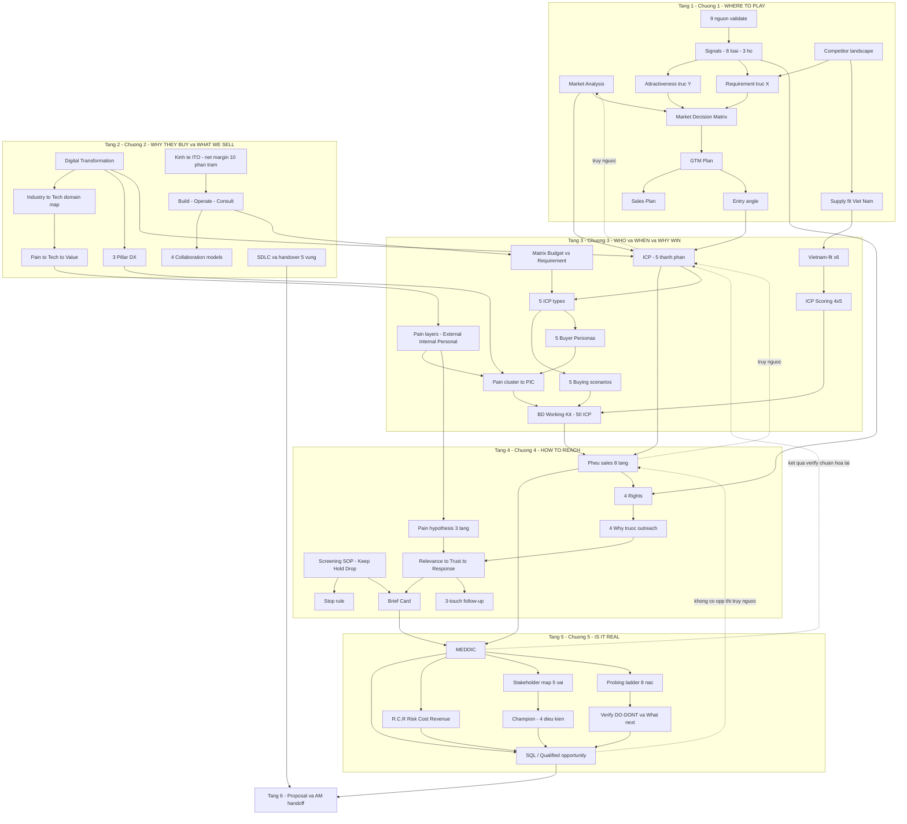

# SALES KNOWLEDGE BASE — HBLAB BD TRAINING HANDBOOK

**Chương trình:** P&C x HBLAB — Business Development Training Program
**Phiên bản:** 1.0
**Ngày biên soạn:** 06/08/2026
**Phạm vi:** 5 session training (Session 01–05) — slide gốc + transcript ghi âm toàn bộ các buổi
**Đối tượng:** BD / Sales mới và đang onboarding tại HBLAB; đồng thời dùng làm nguồn cho internal wiki, AI knowledge base và RAG system.

---

## Về tài liệu này

Tài liệu này **không phải bản tóm tắt khóa học**. Nó là bản chuyển hóa toàn bộ tri thức của 5 buổi training thành một cuốn giáo trình nội bộ có cấu trúc, để một người chưa từng dự khóa vẫn học được đầy đủ nội dung, và để một người đã dự có thể tra cứu lại chính xác từng framework, từng case, từng câu hỏi.

Nguyên tắc biên soạn:

1. **Giữ toàn bộ ý có thật.** Mọi khái niệm, framework, ví dụ, case study, câu chuyện, lời khuyên và phản hồi chữa bài của trainer đều được giữ lại — chỉ viết lại từ văn nói sang văn viết chuẩn, có cấu trúc.
2. **Không bịa.** Nội dung nào khóa training không đề cập thì ghi rõ *"Không được đề cập trong khóa training"* thay vì suy diễn. Nội dung nào phải suy luận từ ngữ cảnh (do lỗi nhận dạng giọng nói) được đánh dấu `[suy luận: ...]`.
3. **Truy vết được nguồn.** Mỗi mục quan trọng có ký hiệu nguồn: số trang slide hoặc mốc thời gian trong transcript.
4. **Không giấu mâu thuẫn.** Mọi chỗ hai nguồn nói khác nhau đều được ghi lại trong Phụ lục I — Contradiction Report, kèm cách hiểu đề nghị và mức độ tin cậy.

### Nguồn tài liệu

| # | File nguồn | Loại | Session |
|---|---|---|---|
| 1 | `[P&C x HBL] Session 01_ Market Research & GTM_Slide.pdf` | Slide (28 trang) | 01 |
| 2 | `transcript (Training PnC HBLAB Day 1 - Market Analysis).csv` | Transcript ASR (~1h31') | 01 |
| 3 | `[P&C x HBL] Session 02_DX & ITO_Slide.pdf` | Slide (47 trang) | 02 |
| 4 | `transcript (Training PnC HBLAB Day 2 - DX and ITO).csv` | Transcript ASR (~1h54') | 02 |
| 5 | `[P&C x HBL] Session 03_Ideal Customer Profile_Slide.pdf` | Slide (33 trang) | 03 |
| 6 | `transcript (Training PnC HBLAB Day 3 - ICP buyer, PIC mapping).csv` | Transcript ASR (~2h, mất ~12 phút đầu) | 03 |
| 7 | `transcript (Training PnC HBLAB Day 3.1 Chua bai GTM, ICP mapping).csv` | Transcript ASR (buổi chữa bài) | 03.1 |
| 8 | `[P&C x HBL] Session 04_Prospecting_Slide.pdf` | Slide (27 trang) | 04 |
| 9 | `transcript (4 Prospecting).csv` | Transcript ASR (~32', chỉ phủ nửa đầu buổi) | 04 |
| 10 | `[P&C x HBL] Session 05_Probing Questions_Slide.pdf` | Slide (30 trang) | 05 |
| 11 | `transcript (Session 05_Probing Questions).csv` | Transcript ASR (~2h05') | 05 |

Chi tiết metadata, chất lượng từng nguồn và bảng confidence theo chủ đề: xem **Phụ lục K — Source Traceability & Confidence**.

### Quy ước ký hiệu

| Ký hiệu | Nghĩa |
|---|---|
| `[S01: slide 12]` | Nguồn là slide số 12 của Session 01 |
| `[D1: 24:15]` | Nguồn là transcript Day 1, mốc 24 phút 15 giây |
| `[D3.1: 40:20]` | Nguồn là transcript buổi chữa bài Day 3.1 |
| `[suy luận: ...]` | Nội dung được giải mã từ transcript lỗi, dựa trên ngữ cảnh và slide — chưa phải nguyên văn |
| `> Độ tin cậy: Cao` | Có cả slide và transcript xác nhận |
| `> Độ tin cậy: Trung bình` | Chỉ một nguồn, hoặc có phần suy luận |
| `> Độ tin cậy: Thấp` | Nguồn mơ hồ — cần xác minh trước khi dùng làm chuẩn |
| `→ Ch4 §3.2` | Tham chiếu chéo tới Chương 4, mục 3.2 của tài liệu này |

### Lưu ý về chất lượng nguồn

Transcript được tạo tự động bằng công nghệ nhận dạng giọng nói (ASR) tiếng Việt và có sai sót đáng kể: từ và cụm số bị lặp vô nghĩa, tên riêng cùng thuật ngữ chuyên môn bị nghe nhầm, một số đoạn đầu buổi bị mất. Trong quá trình biên soạn, phần rác kỹ thuật và trao đổi ngoài lề (điểm danh, kiểm tra micro, lịch họp) đã được lọc bỏ; toàn bộ nội dung tri thức được giữ lại. Những chỗ phải suy luận nghĩa từ ngữ cảnh đều được đánh dấu, và các chuỗi chưa giải mã được liệt kê trong **Phụ lục J §6** để người trong cuộc xác nhận.

Slide gốc của một số session được trainer tái sử dụng từ tài liệu soạn cho tổ chức khác, nên còn xuất hiện tên viết tắt của công ty khác. Trong tài liệu này, mọi chỗ như vậy được đọc là **Việt Nam / HBLAB** và có ghi chú tại chỗ.

---

## MỤC LỤC

**Phần mở đầu**

- Về tài liệu này · Nguồn tài liệu · Quy ước ký hiệu · Lưu ý chất lượng nguồn
- Executive Overview — Khóa học này dạy gì, cho ai, đạt được gì

**Phần I — Nội dung khóa học (Complete Course Content)**

- **Chương 1 — Market Analysis & Go-To-Market** — Chọn thị trường nào để đánh, và vào bằng cửa nào
- **Chương 2 — Digital Transformation & Ngành ITO** — Vì sao khách cần phần mềm, và vì sao họ thuê ngoài
- **Chương 3 — Ideal Customer Profile, Buyer Persona & PIC Mapping** — Săn ai, gặp ai, nói gì với ai (kèm bài học buổi chữa bài)
- **Chương 4 — Prospecting & BD Execution** — Từ danh sách công ty đến cuộc hẹn đầu tiên
- **Chương 5 — Probing Questions & Qualification (MEDDIC)** — Hỏi thế nào để biết deal có thật hay không

**Phần II — Phụ lục vận hành (Operational Appendices)**

- **Phụ lục A — Sales Playbook** — 11 stage từ chọn thị trường đến account management
- **Phụ lục B — Decision Trees** — 8 cây quyết định cho các tình huống thường gặp
- **Phụ lục C — Glossary** — 155 thuật ngữ giải thích cho người mới
- **Phụ lục D — FAQ** — 106 câu hỏi thường gặp theo 6 nhóm chủ đề
- **Phụ lục E — Cheat Sheet** — Công thức, best practices, những điều không bao giờ làm, bảng tra nhanh
- **Phụ lục F — Knowledge Map** — Bản đồ tri thức, knowledge graph, learning path 8 tuần
- **Phụ lục G — Operational Checklists** — 12 checklist theo từng giai đoạn công việc
- **Phụ lục H — Templates** — 15 biểu mẫu dùng lại, kèm ví dụ đã điền từ case thật

**Phần III — Phụ lục kiểm chứng (Audit Appendices)**

- **Phụ lục I — Contradiction Report** — 34 điểm mâu thuẫn giữa các nguồn
- **Phụ lục J — Missing Knowledge & Knowledge Gap Report** — Kiến thức giả định, định nghĩa thiếu, chủ đề khóa học không bao phủ
- **Phụ lục K — Source Traceability & Confidence** — Bảng nguồn, 89 chủ đề chấm độ tin cậy
- **Phụ lục L — Revision Suggestions** — 37 đề xuất cải thiện tài liệu training tương lai

---

# EXECUTIVE OVERVIEW

## Khóa học này dạy gì

Khóa training P&C x HBLAB dạy **cách một người làm Business Development trong ngành IT Outsourcing đi từ một tấm bản đồ trống đến một cơ hội bán hàng đã được xác định**. Nó không dạy kỹ năng viết email hay kỹ năng thuyết trình như một khóa sales tổng quát; nó dạy chuỗi tư duy đặc thù của việc bán năng lực phần mềm xuyên biên giới:

1. **Chọn nơi để đánh** — Phân tích thị trường theo hai trục: thị trường này có đáng theo đuổi không (budget, chi tiêu IT, mức độ quen với ITO), và mình có thắng được không (yêu cầu kỹ thuật, compliance, cạnh tranh, khoảng cách công nghệ). Kết quả là một Go-To-Market plan, không phải một bản báo cáo.
2. **Hiểu vì sao khách cần mình** — Ngành nghề tạo ra bài toán kinh doanh; chuyển đổi số biến bài toán đó thành nhu cầu phần mềm; và chỉ một phần nhu cầu đó mới thành nhu cầu thuê ngoài. Hiểu chuỗi này là điều kiện để nói chuyện được với người ra quyết định.
3. **Xác định săn ai** — Cùng một thị trường có nhiều loại công ty, mỗi loại có nỗi đau khác nhau, người phụ trách khác nhau, bằng chứng cần đưa ra khác nhau và cách bán khác nhau. Chọn đúng 50 công ty quan trọng hơn tiếp cận 1000 công ty.
4. **Tiếp cận có kỷ luật** — Prospecting là một quy trình có tiêu chuẩn: sàng lọc account theo nhãn Keep/Hold/Drop, dựng giả thuyết nỗi đau ba tầng, viết thông điệp neo vào bối cảnh của khách trước khi nói về mình, và theo đuổi bằng ba lần chạm mỗi lần thêm một giá trị mới.
5. **Hỏi để biết deal có thật** — Trong buổi gặp đầu tiên, mục tiêu không phải chốt hợp đồng mà là có buổi thứ hai. Muốn vậy phải phân biệt được nỗi đau thật và nỗi đau giả, xác định được ai giữ ngân sách, ai đánh giá kỹ thuật, ai chặn, ai ủng hộ — bằng những câu hỏi sắc thay vì câu hỏi lười.

## Ai nên học

- **BD / Sales mới vào nghề** trong công ty phần mềm, đặc biệt là mảng outsourcing / offshore delivery — đây là đối tượng chính.
- **BD đã có kinh nghiệm nhưng chưa có thị trường riêng.** Một trong những thông điệp lặp lại nhiều nhất của khóa: mỗi người phải có một thị trường chính, và phải cụ thể đến từng quốc gia, không phải một vùng chung như "APAC".
- **Account Manager, Sales Manager, Team Leader** cần một chuẩn chung để review công việc của BD — đặc biệt các tiêu chuẩn chấm bài trong buổi chữa bài (Chương 3, Mục 4) chính là rubric review thực tế.
- **Pre-sales, BA, Solution Architect** muốn hiểu BD đang chịu áp lực gì và cần gì từ mình khi được kéo vào một cơ hội.
- **Người xây knowledge base / AI agent hỗ trợ sales**, dùng tài liệu này làm corpus.

## Mục tiêu học tập

Sau khi học hết tài liệu này, người học có thể:

1. Đặt một thị trường lên Market Decision Matrix và bảo vệ được vị trí đó bằng tín hiệu có nguồn kiểm chứng.
2. Viết một mini market analysis plan và một GTM plan có mục tiêu, phân tích, phân bổ nguồn lực và cơ chế review.
3. Đọc một ngành nghề ra tech domain và buying trigger, thay vì chỉ gọi tên ngành.
4. Giải thích được vì sao một công ty thuê ngoài — theo năm động lực speed, cost, capability, flexibility, risk control — và khớp nhu cầu đó với mô hình hợp tác phù hợp.
5. Phân loại một công ty vào đúng ICP type, xác định buyer persona, dựng giả thuyết nỗi đau ba tầng và chọn sales motion tương ứng.
6. Phân biệt fact và hypothesis trong chính tài liệu mình viết, và không trình bày giả thuyết như sự thật.
7. Sàng lọc một danh sách account thành nhãn Keep/Hold/Drop trong thời gian giới hạn, có ghi chú tín hiệu và lý do giữ tính bằng một câu.
8. Viết một thông điệp outreach đạt ba nấc relevance – trust – response, và một kế hoạch ba lần chạm không rơi vào "just checking in".
9. Điều hành một buổi discovery theo MEDDIC: khai thác metrics, xác định economic buyer, tìm nỗi đau thật, hiểu tiêu chí và quy trình quyết định, kiểm tra champion.
10. Bàn giao một cơ hội đã qualify cho AM với ghi chú đủ để người sau tiếp tục được.

## Kết quả kỳ vọng

| Cấp độ | Biểu hiện quan sát được |
|---|---|
| Sau Chương 1–2 | Nói được thị trường mình theo đuổi là nước nào, ngành nào, vì sao — và giải thích được khách trong ngành đó cần phần mềm gì để giải bài toán gì |
| Sau Chương 3 | Có một danh sách ICP có tiêu chí, biết mỗi loại nên gặp ai và cần đưa bằng chứng gì |
| Sau Chương 4 | Sàng lọc và dựng được account brief; viết được thông điệp đầu tiên mà người nhận có lý do đọc |
| Sau Chương 5 | Điều hành được buổi gặp đầu tiên và tự đánh giá được cơ hội này có thật hay không |
| Sau toàn khóa | Chuyển được một account từ tên trên danh sách thành SQL có meeting notes bàn giao được |

## Cấu trúc mạch tri thức

```
Chương 1 — Market Analysis & GTM      → ĐÁNH Ở ĐÂU?     → Thị trường + entry angle
        ↓
Chương 2 — DX & ITO                   → VÌ SAO & CÁI GÌ? → Ngành → pain → tech domain → ITO model
        ↓
Chương 3 — ICP, Persona & PIC         → SĂN AI?          → Company type + persona + pain + signal + motion
        ↓
Chương 4 — Prospecting & BD Execution → TIẾP CẬN SAO?    → Screening → brief → outreach → meeting
        ↓
Chương 5 — Probing & Qualification    → CÓ THẬT KHÔNG?   → MEDDIC → pain thật → SQL
```

Bốn nguyên tắc xuyên suốt cả năm chương:

- **Chọn lọc thắng số lượng.** Bước quyết định của cả phễu không phải bước chốt deal, mà là bước chọn đúng tệp công ty để theo đuổi.
- **Không có nguồn thì chỉ là giả thuyết.** Mọi insight phải nêu được nguồn; mọi giả thuyết phải được gọi đúng tên là giả thuyết.
- **Nói về business của khách trước, dịch vụ của mình sau.** Khác biệt giữa một thông điệp được đọc và một thông điệp bị bỏ qua nằm ở phần research trước khi viết, không nằm ở kỹ năng viết.
- **Mục tiêu không phải biết mọi thứ, mà biết đủ để chọn bước đi tiếp theo tốt nhất.**

---

---

# PHẦN I — NỘI DUNG KHÓA HỌC

---

# CHƯƠNG 1 — MARKET ANALYSIS & GO-TO-MARKET

> **Nguồn chương:** Session 01 "Market Analysis — Supply, Demand & Market Entry" (Trainer: Paul Le — trong transcript được gọi là "anh Cương"; cùng một người) [S01: slide 1]. Nội dung tổng hợp từ 28 trang slide và ~1h31' transcript buổi Day 1. Slide gốc một số trang ghi "Vietnam / NTQ" — [suy luận: slide được trainer tái sử dụng từ tài liệu soạn cho công ty khác]; khi áp dụng trong handbook này, mọi chỗ "Vietnam / NTQ" đọc là **"Việt Nam / HBLAB"** [S01: slide 4].

---

## 1.1. Mục tiêu học tập

Sau khi học xong chương này, salesperson mới của HBLAB phải làm được các việc sau [S01: slide 2]:

1. **Sử dụng Market Decision Matrix** — chấm điểm attractiveness (độ hấp dẫn về budget) vs difficulty (độ khó về requirement) cho các thị trường ITO, và từ đó quyết định pursue / learn / partner / deprioritize. [S01: slide 2, 5]
2. **Đọc market signals** — tìm bằng chứng thật từ demand, hiring, IT spending, events và competitors; phân biệt signal (trả lời "khi nào mua") với động lực mua (trả lời "tại sao mua"). [S01: slide 2] [D1: 14:00]
3. **So sánh nguồn cung giữa các quốc gia ITO** — hiểu vì sao khách hàng có thể chọn hoặc không chọn Việt Nam. [S01: slide 2, 14]
4. **Phân tích được một thị trường theo cấu trúc chuẩn** — dùng Hong Kong để học cấu trúc phân tích (overview → trends → domains → key accounts → decision makers), dùng US để học độ khó của thị trường high-budget. [S01: slide 2, 16, 18]
5. **Xây được một mini market plan** — chuyển phân tích thành target industries, entry angle và các nguồn validation tiếp theo. [S01: slide 2, 23]
6. **Phân biệt GTM Plan với Sales Plan** và nắm 4 khối cấu thành + 4 yêu cầu bắt buộc của một GTM Plan. [S01: slide 25–27] [D1: 01:29:26]
7. **Xác định decision maker theo scope/KPI thật** thay vì theo chức danh mặc định (CTO/CIO/VP Engineering). [D1: 10:14–14:00]
8. **Chuẩn bị chọn thị trường chính cho bản thân** — trong ~2 tháng sau buổi học, mỗi BD bắt buộc phải bắt đầu chọn một thị trường chính. [D1: 00:01–00:31]

Nguyên tắc xuyên suốt của chương, đúng như trainer đặt cho buổi học: *"Learn the market decision matrix first, then collect signals to score it"* — học ma trận quyết định trước, rồi đi thu thập tín hiệu để chấm điểm nó. Mọi nội dung phía sau đều phục vụ việc điền một phần của ma trận này. [S01: slide 2]

> Độ tin cậy: Cao (slide 2 + transcript mở đầu buổi học)

---

## 1.2. Các khái niệm & framework

### 1.2.1. Market Analysis trong ITO — và định nghĩa đúng của "Supply"

**Định nghĩa.** Market Analysis theo nghĩa rộng có rất nhiều thành phần, nhưng trong khuôn khổ nghề sales ITO, nó được gói vào hai chữ: **Supply và Demand** (cung – cầu) của thị trường đối với lĩnh vực mình bán — ITO nói riêng, IT nói chung. [D1: 00:40–04:42]

**Bối cảnh & vì sao quan trọng.** "Market analysis keeps sales from doing random prospecting" — phân tích thị trường giữ cho sales không đi prospecting ngẫu nhiên. Một phân tích thị trường tốt phải trả lời được 6 câu hỏi [S01: slide 4]:

| # | Câu hỏi | Nội dung |
|---|---|---|
| 1 | **Enough demand?** | Thị trường có nhu cầu công nghệ và budget thật không? |
| 2 | **Right industries?** | Ngành nào đang thực sự chi tiền cho IT/ITO? |
| 3 | **Service fit?** | Họ cần staffing, project, managed service, consulting hay DX? |
| 4 | **Vietnam fit?** | Việt Nam / HBLAB có match được cost, quality, seniority và delivery expectation không? |
| 5 | **Competitive context?** | Ai đang phục vụ thị trường này và họ position ra sao? |
| 6 | **Entry angle?** | Nên bắt đầu bằng industry nào, account type nào, channel nào, message nào? |

Chốt của slide: "Good market analysis helps sales focus on demand, fit and win potential." [S01: slide 4]

**Giải thích chi tiết — định nghĩa lại chữ "Supply".** Đây là điểm chỉnh khái niệm quan trọng nhất đầu buổi học. Khi trainer hỏi học viên "Supply là gì, cần phân tích gì?", các câu trả lời nhận được là: nhân sự, số lượng/trình độ nhân sự, lương của đội local, khả năng cung ứng có match thị trường không. [D1: 01:14–02:17]

Trainer chỉnh lại: **những yếu tố đó thực ra vẫn nằm trong Demand** — vì chúng chứng minh nhu cầu. Lương dev local cao → tạo ra nhu cầu thuê resource giá rẻ; trình độ và nguồn cung nhân sự bản địa chỉ đang chứng minh thị trường có nhu cầu ITO hay không. [D1: 02:19–02:41]

**Supply theo nghĩa trainer dùng** gồm hai câu hỏi [D1: 02:41–03:59]:

1. **Có ai khác ngoài mình đang supply thị trường đó không?** — tức là competitor.
2. **Thị trường đó đang được bán như thế nào?** — Bài toán ITO là bài toán cũ; chắc chắn đã có "dấu răng" của vài công ty đang cắn vào thị trường đó rồi. Vậy câu hỏi không còn là "supply cái gì" mà là "đối thủ đang supply như thế nào, đang đánh thị trường như thế nào".

**Ví dụ.** Rất nhiều công ty phải "đi du học Ấn Độ" để học nguồn supply lớn nhất thế giới. Muốn đánh thị trường Mỹ thì phải xem LATAM (Chile, Venezuela, Brazil) đánh như thế nào để hiểu supply của họ: có thể họ không bán staffing nữa mà bán ODC [suy luận: ASR ghi "Odyssey" = ODC/Offshore Development Center]; supply rate của họ có thể ~5–7 nghìn [suy luận: USD/người/tháng] — và từ đó hiểu khách nhìn một vendor Việt Nam như thế nào. [D1: 03:09–03:59]

Yếu tố gắn liền với so sánh nguồn cung là **time zone**: nearshore hơn offshore ở chỗ chỉ cách khách 1–2 tiếng. Bảng time zone thực dụng của Việt Nam: Mỹ cách nửa vòng trái đất (8–12 tiếng), châu Âu ~4 tiếng, Úc ~2–4 tiếng, Hồng Kông 1 tiếng (lùi), Singapore 1 tiếng. [D1: 04:11–04:42]

**Ngộ nhận thường gặp.**
- ✗ "Supply là nguồn nhân lực và mức lương của thị trường đích." → ✓ Đó là bằng chứng của **Demand**. Supply là **các nguồn cung khác** (đối thủ) và **cách thị trường đang được bán**. [D1: 02:19–03:59]
- ✗ "Chỉ cần biết thị trường có nhu cầu là đủ." → ✓ Phải biết ai đang phục vụ nhu cầu đó, bán theo mô hình gì, giá bao nhiêu — vì điều đó quyết định khách nhìn vendor VN như thế nào.

**Key takeaways.**
- Market Analysis (phiên bản dùng được cho sales) = Supply + Demand + cách entry.
- Học đối thủ nguồn cung là một phần bắt buộc của phân tích thị trường ("du học Ấn Độ", xem LATAM đánh Mỹ).
- Time zone là biến số cấu trúc của mô hình offshore VN — phải thuộc con số theo từng thị trường.

> Độ tin cậy: Cao (slide 4 + transcript 00:40–04:42)

---

### 1.2.2. Framework nền tảng: Market Decision Matrix (Attractiveness vs Requirement)

**Định nghĩa.** Market Decision Matrix là ma trận 2 trục — bản đồ nền tảng cho phân tích thị trường ITO: trục Y là **Budget / Commercial Attractiveness** (độ hấp dẫn thương mại), trục X là **Requirement / Difficulty** (độ khó của yêu cầu). Mỗi thị trường được đặt vào 1 trong 4 góc phần tư [S01: slide 5]:

| Vị trí | Đặc điểm | Kết luận |
|---|---|---|
| Trên-trái | High budget, Low difficulty | **Ideal pursuit** (lý tưởng để theo đuổi) |
| Trên-phải | High budget, High difficulty | **Strategic but hard** (chiến lược nhưng khó) |
| Dưới-trái | Low budget, Low difficulty | **Easy but small** (dễ nhưng nhỏ) |
| Dưới-phải | Low budget, High difficulty | **Low priority** (bỏ qua) |

**Purpose.** Chuyển đống dữ liệu thị trường lộn xộn thành hai câu hỏi thực dụng: "The matrix converts messy market data into two practical questions." — **Attractiveness cho biết thị trường có đáng theo đuổi không. Requirement cho biết mình có thắng được không.** [S01: slide 6]

**Inputs.** Toàn bộ dữ liệu research: IT/ITO spending, lương dev local, trend, competitor, quy định, buyer expectation… (chi tiết từng trục ở mục 1.2.3 và 1.2.4). Mỗi data point thu thập phải "có việc làm" — chấm cho trục Y hoặc trục X, không thu thập ngẫu nhiên. [S01: slide 9]

**Outputs.** Vị trí của từng thị trường trên ma trận + quyết định: **pursue / learn / partner / deprioritize**. [S01: slide 5]

**Workflow (How to use it).** Đặt từng thị trường lên matrix bằng cách chấm điểm budget attractiveness và market requirement difficulty; sau đó ra quyết định. Cách chia đơn giản trainer hướng dẫn: chia đôi mỗi trục, kẻ 2 đường ở giữa thành 4 ô. Quote minh họa khi chỉ vào hai góc: "Đây là cá mình thích nhất" [high budget–low difficulty]… "Đây là cá mà mình ghét nhất" [low budget–high difficulty]. [S01: slide 5] [D1: 49:38–50:04]

**Key warning (cảnh báo cốt lõi).** "A market can be attractive but still hard to win. **High budget does not mean easy entry.**" — Thị trường có thể hấp dẫn nhưng vẫn khó thắng; budget cao không có nghĩa vào dễ. [S01: slide 5]

**Ví dụ định vị (demo miệng của trainer)** [D1: 34:24–35:24]:
- **US và EU**: góc high budget – high difficulty (US cao nhất).
- **Singapore**: high budget, low difficulty — "nằm đâu đó ở đoạn giữa giữa".
- **Low budget – low difficulty**: thị trường ít tiền; khi kinh tế đi xuống thì tụt tiếp, không còn confirmation nhiều như xưa.
- **Low budget – high difficulty** = low priority: "vừa khó vừa ít budget thì thôi, bỏ qua" — ví dụ Cambodia, Philippines.

**Khi nào dùng / không dùng.**
- Dùng: khi so sánh nhiều thị trường để chọn hướng đầu tư; khi làm GTM plan (bắt buộc phải đánh giá thị trường nằm đâu trên matrix — xem mục 1.2.13); khi senior cần verify phân tích của BD.
- Không dùng như một phán quyết cuối cùng: vị trí trên matrix là công cụ lập luận, không phải "final market verdict" — chính slide demo Hong Kong ghi rõ điều này. [S01: slide 17]

**Ngộ nhận thường gặp.**
- ✗ "Budget cao = nên vào ngay." → ✓ Cảnh báo chính của matrix: high budget không đồng nghĩa easy entry. [S01: slide 5]
- ✗ "Điểm trên matrix là tuyệt đối." → ✓ Điểm số là tương đối; trainer nói Singapore là "low difficulty" [D1: 34:46] nhưng cũng nói Singapore là nơi đông đối thủ nhất [D1: 50:10] — cho thấy phải nhìn từng thành phần của difficulty, không nhìn một con số duy nhất.
- ✗ "Có công thức trọng số chuẩn cho các tiêu chí." → ✓ Câu hỏi về trọng số được học viên đặt ra nhưng **không được trả lời định lượng trong buổi học** (xem Q&A 1.6.4); hướng dẫn hiện tại chỉ là chia đôi mỗi trục thành 4 ô. [D1: 48:30–49:59]

**Key takeaways.**
- Hai trục = hai câu hỏi: đáng theo đuổi không (Y) và thắng được không (X).
- 4 ô → 4 hành vi: pursue / strategic but hard / easy but small / bỏ qua.
- Matrix là công cụ tư duy và giao tiếp (BD ↔ senior), không phải phán quyết cuối cùng.

> Độ tin cậy: Cao (slide 5–6 + transcript 34:24–35:24, 49:38–50:04)

---

### 1.2.3. Trục Y — Budget / Commercial Attractiveness (7 yếu tố)

**Định nghĩa.** Trục Y đo độ hấp dẫn thương mại của thị trường: có tiền không, tiền có đang chảy vào IT/ITO không, và có sẵn sàng chi cho nguồn lực bên ngoài không. Gồm 7 yếu tố [S01: slide 6]:

1. Local developer salary vs Vietnam (lương dev bản địa so với VN)
2. IT / ITO spending level
3. Top spending industries
4. ITO spending trends
5. IT adoption level
6. Budget openness
7. Business urgency

**Giải thích chi tiết từng yếu tố (theo lời giảng)** [D1: 35:24–39:31]:

**(1) Local salary vs Vietnam.** Giá dev local so với VN chứng minh thị trường có budget/demand hay không: lương local càng cao, logic thuê nguồn lực giá rẻ càng mạnh. [D1: 35:24–35:38]

**(2) IT/ITO spending.** Research trên Google hoặc các báo cáo của McKinsey, BCG (Boston Consulting Group). [D1: 35:38–35:54]

**(3) Top spending industries.** Biết nước đó tiêu nhiều tiền cho IT là chưa đủ — phải biết **ngành nào tiêu nhiều nhất**. Bài tập tại lớp: "Ở Việt Nam ngành nào đang tiêu nhiều tiền nhất cho IT?" — đáp án thảo luận: **đầu tư công**. Lý do: mỗi phường được cấp vài tỷ chỉ để chuyển đổi số; do sáp nhập hành chính nhiều nên vẫn từng ấy người mà phải làm việc của nhiều địa phận hành chính khác nhau → cần công nghệ hỗ trợ; công chức phường phải nhập dữ liệu lên cổng hành chính/dữ liệu quốc gia rồi mới phát phiếu hẹn như đơn hàng, cầm phiếu đi công chứng/chứng thực. Ngoài ra có mảng edu/giáo dục. Còn **banking/finance là tiền tư nhân** — các ngân hàng thương mại tự đầu tư. Tiếp theo là số hóa thủ tục hành chính để giảm bureaucracy. [D1: 36:03–37:24]

**(4) ITO spending trends / trend công nghệ.** Xu hướng quyết định họ đổ tiền mua solution hay mua resource. Yêu cầu độ cụ thể: "Nó nói về AI nhưng cụ thể là dùng AI cho lĩnh vực gì?" [D1: 37:24–37:57]

**(5) IT adoption level — logic ngược quan trọng.** Adoption thấp không phải là tin xấu. Thảo luận với học viên Trang về Nhật: theo báo cáo (học viên không nhớ chính xác nguồn), tỷ lệ adoption DX/AI của Mỹ và EU khoảng ~70%, Nhật chỉ khoảng 30–40% — vẫn đi khá chậm dù có chính sách thúc đẩy. Trainer chốt: "**Adoption thấp cho nên nhu cầu vẫn còn nhiều. Demand vẫn còn thật.**" — con số adoption thấp tác động **dương** lên trục Y. [D1: 37:57–39:05]

**(6) Budget openness.** Thị trường có rộng rãi với việc dùng nguồn lực bên ngoài không. [D1: 39:10–39:31]

**(7) Business urgency.** Vấn đề có cấp bách, nhức nhối với thị trường này không. [D1: 39:10–39:31]

**Ngộ nhận thường gặp.**
- ✗ "IT adoption thấp = thị trường kém hấp dẫn." → ✓ Ngược lại: adoption thấp = dư địa demand còn nhiều (case Nhật). [D1: 38:26–39:05]
- ✗ "Biết tổng IT spending của quốc gia là đủ." → ✓ Phải bóc xuống mức ngành (top spending industries) và mức nguồn tiền (đầu tư công vs tư nhân — như ví dụ VN).

**Key takeaways.**
- 7 yếu tố trục Y đều nhằm chứng minh một điều: **budget thật và động lực chi thật**.
- Nguồn tra cứu spending: Google + báo cáo McKinsey/BCG.
- Luôn hỏi tiếp một nấc: ngành nào? tiền của ai (công/tư)? dùng AI cho việc gì?

> Độ tin cậy: Cao (slide 6 + transcript 35:24–39:31)

---

### 1.2.4. Trục X — Requirement / Difficulty (7 yếu tố + chiến lược giảm difficulty)

**Định nghĩa.** Trục X đo mức độ khó để phục vụ và thắng ở thị trường đó — trainer gọi thẳng đây là "phần không có lợi cho mình". Gồm 7 yếu tố [S01: slide 6] [D1: 39:31]:

1. Tech requirement / seniority
2. Compliance and regulation
3. Nearshore vs offshore expectation
4. Familiarity with ITO
5. Tech advancement vs Vietnam
6. Buyer expectation level
7. Competition intensity

**Giải thích chi tiết từng yếu tố (theo lời giảng)** [D1: 39:31–46:59]:

**(1) Seniority.** Châu Âu, Mỹ đòi hỏi rất cao. Buyer châu Âu rất straightforward: "mày chỉ có lợi với tao thôi — người của mày xịn không? Một người của mày bằng bao nhiêu người của tao?" Bài toán cân đối chi phí: nếu 1 nhân sự VN chỉ bằng nửa 1 người châu Âu thì khách phải thuê 2 người — chưa chắc đã rẻ. Seniority vì thế là rào cản thật, không phải hình thức. [D1: 39:31–40:09]

**(2) Compliance & Regulation.** Châu Âu bị GDPR — rất khó nhắn tin/email nếu không có quan hệ từ trước → cần "lũy kế quan hệ": nhiều người quen, advisor, người giới thiệu. Benchmark cách các đối thủ VN giải quyết: **CMC** làm rất mạnh nhưng theo kiểu public (thuê, tuyển, vận hành công khai); **SmartOSC** [suy luận: ASR "Smart Washing"] cũng mạnh nhưng đi ngách — tham gia các tổ chức/hiệp hội như **EO, YPO**; **NTQ** nghe đâu làm việc với các bác trong quỹ hưu trí của Nhật Bản — "các bác ấy vừa có tiền vừa có mối quan hệ". → Giải pháp vượt rào compliance/regulation là nghiệp vụ sales: partnership, tìm đối tác, tìm "thổ địa". [D1: 40:09–41:16]

**(3) Nearshore vs offshore expectation.** Làm thị trường nào phải nắm time zone gap bao nhiêu (bảng ở mục 1.2.1). Một cách giải quyết là **relocate** — đưa người qua Nhật/qua nước sở tại, ở gần khách hàng hơn để fit culture hơn. "Đây là những biện pháp, những chiến lược để giải quyết cái trục X này." [D1: 41:16–41:41]

**(4) Familiarity with ITO.** Mức độ quen thuộc của thị trường với mô hình ITO quyết định chi phí giáo dục thị trường. So sánh Nhật – Hàn (có sự tham gia của một người làm thị trường Hàn — [suy luận: một học viên/quản lý nam, có thể anh Toàn]): Nhật đã dùng ITO 20 năm (FPT đi Nhật 20 năm rồi) → nói "ITO" là họ hiểu và open. Hàn/một số thị trường chưa quen: nói ITO người ta không hiểu luôn khái niệm. Câu chuyện thật khi đi hội chợ: khách hỏi những câu "rất ngu ngơ" như *thanh toán bằng tiền gì? bọn mày có biết nói tiếng Hàn không? lịch làm việc bọn mày thế nào?* — những câu bên Nhật không bao giờ hỏi. Có trường hợp khách dùng từ "engineering", mình mặc định hiểu là IT, cuối cùng hóa ra khách cần kỹ sư sang để dạy nghề [không giải mã được ASR — có thể liên quan đúc/khuôn cơ khí] → thị trường chưa quen ITO thì làm rất vất vả, phải giải thích từ đầu tại sao nên dùng ITO. [D1: 42:12–43:58]

**(5) Tech advancement vs Vietnam.** Gồm hai vế: mức độ "cao cấp công nghệ" của nước đó so với VN, và cách họ **nhìn nhận** VN. Nhật: công nghệ lõi rất giỏi, nhưng đánh giá technical của VN khá ổn (image của VN trong mắt Nhật về technical là ổn). Hàn Quốc: thực chất kỹ thuật không giỏi hơn VN mấy nhưng thái độ "thượng đẳng" — luôn tự đặt mình ở nấc quản lý: "phần mày là phần làm, tao ở trên nấc quản lý." [D1: 43:58–44:47]

**(6) Buyer expectation — 3 kiểu kỳ vọng Nhật / Hàn / Global.** Đây là phần trainer giảng hoàn toàn ngoài slide và rất giá trị [D1: 44:47–46:59]:

| Kiểu buyer | Đặc điểm kỳ vọng | Hệ quả cho vendor |
|---|---|---|
| **Global (ngoài Nhật)** | Kỳ vọng rất cao vì vendor VN bị cạnh tranh quá nhiều trong nhóm nói tiếng Anh (nhóm nói tiếng Nhật/Hàn ít cạnh tranh hơn — khách Hàn chủ yếu so sánh nội bộ LG, Samsung, các công ty ở Hàn, ít so ra ngoài). Khách global kỳ vọng vendor phải **chủ động giao tiếp và tư vấn** [suy luận: ASR "cần giao"] — phải nói chuyện, làm rõ, vì chính khách cũng chưa biết mình muốn gì. | Vendor phải thể hiện năng lực consulting, không chỉ execution. |
| **Nhật** | Coi vendor là đối tác — "họ share cho mình cái bài toán mà mình cùng họ giải quyết"; tài liệu chi tiết. | Làm đúng những gì trong tài liệu; có gì thêm thì chặt CR (change request). |
| **Hàn** | Đưa tài liệu rất sơ sài, kỳ vọng vendor **tự hỏi, tự làm design, tự làm mọi thứ để deliver được** — "tao thuê vendor thì tao chỉ đưa mỗi thế thôi". Trong tài liệu hay viết những câu chung chung — vendor phải hiểu được expect thật. | Flow lỗi thường gặp: gửi design khách **không check**, demo khách **không nói gì**, lên production mới phàn nàn "ơ sao mày làm thế này, mấy cái cơ chế kiểu này sao mày không hiểu?". |

Cảnh báo trực tiếp: quen làm kiểu Nhật ("trong tài liệu có gì tôi làm thế") mà sang làm khách Hàn thì rất hay **lỗ**, vì không điều tra kỹ expectation. Người chia sẻ thừa nhận: "Ngày xưa anh cũng không làm tốt cái này — làm rồi mới biết"; ban đầu gặp nhiều khách end-user Hàn nên dính đúng những expectation đó. [D1: 44:47–46:59]

**(7) Competition intensity.** Mức độ cạnh tranh — được phân tích qua competitor landscape (mục 1.2.10) và khái niệm Red/Blue Ocean (mục 1.2.6).

**Chiến lược giảm difficulty (tổng hợp từ lời giảng).** Trục X không phải để "chịu trận" — mỗi yếu tố khó đều có lời giải thuộc nghiệp vụ sales/công ty:

| Rào cản | Lời giải được nêu trong buổi | Nguồn |
|---|---|---|
| GDPR / compliance châu Âu | Lũy kế quan hệ, advisor, partnership, "thổ địa"; học cách CMC (public), SmartOSC (hiệp hội EO/YPO), NTQ (quỹ hưu trí Nhật) | [D1: 40:09–41:16] |
| Compliance/certificate | Đề xuất công ty đầu tư đi lấy chứng chỉ [suy luận: ASR "đi săn chính trị" ≈ đi săn chứng chỉ] | [D1: 51:32–52:16] |
| Time zone / culture gap | Relocate người sang nước sở tại | [D1: 41:30–41:41] |
| Ngôn ngữ (case Thái) | Bridge Engineer / PM / BA nói tiếng bản ngữ [suy luận: ASR "British Engineer" = Bridge Engineer] | [D1: 47:41–48:30] |
| Thiếu local presence (Mỹ) | Local advisor, alumni networks, partner, warm channels | [D1: 01:24:15–01:26:47] |

**Ngộ nhận thường gặp.**
- ✗ "Giá VN rẻ hơn nên đương nhiên thắng ở châu Âu/Mỹ." → ✓ Bài toán "1 người của mày bằng mấy người của tao": nếu năng suất chỉ bằng một nửa thì rẻ hóa đắt. [D1: 39:31–40:09]
- ✗ "Khách nào cũng làm việc như khách Nhật." → ✓ Ba kiểu buyer expectation khác hẳn nhau; áp thói quen Nhật vào khách Hàn là công thức lỗ. [D1: 44:47–46:59]

**Key takeaways.**
- Trục X là danh sách 7 rào cản; nhiệm vụ của người phân tích là gọi tên rào cản **và** lời giải tương ứng.
- Buyer expectation Nhật/Hàn/Global là kiến thức sống còn khi estimate và vận hành dự án.
- Familiarity with ITO thấp = chi phí giáo dục thị trường cao — phải tính vào độ khó.

> Độ tin cậy: Cao (slide 6 + transcript 39:31–46:59; riêng các tên riêng SmartOSC, Bridge Engineer là suy luận ASR — Trung bình cho các chi tiết đó)

---

### 1.2.5. Supply–Demand–Requirement Fit — thị trường tốt không chỉ là thị trường to

**Định nghĩa.** "Market analysis is not only demand analysis." Một phân tích thị trường hoàn chỉnh gồm 3 khối theo chuỗi [S01: slide 7]:

1. **DEMAND** — Thị trường cần gì: IT spending, hiring shortage, DX trend, industry growth, buying urgency.
2. **REQUIREMENT** — Phục vụ khó đến đâu: seniority, compliance, local presence, communication, tech maturity.
3. **SUPPLY FIT** — Việt Nam / HBLAB cung cấp được gì: cost advantage, talent, delivery model, domain proof, flexibility, time zone.

**Bối cảnh & vì sao quan trọng.** Chốt của slide: "**A good market is not just big. It must have demand, reachable requirements and clear supply fit.**" — thị trường tốt không chỉ to; nó phải có nhu cầu thật, yêu cầu với tới được, và mình phải cung cấp khớp được. [S01: slide 7]

**Liên kết với công thức kết luận thị trường.** Chuỗi 3 khối này chính là bộ khung cho "kết luận cần thiết đối với một thị trường" mà trainer chốt: trả lời 3 câu — (1) nhu cầu (demand) cao hay thấp? (2) requirement khó hay không? (3) **giải pháp của mình để xử lý/capture những cái đó là gì?** — "Đây là logic luôn đúng cho bất cứ một sales plan về BD nào" [suy luận: ASR "Bitcoin" = BD]. [D1: 53:59–54:44]

**Key takeaways.**
- Demand → Requirement → Supply Fit là chuỗi kiểm tra bắt buộc; thiếu một khối thì kết luận thị trường chưa hoàn chỉnh.
- Câu thứ ba ("giải pháp capture của mình là gì") là phần phân biệt phân tích của người làm sales với phân tích học thuật.

> Độ tin cậy: Cao (slide 7 + transcript 53:59–54:44)

---

### 1.2.6. Red Ocean / Blue Ocean — tính tương đối theo nguồn cung

**Định nghĩa.** Red Ocean = thị trường có demand cao nhưng supply cũng cạnh tranh khốc liệt; Blue Ocean = thị trường còn trống, ít nguồn cung penetrate được. [D1: 04:47–06:12]

**Giải thích chi tiết & ví dụ.** Trainer nêu:
- **Red Ocean:** TP.HCM, Singapore. [D1: 05:14–05:20]
- **Blue Ocean:** Úc — không quá nhiều công ty penetrate được; New Zealand — thị trường rất mới. [D1: 05:23]
- **Ví dụ then chốt về tính tương đối:** Europe là Blue Ocean **đối với công ty Việt Nam** nhưng là Red Ocean **đối với nhóm Đông Âu** — Ukraine, Nga, Ba Lan, Belarus, Kazakhstan… chuyên cung ứng nguồn lực giá rẻ cho EU và "đánh nhau khốc liệt trong đó rồi". [D1: 05:23–06:12]

**Ngộ nhận thường gặp.**
- ✗ "Một thị trường hoặc là Red hoặc là Blue Ocean, cho tất cả mọi người." → ✓ Red/Blue là **tương đối theo góc nhìn của từng nguồn cung** — cùng một EU, VN thấy Blue nhưng Đông Âu thấy Red.

**Key takeaways.**
- Trước khi dán nhãn Red/Blue cho một thị trường, phải hỏi: "đối với nguồn cung nào?"
- Nhãn này bổ sung cho yếu tố Competition intensity của trục X, không thay thế phân tích competitor cụ thể.

> Độ tin cậy: Trung bình (chỉ có transcript, không có slide riêng; nội dung rõ ràng)

---

### 1.2.7. Framework: Signals & Sources — "giả thuyết trước, tín hiệu sau"

**Định nghĩa.** Signal là tín hiệu cho thấy khách sắp/đang có nhu cầu mua — trả lời câu hỏi **when** (khi nào mua); phân biệt với động lực mua — trả lời câu hỏi **why** (tại sao mua). "Market analysis is built from signals, not assumptions" — phân tích thị trường được xây từ tín hiệu, không phải từ giả định. [S01: slide 10] [D1: 14:00–14:31]

**Purpose.** Chuyển prospecting từ ngẫu nhiên sang có bằng chứng: mỗi signal giúp chấm điểm attractiveness hoặc difficulty, và mỗi research component đều "có việc làm" trên matrix [S01: slide 9]:

| Component | Trả lời câu hỏi | Phía matrix |
|---|---|---|
| Signals & sources | Demand có thật không? | Y-axis |
| IT / ITO spending | Có budget và tăng trưởng không? | Y-axis |
| Tech trends / AI | Nhu cầu nào đang tăng? | Y-axis |
| Tech community / events | Thị trường có sôi động và tiếp cận được không? | Both |
| Competitors | Thắng khó đến mức nào? | X-axis |
| Other ITO countries | Vì sao họ sẽ chọn Việt Nam? | X + Supply |
| Senior plan examples | Người chuyên nghiệp chuyển phân tích thành hành động thế nào? | Application |

**Nguyên tắc nền — giả thuyết trước, tín hiệu sau.** "**Nó sẽ có rất nhiều giả thuyết. Nhưng mọi người không đưa ra giả thuyết thì có nhìn thấy thông tin, mọi người cũng sẽ không phát hiện ra.**" Signal đến từ 2 phần: (1) đoán được động lực của tệp công ty đó + ai là người cầm đầu; (2) đi nhặt tín hiệu để bổ sung/kiểm chứng giả thuyết. [D1: 22:06–22:34]

**Inputs — 8 loại signal cần tìm** [S01: slide 10], kèm diễn giải thực tế của trainer [D1: 59:54–01:05:24]:

1. **IT spending & software budget** — ngân sách IT của thị trường/công ty.
2. **Hiring demand & talent shortage** — họ có thiếu người, có nhu cầu hiring không.
3. **DX initiatives** — các tuyên bố khởi động chuyển đổi số. Ví dụ: Nhà nước Việt Nam tuyên bố hướng đến 4.0 — đó là một initiative (tuyên bố sẽ làm); Techcombank [suy luận: ASR "TechCorp ban"] khi mới thành lập đặt tên có chữ "Tech" — đó là một DX initiative. Khi mình nhảy vào thì hỏi: "Họ đang ở đâu trong roadmap rồi? Transform đến khâu nào rồi? **Ai là người biết/phụ trách vụ DX đấy?**" [D1: 01:00:24–01:01:00]
4. **Regulatory pressure** — áp lực quy định. Thảo luận nhóm về quy định visa/nhân sự nước ngoài theo nước: **Thái Lan** — muốn vào phải thuê 3 local mới được đưa 1 expat vào (tỷ lệ cơ cấu nhân sự trong công ty); **Hàn Quốc** — kinh nghiệm thật: đưa 1 bạn VN sang thì công ty phải có khoảng 4–5 người Hàn Quốc mới đủ điều kiện xin visa (trường hợp ký hợp đồng lao động/biên chế); **Hồng Kông** — khó nhất, gần như rất khó xin visa; **Singapore** — không thành vấn đề với người VN, đặc biệt dự án không liên quan chính phủ (dự án chính phủ mới gặp vấn đề [không giải mã chắc: ASR "dự án của SIEM"]); các ODC vẫn làm nhiều, LG/Samsung có representative ngồi rất đông, expat ở Singapore rất nhiều ("10 người thì local còn mấy đâu"). [D1: 01:01:03–01:03:04]
5. **Funding / M&A / expansion** — funding chứng tỏ có tiền. M&A: việc công ty mua cái gì thể hiện ý đồ của nó — "cứ lên đọc mấy article về funding, CEO sẽ tuyên bố rất rõ: tao mua công ty này vì tao muốn tăng trải nghiệm khách hàng, nó nằm trong product roadmap của tao." **Keyword vàng: "product roadmap"** — khách có lộ trình phát triển sản phẩm "cũng giống như nó bảo là nó có kế hoạch xây nhà — mà anh em mình là thợ hồ mà. Nó có kế hoạch xây nhà thì chắc chắn sẽ có chỗ cho mình nhảy vào." [D1: 01:03:17–01:04:33]
6. **Competitor movement** — quan sát các công ty khác đang đi hướng nào, đánh vào đâu, đang di chuyển qua Úc, qua châu Âu hay đâu. [D1: 01:04:28–01:04:40]
7. **Events & association activity** — công ty đó có tham dự event, hiệp hội nào không: EuroCham [suy luận: ASR "Unicharm/EUCharm"], KoCham [suy luận: ASR "CoCharm"], Thai Chamber / Thai Commerce, InvestHK. [D1: 01:04:40–01:05:08]
8. **Vendor partnership announcements** — đang hợp tác với ai, ký với ai. [D1: 01:05:08–01:05:24]

**Taxonomy 3 loại signal (hệ phân loại self-learn của trainer).** "Tất cả những thứ này đều là self-learn hết nha mọi người" — đằng sau danh sách dài trên chỉ có mấy loại signal [D1: 28:01–29:16]:

1. **Financial signal** — tín hiệu tài chính: funding, IPO, M&A, cổ phiếu…
2. **Resource signal** — liên quan hiring/tuyển dụng, cơ cấu nhân sự, tỉ trọng người Việt Nam, tỉ trọng outsource.
3. **[suy luận: Leadership/Transformation signal]** — công ty có CTO/COO/C-level mới liên quan đến Transformation.

**Outputs — 9 nguồn validate** [S01: slide 10] [D1: 01:05:24–01:05:41]: Government reports; Industry associations; Chambers of commerce; Consulting reports; Job boards & hiring pages; Company annual reports; LinkedIn & tech news; Event websites; Competitor websites. Tất cả signal ở trên là nguồn sơ cấp, **cần phải validate/verify** bằng danh sách nguồn này.

**Quy tắc vàng của slide:** "**If you cannot name the source, the insight is still a hypothesis.**" — Không nêu được nguồn thì insight vẫn chỉ là giả thuyết. Khi nói "thị trường có tiềm năng", phải tự hỏi: nguồn của mình có uy tín không, có real không, có budget thật không. [S01: slide 10] [D1: 54:53–55:02]

**Timing của signal trong năm.** Signal rải rác cả năm, nhưng có những thời điểm highlight hơn: khoảng tháng 3 là [suy luận: thời điểm kết thúc năm tài chính — ASR mơ hồ] → tháng 4, 5, 6 là lúc khách bắt đầu shortlist vendor. Riêng thị trường Nhật, signal chạy chủ yếu theo năm tài chính (bổ sung của học viên Trang — xem Q&A 1.6.2). [D1: 26:37–27:31]

**Tool hỗ trợ: Tracxn.** Tool **Tracxn** (đánh vần T-R-A-C-X-N) không dành cho ITO mà cho **Investor**: check toàn bộ lịch sử tài chính, M&A (bị công ty nào mua), funding do quỹ nào, ở round nào; nhìn theo view của investor và có chỉ số **Traction Score** đánh giá công ty có đáng đầu tư không. BD mượn view này làm nguồn financial signal. [D1: 27:31–28:01]

**Khi nào dùng / không dùng.**
- Dùng: mọi lúc trước khi outreach; framework signal liên thông trực tiếp với bài Prospecting (Session 04). [D1: 04:47–06:12]
- Không dùng kiểu "nhặt tín hiệu vô hướng": không có giả thuyết thì nhìn thấy thông tin cũng không phát hiện ra. [D1: 22:27]

**Ngộ nhận thường gặp.**
- ✗ "Cứ thu thập càng nhiều data càng tốt." → ✓ "Do not collect data randomly. Each data point helps score attractiveness or difficulty." [S01: slide 9]
- ✗ "Đọc được insight ở đâu đó là dùng được ngay." → ✓ Không nêu được nguồn thì đó vẫn là giả thuyết. [S01: slide 10]
- ✗ "Signal trả lời tại sao khách mua." → ✓ Signal trả lời **khi nào** mua; động lực (why) phải được xây bằng giả thuyết từ mô hình kinh doanh của khách. [D1: 14:00–14:31]

**Key takeaways.**
- Quy trình chuẩn: giả thuyết về động lực → nhặt signal kiểm chứng → validate bằng nguồn có tên.
- 8 loại signal thu về 3 họ: financial / resource / leadership-transformation.
- "Product roadmap" trong tin M&A/funding là keyword vàng: khách có kế hoạch xây nhà thì có chỗ cho thợ hồ ITO.

> Độ tin cậy: Cao (slide 9–10 + transcript nhiều đoạn; riêng loại signal thứ 3 và một số tên hiệp hội là suy luận ASR)

---

### 1.2.8. Tech Community, Events & Associations — đo "độ chuyển động" và kênh vào của thị trường

**Định nghĩa.** "Ecosystem activity tells us whether a market has motion and reachable channels" — hoạt động hệ sinh thái cho biết thị trường có đang chuyển động không và có kênh tiếp cận được không. 4 loại [S01: slide 11]:

1. **Communities** — tech meetups, founder groups, developer groups, product communities.
2. **Events** — industry expos, fintech conferences, AI summits, enterprise tech forums.
3. **Associations** — chambers, digital industry bodies, tech councils, trade groups.
4. **Innovation hubs** — startup hubs, incubators, science parks, university networks.

(Slide minh họa bằng hình: đại hội hiệp hội VN, Tech Week Singapore, AusCham Vietnam, một innovation hub/CyberPort.) [S01: slide 11]

**Why it matters.** Tìm được: topics, channels, partners, local credibility và offline entry points. [S01: slide 11]

**Giải thích chi tiết theo lời giảng.** Câu hỏi phân tích: thị trường đó có tổ chức nhiều sự kiện không? Ai tham gia? Tham gia như thế nào? Khi thuyết trình về một thị trường phải chỉ ra được: tech community nào, event nào, nên chơi với ai, gặp ai. Ví dụ được nhắc: Techsauce [suy luận: ASR "TechNazer/TechSource"], Vinasa — ngày xưa dắt anh em đi xúc tiến, và một số event khác [không giải mã được: "Wintex", "Soundquare"]. [D1: 56:54–58:10]

**Logic đối thủ – sự kiện.** "Đối thủ của mình mà đi sự kiện đấy nhiều thì chứng tỏ là ở đấy có khách rồi." Hoặc chiều ngược lại: mình đặt giả định về tệp khách tiềm năng, rồi thấy họ xuất hiện hết trong event đó → đúng chỗ. Ví dụ: một event kiểu "**Banking seeking for AI solutions 2026**" — "Có đi không? Đi chứ. **Bao nhiêu tiền cũng đi.** Tại vì ở đó người ta nói cái bài toán ngân hàng đang gặp là gì." [D1: 58:10–58:53]

**Key takeaways.**
- Event/association vừa là **thước đo** (thị trường có motion không) vừa là **kênh vào** (offline entry point, local credibility).
- Hai phép thử chọn event: (1) đối thủ có đến đông không; (2) tệp khách giả định có xuất hiện không. Event nơi khách tự nói pain của họ thì "bao nhiêu tiền cũng đi".

> Độ tin cậy: Cao (slide 11 + transcript 56:54–58:53)

---

### 1.2.9. Technology Trends — AI là mỏ neo, không phải buzzword

**Định nghĩa.** "A trend matters only when it creates budget, urgency, or a buying trigger" — một trend chỉ có ý nghĩa khi nó tạo ra ngân sách, sự cấp bách, hoặc một cú hích mua hàng. Chuỗi tư duy bắt buộc: "**Technology trend → business use case → budget signal → sales angle.**" [S01: slide 12]

**6 nhóm ứng dụng AI (ngôn ngữ nói chuyện với khách)** [S01: slide 12]:

| Nhóm | Ứng dụng |
|---|---|
| 1. Customer automation | chatbot, AI search, recommendation, personalization |
| 2. Operations automation | RPA, workflow, document processing, knowledge management |
| 3. Risk & compliance | fraud detection, risk scoring, KYC, audit automation |
| 4. Data & decision support | BI, predictive analytics, demand forecasting, dashboards |
| 5. Developer productivity | AI coding assistant, test automation, DevOps acceleration |
| 6. Other anchors | cloud, cybersecurity, data platform, API integration, digital commerce |

**Giải thích chi tiết — yêu cầu nói AI thật cụ thể.** "AI nó có tỷ thứ" — không làm hết được mọi trend trong AI. Ví dụ trainer kể (tên các công ty không giải mã được từ ASR): một công ty dùng AI engage với khách hàng để tăng trải nghiệm → đánh vào customer engagement; một công ty khác muốn dùng AI xử lý core/hệ thống trước, core ổn rồi mới tính tới productivity; AI productivity trong development (AI checking mức độ năng suất của dev); AI đánh giá chỉ số sức khỏe doanh nghiệp; AI trong call center — đánh giá mức độ compliance và năng suất của telesales, đánh giá mức độ hài lòng của khách hàng với telesales (thuộc vận hành/productivity). Kết luận: "**Mình sẽ phải rất cụ thể chi tiết. Chứ đừng nói chung chung là AI đang ngon.**" [D1: 55:02–56:28]

**Ứng dụng trực tiếp cho HBLAB.** "Đừng nói xa xôi, AI chỉ có như thế này thôi. **Mọi người có thể dùng luôn cái slide này để bỏ vào company profile**": với HBLAB — Risk & Compliance tôi có gì, Operations Automation tôi có gì, Developer Productivity tôi có gì, Cyber/Cloud/hạ tầng, AI for Infrastructure, Data & Decision Support… Điểm mấu chốt: bình thường mình nói "ngôn ngữ kỹ thuật" (computer vision, GenAI, deep learning…) — còn cách chia theo 6 nhóm use case này "**thân thiện với khách hàng hơn**". Cuối cùng bài toán giống nhau, chỉ là cách trình bày theo business của khách. [D1: 01:07:45–01:09:05]

**Ngộ nhận thường gặp.**
- ✗ "Nói 'chúng tôi làm AI' là đủ hấp dẫn." → ✓ Phải chỉ rõ AI cho lĩnh vực gì, use case gì, tạo budget signal gì.
- ✗ "Trình bày năng lực bằng ngôn ngữ kỹ thuật (GenAI, deep learning) là chuyên nghiệp." → ✓ Với khách business, chia theo use case business thân thiện hơn — cùng một bài toán, khác cách trình bày.

**Key takeaways.**
- Chuỗi kiểm tra một trend: trend → use case → budget signal → sales angle; đứt ở đâu thì trend vô dụng ở đó.
- 6 nhóm AI use case là ngôn ngữ bán hàng dùng được ngay trong company profile của HBLAB.

> Độ tin cậy: Cao (slide 12 + transcript 55:02–56:28, 01:07:45–01:09:05)

---

### 1.2.10. Competitors & các quốc gia ITO khác — bối cảnh cạnh tranh quyết định độ khó thắng

**Định nghĩa.** "Market attractiveness is meaningless without competitive context" — độ hấp dẫn của thị trường vô nghĩa nếu thiếu bối cảnh cạnh tranh. 6 nhóm đối thủ [S01: slide 13]:

1. **Global IT service firms** — Accenture, Capgemini, Cognizant, IBM, NTT Data…
2. **India ITO** — TCS, Infosys, Wipro, HCLTech, Tech Mahindra…
3. **Regional / China players** — local/regional SIs, consulting firms, China-based vendors.
4. **Vietnam ITO** — FPT, NashTech, KMS, CMC, NTQ và các provider VN khác.
5. **Local SI / consulting** — implementation partners, managed service providers bản địa.
6. **Niche domain vendors** — Salesforce, SAP, ServiceNow, chuyên gia BFSI/healthcare/retail.

Cách đọc: "Read competitor positioning: cost, quality, domain expertise, consulting ability, local presence." [S01: slide 13]

**Bình luận thêm của trainer khi đi qua landscape** [D1: 01:12:32–01:13:38]: nhóm global phải quen tên (Accenture, Capgemini, Cognizant, IBM, NTT) — "Dạo này IBM biến mất luôn, không thấy nổi lên nữa." Nhóm India (TCS, Infosys, Wipro, HCL): "Infosys với Wipro vẫn loanh quanh đánh với con to; mình không va chạm trực tiếp với nó." Còn lại Trung Quốc, Việt Nam ITO, local SI/consulting và domain vendors (Salesforce, SAP) — "đây là overview, landscape ITO nói chung".

**Các quốc gia ITO khác — vì sao khách chọn/không chọn Việt Nam.** "A market may outsource, but not necessarily to Vietnam" — thị trường có thể outsource, nhưng không nhất thiết cho Việt Nam. Bảng so sánh nguồn cung [S01: slide 14]:

| Country / region | Typical advantage | Typical challenge vs Vietnam |
|---|---|---|
| India | Large talent pool, English, global brand | High turnover, quality consistency, mature competitors |
| Philippines | English, BPO strength, support functions | Software depth may vary, privacy/security concerns |
| Eastern Europe | Strong engineering, nearshore for Europe | Higher rate, political/regional instability in some areas |
| LATAM | Nearshore for US, timezone fit | Higher rate, less cost advantage |
| China / regional | Scale, proximity to some APAC markets | Data/privacy, language, geopolitics |
| Vietnam | Cost, flexibility, growing engineering capability | Brand awareness, seniority depth, local presence gap |

**Key takeaways.**
- Competitor và các quốc gia ITO khác cùng nhau định nghĩa **win difficulty** (trục X) và câu trả lời cho "Vì sao họ sẽ chọn Việt Nam?" (Supply fit). [S01: slide 9, 28]
- Điểm yếu cấu trúc của VN cần bù trong mọi GTM: brand awareness, seniority depth, local presence gap. [S01: slide 14]

> Độ tin cậy: Cao (slide 13–14 + transcript 01:12:32–01:13:38)

---

### 1.2.11. Bản đồ quyền lực decision maker — CTO / CIO / VP Engineering

**Định nghĩa.** Decision maker không đọc theo chức danh mặc định mà theo **scope, KPIs và role thật** của từng người trong từng loại hình công ty. [D1: 10:14–14:00]

**Bối cảnh & vì sao quan trọng.** Trong case công ty livestream (mục 1.4.1), khi được đố "Decision maker là ai — CTO hay gì khác?", nếu nhảy vào khẳng định "ICP nghề này chỉ có CTO" là bỏ qua toàn bộ bối cảnh, scope, KPIs, role của từng người. Ở case đó, CEO tự quản lý development team, chịu trách nhiệm QA cho khách hàng, tư vấn solution architect cho toàn bộ development về livestreaming — nghĩa là CEO mới là người phải tiếp cận. [D1: 10:14–11:09]

**Giải thích chi tiết — bản đồ quyền lực theo loại công ty** [D1: 11:09–14:00]:

| Vai trò | Quyền quyết định thật (theo trainer) |
|---|---|
| **CTO** | Thường làm R&D — chịu trách nhiệm cho chính sản phẩm của công ty. Nếu CTO quyết định thuê thì là để upgrade platform/product/hệ thống đang có. |
| **VP of Engineering / Head of Engineering / người lead product stream** | Người thật sự quyết định có nguồn lực triển khai dự án hay không — dù trên giấy CTO vẫn ký; người trực tiếp hưởng benefit là Head of Engineering. |
| **CIO (banking/enterprise)** | "CIO to hơn CTO nhiều." Banking là hệ thống đồ sộ, CIO ra nhiều quyết định nhất; CTO chỉ ngồi vẽ giải pháp đáp ứng nhu cầu CIO đặt xuống. |

**Flow quyết định trong enterprise/banking:** CEO nêu bài toán ("hệ thống chậm quá, không tăng được trải nghiệm khách hàng") → CIO nhận, phân loại, đặt priority → giao xuống CTO ("phát triển cái này: một là lấy AI, hai là tự build platform, tự code"). → Với enterprise phải **đi từ trên xuống**; có thể cuối cùng vẫn gặp CTO nhưng người quyết định là ông ở trên. Mỗi loại hình công ty có một mô hình quyết định khác nhau. [D1: 12:32–14:00]

**Counter-example nội bộ.** Nói chuyện với CTO của chính HBLAB về việc "anh nên thuê người" — ông ấy chỉ quan tâm 2 loại: Pre-Sales (theo dự án) hoặc R&D. Thuê người để triển khai dự án thì không phải việc của ông ấy → nhảy vào CTO bảo "anh ơi thuê người đi" là **sai context**. [D1: 11:09–11:38]

**Ngộ nhận thường gặp.**
- ✗ "ICP của ITO mặc định là CTO." → ✓ Phải đọc profile: scope, KPI, người trực tiếp hưởng benefit của quyết định thuê.
- ✗ "Cứ tiếp cận người ký hợp đồng." → ✓ Người ký (CTO) và người quyết/hưởng lợi (Head of Engineering) có thể khác nhau.

**Key takeaways.**
- Đọc decision maker = đọc scope/KPI thật, không đọc chức danh.
- Banking/enterprise: CIO > CTO; flow CEO → CIO → CTO; tiếp cận từ trên xuống.
- Muốn nói chuyện "thuê người" với CTO chỉ đúng context khi đó là Pre-Sales hoặc R&D.

> Độ tin cậy: Cao (transcript chi tiết, nhất quán; khớp danh sách decision makers trên slide 16)

---

### 1.2.12. PESTEL & "China Plus One"

**Định nghĩa.** PESTEL = khung đánh giá mức độ ổn định của một quốc gia: Politics, Economy, Social, Technology, Environment, Legal (trainer liệt kê nhanh) — bản đánh giá mà các Region Manager (người phụ trách khu vực như APAC) đều làm cho từng nước: VN, Thái Lan… [D1: 58:56–59:38]

**Ví dụ ứng dụng — China Plus One.** Chiến lược **China Plus One** [suy luận: ASR "China First One"]: khi doanh nghiệp Nhật exit khỏi China, họ chọn nước bên cạnh nào? → **Việt Nam, vì PESTEL của VN tốt nhất trong khu vực — đối với Nhật.** [D1: 59:38–59:54]

**Key takeaways.**
- PESTEL là lớp phân tích vĩ mô đứng sau quyết định chọn quốc gia của chính khách hàng — hiểu nó giúp giải thích vì sao dòng vốn/dự án chảy về VN.
- Lưu ý tính tương đối: "tốt nhất khu vực **đối với Nhật**" — đánh giá PESTEL cũng phụ thuộc góc nhìn người đánh giá.

> Độ tin cậy: Trung bình (chỉ có transcript, ASR có lỗi ở tên khung và tên chiến lược nhưng ngữ cảnh rõ)

---

### 1.2.13. Framework: GTM Plan — và ranh giới với Sales Plan

**Định nghĩa.** "A GTM Plan defines where to focus, how to win, and how to measure success — **before any sales activity begins**." — GTM Plan xác định tập trung vào đâu, thắng bằng cách nào, đo thành công ra sao — trước khi bất kỳ hoạt động sales nào bắt đầu. [S01: slide 25]

**Phân biệt GTM Plan vs Sales Plan** [S01: slide 25]:

| GTM PLAN | SALES PLAN |
|---|---|
| Quyết định **WHAT** to pursue: market to target, ICP to focus, resources to allocate | Quyết định **HOW** to execute: outreach tactics, pipeline targets, deal-by-deal actions |
| Built on market + product analysis: grounded in data — market trends, competitor USP, fit | Built on the GTM direction: nhận market/ICP đã chọn làm input |
| Sets direction before action | Turns direction into daily action |

Key distinction: "**a Sales Plan without a GTM Plan behind it is executing fast in a direction nobody chose deliberately**" — Sales Plan không có GTM Plan đứng sau là chạy thật nhanh theo một hướng không ai chủ đích chọn. [S01: slide 25]

**Core Components — 4 khối xây dựng theo trình tự, khối trước nuôi khối sau** [S01: slide 26]:

1. **TARGET** — Define the goal: revenue growth, market share, competitive edge. Grounded in company & market overview.
2. **ANALYSIS** — Understand the fit: market trends & industries, product USP, track record, competitor positioning.
3. **PLANNING** — Allocate resources: ICP focus, channel mix, timeline, expected ROI per market.
4. **EXECUTION & REVIEW** — Run and adapt: sales strategy, team structure, risk management, recurring review cadence.

Trainer đọc cấu trúc này ngắn gọn: Mục tiêu → Phân tích (thị trường, số liệu) → Lên kế hoạch → Thực hiện. "Bất cứ một plan nào cũng đều có mục tiêu này." [D1: 01:28:47–01:29:26]

**4 yêu cầu bắt buộc của một GTM plan (theo lời giảng)** [D1: 01:29:26–01:30:08]:

1. Phải **đưa ra được định hướng** trước.
2. Phải **chứng minh thị trường đáng đầu tư** (ngon hay không ngon).
3. Chiến lược không bao giờ thực hiện được nếu **không có phần execution**: gửi mail bao nhiêu, nhắn tin như thế nào, tiếp cận nhóm nào, nhóm nào cần support từ Global, nhóm nào cần local support, nhóm nào cần cộng đồng.
4. Phải có **risk** — rủi ro của thị trường trong 3 tháng mình làm. Quote: "**Plan mà không có rủi ro tức là plan nó không đúng.**"

**Nguyên tắc "requirement cao thì phải có lời giải mới được vào".** Khi làm GTM, phải đánh giá thị trường nằm đâu trên matrix; chỉ ra cái dễ là gì, cái khó là gì. **Nếu một vấn đề (requirement) cao, GTM phải nêu được lý do vì sao mình tin là giải quyết được thì mới vào; không giải được thì không vào** — "nếu tao vào mà vấn đề vẫn y nguyên, nhưng không có chiến lược [thì vô nghĩa]". [D1: 46:59–47:41]

*Case Thái Lan minh họa nguyên tắc này:* Thái đạt các tiêu chí demand (familiar với ITO OK, TAM OK, competition chấp nhận được) nhưng dính requirement **ngôn ngữ: cần tiếng Thái, họ không nói tiếng Anh**; phần lớn dev của khách là người Thái. Ngoại lệ: (1) CEO là Tây; (2) công ty đa quốc gia (nói tiếng Anh là đương nhiên); (3) team rất nhỏ, rất lean — chỉ 1 CTO nói được tiếng Anh thuê thêm 2 người, nhưng khó mở rộng sang team lớn. → **Lời giải phải viết ra trong GTM: có Bridge Engineer nói tiếng Thái, hoặc PM tiếng Thái, hoặc BA tiếng Thái** — chứ không phải người Thái nói tiếng Việt/tiếng Anh. Chọn thị trường là phải giải bài toán đó, không giải được thì không làm được. [D1: 47:41–48:30]

**Common Misconceptions & Mistakes (4 cặp sai–đúng)** [S01: slide 27]:

1. ✗ "A GTM Plan is just a longer Sales Plan." → ✓ GTM đặt direction (Target + Analysis) trước; Sales Plan chỉ quyết execution tactics sau đó.
2. ✗ "One strategy works across every market." → ✓ Mỗi thị trường cần Product-Market Fit mapping (SWOT) riêng — Thailand và Hong Kong không chơi cùng một bài.
3. ✗ "Listing strategies is enough." → ✓ Mỗi strategy cần stated objective và expected outcome — không có thì không thực thi/đo lường được.
4. ✗ "The plan is done once it's written." → ✓ Không có risk scenarios và review cadence thì plan không thích ứng được khi thị trường đổi.

*Lưu ý về SWOT:* slide 27 dùng SWOT như công cụ chuẩn cho Product-Market Fit mapping, nhưng trong lời giảng trainer dè dặt: "Năm nay mọi người hay làm SWOT, nhưng em không đồng ý cái SWOT lắm — SWOT hơi khó biết, nó không biết đúng được hết… không thì nó bị thủ tục lắm." → Cách hiểu thống nhất cho handbook: **có thể dùng SWOT, nhưng đừng làm hình thức, đừng lệ thuộc** — giá trị nằm ở lập luận fit, không nằm ở cái khung. [S01: slide 27] [D1: 01:13:59–01:15:09]

**GTM plan gắn với sự nghiệp.** "**Đây là một trong những cái quyết định mức lương của mọi người**" — làm sales manager trở lên là được giao budget và target: "plan độc/ok thì tuyển, không ok thì thôi." [D1: 01:29:03–01:29:26]

**Khi nào dùng / không dùng.**
- Dùng: trước khi mở bất kỳ thị trường/segment mới nào; trước khi viết Sales Plan.
- Không dùng GTM thay cho Sales Plan (thiếu execution hằng ngày) và không viết Sales Plan khi chưa có GTM direction.

**Key takeaways.**
- GTM = WHAT (direction), Sales Plan = HOW (execution); thiếu GTM là chạy nhanh theo hướng không ai chọn.
- 4 khối: Target → Analysis → Planning → Execution & Review; 4 yêu cầu: định hướng, chứng minh đáng đầu tư, execution cụ thể, risk 3 tháng.
- Nguyên tắc cửa vào: requirement cao mà không có lời giải viết ra được thì không vào thị trường.

> Độ tin cậy: Cao (slide 25–27 + transcript 46:59–48:30, 01:28:47–01:30:08)

---

### 1.2.14. Các khái niệm bổ trợ: ICP, Entry Angle, Trigger, Account Research, Lookalike

**ICP (Ideal Customer Profile).** Chân dung khách lý tưởng — output của phân tích thị trường, phải chốt trước khi build tài liệu sales. Trình tự chuẩn trainer nêu: **phân tích thị trường → chọn ICP → hình dung cách người ta mua ITO → mới có chuyện tiếp cận.** [D1: 25:50–26:06] Hệ quả thực tế của việc chưa chốt ICP: tài liệu sales đưa từ team này sang team khác "không dùng được" vì không customize được (xem Q&A 1.6.5). [D1: 01:08:57–01:12:32]

**Entry angle.** Góc vào thị trường: industry + account type + channel + message đầu tiên. [S01: slide 4] Với thị trường lớn như Mỹ, entry angle phải viết đủ 5 chiều: **state/region + industry + account type + entry channel + trigger** — "Do not write 'US market' as the target." [S01: slide 19]

**Trigger.** Sự kiện kích hoạt nhu cầu mua: hiring, funding, M&A, offshore openness, new CIO/CTO, cost pressure. [S01: slide 19]

**Account Research (framework key account).** Phần Key Accounts trong GTM plan không phải để liệt kê tên công ty, mà là **framework để đánh một key account** — chữ quan trọng là Account Research: nghiên cứu roadmap của khách (product roadmap hoặc digital transformation roadmap), theo chuỗi **pain → roadmap → vendor criteria**. Cách vận hành: chọn nhóm (ví dụ Banking & Finance) rồi lọc — nó có quen thuộc với ITO không, có tín hiệu đang dùng ITO không, competitor của mình có đang chơi với nó không → "con này mình có cửa để vào" → đề xuất đánh. "Cái quan trọng nhất ở đây là **research**." [S01: slide 16] [D1: 01:15:09–01:16:34]

**Lookalike.** Trong domain analysis, nếu không "đánh thẳng" được competitor của khách hiện tại thì tìm những công ty **tương tự** khách mình đã làm — trong CRM Automation gọi là lookalike; AI bây giờ có thể suggest lookalike dựa trên behavior. "Em đang làm bằng cơm. Còn bọn kia là làm cơm xong rồi chuyển qua AI." [D1: 01:16:40–01:17:43]

**Áp dụng AI vào thu thập signal.** Trainer đang dùng skill cho một AI agent [không giải mã chắc: ASR "con Krokod" — có thể "Claude Code"] để làm việc này. Có 2 loại thông tin: (1) **signal không nhạy cảm, định nghĩa được** (như "dev là người VN", "CTO mới apply 4–5 tháng") — AI collect được, thậm chí add skill; (2) **thông tin cao cấp từ việc nói chuyện với khách** — nếu input ngược vào logic của AI, nó sẽ tự re-verify: "mày nói đúng một phần, phần còn lại có thể do narrative, do bias của thằng BD thôi; chắc mày đang touch sai [ICP] rồi." [D1: 01:17:43–01:18:37]

**Key takeaways.**
- Chuỗi bắt buộc: market analysis → ICP → cách mua → tiếp cận; đảo thứ tự là nguồn gốc của outreach thất bại và tài liệu "không dùng được".
- Key account là một framework research, không phải một danh sách tên.
- Lookalike + AI agent là cách nhân bản và tự phản biện tệp target: làm bằng cơm trước, chuyển AI sau.

> Độ tin cậy: Cao cho ICP/entry angle/account research (slide + transcript); Trung bình cho phần AI agent (ASR mơ hồ về tên tool)

---

## 1.3. Phân tích thị trường mẫu — Hong Kong & US

Buổi học dùng hai thị trường demo với hai mục đích khác nhau: **Hong Kong để học cấu trúc phân tích** (đủ giàu dữ liệu để phân tích nhưng đủ nhỏ để cấu trúc hóa — "rich enough to analyze but small enough to structure"), và **US để học độ khó của thị trường high-budget**. [S01: slide 2, 16, 18]

### 1.3.1. Hong Kong — cấu trúc chuẩn của một bản phân tích thị trường

**Cấu trúc 6 khối** [S01: slide 16]:

| # | Khối | Nội dung demo Hong Kong |
|---|---|---|
| 1 | **Market overview** | IT manpower shortage, tập trung BFSI/financial services, digital adoption cao |
| 2 | **Supply–demand fit** | Time zone overlap, cost advantage, English capability; nhưng tiếng Trung và trend gap có thể là vấn đề |
| 3 | **Tech trends** | Digital banking, BNPL, RegTech, smart city, cloud, AI/ML, blockchain, cybersecurity |
| 4 | **Domain analysis** | Insurtech, financial services, retail, proptech, IT companies |
| 5 | **Key accounts** | PARKnSHOP, HKBN, Ztore-style; account research: pain → roadmap → vendor criteria (xem framework Account Research, mục 1.2.14) |
| 6 | **Decision makers** | CTO, CIO, CDO, VP Engineering, COO, Project Director, VP DX (đọc theo scope/KPI thật — mục 1.2.11) |

Chốt của slide: "Hong Kong teaches the structure: **overview → trends → domains → key accounts → decision makers**." — đây là trình tự chuẩn cho mọi bản phân tích thị trường mà BD sẽ tự làm sau này. [S01: slide 16]

Cấu trúc này khớp với file GTM Hong Kong thật mà trainer chiếu tại lớp: tổng quan thị trường → cung cầu, có fit không → tech trends → key accounts → domain analysis → decision makers (chi tiết case ở mục 1.4.3). [D1: 01:13:38–01:16:34]

> Độ tin cậy: Cao (slide 16 + transcript demo file thật)

### 1.3.2. Hong Kong trên matrix — demo cách lập luận, không phải phán quyết cuối cùng

Hong Kong được đặt ở góc **High budget, High difficulty (Strategic but hard)** — hơi lệch về giữa. Slide ghi rõ tính chất của bài demo: "A practical demo of how to reason, **not a final market verdict**." [S01: slide 17]

**Vì sao có thể hấp dẫn (attractiveness):** nền BFSI & financial services mạnh; digital banking/fintech tiên tiến; travel ngắn & time zone fit (chỉ lệch 1 tiếng với VN — mục 1.2.1); chi phí nhân sự local cao tạo logic outsourcing; hệ sinh thái tech & hiệp hội hoạt động sôi nổi. [S01: slide 17]

**Vì sao có thể khó (difficulty):** kỳ vọng cao về quality & speed; tiếng Trung có thể là rào cản; cạnh tranh từ China/GBA (Greater Bay Area) và vendor bản địa; trend gap ở advanced tech; trust và local credibility rất quan trọng. [S01: slide 17]

Phần thảo luận tại lớp bổ sung góc nhìn thực địa: HK là thị trường "đỡ nhất trong đám nói tiếng Trung", nhưng đối thủ khó nhất là chính Thâm Quyến/China — cùng ngôn ngữ, mức sống ngang nhau, cost chỉ khoảng 2x Việt Nam (chi tiết ở case 1.4.3 và Q&A 1.6.6). [D1: 01:19:07–01:21:22]

> Độ tin cậy: Cao (slide 17 + transcript thảo luận review HK)

### 1.3.3. US — thị trường high budget, high difficulty: "segment trước khi prospect"

**Đề bài của demo:** "The US is a powerful market but cannot be treated as one simple market." — Mỹ mạnh nhưng không thể coi là một thị trường đơn nhất. [S01: slide 18]

**Vì sao US hấp dẫn** [S01: slide 18]:
- Thị trường ITO lớn nhất thế giới.
- Lương dev bản địa cao → budget gap lớn (logic trục Y, mục 1.2.3).
- Demand mạnh ở BFSI, SaaS, healthcare, insurance, retail.
- Cloud/AI/cybersecurity adoption tiên tiến.
- Đã quen thuộc với outsourcing & offshore models (familiarity cao — mục 1.2.4).

**Vì sao US khó** [S01: slide 18]:
- Cạnh tranh nặng từ India, LATAM, Eastern Europe và vendor bản địa.
- Hệ sinh thái kinh doanh khác nhau theo từng bang.
- Kỳ vọng compliance/privacy/security cao.
- Time zone gap (8–12 tiếng với VN) và yêu cầu communication.
- Thường cần local sales, advisor hoặc partner network.

Chốt slide: "**US = high budget, high difficulty. Segment before you prospect.**" [S01: slide 18]

**US không phải một thị trường — 5 chiều thu hẹp bắt buộc** [S01: slide 19]:

| # | Chiều | Ví dụ |
|---|---|---|
| 1 | **Region / state** | California, Texas, New York, Florida, Washington, Illinois… |
| 2 | **Industry cluster** | BFSI, SaaS, healthcare, insurance, fintech, logistics, retail |
| 3 | **Account type** | Startup, SMB, mid-market, enterprise, mega account |
| 4 | **Entry channel** | Local sales, advisor, partner, VC, association, referral, event |
| 5 | **Trigger** | Hiring, funding, M&A, offshore openness, new CIO/CTO, cost pressure |

Quy tắc viết target: "Do not write 'US market' as the target. Write: **state/region + industry + account type + entry channel + trigger**." [S01: slide 19]

**US trên matrix & cách giảm difficulty.** US được đặt cao hơn và sâu hơn Hong Kong trong góc High budget–High difficulty. Implication: US nên được coi là strategic but hard — high budget, high demand, high competition, high compliance, cần local presence mạnh. Cách giảm difficulty theo slide: focus theo state/industry/account type; dùng local advisor hoặc partner; leverage proof & reference; build domain-specific positioning; bắt đầu từ trigger rõ ràng và warm channels. [S01: slide 20]

**Chiến thuật vào Mỹ cụ thể (phần giảng ngoài slide)** [D1: 01:24:15–01:26:47]:

1. **Tập trung theo bang** — một số bang tương đối dễ hơn, ví dụ **Houston** (IT nhiều). [D1: 01:24:15]
2. **Đừng vào thẳng Silicon Valley** — khó lắm. Thay vào đó tìm **người của Silicon Valley**: các nhóm alumni, ex-Yahoo, ex-Google — "mấy ông đó rất có máu công nghệ và 80% là ra startup công nghệ hết." Trainer ở trong nhóm "ex-Googlers": 80–90% thành viên đều startup; các nhóm alumni đó "sẽ giới thiệu được cho mình bọn VP ở công ty to" → phải tích cực chơi trong các nhóm đó; "nó là người Việt thì nó vẫn giúp mình." [D1: 01:24:36–01:25:35]
3. **US Local Advisor** — "Mấy bác lớn tuổi ở Mỹ rất là hồi hương, rất giúp đỡ người trẻ." [D1: 01:25:35]
4. **Domain-specific positioning** — "Build một position rất cụ thể. **Chỉ một thứ thôi. Đừng nói tao làm hết** — thị trường nó đã rộng, nước nó đã to rồi; mình còn lan man cái gì tao cũng làm được thì không bao giờ có gì hết." [D1: 01:25:35–01:26:03]
5. **Trigger + warm channels** — cố gắng tìm trigger hoặc kênh giao tiếp thân thiện hơn: trong nhóm, trong cộng đồng, có người quen giới thiệu. [D1: 01:26:03]

**Tổng kết Mỹ:** "Nói về market share thì rất to, nhưng nói về TAM thì nó có tí xíu à — chỉ một vài nhóm cụ thể mình đánh được thôi, chứ không đánh được cả nước Mỹ." [suy luận: ASR "time some time" = TAM — tập khách thực sự tiếp cận được] [D1: 01:26:14–01:26:47]

**Ngộ nhận thường gặp.**
- ✗ "Mỹ budget cao nhất nên cứ vào là có cơ hội lớn nhất." → ✓ US = high budget **high difficulty**; không segment trước thì không có gì hết. [S01: slide 18, 20]
- ✗ "Target 'US market' là đủ cụ thể." → ✓ Target phải viết đủ 5 chiều: state/region + industry + account type + entry channel + trigger. [S01: slide 19]
- ✗ "Positioning càng rộng càng dễ có việc." → ✓ Ngược lại: "chỉ một thứ thôi, đừng nói tao làm hết." [D1: 01:25:35–01:26:03]

**Key takeaways.**
- US dạy bài học chung cho mọi thị trường lớn: **segment before you prospect**.
- Công thức target 5 chiều của slide 19 dùng được cho mọi thị trường to (Mỹ, Úc — mục 1.3.4).
- Kênh vào Mỹ thực dụng: bang dễ (Houston), alumni big tech người Việt, local advisor lớn tuổi, positioning một mũi nhọn, warm channels.

> Độ tin cậy: Cao (slide 18–20 + transcript 01:24:15–01:26:47; riêng chữ TAM là suy luận ASR)

### 1.3.4. Bản đồ ngành ↔ quốc gia & định vị các thị trường quen thuộc của ITO Việt Nam

**Nguyên tắc:** ngành phải chọn theo quốc gia — nhu cầu phản ánh **ngành mà quốc gia đó đại diện**. [D1: 32:00–34:16]

| Thị trường | Ngành đại diện / nên đánh | Ghi chú từ lời giảng |
|---|---|---|
| **Hồng Kông** | Finance, banking, insurance | Các tên tuổi đặt hub ở HK: FWD, AIA [suy luận: ASR "AAA" = AIA]; các ngân hàng lớn cũng vào HK. Healthcare ở HK thì hơi khó. |
| **Thái Lan** | Banking và retail; thỉnh thoảng hospitality | Central Retail, BJC [suy luận: ASR = Berli Jucker], CP Group, TCP (chủ Red Bull) [suy luận: ASR "PCB"]; software về nhà hàng khách sạn, du lịch Thái. |
| **Singapore** | Logistics, smart factory, manufacturing, ESG; healthcare rất mạnh | Là cảng trung chuyển mọi thứ; muốn xuất khẩu qua châu Âu cần compliance ESG. Healthcare đạt chuẩn HIPAA, có certificates, tập đoàn lớn như Parkway [suy luận: ASR "Backwave"], Zuellig [suy luận: ASR "Zoolick"], nhất là dược/medical. |
| **Úc, Singapore** | Healthcare | Healthcare → đánh Úc, Singapore; ở Hồng Kông thì hơi khó. |

**Định vị chiến lược các thị trường quen thuộc** [D1: 50:04–51:17]:

| Thị trường | Đặc điểm cạnh tranh | Chiến lược tương ứng |
|---|---|---|
| **Singapore** | Dễ [suy luận: dễ tiếp cận] nhất, nhưng hiện cũng nhiều công ty ITO VN đứng ở đó nhất | Phải **tạo sự khác biệt** |
| **Úc** | Thực ra không nhiều công ty vào; nước rất to, nhiều ngành (manufacturing, agriculture, healthcare) | Cần **giải pháp đóng gói, cụ thể vào từng nhóm**; **chọn một mũi nhọn nhỏ để đánh, không đánh cả nước** |
| **Mỹ** | Rất to — "nguyên miếng bánh rất to; mình chắc chắn không đánh hết" | Chọn một miếng nhỏ xíu, chỉ chơi đúng với nhóm đó. Kênh Việt kiều là kênh nhiều người dùng, nhưng có thể giờ Việt kiều không còn demand nữa → phải tìm hướng khác |

**Key takeaways.**
- Chọn industry không tách rời chọn quốc gia: mỗi quốc gia có ngành "đại diện" mà tiền IT đổ vào.
- Ba thị trường quen của ITO VN có ba đề bài khác nhau: Singapore = khác biệt hóa; Úc = đóng gói + mũi nhọn; Mỹ = miếng nhỏ + kênh mới ngoài Việt kiều.

> Độ tin cậy: Cao cho logic; Trung bình cho các tên riêng (AIA, BJC, TCP, Parkway, Zuellig là suy luận ASR)

---

## 1.4. Case studies

Các case dưới đây được kể trực tiếp trong buổi học, trình bày lại theo khung **Situation → Problem → Analysis → Solution → Outcome → Lessons**. Đây là phần "thịt" thực chiến của chương — mọi framework ở mục 1.2 đều được các case này minh họa.

### 1.4.1. Case chính: Công ty IT Solution về livestream (Singapore)

**Situation.** Một công ty solution chuyên domain livestream, trụ sở Singapore [suy luận: BeLive hoặc tương tự — ASR ghi "V-Line"/"Beelife"]; khách hàng là các công ty cần livestream trên nền tảng để bán hàng nhiều hơn/tăng customer engagement — đã bán cho những tên tuổi như Grab, Foodpanda. Website thể hiện năng lực vẽ solution rất tốt: full-size resolution (nhiều độ phân giải theo đường truyền), in-frame/picture-in-picture, nhiều module custom khác. [D1: 06:12–07:12]

**Problem.** Làm sao biết công ty này có nhu cầu ITO thật, và nếu có thì tiếp cận ai, nói câu gì?

**Analysis.**
- *Động lực mua ITO:* một công ty **IT solution** chỉ có 2 kiểu nhu cầu ITO: (1) **Fulfillment / đối ứng** — cần bổ sung người khi có quá nhiều đơn hàng từ khách (định nghĩa fulfillment bằng ẩn dụ nhà hàng — mục 1.7); (2) **Internal R&D / internal upgrade** — team core nội bộ tập trung update, cải thiện, maintain hệ thống. Công ty solution luôn có 2 team: một team làm cho khách theo yêu cầu, một team upgrade/maintain nội bộ. [D1: 07:12–09:25, 17:10–18:18]
- *Logic kinh doanh "bán đắt, mua rẻ":* công ty solution bán đắt cho khách cuối (Grab, Foodpanda…) vì đã proven năng lực trong domain livestream; rồi thuê vendor VN rẻ để có người làm theo yêu cầu — hạ cost ngay lập tức so với tuyển dev in-house ở Singapore. "Kinh doanh là vậy mà." [D1: 09:28–10:14]
- *Signal quan sát được trên LinkedIn* (kỹ thuật chi tiết ở SOP 1.5.2): đội dev **toàn người Việt Nam**; nhiều người "open to work"; CV đến từ các công ty ITO VN: NashTech [suy luận: ASR "Nasdaq"], KMS, CMC, freelancer; mở văn phòng VN khoảng **2017–2018** trùng thời điểm funding + expansion. Keyword signal: **"Vietnam related", "Vietnam Expansion", "APAC Expansion"**. [D1: 19:54–24:16]
- *Chiến lược địa lý của khách:* livestream là B2C nên phải tiến vào thị trường đông dân, nhiều B2C: Thái Lan, Việt Nam, India. "Bất cứ công ty FMCG nào có ở Thái đều có ở Việt Nam, và ngược lại. Vì sao? Dân số đông. Tin quảng cáo, tin livestream." Nó đặt trụ sở ở Singapore, đánh vào VN, tuyển người VN. [D1: 22:55–23:30]
- *Decision maker:* khi được đố "CTO hay gì khác?", đáp án đúng không nằm ở chức danh: **CEO của công ty này tự quản lý development team, chịu trách nhiệm QA cho khách hàng, tư vấn solution architect** cho toàn bộ development về livestreaming → CEO/người trực tiếp quản lý team mới là người phải tiếp cận (bản đồ quyền lực đầy đủ ở mục 1.2.11). [D1: 10:14–11:09]

**Solution.** Trình tự: xây giả thuyết về động lực (fulfillment) → check LinkedIn kiểm chứng → xác định decision maker theo scope thật → soạn câu mở đầu từ chính research: "Tôi thấy bác có khá nhiều team Việt Nam / công ty expand vào thời điểm đó. Từ đó đến giờ bác đã đi Việt Nam bao nhiêu lần rồi? Bác có relocate ở VN không? Bác nghĩ sao về Việt Nam — IT resources ở VN có đủ cạnh tranh với thế giới không?" [D1: 25:07–25:50]

**Outcome.** Công ty này hợp tác với HBLAB vì cần thêm người giải quyết bài toán của khách. Ngược lại, thực tế đã chứng minh: **rất nhiều người tiếp cận CEO của công ty này nhưng không thành công** — muốn thành công phải (1) có mối quan hệ sẵn, hoặc (2) tiếp cận đúng người thật sự quản lý team — người chịu trách nhiệm QA, software delivery. Tín hiệu của case này "không quá rõ nhưng có những tín hiệu indicate trên thực tế". [D1: 23:30–24:43] [suy luận: tên khách hàng được ẩn danh hóa trong handbook vì là khách thật của HBLAB]

**Lessons.**
1. Xây giả thuyết về động lực trước, rồi nhặt tín hiệu kiểm chứng (nguyên tắc nền của mục 1.2.7).
2. ICP không đọc theo chức danh mà theo scope/KPI thật (mục 1.2.11).
3. Câu mở đầu outreach lấy từ chính research — không phải template chung.
4. Công ty IT solution là tệp ICP quan trọng của HBLAB: động lực "bán đắt – mua rẻ" là cấu trúc, không phải may rủi.

> Độ tin cậy: Cao (transcript dài, chi tiết, nhất quán; tên công ty là suy luận ASR)

### 1.4.2. Case: Công ty Automotive — chuỗi signal delisting → PE → CTO mới → M&A

**Situation.** Một công ty làm về trải nghiệm người dùng trên ô tô, do học viên share lên lớp. [D1: 29:16–29:23]

**Problem.** Đọc được gì từ các tín hiệu công khai của một công ty đang khủng hoảng — và có đáng đánh không?

**Analysis.** Trainer **đoán trước khi check**: "Con này chắc chắn lên sàn rồi, IPO khá lâu rồi, và có một thời điểm cổ phiếu cắm đầu." Check ra đúng: công ty **rơi khỏi sàn (delisted)** khoảng 2024–2025. Diễn biến tiếp theo: ngay khi rơi khỏi sàn, một quỹ **Private Equity đổ vào 450 triệu USD** để vực dậy → **appoint một CTO mới chuyên về transformation** → công ty bắt đầu tuyển người để transform (vì product cũ không đủ tốt) → CEO tuyên bố mua một công ty khác vì "fit với **product roadmap** của tao". Profile CTO mới chứa các keywords: **cost optimization, team management/team leading, software development, quality assurance** — đúng loại lead cho ITO. [D1: 29:23–31:00, 01:03:29–01:04:33]

**Solution.** Ghép chuỗi tín hiệu theo taxonomy 3 loại (mục 1.2.7): **financial signal** (delisting → PE injection 450M USD) + **leadership signal** (CTO transformation mới) + **M&A signal** (mua công ty "fit product roadmap") = một chuỗi tín hiệu mua hàng hoàn chỉnh, đáng approach.

**Outcome.** Case được dùng làm minh chứng sống tại lớp rằng giả thuyết đúng cho phép đoán trước dữ liệu; transcript không ghi nhận kết quả thương mại. [suy luận: case dùng cho mục đích giảng dạy, chưa có outcome bán hàng trong nguồn]

**Lessons.**
1. M&A/funding articles là nguồn công khai nói rất rõ ý đồ của khách — CEO tự tuyên bố lý do mua ("keyword vàng: product roadmap" — mục 1.2.7).
2. Expectation nhân sự khi đánh vào loại khách transformation: **chỉ đưa senior trở lên, không mid "làng nhàng"** — trừ khi khách chủ động nói "năm nay tao cần nhiều người nên mid cũng được". [D1: 31:31]
3. Một công ty đang khủng hoảng + được bơm tiền = thời điểm vàng của demand (họ bắt buộc phải transform).

> Độ tin cậy: Cao (transcript hai đoạn nhất quán; tên công ty và công ty bị mua không giải mã được từ ASR)

### 1.4.3. Case: Review thị trường Hồng Kông — GTM plan thật của team trainer

**Situation.** Trainer chiếu file GTM Hong Kong từng làm — "một cái khung để mọi người làm một cái GTM tương tự" (học viên xin screenshot). Cấu trúc file đúng chuẩn slide 16: tổng quan thị trường → cung cầu, có fit không → tech trends (digital banking, RegTech, smart city…) → key accounts → domain analysis → decision makers. [D1: 01:13:38–01:16:34]

**Problem.** HK hấp dẫn (BFSI mạnh, budget cao, time zone gần) nhưng điểm khó thật sự của nó là gì, và HBLAB nên đánh tệp khách nào?

**Analysis.**
- HK là "đỡ nhất trong đám nói tiếng Trung" (Taiwan còn khó hơn), open nhất, "rất giống Sài Gòn".
- Khó nhất = **competition từ China/Thâm Quyến**: mức sống Thâm Quyến giờ ngang HK, dân chạy qua chạy lại làm việc hằng ngày, nói cùng tiếng Trung. So sánh chi phí sinh hoạt: khách sạn Thâm Quyến rẻ bằng 1/2–1/3 HK. Chi phí vendor China vẫn **gấp đôi VN** nhưng đã tương đối competitive; China còn có nhiều hub giá rẻ hơn nữa (Quảng Tây, Phật Sơn…), làm remote được. [D1: 01:19:07–01:21:22]
- Domain analysis trong file: insurtech (payment, eKYC, mobile banking), retail (bài toán centralized); nếu không "đánh thẳng" được competitor của khách hiện tại thì tìm **lookalike** (mục 1.2.14). [D1: 01:16:40–01:17:43]

**Solution — 3 tệp khách khuyến nghị cho HBLAB tại HK** [D1: 01:21:16–01:22:57]:
1. **Technology solution company nhỏ (<50 người)** chuyên solution/product — loại khách "lần nào cũng request thêm người" (trainer có nhiều khách thân dạng này).
2. **Techbase / Startup / SaaS mà founder là Tây** — người "gác cửa" là Tây thì **không bị bias thiên về outsourcing Trung Quốc** (ý tưởng do học viên đề xuất, trainer xác nhận "Đúng, chính xác").
3. **IT Solution ~200 người trở xuống** chuyên làm giải pháp cho end-clients — vì họ: (a) giao tiếp được với khách cuối thay mình, (b) hiểu vấn đề khách cuối, (c) hợp văn hóa bán hàng HK: các bác HK "cổ lỗ sĩ", traditional, sell kiểu "chú cháu, uncle-uncle" quan hệ thân tín.

**Message bán hàng cho tệp này:** "Nó bán được xong thuê mình để làm rẻ phần cost → margin của nó tăng." — "Dân châu Á base Trung Quốc rất thích nghe câu chuyện đấy. Là dân buôn mà: mày bán đi, tao làm mọi cách cho mày bán được đắt; mày mua tao rẻ rồi hai anh em mình chia — win-win. Hồng Kông là như thế." [D1: 01:23:35–01:24:15]

**Outcome.** File GTM là tài sản thật đã dùng; phần demo chi tiết cuối buổi không được record (xem knowledge gaps, mục 1.9). Quy trình đúng được trainer chốt: "sau khi phân tích thị trường thì tưởng tượng ra nhóm nào để đánh, rồi đi làm thật mới refine được — mình có ý tưởng; có thể không work vì những cái khác chứ không phải cái đó nó sai." [D1: 01:22:30–01:22:57]

**Lessons.**
1. Chọn segment không chỉ theo số liệu mà theo **văn hóa mua hàng + logic margin của khách**.
2. GTM tốt kết thúc bằng **entry angle và message cụ thể** — không dừng ở nhận định vĩ mô.
3. Cùng một khó khăn (competition China) có thể né bằng cách chọn tệp khách ít bias (founder Tây).

> Độ tin cậy: Cao (transcript chi tiết nhiều người thảo luận; phần demo file không record nên chỉ có cấu trúc, không có nội dung số liệu)

### 1.4.4. Case: Mở thị trường Hàn bằng cách "hỏi người đi trước"

**Situation.** Một quản lý [suy luận: anh Toàn] khi bắt đầu mở thị trường Hàn Quốc cho công ty. [D1: 57:03–57:47]

**Problem.** Thị trường mới, chưa có know-how nội bộ, familiarity với ITO của thị trường thấp (mục 1.2.4).

**Solution.** Đi gặp **tất cả các công ty đã làm thị trường Hàn** — đến tận nơi hỏi, không chỉ hỏi giám đốc mà hỏi cả nhân viên cấp thấp nhất [suy luận: ASR "C1"], hỏi xong đúc kết lại. Triết lý: "Đầu tiên anh luôn suy nghĩ là người ta làm được thì anh có thể làm được — anh phải xem nó làm sao rồi anh bắt chước nó."

**Outcome & Lessons.**
1. Benchmark người đi trước là một **nguồn research hợp lệ** — cùng họ với nguyên tắc "du học Ấn Độ" của phân tích Supply (mục 1.2.1).
2. Điểm yếu của cách làm này là know-how chưa được hệ thống hóa ("không có chỗ nào tập hợp lại") — đúng khoảng trống mà buổi training và handbook này muốn chuẩn hóa. [D1: 52:16–52:34]

> Độ tin cậy: Trung bình (chỉ có transcript, danh tính người kể là suy luận)

### 1.4.5. Case: Cyberport & venture portfolios — lead từ nguồn funding công khai

**Situation.** Cần nguồn lead "có tiền và có nhu cầu build" tại Hong Kong và Thái Lan. [D1: 01:06:18–01:07:45]

**Solution — 2 kỹ thuật:**
1. **Đào hồ sơ funding công khai của Cyberport** [suy luận: ASR "CyberBot" = Cyberport — innovation hub của Hồng Kông]: trainer từng "chui vào được hồ sơ funding" của các công ty trong Cyberport và "lụm ra được mấy con" khách; trên đó có cả report free — "có đọc hay không thôi". Còn giữ file năm 2023: xem công ty nào vừa được cấp funding, được cấp bao nhiêu tiền, rồi nhảy vào approach.
2. **Lượm khách từ portfolio của các Venture (quỹ) và Accelerator**: venture chắc chắn đầu tư để các startup làm MVP, nên trong portfolio có sẵn danh sách công ty đang có tiền và cần build. Ví dụ: **SCB10X** — venture của Siam Commercial Bank: "anh cũng ăn được 1–2 con ở trong đó"; tương tự [suy luận: KBTG — Kasikorn Business-Technology Group, ASR "Tombank Technology"].

**Outcome.** Ra khách thật ("ăn được 1–2 con" từ SCB10X; "lụm ra được mấy con" từ Cyberport).

**Lessons.**
1. Funding portfolio = danh sách công ty **có tiền + có nhu cầu build sản phẩm** — hai điều kiện của một lead tốt gói trong một nguồn.
2. Nguồn này free và công khai — "chỉ là có chịu đọc hay không".
3. Kỹ thuật này là hiện thân của financial signal (mục 1.2.7) ở cấp độ săn lead cụ thể.

> Độ tin cậy: Trung bình–Cao (transcript rõ về kỹ thuật và kết quả; tên Cyberport/KBTG là suy luận ASR)

---

## 1.5. SOP & công cụ làm việc

### 1.5.1. SOP — Quy trình phân tích một thị trường từ đầu đến cuối

[suy luận: quy trình dưới đây được tổng hợp từ toàn bộ mạch giảng của buổi học — trainer không đọc nó thành một danh sách đánh số duy nhất, nhưng từng bước đều có nguồn trích dẫn riêng.]

| Bước | Việc phải làm | Công cụ/khung tương ứng | Nguồn |
|---|---|---|---|
| 1 | **Chọn thị trường ứng viên** — mỗi BD bắt buộc có một thị trường chính; nói cụ thể (Hồng Kông/Thái/Singapore/ANZ), không nói chung "APAC" | — | [D1: 00:01–00:31] |
| 2 | **Đặt giả thuyết trước** về demand của thị trường và động lực mua của các tệp công ty trong đó — "không đưa ra giả thuyết thì có nhìn thấy thông tin cũng không phát hiện ra" | Mục 1.2.7 | [D1: 22:06–22:34] |
| 3 | **Research theo 2 trục matrix** — chấm 7 yếu tố attractiveness (trục Y) và 7 yếu tố difficulty (trục X); mỗi data point phải "có việc làm", không thu thập ngẫu nhiên | Mục 1.2.3, 1.2.4; slide 9 | [S01: slide 6, 9] |
| 4 | **Nhặt signal và validate bằng nguồn có tên** — 8 loại signal, 9 nguồn validate; "không nêu được nguồn thì insight vẫn là giả thuyết" | Mục 1.2.7 | [S01: slide 10] |
| 5 | **Phân tích supply** — competitor là ai, họ bán kiểu gì (staffing/ODC), rate bao nhiêu; so sánh các quốc gia ITO khác; dán nhãn Red/Blue Ocean theo góc nhìn của VN | Mục 1.2.1, 1.2.6, 1.2.10 | [D1: 02:41–06:12] [S01: slide 13–14] |
| 6 | **Đặt thị trường lên matrix** — chia đôi mỗi trục thành 4 ô; quyết định pursue / learn / partner / deprioritize | Mục 1.2.2 | [S01: slide 5] [D1: 49:38–50:04] |
| 7 | **Phân tích theo cấu trúc chuẩn**: overview → trends → domains → key accounts → decision makers (khung Hong Kong) | Mục 1.3.1 | [S01: slide 16] |
| 8 | **Chốt kết luận thị trường bằng 3 câu**: (1) demand cao hay thấp? (2) requirement khó hay không? (3) giải pháp capture của mình là gì? — requirement cao mà không có lời giải viết ra được thì **không vào** | Mục 1.2.5, 1.2.13 | [D1: 46:59–48:30, 53:59–54:44] |
| 9 | **Viết Mini Market Analysis Plan 10 mục** (mục 1.5.3) — kết thúc bằng target industries, entry angle, validation sources | Slide 23 | [S01: slide 23] |
| 10 | **Verify với senior** — senior đối chiếu bằng framework, chỉ ra dữ kiện còn thiếu ("thị trường ngon nhưng cạnh tranh cao → check đối thủ chưa?") | Mục 1.5.5 | [D1: 51:32–52:16] |
| 11 | **Báo trước cho Delivery** tệp khách định đánh để chuẩn bị nguồn lực (ẩn dụ pizza — mục 1.7); song song BD tự đi tìm khách đúng giả thuyết | Mục 1.5.5 | [D1: 52:34–53:59] |
| 12 | **Nâng lên GTM Plan** khi quyết định vào thị trường: 4 khối Target → Analysis → Planning → Execution & Review + risk 3 tháng | Mục 1.2.13 | [S01: slide 25–27] [D1: 01:29:26–01:30:08] |

> Độ tin cậy: Cao cho từng bước (đều có nguồn); Trung bình cho việc xâu chuỗi thành 12 bước (là tổng hợp của người biên soạn)

### 1.5.2. SOP — Check signal một công ty trên LinkedIn (kèm câu mở đầu)

Trainer thao tác trực tiếp tại lớp và dặn: "note lại mấy bước này, không là sau này không check được." [D1: 19:30–24:16]

1. **Đặt giả thuyết:** công ty có nhiều khách và đang chậm đối ứng (nghẽn fulfillment) → ai chịu trách nhiệm? (CEO/CTO) → cần check hiring và check scope của người đó. [D1: 19:30–19:54]
2. **"Coi nhà bếp có bao nhiêu người":** bấm vào mục **People** của company page LinkedIn — xem đội IT có dấu hiệu thiếu người không, có nhu cầu tuyển dụng không. [D1: 19:54–20:19]
3. **Đọc cơ cấu nhân sự:** đội dev là người nước nào? (toàn người VN = có exposure với thị trường nhân lực VN); bao nhiêu người "open to work" (biến động)? CV của họ đến từ đâu (NashTech/KMS/CMC = từng qua các công ty ITO VN)? [D1: 20:19–21:33]
4. **Đọc lịch sử expansion:** thời điểm tuyển ồ ạt thường trùng thời điểm funding/expansion (case livestream: ~2017–2018 mở văn phòng VN). [D1: 21:40–22:42]
5. **Suy ra chiến lược của khách** từ mô hình kinh doanh (ví dụ: B2C livestream → vào thị trường đông dân Thái/VN/India). [D1: 22:55–23:30]
6. **Tổng hợp signal bằng keyword:** "Vietnam related", "Vietnam Expansion", "APAC Expansion". Lưu ý phân biệt: nó vào Indo thì xài người Indo — vào VN, xài người VN thì mới liên quan đến mình. [D1: 23:30–24:16]
7. **Soạn câu mở đầu từ chính research** trước khi nhắn CTO/CEO: "Tôi thấy bác có khá nhiều team Việt Nam / công ty expand vào thời điểm đó. Từ đó đến giờ bác đã đi Việt Nam bao nhiêu lần rồi? Bác có relocate ở VN không? Bác nghĩ sao về IT resources ở VN?" [D1: 25:07–25:50]

**Công cụ bổ trợ:** Tracxn (Traction Score, lịch sử funding/M&A — mục 1.2.7); hồ sơ funding công khai của innovation hub và venture portfolio (case 1.4.5); M&A/funding articles (keyword "product roadmap").

> Độ tin cậy: Cao (transcript thao tác trực tiếp từng bước)

### 1.5.3. Template — Mini ITO Market Analysis Plan (10 mục)

Output cuối của phân tích thị trường: biến research thành market plan thực dụng. Khung 10 mục [S01: slide 23]:

1. **Market summary** — tóm tắt thị trường.
2. **Demand signals** — các tín hiệu nhu cầu (mục 1.2.7).
3. **Supply fit with Vietnam / HBLAB** — mức độ khớp cung (mục 1.2.5).
4. **Top 3 target industries** — 3 ngành mục tiêu (chọn theo "ngành đại diện" của quốc gia — mục 1.3.4).
5. **Top 3 tech trends** — 3 trend, mỗi trend phải qua chuỗi trend → use case → budget signal → sales angle (mục 1.2.9).
6. **Competitor overview** — bối cảnh cạnh tranh (mục 1.2.10).
7. **Other ITO country comparison** — vì sao khách sẽ chọn/không chọn VN (mục 1.2.10).
8. **Attractiveness vs difficulty score** — vị trí trên matrix (mục 1.2.2).
9. **Recommended entry angle** — góc vào đề xuất; với thị trường lớn viết đủ 5 chiều (mục 1.3.3).
10. **First 5 sources to validate** — 5 nguồn kiểm chứng đầu tiên (mục 1.2.7).

Đây chính là bài tập bắt buộc sau buổi học (mục 1.8) và là "một cái tương tự" mà trainer yêu cầu mọi người tự làm được: "mọi người làm được như anh là mọi người thành công." [D1: 01:05:57]

> Độ tin cậy: Cao (slide 23, khung nguyên văn)

### 1.5.4. Hướng dẫn — Trích xuất từ Enterprise Sales Plan của senior

Nguyên tắc: "Senior plans are examples of structured market thinking, **not templates to copy blindly**." [S01: slide 22]

| ✓ NÊN trích xuất | ✗ TRÁNH đào sâu |
|---|---|
| Market size / IT spending | Confidential revenue numbers |
| Target industries & segments | Detailed account lists |
| Competitor fragmentation | Internal personnel notes |
| PESTEL / SWOT logic | Sensitive tactical plans |
| Target account mapping | Thông tin không phục vụ việc học market analysis |
| Geography / location focus | |
| Events, associations & offline channels | |
| Local sales / advisor logic | |
| Partnership strategy | |
| Trigger list | |

Trainer sẽ share file Enterprise Sales Plan của senior/director đi trước dưới dạng bản "làm sạch" (không share trực tiếp trong buổi họp); những thứ để extract khớp cột trái: danh sách tín hiệu nên quan sát, chiến lược, partnership, local sales… [D1: 01:26:47–01:27:03] Lưu ý: phần demo chi tiết file này cuối buổi **không được record** — nội dung demo không có trong nguồn của chương. [D1: 01:30:10–01:30:26]

> Độ tin cậy: Cao (slide 22 + transcript; nội dung file demo là khoảng trống dữ liệu)

### 1.5.5. Cơ chế phối hợp BD ↔ Senior ↔ Delivery

**BD — nhiệm vụ vượt trên SQL listing.** Ngoài chuyện ra listing SQL, BD phải cùng giải bài toán thị trường: "Anh ơi, em thử cái này rồi, em hiểu logic của anh rồi, giờ em thử cái này ABCXYZ, em thấy có một hướng mới. Nó chưa đạt kết quả **nhưng chúng ta ít nhất phải có tín hiệu**." [D1: 51:17–51:31]

**Senior — verify bằng framework.** Các senior manager (chỗ anh Tùng, chỗ Quyên, chỗ Hiệp) được kỳ vọng verify những gì BD phân tích. Muốn verify được thì phải có logic/framework trước: "Anh thấy em phân tích cũng đúng nhưng còn thiếu vài dữ kiện — check dữ kiện đấy chưa?" Ví dụ: thị trường ngon nhưng cạnh tranh cao → phải đi nghiên cứu đối thủ; thị trường ngon nhưng compliance/regulation đòi hỏi cao → "liệu mình có thể xin công ty đầu tư đi lấy chứng chỉ về hay không?" [suy luận: ASR "đi săn chính trị" ≈ đi lấy chứng chỉ/certificate] — "Chúng ta càng làm như thế thì công ty mới đi lên được. Còn bây giờ cái nào cũng hot, cái nào cũng ngon hết thì đầu tư vào đâu?" [D1: 51:32–52:16]

**Giá trị của việc viết xuống.** Những điều này thật ra ai cũng cảm nhận được, hỏi từng câu thì trả lời được — "chỉ là mình chưa bao giờ ngồi viết lại với nhau và chốt lại: ok, thị trường này, chiến lược chúng ta sẽ như thế này." [D1: 52:16–52:34]

**Báo trước cho Delivery.** Sau khi verify, đưa ngược kết luận cho Delivery: "Bọn em sẽ định đánh nhóm này; hiện tại chúng ta có mấy cái này rồi nhưng em cần thêm" → delivery mới có cơ sở chuẩn bị. Ẩn dụ pizza: "Anh ơi chuẩn bị nấu cho em 3 cái pizza — thì ít nhất ổng biết lấy bột, còn pizza gì thì tính sau. Chứ tự nhiên đùn cho hôm thì pizza, hôm thì cá cuốn, hôm thì sushi thì không đỡ kịp." Đương nhiên vẫn cố nhận mọi thứ, nhưng cái gì ưu tiên thì ưu tiên trước. Song song, BD không đợi delivery mà đi tìm luôn các khách tiềm năng đúng giả thuyết. [D1: 52:34–53:59]

> Độ tin cậy: Cao (transcript liền mạch 51:17–53:59)

---

## 1.6. Q&A — hỏi đáp trong buổi học

### 1.6.1. "Khi nào thì mua hàng?" trong B2B — signal hay động lực?

**Hỏi/nêu quan điểm (học viên Trang):** Câu hỏi "khi nào mua hàng" rất khó trả lời vì B2B là chuyện "inside corporate" (nội bộ doanh nghiệp). Cái anh nói là **signal về động lực mua hàng** — mình dựa vào đó để phán đoán nên tiếp cận với nội dung gì, vào khoảng thời gian nào; thậm chí signal có thể rải rác suốt cả năm — vấn đề là "cắn, và lúc nào thì cắn".

**Trainer đáp:** "Thật ra cả hai. Em nói rất đúng" — đồng tình, đồng thời hứa giải thích cách "nhạy" hơn với signal (dẫn tới kỹ thuật LinkedIn 1.5.2 và timing 1.6.2). [D1: 15:49–16:53]

### 1.6.2. Signal thị trường Nhật chạy theo năm tài chính

**Trang (làm thị trường Nhật ~5 năm):** Hoàn toàn đồng ý; Nhật cũng có signal nhưng chủ yếu theo **năm tài chính**. Phần research về tuyển nhân sự và know-how về việc công ty vào thị trường VN là cái em chưa biết — "rất thank you anh, update thêm phần này."

**Bối cảnh từ trainer:** signal rải rác cả năm nhưng có thời điểm highlight hơn — khoảng tháng 3 là [suy luận: kết thúc năm tài chính] → tháng 4, 5, 6 là lúc khách bắt đầu shortlist vendor. [D1: 26:37–27:31]

### 1.6.3. IT adoption của Nhật thấp — tốt hay xấu?

**Trainer hỏi:** Trong 5 năm em làm thị trường Nhật, IT adoption của Nhật có tăng nhiều không?

**Trang:** Nhật có chính sách và muốn tăng, nhưng đến 2025 vẫn có vấn đề về DX; theo báo cáo (không nhớ chính xác nguồn), tỷ lệ adoption DX/AI của Mỹ và EU khoảng ~70%, Nhật chỉ khoảng 30–40% — vẫn đi khá chậm.

**Trainer chốt:** Con số đó tác động trực tiếp lên trục Y — "**vì adoption thấp cho nên nhu cầu vẫn còn nhiều, demand vẫn còn thật.** Makes sense." (logic ngược của IT adoption — mục 1.2.3). [D1: 37:57–39:05]

### 1.6.4. Trọng số tiêu chí và ngưỡng chấp nhận trên matrix

**Hỏi (học viên):** Thị trường Nhật nên nằm gần trục tung (càng gần cột high budget–low difficulty càng ideal). Nhưng các tiêu chí chưa có mức độ đo lường — các tiêu chí nên tính bằng nhau hay có trọng số khác nhau? Và matrix nằm ở điểm nào là chấp nhận được, điểm nào là không?

**Trainer đáp:** Đầu tiên cứ **chia đôi mỗi trục, kẻ 2 đường ở giữa thành 4 ô** như hình trong slide; góc trên-trái là nơi "nhiều tiền", là "cá mình thích nhất", góc dưới-phải là "cá mình ghét nhất". **Câu hỏi về hệ trọng số định lượng không được trả lời trọn vẹn trong buổi** — đây là knowledge gap của chương (mục 1.9). [D1: 48:30–49:59]

### 1.6.5. Share tài liệu sales giữa team Nhật ↔ Global — vì sao "không dùng được"?

**Trang (góc marketing):** Slide tech đang làm cho sales đi bán hiện nặng về tech stack; vào **SIer thì không sao, nhưng vào end user thì file đấy rất khó** vì không chạm đến module hay domain của khách — đang phải review lại theo hướng business của khách hàng.

**Trainer:** Bên Global có plan build lại tất cả tài liệu — đề nghị share 2 chiều.

**Trang (phản biện thẳng):** Share thì không ngại, nhưng "em thấy trước là mình cứ khóc — **không dùng được**": vấn đề là **bên Global đang chưa xác định được ICP hay thị trường chính**, nên tài liệu đưa sang sẽ không customize được. Bên Nhật đã có ICP (muốn vào SI địa phương — công ty nhỏ đi theo domain end-user của vùng) thì tài liệu phải customize theo domain. Ngoài ra độ trưởng thành thị trường khác nhau: "nhiều khi bài toán bên Nhật đưa sang nó sẽ hơi trẻ con so với bên Global về tốc độ ứng dụng AI — cái này em báo trước."

**Trainer chốt:** Đồng ý — hướng đúng là **build thị trường + ICP trước rồi mới đưa slide sang thì mới có value**. Hành động: Trang gửi case study bản tiếng Anh qua email cho trainer; trainer lấy case study năng lực delivery của bên Nhật để replicate cho thị trường global. [D1: 01:08:57–01:12:32]

*Bài học rút ra:* đây là minh chứng nội bộ HBLAB cho trình tự bắt buộc ở mục 1.2.14 — market analysis → ICP → rồi mới build tài liệu; đảo thứ tự thì tài liệu "không dùng được".

### 1.6.6. Review nhanh Hồng Kông — điểm khó và tệp khách nên đánh

**Hỏi:** Điểm khó của Hồng Kông là gì? → Thảo luận: HK "đỡ nhất trong đám nói tiếng Trung" (Taiwan còn khó hơn), open nhất, "rất giống Sài Gòn"; khó nhất = **competition từ China/Thâm Quyến** (mức sống ngang nhau, cùng ngôn ngữ, chạy qua lại hằng ngày).

**Hỏi:** Khách HK thuê bọn Thâm Quyến thì chi phí thế nào? → Chi phí China vẫn **gấp đôi VN** nhưng đã tương đối competitive; China còn nhiều hub rẻ hơn (Quảng Tây, Phật Sơn…), làm remote được.

**Hỏi:** Với HBLAB nên đánh công ty gì ở HK? → Technology solution nhỏ (<50 người); Techbase/Startup/SaaS founder Tây (không bias outsourcing China — học viên đề xuất, trainer xác nhận "Đúng, chính xác"); IT Solution ~200 người trở xuống (chi tiết đầy đủ ở case 1.4.3). [D1: 01:19:07–01:22:57]

> Độ tin cậy (toàn mục 1.6): Cao (transcript đối thoại trực tiếp; danh tính người hỏi ở 1.6.4/1.6.6 không xác định được từ ASR)

---

## 1.7. Câu chuyện & bài học

Những ẩn dụ và câu chuyện trainer dùng — đáng nhớ nguyên trạng vì chúng là "móc treo" của khái niệm:

1. **Nhà hàng – bếp – fulfillment** [D1: 17:31–19:03]: nhận 10 order thì đám nhà bếp nấu ra món để đáp ứng đơn hàng chính là fulfillment (gồm cả delivery). Từ đó suy ra cách đặt câu hỏi khác nhau theo vai: hỏi **chủ nhà hàng** (CEO): "Anh có muốn nhận nhiều đơn hàng hơn không? — Có → Vậy vấn đề là anh có nhiều đơn rồi nhưng năng lực bếp chỉ đến thế, anh phải tăng cường thêm." Hỏi **bếp trưởng** (Head of Engineering): "Anh gặp khó khăn nhất ở khâu nào — phụ bếp, đứng chảo hay trang trí?" *Bài học:* cùng một pain, mỗi decision maker cần một câu hỏi khác nhau theo scope của họ.

2. **Bán Pilates cho anh Toàn** [D1: 26:06–26:37]: muốn bán được phải thăm dò thấy dấu hiệu trước (hay lưu tâm phòng Pilates; than đau nhức; đầu gối/tay chân chấn thương không tập gym được) thì mới bắt chuyện được. "Chứ tự nhiên bảo 'anh ơi đi tập Pilates' — biết có quái gì đâu mà mua." *Bài học:* không có pain signal thì chưa có quyền chào hàng.

3. **Kế hoạch xây nhà – thợ hồ** [D1: 01:04:16]: khách có product roadmap = có kế hoạch xây nhà; ITO vendor là thợ hồ → "nó có kế hoạch xây nhà thì chắc chắn sẽ có chỗ cho mình nhảy vào." *Bài học:* "product roadmap" là keyword vàng khi đọc tin M&A/funding.

4. **Pizza báo trước cho bếp** [D1: 53:28]: "Anh ơi chuẩn bị nấu cho em 3 cái pizza — ít nhất ổng biết lấy bột." *Bài học:* BD phải forecast pipeline cho Delivery chuẩn bị nguồn lực (mục 1.5.5).

5. **"Du học Ấn Độ" & xem LATAM đánh Mỹ** [D1: 03:09–03:59]: học supply từ chính đối thủ nguồn cung lớn nhất (mục 1.2.1). *Bài học:* nghiên cứu đối thủ là nghiên cứu thị trường.

6. **"Cá mình thích nhất / cá mình ghét nhất"** [D1: 49:38–50:04]: cách trainer gọi 2 góc matrix — high budget–low difficulty vs low budget–high difficulty. *Bài học:* matrix có thể tóm trong một câu dân dã.

7. **Ex-Googlers & các bác hồi hương** [D1: 01:24:36–01:25:35]: cộng đồng cựu nhân viên big tech (nhiều người Việt, 80–90% ra startup) giới thiệu được VP các công ty to; local advisor lớn tuổi ở Mỹ "rất giúp đỡ người trẻ". *Bài học:* thị trường khó vào bằng cửa chính thì vào bằng quan hệ cộng đồng.

8. **"Thị trường chính" và câu hỏi phỏng vấn** [D1: 00:01–00:31]: nhà tuyển dụng sẽ hỏi "thị trường chính của em là gì?" — trả lời "APAC" là không đủ, phải cụ thể: Hồng Kông, Thái Lan, Singapore hay ANZ. *Bài học:* sở hữu một thị trường cụ thể là tài sản sự nghiệp của người làm sales ITO.

9. **Event "Banking seeking for AI solutions 2026"** [D1: 58:10–58:53]: "Có đi không? Đi chứ. Bao nhiêu tiền cũng đi. Tại vì ở đó người ta nói cái bài toán ngân hàng đang gặp là gì." *Bài học:* event nơi khách tự nói pain là event đắt mấy cũng rẻ.

> Độ tin cậy: Cao (tất cả đều là lời kể trực tiếp trong transcript)

---

## 1.8. Homework & hành động sau buổi học

Các đầu việc được giao trong buổi [D1 + slide 23]:

1. **Chọn thị trường chính (bắt buộc):** trong ~2 tháng tới mỗi BD phải bắt đầu có một thị trường chính, dựa trên số liệu lịch sử. [D1: 00:01]
2. **Thực hành LinkedIn:** vào LinkedIn của công ty case livestream, tự tìm và đoán ai là PIC/decision maker; kiểm chứng giả thuyết đã học (theo SOP 1.5.2). [D1: 06:47–07:06]
3. **Tự làm Mini ITO Market Analysis Plan** theo khung 10 mục (mục 1.5.3). [S01: slide 23] [D1: 31:33]
4. **KPI:** mọi người sẽ được giao/share KPI vào tuần sau. [D1: 01:27:17–01:27:25]
5. **Tổ chức team:** chia thành 3 team theo 3 senior — anh Tùng, Quyên, Hiệp; các bạn còn lại work as BD, tự chọn senior để làm cùng ("tách ra thì anh rất khó quản lý, khó improve các bạn"). Senior chịu trách nhiệm **training lại cho BD** những nội dung này. **Hường** follow 1-1 với mọi người sau khi trainer training xong; vấn đề tồn đọng nhiều thì book một buổi riêng; có thể extra mấy phút vào thứ 2 để clear. [D1: 01:05:41–01:06:05, 01:27:25–01:28:31]
6. **Yêu cầu năng lực đầu ra:** "Sau này anh yêu cầu mọi người làm cái tương tự nên anh sẽ giấu cái này đi — mọi người làm được như anh là mọi người thành công." [D1: 01:05:57]
7. **Tài liệu trainer share:** file **Enterprise Sales Plan** của senior — bản "làm sạch", gửi qua chat (hướng dẫn trích xuất ở mục 1.5.4). [D1: 01:26:47–01:27:03]
8. **Tài liệu học viên gửi:** Trang gửi **case study bản tiếng Anh** (sales global từng dùng) qua email cho trainer. [D1: 01:12:19–01:12:32]
9. **Tự đọc:** Key Takeaways trên slide (mục 1.9). [D1: 01:30:10]
10. **Ứng dụng ngay:** dùng slide AI applications 6 nhóm (mục 1.2.9) đưa vào company profile của HBLAB. [D1: 01:08:04]

> Độ tin cậy: Cao (danh sách khớp transcript và slide)

---

## 1.9. Tóm tắt chương & Key Takeaways

### 1.9.1. Key Takeaways chính thức của buổi học

Sáu điểm chốt trên slide [S01: slide 28]:

1. **Start with the matrix** — bắt đầu bằng ma trận attractiveness vs requirement.
2. **Market analysis is demand–requirement–supply fit** — phân tích thị trường là chuỗi 3 khối, không chỉ demand.
3. **Signals and sources matter more than opinions** — tín hiệu và nguồn quan trọng hơn ý kiến.
4. **Competitors and other ITO countries define win difficulty** — đối thủ và các quốc gia ITO khác định nghĩa độ khó thắng.
5. **Hong Kong shows structure; US shows high-budget complexity** — HK dạy cấu trúc, US dạy độ phức tạp của thị trường budget cao.
6. **A good market plan ends with target industries, entry angle and validation sources** — plan tốt kết thúc bằng ngành mục tiêu, góc vào và nguồn kiểm chứng.

Quote chốt của cả session: "**The goal is not to know everything about a market. The goal is to know enough to choose the next best move.**" — Mục tiêu không phải là biết mọi thứ về thị trường; mục tiêu là biết đủ để chọn nước đi tốt nhất tiếp theo. [S01: slide 28]

### 1.9.2. Tóm tắt chương (theo mạch handbook)

- **Tư duy nền:** Market analysis giữ sales khỏi prospecting ngẫu nhiên; nó gói trong Supply + Demand + entry, trong đó Supply phải hiểu là "đối thủ đang bán thị trường đó như thế nào" chứ không phải nguồn nhân lực (mục 1.2.1).
- **Công cụ trung tâm:** Market Decision Matrix — 7 yếu tố trục Y (budget/attractiveness) và 7 yếu tố trục X (requirement/difficulty); 4 ô → pursue / strategic but hard / easy but small / bỏ qua; cảnh báo cốt lõi: high budget ≠ easy entry (mục 1.2.2–1.2.4).
- **Kỷ luật bằng chứng:** giả thuyết trước – tín hiệu sau; 8 loại signal / 3 họ signal / 9 nguồn validate; không nêu được nguồn thì insight vẫn là giả thuyết (mục 1.2.7).
- **Kết luận chuẩn của một thị trường:** demand cao/thấp + requirement khó/dễ + **giải pháp capture của mình** — requirement cao mà không có lời giải viết ra được thì không vào (mục 1.2.5, 1.2.13).
- **Ứng dụng:** cấu trúc phân tích kiểu Hong Kong, kỷ luật segment kiểu US, bản đồ ngành ↔ quốc gia, 5 case thực chiến, SOP 12 bước, mini plan 10 mục, và GTM Plan 4 khối + risk làm cửa ngõ sang Sales Plan (mục 1.3–1.5).
- **Vị trí trong knowledge map:** chương này là **nền của mọi chương sau** — signal framework liên thông trực tiếp sang bài Prospecting (Session 04); ICP/entry angle là input cho outreach và tài liệu sales; GTM Plan là khung mà mọi Sales Plan phải đứng trên. [D1: 04:47–06:12] [S01: slide 25]

### 1.9.3. Mâu thuẫn & khoảng trống kiến thức cần lưu ý

1. **Vị trí Singapore trên matrix:** trainer nói Singapore "high budget, low difficulty" [D1: 34:46] nhưng cũng nói Singapore đông đối thủ ITO VN nhất [D1: 50:10] — điểm số là tương đối, phải nhìn từng thành phần difficulty.
2. **Trọng số tiêu chí matrix:** câu hỏi định lượng của học viên (Q&A 1.6.4) **chưa được trả lời trọn vẹn** — hướng dẫn hiện tại chỉ là chia đôi mỗi trục thành 4 ô.
3. **SWOT:** slide 27 dùng SWOT như công cụ chuẩn nhưng trainer dè dặt ("hơi thủ tục") — dùng được nhưng đừng lệ thuộc hình thức (mục 1.2.13).
4. **Slide ghi "Vietnam / NTQ":** slide tái sử dụng từ tài liệu trainer soạn cho ngữ cảnh khác; trong handbook đọc là "Việt Nam / HBLAB" (NTQ đồng thời là một competitor VN ở slide 13).
5. **Phần demo cuối buổi không được record:** nội dung chi tiết file Enterprise Sales Plan và demo GTM không có trong nguồn — chỉ có cấu trúc và hướng dẫn trích xuất (mục 1.5.4).

> Độ tin cậy: Cao (slide 28 nguyên văn; phần tổng hợp và gaps đối chiếu trực tiếp với nguồn)

---

*Hết Chương 1.*

---

# CHƯƠNG 2 — DIGITAL TRANSFORMATION & NGÀNH ITO

> **Tagline của chương:** *"Industries have business problems. Digital transformation turns them into software demand."* — Các ngành nghề có vấn đề kinh doanh. Chuyển đổi số biến những vấn đề đó thành nhu cầu phần mềm. [S02: slide 1]
>
> **Vị trí trong lộ trình:** Session 01 trả lời "Where to play? — Vì sao chọn thị trường này?". Chương này (Session 02) trả lời hai câu hỏi tiếp theo: (a) *"Ngành nào? Vì sao ngay từ đầu họ cần IT Services?"* và (b) *"Chúng ta có thể cung cấp cho họ những lựa chọn resources/solutions nào?"* [S02: slide 2]
>
> **Nguồn:** Slide "[P&C x HBL] Session 02_DX & ITO" (47 trang) và transcript buổi giảng ~1h54' của trainer Paul Le (Tiết Cương), với phần dẫn nhập của Valerie Tran (Hương Trần) và trao đổi của anh Toàn, anh Tùng, anh Thịnh, chị Trang cùng các học viên.

---

## Mục tiêu học tập

Sau khi học xong chương này, salesperson phải **kết nối được business – technology – ITO value**, cụ thể là làm được 5 việc sau [S02: slide 3]:

1. **Read industry vs tech domain** — đọc được khách hàng hoạt động ở đâu trong ngành của họ và phần mềm xuất hiện như thế nào trong ngành đó.
2. **Explain why DX happens** — giải thích được vì sao chuyển đổi số diễn ra, bằng cách nối KPI của từng C-level với các initiative digital customer / digital operation / digital core.
3. **Understand ITO value** — giải thích được vì sao các công ty đi outsource và ITO vendor kiếm tiền như thế nào.
4. **Choose collaboration models** — match được các mô hình project-based, team-based, GDC/ODC, hybrid với nhu cầu của khách.
5. **Speak basic software delivery** — hiểu SDLC, các role, front-end, API, back-end, database ở mức đủ để làm sales.

> *"Sales does not need to code, but sales must understand how business demand becomes software delivery."* — Sales không cần biết code, nhưng sales phải hiểu nhu cầu kinh doanh trở thành software delivery như thế nào. [S02: slide 3]

**Vì sao HBLAB cần chương này (bối cảnh nội bộ).** Vấn đề được trainer ghi nhận ở HBLAB (và ở nhiều công ty ITO khác) là tình trạng **"chung chung"**: cái gì cũng làm, thị trường nào cũng đánh. Hệ quả là khi gặp bài toán cụ thể thì rất khó định vị mình làm được gì cho khách; deal mang về giống như "đi xin việc, đi nhặt việc" — không có chiến lược, không đồng bộ, khiến **delivery bị động** [D2: 02:09–02:44]. Minh chứng là độ "tạp" của các deal đang đổ về: deal Managed Service; deal BPO Bank Reconciliation (nhập liệu, xử lý dữ liệu ngân hàng ~350 portfolio — một nghiệp vụ hoàn toàn khác ITO build); deal khách "Miracle Club" cần *tư vấn vận hành trước rồi mới build*; deal "Scientech" cần *tư vấn tầm cao* — thiết kế roadmap hiện đại hóa cấu trúc phần mềm [D2: 02:44–03:29] [suy luận: tên khách "Miracle Club", "Scientech" theo ASR, có thể sai chính tả]. Trainer khẳng định: **không công ty nào quy mô từ 500 người trở xuống đáp ứng được hết mọi loại nhu cầu** — vấn đề gốc là thiếu đồng bộ giữa cái thị trường cần và năng lực hiện tại của công ty, và chương này giải quyết điều đó [D2: 03:29–04:06].

Chương này cũng đặt trong khung chương trình 5 tuần "học là làm luôn": học phân tích thị trường thì làm luôn GTM Plan, rồi chọn ICP, rồi thiết kế cách tiếp cận (LinkedIn, email, call script); mọi bước phải liên kết xuyên suốt [D2: 00:00–02:03] [suy luận: ASR "Cosmo Market Plan" = GTM Plan].

> Độ tin cậy: Cao (slide 2–3 khớp transcript mở đầu).

---

## Các khái niệm

### 2.1. Digital Transformation (DX)

**Định nghĩa.** *"The integration of technology across an organization to change the way it operates and presents its products or services to customers"* — tích hợp công nghệ trong toàn tổ chức để thay đổi cách tổ chức đó vận hành và cách đưa sản phẩm/dịch vụ đến khách hàng [S02: slide 5]. Phiên bản tiếng Việt được trainer khen là "sát nghĩa nhất và đơn giản nhất" (của anh Thịnh): **"Chuyển đổi số tức là ứng dụng kỹ thuật công nghệ số vào việc vận hành doanh nghiệp."** [D2: 08:13–08:36]

**Bối cảnh & vì sao quan trọng.** DX không phải một "trend công nghệ" mà là **một business agenda được dịch thành nhu cầu phần mềm** [S02: slide 22]. Với salesperson ITO, DX chính là ngôn ngữ nối chiến lược kinh doanh của khách với software demand — tức là nối với thứ HBLAB bán [S02: slide 21]. HBLAB chưa phải công ty tư vấn chuyển đổi số, nhưng **tham gia một phần của quá trình đó** — câu hỏi của chương là "tham gia vào đâu?" [D2: 06:02–06:35].

**Giải thích chi tiết.** Trong phần warm-up, các góc nhìn khác nhau được đưa ra và đều đúng một phần:
- Anh Tùng: dữ liệu trước đây ở dạng bản tin/bản cứng → **số hóa**, xử lý tập trung một chỗ, tự xử lý tập trung [D2: 07:25].
- Chị Trang (góc marketing): chuyển đổi mô hình sử dụng dữ liệu (data) để giải phóng vận hành của doanh nghiệp theo hướng số hóa; và giai đoạn DX đã qua khá lâu, hiện đang chuyển sang **phase AIX (AI Transformation)** [D2: 07:53] [suy luận: câu ASR tự mâu thuẫn, ý đúng theo ngữ cảnh là "DX đã qua giai đoạn đầu, nay chuyển sang AIX"].
- Trainer nối tiếp: chuyển đổi số đi kèm câu chuyện 4.0, sắp tới là 5.0 — chuyển từ **DX sang AIX**: dùng AI để chuyển đổi cách vận hành doanh nghiệp [D2: 08:36].

Bản chất của DX là chuyển đổi **traditional business → doanh nghiệp số**. Bằng chứng thực tế trainer đưa ra: ngày xưa mua đồ ở Tràng Tiền Plaza, traffic cửa hàng vật lý rất đông; nhưng khảo sát gần đây trainer làm cùng **Sapo** cho thấy **~60% retail physical store đang suy giảm** — mặt bằng cho thuê trống rất nhiều, chủ cửa hàng phải làm đủ cách kéo người dùng quay lại cửa hàng vật lý. Điều đó chứng minh sự chuyển dịch sang mua sắm online: giờ có thể ướm đồ, thử đồ, xem size trên mạng — gần như không cần thử trực tiếp mà vẫn mua chính xác [D2: 09:37–10:54].

**Ví dụ.** Grab vs taxi truyền thống (xem Case study 4.4): Grab "đi tắt đón đầu" — tạo ra **nền tảng dịch vụ đặt xe** đứng trên nhóm công ty vận tải, trước khi các hãng taxi kịp có app [D2: 13:16–13:55].

**Counter-example / Ngộ nhận thường gặp.**
- *Ngộ nhận 1: "DX = làm app / bán hàng online".* Slide Long Châu đóng khung rõ: healthcare retail DX **không chỉ là "selling medicine online"** — nó bao gồm customer trust, repeat purchase, store inventory, delivery, CRM, product data và operational consistency [S02: slide 25]. Tương tự với Walmart: "Retail DX is not only eCommerce" [S02: slide 27].
- *Ngộ nhận 2: "DX là chuyện của công ty công nghệ".* Ngược lại: DX là chuyện của **công ty truyền thống** — biến từ thằng truyền thống sang thằng có tính chất công nghệ để giải một số bài toán cụ thể [D2: 32:47–33:11].
- *Ngộ nhận 3: "DX là trend, nói cho sang".* DX gắn trực tiếp với KPI của C-level và budget thật (xem 2.7, 2.10).

**Key takeaways.**
- DX = tích hợp công nghệ toàn tổ chức để thay đổi cách vận hành + cách đưa sản phẩm/dịch vụ tới khách.
- DX là **cầu nối business strategy ↔ software demand** — đây là lý do sales ITO phải hiểu DX.
- Giai đoạn tiếp theo của DX là **AIX** — dùng AI để chuyển đổi vận hành.

> Độ tin cậy: Cao (slide 5 + transcript B2 khớp).

---

### 2.2. Industry 1.0 → 4.0

**Định nghĩa.** Bốn giai đoạn cách mạng công nghiệp [S02: slide 6]:
- **Industry 1.0:** Cách mạng công nghiệp bắt đầu — cơ giới hóa sản xuất bằng hơi nước và sức nước.
- **Industry 2.0:** Sản xuất hàng loạt, dây chuyền lắp ráp dùng điện.
- **Industry 3.0:** Sản xuất tự động dùng điện tử, PLC (programmable logic controllers), hệ thống IT và robotics.
- **Industry 4.0:** The Smart Factory — hệ thống cyber-physical tự ra quyết định dùng machine learning & Big Data; interoperability qua IoT và cloud.

**Bối cảnh & vì sao quan trọng.** Slide 6 gắn subtitle mang tính định hướng cho sales: *"A client is not only 'in retail' or 'in BFSI'. Sales must identify the software domain behind the industry."* — khách không chỉ "ở ngành retail" hay "ở ngành BFSI"; sales phải nhận diện được software domain đứng sau ngành đó [S02: slide 6].

**Giải thích chi tiết (theo lời giảng).** 1.0 — dùng động cơ, máy móc thiết bị (hơi nước) để tăng hiệu suất sản xuất; 2.0 — bắt đầu dùng điện; 3.0 — máy móc **lập trình được** phục vụ sản xuất: cánh tay robot, băng chuyền tự động xuất hiện; 4.0 — dùng hệ thống dữ liệu, thông tin, công nghệ để vận hành [D2: 08:57–09:37]. DX chính là biểu hiện của làn sóng 4.0 ở cấp doanh nghiệp; và như đã nêu ở 2.1, làn sóng tiếp theo (5.0/AIX) đang tới [D2: 08:36].

**Ngộ nhận thường gặp.** Coi 4.0 là khẩu hiệu. Với sales ITO, giá trị của khung 1.0→4.0 là **định vị khách đang ở đâu**: một nhà máy vẫn vận hành kiểu 2.0–3.0 chính là khách hàng tiềm năng của các bài toán 4.0 (dữ liệu, IoT, tự động hóa).

**Key takeaways.** Mỗi bước nhảy công nghiệp đổi "nguồn lực chính": hơi nước → điện → tự động hóa lập trình được → dữ liệu & trí tuệ máy. Industry 4.0 là nền của toàn bộ câu chuyện DX trong chương này.

> Độ tin cậy: Cao.

---

### 2.3. Business Industry vs Tech Domain — và bản đồ 12 ngành

**Định nghĩa.** *Business industry* là ngành kinh doanh của khách (retail, banking, healthcare...); *tech domain* là miền giải pháp phần mềm phục vụ ngành đó (eCommerce, eBanking, eHospital...). Một khách hàng không chỉ "thuộc một ngành" — sales phải nhìn ra **tech domain đứng sau ngành** [S02: slide 6–8].

**Bối cảnh & vì sao quan trọng.** Cùng một ngành có thể sinh ra **nhiều tech domain và nhiều buying trigger khác nhau** [S02: slide 10]. Nói "công ty này là công ty logistics" là "vừa thiếu vừa đủ — không mang lại giá trị cho người nghe hay chính chúng ta"; phải nói được **nó làm khúc nào của logistics**, nó là công ty cung cấp dịch vụ/giải pháp hay công ty traditional — vì mỗi loại sẽ đưa cho mình bài toán khác nhau [D2: 29:49–30:50].

**Giải thích chi tiết — Domain map (Traditional Companies vs Software Companies).** Sơ đồ cây chia mỗi ngành thành nhánh công ty truyền thống và công ty phần mềm tương ứng [S02: slide 9]:

| Domain | Traditional Companies | Software Companies |
|---|---|---|
| BFSI | Banking, Finance, Securities, Insurance | eBanking, ePayment, Trading Platform, Crypto, NFTs |
| Retail | Fashion, Cosmetics, Consumer Goods, Devices, Vehicles, Books, Super/Hypermarket | eCommerce, Online Marketplace |
| FMCG | — | — |
| Healthcare | Hospital, Clinic, Pharmaceutical | eHospital, Booking, Medicine Delivery |
| Education | School, University, Institution | eLearning |
| Manufacturing | Farming, Industrial, Textile | — |
| Entertainment | — | Streaming Platform, Game |
| Wellness & Fitness | Gym, Sport Club, Spa | — |
| Hospitality & Travel | Accommodation, Travel Agency | OTA, HMS |
| Marketing & Advertising | — | — |
| Real estate | Construction, Leasing, Properties | — |
| Logistics | — | eLogistics |

Trainer đi qua bản đồ với các ví dụ đời thực [D2: 10:54–13:07]:
- **BFSI** = Banking, Finance, Securities, Insurance.
- **Retail:** thời trang, mỹ phẩm, hàng tiêu dùng, thiết bị, xe cộ, sách, siêu thị → eCommerce/online marketplace. Ví dụ ngành sách: xưa là Fahasa, Nhã Nam → Tiki xuất hiện, giờ mọi người mua online hoặc đọc Kindle — cũng là một dạng digital.
- **Healthcare:** hospital, clinic, pharmaceutical → eHospital, booking, medicine delivery (ví dụ Long Châu order thuốc online).
- **Education** → eLearning, LMS, Udemy, Coursera.
- **Hospitality & Travel:** xưa phải ra travel agency, gọi điện trực tiếp đến khách sạn đặt phòng → giờ có **OTA (Online Travel Agency)** và **HMS (Hotel Management System)**.

**Từ industry label đến software demand.** Cùng một ngành sinh nhiều tech domain [S02: slide 10]:
- **BFSI:** eBanking · ePayment · digital lending · fraud detection · trading platforms
- **Retail:** eCommerce · marketplace · loyalty · CRM · inventory sync · POS
- **Healthcare:** eHospital · booking · EMR · telehealth · medicine delivery · pharmacy platform
- **Logistics:** eLogistics · TMS · WMS · route optimization · tracking · visibility dashboard
- **Education:** eLearning · LMS · student management · online assessment
- **Hospitality:** OTA · HMS · booking engine · guest experience platform

Câu hỏi đóng khung trên slide — cũng là câu hỏi sales phải luôn tự đặt: *"Which business pain in this industry that drives these technology solutions?"* — pain kinh doanh nào trong ngành này đang thúc đẩy các giải pháp công nghệ đó? [S02: slide 10]

**Ví dụ / Counter-example.** Grab (platform đặt xe) vs G7, Mai Linh, Vinasun (công ty vận tải truyền thống) — cùng "ngành di chuyển" nhưng hai loại công ty hoàn toàn khác nhau, và bài toán của mỗi loại đưa cho vendor cũng khác nhau [D2: 13:16–13:55].

**Ngộ nhận thường gặp.**
- *Gọi tên ngành là đủ.* Không — phải trả lời tiếp: công ty làm gì trong ngành đó (sản xuất hay dịch vụ, traditional hay công nghệ) [D2: 29:49–30:50].
- *Viết tắt là hiểu ngay.* Chữ viết tắt trong tech domain **rất dễ trùng và gây nhầm**: HMS có thể là Hotel hoặc Hospital Management System; CMS có bên hiểu là Customer Management System, có bên hiểu là Content Management System — phải hiểu theo ngữ cảnh ngành [D2: 13:57–14:27].

**Key takeaways.**
- Một industry = nhiều tech domain = nhiều buying trigger.
- Định vị khách phải trả lời được 2 tầng: ngành gì → làm khúc nào của ngành, thuộc loại công ty nào.
- Học "từ vựng" theo cặp: ngành truyền thống ↔ software company tương ứng.

> Độ tin cậy: Cao.

---

### 2.4. Nguyên tắc "đủ từ vựng ngành" — điều kiện tối thiểu để nói chuyện với khách

**Định nghĩa.** "Từ vựng ngành" là tập keyword, viết tắt, khái niệm nghiệp vụ mà người trong ngành dùng hằng ngày (visibility, yield, SKU, EMR, TMS...). Sở hữu đủ từ vựng là điều kiện tối thiểu để một salesperson được khách coi là **chuyên nghiệp**.

**Bối cảnh & vì sao quan trọng.** Luận điểm trung tâm của trainer: nếu khách nói một keyword (ví dụ "visibility") mà mình phải mở Google search, thì "không có điểm chung giữa keyword của khách với cái mình thật sự hiểu". Khách đi gặp sales luôn muốn gặp người chuyên nghiệp — và với C-level, đòi hỏi này ngày càng cao [D2: 28:56–30:50].

**Giải thích chi tiết.** Trainer dùng analogy bất động sản: đi bán BĐS mà khách hỏi "ROI dự kiến / rental yield dự kiến của căn này là bao nhiêu?" mà phải hỏi lại "yield là gì?" — "là thua rồi"; hỏi "capital gain khoảng bao nhiêu % trong bao nhiêu năm" mà không hiểu — thua. *"Đó là những khái niệm phân biệt một ông chuyên gia và một ông mới vào nghề."* [D2: 28:56–29:49]

Yêu cầu cụ thể gồm hai phần: (1) **đủ từ vựng cho nhóm ngành mình chọn**; (2) **hiểu bức tranh tổng quan** để định vị khách trong ngành (làm khúc nào, loại công ty nào) [D2: 29:49–30:50].

Từ vựng còn là công cụ **suy luận thương mại**. Khi khách chia sẻ "tao có plan chuyển đổi số, bắt đầu bằng phần customer trước", sales phải phỏng đoán được phần customer sẽ đòi hỏi gì (có thể CRM), thậm chí hỏi luôn "anh đang dùng ERP của ai? SAP, Salesforce hay Odoo?". Câu trả lời giúp **đoán tầm budget của khách**: xài SAP khác Salesforce, khác Odoo — dùng Odoo nghĩa là budget thấp/đang cắt giảm [D2: 30:52–31:37] [suy luận: tên các ERP theo ngữ cảnh, ASR ghi "SaaS/Lua/Audible"]. Từ đó đoán tiếp **certificate mình cần có, năng lực mình cần chuẩn bị** — không cần đợi đến khi đưa cho delivery mới biết làm được hay không. Và kể cả khi 90% scope mình không làm được, luôn có 5–10% scope làm được — *"mình có đặt câu hỏi để đi tìm cái thứ mình làm được hay không?"* [D2: 31:41–32:14]

Anh Toàn bổ sung góc thực tế: nghe một lần chẳng nhớ ngay được; nhưng nếu đã chọn domain trong GTM (Logistics/Wholesale/Banking/Healthcare) thì tự tìm hiểu được những bức tranh tổng quan như thế này — keyword trong mỗi domain có giới hạn nhất định [D2: 32:14–32:47].

**Nguyên tắc vàng (trainer chốt):** *"Muốn làm được ngành đó thì phải hiểu phần truyền thống của ngành đó — bản chất ngành đó là gì — rồi mới ghép bức tranh công nghệ vào. Chuyển đổi số là vậy: biến từ thằng truyền thống sang thằng có tính chất công nghệ để giải một số bài toán cụ thể."* [D2: 32:47–33:11]

**Ngộ nhận thường gặp.** "Học công nghệ trước, ngành sau." Sai thứ tự: hiểu nghiệp vụ truyền thống trước (logistics là gì, chưa nói công nghệ), rồi mới ghép công nghệ vào [D2: 06:02–06:35].

**Key takeaways.**
- Không đủ từ vựng = mất tư cách nói chuyện với C-level.
- Từ vựng cho phép đoán budget, đoán yêu cầu năng lực, và tìm ra 5–10% scope mình làm được.
- Thứ tự học: bản chất ngành truyền thống → ghép bức tranh công nghệ.

> Độ tin cậy: Cao (transcript nhất quán, slide 10 hỗ trợ).

---

### 2.5. Deep-dive 4 ngành trọng điểm: Logistics, Wholesale, Banking, Healthcare

Buổi học tập trung vào 4 nhóm ngành sales HBLAB hay gặp nhất [D2: 17:34–18:14]. Mục tiêu không phải biến sales thành BA — sales không thể cover 100% pre-sale — nhưng **ít nhất phải debrief được**: phân tích, giải thích được bài toán khách đưa ra là gì, tự đấu nối với năng lực công ty trước khi đưa về delivery (chi tiết ở SOP 3.1) [D2: 17:34–18:14].

#### 2.5.1. Logistics

**Khung nhìn tổng thể.** Logistics chia **3 chặng: First Mile, Middle Mile, Last Mile** — từ raw material → in-transit → finished goods [S02: slide 13–14] [D2: 19:08–20:51]:

- **First Mile** — đưa hàng từ kho ra thẳng xe tải/container/máy bay/tàu để sang kho khác của nhà phân phối. Khái niệm WMS, Smart Factory, TMS nằm ở nhóm này. Ai lo First Mile? (1) chính công ty sản xuất — có năng lực sản xuất nên phải quản lý nhà kho, nhà máy, việc xuất hàng cho bên vận tải; (2) nhóm cung cấp dịch vụ transportation — các hãng lớn như Maersk, Kuehne+Nagel, Evergreen, FedEx, UPS — mỗi bên làm từng phần: bên cung cấp container, bên vận chuyển end-to-end, bên bảo hiểm [D2: 20:51–21:41] [suy luận: một số tên hãng khôi phục từ ASR — "Maglite"=Maersk, "Cuenego"=Kuehne+Nagel, "Phoenix"=FedEx, "UBS"=UPS].
- **Middle Mile** — từ kho đi ra các kho khác, là địa bàn của các công ty **forwarder**: kết nối các bên cung cấp dịch vụ để forward chuyến hàng từ nước này sang nước khác; có thể đi đường bộ (land — VD Việt Nam–Trung Quốc), đường biển (sea), đường hàng không (air) [D2: 21:43–22:15].
- **Last Mile** — Giao Hàng Tiết Kiệm, Giao Hàng Nhanh, Ninja Van... — từ kho tổng về kho địa phương rồi về người dùng. Chặng này nhiều tay chơi: chính nhà bán lẻ cũng cần thiết bị quản lý **SKU (Stock Keeping Unit)**, inventory, báo cáo giao nhận cho khách cuối. Người quan tâm tracking có 2 loại: người bán/giao hàng và người mua — đặt hàng UPS hay Amazon thì muốn biết hàng khi nào tới, tới kho nào rồi [D2: 22:15–23:11] [suy luận: "Minerva"=Ninja Van].
- **Reverse logistics = trả hàng** — nối cả chuỗi (RMS — Return Management System). "Nghiệp vụ đi xuôi thì dễ, trả hàng mới khó": đơn trả quá nhỏ (100 đơn giao mới có 1 đơn trả), 1 đơn trả phụ thuộc nhiều kho khác nhau, nhiều provider khác nhau, nhiều tuyến khác nhau → bài toán gom tập trung và trả ngược kho hàng [D2: 23:11–23:46] [S02: slide 14].

**Bản đồ hệ thống theo chuỗi** [S02: slide 14] [D2: 23:48–25:18]:
- **Manufacturing:** **PPC** (Production Planning & Control — lên kế hoạch sản xuất; Bosch, Mercedes-Benz rất quan tâm) · **DAP** (Dispatch Allocation Planning — như robot kho Trung Quốc tự áp dụng **FIFO — First In First Out**, tự xếp hàng theo quy hoạch) · **HOPS** (Holisol Outbound Packaging System — tự động/quản lý đóng gói) · ULMS (Unit Load Management System) · **TMS** (Transport Management System) · YMS (Yard Management System).
- **Warehousing & Distribution:** **WMS** (Warehouse Management System) · PnP (Pick and Pack) · **OCFS** (Omni-channel Fulfilment Solution — như Nike: đối ứng đơn hàng bằng nhiều kênh khác nhau = omnichannel) · TMS.
- **Last mile:** **DMS** (Delivery Management System — quản lý giao nhận) · Holiscope (last mile mobility app) — khách dùng app để check, đánh giá, review, feedback, redeem loyalty (điểm, voucher).
- **RMS** (Return Management System) nối cả chuỗi.

**Các khối công nghệ logistics** [S02: slide 15] [D2: 25:18–27:09]:
1. **Cloud Services** — để nắm toàn bộ data cho chuỗi cung ứng lớn cần hạ tầng: infrastructure on-premise → private cloud → public cloud.
2. **Real-Time Data** — "giao hàng rồi thì không thể 3 hôm sau mới báo cáo; diễn ra thế nào update thế đó" → cần **Data Lake** (bộ lưu trữ data tập trung); kiến trúc hiện đại: key-value DBs, RDBMS, raw files, event streams → Data lake (+ dispersal service cho direct queries) → search engine, data science, log analytics, machine learning.
3. **Real-Time Stream Processing** — nhận đơn xong phân luồng ra các bộ phận: event producers (orders app, price engine, truck & trace system, GPS tracking) → event broker → event consumers (TMS, finance system, analytics). **Analogy nhà bếp** của trainer: nhận order từ khách → lễ tân chuyển về bếp → bếp trưởng phân bổ: ông bếp Âu nấu gì, ông khai vị làm gì, ông rau làm gì, ông đứng chảo làm gì, phụ bếp phụ gì — "nhiệm vụ phân luồng công việc đó gọi là stream processing" [D2: 26:13].
4. **AI in Supply Chain Management** — vòng planning – procurement – production – logistics & sales – marketing & sales; lý do cần AI: giao tiếp giữa các phòng ban/khâu bị trục trặc, hiểu sai, nên muốn dùng AI đồng bộ tất cả các khâu.
5. **Fleet & route optimization** — 4 mức visibility [S02: slide 15] [D2: 27:09–28:16]:
   - *Reactive Visibility:* vị trí hàng cập nhật thủ công/định kỳ (last known location); có tình huống xảy ra thì phản hồi ngay.
   - *Real-time Visibility:* vị trí trực tiếp, minh bạch, cập nhật & trả feedback liên tục; dùng được cho phân tích hiệu suất.
   - *Predictive Visibility:* dùng real-time để dự đoán ETA và vị trí tương lai; dùng cho alerting, risk mitigation, replanning. Ví dụ đời thường: "book Grab thì nó dự đoán mấy giờ đến; có bực mình không khi mở Google Maps dự tính 30 phút tới công ty mà tự nhiên nhảy lên 50 phút? Đó là predictive."
   - *Prescriptive Visibility:* analytics đề xuất thay đổi chiến lược/năng lực cognitive; ở mức trải nghiệm người dùng: mở app đặt hàng thấy "hàng đang được dỡ xuống, đang đóng gói, đang chuyển đi, đang giao cho anh courier tên ABC, biển số bao nhiêu".

**Nguyên lý chi phí ngành.** Route optimization sống còn vì trong logistics "**một cây số là tiền**" — các công ty báo giá dựa trên quãng đường; ví dụ giá xăng: ký hợp đồng lúc xăng 20 nghìn, sau đó xăng lên 30 nghìn là lỗ 10 nghìn/đơn vị [D2: 16:35–17:34].

#### 2.5.2. Wholesale & Distribution

**Chức năng của một công ty wholesale** (vòng tròn chức năng) [S02: slide 16]: **Brand** (logo, website) · **Marketing** (digital marketing, SEO, SEM, SMM, video) · **Sales** (ecommerce solutions, mobile apps, wholesale & distribution portal, inventory tracking, BOPIS platforms) · **Operation** (ERP, Inventory Management Systems, Order Management Systems) · **Information Technology** (security & vulnerability testing, cloud hosting & migration) · **Customer Service & Support** (support ticketing, AI chatbot, live calling) · **Finance & HR** (accounting & HR software, payment gateway integration, blockchain & crypto).

**Top 8 Wholesale Distribution Trends 2023** (StartUs Insights, phân tích 996 startups): Wholesale eCommerce, Warehouse Management Systems, Sustainability, Cloud Computing, Advanced Analytics, Direct Distribution, Inventory Management Systems, Artificial Intelligence [S02: slide 16].

**Tương lai của wholesale** (Info-Tech/ITRG) [S02: slide 17]: wholesaler tương lai không chỉ là one-stop shop mà là end-to-end value-added service provider, D2C retailer và customer agent ("Smart Wholesale Distributor" Hub), trên nền Cloud & Edge, với 3 nhóm công nghệ:
- **Cost Advantage Creators:** SOTA/FOTA (software/firmware over the air), video monitoring, lockers, access points streaming video, IoT/HVAC energy monitoring, pick-to-light/put-to-light, location-based services, RFID pallet/rack/shelf-edge display, automatic storage & retrieval systems, employee/manager dashboards, personal data terminal (PDT), battery charging stations, IoT gateway proximity beacons & sensors (infrared, grid eye, temperature, thermal pressure, mesh network, smart dust).
- **Competitive Advantage Creators:** smart trucks, geofencing/awareness asset tracking, warehouse drones, 3D printing, volumetric holographic display, contactless payment processing, smart contracts, distributed ledger system/blockchain.
- **Cost & Competitive Advantage Creators:** wireless fleet management, NFC/RFID/BLE/UWB, autonomous mobile robots (robots/cobots/RPA), multi-shuttle storage systems, 24/7 monitoring support desk (SCADA, quantum computing), AI/ML/NLP voice picking & sorting, automated guided vehicles, curb-side execution (BOPAC).

**Keyword chính theo lời giảng** [D2: 33:11–34:13]:
- **DMS (Distribution Management System)** — wholesale bán cho đối tác/nhà phân phối: VD **Unilever** có mặt khắp nơi nhưng muốn đưa hàng về từng quận/phường thì phải qua nhà phân phối → cần quản lý nhà phân phối.
- **CRM B2B** — CRM cho khách doanh nghiệp (không phải người tiêu dùng lẻ).
- **Purchasing Management System** — phải mua hàng, cân đối chi phí.
- **App B2B** — xưa B2C mới có app, giờ B2B cũng có: đặt hàng cả nghìn tấn/nghìn thùng online cho dễ quản lý. Ví dụ **TCP Red Bull (Thái Lan)** muốn làm phần quản trị + đặt hàng online [D2: 34:13–34:49].
- Bài toán tập trung hóa: **Central Retail (Thái)** — xưa mỗi khu vực tự quản lý → nay muốn gom toàn bộ chi nhánh về tập đoàn quản lý chung để kiểm soát cost, đồng bộ chính sách bán hàng, khuyến mãi [D2: 34:49–35:13].

#### 2.5.3. Banking

**Kiến trúc 5 lớp** (đọc theo trục dọc) [S02: slide 18] [D2: 35:13–38:22]:

1. **Front-end Layer** — phần bề mặt user thấy: Omni-channel front end (assisted: branch teller front end, contact centre front end; self-assisted: e-banking front end, mobile banking application, personal wealth — quản lý tài sản); non omni-channel: ATM, POS; front-end applications: website/social media, intranet, payment gateway front end, eWallet. Ví dụ: một số ngân hàng như VietinBank, Vietcombank, Techcombank mua **branch teller frontend**: đến chi nhánh bấm lấy số → chọn dịch vụ → hệ thống chuyển tiếp thao tác dịch vụ; hoặc dùng mobile app gửi tiết kiệm — phần lớn nghiệp vụ được giải quyết trên frontend layer [D2: 35:13–36:20] [suy luận: "BanTech" ≈ VietinBank].
2. **Integration Layer** — thông tin từ người dùng **không thể "cắm trực tiếp" vào Core Banking** mà phải qua platform trung gian (slide liệt kê: Backbase Platform; akaPIP/akaInsight/akaMind Platform; POS Platform) [D2: 36:20–36:55].
3. **Business Services Layer** — Marketing (digital marketing platform, CRM modules — sales, marketing, servicing) · Lending (mortgages, consumer) · Payment (payment gateway, eWallet) · Customer Management (virtual assistant call center, customer sentiment analysis).
4. **Backend Layer** — **Core Bank** (Fiserv, FlexCube) · Wealth & Asset · SAP ERP (FI-GL, FI-AR, FM, CO) · Backoffice Support (underwriting, remittent process optimization, e-sign — nhóm chữ ký điện tử, chứng từ số như DocuSign [D2: 37:50–38:22] [suy luận: "Roku site" ≈ DocuSign]) · Peripheral Systems (knowledge base management, secure messaging) · Advanced Data Analytic & Intelligent Report · Big Data Advisory & Implement (data governance, data platform) · Data Services (customer journey analytic & customer centric design) · Augmented Intelligent Services (anomaly detection, pattern recognition, predictive modelling) · BPO Services (data cleansing, data annotation, data labelling...).
5. **Technology Enabler** — Omni-channel Banking Platform: Next Gen Data, RPA, Cloudification, Advanced Analytics, Blockchain, ML/DL, Computer Vision, NLP, CX Design.

Mũi tên bên phải slide: phần lớn các lớp = **Modernization Services**; Technology Enabler = **Advisory Services** [S02: slide 18].

**Core Banking — insight quan trọng cho sales.** Core Banking là nghiệp vụ chính của ngân hàng — lập trình đầy đủ tất cả nghiệp vụ ngân hàng; **chỉ vài vendor lớn cung cấp được**: Temenos T24, Oracle FLEXCUBE (một ngân hàng VN đang dùng), Tata TCS BaNCS, Infosys Finacle, thậm chí SAP cũng có SAP core banking [D2: 36:20–36:55] [suy luận: tên vendor khôi phục từ ASR "T-minus/T-24/Tekon", "FlashQ", "TCS", "Financial"]. Insight: nghiên cứu domain banking sẽ thấy **mỗi ngân hàng chọn core banking khác nhau**, từ đó quyết định ngược lại cách giải quyết phần SAP/ERP. **Vendor như HBLAB thường KHÔNG được làm core banking**, nhưng "có thể cho người làm một module nhỏ, hoặc giúp develop một số features trong khối core banking" [D2: 37:16–37:50].

Yêu cầu ngành cũng khắt khe hơn: HBLAB đã làm vài thứ tương tự eKYC, nhưng "đạt chuẩn eKYC của ngân hàng thì sao?"; Payment Integration — "có tích hợp được với **NAPAS** hay không?" → vào banking bắt buộc phải thấu hiểu phần mềm ở mức nhất định [D2: 04:06–05:34] [suy luận: "Navas" = NAPAS].

**Lời khuyên phương pháp:** "Đây là trang tổng hợp — mọi người phải **chủ động đi kiếm tài liệu** này nếu chọn domain đó, để khi khách nói ra thì ít nhất mình biết nó nằm đâu trong bức tranh." [D2: 37:50–38:22]

#### 2.5.4. Healthcare

**7 mảng Comprehensive DX** [S02: slide 19] (slide lấy từ tài liệu một đối tác/khách của trainer, vì trainer "đang làm con function Medical với Hiệp" [D2: 38:28] [suy luận: nguồn slide "Ominex" — không chắc tên]):

1. **Medical DX:** (a) hospital management support systems — hospital reception information, shift work management, in-hospital content distribution; (b) EMR, medical accounting, departmental systems — cloud-based/dental/ophthalmology EMR, rehabilitation assessment, surgery systems; (c) patient-facing systems — telemedicine, medical appointment system, PHR for hospitals.
2. **Nursing care DX:** all-in-one nursing care software, sensor-based occupant monitoring, paperless & smart nursing records, care support by robots.
3. **Healthcare DX:** PHR, stress check system, healthcare information distribution, family doctor communication.
4. **Clinical testing DX:** specimen collection system, test request & result reporting, test result information sharing, liên kết với electronic medical record system.
5. **Pharmacy DX:** core system (dispensing, drug information, medication history), patient-facing (medicine notebook/PHR app, prescription submission), information sharing environment, ePrescription.
6. **Clinical trial DX:** EDC, DWH, eConsent, IWRS, ePRO, CTMS/eTMF systems.
7. **Insurance DX:** AI-based business efficiency, linking IoT devices với insurance services, digital platforms tích hợp hệ thống cho công ty bảo hiểm và stakeholders.

**Lời giảng chi tiết theo mảng** [D2: 38:28–42:27]:
- Cấu trúc DX ngành healthcare gồm hai đối tượng: (1) **quản lý bệnh viện** — bệnh viện là cơ sở vật lý cần quản lý; (2) **người trong đó (bệnh nhân)** — patient monitoring, cloud-based EMR system [D2: 38:28–39:06].
- **EMR (Electronic Medical Record)** — hồ sơ sức khỏe điện tử. Đời thực: xưa mỗi bệnh viện phát một sổ riêng; nay tích hợp lại, mỗi người một **mã QR**: đi khám ở các bệnh viện khác nhau đều ghi lại được toàn bộ hồ sơ — khám ở đâu, đang dùng thuốc gì, cái nào chống chỉ định [D2: 15:06–15:44].
- **Telemedicine/telehealth:** thời Covid 2021 có app dạng "Click Doctor" — mọi người khó đến bệnh viện, lo lắng không biết đau đầu sổ mũi có phải Covid không → gọi điện online/dùng app để bác sĩ, chuyên gia tư vấn từ xa, theo dõi sức khỏe [D2: 15:46–16:35] [suy luận: tên app có thể ASR nghe sai].
- **HIS (Hospital Information System):** các quốc gia đang triển khai HIS đồng bộ và rầm rộ, vì chính phủ muốn **thông tin các bệnh viện đấu nối trực tiếp vào chính phủ** để quản lý: (a) dữ liệu sức khỏe công dân; (b) đồng bộ chính sách/quy định về điều trị, khám chữa bệnh; (c) hồ sơ sức khỏe lưu vào bệnh viện rồi đưa trực tiếp về cơ quan quản lý để kiểm soát [D2: 39:06–40:00].
- **Patient-facing systems:** phát triển rất nhanh ở Nhật, Singapore. Insight: khám chữa bệnh ở Sing/Nhật rất đắt (vài tỷ); sau khi bệnh nhân về nước, nhiều bệnh viện muốn phát triển phần **chăm sóc/customer engagement**: "về rồi thì ông có khỏe không, có triệu chứng gì trở nặng không, có tái khám không". Nhật/Sing/Thái còn có khái niệm **Medical Vacation — du lịch chữa bệnh**. Nhóm patient-facing xuất hiện rất nhiều nhu cầu vì đây là nhóm tiếp xúc trực tiếp khách hàng, đem lại doanh thu — *"cái gì đầu tư mà ra được tiền, ra được khách thì họ sẽ đầu tư rất nhiều"* [D2: 40:00–41:04].
- **Nursing care:** senior program/senior hospital cho người cao tuổi — ông bà cha mẹ bị huyết áp, tiểu đường... thì đặt thiết bị theo dõi; được support bởi robot và sensor để báo cáo cho hộ lý/người phụ trách chăm sóc [D2: 41:04–41:52].
- **Insurance:** pain cụ thể — muốn xử lý cho người bệnh có bảo hiểm nhưng **chờ check policy rất lâu; chờ hoàn tất/xử lý thanh toán bảo hiểm rất mất thời gian** → muốn đồng bộ phần insurance để giải bài toán đó [D2: 41:57–42:27].

**Key takeaways (chung cho 4 ngành).**
- Mỗi ngành có một "bản đồ hệ thống" — sales phải biết khách nằm ô nào trên bản đồ trước khi pitch.
- Nhu cầu đầu tư đi theo tiền: mảng nào chạm khách hàng cuối, ra doanh thu (patient-facing, customer experience) được đầu tư mạnh nhất.
- Có những vùng vendor ngoài không được đụng (core banking) — nhưng luôn có module/feature quanh vùng cấm để bán.
- Bản đồ 4 ngành này là "trang tổng hợp từ vựng" — ai chọn domain nào phải tự đi kiếm và học tài liệu tương đương của domain đó.

> Độ tin cậy: Cao cho cấu trúc & khái niệm (slide + transcript khớp); Trung bình cho các tên riêng khôi phục từ ASR (đã đánh dấu suy luận).

---

### 2.6. Framework: 3 Pillar của Digital Transformation (Digital Customer – Digital Operation – Digital Core)

**Định nghĩa.** Doanh nghiệp chuyển đổi số theo 3 trụ (3 vòng tròn giao nhau) — framework "được nói bởi Deloitte, không phải bịa bởi Cương" [D2: 42:27–43:06] [S02: slide 20]:
- **Digital Customer** → giá trị **Top-line Growth**: nâng trải nghiệm khách hàng, value proposition, motivate khách → anticipate nhu cầu tương lai, ưu tiên cơ hội tăng trưởng, deliver nhanh; tập trung cơ hội ROI cao, ra quyết định tốc độ cao.
- **Digital Operation** → giá trị **Operation Excellence**: nhanh chóng thay đổi cách vận hành → reimagine customer engagement, tối ưu customer journey, leverage customer data; redesign tổ chức, áp dụng agile, nâng digital skills.
- **Digital Core** → giá trị **Flexibility & Adaptability**: vận hành hiệu quả, tin cậy, chi phí thấp; digitize quy trình lõi, tối ưu chi phí, tạo real-time visibility; đơn giản hóa application landscape, chuyển sang cloud infrastructure. "Core" có thể hiểu là business model, cách vận hành, triết lý vận hành, thậm chí thay đổi luôn mô hình kinh doanh [D2: 42:27–43:06].

**Purpose (dùng để làm gì).** Đây là công cụ **"bắt mạch" C-level và mục tiêu doanh nghiệp**: họ chuyển đổi số vì muốn tối ưu vận hành? vì muốn nhiều khách hơn? hay đơn giản vì bắt buộc phải làm? [D2: 44:52–45:08]. Không chỉ ngân hàng — doanh nghiệp nào cũng sẽ chuyển đổi số; đây là 3 cục chủ đề để nói chuyện với công ty truyền thống [D2: 46:11–46:47].

**Inputs.** Thông tin về khách: roadmap DX công bố, phát ngôn C-level, cơ cấu lãnh đạo, hành vi đầu tư (đang đổ tiền vào app? vào hạ tầng? vào tự động hóa vận hành?).

**Outputs.** (a) Xác định pillar khách đang ưu tiên; (b) suy ra người phụ trách (persona) tương ứng; (c) suy ra loại giải pháp và ngôn ngữ pitch.

**Workflow sử dụng.**
1. Hỏi câu bắt mạch: *"Bác ơi, năm nay hay roadmap 3–5 năm tới của bác sẽ cover phần gì? 1–2 năm tới tập trung vào khách hàng, vận hành, hay core?"* [D2: 46:47–47:01]
2. Đối chiếu với động cơ tài chính: công ty muốn đi lên, tăng doanh số → **Top-line Growth** (customer); muốn giảm chi phí, tăng hiệu quả, ổn định → **Operation Excellence**; buộc phải đi nhiều bước (b1: hiện đại hóa công nghệ, b2: ứng dụng AI, b3:...) → cần roadmap, **được quyết bởi CIO cùng CTO** [D2: 47:01–48:11].
3. Xác định người phụ trách: **mỗi hướng DX có một người phụ trách khác nhau** [D2: 45:08–46:07].

**Giải thích chi tiết & ví dụ theo pillar.**
- *Digital Core — ví dụ Cloud:* xưa on-prem (server vật lý); nhưng khách đa quốc gia — nếu đặt server vật lý chỉ ở Việt Nam thì khách ở Mỹ bấm một lệnh "15 phút sau mới nhận" vì đường truyền dài → chuyển sang cloud, dùng máy chủ ảo ở nhiều nơi để giao dịch/performance của app tốt [D2: 43:08–43:52].
- *Digital Core — ví dụ Legacy Modernization ở Nhật:* tại sao phải chuyển ngôn ngữ **COBOL** cũ sang ngôn ngữ mới? Vì phải làm bước đó rồi mới nâng cấp được 2 tầng trên (operation, customer): muốn tự động hóa, ứng dụng AI nhiều hơn, nhưng "ngôn ngữ cũ là thời viết ra nó làm gì có AI" → phải chuyển đổi digital core trước. AIX cũng giải quyết phần Digital Core [D2: 43:52–44:52].
- *Digital Customer — ví dụ ngân hàng:* **Vietcombank (VCB) một thời gian đánh rất nhiều vào digital customer** — làm mọi cách để trải nghiệm trên web/app tốt hơn; một thời VCB dẫn đầu về số lượng người dùng mới acquire được [D2: 45:08–46:07].
- *Digital Operation — ví dụ ngân hàng:* có ngân hàng làm tốt vận hành: giao dịch ít bị lỗi/mất; vào chi nhánh thấy nhanh, bớt chờ, xử lý hồ sơ nhanh, chính xác, ít thủ tục [D2: 46:11–46:47] [suy luận: tên ngân hàng ASR không rõ].
- *Digital Core — an ninh & hạ tầng:* nhóm ngân hàng làm core vì cybersecurity (đánh mạnh bảo mật thì thuê CTO/CISO mạnh về bảo mật) hoặc vì hạ tầng — tránh giao dịch lỗi, hệ thống sập, overload ("giao dịch quá nhiều thì hệ thống bị đơ") [D2: 45:08–46:07] [suy luận: ASR ghi "CEO", theo ngữ cảnh là CTO/CISO].

**Khi nào dùng / không dùng.** Dùng khi nói chuyện với công ty truyền thống đang/tính chuyển đổi số, để chọn chủ đề và persona. Không dùng máy móc như bảng phân loại cứng: 3 vòng tròn **giao nhau** — một sáng kiến customer luôn kéo theo operation và core (xem case Long Châu, mục 4.1).

**Ngộ nhận thường gặp.** "Khách nói làm app cho khách hàng thì chỉ cần nói chuyện frontend." Sai: mọi lời hứa frontend phải được backend và công cụ nhân viên đồng bộ mới deliver được (bài học "Pillar by Pillar Execution" của Singapore Airlines [S02: slide 26]).

**Key takeaways.**
- Customer → ra tiền (top-line); Operation → tiết kiệm & ổn định; Core → điều kiện nền để làm hai cái trên.
- Câu hỏi bắt mạch chuẩn: "Roadmap 3–5 năm tới cover phần gì: customer, vận hành hay core?"
- Mỗi pillar có một chủ sponsor khác nhau trong C-suite.

> Độ tin cậy: Cao.

---

### 2.7. Framework: C-level KPI → digital projects ("bắt mạch" từng chức danh)

**Định nghĩa.** Mỗi vị trí điều hành quan tâm một loại kết quả DX khác nhau; mỗi mối quan tâm mở ra một góc công nghệ (tech angle) khác nhau [S02: slide 21]:

| Vị trí | Quan tâm | Tech angle |
|---|---|---|
| CEO/CSO | Growth, new business model, competitiveness | New ventures · platforms · ecosystem plays |
| COO | Operation efficiency, visibility, productivity | Workflow automation · ERP · dashboards |
| CFO | Cost, ROI, productivity, risk control | Finance systems · analytics · audit workflow |
| CTO/CIO | Modernization, security, scalability | Cloud · API · cybersecurity · architecture |
| CMO | Customer acquisition, retention, experience | CRM · loyalty · app · personalization |

> *"DX is the language that connects business strategy to software demand."* [S02: slide 21]

**Purpose.** Khi đánh một account, **nhắm một người là chưa đủ — phải nhắm nhiều người**. "Chìa khóa không phải là anh chỉ cho mọi người với ông này nói chuyện sao. **Chìa khóa là ông đó là ai** — vậy mới nói chuyện được." [D2: 48:11–48:41]

**Inputs.** Profile LinkedIn/công khai của từng executive; cơ cấu tổ chức; phát ngôn, báo cáo, kế hoạch năm tài chính.

**Outputs.** Danh sách người cần tiếp cận + "ngôn ngữ" và loại thông tin khai thác được từ mỗi người.

**Giải thích chi tiết từng vai (theo lời giảng).**

- **CFO** [D2: 48:41–52:08]: quan tâm **cost** và **cash flow** [suy luận: ASR "Riftflow" lặp ~10 lần = "cash flow"; "Cascode" = "cắt cost"]. Những gì khai thác được khi tiếp cận CFO: (1) **budget cho digital transformation** năm nay/kế hoạch; (2) nguyên tắc **trích bao nhiêu % cho outsourcing**, có budget cho outsourcing không; (3) công ty có đặt **cắt cost là key objective** năm nay/những năm tới không; (4) năm tài chính: khi nào chốt, khi nào là **thời điểm thích hợp để expect có vendor mới**. **Giới hạn quan trọng:** "Không thể tấn công trực tiếp vào CFO — thực ra cuối cùng ổng chỉ đi review plan do các bên đưa lên thôi, không phải người quyết định trực tiếp; phần lớn là thừa hành → mình hỏi được plan của năm đó như thế nào thôi."
- **CMO** [D2: 52:17–52:56; 01:04:19–01:04:59]: pain thường liên quan tải công việc/task của các team marketing (tool cho marketing). **ITO không phục vụ CMO trực tiếp** — nhưng gián tiếp: CTO sẽ được yêu cầu làm data analytics, tool, công nghệ hỗ trợ tạo doanh thu. Ví dụ nội bộ của trainer: "team mình bảo: làm sale mệt quá, prospect khó quá, làm cho em con AI → order đổ về CTO, CTO làm con AI để tăng số khách tiếp cận được — 1 sale bây giờ kiếm được gấp 3–4 lần so với ngày xưa" [D2: 01:04:31].
- **COO** [D2: 52:56–54:14]: công ty to thì COO quản lý rất nhiều team khác nhau. Câu hỏi mẫu: "Tôi thấy có vài dev ở Việt Nam — ông quản trị team dev ở VN riêng rẽ hay nó là một phần chung?" Nhận diện COO tiềm năng qua keywords trên profile: **optimize vận hành, manage multi-countries, center of excellence, operation excellence** — trùng keyword digital operation → là người quan tâm dịch vụ ITO. **Khi trình bày với COO phải nói ngôn ngữ vận hành**: operation, save cost, phối hợp thế nào, giải quyết vấn đề ra sao — *"khác với ông CFO/CSO là nói ngôn ngữ của hoạch định, quy hoạch, budget, năm tài chính."*
- **CTO vs CIO**: hai khái niệm hoàn toàn khác nhau [D2: 54:14]; trainer không đi sâu định nghĩa mà dạy qua case (xem case Infomedia, mục 4.7) và bảng Four Pillars: CTO/CIO quan tâm "có đồ chơi mới, giảm cost, tăng năng lực, employee satisfaction" [D2: 01:03:48–01:04:19]. Roadmap DX nhiều bước do **CIO cùng CTO** quyết [D2: 47:01–48:11].
- **Bài học "đừng tin title"** (trainer + anh Toàn) [D2: 54:14–01:00:57]: **"Không thể tìm decision maker chính dựa trên title của họ, mà phải dựa trên sự hiểu biết về công việc mà họ làm."** Một ông CTO có thể làm R&D, nhưng ông CTO khác có thể đi tư vấn, bán hàng. Anh Toàn bổ sung: title chỉ là phân vai tương đối; thực tế phân vai theo **thế mạnh từng người**; nên tìm hiểu **background: lịch sử làm việc, ngày xưa học gì (rất quan trọng), từng làm vị trí gì**. Ví dụ: trước ở công ty khác làm CTO, sang công ty này làm CEO → khả năng cao ông ấy nắm rất nhiều cơ sở công nghệ cho công ty mới — "không tự dưng công ty kia để người ta về". Kênh kiểm tra: LinkedIn, thậm chí Facebook [D2: 57:46–59:15].
- **Logic tìm PIC 2 bước** [D2: 59:30–01:00:57]: (1) công ty thuộc **ngành gì**, làm gì trong ngành (sản xuất/dịch vụ; traditional/công nghệ) — vì trách nhiệm mỗi vị trí khác nhau rất nhiều theo loại công ty; (2) rồi mới hỏi: **persona/PIC nào phụ trách** — CTO, COO, CIO hay VP Engineering; vào profile từng người xem **job description/mô tả công việc** có giống "chân dung mình đi tìm" không.
- **Bài tập suy luận nhanh** [D2: 01:00:57–01:03:17]: công ty công nghệ chuyên "tư vấn, triển khai giải pháp cho khách hàng" → VP of Engineering của nó sản xuất **cho khách hàng** (không phải in-house). Công ty công nghệ-dịch-vụ kiểu **Grab** — làm phần mềm **cho chính nó** → người quyết định outsourcing là **CTO**. Công ty đi làm cho khách hàng → người quyết thường là **COO hoặc VP** — hai người đảm bảo đầu ra: một đảm bảo **quality**, một đảm bảo **customer experience** [suy luận: ASR "CEO hoặc BPA"]. Liên hệ nội bộ HBLAB: "giống ông COO nhà mình, anh Linh" — anh Linh quan tâm nhân sự thế nào, tổ chức ra sao, code quality, performance testing; còn CTO nhà mình giải bài toán công nghệ: R&D, làm sản phẩm mới, hoặc đi tư vấn.

**Ví dụ / Counter-example.** Case Infomedia (mục 4.7): cả lớp đoán PIC là CEO/CMO/CTO — đáp án là **COO**, nhận ra nhờ 4 keyword trong profile: cost optimization, team delivery management, quản trị multi-/cross-country, đang mở ODC 60 người ở Malaysia [D2: 54:14–57:21] [suy luận: ASR ghi "CEO" nhưng toàn bộ keywords thuộc COO].

**Ngộ nhận thường gặp.**
- *"Cứ nhắm người title to nhất."* Sai — CFO phần lớn thừa hành/review; CPTO chỉ quan tâm milestone (xem 2.17).
- *"Title nói lên công việc."* Sai — phải đọc job description và background.

**Key takeaways.**
- Mỗi C-level một ngôn ngữ: COO — vận hành/save cost; CFO/CSO — hoạch định/budget/năm tài chính; CTO/CIO — công nghệ/hiện đại hóa; CMO — đi vòng qua CTO.
- Tìm PIC theo **công việc thật + background**, không theo title.
- Công ty làm phần mềm cho chính nó → CTO quyết; làm cho khách hàng → COO/VP quyết.

> Độ tin cậy: Cao cho khung; Trung bình cho các chi tiết khôi phục từ ASR (cash flow, COO trong case Infomedia — đã đánh dấu).

---

### 2.8. Số liệu "Why DX" & Four Pillars of Digital Transformation (HBR)

**Định nghĩa/Nội dung.** DX không phải technology trend mà là business agenda; các thống kê chứng minh (FinancesOnline) [S02: slide 22]:

1. **Top benefits khi adopt digital model:** improve operational efficiency **40%**; meet changing customer expectations **35%**; improve new product quality **26%**; increase design reuse **25%**; reduce product development costs **24%**; introduce new revenue streams **21%**; reduce cost of poor quality **14%**; increase first pass yield **5%**.
2. **"Digital business" nghĩa là gì với tổ chức:** **52%** enable worker productivity (tools như AI-assisted processes); **49%** ability to better manage business performance through data availability; **46%** meet customer experience expectations.
3. **Ai đang cản trở DX initiatives:** CEO/board of directors **37%**; no one **32%**; senior executive team (C-suite ngoài CEO) **32%**; department heads **26%**; middle managers **18%**; line employees **10%**.

Trainer nhấn 3 benefit đầu: tăng hiệu suất vận hành (40%), đạt kỳ vọng khách hàng/tăng trải nghiệm (35%), tăng chất lượng sản phẩm (26%) [D2: 01:03:25–01:03:48].

**The Four Pillars of Digital Transformation (HBR)** [S02: slide 22]:

| | IT uplift | Digitizing operations | Digital marketing | New ventures |
|---|---|---|---|---|
| What it entails | Modernizing existing IT | Optimizing existing business | Digital tools cho marketing, e-commerce, customer acquisition | New business models & products |
| Benefits | Flexible platforms, ecosystem of tools | Cost reduction, efficiency, optimization | Upselling/cross-selling, market/wallet share, brand value | Growth opportunities |
| Capabilities required | IT architects, DevOps teams, change management | Business process knowledge; change management | Data analytics, digital marketing | Business creation, innovation processes, innovation leaders |
| C-suite sponsor | CTO/CIO | CFO/COO | CMO | CEO/CSO |
| KPIs | New tools, reduced costs, improved capabilities, employee satisfaction | Savings in time/people/money; improved customer satisfaction | Return on marketing, leads, client acquisition | New products, access to markets |

**Bối cảnh & cách dùng cho sales.** Map bảng này sang cơ hội ITO [D2: 01:03:48–01:04:59]:
- Nhóm **CFO/COO (Digitizing operations)** — giảm cost, hiệu suất vận hành, tối ưu vận hành hiện tại → **IT Outsourcing giải quyết trực tiếp được nhóm này.**
- Nhóm **CTO/CIO (IT uplift)** — hiện đại hóa, "đồ chơi mới", giảm cost, employee satisfaction → cơ hội modernization/cloud.
- Nhóm **CMO (Digital marketing)** — ITO không giải trực tiếp, nhưng gián tiếp qua CTO (tool, data analytics phục vụ doanh thu).
- Nhóm **CEO/CSO (New ventures)** — platform, ecosystem plays.

**Ngộ nhận thường gặp.** "Người cản DX là nhân viên bên dưới." Số liệu nói ngược lại: nhóm cản lớn nhất là **CEO/board (37%)** — tức thuyết phục tầng cao nhất mới là trận địa chính.

**Key takeaways.** Ba con số mở đầu (40/35/26) là "đạn" trích dẫn khi cần chứng minh DX có thật; bảng Four Pillars cho biết **ai tài trợ loại dự án nào** — dùng để chọn cửa vào account.

> Độ tin cậy: Cao (slide; transcript xác nhận phần trainer giảng).

---

### 2.9. Framework: Bảng "Business pain → Tech adoption → Business value"

**Định nghĩa.** Bảng dịch pain của khách thành nhu cầu giải pháp [S02: slide 23]:

| Universal business pain | Tech solution / adoption | Business value |
|---|---|---|
| Poor customer experience | Mobile app · portal · chatbot · CRM | Retention, convenience, satisfaction |
| Manual operation | Workflow automation · RPA · ERP | Productivity, fewer errors, faster process |
| Fragmented data | Data warehouse · CDP · BI dashboard | Single view, better decisions |
| High logistics cost | TMS · WMS · route optimization | Lower cost, delivery performance |
| Legacy systems | Modernization · cloud · API integration | Scalability, maintainability |
| Risk / compliance pressure | KYC · IAM · cybersecurity · audit workflow | Risk reduction, regulatory readiness |

**Purpose.** (1) Dịch pain → demand khi qualify khách mới; (2) đặc biệt là công cụ **re-sale** — bán tiếp/đào sâu trên khách hiện hữu [D2: 01:05:55–01:07:36].

**Inputs.** Một pain hoặc một yêu cầu tính năng khách nêu ra. **Outputs.** Chuỗi "pain → giải pháp → giá trị" + câu hỏi đào sâu tiếp theo.

**Workflow (theo ví dụ re-sale của trainer).** Khách "Miracle Club" muốn có chatbot/AI trên nền tảng để tăng tương tác → tra bảng: đây là bài **Customer Experience** hướng đến **Retention** (giữ chân, tiện lợi, hài lòng). Khi resale, thay vì báo giá chatbot, hãy hỏi: *"Mày muốn tăng customer experience đúng không? Vậy con chatbot này phải rất hiểu nghiệp vụ, phải có insight của giới khách hàng... Vậy bác có thể định nghĩa cho cháu: satisfaction của bác là gì? Thế nào là một happy customer? Chatbot biết nhảy múa, biết hát, biết khen — hay hiểu được nhu cầu và đặt câu hỏi thông minh — cái nào là satisfaction?"* → *"Đấy là cách resale cơ bản mà không cần phải học BA."* Tương tự: thấy khách đang cực công lấy giấy tờ → hỏi "anh có muốn quy trình tự động không?" → productivity, tiết kiệm, nhanh, process tốt hơn — **"đây là những thứ họ muốn nghe."** [D2: 01:05:55–01:07:36]

**Khi nào dùng / không dùng.** Dùng trong mọi sales conversation để chuyển từ "bán tính năng" sang "bán giá trị". Không dùng như bảng tra cứng nhắc — bảng chỉ liệt kê pain *phổ quát*; pain thật của từng ngành phải lấy từ bản đồ ngành (mục 2.5).

**Lời dặn của trainer:** "Cái bảng này mọi người cứ screenshot lại, nghiên cứu thêm." [D2: 01:07:18]

**Key takeaways.** Mỗi pain phổ quát có một cụm giải pháp và một cụm giá trị tương ứng; câu hỏi định nghĩa ("satisfaction của bác là gì?") là cách đào sâu không cần kỹ năng BA.

> Độ tin cậy: Cao.

---

### 2.10. Framework: DX Journey — 5 bước từ Demand đến Supply

**Định nghĩa.** Hành trình chuyển đổi số nhìn theo trục **Demand (Traditional company) → Supply (Software Development)**, 5 bước [S02: slide 24]:
1. **Defining Pain Point:** Customer · Operation · Core.
2. **Finding Solution:** Top-line growth · Operation excellence · Flexibility & Adaptability.
3. **Best practice:** Proven use case · proven case studies · product-market fit.
4. **Solutions Development:** MVP · user acceptance · time delivery · UI/UX.
5. **Product Deployment:** Resources capability · experience · commitment · flexibility.

**Purpose.** Cho sales thấy **mình (supply) gặp khách (demand) ở bước nào**: 2 bước đầu là ngôn ngữ business (pain, pillar); bước 3 là nơi case study/proven use case phát huy; 2 bước cuối là nơi năng lực delivery của vendor (MVP, UAT, đúng hạn, UI/UX, resource, kinh nghiệm, cam kết, flexibility) được mua.

**Inputs/Outputs.** Input: trạng thái DX của khách. Output: xác định giai đoạn của deal và loại bằng chứng cần chuẩn bị (case study ở bước 3; năng lực & cam kết ở bước 4–5).

**Khi nào dùng.** Khi cần định vị deal đang ở đâu trong hành trình DX của khách và chuẩn bị đúng "vũ khí" cho giai đoạn đó.

**Key takeaways.** Pain → Solution → Best practice → Development → Deployment; sales dẫn dắt được 3 bước đầu thì delivery mới có cửa ở 2 bước cuối.

> Độ tin cậy: Trung bình (chỉ có slide; trainer không giảng sâu slide này trong transcript).

---

### 2.11. Buying signals — tín hiệu mua hàng

**Định nghĩa.** Buying signal là các sự kiện/dấu vết công khai cho thấy một công ty sắp có nhu cầu phần mềm.

**Các loại tín hiệu (từ bài giảng):**
- **Tuyên bố chiến dịch/chủ trương digital trên báo chí** — ví dụ SIA tuyên bố sẽ là hãng bay tăng trải nghiệm người dùng bằng digital nhiều nhất [D2: 01:09:19–01:11:29].
- **Partnership** — search xem công ty "đang bắt tay với ai" → ra các partnership model [D2: 01:09:48].
- **M&A / venture / collaboration** — khi 2 công ty M&A hoặc hợp tác: (1) muốn tạo cách bán hàng mới; (2) tận dụng giá trị của nhau. Case: Infomedia mua một công ty platform đặt lịch sửa xe (từng lên sàn, ~2025 fail, rớt sàn, được một quỹ đầu tư rót tiền); hai bên tuyên bố "đang trên một roadmap để cải thiện product" → *"đó là tất cả những tín hiệu mà cộng với kiến thức, chúng ta nhìn thấy đây là một khách hàng tiềm năng."* [D2: 01:04:59–01:05:55] [suy luận: tên "Vtech/Watex", "TBG" theo ASR, chưa xác minh]
- **Mở ODC ở nước thứ ba** — ví dụ profile COO đang mở ODC 60 người ở Malaysia [D2: 56:55].
- **Quá tải team IT nội bộ** trong mô hình business-unit: các BU dồn request (tool, CRM, chatbot, AI lead scoring...) mà team trung tâm không làm xuể → buộc phải "xếp bài lại, đưa một vài cái cho vendor làm" [D2: 01:47:41–01:48:29].

**Ngộ nhận.** "Tín hiệu tự nó là cơ hội." Không — tín hiệu chỉ có giá trị khi **cộng với kiến thức ngành** để đọc ra bài toán đằng sau.

**Key takeaways.** Theo dõi: thông cáo báo chí, partnership, M&A + roadmap tuyên bố, mở ODC, dấu hiệu quá tải IT nội bộ.

> Độ tin cậy: Trung bình-Cao (transcript rõ; một số tên riêng chưa xác minh).

---

### 2.12. Lịch sử ITO — từ outsourcing tasks đến tech partnership

**Định nghĩa.** ITO (IT Outsourcing) là việc thuê ngoài năng lực phần mềm/IT. Lịch sử ngành [S02: slide 30]:
- **1980s:** năm 1989, **Kodak ký với IBM** — IBM design, build & manage data center thay Kodak. Đây là hợp đồng ITO đầu tiên trong lịch sử.
- **80s–90s:** IBM trở thành dominant IT Service Provider.
- **1990s:** **EDS** — IT pioneer khác, không gắn với hardware manufacturer; năm 2008 bị HP mua.
- **2000:** sự cố **Y2K** biến Ấn Độ thành Global Leader về Software & IT Outsourcing.
- **90s–Today:** làn sóng 1 — demand cho **ASP (Application Service Provider)**; làn sóng 2 — demand cho **MSP (Managed Service Provider)** (fully integrated system, security, backup, cloud, maintenance). Hiện nay — **long-term partnership**.

**Giải thích chi tiết (lời giảng).**
- *Kodak–IBM 1989:* Kodak (bán phim ảnh, thiết bị in ấn) nuôi team IT 150–200 người và hoang mang: "mày vận hành cái này rất khổ, nó là chi phí kéo mày đi xuống; bản chất mày đâu phải công ty IT — thế mạnh của mày là cái khác." IBM nhảy vào: "thôi, dựng lại phòng IT đó cho tao quản lý — đó là thế mạnh của bọn tao." (Sau đó Kodak vẫn chết, nhưng vì vấn đề vận hành/kinh doanh khác.) [D2: 01:11:29–01:12:40]
- *Y2K:* xưa dữ liệu đắt nên lập trình năm bằng 2 chữ số (VD 31/08/2025 → 310825); từ 99 sang 00 hệ thống không phân biệt được — tưởng đi qua một vòng đời 100 năm chứ không phải 1 năm → toàn bộ hệ thống ngân hàng, sổ sách, giấy tờ lỗi (VD hợp đồng gửi tiết kiệm 10 năm 1990–2000 bị tính bung lên ~100 năm). **Vấn đề kỹ thuật không khó, nhưng khủng hoảng nhân sự:** nhân sự Mỹ lúc đó rất đắt (~$25–30/giờ) → "bay hết về Ấn Độ" — phía bên kia địa cầu có đội rẻ hơn: **$3–5/giờ**; những chuyến bay lôi người từ Bangalore, Mumbai, Kolkata sang Mỹ giải quyết. → **Ấn Độ thành cường quốc IT outsourcing** vì demand từ Mỹ quá lớn; từ đó xuất hiện ASP → MSP → ITO như ngày nay. [D2: 01:12:44–01:14:26]

**Ngộ nhận thường gặp.** "ITO sinh ra vì các nước nghèo cần việc." Ngược lại: ITO sinh ra từ phía **demand** — công ty lớn nhận ra IT không phải thế mạnh của mình (Kodak) hoặc khủng hoảng thiếu người (Y2K).

**Key takeaways.** ITO bùng nổ khi hội đủ: (a) khủng hoảng/áp lực nhu cầu, (b) chênh lệch chi phí nhân lực. Ngành tiến hóa: outsource task → ASP → MSP → long-term partnership.

> Độ tin cậy: Cao.

---

### 2.13. Why ITO exists — 5 chìa khóa giá trị

**Định nghĩa.** "Companies need software, but not every company can build everything internally" — công ty cần phần mềm nhưng không phải công ty nào cũng tự build được mọi thứ [S02: slide 31]. 5 lý do ITO tồn tại:
1. **Speed:** team nội bộ không phải lúc nào cũng build kịp deadline kinh doanh.
2. **Cost:** khách so chi phí thuê local với option offshore/nearshore.
3. **Capability:** cần skill cụ thể, domain knowledge, kinh nghiệm delivery.
4. **Flexibility:** demand thay đổi — vendor giúp ramp up, ramp down, đổi cơ cấu team.
5. **Risk control:** PM, QA, governance và proven process giảm bất định delivery.

> *"ITO is not only 'people at lower cost'. It is capacity + capability + delivery model + risk control."* [S02: slide 31, lặp lại ở slide 35]

**Giải thích chi tiết.** Trainer nhấn mạnh **flexibility** là keyword các công ty thích khi làm với IT outsourcing: không phải thuê người, không phải cam kết; đặc biệt các quốc gia có chính sách **không được sa thải người** hoặc **overhead cost rất cao** (VD Singapore) thì họ sẽ dùng outsourcing [D2: 01:14:26–01:14:49].

**Bối cảnh sales.** Đây chính là câu trả lời cho mission 3 ("Understand ITO value"): khi khách hỏi "vì sao tao phải outsource?", câu trả lời không phải "vì rẻ" mà là 5 chìa khóa trên. Cũng lưu ý từ phần mở đầu: **không phải công ty nào có chữ IT là sẽ xài ITO; không phải CTO nào cũng handle việc thuê ITO — đôi khi là CIO, đôi khi là bộ phận khác** [D2: 06:02–06:35].

**Ngộ nhận thường gặp.** "ITO = people at lower cost." Slide phủ định trực tiếp; khách trả tiền cho capacity + capability + delivery model + risk control.

**Key takeaways.** 5 chìa khóa: Speed – Cost – Capability – Flexibility – Risk control; flexibility đặc biệt giá trị ở các thị trường luật lao động chặt/overhead cao.

> Độ tin cậy: Cao.

---

### 2.14. Kinh tế học của ITO — mô hình kiếm tiền & margin

**Định nghĩa.** Chuỗi giá trị ITO [S02: slide 32]: Local Talent → (hire, train, manage, allocate resources) → ITO Company (VN, Ấn Độ, Philippines) → Price structure = **Profit + Overhead cost + Talent cost + Delivery management** → Client (US, Singapore, Hàn, Nhật) — vendor "package capability, process and governance".

> *"The client pays for capability, speed, flexibility and risk reduction — not just developer hours."* [S02: slide 32]

**Giải thích chi tiết — cấu trúc lợi nhuận (lời giảng).** So với Ấn Độ, Đông Âu: profit đến sau khi trừ chi phí văn phòng, điện nước, chi phí admin, chi phí khối quản lý (delivery management) và chi phí Sales. Nếu tổng chi phí lên ~40 mấy % trong khi gross margin ngành cơ bản ở mức **45–55% (~45%)** thì trừ hết **còn khoảng 10% net** → **margin của mô hình ITO khá mỏng** [D2: 01:14:49–01:15:51].

**Hệ quả cho sales.** Margin mỏng nghĩa là: (a) không có chỗ cho deal "nhặt việc" tốn kém delivery; (b) giá không phải vũ khí bền — phải bán capability/risk reduction; (c) mỗi deal lệch năng lực cốt lõi đều bào trực tiếp vào 10% net.

**Ngộ nhận thường gặp.** "ITO lãi lắm, cứ bán người là có tiền." Số học ngành nói khác: gross ~45%, net ~10%.

**Key takeaways.** Price = Profit + Overhead + Talent cost + Delivery management; khách trả cho capability–speed–flexibility–risk reduction, không phải giờ công dev; net margin ngành ~10%.

> Độ tin cậy: Cao (slide + transcript khớp; con số % theo lời giảng, ASR đôi chỗ mờ — mức Trung bình cho số chính xác).

---

### 2.15. Value proposition của vendor: 5 năm trước vs bây giờ

**Định nghĩa.** Sự dịch chuyển "from vendor… to capability partner" [S02: slide 33]:
- **5 năm trước:** **Cost Saving** — tiết kiệm đến 30% so với local (short-term saving); **Resource Capabilities** — 300+ developers từ mid đến expert; **Flexibility** — ramp up/down nhanh.
- **Bây giờ:** **Expertise** — domain knowledge, domain expert, consultant, DX roadmap, all-in-one/one-stop solution; **Innovation** — dùng công nghệ giải bài toán công nghệ (VD: AI solution trong SDLC, KMS để tăng hiệu suất); **Cost Efficiency** — maximize ROI, không chỉ minimize cost; tối ưu đầu tư công nghệ để deliver giá trị & hiệu năng tối đa theo thời gian (long-term saving).

**Giải thích chi tiết (lời giảng).** Xưa nói cost saving, resource, flexibility là đủ; **bây giờ khách đòi hỏi nhiều hơn**: "mày có gì khác so với bọn kia? mày làm cái này bao lâu rồi? mày tối ưu chi phí thế nào?" — **không phải giá rẻ hơn, mà là làm với mày có tránh được rủi ro/trễ hẹn không, có đảm bảo đúng hẹn không.** "Không phải là giá — mà là ngày đó tháng đó tôi phải deliver, phải go-live hệ thống, vì nó ảnh hưởng quá trình kinh doanh của tôi. Hoặc dịch vụ maintain làm sao hệ thống tôi không sập — **vì sập là mất khách**." [D2: 01:15:51–01:16:40]

**Ví dụ.** Analogy mua iPhone (xem mục 5): mua ở đâu cũng là chiếc điện thoại đó, nhưng người ta thích mua ở Apple Store vì after service, uy tín, niềm tin — khách ITO cũng trả tiền cho niềm tin, dịch vụ, giảm rủi ro [D2: 01:49:46].

**Ngộ nhận thường gặp.** Pitch mở đầu bằng "chúng tôi rẻ hơn 30%". Đó là value proposition của 5 năm trước; ngày nay câu mở phải là expertise + cam kết đúng hẹn + hệ thống không sập.

**Key takeaways.** Cost Saving → Cost Efficiency (ROI); Resource → Expertise; Flexibility → Innovation. Khách mua "đúng hẹn + không sập + tránh rủi ro".

> Độ tin cậy: Cao.

---

### 2.16. ITO competitor landscape & 6 loại công ty IT

**Competitor landscape — 4 nhóm đối thủ** [S02: slide 34]:
1. **Global IT services:** quy mô lớn, global accounts, năng lực rộng, governance cao.
2. **Vietnam ITO key players:** lợi thế chi phí, talent pool, kinh nghiệm delivery, tăng trưởng khu vực.
3. **Boutique/niche vendors:** domain chuyên sâu, tốc độ, team linh hoạt, tiếp cận senior.
4. **Product/solution companies:** bán productized solutions hoặc customization quanh platform có sẵn.

Đóng khung trên slide: **3 Main core: Build – Operate – Consult** (khai triển ở 2.17). (Lưu ý biên tập: subtitle slide gốc ghi "…what type of vendor NTQ competes with" — dấu vết slide được tái sử dụng từ tài liệu training cho NTQ, một ITO VN khác; trong buổi không ai nhắc NTQ [S02: slide 34].)

**6 loại công ty IT** — "Not just an IT company, they have different segment for each" [S02: slide 35]:

| Loại | Core | Typical size | Strength | Weakness | Sub-types |
|---|---|---|---|---|---|
| Software Development | Custom application development | 20–200 devs | Build from scratch, full-stack | Weak in PMO, strategy | Full-stack generalist, mobile-first, enterprise software specialist, startup/MVP specialist |
| Digital Transformation Consultancy | Strategy + Implementation | 10–50 (lean, senior-heavy) | Business-tech translation, governance | Expertise, slow to execute | Process digitization, cloud migration specialist, data & analytics consultancy |
| Product Engineering Company | Build & operate tech products | 30–150 devs | Product thinking, UX, interaction | Less suited for enterprise custom | SaaS product builder, platform engineering, AI/ML product specialist |
| Managed Service Provider (MSP) | Ongoing operations & support | 20–100 devs | Reliability, SLA discipline, ops | Limited outside their domain | IT infrastructure management, application maintenance support, cloud managed services, DBA |
| Domain-Specific Specialist | Deep expertise in one industry vertical | 15–80 devs | Domain knowledge = faster delivery | Limited outside their domain | Fintech, healthtech, logistics/supply chain, e-commerce, edtech specialists |
| Staff augmentation / body shop | Provided skilled individuals, not projects | 50–500 devs | Flexible, fast, cost effective | No accountability for delivery outcome | General tech staffing, specialist skill staffing (DevOps, data), offshore team extension |

**Hành trình định vị của HBLAB trên bản đồ này (lời giảng).** Tiền thân HBLAB (từ thị trường Nhật Bản) là **Software Development** — khách đưa nhu cầu, mình triển khai đúng bài toán. Sau đó dựa trên năng lực software, build được team sâu về skill → lên **Product Engineering** — khách đưa bài toán, mình có product thinking, UX, interaction — "làm cho họ theo đề bài chứ không chỉ làm theo yêu cầu như ban đầu". Khi scale lên nhiều quá thì bắt đầu chuyển thành **Body Shop** (staff augmentation) — "đi từ bước này qua bước này, mỗi cái làm một chút → đó là lý do mình hơi **confused về việc công ty mình bán cái gì, định vị như thế nào**." [D2: 01:34:38–01:36:01]

**Định hướng:** với **mỗi thị trường phải chọn một cách gọi tên/định vị và build năng lực cho nó**. Thị trường global/tiếng Anh chỉ chiếm phần nhỏ năng lực HBLAB (phần lớn nằm ở Japan). **Singapore hiện tại: body shop + software khá nhiều** — vì thường đánh công ty IT và công ty startup. Nhưng **muốn đánh product engineering thì phải đánh enterprise (con cờ to)** — vì lúc đó quy trình, quy chuẩn, yêu cầu rất kỹ [D2: 01:36:01–01:36:56].

**Đối tác chiến lược:** nhóm HBLAB muốn "chơi cùng" là **domain-specific companies**. VD đối tác đã ký MOU: *"Họ bổ sung cho chúng ta know-how lĩnh vực mà chúng ta không có; bù lại chúng ta có đội ngũ sản xuất."* Con Infomedia (của anh Tùng) vừa là khách hàng cuối truyền thống vừa là công ty IT có domain riêng — một số bên hợp tác để cùng "sớt" khách hàng cuối [D2: 01:36:56–01:37:59] [suy luận: tên đối tác "Organics" theo ASR, chưa xác minh].

**Key takeaways.**
- 6 loại công ty IT khác nhau về core, size, điểm mạnh/yếu — biết mình và đối thủ thuộc loại nào.
- HBLAB đã đi qua Software Development → Product Engineering → Body Shop, gây "confused" định vị; giải pháp: mỗi thị trường một định vị.
- Đối tác lý tưởng: domain-specific specialist (họ góp know-how, mình góp năng lực sản xuất).

> Độ tin cậy: Cao (slide + transcript khớp).

---

### 2.17. Framework: Build – Operate – Consult (3 loại chuyên môn hóa của IT provider)

**Định nghĩa** [S02: slide 36]:
- **Build:** thiết kế & phát triển một IT product/system/solution cụ thể (software, infrastructure, platform) từ zero hoặc từ requirements, rồi bàn giao. Focus: **execution & delivery** — biến spec thành deliverable chạy được, **đúng hạn, đúng budget**. Vai trò: được gọi khi khách **đã biết muốn gì** nhưng thiếu năng lực kỹ thuật hoặc tốc độ; vendor là *"hands, not a brain"* — **cánh tay, không phải bộ não** — khách giữ ownership chiến lược & vận hành dài hạn.
- **Operate:** nhận vận hành day-to-day, maintenance & support một hệ thống/team/IT function có sẵn (help desk, infrastructure management, application support). Focus: **continuity, stability, cost efficiency** — giữ mọi thứ chạy ổn định thay vì tạo cái mới. Vai trò: được gọi khi khách muốn offload operational burden (headcount, complexity, risk) để team nội bộ tập trung việc giá trị cao hơn; vendor thành extension của workforce.
- **Consult:** cung cấp expert advisory — đánh giá technology landscape, business goals, problems; khuyến nghị strategy, architecture, transformation roadmaps. Focus: **insight & direction** — chẩn đoán đúng vấn đề và đúng approach **trước khi** (hoặc thay vì) build/operate. Vai trò: được gọi khi khách **chưa biết phải làm gì** — cần "bộ não bên ngoài" định nghĩa "what" và "why" trước khi ai đó (Build/Operate partner) xử lý "how".

(Lưu ý biên tập: trong transcript có đoạn trainer đọc định nghĩa "cánh tay không phải bộ não" mà ASR gán nhầm sang Consult; theo slide 36, mô tả này thuộc **Build** — chương này theo slide [D2: 01:25:31–01:26:05] [S02: slide 36].)

**Purpose.** Định vị năng lực cốt lõi của chính mình và qualify deal: deal này đòi Build, Operate hay Consult — và mình có món đó không.

**Inputs.** (a) Trạng thái đề bài của khách: đã có spec/roadmap rõ chưa? ai chịu trách nhiệm vận hành?; (b) cơ cấu năng lực nội bộ của vendor.

**Outputs.** Quyết định nhận/không nhận deal, cách đóng gói offering, và cách mô tả vendor cho khách.

**Giải thích chi tiết — định vị HBLAB.**
- Thảo luận trên lớp "HBLAB thuộc loại nào?": các đáp án hội tụ về **~80% Build, 20% Operate, Consult ≈ 0** — "Consult chỉ được ở một số domain mình gần như expert; về IT solution thì mình không thực sự mạnh — thường high-level solution khách đã provide rồi, mình follow; Build thì mình thắng" [D2: 01:18:29–01:20:29].
- Trainer chốt và kiểm chứng bằng cơ cấu nhân sự: **"Năng lực cốt lõi của HBLAB chỉ ở Build. Cơ bản nếu có một ông định nghĩa bài toán rất rõ, thì bài toán gì mình cũng build được."** "Công ty mình 80% là dev rồi; nếu consulting mạnh thì phải ~30% nhân sự là consulting — nhìn cơ cấu nhân sự là ra ngay; công ty mình có mấy người consult được đâu." [D2: 01:23:12–01:24:22]
- **Định vị chính thức:** *"Năng lực chính của HBLAB là năng lực Build. Chúng ta rất hợp làm với những thằng có bài toán sẵn, cụ thể, và nó chịu trách nhiệm về phần vận hành."* Ngược lại: nếu khách yêu cầu **build + vận hành + quản lý luôn** thì gặp khó — "không bán được ông product manager vì không hiểu bản chất; không bán được ông PM; cố nhét ông Lead vào cũng không lên được — trong khi kỳ vọng rất cao." VD deal Miracle: khách kỳ vọng mình Operate được — khó đảm bảo [D2: 01:26:05–01:26:50].
- **Phân biệt tinh tế Build vs Operate:** khâu BrSE/comtor thực ra rơi vào phần **Operate** chứ không phải Build — "mặc dù bản chất chúng ta đang build cho khách hàng, nhưng đó là chúng ta **quản trị đội build** — chúng ta thuê người và quản trị đội build đấy, không trực tiếp build." Còn **trực tiếp build** = team làm project-based từ đầu tới cuối: có BrSE, có product manager cho việc đấy, ôm trọn gói và review cho khách [D2: 01:24:22–01:26:50].
- **Operate là gì với HBLAB:** tập trung tính liên tục, tính ổn định, hiệu quả chi phí — cho mọi thứ chạy mượt hơn là tạo cái mới; đây là "hidden scope" thường ẩn trong deal HBLAB [D2: 01:26:50–01:27:20]. Thực tế **HBLAB Japan** đang vận hành sản phẩm cho khách (đảm bảo hệ thống chạy ngon) và mở rộng phát triển thêm tính năng; Nhật còn bán gói **Managed Service theo layers — support level 1/2/3** (khách gọi điện "tại sao hệ thống thế này" → có chuyên viên trả lời theo tầng), phục vụ cả end-user — Global chưa chắc đã bán gói này [D2: 01:32:06–01:33:36].
- **Xung đột Sales–Delivery và cách hóa giải:** "Đội Sales luôn nghĩ delivery chẳng làm được gì; mang deal nào về cũng bị chê. Trong khi delivery thì: cái phần này người ta làm rồi, cái phần kia người ta chưa làm..." → gốc rễ là chưa cùng hiểu năng lực cốt lõi. Sales cũng phải hiểu đội mình mạnh gì: "Bây giờ anh Thịnh cho em 3 BrSE, 5 Java, 4 non-full-stack, nhưng không chuẩn bị [đóng gói] được thì mang đi bán khách này chém được, khách kia chẳng chém được gì." [D2: 01:23:12–01:24:22] [suy luận: ASR "đội SEO và đội D&D" = đội Sales và đội Delivery]
- **Công thức áp dụng (chốt với anh Toàn):** **Build phù hợp khi khách có clear requirement về product** — "để HBLAB làm được việc thì nên có một ông có document specification hoặc roadmap bài bản cụ thể." Các bước tiếp: (a) HBLAB mạnh cái này ở những domain nào; (b) HBLAB đã vận hành với team size thế nào, điều kiện thế nào, mô hình vận hành lúc đó ra sao; (c) phần Consult chỉ tách ra vài domain cụ thể có thể consult; (d) khi tiếp xúc khách, mô tả lại được: "anh ơi con này chuyên về Build — anh chỉ cần build thôi, đưa bài toán ra"; "con này em đoán phải quản lý team của nó nữa vì A,B,C"; "con này chưa biết gì hết, chỉ đem có 2 ý tưởng — em có thể consult thế nào". Mục đích trước hết là **giao tiếp nội bộ** — cùng hiểu nhau trong công ty rồi mới nói chuyện với khách; sau đó mới đến qualify để tìm nhiều khách hơn [D2: 01:27:20–01:31:00].

**Ví dụ / Counter-example.** Ví dụ fit: khách có spec/roadmap rõ, tự vận hành → HBLAB Build trọn gói. Counter-example: deal Miracle Club (khách kỳ vọng vendor operate + tư vấn vận hành trước khi build) và deal Scientech (cần consult roadmap modernization tầm cao) — cả hai lệch năng lực cốt lõi [D2: 02:44–03:29, 01:26:05].

**Khi nào dùng / không dùng.** Dùng ở mọi bước qualify deal và khi tự giới thiệu công ty. Không dùng để "dán nhãn chết": AI đang làm ranh giới dịch chuyển (xem 2.21) — tỷ trọng Consult/Operate cần tăng theo thời gian.

**Ngộ nhận thường gặp.**
- "HBLAB làm được hết Build–Operate–Consult." Cơ cấu nhân sự phủ định điều này.
- "Cho thuê BrSE là Build." Không — đó là quản trị đội build = Operate.
- "Ý nghĩa của framework là để nói với khách." Trước hết là để **nói với nhau trong nội bộ**.

**Key takeaways.**
- Build = cánh tay (execution, đúng hạn đúng budget); Operate = giữ hệ thống chạy; Consult = bộ não định nghĩa what/why.
- HBLAB: core = Build (~80/20/0); hợp với khách có bài toán rõ + tự chịu vận hành.
- Kiểm chứng năng lực bằng cơ cấu nhân sự, không bằng lời tự giới thiệu.

> Độ tin cậy: Cao (slide + transcript khớp; một chỗ ASR lẫn nhãn đã ghi chú).

---

### 2.18. Framework: 4 Collaboration Models (Project-based, Team-based, GDC/ODC, Hybrid)

**Định nghĩa.** "Different client pains require different collaboration models" [S02: slide 37]:
- **Project-based:** scope & requirement rõ; kiểm soát được budget & timeline.
- **Team-based:** requirement thay đổi, agile development, product work dài hạn.
- **GDC/ODC (Global/Offshore Development Center):** team lớn, capacity dài hạn, dedicated control & cost leverage.
- **Hybrid:** discovery/project-based phase trước, sau đó team-based development.

**Bảng chọn mô hình — "Match business uncertainty to delivery model"** [S02: slide 38]:

| Client situation | Recommended model | Why it fits |
|---|---|---|
| Clear requirements | Project-based | Control budget & delivery timeline |
| Changing requirements | Team-based | Flexibility & agile iteration |
| Large long-term capacity | GDC/ODC | Dedicated team with higher client control |
| Need discovery then delivery | Hybrid | Optimize plan, cost & resources |

**Purpose.** Đây là 2 slide trainer dùng làm chính để lên plan cuối khóa: vào thị trường đó thì **service offering là gì** — "đánh vào Sing thì bán team 3-4-5 người, hay bán dịch vụ custom software?" Nếu bán dịch vụ đó thì target ai → chương sau (ICP) [D2: 01:38:02–01:38:50].

**Inputs.** Mức độ chắc chắn của requirement; độ dài roadmap của khách; nhu cầu capacity & control. **Outputs.** Mô hình hợp tác đề xuất + cách đóng gói offering cho GTM plan.

**Workflow.** Đánh giá tình huống khách theo 4 dòng của bảng slide 38 → chọn model → kiểm tra chéo với năng lực Build/Operate/Consult (2.17) → ghi vào GTM plan phần Service Offering. Ghi nhớ nhanh: **Project-based ↔ clear requirements; Team-based ↔ requirements thay đổi; GDC/ODC ↔ khách có roadmap 2–3 năm, build sản phẩm dài hạn; Hybrid ↔ tùy tình huống** [D2: 01:38:02–01:38:50].

**Khi nào dùng / không dùng.** Dùng khi tư vấn mô hình cho khách và khi thiết kế offering theo thị trường. Không chọn model trước khi hiểu cách khách vận hành team IT (xem 2.19) — "mô hình đề xuất phải dựa trên cách khách đang vận hành, quản trị, bài toán họ đang trải qua" [D2: 01:48:29–01:50:25].

**Ngộ nhận thường gặp.** "Giải pháp nào cũng là cho thuê người." Trainer: "Có thể cuối cùng nó cũng sẽ thuê người thôi — nhưng nó cần mình đảm bảo được mục tiêu của nó trước khi nó quyết định thuê người của mình. Đó là cái quan trọng nhất." [D2: 01:48:29–01:50:25]

**Key takeaways.** Độ bất định của requirement quyết định model; GDC/ODC chỉ hợp khách có roadmap dài hạn; hybrid = discovery trước, team sau.

> Độ tin cậy: Cao.

---

### 2.19. Cấu trúc tổ chức phát triển phần mềm của khách hàng — và cách pitch theo cấu trúc

**Định nghĩa.** Ba mẫu cấu trúc tổ chức của khách [S02: slide 40–42]:
1. **Product structure:** CPTO → 2 VP of Product Engineering → mỗi VP có 3 Directors → mỗi Director có các EMs (Engineering Managers) + Product Engineering Teams [S02: slide 40].
2. **Business Lines structure:** CEO → CIO (Core IT Services) + Business Unit A (VD: Beauty) / B (Grooming) / C (Health), mỗi BU có IT Director riêng [S02: slide 41].
3. **Engineering Dept structure (Global Enterprise):** CEO → CIO → 9 nhánh: Global IT Operation Director (→ regional IT directors/managers → regional IT operations teams); Global Development Director (→ development managers → regional development teams); Global Infrastructure Director; CISO (→ global security managers → regional security teams); Global PMO Director; Global QA Director; Global IT Support & Training Director; Global Vendor Management Director; Global Innovation Director [S02: slide 42].

**Bối cảnh & vì sao quan trọng.** "Khi đi pitch, tư vấn mô hình service, phải hiểu khách đang vận hành team IT thế nào" [D2: 01:38:50–01:40:25]. Đây là lời giải cho câu hỏi vì sao outreach của team đang "không có context" (xem SOP 3.7).

**Giải thích chi tiết theo từng cấu trúc.**

*Cấu trúc Product (công ty ≥ ~500 người):*
- Ví dụ pitch sai: liên hệ **CPTO** (đỉnh sơ đồ) rồi pitch "3 dev .NET" — "thằng này không có tính, **không bao giờ quan tâm chuyện đấy — nó chỉ quan tâm milestone thôi**." [D2: 01:38:50–01:40:25] [suy luận: ASR "P3.net" = pitch "3 dev .NET"]
- Người cần nhắm: **Product Engineering Director** — người quản lý trực tiếp, **biết mình thiếu người hay không, là người phỏng vấn**; đưa ra yêu cầu/request; và là người "**thấm nhiều nhất — sếp thì dí, nhân viên thì đòi**". **Nhưng ký hợp đồng là CPTO.**
- Mô hình này dành cho công ty sizing **từ ~500 người trở lên** — "công ty 10 người, 50 người dựng team IT nó khác — giờ hiểu tại sao anh bắt mọi người phân biệt sizing" [D2: 01:40:11–01:40:25] [suy luận: ASR "500 triệu lên" = 500 người trở lên].

*Cấu trúc Business Lines (business-unit):*
- Công ty nhiều ngành hàng — mỗi ngành hàng ôm một budget riêng; CIO cung cấp dịch vụ cho nhiều user khác nhau: các BU gửi request lên tập đoàn, tập đoàn duyệt trả về.
- **Cơ hội vendor:** nếu team trung tâm làm ổn thì không có việc cho vendor; nhưng khi **quá tải** — "ông nào cũng request tool, CRM, chatbot, AI lead scoring... đẩy hết vào mà thằng này không làm được → nó bắt buộc phải xếp bài lại, **đưa một vài cái cho vendor làm**" [D2: 01:47:41–01:48:29].

*Cấu trúc Global Enterprise/MNC:*
- IT HQ và business HQ có thể ở hai nước khác nhau: công ty cũ của anh Toàn có global IT operation ở **Hồng Kông**, mọi thứ qua HQ, nhưng business HQ lại ở **Singapore** [D2: 01:40:25–01:41:42].
- **Sony có 2 Sony:** International Sony và US Sony — "hai thằng đấu nhau luôn": 1 cổ 2 tròng, một vấn đề nhưng 2 bên cùng can thiệp, vận hành khác nhau, tranh nhau miếng bánh. **SmartOSC "ăn" được Sony International vì hiện diện ở Singapore**, còn Sony US ở Mỹ. → Đánh tệp MNC: phân theo khu vực, decision maker phức tạp hơn nhiều [D2: 01:40:25–01:41:42].

**Các mô hình tổ chức IT (IT organization models)** [S02: slide 43]:

| IT Model | Best For | Key Strength | Key Weakness |
|---|---|---|---|
| Centralized | Regulated, cost-conscious businesses | Strong governance & cost control | Slow response to business needs |
| Decentralized | Agile, market-driven companies | Fast responsiveness | High redundancy, security risks |
| Functional | Process-heavy industries | Technical specialization | Siloed decision-making |
| Matrixed | Large enterprises, regulated industries | Balances IT & business needs | Complex to manage |
| Product-Based | Digital-first companies | Fast innovation & product ownership | Hard to standardize |
| Federated | Global, complex organizations | Combines control with flexibility | Coordination challenges |

**Mô hình tổ chức IT của khách quyết định cách dev của mình làm việc** [D2: 01:41:42–01:44:14]:
- **Decentralized** — mỗi khu vực tự vận hành team IT riêng; **Centralized** — quy về một mối ở HQ; dev của mình vào làm việc trực tiếp với **PM hoặc Tech Lead hoặc Product Owner/Product Line**.
- **Functional** — chia theo chức năng, ví dụ **Samsung SDS** chia line: line chạy solution, line chạy ERP, line R&D — vì Samsung bản chất là manufacturing, cần technical specialization từng khâu. Làm việc kiểu **bắt cặp theo tech**: "ông Java làm với ông Java, frontend với frontend, backend với backend, tester với tester, QA với QA — và **muốn làm functional thì tất cả phải nói tiếng Anh**" (vì giao việc là "búng là xài" — làm trực tiếp) [suy luận: "line chạy cellulose" ≈ line solution].
- **Matrix** — phải có **BA/BrSE** — người phân tích nghiệp vụ đứng giữa, đấu nối bài toán nghiệp vụ với quân delivery rồi "chia bài" xuống.
- Trainer lưu ý: "Bảng này rất hay — ngay lập tức sẽ không hiểu được, nhưng ai làm account sẽ sớm ngấm: nói chuyện với Operation, với VP Engineering thì phải hiểu nó vận hành team thế nào mình mới chui vào được. **Đánh SMB/startup thì vô đơn giản; đánh con to mà muốn value dự án tăng thì phải hiểu cái này.**" [D2: 01:42:24–01:44:14]
- Mô hình tổ chức cũng **quyết định khách tuyển người vào đâu** — "cấu trúc team đang như thế thì tuyển bừa đâu có được" [D2: 01:46:18–01:46:33].
- Kinh nghiệm anh Toàn với Samsung: làm với Samsung thì nói chuyện thuần tech: DevOps, Java (Java ít, chủ yếu DevOps) — công nghệ rất cụ thể. Cách đánh: "muốn đánh Samsung thì tìm kênh nào 'soi' được công ty đó đang dùng công nghệ gì, xem công nghệ đó rồi check mình có món nào serve được." Còn tệp hay gặp nhất là bên phải **balance IT với business** — lúc đó **BA rất quan trọng** [D2: 01:46:33–01:47:41].

**Ngộ nhận thường gặp.** "Cứ nhắm người to nhất trong sơ đồ." Sai: người ký (CPTO) và người có pain thật (Director/EM) là hai người khác nhau — pitch cho người có pain, ký với người có quyền.

**Key takeaways.**
- 3 mẫu cấu trúc khách + 6 IT organization models = bản đồ để biết "chui vào" bằng cửa nào.
- Centralized → làm với PM/Tech Lead/PO; Functional → bắt cặp cùng stack + bắt buộc tiếng Anh; Matrix → cần BA/BrSE.
- MNC: xác định đúng "đầu não" khu vực (bài học Sony/SmartOSC).
- Cơ hội vendor trong mô hình BU: sự quá tải của team IT trung tâm.

> Độ tin cậy: Cao (slide + transcript khớp; vài tên riêng mức Trung bình).

---

### 2.20. SDLC & các role — mức hiểu tối thiểu cho sales

**Định nghĩa.** **SDLC (Software Development Life Cycle)** gồm 6 phase, mỗi phase gắn với các role [S02: slide 44]:

| Phase | Roles chính |
|---|---|
| Analysis | Product Owner, PM, BA, CTO |
| Design | System Architect, UX/UI Designer |
| Development | Front-end Developer, Back-end Developer |
| Testing | Solutions Architect, QA Engineer, Tester, DevOps |
| Deployment | Data Administrator, DevOps |
| Maintenance | Users, Testers, Support Managers |

**Key roles in Product Engineering** (Nineleaps) [S02: slide 44]: Core team — DevOps Engineer, QA Engineer, Backend Engineer, Frontend Engineer, Tech Lead, Experience Designer, Project Manager. Supporting roles — Automation Engineer, BA, Data Analyst, Data Engineer, Technical Architect.

**Bối cảnh & vì sao quan trọng.** Mission 5 của buổi: hiểu khái niệm software delivery để "có cùng một ngôn ngữ với khách hàng" [D2: 06:02–06:35]. Key takeaway số 5 của slide tổng kết: **"Sales must understand SDLC and software basics to sell credibly"** [S02: slide 46].

**5 câu hỏi sales phải hỏi trước khi kéo pre-sales vào** [S02: slide 45] — "The goal is not to solve the technical problem alone. The goal is to ask clearly enough to pull the right internal support" (mục tiêu không phải tự giải bài toán kỹ thuật, mà là hỏi đủ rõ để kéo đúng nguồn lực nội bộ):
1. **Business:** Vì sao họ cần thay đổi? Outcome họ đang tìm là gì?
2. **User:** Ai dùng hệ thống và trải nghiệm nào quan trọng?
3. **System:** Những hệ thống nào phải integrate hoặc bị thay thế?
4. **Data:** Cần data gì; data có nhạy cảm hay phân mảnh không?
5. **Delivery:** Ràng buộc timeline, budget, scope, risk là gì?

**Ngộ nhận thường gặp.** "Sales phải giỏi kỹ thuật mới bán được." Không — sales không cần code; sales cần **đặt câu hỏi đúng 5 vùng trên** để pre-sales (BA/SA/PM) vào việc được ngay.

**Key takeaways.** Thuộc 6 phase + role tương ứng; dùng 5 vòng tròn Business–User–System–Data–Delivery làm checklist khai thác trước khi handover.

> Độ tin cậy: Cao (slide; transcript không giảng sâu phần này — mức chi tiết theo slide).

---

### 2.21. Tác động của AI lên ITO — mô hình chữ V

**Định nghĩa/Nội dung.** Thảo luận giữa anh Tùng và trainer về tương lai các dòng dịch vụ dưới tác động AI [D2: 01:33:36–01:34:38]:
- Với AI hiện tại, nhu cầu thông thường của **build và test giảm** → vendor dần dần **phải tăng phần Consult và Operate**.
- "Nếu chỉ ở khu vực dành cho AI thì sẽ mất; phần build sẽ chỉ chọn những ông senior để **qualify cái việc AI làm ra**."
- **Hình chữ V:** các công ty consulting lớn (kiểu McKinsey/Gartner — "bọn tư vấn tích lũy cả trăm năm, 10–20 năm") ở đỉnh chữ V, trước đây ít người, giờ AI làm phần tay chân nên họ **đi xuống** gần delivery; HBLAB đang ở **đáy chữ V** (thuần build, ít vận hành) thì nhờ AI có cơ hội tiếp cận nghiệp vụ cao hơn, học nghiệp vụ nhanh hơn, **đi lên** các tầng tư vấn — "hai đằng sẽ gặp nhau ở giữa". "Bọn kia không phải teo đi — kiến thức của mình phải to lên, dùng AI để leo lên."

**Bối cảnh.** Nối với xu hướng AIX (2.1) và value proposition mới (2.15 — Innovation: AI trong SDLC, KMS).

**Key takeaways.** Build thuần túy là vùng bị AI ăn dần; lộ trình sống còn: senior hóa đội build (qualify AI output) + leo dần lên Operate/Consult bằng chính AI.

> Độ tin cậy: Trung bình (chỉ có transcript; tên các hãng tư vấn theo ASR).

---

## Quy trình (SOP)

### SOP 3.1 — Debrief bài toán của khách (2 chiều xuôi/ngược)

**Mục đích.** Sales không phải BA, không thể cover 100% pre-sale, nhưng phải phân tích, giải thích được bài toán khách đưa ra và tự đấu nối với năng lực công ty **trước khi** đưa về delivery [D2: 17:34–18:14].

**Các bước.**
1. *Chiều xuôi (khi gặp khách):* nghe bài toán → định vị khách trên bản đồ ngành (mục 2.5) → tự đánh giá HBLAB có làm được không, làm được phần nào.
2. *Chiều ngược (khi đi tìm khách):* trước khi đưa một công ty vào prospect list, **nhìn đoán được bài toán khách sẽ đưa** → đối chiếu năng lực → chỉ giữ những "con mình chơi được".
3. Nếu ≥1 phần khớp năng lực: chuẩn bị câu hỏi theo 5 vùng Business–User–System–Data–Delivery (mục 2.20) rồi mới kéo pre-sales.

**Decision points.** Bài toán thuộc Build/Operate/Consult? (2.17) — nếu lệch core (Operate/Consult thuần) thì cân nhắc từ chối hoặc tìm 5–10% scope làm được [D2: 31:41–32:14].

**Ngoại lệ.** Deal chiến lược có chỉ đạo riêng của quản lý.

**Rủi ro nếu bỏ qua.** Prospect list toàn công ty IoT, virtual/digital twin, AR/VR, automotive nhúng (embedded), sensor, real-time tracking — "làm gì mình có [năng lực] đâu"; đưa về delivery rồi "kêu cái gì cũng không làm được" — cố làm thì làm không ra, **mất uy tín với khách** [D2: 18:14–19:08].

**Checklist con.**
- [ ] Khách thuộc ngành nào, làm khúc nào của ngành, loại công ty gì (traditional/dịch vụ/công nghệ)?
- [ ] Bài toán dự đoán là gì? Thuộc pillar nào (Customer/Operation/Core)?
- [ ] Bài toán đòi Build, Operate hay Consult?
- [ ] HBLAB làm được phần nào (kể cả chỉ 5–10%)?

> Độ tin cậy: Cao.

### SOP 3.2 — Bắt mạch DX của khách theo 3 pillar

**Mục đích.** Xác định pillar khách ưu tiên để chọn chủ đề, persona và giải pháp [D2: 44:52–45:08].

**Các bước.**
1. Hỏi câu chuẩn: *"Năm nay hay roadmap 3–5 năm tới của bác sẽ cover phần gì: khách hàng, vận hành, hay core?"* [D2: 46:47–47:01]
2. Đối chiếu động cơ: muốn tăng doanh số → Customer/Top-line; muốn giảm chi phí/ổn định → Operation Excellence; phải đi nhiều bước (modernization → AI) → Core, có roadmap do CIO+CTO quyết [D2: 47:01–48:11].
3. Suy ra người phụ trách pillar đó (mỗi hướng DX một người phụ trách khác nhau) [D2: 45:08–46:07].
4. Phỏng đoán yêu cầu kéo theo: khách nói "bắt đầu bằng phần customer" → đoán CRM; hỏi tiếp ERP stack (SAP/Salesforce/Odoo) để đoán budget → đoán certificate/năng lực cần chuẩn bị [D2: 30:52–32:14].

**Decision points.** Pillar khớp năng lực HBLAB không? Customer/Operation apps → thường Build được; Core (legacy modernization, cloud) → kiểm tra năng lực & chuẩn ngành (eKYC, NAPAS...) [D2: 04:06–05:34].

**Rủi ro.** Nói chuyện lệch pillar = lệch ngôn ngữ của người đối diện → mất cơ hội.

**Checklist con.** [ ] Pillar ưu tiên; [ ] động cơ tài chính (ra tiền/cắt cost/bắt buộc); [ ] người phụ trách; [ ] ERP stack & budget đoán được; [ ] năng lực/certificate cần có.

> Độ tin cậy: Cao.

### SOP 3.3 — Tìm PIC (decision maker) — đừng tin title

**Mục đích.** Xác định đúng người cần tiếp cận trong account [D2: 48:11–01:03:17].

**Các bước.**
1. Xác định **ngành + vai trò công ty trong ngành** (sản xuất/dịch vụ; traditional/công nghệ) — vì trách nhiệm mỗi title khác nhau theo loại công ty [D2: 59:30–01:00:57].
2. Áp quy tắc nhanh: công ty làm phần mềm **cho chính nó** (kiểu Grab) → **CTO** quyết outsourcing; công ty làm phần mềm **cho khách hàng** → **COO hoặc VP** (một đảm bảo quality, một đảm bảo customer experience) [D2: 01:00:57–01:03:17].
3. Vào profile từng ứng viên PIC: đọc **job description/mô tả công việc/tự sự bản thân** — có giống "chân dung mình đi tìm" không; soi keyword (VD COO: cost optimization, multi-country, center of excellence, operation excellence) [D2: 52:56–54:14, 59:30–01:00:57].
4. Kiểm tra **background**: lịch sử làm việc + học vấn (ngày xưa học gì rất quan trọng); VD cựu CTO chuyển sang làm CEO công ty mới → khả năng cao nắm công nghệ. Kênh: LinkedIn, thậm chí Facebook [D2: 57:46–59:15].
5. Chọn nhiều người, không một người: "khi đánh một account, nhắm một người là chưa đủ" [D2: 48:11–48:41]; mỗi người một ngôn ngữ pitch (COO — vận hành; CFO/CSO — hoạch định/budget; CTO/CIO — công nghệ).

**Decision points.** CFO không phải cửa quyết định (chỉ review plan, thừa hành) → chỉ dùng để khai thác: budget DX, % outsourcing, cắt cost có là key objective, thời điểm năm tài chính/nhận vendor mới [D2: 48:41–52:08].

**Ngoại lệ.** Công ty nhỏ/startup: founder/CEO thường quyết trực tiếp — sơ đồ ≥500 người không áp dụng [D2: 01:40:11].

**Rủi ro.** Chọn PIC theo title → pitch nhầm người (case Infomedia: lớp đoán CEO/CMO/CTO, đáp án COO) [D2: 54:14–57:21].

**Checklist con.** [ ] Loại công ty; [ ] phần mềm cho chính nó hay cho khách; [ ] JD từng ứng viên PIC; [ ] background/học vấn; [ ] danh sách ≥2 người + ngôn ngữ cho từng người.

> Độ tin cậy: Cao (đáp án COO trong case: Trung bình — suy luận từ ASR).

### SOP 3.4 — Research khách lớn qua nguồn công khai (phương pháp SIA)

**Mục đích.** Dựng bức tranh DX của một khách lớn mà không cần insider. "Chủ yếu em mò trên web — lên Google search." [D2: 01:09:19–01:11:29]

**Các bước.**
1. **Google chiến dịch/chương trình/chủ trương** công ty công bố (VD SIA tuyên bố là hãng bay tăng trải nghiệm người dùng bằng digital nhiều nhất).
2. **Search xem nó đang bắt tay với ai** → ra các partnership model.
3. **Tổng hợp từ thông cáo báo chí** → ra các sáng kiến cụ thể (VD "1-app-for-all" gồm cả cabin crew; chủ trương cloud-first, blockchain-backed loyalty, predictive AI maintenance).
4. Map kết quả vào 3 pillar (2.6) và bảng pain→tech→value (2.9) để tìm góc ITO.

**Decision points.** Có tín hiệu mua hàng không (SOP 3.5)? Có mảng nào khớp năng lực Build?

**Rủi ro.** Chỉ đọc trang chủ → bỏ lỡ các sáng kiến thật nằm trong press release/partnership.

**Checklist con.** [ ] Chiến dịch công bố; [ ] danh sách partnership; [ ] press release 12–24 tháng; [ ] map 3 pillar; [ ] góc ITO khả thi.

> Độ tin cậy: Cao.

### SOP 3.5 — Đọc buying signals

**Mục đích.** Nhận diện khách sắp có nhu cầu để tiếp cận đúng thời điểm [D2: 01:04:59–01:05:55].

**Các bước.** Theo dõi và ghi nhận: (1) tuyên bố chiến dịch digital trên báo chí; (2) partnership mới; (3) M&A/venture + tuyên bố roadmap product; (4) mở ODC ở nước thứ ba; (5) dấu hiệu quá tải IT nội bộ (mô hình BU) [D2: 01:47:41–01:48:29]. Với mỗi tín hiệu: cộng với kiến thức ngành → suy ra bài toán → đưa vào prospect list kèm giả thuyết bài toán (SOP 3.1 chiều ngược).

**Decision point.** Tín hiệu + giả thuyết bài toán + năng lực khớp → mới tiếp cận; thiếu một trong ba → tiếp tục theo dõi.

**Rủi ro.** Tiếp cận "trơn" không giả thuyết = rơi vào kiểu outreach "rao bán dạo" (SOP 3.7).

> Độ tin cậy: Trung bình-Cao.

### SOP 3.6 — Re-sale trên khách hiện hữu bằng bảng pain→tech→value

**Mục đích.** Mở rộng deal trên khách đang có mà không cần kỹ năng BA [D2: 01:05:55–01:07:36].

**Các bước.**
1. Ghi nhận yêu cầu/tình huống của khách (VD muốn chatbot tăng tương tác; đang cực công lấy giấy tờ).
2. Tra bảng slide 23: pain → tech → value (VD chatbot → Customer Experience → Retention).
3. Đặt **câu hỏi định nghĩa** để đào sâu: "Bác định nghĩa satisfaction của bác là gì? Thế nào là một happy customer?"; "Anh có muốn quy trình tự động không?"
4. Trình bày lại theo **ngôn ngữ giá trị** (retention, productivity, tiết kiệm, process tốt hơn) — "đây là những thứ họ muốn nghe."
5. Từ câu trả lời, mở scope mới (chatbot hiểu nghiệp vụ → cần data, insight → cần các hệ thống kèm theo).

**Rủi ro.** Bán tính năng thay vì giá trị → deal nhỏ, không mở rộng được.

**Checklist con.** [ ] Pain gọi tên được; [ ] dòng tương ứng trong bảng; [ ] câu hỏi định nghĩa đã hỏi; [ ] giá trị khách tự nói ra; [ ] scope mở rộng đề xuất.

> Độ tin cậy: Cao.

### SOP 3.7 — Outreach "make sense" theo cấu trúc tổ chức (thay cho "rao bán dạo")

**Mục đích.** Sửa lỗi outreach hiện tại của team: "Nhắn cho các bác Engineering kiểu 'anh ơi, em có 3 dev; HBLAB là công ty như thế này như kia' — không có sense." [D2: 01:44:20–01:46:04]

**Các bước.**
1. Ước lượng sizing công ty và đoán mô hình tổ chức từ dấu vết công khai (VD LinkedIn: "team các bạn tập trung hết ở Sing" → centralized?).
2. Mở đầu bằng giả thuyết + bằng chứng: *"Tôi đoán với công ty cỡ sizing như thế này, và ngày xưa tôi làm công ty tương tự, tôi đoán bác đang chạy centralized đúng không? Tôi thấy vài dấu hiệu..."*
3. Khi khách xác nhận → chạm đúng pain của mô hình đó: *"Centralized thì khó khăn là cần người chia việc, cần tính quản trị — vậy có product/streamline nào tôi tách hộ bác không? Không cần business to, để tôi tách hộ, chia bớt việc đi."*
4. Chỉ sau khi "make sense với khách hàng" mới nói về nguồn lực cụ thể.

**Điều kiện nền.** Không có công thức nhắn tin thần kỳ: team sales cần **một góc nhìn chung, một sự tò mò chung với khách hàng** — "anh không thể chỉ cho mọi người một công thức nhắn phát là khách trả lời" [D2: 01:45:35–01:46:18].

**Counter-example (cấm làm).** "Cứ nhảy vô 'anh ơi Java 2013, độc nhất 3 tuần rưỡi' thì rất lâu — mình không giải bài toán của họ, **mình chỉ đang rao [bán] dạo thôi**." [D2: 01:44:44–01:45:35]

**Checklist con.** [ ] Sizing + mô hình tổ chức đoán được; [ ] bằng chứng cho giả thuyết; [ ] pain đặc trưng của mô hình; [ ] offer "tách việc" cụ thể.

> Độ tin cậy: Cao.

### SOP 3.8 — Chọn collaboration model cho một deal/thị trường

**Mục đích.** Đề xuất mô hình hợp tác khớp độ bất định và cách vận hành của khách [S02: slide 37–38].

**Các bước.**
1. Đánh giá requirement: rõ (→ Project-based) / thay đổi (→ Team-based) / capacity dài hạn, roadmap 2–3 năm (→ GDC/ODC) / cần discovery trước (→ Hybrid) [S02: slide 38] [D2: 01:38:02–01:38:50].
2. Kiểm tra chéo với mô hình tổ chức IT của khách (2.19): centralized/functional/matrix quyết định dev mình làm việc với ai và cần role gì (BA/BrSE, tiếng Anh...).
3. Kiểm tra chéo với năng lực Build/Operate/Consult (2.17).
4. Ghi kết quả vào GTM plan phần Service Offering.

**Decision points & ngoại lệ.** Khách đòi build + operate + manage trọn gói → cảnh báo đỏ với năng lực hiện tại [D2: 01:26:05–01:26:50]. Nguyên tắc chốt: đảm bảo được **mục tiêu của khách** trước, rồi khách mới quyết thuê người của mình [D2: 01:48:29–01:50:25].

> Độ tin cậy: Cao.

### SOP 3.9 — Chuẩn bị handover cho pre-sales/delivery

**Mục đích.** "The goal is to ask clearly enough to pull the right internal support" — hỏi đủ rõ để kéo đúng hỗ trợ nội bộ [S02: slide 45].

**Các bước.** Trả lời đủ 5 vùng trước khi kéo BA/SA/PM:
1. **Business** — vì sao cần thay đổi, outcome tìm kiếm là gì?
2. **User** — ai dùng, trải nghiệm nào quan trọng?
3. **System** — hệ thống nào phải integrate/thay thế?
4. **Data** — cần data gì, nhạy cảm/phân mảnh không?
5. **Delivery** — timeline, budget, scope, risk constraints?

Kèm theo (từ homework): BD nên hỏi BA/SA/PM cái gì tiếp theo để **đóng gói năng lực** cho món này [S02: slide 47] [D2: 01:50:25–01:53:10].

**Rủi ro.** Handover thiếu 5 vùng → delivery bị động, lặp lại đúng vấn đề "đi nhặt việc" nêu đầu chương [D2: 02:09–04:06].

> Độ tin cậy: Cao.


---

## Case studies

### 4.1. Long Châu — Healthcare retail DX (Việt Nam)

- **Situation.** Chuỗi nhà thuốc bán lẻ trong bối cảnh healthcare retail chuyển dịch offline-to-online; người dùng có thể mua thuốc trực tuyến từ VNeID, app Long Châu đặt thuốc kê đơn giao tận nhà [S02: slide 25].
- **Problem.** Chuyển đổi trải nghiệm mua thuốc sang online nhưng vẫn phải đảm bảo tin cậy (thuốc kê đơn), cung ứng và vận hành nhất quán trên toàn chuỗi.
- **Analysis.** Trainer đố học viên: gặp chung về phần nào? → bề nổi là **Customer Experience**. Nhưng để làm được, chắc chắn phải làm cả **Operation**: backend phải kết nối kho hàng các nơi, năng lực cung ứng của các cửa hàng [D2: 01:07:36–01:08:08]. Map đủ 3 pillar [S02: slide 25]: **Top-line Growth** — online pharmacy experience; app/web ordering; CRM, loyalty & repeat purchase. **Operation Excellence** — inventory coordination; store network fulfillment; delivery & customer service workflow. **Flexibility & Adaptability** — product data; prescription/customer data; integration across pharmacy systems.
- **Solution.** Hệ sinh thái app đặt thuốc + điều phối tồn kho + fulfillment qua mạng lưới cửa hàng + CRM/loyalty + chuẩn hóa product data & prescription data.
- **Outcome.** Trở thành ví dụ thực tiễn nội địa về offline-to-online healthcare retail transformation (slide dùng làm "practical local example") [S02: slide 25].
- **Lessons Learned.** *Healthcare retail DX không chỉ là "bán thuốc online"* — nó bao gồm customer trust, repeat purchase, store inventory, delivery, CRM, product data và operational consistency [S02: slide 25]. Một sáng kiến pillar Customer luôn kéo theo Operation và Core.

> Độ tin cậy: Cao.

### 4.2. Singapore Airlines — "Personalized & Frictionless Journey" (APAC)

- **Situation.** Hãng hàng không full-service hàng đầu APAC theo đuổi chiến lược DX toàn diện; SIA công khai tuyên bố sẽ là hãng bay tăng trải nghiệm người dùng bằng digital nhiều nhất [S02: slide 26] [D2: 01:09:19–01:11:29].
- **Problem.** Cá nhân hóa hành trình hành khách và giữ vận hành trơn tru ở quy mô toàn cầu (kể cả khi disruption).
- **Analysis.** SIA thực chất tập trung rất nhiều vào **operation** [D2: 01:09:19]. Digital Strategy 4 nhánh [S02: slide 26]: (1) Cultivating a Digital Culture — KrisLab, giảm POC & prototype cycle time 30%; (2) Building Digital Capabilities — software development cycle time cải thiện 18%; (3) Strengthen Tech Infrastructure — giảm data-processing cost & time (Genie+ tiết kiệm $2.4m/năm); cybersecurity 97% pass rate monthly phishing tests; (4) Innovating Through Collaboration — SIA–A*STAR Joint Lab.
- **Solution (map 3 pillar).** Top-line Growth: lifestyle super app, hyper-personalization, contactless biometrics. Operation Excellence: "1-App-for-all" cho cabin crew (đội tiếp viên có lịch và thông tin nội bộ trên app riêng như app nhân viên), Smart Cockpit (FlySmart), internal innovation hub. Flexibility & Adaptability: cloud-first architecture, blockchain-backed loyalty, predictive AI maintenance [S02: slide 26] [D2: 01:09:19–01:11:29].
- **Outcome (số liệu).** **18.6pp** — % digital channels của total flown revenue (42.3%); **>80%** CSAT cho self-service kiosk; **8,000 giờ** tiết kiệm cho 40K khách khi disruption nhờ self-service re-accommodation tool; **$2.73m** annualised business value với Pathfinder cho toàn bộ đội bay; **S4/Hana migration completed** [S02: slide 26]. (Lưu ý biên tập: con số "18.6pp" ghi theo slide, cách diễn đạt hơi khó hiểu, chưa xác minh.)
- **Lessons Learned** (3 bài học đóng khung trên slide):
  1. **Pillar by Pillar Execution:** không chỉ launch app hào nhoáng; đồng bộ backend (core cloud) với công cụ nhân viên (iPad apps) để deliver lời hứa frontend.
  2. **Data as the Fuel:** data không phải "report" xem sau chuyến bay, mà là tài sản real-time để cá nhân hóa hành trình thực của hành khách.
  3. **Culture Over Technology:** đầu tư KrisLab upskill nhân sự non-tech (cabin crew, ground handlers) để cả tổ chức đón nhận thay đổi thay vì kháng cự.
- **Meta-lesson (cách trainer research case này):** hoàn toàn từ nguồn công khai — Google chiến dịch/chủ trương → search "đang bắt tay với ai" → tổng hợp thông cáo báo chí (xem SOP 3.4) [D2: 01:09:19–01:11:29].

> Độ tin cậy: Cao (slide chi tiết + transcript xác nhận).

### 4.3. Walmart — Enterprise retail DX (Global)

- **Situation.** Nhà bán lẻ lớn nhất thế giới chuyển đổi số qua nhiều thập kỷ: e-commerce pioneering (early 2000s) → acquisitions & partnerships (mid 2000s) → omnichannel integration (late 2010s) → investment in technology (2020s) → social responsibility & sustainability [S02: slide 27].
- **Problem.** Cạnh tranh eCommerce đòi hỏi customer – operation – core cùng hoạt động: "Retail DX is not only eCommerce. It is customer, operation and core working together." [S02: slide 27]
- **Analysis (5 bước digital maturity).** Intelligently investing in technology → continuously building tech team → reimagining all aspects of business → automating & integrating processes → working on digital-first business model [S02: slide 27].
- **Solution (map 3 pillar).** Top-line Growth: omnichannel shopping; pickup, delivery, app experience; personalized search & recommendations. Operation Excellence: inventory visibility, fulfillment automation, store & supply chain optimization. Flexibility & Adaptability: data platform; AI/digital twin; cloud, integration, cybersecurity. Kèm ứng dụng blockchain truy xuất chuỗi cung ứng (farmer → producer → distributor → retailer → consumer) [S02: slide 27].
- **Outcome.** Duy trì vị thế dẫn đầu bán lẻ trong kỷ nguyên digital-first (theo mạch slide).
- **Lessons Learned.** *Enterprise retail DX creates ITO demand across app, data, integration, AI, operations systems, fulfillment and managed services* — một khách enterprise retail mở ra nhu cầu ITO trên gần như mọi lớp [S02: slide 27].

> Độ tin cậy: Trung bình (chỉ có slide; trainer không giảng sâu case này trong transcript).

### 4.4. Grab vs taxi truyền thống (G7, Mai Linh, Vinasun)

- **Situation.** Thị trường vận tải hành khách Việt Nam với các hãng taxi truyền thống thống trị.
- **Problem.** Trải nghiệm đặt xe truyền thống (gọi tổng đài, vẫy xe) không theo kịp hành vi số của người dùng.
- **Analysis/Solution.** Grab "thực chất chỉ **đi tắt đón đầu** thôi — về sau taxi nào cũng có app đặt xe. Nhưng nhờ sức mạnh công nghệ, Grab đi trước: tạo ra một **nền tảng dịch vụ đặt xe** trước cả nhóm công ty cung cấp dịch vụ vận tải con người là công ty taxi." [D2: 13:16–13:55]
- **Outcome.** Grab đứng ở tầng platform, phía trên các công ty vận tải.
- **Lessons Learned.** DX ở tầng business model (Digital Core) tạo lợi thế người đi trước; công ty phần mềm và công ty truyền thống trong cùng ngành là hai loại khách hoàn toàn khác nhau (mục 2.3). Grab cũng là ví dụ chuẩn cho quy tắc PIC: công ty làm phần mềm cho chính nó → CTO quyết outsourcing [D2: 01:00:57–01:03:17].

> Độ tin cậy: Cao.

### 4.5. Kodak – IBM (1989) — hợp đồng ITO đầu tiên

- **Situation.** Kodak — công ty phim ảnh, thiết bị in ấn — nuôi team IT 150–200 người [D2: 01:11:29–01:12:40].
- **Problem.** "Mày vận hành cái này rất khổ, nó là chi phí kéo mày đi xuống; bản chất mày đâu phải công ty IT — thế mạnh của mày là cái khác."
- **Analysis.** IT không phải core competence của Kodak; là core competence của IBM.
- **Solution.** IBM: "thôi, dựng lại phòng IT đó cho tao quản lý — đó là thế mạnh của bọn tao" — IBM design, build & manage data center thay Kodak [S02: slide 30].
- **Outcome.** Hợp đồng ITO đầu tiên trong lịch sử; IBM thành dominant IT Service Provider thập niên 80s–90s. (Kodak về sau vẫn chết — nhưng vì vấn đề vận hành/kinh doanh khác, không phải vì outsourcing.)
- **Lessons Learned.** Lý do tồn tại nguyên thủy của ITO: để khách tập trung vào thế mạnh thật của họ. Đây là "câu chuyện gốc" nên kể khi giải thích ITO cho khách mới.

> Độ tin cậy: Cao.

### 4.6. Y2K và sự trỗi dậy của Ấn Độ

- **Situation.** Thập niên 90, dữ liệu lưu trữ đắt đỏ nên năm được lập trình 2 chữ số (31/08/2025 → 310825) [D2: 01:12:44–01:14:26].
- **Problem.** Từ 99 sang 00 hệ thống không phân biệt được — tưởng đi qua vòng đời 100 năm chứ không phải 1 năm → toàn bộ hệ thống ngân hàng, sổ sách, giấy tờ lỗi (VD hợp đồng gửi tiết kiệm 10 năm 1990–2000 bị tính bung lên ~100 năm).
- **Analysis.** Vấn đề kỹ thuật không khó, nhưng là **khủng hoảng nhân sự**: nhân sự Mỹ ~$25–30/giờ, quá đắt và không đủ người.
- **Solution.** "Bay hết về Ấn Độ" — đội ngũ $3–5/giờ; những chuyến bay lôi người từ Bangalore, Mumbai, Kolkata sang Mỹ giải quyết.
- **Outcome.** Ấn Độ thành cường quốc IT outsourcing (Global Leader từ 2000 [S02: slide 30]); từ đó sinh ra ASP → MSP → ITO hiện đại.
- **Lessons Learned.** ITO bùng nổ khi có (a) khủng hoảng nhu cầu và (b) chênh lệch chi phí nhân lực — công thức vẫn đúng để đọc các làn sóng outsourcing mới.

> Độ tin cậy: Cao.

### 4.7. Infomedia — automotive after-sales platform (tìm PIC + buying signal)

- **Situation.** Công ty automotive chuyên **after-sales** (chăm sóc hậu mãi): mua xe xong, kết nối người mua xe với bên sửa chữa/bán phụ tùng; kết nối với các bên bán phụ kiện/OEM (gia công phụ kiện thay thế). Là **công ty dịch vụ đồng thời là công ty công nghệ** — tạo platform/marketplace A-to-Z: VD mua Toyota nhưng không muốn sửa ở hãng, dùng app đặt lịch đến workshop khác sửa, thay thế, đăng ký, mua hàng [D2: 54:14–57:21] [suy luận: tên "Infomedia" theo ASR, có thể sai]. Với HBLAB: vừa là khách hàng vừa là đối tác domain (mối của anh Tùng) [D2: 01:36:56–01:37:59].
- **Problem (bài tập trên lớp).** PIC (người cần tiếp cận) là vị trí nào?
- **Analysis.** Học viên đoán CEO, CMO, CTO — đều trượt. Đọc profile thấy 4 keyword: (1) **Cost Optimization**; (2) **Team Delivery Management**; (3) **quản trị multi-/cross-country**; (4) **đang mở một ODC 60 người ở Malaysia** → chân dung của **COO** [D2: 54:14–57:21] [suy luận: ASR ghi "CEO" nhưng toàn bộ keywords thuộc COO — xem mục mâu thuẫn trong digest].
- **Buying signal kèm theo.** Infomedia mua một công ty platform đặt lịch sửa xe (từng lên sàn, ~2025 fail, rớt khỏi sàn; một quỹ/công ty đầu tư nhảy vào rót tiền mua về để cải thiện năng lực); hai bên tuyên bố "đang trên một roadmap để cải thiện product" → *"đó là tất cả những tín hiệu mà cộng với kiến thức, chúng ta nhìn thấy đây là một khách hàng tiềm năng."* [D2: 01:04:59–01:05:55] [suy luận: tên "Vtech/Watex", "TBG" theo ASR]
- **Solution/Outcome.** Case dùng làm bài giảng; quan hệ thực tế đang là khách + đối tác domain.
- **Lessons Learned.** (a) Tìm PIC theo công việc thật (JD, keywords, background), không theo title; (b) M&A + tuyên bố roadmap = buying signal; (c) một công ty có thể đồng thời là end-user truyền thống và công ty IT — định vị khách phải đủ tinh.

> Độ tin cậy: Trung bình (transcript là nguồn duy nhất; nhiều tên riêng ASR chưa xác minh).

### 4.8. "Miracle Club" — chatbot/AI và kỳ vọng Operate

- **Situation.** Khách hiện hữu của HBLAB muốn có chatbot/AI trên nền tảng để tăng tương tác; đồng thời là dạng deal "tư vấn vận hành trước rồi mới build" vì khách đang có team chạy song song [D2: 02:44–03:29, 01:05:55–01:07:36] [suy luận: tên khách theo ASR].
- **Problem.** Hai tầng: (a) dịch nhu cầu chatbot thành bài toán giá trị; (b) khách kỳ vọng HBLAB **Operate** được — lệch năng lực cốt lõi.
- **Analysis.** Tra bảng pain→tech→value: chatbot = bài **Customer Experience** hướng đến **Retention**. Cách đào sâu: hỏi khách định nghĩa "satisfaction"/"happy customer" — chatbot biết nhảy múa hát khen, hay hiểu nhu cầu và đặt câu hỏi thông minh? [D2: 01:05:55–01:07:36]. Về năng lực: khách kỳ vọng vendor operate — "khó đảm bảo" vì không bán được PdM/PM đạt kỳ vọng [D2: 01:26:05–01:26:50].
- **Solution.** Dùng kỹ thuật re-sale (SOP 3.6) để định nghĩa lại scope theo giá trị; đồng thời qualify thẳng thắn phần Operate.
- **Outcome.** Đang trong quá trình xử lý tại thời điểm buổi học (không có kết cục trong nguồn).
- **Lessons Learned.** Map nhu cầu vào pain→tech→value trước khi báo giá; biết giới hạn Build ≠ Operate để không hứa quá năng lực.

> Độ tin cậy: Trung bình.

### 4.9. Deal BPO Bank Reconciliation (deal của Linh)

- **Situation.** Deal mang về: nhập liệu, xử lý dữ liệu cho ngân hàng, ~**350 portfolio**, phải đưa người vào phân tích xử lý dữ liệu [D2: 02:44–03:29].
- **Problem.** Đây là nghiệp vụ BPO — hoàn toàn khác năng lực ITO build của công ty.
- **Analysis.** Minh chứng điển hình cho tình trạng sales "đi nhặt việc" đủ loại → delivery bị động; không công ty ≤500 người nào cover hết mọi loại nhu cầu [D2: 03:29–04:06].
- **Lessons Learned.** Deal không khớp năng lực cốt lõi có chi phí cơ hội và chi phí delivery thật; qualify trước khi nhận.

> Độ tin cậy: Trung bình (transcript; tên/chi tiết theo ASR).

### 4.10. "Scientech" — deal tư vấn tầm cao

- **Situation.** Khách cần **tư vấn tầm cao**: thiết kế roadmap thay đổi cấu trúc app/hiện đại hóa phần mềm [D2: 03:29] [suy luận: tên theo ASR].
- **Problem/Analysis.** Đây là deal loại **Consult** — đúng vùng HBLAB gần như chưa có năng lực (Consult ≈ 0) [D2: 01:23:12–01:24:22].
- **Lessons Learned.** Nhận diện sớm deal Consult để quyết định: từ chối, hợp tác với đối tác domain, hay chỉ nhận phần Build sau khi khách có roadmap.

> Độ tin cậy: Trung bình.

### 4.11. CellphoneS — store network fulfillment

- **Situation.** Khách đặt hàng ở chi nhánh Hồ Tùng Mậu nhưng không có hàng [D2: 01:08:08–01:08:30].
- **Problem.** Không để mất đơn vì một điểm bán hết hàng.
- **Solution.** Hệ thống lấy hàng từ chi nhánh khác, cho chọn khung giờ, gom hàng về một chỗ rồi giao — đó là **store network** (kết nối cửa hàng và cung ứng). Điều kiện nền: làm sạch **product data** — mỗi đơn hàng liên quan SKU phải rõ ràng (với nhà thuốc: chống chỉ định thế nào), danh sách khách, data khách đồng bộ.
- **Lessons Learned.** Một tính năng frontend "đơn giản" kéo theo cả chuỗi hệ thống backend + data sạch — dùng để giải thích cho khách vì sao scope thật lớn hơn scope nhìn thấy.

> Độ tin cậy: Trung bình-Cao.

### 4.12. MegaWeCare — QR → CRM → chatbot (data-driven marketing)

- **Situation.** Doanh nghiệp hàng chăm sóc sức khỏe làm khuyến mại trên sản phẩm [D2: 01:08:30–01:09:19].
- **Solution.** In **QR để khách quét check hàng thật/giả, hạn dùng**; quét xong **lấy luôn data khách đưa lên CRM**; rồi dùng chatbot chăm sóc khách: "VD khách 1 tháng mua 2 lần sản phẩm tóc, 1 lần sản phẩm da, cứ 3 tháng mua thêm 1 lần → hệ thống tự đưa ra chương trình khuyến mại" (marketing theo chu kỳ mua) [suy luận: ASR "dùng Alibaba" — có thể là Zalo/AI bot].
- **Lessons Learned.** Một sáng kiến nhỏ (QR chống giả) mở ra chuỗi giá trị data-driven: anti-counterfeit → data capture → CRM → automated engagement. Mẫu chuyện tốt để gợi mở scope với khách FMCG/retail.

> Độ tin cậy: Trung bình.

### 4.13. Sony "2 đầu não" & SmartOSC; công ty cũ của anh Toàn (bài học MNC)

- **Situation.** Các tập đoàn đa quốc gia có cấu trúc ra quyết định phân tán: **Sony có 2 Sony** — International Sony và US Sony; công ty cũ của anh Toàn có global IT operation ở **Hồng Kông** nhưng business HQ ở **Singapore** [D2: 01:40:25–01:41:42].
- **Problem.** "Hai thằng đấu nhau luôn": 1 cổ 2 tròng — một vấn đề nhưng 2 bên cùng can thiệp, vận hành khác nhau, tranh nhau miếng bánh; vendor không biết gõ cửa nào.
- **Analysis/Solution.** **SmartOSC "ăn" được Sony International vì hiện diện ở Singapore** (Sony US ở Mỹ) — chọn đúng "đầu não" khu vực.
- **Lessons Learned.** Đánh tệp MNC: phân theo khu vực; map node ra quyết định (IT HQ có thể khác business HQ); vị trí địa lý/hiện diện khu vực là lợi thế cạnh tranh thật.

> Độ tin cậy: Trung bình-Cao.

### 4.14. Samsung SDS — tổ chức functional và cách đánh

- **Situation.** Samsung SDS tổ chức **functional** theo line: line chạy solution, line chạy ERP, line R&D — vì Samsung bản chất là manufacturing, cần technical specialization từng khâu [D2: 01:41:42–01:42:24] [suy luận: "cellulose" ≈ solution].
- **Analysis (kinh nghiệm anh Toàn).** Làm với Samsung là nói chuyện thuần tech: DevOps, Java (Java ít, chủ yếu DevOps) — công nghệ rất cụ thể [D2: 01:46:33–01:47:41].
- **Solution.** Cách đánh: tìm kênh "soi" được công ty đang dùng công nghệ gì → check mình có món nào serve được; nhân sự bắt cặp theo stack (Java–Java, frontend–frontend...) và **bắt buộc nói tiếng Anh**.
- **Lessons Learned.** Với khách functional, cửa vào là tech stack match, không phải câu chuyện business; chuẩn bị người theo đúng stack + ngôn ngữ.

> Độ tin cậy: Trung bình-Cao.

### 4.15. Mini-cases wholesale: TCP Red Bull (Thái) & Central Retail (Thái)

- **TCP Red Bull:** muốn làm phần quản trị + đặt hàng online B2B (website đặt hàng order) — bằng chứng xu hướng "B2B cũng có app như B2C" [D2: 34:13–34:49].
- **Central Retail:** xưa mỗi khu vực tự quản lý → nay muốn **gom toàn bộ chi nhánh về tập đoàn quản lý chung** để kiểm soát cost, đồng bộ chính sách bán hàng, khuyến mãi — bài toán wholesale điển hình [D2: 34:49–35:13].
- **Lessons Learned.** Hai pain mẫu của wholesale: số hóa kênh đặt hàng B2B và tập trung hóa quản trị đa chi nhánh.

> Độ tin cậy: Trung bình-Cao.

---

## Câu chuyện & bài học (stories/analogies của trainer)

| # | Câu chuyện / Analogy | Nội dung | Business lesson |
|---|---|---|---|
| 1 | **Nhà bếp (stream processing)** [D2: 26:13] | Nhận order từ khách → lễ tân chuyển về bếp → bếp trưởng phân bổ: bếp Âu nấu gì, khai vị làm gì, ông rau làm gì, ông đứng chảo làm gì, phụ bếp phụ gì | "Nhiệm vụ phân luồng công việc đó gọi là stream processing" — cách giải thích công nghệ bằng đời thường cho khách/chính mình |
| 2 | **Bán bất động sản (yield/capital gain)** [D2: 28:56] | Khách hỏi "rental yield dự kiến?", "capital gain bao nhiêu % trong bao nhiêu năm?" mà phải hỏi lại "yield là gì?" — "là thua rồi" | Từ vựng ngành phân biệt chuyên gia và người mới vào nghề; thiếu từ vựng là mất tư cách nói chuyện với C-level |
| 3 | **Google Maps / book Grab (predictive)** [D2: 27:09] | Book Grab thì app dự đoán mấy giờ đến; Google Maps dự tính 30 phút bỗng nhảy lên 50 phút | Cách giải thích "predictive visibility" cho người không kỹ thuật |
| 4 | **Mua iPhone: Apple Store vs Hoàng Hà Mobile/CellphoneS** [D2: 01:49:46] | "Mua điện thoại thì cuối cùng cũng là điện thoại... Nhưng tại sao mọi người thích mua ở Store hơn? Mua chỗ khác vì rẻ — là vì bạn không quan tâm after service, không quan tâm mức độ uy tín, niềm tin" | Khách ITO trả tiền cho niềm tin, dịch vụ, giảm rủi ro — không chỉ giá |
| 5 | **Bán trà sữa (đóng gói offering)** [D2: 01:52:08] | "Mình bán trà sữa, nhưng bán cốc to hay cốc bé, bán 6 cốc hay kèm bánh mì — ít nhất hình dung được mình bán gì ở thị trường này, chưa nói đúng sai" | Phải quyết định offering chính trước khi nói chuyện đúng/sai; sang bài ICP nó mới có nghĩa |
| 6 | **Học toán "làm đi làm lại mới hiểu" (anh Toàn)** [D2: 01:27:20] | Học lý thuyết nghe xong mai quên; phải có công thức + bài tập áp dụng | Training phải đi kèm bộ Q&A qualify + template câu hỏi theo tình huống/persona |
| 7 | **"Rao (bán) dạo"** [D2: 01:44:44] | "Cứ nhảy vô 'anh ơi Java 2013, độc nhất 3 tuần rưỡi'... mình không giải bài toán của họ, mình chỉ đang rao bán dạo thôi" | Counter-example chuẩn của outreach; phải make sense với bài toán của khách trước |
| 8 | **"Một cây số là tiền"** [D2: 16:35] | Công ty logistics báo giá theo quãng đường; xăng tăng 10 nghìn là lỗ 10 nghìn/đơn vị | Nguyên lý chi phí ngành logistics — vì sao route optimization bán được |
| 9 | **"Sập là mất khách"** [D2: 01:15:51] | "Dịch vụ maintain làm sao hệ thống tôi không sập — vì sập là mất khách" | Uptime/cam kết đúng hẹn là giá trị khách mua, không phải giờ công |
| 10 | **Mô hình chữ V (AI)** [D2: 01:33:36] | Consulting lớn từ đỉnh chữ V đi xuống nhờ AI làm phần tay chân; HBLAB từ đáy đi lên nhờ AI học nghiệp vụ nhanh; gặp nhau ở giữa | "Kiến thức của mình phải to lên, dùng AI để leo lên" — chiến lược sống còn trước AI |
| 11 | **"Đi tắt đón đầu" (Grab)** [D2: 13:16] | Grab tạo platform trước khi taxi truyền thống kịp có app | Lợi thế người đi trước của DX tầng business model |
| 12 | **Đi xin việc / đi nhặt việc** [D2: 02:09] | Deal mang về không chiến lược "giống như đi xin việc, đi nhặt việc về" | Hệ quả của bán hàng "chung chung"; lý do phải có định vị + qualify |
| 13 | **"Cái gì ra tiền, ra khách thì họ đầu tư"** [D2: 41:04] | Bệnh viện Nhật/Sing đầu tư mạnh nhất vào patient-facing | Ngân sách DX chảy về nơi chạm khách hàng/doanh thu — chọn cửa bán theo dòng tiền |

> Độ tin cậy: Cao (các câu chuyện đều có trong transcript; một vài chi tiết mức Trung bình).

---

## Q&A trong buổi học

1. **"Tại sao lại không xếp HMS vào hospital?"** [D2: 13:57–14:27] — HMS ở đây là **Hotel** Management System (không phải Hospital). Viết tắt rất dễ trùng: HMS/PMS; CMS = Customer Management System hoặc Content Management System tùy bên → phải đọc theo ngữ cảnh ngành.
2. **Trainer hỏi: "EMR là gì?"** [D2: 15:06] — Học viên: "Electronic Medical Record" → đúng; trainer mở rộng: hồ sơ sức khỏe điện tử + mã QR liên bệnh viện.
3. **Trainer hỏi Thảo: "WMS trong Logistics nghĩa là gì?"** [D2: 16:35] — "Warehouse Management System" → đúng; mở rộng sang TMS, route optimization ("một cây số là tiền").
4. **Học viên: "B2B giờ cũng có app giống B2C xưa?"** [D2: 34:13–34:49] — Đúng; VD TCP Red Bull Thái làm web/app đặt hàng B2B.
5. **Chuỗi hỏi đáp về CFO** [D2: 48:41–52:08] — Trainer hỏi Thảo: "CFO quan tâm gì? Nếu nhắn tin cho CFO thì thứ duy nhất em kỳ vọng khai thác là gì?"; hỏi tiếp Hiệp: "CFO chưa bao giờ là đối tượng em nhắm tới... CFO công ty mình không tham gia nhiều vào việc outsource; còn ở công ty traditional/IT, bằng cách nào đó CFO cũng tham gia vào phần lợi ích chung" — trainer đồng ý và lặp lại câu hỏi. Đáp án nhóm rút ra: **cash flow, cắt cost** [suy luận: ASR "Riftflow"]; Quyên bổ sung: **budget cho digital transformation năm nay/kế hoạch**; trainer chốt thêm: % trích cho outsourcing, cắt cost có phải key objective, thời điểm chốt năm tài chính/thời điểm expect vendor mới; và giới hạn: CFO chỉ review plan, thừa hành.
6. **Trainer hỏi Duyên: "CMO có thể cho em cái gì? Pain point nào của CMO phù hợp để ITO nhảy vào?"** [D2: 52:17–52:49] — Duyên: tải công việc/task của team marketing → "đúng hướng"; trainer mở rộng sang COO.
7. **Case Infomedia: "PIC là vị trí nào? Em sẽ tiếp cận ai?"** [D2: 54:35–56:38] — Cả lớp đoán CEO/CMO/CTO → đáp án **COO** [suy luận: ASR ghi "CEO"], nhận diện qua keywords: cost optimization, team delivery management, multi-country, mở ODC 60 người ở Malaysia. Bài học: tìm PIC theo mô tả công việc, không theo title.
8. **Bài tập suy luận** [D2: 01:01:19–01:02:41] — "Công ty công nghệ chuyên tư vấn triển khai giải pháp cho khách → VP Engineering sản xuất cho ai?" — "Cho khách hàng." — "Grab làm phần mềm cho ai?" — "Cho chính nó." — "Vậy ai quyết định outsourcing?" — "CTO" → đúng. Công ty làm cho khách hàng → COO/VP (quality + customer experience).
9. **"HBLAB là công ty gì: Build, Operate hay Consult?"** [D2: 01:17:30–01:20:29] — Một anh: "chắc 80% là Build, 20% là Operate; Consult chắc gần 0%"; một bạn khác: "~80% Build; Consult chỉ ở vài domain mình gần như expert; IT solution mình không thực sự mạnh — high-level solution khách đã provide, mình follow; Build thì mình thắng." → Trainer dùng các câu trả lời dẫn vào phân tích năng lực cốt lõi.
10. **Trainer hỏi ngược: "Cái này giúp được gì cho em/cho việc em đang làm?"** [D2: 01:20:46–01:22:08] — Gọi anh Sơn Nghĩa, anh Tài (ASR không phục hồi được câu trả lời); **Duyên**: "giúp định vị được limit — cái gì mình làm được cho khách, cái nào fit với sức của mình" → được trainer khen, và trainer chốt: "Đây là output tôi muốn deliver: đến lúc này mọi người phải bắt đầu hình dung mình chạm vào thằng nào, không thằng nào, khi nào."
11. **Trao đổi trainer ↔ anh Toàn về cách đào tạo** [D2: 01:27:20–01:31:53] — Anh Toàn: lý thuyết nghe xong mai quên; cần (1) định nghĩa được công ty mình mạnh gì; (2) bộ Q&A để qualify khách; (3) template câu hỏi theo tình huống/persona. Trainer: đi theo 2 bước (hiểu khái niệm → bám công thức: Build phù hợp khi khách có clear requirement/spec/roadmap), rồi domain hóa, rồi qualify; mục đích trước hết là giao tiếp nội bộ. Anh Toàn chốt khung 5 buổi: chọn thị trường → offering → ICP → channel → first message; tất cả thử-và-sai.
12. **Trao đổi với anh Tùng (HBLAB Japan + AI)** [D2: 01:32:00–01:34:38] — Nhật đang vận hành sản phẩm cho khách + bán Managed Service theo layers (support level 1/2/3); AI làm giảm build/test thông thường → phải tăng Consult + Operate; mô hình chữ V.
13. **Trainer hỏi Thảo: "Mô hình (product structure) này dành cho công ty sizing bao nhiêu?"** [D2: 01:40:11] — Đáp án chốt: ít nhất ~500 người trở lên [suy luận: ASR "500 triệu lên"].
14. **Trao đổi cuối về bài tập** [D2: 01:51:25–01:52:28] — Một anh (quản lý) đề xuất chia nhỏ theo tệp (VD BFSI có nhiều loại — bán thêm khác nhau); trainer: chia nhỏ được nhưng cuối cùng sẽ thấy trùng nhau khá nhiều "vì nhân lực của chúng ta cũng chỉ có bằng đấy" — cuối cùng vẫn phải quyết định bán chính là gì; kèm analogy bán trà sữa.

> Độ tin cậy: Cao cho nội dung hỏi đáp; Trung bình cho các chi tiết khôi phục từ ASR (đã đánh dấu).

---

## Bài tập / Homework được giao

### 7.1. Hoạt động trên lớp

1. **Quick individual activity — Elevator Pitch 45 giây** [S02: slide 12]: chọn 1 ngành và điền 4 trường:
   - **The Playground (Industry):** chọn 1 ngành (Logistics, Retail, Healthcare...).
   - **The Machine (Software Domain):** trình bày 1 giải pháp công nghệ cho ngành đó.
   - **The Broken Gear (Business Pain):** hệ thống đó đang hỏng chỗ nào, khiến khách mất tiền/thời gian/khách hàng?
   - **The Rescue Mission (ITO Opportunity):** engineer HBLAB có thể code/build/upgrade gì để sửa?
   - Output: **một câu** nối industry + tech domain + business pain.
2. **Case Discussion Template** [S02: slide 28]: 5 bước — (1) Business pain: công ty cần giải vấn đề gì? (2) DX pillar: Customer/Operation/Core, pillar nào quan trọng nhất? (3) Tech solution: hệ thống/app/platform/data/automation nào được adopt? (4) Business value: cải thiện growth, cost, risk, speed hay experience thế nào? (5) ITO angle: vendor có thể build/run/support cái gì? Case gợi ý: **Maersk, NHS England, Nike, Costco**. Output: "one business-to-tech insight that can be used in a sales conversation."

### 7.2. Homework chính — Business pain to ITO solution map

Áp toàn bộ logic của buổi vào một industry scenario, và **bổ sung ngay vào GTM Plan phần Service Offering** [S02: slide 47] [D2: 01:50:25–01:53:10]:
1. **Pick industry:** BFSI, retail, healthcare, logistics hoặc education (thị trường đã chọn từ bài GTM).
2. **Name pain:** gọi tên được vấn đề của ngành — customer, operation hay core problem (công ty IT đang gặp gì, công ty lớn gặp gì, công ty logistics gặp gì, healthcare muốn làm gì).
3. **Choose tech domain:** app, platform, data, integration, automation — chọn công nghệ mình sẽ bán.
4. **Select ITO model:** project-based, team-based, GDC/ODC hoặc hybrid; đồng thời quyết định bán **Build hay Operate hay Consult** — nếu Consult thì consult cái gì; chọn nhóm ngành (domain) nhất định.
5. **Prepare handover:** BD nên hỏi/request gì với BA/SA/PM để **đóng gói năng lực** cho món này.

Output: **one sales-ready insight** nối industry pain + digital solution + ITO value. Deadline: bổ sung ngay vào GTM plan để review cùng một thể; deadline cụ thể do Hường/Chi phổ biến [D2: 01:53:10]. (Trainer phê bình việc nộp bài sát giờ/trễ giờ [D2: 01:52:34].)

### 7.3. Việc được giao ngầm trong bài & kế hoạch tuần sau

- **Chủ động đi kiếm tài liệu tổng hợp solution** của domain mình chọn (kiểu slide banking/healthcare) [D2: 38:01].
- **Screenshot bảng pain→tech→value** (slide 23) về nghiên cứu thêm [D2: 01:07:18].
- Buổi số 3 sẽ học **ICP** — nhóm khách hàng cho từng offering [D2: 01:38:16, 01:31:31].
- Tuần sau: thêm một buổi review phần Marketing; **phân bổ thị trường cho từng người** [D2: 01:53:30].

> Độ tin cậy: Cao.

---

## Tóm tắt chương & Key Takeaways

### 8.1. Chuỗi logic của chương

**Industry → Business pain → DX → Software demand → ITO value → Collaboration model → Delivery.** Cụ thể [S02: slide 46] [D2: 01:48:29–01:50:25]:

1. **Ngành nghề tạo ra vấn đề kinh doanh** — mỗi ngành có pain khác nhau và giống nhau (VD logistics đều có bài toán tối ưu chi phí vận chuyển, tối ưu vận hành).
2. **Chuyển đổi số biến những vấn đề này thành nhu cầu software** — đọc qua 3 pillar (Customer/Operation/Core) và bảng pain→tech→value.
3. **ITO vendor giải nhu cầu phần mềm theo nhiều cách — build, operate, consult** — để khách scale được và vận hành năng lực phát triển phần mềm tốt hơn.
4. **Mô hình đề xuất phải dựa trên cách khách đang vận hành, quản trị, và bài toán họ đang trải qua** — "chứ không phải giải pháp nào cũng là cho thuê người. Có thể cuối cùng nó cũng sẽ thuê người thôi — nhưng nó cần mình đảm bảo được mục tiêu của nó trước khi nó quyết định thuê người của mình. **Đó là cái quan trọng nhất.**"
5. **Sales must understand SDLC and software basics to sell credibly** — sales phải hiểu rất sâu về ngành và business thì mới promote được.

> Đóng khung slide tổng kết: *"Business x Tech fluency is the foundation of credible Sales ITO."* [S02: slide 46]

### 8.2. Key Takeaways chọn lọc

- **Nguyên tắc vàng:** hiểu phần truyền thống của ngành trước, rồi mới ghép bức tranh công nghệ vào [D2: 32:47–33:11].
- **Từ vựng ngành là vé vào cửa** với C-level; thiếu từ vựng = "thua rồi" [D2: 28:56–29:49].
- **3 pillar DX (Deloitte):** Customer → ra tiền; Operation → tiết kiệm & ổn định; Core → điều kiện nền. Câu bắt mạch: "Roadmap 3–5 năm tới cover phần gì?" [S02: slide 20] [D2: 46:47].
- **Đừng tin title:** tìm PIC theo công việc thật + background; công ty làm phần mềm cho chính nó → CTO; làm cho khách → COO/VP [D2: 56:38–01:03:17].
- **ITO không phải "people at lower cost"** mà là capacity + capability + delivery model + risk control; khách mua "đúng hẹn + không sập + tránh rủi ro"; net margin ngành ~10% nên không có chỗ cho deal lệch năng lực [S02: slide 31–32] [D2: 01:14:49–01:16:40].
- **HBLAB core = Build (~80/20/0):** hợp với khách có spec/roadmap rõ và tự chịu vận hành; BrSE/quản trị đội build = Operate; mỗi thị trường một định vị (Sing = body shop + software; product engineering → enterprise) [D2: 01:23:12–01:36:56].
- **4 collaboration models** map theo độ bất định requirement; **pitch theo cấu trúc tổ chức khách** (CPTO chỉ quan tâm milestone; Director là người có pain; centralized/functional/matrix quyết định cách dev mình vào việc) [S02: slide 37–43] [D2: 01:38:02–01:48:29].
- **Outreach phải make sense:** giả thuyết về mô hình tổ chức + pain đặc trưng + offer tách việc — không "rao bán dạo" [D2: 01:44:20–01:46:04].
- **AI đang vẽ lại chữ V:** build/test thường giảm — senior hóa để qualify AI output, dùng AI leo lên Operate/Consult [D2: 01:33:36–01:34:38].

### 8.3. Kết nối với các chương khác

- **Chương 1 (Market Analysis):** "where to play" — thị trường đã chọn là input cho homework Service Offering của chương này.
- **Chương 3 (ICP):** offering đã chọn ở chương này là input để xác định nhóm khách hàng — "sang bài sau (đối tượng khách hàng) nó mới bắt đầu có nghĩa" [D2: 01:52:08]; sau đó đến channel và first message [D2: 01:31:13–01:31:53].

> Độ tin cậy: Cao.

---

# CHƯƠNG 3 — IDEAL CUSTOMER PROFILE, BUYER PERSONA & PIC MAPPING

> **Vị trí trong Handbook:** Chương này tương ứng Session 03 của khóa training P&C x HBLAB (trainer: Paul Le / Tiết Cương, Paul & Co.) và buổi 3.1 (chữa bài GTM & ICP mapping). Nếu Chương 1 (Market Analysis) trả lời câu hỏi *"Thị trường NÀO đáng để tập trung?"* thì chương này trả lời *"Trong thị trường đó, AI là người ta nên đi tìm — và tiếp cận NGƯỜI NÀO, bằng THÔNG ĐIỆP GÌ, vào LÚC NÀO?"* [S03: slide 32]
>
> **Nguồn & giới hạn dữ liệu (đọc trước khi trích dẫn):**
> - Slide gốc: `[P&C x HBL] Session 03_Ideal Customer Profile_Slide.pdf` (33 trang) — trích nguồn dạng `[S03: slide N]`.
> - Transcript Day 3 — trích nguồn dạng `[D3: mm:ss]`. **Transcript Day 3 chỉ bắt đầu từ 11:47 — khoảng 12 phút đầu buổi (phần mở đầu/agenda) KHÔNG có bản ghi.**
> - Transcript Day 3.1 (buổi chữa bài) — trích nguồn dạng `[D3.1: mm:ss]`.
> - Cả hai transcript là ASR tiếng Việt chất lượng thấp: nhãn speaker sai/trộn lẫn (Day 3 gán toàn bộ cho một người; Day 3.1 trộn nhãn học viên và trainer), nhiều đoạn lặp vô nghĩa. Chỗ nào nội dung phải suy đoán từ ngữ cảnh đều giữ nhãn `[suy luận: ...]`. Danh tính người trình bày trong buổi chữa bài được xác định theo ngữ cảnh (anh Tùng — thị trường Úc; Quyên — AM Singapore), **cần xác nhận lại với người trong cuộc trước khi trích danh tính chính thức**.
> - Slide trang 14–15 trùng nhau trong file PDF gốc (ICP 3 – IT Product xuất hiện 2 lần).

---

## 1. Mục tiêu học tập

Sau khi học xong chương này, salesperson mới của HBLAB phải làm được 5 việc — đúng theo "Today's Mission" của buổi học [S03: slide 3]:

1. **Read the matrix** — đọc được ma trận Budget vs Requirement: hiểu ngân sách và độ rõ của requirement định hình buying motion của khách như thế nào.
2. **Classify 5 ICP types** — phân loại được một công ty bất kỳ vào 1 trong 5 loại: Traditional, IT Solution, IT Product, Tech-based, ITO.
3. **Map buyer personas** — xác định trong công ty đó ai mua (buy), ai ảnh hưởng (influence), ai chặn (block), ai thẩm định (evaluate), ai duyệt (approve).
4. **Decode pain layers** — bóc tách 3 tầng đau External / Internal / Personal cho từng PIC.
5. **Attach sales motion** — chuyển ICP + PIC + pain thành approach angle và next action cụ thể.

Ngoài 5 mục tiêu trên slide, phần giảng và buổi chữa bài bổ sung các năng lực bắt buộc:

6. Điền được **BD Working Kit** (template phân tích ICP) đầy đủ cho một account: buying scenario, expected buyer, expected offering, confidence level [D3: 36:23–45:10].
7. Phân biệt được **Fact vs Hypothesis** và làm việc theo kỷ luật "No evidence = no hypothesis" [S03: slide 23].
8. Chấm được **ICP score** và **Vietnam-fit ("nhân 6 lần")** để quyết định account nào đáng đầu tư thời gian [S03: slide 28, 30].
9. Hiểu **cùng một ICP type nhưng thị trường khác nhau thì buying scenario khác nhau** (Úc ≠ Singapore) và điều chỉnh angle tương ứng [D3: 52:33–56:12].
10. Tránh được các lỗi kinh điển đã bị "chữa" ở Day 3.1: gộp Retail với E-commerce, dùng lăng kính báo cáo thay lăng kính ITO, mang pain customer-facing đi bán cho traditional, dùng AI sinh bài mà không tiêu hóa nội dung [D3.1: 31:42–01:59:25].

Câu thần chú của cả chương: **"ICP is not just industry + size. ICP is company type + pain + PIC + signal + fit."** [S03: slide 3]

> Độ tin cậy: Cao (bám trực tiếp slide 3 + nội dung giảng có timestamp).

---

## 2. Các khái niệm & framework

### 2.1. Selection > Volume — phễu 1000 → 1 và "bước quyết định thứ ba"

**Định nghĩa.** *Selection > Volume* là nguyên tắc nền của toàn bộ chương: dồn nỗ lực vào việc **chọn đúng công ty** thay vì liên hệ tất cả mọi người ("Focus effort on selecting the right companies instead of contacting everyone") [S03: slide 2].

**Bối cảnh & vì sao quan trọng.** Slide 2 vẽ phễu chuẩn: **1000 Companies → 200 Relevant → 50 ICP (bước được highlight) → 20 Meetings → 5 Opportunities → 1 Deal**. Insight box của slide nói thẳng: *"The decisive step isn't the last one (closing the deal). It's step three: selecting the right 50 qualified companies. Get this step wrong, and every effort downstream is wasted."* — bước quyết định không phải là chốt deal, mà là chọn đúng 50 công ty; chọn sai bước này thì mọi nỗ lực phía sau đều lãng phí [S03: slide 2].

**Giải thích chi tiết.** Đây cũng là câu trả lời của trainer cho feedback "sao cứ training lý thuyết mà không thực hành": từ danh sách 1000 công ty, lọc dần qua từng vòng, thứ duy nhất thực sự có giá trị là **50 ICP** — training về ICP, về Digital Transformation, về hiểu bài toán khách hàng là để đi thẳng tới đúng 50 công ty đó [D3: 12:00–12:37] *(ASR ghi "50 ICB" — nghe nhầm của ICP)*. Phải chắc chắn những account đó đúng là đối tượng nên/cần tiếp cận và tập trung vào; mục tiêu của buổi học là giúp BD **nhận diện ngay lập tức 50 khách hàng đó** [D3: 13:09–13:37].

**Ví dụ / Counter-example.** Câu hỏi tự vấn trên slide: *"Where are you actually spending most of your time in this funnel — at 1,000, or at 50?"* [S03: slide 2]. Counter-example chính là thực trạng team trước training: gửi email hàng loạt giống hệt nhau cho mọi người (bằng chứng của việc đứng ở mức "1000" chứ không phải "50") [D3: 47:55–48:29].

**Ngộ nhận thường gặp.**
- "Sales giỏi là sales chốt deal giỏi" → sai; bước quyết định là bước chọn 50, nằm rất xa trước cú chốt.
- "Càng gửi nhiều outreach càng tốt" → volume không thay được selection; chọn sai thì downstream vô nghĩa.

**Key takeaways.** (1) Giá trị của BD nằm ở khả năng chọn đúng 50 công ty. (2) Mọi framework trong chương này (matrix, 5 ICP, persona, pain, signal, scoring) đều là công cụ phục vụ đúng một việc: lọc 1000 → 50 cho đúng.

> Độ tin cậy: Cao.

---

### 2.2. BD Hypothesis / Assumption — nền tư duy của GTM

**Định nghĩa.** *BD Hypothesis (Assumption của một BD)* là giả định có kỷ luật mà BD phải đưa ra khi xác định đối tượng khách hàng: ta chưa biết chắc 100%, nhưng phải **giả định về việc khách có "nội tại" (nỗi đau) như thế nào thì phù hợp với HBLAB** [D3: 16:24–16:57].

**Bối cảnh & vì sao quan trọng.** Đây là khái niệm trainer coi là "cái quan trọng nhất trong GTM" mà học viên đã làm GTM nhưng chưa hiểu [D3: 16:24]. Nó nối chuỗi kiến thức các buổi trước: câu hỏi đầu tiên của toàn khóa là "Thị trường nào đáng để chúng ta tập trung vào?" `[suy luận: giải mã từ ASR "các vị trường nào chúng ta đáng để tổ tư vào"]` [D3: 14:36–15:38]; sau market analysis, deliverable là **country assessment** — hiểu ngành nào của quốc gia đó cần đầu tư, hiểu **landscape** (VD logistics ở Singapore khác logistics nơi khác), hiểu độ khó thị trường, hiểu **thesis** và hành trình khách hàng [D3: 15:38–16:24].

**Giải thích chi tiết.** **GTM Strategy** = khi định hình được đối tượng khách hàng thì craft ra **service offering** mình nghĩ bán được cho họ + xác định **thời điểm họ sẽ mua**. Phần **Execution/processing** gồm các bước bắt đầu bằng **Research (nghiên cứu khách trước) → Outreach (tiếp cận) → ...**; khi trainer hỏi cả lớp "Thiếu bước gì?" trong quy trình các bạn đang chạy, đáp án là: thiếu bước Research [D3: 18:37–19:14]. BD Hypothesis chính là sản phẩm của bước Research: nó là hypothesis (xem 2.9) chứ chưa phải fact, nhưng bắt buộc phải có, và phải dựa trên bằng chứng.

**Ví dụ.** Câu hỏi tình huống trainer đặt tại lớp: "Nếu ngày mai HBLAB quyết định bán ERP/SAP thì bán cho ai? Nếu chuyển thành công ty DX consulting thì bán cho ai? Nếu thành công ty cung cấp giải pháp Cloud thì chọn đối tượng khách hàng nào?" — Quyên trả lời DX consulting nên bán cho Logistics "vì mình có nhiều kinh nghiệm làm Logistics" → được trainer khen: đó là một hypothesis đúng cách (dựa trên năng lực nội tại có thật) [D3: 16:57–18:03].

**Ngộ nhận thường gặp.** "Chưa chắc chắn thì đừng đưa ra" → sai; BD *phải* đưa ra giả định (có bằng chứng) rồi verify dần — không có hypothesis thì không có hướng research.

**Key takeaways.** GTM không phải danh sách hành động; lõi của GTM là một giả định kỷ luật về *ai phù hợp và vì sao*, đi kèm offering và thời điểm mua dự kiến.

> Độ tin cậy: Cao (nội dung giảng có timestamp; một số câu chữ giải mã từ ASR đã ghi chú).

---

### 2.3. Framework: Matrix Budget vs Requirement — "core mental model" của ICP analysis trong ITO

**Định nghĩa.** Ma trận hai trục: **trục Y = Budget / strategic value** (ngân sách, giá trị chiến lược); **trục X = Requirement clarity / technical complexity** (độ rõ của yêu cầu, độ phức tạp kỹ thuật). Trên ma trận là bậc thang dịch vụ từ thấp lên cao: **Staffing → Engineering → Operating/PMO → Product dev → POC/demo → Solution → Use case → Strategy → DX consult** (cao nhất) [S03: slide 6]. Slide gọi đây là *"the core mental model for ITO ICP analysis"*.

**Purpose.** Giúp BD trả lời: cùng một câu "need developers", khách này thực chất đang mua ở tầng nào — và do đó cần sales motion nào [S03: slide 7].

**Inputs.** Ước lượng budget/strategic value của bài toán khách; độ rõ requirement và mức ownership/seniority khách kỳ vọng.

**Outputs.** Vị trí của deal trên bậc thang → suy ra motion phù hợp; đối chiếu với vị trí năng lực của HBLAB → quyết định có theo hay không.

**Cách đọc (How to read it)** [S03: slide 6–7]:
- Budget tăng khi vấn đề trở nên chiến lược hơn; càng lên cao, business pain càng chiến lược, càng nhạy cảm ngân sách và dính stakeholder senior.
- Requirement tăng khi khách kỳ vọng nhiều ownership, seniority và delivery certainty hơn; càng sang phải, khách càng kỳ vọng technical ownership rõ, governance mạnh, delivery confidence.
- Key line: *"As requirements and budget increase, sales move from staffing to advisory, solution ownership, and strategic trust."* [S03: slide 7]
- Slide 6 kèm ảnh "Original whiteboard insight" — bảng trắng gốc của trainer có thêm nhánh công ty dọc trục Budget: Traditional, Consulting/SI, Tech-based (SaaS), Solution, Product (B2B), ITO, Staffing — chính là mầm của 5 ICP types [S03: slide 6].

**Bối cảnh & thảo luận sâu tại lớp — HBLAB đang ở đâu trên matrix** [D3: 25:21–35:44]:
- Nguyên tắc: **giá trị (value) càng cao thì độ khó càng cao**. Phần lớn nhiệm vụ của công ty IT như HBLAB đang nằm ở nhóm dưới. Trainer phân tầng bậc thang thành 3 lớp: nhóm dưới = **Build**; nhóm giữa = **Operate**; nhóm trên = **Control** `[suy luận: mô hình Build–Operate–Control/Transfer áp lên bậc thang matrix]` [D3: 25:21–26:13].
- Công ty tư vấn chuyển đổi số (DX consulting) có value rất cao — "nếu thật sự hiểu mô hình này em sẽ hiểu BCG làm gì" [D3: 26:13–26:39] *(ASR ghi "BGG/BTG/PCG" = BCG)*. Học viên (anh Tùng/anh Thịnh) phản biện: "tầm strategy thì công ty mình thật sự chưa có" — trainer đồng tình: consulting firm như BCG/McKinsey đưa được giải pháp ở tầng cao nhờ **domain knowledge/know-how** tích lũy hàng chục năm [D3: 27:19–29:16].
- **Solution là gì:** Solution chỉ là *cách giải quyết bài toán* (VD "chọn CRM, tích hợp thêm X" — mô tả cách giải); nhưng để **design ra được product** là chuyện khác. Đánh giá thẳng thắn năng lực HBLAB: *"Mình chưa own được phần Solution. Kể cả POC/Demo — các POC rất lệ thuộc yêu cầu của khách hàng, mình không có năng lực tự build solution cụ thể và phát triển POC để hoàn thiện solution đó."* Từ tầng **Operate trở lên đòi hỏi ownership cả product development**: từ design, architecture cho tới idea/solution ban đầu. *"Còn nếu chỉ làm theo bài toán của khách hàng thì vẫn là dừng lại ở gia công."* [D3: 30:54–32:24]
- Ẩn dụ đáng nhớ: **thợ may vs nhà thiết kế** — *"Anh có phân biệt được nhà thiết kế tạo mẫu ra một cái vest với người gia công may theo yêu cầu không? Mình chưa từng có cái vest nào tự thiết kế cả... anh có thể may được một cái vest nhưng chưa chắc làm được nhà thiết kế."* Học viên phản biện: mình có làm solution nhưng "phân mảnh, rời rạc"; có đề xuất solution nhưng "không được approve" [D3: 32:24–33:54].
- Product dev/POC chỉ làm được khi **đã thực sự làm sản phẩm đó, có case study rồi**; nghe bài toán ideation của khách xong tự design mà không có domain thì phần lớn làm không được. Có sự chuyển dịch: tiến hóa lên solution được một phần = "một nửa level sơ khai của product development". HBLAB chưa đạt "premium product": không cover UI/UX, performance về sau, scale architecture — *"Mình vẫn thuần lấy engineering để cover việc ấy — không phải end-to-end ra một product hoàn chỉnh."* [D3: 33:54–35:44]
- **Kết luận sử dụng matrix:** khi detect được nhu cầu khách thì đối chiếu 2 chiều — năng lực mình có đáp ứng không, và khách có thật sự "chất"/có ngân sách để làm việc đó không [D3: 35:44].

**Qualification 2 chiều — Budget and Requirement là fact, không phải opinion** [S03: slide 8]:
- *"Budget and requirements aren't opinions. They're facts you can verify."*
- **Signals of Requirement** (họ có cần không?): **Tech Stack** (họ đang chạy gì), **Existing Vendor** (họ đang trả tiền cho ai).
- **Signals of Budget** (họ có chi trả được không?): **Employees** (headcount làm proxy quy mô), **Revenue** (proxy khả năng chi).
- **Signal of who to reach:** **Target Persona** — buyer sở hữu nỗi đau.
- Key line: *"A company can have the requirement and not the budget — or the budget and not the requirement. Qualification means checking both before you invest time."*
- Câu hỏi tự vấn: *"Do you actually know their tech stack and existing vendor, or are you assuming?"*

**Khi nào dùng / không dùng.** Dùng khi cần định vị một deal/account trên thang giá trị để chọn motion và quyết định theo/bỏ. Không dùng như bản đồ năng lực tuyệt đối — vị trí HBLAB trên matrix thay đổi theo domain (đã có case study thì mới nói chuyện được ở tầng cao hơn).

**Ngộ nhận thường gặp.**
- "Budget cao = deal ngon" → thiếu requirement fit thì vẫn fail; phải check cả hai trước khi đầu tư thời gian [S03: slide 8].
- "Mình làm được solution vì mình từng code phần đó" → làm theo bài toán khách vẫn là gia công; own solution nghĩa là làm chủ từ idea/design/architecture [D3: 30:54–32:24].

**Key takeaways.** (1) Matrix là mental model lõi: value tăng thì độ khó và kỳ vọng ownership tăng. (2) HBLAB hiện mạnh tầng Build; nói chuyện tầng trên phải có case study/domain thật. (3) Qualification = verify cả Budget lẫn Requirement bằng fact (tech stack, vendor, headcount, revenue).

> Độ tin cậy: Cao (slide + thảo luận dài có timestamp; nhãn Build–Operate–Control là suy luận có đánh dấu).

---

### 2.4. Framework: 5 ICP types trong ITO

**Định nghĩa.** 5 loại công ty khách hàng lý tưởng của một công ty ITO: **Traditional, IT Solution, IT Product, Tech-based (startup), ITO** [S03: slide 9]. Key line: *"Company type changes the pain, the PIC, the proof and the collaboration model."* — loại công ty thay đổi nỗi đau, người phụ trách, bằng chứng cần đưa và mô hình hợp tác.

**Purpose.** Là tầng phân loại BẮT BUỘC nằm giữa "ngành" và "account": sau Market phải có Industry, sau Industry phải có 5 ICP [D3.1: 38:46–39:10]. Phân loại đúng thì mới suy ra được động lực mua, PIC và cách tiếp cận.

**Bảng tổng quan** [S03: slide 9]:

| ICP type | Typical need | Main PIC |
|---|---|---|
| Traditional | DX strategy, system modernization, operations improvement, solution delivery | CEO, COO, CIO/CTO, CDO |
| IT Solution | Customization, integration, delivery support, resource scale-up | CEO, CTO, Head of Delivery, PMO |
| IT Product | Feature development, product integration, roadmap acceleration | CTO, VP Eng, Head of Product |
| Tech-based | MVP/POC, fast launch, scale-up after funding, feature release | Founder, CTO, Product Lead |
| ITO | Subcontracting, extra resources, rare skill, delivery overflow | CEO, Delivery Director, Resource Manager |

#### 2.4.1. ICP 1 — Traditional companies [S03: slide 12]
- **Character:** High budget, nhưng requirement có thể chưa rõ lúc đầu.
- **Typical need:** DX strategy, solution discovery, system modernization, operational improvement, customer experience, core platform upgrade.
- **Signals:** DX plan; New CDO/CIO/CTO; Consulting partnership; RFP; Vendor shortlisting; Legacy modernization; Enterprise tech budget.
- **PIC:** CEO/Founder, COO, CIO/CTO, CDO/Head of DX, Business Unit Head, Procurement/Vendor Management.
- **ITO angle:** translate business pain thành technology roadmap; support discovery, delivery, modernization, dedicated team hoặc managed service.
- **Bổ sung từ giảng:** nhóm traditional bao gồm cả **government/public sector** — nhà nước cũng chuyển đổi số, government cũng thuộc nhóm traditional [D3: 01:02:57–01:03:22]. Traditional chỉ transform quanh các trục đã học: **process/operation, customer experience, [core/hạ tầng]** [D3: 01:10:03–01:10:42]. Mỗi ngành truyền thống có nỗi đau tồn tại từ xưa: mining (khai khoáng, xăng dầu), banking (chậm, customer service, operation), hospitality, travel/tourism, healthcare [D3: 01:03:22–01:04:09].

#### 2.4.2. ICP 2 — IT Solution companies [S03: slide 13]
- **Character:** They already know the solution area and need delivery muscle — đã biết mảng giải pháp, cần "cơ bắp" delivery.
- **Typical need:** Customization, integration, implementation, delivery support, technical scale-up, rare stack capacity.
- **Signals:** New large client partnership; big project pipeline; hiring BA/PM/SA/dev; RFP; expansion to new market; M&A. *(Slide phần "ITO angle" lặp lại đúng các signal này.)*
- **PIC:** CEO/Director, CTO, Head of Delivery, PM/PMO, Solution Architect, Delivery Manager.
- **Bổ sung từ giảng:** động lực điển hình là **Faster Time to Market** (bàn giao cho khách sớm hơn) hoặc **lack of skill** (thiếu kỹ năng nào đó không bán được thì thuê mình) — nhưng KHÔNG phải IT Solution nào cũng cần faster TTM (xem 2.13 về khác biệt theo thị trường) [D3: 52:03–52:33].

#### 2.4.3. ICP 3 — IT Product companies [S03: slide 14–15; trang 15 là duplicate của 14]
- **Character:** They own a roadmap and need speed, quality and technical ownership.
- **Typical need:** Feature development, product integration, modernization, API integration, MVP-to-scale, roadmap acceleration.
- **Signals:** Fundraising; product launch/beta release; hiring many engineers; new market localization; roadmap delay; new integration requirement.
- **PIC:** CEO/Director, CTO, VP Engineering, Head of Product, Product Manager, Engineering Manager — "nguyên cụm liên quan đến sản phẩm" [D3: 01:24:37–01:25:02].
- **ITO angle:** Agile team extension, feature factory, full-cycle product squad, product roadmap support, dedicated team.
- **Bổ sung từ giảng:** check thêm rebuild, **investor milestone** (check KPI của investor), scale-up after funding, **user growth** (tăng khách hàng/retention — ví dụ account medical device đang muốn tăng user growth/retention) [D3: 01:25:02–01:25:34].

#### 2.4.4. ICP 4 — Tech-based companies / startups [S03: slide 16]
- **Character:** Fast-moving, high uncertainty, budget phụ thuộc funding và runway.
- **Typical need:** MVP/POC, rebuild, new feature release, product launch, user growth, investor milestone, scale-up after funding.
- **Signals:** Fundraising; new service launch; remote-friendly team; venture portfolio listing; brand growth; hiring spike.
- **PIC:** CEO/Director, CTO, VP Engineering, Head of Product, Product Manager, Investor/VC partner.
- **ITO angle:** startup-friendly delivery, flexible team, speed to market, cost efficiency, technical ownership, MVP builder.
- **Bổ sung từ giảng — cách check nhanh:** check **VC, investor, funding rating**; nhánh product check *product stage*, nhánh tech-based check *funding stage* — hai nhóm khá giống nhau [D3: 01:16:07–01:16:44]. Đặc trưng tech-based: **luôn luôn có deadline** → muốn check thì hỏi **timeline hoặc expected KPI**; khi vào call, hỏi: *"KPI của investor là gì? Làm sao để mày được fund? Đâu là tiêu chí để mày được tiếp tục fund?"* [D3: 01:18:47–01:19:29]. Nếu startup B2C chuyển hướng sang B2B thì "quay về product thôi" `[suy luận: phân tích nó như IT Product]` [D3: 01:19:52]. Bản chất tech-based trong bức tranh lớn: **"nhờ công nghệ mà đi tắt đón đầu"** — bỏ qua nguyên một nút của chuỗi vật lý (ví dụ Grab), có giải pháp đánh đúng thị trường, thu hút người dùng rồi mới lan xuống hạ tầng [D3.1: 48:26–48:53] *(ASR "TrulySignal" ≈ TrulyDigital; tên ví dụ thứ hai "Vinaigrette(?)" không giải mã được)*.

#### 2.4.5. ICP 5 — ITO companies [S03: slide 17]
- **Character:** Requirement thường rõ; budget và margin nhạy cảm.
- **Typical need:** Subcontracting, overflow delivery, rare skills, senior talent, fast onboarding, regional delivery support, white-label execution.
- **Signals:** New client partnership; delivery overload; new recruitment; large team request; office expansion; specific tech stack demand.
- **PIC:** CEO/Managing Director, PMO, Head of Engineering, Delivery Director, Resource Manager, BD Director.
- **ITO angle:** resource availability, cost efficiency, quality, ramp-up speed, delivery reliability, flexible collaboration.
- **Bổ sung từ giảng:** ITO thì "không nói tới nữa — nó chẳng khác gì mình" (hiểu ngay được) [D3: 01:16:44]; buying logic: "nó nhiều khách quá thì nó giải bớt việc cho mình — giống mình đi thuê ngoài vậy" [D3: 01:30:15]. Lịch sử chuỗi ITO khu vực: từng có giai đoạn ITO của Thái, của Sing thuê ngược lại ITO Việt Nam vì họ có khách; sau khi hết tiền/tối ưu thì cắt dần [D3.1: 53:41–54:09].

**Ví dụ / Counter-example (từ buổi chữa bài).** Lazada/Shopee nằm trong "ngành Retail" nhưng là **IT Product / tech-based (sàn/marketplace)**; Sony/LG/chuỗi siêu thị là **Retail truyền thống**; B2B SaaS "nghe ghê gớm" nhưng chính là **IT Product** [D3.1: 31:42–34:34, 40:19–40:37]. Không phân tầng ICP dưới ngành = lỗi bị chữa nặng nhất (chi tiết mục 4).

**Ngộ nhận thường gặp.**
- "ICP = ngành + quy mô" → thiếu tầng company type; hai công ty cùng ngành có thể thuộc 2 ICP khác nhau với 2 cách bán hoàn toàn khác nhau [D3.1: 31:42–33:39].
- "Cứ là công ty IT thì như nhau" → IT Solution mua để *làm cho khách của nó*; IT Product mua để *làm cho chính nó* (xem 2.6).

**Key takeaways.** (1) 5 ICP types là tầng phân loại bắt buộc dưới ngành. (2) Mỗi type có need – signal – PIC – ITO angle riêng, đổi type là đổi cả playbook. (3) Luôn kiểm tra type bằng bản chất kinh doanh (bán cho ai, own gì), không phải bằng nhãn ngành trong báo cáo.

> Độ tin cậy: Cao.

---

### 2.5. Consulting / SI — influencer, channel, partner, gatekeeper (không phải core ICP)

**Định nghĩa.** Consulting và SI (System Integrator) là nhóm định hình hành trình mua của khách **ngay cả khi họ không phải ICP cuối cùng**; ta đối xử với họ như **influencer, channel hoặc partner** thay vì một core ICP type [S03: slide 9–10].

**Bối cảnh & vì sao quan trọng.** Chuỗi chuẩn: **Traditional company → Consulting/SI → Solution direction → ITO delivery partner** [S03: slide 10]. Trainer hỏi lớp: "Thằng nào là nguồn cơn của tất cả những thứ [DX] này?" → **các công ty tư vấn (consulting)** — "Nó chỉ là tổng hợp của khoảng hơn 100–200 công ty tư vấn của Mỹ — nó vận hành cả nước Mỹ thế thôi." [D3: 01:02:26–01:03:22]

**Giải thích chi tiết.**
- **Their role** [S03: slide 10]: identify pain & shape strategy; define solution/RFP; influence vendor selection; become partner, competitor or gatekeeper.
- **PICs to know:** Partner, Principal Consultant, Engagement Manager, Solution Director, Program Director, Industry Lead.
- **ITO angle:** implementation support, offshore delivery capability, technical squad, accelerators, cost-efficient execution.
- Khi traditional bắt đầu có **solution idea** thì nhóm tư vấn (BCG, IBM, PwC…) vào cuộc. **Cách nhanh nhất để "nói chuyện giống bọn nó":** BCG sẽ expect mình hiểu — "Transformation thì có transformation, nhưng mày đang hướng tới Customer Experience hay Operation hay gì? Với Customer Experience bọn tao có giải pháp AI như thế này" — sau đó mới chào solution idea [D3: 01:10:55–01:11:49].
- **SI đúng nghĩa (Accenture, Infosys, Wipro):** "SI = tích hợp đủ thứ vào nhau" — mua trọn gói chuyển đổi số từ hạ tầng + công nghệ + tư vấn, chuyển đổi một công ty thành công ty công nghệ hơn, từ hạ tầng cloud/server trở đi. **Vị trí của Software/ITO trong bức tranh đó: "chỉ đi theo thôi"** — sau khi solution được chốt, đến phần SoftDev thì mới được thuê, hoặc thuê vài nhân sự "lốt cho đủ team" [D3.1: 43:43–48:53].

**Ví dụ.** SmartOSC đi cùng "hãng" (Magento, Shopify, BackBase) để vào khách lớn — mô hình "chơi thân với hãng"; tương tự nhiều bên chơi thân AWS/Azure để đi cùng làm [D3.1: 43:43–48:53]. Chiến thuật BFSI của HBLAB: "đừng đi bằng ngân hàng — đi chung với một thằng nào đó chui vào ngân hàng" (chi tiết mục 4.3).

**Ngộ nhận thường gặp.** "Consulting/SI là đối thủ" → họ có thể là cả 4: partner, channel, competitor, gatekeeper — tùy deal; bỏ qua họ là bỏ qua người vẽ RFP và chấm vendor.

**Key takeaways.** (1) Consulting/SI shape toàn bộ buying journey của traditional. (2) Học cách nói ngôn ngữ của họ (transformation theo trục CX/Operation/Core). (3) Với ITO, họ thường là *cửa vào* chứ không phải *đích đến*.

> Độ tin cậy: Cao.

---

### 2.6. Bản đồ "phả hệ" ICP: Traditional → Subsidiary → Spin-off → Solution → Product

**Định nghĩa.** Đây là khung ngoài slide, trainer giảng để giải thích *các ICP sinh ra từ đâu* — và do đó tìm chúng ở đâu [D3: 01:09:26–01:16:07].

**Giải thích chi tiết.**
1. **Flow chuẩn của một traditional company:** pain point → tìm giải pháp → nghe cố vấn → finalize → execute → phát triển sản phẩm [D3: 01:09:26–01:10:03]. (Giống case nội bộ của anh Dũng/Minh Thịnh: nghe bài toán, tìm giải pháp, chốt dùng bên thứ 3 thay vì build mới, xem bài toán có được giải quyết không, rồi mới phát triển sản phẩm.)
2. **Subsidiary:** đến giai đoạn làm ra giải pháp, traditional thường **đẻ ra công ty con** để phục vụ chính nó — để tiền không chảy ra ngoài mà không ảnh hưởng mô hình kinh doanh gốc. → **Chiến thuật: đôi khi không đánh được Traditional nhưng đánh được Subsidiary của nó.** Quote đáng nhớ: *"Đi research một con to cao phải đặt câu hỏi: nó có con không? Rờ vào một con bé mới ra đời thì hỏi: bố nó là ai? Nhiều con nhìn bé bé không biết, nhưng thật ra bố nó to phết."* [D3: 01:11:49–01:12:43]
3. **Spin-off:** người đứng sau giải pháp trong traditional/SI nhảy ra mở công ty **IT Solution** — "tao làm trong ngành đó, tao spin-off ra thì tao có giải pháp"; hoặc ngược lại, người ngoài thấy traditional sẽ cần dịch vụ DX → mở công ty để đấu nối vào [D3: 01:13:03–01:13:50]. Hiểu gốc gác spin-off giúp đoán được giải pháp của nó.
4. **Solution → Product:** khi solution thành sản phẩm hữu hình giải quyết được bài toán → đóng gói thành product hoàn chỉnh và **commercialize**. Định nghĩa phân biệt: **Product = có sản phẩm rồi; Solution = biết cách làm cái đó.** Ví dụ đáng nhớ: *"Anh Thịnh biết làm một cái CRM, nhưng anh ấy không có cái CRM nào tên là 'Thịnh CRM' cả."* Một số công ty nằm ở cả hai [D3: 01:13:50–01:14:37].

**Vì sao phải phân biệt Solution vs Product — mô hình hợp tác khác nhau** [D3: 01:14:43–01:16:07]:
- **Đi với Solution company = đi bán cùng nó** — nó có khách rồi, mình triển khai dự án cho khách hàng *của nó*.
- **Đi với Product company = làm cho chính nó.** "Một cái là làm cho khách, một cái là làm cho nó."
- Product company chỉ tìm mình khi: đang đóng gói sản phẩm, đang triển khai thêm feature, hoặc muốn đi implement.
- Ví dụ **Odoo**: thuê mình chỉ để **implementation** — "còn chưa đến mức customize". Nếu customize thì gọi là **Strategic Partnership** — mình đi **resell/distribute** cho nó; trong tài liệu có chữ **Commercial Line, Co-Selling**.

**Ví dụ.** PTTEP (tập đoàn xăng dầu Thái) đẻ ra **ARV — AI and Robotics Ventures** và **PTT Digital** `[suy luận từ ASR "BTTDP/BTTDisco/AI Robotics Venture": PTTEP / PTT Digital (Solutions) / ARV — ARV là subsidiary thực tế của PTTEP]` [D3: 01:12:43–01:13:01]. FPT IS đóng gói kinh nghiệm eKYC làm thuê thành sản phẩm bán tại Lào — con đường solution → product (chi tiết mục 5).

**Ngộ nhận thường gặp.** "Công ty nhỏ = deal nhỏ" → nhiều con "bé bé" là subsidiary của tập đoàn lớn; luôn hỏi "bố nó là ai".

**Key takeaways.** (1) Mọi ICP đều có phả hệ — biết nó sinh từ đâu là biết nó cần gì. (2) Subsidiary là cửa vào thay thế khi không đánh được công ty mẹ. (3) Solution vs Product quyết định mô hình hợp tác: bán cùng nó vs làm cho nó.

> Độ tin cậy: Cao (một số tên riêng là suy luận có đánh dấu).

---

### 2.7. Framework: 5 Buyer Personas — "A company does not buy. People inside the company buy, influence, block, and approve."

**Định nghĩa.** Trong một công ty khách luôn có 5 vai người liên quan đến quyết định mua ("năm loại người trong một công ty" [D3: 01:30:27–01:30:59]) [S03: slide 18–19]:

| Persona | Vai trò | Ví dụ chức danh |
|---|---|---|
| **Economic buyer** | Owns budget & final business justification — người quyết định về tiền | CEO, CFO, Business Unit Head |
| **Technical evaluator** | Evaluates architecture, security, scalability, technical risk | CTO, CIO, Architect, Security Head |
| **Business champion** | Feels the pain and pushes the initiative internally — người quyết tâm thay đổi, drive nội bộ | COO, Head of Product, VP Engineering, CDO |
| **Procurement / blocker** | Controls vendor risk, contract, compliance, pricing | Procurement, Vendor Manager, Legal |
| **User / operator** | Uses the system / feels the workflow pain every day | Ops team, support team, product users |

Motto của phần này: *"Different people care about different risks and outcomes."* [S03: slide 19]

**Giải thích chi tiết từ bài giảng** [D3: 01:30:59–01:37:30]:
- **Economic Buyer:** người đưa ra quyết định liên quan đến tiền — CEO, CEO của business unit; "mấy người này mới là mấy người tiêu tiền — họ quan tâm về growth, tiêu vừa đủ để mà ra tiền." Sau growth, mối quan tâm secondary mới là commercial/giảm chi phí [D3: 01:30:59–01:31:43]. Định nghĩa quan trọng: **"Economic không có nghĩa là rẻ — Economic Buyer là người quan tâm đến chuyện tiền."** Bác Gil (Club Miracle) muốn bỏ tiền để lấy được nhiều tiền hơn (invest để thuyết phục nhà đầu tư) → vẫn là Economic Buyer [D3: 01:36:11–01:36:35].
- **Business Champion:** "Trong một công ty luôn tìm xem champion là ai — ai là người quyết định thay đổi." Case thực: khách hàng của học viên (Hiệp) — team đang **thiếu champion**, không thấy ai sẽ là người "trong trận"; cô "Cecilia" `[suy luận từ ASR "Xixila"]` là Economic Buyer — người quyết mọi khoản chi, đã "go through" rồi, nhưng ghế champion đang trống [D3: 01:32:18–01:33:26].
- **Chiến thuật khi thiếu champion — Vice-Champion:** mình phải biến thành "Vice-Champion" — chủ động dẫn dắt: "Bác à, tôi thấy bác phải làm cái này, và để giải quyết bài toán này thì phải nói câu chuyện [giá trị]..." Nếu để khách vừa trả tiền vừa phải chỉ việc cho vendor ("tao vừa trả tiền rồi tao còn phải chỉ cho tụi mày phải làm gì") thì rất khó ra quyết định [D3: 01:33:26–01:34:16]. Champion là điều kiện cần của deal build: "không có Tech Champion thì mình không làm được"; case HKU của trainer — champion rất stress, cô độc → mình phải support/thành Vice-Champion [D3.1: 01:36:32–01:37:06].
- **User/Operator:** nhóm đang sử dụng và chịu đựng system/workflow mỗi ngày — muốn thay đổi nhưng "không nhảy lên được" (không có quyền quyết) [D3: 01:34:16–01:34:24].
- **Technical Evaluator:** "nhóm hay vặn vẹo mình — mày sẽ làm cái này như thế nào, scale lên sao, architecture như thế nào." [D3: 01:34:24–01:34:42]
- **Procurement/Blocker:** nhóm Legal/Vendor management — "may là mình không làm nhiều với công ty to nên không đụng đám này nhiều" [D3: 01:34:24–01:34:42]. Kinh nghiệm thêm từ Day 3.1: *"Nếu nó đẩy em xuống đi qua Procurement thì 10 case chỉ được 2 case là nó thật sự theo sát — còn lại 'đẩy qua procurement' nghĩa là 'mày đừng nói chuyện với tao nữa'. Mấy thằng đẩy qua procurement là mấy thằng muốn giữ ghế. Muốn làm deal được thì phải gặp trực tiếp — nó phải cảm thấy yên tâm, tin tưởng, vì bọn nó vừa làm vừa giữ ghế."* [D3.1: 01:07:39–01:08:42]
- **Trọng tâm của HBLAB: đánh chính vào Technical Evaluator và Business Champion** (anh Tùng xác nhận) [D3: 01:34:42–01:35:09].

**Founder-led company — trường hợp đặc biệt** [D3: 01:35:09–01:37:30]:
- Ông Founder quyết hết — **ôm cả 3 vai: Economic Buyer + Champion + Technical Evaluator** ("vừa chi tiền, vừa phải chăm dắt, vừa phải đánh giá"). Nhưng 2 vai sau ông ấy yếu → **đó chính là lý do ổng cần mình.**
- Case bác Gil / Club Miracle: cần **một con chatbot trên Booking để đặt được nhiều khách hơn** → bác play 2 vai, kéo cả Glenn `[suy luận: nhân sự HBLAB/đối tác]` vào làm champion + technical evaluator hộ; sau đó mới tuyển HBLAB: "tụi mày gửi profile đi, tao có brief thế này" → thấy làm tốt thì chốt.
- **Favorite buyer của HBLAB = startup non-tech, founder-led:** "tiền thì ít, kinh nghiệm thì không có → sẽ mua của mình." Học viên đùa "tiền nhiều chứ" → trainer chỉnh: *"Tiền nhiều nhưng tiêu cho anh thì ít. Nếu anh nhìn vào túi của họ mà anh không lấy được thì nó không phải là tiền của anh. Họ vẫn là tiền nghiệp mà — có bảo bác ấy nghèo đâu."*
- Chi tiết giá đi kèm: "Cái cao nhất là 3.500 [USD/tháng] — nhân tiền Việt là ~90 triệu" `[suy luận: nói về rate/lương; ASR nhiễu, chỉ chắc con số 3.500]` [D3: 01:38:03].

**Nguyên tắc B2B nền tảng: ICP quyết định buyer, không phải ngược lại** [D3: 49:05–49:51]:
- *"Cái ICP mới quyết định ông buyer là ai, chứ ông ấy không quyết định cho ICP."* Ví dụ: "Nếu anh Tùng say hi với người ta với tư cách HBLAB, nhưng khi anh Tùng nghỉ HBLAB rồi thì cái offer vẫn tiếp tục — vì nó carry on với công ty."
- Đừng bốc riêng ông buyer ra khỏi bối cảnh (VD "mấy ông CTO là người quyết định"): *"Ông CTO này chẳng giống ông CTO nào — mỗi ông CTO gắn vào một bức tranh [công ty] khác nhau."*

**Ngộ nhận thường gặp.**
- "Economic buyer = người thích giá rẻ" → sai; là người quan tâm đến *chuyện tiền* (bỏ tiền để ra nhiều tiền hơn vẫn là economic buyer).
- "Cứ tìm CTO là xong" → CTO chỉ có nghĩa trong bức tranh công ty cụ thể; ICP quyết định buyer.
- "Bị đẩy qua procurement = deal đang tiến" → 8/10 case nghĩa là bị từ chối khéo.

**Key takeaways.** (1) Công ty không mua — con người trong công ty mua/ảnh hưởng/chặn/duyệt. (2) HBLAB đánh chính vào Technical Evaluator + Business Champion; thiếu champion thì tự làm Vice-Champion. (3) Founder-led non-tech startup là favorite buyer. (4) Luôn đọc buyer trong bối cảnh ICP, không tách rời.

> Độ tin cậy: Cao.

---

### 2.8. PIC by department — mối quan tâm và cách nói chuyện với từng chức danh

**Định nghĩa.** PIC (Person In Charge) là người phụ trách/đầu mối cụ thể trong công ty khách mà ta nhắm tới; *"PIC selection depends on the pain cluster and buying stage"* — chọn PIC theo cụm nỗi đau và giai đoạn mua [S03: slide 20].

**Bảng slide 20 — PIC by department:**

| PIC | Primary concern | Typical ITO conversation |
|---|---|---|
| CEO / Founder | Growth, strategy, investor trust | Business outcome, speed, market expansion |
| COO | Operational efficiency, process, productivity | Automation, visibility, process improvement |
| CFO | Cost, ROI, budget control | Cost efficiency, predictability, margin |
| CTO / CIO | Architecture, security, scalability | Modernization, integration, delivery risk |
| CDO / Head of DX | Transformation adoption and roadmap | DX roadmap, use cases, change enablement |
| VP Engineering | Velocity, capacity, code quality | Team extension, delivery governance |
| Head of Product | Roadmap, adoption, time-to-market | Feature delivery, MVP, product quality |
| Procurement | Vendor risk, contract, compliance | Proof, certifications, pricing, SLA |

**Giải thích chi tiết từ bài giảng** [D3: 01:38:03–01:41:57]:
- **CEO/Founder:** cần **business outcome** — business có growth không, investor có trust không, có chiến lược không, tốc độ triển khai ra thị trường (market expansion) [D3: 01:38:03–01:38:26].
- **COO:** quan tâm tự động hóa, visibility, process improvement. **Nguyên tắc quan trọng: title chỉ để tham khảo — bản chất là job description của họ match với keyword nào.** "Có nhiều CEO thực ra chuyên về process/năng suất; có COO lại làm transformation." → Vào xem JD/KPI/scope of work của họ có cover những keyword này không — nó chứng minh họ cần gì và ITO làm được gì. Đây cũng là **content pool hiệu quả cho Marketing (chị Trang)** [D3: 01:38:26–01:39:33].
- **CTO/CIO:** muốn nói về khả năng scale, architecture, bảo mật. Mình chào: modernize hệ thống, tích hợp, giảm delivery risk. **"Risk" là keyword hot:** khách rất thích nếu mình đưa ra quy trình risk management tốt, hoặc SOW/proposal tạo cảm giác an toàn `[suy luận: ASR "SOA hay SOB" = SOW]` [D3: 01:39:33–01:40:13].
- **CDO/Head of DX:** đưa roadmap (VD "mình đã từng giúp một công ty như thế nào"), use case, change enablement. Insight thời cuộc: hồi xưa trending bán DX, **bây giờ trước khi bán được AI thì phải training AI** — "các workshop về AI/DX chủ yếu là để về sau bán giải pháp: cứ cho khách viết hết những gì đau khổ vào, collect lại, tổng hợp thành business case, rồi quay lại propose solution. Phần lớn các workshop đều như thế." [D3: 01:40:13–01:41:02]
- **VP of Engineering = "bạn thân của ITO":** quan tâm velocity, capacity, code quality → chào team extension, delivery governance [D3: 01:41:02–01:41:53].
- **Head of Product:** roadmap, adoption, time-to-market, feature delivery, MVP, product quality. Mẹo nhân sự đi kèm: **"Nhóm Head of Product cần BA xịn; nhóm VP of Engineering cần PM xịn — thế thôi."** [D3: 01:41:02–01:41:53]
- **Procurement:** cần danh sách, giá, chứng chỉ, profile company [+ SLA] [D3: 01:41:53].

**Ví dụ / Counter-example.** JD có chữ "cải thiện customer experience" hay "transformation" → PIC đó sẽ phải có người/năng lực đáp ứng, và mình phải chào đúng năng lực đó (xem 2.11 — JD-signal) [D3: 59:03–01:00:24]. Counter-example: chọn PIC chỉ theo title → gặp "CEO chuyên về process" mà nói chuyện growth thì trật.

**Ngộ nhận thường gặp.** "Title = concern" → title chỉ để tham khảo; đọc JD/KPI/scope thực tế.

**Key takeaways.** (1) Mỗi department có concern và "typical ITO conversation" riêng — học thuộc bảng slide 20. (2) Verify concern bằng JD, không bằng title. (3) VP Engineering là bạn thân của ITO; Procurement cần proof/giá/chứng chỉ/SLA.

> Độ tin cậy: Cao.

---

### 2.9. Framework: Pain Layers — External → Internal → Personal

**Định nghĩa.** Mọi nỗi đau của khách xếp thành 3 tầng [S03: slide 21–22]:
- **External pain:** áp lực từ market, customer, competitor hoặc regulation. VD: Expansion, Compliance, New Office.
- **Internal pain:** vấn đề workflow, system, resource, delivery hoặc data bên trong công ty. VD: ERP Upgrade, Hiring, AI Initiative.
- **Personal pain:** áp lực KPI, rủi ro uy tín, stress hoặc nỗi sợ của chính PIC. VD: Constraint about budget.

Key lines: *"The strongest sales angle connects business pressure to personal KPI pressure."* [S03: slide 21]; *"The best sales message turns market pressure into a PIC-specific business conversation."* [S03: slide 22]

**Bối cảnh & vì sao quan trọng.** Trainer nối pain layers với buying scenarios: buying scenario là "đề tài" của khách; pain layers là cách đề tài đó đè lên từng người. Ví dụ: lý do muốn grow/expand (external), sản phẩm chưa đẹp/chưa xong (internal), họ bị **miss project** (personal). **Khi tích đủ cả 3 — External, Internal, Personal — hợp lại một chỗ: công ty có vấn đề, thị trường có vấn đề, bản thân người đó cũng có vấn đề → PHẢI thay đổi.** Khi nói chuyện với PIC, nên nói/hiểu/đồng cảm theo cả 3 lớp [D3: 01:42:26–01:43:11]. Ví dụ personal pain: khách sợ bị churn/bỏ rơi, adoption kém — "cái này rất không vinh quang"; app yếu hoặc phải customize [D3: 01:43:11–01:43:44].

**Pain cluster → PIC mapping** — *"Start with the pain, then choose the right person"* [S03: slide 24]:

| Pain cluster | Internal symptom | Personal pressure | Main PIC |
|---|---|---|---|
| Growth / expansion | Product not ready fast enough | Missing growth target | CEO / CDO / Product |
| Customer experience | Weak app, CRM or customer journey | Churn, poor adoption | CMO / CDO / Product |
| Operations | Manual workflow, low visibility | Productivity and cost KPI | COO / Ops Head |
| Modernization | Legacy system, poor integration | Scalability / security risk | CTO / CIO |
| Product roadmap | Dev team overloaded | Roadmap delay | VP Eng / Product |
| Delivery capacity | Hiring shortage, backlog | Missed deadline | Delivery Head / PMO |
| Vendor control | Vendor unstable, cost overrun | Procurement risk | Procurement / Vendor Mgr |
| Compliance / security | Data / security gaps | Audit or breach risk | CIO / Security Head |

**Deep-dive: cùng một pain, reframe cho từng PIC** — *"One company pain can be reframed for several people"* [S03: slide 25]:
- **CTO/CIO** — External: thị trường kỳ vọng secure digital products; Internal: legacy system & integration risk; Personal: security/scalability failure "lands on them".
- **VP Engineering** — External: competitors ship faster; Internal: team overloaded, roadmap delayed; Personal: misses delivery commitment. Trainer bình: *"nghe rất thân thương, cộng đồng của ITO mà; toàn bộ những internal pain này là những cái họ sẽ 'lưu lên' cho mình"* (đẩy sang vendor) [D3: 01:44:23–01:45:39].
- **COO** — External: cost pressure & service expectation (đối thủ đánh khách nhanh, số lượng khách giảm); Internal: manual process, poor visibility; Personal: productivity KPI at risk → muốn tự động, nhanh, quy trình tối ưu [D3: 01:44:23–01:45:39].
- **Procurement** — External: vendor options are many; Internal: contract & performance risk; Personal: failed vendor damages their credibility.
- CEO giỏi thì xử lý được cả 2 lớp [external + internal] [D3: 01:44:23].

**Ngộ nhận thường gặp.**
- "Chỉ cần nói business pain là đủ" → sales angle mạnh nhất phải chạm tới *personal KPI pressure* của đúng người.
- "Pain là của công ty" → pain có chủ sở hữu cá nhân; chọn PIC theo pain cluster, không chọn pain theo PIC.

**Key takeaways.** (1) Đủ 3 tầng đau chụm lại thì khách buộc phải thay đổi — đó là thời điểm bán. (2) Đi từ pain cluster → PIC (bảng slide 24). (3) Một pain công ty reframe được thành nhiều câu chuyện cho nhiều PIC (slide 25).

> Độ tin cậy: Cao.

---

### 2.10. Fact vs Hypothesis — "No evidence = no hypothesis"

**Định nghĩa** [S03: slide 23]:
- **Fact** — điều bạn quan sát được, verify được: *"The company posted 3 openings for SAP consultants this month."*
- **Hypothesis** — điều bạn suy ra, chưa được xác nhận: *"They may be under-resourced for an ERP modernization — a possible Internal pain."*

**Bối cảnh & vì sao quan trọng.** *"A fact and a hypothesis look similar. Confusing them costs you the meeting."* — nhầm hai thứ này là mất meeting. Quy tắc: **"No evidence = no hypothesis."** Lỗi phổ biến nhất: **trình bày hypothesis với prospect như thể nó là fact** [S03: slide 23].

**Giải thích chi tiết.** Fact vs Hypothesis là cơ chế vận hành của BD Hypothesis (mục 2.2): mọi giả định về pain/scenario của khách phải neo vào ít nhất một bằng chứng quan sát được (JD, RFP, tin funding, roadmap delay...). Trong BD Working Kit, cột verify/handover cuối template chính là danh sách câu hỏi để chuyển hypothesis thành fact (mục 2.16, 4.4).

**Ví dụ / Counter-example.** Ví dụ chuẩn ngay trên slide (3 JD SAP → *có thể* thiếu nguồn lực ERP modernization). Counter-example: bài ICP mapping Logistics ở Day 3.1 — nội dung do AI sinh, người làm không phân biệt được assumption nào của mình, dẫn tới "không hiểu bất cứ thứ gì em viết ra" (mục 4.4).

**Micro-exercise tại lớp:** *"Pick one company from your list. Can you write down the fact and the hypothesis separately?"* [S03: slide 23]

**Ngộ nhận thường gặp.** "Suy đoán hợp lý thì nói với khách được" → chỉ được nói khi đã đóng khung nó là giả định hoặc đã verify; nói hypothesis như fact là lỗi mất meeting.

**Key takeaways.** (1) Tách bạch fact/hypothesis trong mọi ghi chú account. (2) Không có bằng chứng thì không được phép có giả định. (3) Việc của BD là liên tục chuyển hypothesis → fact bằng research và câu hỏi verify.

> Độ tin cậy: Cao.

---

### 2.11. Signals — "ICP tells us who could buy. Signals tell us who may buy NOW"; JD như một signal

**Định nghĩa.** Signal là bằng chứng quan sát được cho thấy account có thể mua **ngay bây giờ** [S03: slide 29].

**Signals by ICP type** [S03: slide 29]:
- **Traditional:** DX plan, consulting partnership, new CIO/CDO, vendor shortlisting, legacy modernization, RFP.
- **IT Solution:** new large client, delivery backlog, project pipeline, hiring BA/PM/SA/dev, new market expansion.
- **IT Product:** funding, roadmap delay, beta launch, feature release, product integration, engineering hiring.
- **Tech-based:** fundraising, MVP/POC, remote-friendly team, new product launch, venture portfolio listing.
- **ITO:** new client partnership, urgent hiring, rare stack request, office expansion, large team request.

**Walkthrough thực chiến từng nhóm signal (bài giảng)** [D3: 01:21:34–01:29:17]:
- **Traditional:** có DX plan; có CDO/CEO/CTO **mới**; vừa ký partnership/MOU với công ty tư vấn chuyển đổi số ("chuẩn bị bước triển khai tiếp theo" `[suy luận từ ASR]`); có **RFP/tender**; **vendor shortlist mỗi năm một lần** — mẹo thực chiến: **từ khoảng tháng 9–10–11 hàng năm, gửi email cho các công ty lớn để xin vào vendor shortlist** [D3: 01:21:34–01:22:13]. Với **legacy modernization**: tâm lý phổ biến "cái gì đang ổn thì đừng đụng vào" → dự án chỉ xảy ra khi **có initiator, có champion** [D3: 01:22:20–01:22:57].
- **IT Solution:** có khách hàng to mới ký — "bạn của anh Tùng toàn kiểu: Tùng ơi tao mới ký được con này, mày vô phụ tao" (= new client signal). Cách đánh giá một IT solution: vào website xem "có ngon nghẻ không" — xem cách nó giải bài toán, tự hỏi **"nếu mình là người mua thì mình có mua cái đấy không?"** (so sánh vui: "nếu có thằng bán điện thoại trông đẹp như iPhone thì em có nhập về không?") [D3: 01:22:57–01:23:48].
- **IT Product:** fundraising, beta release, launch; **theo dõi roadmap** — khi nào launch/go live; công ty có rất nhiều engineer; mở thị trường mới cần **localize**; **integration requirement**; **roadmap delay** — "rõ ràng tháng 7 phải xong mà tháng 8 còn chưa chốt → nó đang delay" [D3: 01:24:08–01:24:37].
- **Tech-based:** mới tung **remote-friendly team** ("bấm vô thấy remote là tín hiệu"); **venture portfolio listing** — bấm vào trang VC thấy list công ty portfolio [D3: 01:25:34–01:26:05]. Kinh nghiệm thật của trainer: *"Em từng tìm vài khách nhờ cái này — Hong Kong với Thái. Em đi tìm ông Venture, sau này ổng làm partner của em luôn — trong portfolio của ổng có tới 4–5 con là khách của em. Vì ổng là investor mà."* → gọi nhóm này là **evangelist** [D3: 01:26:05–01:26:44].
- **Thực hành nối signal → angle:** "Nếu em tiếp cận người này thì em sẽ nói chuyện/hỏi như thế nào? Những người này quan tâm cái gì?" → quay về 5 buying scenarios. Ví dụ chốt angle: startup vừa **launch** → "thay vì ông ấy đầu tư 10 đồng, giờ chỉ cần 3 đồng — dùng đồ Việt Nam"; "launch ngày này thì công ty mình nhảy vô làm cho nó launch nhanh hơn" [D3: 01:27:36–01:29:17].

**JD như một signal (JD-signal).** Muốn biết chân dung khách phải "hình dung, tưởng tượng, phỏng đoán" **dựa trên chứng cứ**: JD tuyển dụng hoặc chính chữ "[Digital] Transformation" trong JD. Nếu JD của họ có "cải thiện customer experience" hay "transformation" thì họ sẽ phải có người/năng lực đó — **và mình phải có năng lực đáp ứng cái đó** để chào [D3: 58:51–01:00:24]. JD cũng là công cụ đọc concern của PIC thay cho title (mục 2.8) và là content pool cho Marketing [D3: 01:38:26–01:39:33].

**Ngộ nhận thường gặp.**
- "Account đúng ICP là đủ để outreach" → ICP nói ai *có thể* mua; signal nói ai *có thể mua bây giờ* — "Timing is half the battle" [S03: slide 33].
- "Hỏi đại rồi tính" → trainer phê: mọi người làm quen tay, "thậm chí không tưởng tượng ra được nó sẽ mua hàng kiểu gì — cứ hỏi đại thôi" [D3: 42:38–44:26].

**Key takeaways.** (1) Học thuộc bộ signal theo từng ICP. (2) JD là mỏ signal rẻ nhất. (3) Tháng 9–11: mùa xin vào vendor shortlist. (4) Mỗi signal phải nối được về một buying scenario và một angle cụ thể.

> Độ tin cậy: Cao.

---

### 2.12. Framework: 5 Buying Scenarios — cột quan trọng nhất của BD Working Kit

**Định nghĩa.** Buying Scenario là **tình huống/động lực mua hàng chính** của một account — "mình có thể làm gì với khách hàng, khách có tiền, và dự án đó nằm trong khung thời gian này". Đây là **cột màu vàng/cam quan trọng nhất trong BD Working Kit: Primary Buying Scenario** `[suy luận: ASR "Primary Biotech Scenario"/"BPM 2436" = Primary Buying Scenario — độ tin cao]` [D3: 37:57–38:50]. Framework này **hoàn toàn nằm ngoài slide** — chỉ có trong phần giảng [D3: 39:00–42:38].

**5 scenarios:**
1. **Growth** — tăng trưởng/expansion: mở quốc gia mới ("nó nở sang Việt Nam" → đúng thời điểm họ cần), mở service line mới. **Case: Rakuten (Nhật) mở service line "Travel Exchange"** — nền tảng OTA trên hệ e-commerce sẵn có → đi request resources. Yêu cầu với BD: chứng minh account đang grow/expand [D3: 39:00–42:38].
2. **Transformation / Change / Innovation** — chuyển đổi, thay đổi, impact, influence; về công nghệ là innovation. Cách bán: "people that make the innovation" — giới thiệu nhân sự công ty mình luôn định hướng thay đổi/nhận công nghệ mới.
3. **Risk / Regulation (pháp lý)** — công ty phải phản ứng theo quy định thị trường. VD: chính sách nguyên liệu thay đổi → toàn bộ hệ thống tương ứng phải update theo. **Case Healthcare/Medical: mọi phần mềm liên quan EHR/HIS phải comply chuẩn HL7 tại Singapore** `[suy luận: ASR "LH7" lặp ~15 lần ≈ HL7 — Health Level 7, chuẩn trao đổi dữ liệu y tế; "HHS/ESR" = EHR/HIS. Độ tin: khá cao về HL7, các chữ còn lại là suy đoán]`. VD 2: logistics ở Singapore chú trọng **dashboard/monitoring ESG** — chỉ số khí thải/carbon của sản phẩm phải đạt thì mới được xuất hàng.
4. **Commercial (thương mại)** — giảm chi phí, thay thế vendor, cải thiện quy trình, outsource để giảm giá cho khách hàng cuối của họ, và **time-to-market** (ra thị trường nhanh hơn).
5. *(Scenario thứ 5 — transcript nói "đây là 5 cái buying scenarios" nhưng ASR chỉ cho tách rõ 4 nhóm trên. [D3: 52:03] nhắc thêm **Faster Time to Market** và **lack of skill** như tình huống riêng của IT Solution — có thể chính là scenario thứ 5 (Capability/Skill gap). **Chưa giải mã chắc chắn — cần verify với trainer.**)*

**Cách dùng.** Khi tiếp cận một công ty (VD IT Solution), **phải tìm được một buying scenario chính** và giả định rằng công ty đó sẽ hành động theo đó [D3: 42:38–44:26]. Scenario nối với 3 tầng pain: scenario là "đề tài", pain layers là sức ép cụ thể trên từng người [D3: 01:42:26–01:43:11].

**Cùng một ICP type, thị trường khác nhau → scenario khác nhau** [D3: 52:33–56:33] — bài tập tại lớp "IT Solution quan tâm scenario nào?" (Hà Linh chọn số 5; Dương trả lời hướng "bảo hành/chăm sóc khách hiện hữu"; anh Tùng chọn số 1 Growth — "nó cần expand, nó rất cần mình") [D3: 49:51–51:32]:
- Anh Tùng chọn Growth **không sai — vì anh làm thị trường Úc**: partner Úc muốn liên kết với đối tác Việt Nam để expand.
- **Nhưng ở Singapore thì không cần expand** — nó đã có khách hàng, cần **rẻ hơn**, cần **thay thế một vendor khác**. Anh Thịnh (làm Sing nhiều) xác nhận: Sing chủ yếu là **commercial**.
- Vì sao ITO Việt Nam mạnh nhất ở góc commercial: **"Việt Nam mình rẻ hơn Sing, chấm hết"** — điều kiện sẵn có, lý do Việt Nam có nhiều công ty ITO đến thế. Nhưng để đáp ứng chữ *technology* cho logistics ở Sing thì khó: **requirement công nghệ và maturity của Logistics Solution ở Sing cao hơn Việt Nam nhiều** → khách sẽ mua Logistics Solution ở Singapore chứ không mua ở Việt Nam. Mình chỉ nhảy vào được khi **họ cần faster time-to-market — tức đang triển khai sản phẩm/dự án cho khách hàng cuối. Timing phải đúng lúc họ đang triển khai cho khách.**
- Câu hỏi hệ quả cho BD: **Làm sao detect được signal họ vừa win một deal?** Trong toàn bộ IT logistics solution ở Sing, bao nhiêu công ty đang có khách? Bao nhiêu công ty trong số đó **không phải của Ấn Độ**? (Ấn Độ: "vừa đông vừa rẻ" — đối thủ trực tiếp) [D3: 56:12–56:33].

**Ngộ nhận thường gặp.**
- "Một ICP type có một động lực mua cố định" → scenario phụ thuộc thị trường; Úc = growth, Sing = commercial.
- "Điền scenario cho có" → đây là cột quan trọng nhất của template; sai scenario là sai toàn bộ angle.

**Key takeaways.** (1) Mỗi account phải có MỘT primary buying scenario kèm bằng chứng. (2) Scenario đổi theo thị trường dù cùng ICP type. (3) Với IT Solution ở thị trường mature: săn tín hiệu "vừa win deal" — đó là cửa faster-TTM của mình.

> Độ tin cậy: Cao cho 4 scenario đầu; Trung bình cho scenario thứ 5 (chưa giải mã chắc chắn).

---

### 2.13. Confidence Level L1–L5 và KPI thực dụng

**Định nghĩa.** Khi account chưa có nhiều tín hiệu, BD gán **Confidence Level từ L1 đến L5** — mức tự tin về độ chín của account dựa trên signal [D3: 44:26–45:10]. *(Extraction không ghi định nghĩa chi tiết từng mức L1→L5 — knowledge gap, cần hỏi lại trainer/template.)*

**Chỉ tiêu thực dụng đi kèm:** **mỗi tuần chỉ cần 2 account confidence cao là đủ** — *"Nếu mỗi tuần 2 con như thế thì kiểu gì trong khoảng 2 tháng anh sẽ ký được ít nhất 2 hợp đồng, chứ không phải 6 tháng mới có 1 hợp đồng."* [D3: 44:26–45:10]

**Ngộ nhận.** "Nhiều account trong pipeline = tốt" → 2 account chất/tuần thắng 20 account mù mờ.

**Key takeaways.** Chất lượng đo bằng confidence level, không bằng số lượng; nhịp chuẩn: 2 account confidence cao/tuần → kỳ vọng 2 hợp đồng/2 tháng.

> Độ tin cậy: Cao về nguyên tắc; Thấp về định nghĩa chi tiết từng level (không có trong nguồn).

---

### 2.14. Framework: ICP × Sales Motion Playbook — "the 10% layer"

**Định nghĩa.** *"This is the 10% layer: turn ICP analysis into repeatable sales action"* — lớp cuối biến phân tích ICP thành hành động bán lặp lại được [S03: slide 26]. Quy tắc: *"For each ICP, define the motion before writing outreach"* — định nghĩa motion TRƯỚC khi viết outreach [S03: slide 27].

**Bảng playbook** [S03: slide 27]:

| ICP | Trigger | Primary PIC | Proof needed | Recommended motion |
|---|---|---|---|---|
| Traditional | DX plan / RFP / new CDO | CIO / COO / CDO | Case by domain, governance, ROI | Consultative discovery → solution workshop |
| IT Solution | New client / project backlog | Head Delivery / CTO | Resource pool, similar stack, delivery speed | Delivery support pitch → team trial |
| IT Product | Roadmap delay / funding | VP Eng / Product | Product case, agile process, senior squad | Roadmap acceleration → dedicated team |
| Tech-based | MVP / fundraising / launch | Founder / CTO | Startup case, speed, flexibility | MVP builder → flexible sprint team |
| ITO | Overflow / rare skill request | Delivery Director / Resource | Profiles, availability, rate, SLA | Subcontracting / resource bench motion |

**Giải thích từ bài giảng** [D3: 01:45:39–01:46:47]: phần cần đọc kỹ nhất trong playbook là 2 cột **Recommended motion** và **Proof needed**. Ví dụ motion cho Traditional: dựa trên nỗi đau, gửi một **case study về ROI/return** — "kể cho người ta nghe: ngày xưa có bác này đi DX, bây giờ doanh thu của bác [tăng]" — gửi case study trên mạng cũng được, về việc tại sao các công ty nên chuyển đổi số. Đó là **consultative discovery**: "Alo bác ơi, cho bọn cháu nói chuyện qua về doanh nghiệp của bác." **Lưu ý quan trọng: mảng consultative này không phải mảng HBLAB làm chính — mình thường rơi vào phần [delivery].**

**Khi nào dùng / không dùng.** Dùng cho mọi account đã phân loại ICP — trước khi viết bất kỳ outreach nào. Không dùng máy móc: motion phải điều chỉnh theo thị trường (buying scenario khác nhau — mục 2.12) và theo năng lực thật (đừng hứa consultative nếu không own solution — mục 2.3).

**Key takeaways.** (1) ICP phân tích xong phải "attach" được motion — nếu không, nó chỉ là prospect list. (2) Proof needed là thứ phải chuẩn bị TRƯỚC meeting. (3) Trigger → PIC → Proof → Motion là chuỗi suy luận chuẩn cho mỗi outreach.

> Độ tin cậy: Cao.

---

### 2.15. Framework: Simple ICP Scoring Model — "prioritize before prospecting"

**Định nghĩa.** Mô hình chấm điểm 4 tiêu chí, mỗi tiêu chí 1–5 điểm [S03: slide 28]:
1. **ICP fit** — company type có match offering không?
2. **Pain urgency** — có lý do mua NGAY không?
3. **PIC access** — có xác định & tiếp cận được đúng người không?
4. **Vietnam fit** — Vietnam/HBLAB có giải được bài toán một cách đáng tin không?

**Quick rule:** **Tổng ≥ 16: prioritize; 12–15: nurture/validate; < 12: low priority** cho tới khi có signal mạnh hơn [S03: slide 28].

**Why this matters** [S03: slide 28]: *"ICP analysis should not stop at 'looks interesting'. It should guide which accounts deserve research time, outreach effort and senior support."*

**Khi nào dùng.** Ngay sau khi lên long-list account, trước khi phân bổ thời gian research sâu. Kết hợp với Confidence Level (2.13): scoring quyết định *đầu tư*, confidence đo *độ chín*.

**Ngộ nhận.** "Thấy hay hay thì theo" → "looks interesting" không phải tiêu chí; điểm số quyết định.

**Key takeaways.** 4 tiêu chí × 5 điểm; ngưỡng 16/12; account dưới 12 không được ăn thời gian research cho tới khi có signal mới.

> Độ tin cậy: Cao.

---

### 2.16. Framework: BD Working Kit — template phân tích ICP

**Định nghĩa.** BD Working Kit là file template chuẩn để "đóng gói" toàn bộ phân tích ICP thành công cụ làm việc hằng ngày [D3: 36:23–45:10]. Chuỗi trường chính: **thị trường → domain → ICP model → tier → employee sizing → revenue band → primary buying scenario → danh sách công ty → expected buyer → expected offering → confidence level → phần verify/handover cho BD**.

**Workflow điền** [D3: 36:23–38:50]:
1. **Chọn thị trường → chọn domain → chọn ICP model** (có ~5–6 loại ICP) → **đặt tên model** → điền **tier**.
2. **Tier** = mức ưu tiên của tệp trong thị trường (VD nhóm đưa ra với thị trường đã chọn = Tier 1) [D3: 36:51–37:46].
3. **Employee sizing** — số lượng nhân sự có giống tệp mình quyết định bán không (VD chị Quyên yêu cầu sizing 250) `[suy luận: ASR "Inquiry" = employee sizing]`; **Revenue band** — ngân sách công ty, phải research được `[suy luận: ASR "Revenue Bank" = revenue band]` [D3: 36:51–37:46].
4. **Primary Buying Scenario** — cột màu vàng/cam quan trọng nhất (mục 2.12) [D3: 37:57–38:50].
5. **Expected Buyer** = ai là người ra quyết định cho khoản chi này; **Expected Offering** = mình sẽ offer/chào cái gì cho ông ấy — 2 trường bắt buộc trong phần C của template [D3: 47:55–48:29, 01:00:34–01:00:49]. **Bằng chứng team đang thiếu cả 2: toàn bộ email gửi đi cho mọi người là như nhau, không có customize** [D3: 47:55–48:29].
6. **Confidence Level L1–L5** (mục 2.13).
7. **Cột cuối = phần handover cho BD** — toàn bộ câu hỏi để **verify** account có đúng chân dung không [D3.1: 01:54:43–01:55:36].

**Kỷ luật thao tác file:** không mở/không sửa cấu trúc cột để còn filter được — "cứ xuống hàng thôi, mai mốt không filter được" [D3: 01:01:04–01:02:13] *(đoạn ASR "A, B, C..." lặp — thao tác trên spreadsheet)*.

**Phân công A/B:** phần A (chọn target ICP/tệp đánh trong thị trường) do **AM/lead** làm — "ít nhất đưa ra assumption đó, còn tìm ở đâu thì tính tiếp" (VD: "chị thấy mình nên tập trung vào những con expansion, hoặc những con có dự án rồi đang chạy tiến độ"); học viên/BD điền **từ phần B trở đi** [D3: 01:52:26–01:53:13].

**Tiêu chí thành công:** *"Đến khi nào bỏ account vào mà điền đủ được thông tin này thì tức là bước đầu thành công."* [D3: 01:51:27–01:52:24]

**Ngộ nhận.** "Template là giấy tờ hành chính" → template là bài test: điền không nổi Expected Buyer/Offering nghĩa là chưa research; email giống nhau hàng loạt là triệu chứng.

**Key takeaways.** (1) Working kit = ICP framework nén thành file thao tác. (2) 2 trường sinh tử: Expected Buyer & Expected Offering — có nó mới customize được outreach. (3) Cột verify cuối là cầu nối AM → BD.

> Độ tin cậy: Cao (một số tên trường giải mã từ ASR, đã đánh dấu).

---

### 2.17. Vietnam-fit — "lấy Việt Nam nhân 6 lần lên" và 4 vai trò của Việt Nam

**Định nghĩa.** *"A strong ITO ICP is not only a buyer — it is a buyer where Vietnam has a reason to win"* — ICP mạnh không chỉ là người mua, mà là người mua ở nơi Việt Nam có lý do để thắng [S03: slide 30]. Trainer tóm gọn cách nhớ: sau training sẽ không nhớ hết → chỉ cần nhớ **"lấy Việt Nam nhân 6 lần lên"** — 6 câu hỏi Vietnam-fit: Việt Nam có liên quan đến cái nó đang làm không? [D3: 01:47:17–01:47:45]

**6 chiều Vietnam-fit** [S03: slide 30] + phép thử cụ thể từ bài giảng [D3: 01:47:45–01:49:57]:
1. **VN × Industry:** industry fit với kinh nghiệm delivery của Việt Nam. Phép thử: nó có nhập/xuất hàng từ VN? có làm business ở VN? có mở văn phòng ở VN? — Ví dụ **semiconductor**: các nhà máy chuyển về Việt Nam → xuất hiện kỹ sư semiconductor VN, giá rẻ → khách nước ngoài bắt đầu thuê.
2. **VN × Country:** quan hệ quốc gia, APAC expansion hoặc hiện diện tại VN. Phép thử: **China Plus One** — Nhật dịch chuyển, chọn Việt Nam; **Úc bắt đầu nói đến VN nhiều vì thấy Hàn Quốc thành công ở VN**; Sing là Regional Hub APAC của các công ty lớn — VN có người đông + giá tốt → giải quyết được vấn đề.
3. **VN × Problem:** vấn đề giải được bằng talent/cost/speed của Việt Nam. *(Chiều này nằm trong slide; transcript gộp vào các ý khác.)*
4. **VN × Person:** decision maker có liên hệ VN hoặc APAC. Phép thử: người ta đã ở VN bao giờ chưa, có quen nhân sự VN không, có biết VN giá rẻ không, có phải Việt kiều không, "vợ của anh ấy có phải người Việt Nam không?"
5. **VN × Tech stack:** tech talent có sẵn ở VN — tech stack đó ở VN mình có nhiều kỹ sư không?
6. **VN × Roadmap:** VN khớp kế hoạch expansion, ODC hoặc delivery roadmap — năm nay/năm sau họ có mở công ty/văn phòng/chi nhánh ở VN không? có coi APAC là địa điểm mở rộng không?

**4 vai trò Việt Nam có thể đóng** [S03: slide 30; D3: 01:49:57–01:51:21]:
1. **Launchpad into APAC** — bàn đạp nhảy vào APAC: nhân sự professional, giá tốt, kinh tế chính trị ổn định.
2. **Resource Hub.**
3. **Offshore Development Center (ODC)** — case: **National Australia Bank (NAB)** mở ODC tên "Positive Thinking" `[theo lời trainer; tên có thể ASR ghi không chính xác]` — NAB xây xong rồi **mua lại luôn, transfer toàn bộ thành người của nó** — mô hình các công ty lớn hay làm: vào VN xây "xưởng gia công phần mềm" riêng (mô hình BOT).
4. **Target Market** — đánh vào nhóm dân số đông của VN để khai thác dịch vụ/sản phẩm của họ.

**Key takeaways.** (1) Trước khi theo account, chạy đủ 6 phép thử "×Việt Nam". (2) Xác định VN đóng vai nào trong câu chuyện của khách — mỗi vai là một angle bán khác nhau. (3) Vietnam-fit là 1 trong 4 tiêu chí của ICP scoring (mục 2.15).

> Độ tin cậy: Cao.

---

### 2.18. Look-alike company — nhân bản chân dung khách thật

**Định nghĩa.** Kỹ thuật dùng chân dung một khách hàng thật (đã win hoặc đang nói chuyện) để **tìm các công ty "trông giống như thế"** [D3: 01:53:13–01:53:48].

**Giải thích & ví dụ.** AM là người hiểu rõ nhất vì nói chuyện với khách hằng ngày. Ví dụ thật: "Khách Sing hôm qua nói y hệt: 'thị trường Sing bây giờ bọn tao khó kiếm người lắm — 3, 4 tháng mới kiếm được 1 đứa.'" → Dùng chân dung khách đó (CTO hay CEO? công ty bao nhiêu năm? thành lập năm nào? funding series/stage nào?) để tìm look-alike → mới win được.

**Bối cảnh tổ chức.** Làm BD theo cách này thì "họp mới vui": họp đều theo format → **capture được intelligence report và demand response của thị trường** — mục tiêu **GTM intelligent lifecycle** đầy đủ [D3: 01:53:48–01:54:50]. Tầm nhìn 3–5 năm: *"đội BD sẽ không còn kiểu này nữa — nó sẽ chuyển thành đội intelligence: chuyên phân tích, research, nghiên cứu, chứ không còn đi bắn tin gửi email loạn lên. Và sẽ rất nhiều 'anh Tùng' — chỉ đi direct business, đi gõ cửa door-to-door thôi."*

**Key takeaways.** (1) Mỗi khách thật = một "khuôn" để nhân bản tìm kiếm. (2) Ghi chân dung đủ chi tiết (title người quyết, tuổi công ty, stage) thì mới look-alike được. (3) Đây là con đường tiến hóa của đội BD: intelligence + direct business.

> Độ tin cậy: Cao.

---

### 2.19. 3 trục chuyển đổi số (Customer – Operations – Core) và Interface vs Core

**Định nghĩa** (giảng lại tại Day 3.1 khi chữa bài): *"Một công ty vận hành bình thường chỉ có 3 khía cạnh sẽ thay đổi: (1) làm gì đó liên quan **khách hàng** — chuyển đổi customer là để **tăng doanh thu**; (2) liên quan **vận hành** — chuyển đổi operation là để **giảm chi phí**; (3) liên quan **hạ tầng/công nghệ lõi** — chuyển đổi core là để **thích nghi với thời cuộc/thời đại**. Chỉ vậy thôi."* [D3.1: 01:55:38–01:56:21]

**Cách traditional MUA theo từng trục — kết luận quan trọng** [D3.1: 01:56:21–01:57:40]:
- Trục **Customer** (customer-facing): traditional **KHÔNG tự build nữa — mua giải pháp ngoài gắn vào**.
- Trục **Operations**: **tự làm nhưng thuê chuyên gia** hỗ trợ sửa/migrate (chuyên gia cloud, hạ tầng); cần **BA**.
- Trục **Core**: cần **BA + SA** để tiếp luồng migrate.
- → **Từ operations/core đổ xuống thì mình đánh TRADITIONAL. Còn phần customer-facing thì KHÔNG đánh traditional — tìm những thằng cung cấp giải pháp tương tự để đánh** (IT Solution).

**Interface vs Core.** Pain customer-facing ở một traditional thường là *triệu chứng* của core legacy chưa xong: "cái này là **interface**, còn cái **core đằng sau** — nếu nó có vấn đề thế này thì **toàn bộ core chưa xong**; phải integrate toàn bộ dữ liệu và hệ thống nó đang dùng. **Vấn đề của gian hàng ở bên trong chứ không phải cái áo bên ngoài — bán cái áo không giải quyết gì.**" [D3.1: 01:45:32–01:46:23] Ẩn dụ **"bể phốt"**: "Ngày xưa nó mua cái bể phốt, cũ quá, xây nhà lên trên, rồi cơi nới thêm 20 phòng — rõ ràng cái bể phốt cũ không còn đúng nhu cầu, phải sửa. **Vấn đề của xây hệ thống là toàn xây chồng lên nhau chứ làm gì có ai đập đi làm lại từ đầu.**" — kể cả công ty công nghệ (CMC với CRM của chính nó "sửa mãi không được"; HBLAB cũng đổi mấy đời CRM) [D3.1: 01:47:11–01:48:20]. Lưu ý thực địa: thị trường mature như Sing **vẫn còn rất nhiều hạ tầng legacy** (các công ty shipment/vận tải/kho "còn cổ lắm") [D3.1: 01:46:23–01:46:51].

**Ngộ nhận thường gặp.** Mang pain customer-facing (VD "shipper không track được đơn real-time") đi tiếp cận traditional và chào build → SAI KÉP: (a) traditional mua solution có sẵn cho trục customer; (b) pain bề mặt chỉ là triệu chứng của core (chi tiết mục 4.4).

**Key takeaways.** (1) 3 trục DX ↔ 3 mục tiêu kinh tế: doanh thu / chi phí / thích nghi. (2) Trục quyết định *ai mua và mua kiểu gì*: customer-facing → bán cho IT Solution; operations/core → bán cho traditional (kèm BA/SA). (3) Luôn hỏi: pain này là áo hay là gian hàng?

> Độ tin cậy: Cao.

---

### 2.20. Buyer theo văn hóa thị trường: Western buyer (Úc) vs Asian buyer (Sing); Situation & Urgency

**Định nghĩa.** Cùng là khách mua ITO nhưng mô hình mua khác nhau theo văn hóa/cấu trúc thị trường [D3.1: 59:18–01:10:48]:
- **Sing (Asian buyer):** thuê người dựa trên việc **họ đã có technical lead / product owner**, "bốc của mình 3–4 người vào"; họ vẫn phỏng vấn và quản chất lượng, nhưng **mình gánh phần quản lý, văn phòng, điện nước**. *"Insight của bọn Sing: họ nắm phần core — TechLead họ nắm, PM họ nắm; mình cung cấp pool kỹ thuật sẵn sàng dùng khi cần tăng giảm nguồn lực."* → Thông điệp bán cho Sing: làm họ an tâm là mình có **nhiều người giỏi, chọn được, giá cạnh tranh** [D3.1: 59:18–01:00:39].
- **Úc (Western buyer):** cần **output ra được sản phẩm**: "tao mua — bỏ tiền — lấy đồ, chấm hết. Không nặng tính quản trị, không thích kiểm soát, không thích manage." (Thực tế tỷ lệ T&M vẫn cao, fixed price ít — nhưng đó là với khách công ty IT; case khách cuối thì khác.) Mô hình **arbitrage (mua đi bán lại)**: "nó bán được cái dự án với giá cao rồi nhưng thiếu người làm — nếu tự làm mất 8 đồng, nó mua của đội VN ép xuống còn 5 đồng, lãi 3 đồng." [D3.1: 01:01:20–01:04:28]
- So sánh thêm: **Nhật** — khách không nắm kỹ thuật, chỉ nắm nghiệp vụ; "mình code xong sửa được là họ chịu" [D3.1: 01:02:26–01:04:28].
- Kết luận của trainer: **"Đó là lý do phải phân tích ra thành ICP — chỉ khi phân tích ICP anh mới hiểu được ĐỘNG LỰC MUA HÀNG. Cách tiếp cận hoàn toàn khác nhau dù nghe giống nhau."**

**Persona theo nhóm văn hóa tại Sing** (kinh nghiệm trainer — dùng khi thị trường "transparent và hẹp", account thượng tầng ai cũng thấy, cái khác biệt là NGƯỜI ra quyết định) [D3.1: 01:05:25–01:07:26]:
- **Sing gốc Hoa (Chinese-Singaporean) nói tiếng Anh:** rất nhanh — "cái gì cũng phải fast, phải quick; nói thẳng kết quả, nói thẳng ý định; và đừng để họ lặp lại."
- **Sing gốc Ấn:** thường **opportunistic** — "mánh mung cơ hội, dắt nối chỗ này chỗ kia."
- **MNC/tập đoàn đưa xuống (UK, US, châu Âu đặt tại Sing):** cực kỳ "châu Âu", trường lớp, quy trình.

**Situation & Urgency (Úc).** Úc "khá thuần túy": thuận mua vừa bán, test chán chê rồi múc — chủ động outreach kiếm vendor VN, định hướng rõ "tao bớt giá tao về". Nhưng: *"thằng Úc chỉ làm việc đó khi **hết tiền / cần giảm giá bằng mọi cách / có deadline treo trên đầu** — cái đó không nằm ở tính cách mà nằm ở **situation** → phải check nó có đang trong situation đó không, với tính urgency thế nào."* Quote: "10 thằng như 1 — phân loại được bằng những tiêu chí đã phân thì khả năng cao nó hành động theo một quy trình chính xác. Không cover được 100%, nhưng anh xem được thằng nào là anh biết anh làm được thằng đó — **nếu nó đang khẩn cấp thế mà thua thì chắc chắn anh làm gì sai chứ không phải khách sai.**" [D3.1: 01:08:42–01:10:48]

**Hệ quả dịch vụ (hướng nâng cấp).** Nếu upgrade năng lực thì **vendor management** (quản người, quản resource, quản triển khai) **có thể trở thành một dịch vụ**: "giống anh thuê tổng đốc công/thợ cả" — ban đầu cho thuê người thường, sau thuê PM, thuê Delivery Director, **cao cấp nhất là thuê hẳn CTO (CTO-as-a-service)**. "Đó là lý do khách cứ lôi ông Thịnh vào: 'Thịnh ơi mày phải đứng đây' — ông ấy đang đóng vai đó dù muốn hay không, và khách nhìn thấy điều đó." [D3.1: 01:00:39–01:01:20]

**Key takeaways.** (1) Sing: bán pool + cam kết chất lượng tuyển; Úc: bán outcome + giá, canh situation/urgency; Nhật: bán độ tin nghiệp vụ. (2) Ở Sing đọc *người*; ở Úc đọc *tình huống*. (3) Vendor management → CTO-as-a-service là thang dịch vụ tương lai.

> Độ tin cậy: Cao.

---

### 2.21. Dùng AI trong nghiệp vụ BD — "chunk of information"

**Bối cảnh.** Thảo luận cuối buổi Day 3 về việc dùng AI lên list ICP [D3: 01:55:05–01:57:46]:
- Kinh nghiệm học viên: **AI chỉ đúng khoảng 40–50%** — "trải nghiệm của em với AI: em chỉ tin 50% thông tin. Làm review thị trường bằng 2 cách — tự đọc báo cáo và nhờ AI — thì AI chỉ ra được 40–50%. Bên [team] Nhật cũng từng nhờ AI ra list công ty theo target ICP — chỉ 50% là công ty đúng, còn lại là 'công ty ảo'."
- Phản biện (trainer nghiêng về phía này): **"Do cách làm chứ không phải do AI"** — dùng AI đúng cách (biết chia việc) thì open rate email cũng tốt hẳn lên. Vấn đề nằm ở **input**: "cái đoạn để AI tự đi search — là nó đã làm sai rồi"; dữ liệu đầu vào phải được chuẩn hóa trước.
- Nguyên tắc: khi đã "ôm được bộ khung" (framework ICP) thì làm nhanh được; **phải bổ nhỏ thành các "chunk of information" — xử lý từng nghiệp vụ đơn lẻ**. Gom cả flow phức tạp/đa tầng vào một lần thì "đến bước thứ 2 là nó bắt đầu hallucinate" `[suy luận: ASR "hard rule" có thể là "hallucinate" — ý là AI bịa/sai]`. File demo của trainer: "dựa trên input em có sẵn và đã nhập rồi — AI chỉ hoàn thiện logic và visual thôi, còn cái core là có rồi."

**Bài học đối chứng từ Day 3.1:** hậu quả thực của lạm dụng AI — bài ICP mapping do AI sinh, người làm không tiêu hóa → bị phê *"Anh cho rằng là em không hiểu bất cứ thứ gì em viết ra ở đây"* (mục 4.4); anh Tùng cũng thừa nhận pain point do AI đưa ra "chưa có thời gian review kỹ xem có đúng với thực tế/kinh nghiệm mình hay không" [D3.1: 29:20–30:12].

**Key takeaways.** (1) Không cho AI tự search từ đầu; chuẩn hóa input trước. (2) Bẻ nhỏ nghiệp vụ thành chunk; AI hoàn thiện logic/visual trên core do người làm. (3) Mọi output AI phải được người làm tiêu hóa và đối chiếu kinh nghiệm thực trước khi nộp/dùng.

> Độ tin cậy: Cao.

---

### 2.22. Key takeaways tổng của phần lý thuyết (slide 31–32)

Divider chốt: *"Classify, map pain, choose PIC and write the sales angle."* [S03: slide 31]

6 takeaway chính thức [S03: slide 32]:
1. Market Analysis tells us **where** to hunt; ICP analysis tells us **who** to hunt.
2. Business type changes budget, requirement, PIC, proof and sales motion.
3. Consulting/SI often acts as influencer, channel, partner or gatekeeper.
4. A strong sales angle connects external, internal and personal pain.
5. Signals tell us who may buy **now**; Vietnam-fit tells us why we can **win**.
6. ICP should lead to a repeatable sales motion, not just a prospect list.

Key line: **"ICP = company type + buyer persona + pain layer + signal + sales motion."** [S03: slide 32]

> Độ tin cậy: Cao.

---

## 3. SOP — Quy trình chuẩn: từ thị trường đến sales motion

Quy trình dưới đây tổng hợp từ funnel slide 2, workflow BD Working Kit và trình tự giảng của trainer — mỗi bước đều đã được mô tả chi tiết ở mục 2 tương ứng. `[suy luận: trình tự các bước do editor sắp xếp lại thành SOP; nội dung từng bước bám nguồn có trích dẫn]`

**Bước 0 — Đầu vào từ Chương 2:** đã có country assessment + landscape + 2–3 domain ưu tiên trong thị trường [D3: 15:38–16:24; 02:00:40].

**Bước 1 — Chọn tệp (phần A, do AM/lead):** chọn thị trường → domain → ICP model (1 trong 5 types) → đặt tên model → tier ưu tiên; đưa ra assumption ban đầu ("tập trung vào những con expansion / những con có dự án đang chạy tiến độ") [D3: 36:23–37:46, 01:52:26–01:53:13].

**Bước 2 — Phân loại ICP type cho từng account:** dùng bản chất kinh doanh (bán cho ai, own gì), không dùng nhãn ngành trong báo cáo; nhớ chuỗi Market → Industry → 5 ICP [D3.1: 33:39–34:34, 38:46–39:10]. Kiểm tra phả hệ: "nó có con không / bố nó là ai" (mục 2.6) [D3: 01:11:49–01:12:43].

**Bước 3 — Verify Budget & Requirement bằng fact:** tech stack, existing vendor (requirement); headcount, revenue (budget) — "aren't opinions, they're facts you can verify" [S03: slide 8]. Điền employee sizing + revenue band vào working kit [D3: 36:51–37:46].

**Bước 4 — Xác định Primary Buying Scenario (cột quan trọng nhất):** chọn 1 trong 5 scenario (Growth / Transformation–Innovation / Risk–Regulation / Commercial / [TTM–Skill gap]) kèm bằng chứng; nhớ scenario đổi theo thị trường (Úc = growth; Sing = commercial) [D3: 37:57–42:38, 52:33–56:12].

**Bước 5 — Map buyer persona & chọn PIC:** xác định 5 vai (economic buyer / champion / technical evaluator / procurement / user); chọn PIC theo pain cluster (bảng slide 24) và verify concern bằng JD chứ không bằng title [S03: slide 19–20, 24; D3: 01:38:26–01:39:33]. Thiếu champion → lên kế hoạch làm Vice-Champion [D3: 01:33:26–01:34:16].

**Bước 6 — Bóc 3 tầng pain cho PIC đã chọn:** External → Internal → Personal; viết tách bạch Fact vs Hypothesis cho từng dòng ("No evidence = no hypothesis") [S03: slide 21–23].

**Bước 7 — Săn signal "mua NGAY":** đối chiếu bộ signal theo ICP type (slide 29) + JD-signal; ghi rõ signal nào là căn cứ timing [S03: slide 29; D3: 01:21:34–01:29:17].

**Bước 8 — Chấm điểm & lọc:** ICP scoring 4 tiêu chí × 5 điểm (ngưỡng ≥16 / 12–15 / <12) [S03: slide 28]; chạy 6 phép thử Vietnam-fit ("nhân 6 lần") + xác định VN đóng vai nào [S03: slide 30; D3: 01:47:17–01:51:21]; gán Confidence Level L1–L5 [D3: 44:26–45:10].

**Bước 9 — Attach motion & proof:** tra bảng ICP × Sales Motion (slide 27), chuẩn bị Proof needed TRƯỚC khi viết outreach; điền Expected Buyer + Expected Offering — nếu 2 trường này trống thì email sẽ giống nhau hàng loạt (triệu chứng chưa research) [S03: slide 27; D3: 47:55–48:29, 01:00:34–01:00:49].

**Bước 10 — Handover & verify:** điền cột cuối working kit (danh sách câu hỏi verify chân dung account) để chuyển giao AM → BD; không sửa cấu trúc cột của file [D3.1: 01:54:43–01:55:36; D3: 01:01:04–01:02:13].

**Nhịp vận hành:** 2 account confidence cao/tuần [D3: 44:26–45:10]; nhân bản nguồn bằng look-alike company từ khách thật [D3: 01:53:13–01:53:48]; họp đều theo format để capture market intelligence (GTM intelligent lifecycle) [D3: 01:53:48–01:54:50]; brief ≤ 1 trang A4, bullet points [D3: 57:41–58:21]; luôn explain được action ("Em nhặt con này vào tệp Logistics là dựa trên những thông tin này") [D3: 56:43–57:05].

> Độ tin cậy: Cao về nội dung từng bước; thứ tự bước là tổng hợp biên tập có đánh dấu.

---

## 4. Bài học từ buổi chữa bài Day 3.1

### 4.1. Bối cảnh & tiêu chuẩn chấm của trainer

Buổi 3.1 chữa 3 bài: (1) GTM Plan thị trường Úc — anh Tùng; (2) GTM Plan thị trường Singapore 2026 — Quyên; (3) bảng ICP mapping mảng Logistics (phần B của template) — theo ngữ cảnh cũng là anh Tùng. **Danh tính người trình bày xác định theo ngữ cảnh vì nhãn speaker của transcript sai/trộn lẫn — cần xác nhận lại trước khi trích chính thức.** Đầu buổi có thông báo: thứ 5 có buổi post-training về outreach — "mình đã chia được ICP rồi thì sắp tới sẽ viết lại toàn bộ email outreach theo ICP" [D3.1: 05:39–06:09].

**Tiêu chuẩn chấm mà trainer áp xuyên suốt (đọc ra từ cách chấm cả 3 bài):**
1. **Phải chốt được lựa chọn** — trainer luôn mở đầu bằng ép chốt: "Tổng thành là anh chọn bán ngành nào?" [D3.1: 30:55–31:42]; phân tích không dẫn tới quyết định là phân tích "mang tính lý thuyết tầm quan ngành — chưa giúp mình định hướng" [D3.1: 38:46–39:10].
2. **Phải có đủ 3 tầng logic: ngành nào → đối tượng nào → ICP nào**; và chọn hướng deal to (200–300k USD trở lên) hay đánh nhỏ lẻ [D3.1: 36:40–37:13].
3. **Phải dùng lăng kính ITO, không dùng lăng kính báo cáo/vertical** [D3.1: 33:39–34:34]; đọc báo cáo thị trường phải "đãi vàng" — "BFSI ngon thì 80% là Banking, nhưng có 20% là Fintech; báo cáo là IT nói chung, không dành riêng cho ITO" [D3.1: 49:10–49:38].
4. **Năng lực phải quy đổi thành giá trị cho khách**, không dừng ở thông số chung (650 kỹ sư, ISO, CMMI...) [D3.1: 57:54–58:49].
5. **Người viết phải hiểu và giải thích được từng dòng mình viết** — đặc biệt nội dung do AI sinh [D3.1: 01:48:39–01:51:23]. Hai câu kiểm tra chốt cho mọi bài: **"Viết ra có ra tiền hay không? Có làm được không?"** [D3.1: 01:26:46–01:27:12].

> Độ tin cậy: Cao (tiêu chuẩn 1–5 là tổng hợp biên tập từ các đoạn chấm bài có timestamp).

### 4.2. Bài 1 — GTM Plan thị trường Úc (anh Tùng): trình bày & feedback

**Nội dung trình bày chính** [D3.1: 09:45–30:12]:
- Thị trường Úc tăng 8–9%/năm; mảng phần mềm lớn nhất ~13%; tăng liên tục 10–13% [D3.1: 09:45–10:14].
- **Update quan trọng về nhân lực:** thống kê cũ nói Úc thiếu người, nhưng nói chuyện trực tiếp với khách thì **layoff khá nhiều, không còn quá khó tuyển** — "nếu chỉ bán câu chuyện 'bên mày khó tuyển người' thì không còn phù hợp". Điều còn đúng: chi phí nhân sự vẫn cao; vẫn thiếu vị trí khó (AI, ML, Cloud, Architecture); level thấp đang dư [D3.1: 10:18–11:13].
- Lợi thế HBLAB: múi giờ gần (chênh 1–4 tiếng); chi phí VN rẻ hơn 50–60%; 650 người, ISO, CMMI, kỹ sư AI; **với khách Úc reference rất quan trọng** — đã có khách Úc để check reference [D3.1: 12:09–13:02].
- Điểm yếu: **nhận diện thương hiệu ITO Việt Nam ở Úc thấp**; đa số vẫn làm với Ấn Độ ("bảo thủ" không đổi dù không ưng); hiện chưa có hành động tăng nhận diện nào [D3.1: 13:02–13:48]. Đối thủ quốc gia: Ấn Độ số 1, Philippines số 2 (thiên BPO), Malaysia đáng kể [D3.1: 13:48–14:09]. Cạnh tranh trực tiếp: FPT, CMC, SmartOSC, KMS, NashTech; tier-1 Ấn (Infosys, TCS, Wipro, HCL) đánh tier trên, không đụng trực tiếp [D3.1: 14:29–14:57].
- **Cấu trúc thị trường Úc:** rất ít SI to bản địa — công ty Úc lên 400–500 người là bị bán/M&A (case Endeavour → chủ Anh). → Chiến lược: **tập trung tier 2/3/4, công ty local 200–400 người trở xuống**; công ty 400–500 người vẫn nhận trực tiếp từ end-client được [D3.1: 15:28–18:47]. Đánh giá tổng: **Úc = high budget, high difficulty** (budget có thể hơn Sing, ngang châu Âu; độ khó dưới Mỹ) [D3.1: 19:42–20:09].
- **Chấm điểm ngành làm lại từ đầu** với bộ tiêu chí: quy mô ngân sách; tốc độ tăng trưởng; ngân sách nằm ở mid/enterprise/chính phủ; rào cản compliance; cạnh tranh; deal size; chu kỳ bán; độ quen offshore của người mua; ràng buộc data; năng lực nội tại HBLAB. **Kết quả ngược trực giác: Banking/Fintech to nhưng khó vào** (không có năng lực nội tại + tier-1 Ấn đóng đô) [D3.1: 21:26–22:36].
- Xếp hạng: dễ vào nhất — Professional Service / B2B SaaS–software / SI; Retail & E-commerce (từng làm ~4 năm cho chuỗi siêu thị lớn); Media–Entertainment–Gaming. Đáng thử: PropTech, Transport & Logistics, EduTech [D3.1: 22:36–23:42]. Các cửa đóng: Healthcare (**Health Records Act cấm dữ liệu bệnh án rời Úc**), Government & Energy (bảo mật cao), Mining (có network vẫn không vào trực tiếp được), Education (vào thẳng trường "gần như không thể" — chỉ vào được EdTech) [D3.1: 27:08–28:57].
- Tự nhận về phụ lục AI: pain point do AI đưa ra "chưa có thời gian review kỹ xem có đúng với thực tế/kinh nghiệm mình hay không" [D3.1: 29:20–30:12].

**Feedback của trainer** [D3.1: 30:55–52:20]:
- **Lỗi 1 — gộp Retail và E-commerce làm một:** "Retail = traditional (Sony, LG, chuỗi siêu thị — physical store; Bách Hóa Xanh là retail có app). E-commerce thuần (Lazada) = sàn/marketplace = tech-based. Retail đi lên e-commerce thì gọi là digital transformation." → 2 loại, 2 cách bán hoàn toàn khác nhau [D3.1: 31:42–33:39].
- **Lỗi 2 — dùng lăng kính báo cáo (vertical) thay lăng kính ITO:** Google/GCP định nghĩa theo trục dọc industry, "không định nghĩa đúng bản chất chuyện sử dụng công nghệ"; phải định nghĩa chính xác: thằng nào Tech-based, thằng nào Traditional; **B2B SaaS = IT Product** [D3.1: 33:39–34:34]. Media/Entertainment/Gaming cũng phải tách: ý là MediaTech/EntertainmentTech/công ty làm game — mua công ty media truyền thống thì vô nghĩa [D3.1: 34:41–35:19].
- **Lỗi 3 — thiếu tầng ICP dưới ngành:** "Phân tích ngành này đang mang tính lý thuyết... Sau Market phải có Industry, sau Industry phải có [5] ICP" [D3.1: 38:46–39:10]. Anh Tùng tự tổng hợp được: "Lazada hay Shopee đều nằm trong Retail nhưng là IT Product — chia thêm tầng ICP vào là được" [D3.1: 40:19–40:37].
- **Yêu cầu sửa:** chốt nhóm ngành chơi và rất tập trung; chọn hướng deal to hay nhỏ lẻ; đủ 3 tầng logic [D3.1: 36:40–37:13]. Kết quả chốt: **Retail; B2B SaaS (= IT Product); IT Solution** [D3.1: 40:51–41:33].
- **Quy tắc tiếp cận trong Retail/E-commerce:** traditional → nói chuyện với mấy con to; tech-based (app B2C) → **chỉ tiếp cận ở đúng 2 giai đoạn: (a) ideation (vừa có funding), (b) scale** (team core làm phần chính, outsource làm feature phụ/localize khi mở thị trường mới — case B-line/Pilla coi VN là target market nên mới cần localize) [D3.1: 37:13–38:46].
- **Chiến thuật vào thị trường khó (trainer đồng thuận với Tùng):** traditional Úc "khó vào nếu không có văn phòng tại đó — traditional tìm local"; ngành khó (finance) "toàn phải đi cửa miếng đệm" — tìm IT solution đánh bank kỹ rồi đi cùng nó; ngành compliance rủi ro cao → đi theo subcontract; một số IT solution cân nhắc vendor VN vì thấy NAB đã offshore ở VN [D3.1: 41:45–42:46].
- Giảng thêm quanh bài: case SmartOSC (mục 5), phân biệt Traditional vs Tech-based bằng ví dụ Retail, vai trò SI đúng nghĩa, "đãi vàng" khi đọc báo cáo, phân loại Lexicon/Endeavour = IT Solution [D3.1: 43:43–51:41].

> Độ tin cậy: Cao; một số tên riêng (Lexicon, Endeavour, danh sách công ty Úc nhóm 1, "Cogan"≈Coles?) theo ASR chưa kiểm chứng — đã đánh dấu tại mục 8 digest/knowledge gaps.

### 4.3. Bài 2 — GTM Plan thị trường Singapore 2026 (Quyên): trình bày & feedback

**Nội dung trình bày chính** [D3.1: 54:45–57:54, 01:05:01–01:05:25, 01:27:12–01:27:57]:
- Lý do chọn Sing: HBLAB đánh Sing vài năm, có văn phòng đại diện tại Sing `[chi tiết theo ASR chưa rõ]`; khách hiện có: NEC, VLive(?), Meme(?), Ascentis `[tên theo ASR, cần kiểm chứng chính tả]`. Thị trường ICT ~79,24 tỷ USD (2026); tỷ lệ ứng dụng AI ~61% — rất cao; nhưng FPT/CMC có presence + brand lớn → cạnh tranh gắt; Sing thiếu cung nhân lực IT.
- **Ưu tiên ngành: Logistics & Supply Chain** — Quyên có connection khá rộng với C-level mảng này; đã có khách sẵn trong mảng. Angle kỹ thuật chủ chốt: **Routing Optimization** ("đã gặp vài ông đang rất quan tâm") + GPS tracking, real-time data, event-driven, dispatch, integration, predictive.
- Năng lực chào: số engineer lớn, ISO 27001, CMMI L3. Trainer chất vấn: "Khách Sing có quan tâm ISO không?" → "Đa số không hỏi quá nhiều, nhưng có những ông quan tâm" [D3.1: 57:29–57:54].

**Feedback của trainer** [D3.1: 57:54–01:38:57]:
- **Nâng cấp 1 — "quy đổi năng lực thành giá trị":** Sing là thị trường trưởng thành → "650 kỹ sư + 50 kỹ sư AI + ISO + CMMI L3 + 95% retention — có quy đổi thành cái gì đó giá trị hơn với khách không? Giá tốt hơn không? Tỷ lệ thay người trong dự án? **Cùng một vị trí, phỏng vấn bao nhiêu lượt thì được một người?**" Nếu chỉ nói thông số chung, 60–70% case khách coi mình như "kho ứng viên để phỏng vấn" [D3.1: 57:54–58:49].
- **Insight mô hình mua của Sing (Asian buyer):** khách đã có TechLead/PM/product owner — "họ nắm phần core", bốc của mình 3–4 người vào; mình gánh quản lý, văn phòng, điện nước → thông điệp bán: **an tâm là mình có nhiều người giỏi, chọn được, giá cạnh tranh** [D3.1: 59:18–01:00:39]. Đối chiếu Úc = Western buyer mua outcome, arbitrage "tự làm 8 đồng, mua VN 5 đồng"; Nhật = nắm nghiệp vụ không nắm kỹ thuật (chi tiết mục 2.20) [D3.1: 01:01:20–01:04:28]. Kết luận: **"Chỉ khi phân tích ICP anh mới hiểu được ĐỘNG LỰC MUA HÀNG."**
- **Ẩn dụ hồ bơi — positioning theo năng lực hẹp:** "Cũng là xây nhà, nhưng xây cái hồ bơi thì mày chỉ cần kinh nghiệm xây hồ bơi — chứ không cần mày thiết kế cả cái nhà" [D3.1: 01:04:28–01:05:01].
- **Yêu cầu bổ sung riêng cho bài Sing: phân tích nhóm tính cách (persona) người mua** — vì Sing "transparent và hẹp", account thượng tầng ai cũng thấy; cái khác biệt là NGƯỜI ra quyết định [D3.1: 01:05:25–01:06:59]. Bản đồ persona: Chinese-Singaporean (fast, nói thẳng, đừng để họ lặp lại) / Indian-Singaporean (opportunistic) / MNC châu Âu (quy trình, trường lớp) [D3.1: 01:06:59–01:07:26]. Kèm bài học Procurement = tín hiệu "giữ ghế", 10 case chỉ 2 case thật [D3.1: 01:07:39–01:08:42]. Giao việc riêng: "Cái mạnh của em là đọc hiểu tâm lý khách hàng → phân loại như thế khi call" [D3.1: 01:10:48–01:11:30].
- **Chữa heatmap ngành:** "Bảng này khá đúng — **nhưng chỉ đúng ở view TRADITIONAL**. Nếu chuyển thành view IT SOLUTION thì mấy thằng 'mùa trắng' (khó) biến thành 'mùa vàng' (ngon)." Ví dụ public sector: view traditional là mùa trắng (case NEA — phải nằm trong panel list mới được bid) nhưng qua ngõ solution vendor thì còn cửa [D3.1: 01:11:43–01:13:00, 01:16:32–01:18:39].
- **Chiến thuật BFSI: "đừng đi bằng ngân hàng — đi chung với một thằng nào đó chui vào ngân hàng."** Cách chọn: như chơi roulette phải **đặt cửa** — xem solution nào đang hot trong banking (Temenos T24 `[suy luận từ ASR "C24"]` vs Oracle — thằng nào đang ăn nhiều ngân hàng nhất thì đi với nó), dạm dần xuống các solution nhỏ chuyên payment [D3.1: 01:12:42–01:13:51]. **Trend Sing: payment / international payment / payment orchestration.** Giao việc: "Tìm mấy con payment tech/payment solution — KHÔNG phải bọn làm ví (MoMo, B2C/tech-based); phải là bọn cung cấp GIẢI PHÁP payment" [D3.1: 01:13:51–01:15:32]. Ví dụ ST Engineering: làm cho Citibank nhưng bản chất là IT solution [D3.1: 01:15:32–01:16:00].
- **Bản đồ cơ hội theo ngành tại Sing:** Retail/E-commerce **BỎ QUA** ("tăng trưởng hết mức rồi") — nhưng nhìn sang nhánh Retail có base ở **Malaysia** [D3.1: 01:21:03–01:21:55]. **PropTech = solid** — AI adoption cao nhất; case startup định giá nhà 3–5 giây, valuation 100–500 triệu USD [D3.1: 01:22:01–01:23:20]. **HR Tech / Enterprise SaaS: KHÔNG recommend** (startup nhỏ solo founder "ngồi vẽ vời") — nhưng phân loại solo founder: **first-time đến Asia quen "mua sắm online" → outreach online hiệu quả**; founder bản địa có network thì khó và ít tiền; ưu tiên người đã startup 2–3 lần, có exit [D3.1: 01:23:20–01:24:34; 01:32:35 (ẩn dụ xăm hình lần 1 vs lần 2)].
- **Với Edu/Fintech/Healthcare/Logistics Sing: đánh traditional lâu năm đang emerging cho DX**, nhưng **chỉ "bóp một vài cục"**: "Nếu mày đi transformation mà lỡ may có xây cái hồ bơi, vá cái trần nhà — thì tao làm. Đừng nói tao sẽ xây cả cái nhà... → Angle đó RẤT DỄ BÁN" [D3.1: 01:24:34–01:26:46]. Lưu ý theo ngành: trường học không có CTO → không tech champion → không bán build được (chỉ bán proven product kiểu Duolingo); **healthcare sớm muộn có CTO — tìm healthcare có CTO mới bổ nhiệm**; tách Hospital/Clinics vs Pharmaceutical [D3.1: 01:35:44–01:37:38].
- **Giao việc vận hành:** chọn **5 niche** cho Sing, chia mỗi BD một niche, **báo cáo hàng tuần** xem niche có đúng không, chưa đúng thì cùng review [D3.1: 01:33:32–01:34:05]. Lợi ích tổ chức: AM viết ra như thế thì BD có insight; 2 câu kiểm tra "Viết ra có ra tiền không? Có làm được không?" [D3.1: 01:26:46–01:27:12].

> Độ tin cậy: Cao; các con số thị trường (79,24 tỷ USD; 61% AI adoption) là số học viên trình bày, chưa kiểm chứng độc lập; tên khách hàng theo ASR cần verify.

### 4.4. Bài 3 — Chữa bảng ICP mapping Logistics (phần B template): lỗi nặng nhất buổi

Bài làm dùng AI sinh nội dung dựa trên training ICP; bảng có 3 khối pain: Customer / Operations / Core [D3.1: 01:39:14–01:40:31].

**Chữa pain "Customer: shipper không track được đơn hàng real-time":**
- Traditional gặp pain này sẽ **mua solution có sẵn luôn, không thuê build**. Mình không có giải pháp → **khách của mình là IT Solution** (công ty cung cấp giải pháp tracking cho khách cuối) [D3.1: 01:41:44–01:43:00].
- 2 kiểu IT Solution ăn được pain này: (1) đã khẳng định giải pháp, bán cho nhiều người; (2) nhóm "innovative" `[suy luận từ ASR "Anti-Solution"]`: tuyên bố dùng AI/công nghệ mới, **đã có khách nhưng sản phẩm mới xong một phần** — "mới xây được nửa thân nhà đã đi bán... nó chưa xây xong nên nó sẽ cần thuê người" [D3.1: 01:42:41–01:43:38]. Nhận diện: **"Nó chưa làm xong nhưng đã có khách rồi"** — câu hỏi verify: "IT solution này, mày làm cho mày hay làm cho khách?" → "Tao có khách nhưng chưa làm xong" → **RẤT GẤP hoàn thiện sản phẩm vì deal đã có** [D3.1: 01:44:32–01:45:32].
- Ngược lại, đem pain này đi tìm traditional là **SAI**: "cái này là interface, còn cái core đằng sau... Vấn đề của gian hàng ở bên trong chứ không phải cái áo bên ngoài — bán cái áo không giải quyết gì" [D3.1: 01:45:32–01:46:23]. Tùng phản biện "Sing mature rồi chắc hết traditional legacy?" → "Không. Hạ tầng legacy rất nhiều — shipment/vận tải/kho còn cổ lắm" [D3.1: 01:46:23–01:46:51]. Ẩn dụ bể phốt: hệ thống "toàn xây chồng lên nhau chứ làm gì có ai đập đi làm lại từ đầu" (CMC sửa CRM của chính nó mãi không được; HBLAB cũng đổi mấy đời CRM) [D3.1: 01:47:11–01:48:20]. → **Pain khối Operations và Core mới thật sự là vấn đề của traditional.**

**Kiểm tra hiểu bài & phê bình:**
- Trainer hỏi từng dòng: "Integration middleware, WMS, TMS, Track & Trace — công ty truyền thống hay công ty IT bán giải pháp?" → Tùng trả lời sai ("công ty IT bán giải pháp") → "Chết mẹ rồi..." — các hệ thống có sẵn này nằm ở TRADITIONAL [D3.1: 01:48:39–01:50:17].
- **Phê bình nặng nhất buổi:** **"Anh cho rằng là em không hiểu bất cứ thứ gì em viết ra ở đây. Em đọc cái cục cuối cùng của chính cái dòng đó xem."** (bài do AI sinh, người làm chưa tiêu hóa) [D3.1: 01:50:57–01:51:23]. Kèm: "Học không tập trung nên mới sai một cách nghiêm trọng và cơ bản như thế" [D3.1: 01:54:43–01:55:36].
- Giảng lại thuật ngữ template: **Tech/Domain Solution** = công nghệ giải quyết chính bài toán đó (real-time data, event-driven architecture, track & trace system, last-mile app), KHÔNG phải tên vendor; **First mile** = kho ra ngoài; **Middle mile** = kho–cảng–cảng; **Last mile** = kho cuối đến người dùng [D3.1: 01:52:46–01:54:34].
- Giảng lại khung 3 trục DX + cách traditional mua theo từng trục (mục 2.19); lời chốt: "Nếu em đi tìm khách hàng traditional để tiếp cận bằng pain customer-facing thì em sẽ sai — không ai có nhu cầu build cả, người ta mua giải pháp có sẵn luôn" [D3.1: 01:55:38–01:59:25].

### 4.5. Tổng hợp lỗi thường gặp (checklist tránh lặp lại)

1. Gộp Retail với E-commerce (traditional vs tech-based) làm một [D3.1: 31:42].
2. Dùng lăng kính báo cáo/vertical thay lăng kính ITO; bê nguyên số báo cáo không "đãi vàng" [D3.1: 33:39, 49:10].
3. Thiếu tầng 5 ICP dưới ngành — phân tích dừng ở "tầm quan ngành" [D3.1: 38:46].
4. Chào năng lực bằng thông số chung (headcount/ISO/CMMI) không quy đổi thành giá trị → bị coi là "kho ứng viên" [D3.1: 57:54].
5. Mang pain customer-facing đi bán build cho traditional (nhầm interface với core) [D3.1: 01:45:32].
6. Không phân biệt được hệ thống của ai (WMS/TMS thuộc traditional) [D3.1: 01:48:39].
7. Dùng AI sinh bài mà không tiêu hóa — không giải thích được dòng mình viết [D3.1: 01:50:57; 29:20].
8. Bán câu chuyện đã lỗi thời (Úc "khó tuyển người" — nay layoff nhiều) — không update fact từ khách thật [D3.1: 10:18].
9. Coi bị đẩy qua procurement là tiến triển (8/10 là từ chối khéo) [D3.1: 01:07:39].
10. Hứa "làm được hết" thay vì positioning hẹp kiểu hồ bơi/đồ gỗ [D3.1: 01:24:34–01:26:46].

> Độ tin cậy: Cao.

---

## 5. Case studies & ví dụ thực tế

1. **Wink Hotels** — pain kinh điển của khách sạn: refill minibar (100 phòng = check 100 minibar mỗi lượt check-out). Wink giải bằng **centralized convenience store dưới sảnh** (bỏ minibar trong phòng); sáng tạo 2: **check-in 24/24** nhờ chiến lược không bao giờ full 100% công suất (full 100% đội chi phí 1.2–1.3 lần vì phải gọi thêm người/OT; khả năng phục vụ tốt nhất ~70–80%), đổi lại phòng nhỏ hơn 10–15%. Phân loại: hotel chain/hospitality — **business model innovation**, không phải công ty công nghệ. Kết cục: được Hyatt Regency mua lại trong 4–5 năm `[theo lời trainer, chưa kiểm chứng độc lập]`. Bài học: **phải thật sự hiểu business domain thì mới transform được** [D3: 01:03:22–01:09:26].
2. **Rakuten — Travel Exchange:** mở service line mới (nền tảng OTA trên hệ e-commerce sẵn có) → đi request resources — minh họa buying scenario **Growth** [D3: 39:00–42:38].
3. **PTTEP → ARV / PTT Digital** `[tên suy luận từ ASR]`: tập đoàn xăng dầu Thái đẻ subsidiary công nghệ — minh họa chiến thuật **đánh subsidiary của traditional**; "con to có con không, con bé bố nó là ai" [D3: 01:11:49–01:13:01].
4. **Odoo:** product company thuê ITO chỉ để **implementation**; customize = strategic partnership / resell / co-selling [D3: 01:15:19–01:16:07].
5. **VC partner Hong Kong/Thái:** trainer tìm được 4–5 khách từ portfolio của một VC — VC thành partner/**evangelist** [D3: 01:26:05–01:26:44].
6. **Club Miracle — bác Gil:** founder-led non-tech ôm 3 vai buyer (yếu champion + evaluator → cần vendor); cần chatbot trên Booking để tăng booking/thuyết phục investor; minh họa "favorite buyer" và "Economic không có nghĩa là rẻ" [D3: 01:35:09–01:37:30].
7. **NAB — ODC "Positive Thinking"** `[tên theo lời trainer, có thể ASR không chính xác]`: ngân hàng Úc mở ODC ở VN rồi **mua lại/transfer toàn bộ** — minh họa vai trò ODC (mô hình BOT) của Việt Nam; đồng thời là reference khiến một số IT solution Úc cân nhắc vendor VN [D3: 01:49:57–01:51:21; D3.1: 41:45–42:46].
8. **Khách Sing than khó tuyển** ("3–4 tháng mới kiếm được 1 đứa") → nguồn cho kỹ thuật look-alike company [D3: 01:53:13–01:53:48].
9. **Semiconductor về Việt Nam / China Plus One / Úc thấy Hàn Quốc thành công ở VN** — minh họa VN×Industry và VN×Country [D3: 01:47:45–01:49:57].
10. **SmartOSC tại Úc** — vì sao đánh được Retail: (1) chuyển đổi số cho retailer (physical → online store); (2) bán "người có know-how của hãng" (kỹ sư chuyên Magento/Shopify; banking: BackBase) chứ không bán outsourcing thuần; (3) thân/partner với hãng; (4) logo advisor; (5) hiện diện tại Úc + network Group of CEO/Entrepreneur — "Úc là thị trường cần có người dắt vào"; chỉ đánh retail/pharma tầm trung 200–500 người; "hay lôi mấy ông gốc Việt trong công ty khách, làm thân rồi kéo dự án về"; tư vấn cả UI/UX và chạy marketing cho khách [D3.1: 35:19–36:40, 43:14–48:53].
11. **Lexicon (Úc)** `[tên theo ASR]`: SI local 200–300 người vào được các insurance lớn (AIG Úc mua 4–5 công ty con, cần đồng bộ/số hóa dữ liệu) — minh họa **sweet spot SI local 300–400 người** và đường vào BFSI qua trung gian [D3.1: 25:29–26:30].
12. **Endeavour (Úc):** khách local 200–400 người dùng HBLAB nhiều, tới khi bị mua/sáp nhập (chủ Anh) có đội in-house mạnh thì thôi — minh họa quy luật "công ty Úc 400–500 người là bị bán" [D3.1: 14:57–18:47].
13. **Mining Úc:** network/referral tốt vẫn không vào trực tiếp được (bảo mật cao, không muốn outsource); chỉ vào được 1 công ty software service 40–50 người phục vụ ngành mining [D3.1: 27:26–28:06].
14. **Health Records Act (Úc):** cấm dữ liệu bệnh án rời khỏi Úc → chặn cửa Healthcare offshore [D3.1: 27:08–27:26].
15. **FPT IS — eKYC & Oracle AML:** đóng gói kinh nghiệm eKYC làm thuê thành sản phẩm bán tại Lào (Lào chưa adopt); ở Thái bán giải pháp Oracle risk management/AML theo yêu cầu ngân hàng trung ương — minh họa con đường **solution → product** và mô hình "đi với hãng" [D3.1: 51:41–52:20].
16. **ST Engineering (Sing):** làm cho cả Citibank nhưng bản chất cung cấp IT solution; product của nó "chỉ local mua" [D3.1: 01:15:32–01:16:00].
17. **Startup PropTech Sing:** tool định giá nhà 3–5 giây (valuation, lịch sử transaction khu xung quanh) nhờ dữ liệu nhà nước Sing; định giá 100–500 triệu USD — minh họa PropTech Sing "solid" [D3.1: 01:22:01–01:23:20].
18. **NEA (National Environment Agency, Sing)** `[tên suy luận từ ASR]`: có việc nhưng bắt nằm trong **panel list** mới cho bid — rào cản public sector [D3.1: 01:11:43–01:13:00].
19. **B-line/Pilla — khách của Quyên** `[tên theo ASR]`: coi VN là target market → open recruit người Việt + cần localize — minh họa giai đoạn scale/localization là cửa vào tech-based [D3.1: 37:13–38:46].
20. **Case HKU của trainer:** champion phía khách "rất stress, cô độc" → mình phải support/thành Vice-Champion — champion là điều kiện cần của deal build [D3.1: 01:36:32–01:37:06].

> Độ tin cậy: Cao về nội dung bài học; nhiều tên riêng theo ASR cần đối chiếu (đã đánh dấu từng chỗ).

---

## 6. Câu chuyện & bài học đáng nhớ

- **Đối thoại Socratic với Linh về bước Research** [D3: 19:14–22:26]: "Em biết có bước research, tại sao vẫn thiếu?" → "Không đủ thời gian" → "Nhưng em có đủ thời gian chạy theo những thứ không thuộc về em?" → **"Vì em chưa thấy tầm quan trọng của research"** → "Đấy mới là câu trả lời đúng." Kèm bài học frame of reference: phải cùng hệ quy chiếu thì mới nhận ra mình sai ở đâu — lý do quan trọng nhất của việc học lý thuyết.
- **Phòng chỉ có 1 khách hàng, mỗi người 3 câu hỏi** — "ai là người có khả năng đánh trúng? Người hiểu khách nhất sẽ biết hỏi câu gì" (giá trị của research) [D3: 21:30–22:26].
- **Thợ may vs nhà thiết kế vest** — năng lực gia công vs own solution: "anh có thể may được một cái vest nhưng chưa chắc làm được nhà thiết kế" [D3: 32:24–33:54].
- **"Cả đàn dắt nhau đâm đầu về tường"** — hậu quả của việc không explain được action của mình [D3: 56:43–57:05].
- **Ẩn dụ hồ bơi / ốp đồ gỗ** — positioning hẹp dễ bán: "tao chỉ chọn làm đúng một thứ thôi, tao không khoe mày nhiều vì tao chỉ mặn đúng thứ này" [D3.1: 01:04:28, 01:26:01–01:26:46].
- **Cái áo vs gian hàng bên trong** và **cái bể phốt** — interface vs core; legacy đắp chồng [D3.1: 01:45:32–01:48:20].
- **Xăm hình lần 1 vs lần 2** — first-time founder vs repeat founder (đã có exit: có tiền + quyết đoán + biết giá build) [D3.1: 01:32:35].
- **Chơi roulette phải đặt cửa** — chọn solution vendor đang hot để đi cùng vào bank [D3.1: 01:12:42–01:13:51].
- **"Nửa thân nhà đã đi bán"** — nhận diện IT Solution innovative đang gấp: có khách rồi nhưng sản phẩm chưa xong [D3.1: 01:43:00–01:45:32].
- **Kỷ luật lớp học:** "Phải into cái chuyện làm sale vào. Đừng cưỡi ngựa xem hoa nữa. Dương — sổ đâu, sách đâu, note vào đâu?"; "Viết vô! Đừng có từ từ gì hết" [D3: 01:22:13, 01:27:36–01:29:17].
- **Tầm nhìn 3–5 năm cho đội BD:** chuyển thành đội intelligence (phân tích/research) + nhiều người "chỉ đi direct business, gõ cửa door-to-door" [D3: 01:53:48–01:54:50].
- **Tuyển BD (ngoài lề):** phỏng vấn test độ nhạy thuật ngữ (lead, prospecting); guideline 5 tiêu chí từ research → deal close → phân tích → quan hệ → calling `[suy luận từ ASR nhiễu]` [D3: 01:58:14–01:59:49].
- **Lời dặn cuối Day 3:** "Training không phải xong rồi thôi — cứ back and forth, cứ hỏi. Lượng kiến thức thế này không nhớ hết ngay được đâu, nhưng phải bắt đầu làm rồi" [D3: 02:00:26–02:00:40].

> Độ tin cậy: Cao.

---

## 7. Q&A tiêu biểu

**Day 3:**
- "Nếu HBLAB thành DX consulting thì bán cho ai?" → Quyên: Logistics (vì có kinh nghiệm) — hypothesis đúng cách [D3: 16:57–18:03].
- "Quy trình đang chạy thiếu bước gì?" → Research [D3: 18:37–19:14].
- "HBLAB có own được Solution/POC/Product dev không?" → build từng phần theo yêu cầu khách được, chưa own end-to-end [D3: 27:19–35:44].
- "Tại sao chọn Logistics/Sing mà không ra kết quả?" → thiếu nghiên cứu hành trình khách hàng, "chưa vào từng khách xem mình sẽ chạm ai" [D3: 45:39–47:34].
- "IT Solution quan tâm buying scenario nào?" → tùy thị trường: Úc = Growth, Sing = Commercial [D3: 49:51–56:12].
- "Ấn Độ khác gì mình?" → "Vừa đông vừa rẻ" [D3: 56:12–56:33].
- "Thằng nào là nguồn cơn của DX?" → Consulting firms [D3: 01:02:26–01:03:22].
- "Odoo thuê mình làm gì?" → Implementation; customize = strategic partnership/resell [D3: 01:15:19–01:16:07].
- Câu nên hỏi startup trong call: "KPI của investor là gì? Đâu là tiêu chí để mày được tiếp tục fund?" [D3: 01:18:47–01:19:29].
- AI lên list ICP tin được không? → chỉ ~40–50% nếu cho tự search; do cách làm — chia chunk, chuẩn hóa input [D3: 01:55:05–01:57:46].

**Day 3.1:**
- Cấu trúc thầu Úc: công ty 400–500 người nhận trực tiếp từ end-client; tier-1 là Ấn/tập đoàn ngoại [D3.1: 17:54–18:47].
- "Khách Sing có quan tâm ISO không?" → đa số không hỏi nhiều, một số có → chứng chỉ phải quy đổi thành giá trị [D3.1: 57:29–58:49].
- "Vì sao chính phủ Sing chia thầu xuống được còn Úc không?" → văn hóa (Tây "ít chia bánh lớn"), quy mô dự án; **govtech Úc: tránh thật** [D3.1: 01:16:32–01:20:48].
- "Traditional Sing có đội IT mạnh không?" → phần lớn không; core của họ vẫn là service [D3.1: 01:34:44–01:35:21].
- "Trường học có CTO không?" → không → không tech champion → không bán build; healthcare thì tìm CTO mới bổ nhiệm [D3.1: 01:35:44–01:37:38].
- "Sing mature rồi thì còn traditional legacy không?" → còn rất nhiều (vận tải, shipment, kho) [D3.1: 01:46:23–01:46:51].

> Độ tin cậy: Cao.

---

## 8. Homework & bài tập

1. **Homework chính thức (slide 33): "Pick one company. Go deep."** — chọn 1 công ty từ thị trường target; xác định ICP type + lý do; lifecycle stage + pain stage hiện tại; tìm 1 decision maker thật (tên, chức danh, LinkedIn); 1 signal cho thấy account đáng theo đuổi NGAY; format: bảng đơn giản hoặc one-pager. 3 điều mang theo: framework đọc được bất kỳ công ty nào; decision maker map = reach AI, signals = KHI NÀO ("Timing is half the battle"); "Treat it like it's live" [S03: slide 33].
2. **Giao trong Day 3:** điền BD working kit **từ phần B trở đi** (phần A do AM/lead); bài phân tích mẫu 1 công ty theo guideline trainer gửi [D3: 01:52:26–01:53:13, 01:57:54–01:58:08]. Nhắc lại bài buổi 2: mỗi thị trường phân tích 2–3 domain, làm cùng bài này [D3: 02:00:40–02:00:58].
3. **Micro-exercise tại lớp:** viết Fact và Hypothesis tách bạch cho 1 công ty trong list [S03: slide 23]; chọn buying scenario chính cho một IT solution [D3: 42:38–44:26]; tự gán confidence level L1–L5 [D3: 44:26–45:10].
4. **KPI thực hành:** 2 account confidence cao/tuần → kỳ vọng 2 hợp đồng/~2 tháng [D3: 44:26–45:10]. Mốc pipeline: phễu đến 30/6; 30/6–20/7 chứng minh `[ngữ cảnh không đầy đủ]` [D3: 01:51:27–01:52:24].
5. **Giao sau buổi 3.1:** buổi post-training thứ 5 — **viết lại toàn bộ email outreach theo ICP đã chia** [D3.1: 05:39–06:09]. Quyên: tìm các công ty payment tech/payment solution (không phải ví B2C) cho BFSI Sing [D3.1: 01:13:51–01:15:32]; chọn 5 niche cho Sing, mỗi BD một niche, báo cáo hàng tuần [D3.1: 01:33:32–01:34:05]. Tùng: chốt 3 ngành Retail / B2B SaaS (IT Product) / IT Solution [D3.1: 40:51–41:33].

> Độ tin cậy: Cao.

---

## 9. Tóm tắt chương & Key Takeaways

**Chuỗi logic của chương:** Market Analysis nói **WHERE** to hunt → chương này nói **WHO** to hunt [S03: slide 32]. Từ 1000 công ty, giá trị của BD nằm ở việc chọn đúng **50 ICP** [S03: slide 2]. Để chọn đúng: đọc matrix Budget vs Requirement (deal ở tầng nào, mình với tới tầng nào) → phân loại 5 ICP types (đổi type là đổi playbook) → xác định buying scenario theo thị trường → map 5 buyer personas & chọn PIC theo pain cluster → bóc 3 tầng pain → kỷ luật Fact vs Hypothesis → săn signal (timing) → chấm ICP score + Vietnam-fit → attach motion + proof → đóng gói vào BD Working Kit với Expected Buyer/Offering và confidence L1–L5.

**Key takeaways chính thức** [S03: slide 32]:
1. Market Analysis: **where** to hunt; ICP analysis: **who** to hunt.
2. Business type changes budget, requirement, PIC, proof and sales motion.
3. Consulting/SI often acts as influencer, channel, partner or gatekeeper.
4. A strong sales angle connects external, internal and personal pain.
5. Signals tell us who may buy **now**; Vietnam-fit tells us why we can **win**.
6. ICP should lead to a repeatable sales motion, not just a prospect list.

**Key takeaways bổ sung từ giảng & chữa bài:**
7. **"ICP = company type + buyer persona + pain layer + signal + sales motion"** — không phải industry + size [S03: slide 3, 32].
8. Cùng ICP type, thị trường khác → động lực mua khác (Úc = growth/arbitrage/outcome; Sing = commercial/giữ core mua pool; Nhật = nghiệp vụ) — chỉ khi phân tích ICP mới hiểu được động lực mua hàng [D3: 52:33–56:12; D3.1: 01:01:20–01:04:28].
9. Customer-facing pain → bán cho IT Solution; Operations/Core pain → bán cho Traditional (kèm BA/SA); pain bề mặt thường là triệu chứng của core legacy [D3.1: 01:55:38–01:59:25].
10. Positioning hẹp ("xây hồ bơi") dễ bán hơn "làm được hết"; năng lực phải quy đổi thành giá trị cụ thể cho khách [D3.1: 57:54–58:49, 01:24:34–01:26:46].
11. HBLAB hiện mạnh tầng Build; đánh chính vào Technical Evaluator + Business Champion; favorite buyer = startup non-tech founder-led; thiếu champion thì làm Vice-Champion [D3: 25:21–35:44, 01:33:26–01:35:09].
12. AI là công cụ tăng tốc trên core do người làm — dùng AI sinh bài mà không tiêu hóa là lỗi bị chữa nặng nhất khóa ("không hiểu bất cứ thứ gì em viết ra") [D3: 01:55:05–01:57:46; D3.1: 01:50:57].

> Độ tin cậy: Cao.

---

# CHƯƠNG 4 — PROSPECTING & BD EXECUTION

> **Nguồn của chương:** Session 04 — "Prospecting" (Trainer: Valerie Tran / Hương Trần, Paul & Co.), gồm slide 27 trang và transcript ~32 phút.
>
> **Lưu ý phạm vi nguồn (bắt buộc đọc):** Transcript ASR chỉ phủ **khoảng 1/3 đầu buổi học, tương ứng slide 1–12** (thảo luận vấn đề prospecting → phễu sales → workflow → 4 Rights → giao activity 3 account → bắt đầu chữa bài rồi đứt). Các phần **Target Account Screening SOP (slide 15–21)**, **Approach Mindset (slide 22–26)** và **Homework (slide 27)** KHÔNG có trong transcript — với những phần đó, **slide là nguồn duy nhất** và độ tin cậy được ghi tương ứng. Phần trình bày chữa bài của 3 nhóm activity cũng không được ghi lại. Các chỗ suy luận từ ASR nhiễu được đánh dấu `[suy luận: ...]`.
>
> **Quy ước trích nguồn:** `[S04: slide N]` = slide số N của Session 04; `[D4: mm:ss]` = transcript buổi 4 tại phút:giây.

---

## Mục tiêu học tập

Sau khi học xong chương này, một BD mới của HBLAB phải làm được các việc sau — đây cũng chính là mission của buổi học: **"Build one BD Execution Pack from research to meeting and handoff"** [S04: slide 2]:

1. **Đọc và dùng được workflow prospecting** — hiểu logic WHERE → WHICH → HOW và 9-stage BD playbook (sơ đồ 3 lớp × 8 khối), biết mỗi stage do ai own, output là gì [S04: slide 2, 7].
2. **Xây được account intelligence** — biến market, ICP, signals, PIC và pain thành một **Account Brief Card** [S04: slide 2].
3. **Ưu tiên hoá account** — chấm điểm account theo **ICP fit, signal strength, DM (decision-maker) access và urgency** [S04: slide 2].
4. **Thực thi outreach** — viết một sequence **chứng minh relevance trước khi pitch** [S04: slide 2].
5. **Qualify và hand off** — meeting prep, discovery, notes, qualification và **AM handoff** [S04: slide 2].
6. Vận hành được **Target Account Screening SOP** (Step 00–06) với kết quả bắt buộc là nhãn **Keep / Hold / Drop** cho mọi account [S04: slide 16–21].
7. Tự chẩn đoán được vấn đề của chính mình theo frame các stage của workflow — nói được "em kẹt ở stage nào", thay vì "em không book được meeting" [D4: 04:44–05:57, 17:44–18:27].

Câu định vị của cả chương (quote khung vàng trên slide): *"BD execution is not random outreach. It is a workflow that moves selected accounts into qualified opportunities."* [S04: slide 2]

Cấu trúc buổi học gốc gồm 4 phần: (1) Prospecting Process, (2) Account Intelligence, (3) Target Account Screening SOP, (4) Approaching Mindset [S04: slide 3] — trainer tóm gọn thành ba việc: **"cách tìm, cách hiểu và cách tiếp cận account"** [D4: 20:09–20:23; S04: slide 9].

> Độ tin cậy: Cao (slide + transcript khớp nhau).

---

## Các khái niệm

### 1. Prospecting — định nghĩa gốc

**Định nghĩa.** *"Prospecting is the process of IDENTIFYING, UNDERSTANDING AND ENGAGING potential customers who may have a RELEVANT business need."* — Prospecting là quá trình **xác định, thấu hiểu và tiếp cận** những khách hàng tiềm năng **có thể có một business need liên quan** [S04: slide 5].

**Bối cảnh & vì sao quan trọng.** Slide 5 mở bằng quote *"Everytime we create something new, we go from zero to one."* [S04: slide 5] — prospecting là công đoạn "từ 0 đến 1" của sales: trước khi có meeting, có SQL, có opportunity, có contract thì phải có prospecting đúng. Buổi học mở đầu bằng chính câu hỏi "Bạn gặp vấn đề gì khi prospecting?" và học viên nêu hai vấn đề điển hình: **quality** (khó xác định account có đáng theo đuổi không) và **quantity** (số lượng lead/data ít — và số lượng ít là hệ quả của vấn đề chất lượng) [D4: 00:00–01:29].

**Giải thích chi tiết.** Định nghĩa có 3 động từ và 1 điều kiện, cả 4 đều mang trọng lượng:
- **Identify** — tìm ra đúng account (tương ứng stage Target Account List).
- **Understand** — hiểu account trước khi chạm (tương ứng Account Intelligence + Lead Scoring).
- **Engage** — tiếp cận và mở hội thoại (tương ứng Outreach & Engagement).
- **Relevant business need** — khách phải *có thể có* một nhu cầu kinh doanh liên quan đến những gì mình bán; không có relevance thì mọi tin nhắn chỉ là nhiễu.

**Ví dụ / Counter-example.** Counter-example được slide nêu thẳng: *"Mass-sending the same message to 200 inboxes is not prospecting — it is noise generation with a deadline."* — gửi hàng loạt cùng một message tới 200 inbox không phải prospecting, đó là "tạo nhiễu có deadline" [S04: slide 8].

**Ngộ nhận thường gặp.** (1) Prospecting = gửi thật nhiều connect/email — sai, đó là noise generation. (2) Prospecting = random outreach — sai, "BD execution is not random outreach. It is a workflow" [S04: slide 2]. (3) Càng nhiều account càng tốt — học viên trong lớp thừa nhận cách đang làm là "cố gắng tìm càng nhiều account càng tốt" [D4: 01:01–01:23], và cả buổi học là lời phản biện cho cách làm đó.

**Key takeaways.** Prospecting = Identify + Understand + Engage khách có relevant business need; là workflow có kỷ luật, không phải trò chơi số lượng.

### 2. Phễu sales 8 tầng & nguyên tắc "Break into small steps"

**Định nghĩa.** Phễu sales 8 tầng, từ trên xuống: **Market → ICP → Target Accounts → Prospecting → Meeting → SQL → Opportunity → Contract** [S04: slide 6].

**Bối cảnh & vì sao quan trọng.** Slide 6 đặt câu hỏi "Làm thế nào để xác định vấn đề thực sự?" — phễu này chính là công cụ chẩn đoán. Nguyên tắc đi kèm: **"Break into small steps"** — chia nhỏ để định vị vấn đề [S04: slide 6]. Hai mắt xích sống còn được chú thích ngay trên phễu:
- **No meeting → No opportunity** (gắn ở tầng Meeting)
- **No opportunity → No revenue** (gắn ở tầng Contract) [S04: slide 6]

**Giải thích chi tiết.** Trainer giảng: "Mình có thể chia nhỏ phần prospecting ra những bước rất nhỏ — theo đúng training scheme của mình luôn: phân tích thị trường → [xây] ICP → tìm target account → tìm database → prospecting → meeting → SQL → negotiations & contracts. Đây là một cái phễu. Khi một bạn sales gặp vấn đề, phải break nhỏ ra tất cả các bước như thế này và xác định mình đang gặp vấn đề ở đâu" [D4: 06:03–06:45; suy luận: một số từ ASR nhiễu như "fabric ICT" = build ICP, "phương sách cổ" = cái phễu]. Điểm nhấn quan trọng nhất: **"Có thể vấn đề mình không có opp đến từ những bước NĂM TRƯỚC ĐÓ — vấn đề không nằm ở việc bây giờ em không có opp, mà là em không xác định đúng thị trường, không xác định đúng ICP."** [D4: 06:18–06:45; suy luận: "không có off" = không có opp/opportunity]. Buổi học hôm nay đi sâu vào đoạn **từ Target Account đến Prospecting** [D4: 06:50].

**Ví dụ.** Một BD than "không có opportunity" — soi phễu có thể phát hiện gốc rễ nằm ở tầng Market hoặc ICP (chọn sai thị trường, hiểu sai ICP) chứ không phải ở kỹ năng chốt meeting.

**Ngộ nhận.** "Vấn đề của em là không có opp / không book được meeting" — đó là *biểu hiện ở tầng dưới của phễu*, không phải vấn đề gốc (xem khái niệm 3).

**Key takeaways.** Mọi kết quả xấu ở đáy phễu phải được truy ngược lên các tầng trên; break nhỏ + đo từng bước = cách duy nhất định vị đúng vấn đề.

### 3. "Vấn đề ≠ biểu hiện" — meta-skill nêu vấn đề của BD

**Định nghĩa.** Một *vấn đề* đúng nghĩa là thứ **có phương án giải quyết**; thứ không chỉ ra được phương án giải quyết thì chỉ là *biểu hiện* (symptom) của vấn đề [D4: 04:44–05:57].

**Bối cảnh & vì sao quan trọng.** Đây là bài giảng cốt lõi đầu tiên của buổi, xuất phát từ việc học viên thứ hai thừa nhận "chưa rõ vấn đề của mình là gì, cần thời gian breakdown" [D4: 04:19–04:52]. Trainer: "Em có một keyword rất đúng: **tìm ra vấn đề**. Rất nhiều bạn đến với vấn đề là 'em không book được meeting'. Nhưng **'không book được meeting' là BIỂU HIỆN của vấn đề, không phải vấn đề**. Khi đặt ra vấn đề, vấn đề đấy phải có phương án giải quyết — chứ 'không book được meeting' thì giải pháp chắc là… book meeting thôi, làm thế nào nữa?" [D4: 04:52; suy luận: ASR "không búc giúp được nghiệp sinh" = không book được meeting].

**Giải thích chi tiết.** Hệ quả trực tiếp: **"Mọi người xung quanh, các anh chị senior không thể giúp em nếu em chỉ nói 'em không biết làm cách nào'"** [D4: 05:28]. Giải pháp trainer đưa ra: **"Phải chia nhỏ cái process prospecting ra thành các bước thật nhỏ, thật chi tiết. Khi em có thứ tự công việc và đo lường được kết quả từng bước, mình sẽ xác định được vấn đề đang ở đâu — mình đang bị kẹt ở bước nào so với thông thường các bạn khác đang làm. Như thế mình mới có khả năng sửa được."** [D4: 05:29–05:57].

Co-facilitator (label "Alice Hap") bổ sung góc nhìn về objection: "Cái quan trọng đầu tiên không phải là handle mà là objection — tức là em đã **break được cái objection/vấn đề của em ở mức nhỏ nhất có thể hay chưa**." Học viên đã bắt đầu break được vài thứ "nhưng it's not enough — chưa đủ." Ví dụ về content: trong cả quá trình prospecting có rất nhiều chỗ dùng content để publish/khai thác, nhưng **mỗi bước có mục tiêu và loại content khác nhau** — nên phải break rõ content đang gặp vấn đề ở bước nào của quá trình prospect [D4: 01:57–02:53].

**Quy tắc vận hành trong team (expectation chốt buổi).** "**Kỳ vọng sau buổi này: khi nói về vấn đề, mọi người nói được vấn đề của mình đang ở TRONG LOẠI NÀO** — ví dụ: 'em gặp vấn đề trong phần ICP Assumption, em không hiểu ICP này, không biết họ bán gì bán cho ai, không biết buying journey diễn ra thế nào, em có thể verify như thế nào.' Như thế người khác mới giúp em được. **Sau này trong nhóm BD, đặt câu hỏi trong cái frame này thôi.**" [D4: 17:44–18:27; suy luận: "bank journey" = buying journey]. Flow còn được dùng như "ngôn ngữ chẩn đoán chung": chỉ vấn đề theo màu khối trên sơ đồ workflow — "phần tím, phần xanh, xanh đậm hay xanh nhạt" [D4: 17:18–17:44].

**Ví dụ / Counter-example.** Đúng: "Em gặp vấn đề ở ICP Assumption — em không biết verify assumption của chị Quyên như thế nào." Sai: "Em không book được meeting" / "Em không biết làm cách nào."

**Ngộ nhận.** Nghĩ rằng nêu kết quả xấu ("không có opp") là đã nêu vấn đề. Kết quả xấu chỉ là điểm khởi đầu để truy ngược.

**Key takeaways.** Vấn đề phải có phương án giải quyết; break nhỏ + đo từng bước; từ nay đặt câu hỏi trong nhóm BD theo frame các stage của workflow.

### 4. Prospecting Process — workflow 3 lớp × 8 stage (framework)

**Định nghĩa.** Workflow đầy đủ "from strategy layer to pitching and closing support", gồm 3 lớp, 8 khối trên sơ đồ [S04: slide 7]. Slide 2 gọi đây là **"9-stage BD playbook"** [S04: slide 2] — [suy luận: cách đếm 9 stage có thể tách một khối thành 2, sơ đồ chỉ vẽ 8 khối].

**Purpose.** Cho BD một bản đồ chuẩn của toàn bộ hành trình từ chiến lược đến chốt, để (a) biết việc của mình bắt đầu và kết thúc ở đâu, (b) chẩn đoán vấn đề theo stage, (c) làm ngôn ngữ chung của team.

**Cấu trúc — Inputs / Outputs / Owner từng lớp** [S04: slide 7]:

| Lớp | Stages | Owner | Output |
|---|---|---|---|
| **Strategy layer** | Market Research → ICP Assumption | TL + BD support | Market & ICP assumptions |
| **Prospecting methodology** | Target Account List → Account Intelligence → Lead Scoring → Outreach & Engagement | BD + TL/AM review | Prioritized accounts + outreach |
| **Pitching & closing** | Meeting → Proposal & Closing | BD + AM/SM | SQL, meeting notes, proposal support |

**Workflow — giảng chi tiết từng stage theo lời trainer** [D4: 07:03–09:29]:
- "Đây là các bước trong process của một bạn **BD**" [D4: 07:03].
- **Market Research & ICP Assumption:** "Phần này mình đã làm rồi [ở các session trước]. Phần này KHÔNG phải do BD làm — chủ yếu do team [Sales lead/SM] và AM phối hợp làm Market Research và assign cho các bạn BD. **Công việc của BD ở đoạn này là HIỂU được ICP.** Ví dụ chị Quyên đang viết lại các ICP mà Linh và Dương cần tập trung thời gian tới — mục tiêu của Linh và Dương là hiểu ICP đấy và đi tìm." [D4: 07:13–07:48; suy luận: ASR "team LIS và AEM" = team Sales lead/SM và AM].
- **Target Account List:** "Làm thế nào để từ tệp 'Singapore IT Solution FinTech' chẳng hạn — từ ICP chị Quyên đưa — tìm được những database tương tự, trông giống những gì chị Quyên mô tả. Có thể trên nhiều tool khác nhau: **Apollo**, **Crunchbase**, thậm chí **LinkedIn**." [D4: 07:48–08:03; suy luận: ASR "Avalo" = Apollo].
- **Account Intelligence / Verify:** "Sau đó phải đi **verify** — đấy là một đống data, 100, 200, 1.000 data. **Cái mà mình hơn AI: AI có thể giúp mình draw thông tin, nhưng mình có critical [thinking] — mình hiểu khách hàng rồi thì mình phải verify được đây có đúng là khách hàng mình đang cần tìm hay không.**" [D4: 08:10–08:36].
- **Lead Scoring:** "Là chấm điểm: ví dụ có 4–5 tiêu chí trong ICP chị Quyên đưa, khách hàng này match bao nhiêu phần trăm. Và chấm xem đây có phải **đúng timing** mình nên touch không — vì đôi khi đi prospect là việc **đúng thời điểm**: khách hàng luôn ở đấy, 1–2–3 năm trước họ vẫn đi outsource — nhưng mình có làm đúng thời điểm không; luôn phải đúng timing thì mới có cơ hội." [D4: 08:36–09:09; suy luận: ASR "list scoring" = Lead Scoring, "đi giao tập sinh" = đi outsource].
- **Outreach & Engagement:** "Phần cuối trong đoạn prospecting. Mình có assumption rồi, có mọi thứ, có cả chân dung khách hàng rồi — thì **làm thế nào biến những thông tin, kiến thức của mình thành một đoạn hội thoại CÓ Ý NGHĨA với khách hàng**." [D4: 09:13–09:29].
- **Meeting & Proposal:** "Đoạn này sẽ hơi lai lai giữa AM và BD." [D4: 09:29].

**Buổi học map vào workflow như sau** [S04: slide 9]: **Cách tìm account** → stage Target Account List; **Cách hiểu account** → Account Intelligence + Lead Scoring; **Mindset tiếp cận account** → Outreach & Engagement.

**Logic phễu lọc số lượng (từ Q&A của Dương, được facilitator xác nhận):** ví dụ có 50 account trong rổ, sau 3 bước Target Account List → Account Intelligence → Lead Scoring, loại account không potential còn 10 account, lúc đó mới outreach 10 account đó [D4: 11:03–11:55].

**Khi nào dùng.** Luôn luôn — đây là khung xương của toàn bộ công việc BD tại HBLAB; đồng thời dùng làm frame khi nêu vấn đề trong team [D4: 18:17].

**Ngộ nhận.** (1) BD phải tự làm Market Research/ICP — sai, đó là việc của TL/AM; việc của BD là HIỂU rồi đi tìm và verify. (2) Outreach là bước đầu tiên — sai, nó là bước *cuối* của prospecting methodology, chỉ diễn ra sau khi đã lọc và chấm điểm.

**Key takeaways.** 3 lớp, 8 khối; BD own lớp giữa; output lớp giữa là "prioritized accounts + outreach"; mọi vấn đề đều định vị được vào một khối.

### 5. Phân vai AM – BD (và TL/SM) tại HBLAB

**Định nghĩa.** **AM (Account Manager)** — người viết ICP/assumption và nhận handoff, phối hợp với BD ở meeting/proposal (trong lớp: chị Quyên là AM đang viết lại các ICP giao cho BD Linh và Dương). **BD (Business Development)** — người nhận ICP từ AM, đi tìm – hiểu – tiếp cận account, tạo meeting/SQL rồi handoff. **TL/SM (Team Lead / Sales Manager)** — review trong prospecting methodology, hỗ trợ strategy layer và review các account HOLD [D4: 07:13–07:48, 09:29; S04: slide 7, 21].

**Bối cảnh & vì sao quan trọng.** Không phân vai rõ thì BD lãng phí thời gian làm việc không thuộc phạm vi mình (tự research market, tự đặt ICP) hoặc bỏ sót trách nhiệm chính (verify assumption cho AM).

**Giải thích chi tiết — checklist hành động của BD theo lời AM Quyên** [D4: 12:23–12:54]:
1. **"Follow ICP là dòng đầu tiên"** — luôn bám ICP được giao trước.
2. **"Tìm tất cả các cách để đánh được cái tệp đấy — không chỉ LinkedIn, không chỉ Apollo, có thể dùng Google."**
3. **"Phải verify rất kỹ xem tệp đấy đã match với ICP chưa."**
4. **"Tìm các signal — các dấu hiệu để quyết định nên target/đánh account đó."**

**Ví dụ.** ICP thật được nhắc trong lớp: tệp **"Singapore IT Solution FinTech"** do chị Quyên đưa [D4: 07:48].

**Ngộ nhận.** "BD chỉ cần chạy số connect" — sai; giá trị lớn nhất của BD với AM là *verify assumption* (khái niệm 6).

**Key takeaways.** AM đặt giả thuyết và nhận handoff; BD hiểu ICP, tìm, verify, tạo hội thoại; Meeting & Proposal là vùng "lai" AM–BD; TL/SM là chốt review.

### 6. ICP Assumption — giả thuyết bắt buộc phải verify

**Định nghĩa.** ICP Assumption là **một GIẢ THUYẾT do AM đặt ra về ICP** — không phải một chân lý sẵn có. Co-facilitator: "Ở trường ICP Assumption, chị muốn mọi người focus vào từ **Assumption** hơn là từ ICP — vì ICP giờ ai cũng biết rồi. Assumption là gì? Là **một GIẢ THUYẾT đưa ra về ICP**. Người hay nói chuyện với khách hàng nhiều nhất, có sense tốt về khách hàng [tức AM] sẽ đưa ra một vài giả thuyết." [D4: 13:06–16:34].

**Bối cảnh & vì sao quan trọng.** Đây là kiến thức trainer giảng NGOÀI slide, và là mảnh ghép định nghĩa *giá trị của BD* trong tổ chức: **"Nhiệm vụ của BD khi nhận assumption đấy là bằng bất cứ giá nào connect, nói chuyện được với khách hàng để giúp chị AM verify xem assumption đúng hay không — nó chỉ đúng với một khách hàng hay thực sự là một mẫu lớn."** [D4: 13:06–16:34].

**Giải thích chi tiết.**
- Ví dụ assumption được nêu: *"Những khách hàng ở Thái Lan mới nhận funding sẽ có xu hướng mở rộng và thuê nhân sự bên ngoài hơn là chỉ dùng local Thái"* [D4: ~14:00; suy luận: ASR "mới được phân biệt... từ nguồn xbox" = mới nhận funding, nguồn không chắc].
- **Ví von "Dương có người yêu chưa":** "Khi mình đưa ra một assumption về một người, người ta sẽ có phản ứng về assumption đấy — có hoặc không. Tương tự, khi em đến với khách hàng và đưa ra một assumption, **nó là một lời khẳng định/nhận định**, chứ không phải chỉ là câu 'Chào anh, tôi là…'. Khi nghe một nhận định, họ sẽ có trách nhiệm/thái độ phản hồi verify **yes hay no**." [D4: ~14:30; suy luận: ASR "lời xâm trình" = lời khẳng định/nhận định].
- **Yes/No tự thân đã là value:** "Chỉ riêng việc đấy đã có value cho chị Quyên rồi: nếu yes → 'chị Quyên ơi, insight của mình đúng'; nếu không đúng → điều chỉnh." [D4: 13:06–16:34].
- **Assumption được verify làm chuẩn cả pipeline:** "Khi có [assumption được verify] như thế thì cả quy trình target account, account intelligence và lead scoring nó **chuẩn hơn** — chứ không phải đến mức outreach mình mới đoán mò. Mình phải connect với họ, nói chuyện với họ, biết tất cả insight xung quanh công ty thì mới biết được." [D4: 13:06–16:34; suy luận một cụm ASR nát].
- Trình tự bắt buộc: **"một là phải HIỂU, sau khi hiểu xong mới VERIFY"** [D4: 16:34–17:44].

**Ví dụ thực chiến.** Hội thoại Valerie × Apol Villamor (Anglo-Eastern) ở phần Approach Mindset chính là verify assumption qua hội thoại: khách tự sửa hướng nhu cầu "Ship Management, not logistics" [S04: slide 26] — xem mục phân tích message.

**Ngộ nhận.** (1) ICP được giao là đúng tuyệt đối, chỉ việc tìm theo — sai, nó là giả thuyết cần kiểm chứng. (2) Verify chỉ là kiểm tra data trên desk — không đủ; verify cao nhất là qua *hội thoại thật* với khách.

**Key takeaways.** ICP Assumption = giả thuyết của AM; BD là người verify bằng hội thoại thật; kết quả yes/no tự thân là value; assumption được verify làm chuẩn toàn bộ target list – intelligence – scoring.

### 7. Verify — lợi thế con người so với AI

**Định nghĩa.** Verify là hành động kiểm chứng: account có đúng ICP không, assumption của AM có đúng không [D4: 08:10–08:36, 12:40].

**Bối cảnh & vì sao quan trọng.** Trainer đặt thẳng vấn đề trong thời đại AI: **"Cái mà mình hơn AI: AI có thể giúp mình draw thông tin, nhưng mình có critical [thinking] — mình hiểu khách hàng rồi thì mình phải verify được đây có đúng là khách hàng mình đang cần tìm hay không."** [D4: 08:10–08:36].

**Giải thích chi tiết.** AI làm tốt việc kéo (draw) 100 – 200 – 1.000 dòng data; nhưng phán quyết "đây có đúng khách mình cần tìm không" đòi hỏi hiểu ICP, hiểu bối cảnh, critical thinking — đó là việc của BD, và là lý do vai trò BD không bị AI thay thế ở khâu này.

**Ngộ nhận.** "Tool trả về list rồi thì cứ thế outreach" — sai; source tool "tell you the shape — they don't tell you the story" [S04: slide 18].

**Key takeaways.** AI draw, người verify; verify là giá trị cốt lõi và không thể bỏ qua của BD.

### 8. Công thức 4 Rights (framework)

**Định nghĩa.** **FORMULA: Prospecting = RIGHT × (Account + Person + Timing + Message)** — "Prospecting = four *rights*" [S04: slide 8].

**Purpose.** Là điều kiện cần-đủ để một hội thoại mở ra. Nguyên tắc: **"If any one of the four is wrong, the conversation does not open — no matter how polished the message is."** — sai bất kỳ một Right nào thì hội thoại không mở, message có trau chuốt đến đâu cũng vô ích [S04: slide 8].

**Định nghĩa từng Right** [S04: slide 8]:
1. **Right Account** — Fits ICP, has business relevance, can realistically engage Vietnam delivery (khớp ICP, có business relevance, có khả năng thực tế dùng delivery Việt Nam).
2. **Right Person** — A PIC who actually owns the pain, the KPI, or the buying decision (PIC thực sự "own" pain, KPI hoặc quyết định mua).
3. **Right Timing** — A visible signal — hiring, funding, expansion — suggests the issue is alive now (có signal nhìn thấy được cho thấy vấn đề đang "sống").
4. **Right Message** — Anchored on their problem first — our service is the answer, not the opener (neo vào vấn đề của khách trước — dịch vụ của mình là câu trả lời, không phải câu mở đầu).

**Workflow — trainer diễn giải bằng tiếng Việt** [D4: 18:27–19:58]: "Làm thế nào để prospecting đúng — luôn nhớ một framework, rất dễ nhớ: (1) **đúng account** — đúng khách hàng của mình đã; (2) **đúng người**; (3) **đúng thời điểm**; (4) **đúng message — đúng thông điệp**." Và: **"Thiếu một trong những bước này thì không thể chốt được account."** [D4: 19:49; suy luận: ASR "không thể ngồi được cao" = không thể chốt được account].

**Inputs.** ICP được giao, data account, signal quan sát được, pain hypothesis. **Outputs.** Quyết định có touch account này không và touch như thế nào.

**Khi nào dùng.** Trước MỌI lần touch một account — dưới dạng 4 câu hỏi tự vấn (khái niệm 9). Cũng là khung phân tích cho activity 3 account [S04: slide 11].

**Counter-example.** Mass-sending 200 inbox cùng một message = bỏ qua cả 4 Rights [S04: slide 8].

**Ngộ nhận.** "Message hay là đủ" — sai; message là 1/4, và công thức là phép NHÂN: một thừa số bằng 0 thì tích bằng 0.

**Key takeaways.** 4 Rights là phép nhân, không phải phép cộng; sai một là hỏng cả.

### 9. Bốn câu hỏi trước mọi outreach

**Định nghĩa.** Four questions to answer before any outreach [S04: slide 14]:
1. **Why this company?** — What about their business — model, market, scale — makes them worth [My Company]'s attention?
2. **Why now?** — Which signal — hiring, funding, expansion — says the issue is alive in this quarter?
3. **Why this PIC?** — Whose KPI is most directly affected by the pain we believe exists?
4. **Why [My Company] / Vietnam?** — Where does Vietnam delivery actually create value — speed, cost, scale, governance?

**Rule đi kèm (khung xanh):** *"If you cannot answer all four, you are not ready to write the message yet."* — chưa trả lời được cả 4 thì chưa được viết message [S04: slide 14].

**Bối cảnh & vì sao quan trọng.** Đây là dạng "câu hỏi hoá" của 4 Rights, và trainer cũng giảng phiên bản tiếng Việt tương ứng: **"Trước khi prospect, trước khi nhắn ai, trước khi touch một account nào — luôn phải hỏi mình 4 câu:** (1) Đây có phải khách hàng của mình không? Có match với ICP/thông tin các chị giao không? Có giống tưởng tượng của mình không? (2) Người mình đang nói chuyện có khả năng ra quyết định hay đưa được thông tin gì cho mình? Mục tiêu của mình đối với người này là gì? (3) Đây có phải thời gian người ta mua hàng của mình không? (4) Làm thế nào đưa được một thông điệp đúng với khách hàng này — **ít nhất là khiến họ TRẢ LỜI đã**." [D4: 19:01–19:49].

**Ngộ nhận.** Nghĩ mục tiêu của message đầu là bán được hàng hoặc chốt meeting — trainer hạ chuẩn rõ ràng: mục tiêu tối thiểu là *khiến khách trả lời* [D4: 19:49].

**Key takeaways.** Why this company / Why now / Why this PIC / Why us-Vietnam — thiếu 1 câu trả lời = chưa được viết message.

### 10. Signal & Light signals; Lead Scoring có chiều Timing

**Định nghĩa.** **Signal** = dấu hiệu quan sát được (hiring, funding, expansion, leadership mới…) cho thấy pain đang "sống" — căn cứ của Right Timing [S04: slide 8, 19]. **Light signals** = signal mức nhẹ nhìn thấy ngay ở bước screening trên LinkedIn: tuyển engineering/product/data, post tăng trưởng/expansion, công bố lãnh đạo mới, hiện diện đa thị trường/khu vực [S04: slide 19].

**Bối cảnh & vì sao quan trọng.** Timing là chiều hay bị bỏ quên nhất của lead scoring. Trainer: khách hàng "luôn ở đấy", 1–2–3 năm trước họ vẫn đi outsource — cơ hội chỉ mở khi mình chạm **đúng thời điểm** [D4: 08:36–09:09].

**Ví dụ.** NCS Group có **365 job openings** (BD Director for IT Solutions, Business Consultant, Business Analyst…) — light signal hiring nhìn thấy ngay trên LinkedIn [S04: slide 19]. Meeco: partnership với DNP tại Nhật (8/2024) và seed funding $6.2M (2019) — signal expansion/funding chỉ lộ ra khi research sâu [S04: slide 13].

**Ngộ nhận.** "Account tốt thì lúc nào outreach cũng được" — sai; account đúng nhưng sai timing vẫn là hội thoại không mở (Right Timing là một thừa số của phép nhân).

**Key takeaways.** Scoring = ICP match % + đúng timing; signal là bằng chứng khách quan của timing, không phải cảm giác.

### 11. Pain Hypothesis 3 tầng (framework)

**Định nghĩa.** Tiêu đề slide nói thẳng: **"BD does not know the pain. BD hypothesizes it."** — BD không *biết* pain của khách; BD *đặt giả thuyết* về pain. Ba tầng pain [S04: slide 24]:
- **Layer 01 · Outside-in — External pain:** áp lực từ bên ngoài công ty. Ví dụ: competition · customer expectation · regulation · expansion · funding pressure.
- **Layer 02 · Inside the company — Internal pain:** nút thắt bên trong operating model. Ví dụ: hiring gap · delivery backlog · legacy system · data visibility · team overload.
- **Layer 03 · The individual — Personal pain:** KPI hoặc rủi ro sự nghiệp của chính PIC. Ví dụ: CTO fears tech risk · VP Eng misses roadmap · PMO fears scope creep.

**The pain hypothesis formula:** *"Because [external pressure] creates [internal bottleneck], [PIC] likely cares about [personal KPI / risk]."* [S04: slide 24].

**Purpose.** Nối 3 tầng thành một câu giả thuyết dùng được ngay trong message — và là thứ đem đi verify qua hội thoại (khớp tinh thần ICP Assumption).

**Inputs.** Research về công ty (signal, business model, tin tức) + hiểu biết về vai trò của PIC. **Outputs.** Một câu pain hypothesis làm xương sống cho message và cho lựa chọn PIC.

**Ví dụ (tự lắp theo công thức, dựa trên case Meeco trong slide 13).** "Because việc mở rộng sang Nhật qua partnership DNP (external) tạo áp lực delivery/nguồn lực (internal), Chairman/CEO likely cares about tốc độ ship sản phẩm cho thị trường mới (personal)."

**Ngộ nhận.** (1) "Phải biết chắc pain rồi mới outreach" — sai, BD *hypothesize* pain rồi dùng hội thoại để verify. (2) Chỉ nghĩ đến pain công ty mà quên tầng 3 — Personal pain của PIC — trong khi "Why this PIC?" hỏi đích danh KPI của ai bị ảnh hưởng trực tiếp nhất [S04: slide 14].

**Key takeaways.** External → Internal → Personal; công thức "Because… creates…, [PIC] likely cares about…"; pain là giả thuyết, hội thoại là phép thử.

### 12. Relevance → Trust → Response (framework message)

**Định nghĩa.** Ba tầng một message outreach phải lần lượt đạt được [S04: slide 25]. Định vị: *"Outreach is not pitching a service list. It is opening a conversation anchored on the customer's business context."*

**Workflow — 3 step với checklist nguyên bản** [S04: slide 25]:
- **Step 01 · Read past line 1 — RELEVANCE** (khách tự hỏi: "Why should I read this?") — Checklist: Is there a real signal? / Is the right company & PIC named? / Is it tied to their current context? → Mục tiêu: **GET FIRST REPLY**.
- **Step 02 · Earn the next 15 sec — TRUST** ("Why should I believe them?") — Checklist: Is there value, proof, or capability? / Does it avoid generic claims? / Does they understand my pain? → Mục tiêu: **GAIN TRUST & VERIFY ASSUMPTION**.
- **Step 03 · Make it easy to reply — RESPONSE** ("Why should I reply?") — Checklist: Is the CTA small? / Is it easy to answer Yes/No? / Does it open a conversation — not force a meeting? / What value I could get if I join meeting?

**Purpose / Khi nào dùng.** Dùng làm khung viết VÀ khung tự review mọi message outreach; khớp với mission bước 04 của buổi học: "Write a sequence that **proves relevance before pitching**" [S04: slide 2].

**Inputs.** Pain hypothesis + signal + PIC đã chọn. **Outputs.** Message vượt qua cả 3 câu hỏi của người nhận; first reply.

**Ngộ nhận.** CTA đầu tiên là xin meeting — slide 23 chỉ rõ đây là lỗi ("CTA is a meeting — too heavy for stranger contact"); CTA đúng là nhỏ, dễ Yes/No, mở hội thoại chứ không ép meeting [S04: slide 23, 25].

**Key takeaways.** Message phải thắng 3 lần liên tiếp trong đầu người nhận: đáng đọc → đáng tin → dễ trả lời; mục tiêu tầng 2 kiêm luôn verify assumption.

### 13. Mindset "một cú đấm chắc thắng"

**Định nghĩa.** Chỉ ra đòn (gửi message) khi rất chắc chắn nó sẽ nhận được phản hồi. Co-facilitator: "Đến lúc outreach thì sao? Như khi mình đi [đấm]: **chị chỉ nhắm nổi một cú đấm khi chị biết chắc chắn khả năng chị win**. Ở bước outreach mình phải **rất chắc chắn khi gửi message đấy nó có thể nhận được phản hồi**. Còn nếu gửi mà nó đi vào hư không thì **rất lãng phí**." [D4: ~16:00; suy luận: ASR "nhắm nổi một cái phút" = nhắm một cú đấm, "tốn lý lắm" = rất lãng phí].

**Bối cảnh & vì sao quan trọng.** Bổ trợ trực tiếp cho quote slide 8 về mass-sending; và khớp câu phê bình dở dang cuối transcript: chỉ invest vào chạy số mà không invest vào [research/hiểu khách] [D4: 32:12–32:23; suy luận: câu bị cắt giữa chừng].

**Giải thích chi tiết.** Trình tự đúng: chốt được message và **tự tin với nó** rồi mới đến bước meeting → opp → các bước sau [D4: 16:34–17:44]. Chắc thắng đến từ đâu? Từ toàn bộ chuỗi trước đó: hiểu ICP → verify account → scoring đúng timing → pain hypothesis → message đạt Relevance–Trust–Response.

**Counter-example.** Gửi 200 message giống nhau và hy vọng — "noise generation with a deadline" [S04: slide 8].

**Ngộ nhận.** "Chắc thắng" = chờ đến khi chắc 100% rồi mới làm gì đó → tê liệt. Không phải: chắc thắng nghĩa là đã làm đủ bài tập research/verify để *kỳ vọng hợp lý* có phản hồi, chứ không phải bảo đảm tuyệt đối.

**Key takeaways.** Volume không phải chiến lược; mỗi message là một cú đấm đã được chuẩn bị; gửi vào hư không = lãng phí kép (thời gian + đốt account).

### 14. Screening vs Account Intelligence — hai câu hỏi khác nhau

**Định nghĩa.** [S04: slide 16]
- **Screening trả lời:** *"Should we keep this account?"* — Fast filter. **Goal is exclusion, not depth** (mục tiêu là loại bớt, không phải đào sâu).
- **Account Intelligence (bước sau) trả lời:** *"If we keep it — why, and how do we approach?"* — Deep research theo 4 trục: **Signal · Pain · PIC · Angle**; đóng gói thành **Account Brief Card** [S04: slide 2, 16].

**Bối cảnh & vì sao quan trọng.** Trộn hai việc này là nguồn lãng phí lớn nhất ở khâu đầu: deep-research một account đáng lẽ phải Drop sau 2 phút. Quote: *"Never open seven tabs for one account at screening stage."* [S04: slide 16].

**Ví dụ.** Case Meeco Before/After (slide 13) là minh hoạ ranh giới: ở screening chỉ cần biết Meeco là ai/có active không; sang Account Intelligence mới đào ra Chairman, deal DNP, funding history — xem mục Case studies.

**Ngộ nhận.** "Nghiên cứu càng kỹ càng tốt ngay từ đầu" — sai ở giai đoạn screening: *"Discipline matters more than depth at this stage."* [S04: slide 16].

**Key takeaways.** Screening = loại nhanh, mọi account ra một nhãn; Intelligence = đào sâu Signal·Pain·PIC·Angle chỉ cho account đã Keep.

### 15. Market scoring — Main market / Sub market (kiến thức ngoài slide)

**Định nghĩa.** Khung ưu tiên thị trường: đánh giá bằng **mapping giữa capability (năng lực) của công ty và demand của thị trường**, từ đó chấm điểm ưu tiên và chia **main market / sub market** [D4: 13:06; suy luận: ASR "tay pot" = capability, có thể là "SWOT"].

**Bối cảnh & vì sao quan trọng.** Co-facilitator so sánh với cách làm cũ: "4–5 năm trước research thị trường chỉ có thông tin highlight về domain, IT spending. Những năm gần đây chúng ta phải **mapping / chấm điểm được market**… Mapping mà hấp dẫn thì mới chấm điểm được ưu tiên của mình với thị trường đấy." Ví dụ: APAC có 4–5 thị trường [D4: 13:06].

**Khi nào dùng.** Thuộc Strategy layer (Market Research) — không phải việc BD tự làm, nhưng BD cần hiểu để biết ICP mình nhận đến từ logic nào.

**Key takeaways.** Thị trường được chọn bằng phép chấm điểm capability × demand, không phải bằng đọc highlight; kết quả là khung main/sub market.

### 16. Các khái niệm vận hành khác (thuật ngữ nhanh)

- **PIC (Person In Charge):** người cụ thể trong account "own" pain, KPI hoặc quyết định mua — đối tượng của Right Person [S04: slide 8, 24].
- **DM access:** khả năng tiếp cận decision-maker — một trong 4 tiêu chí prioritize account (cùng ICP fit, signal strength, urgency) [S04: slide 2].
- **SQL (Sales Qualified Lead):** tầng phễu sau Meeting, trước Opportunity [S04: slide 6]; là output của pitching & closing [S04: slide 7].
- **BD Execution Pack:** sản phẩm đầu ra của chuỗi training — from research to meeting and handoff [S04: slide 2].
- **Account Brief Card:** bản đóng gói account intelligence: market, ICP, signals, PIC, pain [S04: slide 2].
- **AM handoff:** bàn giao account đã qualify từ BD sang AM [S04: slide 2].
- **Source tool:** tool discover account (Apollo, Crunchbase, LinkedIn Sales Navigator) — *"Source tools tell you the shape — they don't tell you the story."* [S04: slide 17–18].
- **Signal Note:** ghi chú signal **3–6 từ** + "Why this account" **1 câu** — cấm trạng thái mơ hồ [S04: slide 21].
- **CTA (Call to action):** nguyên tắc lần chạm đầu: nhỏ, dễ Yes/No, không ép meeting [S04: slide 23, 25].

> Độ tin cậy: Cao cho các khái niệm thuộc slide 1–14 (có transcript đối chiếu) và các khái niệm ngoài slide có timestamp; Trung bình cho phần diễn giải chi tiết các khái niệm slide-only (Pain hypothesis, Relevance→Trust→Response, Screening/Intelligence — slide khá chi tiết nhưng không có lời giảng đối chiếu). Các đoạn `[suy luận]` từ ASR nhiễu: Trung bình.

---

## Quy trình (SOP)

### SOP 1 — Target Account Screening (Lead Crawling), Step 00–06

> **Nguồn: slide-only (slide 15–21) — transcript không phủ phần này.** Tuy nhiên slide rất chi tiết (7 bước, tiêu chí verdict, stop rule, worksheet mẫu) nên SOP dưới đây bám sát nguyên văn slide.

#### Mục đích

Lọc nhanh danh sách account thô (từ source tool) thành danh sách có nhãn rõ ràng. **"The goal is a clean Keep / Hold / Drop label — not a research report. Discipline matters more than depth at this stage."** — mục tiêu là nhãn sạch, không phải báo cáo nghiên cứu; kỷ luật quan trọng hơn độ sâu [S04: slide 16]. Screening trả lời đúng một câu hỏi: *"Should we keep this account?"* — fast filter, **goal is exclusion, not depth** [S04: slide 16].

Đây chính là cơ chế hiện thực hoá "phễu lọc 50 → 10" mà BD Dương mô tả và được facilitator xác nhận trong Q&A: có 50 account trong rổ, qua các bước lọc còn ~10 account có potential rồi mới outreach [D4: 11:03–11:55].

#### Nguyên tắc vận hành (đọc trước khi làm)

1. **Ba tab, ba việc — không hơn** ("Three tabs, three jobs — nothing more") [S04: slide 17].
2. *"Never open seven tabs for one account at screening stage."* [S04: slide 16].
3. Mỗi account kết thúc bằng đúng **một nhãn**: **"Every account gets a label." / "Every account exists with a label."** [S04: slide 16, 21].
4. Tốc độ chuẩn: **30–45 giây/account** ở bước source tool [S04: slide 18].
5. Ghi chép chuẩn: *"Signal Note" in 3–6 words · "Why this account" in one sentence. No vague states allowed* — không chấp nhận trạng thái mơ hồ [S04: slide 21].

#### Ba nguồn — ba việc cụ thể [S04: slide 17]

| Tab | Nguồn | Việc | Dùng để |
|---|---|---|---|
| **Tab 01** | Source tool (Apollo / Crunchbase / LinkedIn Sales Navigator) | **Fast lookup** — nơi discover candidate accounts | Check: company name & identity; industry tag · employee size band; HQ / market; website & LinkedIn availability |
| **Tab 02** | LinkedIn Company Page | **Verify identity & activity** — xác nhận những gì source tool claim | Verify: real company · active page; employee range · regional footprint; page activity & updates; light signals: hiring · growth · leadership |
| **Tab 03** | Company Website | **Understand the business** — nơi thực sự hiểu họ làm gì | Understand: what they do · product / service / platform; business model & market; commercial proof · clients; tech / digital relevance · credibility |
| *(Optional)* | Crunchbase hoặc Google search | **Check one question** (funding, HQ, model), then close the tab | Chỉ khi thiếu đúng 1 mảnh thông tin |

#### Các bước (Step 00–06) [S04: slide 16]

**Step 00 — Prepare.** Chuẩn bị: **ICP brief, worksheet, sourcing tool open** [S04: slide 16]. Không mở tool khi chưa có ICP brief trong tay — nhớ lời AM Quyên: "Follow ICP là dòng đầu tiên" [D4: 12:23–12:54].

**Step 01 — Source tool.** Lấy: Name, industry, size, HQ, footprint [S04: slide 16]. Demo trên Apollo "Find companies" với các filter: Lists, Company, Localities/Account location, Employee range, Industry, Keywords, Market segment, AI filters, Buying intent, Website visitors, Technologies; các cột kết quả: Company, Sizing (number of employees), Industry, Qualify Account score [S04: slide 18].
**5 quick checks · 30–45 giây/account** [S04: slide 18]:
1. Is the company name clear? (tên công ty có rõ ràng không?)
2. Does the industry look right? (industry có đúng không?)
3. Is the size in the right band? (size có trong dải đúng không?)
4. Is the market / HQ correct? (market/HQ có đúng không?)
5. Is there a website & LinkedIn footprint? (có website & dấu vết LinkedIn không?)

Nhắc lại giới hạn của bước này: *"Source tools tell you the shape — they don't tell you the story."* [S04: slide 18].

**Step 02 — LinkedIn page.** Lấy: Identity, employees, activity, light signals [S04: slide 16]. **Check theo đúng thứ tự** [S04: slide 19]:
1. Company identity — real & active
2. Employee size band
3. HQ / market / regional footprint
4. Page activity & usability
5. Light signals

**Light signals cần bắt** [S04: slide 19]:
- Engineering / product / data hiring (ví dụ demo: NCS Group có **365 job openings**: BD Director for IT Solutions, Business Consultant, Business Analyst…)
- Growth updates · expansion posts
- New leadership announcements
- Regional / multi-market presence

Quote định vị: *"LinkedIn confirms the company is real and alive — and hints at what's moving inside."* [S04: slide 19].

**Step 03 — Company website.** Lấy: What they do, model, market, tech relevance [S04: slide 16]. **Đọc theo đúng thứ tự** (demo: website NCS) [S04: slide 20]:
1. Homepage / About
2. Product · service · platform
3. Market relevance
4. Commercial proof · clients
5. Tech / digital / delivery relevance
6. Activity · credibility

Quote định vị: *"The website tells you who they sell to and what they ship — the prerequisites for any conversation."* [S04: slide 20].

**⛔ STOP RULE (decision point quan trọng nhất — khung đỏ trên slide).** Nếu sau LinkedIn + website vẫn KHÔNG trả lời được:
- What does the company do?
- Does it fit ICP? Is it active?
- Is there tech-digital relevance?

→ **DROP hoặc HOLD. Do not deep-research at Step 4.** [S04: slide 20]. Cấm lấy "research thêm" làm cách né quyết định.

**Step 04 — Optional verify (if needed) · one question only.** Dùng Crunchbase/Google **khi thiếu đúng 1 mảnh** (funding, HQ, business model, market expansion): *"check one question (funding, HQ, model), then close the tab"*; **"Do not read deeply, do not open more sources."** [S04: slide 16, 17, 21]. Đây là bước NGOẠI LỆ duy nhất được phép mở nguồn thứ 4 — và chỉ một nguồn, một câu hỏi.

**Step 05 — Decide & record (Mandatory).** Áp nhãn Keep / Hold / Drop. **Every account gets a label** [S04: slide 16]. Tiêu chí 3 verdict [S04: slide 21]:

| Verdict | Tiêu chí |
|---|---|
| **KEEP** | Clear ICP fit; Identity clean · LinkedIn & site usable; "Why this account?" defensible in 1 sentence (bảo vệ được trong 1 câu) |
| **HOLD** | Partial fit · 1–2 data points missing; Signal unclear · needs **TL/SM review**; Strategic-looking but unconfirmed |
| **DROP** | Wrong ICP · wrong market · inactive; Identity / footprint unclear; No tech / digital relevance |

Ghi chép bắt buộc kèm nhãn: **"Signal Note" 3–6 từ + "Why this account" 1 câu. No vague states allowed.** [S04: slide 21].

**Step 06 — Fill worksheet · by verdict only.** Điền worksheet theo verdict [S04: slide 16]. Worksheet mẫu trên slide có các cột: **Date, Company Name, LinkedIn, Market, Domain, Business Model, Account Category, Sizing, Contact Name, Title, Email, Note, Priority Level (ví dụ Hot Lead), Sales Channel, Lead Status (ví dụ Touched), Last Update Date, Sales Rep, Email Verification** [S04: slide 21]. Dòng mẫu trên slide: 12/5/2023, Neo-Health Group, HongKong, IT, Tech-based Company, Startup/SME, 0-100, John D. Evans, Managing Director, Email, Touched, 4/5/2023; note **"Công ty đang tuyển .Net Developer"** [S04: slide 21] — chú ý note mẫu chính là một Signal Note kiểu hiring đúng chuẩn 3–6 từ.

#### Decision points tổng hợp

1. **Sau Step 01:** fail bất kỳ check nào trong 5 quick checks ở mức rõ ràng (sai market, sai size band, không có footprint) → có thể Drop ngay, không cần mở tab 2.
2. **Sau Step 03 (Stop rule):** không trả lời được 3 câu cơ bản → DROP/HOLD, cấm sang Step 04.
3. **Trước Step 04:** thiếu đúng 1 mảnh thông tin? Nếu thiếu ≥2 mảnh → đó là dấu hiệu HOLD, không phải lý do research thêm.
4. **Step 05:** HOLD ≠ "để sau tính" — HOLD có nghĩa vụ đi kèm: cần **TL/SM review** [S04: slide 21].

#### Ngoại lệ

- Step 04 là ngoại lệ có kiểm soát duy nhất (1 nguồn, 1 câu hỏi, đóng tab ngay).
- Account "trông chiến lược nhưng chưa xác nhận được" (strategic-looking but unconfirmed) → không Keep vội, không Drop tiếc — đưa vào HOLD cho TL/SM review [S04: slide 21].

#### Rủi ro & lỗi thường gặp

- **Mở 7 tab cho 1 account** — vi phạm nguyên tắc số 1 của screening [S04: slide 16].
- **Deep-research thay vì quyết định** — screening trở thành research report; nhớ: goal is exclusion, not depth [S04: slide 16].
- **Nhãn mơ hồ** ("có vẻ ổn", "để xem thêm") — bị cấm tường minh: no vague states allowed [S04: slide 21].
- **Tin source tool tuyệt đối** — source tool chỉ cho "the shape", phải verify trên LinkedIn (tab 2 tồn tại để "xác nhận những gì source tool claim") [S04: slide 17–18].
- **Bỏ qua worksheet** — dữ liệu screening không ghi lại thì phễu 50→10 không đo được, và không đo được thì không chẩn đoán được vấn đề (nguyên tắc "đo lường kết quả từng bước" [D4: 05:29–05:57]).

#### Checklist thực thi (mỗi account)

- [ ] ICP brief + worksheet + source tool đã mở (Step 00)
- [ ] 5 quick checks trên source tool, 30–45 giây (Step 01)
- [ ] LinkedIn: 5 mục theo thứ tự + bắt light signals (Step 02)
- [ ] Website: 6 mục theo thứ tự (Step 03)
- [ ] Áp Stop rule — trả lời được 3 câu cơ bản chưa?
- [ ] (Nếu cần) Verify đúng 1 câu hỏi, 1 nguồn, đóng tab (Step 04)
- [ ] Nhãn Keep/Hold/Drop + Signal Note 3–6 từ + Why this account 1 câu (Step 05)
- [ ] Điền worksheet theo verdict (Step 06)

#### Quality standard

- 100% account có nhãn; 0 account ở trạng thái mơ hồ.
- Mỗi account KEEP có "Why this account?" bảo vệ được trong 1 câu.
- Mỗi account HOLD có lý do thiếu dữ liệu cụ thể và được đẩy TL/SM review.
- Không quá 3 tab + 1 optional cho bất kỳ account nào.

> Độ tin cậy: Trung bình–Cao (slide-only nhưng slide rất chi tiết: đủ bước, tiêu chí, quote, worksheet mẫu; không có lời giảng đối chiếu).

### SOP 2 — Chuẩn bị & thực thi Outreach (từ account đã Keep đến first reply)

> Nguồn: slide 14, 23–25 (slide-only cho phần mindset) + transcript phần workflow và 4 Rights (slide 8–9, có transcript).

#### Mục đích

Biến account đã Keep + account intelligence thành **một hội thoại có ý nghĩa với khách hàng** [D4: 09:13–09:29], với mục tiêu tối thiểu là **khiến khách trả lời** [D4: 19:49] / **GET FIRST REPLY** [S04: slide 25], và mục tiêu tầng hai là **GAIN TRUST & VERIFY ASSUMPTION** [S04: slide 25].

#### Các bước

**Bước 1 — Account Intelligence trên account đã Keep.** Deep research theo 4 trục **Signal · Pain · PIC · Angle** [S04: slide 16], đóng gói thành Account Brief Card (market, ICP, signals, PIC, pain) [S04: slide 2]. Tham chiếu case Meeco Before/After để thấy chuẩn đầu ra (mục Case studies).

**Bước 2 — Lead Scoring / Prioritize.** Chấm điểm theo **ICP fit, signal strength, DM access, urgency** [S04: slide 2]; ICP match bao nhiêu % theo 4–5 tiêu chí trong ICP được giao + có đúng timing không [D4: 08:36–09:09].

**Bước 3 — Trả lời 4 câu hỏi trước outreach.** Why this company? / Why now? / Why this PIC? / Why [My Company]/Vietnam? — **chưa trả lời đủ 4 thì chưa được viết message** [S04: slide 14]. Bản tự vấn tiếng Việt của trainer: đúng khách chưa – người này quyết được/cho được thông tin gì và mục tiêu của mình với người này là gì – đúng thời điểm mua chưa – message nào khiến họ ít nhất trả lời [D4: 19:01–19:49].

**Bước 4 — Viết pain hypothesis.** Theo công thức *"Because [external pressure] creates [internal bottleneck], [PIC] likely cares about [personal KPI / risk]."* [S04: slide 24].

**Bước 5 — Viết message theo khung Relevance → Trust → Response.** Tự review bằng 3 bộ checklist của slide 25 (xem khái niệm 12). Nội dung phải **nói về business của khách, không phải về mình**: *"Talk about their business — not ours."* [S04: slide 23]; xuất phát từ context của khách, không từ service list [S04: slide 27].

**Bước 6 — Gate "cú đấm chắc thắng".** Chỉ gửi khi rất chắc message có khả năng nhận phản hồi; chốt message và tự tin với nó rồi mới tính đến meeting → opp [D4: ~16:00, 16:34–17:44]. Nếu chưa tự tin → quay lại bước 1/4.

**Bước 7 — Gửi, theo dõi phản hồi, và dùng phản hồi để verify assumption** cho AM (yes/no đều là value) [D4: 13:06–16:34]. Nếu không reply → chuyển sang SOP 3 (3-touch follow-up).

#### Decision points

- Sau bước 3: thiếu bất kỳ câu trả lời nào trong 4 câu → KHÔNG viết message [S04: slide 14].
- Sau bước 5: message fail bất kỳ checklist nào của Relevance/Trust/Response → sửa trước khi gửi.
- Sau bước 6: không tự tin có phản hồi → không gửi; gửi vào hư không là lãng phí [D4: ~16:00].

#### Rủi ro & lỗi cấm

- Mở đầu bằng giới thiệu công ty mình ("Hi, [My Company] is a leading IT outsourcing company in Vietnam…") [S04: slide 23].
- Liệt kê nhiều service trong một hơi [S04: slide 23].
- CTA xin meeting ngay lần chạm đầu với người lạ — "too heavy for stranger contact" [S04: slide 23].
- Generic claims không proof [S04: slide 25].
- Mass-sending [S04: slide 8].

#### Checklist trước khi bấm gửi

- [ ] Account có nhãn KEEP + Account Brief Card đủ Signal · Pain · PIC · Angle
- [ ] Trả lời được cả 4 câu Why
- [ ] Có pain hypothesis 1 câu theo công thức
- [ ] Dòng 1 nói về business/context của khách, có signal thật, đúng tên công ty & PIC
- [ ] Có value/proof cụ thể, không generic claim
- [ ] CTA nhỏ, dễ Yes/No, không ép meeting
- [ ] Tự tin message này có khả năng được trả lời (gate cú đấm)

#### Quality standard

Mỗi message gửi đi đều truy vết được về: 1 account KEEP + 1 PIC có lý do + 1 signal + 1 pain hypothesis. Kết quả reply (yes/no/no-reply) được ghi lại để báo AM verify assumption và đo phễu.

> Độ tin cậy: Cao cho khung workflow/4 Rights/4 câu hỏi (slide + transcript); Trung bình cho chi tiết Relevance→Trust→Response và các lỗi message (slide-only, nhưng slide chi tiết).

### SOP 3 — 3-Touch Follow-up (khi prospect không reply)

> Nguồn: slide 27 (slide-only). Đây đồng thời là homework của buổi — xem mục Bài tập.

#### Mục đích

Khi first message không được reply, tiếp tục mở hội thoại bằng cách **cho prospect một lý do MỚI để tiếp tục hội thoại** ở mỗi lần chạm — không lặp lại, không nhắc suông [S04: slide 27].

#### Cấu trúc 3 chạm (Purpose định sẵn) [S04: slide 27]

| Touch | Purpose | Yêu cầu |
|---|---|---|
| Follow-up 1 | **Clarify relevance** — làm rõ vì sao chuyện này liên quan đến họ | Thêm cái mới; opening line < 40 từ; xuất phát từ context khách |
| Follow-up 2 | **Add proof** — thêm bằng chứng/case/năng lực | Thêm cái mới; opening line < 40 từ; xuất phát từ context khách |
| Follow-up 3 | **Add insight** — thêm một góc nhìn/insight có giá trị | Thêm cái mới; opening line < 40 từ; xuất phát từ context khách |

#### Rules (nguyên văn) [S04: slide 27]

- **Do not write "just checking in."** — cấm tuyệt đối.
- **Each follow-up must add something new.** — mỗi lần chạm phải thêm cái mới.
- **Keep each draft opening line under 40 words.**
- **Start from the customer's context, not company service list.**

#### Decision points & ngoại lệ

- Prospect reply ở bất kỳ touch nào → thoát SOP, quay về hội thoại thường (mục tiêu Trust/verify assumption).
- Hết 3 touch không reply → [không có hướng dẫn trong nguồn; xử lý theo quy trình team — knowledge gap, xem cuối chương].

#### Rủi ro

- Follow-up thành "nhắc nợ" ("anh đã xem tin nhắn em chưa") — chính là biến thể của "just checking in".
- Ba touch nhưng cùng một nội dung diễn đạt lại — vi phạm "add something new".

#### Quality standard

Plan trình bày dạng bảng 4 cột: **Touch / Purpose / What New Value Will You Add? / Draft Opening Line**; đúng **1 trang** [S04: slide 27].

> Độ tin cậy: Trung bình–Cao (slide-only nhưng slide quy định rất rõ rules và format output).

### SOP 4 — Nêu vấn đề trong team BD (quy trình mềm)

> Nguồn: transcript [D4: 04:44–05:57, 17:44–18:27].

**Mục đích.** Chuẩn hoá cách BD xin trợ giúp để senior/AM giúp được.

**Bước.** (1) Xác định kết quả xấu (biểu hiện); (2) break process thành các bước nhỏ theo workflow 8 stage; (3) đo/soát kết quả từng bước so với mặt bằng chung; (4) định vị stage đang kẹt; (5) phát biểu vấn đề theo frame: "Em gặp vấn đề ở [stage], cụ thể là [điều em không hiểu/không làm được], em đã thử [cách]" — như ví dụ mẫu của trainer về ICP Assumption [D4: 18:17].

**Quality standard.** Câu hỏi trong nhóm BD phải chỉ được vào đúng một stage ("ô nào — phần tím, xanh đậm, xanh nhạt") [D4: 17:18–17:44]; câu "em không biết làm cách nào" không được chấp nhận [D4: 05:28].

> Độ tin cậy: Cao (transcript trực tiếp).

---

## Phân tích message tốt vs xấu

> Nguồn: slide 23 và slide 26 — **slide-only** (transcript không phủ phần Approach Mindset). Message được trích nguyên văn từ slide.

### 1. Message XẤU — "What you're doing" [S04: slide 23]

Kiểu mở đầu điển hình bị chỉ mặt: *"Hi, [My Company] is a leading IT outsourcing company in Vietnam…"*

Ví dụ nguyên văn trên slide:

> *"Good day, Happy to connect! I'm BD and currently with HBLAB APAC. We support staff augmentation across key areas: AI & lowcode solutions, web and mobile application development, and cloud infrastructure system development. I'd be grateful for the chance to connect and learn how we could support your business plan this year."*

**Phân tích từng dòng theo 5 lỗi slide nêu ("What's happening")** [S04: slide 23]:

| Đoạn trong message | Lỗi |
|---|---|
| "Happy to connect! I'm BD and currently with HBLAB APAC." | **Talks about [My Company] first** — câu đầu tiên nói về mình, không có gì về khách. Fail ngay tầng RELEVANCE ("Why should I read this?"). |
| (Toàn bộ message) | **No customer signal · no context** — không một chữ nào cho thấy người viết biết khách là ai, đang làm gì, có gì đang diễn ra. |
| (Toàn bộ message) | **No pain · no PIC relevance** — không có giả thuyết pain nào, không có lý do vì sao *người này* nên quan tâm. |
| "AI & lowcode solutions, web and mobile application development, and cloud infrastructure system development" | **Too many services in one breath** — liệt kê cả menu dịch vụ trong một hơi; khách không có nhiệm vụ tự map dịch vụ vào vấn đề của họ. |
| "the chance to connect and learn how we could support your business plan this year" | **CTA is a meeting — too heavy for stranger contact** — đòi hỏi quá nặng cho lần chạm đầu với người lạ; và "your business plan this year" là generic, ai cũng điền vào được. |

Đối chiếu khung Relevance → Trust → Response: message này fail cả 3 tầng — không có lý do để đọc quá dòng 1, không có proof để tin, và CTA khó trả lời Yes/No.

### 2. Message TỐT [S04: slide 23]

**(a) Đoạn positioning** (nguyên văn):

> *"At HBLAB, we focus on delivering end-to-end IT solutions, not just developer staffing. Our teams handle full project scopes — from discovery, architecture, UI/UX, development, QA to deployment — across web, mobile, AI, and cloud. I would be happy to explore how we can support your upcoming projects."*

Điểm khác biệt: định vị **end-to-end solutions, not just developer staffing** — một claim có cấu trúc (full scope: discovery → architecture → UI/UX → development → QA → deployment) thay vì liệt kê menu rời rạc.

**(b) Email cá nhân hoá — case GPS tracking / Fleet management** (cấu trúc đầy đủ theo slide):

1. **Mở bằng xin lỗi nếu email đến bất ngờ** — hạ phòng thủ, thừa nhận đây là cold email thay vì giả vờ thân quen.
2. **Giới thiệu ngắn:** "I am BD Account Manager at HBLAB" — một câu, không kể lể.
3. **Đề xuất đúng domain khách:** IT Development partner from Vietnam **with experience in GPS tracking / Fleet management projects** — đúng domain của khách — để đạt mục tiêu "achieve your upcoming development expansion targets". → Đây là RELEVANCE: đúng công ty, đúng ngành, gắn vào mục tiêu hiện tại của khách.
4. **Thể hiện hiểu pain:** "balancing high level business requirements with your practical development capabilities and budget plays a crucial role" — một pain hypothesis (internal pain: cân bằng requirements với capability & budget) được phát biểu tự nhiên. → Mở tầng TRUST.
5. **3 value bullet cụ thể:**
   - (1) Large pool of skilled Vietnamese IT developers **với kinh nghiệm thực tế GPS tracking/Fleet management** — proof đúng domain, không generic;
   - (2) Qualified Project Managers tối ưu performance của dev team — khách được **"free from overseeing the development team by yourself"** — value phát biểu theo lợi ích của *khách* (đỡ phải tự giám sát), tức chạm Personal pain của PIC;
   - (3) Flexibly leveraging latest AI tools throughout the SDLC — **optimize project budget and shorten delivery timelines by 15% – 30%** — con số cụ thể, đo được.
6. **CTA nhẹ:** *"Would you be open to connect and explore further. I look forward to connecting with you and chatting."* — chỉ xin connect/chat, không ép meeting; dễ Yes/No. → Tầng RESPONSE.

**Bài học chốt của slide (nguyên văn):** *"The difference isn't writing skill. It's research before writing."* — khác biệt không nằm ở kỹ năng viết mà ở research trước khi viết [S04: slide 23]. Message tốt viết được vì người viết đã biết domain khách (GPS tracking/Fleet management), mục tiêu khách (expansion), và pain khách — tức đã làm xong Account Intelligence.

### 3. Ba hội thoại thật — "Sometimes it's not about how good your company is, but how to build a real relationship" [S04: slide 26]

**Hội thoại 1 — Huong (Valerie) Tran × Ian Daley (LinkedIn).**
- Valerie: "Hi Ian, glad to connect with you. This is Valerie from a tech company in Vietnam" → Ian đáp lịch sự.
- Valerie: **"I noticed you're starting a new business? Is it a loyalty platform?"** — câu hỏi dựa trên *quan sát thật* về business của khách.
- Ian trả lời chi tiết: "No, not really starting a new business, the main company has been running for over a decade, but we…" → **hội thoại mở ra**.
- *Phân tích:* giới thiệu bản thân chỉ 1 câu tối giản; giá trị nằm ở câu hỏi thể hiện mình đã nhìn vào profile/hoạt động của khách. Ngay cả khi assumption sai ("not really starting a new business"), khách vẫn trả lời dài và tự cung cấp thông tin đúng — đúng cơ chế "đưa ra một nhận định thì người ta có trách nhiệm phản hồi yes/no" [D4: ~14:30].

**Hội thoại 2 — Valerie × Apol Villamor (Anglo-Eastern, maritime).**
- Valerie mở bằng insight đã research: *"I recently explored Anglo-Eastern's technological advancements, particularly your integration of AI and data analytics in maritime operations… we've been developing AI-driven solutions for logistics and fleet management. I'm curious how do you envision the role of AI evolving in the maritime industry over the next few years?"*
- Apol trả lời (dù muộn): "I'm pretty much on the exploration of RPA+AI, Agentic, MCP, GenAI, RAG, etc." và *"Would love to explore your solution on Ship Management services (not logistics). Pls visit our website for your reference (www.angloeastern.com)"*.
- *Phân tích:* (1) dòng mở nêu đích danh công nghệ *của chính khách* (AI + data analytics trong maritime operations của Anglo-Eastern) — relevance có bằng chứng research; (2) một câu duy nhất về mình, gắn đúng domain (AI-driven solutions cho logistics/fleet); (3) CTA là **một câu hỏi mở về ngành của khách**, không phải xin meeting; (4) kết quả quan trọng nhất: khách **tự sửa hướng nhu cầu** — "Ship Management, not logistics" — tức là **verify assumption thành công qua hội thoại**: giả thuyết ban đầu (logistics) sai một phần, và chính khách cung cấp phiên bản đúng kèm cả website tham khảo. Đây là minh hoạ sống của nguyên lý "BD verify assumption cho AM" [D4: 13:06–16:34].

**Hội thoại 3 — Andy Dang × Javad Mohammed.**
- Andy: "Hello Javad, I'm reaching out on behalf of […], a fullstack IT outsource firm in Vietnam. would love to have a conversation with you to explore more about your vision & mission at Rookie Ninja & Nano Pixel"
- Javad: "Hi Andy, How are you? Sure. Will work on it."
- *Phân tích:* message rất ngắn, có giới thiệu mình nhưng trọng tâm đặt vào **vision & mission của công ty khách** (nêu đích danh cả hai công ty Rookie Ninja & Nano Pixel) — khách nhận lời ngay.

**Điểm dạy chung của cả 3 hội thoại:** cả 3 tin nhắn đều nói về **business của khách** (dự án mới, AI trong maritime, vision/mission công ty khách) chứ không liệt kê dịch vụ — nên khách trả lời [S04: slide 26]. Đúng tiêu đề slide: đôi khi vấn đề không phải công ty bạn giỏi thế nào, mà là cách xây một mối quan hệ thật.

> Độ tin cậy: Trung bình–Cao (slide-only nhưng message được chép nguyên văn trên slide; phần "phân tích từng dòng" ngoài 5 lỗi slide liệt kê là diễn giải của người biên soạn dựa trên các framework trong chính session).

---

## Case studies / Activity

### Activity trong lớp: phân tích 3 account theo framework 4 Rights

**Đề bài** [S04: slide 11; D4: 20:23–21:16]: chia cặp làm việc **5–7 phút** (đến 10h40 [D4: 23:18]), mỗi nhóm 1 account, phân tích:
1. Công ty này có đúng ICP mình đang tìm kiếm / được giao không?
2. Khách hàng này có tiềm năng không — có khả năng mua ITO Việt Nam không?
3. Giả định tình huống mua hàng diễn ra như thế nào — trả lời bằng 3 câu: **Mua khi nào? Mua để làm gì? Mua bằng cách nào?**

**Yêu cầu bổ sung giữa giờ** [D4: 23:31–23:59]: "thử nói xem với account này mọi người định **approach PIC nào và TẠI SAO** — vì profile của mình phải vừa đúng account, vừa đúng người, vừa đúng time, vừa đúng [message]. Mình sẽ đi trải qua đúng 4 bước đấy: công ty này có đúng công ty không? → chọn đúng người chưa?"

**Ba account (3 công ty thật trên LinkedIn)** [S04: slide 12] **và phân nhóm** [D4: 22:12–23:18]:

| Account | Mô tả (theo slide) | Nhóm |
|---|---|---|
| **1. Leger Shearings Group** | UK's largest escorted coach tour operator (self-drive breaks, holidays UK & Europe, Battlefield Tours, educational experiences; 4 brands, 40+ năm kinh nghiệm). Travel Arrangements; Rotherham, South Yorkshire; ~5K followers; **201–500 nhân viên** | **Sarah + Chi** |
| **2. Meeco.me** | "Meeco gives people and organisations the tools to access, control and create mutual value from personal data." IT & Services; Melbourne, VIC; ~1K followers; **11–50 nhân viên** | **Tuấn + Dương** |
| **3. KAST** | "The financial platform to store, earn, move, and spend stablecoins." Financial Services; ~21K followers; **201–500 nhân viên** (stablecoin-powered platform kết nối digital assets với traditional finance, 1M+ người dùng, gửi/nhận/convert funds xuyên biên giới qua một app) | **Quyên + Linh** |

**Các can thiệp của facilitator trong giờ làm bài:**
- Khi học viên sa đà bàn về giá/deal: "Em chỉ quan tâm là **nếu đi [outreach], em có muốn approach cái account này không? Nó có ứng với em không? Đừng quan tâm mình trả giá hay gì — vấn đề mình đang chốt là ICP.**" [D4: 24:18–24:56].
- Khi có ý kiến "đối với BD thì ICP nào cũng tiềm năng": bị chỉnh lại — **các bạn phải TRẢ LỜI được nó có đúng ICP không, có tiềm năng với BD không — chưa mặc định có** [D4: 24:37–24:50; suy luận: ASR nát, nghĩa theo ngữ cảnh].
- Nguyên tắc chữa bài: **"Không có sai, không có đúng đâu. Chỉ quan trọng là mọi người có thể nói ra được góc nhìn của mình."** [D4: 30:34–31:19; suy luận: ASR "góc nhìn của Bình Yên" = góc nhìn của mình].

**Lưu ý nguồn:** phần trình bày chi tiết của 3 nhóm KHÔNG được ghi lại — transcript đứt ngay sau câu dẫn chữa bài; câu cuối cùng ghi được là một phê bình dở dang: "Mọi người chỉ invest vào cái dạng là [tuyển sales/số lượng?] để [ra] số thôi, mà mọi người lại không invest vào cái việc là…" [D4: 32:12–32:23; suy luận: phê bình việc chỉ đầu tư chạy số lượng outreach mà không đầu tư vào research/hiểu khách; câu bị cắt].

**Bài học rút ra từ activity:** (1) 4 Rights là khung phân tích account dùng được ngay, không phải lý thuyết; (2) ở bước đánh giá ICP, KHÔNG bàn giá/deal — chốt ICP fit trước; (3) không mặc định account nào cũng tiềm năng — phải trả lời có căn cứ; (4) mua khi nào / mua để làm gì / mua bằng cách nào là bộ 3 câu buộc BD tưởng tượng cụ thể buying situation thay vì đánh giá chung chung.

### Case study: Meeco Before / After — "How's prospecting make it different?" [S04: slide 13]

Case này (cùng account với activity của nhóm Tuấn + Dương) minh hoạ giá trị của prospecting/research sâu:

**Before** — chỉ nhìn LinkedIn company page Meeco: công ty **11–50 nhân viên**, mô tả chung chung về personal data → dễ Drop, hoặc outreach mù không có gì để nói.

**After** — sau khi prospect/research sâu:
1. **Profile lãnh đạo:** **Greg Embleton — Chairman Meeco.me** (từ 2018, Melbourne/London), đồng thời Chairman một công ty khác tại Úc (từ 2021) và **CEO SVX Group Pty Ltd** (từ 2018) → PIC có network rộng, nhiều "cửa" tiếp cận.
2. **Tin tức:** **"Meeco and Dai Nippon Printing Co., Ltd (DNP) Form Strategic Partnership to Launch Decentralized Identity Network in Japan"** (August 2024) → signal expansion sang Nhật + góc angle "Why Vietnam/vendor có kinh nghiệm Nhật".
3. **Funding:** **"Data start-up Meeco secures $6.2m in seed funding"** (FinTech Futures, Nov 8, 2019) — funding dùng để mua lại công ty Úc SVX Group → lịch sử M&A/funding.

**Điểm dạy:** cùng một account, công ty nhìn bề ngoài nhỏ/ít thông tin — nhưng research sâu lộ ra network lãnh đạo, deal Nhật Bản, lịch sử funding — tức **signal và relevance thật**. Prospecting biến "công ty nhỏ không có gì để nói" thành account có **signal, có PIC, có angle** [S04: slide 13]. Đây chính là ranh giới Screening (nhìn page → shape) vs Account Intelligence (đào sâu → story), và là câu trả lời bằng ví dụ cho câu hỏi trên slide: "How's prospecting make it different?"

> Độ tin cậy: Cao cho đề bài/phân nhóm/can thiệp facilitator (transcript); Trung bình cho case Meeco Before/After (slide-only, nhưng slide liệt kê dữ kiện cụ thể); phần trình bày của các nhóm: không có dữ liệu.

---

## Q&A trong buổi học

> Toàn bộ Q&A nằm trong 32 phút đầu (phần transcript phủ). Lưu ý diarization: transcript chỉ có 2 speaker label ("Hương Trần", "Alice Hap") cho một lớp nhiều người; nhiều câu của học viên bị gán nhãn trainer — không nên tin speaker label ở mức từng dòng.

**Q1 [D4: 00:00–01:29] — Học viên: vấn đề khi prospecting.**
Học viên nêu 2 vấn đề: (1) **quality** — khó xác định account có đáng theo đuổi/giải quyết không [suy luận: khó đánh giá chất lượng lead khi nhìn vào account]; (2) **quantity** — số lượng lead/data ít, và số lượng ít là hệ quả của vấn đề chất lượng. Trainer hỏi tiếp [D4: 00:47]: "Em đã từng thử những cách nào để giải quyết các vấn đề đấy chưa?" → Học viên: đang học, cố nói chuyện thêm với các anh chị có kinh nghiệm ở Việt Nam, và cố tìm càng nhiều account càng tốt [D4: 01:01–01:23].
**Feedback (co-facilitator)** [D4: 01:57–02:53]: quan trọng đầu tiên không phải handle mà là đã **break được objection/vấn đề ở mức nhỏ nhất chưa** — "it's not enough"; ví dụ content: mỗi bước prospecting cần loại content với mục tiêu khác nhau, phải chỉ ra content hỏng ở bước nào.

**Q2 [D4: 04:19–04:52] — Học viên thứ hai.**
Thừa nhận chưa rõ vấn đề của mình là gì, cần thời gian breakdown; trainer sẽ follow up kỹ hơn sau → dẫn thẳng vào bài giảng "vấn đề ≠ biểu hiện" và "chia nhỏ process".

**Q3 [D4: 09:35–10:47] — Trainer gọi Dương (BD mới, làm cross-selling) kể lại flow bằng lời của mình.**
Dương kể lại đúng trình tự: bắt đầu từ market → chị Quyên đưa ICP → đi tìm account khớp hình ảnh ICP → tìm profile công ty và **verify** account (đánh giá bằng Google, LinkedIn…) → nếu match thì đi tiếp đến bước outreach [suy luận: ASR đoạn này rất nát, nghĩa theo ngữ cảnh].

**Q4 [D4: 11:03–11:55] — Câu hỏi của Dương về Outreach & Engagement.**
"Em muốn clarify: khúc Outreach & Engagement này là lúc bắt đầu — ví dụ trên LinkedIn mình bắt đầu đi connect đúng không? Nếu như thế thì khúc trước đấy — target account list, account intelligence, lead scoring — nghĩa là như một cái rổ: ví dụ đã có 50 account, sau khi làm 3 step đấy, loại những account không có potential, giảm còn 10 account, lúc đấy mình sẽ [outreach] 10 account đó?" → Facilitator **xác nhận** và hẹn: "Cái đấy mình sẽ trao đổi chi tiết hơn [ở phần sau]". *(Cách hiểu "phễu lọc 50 → 10" của Dương chính là logic Keep/Hold/Drop ở slide 16–21.)*

**Q5 [D4: 11:55–12:54] — Hỏi chị Quyên (AM) phản hồi góc nhìn của Dương.**
"Quyên nghe Dương nói về cách BD nhận ICP sẽ action như thế — có đúng với plan của Quyên chưa?" → Quyên trả lời 4 điểm: (1) **Follow ICP là dòng đầu tiên**; (2) **tìm tất cả các cách để đánh được cái tệp đấy — không chỉ LinkedIn, không chỉ Apollo, có thể dùng Google**; (3) **phải verify rất kỹ xem tệp đấy đã match với ICP chưa**; (4) **tìm các signal — các dấu hiệu để quyết định nên target/đánh account đó** [D4: 12:23–12:54].

**Q6 [D4: 12:56–17:44] — Co-facilitator "ấn mạnh" thêm vào phần Dương chia sẻ.**
Dẫn tới bài giảng dài ngoài slide: market scoring / main–sub market → ICP Assumption là giả thuyết → BD verify assumption cho AM (ví von "Dương có người yêu chưa") → assumption được verify làm chuẩn cả pipeline → mindset "một cú đấm chắc thắng" → flow là ngôn ngữ chẩn đoán (chi tiết đã trình bày ở mục Các khái niệm 6, 13, 15).

**Q7 [D4: 23:31–24:56] — Thảo luận trong giờ activity.**
Học viên hỏi có cần quan tâm giá không → chốt: chỉ đánh giá đúng ICP + có muốn approach không, "vấn đề mình đang chốt là ICP". Học viên hỏi: "Sao mình cứ giả định như một cái ICP mà?" — có ý kiến "đối với BD thì ICP nào cũng tiềm năng" → bị chỉnh: phải tự TRẢ LỜI được có đúng ICP/tiềm năng không, chưa mặc định có [suy luận: ASR nát].

**Q8 [D4: 30:34–32:23] — Phần chữa bài.**
Chỉ ghi được câu dẫn ("Không có sai, không có đúng đâu. Chỉ quan trọng là mọi người có thể nói ra được góc nhìn của mình") và một câu phê bình dở dang về việc invest sai chỗ (chạy số mà không invest vào research/hiểu khách) — phần trình bày của các nhóm không được ghi lại (transcript đứt) [D4: 30:34–32:23].

*Ghi chú bên lề trong transcript:* có sự cố kỹ thuật mic/TV [D4: 03:30–04:19]; buổi học được **livestream/ghi hình** cho người vắng mặt [D4: 20:14].

> Độ tin cậy: Cao về nội dung tổng thể (transcript trực tiếp); Trung bình ở các câu có `[suy luận]` do ASR nhiễu và diarization lẫn lộn.

---

## Bài tập / Homework

### 1. In-class activity (đã giao và làm trong lớp)

Xem chi tiết mục Case studies / Activity: chia cặp 5–7 phút, mỗi nhóm 1 account (Leger Shearings / Meeco / KAST), phân tích theo 4 Rights: đúng ICP? tiềm năng mua ITO VN? mua khi nào / để làm gì / bằng cách nào? + chọn PIC sẽ approach và giải thích tại sao [S04: slide 11–12; D4: 20:23–23:59]. Nhóm: Sarah+Chi (Acc 1), Tuấn+Dương (Acc 2), Quyên+Linh (Acc 3) [D4: 22:48–22:56]. Nguyên tắc chữa bài: không có đúng/sai, quan trọng là nói ra được góc nhìn của mình [D4: 31:18].

### 2. Homework chính thức: "Rewrite your email" — 3-Touch Follow-up Plan [S04: slide 27]

**Bối cảnh chuỗi bài tập** (tab điều hướng trên slide): **Account Hunt → Outreach Message → Follow-up Plan** — bài này là bài thứ 3 (Follow-up Plan); account và first LinkedIn message đã được chọn/draft trong lớp ở 2 bài trước.

**Individual task:** Bạn đã chọn account và draft first LinkedIn message trong lớp. Giả định prospect **KHÔNG reply**. **Build a 3-touch follow-up plan** cho prospect **một lý do MỚI** để tiếp tục hội thoại.

**Rules (nguyên văn):**
- Do not write **"just checking in."**
- Each follow-up must **add something new**.
- Keep each draft opening line **under 40 words**.
- **Start from the customer's context, not company service list.**

**Required Output** — bảng 4 cột: **Touch / Purpose / What New Value Will You Add? / Draft Opening Line**, với 3 dòng Purpose định sẵn:

| Touch | Purpose |
|---|---|
| Follow-up 1 | **Clarify relevance** |
| Follow-up 2 | **Add proof** |
| Follow-up 3 | **Add insight** |

**Submission: 1-page only** (nộp đúng 1 trang).

**Gợi ý tự kiểm trước khi nộp** (đối chiếu các framework trong chương): mỗi opening line có xuất phát từ context/signal của khách không? Follow-up 2 có proof cụ thể (đúng domain, có con số) không? Follow-up 3 có insight thật (góc nhìn ngành, quan sát mới) hay chỉ là proof diễn đạt lại? Có dòng nào là biến thể của "just checking in" không?

> Độ tin cậy: Trung bình–Cao (slide-only; slide quy định rõ task, rules, format, cách nộp).

---

## Tóm tắt chương & Key Takeaways

### Tóm tắt

Session 04 chuyển BD từ tư duy "chạy số outreach" sang **BD execution như một workflow có kỷ luật**: *"BD execution is not random outreach. It is a workflow that moves selected accounts into qualified opportunities"* [S04: slide 2]. Chương đi qua: (1) định nghĩa prospecting và phễu 8 tầng làm công cụ chẩn đoán; (2) workflow 3 lớp × 8 stage với phân vai AM–BD rõ ràng; (3) công thức 4 Rights và 4 câu hỏi trước outreach; (4) Target Account Screening SOP 7 bước với nhãn bắt buộc Keep/Hold/Drop; (5) Approach Mindset: pain hypothesis 3 tầng, khung message Relevance→Trust→Response, và các hội thoại thật chứng minh "nói về business của khách thì khách trả lời"; (6) homework 3-touch follow-up.

### Key Takeaways

1. **Prospecting = Identify + Understand + Engage** khách có relevant business need [S04: slide 5]; mass-sending 200 inbox là "noise generation with a deadline" [S04: slide 8].
2. **Vấn đề ≠ biểu hiện.** "Không book được meeting" là biểu hiện; vấn đề đúng nghĩa phải có phương án giải quyết. Break process thành bước nhỏ, đo từng bước, định vị mình kẹt ở đâu — và từ nay đặt câu hỏi trong nhóm BD theo frame các stage [D4: 04:44–05:57, 18:17].
3. **Vấn đề "không có opp" thường nằm ở các bước TRƯỚC đó** (sai market, sai ICP) chứ không phải ở khâu cuối [D4: 06:18–06:45]. No meeting → No opportunity; No opportunity → No revenue [S04: slide 6].
4. **Workflow 3 lớp:** Strategy (TL+AM làm, BD HIỂU) → Prospecting methodology (BD own: Target Account List → Account Intelligence → Lead Scoring → Outreach) → Pitching & closing (lai AM–BD) [S04: slide 7; D4: 07:03–09:29]. Phễu lọc kiểu 50 account → 10 account rồi mới outreach [D4: 11:03–11:55].
5. **4 Rights là phép nhân:** Right Account × Right Person × Right Timing × Right Message — sai một là hội thoại không mở [S04: slide 8]. Chưa trả lời đủ 4 câu Why (company / now / PIC / us-Vietnam) thì chưa được viết message [S04: slide 14].
6. **ICP Assumption là giả thuyết của AM; BD là người verify** — bằng mọi giá connect và nói chuyện với khách; yes/no tự thân đã là value và làm chuẩn cả pipeline [D4: 13:06–16:34]. Con người hơn AI ở critical thinking để verify [D4: 08:10–08:36].
7. **Screening ≠ Intelligence:** screening trả lời "Should we keep this account?" (exclusion, not depth; 3 tab – 3 việc; 30–45s; stop rule; mọi account một nhãn Keep/Hold/Drop + Signal Note 3–6 từ + Why 1 câu); intelligence trả lời "vì sao giữ và approach thế nào" (Signal · Pain · PIC · Angle) [S04: slide 16–21].
8. **BD không biết pain — BD đặt giả thuyết pain** theo 3 tầng External → Internal → Personal: "Because [external pressure] creates [internal bottleneck], [PIC] likely cares about [personal KPI/risk]" [S04: slide 24].
9. **Message phải thắng 3 tầng: Relevance → Trust → Response**; nói về business của khách, không về mình; proof cụ thể; CTA nhỏ, dễ Yes/No, không ép meeting [S04: slide 23, 25, 26]. *"The difference isn't writing skill. It's research before writing."* [S04: slide 23].
10. **Chỉ ra đòn khi chắc thắng:** gửi message khi rất chắc có phản hồi; gửi vào hư không là lãng phí [D4: ~16:00]. Follow-up không bao giờ là "just checking in" — mỗi chạm phải thêm giá trị mới: Clarify relevance → Add proof → Add insight [S04: slide 27].

### Knowledge gaps của chương (do giới hạn nguồn)

- Transcript đứt ở phút ~32: **không có** lời giảng cho slide 13–27 (Meeco before/after, 4 questions, toàn bộ Screening SOP, Approach Mindset, Homework) — các mục đó dựa slide-only.
- Phần **trình bày chữa bài của 3 nhóm activity** không được ghi lại — không rõ kết luận ICP fit của từng account.
- Không có hướng dẫn trong nguồn về: xử lý sau khi hết 3 touch không reply; chi tiết cách chấm Lead Scoring (thang điểm cụ thể); nội dung "trao đổi chi tiết hơn" mà facilitator hẹn Dương [D4: 11:55].
- Câu phê bình cuối buổi bị cắt giữa chừng [D4: 32:12–32:23].

> Độ tin cậy: Cao (tổng hợp từ các mục đã ghi nguồn ở trên).

---

# CHƯƠNG 5 — PROBING QUESTIONS & QUALIFICATION (MEDDIC)

> **Nguồn chương:** Session 05 — "Qualifying & Probing Question" (Paul & Co. Coaching x HBLAB), trainer: Sophie Vu (P&C) [S05: slide 2] [suy luận: người giảng trong transcript là Sophie Vu — người giảng là trainer nữ, gọi Paul Le là "anh Cương" (người dạy các session trước), nhắc "chị Hương" (Valerie Tran) ở ngôi thứ ba].
> Tài liệu gốc: bộ slide 30 trang + transcript buổi giảng ~2h05'.
> Tagline chính thức của buổi học: **"Don't just pitch. Verify, qualify, and build trust."** [S05: slide 2]
>
> **Lưu ý phạm vi:** Phần role-play theo kế hoạch (Group Activity với "Sophie – Customer", slide 19–21) **không được thực hiện trong buổi này** — trainer thông báo hoãn ở ~1:53:50: *"Chắc là mình sẽ không đi qua phần roleplay đâu, có thể là vào buổi khác."* Thay vào đó buổi học đi sâu vào MEDDIC + activity "Who's Who in the Deal" với 3 profile LinkedIn thật và phân tích một deal thật đang chạy [D5: 1:53:50].

---

## 1. Mục tiêu học tập

Sau khi học xong chương này, salesperson mới của HBLAB phải:

1. **Định nghĩa lại được thế nào là một first meeting thành công**: không phải là khách nói "tôi có nhu cầu", không phải là khách nhận company profile + rate card, không phải là khách khen profile và hứa "trao đổi nội bộ" — mà là **BD verify được các assumption** đã xây dựng từ research, ICP, signal và outreach [S05: slide 1].
2. **Nắm và vận dụng được MEDDIC như một qualification methodology** (không phải sales process): biết 6 thành phần Metrics – Economic Buyer – Decision Criteria – Decision Process – Identify Pain – Champion là gì, dùng để verify gì trong first/early meeting [S05: slide 8].
3. **Phân biệt và gọi tên được 5 vai stakeholder** trong một deal: Decision Maker / Economic Buyer, Champion, Influencer, Blocker, Gatekeeper — theo cả tính chất công việc lẫn tính cách con người, và mapping được stakeholder sau mỗi meeting bằng ngôn ngữ chung với AM [S05: slide 11, 14] [D5: 1:03:11].
4. **Verify được pain là real hay fake**, phân tách pain theo 3 nguồn (external / internal / personal), phân biệt biểu hiện với gốc rễ, và viết được pain hypothesis theo công thức chuẩn [S05: slide 15] [D5: 1:29:48].
5. **Vẽ được decision journey của khách** (Validation → Technical → Commercial → Approval → Legal → Action), biết đặt câu hỏi "What next?" và biết vì sao không được báo giá quá sớm [S05: slide 16] [D5: 1:33:31].
6. **Đặt được probing question theo bậc thang 8 nấc** (Surface → Context → Pain → Impact → Urgency → Stakeholder → Decision → Next Step) thay vì hỏi như checklist [S05: slide 25].
7. **Sử dụng được các kỹ thuật hỏi**: direct đã làm mềm, assume & confirm, reason-giving (3 kỹ thuật trainer dạy sâu) + T.H.E.D, positive-first, avoid closed-ended (trên slide); phân biệt được "câu hỏi lười" và "câu hỏi sắc" [S05: slide 26–27] [D5: 1:56:40–2:02:43].
8. **Áp dụng được playbook làm việc với middleman**: verify quan hệ middleman–end client trước mọi hành động, định vị mình là người giúp middleman win end client thay vì làm "báo giá thuê" [D5: 44:17–49:09].
9. **Phối hợp đúng workflow AM–BD**: nhận ICP + assumption + signal từ AM, build list (Apollo), outreach, chuẩn bị brief card, thống nhất 2–3 mục tiêu meeting cụ thể trước mỗi meeting [D5: 16:55–23:30, 2:03:00].
10. **Mang được "human side" vào qualification**: Considerate – Transparent – Supportive; hiểu vì sao "sales không bao giờ là một công thức" và vì sao trust cá nhân đi trước trust công ty [S05: slide 29] [D5: 16:18, 1:51:07].

> Độ tin cậy: Cao (tổng hợp trực tiếp từ slide và mạch giảng, không suy luận thêm).

---

## 2. Các khái niệm

### 2.1. First meeting thành công = verify được assumption; mục tiêu = có meeting thứ hai

**Định nghĩa.** Một first meeting với prospect được xem là thành công nhất khi **BD verify được các assumption** đã build trước đó — không phải khi khách nói "tôi đang có nhu cầu" (A), khách đồng ý nhận company profile + rate card (B), hay khách khen profile và hẹn "sẽ trao đổi nội bộ" (D). Slide chú thích rõ: *"A, B, D đều nghe có vẻ tích cực — nhưng chưa chứng minh opportunity đã được qualify."* [S05: slide 1]

**Bối cảnh & vì sao quan trọng.** Trước khi có meeting, AM và BD đã bỏ cả một chuỗi công sức: ICP assumption, target account, giả định về pain/angle của khách, outreach [D5: 11:49]. Meeting không chỉ là "một cuộc nói chuyện" — nó là nơi BD và AM **test các assumption** đã build từ research, ICP, signals và outreach [S05: slide 4]. Nếu ra khỏi meeting mà chỉ có cảm giác "khách có vẻ quan tâm", toàn bộ chuỗi công sức trước đó bị lãng phí.

**Giải thích chi tiết.** Trainer dẫn lại lời "anh Phương": **"Mục tiêu của first meeting là để có cái meeting thứ hai."** Trainer thú nhận ban đầu không nghĩ vậy, sau thấy rất hợp lý [D5: 12:58]. Mục tiêu này "hơi out of the box nhưng thực tế và dễ triển khai" — nó có tính khả thi và có action item. Có những khách hàng mình còn phải **tạo ra nhu cầu / khơi gợi** để họ nói ra nhu cầu — nên đừng đặt mục tiêu quá to cho first meeting [D5: 13:40]. Mục tiêu meeting cũng thay đổi theo assumption: nếu có meeting mà assumption chưa rõ → mục tiêu là verify assumption; nếu khách đến với nhu cầu rõ (ví dụ "cần AI Automation") → mục tiêu là verify chính nhu cầu đó [D5: 14:37].

**Ví dụ.** Trainer dùng phép so sánh **first date**: đi date đầu với crush, mục tiêu không phải để họ yêu mình ngay — mà là **có cơ hội thứ hai** để tiếp tục verify nhau và giữ interest của họ [D5: 13:00].

**Counter-example.** Một học viên senior trả lời quiz theo BANT: *"Anh đánh giá bằng BANT. Đầu tiên xem nó có nhu cầu gì, có nhu cầu thì mình có matching được không; đánh giá sơ bộ về BANT — đủ các tiêu chí, đủ thông tin về BANT thì có nghĩa là mình thành công."* [D5: 09:41]. Trainer đồng ý về nội dung, nhưng chuyển hướng: vấn đề là làm sao **BD cũng hiểu được mục tiêu meeting như AM hiểu** để phối hợp [D5: 10:04] — thành công của meeting không chỉ nằm ở framework mà ở sự thống nhất mục tiêu AM–BD.

**Ngộ nhận.**
- "Khách nói có nhu cầu = meeting thành công" — sai: nhu cầu nói ra chưa được verify là real.
- "Khách nhận profile + rate card = tiến triển" — sai: đó là hành động lịch sự, không chứng minh qualification.
- "Mục tiêu meeting càng lớn càng tốt" — sai: mục tiêu post-meeting phải **thực tế** [D5: 11:49].

**Key takeaways.**
- Meeting là nơi chuyển **"From assumption → verification"** [S05: slide 5].
- Mục tiêu khả thi nhất của first meeting: verify assumption + giành được meeting thứ hai.
- AM và BD phải thống nhất mục tiêu meeting trước khi vào phòng.

> Độ tin cậy: Cao.

---

### 2.2. Pipeline 4 phase và vị trí của meeting (bối cảnh chuỗi bài học)

**Định nghĩa.** Meeting & AM Handoff là **Phase 4** trong pipeline BD của HBLAB, sau 3 phase thuộc "Previous Session: Prospecting" [S05: slide 5]:
- **Phase 1 — Account Intelligence:** biết vì sao account này đáng tiếp cận.
- **Phase 2 — Lead Scoring:** quyết định dồn effort vào đâu trước.
- **Phase 3 — Outreach & Nurturing:** biến insight thành hội thoại, giữ momentum.
- **Phase 4 — Meeting & AM Handoff:** qualify opportunity và chuyển giao context. Ghi chú trên slide: *"You found your loved one, what's would be the next step?..."*

**Bối cảnh & vì sao quan trọng.** Câu hỏi định hướng của slide: *"After Account Intelligence → Lead Scoring → Outreach & Nurturing, what must BD verify now?"* — mũi tên chuyển giai đoạn ghi rõ **"From assumption → verification"** [S05: slide 5]. Các session trước (của anh Cương / Paul Le) là high-level, tập trung market và domain; buổi này tập trung vào **meeting — cụ thể là first meeting** [D5: 01:04].

**Giải thích chi tiết — Today's mission** [S05: slide 4]: *"From a booked meeting to a qualified opportunity"* gồm 5 điểm:
1. **Start with the purpose:** meeting là nơi BD và AM test các assumption đã build từ research, ICP, signals và outreach.
2. **Know what to verify:** MEDDIC cho ta bản đồ: pain, impact, PIC, decision criteria, decision process, champion.
3. **Practice in a real conversation:** qua roleplay, xác định mình đang nói chuyện với ai và pain có thật không.
4. **How to ask the RIGHT question:** probing biến câu trả lời bề mặt thành insight thật.
5. **Bring in the human side** (highlight cam trên slide): sales có cấu trúc, nhưng chỉ hoạt động khi khách hàng cảm thấy được thấu hiểu.

**Key takeaways.** Chương này ngồi ở điểm chuyển giao quan trọng nhất của pipeline: từ giả định (do BD tự build) sang kiểm chứng (với chính khách hàng), và từ BD sang AM.

> Độ tin cậy: Cao.

---

### 2.3. Brief card — công cụ chuyển giao AM ↔ BD trước meeting

**Định nghĩa.** Brief card là thẻ tóm tắt mà AM/BD chuyển cho nhau trước meeting, gồm: ICP, PIC, message (phản hồi của khách sau outreach), và BD hypothesis [S05: slide 6].

**Ví dụ mẫu trên slide** [S05: slide 6]:
- ICP: Traditional · Healthcare · 1000+ employees (trong phần giảng: location Singapore [D5: 17:30]).
- PIC: Regional IT Manager.
- Message: "Keen to explore. Let's have a call." (bản giảng: "OK, I'm happy to follow").
- BD hypothesis: Regional healthcare group có thể cần support cho internal IT capacity / leverage nguồn lực nội bộ.

**Meeting questions** — những gì phải trả lời được trong meeting [S05: slide 6]:
- Is the company truly ICP-fit?
- Is the PIC the right person?
- Is the pain real or only assumed?
- Who else is involved in decision making?
- What next step is worth investing in?

**Bối cảnh & vì sao quan trọng.** BD phải chuẩn bị brief card và trao đổi với AM: "với outcome này em đã push họ và đưa ra assumption như sau" [D5: 11:49]. Brief card là vật mang **context** giữa hai vai — không có nó, meeting trở thành "tự nhiên có meeting rồi vào hỏi questions & calls" [D5: 31:00].

**Counter-example (thảo luận lớp).** Khi trainer yêu cầu Linh (BD) nói xem sẽ verify gì / trao đổi gì với chị Quyên (AM) trước meeting, Linh trả lời thiên về "em sẽ research thêm, hỏi thêm, ghép profile, viết lại brief kỹ hơn" [D5: 19:43–20:32]. Trainer chỉnh: *"Mình không tập trung vào việc em research thế nào — chị muốn nói là dựa trên meeting này thì em và chị Quyên sẽ cùng nhau chuẩn bị những gì."* [D5: 20:39] — brief card là công cụ **phối hợp hai chiều**, không phải sản phẩm research một chiều của BD.

**Ngộ nhận.** "Chuẩn bị meeting = research thật kỹ một mình." Sai — trọng tâm là AM–BD **cùng nhau** chuẩn bị gì và thống nhất verify gì.

**Key takeaways.** Trước mọi meeting phải có brief card + buổi trao đổi AM–BD chốt mục tiêu; 5 meeting questions của slide 6 là khung tối thiểu.

> Độ tin cậy: Cao.

---

### 2.4. Workflow AM → BD (framework vận hành)

**Purpose.** Bảo đảm meeting "đạt kết quả" bằng cách tận dụng toàn bộ quá trình và công sức trước đó; tạo ngôn ngữ chung để AM (senior) và BD (fresh) collaborate [D5: 01:04, 22:09].

**Inputs.** Thị trường + ICP do AM chọn; assumption của AM; signal (news, tuyển dụng, khách của họ...).

**Outputs.** Meeting đã book kèm brief card; sau meeting: assumption được verify + mapping stakeholder + quyết định next step.

**Workflow** (trainer vẽ lại tại lớp, lấy ví dụ chị Quyên là AM) [D5: 20:57–22:09]:
1. **AM** chọn thị trường (ví dụ Singapore) + ICP (Traditional, Healthcare) + đưa ra assumption ("doanh nghiệp Healthcare ở Singapore đang có đầu tư/quyết định chuyển đổi số") + kèm signal (news, tuyển dụng, khách của họ...).
2. **BD** nhận ICP → build list contact trên **Apollo** → outreach, verify assumption → có meeting.
3. Trước meeting: BD + AM cùng chuẩn bị (brief card, mục tiêu verify).
4. Trong meeting: verify theo thứ tự ICP → PIC → hypothesis (xem 2.5).
5. Sau meeting: mapping stakeholder bằng ngôn ngữ chung, quyết định invest tiếp hay không [D5: 1:03:11].

*"Quan trọng là giao tiếp với nhau thế nào để meeting đạt kết quả — phải tận dụng cả quá trình và công sức trước đó."* [D5: 22:09]

**Khi nào dùng.** Mọi opportunity đi qua kênh outbound prospecting của HBLAB; đặc biệt khi BD là người book meeting và AM là người sẽ nhận handoff.

**Key takeaways.** Workflow này là "hợp đồng" giữa AM và BD: AM cấp giả định + signal, BD cấp verification; meeting là điểm nghiệm thu chung.

> Độ tin cậy: Cao.

---

### 2.5. Thứ tự verify trong meeting: ICP → PIC (role/responsibility + Authority) → hypothesis

**Định nghĩa.** Trong meeting, verify theo thứ tự: (1) ICP-fit, (2) PIC đúng người + có thẩm quyền, (3) rồi mới đến layer hypothesis/assumption về nhu cầu [D5: 23:31–28:00].

**Giải thích chi tiết.**
1. **Verify ICP** [D5: 23:31–24:42]: trước meeting mọi thứ (check LinkedIn, web, kênh media, signal, tech display…) chỉ là **research/giả định**; meeting là cơ hội verify với chính khách: công ty này có đúng là traditional healthcare không, có tiền không, có sẵn sàng sử dụng dịch vụ trong giai đoạn này không.
2. **Verify PIC — role & responsibility** [D5: 24:50–26:17]: đã có title trên LinkedIn nhưng **cùng một title, mỗi công ty nghĩa khác nhau**. BD thường đọc About/Overview trên LinkedIn — vẫn là giả định. Trong meeting phải xem **role & responsibility thật**: rất dễ rơi vào meeting với người chỉ ở **execution level** — họ không initiate, chỉ nhận bài toán rồi đi thực hiện. Phải hiểu người này trong tổ chức cover mảng gì (software? app? AI?) — có liên quan trực tiếp tới dịch vụ mình cung cấp không.
3. **Verify Authority (chữ A trong BANT)** [D5: 26:20–27:30]: *"Title là một chuyện nhưng không phải là cái quyết định."*

**Ví dụ.** Câu chuyện cá nhân của trainer: năm thứ hai đi làm, mới chỉ là nhân viên sales, nhưng title đã là **"Regional Sales"** — vì công ty cần brand/hình ảnh để làm việc với bên ngoài → title kêu chưa chắc có thẩm quyền make decision [D5: 26:40].

**Counter-example.** Sẽ có nhiều người đến nói "tao muốn làm một app / một Telehealth app" nhưng **budget chỉ có 5k** — chẳng có decision nào làm được. *"Nếu muốn biết họ muốn gì thì trước hết phải biết họ là ai."* [D5: 27:00]

**Ngộ nhận.** "Đã research kỹ LinkedIn thì không cần verify lại trong meeting" — sai: mọi research pre-meeting đều là giả định cho đến khi được khách xác nhận.

**Key takeaways.** Thứ tự bắt buộc: **họ là ai → rồi mới đến họ muốn gì.** AM + BD thống nhất cùng verify (a) đúng ICP đã chốt không, (b) PIC có thẩm quyền không → rồi mới đến hypothesis về nhu cầu [D5: 27:30].

> Độ tin cậy: Cao.

---

### 2.6. Real pain vs Fake pain — câu hỏi tò mò ĐẦU TIÊN

**Định nghĩa.** Khi khách đưa ra một nhu cầu, việc đầu tiên cần xác định không phải là pain hay động lực, mà là nhu cầu đó **real hay không** — "view hay need", "có hay không có" [D5: 29:50].

**Bối cảnh.** Trainer hỏi lớp: "khi khách đưa cho em một vấn đề/nhu cầu, em tò mò cái gì đầu tiên?" — học viên trả lời "pain" [D5: 29:07], "động lực: tiết kiệm tiền hay kiếm thêm tiền?" [D5: 29:39]. Trainer: động lực đúng nhưng **chưa phải cái đầu tiên** [D5: 29:50].

**Ví dụ — window shopping / mua áo len** [D5: 30:06]: *"Có lúc mình đi shopping chỉ để có cảm giác đi chơi thôi, chứ không thực sự có nhu cầu mua một chiếc áo len. Nhưng nếu chị hỏi về chất liệu thế nào, mặc phong cách/situation nào, tần suất mặc bao nhiêu, sẵn sàng trả bao nhiêu tiền cho chiếc áo — thì mới biết chị thực sự muốn mua hay chỉ xem cho vui."*

**Giải thích chi tiết — trình tự chuẩn:** **real/fake (view hay need) → tại sao có nhu cầu → rồi mới đến các layer sau** [D5: 30:06]. Trên slide, đây là Layer 1 của Identify Pain: khách nói "We need a mobile app" → BD hỏi: *What problem does the app solve? What happens if nothing changes?* [S05: slide 15].

**Dấu hiệu chẩn đoán khi khách KHÔNG trả lời được pain/business impact** — 2 nhận định [D5: 43:33–43:55]:
1. **Nhu cầu là fake** — khách chỉ đang khảo giá hoặc đi xem xét, chưa urgent.
2. Người này chỉ là **người đưa tin / messenger** — không phải người trực tiếp bị ảnh hưởng bởi business impact.

Ngược lại, có meeting mà khách nói được rất rõ pain — vì trong meeting có người **trực tiếp tham gia vào quy trình sinh ra pain đó** (người execution, người approval) [D5: 42:55].

**Ngộ nhận.** "Khách chủ động nói nhu cầu tức là nhu cầu có thật." Sai — nhu cầu nói ra có thể là window shopping / khảo giá.

**Key takeaways.** Mục đích tối thượng: verify nhu cầu này có thực sự impact với khách không, và nếu giải được thì hỗ trợ họ thế nào [D5: 43:55].

> Độ tin cậy: Cao.

---

### 2.7. MEDDIC — Qualification Framework (framework trung tâm của chương)

**Định nghĩa (in đậm trên slide).** **"MEDDIC is not a sales process. It is a qualification methodology used to decide whether a customer is a qualified buyer worth investing time and effort into."** [S05: slide 8]

| Chữ | Nghĩa | Giải thích ngắn |
|---|---|---|
| M | Metrics | Business impact |
| E | Economic Buyer | Who can approve |
| D | Decision Criteria | How they choose |
| D | Decision Process | How they decide |
| I | Identify Pain | Problem to solve |
| C | Champion | Internal supporter |

Khung vàng trên slide: *"Today we use MEDDIC as a map for first / early meetings, not as a full deal management system."* [S05: slide 8]

**Purpose.** Cho BD biết **what to verify** trong meeting — *"MEDDIC tells BD what to verify in the meeting."* [S05: slide 8]. MEDDIC là "bản đồ": pain, impact, PIC, decision criteria, decision process, champion [S05: slide 4].

**Inputs.** Brief card (ICP, PIC, hypothesis), research/signal pre-meeting.

**Outputs.** Kết luận qualified/not-qualified: khách này có đáng đầu tư thời gian và công sức không; stakeholder map; hiểu biết về decision journey; quyết định next step.

**Workflow / cách dùng trong first meeting.** Không verify đủ 6 chữ trong một meeting — chọn phần phù hợp với brief card và tình huống (đây chính là thiết kế của roleplay: mỗi team chọn **1 MEDDIC letter** để verify [S05: slide 19]). MEDDIC "bám vào toàn bộ sales cycle chứ không chỉ khúc đầu" — bao gồm cả Economic Buyer và Decision Criteria/Process [D5: 33:34].

**Khi nào dùng — và khi nào KHÔNG cứng nhắc.**
- So với **BANT** (Budget, Authority, Need, Timing — framework học viên quen dùng): BANT là một sales methodology; MEDDIC phủ rộng hơn theo sales cycle [D5: 31:36–33:34]. Có nhiều so sánh BANT vs MEDDIC trên mạng, "không phải em tự nghĩ ra" [D5: 33:34]. Trainer còn nhắc đến framework thứ ba ("nghe [SPIN/SPICED?] chưa?" — ASR ghi "Trust", không xác định được tên framework [D5: 31:56]).
- **Câu chuyện học framework của trainer** [D5: 32:21]: vào nghề 2019, "không biết BANT là gì, không biết framework là gì — cứ vào là hỏi thôi, hỏi tất cả những câu mình nghĩ ra", practice như thế 1–2 năm; sau đó có mentor dạy framework thì "à, hóa ra tất cả những thứ mình hỏi trước giờ ghép vào framework nó như thế" — từ đó mới hệ thống hóa để hướng dẫn lại người khác được.
- **Bài học:** nếu ngay từ đầu bám cứng một framework thì sẽ rất máy móc/cứng nhắc — cứ nghĩ một meeting là phải verify đủ hết. Cần **linh hoạt (flexible)** khi đặt câu hỏi trong meeting. Trainer chủ ý không đưa quá nhiều framework "để mọi người confused — chỉ giới thiệu để biết là có những framework như thế, tương tự nhau, mọi người flexible apply" [D5: 34:29].
- Quan điểm nền của cả buổi: **"Sale không bao giờ là một công thức. Không có framework nào cứng… bản chất là con người nói chuyện với con người. Nên bên cạnh framework, phải mang personality của mình vào meeting."** [D5: 16:18]

**Ngộ nhận.**
- "MEDDIC là quy trình bán hàng phải làm theo từng bước" — sai: nó là phương pháp **qualification**.
- "Một meeting phải verify đủ 6 chữ" — sai: chọn chữ phù hợp, dùng như bản đồ.
- "Học thuộc framework trước rồi mới đi meeting" — trainer cho thấy chiều ngược lại (practice trước, framework hệ thống hóa sau) giúp thấm hơn [D5: 32:21].

**Key takeaways.** MEDDIC trả lời câu hỏi: **khách này có phải qualified buyer đáng đầu tư không?** Dùng nó như bản đồ cho first/early meeting; flexible, không checklist.

> Độ tin cậy: Cao.

---

### 2.8. M — Metrics: business impact đo đếm được + khung R.C.R

**Định nghĩa.** **Metrics = measurable business impact mà solution tạo ra cho khách hàng** [S05: slide 9]. Trainer nhấn mạnh: **M = Measurable** — mỗi khi khách nói ra một nhu cầu/vấn đề, cách mình follow-up và qualify là phải xem **nó đo đếm được như thế nào với khách hàng** [D5: 37:29].

**Bối cảnh & vì sao quan trọng — khung R.C.R (Risk – Cost – Revenue).** Trainer diễn đạt Metrics bằng khung riêng (chỉ có trong phần giảng, slide chỉ vẽ tam giác Cost–Revenue–Risk): *"Bất kỳ công ty nào khi đưa ra một chiến lược hay một demand thì cũng để giải quyết một trong 3 việc: giảm thiểu rủi ro, tối ưu chi phí, hoặc tăng trưởng doanh thu. Có thể có nhiều thứ khác nhưng đều là layer con của 3 nhóm này."* [D5: 37:41–39:19]

Ba trục verify business impact trên slide [S05: slide 9]:
- **Cost:** Reduce manual work, rework, operational waste.
- **Revenue:** Enable growth, adoption, conversion, new channels.
- **Risk:** Reduce delay, operation risk, quality risk, compliance risk.

**Giải thích chi tiết — cảnh báo quan trọng: đừng qualify cái platform/feature (sân của khách)** [D5: 37:41]: nếu khách muốn build "AI automation platform", mục tiêu của mình **không phải** là khai thác platform đó là gì. Vì họ là người muốn nó, họ đã research sâu về nó; nếu mình chưa chuẩn bị mà cứ hỏi "platform này là gì, nói detail hơn đi" thì khi họ nói detail xong, mình rơi vào thế bí ["chúng ta tự làm khó và giấu dốt" — suy luận từ ASR]. **Hãy kéo vấn đề về sân của mình: business impact.** Phải hiểu: nhu cầu của họ được đề ra để giải bài toán gì, và nhu cầu đó **đo lường được đến đâu** [D5: 39:19].

**Ví dụ — iceberg healthcare mobile app** [S05: slide 10]:
- Surface need (trên mặt nước): *"We want to build a mobile app for end users."*
- **Good questions** (giữa iceberg):
  - How would you measure success after launch?
  - What cost, revenue, or risk issue is this app expected to improve?
  - If this is delayed, what impact would it have on the business?
- **BD must verify** (đáy iceberg): What outcome does the app create? Better patient experience? Lower call-center workload? Higher appointment conversion? Reduced operational risk?

**Q&A tại lớp — Cost vs Risk overlap.** Học viên thắc mắc Cost và Risk hay overlap (giảm rủi ro nhiều khi cũng là tối ưu chi phí). Trainer: *"Có những cái bị overlapped, nhưng overlap không có nghĩa là giống nhau… 3 cái này chắc chắn liên quan tới nhau vì cùng là business."* [D5: 36:53–37:30]

**Counter-example.** Case ScienTec (mục 5.1): 2 tiếng hỏi feature của "AI automation platform" thay vì hỏi business impact → không có meeting tiếp theo [D5: 39:19–42:55].

**Ngộ nhận.**
- "Khách nói về platform thì mình phải hiểu platform" — sai: sân của mình là business impact, không phải feature.
- "Cost và Risk trùng nhau nên chỉ cần hỏi một" — sai: overlap không có nghĩa là giống nhau.

**Key takeaways.** Với mọi demand, hỏi 3 câu: nó giải bài toán Risk / Cost / Revenue nào? Đo đếm bằng gì? Nếu delay thì mất gì?

> Độ tin cậy: Cao.

---

### 2.9. E — Economic Buyer & bản đồ stakeholder (4 vai quanh PIC)

**Định nghĩa.** Ý nghĩa chữ E: **"Verify who has power, who has influence, and who only controls access."** [S05: slide 11]. Quanh PIC/Stakeholder Map có 4 vai:
- **Decision Maker:** Approves budget and final decision.
- **Champion:** Supports your solution internally.
- **Influencer:** Shapes opinions and evaluation.
- **Blocker:** Raises concerns or slows progress.

**Bảng vai trò — chức danh điển hình — mối quan tâm** [S05: slide 14]:

| Vai | Chức danh điển hình | Họ quan tâm gì |
|---|---|---|
| Decision Maker / EB | CEO · COO · Investor · Managing Director | Business outcome, budget, ROI, risk |
| Champion | VP · Head of IT · Head of Digital | Personal win, project success, internal credibility |
| Influencer | IT Manager · Product · Security · End-user lead | Technical fit, quality, usability, workload |
| Gatekeeper | Procurement · Legal · Assistant | Compliance, price, process, access control |

Khung xanh cảnh báo trên slide: **"Do not ask directly: 'Are you the decision maker?' Verify role by asking who is involved, who approves, and what each person cares about."** [S05: slide 14]

**Giải thích chi tiết từng vai (theo phần giảng)** [D5: 49:49–1:03:52]:

*Decision Maker* — "mọi người hiểu rồi": người quyết định, người có budget [D5: 49:49].

*Champion* — học viên định nghĩa (được trainer chấp nhận): "Người mong muốn làm chuyện đấy nhất — phòng ban họ có pain cần giải quyết; người nắm rõ quy trình, flow, PO của dự án; người đề xuất ý tưởng 'ta cần cái này để giải quyết vấn đề phòng ban tao'; **người có thể giúp mình win dự án, có thể lead và thuyết phục người khác**." [D5: 50:40–51:04]. Ví dụ thực tế: trong một deal [ScienTec/Composite — ASR không rõ] có "bác CEO nhưng là Lead CEO" [suy luận: người vừa đủ thẩm quyền trong tổ chức] — vừa có quyền vừa thân với anh Dũng, muốn làm với anh Dũng → đó là champion [D5: 51:18–51:52]. (Champion được phân tích sâu ở mục 2.13.)

*Influencer* [D5: 59:20–1:00:46]: thường là **executive level** — người bị ảnh hưởng trực tiếp bởi vấn đề nhưng **không phải người quyết định**; là người báo cáo lên cấp trên. **Ví dụ PM:** một PM có dự án đang "cháy", thiếu người — PM có được quyết định tuyển người hay dùng outsource không? Không. Nhưng PM báo cáo Delivery Manager là thiếu người; Delivery Manager đề xuất lên CTO/CDO: "phải tìm người thôi, không tuyển đủ thì thuê ngoài". PM tác động được ("dự án cần người, tao muốn một bên có knowledge về cái này luôn") — nhưng decision thì không.

*Blocker* [D5: 1:01:28–1:03:11]: học viên định nghĩa ban đầu: "người ghét mình", "người kiểu: tao không thích outsource, tại sao người nội bộ không làm được?", "hai người muốn đến với nhau nhưng chồng/người nhà phản đối — đấy là blocker" [D5: 1:01:29–1:01:42]. Trainer **reframe theo hướng tích cực**: Blocker là "những người muốn tìm giải pháp TỐT NHẤT cho công ty của họ". Đồng ý có trường hợp negative (ví dụ team in-house lo bị outsource "cướp việc") — nhưng hãy nhìn họ là người chia sẻ concern, đặt challenge để thử thách mình. **Cả 4 stakeholder đều có chung một mục tiêu: xử lý một pain/bài toán của business — chỉ là mỗi vị trí một role khác nhau.** Blocker cần có challenge/concern nhất định để bắt mình handle. Định nghĩa hay nhất của lớp do anh Tùng đưa ra trong activity: *"Blocker không phải là người lúc nào cũng chặn mình. Trong một công ty, blocker vẫn là người muốn việc đấy xảy ra, muốn giải pháp xảy ra. Nhưng giống như một bà mẹ chồng khó tính chọn con rể/con dâu — muốn người TỐT NHẤT mới được làm con dâu tao, chứ không phải là không muốn con lấy chồng."* → việc của blocker không phải block mà là **filter** [D5: 1:14:45–1:15:32].

*Gatekeeper* (xuất hiện trong bảng slide 14 và activity): người kiểm soát access/quy trình — Procurement · Legal · Assistant; quan tâm compliance, price, process, access control. Đặc tính nghề procurement: tính chất công việc buộc phải **fair với tất cả các bên** (như kiểm toán: critical, sharp, không được nói sai) → cố gắng không đưa extra information cho bất kỳ bên nào; **đừng kỳ vọng biến procurement thành champion** [D5: 1:15:32–1:18:47].

**Ứng dụng — ngôn ngữ chung sau meeting** [D5: 1:03:11]: những term này rất "sales" — thay vì nói "em thấy bác này chắc có tiền", từ nay sau mỗi meeting hãy **mapping trong đầu và nói với nhau bằng ngôn ngữ chung**: "chị Quyên ơi, em nghĩ bác này là champion đấy, mình nên invest ở bác này nhiều hơn" / "bác này chỉ là influencer thôi" / "bác này là decision maker". Bước đầu tiên luôn là: gọi tên được **role và authority** của người mình nói chuyện.

**Ngộ nhận.**
- "Blocker là kẻ thù" — sai: blocker là filter, người mua hàng khó tính.
- "Hỏi thẳng 'Are you the decision maker?'" — cấm: verify role bằng cách hỏi ai involved, ai approve, mỗi người quan tâm gì [S05: slide 14].
- "Title cho biết vai" — sai: phải xét tính chất công việc + tính cách con người + cấu trúc vốn/nghĩa vụ báo cáo (xem 3 case ở mục 5).

**Key takeaways.** Xác định "who's who in the deal" là kỹ năng nền của qualification; cả 4 vai chung mục tiêu giải quyết pain của business; giao tiếp nội bộ AM–BD bằng đúng các term này.

> Độ tin cậy: Cao.

---

### 2.10. Chiến lược prospecting theo PIC — "prospect ĐỦ và ĐÚNG"

**Định nghĩa.** [D5: 1:00:00–1:01:28]
- **Đủ:** tối thiểu **4–5 PIC trong một account**.
- **Đúng:** có chiến lược phân bổ — bao nhiêu người C-level, bao nhiêu mid-manager, bao nhiêu executive level.

**Giải thích chi tiết.**
- Với **executive level (influencer):** khai thác **signal trực tiếp** — "bác đang cháy dự án", "bận lắm, chuẩn bị [dự án] mới" → đó là signal rất tốt để mang đi nói chuyện với mid-manager và decision maker — "vì người đấy mới là người make decision".
- **Đừng chỉ tập trung C-level:** C-level nhiều khi **không có insight, không đủ thông tin chi tiết**. Ngược lại, nếu mình đến gặp C-level kèm những thông tin đã collect được (từ tầng dưới) thì họ sẽ thấy "ít nhất mình đã tìm hiểu về công ty họ" — ấn tượng hơn hẳn.

**Ví dụ.** Chiến thuật của anh Dũng với champion (deal "UyHi" [tên account không xác định được — ASR]): người champion "có thẩm quyền, tiếp cận được người decision maker, hiểu được decision maker, và là người của mình". **Khi không tiếp cận được decision maker, hãy chọn người có quyền tiếp cận decision maker nhiều nhất**, làm thân, khai thác thông tin, giúp họ đạt mục tiêu của họ để họ quyết định đi với mình [D5: 57:36–58:30].

**Ngộ nhận.** "Chỉ cần chốt được một C-level là đủ" — sai cả về số lượng (cần 4–5 PIC) lẫn chất lượng (C-level thiếu insight chi tiết).

**Key takeaways.** Phủ 3 tầng: executive (lấy signal) → mid-manager → C-level/decision maker (mang insight từ tầng dưới lên); tối thiểu 4–5 PIC/account.

> Độ tin cậy: Cao.

---

### 2.11. I — Identify Pain: 2 layer + pain hypothesis formula

**Định nghĩa.** Ý nghĩa chữ I: **"Verify real pain, not just stated need."** [S05: slide 15]. Trainer tóm gọn: chỉ cần quan tâm 2 việc — **(1) pain là real hay fake; (2) verify pain theo các layer: external → internal → personal** [D5: 1:29:48].

**Cấu trúc 2 layer trên slide** [S05: slide 15]:
- **Layer 1: Real vs Fake Pain** — Khách nói: "We need a mobile app." BD hỏi: *What problem does the app solve? What happens if nothing changes?*
- **Layer 2: Pain by source:**
  - **External pain:** market, regulation, competition, customer expectation.
  - **Internal pain:** backlog, capacity gap, legacy system, process bottleneck.
  - **Personal pain:** PIC KPI, career risk, stakeholder pressure.

**Pain hypothesis formula** [S05: slide 15]:
> *"Because [external pressure] creates [internal bottleneck], [PIC] likely cares about [personal KPI / risk]."*

**Good questions trên slide** [S05: slide 15]:
- What triggered this initiative now?
- What makes the current setup difficult to scale?
- What consequence would appear if this stays unresolved for 3–6 months?

**Giải thích chi tiết — biểu hiện vs gốc rễ.**
- **Ví dụ pain mơ hồ kinh điển** [D5: 1:29:48]: khách nói *"Tao đã làm với team [offshore/outsourcing] rồi nhưng thấy chất lượng không tốt lắm."* — "chất lượng không tốt" rất chung chung. Hỏi sâu ra thì: (a) là vấn đề **communication** — tiếng Anh kém, trao đổi kém → nên "chất lượng kém"; hoặc (b) vấn đề **process** — cách làm việc không align, không đồng bộ → chất lượng kém.
- **Ẩn dụ "đau bụng"** [D5: 1:32:52]: *"Ngoài đau bụng thì mày có đau đầu, đau chân, đau tay nữa không? Và đau bụng đấy đến từ đâu — đau bụng đến ngày, đau dạ dày, hay đau tiêu hóa? Đau bụng là biểu hiện, nhưng vì sao đau bụng — đấy mới quan trọng."* Tương tự: **"Thiếu người là biểu hiện — nhưng thiếu người đấy đang bị effect bởi cái gì?"** Phải phân biệt **biểu hiện** vs **gốc rễ**.
- Mindset: khi khách đưa ra một pain, **verify các layer của pain thật kỹ**: "Đây có thực sự là pain duy nhất mày đang chịu không? Ngoài pain này còn đau gì nữa không?" [D5: 1:31:00]

**Vì sao phải verify pain sâu.** Càng verify sâu, khách càng tự nói ra pain của họ → **proposal của mình sẽ rất sắc nét** và giải trúng vấn đề. Không verify đủ sâu → proposal yếu. Nguyên tắc cá nhân của trainer: *"Em chỉ làm proposal khi em nắm chắc được đến 80% khả năng win."* Muốn vậy thì trong quá trình tìm hiểu phải rõ: pain bị **trigger** bởi cái gì, gốc của pain, ngoài pain đó còn pain nào nữa [D5: 1:31:30].

**Liên hệ sang case study/marketing** [D5: 1:32:57]: nhiều bạn viết case study cho khách kiểu "khách hàng này đã thuê của tôi 3 dev" — mà không hiểu **việc thuê 3 dev đó giải quyết vấn đề gì** → người đọc sau này không học được gì. Hãy hiểu pain đến từ đâu.

**Ngộ nhận.**
- "Stated need = pain" — sai: cần verify real pain đằng sau stated need.
- "Một pain là đủ" — sai: hỏi xem còn pain nào nữa, pain nào là gốc.
- "Hỏi feature/detail kỹ thuật ngay" — sai: feature "nên để ở layer tiếp theo" — pain và business impact trước [D5: 42:55].

**Key takeaways.** Real/fake trước; sau đó bóc 3 nguồn external → internal → personal; luôn viết được pain hypothesis theo công thức; verify sâu để proposal sắc.

> Độ tin cậy: Cao.

---

### 2.12. D·D — Decision Criteria & Decision Process

**Định nghĩa.** Ý nghĩa cặp chữ D·D: **"Verify how 'decision' becomes 'action'."** [S05: slide 16]
- **Decision Criteria** — What matters most when choosing vendor?: **Cost · speed · quality · expertise · security · governance · flexibility · timeline**.
- **Decision Process** — What steps happen after this meeting?: **Validation → Technical → Commercial → Approval → Legal → Action**.

**Good questions trên slide** [S05: slide 16]:
- What would be the typical process after an initial discussion like this?
- Who will review technical, commercial and final approval?
- Is there any business milestone driving the timeline?

**Bối cảnh & nguyên lý.** Giống như hình dung trước meeting: **càng vẽ ra được từng bước một deal sẽ đi qua, càng dễ đạt được deal đó** [D5: 1:33:31].

**Giải thích chi tiết.**

*Lỗi rất hay gặp: làm quotation quá sớm* [D5: 1:33:56]. Gửi báo giá xong khách trả lời: "Tao không muốn làm nữa" / "Tao vừa báo cáo sếp, sếp bảo chưa triển khai được." → **Trước khi báo giá, phải verify được với người mua: DO hay DON'T (làm hay không làm).** Tự trả lời được câu đó đã. Nếu làm → họ sẽ làm như thế nào, qua những bước nào?

*Câu hỏi "What next?"* [D5: 1:34:30]: "Assume bọn tao gửi mày một cái quote/báo giá — what next? Báo giá này đến ai? Mày đưa cho ai xem, ai duyệt, có phải present cho ai không?" Áp vào case Dương: nếu đưa báo giá 2 MVP cho bác [chief AI của công ty trung gian], bác ấy sẽ present cho end client — phải hiểu hết các bước đó thì mới tính được nước đi tốt nhất [D5: 1:35:00]. **Nếu khách không trả lời được "what next"** → phải suy nghĩ lại về khách này (khả năng fake/chưa nghiêm túc). Khách trả lời được chi tiết → proposal chỉ cần giải đúng pain và **hỗ trợ họ đi qua từng bước** [D5: 1:35:30].

*Shift positioning — điểm khác biệt* [D5: 1:36:00]: nhiều khách muốn làm nhưng còn bị tầng trên/bên ngoài tác động: ví dụ có quote rồi phải **đi trình government để xin fund**, hoặc phải present cho khách hàng/partner của họ để chốt hợp tác. Nếu không biết điều đó, action của mình sẽ sai. Nếu biết → *"mình sẵn sàng shifting cái positioning của mình: mình không phải là một người làm báo giá thuê — mình là người **giúp họ WIN cái deal đấy** với government / với khách hàng / với partner của họ. Chỉ có như thế mình mới khác biệt so với những bên làm báo giá khác."* Phải hiểu **tại sao khách làm cái này**.

**Ví dụ.** Kiệt định hỏi khách "Selection criteria của mày là gì?" — trainer sửa thành câu "quăng phao": *"Bình thường để xác định cái này tao thấy có khoảng 4–5 yếu tố: có thể là cost, là quality, là [timeline/expertise]... Vậy những yếu tố mày chọn là gì? Mày có xếp thứ tự ưu tiên không?"* [D5: 1:59:54–2:00:45] (chi tiết kỹ thuật ở mục 2.16).

**Ngộ nhận.**
- "Khách xin báo giá = sắp chốt" — sai: báo giá sớm khi chưa verify DO/DON'T thường chết.
- "Decision Criteria là giá" — sai: có ít nhất 8 tiêu chí (cost, speed, quality, expertise, security, governance, flexibility, timeline) và cần hỏi thứ tự ưu tiên.

**Key takeaways.** Verify DO/DON'T trước khi báo giá; luôn hỏi "What next?"; vẽ journey càng chi tiết càng dễ win; nếu biết khách phải "win" ai đó ở tầng trên, shift positioning thành người giúp họ win.

> Độ tin cậy: Cao.

---

### 2.13. C — Champion

**Định nghĩa.** *"Find your beloved one: if they win, you win."* — **"A Champion is the person who sells inside the account on your behalf."** [S05: slide 17]

**4 thuộc tính của Champion** [S05: slide 17]:
- **Access:** Can reach Economic Buyer.
- **Credibility:** Respected internally.
- **Favorable:** Trusts you / wants to help.
- **Personal Win:** Benefits if project succeeds.

**Cảnh báo trên slide:** *"Not every friendly PIC is a Champion. A true Champion can provide insight, test your proposal, and help move the decision process toward you."* [S05: slide 17]

**Champion Test** [S05: slide 17]:
1. Can they explain the real pain?
2. Can they introduce or influence the Economic Buyer?
3. Do they have a personal reason to make this project succeed?

**Bối cảnh & vì sao quan trọng.** Trainer: *"Khi mình xác định được chữ C (Champion) trong một deal thì gần như khả năng win của mình đã được khoảng 80%"* — **lưu ý:** ngay sau đó trainer nói "còn 50% còn lại là giải quyết bằng năng lực của chúng ta"; hai con số 80% và 50% không khớp, nhiều khả năng ASR nghe nhầm một trong hai (ý có thể là 50/50 hoặc 80/20) — ghi nhận cả hai, không coi con số nào là chính thức [D5: 1:29:36] [suy luận: mâu thuẫn ASR]. "Xác định ở đây là xác định họ là ai VÀ mục tiêu của họ là gì để giúp họ đạt được mục tiêu đấy" [D5: 1:29:42]. Mục tiêu trong mỗi deal: **xác định được champion càng sớm càng tốt** [D5: 58:40].

**Giải thích chi tiết.**
- *Win-win coalition* [D5: 58:40]: ví dụ một bác [head of service/delivery] có KPI "dự án được hoàn thành"; để hoàn thành cần có đội dev triển khai → việc mình có team triển khai trực tiếp ảnh hưởng đến thành công của bác ấy → "khi có win-win coalition như thế thì họ sẽ muốn làm với mình."
- *Trust cá nhân đi trước trust công ty* [D5: 1:51:07]: *"Chị Quyên hay anh [Trần Định?] vào một deal, khách quý — vì họ biết hai người này **thực sự quan tâm tới pain point và goal của tôi**. Tôi tin tưởng hai bạn này TRƯỚC, rồi tôi mới tin đến công ty."*
- *Phải hiểu champion ở mức con người:* **personal win** của họ là gì, họ đang chịu pain gì, mối quan tâm/sở thích gì, personal vibe/tính cách (characteristic) thế nào [D5: 1:52:00].
- *Reframe "be friend with customer"* [D5: 1:52:30]: mọi người hay bảo nhau "hãy làm bạn với khách hàng" — nhưng khi mình đã đứng vai người bán/serving thì chưa làm bạn ngay được. *"Chỉ là làm sao cho họ cảm giác mình quan tâm tới họ. Rồi sau đấy khi hiểu nhau rồi thì có thể làm bạn."*
- *Với BD ngại nói chuyện với khách* (không biết nói gì, sợ bị coi là quá đà hay thiếu chuyên nghiệp): **"Cứ consider họ là một human thôi và nói chuyện với họ — quan tâm xem họ đang gặp vấn đề gì, có goal gì, cần giải quyết gì."** Trainer khen anh Tùng nói chuyện với khách (bạn Max...) rất tự nhiên, thân thiết — "đấy là một năng lực đặc biệt mà sales cần có" [D5: 1:52:50–1:53:23].

**Ví dụ.** Champion trong deal của anh Dũng: người "có thẩm quyền, tiếp cận được decision maker, hiểu được decision maker, và là người của mình" [D5: 57:36]. Cecilia Sim (ScienTec) — champion nhưng cực kỳ khó tính và dominant (mục 5.1); André Prenzlow (Rabbit Care) — nhìn title là decision maker nhưng vai thực trong deal là champion (mục 5.3).

**Counter-example.** Boris Daniels (Zuellig Pharma) — Global Head of Procurement, dù "có trọng lượng" và có thể nói với decision maker, **không thể là champion** vì tính chất nghề procurement buộc fair với mọi bên (mục 5.2). Và tổng quát: **không phải PIC thân thiện nào cũng là champion** [S05: slide 17].

**Ngộ nhận.**
- "Người thân thiện, nhiệt tình = champion" — sai: phải qua Champion Test.
- "Champion phải là người có title to nhất" — sai: cần Access + Credibility + Favorable + Personal Win, không cần title to nhất.
- "Làm bạn với khách ngay từ đầu" — sai: quan tâm thật trước, làm bạn đến sau.

**Key takeaways.** Champion là người bán hộ mình bên trong account; tìm càng sớm càng tốt; xây win-win coalition quanh personal win của họ; khi không gặp được decision maker, chọn người tiếp cận decision maker nhiều nhất.

> Độ tin cậy: Cao (riêng con số 80%/50%: Thấp — mâu thuẫn ASR, đã đánh dấu).

---

### 2.14. Playbook làm việc với MIDDLEMAN (bên trung gian)

**Định nghĩa.** Middleman là bên trung gian (thường là công ty IT/consulting) mang đề bài của **end client** của họ đến xin báo giá/hợp tác. "Báo giá thuê" là thế bị động khi vendor chỉ được dùng để lấy quotation (1 trong ~10 bên được hỏi giá) mà không biết deal có thật không, có win được không [D5: 44:17–48:15].

**Nguyên tắc (thứ tự bắt buộc)** [D5: 48:15–49:09]:
1. Trước tiên phải quan tâm **mối quan hệ giữa middleman và end client của họ** (deal của họ đang ở stage nào, đã ký hợp đồng chưa, được hứa hẹn gì).
2. Rồi mới đến mối quan hệ của mình với middleman: middleman có bao nhiêu vendor như mình? Mình nên làm gì để middleman **chọn mình chứ không chọn người khác**?
3. Câu trả lời: **mình có giúp middleman WIN được end client của họ hay không** — phải verify được tương quan middleman ↔ end client trước; *"không có context đấy thì mọi thứ sau đều vô nghĩa."*

**3 điều phải verify với deal middleman** (từ case Dương, mục 5.4) [D5: 45:05–48:10]:
1. **Động lực của deal:** với deal middleman, động lực không thể là cost hay risk — là **revenue** (nếu win được deal thì tăng income của họ).
2. **Mức độ priority/effort** họ dành cho dự án: "nếu bác coi đây là dự án có tỉ lệ win [cao] mang lại revenue mới thì bác sẽ rất chăm chút focus" — giống mình làm AM có 5 op thì cũng xác định op nào cần chắc chắn win.
3. **Stage của họ với end client** (điều kiện tiên quyết): có thể "bác cũng chỉ vừa nhận đề bài xong quăng cho em thôi"; ngược lại **nếu end client đã ký hợp đồng và đây là new request thì lại là một game khá an toàn**.

**Kỹ thuật hỏi đi kèm — reason-giving với middleman** [D5: 2:01:30]: *"Tao hiểu là middleman như mày thì always quan tâm tới margin. Mày cần tìm được bên nào cho mày mức giá tốt nhất cùng chất lượng đảm bảo margin của mày. Vậy với project này mày share với tao [thông tin/target giá] để tao cùng team form một cái solution match với project của mày, được không?"*

**Ngộ nhận.** "Nhận đề bài → xin presale estimate → gửi báo giá qua mạng" là quy trình đủ. Trainer: làm vậy "chắc chắn em sẽ chỉ nhận được im lặng thôi — hoặc mình chỉ là 1 trong ~10 bên được xin báo giá, và họ chọn bên rẻ nhất" [D5: 45:05–48:10].

**Key takeaways.** Với middleman: verify quan hệ middleman–end client TRƯỚC, định vị mình là người giúp họ **win end client**, và dùng reason-giving (margin) khi hỏi thông tin giá. Đây là mức tối thiểu; còn nhiều biến thể (startup bootstrap, startup khó khăn...) — mối tương quan mỗi loại một khác [D5: 49:09].

> Độ tin cậy: Cao.

---

### 2.15. Probing Questions & Probing Ladder (bậc thang 8 nấc)

**Định nghĩa.** *"How to verify without sounding robotic or aggressive."* — **Normal question gets information. → Probing question gets meaning.** Nguyên tắc: **"Move from surface statement → context → root cause → business impact → stakeholder logic → next step."** [S05: slide 24]

**Câu nối giữa MEDDIC và probing:** **"MEDDIC gives the topic. Probing creates the conversation."** [S05: slide 23]

**Probing ladder — bậc thang 8 nấc** [S05: slide 25]: *"Ask in layers, not as a random checklist."*

> **Surface → Context → Pain → Impact → Urgency → Stakeholder → Decision → Next Step** (trái tim đỏ ở đích)

**Example path** khi khách nói *"We are exploring vendors."* [S05: slide 25]:
- → What triggered that now?
- → What is difficult with the current setup?
- → How does that affect roadmap or team workload?
- → Who else will evaluate the partner?

**Bối cảnh — tiêu chí review sau roleplay/meeting** [S05: slide 23]: *"You knew what to verify... But did you know how to verify it?"*
- Did the customer open up?
- Did the question uncover pain or only confirm surface need?
- Did the Sales sound curious or like a checklist?
- Did the team earn a better next step?
- Câu hỏi dẫn: *"How do we ask smarter questions?"*

**2 nguyên tắc nền của trainer** [D5: 1:54:40]:
1. **Cách đặt câu hỏi quan trọng ngang việc biết hỏi gì** — "biết nên hỏi cái gì là một chuyện, đặt câu hỏi là một chuyện khác".
2. **Phải hỏi NHIỀU HƠN MỘT câu để verify một pain** — câu trả lời đầu tiên của khách chưa phải là đáp án cuối cùng.

**Ví dụ demo tại lớp — "Chi có người yêu chưa?"** [D5: 1:54:04]: trainer hỏi lớp "có bao nhiêu cách để hỏi Chi có người yêu?" — học viên: "tỉ cách". Đúng — sẽ có nhiều câu hỏi, và mỗi câu hỏi có nhiều cách hỏi. Học viên thử: hỏi indirect qua behavior ("cuối tuần hay làm gì?") — trainer: "chưa giải quyết được, đấy mới là câu hỏi đầu tiên" [D5: 1:55:19–1:55:40]; học viên khác: "Tối thứ bảy em có rảnh không, đi cà phê?" [D5: 1:56:31]. → Minh họa nguyên tắc "hỏi nhiều hơn một câu" và "cách hỏi quan trọng hơn một câu hỏi" [D5: 2:02:30].

**Ngộ nhận.** "Probing = hỏi thật nhiều câu theo checklist" — sai: hỏi theo tầng (layers), mỗi câu leo một nấc, không random.

**Key takeaways.** MEDDIC cho chủ đề, probing tạo hội thoại; leo thang 8 nấc từ surface statement đến next step; một câu trả lời chưa bao giờ là final.

> Độ tin cậy: Cao.

---

### 2.16. Các kỹ thuật hỏi: 5 kỹ thuật trên slide + 3 tips của trainer + "câu hỏi lười vs câu hỏi sắc"

**Định nghĩa — Four ways to ask better** (slide liệt kê 5 mục, tiêu đề ghi "Four ways"): *"Use these to make probing feel natural."* [S05: slide 26]
1. **T.H.E.D:** Tell me about... / How is... / Explain... / Describe...
2. **Positive-first:** bắt đầu từ cái đang chạy tốt, rồi mới khai thác cái khó.
3. **Avoid Closed-ended Questions:** ✗ "Do you have budget?" (slide để trống ví dụ ✓ — trainer bổ sung trong phần giảng: "Is this already budgeted or still in business-case stage?").
4. **Assume & confirm:** đưa ra hypothesis, để khách correct mình.
5. **Reason-giving:** giải thích vì sao mình hỏi trước khi hỏi câu nhạy cảm.

Khung vàng trên slide: **"Don't be lazy, put effort into your question and make the Customer feel 'thuận tiện'"** (thoải mái/dễ trả lời) [S05: slide 26].

**Lưu ý phạm vi giảng:** phần giảng thực tế chỉ dạy sâu **3 kỹ thuật** (direct làm mềm, assume & confirm, reason-giving) với ví dụ hội thoại chi tiết; **T.H.E.D và Positive-first không được giảng trong transcript** (có thể do hết giờ — buổi kết thúc muộn, "mình cũng hơi bị lố giờ một chút" [D5: 2:03:44]) [suy luận từ đối chiếu slide–transcript].

**3 cách hỏi (3 tips) trainer dùng** [D5: 1:56:40–2:02:43]:

**(1) Direct — nhưng phải làm mềm.** Không thể hỏi thẳng tưng ("Em có thể cho tao cái trial được không?" — một bạn BD từng hỏi trainer thẳng như vậy khi roleplay [D5: 1:56:50]; hay "mày có tiền không?"). Thay vì hỏi budget thẳng, hỏi: *"Bên mày đã có khoản investment [nội bộ] nào cho dự án này chưa? Đã có plan được approve chưa?"* — cùng intent, cách hỏi văn minh hơn. Analogy hẹn hò: không hỏi "có yêu anh không" mà hỏi "có muốn đi chơi không" — khi họ trả lời là họ đã mở cửa.

**(2) Đưa ra ASSUMPTION để khách confirm/correct.** *"Tao hiểu là với dự án chi tiết như thế này thì mày đã được phân một khoản investment rồi, đúng không?"* — khách chỉ có thể Yes hoặc No. Nếu **No** → hỏi tiếp: *"Vậy what is your next step để có được approval/khoản đầu tư? Tao thấy mày đã chuẩn bị rất nhiều detail rồi mà sao vẫn chưa được duyệt?"* → khách sẽ tự correct mình và lộ ra decision process. ("Đưa ra một assumption để customer correct me.")

**(3) REASON-GIVING — cho khách lý do vì sao phải trả lời, TRƯỚC khi hỏi.**
- Ví dụ hỏi budget: *"Tao muốn mày win cái project đấy và tao giúp mày win. Thế nên mày cho tao biết mày cần budget thế nào, cần giải pháp thế nào để mày có thể win được không?"* — "mỗi lần hỏi budget, hãy cho khách biết tại sao mình cần biết budget."
- Ví dụ với middleman (đã dẫn ở 2.14): mở đầu bằng thấu hiểu margin của họ → khách thấy thuận tiện để share hơn hẳn câu "mày share với tao để phát triển được không?".
- Analogy: "hãy cho Chi biết lý do tại sao em cần biết Chi có người yêu chưa, để Chi trả lời câu hỏi của em" — "Chi có một anh trai rất vui tính muốn làm quen với chị..." — người được hỏi thấy thuận tiện, không bị khiên cưỡng [D5: 2:02:00].

**"Câu hỏi LƯỜI vs câu hỏi SẮC"** (khái niệm riêng của trainer — put effort into your question) [D5: 1:58:34–1:59:54]:
- Trainer: *"Em thấy vấn đề của nhiều bạn BD là bị LƯỜI khi đưa ra câu hỏi."*
- **Câu hỏi lười (ví dụ có thật):** *"Chị ơi, em thấy chị làm thị trường Thái rất nhiều. Chị cho em một vài [insight] về thị trường đi."* → đẩy người trả lời vào thế **phải tự nghĩ hộ mình**.
- **Câu hỏi sắc:** *"Chị ơi, em đã làm 5 cái research về thị trường Thái rồi. Em thấy thị trường Thái họ sẽ muốn làm [deal] với [sales/vendor] Việt Nam vì A, B, C, D. Với kinh nghiệm của chị thì chị nghĩ phương án nào đúng?"* → người trả lời **thấy mình đã put effort**, và "cảm thấy rất thuận tiện khi trả lời". *"Với khách hàng cũng vậy — phải có sense làm sao cho họ cảm giác THOẢI MÁI khi trả lời câu hỏi của mình."*
- **Ví dụ Kiệt — verify selection criteria** [D5: 1:59:54–2:00:45]: Kiệt định hỏi khách "Selection criteria của mày là gì?". Trainer sửa: *"Bình thường để xác định cái này tao thấy có khoảng 4–5 yếu tố: có thể là cost, là quality, là [timeline/expertise]... Vậy những yếu tố mày chọn là gì? Mày có xếp thứ tự ưu tiên không?"* → **"quăng phao" cho câu hỏi của mình** — cho người nghe một khung để dễ trả lời.
- **Ví dụ hỏi xin insight/market signal** [D5: 2:00:45–2:01:02]: câu lười: *"Gần đây Singapore Healthcare có cái gì hot không mày?"* — rất khó trả lời. Câu sắc: *"Tao thấy gần đây [các công ty] đang được invest rất nhiều vào dự án AI trong Healthcare, thậm chí có những khoản funding rất lớn. Mày ở trong ngành, mày có update gì thêm không?"* → khách chỉ cần xác nhận/bổ sung.

**Chốt của trainer** [D5: 2:02:30]: **"Cách hỏi quan trọng hơn một câu hỏi."** Cùng một vấn đề, hãy hỏi đa dạng nhiều câu để đạt được mục tiêu khai thác. 3 tips: (1) direct (đã làm mềm), (2) assumption để họ confirm, (3) đưa lý do để họ trả lời.

**Ngộ nhận.**
- "Hỏi mở lúc nào cũng tốt hơn hỏi đóng" — chưa đủ: câu mở nhưng lười ("cho em vài insight đi") còn tệ hơn câu đóng có phao.
- "Hỏi thẳng thể hiện sự tự tin" — sai với câu nhạy cảm (budget, trial): phải làm mềm hoặc reason-giving.

**Key takeaways.** Đầu tư công sức vào câu hỏi để khách "thuận tiện" trả lời; luôn quăng phao (khung 4–5 yếu tố, phương án A/B/C/D); ba vũ khí: direct mềm — assume & confirm — reason-giving.

> Độ tin cậy: Cao.

---

### 2.17. Bảng Rewrite Weak Questions — "Same intent, better way to ask"

[S05: slide 27]

| Câu hỏi yếu | Câu hỏi tốt hơn |
|---|---|
| Are you the decision maker? | **Who else is usually involved in reviewing this type of partner?** |
| What is your pain? | **What makes the current setup difficult to scale?** |
| Do you have budget? | **Is this already budgeted or still in business-case stage?** |
| Do you need developers? | **What capability gap are you trying to solve with external support?** |

**Giải thích.** Cả 4 cặp đều giữ nguyên intent nhưng đổi cách hỏi: (1) hỏi decision maker → hỏi "ai involved" (đúng cảnh báo slide 14); (2) hỏi pain trực diện → hỏi điểm khó scale của setup hiện tại; (3) hỏi budget đóng → hỏi trạng thái budget (budgeted vs business-case stage); (4) hỏi nhu cầu người → hỏi capability gap. Đây là dạng vận dụng trực tiếp của "direct làm mềm" và "avoid closed-ended".

**Key takeaways.** Học thuộc 4 câu "tốt hơn" — đây là 4 câu hỏi mẫu dùng được ngay trong mọi first meeting của HBLAB.

> Độ tin cậy: Cao.

---

### 2.18. Sales Character — "Be your self-sales"

**Định nghĩa.** *"Qualification is structured, but sales is human."* [S05: slide 29]. Hình ảnh trên slide: **We're not this...** (ảnh robot ASIMO) → **We're...** (ảnh poster phim Interstellar), với 3 phẩm chất:
- **Considerate:** Ask with context, not pressure. Do not make customer feel interrogated.
- **Transparent:** Do not overpromise. Do not assume fit too early.
- **Supportive:** Help customer clarify problem, criteria and next step.

Dòng chốt (tiếng Việt trên slide): **"BD càng có AM mindset sớm, meeting càng sạch, handoff càng tốt, trust càng được build từ đầu."** [S05: slide 29]

**Bối cảnh & vì sao quan trọng.** Đây là điểm 05 của Today's mission — "Bring in the human side": sales có cấu trúc, nhưng chỉ hoạt động khi khách hàng cảm thấy được thấu hiểu [S05: slide 4]. Cùng mạch với quan điểm nền [D5: 16:18]: sales không phải công thức, là con người nói chuyện với con người — mang personality của mình vào meeting.

**Giải thích chi tiết — wrap-up cuối slide** [S05: slide 30] "What does sales truly mean?":
1. Prospecting creates meetings.
2. MEDDIC tells us what to verify.
3. Probing helps us verify it.
4. **Sales character decides how customers feel while being qualified.**

Quote chốt: **"Sales is not forcing a decision. Sales is helping the right customer make a better decision."** [S05: slide 30]

**Ví dụ.** Trust cá nhân đi trước trust công ty (chị Quyên / anh [Trần Định?] được khách quý vì "thực sự quan tâm tới pain point và goal của tôi") [D5: 1:51:07]; lời khuyên cho BD ngại nói chuyện: coi khách là một human [D5: 1:53:00].

**Ngộ nhận.** "Qualification chuyên nghiệp = hỏi dồn dập đủ checklist" — sai: khách không được cảm thấy bị interrogate; "nhiệt tình = hứa mọi thứ" — sai: transparent, không overpromise, không assume fit quá sớm.

**Key takeaways.** Considerate – Transparent – Supportive; BD có AM mindset càng sớm càng tốt; sales là giúp đúng khách hàng ra quyết định tốt hơn, không phải ép quyết định.

> Độ tin cậy: Cao.

---

## 3. Quy trình (SOP) — Chuẩn bị, điều hành và kết thúc first/discovery meeting

> Session 05 không phát hành một SOP dạng bảng như Session 04; quy trình dưới đây được **tổng hợp lại từ mạch giảng** (workflow AM→BD [D5: 20:57–22:09], thứ tự verify [D5: 23:31–28:00], brief card [S05: slide 6], mapping stakeholder [D5: 1:03:11] và 3 conclusion cuối buổi [D5: 2:03:00]) — mỗi bước đều truy vết được về nguồn [suy luận: cấu trúc SOP là của người biên soạn, nội dung từng bước là của trainer/slide].

### SOP 1 — TRƯỚC meeting: AM–BD cùng chuẩn bị

**Mục đích.** Không để "tự nhiên có meeting rồi vào hỏi questions & calls" [D5: 31:00]; tận dụng toàn bộ chuỗi công sức Account Intelligence → Lead Scoring → Outreach đã bỏ ra [S05: slide 5] [D5: 11:49].

**Các bước:**
1. **BD viết brief card** (ICP · PIC · message của khách sau outreach · BD hypothesis) và gửi AM [S05: slide 6] [D5: 11:49].
2. **AM–BD họp trước meeting** — trọng tâm KHÔNG phải "BD research thế nào" mà là **hai người cùng nhau chuẩn bị gì** [D5: 20:39].
3. **Chốt 2–3 mục tiêu meeting cụ thể, không chung chung.** Mẫu chuẩn trainer đưa cuối buổi: *"Chị Quyên ơi, meeting này em có 3 mục tiêu: (a) verify ICP; (b) đánh giá stage — bác này đang explore hay đã có requirement; nếu có requirement thì verify nó real hay fake; (c) cố gắng để có meeting thứ hai."* [D5: 2:03:00]
4. **Chọn phần MEDDIC sẽ verify** dựa trên brief card — không tham verify đủ 6 chữ trong một meeting [S05: slide 8, 19] [D5: 34:29].
5. Rà lại 5 meeting questions của slide 6: ICP-fit? PIC đúng người? Pain real hay assumed? Ai khác involved? Next step nào đáng đầu tư? [S05: slide 6]

**Decision point.** Mục tiêu thay đổi theo assumption: assumption chưa rõ → mục tiêu là verify assumption; khách đến với nhu cầu rõ (vd "cần AI Automation") → mục tiêu là verify chính nhu cầu đó [D5: 14:37].

**Lỗi cấm.** Đi meeting một mình khi chưa thống nhất mục tiêu với AM — case ScienTec thất bại một phần vì "meeting không có BD đi cùng, anh Kiệt tự làm" [D5: 39:19–42:55] (xem 5.1).

### SOP 2 — TRONG meeting: giữ ownership + verify theo thứ tự

**Các bước:**
1. **Host meeting và agenda** — giữ ownership; để khách tước ownership (như Cecilia dominant, mục 5.1) là dấu hiệu meeting hỏng [S05: slide 19] [D5: 1:24:20–1:25:30].
2. **Verify ICP** với chính khách: có đúng ICP đã chốt với AM không, có tiền không, sẵn sàng dùng dịch vụ giai đoạn này không — mọi research pre-meeting chỉ là giả định [D5: 23:31–24:42].
3. **Verify PIC:** role & responsibility thật (cùng title, mỗi công ty một nghĩa; cẩn thận người execution level) + Authority ("Title là một chuyện nhưng không phải là cái quyết định") [D5: 24:50–27:30]. *"Nếu muốn biết họ muốn gì thì trước hết phải biết họ là ai."* [D5: 27:00]
4. **Verify nhu cầu: real hay fake trước** (view hay need), rồi mới đến tại sao/pain layers [D5: 29:50–30:06].
5. **Kéo hội thoại về sân của mình — business impact (R.C.R)**, không sa vào khai thác feature/platform (sân của khách) [D5: 37:41–39:19].
6. **Bóc pain theo layer** (external → internal → personal), phân biệt biểu hiện vs gốc rễ, hỏi "ngoài pain này còn đau gì nữa?" [S05: slide 15] [D5: 1:29:48–1:32:52].
7. **Vẽ decision journey:** DO hay DON'T; "What next?" — báo giá đến ai, ai review, ai duyệt, present cho ai [S05: slide 16] [D5: 1:33:56–1:35:30].
8. **Hỏi theo probing ladder** (Surface → … → Next Step), dùng 3 kỹ thuật: direct làm mềm / assume & confirm / reason-giving; câu hỏi phải "sắc", có quăng phao [S05: slide 25–26] [D5: 1:56:40–2:02:43].
9. **Chốt next step** — mục tiêu khả thi nhất: giành meeting thứ hai [D5: 12:58].

**Decision points trong meeting:**
- Khách không trả lời được pain/business impact → nghi án (1) nhu cầu fake / khảo giá, hoặc (2) người này chỉ là messenger [D5: 43:33–43:55].
- Khách không trả lời được "What next?" → suy nghĩ lại về deal (fake/chưa nghiêm túc) [D5: 1:35:30].
- Khách phải "win" một tầng trên (government, end client, partner, investor) → shift positioning: mình là người giúp họ WIN, không phải người làm báo giá [D5: 1:36:00].

**Lỗi cấm:**
- Hỏi thẳng "Are you the decision maker?" [S05: slide 14].
- Báo giá khi chưa verify DO/DON'T [D5: 1:33:56].
- Hỏi feature/detail platform khi chưa nắm business impact → bị khách "phỏng vấn ngược" (case 5.1) [D5: 37:41].
- Câu hỏi lười ("cho em vài insight đi") [D5: 1:58:34].

### SOP 3 — SAU meeting: mapping & handoff

**Các bước:**
1. **Mapping stakeholder bằng ngôn ngữ chung** với AM ngay sau meeting: "bác này là champion, mình nên invest nhiều hơn / bác này chỉ là influencer / bác này là decision maker" — bước đầu tiên luôn là gọi tên được role và authority của người vừa nói chuyện [D5: 1:03:11].
2. **Đối chiếu với mục tiêu đã chốt:** assumption nào được verify, cái nào bị bác bỏ, cái nào còn treo.
3. **Quyết định invest tiếp hay không** (bản chất của qualification: khách có đáng đầu tư thời gian, công sức không) [S05: slide 8].
4. **Review chất lượng câu hỏi** theo 4 tiêu chí slide 23: khách có mở lòng không? Câu hỏi có bóc được pain hay chỉ confirm surface need? Mình nghe như người tò mò hay như checklist? Có giành được next step tốt hơn không? [S05: slide 23]
5. Nếu mất deal / khách im lặng: cố hỏi một câu cuối — *"Nếu không chọn ta thì tại sao?"* [D5: 1:47:00].

**Quality standard.** Ra khỏi meeting phải nói được bằng term chuẩn: ai là ai trong deal (who's who), pain real/fake và nguồn pain, deal sẽ đi qua những bước nào — "vẽ ra được bước đấy càng chi tiết thì khả năng win càng cao" [D5: 2:03:00].

> Độ tin cậy: Cao về nội dung từng bước (đều có nguồn); Trung bình về hình thức SOP (trình tự do người biên soạn tổng hợp, trainer không phát hành checklist chính thức).

---

## 4. Nhận định thị trường & đề xuất điều chỉnh ICP (kiến thức ngoài slide)

**Bối cảnh.** Từ deal bootstrap của chị Quyên (mục 5.5), trainer mở rộng sang nhận định thị trường và đề xuất chiến lược ICP cho HBLAB [D5: 1:48:06–1:51:07]. Toàn bộ phần này **không có trên slide** — chỉ có trong phần giảng.

**Nhận định thị trường:**
- Thị trường đang **shift từ deal team-based (ODC) sang project-based MVP/POC cỡ 20–30k USD**; bán team-based bây giờ "cạnh tranh phỏng vấn rất khó" [D5: 1:48:06].
- "Ngày xưa chê bootstrap… dự án toàn 100k+; bây giờ họ muốn làm nhỏ 20–30k."

**Đề xuất của trainer:**
1. **Switch một phần ICP sang tệp bootstrap founder** — deal 20–30k, "lấy ngắn nuôi dài". Bằng chứng tệp này còn hoạt động: các khách MVP cũ (Singapore, end client cũng ở đó, làm MVP/POC để test market).
2. **Positioning messages cho tệp này:** "MVP Builder", "build MVP from scratch", "đồng hành cùng startup journey".
3. **Offer prototype free-of-charge** như một service offering/định vị để approach — "những cái đấy bây giờ AI làm được hết, các anh nhà mình làm được hết" (tham chiếu prototype đã làm cho ScienTec).
4. **Vẫn giữ ICP team-based (Nhật/[sandbox — ASR không rõ]) chạy song song** — đây là hướng đi cho tình huống thị trường hiện tại, không phải thay thế toàn bộ.

**Ý nghĩa với BD.** Tệp bootstrap có persona rất khác (xem 5.5): cost là criteria tiên quyết, hidden layer là cần người tư vấn/dẫn dắt tech; cách win không phải giảm giá mà là tăng giá trị bằng ACTION (tư vấn kiến trúc, scope MVP, transfer knowledge...).

**Ngộ nhận.** "Đây là quyết định ICP chính thức của công ty" — chưa: đây là **nhận định + đề xuất của trainer trong buổi học**, cần được AM/leadership chốt trước khi triển khai [suy luận: transcript không ghi nhận quyết định chính thức nào].

> Độ tin cậy: Cao về việc trainer nói gì; Trung bình về trạng thái áp dụng (đề xuất, chưa phải chính sách).

---

## 5. Case studies & Activity "Who's Who in the DEAL?"

### 5.0. Activity "Who's Who in the DEAL?" — luật chơi và meta-lesson

**Hoạt động chính của buổi (thay cho roleplay bị hoãn):** lớp xem **3 profile LinkedIn thật** [S05: slide 12–13], đoán role của từng người trong deal thật mà HBLAB/trainer từng chạy, tranh luận, thậm chí được trainer khuyến khích **cá cược (bet)** với nhau: "Không đồng ý thì cãi nhau đi… đi bet đi" [D5: 1:10:26–1:10:50].

| Profile | Chức danh | Đáp án |
|---|---|---|
| Boris Daniels | Global Head of Procurement, Zuellig Pharma (Greater Kuala Lumpur) | **Gatekeeper** |
| Cecilia Sim | Managing Director, ScienTec Consulting Pte Ltd (Singapore) | **Champion** |
| André Oliver Prenzlow | Founder & Chief Growth Officer @ Rabbit Care (Bangkok) | **Champion** |

**Meta-lesson của trainer về tranh luận** [D5: 1:10:52–1:11:12]: *"Việc em xác định ai là ai trong deal có quan trọng với em không? Có. Vậy em phải biết mình đúng hay sai — phải nói ra được. Việc bet không quan trọng bằng việc em có GIẢI THÍCH được quan điểm của em không."* → kỹ năng cần luyện không phải đoán trúng mà là **lập luận được vì sao**.

**Bài học chốt activity** [D5: 1:28:50–1:29:42]: *"Có rất nhiều thứ tác động tới việc họ là ai — phải xét nhiều yếu tố: tính cách, bản chất công việc, business của họ đang bị affected bởi cái gì."* Title không đủ để định vai (cả 3 profile đều "lừa" người nhìn title: procurement to nhất ≠ champion; MD ≠ decision maker của deal; Founder ≠ người quyết một mình).

> Độ tin cậy: Cao.

### 5.1. Case ScienTec Consulting — cuộc call 2 tiếng không có next step + champion dominant

**Bối cảnh.** Khách là công ty HR tại Singapore (ScienTec Consulting) — dịch vụ HR staffing [suy luận: ASR "subsidy" ≈ staffing/outsourcing nhân sự] — giúp công ty khác tuyển người. **Toàn bộ vận hành trên Excel, thuần manual** [D5: 39:19–42:55].

**Pain thật.** Xuất invoice cuối tháng cho các khách hàng là tổng hợp của rất nhiều layer: bộ phận confirm giờ công, bộ phận xác nhận thời gian, kế toán lấy format đóng gói… — tất cả manual → **sai sót**; đồng thời cuối tháng phải có người **OT hết cuối tuần** để xử lý invoice. Muốn chuyển manual → automation để giảm sai sót + saving nhân lực/cost. Nhu cầu họ phát biểu: một "AI automation platform" — bản chất là **phần mềm kế toán giúp issue invoice** [D5: 39:19–42:55].

**Diễn biến meeting thất bại (2 tiếng).** Anh Kiệt [ASR không thống nhất Kiệt/Hiệp] rơi vào thế cố khai thác "platform đấy như thế nào, function làm sao, feature làm sao — mày nói thêm về feature đi". Khách nói… suốt 2 tiếng. **Nói xong thì không có meeting nào tiếp nữa** [D5: 39:19–42:55].

**3 nguyên nhân thất bại:**
1. Domain kế toán — không có knowledge.
2. Meeting **không có BD đi cùng** — anh Kiệt tự làm.
3. Khách chuyển vai — thành người **phỏng vấn ngược** mình: "mày phải hỏi thế này, khai thác thông tin thế này chứ" → "rơi vào thế bị khách phỏng vấn". Lẽ ra phải hiểu **platform giúp họ giải quyết vấn đề gì và business impact trực tiếp là gì** — không phải hỏi feature [D5: 42:55].

**Cecilia Sim = Champion, nhưng cực kỳ khó tính và dominant.** Trong meeting có (a) một chị kế toán — người trực tiếp gửi invoice, trực tiếp chịu pain; (b) Cecilia — Managing Director **quản lý service line HR** (công ty còn line khác): nhận request từ executive, chịu trách nhiệm solution, nhưng **vẫn phải trình business plan lên CEO để duyệt tiền** — phải justify benefit và **ROI** vì là đầu tư giải pháp nội bộ → nhìn title tưởng decision maker/gatekeeper, thực chất là **Champion** [D5: 1:18:47–1:27:40]. Nhưng là champion kiểu "gia sư": *"Bác ấy control hết meeting: quay sang bảo bác executive 'mày nói vấn đề của mày đi', quay sang team mình 'mọi người hiểu chưa? clear chưa? có gì chưa hiểu thì hỏi đi'… 'nếu là tao, tao sẽ hỏi thế này'."* [D5: 1:24:20–1:24:56]

**Bài học ownership.** Điểm hỏng đầu tiên là **để khách tước mất quyền ownership của meeting**. Muốn làm deal này phải đủ "nặng cân": vẫn cho bác cảm giác dominant nhưng mình vẫn phải đạt các mục tiêu đã đặt. "Nếu để bác dominant hoàn toàn thì gần như rất khó win." Hiện chị Hương (Valerie) đang tiếp tục interact với account này nhưng "vẫn đang bị dominant quá, chưa xác định được mục tiêu để đưa về đúng hướng" [D5: 1:24:56–1:25:30].

**Kết nối khái niệm:** minh họa trực tiếp cho 2.8 (đừng qualify feature — kéo về business impact), 2.13 (champion không đồng nghĩa dễ chịu), SOP 2 (ownership), và là account đã được làm **prototype** — được nhắc lại ở đề xuất "prototype free-of-charge" (mục 4).

> Độ tin cậy: Cao (tên riêng đối chiếu được với slide 12–13; chi tiết pain/diễn biến từ transcript ASR đã được ráp ngữ cảnh).

### 5.2. Case Zuellig Pharma — Boris gatekeeper + bài học TIMING (2020 vs 2024)

**Bối cảnh account.** Zuellig Pharma: công ty healthcare thiên về manufacturing/distribution ("đủ sản xuất, full supply chain"), hiện diện global, rất nhiều location [D5: 1:04:16].

**Lịch sử thuê ngoài Việt Nam.** Bắt đầu tìm vendor VN ~**2020**; thời kỳ đầu **scale rất nhanh** — công ty VN nào tham gia đúng thời điểm đó thì rất lợi. Tổng số dev Việt Nam làm cho họ lên tới **~365 người, riêng VMO ~200**; còn khoảng 2–3 công ty VN đang làm với họ [D5: 1:05:50–1:07:04].

**Phase 2 — "đi chợ lần 2".** Sau giai đoạn scale quá nhanh, họ thận trọng lại và **đi đánh giá lại vendor** ("đang dội VMO, dội cả [SotaTek — ASR 'Solotech']"). Năm **2024** trainer gặp họ. Lời bất mãn của khách với vendor hiện tại (3 ý):
1. *"Tất cả vendor làm với tao, mà đến khi tao hỏi về tổ chức của tao, nó còn không biết tao có [văn phòng/chi nhánh] ở Việt Nam"* — vendor chẳng biết gì về khách dù được thuê nhiều người như thế.
2. Vấn đề "shadow" [suy luận: shadow IT / thiếu minh bạch nhân sự — ASR không rõ].
3. *"Tao là traditional, không phải tech — quản lý vendor size lớn như thế rất khó khăn, và các vendor không giúp tao giải bài toán đấy — không trở thành **external CTO** của tao được."* [D5: 1:07:19–1:08:34]

**Bài học timing.** *"Timing rất quan trọng với con này — gặp năm 2020 thì rất ấm; đến 2024 thì rất challenge"* — vì khách đã có kinh nghiệm thuê ngoài, khó tính hơn nhiều lần [D5: 1:08:35–1:08:53]. Cùng một account, giá trị cơ hội thay đổi hoàn toàn theo thời điểm.

**Boris Daniels = Gatekeeper.** Lập luận hay nhất của lớp [D5: 1:12:44]: "Target của bác là làm cho procurement được tối ưu nhất, đảm bảo tổ chức đưa ra quyết định mua hàng tối ưu nhất. Bác không ghét mình (không phải blocker) — nhưng vì thế bác **không thể support cho solution internally** (không phải champion) → **gatekeeper**." Trainer chốt: đúng — vì là **procurement**, tính chất công việc buộc **fair với tất cả các bên** (như kiểm toán: critical, sharp, không được nói sai) → không đưa extra information cho bất kỳ bên nào. Nhưng bác rất "có trọng lượng": Global Head of Procurement — "ông to nhất của phòng procurement, như CTO của tech"; mọi quyết định mua hàng ngoài IT đều qua bác; nếu thực sự thích ai, bác có thể nói với decision maker. Thực tế deal: bác cho cơ hội engage những lần đầu, sau đó **không provide extra information nữa** — "có thêm thông tin gì thì cứ email cho ta" [D5: 1:15:32–1:18:47].

**So sánh trong cùng account:** một bác IT — "không kín kẽ như bác procurement", đang rush lấy thông tin nên **share nhiều hơn**, thân thiện, close hơn; còn Boris "rất là firm, rất là thẳng" [D5: 1:18:01–1:18:47]. → Bài học: xác định role bằng **tính chất công việc + tính cách con người**, không chỉ title.

**Kết nối khái niệm:** minh họa 2.9 (gatekeeper, đừng kỳ vọng biến procurement thành champion), 2.10 (phủ nhiều PIC — bác IT cho signal, Boris giữ cổng), và bổ sung chiều **Timing** cho lead scoring (đã học ở chương trước).

> Độ tin cậy: Cao (khung sự kiện rõ); các con số 365/200 lấy từ lời kể của trainer qua ASR — dùng như số tham khảo, không phải số kiểm toán.

### 5.3. Case Rabbit Care — strategic investment làm thay đổi "who is who" (PHP → Golang)

**Bối cảnh.** Rabbit Care: công ty **insurance & fintech ở Thái Lan**, engage với vendor ITO Việt Nam năm **2021**. Thời điểm đó nhận **khoản funding rất lớn từ 2 tập đoàn: một tập đoàn Hàn Quốc và một quỹ venture Thái Lan** [D5: 1:25:40–1:29:42].

**Cú lừa của title.** André Oliver Prenzlow — Founder & Chief Growth Officer — nhìn title thì "rõ ràng là Decision Maker — rất dễ; thời điểm đấy em cũng nghĩ thế" (lời trainer). Nhưng:
- Khoản đầu tư là **strategic investment** (khác seed/quỹ nhỏ chỉ rót tiền cho MVP để launch): quỹ tham gia luôn vào **strategy, business making**.
- André vừa là founder công ty, **vừa là angel founder của chính quỹ đó** — để có được khoản funding, bác phải [đồng sáng lập/tham gia] quỹ.
- **Quyết định thuê người của bác phải được báo cáo với những người đã đầu tư tiền** → André là "decision maker in many ways" nhưng trong deal này đóng vai **Champion** (đáp án slide) [D5: 1:27:40–1:29:42].

**Diễn biến sau funding.** **Tăng size từ 5 lên 20 HC (headcount dev thuê ngoài) trong 6 tháng.** Mục tiêu của việc thuê dev: **shift platform từ PHP sang Golang** — "big objective dẫn đến quyết định đi thuê nhân sự Golang, vì team họ chỉ biết PHP". Vì sao chọn thời điểm đó để shift? Vì vừa được "a lot of money" [D5: 1:27:40].

**Bài học.** Xét **cấu trúc vốn, nghĩa vụ báo cáo, mục tiêu chiến lược** để định vai — title không đủ. Đây cũng là ví dụ đẹp về signal: funding lớn + mục tiêu chuyển đổi công nghệ = thời điểm vàng để bán capacity đúng stack (Golang).

**Kết nối khái niệm:** minh họa 2.9/2.13 (champion "decision maker in many ways" vẫn phải báo cáo), khái niệm **strategic investment** (mục H thuật ngữ), và timing/signal.

> Độ tin cậy: Cao (khớp slide 12–13); chi tiết 5→20 HC / PHP→Golang từ transcript, tên riêng đã đối chiếu slide.

### 5.4. Case Dương — 2 MVP từ công ty IT trung gian: đừng làm "người báo giá thuê"

**Bối cảnh.** Dương dự một sự kiện offline [tên sự kiện không rõ — ASR "wonder world"]; một khách đến mang theo **2 cái MVP** để "xem/báo giá". Trainer nhận ra đây là **công ty IT trung gian** [Đài Loan? — ASR "do tên", suy luận] — MVP không phải của họ mà cho **end client** của họ [D5: 44:17–48:15].

**Rủi ro trainer chỉ ra.** *"Làm sao để mình không phải là một người đi làm báo giá thuê (vô dụng)?… Họ sử dụng mình [để lấy báo giá] mà mình không biết được là họ có win không."* Sẽ có **rất nhiều người trung gian tìm đến đưa vài project** như vậy — nếu quy trình của mình chỉ là: nhận đề bài → đưa anh Kiệt [presale] xin estimate → gửi lại báo giá qua mạng, thì "chắc chắn em sẽ chỉ nhận được im lặng thôi — hoặc mình chỉ là 1 trong ~10 bên được xin báo giá, và họ chọn bên rẻ nhất" [D5: 45:05–48:10].

**3 điều phải verify (playbook đầy đủ ở mục 2.14):**
1. **Động lực của deal** — với middleman không thể là cost hay risk: là **revenue** (win được deal thì tăng income của họ).
2. **Mức độ priority/effort** họ dành cho dự án — "nếu bác coi đây là dự án tỉ lệ win cao mang lại revenue mới thì bác sẽ rất chăm chút focus" (giống mình làm AM có 5 op cũng xác định op nào cần chắc chắn win).
3. **Stage của họ với end client** (điều kiện tiên quyết — "không verify được thì mọi action sau vô nghĩa"): có thể "bác cũng chỉ vừa nhận đề bài xong quăng cho em thôi"; ngược lại **nếu end client đã ký hợp đồng và đây là new request thì lại là một game khá an toàn** [D5: 45:05–48:10].

**Kết nối Decision Process.** Nếu đưa báo giá 2 MVP cho bác [chief AI của công ty trung gian], bác sẽ present cho end client — phải hiểu hết các bước đó thì mới tính được nước đi tốt nhất [D5: 1:35:00]. Kỹ thuật hỏi đi kèm: reason-giving trên nỗi quan tâm **margin** của middleman (ví dụ hội thoại ở 2.14/2.16).

> Độ tin cậy: Cao về bài học và playbook; Trung bình về danh tính công ty trung gian (ASR không rõ).

### 5.5. Case deal đang chạy của chị Quyên — founder trẻ non-tech, app AI bất động sản, bootstrap

**Đây là phần "mổ deal sống" của buổi học** — trainer, chị Quyên (AM) và cả lớp cùng phân tích một opportunity đang chạy [D5: 1:36:46–1:47:20].

**Khách.** Founder trẻ, **non-tech background**, mới ra trường vài năm; công ty về [bất động sản/proptech — suy luận từ "các platform real estate", "môi giới"]. **Tự bỏ tiền túi (bootstrap)** — chưa có quỹ/nhà đầu tư. Vì tự bỏ tiền nên **cost là criteria quan trọng nhất** ("tiên quyết vì bản thân bạn ấy cũng không có nhiều tiền"); sau đó mới xem tầm tiền có cover được scope không; rồi mới đến speed/quality [D5: 1:37:16–1:38:25].

**Nhu cầu.** Một app/tool AI: thay vì môi giới phải gặp và tư vấn từng khách, user nhập input → tool tự match/recommend options (ví dụ tìm căn hộ) [D5: 1:41:04–1:41:33].

**Verify DO/DON'T + urgency (áp SOP 2 vào deal thật).**
- Trainer hỏi Quyên: "Bác ấy sẽ trải qua business process như thế nào? Đang ở stage LÀM hay KHÔNG LÀM?" [D5: 1:36:46, 1:38:43]. Quyên: "Ở thời điểm này chưa nói được — chắc tầm **65–70% là làm**. Timeline bạn ấy đặt: **tháng 9 ra MVP đầu tiên**… dự án dài hạn nên phần làm chỉ là MVP, chưa cần chạy ngay" [D5: 1:38:49–1:39:51].
- **Signal tích cực:** khách đang **đi hỏi nhiều vendor cùng lúc** — "giống HR đi hỏi nhiều vendor tổ chức sự kiện, phải có sự urgent thì mới đi tìm nhiều như thế" → khả năng cao làm thật.
- Nhưng vẫn phải khai thác thêm: khách ghi "khoảng 2–3 tháng nữa" → **verify tại sao lại là 2–3 tháng — có event gì không? "Nếu không phải 2–3 tháng mà là 4–5 tháng thì có effect gì tới mày không?"** — chuỗi câu hỏi verify do/don't mẫu [D5: 1:42:55–1:43:55].

**Business impact brainstorm (áp R.C.R).** Revenue — tool AI mới mẻ giúp thu hút thêm user, khác biệt với các platform BĐS na ná nhau, ước tăng revenue ~5% [con số ước miệng khi brainstorm, chưa verify — D5: 1:41:33]; Cost — thay vì thuê junior/fresh đi research + phân tích thì chỉ cần một người review [D5: 1:40:04–1:42:55].

**Đối thủ.** Một bên cạnh tranh giá rẻ, "chỉ gửi về tiền thôi", chất lượng đáng ngờ; khách hiện im lặng, "nghe có vẻ sẽ chọn bên rẻ để thử" [D5: 1:40:04].

**Phân tích persona (đóng góp của anh Tùng)** [D5: 1:44:17]: "Nhìn profile bạn này là non-tech, khá trẻ, mới ra trường… một bạn trẻ non-tech chuyển sang dự án IT thì layer đầu tiên chính xác là cost. Nhưng **hidden layer** là: cần một người có thể giúp bạn ấy **tư vấn về tech** vì bạn không biết gì về tech — một người đủ nhiệt tình để guide về tech."

**Chiến lược differentiation (trainer).** *"Chị không muốn bán giá thấp hay cạnh tranh về giá — vì cạnh tranh về giá thì không thể cạnh tranh được. Làm sao để tăng giá trị của mình lên."* Nếu mình có đắt hơn 1–2 giá nhưng **cho bạn ấy thấy mình giúp được đến mức nào**: đưa recommendation, tư vấn kiến trúc app, scope MVP, hỗ trợ sau go-live (khi có traction sẽ tuyển in-house → mình **transfer knowledge, hỗ trợ tuyển/onboarding**)… — "mình giving và nó không tốn quá nhiều effort của mình — **giữ niềm tin cho họ, không phải bằng lời nói 'I help you' mà bằng ACTION**". Hành động cụ thể: gửi tài liệu "một app như thế cần những yếu tố gì để vận hành được" — miễn không phải hard proposal [D5: 1:45:21–1:46:48].

**Map deal journey của khách.** Founder kiểu này sau khi có app "khả năng sẽ còn mang app đi giới thiệu cho vài connection/partner: 'mày có muốn invest không?'" → nếu biết được thì hỗ trợ luôn tầng mục tiêu đó của bác (shift positioning: giúp họ win nhà đầu tư) [D5: 1:47:34].

**Hiện trạng & câu hỏi vớt.** Khách đang im lặng — trainer thừa nhận "có thể mình đã mất deal rồi; nhưng nếu được thì thử hỏi bác: **nếu không chọn ta thì tại sao?**" [D5: 1:47:00].

**Kết nối khái niệm:** đây là case tổng hợp — chạm gần như đủ MEDDIC (Metrics/R.C.R, Decision Criteria cost-first, Decision Process/journey, Pain layers, DO-DON'T, urgency, differentiation) và là cầu nối sang đề xuất ICP bootstrap (mục 4).

> Độ tin cậy: Cao (mạch thảo luận rõ); các con số 65–70%, ~5% là ước lượng miệng trong lớp, không phải số đã verify.

### 5.6. Các câu chuyện nhỏ khác (đã dẫn rải rác ở mục 2)

- **Title "Regional Sales" của trainer** [D5: 26:40]: năm thứ hai đi làm đã có title Regional Sales vì công ty cần hình ảnh → title ≠ authority (mục 2.5).
- **Câu chuyện học framework** [D5: 32:21]: practice 1–2 năm trước, framework đến sau thì thấm (mục 2.7).
- **Giai thoại AI ghi meeting minutes** [D5: 55:09]: "bảo AI tóm tắt meeting — nó bảo 'meeting của bọn mày nói chuyện đi chợ rồi đua ngựa…'" — chuyện vui giờ giải lao về AI tóm tắt sai khi meeting lan man [ghi lại vì phản ánh bối cảnh, không phải kiến thức sales].

> Độ tin cậy: Cao.

---

## 6. Q&A trong buổi học

**[02:27–07:00] Vòng khảo sát khó khăn trong first meeting** — mở màn buổi học, trainer hỏi từng người:
- **Linh:** vướng về scope công việc + cách đặt câu hỏi. Trainer tổng hợp: *"Chị thấy có 2 vấn đề: một là sự **ownership** của em về meeting, và thứ hai là **cách đặt câu hỏi** của em."* [D5: 04:17] → đây chính là **2 keyword xuyên suốt cả buổi**.
- **Anh Tùng:** khi khách vào meeting trình bày thẳng vấn đề của họ, mình **không có đủ knowledge (domain) để đối đáp**, "nhiều khi mình cũng không xử lý được thật" [D5: 06:29–06:50]. [Buổi học trả lời gián tiếp: kéo hội thoại về business impact — sân của mình — thay vì đấu knowledge trên sân của khách, mục 2.8.]
- **Dương:** tự thấy đã có kinh nghiệm qua vài dự án, sẽ xử lý được các bài tương tự lớn hơn [D5: 05:19] [suy luận từ ASR nát].

**[09:41] Quiz "first meeting thành công":** học viên senior trả lời theo BANT; trainer chuyển hướng sang thống nhất mục tiêu AM–BD (chi tiết mục 2.1). Câu chuyện của Quỳnh/Quyên về "2 dự án" và "đưa tài khoản cho chị Tiến" [D5: 11:04–11:18] — ASR quá nát, không tái dựng được.

**[37:02] Cost vs Risk overlap:** học viên thắc mắc hai trục hay trùng nhau; trainer: "overlap không có nghĩa là giống nhau" (mục 2.8).

**[50:40–1:01:42] Định nghĩa 4 stakeholder:** lớp cùng xây định nghĩa champion (rất tốt, được chấp nhận) và blocker ("người ghét mình" → được reframe thành filter/"mẹ chồng khó tính") (mục 2.9).

**[1:36:46–1:47:20] Mổ deal sống với chị Quyên:** chuỗi hỏi–đáp AM ↔ trainer ↔ anh Tùng (toàn bộ ở mục 5.5).

**[1:54:04–2:02:00] Demo "Chi có người yêu chưa?":** học viên thử nhiều cách hỏi; câu hỏi của Kiệt về verify selection criteria được trainer sửa thành câu "quăng phao" (mục 2.15–2.16).

> Độ tin cậy: Cao (các đoạn suy luận từ ASR đã đánh dấu).

---

## 7. Bài tập / Homework

**Không có homework chính thức được giao trong buổi này.** Ba "assignment" tồn tại ở dạng sau:

1. **Roleplay bị HOÃN sang buổi khác** [D5: 1:53:50]: theo thiết kế slide [S05: slide 19–21], sẽ có Group Activity: 4 team, mỗi team nhận 1 brief card (A/B/C/D — nội dung brief card không hiển thị trong PDF), khách hàng do "Sophie – Customer" đóng. Sales Mission: host meeting + agenda; chọn **1 MEDDIC letter** để verify theo brief card; **Identify Customer Persona is must have**; verify pain against research assumption. Timing: prep 5' — roleplay 8' — các team khác **ghi lại mọi câu hỏi được đặt** — feedback (What worked? What was generic? What was missed?). → Kỳ vọng thực hiện ở buổi sau; người dùng handbook nên coi đây là bài tập treo.
2. **Thực hành thường trực:** từ nay sau mỗi meeting, AM–BD **mapping stakeholder bằng ngôn ngữ chung** (champion / influencer / decision maker / blocker / gatekeeper): "bác này là champion, nên invest thêm…" [D5: 1:03:11].
3. **Trước mỗi meeting:** BD và AM set **2–3 mục tiêu cụ thể** (verify ICP; đánh giá stage explore vs requirement; verify real/fake; giành meeting thứ hai) [D5: 2:03:00].

> Độ tin cậy: Cao.

---

## 8. Mâu thuẫn, chỗ chưa rõ & knowledge gaps

1. **Mâu thuẫn số liệu 80% / 50%** [D5: 1:29:36]: "khi xác định được chữ C (Champion) thì khả năng win đã được khoảng **80%**… còn **50%** còn lại là giải quyết bằng năng lực của chúng ta" — hai con số không khớp; nhiều khả năng ASR nghe nhầm một trong hai (ý có thể là 50/50 hoặc 80/20). **Không dùng con số nào làm số chính thức**; chỉ giữ ý định tính: xác định được champion = nắm phần lớn khả năng win.
2. **Slide 26 có 5 kỹ thuật hỏi, trainer chỉ dạy 3** (direct làm mềm, assume & confirm, reason-giving); **T.H.E.D và Positive-first không được giảng** trong transcript (có thể do hết giờ — "mình cũng hơi bị lố giờ một chút" [D5: 2:03:44]). Slide 26 cũng ghi tiêu đề "Four ways" nhưng liệt kê 5 mục; ô "Avoid Closed-ended" để trống ví dụ ✓.
3. **Roleplay (slide 19–21) chưa diễn ra** — phần "Practice in a real conversation" của Today's mission chưa được thực hành; nội dung brief card A–D không có trong PDF.
4. **Tên framework thứ ba** trainer nhắc ngoài BANT/MEDDIC không xác định được (ASR ghi "Trust"; có thể SPIN/SPICED?) [D5: 31:56].
5. **Trainer danh tính:** slide ghi Sophie Vu; transcript không ai xưng tên — quy kết là suy luận từ ngữ cảnh (đã ghi ở đầu chương).
6. **Speaker diarization hỏng hoàn toàn** (100% dòng gán "MK Nguyen") — mọi quy lời cho học viên cụ thể trong chương này dựa trên ngữ cảnh xưng hô [suy luận].
7. **Các chi tiết chưa xác minh được:** tên deal "UyHi" của anh Dũng [D5: 57:36]; tên sự kiện offline của Dương [D5: 44:17]; quốc tịch công ty IT trung gian ("Đài Loan"?) [D5: 44:31]; nghĩa của "shadow" trong complaint Zuellig [D5: 1:07:19]; đoạn "VNCAPIT / ngôn ngữ ca Codes" [D5: 1:37:44]; câu chuyện "2 dự án / chị Tiến" của Quỳnh/Quyên [D5: 11:04].
8. **Các con số kể miệng, chưa kiểm chứng:** ~365 dev VN / VMO ~200 tại Zuellig; 5→20 HC / 6 tháng tại Rabbit Care; 65–70% khả năng làm và ~5% revenue trong deal chị Quyên (ước lượng khi brainstorm).
9. **Đề xuất ICP bootstrap 20–30k + prototype free-of-charge** (mục 4) là **đề xuất trong lớp của trainer**, chưa thấy ghi nhận quyết định chính thức của HBLAB trong nguồn.

> Độ tin cậy của mục này: Cao (bản chất là danh mục caveat, đối chiếu trực tiếp mục G của extraction).

---

## 9. Tóm tắt chương & Key Takeaways

### Tóm tắt

Session 05 chuyển trọng tâm từ prospecting (chương 4) sang **first meeting**: nơi mọi assumption đã build (ICP, PIC, pain hypothesis, signal) được đem đi **kiểm chứng với chính khách hàng**. First meeting thành công không phải khi khách "có nhu cầu" mà khi **BD verify được assumption** — và mục tiêu khả thi nhất là **giành meeting thứ hai**. Công cụ trung tâm là **MEDDIC** — một qualification methodology (không phải sales process) dùng như bản đồ: Metrics (business impact đo được, quy về R.C.R), Economic Buyer & stakeholder map (decision maker / champion / influencer / blocker / gatekeeper), Decision Criteria & Process (DO/DON'T trước khi báo giá, luôn hỏi "What next?"), Identify Pain (real/fake, 3 nguồn external–internal–personal, biểu hiện vs gốc rễ) và Champion (người bán hộ mình bên trong account — Access, Credibility, Favorable, Personal Win). Cách verify được dạy qua **probing ladder 8 nấc** và 3 kỹ thuật hỏi (direct làm mềm, assume & confirm, reason-giving) với tiêu chuẩn "câu hỏi sắc, có quăng phao". Bốn case thật (ScienTec, Zuellig Pharma, Rabbit Care, deal bootstrap) chứng minh: title không cho biết vai; timing quyết định độ "ấm" của account; ownership của meeting là thứ không được để mất; và khác biệt hóa đến từ việc **giúp khách win bài toán của HỌ** — bằng action, không bằng lời. Bao trùm tất cả là sales character: Considerate – Transparent – Supportive, vì "sales không bao giờ là một công thức — bản chất là con người nói chuyện với con người."

### Key Takeaways

1. **First meeting = verify assumption; mục tiêu số 1 là có meeting thứ hai** [S05: slide 1] [D5: 12:58].
2. **MEDDIC là qualification methodology, không phải sales process** — dùng như bản đồ, chọn chữ phù hợp cho từng meeting, không checklist đủ 6 chữ [S05: slide 8].
3. **"Nếu muốn biết họ muốn gì thì trước hết phải biết họ là ai"** — verify theo thứ tự ICP → PIC (role/responsibility + authority) → hypothesis [D5: 23:31–27:30].
4. **Real/fake trước mọi thứ:** khách không trả lời được pain/business impact → hoặc nhu cầu fake, hoặc đang nói chuyện với messenger [D5: 43:33].
5. **Kéo hội thoại về sân của mình — business impact (R.C.R: Risk–Cost–Revenue)**; đừng khai thác feature/platform để rồi bị "phỏng vấn ngược" (bài học ScienTec 2 tiếng) [D5: 37:41, 39:19].
6. **Đừng báo giá khi chưa verify DO/DON'T; luôn hỏi "What next?"** — vẽ decision journey càng chi tiết càng dễ win; biết khách phải "win" ai thì shift positioning thành người giúp họ win [D5: 1:33:56–1:36:00].
7. **Champion là ván cược lớn nhất:** tìm càng sớm càng tốt, xây win-win coalition quanh personal win; procurement không thể thành champion; blocker là filter chứ không phải kẻ thù [D5: 58:40, 1:15:32, 1:14:45].
8. **Prospect "đủ và đúng": ≥4–5 PIC/account**, phủ executive (lấy signal) → mid-manager → C-level (mang insight lên) [D5: 1:00:00].
9. **Cách hỏi quan trọng hơn một câu hỏi:** hỏi nhiều hơn một câu để verify một pain; direct làm mềm — assume & confirm — reason-giving; câu hỏi sắc có "quăng phao", đừng lười [D5: 1:54:40–2:02:43].
10. **Sau mỗi meeting: mapping stakeholder bằng ngôn ngữ chung với AM**; trước mỗi meeting: 2–3 mục tiêu cụ thể [D5: 1:03:11, 2:03:00].
11. **Timing của account thay đổi mọi thứ** (Zuellig: 2020 "ấm" — 2024 "rất challenge") [D5: 1:08:35].
12. **Sales là con người:** trust cá nhân đi trước trust công ty; Considerate – Transparent – Supportive; "Sales is not forcing a decision. Sales is helping the right customer make a better decision." [D5: 1:51:07] [S05: slide 29–30]

### Knowledge gaps của chương (do giới hạn nguồn)

- Roleplay thực hành chưa diễn ra (hoãn sang buổi khác) → chưa có dữ liệu về cách học viên áp dụng probing trong hội thoại thật.
- T.H.E.D và Positive-first chỉ có tên trên slide, chưa được giảng.
- Con số 80%/50% về champion mâu thuẫn trong ASR — chỉ dùng định tính.
- Đề xuất ICP bootstrap 20–30k / prototype free-of-charge chưa được xác nhận thành chính sách.
- Nhiều tên riêng/số liệu kể miệng chưa kiểm chứng (danh mục đầy đủ ở mục 8).

> Độ tin cậy tổng thể của chương: Cao — slide gốc rõ ràng; transcript ASR lỗi nặng nhưng các ý chính đều ráp được ngữ cảnh và đã đánh dấu [suy luận] tại mọi điểm không chắc chắn.

---

# PHẦN II — PHỤ LỤC VẬN HÀNH

---

# PHỤ LỤC A — SALES PLAYBOOK (Từ thị trường đến hợp đồng)

> **Phạm vi và nguyên tắc biên soạn.** Playbook này chỉ lắp ghép nội dung đã có trong 5 chương của khóa training (Ch1 Market Analysis & GTM · Ch2 DX & ITO · Ch3 ICP/Persona/PIC · Ch4 Prospecting & BD Execution · Ch5 Probing & MEDDIC). Không có framework nào được thêm mới. Chỗ nào phải nối các mảnh từ nhiều chương đều ghi `[nội suy từ Ch X + Ch Y]`. Stage nào khóa học không dạy chi tiết được ghi rõ bằng câu cảnh báo chuẩn.
>
> **Xương sống của playbook** là workflow 3 lớp × 8 stage của Ch4 (Market Research → ICP Assumption → Target Account List → Account Intelligence → Lead Scoring → Outreach & Engagement → Meeting → Proposal & Closing) [S04: slide 7], được mở rộng hai đầu bằng Market Decision Matrix/GTM (Ch1) và bằng phần Expansion (Ch2 §SOP 3.6, Ch3 §2.18) — hai đầu này khóa học phủ ở mức khác nhau, xem ghi chú từng stage.
>
> **Phân vai chuẩn dùng xuyên suốt** [→ Ch4 §5; S04: slide 7]:
> | Lớp | Stage | Owner | Output |
> |---|---|---|---|
> | Strategy | Market Research → ICP Assumption | TL/SM + AM (BD chỉ HIỂU) | Market & ICP assumptions |
> | Prospecting methodology | Target Account List → Account Intelligence → Lead Scoring → Outreach | BD own, TL/AM review | Prioritized accounts + outreach |
> | Pitching & closing | Meeting → Proposal & Closing | BD + AM/SM (vùng "lai") | SQL, meeting notes, proposal support |
>
> Pre-sales (BA/SA/PM/presale estimate) không phải một stage riêng: họ được **kéo vào** khi BD trả lời đủ 5 vùng câu hỏi Business–User–System–Data–Delivery [→ Ch2 §2.20, §SOP 3.9; S02: slide 45].

---

## STAGE 0 — MARKET SELECTION & GTM

### Mục tiêu stage
Chọn được thị trường/segment để dồn nguồn lực, và chứng minh bằng dữ liệu rằng thị trường đó **đáng theo đuổi** (Attractiveness) và **thắng được** (Requirement) — trước khi bất kỳ hoạt động sales nào bắt đầu [→ Ch1 §1.2.2, §1.2.13; S01: slide 5, 25].

### Đầu vào (inputs)
- Danh sách thị trường ứng viên (mỗi BD bắt buộc có **một thị trường chính**, nói cụ thể "Hồng Kông/Thái/Singapore/ANZ", không nói "APAC") [→ Ch1 §1.5.1 bước 1; D1: 00:01–00:31].
- Dữ liệu research theo 2 trục: 7 yếu tố trục Y (local dev salary vs VN, IT/ITO spending, top spending industries, spending trends, IT adoption, budget openness, urgency) và 7 yếu tố trục X (seniority, compliance/regulation, nearshore vs offshore, familiarity with ITO, tech advancement vs VN, buyer expectation, competition) [→ Ch1 §1.2.3, §1.2.4; S01: slide 6].
- 8 loại signal + 9 nguồn validate [→ Ch1 §1.2.7; S01: slide 10].
- Bản đồ ngành ↔ quốc gia; competitor landscape 6 nhóm; bảng so sánh 6 quốc gia ITO [→ Ch1 §1.2.10, §1.3.4].

### Đầu ra (outputs — artifact cụ thể)
1. **Bảng chấm 2 trục + vị trí thị trường trên Market Decision Matrix** kèm quyết định pursue / learn / partner / deprioritize [→ Ch1 §1.2.2; S01: slide 5].
2. **Mini ITO Market Analysis Plan — 10 mục**, kết thúc bằng target industries, entry angle, validation sources [→ Ch1 §1.5.3; S01: slide 23].
3. **GTM Plan 4 khối**: Target → Analysis → Planning → Execution & Review, kèm mục **risk 3 tháng** [→ Ch1 §1.2.13; S01: slide 26].
4. **Service offering theo thị trường**: bán team 3–5 người hay bán custom software / project-based / GDC-ODC [→ Ch2 §2.18, §SOP 3.8; D2: 01:38:02–01:38:50].
5. Thông báo trước cho Delivery về tệp định đánh ("ẩn dụ pizza") [→ Ch1 §1.5.5; D1: 52:34–53:59].

### Ai làm
- **TL/SM + AM (senior)**: own — Market Research thuộc Strategy layer [→ Ch4 §4; D4: 07:13–07:48].
- **BD**: không tự làm market research; nhiệm vụ là **hiểu** thị trường/ICP mình được giao đến từ logic nào (market scoring capability × demand, main market / sub market) [→ Ch4 §15; D4: 13:06].
- **Senior verify**: đối chiếu phân tích của BD bằng framework, chỉ ra dữ kiện còn thiếu [→ Ch1 §1.5.5; D1: 51:32–52:16].

### Các bước thực thi (SOP 12 bước — Ch1 §1.5.1)
1. Chọn thị trường ứng viên (cụ thể, không nói "APAC").
2. **Đặt giả thuyết trước** về demand và động lực mua của các tệp công ty — "không đưa ra giả thuyết thì có nhìn thấy thông tin cũng không phát hiện ra" [D1: 22:06–22:34].
3. Research theo 2 trục matrix; mỗi data point phải "có việc làm" (chấm cho Y hoặc X) [S01: slide 9].
4. Nhặt signal và validate bằng **nguồn có tên** — "If you cannot name the source, the insight is still a hypothesis" [S01: slide 10].
5. Phân tích supply: đối thủ là ai, bán kiểu gì (staffing/ODC), rate bao nhiêu; dán nhãn Red/Blue Ocean theo góc nhìn VN [→ Ch1 §1.2.1, §1.2.6, §1.2.10].
6. Đặt thị trường lên matrix (chia đôi mỗi trục thành 4 ô) → quyết định.
7. Viết theo cấu trúc chuẩn: overview → trends → domains → key accounts → decision makers [→ Ch1 §1.3.1].
8. Chốt kết luận bằng **3 câu**: demand cao/thấp? requirement khó/dễ? **giải pháp capture của mình là gì?** [→ Ch1 §1.2.5; D1: 53:59–54:44].
9. Viết Mini Market Analysis Plan 10 mục.
10. Verify với senior.
11. Báo trước cho Delivery tệp định đánh; song song BD đi tìm khách đúng giả thuyết.
12. Nâng lên GTM Plan khi quyết định vào thị trường (4 khối + risk 3 tháng).

### Câu hỏi / script mẫu
- **6 câu hỏi market analysis**: demand? industries? service fit? Vietnam fit? competitive context? entry angle? [→ Ch1 §1.2.1].
- **Câu senior verify BD**: *"Anh thấy em phân tích cũng đúng nhưng còn thiếu vài dữ kiện — check dữ kiện đấy chưa?"* / "thị trường ngon nhưng cạnh tranh cao → đã nghiên cứu đối thủ chưa?" / "compliance cao → mình có thể xin công ty đầu tư đi lấy chứng chỉ không?" [→ Ch1 §1.5.5; D1: 51:32–52:16].
- **Câu BD báo cáo hướng mới**: *"Anh ơi, em thử cái này rồi, em hiểu logic của anh rồi, giờ em thử ABCXYZ, em thấy có một hướng mới. Nó chưa đạt kết quả nhưng chúng ta ít nhất phải có tín hiệu."* [→ Ch1 §1.5.5; D1: 51:17–51:31].
- **Câu mở thị trường bằng cách hỏi người đi trước** (case mở thị trường Hàn) [→ Ch1 §1.4.4].

### Tiêu chuẩn hoàn thành (definition of done)
- [ ] Trả lời được đủ 3 câu kết luận thị trường (demand / requirement / **giải pháp capture**).
- [ ] Mỗi requirement cao đều **có lời giải viết ra được** — nguyên tắc cửa vào: không có lời giải thì **không vào** (case Thái: cần Bridge Engineer/PM/BA tiếng Thái) [→ Ch1 §1.2.13; D1: 46:59–48:30].
- [ ] Entry angle viết đủ chiều — thị trường lớn cần 5 chiều: state/region + industry + account type + entry channel + trigger [→ Ch1 §1.3.3; S01: slide 19].
- [ ] GTM có phần **risk 3 tháng** — "Plan mà không có rủi ro tức là plan nó không đúng" [D1: 01:29:26–01:30:08].
- [ ] Mỗi insight nêu được nguồn (1 trong 9 nguồn validate).

### Lỗi thường gặp
- Viết target là **"US market"** thay vì 5 chiều [S01: slide 19].
- Coi budget cao = vào được ngay ("High budget does not mean easy entry") [S01: slide 5].
- Thu thập data ngẫu nhiên, không chấm cho trục nào.
- Vào thị trường có requirement cao mà chưa viết được lời giải.
- Làm SWOT hình thức, lệ thuộc khung [→ Ch1 §1.2.13; D1: 01:13:59–01:15:09].
- Áp thói quen buyer Nhật lên buyer Hàn khi thiết kế cách phục vụ/estimate [→ Ch1 §1.2.4].
- Viết Sales Plan khi chưa có GTM — "executing fast in a direction nobody chose deliberately" [S01: slide 25].

### KPI / cách đo
- Mỗi BD có **1 thị trường chính trong ~2 tháng** và tự làm được Mini Market Analysis Plan 10 mục [→ Ch1 §1.9, §1.8].
- Số thị trường được chấm điểm và định vị trên matrix; số requirement cao **kèm lời giải**.
- GTM được senior verify (pass/fail bằng framework), có execution cụ thể (gửi mail bao nhiêu, tiếp cận nhóm nào, nhóm nào cần Global/local support) và có risk [D1: 01:29:26–01:30:08].
- *Lưu ý gap:* **trọng số các tiêu chí trên matrix chưa được trả lời định lượng trong khóa học** — hiện chỉ hướng dẫn "chia đôi mỗi trục" [→ Ch1 §1.6.4].

**Nguồn:** → Ch1 §1.2.2, §1.2.3, §1.2.4, §1.2.5, §1.2.7, §1.2.13, §1.3.1, §1.3.3, §1.5.1, §1.5.3, §1.5.5 · [S01: slide 5, 6, 9, 10, 19, 23, 25–27] · → Ch2 §2.18 · → Ch4 §4, §15.

---

## STAGE 1 — ICP ASSUMPTION

### Mục tiêu stage
Biến kết luận thị trường thành **chân dung khách hàng lý tưởng dưới dạng một giả thuyết có kỷ luật** để BD đi tìm và kiểm chứng. Trình tự bắt buộc: market analysis → ICP → hình dung cách người ta mua ITO → mới đến tiếp cận/tài liệu [→ Ch1 §1.2.14; D1: 25:50–26:06].

### Đầu vào (inputs)
- Country assessment + landscape + 2–3 domain ưu tiên (đầu ra Stage 0) [→ Ch3 §3 bước 0].
- 5 ICP types (Traditional / IT Solution / IT Product / Tech-based / ITO) [→ Ch3 §2.4; S03: slide 9].
- Matrix Budget vs Requirement + định vị năng lực HBLAB (core = Build) [→ Ch3 §2.3, Ch2 §2.17].
- 5 buying scenarios (Growth / Transformation–Innovation / Risk–Regulation / Commercial / [TTM–Skill gap]) [→ Ch3 §2.12].

### Đầu ra (outputs — artifact cụ thể)
1. **Định nghĩa ICP đầy đủ 5 thành phần**: `ICP = company type + buyer persona + pain layer + signal + sales motion` — không phải "industry + size" [→ Ch3 §2.22; S03: slide 32].
2. **BD Working Kit — phần A** (do AM/lead điền): thị trường → domain → ICP model → tên model → tier → employee sizing → revenue band → **primary buying scenario** [→ Ch3 §2.16; D3: 36:23–38:50].
3. **Một câu assumption phát biểu được**, ví dụ nguyên văn trong lớp: *"Những khách hàng ở Thái Lan mới nhận funding sẽ có xu hướng mở rộng và thuê nhân sự bên ngoài hơn là chỉ dùng local Thái"* [→ Ch4 §6; D4: ~14:00].
4. **Expected Buyer + Expected Offering** cho tệp (2 trường sinh tử — thiếu là email gửi ai cũng giống nhau) [→ Ch3 §2.16; D3: 47:55–48:29].
5. Bảng **ICP × Sales Motion** (Trigger → Primary PIC → Proof needed → Motion) cho tệp được chọn [→ Ch3 §2.14; S03: slide 27].

### Ai làm
- **AM**: đặt assumption — "người hay nói chuyện với khách hàng nhiều nhất, có sense tốt về khách hàng sẽ đưa ra một vài giả thuyết"; phần A của Working Kit là của AM/lead [→ Ch4 §6; Ch3 §2.16].
- **TL/SM**: hỗ trợ strategy layer, review.
- **BD**: **HIỂU** ICP trước, rồi đi tìm và **verify**; điền từ phần B trở đi. Trình tự bắt buộc: "một là phải HIỂU, sau khi hiểu xong mới VERIFY" [→ Ch4 §4, §6; D4: 16:34–17:44].

### Các bước thực thi
1. AM chọn thị trường → domain → **ICP model (1 trong 5 types)** → đặt tên model → gán tier ưu tiên; nêu assumption ban đầu ("tập trung vào những con expansion / những con đang chạy tiến độ dự án") [→ Ch3 §3 bước 1].
2. Chốt **employee sizing** và **revenue band** cần verify được bằng fact [→ Ch3 §2.3, §2.16; S03: slide 8].
3. Chốt **primary buying scenario** — cột quan trọng nhất; nhớ scenario đổi theo thị trường dù cùng ICP type (Úc = growth; Sing = commercial) [→ Ch3 §2.12].
4. Map buyer persona: 5 personas (Economic buyer / Technical evaluator / Business champion / Procurement-blocker / User-operator); HBLAB đánh chính **Technical Evaluator + Business Champion** [→ Ch3 §2.7].
5. Chọn PIC theo **pain cluster**, verify concern bằng **JD** chứ không bằng title [→ Ch3 §2.8, §2.9].
6. Attach **motion + proof needed** trước khi cho phép viết outreach [→ Ch3 §2.14; S03: slide 27].
7. Kiểm tra khớp năng lực: bài toán thuộc Build / Operate / Consult; HBLAB core = Build (~80/20/0) [→ Ch2 §2.17].
8. Giao ICP cho BD kèm brief; BD phát biểu lại ICP bằng lời của mình (test hiểu).

### Câu hỏi / script mẫu
- **Câu bắt mạch 3 pillar DX** để hiểu tệp: *"Năm nay hay roadmap 3–5 năm tới của bác sẽ cover phần gì: khách hàng, vận hành, hay core?"* [→ Ch2 §SOP 3.2; D2: 46:47].
- **Câu hỏi phả hệ ICP**: "Đi research một con to cao phải đặt câu hỏi: **nó có con không?** Rờ vào một con bé mới ra đời thì hỏi: **bố nó là ai?**" [→ Ch3 §2.6; D3: 01:11:49–01:12:43].
- **Cơ chế assumption tạo phản hồi**: khi đưa ra một nhận định về khách, khách "có trách nhiệm phản hồi verify yes hay no"; yes/no tự thân đã là value cho AM [→ Ch4 §6; D4: ~14:30].

### Tiêu chuẩn hoàn thành (definition of done)
- [ ] ICP có đủ 5 thành phần (company type + persona + pain layer + signal + motion).
- [ ] Điền được **Expected Buyer** và **Expected Offering** — điền không nổi = chưa research [→ Ch3 §2.16].
- [ ] Có **1 primary buying scenario kèm bằng chứng**.
- [ ] BD phát biểu lại được ICP và **giải thích được** vì sao một account thuộc tệp này ("Em nhặt con này vào tệp Logistics là dựa trên những thông tin này") [→ Ch3 §3 nhịp vận hành; D3: 56:43–57:05].
- [ ] Motion + Proof needed đã chuẩn bị TRƯỚC khi viết outreach.

### Lỗi thường gặp (checklist Ch3 §4.5)
- ICP = ngành + quy mô; thiếu tầng 5 ICP dưới ngành ("phân tích tầm quan ngành").
- Gộp Retail với E-commerce (traditional vs tech-based) làm một.
- Dùng lăng kính báo cáo/vertical thay lăng kính ITO; bê nguyên số báo cáo không "đãi vàng".
- **Dùng AI sinh bài mà không tiêu hóa** — lỗi bị chữa nặng nhất: *"Anh cho rằng em không hiểu bất cứ thứ gì em viết ra ở đây"* [→ Ch3 §4.4, §2.21].
- Coi ICP được giao là chân lý — nó là **giả thuyết cần verify** [→ Ch4 §6].
- Đưa tài liệu sales sang team khác khi chưa chốt ICP → "không dùng được" [→ Ch1 §1.6.5].

### KPI / cách đo
- Tiêu chí thành công của Working Kit: *"Đến khi nào bỏ account vào mà điền đủ được thông tin này thì tức là bước đầu thành công."* [→ Ch3 §2.16; D3: 01:51:27–01:52:24].
- Phễu mục tiêu: **1000 → 200 relevant → 50 ICP → 20 meetings → 5 opportunities → 1 deal**; bước quyết định là bước 3 (chọn đúng 50) [→ Ch3 §2.1; S03: slide 2].
- Email có customize theo Expected Buyer/Offering (không còn "tất cả email gửi đi đều như nhau").

**Nguồn:** → Ch3 §2.1, §2.3, §2.4, §2.6, §2.7, §2.8, §2.12, §2.14, §2.16, §2.22, §3, §4.5 · [S03: slide 2, 8, 9, 27, 32] · → Ch4 §4, §5, §6 · → Ch2 §2.17, §SOP 3.2 · → Ch1 §1.2.14.

---

## STAGE 2 — TARGET ACCOUNT LIST / SCREENING KEEP-HOLD-DROP

### Mục tiêu stage
Từ ICP được giao, tìm ra database account "trông giống ICP" rồi **lọc nhanh** thành danh sách có nhãn: *"The goal is a clean Keep / Hold / Drop label — not a research report. Discipline matters more than depth at this stage."* Screening trả lời đúng một câu: **"Should we keep this account?"** — goal is exclusion, not depth [→ Ch4 §SOP 1, §14; S04: slide 16].

### Đầu vào (inputs)
- ICP brief (Stage 1) + worksheet + source tool đang mở (Step 00) [S04: slide 16].
- Source tool: Apollo / Crunchbase / LinkedIn Sales Navigator — *"Source tools tell you the shape — they don't tell you the story."* [S04: slide 17–18].
- Chỉ dẫn của AM: "Follow ICP là dòng đầu tiên; tìm tất cả các cách để đánh được tệp đấy — không chỉ LinkedIn, không chỉ Apollo, có thể dùng Google" [→ Ch4 §5; D4: 12:23–12:54].

### Đầu ra (outputs — artifact cụ thể)
1. **Worksheet screening 18 cột**: Date, Company Name, LinkedIn, Market, Domain, Business Model, Account Category, Sizing, Contact Name, Title, Email, Note, Priority Level, Sales Channel, Lead Status, Last Update Date, Sales Rep, Email Verification [S04: slide 21].
2. **Mỗi account đúng 1 nhãn** Keep / Hold / Drop + **Signal Note 3–6 từ** + **"Why this account" 1 câu**. Ví dụ Signal Note đúng chuẩn trên slide: *"Công ty đang tuyển .Net Developer"* [S04: slide 21].
3. Danh sách HOLD kèm yêu cầu **TL/SM review**.

### Ai làm
- **BD**: own toàn bộ screening.
- **TL/SM**: bắt buộc review các account **HOLD** [S04: slide 21].
- **AM**: cấp ICP brief; nhận phản hồi về chất lượng tệp.

### Các bước thực thi (Step 00 → 06 — Ch4 §SOP 1)
- **Step 00 Prepare** — ICP brief + worksheet + sourcing tool.
- **Step 01 Source tool** — 5 quick checks, **30–45 giây/account**: tên rõ? industry đúng? size đúng dải? market/HQ đúng? có website & LinkedIn footprint? Fail rõ ràng → Drop ngay.
- **Step 02 LinkedIn Company Page** — theo thứ tự: identity real & active → employee size band → HQ/market/regional footprint → page activity → **light signals** (engineering/product/data hiring; growth & expansion posts; new leadership; multi-market presence). Ví dụ demo: NCS Group **365 job openings** [S04: slide 19].
- **Step 03 Website** — theo thứ tự: Homepage/About → product·service·platform → market relevance → commercial proof·clients → tech/digital/delivery relevance → activity·credibility [S04: slide 20].
- **⛔ STOP RULE** — nếu sau LinkedIn + website vẫn không trả lời được: (1) công ty làm gì? (2) có fit ICP & active không? (3) có tech-digital relevance không? → **DROP hoặc HOLD. Do not deep-research at Step 4** [S04: slide 20].
- **Step 04 Optional verify** — chỉ khi thiếu **đúng 1 mảnh** (funding, HQ, model): 1 nguồn, 1 câu hỏi, đóng tab.
- **Step 05 Decide & record (mandatory)** — áp nhãn theo tiêu chí:
  | Verdict | Tiêu chí |
  |---|---|
  | **KEEP** | Clear ICP fit; identity clean, LinkedIn & site usable; "Why this account?" bảo vệ được trong 1 câu |
  | **HOLD** | Partial fit, thiếu 1–2 data point; signal unclear → cần TL/SM review; strategic-looking but unconfirmed |
  | **DROP** | Wrong ICP / wrong market / inactive; identity-footprint unclear; no tech-digital relevance |
- **Step 06 Fill worksheet · by verdict only**.

### Câu hỏi / script mẫu
Screening không dùng script hội thoại. Bộ câu hỏi tự vấn chuẩn của stage này:
- 5 quick checks (Step 01) và 3 câu của Stop rule (Step 03).
- Kiểm tra loại trừ theo năng lực: có phải nhóm HBLAB **không có năng lực** không (IoT, digital twin, AR/VR, embedded/automotive nhúng, sensor, real-time tracking) → không đưa vào prospect list [→ Ch2 §SOP 3.1; D2: 18:14–19:08].
- Kiểm tra phả hệ: "nó có con không / bố nó là ai" [→ Ch3 §2.6].

### Tiêu chuẩn hoàn thành (definition of done)
- [ ] **100% account có nhãn**; 0 account ở trạng thái mơ hồ — *"No vague states allowed."*
- [ ] Mỗi KEEP có "Why this account?" bảo vệ được trong 1 câu.
- [ ] Mỗi HOLD có lý do thiếu dữ liệu cụ thể + đã đẩy TL/SM review.
- [ ] Không quá **3 tab + 1 optional** cho bất kỳ account nào.

### Lỗi thường gặp
- **Mở 7 tab cho 1 account** — *"Never open seven tabs for one account at screening stage."*
- Deep-research thay vì quyết định (screening biến thành research report).
- Nhãn mơ hồ ("có vẻ ổn", "để xem thêm").
- Tin source tool tuyệt đối, không verify trên LinkedIn.
- Bỏ qua worksheet → phễu 50→10 không đo được → không chẩn đoán được vấn đề [→ Ch4 §SOP 1; D4: 05:29–05:57].
- Cố "tìm càng nhiều account càng tốt" — đúng là lọc 50 → ~10 có nhãn rồi mới outreach [→ Ch4 §FAQ 2; D4: 11:03–11:55].

### KPI / cách đo
- **30–45 giây/account** ở bước source tool.
- Tỷ lệ phễu: **50 account → ~10 account** còn potential trước outreach [D4: 11:03–11:55].
- 100% account có nhãn; số HOLD đã được TL/SM review.

**Nguồn:** → Ch4 §SOP 1, §14, §5, §16 · [S04: slide 16–21] · → Ch2 §SOP 3.1 · → Ch3 §2.6.

---

## STAGE 3 — ACCOUNT INTELLIGENCE

### Mục tiêu stage
Với account đã **KEEP**, trả lời câu hỏi khác hẳn screening: *"If we keep it — why, and how do we approach?"* — deep research theo 4 trục **Signal · Pain · PIC · Angle**, đóng gói thành **Account Brief Card** [→ Ch4 §14; S04: slide 16, 2].

### Đầu vào (inputs)
- Account KEEP + Signal Note + Why-this-account từ Stage 2.
- Bộ signal theo ICP type [→ Ch3 §2.11; S03: slide 29]; 8 loại signal & 9 nguồn validate [→ Ch1 §1.2.7]; buying signals DX [→ Ch2 §2.11, §SOP 3.5].
- Bảng pain cluster → PIC và bảng PIC by department [→ Ch3 §2.8, §2.9; S03: slide 20, 24].

### Đầu ra (outputs — artifact cụ thể)
1. **Account Brief Card**: market, ICP, signals, PIC, pain [S04: slide 2] — chuẩn trình bày: brief **≤ 1 trang A4, bullet points** [→ Ch3 §3 nhịp vận hành; D3: 57:41–58:21].
2. **Pain hypothesis 1 câu** theo công thức: *"Because [external pressure] creates [internal bottleneck], [PIC] likely cares about [personal KPI / risk]."* [→ Ch4 §11 / Ch5 §2.11; S04: slide 24; S05: slide 15].
3. **Danh sách PIC ≥ 4–5 người/account**, phân bổ 3 tầng: executive (lấy signal) → mid-manager → C-level/decision maker [→ Ch5 §2.10; D5: 1:00:00].
4. **Tách bạch Fact vs Hypothesis** cho từng dòng — "No evidence = no hypothesis" [→ Ch3 §2.10; S03: slide 23].
5. Working Kit phần B–C điền xong: expected buyer, expected offering, confidence L1–L5 (xem Stage 4).

### Ai làm
- **BD**: own. "Cái mà mình hơn AI: AI có thể giúp mình draw thông tin, nhưng mình có critical thinking — mình phải verify được đây có đúng là khách hàng mình đang cần tìm hay không" [→ Ch4 §7; D4: 08:10–08:36].
- **AM**: cấp chân dung khách thật để BD làm **look-alike**; review brief [→ Ch3 §2.18].
- **TL/AM**: review trước khi cho outreach.

### Các bước thực thi
1. **Check signal trên LinkedIn — 7 bước** [→ Ch1 §1.5.2]: (a) đặt giả thuyết (nghẽn fulfillment → ai chịu trách nhiệm → check hiring & scope); (b) vào mục **People** "coi nhà bếp có bao nhiêu người"; (c) đọc cơ cấu nhân sự (dev nước nào, bao nhiêu "open to work", CV từ NashTech/KMS/CMC?); (d) đọc lịch sử expansion (tuyển ồ ạt thường trùng funding/expansion); (e) suy ra chiến lược khách từ mô hình kinh doanh; (f) tổng hợp signal bằng keyword "Vietnam related / Vietnam Expansion / APAC Expansion"; (g) soạn câu mở đầu từ chính research.
2. **Research khách lớn qua nguồn công khai — phương pháp SIA** [→ Ch2 §SOP 3.4]: Google chiến dịch/chủ trương công bố → search đang bắt tay với ai (partnership) → đọc press release 12–24 tháng → map vào 3 pillar DX và bảng pain→tech→value.
3. **Đọc JD như signal**: JD tuyển dụng, chữ "Transformation" trong JD; JD cũng là cách verify concern của PIC thay cho title [→ Ch3 §2.11, §2.8].
4. **Xác định pain theo 3 tầng** External → Internal → Personal, và kiểm tra "interface hay core" (pain bề mặt của traditional thường là triệu chứng của core legacy — "cái áo vs gian hàng", "bể phốt") [→ Ch3 §2.9, §2.19].
5. **Chọn PIC theo pain cluster** (bảng slide 24), verify bằng JD/background (lịch sử làm việc + học vấn; kênh LinkedIn, thậm chí Facebook) [→ Ch2 §SOP 3.3; Ch3 §2.8].
6. **Đoán mô hình tổ chức của khách** (product structure / business lines / global enterprise; centralized–decentralized–functional–matrixed–product-based–federated) để biết "chui vào bằng cửa nào" [→ Ch2 §2.19].
7. **Look-alike**: dùng chân dung khách thật (title người quyết, tuổi công ty, funding stage) để nhân bản danh sách [→ Ch3 §2.18; Ch1 §1.2.14].
8. Ghi rõ **signal nào là căn cứ timing** [→ Ch3 §3 bước 7].

### Câu hỏi / script mẫu
- **Bộ 3 câu bắt buộc tưởng tượng buying situation**: *"Mua khi nào? Mua để làm gì? Mua bằng cách nào?"* [→ Ch4 §Activity; S04: slide 11–12; D4: 20:23–21:16].
- **Câu mở đầu soạn từ research** (case livestream): *"Tôi thấy bác có khá nhiều team Việt Nam / công ty expand vào thời điểm đó. Từ đó đến giờ bác đã đi Việt Nam bao nhiêu lần rồi? Bác có relocate ở VN không? Bác nghĩ sao về IT resources ở VN?"* [→ Ch1 §1.5.2; D1: 25:07–25:50].
- **Câu tự vấn khi đánh giá một IT Solution**: *"Nếu mình là người mua thì mình có mua cái đấy không?"* [→ Ch3 §2.11; D3: 01:22:57–01:23:48].
- Với tech-based: *"KPI của investor là gì? Làm sao để mày được fund? Đâu là tiêu chí để mày được tiếp tục fund?"* [→ Ch3 §2.4.4; D3: 01:18:47–01:19:29].

### Tiêu chuẩn hoàn thành (definition of done)
- [ ] Brief Card đủ **Signal · Pain · PIC · Angle**, ≤ 1 trang A4.
- [ ] Pain hypothesis viết được thành 1 câu theo công thức.
- [ ] Có ≥ 4–5 PIC, phủ 3 tầng.
- [ ] Mọi dòng đều phân biệt rõ **fact** (có nguồn) vs **hypothesis**.
- [ ] Điền được Expected Buyer + Expected Offering.
- [ ] Trả lời được: pain này là **interface hay core**, và ai là người mua theo trục đó [→ Ch3 §2.19].

### Lỗi thường gặp
- Chỉ đọc trang chủ → bỏ lỡ sáng kiến thật nằm trong press release/partnership [→ Ch2 §SOP 3.4].
- Tìm PIC theo **title** thay vì JD/công việc thật [→ Ch2 §SOP 3.3; Ch3 §2.8].
- Chỉ nhắm 1 người trong account; chỉ nhắm C-level (C-level nhiều khi không có insight chi tiết) [→ Ch5 §2.10].
- Nói hypothesis như fact → mất meeting [→ Ch3 §2.10].
- Mang pain customer-facing của traditional đi chào **build** (sai kép: traditional mua solution sẵn ở trục customer; pain bề mặt chỉ là triệu chứng của core) [→ Ch3 §4.5 lỗi 5, §2.19].
- Không phân biệt được **hệ thống của ai** (WMS/TMS thuộc traditional) [→ Ch3 §4.5 lỗi 6].
- Chào năng lực bằng thông số chung (headcount/ISO/CMMI) không quy đổi thành giá trị → bị coi là "kho ứng viên" [→ Ch3 §4.5 lỗi 4].

### KPI / cách đo
- **2 account confidence cao/tuần** → kỳ vọng **2 hợp đồng/~2 tháng** (nhịp chuẩn của khóa học) [→ Ch3 §2.13; D3: 44:26–45:10].
- Số account có Brief Card đủ 4 trục / số account KEEP.
- Chất lượng đo bằng khả năng **explain được action** ("em nhặt con này vào tệp vì những thông tin này").

**Nguồn:** → Ch4 §7, §11, §14, §Activity · [S04: slide 2, 11–13, 16, 24] · → Ch1 §1.2.7, §1.5.2, §1.2.14 · → Ch2 §2.11, §2.19, §SOP 3.3, §SOP 3.4, §SOP 3.5 · → Ch3 §2.8, §2.9, §2.10, §2.11, §2.18, §2.19, §4.5 · → Ch5 §2.10, §2.11.

---

## STAGE 4 — SCORING & PRIORITIZATION

### Mục tiêu stage
Quyết định **account nào xứng đáng được đầu tư thời gian research sâu, outreach và senior support** — "ICP analysis should not stop at 'looks interesting'" [→ Ch3 §2.15; S03: slide 28]; và quyết định **đã đúng timing để touch chưa** [→ Ch4 §10; D4: 08:36–09:09].

### Đầu vào (inputs)
- Account Brief Card + signal + PIC list (Stage 3).
- 4 tiêu chí ICP Scoring; 4 tiêu chí prioritize của Ch4; 6 phép thử Vietnam-fit; thang Confidence L1–L5.

### Đầu ra (outputs — artifact cụ thể)
1. **ICP Score**: 4 tiêu chí × 1–5 điểm — ICP fit · Pain urgency · PIC access · Vietnam fit. Ngưỡng: **≥16 prioritize · 12–15 nurture/validate · <12 low priority** cho tới khi có signal mạnh hơn [→ Ch3 §2.15; S03: slide 28].
2. **Lead Scoring**: % match ICP theo 4–5 tiêu chí trong ICP được giao **+ chiều Timing**; 4 tiêu chí prioritize: ICP fit, signal strength, **DM access**, urgency [→ Ch4 §10, §16, §SOP 2 bước 2; S04: slide 2].
3. **Vietnam-fit "nhân 6 lần"**: VN × Industry / Country / Problem / Person / Tech stack / Roadmap + xác định **VN đóng vai nào**: Launchpad APAC, Resource Hub, ODC (case NAB — mô hình BOT), Target Market [→ Ch3 §2.17; S03: slide 30].
4. **Confidence Level L1–L5** gán cho từng account [→ Ch3 §2.13].
   *Gap: định nghĩa chi tiết từng mức L1→L5 không có trong nguồn — cần lấy từ template gốc/trainer [→ Ch3 §6 gap 3].*

### Ai làm
- **BD**: chấm điểm.
- **AM/TL**: review, đặc biệt với account HOLD hoặc "strategic-looking".
- **SM**: quyết định phân bổ senior support cho account điểm cao.

### Các bước thực thi
1. Chấm 4 tiêu chí ICP scoring (1–5 mỗi tiêu chí).
2. Chạy 6 phép thử Vietnam-fit; ghi rõ **ít nhất một chiều VN rõ ràng** [→ Ch3 §FAQ 2].
3. Kiểm tra chiều **Timing**: có signal cho thấy vấn đề đang "sống" không (hiring, funding, expansion, leadership mới)? Khách "luôn ở đấy" — cơ hội chỉ mở khi chạm đúng thời điểm [→ Ch4 §10].
4. Đối chiếu 2 chiều Budget & Requirement bằng **fact**: tech stack + existing vendor (requirement); headcount + revenue (budget) — *"A company can have the requirement and not the budget — or the budget and not the requirement."* [→ Ch3 §2.3; S03: slide 8].
5. Gán Confidence L1–L5, sắp thứ tự đầu tư; chọn ~2 account confidence cao cho tuần.
6. Account <12 điểm: không được ăn thời gian research cho tới khi có signal mới.

### Câu hỏi / script mẫu
- **Câu tự vấn qualification 2 chiều**: *"Do you actually know their tech stack and existing vendor, or are you assuming?"* [S03: slide 8].
- Bộ 6 phép thử Vietnam-fit dạng câu hỏi: nó có nhập/xuất hàng từ VN, có business/office ở VN? quan hệ quốc gia/China Plus One? tech stack đó VN có nhiều kỹ sư? decision maker đã ở VN chưa, có quen nhân sự VN, có phải Việt kiều? roadmap năm nay/năm sau có mở ở VN/APAC? [→ Ch3 §2.17].

### Tiêu chuẩn hoàn thành (definition of done)
- [ ] Mọi account có điểm số và một trong 3 trạng thái: prioritize / nurture / low.
- [ ] Account được chọn outreach có **score ≥16 + signal timing + ít nhất một chiều Vietnam-fit rõ** [→ Ch3 §FAQ 2].
- [ ] Có Confidence Level; có tên VN-vai (Launchpad/Resource Hub/ODC/Target Market).

### Lỗi thường gặp
- "Thấy hay hay thì theo" — *"looks interesting"* không phải tiêu chí.
- Bỏ qua chiều **Timing** ("account tốt thì lúc nào outreach cũng được") — Right Timing là một thừa số của phép nhân [→ Ch4 §8].
- Coi nhiều account trong pipeline là tốt — 2 account chất/tuần thắng 20 account mù mờ [→ Ch3 §2.13].
- Chấm điểm bằng cảm giác thay vì fact (tech stack, vendor, headcount, revenue).

### KPI / cách đo
- Số account **prioritize (≥16)** mỗi tuần; nhịp **2 account confidence cao/tuần**.
- Tỷ lệ chuyển từ prioritize → meeting (mắt xích tiếp theo của phễu 50→10→meeting).
- *Gap: khóa học không phát hành thang điểm Lead Scoring chi tiết (chỉ nêu "4–5 tiêu chí, % match + timing") [→ Ch4 §Knowledge gaps].*

**Nguồn:** → Ch3 §2.3, §2.13, §2.15, §2.17 · [S03: slide 8, 28, 30] · → Ch4 §8, §10, §16, §SOP 2 · [S04: slide 2].

---

## STAGE 5 — OUTREACH & ENGAGEMENT (gồm 3-touch follow-up)

### Mục tiêu stage
Biến account đã Keep + intelligence thành **một hội thoại có ý nghĩa với khách hàng** [→ Ch4 §4; D4: 09:13–09:29]. Mục tiêu tối thiểu của message đầu: **khiến khách TRẢ LỜI** (GET FIRST REPLY) — không phải bán hàng, không phải chốt meeting; mục tiêu tầng hai: **GAIN TRUST & VERIFY ASSUMPTION** [→ Ch4 §12; S04: slide 25; D4: 19:49].

### Đầu vào (inputs)
- Account KEEP + Brief Card (Signal·Pain·PIC·Angle) + score ≥ ngưỡng.
- Pain hypothesis 1 câu; PIC đã chọn kèm lý do; proof needed theo ICP × Motion [→ Ch3 §2.14].

### Đầu ra (outputs — artifact cụ thể)
1. **Message outreach cá nhân hoá** đạt cả 3 tầng Relevance → Trust → Response [S04: slide 25].
2. **3-Touch Follow-up Plan** — bảng 4 cột **Touch / Purpose / What New Value Will You Add? / Draft Opening Line**, đúng **1 trang** [S04: slide 27].
3. Ghi nhận kết quả (reply / no-reply / khách tự sửa hướng) để **báo AM verify assumption** [→ Ch4 §SOP 2 bước 7].

### Ai làm
- **BD**: own toàn bộ outreach.
- **AM**: nhận kết quả verify assumption (yes/no đều là value); phối hợp khi khách reply.
- **TL/SM**: review message trước khi gửi ở giai đoạn đầu (thuộc lớp "BD + TL/AM review") [S04: slide 7].

### Các bước thực thi (Ch4 §SOP 2 + §SOP 3)
1. **Gate 4 Rights**: Prospecting = RIGHT × (Account + Person + Timing + Message) — phép NHÂN, sai một thừa số là hội thoại không mở [S04: slide 8].
2. **Gate 4 câu Why**: Why this company? / Why now? / Why this PIC? / Why us-Vietnam? — *"If you cannot answer all four, you are not ready to write the message yet."* [S04: slide 14].
3. Viết **pain hypothesis** theo công thức.
4. Viết message theo 3 tầng:
   - **Relevance** ("Why should I read this?"): có signal thật? đúng tên công ty & PIC? gắn vào context hiện tại của họ?
   - **Trust** ("Why should I believe them?"): có value/proof/capability? tránh generic claim? có thể hiện hiểu pain của họ?
   - **Response** ("Why should I reply?"): CTA nhỏ? dễ Yes/No? mở hội thoại chứ không ép meeting? khách được gì nếu join meeting?
5. **Gate "một cú đấm chắc thắng"**: chỉ gửi khi rất chắc message có khả năng nhận phản hồi; "gửi mà đi vào hư không thì rất lãng phí" [→ Ch4 §13; D4: ~16:00].
6. Gửi → theo dõi → dùng phản hồi để verify assumption cho AM.
7. **Không reply → 3-touch follow-up**, mỗi chạm thêm **giá trị MỚI**:
   | Touch | Purpose | Yêu cầu |
   |---|---|---|
   | Follow-up 1 | **Clarify relevance** | thêm cái mới; opening line < 40 từ; xuất phát từ context khách |
   | Follow-up 2 | **Add proof** | như trên |
   | Follow-up 3 | **Add insight** | như trên |
   Rules nguyên văn: *Do not write "just checking in." · Each follow-up must add something new. · Keep each draft opening line under 40 words. · Start from the customer's context, not company service list.* [S04: slide 27].
8. Prospect reply ở bất kỳ touch nào → thoát SOP, chuyển sang hội thoại verify (Stage 6).
   *Gap: khóa học **không hướng dẫn xử lý sau khi hết 3 touch mà vẫn không reply** — xử lý theo quy trình team [→ Ch4 §Knowledge gaps].*

### Câu hỏi / script mẫu
**(a) Message XẤU — cấm dùng** [S04: slide 23]:
> *"Good day, Happy to connect! I'm BD and currently with HBLAB APAC. We support staff augmentation across key areas: AI & lowcode solutions, web and mobile application development, and cloud infrastructure system development. I'd be grateful for the chance to connect and learn how we could support your business plan this year."*
5 lỗi: talks about my company first · no customer signal/context · no pain, no PIC relevance · too many services in one breath · CTA is a meeting (too heavy for stranger contact).

**(b) Message TỐT — cấu trúc 6 phần** (case GPS tracking / Fleet management) [S04: slide 23]:
1. Xin lỗi nếu email đến bất ngờ (thừa nhận cold email);
2. Giới thiệu 1 câu ("I am BD Account Manager at HBLAB");
3. Đề xuất đúng domain khách: IT development partner from Vietnam **with experience in GPS tracking / Fleet management projects**, gắn vào mục tiêu "achieve your upcoming development expansion targets";
4. Thể hiện hiểu pain: *"balancing high level business requirements with your practical development capabilities and budget plays a crucial role"*;
5. 3 value bullet có số: pool kỹ sư có kinh nghiệm đúng domain · qualified PM để khách **"free from overseeing the development team by yourself"** · leverage AI trong SDLC để **optimize budget & shorten delivery timelines by 15%–30%**;
6. CTA nhẹ: *"Would you be open to connect and explore further."*
> Bài học chốt: *"The difference isn't writing skill. It's research before writing."*

**(c) Positioning câu ngắn** [S04: slide 23]: *"At HBLAB, we focus on delivering end-to-end IT solutions, not just developer staffing. Our teams handle full project scopes — from discovery, architecture, UI/UX, development, QA to deployment — across web, mobile, AI, and cloud."*

**(d) 3 hội thoại thật đã mở được** [S04: slide 26]:
- *"I noticed you're starting a new business? Is it a loyalty platform?"* → khách trả lời dài, tự sửa thông tin.
- *"I recently explored Anglo-Eastern's technological advancements, particularly your integration of AI and data analytics in maritime operations… I'm curious how do you envision the role of AI evolving in the maritime industry over the next few years?"* → khách tự sửa hướng nhu cầu: **"Ship Management, not logistics"** = verify assumption thành công.
- Message ngắn nhưng trọng tâm đặt vào **vision & mission của công ty khách** (nêu đích danh cả 2 công ty của họ) → khách nhận lời.

**(e) Outreach "make sense" theo cấu trúc tổ chức** — thay cho "rao bán dạo" [→ Ch2 §SOP 3.7; D2: 01:44:20–01:46:04]:
> *"Tôi đoán với công ty cỡ sizing như thế này, và ngày xưa tôi làm công ty tương tự, tôi đoán bác đang chạy centralized đúng không? Tôi thấy vài dấu hiệu…"* → khi khách xác nhận: *"Centralized thì khó khăn là cần người chia việc, cần tính quản trị — vậy có product/streamline nào tôi tách hộ bác không? Không cần business to, để tôi tách hộ, chia bớt việc đi."*
> Counter-example bị cấm: *"anh ơi em có 3 dev; HBLAB là công ty như thế này như kia"* / *"anh ơi Java 2013, onboard 3 tuần rưỡi"* — "mình chỉ đang rao bán dạo thôi".

### Tiêu chuẩn hoàn thành (definition of done)
Checklist trước khi bấm gửi [→ Ch4 §SOP 2]:
- [ ] Account có nhãn KEEP + Brief Card đủ Signal·Pain·PIC·Angle
- [ ] Trả lời được cả **4 câu Why**
- [ ] Có pain hypothesis 1 câu theo công thức
- [ ] Dòng 1 nói về business/context của khách, có signal thật, đúng tên công ty & PIC
- [ ] Có value/proof cụ thể (ưu tiên có số), không generic claim
- [ ] CTA nhỏ, dễ Yes/No, không ép meeting
- [ ] Gate "cú đấm chắc thắng": tự tin message này có khả năng được trả lời
- [ ] Follow-up plan 3 chạm đã soạn sẵn (mỗi chạm 1 giá trị mới, opening line < 40 từ)

**Quality standard:** mỗi message gửi đi truy vết được về **1 account KEEP + 1 PIC có lý do + 1 signal + 1 pain hypothesis**; kết quả reply được ghi lại để báo AM và đo phễu.

### Lỗi thường gặp
- Mở đầu bằng "Hi, [My Company] is a leading IT outsourcing company…".
- Liệt kê nhiều service trong một hơi.
- Xin meeting ngay lần chạm đầu với người lạ.
- Generic claims không proof.
- **Mass-sending** cùng một message — "noise generation with a deadline" [S04: slide 8].
- Viết **"just checking in"** và mọi biến thể ("anh xem tin nhắn chưa") — follow-up thành "nhắc nợ".
- 3 touch nhưng cùng một nội dung diễn đạt lại.
- Bán câu chuyện lỗi thời (VD Úc "khó tuyển người" trong khi nay layoff nhiều) [→ Ch3 §4.5 lỗi 8].
- Mở đầu bằng "rẻ hơn 30%" — value proposition của 5 năm trước [→ Ch2 §2.15].

### KPI / cách đo
- **First reply rate** (mục tiêu tầng 1 của message) [S04: slide 25].
- Số assumption được verify (yes/no) trả về cho AM — bản thân yes/no là value [→ Ch4 §6].
- Số message gửi có truy vết đầy đủ 4 thành phần (KEEP + PIC + signal + hypothesis) / tổng message.
- Follow-up plan nộp đúng format 1 trang, 4 cột [S04: slide 27].

**Nguồn:** → Ch4 §4, §6, §8, §9, §11, §12, §13, §SOP 2, §SOP 3, §Phân tích message · [S04: slide 8, 14, 23, 25, 26, 27] · → Ch2 §SOP 3.7, §2.15 · → Ch3 §2.14, §4.5.

---

## STAGE 6 — FIRST MEETING / DISCOVERY (Probing + MEDDIC)

### Mục tiêu stage
**First meeting thành công = BD verify được assumption đã build**, không phải khi khách nói "có nhu cầu". Mục tiêu khả thi nhất của một first meeting: **giành được meeting thứ hai** [→ Ch5 §2.1; S05: slide 1; D5: 12:58]. Đây là điểm chuyển "From assumption → verification" của pipeline [S05: slide 5].

### Đầu vào (inputs)
- **Brief card**: ICP · PIC · message (phản hồi của khách sau outreach) · BD hypothesis [S05: slide 6].
- **5 meeting questions** phải trả lời được: Is the company truly ICP-fit? Is the PIC the right person? Is the pain real or only assumed? Who else is involved in decision making? What next step is worth investing in? [S05: slide 6].
- MEDDIC như một **bản đồ** cho first/early meeting (không phải checklist 6 chữ) [S05: slide 8].

### Đầu ra (outputs — artifact cụ thể)
1. **Meeting notes** trả lời 5 meeting questions.
2. **Kết luận real pain vs fake pain** + nguồn pain (external/internal/personal) + phân biệt biểu hiện vs gốc rễ.
3. **Stakeholder map** bằng term chuẩn: Decision Maker / Champion / Influencer / Blocker / Gatekeeper [S05: slide 11, 14].
4. **Decision journey vẽ được**: Validation → Technical → Commercial → Approval → Legal → Action; kèm câu trả lời "What next?" [S05: slide 16].
5. **Next step đã chốt** (tối thiểu: meeting thứ hai).

### Ai làm
- **BD + AM cùng chuẩn bị và cùng verify**; trọng tâm buổi họp trước meeting KHÔNG phải "BD research thế nào" mà là **hai người cùng nhau chuẩn bị gì** [→ Ch5 §2.3, §SOP 1; D5: 20:39].
- **Lỗi cấm**: đi meeting một mình khi chưa thống nhất mục tiêu với AM (case ScienTec thất bại một phần vì "meeting không có BD đi cùng") [→ Ch5 §SOP 1; D5: 39:19–42:55].
- **Pre-sales**: chỉ kéo vào khi đã trả lời được 5 vùng câu hỏi (xem Stage 8).

### Các bước thực thi
**TRƯỚC meeting** [→ Ch5 §SOP 1]:
1. BD viết brief card, gửi AM.
2. AM–BD họp trước meeting, chốt **2–3 mục tiêu cụ thể**.
3. Chọn 1–2 chữ MEDDIC sẽ verify (không tham đủ 6 chữ).
4. Rà lại 5 meeting questions.
   - *Decision point:* assumption chưa rõ → mục tiêu là verify assumption; khách đến với nhu cầu rõ ("cần AI Automation") → mục tiêu là verify chính nhu cầu đó [D5: 14:37].

**TRONG meeting** [→ Ch5 §SOP 2]:
5. **Host meeting + agenda — giữ ownership.** Để khách tước ownership là dấu hiệu meeting hỏng (case Cecilia dominant).
6. **Verify ICP** với chính khách: đúng ICP đã chốt? có tiền? sẵn sàng dùng dịch vụ giai đoạn này? — mọi research pre-meeting chỉ là giả định.
7. **Verify PIC**: role & responsibility thật (cùng title, mỗi công ty một nghĩa; cẩn thận người **execution level** chỉ nhận bài toán rồi đi thực hiện) + **Authority** ("Title là một chuyện nhưng không phải là cái quyết định"). *"Nếu muốn biết họ muốn gì thì trước hết phải biết họ là ai."*
8. **Verify nhu cầu real hay fake TRƯỚC** ("view hay need"), rồi mới đến tại sao/pain layers.
9. **Kéo hội thoại về sân của mình — business impact theo R.C.R** (Risk – Cost – Revenue); **không** sa vào khai thác feature/platform (sân của khách).
10. **Bóc pain theo layer** external → internal → personal; phân biệt biểu hiện vs gốc rễ; hỏi "ngoài pain này còn đau gì nữa?".
11. **Vẽ decision journey**: DO hay DON'T; "What next?".
12. **Hỏi theo probing ladder 8 nấc**: Surface → Context → Pain → Impact → Urgency → Stakeholder → Decision → Next Step — *"Ask in layers, not as a random checklist."* [S05: slide 25].
13. **Chốt next step.**

### Câu hỏi / script mẫu
**(a) 4 câu Rewrite Weak Questions — học thuộc** [S05: slide 27]:
| Câu yếu (cấm) | Câu tốt hơn |
|---|---|
| Are you the decision maker? | **Who else is usually involved in reviewing this type of partner?** |
| What is your pain? | **What makes the current setup difficult to scale?** |
| Do you have budget? | **Is this already budgeted or still in business-case stage?** |
| Do you need developers? | **What capability gap are you trying to solve with external support?** |

**(b) Metrics (M)** [S05: slide 10]: *How would you measure success after launch? · What cost, revenue, or risk issue is this expected to improve? · If this is delayed, what impact would it have on the business?*

**(c) Identify Pain (I)** [S05: slide 15]: *What problem does the app solve? What happens if nothing changes? · What triggered this initiative now? · What makes the current setup difficult to scale? · What consequence would appear if this stays unresolved for 3–6 months?*

**(d) Decision Process (D·D)** [S05: slide 16]: *What would be the typical process after an initial discussion like this? · Who will review technical, commercial and final approval? · Is there any business milestone driving the timeline?*

**(e) Urgency** [D5: 1:42:55]: *"Tại sao lại 2–3 tháng — có event gì không? Nếu là 4–5 tháng thì có effect gì tới mày không?"*

**(f) Probing ladder — example path** khi khách nói *"We are exploring vendors."* [S05: slide 25]: → *What triggered that now?* → *What is difficult with the current setup?* → *How does that affect roadmap or team workload?* → *Who else will evaluate the partner?*

**(g) 3 kỹ thuật hỏi được dạy sâu** [→ Ch5 §2.16]:
- **Direct làm mềm**: thay vì hỏi budget thẳng → *"Bên mày đã có khoản investment nào cho dự án này chưa? Đã có plan được approve chưa?"*
- **Assume & confirm**: *"Tao hiểu là với dự án chi tiết thế này thì mày đã được phân một khoản investment rồi, đúng không?"* → nếu No: *"Vậy what is your next step để có được approval? Tao thấy mày đã chuẩn bị rất nhiều detail rồi mà sao vẫn chưa được duyệt?"*
- **Reason-giving**: *"Tao muốn mày win cái project đấy và tao giúp mày win — nên cho tao biết mày cần budget thế nào, cần giải pháp thế nào để mày có thể win được không?"*
- **"Quăng phao"** (câu hỏi sắc thay câu hỏi lười): *"Bình thường để xác định cái này tao thấy có khoảng 4–5 yếu tố: có thể là cost, là quality, là timeline/expertise… Vậy những yếu tố mày chọn là gì? Mày có xếp thứ tự ưu tiên không?"*
- Câu hỏi lười bị cấm: *"Chị cho em một vài insight về thị trường đi"* / *"Gần đây Singapore Healthcare có cái gì hot không mày?"*

**(h) Mẫu chốt mục tiêu meeting với AM** [D5: 2:03:00]: *"Chị Quyên ơi, meeting này em có 3 mục tiêu: (a) verify ICP; (b) đánh giá stage — bác này đang explore hay đã có requirement; nếu có requirement thì verify nó real hay fake; (c) cố gắng để có meeting thứ hai."*

**(i) Với middleman** [→ Ch5 §2.14]: verify quan hệ middleman–end client TRƯỚC (stage nào, đã ký hợp đồng chưa) → *"Tao hiểu là middleman như mày thì always quan tâm tới margin… Vậy với project này mày share với tao để tao cùng team form một cái solution match với project của mày, được không?"*

### Tiêu chuẩn hoàn thành (definition of done)
- [ ] Trả lời được 5 meeting questions của brief card.
- [ ] Gọi tên được **role và authority** của từng người đã nói chuyện (who's who).
- [ ] Kết luận được pain **real/fake** và nguồn pain.
- [ ] Vẽ được các bước deal sẽ đi qua — "vẽ ra được bước đấy càng chi tiết thì khả năng win càng cao" [D5: 2:03:00].
- [ ] Có **next step** (tối thiểu: meeting thứ hai).
- [ ] Tự review chất lượng câu hỏi theo 4 tiêu chí: khách có mở lòng? câu hỏi bóc được pain hay chỉ confirm surface need? mình nghe như người tò mò hay như checklist? có giành được next step tốt hơn? [S05: slide 23].

### Lỗi thường gặp
- Hỏi thẳng **"Are you the decision maker?"** / **"Do you have budget?"** [S05: slide 14, 27].
- **Qualify feature/platform của khách** → bị "phỏng vấn ngược" (case ScienTec: call 2 tiếng, không có next step) [→ Ch5 §5.1].
- Để khách **tước ownership** meeting.
- Đi meeting một mình, không thống nhất mục tiêu với AM.
- Tin rằng khách chủ động nói nhu cầu tức là nhu cầu thật (có thể là window shopping/khảo giá).
- Coi blocker là kẻ thù (blocker thực chất là **filter** — "mẹ chồng khó tính") [→ Ch5 §2.9].
- Kỳ vọng biến **procurement/gatekeeper** thành champion (case Boris/Zuellig) [→ Ch5 §5.2].
- Câu hỏi lười; hỏi feature/detail kỹ thuật trước khi nắm business impact.
- Chỉ hỏi 1 câu cho một pain — "phải hỏi NHIỀU HƠN MỘT câu để verify một pain" [D5: 1:54:40].

### KPI / cách đo
- **Tỷ lệ giành được meeting thứ hai** (mục tiêu khả thi nhất của first meeting).
- Số assumption được verify / bị bác bỏ / còn treo sau meeting.
- Số PIC được mapping đúng term chuẩn sau mỗi meeting.
- *Gap: khóa học không đưa chỉ tiêu số về meeting/tuần; chỉ có nhịp 2 account confidence cao/tuần (Ch3) và phễu 50 ICP → 20 meetings (Ch3 §2.1).*

**Nguồn:** → Ch5 §2.1, §2.3, §2.5, §2.6, §2.7, §2.8, §2.9, §2.10, §2.11, §2.12, §2.14, §2.15, §2.16, §2.17, §SOP 1, §SOP 2, §5.1, §5.2 · [S05: slide 1, 5, 6, 8, 10, 11, 14, 15, 16, 23, 25, 26, 27] · → Ch3 §2.9 · → Ch4 §11.

---

## STAGE 7 — QUALIFICATION & SQL HANDOFF

### Mục tiêu stage
Trả lời câu hỏi trung tâm của MEDDIC: **khách này có phải qualified buyer đáng đầu tư thời gian và công sức không** [S05: slide 8]; và chuyển giao context sang AM một cách sạch sẽ (SQL = tầng phễu sau Meeting, trước Opportunity) [→ Ch4 §16; S04: slide 6].

### Đầu vào (inputs)
- Meeting notes + brief card đã đối chiếu.
- MEDDIC map: Metrics · Economic Buyer · Decision Criteria · Decision Process · Identify Pain · Champion [S05: slide 8].
- Stakeholder map và decision journey (Stage 6).

### Đầu ra (outputs — artifact cụ thể)
1. **Kết luận qualified / not-qualified** kèm lý do.
2. **Stakeholder map hoàn chỉnh** bằng ngôn ngữ chung: *"chị Quyên ơi, em nghĩ bác này là champion đấy, mình nên invest ở bác này nhiều hơn"* / *"bác này chỉ là influencer thôi"* / *"bác này là decision maker"* [→ Ch5 §SOP 3; D5: 1:03:11].
3. **Champion Test 3 câu** đã chạy: (1) Can they explain the real pain? (2) Can they introduce or influence the Economic Buyer? (3) Do they have a personal reason to make this project succeed? [S05: slide 17].
4. **Decision journey + "What next?"** đã ghi lại (quote đến ai, ai review, ai duyệt, present cho ai).
5. **Cột verify/handover của BD Working Kit** điền xong — toàn bộ câu hỏi verify chân dung account [→ Ch3 §2.16 bước 7].
6. **AM handoff**: bàn giao account đã qualify từ BD sang AM [S04: slide 2].

### Ai làm
- **BD**: mapping + đề xuất qualified/not.
- **AM**: nhận handoff, xác nhận invest tiếp.
- **SM/TL**: chốt phân bổ nguồn lực cho opportunity.

### Các bước thực thi (Ch5 §SOP 3)
1. Mapping stakeholder bằng ngôn ngữ chung với AM **ngay sau meeting**; bước đầu tiên luôn là gọi tên được **role và authority**.
2. Đối chiếu với mục tiêu đã chốt: assumption nào được verify, cái nào bị bác bỏ, cái nào còn treo.
3. Quyết định **invest tiếp hay không** — đây là bản chất của qualification.
4. Review chất lượng câu hỏi theo 4 tiêu chí slide 23.
5. Nếu mất deal / khách im lặng: hỏi câu cuối *"Nếu không chọn ta thì tại sao?"* [D5: 1:47:00].
6. Handoff sang AM kèm brief card đã cập nhật + stakeholder map + decision journey.

### Câu hỏi / script mẫu
- **"What next?"** [D5: 1:34:30]: *"Assume bọn tao gửi mày một cái quote — what next? Báo giá này đến ai? Mày đưa cho ai xem, ai duyệt, có phải present cho ai không?"*
- **Verify authority không hỏi thẳng**: *"Who else is usually involved in reviewing this type of partner?"* [S05: slide 27].
- **Champion win-win**: xác định champion là ai **VÀ mục tiêu của họ là gì để giúp họ đạt được mục tiêu đấy** [D5: 1:29:42].
- **Khi không tiếp cận được decision maker**: chọn người **có quyền tiếp cận decision maker nhiều nhất**, làm thân, khai thác thông tin, giúp họ đạt mục tiêu của họ [→ Ch5 §2.10; D5: 57:36–58:30].

### Tiêu chuẩn hoàn thành (definition of done)
- [ ] Nói được bằng term chuẩn: **ai là ai trong deal**, pain real/fake và nguồn pain, deal sẽ đi qua những bước nào [→ Ch5 §SOP 3 quality standard].
- [ ] Có kết luận invest/không invest.
- [ ] Champion đã được xác định hoặc có kế hoạch tìm/đóng vai **Vice-Champion** nếu account thiếu champion [→ Ch3 §2.7].
- [ ] Cột verify/handover của Working Kit đã điền; AM đã nhận context.

### Lỗi thường gặp
- Meeting xong không có next step (case ScienTec).
- **Khách không trả lời được "What next?"** mà vẫn đẩy tiếp → phải suy nghĩ lại về deal (khả năng fake/chưa nghiêm túc) [D5: 1:35:30].
- **Khách không nói được business impact** mà vẫn coi là pain thật → khả năng (1) nhu cầu fake/khảo giá, (2) người này chỉ là **messenger** [D5: 43:33–43:55].
- Coi **bị đẩy qua procurement** là deal đang tiến — 10 case chỉ ~2 case thật, còn lại là "đừng nói chuyện với tao nữa" [→ Ch3 §2.7; D3.1: 01:07:39].
- Coi PIC thân thiện = champion (*"Not every friendly PIC is a Champion"*).
- Handoff bằng cảm giác ("em thấy bác này chắc có tiền") thay vì term chuẩn.

### KPI / cách đo
- **Số SQL** tạo ra (tầng phễu sau Meeting) [S04: slide 6].
- Phễu tham chiếu: 20 meetings → 5 opportunities → 1 deal [→ Ch3 §2.1].
- % account qualified có champion được xác định (trainer: xác định được champion thì khả năng win tăng rất cao — *lưu ý con số 80%/50% trong nguồn mâu thuẫn, chỉ dùng định tính* [→ Ch5 §2.13, §6]).

**Nguồn:** → Ch5 §2.7, §2.9, §2.10, §2.12, §2.13, §2.17, §SOP 3, §5.1, §5.2 · [S05: slide 8, 17, 23, 27] · → Ch4 §16 · [S04: slide 2, 6] · → Ch3 §2.7, §2.16.

---

## STAGE 8 — SOLUTION MAPPING & PROPOSAL SUPPORT

### Mục tiêu stage
Dịch pain đã verify thành **đề xuất khớp năng lực thật của HBLAB**, chọn đúng collaboration model, và chỉ làm proposal khi đã đủ chắc. Nguyên tắc cá nhân của trainer được nêu trong lớp: *"Em chỉ làm proposal khi em nắm chắc được đến 80% khả năng win."* [→ Ch5 §2.11; D5: 1:31:30].

### Đầu vào (inputs)
- Pain đã bóc 3 tầng + business impact theo R.C.R + decision criteria & process (Stage 6–7).
- Bảng **pain → tech → value** (6 pain phổ quát) [→ Ch2 §2.9; S02: slide 23].
- 3 pillar DX (Digital Customer / Digital Operation / Digital Core) [→ Ch2 §2.6].
- Build – Operate – Consult và định vị HBLAB (~80% Build, 20% Operate, Consult ≈ 0) [→ Ch2 §2.17].
- 4 collaboration models + bảng match [→ Ch2 §2.18; S02: slide 37–38].
- Proof needed theo ICP × Sales Motion [→ Ch3 §2.14; S03: slide 27].

### Đầu ra (outputs — artifact cụ thể)
1. **Debrief bài toán khách** (ngành → khúc của ngành → pillar → Build/Operate/Consult → % scope làm được, kể cả chỉ 5–10%) [→ Ch2 §SOP 3.1].
2. **Collaboration model đề xuất** (project-based / team-based / GDC-ODC / hybrid) + ghi vào phần Service Offering của GTM plan [→ Ch2 §SOP 3.8].
3. **Handover pack cho pre-sales**: trả lời đủ 5 vùng **Business – User – System – Data – Delivery** [→ Ch2 §2.20, §SOP 3.9; S02: slide 45].
4. **Proof/case study đúng tầng ICP** (case by domain + governance + ROI cho Traditional; resource pool + similar stack + delivery speed cho IT Solution; product case + agile process + senior squad cho IT Product; startup case + speed + flexibility cho Tech-based; profiles + availability + rate + SLA cho ITO) [S03: slide 27].
5. Cảnh báo trước cho Delivery về tệp/deal sắp tới (ẩn dụ pizza) [→ Ch1 §1.5.5].

### Ai làm
- **BD**: debrief bài toán, hỏi đủ 5 vùng, chuẩn bị proof; *"Sales không phải BA, không thể cover 100% pre-sale, nhưng phải debrief được"* [→ Ch2 §SOP 3.1].
- **AM/SM**: quyết định làm proposal hay chưa; own commercial.
- **Pre-sales (BA/SA/PM/presale estimate)**: được kéo vào sau khi 5 vùng đã rõ — *"The goal is not to solve the technical problem alone. The goal is to ask clearly enough to pull the right internal support."*
- **Delivery**: nhận thông báo trước để chuẩn bị nguồn lực.

### Các bước thực thi
1. **Debrief 2 chiều** [→ Ch2 §SOP 3.1]: chiều xuôi (nghe bài toán → định vị trên bản đồ ngành → tự đánh giá làm được phần nào); chiều ngược (trước khi đưa vào list, đoán bài toán khách sẽ đưa → đối chiếu năng lực).
2. **Bắt mạch pillar** [→ Ch2 §SOP 3.2]: Customer (ra tiền) / Operation (cắt cost) / Core (điều kiện nền, CIO+CTO quyết roadmap).
3. **Kiểm tra Build/Operate/Consult**: nếu bài toán đòi build + vận hành + quản lý trọn gói → **cảnh báo đỏ** với năng lực hiện tại [→ Ch2 §SOP 3.8; D2: 01:26:05–01:26:50].
4. **Chọn collaboration model** theo độ rõ của requirement (bảng slide 38), kiểm tra chéo với mô hình tổ chức IT của khách (centralized → làm với PM/Tech Lead/PO; functional → bắt cặp cùng stack + bắt buộc tiếng Anh; matrix → cần BA/BrSE).
5. **Verify DO/DON'T trước khi báo giá** và hỏi **"What next?"** [→ Ch5 §2.12].
6. **Shift positioning nếu khách phải "win" một tầng trên** (government để xin fund, end client, partner, investor): mình không phải người làm báo giá thuê — mình là **người giúp họ WIN cái deal đấy** [→ Ch5 §2.12; D5: 1:36:00].
7. **Kéo pre-sales** bằng 5 vùng câu hỏi; hỏi thêm BA/SA/PM cần gì để **đóng gói năng lực** cho món này [→ Ch2 §SOP 3.9].
8. Chỉ khi đủ chắc (nguyên tắc ~80% win) → làm proposal; proposal chỉ cần **giải đúng pain và hỗ trợ khách đi qua từng bước** trong decision process [→ Ch5 §2.12; D5: 1:35:30].

### Câu hỏi / script mẫu
- **5 câu hỏi trước khi kéo pre-sales** [S02: slide 45]: (1) *Business:* vì sao họ cần thay đổi, outcome đang tìm là gì? (2) *User:* ai dùng hệ thống, trải nghiệm nào quan trọng? (3) *System:* hệ thống nào phải integrate hoặc bị thay thế? (4) *Data:* cần data gì, có nhạy cảm/phân mảnh không? (5) *Delivery:* ràng buộc timeline, budget, scope, risk?
- **Câu hỏi định nghĩa (re-sale / đào sâu scope)** [→ Ch2 §SOP 3.6]: *"Bác định nghĩa satisfaction của bác là gì? Thế nào là một happy customer?"* / *"Anh có muốn quy trình tự động không?"*
- **Decision criteria có quăng phao** (8 tiêu chí: cost · speed · quality · expertise · security · governance · flexibility · timeline): *"…tao thấy có khoảng 4–5 yếu tố… Vậy những yếu tố mày chọn là gì? Mày có xếp thứ tự ưu tiên không?"* [→ Ch5 §2.12, §2.16].
- **Mô tả năng lực đúng loại deal** [→ Ch2 §2.17]: *"anh ơi con này chuyên về Build — anh chỉ cần build thôi, đưa bài toán ra"* / *"con này em đoán phải quản lý team của nó nữa vì A,B,C"* / *"con này chưa biết gì hết, chỉ đem có 2 ý tưởng — em có thể consult thế nào"*.

### Tiêu chuẩn hoàn thành (definition of done)
- [ ] Trả lời đủ **5 vùng** Business–User–System–Data–Delivery trước khi kéo pre-sales.
- [ ] Bài toán đã được định vị Build/Operate/Consult và xác định **% scope HBLAB làm được**.
- [ ] Collaboration model đã chọn và giải thích được vì sao (theo độ rõ requirement + cách khách vận hành team).
- [ ] Đã verify **DO/DON'T** và **"What next?"** trước khi gửi báo giá.
- [ ] Proof needed theo ICP đã chuẩn bị TRƯỚC khi vào cuộc bán.
- [ ] Delivery đã được báo trước.

### Lỗi thường gặp
- **Làm quotation quá sớm** — lỗi phổ biến nhất dẫn tới "tao không làm nữa / sếp bảo chưa triển khai được" [→ Ch5 §2.12].
- Hứa **"làm được hết"** thay vì positioning hẹp [→ Ch3 §4.5 lỗi 10]; hứa Operate khi core là Build [→ Ch2 §2.17].
- Pitch nguồn lực cho **CPTO** — "chỉ quan tâm milestone"; người có pain là Product Engineering Director, người ký là CPTO [→ Ch2 §2.19].
- Chào **core banking** — vendor ngoài không được làm; chỉ bán module/feature quanh core [→ Ch2 §2.5].
- Bán tính năng thay vì giá trị → deal nhỏ, không mở rộng được [→ Ch2 §SOP 3.6].
- Đưa deal lệch năng lực về delivery ("cái gì cũng không làm được") → mất uy tín; ITO net margin ~10% nên không có chỗ cho deal lệch năng lực [→ Ch2 §SOP 3.1, §2.14].
- Chọn model trước khi hiểu cách khách vận hành team IT.

### KPI / cách đo
- % proposal được làm khi đã đạt ngưỡng tự tin (nguyên tắc ~80% win) — *đây là nguyên tắc cá nhân của trainer, không phải chính sách công bố* [→ Ch5 §6].
- Số deal có handover pack đủ 5 vùng / tổng deal chuyển pre-sales.
- Tỷ lệ deal bị delivery trả lại vì lệch năng lực (đo bằng nguyên tắc debrief SOP 3.1).

**Nguồn:** → Ch2 §2.6, §2.9, §2.14, §2.17, §2.18, §2.19, §2.20, §SOP 3.1, §SOP 3.2, §SOP 3.6, §SOP 3.8, §SOP 3.9 · [S02: slide 23, 36–38, 45] · → Ch3 §2.14, §4.5 · [S03: slide 27] · → Ch5 §2.11, §2.12, §2.16 · [S05: slide 16] · → Ch1 §1.5.5.

---

## STAGE 9 — NEGOTIATION & CLOSING

> ⚠️ **Không được đề cập chi tiết trong khóa training — mục này chỉ nêu những gì có trong nguồn.** Khóa học dừng ở Session 05 (Meeting & AM Handoff); trên sơ đồ workflow, "Proposal & Closing" là một khối nhưng **không có buổi nào dạy quy trình đàm phán/chốt hợp đồng**. Ch4 chỉ ghi tên bước "negotiations & contracts" trong phễu [→ Ch4 §2; D4: 06:03–06:45]. Không có framework pricing, không có kịch bản concession, không có quy trình duyệt giá trong nguồn.

### Những gì CÓ trong nguồn (dùng được ngay)
1. **Chuẩn bị closing bằng Decision Criteria & Decision Process** — đây là phần thay thế duy nhất cho "kỹ năng đàm phán" trong khóa học:
   - Decision Criteria: 8 tiêu chí **cost · speed · quality · expertise · security · governance · flexibility · timeline**; phải hỏi cả **thứ tự ưu tiên** [→ Ch5 §2.12].
   - Decision Process: **Validation → Technical → Commercial → Approval → Legal → Action**; "càng vẽ ra được từng bước một deal sẽ đi qua, càng dễ đạt được deal đó" [→ Ch5 §2.12; D5: 1:33:31].
2. **Không báo giá trước khi verify DO/DON'T** và không bỏ qua câu **"What next?"** (quote đến ai, ai review, ai duyệt, present cho ai) [→ Ch5 §2.12].
3. **Không cạnh tranh bằng giá thấp** — nguyên văn: *"Chị không muốn bán giá thấp hay cạnh tranh về giá — vì cạnh tranh về giá thì không thể cạnh tranh được. Làm sao để tăng giá trị của mình lên."* Cách tăng giá trị: đưa recommendation, tư vấn kiến trúc app, scope MVP, hỗ trợ sau go-live, transfer knowledge, hỗ trợ tuyển/onboarding — **giữ niềm tin bằng ACTION, không bằng lời "I help you"**; miễn không phải hard proposal [→ Ch5 §5.5; D5: 1:45:21–1:46:48].
4. **Shift positioning thành "người giúp khách WIN deal của họ"** khi khách còn phải trình government/end client/partner/investor — "chỉ có như thế mình mới khác biệt so với những bên làm báo giá khác" [→ Ch5 §2.12].
5. **Playbook middleman** (khi deal đi qua trung gian) [→ Ch5 §2.14]: verify quan hệ middleman–end client trước (stage nào, đã ký hợp đồng chưa) → động lực của middleman là **revenue** → mức priority/effort của họ → định vị mình là người giúp họ win end client, đừng làm **"báo giá thuê"** (1 trong ~10 bên được hỏi giá, họ chọn bên rẻ nhất). Nếu end client đã ký hợp đồng và đây là new request → "một game khá an toàn".
6. **Procurement / gatekeeper cần gì**: proof, certifications, pricing, SLA, compliance, process [→ Ch3 §2.8; S03: slide 20]. Bị đẩy qua procurement: 8/10 là từ chối khéo — phải tìm cách gặp trực tiếp [→ Ch3 §2.7].
7. **Buyer expectation theo thị trường — ảnh hưởng trực tiếp tới điều khoản và lợi nhuận** [→ Ch1 §1.2.4]: Nhật = coi vendor là đối tác, tài liệu chi tiết, **ngoài phạm vi tài liệu thì chặt CR (change request)**; Hàn = tài liệu sơ sài, vendor tự hỏi tự design tự deliver, không review design/demo, lên production mới phàn nàn → **làm kiểu Nhật với khách Hàn là công thức lỗ**; Global = kỳ vọng vendor chủ động giao tiếp và tư vấn.
8. **Kinh tế học ITO làm giới hạn đàm phán**: Price = Profit + Overhead + Talent cost + Delivery management; gross ~45%, net ~10% → "không có chỗ cho deal lệch năng lực" [→ Ch2 §2.14; *con số theo lời giảng, nguồn ghi rõ nên kiểm chứng với số liệu nội bộ*].
9. **Câu hỏi khi mất deal**: *"Nếu không chọn ta thì tại sao?"* [→ Ch5 §SOP 3; D5: 1:47:00].
10. **Vendor shortlist**: xin vào danh sách vendor duyệt hằng năm vào khoảng **tháng 9–10–11**; panel list với khối chính phủ [→ Ch3 §2.11].

### Ai làm
- **AM/SM** own commercial và closing; **BD** hỗ trợ giữ quan hệ, cấp context (Ch4 xếp Meeting → Proposal & Closing vào vùng "lai" BD + AM/SM) [S04: slide 7].
- **Pre-sales** cấp estimate — nhưng **không** được để quy trình rút gọn thành "nhận đề bài → xin estimate → gửi báo giá" [→ Ch5 §5.4].

### Tiêu chuẩn hoàn thành (theo những gì nguồn cho phép)
- [ ] Decision criteria đã biết **và đã xếp thứ tự ưu tiên**.
- [ ] Decision process 6 bước đã vẽ, biết ai review technical / commercial / final approval.
- [ ] Đã verify DO/DON'T; đã có câu trả lời "What next?".
- [ ] Với deal qua trung gian: đã verify stage middleman–end client.
- [ ] Giá trị được nâng bằng action cụ thể, không bằng giảm giá.

### Lỗi thường gặp (theo nguồn)
- Báo giá sớm; cạnh tranh bằng giá; làm "báo giá thuê"; tin procurement là cửa tiến; áp expectation Nhật lên khách Hàn; hứa quá năng lực.

### KPI / cách đo
- **Không có KPI closing nào được nêu trong nguồn.** Chỉ có mắt xích phễu 5 opportunities → 1 deal [→ Ch3 §2.1] và nhịp kỳ vọng "2 account confidence cao/tuần → ~2 hợp đồng/2 tháng" [→ Ch3 §2.13]. `[nội suy từ Ch3 §2.1 + Ch3 §2.13 — hai con số này thuộc hai ngữ cảnh khác nhau, không phải một mô hình forecast chính thức]`

**Nguồn:** → Ch5 §2.12, §2.14, §5.4, §5.5, §SOP 3 · [S05: slide 16] · → Ch3 §2.7, §2.8, §2.11, §2.1, §2.13 · → Ch1 §1.2.4 · → Ch2 §2.14 · → Ch4 §2 · [S04: slide 7].

---

## STAGE 10 — EXPANSION & ACCOUNT MANAGEMENT

> ⚠️ **Không được đề cập chi tiết trong khóa training — mục này chỉ nêu những gì có trong nguồn.** Không có buổi nào dạy account plan, QBR, renewal, upsell roadmap hay chỉ tiêu NRR. Những gì có là: một SOP re-sale (Ch2), khái niệm look-alike (Ch1, Ch3), thang dịch vụ vendor management (Ch3), bài học timing trên khách hiện hữu (Ch5) và tinh thần AM mindset (Ch5).

### Những gì CÓ trong nguồn (dùng được ngay)
1. **SOP 3.6 — Re-sale trên khách hiện hữu bằng bảng pain → tech → value** [→ Ch2 §SOP 3.6] — quy trình đầy đủ duy nhất của stage này:
   1. Ghi nhận yêu cầu/tình huống của khách (VD muốn chatbot tăng tương tác; đang cực công lấy giấy tờ).
   2. Tra bảng pain → tech → value (VD chatbot → Customer Experience → Retention).
   3. Đặt **câu hỏi định nghĩa**: *"Bác định nghĩa satisfaction của bác là gì? Thế nào là một happy customer? Chatbot biết nhảy múa, biết hát, biết khen — hay hiểu được nhu cầu và đặt câu hỏi thông minh — cái nào là satisfaction?"*
   4. Trình bày lại theo **ngôn ngữ giá trị** (retention, productivity, tiết kiệm, process tốt hơn) — "đây là những thứ họ muốn nghe".
   5. Từ câu trả lời, mở scope mới (chatbot hiểu nghiệp vụ → cần data, insight → cần các hệ thống kèm theo).
   > *"Đấy là cách resale cơ bản mà không cần phải học BA."*
2. **Timing trên khách hiện hữu/khách cũ thay đổi giá trị cơ hội** — case Zuellig Pharma: *"gặp năm 2020 thì rất ấm; đến 2024 thì rất challenge"* vì khách đã có kinh nghiệm thuê ngoài, khó tính hơn nhiều lần [→ Ch5 §5.2].
3. **Kỳ vọng "external CTO"** của khách traditional với vendor lâu dài: *"Tao là traditional, không phải tech — quản lý vendor size lớn như thế rất khó khăn, và các vendor không giúp tao giải bài toán đấy — không trở thành external CTO của tao được."* Và lời phàn nàn nặng nhất: vendor làm nhiều người mà **không biết gì về tổ chức của khách** [→ Ch5 §5.2].
4. **Thang dịch vụ mở rộng: vendor management as a service** — cho thuê người thường → PM → Delivery Director → cao nhất là **CTO-as-a-service** ("giống thuê tổng đốc công/thợ cả") [→ Ch3 §2.20].
5. **Mở rộng theo mô hình ODC/BOT**: khách xây xưởng riêng ở VN rồi mua lại/transfer toàn bộ (case NAB) [→ Ch3 §2.17].
6. **Look-alike company** — nhân bản chân dung khách thật (đã win hoặc đang nói chuyện) để tìm account tương tự; AM là người hiểu chân dung rõ nhất; ghi đủ chi tiết (title người quyết, tuổi công ty, funding stage) mới look-alike được [→ Ch3 §2.18; Ch1 §1.2.14].
7. **Giữ trust bằng ACTION trong lúc chờ deal chín**: gửi tài liệu tư vấn (VD "một app như thế cần những yếu tố gì để vận hành được"), tư vấn kiến trúc, scope MVP, hỗ trợ sau go-live, transfer knowledge & hỗ trợ tuyển in-house khi khách có traction — miễn không phải hard proposal [→ Ch5 §5.5].
8. **AM mindset**: *"BD càng có AM mindset sớm, meeting càng sạch, handoff càng tốt, trust càng được build từ đầu."* Sales character: **Considerate – Transparent – Supportive** [→ Ch5 §2.18; S05: slide 29].
9. **Nhịp vận hành đội**: họp đều theo format để capture **intelligence report + demand response** của thị trường → mục tiêu **GTM intelligent lifecycle**; định hướng 3–5 năm: đội BD chuyển thành đội intelligence + nhóm direct business [→ Ch3 §2.18].
10. **Cross-selling** được nhắc như phần việc thực tế của BD (BD mới làm cross-selling) nhưng **không có quy trình cross-sell trong nguồn** [→ Ch4 §Q&A Q3].
11. **Vendor shortlist hằng năm** là cửa mở rộng trên khách lớn: gửi email xin vào shortlist khoảng **tháng 9–11** [→ Ch3 §2.11].

### Ai làm
- **AM** own khách hiện hữu và handoff nhận từ BD; **BD** cấp context và có thể tham gia cross-selling; **SM/TL** review.
  *(Phân vai chi tiết cho account management sau khi ký hợp đồng không có trong nguồn.)*

### Tiêu chuẩn hoàn thành (theo những gì nguồn cho phép)
- [ ] Mỗi pain mới của khách hiện hữu đều được tra bảng pain → tech → value và trình bày lại bằng ngôn ngữ giá trị.
- [ ] Câu hỏi định nghĩa đã hỏi; giá trị do **khách tự nói ra**; scope mở rộng được đề xuất.
- [ ] Chân dung khách thật đã được ghi lại đủ chi tiết để làm look-alike.
- [ ] Vendor hiểu **tổ chức của khách** (tránh lỗi Zuellig).

### Lỗi thường gặp (theo nguồn)
- Bán tính năng thay vì giá trị → deal nhỏ, không mở rộng.
- Không biết gì về tổ chức của khách dù đã cung cấp nhiều người.
- Hứa Operate/Consult khi core là Build (deal Miracle Club: khách kỳ vọng vendor operate được) [→ Ch2 §2.17, §4.8].
- Bỏ mất chân dung khách thật → không nhân bản được tệp.

### KPI / cách đo
- **Không có KPI expansion nào trong nguồn** (không có NRR, không có upsell target). Các chỉ số dùng được: nhịp 2 account confidence cao/tuần [→ Ch3 §2.13]; số look-alike sinh ra từ mỗi khách thật `[nội suy từ Ch3 §2.18]`.

**Nguồn:** → Ch2 §SOP 3.6, §2.9, §2.17, §4.8 · [S02: slide 23] · → Ch3 §2.11, §2.13, §2.17, §2.18, §2.20 · → Ch5 §2.18, §5.2, §5.5 · [S05: slide 29] · → Ch1 §1.2.14 · → Ch4 §Q&A.

---

## PHỤ CHÚ — QUY TẮC VẬN HÀNH XUYÊN STAGE

1. **Nêu vấn đề theo stage, không theo biểu hiện** [→ Ch4 §3, §SOP 4]: "không book được meeting" là *biểu hiện*; phát biểu đúng là *"Em gặp vấn đề ở [stage], cụ thể là [điều em không hiểu/không làm được], em đã thử [cách]"*. Câu "em không biết làm cách nào" không được chấp nhận. Vấn đề "không có opp" thường nằm ở các bước TRƯỚC (sai market/sai ICP).
2. **Cơ chế BD ↔ Senior ↔ Delivery** [→ Ch1 §1.5.5]: BD thử hướng mới và mang về tín hiệu; senior verify bằng framework; Delivery được báo trước (pizza).
3. **Dùng AI đúng cách** [→ Ch3 §2.21]: không cho AI tự search; chuẩn hóa input; bẻ nhỏ thành "chunk of information"; mọi output AI phải được người làm **tiêu hóa** và đối chiếu kinh nghiệm thật. AI draw — người verify [→ Ch4 §7].
4. **Kỷ luật file**: không sửa cấu trúc cột BD Working Kit (để còn filter được) [→ Ch3 §2.16].
5. **Sales character**: Considerate – Transparent – Supportive; *"Sales is not forcing a decision. Sales is helping the right customer make a better decision."* [→ Ch5 §2.18; S05: slide 30].

---

# PHỤ LỤC B — DECISION TREES

> **Nguyên tắc biên soạn.** Tám cây quyết định dưới đây được dựng lại từ đúng nội dung 5 chương của khóa training. Nhánh nào là kết luận trực tiếp của slide/transcript thì có trích nguồn `→ Ch N §…` / `[S0N: slide k]` / `[DN: mm:ss]`. Nhánh nào phải nối các mảnh từ nhiều chương thì ghi `[nội suy từ Ch X + Ch Y]`. Không cây nào thêm tiêu chí mới ngoài nguồn.
>
> **Cách đọc:** `→` = đi tiếp; `⇒` = kết luận/hành động; `⛔` = stop rule / lệnh cấm; `⚠` = cảnh báo có trong nguồn.

---

## CÂY 1 — SCREENING ACCOUNT: KEEP / HOLD / DROP (Step 00 → 06)

**Nguồn:** → Ch4 §SOP 1, §14 · [S04: slide 16–21] · phễu 50→10 [D4: 11:03–11:55] · "Follow ICP là dòng đầu tiên" [D4: 12:23–12:54].

```
STEP 00 · PREPARE
 └─ Đã có ICP brief + worksheet + source tool đang mở?
     ├─ CHƯA ⇒ ⛔ KHÔNG mở tool. Về xin ICP brief từ AM.        → Ch4 §5
     └─ RỒI → STEP 01

STEP 01 · SOURCE TOOL (Apollo / Crunchbase / LinkedIn SN) — 30–45 giây/account
 └─ 5 QUICK CHECKS:
     (1) Tên công ty có rõ ràng?
     (2) Industry có đúng?
     (3) Size có trong dải đúng (employee band)?
     (4) Market / HQ có đúng?
     (5) Có website & LinkedIn footprint?
     ├─ FAIL RÕ RÀNG ở bất kỳ check nào (sai market / sai size band / không footprint)
     │   ⇒ DROP NGAY, không cần mở tab 2.                        → Ch4 §SOP1 decision point 1
     └─ PASS → STEP 02
   ⚠ "Source tools tell you the shape — they don't tell you the story." [S04: slide 18]

STEP 02 · LINKEDIN COMPANY PAGE (verify identity & activity) — theo đúng thứ tự
 ├─ (1) Company identity — real & active?
 ├─ (2) Employee size band
 ├─ (3) HQ / market / regional footprint
 ├─ (4) Page activity & usability
 └─ (5) LIGHT SIGNALS: engineering/product/data hiring · growth-expansion posts
        · new leadership announcements · regional/multi-market presence
     ⇒ Ghi lại light signal tìm được → STEP 03

STEP 03 · COMPANY WEBSITE (understand the business) — theo đúng thứ tự
 ├─ (1) Homepage / About      ├─ (4) Commercial proof · clients
 ├─ (2) Product·service·platform ├─ (5) Tech / digital / delivery relevance
 └─ (3) Market relevance      └─ (6) Activity · credibility
     → ⛔ STOP RULE

⛔ STOP RULE — Sau LinkedIn + website, trả lời được cả 3 câu này chưa?
      (a) What does the company do?
      (b) Does it fit ICP? Is it active?
      (c) Is there tech-digital relevance?
 ├─ KHÔNG trả lời được ⇒ DROP hoặc HOLD.
 │    ⛔ "Do not deep-research at Step 4."  ⛔ Cấm lấy "research thêm" để né quyết định.
 └─ TRẢ LỜI ĐƯỢC → kiểm tra: còn thiếu bao nhiêu mảnh thông tin?
      ├─ Thiếu ĐÚNG 1 mảnh (funding / HQ / business model / market expansion) → STEP 04
      ├─ Thiếu ≥ 2 mảnh ⇒ HOLD (đây là dấu hiệu HOLD, KHÔNG phải lý do research thêm)
      └─ Không thiếu gì → STEP 05

STEP 04 · OPTIONAL VERIFY (ngoại lệ duy nhất được mở nguồn thứ 4)
 └─ 1 nguồn (Crunchbase/Google) · 1 câu hỏi · đóng tab ngay
     ⛔ "Do not read deeply, do not open more sources."
     ⛔ Không quá 3 tab + 1 optional cho bất kỳ account nào. "Never open seven tabs."
     → STEP 05

STEP 05 · DECIDE & RECORD (mandatory — every account gets a label)
 ├─ Clear ICP fit? + identity clean, LinkedIn & site usable?
 │    + "Why this account?" bảo vệ được trong 1 CÂU?
 │      ⇒ KEEP → chuyển sang ACCOUNT INTELLIGENCE (Signal·Pain·PIC·Angle)
 ├─ Partial fit / thiếu 1–2 data point / signal unclear / "strategic-looking
 │  but unconfirmed"?
 │      ⇒ HOLD  →  BẮT BUỘC đẩy TL/SM review (HOLD ≠ "để sau tính")
 └─ Wrong ICP / wrong market / inactive / identity-footprint unclear /
    no tech-digital relevance?
        ⇒ DROP
   ➕ Bắt buộc kèm nhãn: Signal Note 3–6 TỪ + "Why this account" 1 CÂU
   ⛔ "No vague states allowed." (cấm "có vẻ ổn", "để xem thêm")

STEP 06 · FILL WORKSHEET · BY VERDICT ONLY (18 cột, đến cột Lead Status / Sales Rep)
 ⇒ Kết quả stage: 50 account trong rổ → ~10 account có potential mới được outreach
```

**Bộ loại trừ bổ sung trước khi cho một account vào list** `[nội suy từ Ch4 §SOP1 + Ch2 §SOP 3.1]`:
```
Account thuộc nhóm HBLAB KHÔNG có năng lực (IoT · digital twin · AR/VR ·
embedded/automotive nhúng · sensor · real-time tracking)?         → Ch2 §SOP 3.1 [D2: 18:14–19:08]
 ├─ CÓ ⇒ DROP (đừng đưa vào prospect list)
 └─ KHÔNG → tiếp tục cây chính
Account là bank/gov và mình định gõ cửa trực tiếp?                 → Ch3 §Decision tree Day 3.1
 └─ ⇒ Không gõ cửa trực tiếp: đi cùng solution vendor đang hot / xin vào panel list
```

---

## CÂY 2 — CHỌN THỊ TRƯỜNG THEO MARKET DECISION MATRIX

**Nguồn:** → Ch1 §1.2.2, §1.2.3, §1.2.4, §1.2.5, §1.2.13 · [S01: slide 5, 6, 7] · [D1: 34:24–35:24, 49:38–50:04].

```
BƯỚC A · Đặt GIẢ THUYẾT trước về demand & động lực mua của tệp công ty
          ("không đưa ra giả thuyết thì có nhìn thấy thông tin cũng không phát hiện ra")
                                                                   → Ch1 §1.5.1 bước 2
BƯỚC B · CHẤM TRỤC Y — Budget / Commercial Attractiveness (7 yếu tố)
   local dev salary vs VN · IT-ITO spending · top spending industries ·
   spending trends · IT adoption (adoption thấp = dư địa demand còn nhiều) ·
   budget openness · urgency
BƯỚC C · CHẤM TRỤC X — Requirement / Difficulty (7 yếu tố)
   seniority · compliance & regulation · nearshore vs offshore · familiarity with ITO ·
   tech advancement vs VN · buyer expectation · competition intensity
BƯỚC D · Mỗi data point phải "có việc làm" (chấm cho Y hoặc X). Signal phải nêu được
          NGUỒN — "If you cannot name the source, the insight is still a hypothesis."

BƯỚC E · ĐẶT THỊ TRƯỜNG LÊN MATRIX (chia đôi mỗi trục → 4 ô)

        Attractiveness (Y)
              ▲
   HIGH  │  [ô 1] HIGH budget – LOW difficulty        │ [ô 2] HIGH budget – HIGH difficulty
         │  ⇒ IDEAL PURSUIT → PURSUE                  │ ⇒ STRATEGIC BUT HARD
         │    (ví dụ giảng: Singapore "đâu đó giữa")   │   → LEARN / PARTNER
         │                                            │   (ví dụ giảng: US cao nhất, EU)
   ──────┼────────────────────────────────────────────┼──────────────────────────────
   LOW   │  [ô 3] LOW budget – LOW difficulty          │ [ô 4] LOW budget – HIGH difficulty
         │  ⇒ EASY BUT SMALL → chọn lọc, không dồn lực │ ⇒ LOW PRIORITY → DEPRIORITIZE
         │                                            │   (ví dụ giảng: Cambodia, Philippines)
         └────────────────────────────────────────────┴──────────────────────────────►
                LOW  ◄──────── Requirement / Difficulty (X) ────────►  HIGH

BƯỚC F · KIỂM TRA CỬA VÀO (áp cho mọi ô, nghiêm ngặt nhất ở ô 2)
 └─ Với TỪNG requirement cao: có viết ra được LỜI GIẢI không?
     ├─ CÓ lời giải viết ra được (VD: GDPR → lũy kế quan hệ/advisor/partnership;
     │   time zone → relocate; ngôn ngữ Thái → Bridge Engineer/PM/BA tiếng Thái;
     │   thiếu local presence Mỹ → local advisor/alumni/partner/warm channel;
     │   compliance → đề xuất công ty đầu tư lấy chứng chỉ)
     │     ⇒ ĐƯỢC VÀO — ô 1: PURSUE toàn lực · ô 2: PURSUE có điều kiện,
     │        hoặc LEARN trước / PARTNER để giảm difficulty
     └─ KHÔNG viết ra được lời giải
           ⇒ ⛔ KHÔNG VÀO. "Nếu tao vào mà vấn đề vẫn y nguyên, nhưng không có
              chiến lược [thì vô nghĩa]."                        → Ch1 §1.2.13 [D1: 46:59–48:30]

BƯỚC G · KIỂM TRA SUPPLY–DEMAND–REQUIREMENT FIT (bắt buộc trước khi chốt)
 ├─ DEMAND có thật? (IT spending, hiring shortage, DX trend, industry growth, urgency)
 ├─ REQUIREMENT với tới được? (seniority, compliance, local presence, communication, maturity)
 └─ SUPPLY FIT rõ? (cost advantage, talent, delivery model, domain proof, flexibility, time zone)
     ├─ Thiếu 1 khối ⇒ kết luận thị trường CHƯA hoàn chỉnh — quay lại research
     └─ Đủ 3 khối → BƯỚC H

BƯỚC H · CHỐT BẰNG 3 CÂU
 (1) Demand cao hay thấp?  (2) Requirement khó hay dễ?  (3) GIẢI PHÁP CAPTURE của mình là gì?
 ├─ Trả lời đủ 3 ⇒ Nâng lên GTM PLAN: Target → Analysis → Planning → Execution & Review
 │                  + RISK 3 THÁNG ("Plan mà không có rủi ro tức là plan nó không đúng")
 └─ Chưa đủ ⇒ chưa được viết Sales Plan
     ⚠ "A Sales Plan without a GTM Plan behind it is executing fast in a direction
        nobody chose deliberately."                              → [S01: slide 25]

⚠ CẢNH BÁO CỐT LÕI: "High budget does not mean easy entry."      → [S01: slide 5]
⚠ Điểm trên matrix là TƯƠNG ĐỐI, không phải phán quyết cuối cùng: Singapore được gọi
  "low difficulty" nhưng cũng là nơi "đông đối thủ nhất" → phải nhìn từng thành phần.
⚠ GAP: trọng số các tiêu chí và ngưỡng chấp nhận CHƯA được trả lời định lượng trong
  khóa học — hiện chỉ có hướng dẫn "chia đôi mỗi trục".          → Ch1 §1.6.4
```

---

## CÂY 3 — PHÂN LOẠI ICP → SALES MOTION (5 ICP types)

**Nguồn:** → Ch3 §2.4, §2.11, §2.14 · [S03: slide 9, 27, 29] · bổ sung từ giảng [D3: 51:00–56:33, 01:16:07–01:30:15].

```
BƯỚC 1 · XÁC ĐỊNH TYPE BẰNG BẢN CHẤT KINH DOANH (không bằng nhãn ngành trong báo cáo)
 └─ Công ty này bán gì / own gì / làm phần mềm CHO AI?
     ├─ Kinh doanh truyền thống (kể cả government / public sector)      ⇒ TRADITIONAL
     ├─ Biết CÁCH LÀM giải pháp, làm cho KHÁCH CỦA NÓ                  ⇒ IT SOLUTION
     ├─ CÓ sản phẩm, làm cho CHÍNH NÓ                                  ⇒ IT PRODUCT
     ├─ Startup, tốc độ cao, budget phụ thuộc funding & runway          ⇒ TECH-BASED
     └─ Công ty ITO khác (nhiều khách quá, giải bớt việc)               ⇒ ITO
   ⚠ Kiểm tra phả hệ: "nó có con không?" (subsidiary) / "bố nó là ai?"   → Ch3 §2.6
   ⚠ Consulting/SI KHÔNG phải core ICP → đối xử như influencer / channel /
     partner / gatekeeper (họ vẽ RFP và chấm vendor).                    → Ch3 §2.5

BƯỚC 2 · TRA BẢNG TRIGGER → PIC → PROOF → MOTION                        → [S03: slide 27]

TRADITIONAL
  TRIGGER: DX plan / RFP / new CDO  (+ signal: consulting partnership, vendor
           shortlisting, legacy modernization, enterprise tech budget)
  → PIC: CIO / COO / CDO   (rộng hơn: CEO, BU Head, Procurement)
  → PROOF: case by domain · governance · ROI
  ⇒ MOTION: Consultative discovery → solution workshop
  ⚠ "Mảng consultative này KHÔNG phải mảng HBLAB làm chính — mình thường rơi
     vào phần delivery."                                          → Ch3 §2.14 [D3: 01:45:39]
  ⚠ Legacy modernization chỉ xảy ra khi CÓ initiator + CÓ champion ("cái gì đang
     ổn thì đừng đụng vào").                                      → Ch3 §2.11

IT SOLUTION
  TRIGGER: new large client / project backlog  (+ hiring BA/PM/SA/dev, market expansion, M&A)
  → PIC: Head of Delivery / CTO  (+ PM/PMO, Solution Architect, Delivery Manager)
  → PROOF: resource pool · similar stack · delivery speed
  ⇒ MOTION: Delivery support pitch → team trial
  ⚠ Scenario ĐỔI THEO THỊ TRƯỜNG: Úc = Growth (cần expand, "rất cần mình");
     Sing = Commercial (đã có khách, cần rẻ hơn / thay vendor / faster TTM)
     → cửa vào Sing: săn signal "vừa win một deal".                → Ch3 §2.12 [D3: 52:33–56:33]

IT PRODUCT
  TRIGGER: roadmap delay / funding  (+ beta launch, feature release, integration
           requirement, engineering hiring, localization)
  → PIC: VP Engineering / Head of Product  (+ CTO, PM, EM — "nguyên cụm sản phẩm")
  → PROOF: product case · agile process · senior squad
  ⇒ MOTION: Roadmap acceleration → dedicated team
  (check thêm: rebuild, investor milestone, user growth/retention)

TECH-BASED
  TRIGGER: MVP / fundraising / launch  (+ remote-friendly team, venture portfolio listing)
  → PIC: Founder / CTO  (+ Product Lead, Investor/VC partner → "evangelist")
  → PROOF: startup case · speed · flexibility
  ⇒ MOTION: MVP builder → flexible sprint team
  ⚠ Đặc trưng: LUÔN có deadline → hỏi timeline hoặc expected KPI; "KPI của investor
     là gì? Đâu là tiêu chí để mày được tiếp tục fund?"            → Ch3 §2.4.4
  ⚠ Cửa vào chỉ ở giai đoạn ideation (vừa funding) hoặc scale/localize.
     Nếu B2C chuyển sang B2B ⇒ phân tích như IT PRODUCT.

ITO
  TRIGGER: overflow / rare skill request  (+ urgent hiring, office expansion, large team request)
  → PIC: Delivery Director / Resource Manager  (+ CEO/MD, PMO, Head of Engineering)
  → PROOF: profiles · availability · rate · SLA
  ⇒ MOTION: Subcontracting / resource bench motion

BƯỚC 3 · GATE TRƯỚC KHI VIẾT OUTREACH
 └─ Đã có Motion + Proof needed + Expected Buyer + Expected Offering chưa?
     ├─ CHƯA ⇒ ⛔ chưa được viết outreach (nếu không, ICP chỉ là prospect list;
     │            triệu chứng: mọi email gửi đi đều giống nhau)
     └─ RỒI ⇒ chuyển sang Stage Outreach
   Quy tắc: "For each ICP, define the motion before writing outreach."  → [S03: slide 27]
```

---

## CÂY 4 — CHỌN COLLABORATION MODEL THEO ĐỘ RÕ CỦA REQUIREMENT

**Nguồn:** → Ch2 §2.18, §SOP 3.8 · [S02: slide 37–38] · [D2: 01:38:02–01:38:50, 01:26:05–01:26:50, 01:48:29–01:50:25] · kiểm tra chéo Ch2 §2.17, §2.19.

```
BƯỚC 1 · ĐÁNH GIÁ TÌNH HUỐNG KHÁCH ("Match business uncertainty to delivery model")
 └─ Requirement / scope của khách đang ở trạng thái nào?
     ├─ CLEAR REQUIREMENTS (có document specification hoặc roadmap bài bản)
     │     ⇒ PROJECT-BASED — vì sao fit: control budget & delivery timeline
     ├─ CHANGING REQUIREMENTS (agile, product work dài hạn)
     │     ⇒ TEAM-BASED — vì sao fit: flexibility & agile iteration
     ├─ LARGE LONG-TERM CAPACITY (khách có roadmap 2–3 năm, build sản phẩm dài hạn)
     │     ⇒ GDC / ODC — vì sao fit: dedicated team, khách control cao hơn,
     │        cost leverage  (mở rộng: mô hình BOT — case NAB mua lại ODC → Ch3 §2.17)
     └─ NEED DISCOVERY THEN DELIVERY (chưa rõ, phải khám phá trước)
           ⇒ HYBRID — discovery/project-based phase trước, sau đó team-based

BƯỚC 2 · KIỂM TRA CHÉO VỚI MÔ HÌNH TỔ CHỨC IT CỦA KHÁCH        → Ch2 §2.19
 ├─ CENTRALIZED  ⇒ dev của mình làm việc với PM / Tech Lead / Product Owner
 ├─ DECENTRALIZED ⇒ mỗi khu vực tự vận hành team IT riêng → xác định đúng "đầu não" khu vực
 ├─ FUNCTIONAL   ⇒ bắt cặp theo tech (Java–Java, FE–FE, QA–QA) VÀ **bắt buộc tiếng Anh**
 ├─ MATRIXED     ⇒ PHẢI có BA / BrSE đứng giữa để "chia bài"
 ├─ PRODUCT-BASED⇒ pitch cho Product Engineering Director (người có pain, người phỏng vấn),
 │                  nhưng NGƯỜI KÝ là CPTO  ⛔ đừng pitch nguồn lực cho CPTO
 └─ FEDERATED    ⇒ coordination phức tạp → xác định ai duyệt ở tầng nào
 (Sơ đồ ≥ ~500 người mới áp dụng product structure; công ty nhỏ/startup: founder/CEO quyết trực tiếp)

BƯỚC 3 · KIỂM TRA CHÉO VỚI NĂNG LỰC BUILD – OPERATE – CONSULT   → Ch2 §2.17
 └─ Bài toán đòi gì?
     ├─ BUILD thuần (khách đã biết muốn gì, tự chịu vận hành)
     │     ⇒ ✅ ĐÚNG CORE HBLAB (~80% Build)
     ├─ OPERATE (giữ hệ thống chạy, maintenance/support, quản trị đội build, BrSE)
     │     ⇒ ⚠ được ~20% — kiểm tra kỹ điều kiện; HBLAB Japan có gói Managed Service L1/2/3
     ├─ CONSULT (khách CHƯA biết phải làm gì, cần "bộ não" định nghĩa what/why)
     │     ⇒ ⚠ Consult ≈ 0 — chỉ nhận ở vài domain gần như expert
     └─ BUILD + OPERATE + MANAGE trọn gói
           ⇒ 🔴 CẢNH BÁO ĐỎ với năng lực hiện tại (case Miracle Club: khách kỳ vọng
              vendor Operate được → khó đảm bảo)                  → [D2: 01:26:05–01:26:50]

BƯỚC 4 · NGUYÊN TẮC CHỐT
 └─ "Có thể cuối cùng nó cũng sẽ thuê người thôi — nhưng nó cần mình ĐẢM BẢO ĐƯỢC
     MỤC TIÊU CỦA NÓ trước khi nó quyết định thuê người của mình."
 ⇒ Ghi model đã chọn vào GTM Plan phần SERVICE OFFERING
 ⛔ Không chọn model trước khi hiểu cách khách vận hành team IT.
```

**Nhánh bổ sung — chọn offering theo thị trường** `[nội suy từ Ch2 §2.18 + Ch3 §2.20]`:
```
Thị trường SING (Asian buyer): khách giữ core (TechLead/PM của họ), "bốc 3–4 người vào"
   ⇒ bán POOL kỹ thuật linh hoạt + cam kết chất lượng tuyển (team-based)
Thị trường ÚC (Western buyer): "tao mua — bỏ tiền — lấy đồ"; arbitrage
   ⇒ bán OUTCOME + giá; canh SITUATION (hết tiền / cần giảm giá / deadline treo)
Thị trường NHẬT: khách không nắm kỹ thuật, nắm nghiệp vụ; tài liệu chi tiết
   ⇒ bán độ tin nghiệp vụ; ngoài tài liệu thì chặt CR                → Ch1 §1.2.4
```

---

## CÂY 5 — XÁC ĐỊNH PIC NÊN TIẾP CẬN (theo pain cluster & loại hình công ty)

**Nguồn:** → Ch3 §2.8, §2.9 · [S03: slide 20, 24, 25] · → Ch2 §SOP 3.3, §2.7, §2.19 · [D2: 48:11–01:03:17] · → Ch1 §1.2.11 · → Ch5 §2.9, §2.10.

```
NHÁNH A · XUẤT PHÁT TỪ LOẠI HÌNH CÔNG TY (quy tắc nhanh)          → Ch2 §SOP 3.3
 └─ Công ty này làm phần mềm CHO AI?
     ├─ Cho CHÍNH NÓ (product company, kiểu Grab)
     │     ⇒ CTO quyết outsourcing
     │        (product structure ≥ ~500 người: pain ở Product Engineering Director,
     │         KÝ là CPTO — ⛔ đừng pitch "3 dev .NET" cho CPTO, "nó chỉ quan tâm milestone")
     ├─ Cho KHÁCH HÀNG của nó (solution/service company)
     │     ⇒ COO hoặc VP (một đảm bảo quality, một đảm bảo customer experience)
     └─ ENTERPRISE / BANKING (đi từ trên xuống)                    → Ch1 §1.2.11
           ⇒ CIO > CTO. Đọc scope/KPI thật, không mặc định CTO.
             (CTO = R&D; VP/Head of Engineering = quyết nguồn lực dự án)
             ⛔ Bank/gov: không gõ cửa trực tiếp — đi cùng solution vendor đang hot /
                xin vào panel list · ⛔ không chào core banking, chỉ bán module quanh core

NHÁNH B · XUẤT PHÁT TỪ PAIN CLUSTER ("Start with the pain, then choose the right person")
 └─ Pain cluster của account là gì?                                → [S03: slide 24]
     ├─ Growth / expansion      → internal: product not ready fast enough
     │                            personal: missing growth target      ⇒ CEO / CDO / Product
     ├─ Customer experience     → weak app/CRM/journey · churn, poor adoption
     │                                                                ⇒ CMO / CDO / Product
     ├─ Operations              → manual workflow, low visibility · productivity & cost KPI
     │                                                                ⇒ COO / Ops Head
     ├─ Modernization           → legacy system, poor integration · scalability/security risk
     │                                                                ⇒ CTO / CIO
     ├─ Product roadmap         → dev team overloaded · roadmap delay  ⇒ VP Eng / Product
     ├─ Delivery capacity       → hiring shortage, backlog · missed deadline
     │                                                                ⇒ Delivery Head / PMO
     ├─ Vendor control          → vendor unstable, cost overrun · procurement risk
     │                                                                ⇒ Procurement / Vendor Mgr
     └─ Compliance / security   → data-security gaps · audit or breach risk
                                                                      ⇒ CIO / Security Head

NHÁNH C · KIỂM TRA TRỤC DX ĐỂ BIẾT PAIN NÀY BÁN CHO AI            → Ch3 §2.19 [D3.1: 01:55:38]
 └─ Pain thuộc trục nào?
     ├─ CUSTOMER-FACING  ⇒ traditional KHÔNG tự build — MUA giải pháp sẵn
     │      ⇒ ⛔ ĐỪNG chào build cho traditional. Đi tìm IT SOLUTION cung cấp giải pháp đó
     │         (ưu tiên nhóm "có khách nhưng chưa xong sản phẩm" — rất gấp)
     ├─ OPERATIONS       ⇒ đánh TRADITIONAL, chào chuyên gia + BA
     └─ CORE / LEGACY    ⇒ đánh TRADITIONAL, chào BA + SA, câu chuyện migrate/modernize
   ⚠ Pain bề mặt customer-facing thường là TRIỆU CHỨNG của core legacy
      ("vấn đề của gian hàng ở bên trong chứ không phải cái áo bên ngoài"; ẩn dụ "bể phốt")

NHÁNH D · VERIFY PIC (bắt buộc, không được bỏ)
 └─ Title có khớp concern không?
     ├─ ⛔ KHÔNG tin title. "Title chỉ để tham khảo — bản chất là JOB DESCRIPTION của họ
     │     match với keyword nào." (có CEO chuyên về process; có COO làm transformation)
     ├─ Đọc JD / KPI / scope of work → soi keyword
     │   (VD COO: cost optimization, multi-country, center of excellence, operation excellence)
     ├─ Đọc BACKGROUND: lịch sử làm việc + học vấn (cựu CTO → CEO ⇒ khả năng cao nắm công nghệ)
     └─ Chọn NHIỀU người, không một người: mỗi người một ngôn ngữ
         (COO — vận hành · CFO/CSO — hoạch định/budget · CTO/CIO — công nghệ)
   ⚠ CFO KHÔNG phải cửa quyết định (chỉ review plan) → dùng để khai thác budget DX,
     % outsourcing, năm tài chính, thời điểm nhận vendor mới.       → Ch2 §SOP 3.3

NHÁNH E · CHIẾN LƯỢC PHỦ PIC — "prospect ĐỦ và ĐÚNG"              → Ch5 §2.10 [D5: 1:00:00]
 ├─ ĐỦ: tối thiểu 4–5 PIC / account
 └─ ĐÚNG: phủ 3 tầng
     ├─ Executive level (influencer, VD PM đang "cháy dự án") ⇒ khai thác SIGNAL trực tiếp
     ├─ Mid-manager                                          ⇒ mang signal lên
     └─ C-level / decision maker ⇒ đến với insight đã collect từ tầng dưới
   ⚠ Đừng chỉ tập trung C-level: "C-level nhiều khi không có insight, không đủ thông tin chi tiết."
   ⚠ Không tiếp cận được decision maker ⇒ chọn người CÓ QUYỀN TIẾP CẬN decision maker
     nhiều nhất, làm thân, giúp họ đạt mục tiêu của họ.

NHÁNH F · TRƯỜNG HỢP ĐẶC BIỆT — FOUNDER-LED                        → Ch3 §2.7
 └─ Founder ôm cả 3 vai (Economic Buyer + Champion + Technical Evaluator)
     ⇒ 2 vai sau ông ấy YẾU → "đó chính là lý do ổng cần mình"
     ⇒ Favorite buyer của HBLAB: startup non-tech, founder-led
```

---

## CÂY 6 — XỬ LÝ PHẢN HỒI TRONG / SAU OUTREACH

**Nguồn:** → Ch4 §12, §13, §SOP 2, §SOP 3, §Phân tích message · [S04: slide 23, 25, 26, 27] · → Ch5 §2.14, §2.5, §2.6 · → Ch2 §SOP 3.7.

```
GATE TRƯỚC KHI GỬI
 └─ Trả lời đủ 4 câu WHY? (Why this company / Why now / Why this PIC / Why us-Vietnam)
     ├─ THIẾU dù chỉ 1 câu ⇒ ⛔ CHƯA ĐƯỢC VIẾT MESSAGE
     └─ ĐỦ 4 → message đạt Relevance → Trust → Response chưa?
         ├─ Fail bất kỳ tầng ⇒ sửa trước khi gửi
         └─ Pass → Gate "một cú đấm chắc thắng": có RẤT CHẮC là sẽ nhận được phản hồi?
             ├─ KHÔNG ⇒ ⛔ không gửi (gửi vào hư không = lãng phí kép: thời gian + đốt account)
             └─ CÓ ⇒ GỬI

SAU KHI GỬI — KHÁCH PHẢN HỒI THẾ NÀO?

(A) KHÁCH TRẢ LỜI TÍCH CỰC / ĐẶT CÂU HỎI / TỰ KỂ VỀ BUSINESS CỦA HỌ
   ⇒ THOÁT khỏi follow-up SOP, vào hội thoại verify:
      → Mục tiêu tầng 2: GAIN TRUST & VERIFY ASSUMPTION
      → Báo AM: assumption đúng/sai (yes/no đều là VALUE)
      → Book meeting → chuyển Stage First Meeting (brief card + 2–3 mục tiêu)

(B) KHÁCH TRẢ LỜI NHƯNG SỬA HƯỚNG NHU CẦU  (VD "Ship Management, not logistics")
   ⇒ ĐÂY LÀ THÀNH CÔNG — assumption được verify và chính khách cấp phiên bản đúng
      → Cập nhật Brief Card + báo AM điều chỉnh ICP assumption
      → Tiếp tục hội thoại theo hướng khách đã sửa

(C) KHÁCH TRẢ LỜI TRUNG TÍNH / LỊCH SỰ ("Sure. Will work on it.")
   ⇒ Giữ hội thoại bằng câu hỏi về business của họ (không pitch service list)
      → CTA nhỏ, dễ Yes/No; không ép meeting

(D) IM LẶNG  ⇒ 3-TOUCH FOLLOW-UP (mỗi chạm phải thêm GIÁ TRỊ MỚI)
   ├─ TOUCH 1 · Purpose = CLARIFY RELEVANCE   (làm rõ vì sao chuyện này liên quan đến họ)
   ├─ TOUCH 2 · Purpose = ADD PROOF           (thêm bằng chứng/case/năng lực)
   └─ TOUCH 3 · Purpose = ADD INSIGHT         (thêm một góc nhìn có giá trị)
      Rules chung cho cả 3: opening line < 40 TỪ · xuất phát từ CONTEXT KHÁCH
      ⛔ Không viết "just checking in" (và mọi biến thể "anh xem tin nhắn chưa")
      ⛔ Không lặp lại cùng nội dung diễn đạt lại
      ├─ Reply ở bất kỳ touch nào ⇒ nhảy về nhánh (A)/(B)/(C)
      └─ Hết 3 touch vẫn im lặng
            ⇒ ⚠ KHÔNG CÓ HƯỚNG DẪN TRONG NGUỒN — xử lý theo quy trình team.
              [gap đã được ghi nhận: Ch4 §Knowledge gaps]

(E) GẶP GATEKEEPER (procurement / legal / assistant)               → Ch5 §2.9, §5.2
   ├─ Họ quan tâm: compliance · price · process · access control
   ├─ ⛔ ĐỪNG kỳ vọng biến procurement thành champion — tính chất nghề buộc họ
   │     FAIR với mọi bên (như kiểm toán), không đưa extra information cho ai
   ├─ Thực tế: họ cho cơ hội engage vài lần đầu, sau đó "có gì thì email cho ta"
   └─ ⇒ HÀNH ĐỘNG: (1) vẫn giữ quan hệ và cấp đủ proof/cert/pricing/SLA họ cần;
          (2) song song mở PIC khác trong account có PERSONAL WIN nếu dự án thành công
              → đó mới là chỗ tìm champion  · (3) tìm bác IT/nghiệp vụ đang rush lấy
              thông tin — nhóm này share nhiều hơn                 → Ch5 §5.2

(F) BỊ ĐẨY QUA PROCUREMENT                                          → Ch3 §2.7 [D3.1: 01:07:39]
   └─ ⇒ 10 case chỉ ~2 case là thật; còn lại nghĩa là "đừng nói chuyện với tao nữa"
      ⇒ HÀNH ĐỘNG: tìm cách GẶP TRỰC TIẾP người đẩy mình đi; làm cho họ yên tâm/tin tưởng
        ("bọn nó vừa làm vừa giữ ghế"). ⛔ Không coi đây là dấu hiệu deal đang tiến.

(G) GẶP MIDDLEMAN / BÊN TRUNG GIAN mang đề bài của end client      → Ch5 §2.14, §5.4
   └─ THỨ TỰ BẮT BUỘC — verify TRƯỚC MỌI HÀNH ĐỘNG:
       (1) Quan hệ middleman ↔ end client đang ở STAGE nào? ĐÃ KÝ HỢP ĐỒNG CHƯA?
           ├─ "Vừa nhận đề bài xong quăng cho em"
           │     ⇒ ⚠ nguy cơ làm "BÁO GIÁ THUÊ" (1 trong ~10 bên, họ chọn bên rẻ nhất)
           │     ⇒ Chưa báo giá. Đặt lại vị thế: mình giúp HỌ WIN end client
           └─ ĐÃ KÝ HỢP ĐỒNG + đây là NEW REQUEST
                 ⇒ ✅ "một game khá an toàn" → tiến tới
       (2) Động lực của deal với middleman = REVENUE (không phải cost/risk)
       (3) Mức PRIORITY / EFFORT họ dành cho dự án này?
       (4) Middleman có bao nhiêu vendor như mình? Mình làm gì để họ CHỌN MÌNH?
       ⇒ Kỹ thuật hỏi (reason-giving trên margin): "Tao hiểu middleman như mày always
          quan tâm tới margin… Vậy mày share với tao để tao cùng team form một solution
          match với project của mày, được không?"
       ⛔ Quy trình bị cấm: nhận đề bài → xin presale estimate → gửi báo giá qua mạng
          ⇒ "chắc chắn em sẽ chỉ nhận được im lặng thôi."

(H) KHÁCH TRẢ LỜI NHƯNG LÀ NGƯỜI EXECUTION LEVEL / MESSENGER        → Ch5 §2.5, §2.6
   └─ Dấu hiệu: không initiate, chỉ nhận bài toán rồi đi thực hiện; KHÔNG nói được
      business impact
      ⇒ Giữ quan hệ để LẤY SIGNAL (tầng executive là mỏ signal), rồi mang signal đó
        lên mid-manager và decision maker.  ⛔ Đừng qualify deal dựa trên người này.
```

---

## CÂY 7 — PAIN THẬT vs PAIN GIẢ, VÀ CÓ ĐẨY SANG MEETING 2 KHÔNG (MEDDIC)

**Nguồn:** → Ch5 §2.6, §2.8, §2.11, §2.12, §2.13, §SOP 2, §SOP 3 · [S05: slide 8, 10, 15, 16, 17, 25] · → Ch3 §2.9.

```
BƯỚC 1 · KHÁCH NÓI RA MỘT NHU CẦU (VD "We need a mobile app" / "AI automation platform")
 └─ CÂU HỎI TÒ MÒ ĐẦU TIÊN không phải "pain là gì" mà là: NHU CẦU NÀY REAL HAY KHÔNG?
     ("view hay need" — ẩn dụ window shopping / mua áo len)
     Hỏi: "What problem does the app solve? What happens if nothing changes?"

BƯỚC 2 · TEST BUSINESS IMPACT (chữ M — Metrics; kéo về sân của mình, không sa vào feature)
 └─ Khách có nói được business impact ĐO ĐẾM ĐƯỢC không?
     Hỏi: "How would you measure success after launch?" ·
          "What cost, revenue, or risk issue is this expected to improve?" ·
          "If this is delayed, what impact would it have on the business?"
     ├─ KHÔNG NÓI ĐƯỢC ⇒ 2 nghi án (theo nguồn):
     │     (a) NHU CẦU FAKE — khách chỉ khảo giá / đi xem xét, chưa urgent
     │     (b) Người đang nói chỉ là NGƯỜI ĐƯA TIN (messenger), không chịu impact
     │     ⇒ HÀNH ĐỘNG: KHÔNG đẩy sang proposal. Đổi hướng: tìm người TRỰC TIẾP tham gia
     │        quy trình sinh ra pain (người execution / người approval) → mời họ vào meeting sau
     │     ⛔ Không báo giá.  ⛔ Không hỏi tiếp feature/platform (sẽ bị "phỏng vấn ngược"
     │        — case ScienTec: call 2 tiếng, không có next step)
     └─ NÓI ĐƯỢC → quy về R.C.R: nhu cầu này giải bài toán RISK / COST / REVENUE nào?
           (Cost: reduce manual work, rework, waste · Revenue: growth, adoption, conversion,
            new channels · Risk: delay, operation, quality, compliance)
           → BƯỚC 3

BƯỚC 3 · BÓC PAIN THEO LAYER — phân biệt BIỂU HIỆN vs GỐC RỄ
 ├─ EXTERNAL: market · regulation · competition · customer expectation
 ├─ INTERNAL: backlog · capacity gap · legacy system · process bottleneck
 └─ PERSONAL: KPI của PIC · career risk · stakeholder pressure
   Hỏi: "What triggered this initiative now?" · "What makes the current setup difficult
        to scale?" · "What consequence if unresolved for 3–6 months?" ·
        "Ngoài pain này còn đau gì nữa không?"
   ⚠ Ẩn dụ đau bụng: "Đau bụng là biểu hiện, nhưng VÌ SAO đau bụng — đấy mới quan trọng."
     ("Thiếu người là biểu hiện — nhưng thiếu người đang bị effect bởi cái gì?")
   ⚠ Pain mơ hồ kiểu "chất lượng không tốt" phải đào ra: communication? hay process?
 └─ Viết được PAIN HYPOTHESIS?
     "Because [external pressure] creates [internal bottleneck],
      [PIC] likely cares about [personal KPI / risk]."
     ├─ KHÔNG viết được ⇒ chưa đủ dữ liệu → tiếp tục probing (leo thang, hỏi > 1 câu/pain)
     └─ VIẾT ĐƯỢC → BƯỚC 4
   ⚠ Đủ 3 tầng đau chụm lại (công ty có vấn đề + thị trường có vấn đề + bản thân người đó
     có vấn đề) ⇒ khách BUỘC phải thay đổi — đó là thời điểm bán.        → Ch3 §2.9

BƯỚC 4 · TEST STAGE & DECISION (D·D)
 ├─ Khách đang EXPLORE hay ĐÃ CÓ REQUIREMENT?  (mục tiêu meeting đã chốt với AM)
 ├─ DO hay DON'T — khách chắc chắn làm, hay đang explore?
 └─ "What next?" — "Assume bọn tao gửi quote — quote này đến ai? Ai review, ai duyệt,
     có phải present cho ai không?"
     ├─ KHÔNG trả lời được "What next?"
     │     ⇒ ⚠ Suy nghĩ lại về khách này (khả năng fake / chưa nghiêm túc)
     │     ⇒ ⛔ KHÔNG BÁO GIÁ. Next step tối đa: một meeting verify tiếp, không phải proposal
     └─ TRẢ LỜI ĐƯỢC (vẽ được Validation → Technical → Commercial → Approval → Legal → Action)
           → BƯỚC 5
     ⚠ Nếu khách còn phải "WIN" một tầng trên (government để xin fund / end client /
       partner / investor) ⇒ SHIFT POSITIONING: mình là người GIÚP HỌ WIN, không phải
       người làm báo giá thuê.

BƯỚC 5 · TEST CHAMPION (chữ C) — Champion Test 3 câu
 ├─ (1) Họ giải thích được real pain không?
 ├─ (2) Họ introduce/influence được Economic Buyer không?
 └─ (3) Họ có LÝ DO CÁ NHÂN để dự án này thành công không (personal win)?
     ├─ ĐỦ 3 ⇒ CÓ CHAMPION → xây win-win coalition quanh personal win của họ
     ├─ Thân thiện nhưng không đủ 3 ⇒ ⚠ "Not every friendly PIC is a Champion"
     │     → tiếp tục tìm champion ở người có personal win
     └─ Account KHÔNG CÓ CHAMPION ⇒ tự đóng vai VICE-CHAMPION: chủ động dẫn dắt lộ trình
           thay đổi ("Bác à, tôi thấy bác phải làm cái này, và để giải quyết bài toán này
           thì…"). Không có champion thì deal build không chạy.            → Ch3 §2.7

⇒ QUYẾT ĐỊNH CUỐI: CÓ ĐẨY SANG MEETING 2 / INVEST TIẾP KHÔNG?
 ├─ ✅ ĐẨY SANG MEETING 2 khi: pain REAL (nói được business impact, quy về R.C.R)
 │     + verify được ICP-fit và PIC có authority hoặc có đường tới authority
 │     + trả lời được "What next?" (dù sơ bộ)
 │     + có champion hoặc có kế hoạch làm Vice-Champion
 │     ⇒ Mapping stakeholder bằng term chuẩn với AM ngay sau meeting; chốt next step cụ thể
 ├─ ⏸ NURTURE / VERIFY THÊM khi: pain real nhưng chưa rõ stage / chưa rõ decision process
 │     ⇒ giữ trust bằng ACTION (gửi tài liệu tư vấn, không phải hard proposal)  → Ch5 §5.5
 └─ ❌ KHÔNG INVEST TIẾP khi: không nói được business impact + không trả lời được
       "What next?" + chỉ gặp messenger  ⇒ ghi nhận, giải phóng thời gian
       (bản chất qualification: khách có ĐÁNG đầu tư thời gian, công sức không)

CHỈ LÀM PROPOSAL KHI: pain đã verify sâu (trigger, gốc rễ, còn pain nào nữa) và
  DO/DON'T + "What next?" đã rõ. Nguyên tắc cá nhân của trainer: "chỉ làm proposal khi
  nắm chắc đến ~80% khả năng win."  ⚠ Con số 80% là nguyên tắc cá nhân, và trong nguồn
  còn một chỗ ASR mâu thuẫn 80%/50% ở ngữ cảnh champion — chỉ dùng ĐỊNH TÍNH.  → Ch5 §6
```

---

## CÂY 8 — CÓ NÊN KÉO PRE-SALES / BA / SA VÀO CHƯA?

**Nguồn:** → Ch2 §2.20, §SOP 3.9 · [S02: slide 45] · → Ch2 §SOP 3.1, §2.17, §2.19 · → Ch5 §5.4 (bài học "xin estimate rồi gửi báo giá" là chưa đủ) · → Ch1 §1.5.5 (báo trước Delivery).

```
NGUYÊN TẮC NỀN: "The goal is not to solve the technical problem alone.
The goal is to ask clearly enough to PULL THE RIGHT INTERNAL SUPPORT." [S02: slide 45]
Sales không cần code; sales cần hỏi đủ rõ 5 vùng.

GATE 5 CÂU HỎI — trả lời được bao nhiêu vùng?
 ├─ 1 · BUSINESS  — Vì sao họ cần thay đổi? Outcome họ đang tìm là gì?
 ├─ 2 · USER      — Ai dùng hệ thống và trải nghiệm nào quan trọng?
 ├─ 3 · SYSTEM    — Những hệ thống nào phải integrate hoặc bị thay thế?
 ├─ 4 · DATA      — Cần data gì; data có nhạy cảm hay phân mảnh không?
 └─ 5 · DELIVERY  — Ràng buộc timeline, budget, scope, risk là gì?

     ├─ TRẢ LỜI ĐƯỢC CẢ 5 VÙNG
     │    → KIỂM TRA TIẾP 2 GATE PHỤ:
     │      (a) Bài toán thuộc BUILD / OPERATE / CONSULT? và HBLAB làm được bao nhiêu %
     │          scope (kể cả chỉ 5–10%)?                              → Ch2 §SOP 3.1, §2.17
     │           ├─ BUILD với requirement rõ ⇒ ✅ KÉO PRE-SALES (BA/SA/PM) VÀO
     │           ├─ OPERATE ⇒ ⚠ kéo vào kèm cảnh báo phạm vi (HBLAB ~20% Operate)
     │           ├─ CONSULT thuần ⇒ ⚠ chỉ kéo nếu thuộc domain gần như expert;
     │           │      nếu không ⇒ cân nhắc từ chối hoặc tìm 5–10% scope làm được
     │           └─ BUILD + OPERATE + MANAGE trọn gói ⇒ 🔴 cảnh báo đỏ trước khi kéo
     │      (b) Khách đã DO hay DON'T? "What next?" đã rõ chưa?        → Ch5 §2.12
     │           ├─ CHƯA rõ ⇒ ⛔ KÉO PRE-SALES ĐỂ LẤY ESTIMATE RỒI GỬI BÁO GIÁ LÀ SAI
     │           │      (case Dương: "nhận đề bài → xin estimate → gửi báo giá qua mạng"
     │           │       ⇒ chỉ nhận được im lặng / là 1 trong ~10 bên báo giá)
     │           └─ RÕ ⇒ ✅ KÉO PRE-SALES + chuẩn bị proposal giải đúng pain và
     │                  hỗ trợ khách đi qua từng bước decision process
     │
     ├─ TRẢ LỜI ĐƯỢC 3–4 VÙNG
     │    ⇒ ⏸ CHƯA KÉO. Đặt tiếp probing cho vùng còn thiếu trong meeting kế tiếp.
     │      (Vùng hay thiếu nhất theo nguồn: DATA và DELIVERY constraints)
     │      `[nội suy từ Ch2 §SOP 3.9 + Ch5 §SOP 2 — nguồn không xếp hạng vùng nào hay thiếu]`
     │
     └─ TRẢ LỜI ĐƯỢC ≤ 2 VÙNG
          ⇒ ⛔ KHÔNG KÉO. Handover thiếu 5 vùng ⇒ delivery bị động, lặp lại đúng vấn đề
            "đi nhặt việc". Quay lại Stage Discovery: verify pain + business impact trước.

BỔ SUNG KHI ĐÃ KÉO PRE-SALES
 ├─ Hỏi lại BA/SA/PM: cần gì tiếp theo để ĐÓNG GÓI NĂNG LỰC cho món này?   → Ch2 §SOP 3.9
 ├─ Kiểm tra chéo mô hình tổ chức IT của khách để biết cần role gì
 │   (matrix ⇒ cần BA/BrSE · functional ⇒ bắt cặp cùng stack + tiếng Anh)   → Ch2 §2.19
 └─ BÁO TRƯỚC CHO DELIVERY tệp/deal sắp tới (ẩn dụ pizza: "chuẩn bị nấu cho em 3 cái
     pizza — ít nhất ổng biết lấy bột")                                     → Ch1 §1.5.5

⚠ GAP ĐƯỢC GHI NHẬN TRONG NGUỒN: bộ Q&A qualify khách + template câu hỏi theo persona
  (yêu cầu trong lớp) CHƯA có trong khóa học; danh sách domain HBLAB có thể Consult
  cũng chỉ được nêu là "bước tiếp theo".                                 → Ch2 §6 gaps
```

---

## BẢNG TRA NHANH — MỖI CÂY DÙNG Ở STAGE NÀO CỦA PHỤ LỤC A

| Cây | Dùng ở stage | Nguồn chính |
|---|---|---|
| 1 · Screening Keep/Hold/Drop | Stage 2 | → Ch4 §SOP 1 · [S04: slide 16–21] |
| 2 · Market Decision Matrix | Stage 0 | → Ch1 §1.2.2–1.2.5, §1.2.13 · [S01: slide 5–7] |
| 3 · ICP → Sales Motion | Stage 1, 3 | → Ch3 §2.4, §2.11, §2.14 · [S03: slide 9, 27, 29] |
| 4 · Collaboration model | Stage 0 (offering), Stage 8 | → Ch2 §2.18, §SOP 3.8 · [S02: slide 37–38] |
| 5 · Xác định PIC | Stage 1, 3, 5 | → Ch3 §2.8, §2.9 · Ch2 §SOP 3.3 · Ch1 §1.2.11 |
| 6 · Xử lý phản hồi outreach | Stage 5, 6 | → Ch4 §SOP 2, §SOP 3 · Ch5 §2.14 |
| 7 · Pain thật/giả → meeting 2 | Stage 6, 7 | → Ch5 §2.6, §2.8, §2.11–2.13 |
| 8 · Kéo pre-sales chưa? | Stage 8 | → Ch2 §2.20, §SOP 3.9 · [S02: slide 45] |

---

# PHỤ LỤC C — GLOSSARY (Từ điển thuật ngữ)

> **155 thuật ngữ.** Từ điển toàn khóa "Sales Knowledge Base — HBLAB BD Training Handbook" (5 chương / 5 buổi). Sắp xếp A→Z (các mục bắt đầu bằng số đứng đầu bảng). Cột nguồn dùng ký hiệu: `Ch1 §1.2.7` = Chương 1, mục 1.2.7; `Ch4 §8` = Chương 4, khái niệm số 8; `Ch4 SOP 1` = quy trình SOP 1 của chương 4.
>
> Quy tắc đọc: mọi định nghĩa dưới đây **chỉ lấy từ nội dung khóa training**. Thuật ngữ nào khóa không dạy được ghi rõ ở mục cuối bảng.

| Thuật ngữ | Viết đầy đủ / Tiếng Việt | Giải thích cho người mới | Chương/mục nguồn |
|---|---|---|---|
| **3 Pillar DX** | Ba trụ chuyển đổi số (Deloitte): Digital Customer – Digital Operation – Digital Core | Bộ ba dùng để "bắt mạch" xem khách đang chuyển đổi số ở đâu. Digital Customer sinh ra doanh thu (top-line growth), Digital Operation cắt chi phí (operation excellence), Digital Core là điều kiện nền (flexibility & adaptability). Câu hỏi bắt mạch: "Roadmap 3–5 năm tới của anh cover phần nào: customer, vận hành hay core?" | Ch2 §2.6; Ch3 §2.19 |
| **4 Rights** | Bốn cái "đúng" của prospecting | Công thức `Prospecting = RIGHT × (Account + Person + Timing + Message)`. Đây là phép **nhân**: sai một thừa số là hội thoại không mở, message trau chuốt tới đâu cũng vô ích. Ví dụ: đúng công ty, đúng người, nhưng sai thời điểm (họ vừa ký vendor khác) thì vẫn không có phản hồi. | Ch4 §8 |
| **Account Brief Card / Brief card** | Thẻ tóm tắt account | Một trang đóng gói toàn bộ intelligence về account trước khi outreach hoặc trước meeting: market, ICP, signal, PIC, pain (bản Ch4) và ICP · PIC · message · BD hypothesis + 5 câu hỏi meeting (bản Ch5). Đây là vật mang context AM ↔ BD — không có brief card thì hai người vào meeting với hai kỳ vọng khác nhau. | Ch4 §14; Ch5 §2.3 |
| **Account Intelligence** | Hiểu sâu account | Bước sau screening, trả lời câu "vì sao giữ account này và approach thế nào" theo 4 trục Signal · Pain · PIC · Angle. Khác hẳn screening (chỉ trả lời "có nên giữ không"). Nhầm hai bước này là lý do BD tốn 30 phút cho một account đáng bị loại trong 40 giây. | Ch4 §14 |
| **Account Research** | Nghiên cứu key account | Không phải liệt kê tên công ty, mà là một framework 3 tầng: pain của khách → roadmap của khách → tiêu chí chọn vendor của khách. Làm đủ 3 tầng thì mới biết mình đứng ở đâu trong bức tranh của họ. | Ch1 §1.2.14 |
| **AIX** | AI Transformation | Phase tiếp sau DX: dùng AI để chuyển đổi cách vận hành doanh nghiệp. Trong khóa, AIX được nêu như bối cảnh thời cuộc — "DX đã qua giai đoạn đầu, nay chuyển sang AIX". | Ch2 §2.1 |
| **AM** | Account Manager | Người viết ICP và ICP assumption, giao tệp cho BD, và nhận handoff account đã qualify. AM là chủ sở hữu quan hệ khách hàng dài hạn; BD là người đi tìm và mở hội thoại. | Ch4 §5; Ch5 §2.4 |
| **AM handoff / AM mindset** | Bàn giao BD → AM / tư duy AM | Handoff = chuyển account đã qualify (kèm stakeholder map + decision journey) từ BD sang AM. AM mindset = BD nghĩ như người sẽ phải chăm khách này 2 năm tới: "BD càng có AM mindset sớm, meeting càng sạch, handoff càng tốt". | Ch4 §16; Ch5 §2.18 |
| **Arbitrage** | Mua đi bán lại (chênh lệch giá) | Mô hình của nhiều khách IT: họ bán dự án cho khách cuối giá cao rồi mua lại năng lực từ vendor giá thấp. Ví dụ buyer Úc: "tự làm 8 đồng, mua Việt Nam 5 đồng". Hiểu arbitrage thì hiểu vì sao khách quan tâm giá và outcome hơn quy trình. | Ch3 §2.20 |
| **ASP** | Application Service Provider | Một nấc trong lịch sử ITO: nhà cung cấp cho thuê ứng dụng, xuất hiện sau làn sóng Y2K/Ấn Độ, trước MSP và trước mô hình long-term partnership hiện nay. | Ch2 §2.12 |
| **Assume & confirm** | Giả định rồi xác nhận | Kỹ thuật hỏi: thay vì hỏi thẳng câu khó, mình nêu một giả định rồi để khách xác nhận. Ví dụ: "Tao hiểu là với dự án chi tiết thế này thì mày đã được phân một khoản investment rồi, đúng không?" Nếu khách nói No → hỏi tiếp "What is your next step để có approval?" | Ch5 §2.16 |
| **Attractiveness** | Độ hấp dẫn thị trường (trục Y) | Trục Y của Market Decision Matrix: thị trường này có **đáng theo đuổi** không (tiền, tăng trưởng, độ mở của budget). Chấm bằng 7 yếu tố: lương local vs VN, IT/ITO spending, ngành chi nhiều nhất, xu hướng chi tiêu, IT adoption, độ mở budget, tính cấp bách. | Ch1 §1.2.2, §1.2.3 |
| **BA** | Business Analyst | Người phân tích nghiệp vụ. Với sales, BA là "món" phải chào kèm khi đánh vào pain operations/core của khách traditional; nhóm Head of Product của khách "cần BA xịn", nhóm VP Engineering "cần PM xịn". | Ch2 §2.20; Ch3 §2.8, §2.19 |
| **BANT** | Budget, Authority, Need, Timing | Framework qualification quen thuộc của team. Khóa không bỏ BANT — nhưng MEDDIC phủ sales cycle rộng hơn (thêm Champion, Decision Criteria/Process), nên dùng MEDDIC làm bản đồ chính. | Ch5 §2.7 |
| **BD** | Business Development | Vai trò: nhận ICP từ AM/TL → tìm account → hiểu account → tiếp cận → tạo meeting/SQL → handoff. BD **không** tự làm market research/ICP; việc của BD là HIỂU ICP rồi đi verify bằng hội thoại thật. | Ch4 §5, §6 |
| **BD Hypothesis / ICP Assumption** | Giả thuyết của BD / giả định về ICP | Giả định **có kỷ luật** (dựa trên bằng chứng) về việc khách có nội tại/nỗi đau gì thì phù hợp HBLAB. AM đặt assumption, BD đi verify. Kết quả yes **hoặc** no đều là giá trị, vì nó chuẩn hóa lại cả pipeline. | Ch3 §2.2; Ch4 §6 |
| **BD Working Kit** | Bộ công cụ làm việc của BD | File template phân tích ICP theo thứ tự cột cố định: thị trường → domain → ICP model → tier → employee sizing → revenue band → primary buying scenario → công ty → expected buyer → expected offering → confidence L1–L5 → câu hỏi verify (handover). Phần A do AM/lead điền, phần B trở đi do BD. Không được tự sửa cấu trúc cột. | Ch3 §2.16 |
| **BFSI** | Banking, Finance, Securities, Insurance | Cụm ngành tài chính — ngân hàng, tài chính, chứng khoán, bảo hiểm. Là "ngành đại diện" của Hồng Kông; tech domain đi kèm: eBanking, ePayment, digital lending, fraud detection, trading platform. | Ch2 §2.3; Ch1 §1.3.4 |
| **Blocker** | Người đặt rào cản (thực chất là filter) | Người nêu concern, làm chậm tiến trình. Nhưng bản chất **không phải kẻ thù**: blocker vẫn muốn giải pháp xảy ra, chỉ muốn chọn được bên tốt nhất — như "bà mẹ chồng khó tính chọn con dâu". Việc của blocker là **filter**, nên phải handle challenge của họ, không đối đầu. | Ch5 §2.9 |
| **Body shop** | Cho thuê người theo skill | Loại công ty IT chỉ cung cấp cá nhân có kỹ năng, không nhận trách nhiệm về kết quả dự án (đồng nghĩa staff augmentation). Điểm mạnh: linh hoạt, nhanh, rẻ; điểm yếu: no accountability for delivery outcome. HBLAB đã trôi dần về nhóm này khi scale, gây "confused" về định vị. | Ch2 §2.16 |
| **Bootstrap** | Founder tự bỏ tiền túi | Startup không có quỹ, founder tự tài trợ. Trong khóa, đây là tệp ICP được **đề xuất** (chưa phải chính sách): deal MVP 20–30k USD, "lấy ngắn nuôi dài", positioning "MVP Builder". | Ch5 §4 |
| **BOPIS** | Buy Online Pick-up In Store | Mua online, nhận tại cửa hàng — một nhu cầu điển hình của khách wholesale/retail; nằm trong khối Sales của bản đồ chức năng wholesale. | Ch2 §2.5.2 |
| **BOT** | Build – Operate – Transfer | Mô hình khách lớn vào Việt Nam xây "xưởng gia công phần mềm" riêng, chạy một thời gian rồi mua lại/chuyển giao toàn bộ thành người của họ. Case trong khóa: ODC của National Australia Bank. | Ch3 §2.17 |
| **BrSE** | Bridge Engineer — kỹ sư cầu nối | Kỹ sư vừa làm kỹ thuật vừa làm cầu nối ngôn ngữ/nghiệp vụ với khách (Nhật, Thái). Hai lưu ý: (1) BrSE là **lời giải** cho rào cản ngôn ngữ khi vào một thị trường; (2) cho thuê BrSE thuộc **Operate**, không phải Build — vì đó là quản trị đội build. | Ch1 §1.2.13; Ch2 §2.17 |
| **Build – Operate – Consult** | Ba loại chuyên môn hóa của nhà cung cấp IT | Build = cánh tay (biến spec thành sản phẩm chạy được, đúng hạn đúng budget). Operate = giữ hệ thống/team chạy ổn định. Consult = bộ não định nghĩa "what" và "why" trước khi ai đó làm "how". Định vị HBLAB: **~80% Build, 20% Operate, Consult ≈ 0** — kiểm chứng bằng cơ cấu nhân sự (80% là dev). | Ch2 §2.17 |
| **Buyer expectation** | Kỳ vọng của người mua theo thị trường | Nhật: tài liệu rất kỹ, làm đúng tài liệu, phát sinh thì làm CR. Hàn: tài liệu sơ sài, vendor tự hỏi tự design, ít review design/demo, lên production mới phàn nàn. Global: đòi vendor tư vấn chủ động. Áp thói quen khách Nhật lên khách Hàn = lỗ. | Ch1 §1.2.4 |
| **Buying scenario** | Kịch bản/động lực mua chính | Cột **quan trọng nhất** của BD Working Kit: động lực mua chủ đạo của account — Growth / Transformation–Innovation / Risk–Regulation / Commercial / [TTM–Skill gap]. Scenario đổi theo thị trường: Úc thường Growth, Singapore thường Commercial. | Ch3 §2.12 |
| **Buying signal** | Tín hiệu mua hàng | Sự kiện công khai cho thấy khách đang/sắp mua: công bố chiến dịch, partnership mới, M&A kèm roadmap, mở ODC, IT nội bộ quá tải. | Ch2 §2.11 |
| **Câu hỏi lười vs câu hỏi sắc** | Lazy question vs sharp question | Câu hỏi lười bắt người nghe nghĩ hộ mình ("cho em vài insight đi", "selection criteria của mày là gì?"). Câu hỏi sắc là câu đã put effort và biết **"quăng phao"** — đưa sẵn khung 4–5 yếu tố hoặc phương án A/B/C/D để khách chỉ việc chọn và xếp thứ tự. | Ch5 §2.16 |
| **Champion** | Người bán hộ mình bên trong account | Người muốn dự án xảy ra nhất, chủ động drive nội bộ và thuyết phục người khác. Bốn điều kiện: **Access** (tiếp cận được người quyết) · **Credibility** (có uy tín nội bộ) · **Favorable** (ủng hộ mình) · **Personal Win** (được lợi gì nếu dự án thành công). Không có champion thì deal build không chạy. | Ch5 §2.13; Ch3 §2.7 |
| **China Plus One** | Chiến lược "Trung Quốc + 1" | Doanh nghiệp (đặc biệt Nhật) dịch chuyển bớt khỏi Trung Quốc và chọn thêm một nước. Việt Nam thường thắng nhờ yếu tố PESTEL (ổn định chính trị, chi phí, nhân lực) — đây là lý do vĩ mô để khách chọn VN, dùng được làm mở đầu câu chuyện Vietnam-fit. | Ch1 §1.2.12; Ch3 §2.17 |
| **Chunk of information** | Bẻ nhỏ khối thông tin | Nguyên tắc dùng AI trong nghiệp vụ BD: chia nghiệp vụ thành từng khối nhỏ, chuẩn hóa input, **không cho AI tự search**, và người làm phải "tiêu hóa" được từng dòng output. | Ch3 §2.21 |
| **Collaboration model** | Mô hình hợp tác | Bốn mô hình: Project-based, Team-based, GDC/ODC, Hybrid. Chọn theo **độ bất định của requirement**, không theo sở thích: requirement rõ → project-based; requirement đổi → team-based; capacity dài hạn (roadmap 2–3 năm) → GDC/ODC; cần discovery trước → hybrid. | Ch2 §2.18 |
| **Confidence Level L1–L5** | Mức độ chín của account | Thang 5 mức đo độ chín của một account dựa trên signal đã thu được, ghi vào BD Working Kit. Nhịp làm việc kỳ vọng: 2 account confidence cao/tuần → ~2 hợp đồng/2 tháng. *(Định nghĩa chi tiết từng mức không có trong nguồn khóa.)* | Ch3 §2.13 |
| **Consultative discovery** | Motion mở bằng tư vấn | Cách tiếp cận khách traditional: mở đầu bằng case study ROI ("có bác này đi DX, doanh thu tăng…") rồi xin nói chuyện về doanh nghiệp của họ. Lưu ý: đây **không** phải motion chính của HBLAB vì mình chưa own solution. | Ch3 §2.14 |
| **Core Banking** | Hệ nghiệp vụ lõi ngân hàng | Phần mềm chạy toàn bộ nghiệp vụ ngân hàng, chỉ vài vendor lớn cung cấp được: Temenos T24, Oracle FLEXCUBE, TCS BaNCS, Infosys Finacle, SAP. Vendor như HBLAB **không được** làm core banking — nhưng có thể làm module nhỏ hoặc feature quanh core. | Ch2 §2.5.3 |
| **CR** | Change Request — yêu cầu thay đổi | Cơ chế xử lý việc phát sinh ngoài tài liệu, đặc trưng của khách Nhật: làm đúng tài liệu, muốn thêm thì mở CR (tính tiền/thời gian bổ sung). | Ch1 §1.2.4 |
| **CRM / CRM B2B** | Customer Relationship Management | Hệ quản trị quan hệ khách hàng. CRM B2B là bản dành cho khách doanh nghiệp (không phải người tiêu dùng lẻ) — nhu cầu điển hình của công ty wholesale/distribution. Lưu ý viết tắt dễ trùng: CMS có thể là Content **hoặc** Customer Management System, phải đọc theo ngữ cảnh ngành. | Ch2 §2.3, §2.5.2 |
| **CTO-as-a-service** | Thuê CTO như một dịch vụ | Nấc cao nhất của thang "vendor management as a service": khách không thuê người mà thuê năng lực quản trị công nghệ. Liên quan khái niệm **External CTO** — kỳ vọng của khách traditional rằng vendor tư vấn/quản trị công nghệ chứ không chỉ cấp người. | Ch3 §2 (thuật ngữ); Ch5 §2 (External CTO) |
| **Data Lake** | Hồ dữ liệu | Kho lưu trữ dữ liệu tập trung cho phép nhận nhiều loại nguồn (key-value DB, RDBMS, raw file, event stream) rồi phục vụ search, data science, log analytics, machine learning. Là điều kiện nền của real-time data trong logistics. | Ch2 §2.5.1 |
| **Decision Criteria** | Tiêu chí chọn vendor (chữ D thứ nhất của MEDDIC) | Khách chọn vendor theo gì. Có ít nhất 8 tiêu chí: cost · speed · quality · expertise · security · governance · flexibility · timeline. Đừng mặc định "khách chỉ quan tâm giá" — phải hỏi cả **thứ tự ưu tiên**. | Ch5 §2.12 |
| **Decision Maker** | Người ra quyết định | Người duyệt ngân sách và ra quyết định cuối. Chức danh điển hình: CEO · COO · Investor · Managing Director; quan tâm business outcome, budget, ROI, risk. **Cấm hỏi thẳng "Are you the decision maker?"** — verify bằng cách hỏi ai involved, ai approve. | Ch5 §2.9 |
| **Decision Process** | Quy trình ra quyết định (chữ D thứ hai của MEDDIC) | Các bước một quyết định phải đi qua: Validation → Technical → Commercial → Approval → Legal → Action. Càng vẽ được từng bước, càng dễ win. Chưa vẽ được thì chưa nên báo giá. | Ch5 §2.12 |
| **DMS** | Distribution Management System / Delivery Management System | Hai nghĩa tùy ngành: trong wholesale là hệ quản lý nhà phân phối (ví dụ Unilever đưa hàng về từng quận/phường phải qua nhà phân phối); trong logistics last-mile là hệ quản lý giao nhận. Ví dụ điển hình của bài học "viết tắt rất dễ trùng". | Ch2 §2.5.1, §2.5.2 |
| **DO/DON'T** | Khách làm hay không làm | Câu hỏi bắt buộc phải trả lời **trước khi báo giá**: khách chắc chắn sẽ làm, hay đang explore/khảo giá? Báo giá khi chưa verify DO/DON'T là lỗi phổ biến nhất dẫn tới "tao không làm nữa". | Ch5 §2.12 |
| **DX** | Digital Transformation — chuyển đổi số | Tích hợp công nghệ ở quy mô toàn tổ chức để thay đổi **cách vận hành** và **cách đưa sản phẩm/dịch vụ tới khách**. Khác digitization (chỉ số hóa dữ liệu). Với sales ITO, DX là ngôn ngữ nối chiến lược kinh doanh của khách với nhu cầu phần mềm — thứ mình bán. | Ch2 §2.1 |
| **DX initiative** | Tuyên bố khởi động chuyển đổi số | Một loại signal: khi khách/quốc gia công bố sẽ chuyển đổi số. Nghe được initiative thì hỏi tiếp: họ đang ở đâu trong roadmap, transform đến khâu nào, **ai phụ trách vụ DX đó**. | Ch1 §1.2.7 |
| **DX Journey** | Hành trình DX 5 bước | Pain → Solution → Best practice → Development → Deployment, chạy trên trục Demand → Supply. Cho biết khách đang ở nấc nào và mình chen vào được ở nấc nào (HBLAB thường vào từ Development). | Ch2 §2.10 |
| **Economic Buyer** | Người quyết chuyện tiền (chữ E của MEDDIC) | Người có quyền duyệt ngân sách. Lưu ý ngữ nghĩa: "economic **không** có nghĩa là rẻ" — đây là người nắm kinh tế của quyết định. Verify chữ E = "who has power, who has influence, and who only controls access". | Ch5 §2.9; Ch3 §2.7 |
| **eKYC** | electronic Know Your Customer | Định danh khách hàng điện tử. Điểm sales cần biết: chuẩn eKYC **của ngân hàng** khắt khe hơn bản thường — làm được eKYC nói chung không đồng nghĩa đạt chuẩn banking. | Ch2 §2.5.3 |
| **EMR / PHR / HIS** | Electronic Medical Record / Personal Health Record / Hospital Information System | EMR = hồ sơ bệnh án điện tử (ví dụ mỗi người một mã QR, đi khám bệnh viện nào cũng tra được lịch sử và thuốc chống chỉ định). PHR = hồ sơ sức khỏe cá nhân. HIS = hệ thông tin bệnh viện, đang được nhiều nước triển khai để **đấu nối dữ liệu về cơ quan quản lý nhà nước**. | Ch2 §2.5.4 |
| **Entry angle** | Góc vào thị trường | Cách vào cụ thể của một thị trường: industry + account type + channel + message; với thị trường lớn thì thêm state/region + trigger. Không có entry angle thì "US market" chỉ là một cái tên, không phải một target. | Ch1 §1.2.14, §1.3.3 |
| **ESG** | Environmental, Social, Governance | Bộ tiêu chí môi trường – xã hội – quản trị. Điểm bán được: muốn xuất khẩu sang châu Âu thì cần compliance ESG; logistics ở Singapore rất chú trọng dashboard/monitoring ESG (chỉ số khí thải/carbon của sản phẩm). | Ch1 §1.3.4 |
| **Evangelist** | Người/quỹ tin mình và giới thiệu vào network | Không phải người mua, mà là người mở cửa: VC hoặc cá nhân có uy tín tin mình và giới thiệu vào network/portfolio của họ (case Cyberport & venture portfolio). | Ch3 §2 (thuật ngữ); Ch1 §1.4.5 |
| **External CTO** | "CTO bên ngoài" | Kỳ vọng của khách traditional với vendor: tư vấn và quản trị công nghệ giúp họ, không chỉ cấp người. Nếu mình chỉ bán người mà khách kỳ vọng External CTO thì sẽ bị phàn nàn (case Zuellig Pharma). | Ch5 §2, §5.2 |
| **Fact vs Hypothesis** | Sự thật vs giả thuyết | Kỷ luật viết và nói: mỗi dòng phân tích phải ghi rõ nó là fact (verify được) hay hypothesis (chưa). Câu thần chú: **"No evidence = no hypothesis"** — không có bằng chứng thì chưa đến mức được gọi là giả thuyết. Trình bày hypothesis như fact với khách = mất meeting. | Ch3 §2.10 |
| **Fake pain vs Real pain** | Nhu cầu giả vs nhu cầu thật | Real pain: người nói đang **chịu** pain đó và nói được business impact. Fake pain: khảo giá/window shopping, hoặc mình đang gặp "messenger" (người truyền tin, không phải người đau). Test nhanh: "App này giải vấn đề gì? Không làm gì thì sao?" | Ch5 §2.6 |
| **Familiarity with ITO** | Độ quen của thị trường với outsourcing | Một trong 7 yếu tố trục X: thị trường đã quen thuê ngoài chưa. Thị trường lạ với ITO thì mình phải trả thêm **chi phí giáo dục thị trường** — phải tính vào bài toán vào cửa. | Ch1 §1.2.4 |
| **First / Middle / Last Mile** | Ba chặng logistics | First Mile: từ kho/nhà máy ra phương tiện vận tải (WMS, smart factory, TMS). Middle Mile: kho → cảng → kho nước khác, địa bàn của forwarder. Last Mile: từ kho địa phương đến người dùng cuối (Giao Hàng Nhanh, Ninja Van…). Biết khách nằm chặng nào mới nói đúng bài toán của họ. | Ch2 §2.5.1 |
| **Fiscal year** | Năm tài chính | Chu kỳ ngân sách của khách. Với Nhật: chốt khoảng tháng 3 → tháng 4–6 là lúc shortlist vendor. Biết fiscal year là biết **thời điểm** gõ cửa; đây cũng là thứ khai thác được khi tiếp cận CFO. | Ch1 §1.6.2; Ch2 §2.7 |
| **Follow-up 3 chạm** | 3-touch follow-up | Khi prospect không reply: 3 lần chạm, mỗi lần thêm **giá trị MỚI** — Touch 1 clarify relevance, Touch 2 add proof, Touch 3 add insight. Opening line mỗi chạm dưới 40 từ. Tuyệt đối không "just checking in". | Ch4 SOP 3 |
| **Forwarder** | Công ty giao nhận vận tải | Bên kết nối các nhà cung cấp dịch vụ để forward chuyến hàng từ nước này sang nước khác (land/sea/air) — tay chơi chính của Middle Mile. | Ch2 §2.5.1 |
| **Fulfillment** | Đáp ứng đơn hàng của khách | Một trong **2 động lực ITO duy nhất** của công ty IT solution (cùng với Internal R&D): họ nhận đơn của khách cuối rồi cần năng lực để làm — ẩn dụ nhà bếp nhận order. Mô hình đi kèm: "bán đắt – mua rẻ". | Ch1 §1.4.1 |
| **Gatekeeper** | Người kiểm soát cửa | Procurement · Legal · Assistant — kiểm soát access và quy trình, quan tâm compliance, price, process. Đặc tính nghề buộc họ **fair với mọi bên**, nên **đừng kỳ vọng biến gatekeeper thành champion**. | Ch5 §2.9 |
| **GDC / ODC** | Global / Offshore Development Center | Trung tâm phát triển riêng cho một khách, team lớn, capacity dài hạn, khách kiểm soát cao. Chỉ hợp khách có roadmap 2–3 năm. ODC bán được giá cao hơn staffing; khách lớn có thể xây rồi mua lại (mô hình BOT). | Ch2 §2.18; Ch1 §1.2.1 |
| **GDPR** | General Data Protection Regulation | Quy định bảo vệ dữ liệu của EU. Hệ quả sales: chặn cold outreach ở châu Âu → phải đi bằng quan hệ, advisor, giới thiệu. Đây là ví dụ của "rào cản trục X phải có lời giải viết ra được". | Ch1 §1.2.4 |
| **GTM Plan** | Go-To-Market Plan | Kế hoạch trả lời **WHAT**: thị trường nào, ICP nào, nguồn lực nào — đặt direction. Gồm 4 khối Target → Analysis → Planning → Execution & Review và 4 yêu cầu bắt buộc (định hướng, chứng minh đáng đầu tư, execution cụ thể, risk 3 tháng). "Plan mà không có rủi ro tức là plan không đúng." | Ch1 §1.2.13 |
| **HIPAA** | Health Insurance Portability and Accountability Act | Chuẩn bảo mật dữ liệu y tế (Mỹ) mà healthcare Singapore đạt được. Với sales: là loại chứng chỉ/chuẩn phải kiểm tra trước khi hứa làm healthcare cho thị trường đó. | Ch1 §1.3.4 |
| **HMS / PMS / CMS** | Hotel/Hospital Management System · Property Management System · Content/Customer Management System | Nhóm viết tắt "bẫy": HMS trong Hospitality là **Hotel** Management System (không phải Hospital); CMS có bên hiểu Content, bên hiểu Customer. Bài học: viết tắt phải đọc theo ngữ cảnh ngành, hỏi lại nếu chưa chắc. | Ch2 §2.3; Ch2 Q&A 1 |
| **Hybrid model** | Mô hình lai | Discovery/project-based ở phase đầu, sau đó chuyển sang team-based development. Dùng khi khách cần làm rõ bài toán trước rồi mới build — tối ưu plan, cost, resource. | Ch2 §2.18 |
| **ICP** | Ideal Customer Profile — chân dung khách hàng lý tưởng | **Không phải** "ngành + quy mô". ICP đầy đủ = company type + buyer persona + pain layer + signal + sales motion. Hai công ty cùng ngành có thể thuộc 2 ICP với 2 cách bán khác hẳn (Lazada vs chuỗi siêu thị). ICP phải được chốt trước khi build tài liệu sales. | Ch3 §2.4; Ch1 §1.2.14 |
| **ICP Scoring** | Chấm điểm ICP | 4 tiêu chí × 5 điểm: ICP fit · Pain urgency · PIC access · Vietnam fit. Ngưỡng: **≥16 prioritize · 12–15 nurture/validate · <12 low priority** cho tới khi có signal mạnh hơn. Mục đích: "prioritize before prospecting" — "looks interesting" không phải tiêu chí. | Ch3 §2.15 |
| **ICP types (5 loại)** | 5 loại ICP trong ITO | Traditional · IT Solution · IT Product · Tech-based (startup) · ITO. "Company type changes the pain, the PIC, the proof and the collaboration model" — đổi type là đổi cả playbook. Đây là tầng phân loại **bắt buộc** nằm giữa "ngành" và "account". | Ch3 §2.4 |
| **Industry 1.0 → 4.0** | Bốn cuộc cách mạng công nghiệp | 1.0 hơi nước → 2.0 điện → 3.0 tự động hóa (PLC, robot) → 4.0 smart factory dùng dữ liệu, IoT, ML. Dùng để định vị khách đang ở nấc nào, từ đó biết họ cần loại giải pháp nào. | Ch2 §2.2 |
| **Influencer** | Người ảnh hưởng | Thường là executive bị ảnh hưởng trực tiếp bởi vấn đề nhưng **không** quyết. Ví dụ: PM có dự án đang "cháy" — không quyết được tuyển người hay thuê ngoài, nhưng báo cáo lên và tác động được lựa chọn. Đầu tư đúng mức, đừng nhầm là decision maker. | Ch5 §2.9 |
| **Interface vs Core** | Bề mặt vs lõi | Pain bề mặt của khách traditional ("app khách hàng kém") thường chỉ là **triệu chứng** của core legacy chưa xong — ẩn dụ "cái áo vs gian hàng", "bể phốt". Hệ quả bán hàng: pain customer-facing thì traditional mua giải pháp sẵn; chỉ đánh traditional ở trục operations/core. | Ch3 §2.19 |
| **ITO** | IT Outsourcing | Dịch vụ HBLAB bán. Định nghĩa đúng: **capacity + capability + delivery model + risk control** — "not only people at lower cost". Khách trả tiền cho capability, speed, flexibility, risk reduction, không phải giờ công dev. | Ch2 §2.13, §2.14 |
| **JD-signal** | Job Description như một tín hiệu | Tin tuyển dụng là **mỏ signal rẻ nhất**: nói cho mình biết khách đang thiếu năng lực gì, đang làm dự án gì, PIC nào chịu trách nhiệm gì. Cũng dùng để **verify concern của PIC bằng JD thay vì bằng title**. | Ch3 §2.11, §2.8 |
| **Keep / Hold / Drop** | Ba nhãn của screening | Keep = ICP fit rõ, bảo vệ được bằng 1 câu. Hold = thiếu 1–2 data, cần TL/SM review. Drop = sai ICP/market, inactive, không có tech relevance. Cấm để account ở trạng thái mơ hồ không nhãn. | Ch4 SOP 1 |
| **Lead Scoring** | Chấm điểm lead | Chấm % match ICP theo 4–5 tiêu chí **và** kiểm tra đã đúng timing chưa. Điểm khác biệt: lead scoring của khóa có **chiều timing** — match ICP mà chưa đúng thời điểm thì vẫn chưa outreach. | Ch4 §10 |
| **Legacy modernization** | Hiện đại hóa hệ thống cũ | Chuyển hệ thống cũ (ví dụ COBOL ở Nhật) sang nền tảng/ngôn ngữ mới — điều kiện nền để sau đó lên được AI. Tâm lý khách phổ biến cần biết: "cái gì đang ổn thì đừng đụng vào". | Ch2 §2.6; Ch3 §2.11 |
| **Light signals** | Tín hiệu nhẹ | Signal nhìn thấy ngay ở bước screening trên LinkedIn: đang tuyển engineering/product/data, post về tăng trưởng/expansion, công bố lãnh đạo mới, hiện diện đa thị trường. Đủ để quyết định Keep/Hold, chưa đủ để viết message. | Ch4 §10 |
| **Lookalike company** | Công ty "trông giống" khách đã win | Kỹ thuật nhân bản tệp: lấy chân dung một khách thật (title người quyết, tuổi công ty, funding stage…) rồi đi tìm các công ty giống thế. Nguyên tắc: **làm bằng cơm trước, AI sau**. | Ch3 §2.18; Ch1 §1.2.14 |
| **Market Decision Matrix** | Ma trận quyết định thị trường | Framework nền của cả khóa: trục Y = attractiveness (budget), trục X = requirement (difficulty) → 4 ô: ideal pursuit / strategic but hard / easy but small / low priority. Nguyên tắc: học matrix trước, rồi mới đi thu signal để chấm điểm. | Ch1 §1.2.2 |
| **Matrix Budget vs Requirement** | Ma trận ngân sách vs yêu cầu (bậc thang dịch vụ) | "Core mental model" của ICP analysis: Staffing → Engineering → Operating/PMO → Product dev → POC/demo → Solution → Use case → Strategy → DX consult. Càng lên cao, budget càng lớn nhưng kỳ vọng ownership/seniority càng cao. HBLAB mạnh ở tầng **Build** (nhóm dưới). | Ch3 §2.3 |
| **MEDDIC** | Metrics · Economic Buyer · Decision Criteria · Decision Process · Identify Pain · Champion | Framework **qualification** (không phải sales process). Trả lời: khách này có phải qualified buyer đáng đầu tư thời gian không. Dùng như **bản đồ**, không phải checklist — một meeting chỉ cần verify 1–2 chữ phù hợp brief card. | Ch5 §2.7 |
| **Metrics** | Business impact đo đếm được (chữ M của MEDDIC) | M = **Measurable**. Mỗi nhu cầu khách nêu, phải hỏi: nó đo đếm được thế nào? Ba câu chuẩn: "How would you measure success after launch?" / "What cost, revenue or risk issue is this expected to improve?" / "If this is delayed, what impact on the business?" | Ch5 §2.8 |
| **Middleman / "báo giá thuê"** | Bên trung gian / bị dùng để lấy quotation | Khách là công ty trung gian mang đề bài của end client. Việc đầu tiên: **verify quan hệ middleman–end client** (đang ở stage nào, đã ký hợp đồng chưa). Nếu không, mình dễ thành 1 trong ~10 bên chỉ được dùng để lấy báo giá. Positioning đúng: người giúp họ **WIN** end client. | Ch5 §2.14 |
| **MSP** | Managed Service Provider | Nhà cung cấp dịch vụ vận hành liên tục & support (SLA discipline, ops). HBLAB Japan bán gói Managed Service theo **layers support level 1/2/3**. Thuộc nhóm Operate trong khung Build–Operate–Consult. | Ch2 §2.16, §2.17 |
| **MVP** | Minimum Viable Product | Sản phẩm khả dụng tối thiểu. Là "typical need" của ICP Tech-based/startup và là nội dung của deal MVP 20–30k USD được đề xuất trong Ch5. Cũng là tiêu chí đánh giá năng lực delivery của vendor. | Ch3 §2.4.4; Ch5 §4 |
| **NAPAS** | Cổng thanh toán nội địa Việt Nam | Chuẩn tích hợp payment ở Việt Nam. Câu hỏi qualify khi làm banking: "có tích hợp được với NAPAS không?" — thể hiện mình hiểu ràng buộc thật của ngành. | Ch2 §2.5.3 |
| **Nearshore / Offshore** | Gần bờ / xa bờ | Nearshore = nhà cung cấp cách khách 1–2 tiếng bay/múi giờ (Đông Âu cho EU, LATAM cho Mỹ); offshore = xa hơn (Việt Nam, Ấn Độ). Đây là một yếu tố trục X: Việt Nam là offshore với Mỹ/EU nên phải bù bằng time zone strategy. Bảng múi giờ cần thuộc: Mỹ 8–12h, EU ~4h, Úc 2–4h, HK 1h, Sing 1h. | Ch1 §1.2.4 |
| **OCFS** | Omni-channel Fulfilment Solution | Hệ đối ứng đơn hàng qua nhiều kênh (ví dụ Nike) — nằm ở khối Warehousing & Distribution của bản đồ logistics. | Ch2 §2.5.1 |
| **Ownership (của meeting)** | Quyền dẫn dắt cuộc họp | Ai đang điều hướng meeting: mình hay khách. Để khách tước ownership (khách trình bày và "phỏng vấn ngược" mình) là meeting hỏng — case ScienTec: 2 tiếng hỏi feature platform, không có next step. | Ch5 §2.1, §5.1 |
| **Pain hypothesis formula** | Công thức giả thuyết nỗi đau | *"Because [external pressure] creates [internal bottleneck], [PIC] likely cares about [personal KPI/risk]."* BD **không cần biết chắc** pain của khách — chỉ cần hypothesize theo công thức rồi verify qua hội thoại. | Ch4 §11; Ch5 §2.11 |
| **Pain layers** | Ba tầng nỗi đau: External → Internal → Personal | External = áp lực từ thị trường/khách/đối thủ/quy định. Internal = workflow, system, resource, data bên trong. Personal = KPI, uy tín, nỗi sợ của chính PIC. Khi **đủ cả 3 tầng chụm lại** thì khách buộc phải thay đổi — đó là thời điểm bán. Angle mạnh nhất luôn chạm personal KPI. | Ch3 §2.9; Ch4 §11 |
| **Panel list** | Danh sách được phép dự thầu | Danh sách vendor mà chính phủ/tổ chức công cho phép bid. Với bank/gov: không gõ cửa trực tiếp — đi cùng solution vendor đang hot hoặc vào panel list. | Ch3 §2 (thuật ngữ), §3 |
| **PESTEL** | Politics · Economy · Social · Technology · Environment · Legal | Khung đánh giá độ ổn định của một quốc gia. Dùng để giải thích lý do vĩ mô khách chọn Việt Nam (kết hợp China Plus One). | Ch1 §1.2.12 |
| **PIC** | Person In Charge — người phụ trách | Người trong account thực sự "own" pain, KPI hoặc quyết định mua (chính là "Right Person"). Nguyên tắc sống còn: **tìm PIC theo công việc thật + background, không theo title** — đọc JD/KPI/scope, xem lịch sử làm việc, học gì trước đây. | Ch2 §2.7; Ch3 §2.8; Ch4 §16 |
| **POC** | Proof of Concept | Bản chứng minh khả thi. Trên bậc thang matrix, POC/demo nằm trên Product dev — và HBLAB tự đánh giá **chưa own được** tầng này vì POC rất lệ thuộc yêu cầu khách, chưa tự build solution để hoàn thiện. | Ch3 §2.3 |
| **Positive-first** | Mở bằng điều tích cực | Một trong 5 kỹ thuật hỏi trên slide (cùng T.H.E.D). *Lưu ý: chỉ có trên slide — trainer chưa kịp giảng do hết giờ.* | Ch5 §2.16 |
| **PPC / DAP / YMS** | Production Planning & Control · Dispatch Allocation Planning · Yard Management System | Nhóm hệ thống khối manufacturing/logistics: PPC lên kế hoạch sản xuất; DAP điều phối xuất hàng (áp dụng FIFO, tự xếp hàng theo quy hoạch); YMS quản lý bãi. Là "từ vựng ngành" tối thiểu khi nói chuyện logistics. | Ch2 §2.5.1 |
| **Probing ladder** | Bậc thang khai thác 8 nấc | Surface → Context → Pain → Impact → Urgency → Stakeholder → Decision → Next Step. Hỏi **theo tầng**, không phải theo checklist ngẫu nhiên: mỗi câu leo một nấc. | Ch5 §2.15 |
| **Probing question** | Câu hỏi khai thác | Câu hỏi lấy **meaning** thay vì lấy information ("Normal question gets information → Probing question gets meaning"). Hai nguyên tắc: cách hỏi quan trọng ngang việc biết hỏi gì; phải hỏi **nhiều hơn một câu** để verify một pain. | Ch5 §2.15 |
| **Procurement** | Bộ phận mua hàng | Kiểm soát vendor risk, hợp đồng, compliance; cần proof, chứng chỉ, giá, SLA. Cảnh báo thực chiến: bị đẩy qua procurement thì **8/10 trường hợp là từ chối khéo** ("đừng nói chuyện với tao nữa") — phải tìm cách gặp trực tiếp người có pain. | Ch3 §2.7, §2.8; Ch5 §2.9 |
| **Product Engineering** | Công ty làm & vận hành sản phẩm công nghệ | Một trong 6 loại công ty IT: nhận "đề bài" và làm với product thinking, UX, interaction — không chỉ làm theo yêu cầu. HBLAB từng đi qua nấc này; muốn quay lại thì phải đánh enterprise (nơi quy trình/chuẩn rất kỹ). | Ch2 §2.16 |
| **Product roadmap** | Lộ trình phát triển sản phẩm | **Keyword vàng** khi đọc tin M&A/funding: khách tuyên bố có product roadmap nghĩa là "họ có kế hoạch xây nhà — mà anh em mình là thợ hồ", chắc chắn có chỗ cho ITO nhảy vào. | Ch1 §1.2.7 |
| **Project-based** | Hợp tác theo dự án | Mô hình dùng khi scope & requirement rõ; giá trị mang lại cho khách là kiểm soát được budget và timeline. Ch5 ghi nhận xu hướng thị trường dịch từ team-based sang project-based MVP/POC 20–30k. | Ch2 §2.18; Ch5 §4 |
| **Prospecting** | Tìm & mở khách tiềm năng | **IDENTIFY + UNDERSTAND + ENGAGE** khách có *relevant business need*. Không phải chạy số: mass-send 200 inbox = "noise generation with a deadline". Đúng cách: lọc ~50 account → ~10 có nhãn → mới outreach. | Ch4 §1, §2 |
| **R.C.R** | Risk – Cost – Revenue | Khung của trainer: mọi demand của doanh nghiệp đều để giải một trong 3 bài toán — giảm rủi ro, tối ưu chi phí, tăng doanh thu. Công dụng: kéo hội thoại về **sân của mình** (business impact) thay vì đấu kiến thức feature/platform trên sân khách. | Ch5 §2.8 |
| **Reason-giving** | Hỏi kèm lý do | Kỹ thuật hỏi được trainer dạy sâu nhất: nêu lý do vì sao mình cần thông tin, gắn với lợi ích của khách. Ví dụ hỏi budget: "Tao muốn mày win project đấy và tao giúp mày win — nên cho tao biết budget/giải pháp mày cần?" | Ch5 §2.16 |
| **Red Ocean / Blue Ocean** | Đại dương đỏ / xanh | Red = cạnh tranh khốc liệt; Blue = còn trống. Điểm quan trọng: **tương đối theo nguồn cung** — EU là Blue Ocean với Việt Nam nhưng Red Ocean với Đông Âu. Đừng dán nhãn tuyệt đối cho một thị trường. | Ch1 §1.2.6 |
| **Relevance → Trust → Response** | Ba tầng của một message | Message phải thắng 3 lần trong đầu người nhận: **đáng đọc** (liên quan đến họ) → **đáng tin** (có proof) → **dễ trả lời** (CTA nhỏ). "The difference isn't writing skill. It's research before writing." | Ch4 §12 |
| **Requirement / Difficulty** | Yêu cầu / độ khó (trục X) | Trục X của Market Decision Matrix: mức độ khó để phục vụ và thắng ở thị trường đó. 7 yếu tố: seniority, compliance/regulation, nearshore vs offshore, familiarity with ITO, tech advancement vs VN, buyer expectation, competition. Nguyên tắc: **mỗi rào cản phải kèm lời giải viết ra được**, không viết được thì không vào. | Ch1 §1.2.4, §1.2.13 |
| **Reverse logistics / RMS** | Logistics chiều về / Return Management System | Nghiệp vụ trả hàng, nối cả chuỗi logistics. "Đi xuôi thì dễ, trả hàng mới khó": 100 đơn giao mới có 1 đơn trả, một đơn trả phụ thuộc nhiều kho, nhiều provider, nhiều tuyến. | Ch2 §2.5.1 |
| **RPA** | Robotic Process Automation | Tự động hóa quy trình bằng "robot mềm". Vị trí trong khóa: là tech solution cho pain "manual operation" (cùng workflow automation, ERP) → giá trị: productivity, ít lỗi, quy trình nhanh hơn; cũng nằm trong nhóm AI use case "Operations automation" và lớp Technology Enabler của banking. | Ch2 §2.9, §2.5.3; Ch1 §1.2.9 |
| **Sales Plan** | Kế hoạch bán hàng | Kế hoạch trả lời **HOW**: outreach, pipeline target, hành động theo từng deal. Phân biệt với GTM Plan (WHAT/direction). Sales Plan không có GTM = "chạy nhanh theo hướng không ai chọn". | Ch1 §1.2.13 |
| **Screening** | Sàng lọc account | Bước trả lời **một** câu hỏi: "Should we keep this account?" — exclusion, không phải depth. Kỷ luật: 30–45 giây/account, tối đa 3 tab + 1 optional, "never open seven tabs", kết thúc bằng 1 nhãn Keep/Hold/Drop. | Ch4 §14, SOP 1 |
| **SDLC** | Software Development Life Cycle | 6 phase: Analysis · Design · Development · Testing · Deployment · Maintenance, kèm các role tương ứng. Mức hiểu tối thiểu cho sales: biết bài toán của khách rơi vào phase nào để handover đúng cho pre-sales. | Ch2 §2.20 |
| **SI** | System Integrator (đi kèm Consulting firm) | Công ty tích hợp hệ thống / tư vấn triển khai. **Không phải core ICP** của HBLAB, mà là influencer / channel / partner / gatekeeper — và là "nguồn cơn" của DX (họ tạo ra nhu cầu chuyển đổi số cho khách cuối). | Ch3 §2.5 |
| **Signal** | Tín hiệu mua | Bằng chứng quan sát được cho thấy nhu cầu đang "sống". Phân biệt cốt tử: **signal trả lời WHEN (khi nào mua); động lực trả lời WHY (tại sao mua)**. Quy trình đúng: giả thuyết trước → tín hiệu sau. 8 loại signal thu về 3 họ: financial, resource, leadership/transformation. | Ch1 §1.2.7; Ch3 §2.11; Ch4 §10 |
| **Signal Note** | Ghi chú tín hiệu | Ghi chú cực ngắn 3–6 từ + một câu "Why this account" cho mỗi account sau screening. Mục đích: buộc BD phải kết luận được, và để người khác đọc lại hiểu ngay. | Ch4 SOP 1 |
| **SKU / FIFO** | Stock Keeping Unit / First In First Out | SKU = đơn vị quản lý hàng hóa nhỏ nhất trong kho/bán lẻ. FIFO = nguyên tắc hàng vào trước ra trước (robot kho tự áp dụng khi xếp hàng). Là từ vựng tối thiểu để nói chuyện logistics/retail. | Ch2 §2.5.1 |
| **Solution vs Product** | Giải pháp vs sản phẩm | Solution = **biết cách làm** (ví dụ "chọn CRM này, tích hợp thêm X"). Product = **có sản phẩm**. Hệ quả bán hàng: đi với công ty solution là bán **cùng** nó cho khách cuối; đi với công ty product là làm **cho chính** nó. | Ch3 §2.6; Ch3 §2.3 |
| **Source (9 nguồn validate)** | Nguồn kiểm chứng | Government reports · Industry associations · Chambers of commerce · Consulting reports · Job boards & hiring pages · Company annual reports · LinkedIn & tech news · Event websites · Competitor websites. Quy tắc vàng: **"If you cannot name the source, the insight is still a hypothesis."** | Ch1 §1.2.7 |
| **Source tool** | Công cụ nguồn dữ liệu | Apollo · Crunchbase · LinkedIn Sales Navigator — dùng ở bước screening. Giới hạn cần nhớ: chúng "tell you the shape, not the story" — cho biết hình dạng account, không cho biết câu chuyện. | Ch4 §16 |
| **Spin-off** | Công ty tách ra | Người trong ngành tách ra lập công ty IT Solution riêng. Trong "phả hệ ICP" (Traditional → Subsidiary → Spin-off → Solution → Product), biết một công ty **sinh ra từ đâu** là biết nó cần gì. | Ch3 §2.6 |
| **SQL** | Sales Qualified Lead | Lead đã được qualify — **đầu ra tối thiểu của BD**, nằm giữa Meeting và Opportunity trong phễu 8 tầng. | Ch4 §2; Ch1 §1.2.14 |
| **Staff augmentation** | Bổ sung nhân lực (thuê người theo skill) | Cung cấp cá nhân có kỹ năng thay vì nhận trọn dự án; đồng nghĩa body shop. Nhanh, linh hoạt, rẻ — nhưng không nhận trách nhiệm về kết quả delivery. Là nấc **thấp nhất** trên bậc thang Budget vs Requirement. | Ch2 §2.16; Ch3 §2.3 |
| **Stakeholder map** | Bản đồ các bên liên quan | Sơ đồ 5 vai quanh một deal: Decision Maker · Champion · Influencer · Blocker · Gatekeeper. Công dụng lớn nhất là **ngôn ngữ chung AM–BD**: sau mỗi meeting nói với nhau "bác này là champion, nên invest nhiều hơn" thay vì "em thấy bác này chắc có tiền". | Ch5 §2.9 |
| **Stop rule** | Quy tắc dừng | Sau khi xem LinkedIn + website mà vẫn không trả lời được 3 câu cơ bản (họ làm gì / có fit ICP & còn active / có tech relevance) → **DROP hoặc HOLD ngay**, cấm deep-research thêm. Quy tắc này bảo vệ thời gian của BD. | Ch4 SOP 1 |
| **Strategic investment** | Đầu tư chiến lược | Quỹ/nhà đầu tư tham gia vào việc hoạch định strategy & business của khách → **đổi luôn ai là người quyết thật** (case Rabbit Care: PHP → Golang sau khi có strategic investment). Bài học: đọc cấu trúc vốn trước khi kết luận who's who. | Ch5 §5.3 |
| **Subsidiary** | Công ty con | Công ty con của một traditional — thường là **cửa vào thay thế** khi không tiếp cận được công ty mẹ. Khi phân tích account luôn hỏi: "nó có con không / bố nó là ai?" | Ch3 §2.6 |
| **Supply** (trong market analysis) | Nguồn cung (định nghĩa lại) | **KHÔNG** phải nhân lực/lương local (đó là bằng chứng của Demand). Supply = các đối thủ nguồn cung và **cách thị trường đó đang được bán**: ai đang bán, bằng mô hình gì (staffing/ODC), giá bao nhiêu. Học supply bằng cách xem đối thủ (ví dụ xem LATAM đánh Mỹ). | Ch1 §1.2.1 |
| **Supply fit** | Mức phù hợp của nguồn cung | Mức Việt Nam/HBLAB đáp ứng được thị trường đó: cost, talent, delivery model, domain proof, flexibility, time zone. Trả lời câu "Vì sao họ sẽ chọn Việt Nam?" | Ch1 §1.2.5, §1.2.10 |
| **T.H.E.D** | Một trong các kỹ thuật hỏi trên slide | Nằm trong slide "Four ways to ask better" (thực tế liệt kê 5 kỹ thuật). *Lưu ý: T.H.E.D chưa được giảng trong buổi do hết giờ — nội dung chi tiết không có trong nguồn.* | Ch5 §2.16 |
| **TAM** | Total Addressable Market — tập khách thực sự tiếp cận được | Khác market share: "Nói về market share thì rất to, nhưng nói về TAM thì nó có tí xíu à — chỉ một vài nhóm cụ thể mình đánh được." Bài học: đừng lấy con số thị trường tổng làm cơ sở lập kế hoạch. | Ch1 §1.3.3 |
| **Team-based** | Hợp tác theo team | Mô hình dùng khi requirement thay đổi, làm agile, sản phẩm dài hạn — giá trị là flexibility & agile iteration. | Ch2 §2.18 |
| **Technical Evaluator** | Người đánh giá kỹ thuật | Người "vặn vẹo" architecture, security, scale. Cùng với Business Champion, đây là **target chính của HBLAB** (vì core năng lực là Build). Chuẩn bị proof kỹ thuật trước khi gặp nhóm này. | Ch3 §2.7 |
| **Telemedicine / Medical Vacation** | Khám từ xa / du lịch chữa bệnh | Telemedicine: bác sĩ tư vấn/theo dõi từ xa qua app (bùng nổ thời Covid). Medical Vacation: người nước ngoài sang Nhật/Sing/Thái chữa bệnh — sinh ra nhu cầu patient-facing/customer engagement sau khi bệnh nhân về nước. | Ch2 §2.5.4 |
| **Tier** | Mức ưu tiên của tệp khách | Phân tầng ưu tiên trong một thị trường (Tier 1 đánh trước). Là một cột của BD Working Kit. | Ch3 §2.16 |
| **TMS / WMS** | Transport Management System / Warehouse Management System | TMS quản lý vận tải, WMS quản lý kho — hai từ vựng logistics phải thuộc. Đi kèm **route optimization** vì trong logistics "một cây số là tiền" (báo giá theo quãng đường; xăng lên là lỗ ngay). | Ch2 §2.5.1 |
| **Traction Score / Tracxn** | Chỉ số hấp dẫn đầu tư / công cụ tra cứu | Tracxn là tool dành cho **investor**: tra lịch sử tài chính, M&A, funding round, quỹ nào rót tiền; kèm chỉ số Traction Score đánh giá công ty có đáng đầu tư. BD mượn view này làm nguồn financial signal. | Ch1 §1.2.7 |
| **Trigger** | Sự kiện kích hoạt mua | Sự kiện cụ thể làm nhu cầu bật lên: hiring, funding, M&A, CIO/CTO mới, cost pressure, RFP, DX plan. Trigger là cột đầu của bảng ICP × Sales Motion (Trigger → PIC → Proof → Motion). | Ch1 §1.2.14; Ch3 §2.14 |
| **User-operator** | Người dùng/vận hành | Một trong 5 buyer persona: người trực tiếp dùng hoặc vận hành hệ thống — quan tâm usability, khối lượng công việc; ảnh hưởng tới adoption sau khi ký. | Ch3 §2.7; Ch5 §2.9 |
| **Vendor shortlist** | Danh sách vendor được duyệt | Danh sách nhà cung cấp được phê duyệt hằng năm của khách. Mẹo lịch: **xin vào shortlist khoảng tháng 9–11**; với Nhật, sau khi chốt fiscal year tháng 3 thì tháng 4–6 là lúc shortlist. | Ch3 §2.11; Ch1 §1.6.2 |
| **Vice-Champion** | "Phó champion" — vai sales tự đóng | Khi account **không có** champion, sales chủ động đóng vai đó: tự dẫn dắt lộ trình thay đổi bên trong khách. Không có ai (kể cả mình) làm champion thì deal build không chạy. | Ch3 §2.7 |
| **Vietnam-fit** | Độ phù hợp với Việt Nam ("lấy Việt Nam nhân 6 lần") | 6 phép thử: VN × Industry / Country / Problem / Person / Tech stack / Roadmap. Ví dụ VN × Person: người quyết đã từng ở VN chưa, có quen nhân sự VN không, có phải Việt kiều không. Kèm 4 vai VN có thể đóng: Launchpad APAC · Resource Hub · ODC · Target Market. | Ch3 §2.17 |
| **Visibility (4 mức)** | Bốn mức nhìn thấy chuỗi cung ứng | Reactive (vị trí cập nhật thủ công/định kỳ) → Real-time (trực tiếp, liên tục) → Predictive (dự đoán ETA, dùng để alert/replan — như Grab dự đoán giờ đến) → Prescriptive (analytics đề xuất thay đổi chiến lược). Dùng để định vị khách logistics đang ở nấc nào. | Ch2 §2.5.1 |
| **"What next?"** | Câu hỏi bắt buộc quanh báo giá | "Assume bọn tao gửi quote — what next? Quote này đến ai, ai review, ai duyệt, có phải present cho ai không?" Khách trả lời chi tiết → deal thật; khách không trả lời được → phải nghi ngờ lại account này. | Ch5 §2.12 |
| **Win-win coalition** | Liên minh cùng thắng | Cách làm việc với stakeholder: giúp mỗi người đạt KPI **của họ** để họ muốn đi với mình. Nền của việc build champion — trust cá nhân đi trước trust công ty. | Ch5 §2.13 |
| **Y2K** | Sự cố năm 2000 | Mốc lịch sử ITO: nhu cầu rà soát/sửa hệ thống trước năm 2000 tạo ra làn sóng outsourcing khổng lồ và đưa Ấn Độ lên vị thế cường quốc ITO. Bài học đọc lịch sử: một áp lực bên ngoài đủ lớn có thể tạo ra cả một ngành. | Ch2 §2.12, §4.6 |

## Thuật ngữ được hỏi nhưng KHÔNG xuất hiện trong nguồn khóa

| Thuật ngữ | Trạng thái |
|---|---|
| **PMF** (Product-Market Fit) | *Không được đề cập trong khóa training.* Khóa có bàn về product stage/funding stage của ICP Tech-based (Ch3 §2.4.4) nhưng không dùng khái niệm PMF. |
| **OCR**, **digital twin (như một offering)** | OCR không xuất hiện. Digital twin chỉ xuất hiện ở dạng **cảnh báo**: không đưa công ty IoT/digital twin/AR-VR/embedded vào prospect list vì HBLAB không có năng lực (Ch2 §2.3, ghi chú Never-do). |
| Định nghĩa phân biệt **CTO vs CIO** | *Không được định nghĩa trong khóa training* — trainer nói "hoàn toàn khác nhau" nhưng dạy qua case, không đưa định nghĩa (Ch2 §2.7, knowledge gap). |
| Định nghĩa từng mức **Confidence L1→L5** | *Không có trong nguồn khóa* — cần lấy từ template gốc/trainer (Ch3 §2.13). |
| **Buying scenario thứ 5** | Chỉ 4 scenario được tách rõ (Growth, Transformation–Innovation, Risk–Regulation, Commercial); scenario thứ 5 khả năng là TTM/Skill gap nhưng **chưa được xác nhận** (Ch3 §2.12). |

> **Lưu ý độ tin cậy chung:** các định nghĩa framework/slide có độ tin cậy Cao. Các tên riêng công ty/vendor trong khóa (AIA, BJC, TCP, Parkway, Zuellig, Temenos T24, Ninja Van, Maersk…) được khôi phục từ bản ghi âm nên ở mức Trung bình — dùng khái niệm, cẩn thận khi trích tên.

---

# PHỤ LỤC D — FAQ (Câu hỏi thường gặp của BD mới)

> **106 câu hỏi**, nhóm theo 6 chủ đề (A. Thị trường & GTM · B. DX & ITO · C. ICP & PIC · D. Prospecting · E. Discovery & Qualification · F. Nghề BD & phối hợp nội bộ). Nguồn gồm: FAQ tổng hợp từ digest 5 chương, **câu hỏi học viên thực sự đã hỏi** trong các buổi (mục Q&A của từng chương), và những câu BD mới chắc chắn sẽ hỏi. Mỗi câu trả lời đúng theo tri thức khóa học, kèm nguồn `→ Ch N §...`. Câu nào khóa không trả lời được thì ghi rõ.

---

## A. THỊ TRƯỜNG & GO-TO-MARKET

**A1. "Supply" trong market analysis là gì? Có phải là nhân lực và mức lương ở thị trường đó?**
Không. Nhân lực/lương local là **bằng chứng của Demand**, không phải Supply. Supply = các đối thủ nguồn cung và **cách thị trường đó đang được bán**: ai đang bán vào đó, bằng mô hình gì (staffing hay ODC), giá bao nhiêu. Cách học Supply nhanh nhất là xem đối thủ: muốn đánh Mỹ thì xem LATAM (Chile, Brazil) đang đánh Mỹ như thế nào.
→ Ch1 §1.2.1

**A2. Thị trường có budget cao thì cứ vào ngay được không?**
Không — high budget ≠ easy entry. Phải chấm cả trục X (requirement/difficulty) với 7 yếu tố: seniority, compliance, nearshore vs offshore, familiarity with ITO, tech advancement, buyer expectation, competition. Nguyên tắc cửa vào: **requirement cao mà không viết ra được lời giải thì KHÔNG vào**. Case Thái Lan: đạt hết tiêu chí demand nhưng dính rào cản ngôn ngữ (cần Bridge Engineer/PM/BA tiếng Thái) → chưa có lời giải thì chưa vào.
→ Ch1 §1.2.2, §1.2.4, §1.2.13

**A3. IT adoption của một thị trường thấp là tin xấu?**
Ngược lại — đó là **dư địa demand còn nhiều**. Nhật có IT adoption khoảng 30–40% so với Mỹ/EU ~70%, nghĩa là phần chưa số hóa còn rất lớn. Logic này ngược với trực giác nên rất dễ chấm sai trục Y.
→ Ch1 §1.2.3, §1.6.3

**A4. GTM Plan khác Sales Plan chỗ nào?**
GTM Plan trả lời **WHAT**: thị trường nào, ICP nào, nguồn lực nào — đặt direction. Sales Plan trả lời **HOW**: outreach, pipeline target, hành động theo từng deal. Sales Plan không có GTM là "chạy nhanh theo một hướng không ai chọn". GTM Plan có 4 khối (Target → Analysis → Planning → Execution & Review) và 4 yêu cầu bắt buộc, trong đó có phần **risk 3 tháng** — "plan mà không có rủi ro tức là plan nó không đúng".
→ Ch1 §1.2.13

**A5. Khi nào được kết luận là đã "xong" một thị trường?**
Khi trả lời đủ **3 câu**: (1) demand cao hay thấp? (2) requirement khó hay dễ? (3) giải pháp capture của mình là gì? Thiếu câu 3 thì phân tích chỉ là bài tập đọc báo. Nhớ thêm: thị trường tốt ≠ thị trường to — phải đủ cả 3 khối Supply–Demand–Requirement Fit.
→ Ch1 §1.2.5

**A6. Viết target thị trường Mỹ thế nào cho đúng?**
Không viết "US market". Phải viết đủ **5 chiều**: state/region + industry + account type + entry channel + trigger. Lý do: TAM thật ở Mỹ "có tí xíu" so với market share; miếng bánh rất to nên chắc chắn không đánh hết — chọn một miếng nhỏ và chỉ chơi đúng nhóm đó.
→ Ch1 §1.3.3, §1.3.4

**A7. Chọn ngành theo cái gì? Cứ chọn ngành mình có case study được không?**
Chọn ngành **theo quốc gia** — mỗi nước có "ngành đại diện" nơi tiền IT đổ vào: Hồng Kông = finance/banking/insurance; Thái = banking & retail (thỉnh thoảng hospitality); Singapore = logistics, smart factory, manufacturing, ESG + healthcare rất mạnh; Úc & Singapore = healthcare. Healthcare ở Hồng Kông thì "hơi khó".
→ Ch1 §1.3.4

**A8. Ba thị trường quen của ITO Việt Nam (Sing, Úc, Mỹ) có đề bài giống nhau không?**
Không, ba đề bài khác nhau: **Singapore** dễ tiếp cận nhất nhưng cũng đông ITO Việt Nam nhất → phải tạo khác biệt. **Úc** ít đối thủ, nước to nhiều ngành → cần giải pháp đóng gói và chọn một mũi nhọn nhỏ, không đánh cả nước. **Mỹ** quá to → chọn miếng nhỏ; kênh Việt kiều là kênh nhiều người dùng nhưng có thể đã hết demand → phải tìm hướng khác.
→ Ch1 §1.3.4

**A9. Red Ocean / Blue Ocean là thuộc tính cố định của thị trường?**
Không — nó **tương đối theo nguồn cung**. EU là Blue Ocean nếu nhìn từ Việt Nam nhưng là Red Ocean với Đông Âu. Nên đừng dán nhãn tuyệt đối; phải hỏi "đỏ/xanh với ai".
→ Ch1 §1.2.6

**A10. Signal khác gì động lực mua? Cái nào tìm trước?**
Signal trả lời **WHEN** (khi nào mua); động lực trả lời **WHY** (tại sao mua). Trình tự đúng là **giả thuyết trước – tín hiệu sau**: phải đoán động lực từ mô hình kinh doanh của khách trước, rồi mới đi nhặt signal để kiểm chứng. "Không đưa ra giả thuyết thì có nhìn thấy thông tin cũng sẽ không phát hiện ra."
→ Ch1 §1.2.7, §1.6.1

**A11. Làm sao biết một insight của mình dùng được?**
Nêu được nguồn. Quy tắc vàng: **"If you cannot name the source, the insight is still a hypothesis."** Có 9 nguồn validate: government reports, industry associations, chambers of commerce, consulting reports, job boards, company annual reports, LinkedIn & tech news, event websites, competitor websites.
→ Ch1 §1.2.7

**A12. Có tool nào tra được tín hiệu tài chính của khách không?**
Có — **Tracxn**, nhưng lưu ý nó không dành cho ITO mà dành cho investor: tra lịch sử tài chính, M&A (bị ai mua), funding của quỹ nào ở round nào, kèm chỉ số **Traction Score**. BD mượn view investor này làm nguồn financial signal.
→ Ch1 §1.2.7

**A13. Đi event có đáng tiền không?**
Có điều kiện. Tech community/event vừa là **thước đo độ chuyển động** của thị trường vừa là **kênh vào**. Tiêu chí chọn của trainer: event mà **khách tự nói ra pain của họ** thì "bao nhiêu tiền cũng đi"; event chỉ để phát tờ rơi thì không.
→ Ch1 §1.2.8

**A14. Trọng số của từng tiêu chí trên Market Decision Matrix là bao nhiêu? Ngưỡng chấp nhận là mấy điểm?**
*Không được trả lời trong khóa training.* Câu này đã được học viên hỏi (Q&A 1.6.4) nhưng hướng dẫn mới dừng ở mức "chia đôi mỗi trục" — đây là knowledge gap cần chuẩn hóa nội bộ.
→ Ch1 §1.6.4, §1.9.3

---

## B. DX & ITO (ngành mình đang bán)

**B1. DX khác digitization thế nào?**
Digitization là số hóa dữ liệu (giấy → file). DX là dùng công nghệ để thay đổi **cách vận hành** và **cách đưa sản phẩm/dịch vụ tới khách**, ở quy mô toàn tổ chức. Ranh giới này quan trọng vì nó quyết định mình nói chuyện với ai: số hóa dữ liệu là chuyện của IT; DX là chuyện của C-level.
→ Ch2 §2.1

**B2. Vì sao sales ITO phải học DX, mình chỉ bán dev thôi mà?**
Vì **"DX is the language that connects business strategy to software demand."** Không có ngôn ngữ đó thì mình chỉ nghe được yêu cầu bề mặt ("cần 5 Java dev") mà không thấy được bài toán phía sau — nơi có ngân sách và người quyết.
→ Ch2 §2.1, §2.7

**B3. Khách outsource vì rẻ, đúng không?**
Không. Có **5 chìa khóa**: Speed, Cost, Capability, Flexibility, Risk control. Flexibility là keyword khách thích nhất — đặc biệt ở nước không được sa thải người hoặc overhead cost cao (Singapore). Ngày nay khách mua "đúng hẹn + hệ thống không sập". Mở đầu bằng "rẻ hơn 30%" là value proposition của 5 năm trước.
→ Ch2 §2.13, §2.15

**B4. Nói "một industry" là đủ để mô tả khách chưa?**
Chưa. Một industry sinh ra **nhiều tech domain và nhiều buying trigger**. Phải trả lời 2 tầng: ngành gì → **làm khúc nào** của ngành và thuộc loại công ty nào (traditional hay software). Nói "công ty này là công ty logistics" là "vừa thiếu vừa đủ — không mang lại giá trị cho người nghe hay chính chúng ta".
→ Ch2 §2.3, §2.4

**B5. Có cần học sâu nghiệp vụ ngành không? Mình không phải BA.**
Không cần thành BA, nhưng phải có **đủ từ vựng ngành** để **debrief** được bài toán khách. Nguyên tắc: hiểu phần **truyền thống** của ngành trước, rồi mới ghép công nghệ vào. Thiếu từ vựng là mất tư cách nói chuyện với C-level — khách hỏi "rental yield dự kiến bao nhiêu?" mà phải hỏi lại "yield là gì?" thì "là thua rồi".
→ Ch2 §2.4

**B6. Có được chào làm core banking không?**
Không. Core banking chỉ vài vendor lớn cung cấp (Temenos T24, Oracle FLEXCUBE, TCS BaNCS, Infosys Finacle, SAP) và vendor ngoài thường **không được** làm. Nhưng luôn có việc quanh vùng cấm: một module nhỏ, hoặc develop một số feature trong khối core banking, hoặc các lớp phía trên (front-end, integration, business services).
→ Ch2 §2.5.3

**B7. HBLAB là công ty gì trong khung Build – Operate – Consult?**
Core = **Build** (~80% Build, 20% Operate, Consult ≈ 0). Kiểm chứng bằng cơ cấu nhân sự: 80% là dev; nếu consulting mạnh thì phải ~30% nhân sự là consulting. Định vị: rất hợp với khách **có bài toán/spec/roadmap rõ và tự chịu trách nhiệm vận hành**.
→ Ch2 §2.17

**B8. Cho thuê BrSE là Build hay Operate?**
**Operate** — vì đó là **quản trị đội build**, không trực tiếp build. Build thật là team làm project-based từ đầu tới cuối: có BrSE, có product manager cho việc đó, ôm trọn gói và review cho khách.
→ Ch2 §2.17

**B9. Margin của ITO có dày không? Có nên nhận deal nào cũng nhận?**
Không dày: gross margin ngành khoảng **45–55% (~45%)**, trừ hết overhead/quản lý/sales còn khoảng **10% net**. Hệ quả: (a) không có chỗ cho deal "nhặt việc" tốn kém delivery; (b) giá không phải vũ khí bền; (c) mỗi deal lệch năng lực cốt lõi đều bào trực tiếp vào 10% đó. *(Con số theo lời giảng, nên kiểm chứng lại với số liệu nội bộ.)*
→ Ch2 §2.14

**B10. Chọn collaboration model theo cái gì?**
Theo **độ bất định của requirement**: requirement rõ → Project-based (kiểm soát budget & timeline); requirement đổi → Team-based (flexibility & agile); cần capacity dài hạn, khách có roadmap 2–3 năm → GDC/ODC; cần discovery rồi mới delivery → Hybrid. Và: **không chọn model trước khi hiểu cách khách đang vận hành team IT**.
→ Ch2 §2.18

**B11. Ngành nào của khách sẽ được đầu tư mạnh nhất?**
Mảng **chạm khách hàng cuối và ra doanh thu**. Ví dụ healthcare: patient-facing systems phát triển rất nhanh ở Nhật/Singapore vì "cái gì đầu tư mà ra được tiền, ra được khách thì họ sẽ đầu tư rất nhiều". Cùng logic đó, trục Digital Customer sinh top-line growth nên dễ có ngân sách hơn.
→ Ch2 §2.5.4, §2.6

**B12. AI có làm ITO teo lại không?**
Theo mô hình **chữ V** của khóa: AI làm giảm phần build/test thông thường, nên consulting lớn đi **xuống** còn ITO build đi **lên** nhờ AI. Hệ quả chiến lược: phải tăng tỷ trọng **Consult + Operate** và **senior hóa** phần build.
→ Ch2 §2.21

**B13. Có được đưa công ty IoT / digital twin / AR-VR / embedded vào prospect list không?**
Không. Đây là cảnh báo trực tiếp trong khóa: HBLAB **không có năng lực** ở các nhóm đó, đưa vào list là làm việc vô ích.
→ Ch2 §2.3 (Never-do)

**B14. HBLAB có thể Consult ở những domain nào?**
*Không được trả lời đầy đủ trong khóa training.* Trainer chỉ nêu đây là "bước tiếp theo": phải xác định (a) HBLAB mạnh Build ở domain nào, (b) đã vận hành với team size/mô hình nào, (c) tách ra vài domain có thể Consult. Danh sách cụ thể là knowledge gap.
→ Ch2 §2.17 (knowledge gap)

---

## C. ICP & PIC

**C1. ICP khác gì một danh sách "ngành + quy mô"?**
Khác hoàn toàn. ICP = **company type + buyer persona + pain layer + signal + sales motion**. Hai công ty cùng ngành có thể thuộc 2 ICP với 2 cách bán khác hẳn: Lazada/Shopee nằm trong "ngành Retail" nhưng thực chất là IT Product/tech-based; Sony/LG/chuỗi siêu thị mới là Retail truyền thống. B2B SaaS "nghe ghê gớm" nhưng chính là IT Product.
→ Ch3 §2.4, Ch3 §4.4

**C2. 5 ICP types là gì và vì sao phải phân loại?**
Traditional · IT Solution · IT Product · Tech-based (startup) · ITO. Lý do: *"Company type changes the pain, the PIC, the proof and the collaboration model"* — đổi type là đổi cả playbook. Đây là tầng phân loại **bắt buộc** giữa "ngành" và "account"; thiếu tầng này là lỗi bị chữa nặng nhất trong buổi 3.1.
→ Ch3 §2.4, §4.4

**C3. Consulting firm / SI có phải khách của mình không?**
Không phải core ICP — họ là **influencer / channel / partner / gatekeeper**, và là "**nguồn cơn** của DX" (họ tạo ra nhu cầu chuyển đổi số cho khách cuối). Nên coi họ là kênh, không phải đích.
→ Ch3 §2.5

**C4. Làm sao biết một account đáng theo NGAY?**
Ba điều kiện cùng lúc: (1) có **signal** mua ngay (RFP, CDO mới, funding, roadmap delay, JD tuyển dụng…); (2) **ICP score ≥16**/20; (3) **Vietnam-fit** có ít nhất một chiều rõ. Nhớ: "ICP tells us who could buy. Signals tell us who may buy NOW."
→ Ch3 §2.11, §2.15, §2.17

**C5. Ngưỡng điểm ICP scoring là bao nhiêu?**
4 tiêu chí × 5 điểm (ICP fit · Pain urgency · PIC access · Vietnam fit): **≥16 prioritize · 12–15 nurture/validate · <12 low priority** cho tới khi có signal mạnh hơn. Account dưới 12 điểm **không được ăn thời gian research**.
→ Ch3 §2.15

**C6. Tìm ai trong công ty khách trước?**
Đi từ **pain cluster → PIC** (bảng pain cluster: Growth → CEO/CDO/Product; Operations → COO/Ops Head; Modernization → CTO/CIO; Product roadmap → VP Eng/Product; Delivery capacity → Delivery Head/PMO; Vendor control → Procurement; Compliance → CIO/Security Head). HBLAB đánh chính **Technical Evaluator + Business Champion**. Verify concern bằng **JD**, không bằng title.
→ Ch3 §2.8, §2.9

**C7. Vì sao không được tin title?**
Vì title chỉ phân vai tương đối; thực tế phân vai theo thế mạnh từng người. "Có nhiều CEO thực ra chuyên về process/năng suất; có COO lại làm transformation." Case Infomedia: cả lớp đoán PIC là CEO/CMO/CTO — đáp án là **COO**, nhận ra nhờ 4 keyword trong profile (cost optimization, team delivery management, quản trị multi-country, đang mở ODC 60 người). Kênh kiểm tra: LinkedIn, cả Facebook; đọc background — từng học gì, từng làm vị trí gì.
→ Ch2 §2.7, §4.7

**C8. Công ty làm phần mềm thì cứ nhắm CTO?**
Không. Quy tắc: công ty làm phần mềm **cho chính nó** (kiểu Grab) → CTO quyết outsourcing. Công ty làm **cho khách hàng** → thường COO hoặc VP quyết (một người đảm bảo quality, một người đảm bảo customer experience). Công ty ≥ ~500 người theo product structure → Product Engineering Director (giữ pain) + CPTO (ký).
→ Ch2 §2.7, §2.19

**C9. CFO có phải cửa vào không?**
Không phải người quyết — CFO phần lớn chỉ review plan các bên đưa lên. Nhưng tiếp cận CFO khai thác được 4 thứ: budget DX năm nay/kế hoạch, nguyên tắc trích bao nhiêu % cho outsourcing, cắt cost có phải key objective không, và **năm tài chính chốt khi nào / khi nào expect vendor mới**.
→ Ch2 §2.7, Q&A 5

**C10. CMO thì ITO bán được gì?**
Không phục vụ CMO trực tiếp. Đường đi gián tiếp: pain của CMO (tải công việc team marketing, cần data/tool) sẽ thành order đặt lên **CTO**, và CTO mới là người mua công nghệ. Ví dụ nội bộ: sales xin "làm cho em con AI" → CTO làm → 1 sale kiếm được gấp 3–4 lần.
→ Ch2 §2.7, Q&A 6

**C11. Nói chuyện với mỗi C-level bằng ngôn ngữ gì?**
COO — vận hành, save cost, phối hợp, workflow automation/ERP/dashboard. CFO/CSO — hoạch định, budget, năm tài chính. CTO/CIO — modernization, security, scalability, cloud/API/architecture. CEO/CSO — growth, new business model, competitiveness. CMO — customer acquisition/retention/experience (nhưng đi vòng qua CTO). CPTO — **chỉ quan tâm milestone**, đừng pitch nguồn lực.
→ Ch2 §2.7, §2.19

**C12. Khách không có champion thì làm gì?**
Tự làm **Vice-Champion**: chủ động dẫn dắt lộ trình thay đổi bên trong khách. Không có champion (kể cả do mình đóng) thì deal build không chạy.
→ Ch3 §2.7

**C13. Bị đẩy qua procurement là dấu hiệu tốt hay xấu?**
Phần lớn là xấu: 10 case chỉ khoảng 2 case là thật, còn lại nghĩa là "đừng nói chuyện với tao nữa" — từ chối khéo. Phải tìm cách gặp trực tiếp người có pain. Và đừng kỳ vọng biến procurement thành champion — nghề của họ buộc phải fair với mọi bên.
→ Ch3 §2.7; Ch5 §2.9

**C14. Cùng là IT Solution, chào gì ở Úc và ở Singapore?**
**Úc** = buyer phương Tây, mua outcome và arbitrage ("tự làm 8 đồng, mua VN 5 đồng"), buying scenario thường là Growth → canh situation & urgency (hết tiền, sắp deadline). **Singapore** = Commercial → rẻ hơn, thay vendor, faster time-to-market khi họ vừa win deal; họ giữ core (TechLead/PM) và mua pool linh hoạt → bán pool + cam kết chất lượng tuyển.
→ Ch3 §2.12, §2.20

**C15. Khách traditional nói "app cho khách hàng của bọn tôi kém" — chào build luôn?**
KHÔNG. Trục customer-facing thì khách traditional thường **mua giải pháp sẵn** → việc của mình là đi tìm **IT Solution** đang cung cấp giải pháp đó (ưu tiên nhóm "có khách nhưng chưa xong sản phẩm" — rất gấp). Chỉ đánh traditional ở trục **operations/core** (kèm BA/SA, câu chuyện migrate/modernize). Nhớ: pain bề mặt thường là triệu chứng của core legacy.
→ Ch3 §2.19, §3 (decision tree)

**C16. Khách là bank hoặc cơ quan nhà nước thì tiếp cận thế nào?**
Không gõ cửa trực tiếp. Hai đường: (1) đi cùng solution vendor đang hot (đặt cửa); (2) vào **panel list** / vendor shortlist. Ngoài ra với enterprise/banking phải đi **từ trên xuống** và nhớ CIO > CTO ở nhóm này.
→ Ch3 §3; Ch1 §1.2.11

**C17. Startup thì hỏi gì để qualify nhanh?**
Check VC/investor/funding stage; nhánh tech-based luôn có deadline nên hỏi **timeline hoặc expected KPI**. Câu hỏi vào call: *"KPI của investor là gì? Làm sao để mày được fund? Đâu là tiêu chí để mày được tiếp tục fund?"* Thời điểm vào tốt nhất: vừa funding (ideation) hoặc lúc scale/localize.
→ Ch3 §2.4.4, §7

**C18. "Vietnam-fit" kiểm tra thế nào cho nhanh?**
Nhớ mẹo **"lấy Việt Nam nhân 6 lần"**: VN × Industry (họ có nhập/xuất/làm business/mở office ở VN?) · VN × Country (China Plus One, APAC expansion) · VN × Problem · VN × Person (người quyết từng ở VN? quen nhân sự VN? Việt kiều?) · VN × Tech stack (stack đó VN có nhiều kỹ sư?) · VN × Roadmap (năm nay/năm sau có mở ở VN?). Rồi xác định VN đóng vai nào trong 4 vai: Launchpad APAC · Resource Hub · ODC · Target Market.
→ Ch3 §2.17

**C19. Dùng AI để lên list ICP được không?**
Được **nếu** chuẩn hóa input, bẻ nhỏ "chunk of information", và **không cho AI tự search**. Bắt buộc: phải tiêu hóa được từng dòng output. Lỗi "không hiểu gì mình viết ra" là lỗi bị chữa nặng nhất. (Trong lớp có ý kiến "AI chỉ đúng 40–50%", trainer nghiêng về "do cách làm chứ không phải do AI".)
→ Ch3 §2.21, §7

**C20. Mỗi tuần cần bao nhiêu account?**
2 account confidence cao/tuần → kỳ vọng ~2 hợp đồng/2 tháng. Đây là nhịp, không phải chỉ tiêu số lượng thô — chất lượng account quyết định.
→ Ch3 §2.13

---

## D. PROSPECTING

**D1. BD có phải tự làm market research và tự viết ICP không?**
Không. Layer Strategy (Market Research → ICP Assumption) do **TL/AM** làm; việc của BD là **HIỂU** ICP rồi đi tìm và **verify**. BD own layer Prospecting: Target Account List → Account Intelligence → Lead Scoring → Outreach. Layer Pitching (Meeting → Proposal) là lai AM–BD.
→ Ch4 §4, §5

**D2. Tìm càng nhiều account càng tốt, đúng không?**
Không — đây chính là cách làm bị cả buổi 4 phản biện. Đúng là lọc ~**50 account → ~10 account có nhãn** rồi mới outreach. Mass-sending 200 inbox cùng một message = "noise generation with a deadline".
→ Ch4 §1, §4

**D3. Khi nào thì được viết message?**
Khi trả lời được đủ **4 câu Why**: Why this company? / Why now? / Why this PIC? / Why us–Vietnam? Rule trên slide: *"If you cannot answer all four, you are not ready to write the message yet."*
→ Ch4 §9

**D4. Mục tiêu của message đầu tiên là gì?**
Tối thiểu là khiến khách **TRẢ LỜI** (get first reply) — không phải bán hàng, cũng không phải chốt meeting. Hạ đúng chuẩn này thì mới viết được CTA nhẹ.
→ Ch4 §9, §12

**D5. CTA lần chạm đầu nên như thế nào?**
Nhỏ, dễ Yes/No, mở hội thoại. Xin meeting ngay ở lần chạm đầu với người lạ là "too heavy for stranger contact".
→ Ch4 §12, phân tích message

**D6. BD chưa biết pain của khách thì làm sao viết message?**
Không cần biết chắc. BD **hypothesize** pain theo 3 tầng bằng công thức: *"Because [external pressure] creates [internal bottleneck], [PIC] likely cares about [personal KPI/risk]"* — rồi verify qua hội thoại. Nhưng phải trình bày đúng: giả thuyết là giả thuyết, không nói như fact.
→ Ch4 §11; Ch3 §2.10

**D7. Screening một account mất bao lâu, mở mấy tab?**
**30–45 giây/account** ở source tool; tối đa **3 tab + 1 optional** (1 nguồn, 1 câu hỏi rồi đóng tab); nguyên tắc "never open seven tabs". Kết thúc bằng 1 nhãn + Signal Note 3–6 từ + 1 câu "Why this account".
→ Ch4 SOP 1

**D8. "Stop rule" là gì?**
Sau khi xem LinkedIn + website mà vẫn không trả lời được 3 câu cơ bản (họ làm gì / có fit ICP & còn active / có tech relevance) thì **DROP hoặc HOLD ngay**, cấm đi tiếp bước deep-research. Quy tắc này bảo vệ thời gian của BD.
→ Ch4 SOP 1

**D9. Account "trông chiến lược nhưng chưa chắc" thì xử lý sao?**
Gắn nhãn **HOLD** và đẩy TL/SM review — không Keep vội, không Drop vì tiếc. Điều cấm là để account ở trạng thái mơ hồ không nhãn.
→ Ch4 SOP 1

**D10. Screening và Account Intelligence có phải một việc?**
Không. Screening trả lời "Should we keep this account?" (exclusion, không đi sâu). Account Intelligence trả lời "vì sao giữ và approach thế nào" theo 4 trục **Signal · Pain · PIC · Angle**. Nhầm hai bước là lý do tốn 30 phút cho một account đáng loại trong 40 giây.
→ Ch4 §14

**D11. Prospect không reply thì làm gì?**
**3-touch follow-up**, mỗi chạm thêm giá trị MỚI: Touch 1 clarify relevance → Touch 2 add proof → Touch 3 add insight. Opening line mỗi chạm **dưới 40 từ**. Tuyệt đối không "just checking in" hay "anh xem tin nhắn chưa".
→ Ch4 SOP 3

**D12. Hết 3 touch mà vẫn không reply thì sao?**
*Không được đề cập trong khóa training.* Đây là knowledge gap đã được ghi nhận ở chương 4.
→ Ch4 (knowledge gaps)

**D13. Một message tốt có cấu trúc thế nào?**
Theo mẫu được phân tích trong lớp (email GPS tracking/Fleet management): xin lỗi vì cold email → giới thiệu 1 câu → đề xuất đúng domain của họ → nêu pain → 3 value bullet **có số** (15–30%) → CTA nhẹ. Nguyên lý nền: Relevance → Trust → Response.
→ Ch4 phân tích message, §12

**D14. Mở đầu bằng "Chúng tôi là công ty outsourcing hàng đầu…" được không?**
Không. Đó chính là mẫu message XẤU được đem ra mổ trong lớp. Phải nói về **khách trước**; dịch vụ của mình là **câu trả lời, không phải câu mở đầu**. Cũng không liệt kê nhiều service trong một hơi.
→ Ch4 phân tích message, §8

**D15. Lead Scoring chấm theo gì?**
% match ICP theo 4–5 tiêu chí **cộng** chiều **timing** (đã đúng thời điểm chưa). Điểm cần nhớ: match ICP mà sai timing thì vẫn chưa outreach. *(Thang điểm chi tiết không có trong nguồn khóa.)*
→ Ch4 §10 (và knowledge gap)

**D16. "Light signals" nhìn ở đâu?**
Ngay trên LinkedIn ở bước screening: đang tuyển engineering/product/data, post về tăng trưởng/expansion, công bố lãnh đạo mới, hiện diện đa thị trường/khu vực. Đủ để quyết Keep/Hold, chưa đủ để viết message.
→ Ch4 §10

**D17. Vì sao "một cú đấm chắc thắng" lại quan trọng hơn số lượng?**
Vì mỗi message gửi vào hư không đều là chi phí: mất account, mất uy tín kênh, và mất dữ liệu học được. Mindset đúng là **chỉ gửi khi rất chắc có phản hồi**. Đây cũng là lý do gate cuối trong checklist outreach là câu hỏi "cú này có chắc thắng chưa?"
→ Ch4 §13, SOP 2

**D18. Câu mở đầu outreach lấy từ đâu?**
Từ chính phần research của mình. Case livestream (Ch1): câu mở đầu được rút ra từ đúng những gì phát hiện trên website/solution của khách. Nói cách khác: *"The difference isn't writing skill. It's research before writing."*
→ Ch1 §1.4.1, §1.5.2; Ch4 §12

---

## E. DISCOVERY & QUALIFICATION

**E1. First meeting thế nào là thành công?**
Khi BD **verify được assumption** đã build — không phải khi khách nói "có nhu cầu". Mục tiêu thực tế nhất của meeting đầu: **giành được meeting thứ hai**.
→ Ch5 §2.1

**E2. Trong meeting nên verify theo thứ tự nào?**
**ICP → PIC (role/responsibility + authority) → hypothesis.** Lý do: "muốn biết họ muốn gì, trước hết phải biết họ là ai". Bỏ qua bước PIC thì mọi câu trả lời về sau không biết đặt vào chỗ nào.
→ Ch5 §2.5

**E3. MEDDIC khác BANT thế nào, có phải bỏ BANT?**
Không bỏ. MEDDIC phủ sales cycle rộng hơn (thêm Champion, Decision Criteria/Process). Quan trọng: MEDDIC là **qualification methodology, không phải sales process** — dùng như bản đồ, không phải checklist.
→ Ch5 §2.7

**E4. Một meeting có phải verify đủ 6 chữ MEDDIC?**
Không. Chọn **1–2 chữ** phù hợp với brief card cho meeting đó. Thứ tự nền vẫn là ICP → PIC → hypothesis.
→ Ch5 §2.7, §2.5

**E5. Làm sao biết pain là real hay fake?**
Hỏi: *"App/dự án này giải vấn đề gì? Không làm gì thì sao?"* Nếu khách **không nói được business impact** → hoặc pain fake (khảo giá/window shopping), hoặc mình đang gặp **messenger** chứ không phải người chịu pain. Sau đó đào tiếp 3 nguồn pain (external/internal/personal) và phân biệt biểu hiện vs gốc rễ (ẩn dụ "đau bụng").
→ Ch5 §2.6, §2.11

**E6. Khách nói về platform/feature của họ, mình nên đào sâu vào đó?**
Không — đó là **sân của khách**. Họ đã research rất sâu, mình hỏi detail xong sẽ rơi vào thế bí (case ScienTec: 2 tiếng hỏi feature "AI automation platform", không có next step). Kéo hội thoại về **sân của mình = business impact** theo khung **R.C.R (Risk – Cost – Revenue)**.
→ Ch5 §2.8, §5.1

**E7. Chữ M (Metrics) hỏi thế nào?**
M = **Measurable**. Ba câu chuẩn: "How would you measure success after launch?" / "What cost, revenue, or risk issue is this expected to improve?" / "If this is delayed, what impact would it have on the business?"
→ Ch5 §2.8

**E8. Có được hỏi thẳng "Are you the decision maker?" hoặc "Do you have budget?"**
Cấm. Dùng bản rewrite: *"Who else is usually involved in reviewing this type of partner?"* và *"Is this already budgeted or still in business-case stage?"* Nguyên tắc: verify role bằng cách hỏi ai involved, ai approve, mỗi người quan tâm gì.
→ Ch5 §2.9, §2.17

**E9. Khách xin báo giá, gửi luôn được không?**
Không, nếu chưa verify **DO/DON'T** (khách chắc chắn làm hay đang explore) và chưa hỏi **"What next?"** (quote này đến ai, ai review, ai duyệt, có phải present cho ai không). Báo giá sớm là lỗi phổ biến nhất dẫn tới câu "tao không làm nữa".
→ Ch5 §2.12

**E10. Nếu khách không trả lời được "what next" thì sao?**
Phải nghi ngờ lại account này — khả năng fake hoặc chưa nghiêm túc. Ngược lại nếu khách trả lời chi tiết thì proposal chỉ cần giải đúng pain và **hỗ trợ họ đi qua từng bước**.
→ Ch5 §2.12

**E11. Decision Criteria có phải chỉ là giá?**
Không — có ít nhất 8 tiêu chí: cost · speed · quality · expertise · security · governance · flexibility · timeline. Và phải hỏi cả **thứ tự ưu tiên**. Cách hỏi đúng là "quăng phao": *"Bình thường để xác định cái này tao thấy có khoảng 4–5 yếu tố: cost, quality, timeline, expertise… Vậy yếu tố mày chọn là gì, có xếp thứ tự không?"*
→ Ch5 §2.12, §2.16

**E12. Khi khách phải "đi xin" tầng trên (government, partner, khách của họ) thì mình làm gì?**
**Shift positioning**: mình không phải người làm báo giá thuê — mình là người **giúp họ WIN cái deal đó**. Nếu không biết họ phải win ai thì mọi action của mình sẽ sai.
→ Ch5 §2.12

**E13. Champion là gì và test thế nào?**
Champion là người **bán hộ mình** bên trong account, phải đủ 4 điều kiện: **Access · Credibility · Favorable · Personal Win**. Có Champion Test 3 câu để kiểm tra. Nguyên tắc đi kèm: build **win-win coalition** (giúp họ đạt KPI của họ) và trust cá nhân đi trước trust công ty.
→ Ch5 §2.13

**E14. Procurement thân thiện có thể thành champion không?**
Không. Tính chất nghề buộc họ phải fair với mọi bên (như kiểm toán) — họ cố không đưa extra information cho bất kỳ bên nào. Tìm champion ở người có **personal win** nếu dự án thành công (case Boris/Zuellig Pharma).
→ Ch5 §2.9, §5.2

**E15. Blocker có phải kẻ thù?**
Không — blocker là **filter**. "Blocker vẫn là người muốn việc đấy xảy ra… giống một bà mẹ chồng khó tính chọn con dâu — muốn người TỐT NHẤT mới được làm con dâu, chứ không phải không muốn con lấy chồng." Cả 4 stakeholder đều chung mục tiêu giải một pain của business, chỉ khác role.
→ Ch5 §2.9

**E16. Một account cần bao nhiêu PIC?**
**≥4–5 PIC/account**, phủ 3 tầng: executive (nơi có signal) → mid-manager → C-level. Prospect "đủ và đúng" nghĩa là vậy, không phải bắn một người rồi chờ.
→ Ch5 §2.10

**E17. Gặp deal qua công ty trung gian thì việc đầu tiên là gì?**
**Verify quan hệ middleman – end client**: đang ở stage nào, đã ký hợp đồng chưa. Nếu họ đã ký hợp đồng và đây là request mới thì là "game an toàn". Nếu chưa, mình có nguy cơ là 1 trong ~10 bên chỉ được dùng để lấy quotation — đừng làm "người báo giá thuê".
→ Ch5 §2.14, §5.4

**E18. Probing question khác câu hỏi thường thế nào?**
"Normal question gets information → **Probing question gets meaning**." Hỏi theo **bậc thang 8 nấc**: Surface → Context → Pain → Impact → Urgency → Stakeholder → Decision → Next Step. Và hai nguyên tắc: cách hỏi quan trọng ngang việc biết hỏi gì; phải hỏi **nhiều hơn một câu** để verify một pain.
→ Ch5 §2.15

**E19. Có kỹ thuật nào giúp hỏi câu khó mà không thô?**
Ba kỹ thuật được dạy: (1) **direct làm mềm**; (2) **assume & confirm** ("Tao hiểu là mày đã được phân một khoản investment rồi, đúng không?" → nếu No thì hỏi "next step để có approval là gì?"); (3) **reason-giving** ("Tao muốn mày win project đấy và tao giúp mày win — nên cho tao biết budget/giải pháp mày cần?"). *(T.H.E.D và positive-first chỉ có trên slide, chưa được giảng.)*
→ Ch5 §2.16

**E20. Hỏi urgency thế nào cho ra thông tin?**
Không hỏi "bao giờ làm?" mà gắn với sự kiện và hậu quả: *"Tại sao lại 2–3 tháng — có event gì không? Nếu là 4–5 tháng thì có effect gì tới mày không?"* Trên slide có câu tương ứng: "Is there any business milestone driving the timeline?"
→ Ch5 §2.12, §2.16

**E21. Mất deal rồi thì có nên hỏi gì không?**
Có — câu của trainer: *"Nếu không chọn ta thì tại sao?"* Đây là nguồn dữ liệu rẻ nhất để sửa Decision Criteria cho lần sau.
→ Ch5 §2 (câu hỏi mẫu)

**E22. Bao giờ thì làm proposal?**
Nguyên tắc trainer nêu: chỉ làm proposal khi **nắm chắc khoảng 80% khả năng win**. *(Lưu ý biên tập: con số 80% xuất hiện 2 lần trong 2 ngữ cảnh khác nhau — cả với việc xác định champion — nên dùng ở mức định tính.)*
→ Ch5 §2.13, §8

**E23. Sau meeting phải làm gì ngay?**
**Mapping stakeholder bằng term chuẩn** (decision maker / champion / influencer / blocker / gatekeeper) và nói với nhau bằng đúng ngôn ngữ đó, thay vì "em thấy bác này chắc có tiền". Rồi giữ trust bằng **ACTION** — gửi tài liệu tư vấn hữu ích, không cần hard proposal.
→ Ch5 §2.9, SOP 3

**E24. Vào meeting cần chuẩn bị gì tối thiểu?**
**Brief card** (ICP · PIC · message · BD hypothesis) + 5 câu hỏi meeting, và **2–3 mục tiêu cụ thể** đã thống nhất với AM. Mẫu mục tiêu 3 điểm: verify ICP / đánh giá stage + real-fake pain / giành meeting thứ hai. Không đi meeting một mình khi chưa thống nhất mục tiêu với AM.
→ Ch5 §2.3, SOP 1

**E25. Vào meeting mà không đủ kiến thức domain để đối đáp thì sao?**
Đây là đúng vấn đề anh Tùng nêu đầu buổi 5. Câu trả lời của khóa: **đừng đấu knowledge trên sân khách** — kéo hội thoại về business impact (R.C.R), là sân của mình. Song song, hai keyword phải luyện là **ownership của meeting** và **cách đặt câu hỏi**.
→ Ch5 §6 (Q&A), §2.8

---

## F. NGHỀ BD & PHỐI HỢP NỘI BỘ

**F1. Nêu vấn đề trong nhóm BD thế nào cho đúng?**
Chỉ vào **đúng stage** của workflow: "Em kẹt ở [stage], cụ thể là…, em đã thử…". Cấm nói "em không biết làm cách nào" hoặc "em không book được meeting" — đó là **biểu hiện**, không phải vấn đề. Một vấn đề đúng nghĩa phải kèm được phương án giải quyết.
→ Ch4 §3, SOP 4

**F2. "Vấn đề ≠ biểu hiện" áp dụng ra sao khi không có opportunity?**
Soi phễu 8 tầng (Market → ICP → Target Accounts → Prospecting → Meeting → SQL → Opportunity → Contract) và truy ngược lên: **"vấn đề mình không có opp có thể đến từ những bước NĂM TRƯỚC ĐÓ — không xác định đúng thị trường, không xác định đúng ICP."** Break nhỏ + đo từng bước là cách duy nhất định vị đúng.
→ Ch4 §2, §3

**F3. Verify assumption có phải việc "phụ"?**
Không — đó là **giá trị lõi và là lợi thế của con người so với AI**: AI draw (vẽ ra giả thuyết), người **verify**. Kết quả yes hay no đều có giá trị vì nó chuẩn hóa lại toàn bộ pipeline.
→ Ch4 §6, §7

**F4. BD và AM chia việc thế nào?**
AM: viết ICP + assumption, cấp thị trường/signal, nhận handoff. BD: build list (Apollo…), outreach, meeting, cùng verify, mapping, next step. TL/SM: review — kể cả review các account bị gắn nhãn HOLD.
→ Ch4 §5; Ch5 §2.4

**F5. BD làm gì để Delivery không "chê deal"?**
**Báo trước** cho Delivery tệp khách mình định đánh (ẩn dụ pizza: đặt trước thì bếp mới kịp), và để senior verify bằng framework. Gốc rễ xung đột Sales–Delivery là chưa cùng hiểu năng lực cốt lõi — nên khung Build–Operate–Consult trước hết dùng để **giao tiếp nội bộ**, sau đó mới nói với khách.
→ Ch1 §1.5.5; Ch2 §2.17

**F6. Handover cho pre-sales/delivery cần trả lời gì?**
**5 vùng câu hỏi**: Business – User – System – Data – Delivery. Trả lời được 5 vùng này rồi hãy kéo pre-sales vào; chưa đủ thì mình còn phải debrief thêm.
→ Ch2 §2.20, SOP 3.9

**F7. Tài liệu sales của team Nhật dùng lại cho team Global được không?**
Không — đó chính là câu hỏi trong Q&A buổi 1 và câu trả lời là "không dùng được", vì **ICP khác nhau**. Thứ tự bắt buộc là: market analysis → ICP → cách khách mua → rồi mới làm tài liệu/tiếp cận. Chưa chốt ICP mà làm tài liệu là làm lại.
→ Ch1 §1.6.5, §1.2.14

**F8. Có nên đưa nhân sự mid-level vào khách đang transformation?**
Không — khách transformation thì **chỉ đưa senior**, không đưa mid "làng nhàng". Kỳ vọng của họ rất cao và deal sai người sẽ bào trực tiếp vào 10% net margin.
→ Ch1 §1.5.5; Ch2 §2.14

**F9. Trả lời phỏng vấn/họp rằng "thị trường chính của em là APAC" có ổn không?**
Không — đó là một trong các never-do của khóa. APAC không phải một thị trường: mỗi BD cần chọn **1 thị trường chính** trong khoảng 2 tháng và tự làm được Mini Market Analysis Plan 10 mục cho nó.
→ Ch1 §1.8, §1.9.1

**F10. Cơ chế phối hợp BD ↔ Senior ↔ Delivery vận hành thế nào?**
BD làm phân tích và mang tệp/insight ra; Senior verify bằng framework (không verify bằng cảm tính); Delivery được báo trước về tệp khách để chuẩn bị năng lực. Có 1-1 follow định kỳ để chỉnh hướng.
→ Ch1 §1.5.5

**F11. Họp BD nên có format gì?**
Họp **đều theo một format** để capture được intelligence report và demand response của thị trường — mục tiêu là **GTM intelligent lifecycle** đầy đủ, không phải báo cáo số. Brief mỗi account ≤ 1 trang A4, dạng bullet, và luôn explain được: "Em nhặt con này vào tệp Logistics dựa trên những thông tin này."
→ Ch3 §3, §2.18

**F12. Nghề BD sẽ đi đâu trong 3–5 năm tới?**
Theo tầm nhìn trainer: đội BD sẽ tách thành **intelligence** (phân tích, research, nghiên cứu) và **direct business** (gõ cửa trực tiếp), thay vì "đi bắn tin gửi email loạn lên". Nghĩa là kỹ năng research + verify là kỹ năng để dành.
→ Ch3 §2.18

**F13. Tính cách/thái độ bán hàng mà khóa đề cao là gì?**
Ba chữ: **Considerate – Transparent – Supportive** ("Be your self-sales"). Kèm nguyên tắc thực dụng: giữ trust bằng action, không hứa quá, không assume fit quá sớm, không cạnh tranh bằng giá thấp.
→ Ch5 §2.18

**F14. Bài tập/đầu ra bắt buộc sau khóa của một BD là gì?**
Tối thiểu: chọn 1 thị trường chính (~2 tháng) và tự làm được **Mini ITO Market Analysis Plan 10 mục** (Ch1); bảng **pain → ITO solution map** (Ch2); **BD Working Kit** với 50 ICP đã qualify (Ch3); chuỗi **Account Hunt → Outreach Message → Follow-up Plan** (Ch4). Phần role-play probing của Ch5 bị hoãn sang buổi khác.
→ Ch1 §1.8; Ch2 §7.2; Ch3 §8; Ch4 Homework; Ch5 §8

**F15. Trong khóa có chỗ nào mâu thuẫn mà BD mới nên biết trước để không bị rối?**
Có mấy chỗ cần đọc ở mức định tính, không tuyệt đối hóa: (1) Singapore vừa được ghi "low difficulty" vừa "đông đối thủ nhất" — điểm số là tương đối, phải nhìn từng thành phần; (2) con số **80%** xuất hiện ở cả "xác định được champion" và "chỉ làm proposal khi chắc 80% win"; (3) slide "Four ways to ask better" liệt kê 5 kỹ thuật nhưng chỉ 3 được giảng; (4) chứng chỉ ISO/CMMI: học viên coi là lợi thế ở Singapore, trainer nói đa số khách Sing không hỏi → kết luận: **chứng chỉ phải quy đổi được thành giá trị** mới nói.
→ Ch1 §1.9.3; Ch5 §8; Ch3 §7 (Day 3.1)

---

# PHỤ LỤC E — CHEAT SHEET (Tóm tắt 1 trang mở rộng)

> In ra dán cạnh màn hình. Mọi mục đều ghi nguồn: `Ch N §...`. Chỉ chứa nội dung có trong khóa training.

---

## 1. MƯỜI Ý QUAN TRỌNG NHẤT CỦA CẢ KHÓA

| # | Ý | Nguồn |
|---|---|---|
| 1 | **Attractiveness = có đáng theo đuổi; Requirement = có thắng được.** Học Market Decision Matrix trước, rồi mới đi thu signal để chấm điểm — không thu data ngẫu nhiên. | Ch1 §1.2.2 |
| 2 | **"If you cannot name the source, the insight is still a hypothesis."** Không nêu được nguồn thì mọi phân tích vẫn chỉ là phỏng đoán. | Ch1 §1.2.7 |
| 3 | **Signal trả lời WHEN, động lực trả lời WHY** — và trình tự đúng là *giả thuyết trước, tín hiệu sau*. Không có giả thuyết thì nhìn thấy thông tin cũng không phát hiện ra. | Ch1 §1.2.7 |
| 4 | **DX là ngôn ngữ nối business strategy với software demand** — thứ ITO thực sự bán. Hiểu phần truyền thống của ngành trước, rồi mới ghép công nghệ. | Ch2 §2.1, §2.4 |
| 5 | **Core năng lực HBLAB = Build (~80/20/0)** — hợp với khách có bài toán rõ và tự chịu vận hành. Kiểm chứng bằng cơ cấu nhân sự, không bằng lời tự giới thiệu. | Ch2 §2.17 |
| 6 | **Selection > Volume.** Giá trị của BD nằm ở bước chọn đúng 50 ICP trong phễu 1000 → 1, không nằm ở cú chốt. | Ch3 §2.1 |
| 7 | **"A company does not buy — people inside buy, influence, block, and approve."** Chọn PIC theo pain cluster + JD, không theo title. | Ch3 §2.7, §2.8 |
| 8 | **Prospecting = RIGHT × (Account + Person + Timing + Message)** — phép nhân: sai một thừa số là hội thoại không mở, dù message trau chuốt đến đâu. | Ch4 §8 |
| 9 | **Vấn đề ≠ biểu hiện.** "Không book được meeting" là biểu hiện; phải break nhỏ theo phễu 8 tầng và chỉ đúng stage — vấn đề "không có opp" thường nằm ở các bước TRƯỚC (sai market/ICP). | Ch4 §2, §3 |
| 10 | **First meeting thành công = verify được assumption, không phải khách nói "có nhu cầu"**; mục tiêu khả thi nhất là giành meeting thứ hai. *"Don't just pitch. Verify, qualify, and build trust."* | Ch5 §2.1 |

*Hai câu nền để tự kiểm tra:* "The goal is not to know everything about a market. The goal is to know enough to choose the next best move." (Ch1) · "Plan mà không có rủi ro tức là plan nó không đúng." (Ch1 §1.2.13)

---

## 2. MỌI CÔNG THỨC / FRAMEWORK DẠNG 1 DÒNG

**Thị trường & GTM**
- `Market Decision Matrix = Attractiveness (Y: budget) × Requirement (X: difficulty)` → 4 ô: ideal pursuit / strategic but hard / easy but small / low priority — Ch1 §1.2.2
- `Trục Y = 7 yếu tố`: lương local vs VN · IT-ITO spending · top spending industries · spending trends · IT adoption (adoption thấp = demand còn nhiều) · budget openness · urgency — Ch1 §1.2.3
- `Trục X = 7 yếu tố`: seniority · compliance/regulation · nearshore vs offshore · familiarity with ITO · tech advancement vs VN · buyer expectation · competition — **mỗi rào cản phải kèm lời giải** — Ch1 §1.2.4
- `Kết luận thị trường = Demand? + Requirement? + Giải pháp capture của mình?` (đủ 3 câu mới xong) — Ch1 §1.2.5
- `Supply–Demand–Requirement Fit`: thị trường tốt ≠ thị trường to — Ch1 §1.2.5
- `Technology trend → business use case → budget signal → sales angle` (đứt ở đâu, trend vô dụng ở đó) — Ch1 §1.2.9
- `Target thị trường lớn = state/region + industry + account type + entry channel + trigger` (5 chiều) — Ch1 §1.3.3
- `Cấu trúc một bản phân tích thị trường = overview → trends → domains → key accounts → decision makers` — Ch1 §1.3.1
- `GTM Plan = WHAT (market, ICP, nguồn lực)` ≠ `Sales Plan = HOW (outreach, pipeline, deal)` — Ch1 §1.2.13
- `Account Research = pain → roadmap → vendor criteria` — Ch1 §1.2.14
- `8 loại signal → 3 họ (financial · resource · leadership-transformation) → validate bằng 9 nguồn` — Ch1 §1.2.7

**DX & ITO**
- `3 Pillar DX = Digital Customer (top-line growth) + Digital Operation (operation excellence) + Digital Core (flexibility & adaptability)` — Ch2 §2.6
- Câu bắt mạch: `"Roadmap 3–5 năm tới cover phần gì: customer, vận hành, hay core?"` — Ch2 §2.6
- `Business pain → Tech adoption → Business value` (bảng 6 pain phổ quát, dùng để qualify **và** re-sale) — Ch2 §2.9
- `DX Journey = Pain → Solution → Best practice → Development → Deployment` (trục Demand → Supply) — Ch2 §2.10
- `Why ITO = Speed + Cost + Capability + Flexibility + Risk control` — Ch2 §2.13
- `ITO Price = Profit + Overhead + Talent cost + Delivery management` — Ch2 §2.14
- `ITO = capacity + capability + delivery model + risk control` (≠ "people at lower cost") — Ch2 §2.13
- `Build = cánh tay · Operate = giữ hệ chạy · Consult = bộ não (what & why)` — Ch2 §2.17
- `Collaboration model = f(độ bất định của requirement)` — Ch2 §2.18
- `SDLC = Analysis → Design → Development → Testing → Deployment → Maintenance` — Ch2 §2.20
- `Handover 5 vùng = Business · User · System · Data · Delivery` — Ch2 SOP 3.9
- Mô hình chữ V (AI): `consulting đi xuống + ITO build đi lên → phải tăng Consult & Operate, senior hóa Build` — Ch2 §2.21

**ICP & PIC**
- `ICP = company type + buyer persona + pain layer + signal + sales motion` (≠ industry + size) — Ch3 §2.4
- `Bậc thang Budget vs Requirement = Staffing → Engineering → Operating/PMO → Product dev → POC/demo → Solution → Use case → Strategy → DX consult` (3 tầng Build–Operate–Control) — Ch3 §2.3
- `Qualification 2 chiều = verify Budget (headcount, revenue) + verify Requirement (tech stack, existing vendor)` — "aren't opinions, they're facts you can verify" — Ch3 §2.3
- `Phả hệ ICP = Traditional → Subsidiary → Spin-off → Solution → Product` — Ch3 §2.6
- `Pain layers = External → Internal → Personal`; đủ 3 tầng chụm lại = khách buộc phải thay đổi — Ch3 §2.9
- `Pain cluster → PIC` (không phải PIC → pain) — Ch3 §2.9
- `ICP Score = ICP fit + Pain urgency + PIC access + Vietnam fit` (4 × 5 điểm) — Ch3 §2.15
- `Vietnam-fit = VN × (Industry + Country + Problem + Person + Tech stack + Roadmap)` — "lấy Việt Nam nhân 6 lần" — Ch3 §2.17
- `Sales motion = Trigger → Primary PIC → Proof needed → Motion` (định nghĩa motion TRƯỚC khi viết outreach) — Ch3 §2.14
- `BD Working Kit = market → domain → ICP model → tier → sizing → revenue band → buying scenario → company → expected buyer → expected offering → confidence L1–L5 → verify questions` — Ch3 §2.16

**Prospecting**
- `Prospecting = RIGHT × (Account + Person + Timing + Message)` — Ch4 §8
- `Prospecting = IDENTIFY + UNDERSTAND + ENGAGE` khách có relevant business need — Ch4 §1
- `Phễu 8 tầng = Market → ICP → Target Accounts → Prospecting → Meeting → SQL → Opportunity → Contract`; No meeting → No opportunity → No revenue — Ch4 §2
- `4 Why trước outreach = Why this company? / Why now? / Why this PIC? / Why us–Vietnam?` — Ch4 §9
- `Pain hypothesis = "Because [external pressure] creates [internal bottleneck], [PIC] likely cares about [personal KPI/risk]."` — Ch4 §11
- `Message = Relevance (đáng đọc) → Trust (đáng tin) → Response (dễ trả lời)` — Ch4 §12
- `Screening = 3 tab · 3 việc · 30–45 giây · 1 nhãn (Keep/Hold/Drop)` — Ch4 SOP 1
- `Follow-up 3 chạm = clarify relevance → add proof → add insight` — Ch4 SOP 3

**Qualification**
- `MEDDIC = Metrics + Economic Buyer + Decision Criteria + Decision Process + Identify Pain + Champion` — qualification methodology, **không** phải sales process — Ch5 §2.7
- `Thứ tự verify trong meeting = ICP → PIC (role + authority) → hypothesis` — Ch5 §2.5
- `R.C.R = Risk – Cost – Revenue` (mọi demand doanh nghiệp quy về 3 bài toán này) — Ch5 §2.8
- `Decision Process = Validation → Technical → Commercial → Approval → Legal → Action` — Ch5 §2.12
- `Decision Criteria = cost · speed · quality · expertise · security · governance · flexibility · timeline` (+ hỏi thứ tự ưu tiên) — Ch5 §2.12
- `Champion = Access + Credibility + Favorable + Personal Win` — Ch5 §2.13
- `Probing ladder = Surface → Context → Pain → Impact → Urgency → Stakeholder → Decision → Next Step` — Ch5 §2.15
- `"MEDDIC gives the topic. Probing creates the conversation."` — Ch5 §2.15
- `Sales character = Considerate – Transparent – Supportive` — Ch5 §2.18

---

## 3. BEST PRACTICES

### 3.1. Research & phân tích
- Giả thuyết trước – tín hiệu sau; mỗi data point phải "có việc làm" trên matrix (chấm Y hoặc X). — Ch1 §1.2.7
- Học supply từ đối thủ: muốn đánh Mỹ thì xem LATAM đánh Mỹ; "du học Ấn Độ" để hiểu nguồn cung. — Ch1 §1.2.1
- Chọn industry theo **ngành đại diện của quốc gia**, không theo case study mình có. — Ch1 §1.3.4
- Đọc article M&A/funding và săn keyword **"product roadmap"** — khách có kế hoạch xây nhà thì có chỗ cho thợ hồ. — Ch1 §1.2.7
- Research khách lớn theo phương pháp SIA: Google chiến dịch → partnership → press release. — Ch2 SOP 3.4
- Đoán tầm budget qua ERP stack: hỏi "anh đang dùng ERP của ai? SAP, Salesforce hay Odoo?" — SAP ≠ Salesforce ≠ Odoo. — Ch2 §2.4
- Luôn tìm 5–10% scope mình làm được trong một bài toán lớn, thay vì bỏ cả account. — Ch2 §2.4
- Nhân bản tệp bằng **look-alike**: ghi chân dung khách thật đủ chi tiết (title người quyết, tuổi công ty, funding stage) rồi tìm công ty giống. Làm bằng cơm trước, AI sau. — Ch3 §2.18; Ch1 §1.2.14
- Với AI: bẻ nhỏ "chunk of information", chuẩn hóa input, không cho AI tự search, và phải tiêu hóa được từng dòng output. — Ch3 §2.21
- Thuộc bảng múi giờ: Mỹ 8–12h · EU ~4h · Úc 2–4h · HK 1h · Sing 1h. — Ch1 §1.2.4
- Đọc JD như một mỏ signal rẻ nhất — và dùng JD để verify concern của PIC. — Ch3 §2.11, §2.8

### 3.2. Outreach
- Trả lời đủ 4 Why trước khi viết chữ đầu tiên. — Ch4 §9
- Câu mở đầu lấy từ chính research của mình (case livestream). — Ch1 §1.4.1; Ch4 §12
- Dòng 1 nói về **khách** + một signal thật; dịch vụ của mình là câu trả lời, không phải câu mở đầu. — Ch4 §12
- Proof phải cụ thể, có số (mẫu tốt dùng 3 value bullet 15–30%). — Ch4 phân tích message
- CTA nhỏ, dễ Yes/No; opening line **dưới 40 từ**. — Ch4 §12, SOP 3
- Mở bằng giả thuyết về mô hình tổ chức + bằng chứng + offer "tách việc" (mẫu outreach centralized). — Ch2 SOP 3.7
- Gate cuối trước khi bấm gửi: "cú này có chắc thắng chưa?" — Ch4 §13
- Xin vào **vendor shortlist tháng 9–11**; với Nhật, fiscal year chốt ~tháng 3 → shortlist tháng 4–6. — Ch3 §2.11; Ch1 §1.6.2

### 3.3. Meeting & discovery
- Trước meeting: brief card (ICP · PIC · message · hypothesis) + 2–3 mục tiêu cụ thể thống nhất với AM. — Ch5 §2.3, SOP 1
- Trong meeting: giữ **ownership**, verify theo thứ tự ICP → PIC → hypothesis, kéo hội thoại về R.C.R. — Ch5 §2.5, SOP 2
- Hỏi **nhiều hơn một câu** cho mỗi pain; câu trả lời đầu chưa bao giờ là đáp án cuối. — Ch5 §2.15
- **"Quăng phao"** khi hỏi câu khó: đưa sẵn khung 4–5 yếu tố hoặc phương án A/B/C/D. — Ch5 §2.16
- Prospect ≥4–5 PIC/account, phủ 3 tầng executive → mid-manager → C-level. — Ch5 §2.10
- Với C-level: mang theo insight đã thu được từ tầng dưới. — Ch5 §2.10
- Tìm champion sớm nhất có thể; build win-win coalition (giúp họ đạt KPI của họ). — Ch5 §2.13
- Verify DO/DON'T và "What next?" **trước** khi báo giá. — Ch5 §2.12
- Re-sale bằng câu hỏi định nghĩa: "Satisfaction của bác là gì? Thế nào là một happy customer?" — Ch2 §2.9
- Sau meeting: mapping stakeholder bằng term chuẩn; giữ trust bằng **action** (gửi tài liệu tư vấn), không cần hard proposal. — Ch5 §2.9, SOP 3

### 3.4. Phối hợp nội bộ
- Nêu vấn đề theo đúng stage của workflow: "Em kẹt ở [stage], cụ thể là…, em đã thử…". — Ch4 SOP 4
- Báo trước cho Delivery tệp khách mình định đánh (ẩn dụ pizza); senior verify bằng framework. — Ch1 §1.5.5
- Khung Build–Operate–Consult trước hết dùng để **nói với nhau trong nội bộ**, sau đó mới nói với khách. — Ch2 §2.17
- Handover đủ 5 vùng Business–User–System–Data–Delivery rồi mới kéo pre-sales. — Ch2 SOP 3.9
- Brief mỗi account ≤ 1 trang A4, bullet; luôn explain được "vì sao em nhặt con này vào tệp". — Ch3 §3
- Họp đều theo một format để capture intelligence report (GTM intelligent lifecycle). — Ch3 §2.18
- BD có **AM mindset** sớm → meeting sạch, handoff tốt. — Ch5 §2.18
- Khách transformation thì chỉ đưa senior, không đưa mid "làng nhàng". — Ch1 §1.5.5

---

## 4. NEVER DO — TUYỆT ĐỐI KHÔNG LÀM

**Trong research & chọn thị trường**
- ❌ Thu thập data ngẫu nhiên; prospecting ngẫu nhiên. — Ch1 §1.2.7
- ❌ Viết "US market" hoặc trả lời "thị trường chính của em là APAC" làm target. — Ch1 §1.3.3, §1.9.1
- ❌ Vào thị trường có requirement cao mà **chưa viết ra được lời giải** (case Thái: thiếu BrSE/PM/BA tiếng Thái). — Ch1 §1.2.13
- ❌ Positioning "cái gì tao cũng làm"; nói "chúng tôi làm AI" chung chung — phải ra use case cụ thể. — Ch1 §1.2.9
- ❌ Áp thói quen khách Nhật (tài liệu kỹ, CR) lên khách Hàn → lỗ. — Ch1 §1.2.4
- ❌ Đưa tài liệu sales sang team/thị trường khác khi **chưa chốt ICP**. — Ch1 §1.6.5

**Về khách hàng & năng lực**
- ❌ Mặc định decision maker = CTO; nói chuyện "thuê người" với CTO ngoài context Pre-Sales/R&D. — Ch1 §1.2.11
- ❌ Tìm PIC theo **title**. — Ch2 §2.7; Ch3 §2.8
- ❌ Pitch nguồn lực cho CPTO (họ "chỉ quan tâm milestone"). — Ch2 §2.19
- ❌ Hứa **Operate** khi core năng lực là **Build**; hứa "làm được hết". — Ch2 §2.17; Ch3 §4.5
- ❌ Chào core banking (vendor ngoài không được làm) — chỉ bán module/feature quanh core. — Ch2 §2.5.3
- ❌ Đưa công ty IoT / digital twin / AR-VR / embedded vào prospect list — không có năng lực. — Ch2 §2.3
- ❌ Mở đầu bằng "rẻ hơn 30%" — value proposition của 5 năm trước. — Ch2 §2.15
- ❌ Bán **build** cho pain **interface** của khách traditional (pain customer-facing → tìm IT Solution). — Ch3 §2.19, §4.5
- ❌ Gộp Retail với E-commerce; nhìn account qua "lăng kính báo cáo" thay vì bản chất kinh doanh. — Ch3 §4.5

**Trong prospecting & outreach**
- ❌ Viết **"just checking in"** và mọi biến thể ("anh xem tin nhắn chưa"). — Ch4 SOP 3
- ❌ Mở đầu bằng "Hi, [My Company] is a leading IT outsourcing company…" — nói về khách trước. — Ch4 phân tích message
- ❌ Liệt kê nhiều service trong một hơi; outreach kiểu "rao bán dạo" ("anh ơi Java 2013, onboard 3 tuần rưỡi"). — Ch4 phân tích message; Ch2 SOP 3.7
- ❌ **Xin meeting ngay ở lần chạm đầu** với người lạ — "too heavy for stranger contact". — Ch4 phân tích message
- ❌ Mass-send cùng một message; gửi khi chưa chắc có phản hồi. — Ch4 §8, §13
- ❌ **Mở 7 tab** / deep-research ở bước screening; để account ở trạng thái mơ hồ không nhãn. — Ch4 SOP 1
- ❌ Nêu vấn đề kiểu "em không book được meeting" / "em không biết làm cách nào". — Ch4 §3, SOP 4

**Trong meeting & qualification**
- ❌ Trình bày **hypothesis như fact** — "No evidence = no hypothesis"; nói hypothesis như fact là mất meeting. — Ch3 §2.10
- ❌ Hỏi thẳng "Are you the decision maker?" / "Do you have budget?" — dùng bản rewrite. — Ch5 §2.9, §2.17
- ❌ **Báo giá khi chưa verify DO/DON'T và "What next?"** — lỗi phổ biến nhất. — Ch5 §2.12
- ❌ Qualify feature/platform của khách (bị "phỏng vấn ngược" — case ScienTec 2 tiếng). — Ch5 §2.8, §5.1
- ❌ Câu hỏi lười ("cho em vài insight đi", "selection criteria của mày là gì?"). — Ch5 §2.16
- ❌ Đi meeting một mình khi chưa thống nhất mục tiêu với AM; để khách tước ownership meeting. — Ch5 SOP 1, §2.1
- ❌ Kỳ vọng biến procurement/gatekeeper thành champion; coi blocker là kẻ thù. — Ch5 §2.9
- ❌ Cạnh tranh bằng giá thấp; hứa quá; assume fit quá sớm. — Ch5 §2.18
- ❌ Tin rằng bị đẩy qua procurement là tín hiệu tốt (10 case chỉ ~2 case thật). — Ch3 §2.7

**Trong cách làm việc**
- ❌ Để **AI viết thay khi chưa hiểu bài** — lỗi "không hiểu gì mình viết ra" là lỗi bị chữa nặng nhất; cấm cho AI tự search. — Ch3 §2.21, §4.5
- ❌ Tự sửa cấu trúc cột của BD Working Kit. — Ch3 §2.16
- ❌ Để trống Expected Buyer / Expected Offering — trống hai trường này thì email sẽ giống nhau hàng loạt. — Ch3 §2.16, §3
- ❌ Nêu chứng chỉ (ISO/CMMI) mà không quy đổi được thành giá trị cho khách. — Ch3 §7 (Day 3.1)

---

## 5. QUICK REFERENCE TABLES

### 5.1. Ngành → tech domain (một industry = nhiều domain = nhiều trigger)
| Industry | Tech domain phía sau |
|---|---|
| BFSI | eBanking · ePayment · digital lending · fraud detection · trading platforms |
| Retail | eCommerce · marketplace · loyalty · CRM · inventory sync · POS |
| Healthcare | eHospital · booking · EMR · telehealth · medicine delivery · pharmacy platform |
| Logistics | eLogistics · TMS · WMS · route optimization · tracking · visibility dashboard |
| Education | eLearning · LMS · student management · online assessment |
| Hospitality | OTA · HMS · booking engine · guest experience platform |

*Câu hỏi đóng khung: "Which business pain in this industry drives these technology solutions?"* — Ch2 §2.3

### 5.2. C-level → quan tâm → tech angle
| Vị trí | Quan tâm | Tech angle |
|---|---|---|
| CEO/CSO | Growth, new business model, competitiveness | New ventures · platforms · ecosystem plays |
| COO | Operation efficiency, visibility, productivity | Workflow automation · ERP · dashboards |
| CFO | Cost, ROI, productivity, risk control | Finance systems · analytics · audit workflow |
| CTO/CIO | Modernization, security, scalability | Cloud · API · cybersecurity · architecture |
| CMO | Customer acquisition, retention, experience | CRM · loyalty · app · personalization |

*Ngôn ngữ: COO = vận hành/save cost · CFO/CSO = hoạch định/budget/năm tài chính · CTO/CIO = công nghệ · CMO = đi vòng qua CTO. CFO chỉ review plan, không phải người quyết.* — Ch2 §2.7

### 5.3. Pain cluster → PIC ("Start with the pain, then choose the right person")
| Pain cluster | Internal symptom | Personal pressure | Main PIC |
|---|---|---|---|
| Growth / expansion | Product not ready fast enough | Missing growth target | CEO / CDO / Product |
| Customer experience | Weak app, CRM, customer journey | Churn, poor adoption | CMO / CDO / Product |
| Operations | Manual workflow, low visibility | Productivity & cost KPI | COO / Ops Head |
| Modernization | Legacy system, poor integration | Scalability / security risk | CTO / CIO |
| Product roadmap | Dev team overloaded | Roadmap delay | VP Eng / Product |
| Delivery capacity | Hiring shortage, backlog | Missed deadline | Delivery Head / PMO |
| Vendor control | Vendor unstable, cost overrun | Procurement risk | Procurement / Vendor Mgr |
| Compliance / security | Data / security gaps | Audit or breach risk | CIO / Security Head |

— Ch3 §2.9

### 5.4. ICP type → Trigger / PIC / Proof / Motion ("the 10% layer")
| ICP | Trigger | Primary PIC | Proof needed | Recommended motion |
|---|---|---|---|---|
| Traditional | DX plan / RFP / new CDO | CIO / COO / CDO | Case by domain, governance, ROI | Consultative discovery → solution workshop |
| IT Solution | New client / project backlog | Head Delivery / CTO | Resource pool, similar stack, delivery speed | Delivery support pitch → team trial |
| IT Product | Roadmap delay / funding | VP Eng / Product | Product case, agile process, senior squad | Roadmap acceleration → dedicated team |
| Tech-based | MVP / fundraising / launch | Founder / CTO | Startup case, speed, flexibility | MVP builder → flexible sprint team |
| ITO | Overflow / rare skill request | Delivery Director / Resource | Profiles, availability, rate, SLA | Subcontracting / resource bench motion |

*Hai cột cần đọc kỹ nhất: **Recommended motion** và **Proof needed** (proof phải chuẩn bị TRƯỚC meeting). Consultative discovery không phải mảng HBLAB làm chính.* — Ch3 §2.14

### 5.5. Collaboration model → khi nào dùng
| Client situation | Recommended model | Why it fits |
|---|---|---|
| Clear requirements | Project-based | Control budget & delivery timeline |
| Changing requirements | Team-based | Flexibility & agile iteration |
| Large long-term capacity (roadmap 2–3 năm) | GDC/ODC | Dedicated team, higher client control |
| Need discovery then delivery | Hybrid | Optimize plan, cost & resources |

*Không chọn model trước khi hiểu cách khách đang vận hành team IT.* — Ch2 §2.18

### 5.6. Quốc gia → ngành đại diện & chiến lược
| Thị trường | Ngành đại diện / nên đánh | Chiến lược |
|---|---|---|
| Hồng Kông | Finance, banking, insurance (healthcare thì khó) | Đi từ trên xuống với enterprise; CIO > CTO |
| Thái Lan | Banking & retail, thỉnh thoảng hospitality | Chưa vào nếu chưa giải được rào cản ngôn ngữ (BrSE/PM/BA tiếng Thái) |
| Singapore | Logistics, smart factory, manufacturing, ESG; healthcare rất mạnh | Dễ tiếp cận nhất nhưng đông ITO VN nhất → **tạo khác biệt**; buying scenario thường Commercial |
| Úc | Healthcare, manufacturing, agriculture | Ít đối thủ, nước to → **giải pháp đóng gói + một mũi nhọn nhỏ**; scenario thường Growth |
| Mỹ | Chọn theo 5 chiều (state + industry + account type + channel + trigger) | Miếng bánh quá to → chọn miếng nhỏ; kênh Việt kiều có thể đã hết demand |

— Ch1 §1.3.4, §1.3.3; Ch3 §2.12

### 5.7. Business pain → Tech adoption → Business value (dùng để qualify **và** re-sale)
| Universal business pain | Tech solution | Business value |
|---|---|---|
| Poor customer experience | Mobile app · portal · chatbot · CRM | Retention, convenience, satisfaction |
| Manual operation | Workflow automation · RPA · ERP | Productivity, fewer errors, faster process |
| Fragmented data | Data warehouse · CDP · BI dashboard | Single view, better decisions |
| High logistics cost | TMS · WMS · route optimization | Lower cost, delivery performance |
| Legacy systems | Modernization · cloud · API integration | Scalability, maintainability |
| Risk / compliance pressure | KYC · IAM · cybersecurity · audit workflow | Risk reduction, regulatory readiness |

— Ch2 §2.9

### 5.8. Stakeholder → chức danh → quan tâm
| Vai | Chức danh điển hình | Họ quan tâm gì |
|---|---|---|
| Decision Maker / EB | CEO · COO · Investor · Managing Director | Business outcome, budget, ROI, risk |
| Champion | VP · Head of IT · Head of Digital | Personal win, project success, internal credibility |
| Influencer | IT Manager · Product · Security · End-user lead | Technical fit, quality, usability, workload |
| Gatekeeper | Procurement · Legal · Assistant | Compliance, price, process, access control |
| Blocker | (bất kỳ vai trên, khi đóng vai filter) | Muốn chọn bên **tốt nhất** — không phải muốn chặn |

— Ch5 §2.9

### 5.9. Quốc gia nguồn cung → vì sao khách chọn / không chọn Việt Nam
| Country | Typical advantage | Challenge vs Vietnam |
|---|---|---|
| India | Talent pool lớn, English, global brand | Turnover cao, quality consistency, đối thủ trưởng thành |
| Philippines | English, BPO strength, support functions | Software depth thay đổi, privacy/security |
| Eastern Europe | Engineering mạnh, nearshore cho EU | Rate cao hơn, bất ổn khu vực ở một số nơi |
| LATAM | Nearshore cho US, timezone fit | Rate cao hơn, ít lợi thế cost |
| China / regional | Scale, gần một số thị trường APAC | Data/privacy, ngôn ngữ, geopolitics |
| **Vietnam** | Cost, flexibility, engineering capability đang lên | **Brand awareness · seniority depth · local presence gap** |

*Ba điểm yếu cuối phải được bù trong **mọi** GTM plan.* — Ch1 §1.2.10

### 5.10. Buyer expectation theo thị trường
| Thị trường | Kỳ vọng | Hệ quả |
|---|---|---|
| Nhật | Tài liệu rất kỹ, làm đúng tài liệu | Phát sinh → mở **CR** |
| Hàn | Tài liệu sơ sài, vendor tự hỏi tự design, ít review design/demo | Lên production mới phàn nàn → làm kiểu Nhật với khách Hàn = **lỗ** |
| Global | Đòi vendor tư vấn chủ động | Phải có insight/đề xuất, không chỉ nhận việc |

— Ch1 §1.2.4

---

## 6. CON SỐ CẦN NHỚ (chỉ số có trong nguồn)

**Phễu & nhịp làm việc**
- Phễu ICP: **1000 → 200 → 50 ICP → 20 meetings → 5 opportunities → 1 deal**; bước quyết định là bước thứ 3. — Ch3 §2.1
- Phễu prospecting: lọc **50 account → ~10 account** có nhãn rồi mới outreach. — Ch4 §4
- Nhịp: **2 account confidence cao/tuần → ~2 hợp đồng/2 tháng**. — Ch3 §2.13
- Prospect: **≥4–5 PIC/account**, phủ **3 tầng** (executive → mid-manager → C-level). — Ch5 §2.10
- Follow-up: **3 chạm**, mỗi chạm một giá trị mới. — Ch4 SOP 3

**Ngưỡng & giới hạn**
- ICP Score: **≥16 prioritize · 12–15 nurture/validate · <12 low priority** (4 tiêu chí × 5 điểm). — Ch3 §2.15
- Screening: **30–45 giây/account**, tối đa **3 tab + 1 optional**, "never open seven tabs". — Ch4 SOP 1
- Opening line: **dưới 40 từ**. — Ch4 SOP 3
- Signal Note: **3–6 từ** + 1 câu "Why this account". — Ch4 SOP 1
- Brief account: **≤ 1 trang A4**, bullet. — Ch3 §3
- Proposal: chỉ làm khi nắm chắc **~80%** khả năng win *(dùng định tính — con số 80% xuất hiện ở 2 ngữ cảnh khác nhau)*. — Ch5 §2.13, §8
- Procurement: **10 case chỉ ~2 case thật** — 8/10 là từ chối khéo. — Ch3 §2.7

**Kinh tế ngành**
- ITO gross margin **45–55% (~45%)** → net **~10%** ⇒ margin mỏng, không có chỗ cho deal lệch năng lực. — Ch2 §2.14
- Định vị HBLAB: **~80% Build · 20% Operate · Consult ≈ 0**; cơ cấu nhân sự ~**80% dev** (nếu consulting mạnh thì phải ~**30%** nhân sự consulting). — Ch2 §2.17
- Value bullet trong message mẫu: cải thiện **15–30%**. — Ch4 phân tích message
- Deal MVP/POC được đề xuất trong Ch5: **20–30k USD** *(đề xuất trong lớp, chưa phải chính sách)*. — Ch5 §4

**Thị trường & lịch**
- IT adoption: Nhật **30–40%** vs Mỹ/EU **~70%** → adoption thấp = demand còn nhiều. — Ch1 §1.2.3, §1.6.3
- Why DX (số liệu slide): **40%** efficiency · **35%** customer expectations · **26%** product quality. — Ch2 §2.8
- Múi giờ: Mỹ **8–12h** · EU **~4h** · Úc **2–4h** · HK **1h** · Sing **1h**. — Ch1 §1.2.4
- Lịch vendor: xin vào shortlist **tháng 9–11**; Nhật chốt fiscal year **~tháng 3** → shortlist **tháng 4–6**. — Ch3 §2.11; Ch1 §1.2.7, §1.6.2
- Quy định nhân sự/visa: Thái **3 local : 1 expat** · Hàn cần **~4–5 người Hàn** để bảo lãnh 1 người VN · Hồng Kông khó nhất · Singapore không thành vấn đề. — Ch1 §1.2.7
- Công ty theo **product structure** áp dụng từ khoảng **≥500 người**. — Ch2 §2.19
- Singapore Airlines (case): giảm **30%** POC & prototype cycle time. — Ch2 §4.2

**Số học viên trình bày — CHƯA kiểm chứng, không dùng làm căn cứ ra quyết định**
- Singapore ICT **79,24 tỷ USD** (2026); AI adoption **61%**; Úc tăng **8–13%**; chi phí VN rẻ hơn **50–60%**. — Ch3 §6 (knowledge gap)
- Zuellig ~**365** dev VN / VMO ~**200**; Rabbit Care **5 → 20** headcount/6 tháng; deal bootstrap **65–70%** và **~5%**. — Ch5 §8 (knowledge gap)

---

> **Ba câu thần chú để nhắc mình mỗi ngày:**
> "If you cannot name the source, the insight is still a hypothesis." (Ch1) ·
> "No evidence = no hypothesis." (Ch3) ·
> "Don't just pitch. Verify, qualify, and build trust." (Ch5)

---

# PHỤ LỤC F — KNOWLEDGE MAP (Bản đồ tri thức)

> Bản đồ nối 5 chương thành một mạch. Dùng để: (a) biết mình đang học/làm ở tầng nào, (b) truy ngược khi kết quả xấu, (c) lên lộ trình học cho BD mới.

---

## 1. SƠ ĐỒ MẠCH CHÍNH — mỗi tầng trả lời câu hỏi gì

```
┌───────────────────────────────────────────────────────────────────────────────┐
│  TẦNG 1 — MARKET ANALYSIS & GTM                              (Chương 1)      │
│  Câu hỏi: WHERE TO PLAY?  "Thị trường nào đáng theo, và có thắng được không?" │
│  Công cụ: Market Decision Matrix (Y: attractiveness × X: requirement)        │
│           Signals & 9 Sources · Competitor landscape · PESTEL · GTM Plan     │
│  Đầu ra:  1 thị trường chính + entry angle + service offering định hướng     │
└───────────────────────────────┬───────────────────────────────────────────────┘
                                │  (thị trường + domain ưu tiên)
                                ▼
┌───────────────────────────────────────────────────────────────────────────────┐
│  TẦNG 2 — DX & NGÀNH ITO                                     (Chương 2)      │
│  Câu hỏi: WHY THEY BUY & WHAT WE SELL?                                        │
│           "Vì sao khách cần phần mềm, và mình bán được phần nào?"             │
│  Công cụ: Industry → Tech domain map · 3 Pillar DX · Pain→Tech→Value          │
│           Build–Operate–Consult · 4 Collaboration models · SDLC              │
│  Đầu ra:  Từ vựng ngành + định vị năng lực (HBLAB = Build) + offering        │
└───────────────────────────────┬───────────────────────────────────────────────┘
                                │  (offering + pain map theo ngành)
                                ▼
┌───────────────────────────────────────────────────────────────────────────────┐
│  TẦNG 3 — ICP · BUYER PERSONA · PIC                          (Chương 3)      │
│  Câu hỏi: WHO to sell to · WHEN they may buy · WHY WE WIN                     │
│  Công cụ: 5 ICP types · Matrix Budget vs Requirement · 5 Personas             │
│           Pain layers (External→Internal→Personal) · ICP Scoring · VN-fit    │
│  Đầu ra:  BD Working Kit — ~50 ICP đã qualify, có Expected Buyer/Offering    │
└───────────────────────────────┬───────────────────────────────────────────────┘
                                │  (ICP + assumption + signal)
                                ▼
┌───────────────────────────────────────────────────────────────────────────────┐
│  TẦNG 4 — PROSPECTING & BD EXECUTION                         (Chương 4)      │
│  Câu hỏi: HOW TO REACH & OPEN THE CONVERSATION?                              │
│  Công cụ: 4 Rights · 4 Why · Screening SOP (Keep/Hold/Drop) · Stop rule      │
│           Pain hypothesis 3 tầng · Relevance→Trust→Response · 3-touch        │
│  Đầu ra:  Account đã Keep + Brief Card + first reply → MEETING               │
└───────────────────────────────┬───────────────────────────────────────────────┘
                                │  (assumption chờ được verify)
                                ▼
┌───────────────────────────────────────────────────────────────────────────────┐
│  TẦNG 5 — PROBING & QUALIFICATION (MEDDIC)                   (Chương 5)      │
│  Câu hỏi: IS THIS REAL, AND IS IT WORTH INVESTING?                            │
│           "From assumption → verification"                                    │
│  Công cụ: ICP→PIC→hypothesis · MEDDIC · R.C.R · Stakeholder map              │
│           Probing ladder 8 nấc · DO/DON'T + "What next?"                     │
│  Đầu ra:  SQL / qualified opportunity + stakeholder map + decision journey   │
└───────────────────────────────┬───────────────────────────────────────────────┘
                                │  (chỉ làm proposal khi ~80% chắc win)
                                ▼
┌───────────────────────────────────────────────────────────────────────────────┐
│  TẦNG 6 — PROPOSAL / AM HANDOFF                     (ngoài phạm vi 5 buổi)   │
│  Câu hỏi: HOW TO CLOSE & OWN THE ACCOUNT?                                    │
│  Đầu vào: qualified opportunity + stakeholder map + decision criteria        │
└───────────────────────────────────────────────────────────────────────────────┘

VÒNG PHẢN HỒI NGƯỢC (bắt buộc):
  Không có Opportunity  ──truy ngược──►  Meeting? → Outreach? → ICP? → MARKET?
  "Vấn đề không nằm ở việc bây giờ em không có opp, mà là em không xác định
   đúng thị trường, không xác định đúng ICP."          (Ch4 §2)
  Kết quả verify (yes/no) ──chuẩn hoá lại──►  ICP Assumption của AM  (Ch4 §6)
```

---

## 2. KNOWLEDGE GRAPH — bảng quan hệ giữa các khái niệm

> **129 quan hệ**, chia theo 5 chương. Động từ quan hệ: `là-thành-phần-của` · `đầu-vào-cho` · `chứng-minh` · `mâu-thuẫn-với` · `tiền-đề-của` · `đo-bằng` · `quyết-định` · `sinh-ra` · `giới-hạn` · `xác-nhận-bằng` · `dịch-thành` · `không-phải`.

### 2.1. Thị trường & GTM (Ch1)

| Concept A | Quan hệ | Concept B | Giải thích 1 dòng |
|---|---|---|---|
| Supply | là-thành-phần-của | Market Analysis | Supply = đối thủ + cách thị trường đang được bán, không phải nhân lực local |
| Nhân lực & lương local | chứng-minh | Demand | Lương local là bằng chứng phía cầu, nên đừng xếp vào Supply |
| Signal | chứng-minh | Demand | Signal là bằng chứng "có thật" cho nhu cầu, thay cho phỏng đoán |
| Signal | trả-lời | WHEN (thời điểm mua) | Signal chỉ nói khi nào, không nói vì sao |
| Động lực mua | trả-lời | WHY (lý do mua) | Động lực được suy ra từ mô hình kinh doanh của khách |
| Giả thuyết | tiền-đề-của | Signal | Không có giả thuyết thì nhìn thấy thông tin cũng không nhận ra |
| 9 nguồn validate | xác-nhận-bằng | Signal | Không nêu được nguồn thì insight vẫn chỉ là giả thuyết |
| Attractiveness (trục Y) | là-thành-phần-của | Market Decision Matrix | Trục Y trả lời "có đáng theo đuổi" |
| Requirement (trục X) | là-thành-phần-của | Market Decision Matrix | Trục X trả lời "có thắng được" |
| IT adoption thấp | chứng-minh | Demand còn dư địa | Adoption thấp = phần chưa số hóa còn lớn (Nhật 30–40% vs Mỹ/EU ~70%) |
| Competitor landscape | quyết-định | Win difficulty (trục X) | Attractiveness vô nghĩa nếu thiếu bối cảnh cạnh tranh |
| Các quốc gia ITO khác | giới-hạn | Supply fit của Việt Nam | "A market may outsource, but not necessarily to Vietnam" |
| Brand · seniority depth · local presence | mâu-thuẫn-với | Supply fit của Việt Nam | Ba điểm yếu cấu trúc phải được bù trong mọi GTM |
| Nguồn cung | quyết-định | Red Ocean / Blue Ocean | EU là Blue với VN nhưng Red với Đông Âu — nhãn là tương đối |
| PESTEL + China Plus One | giải-thích | VN × Country (Vietnam-fit) | Lý do vĩ mô khách dịch chuyển và chọn Việt Nam |
| Requirement cao không có lời giải | giới-hạn | Quyết định vào thị trường | Không viết ra được lời giải thì không vào (case Thái) |
| Time zone gap | đầu-vào-cho | Chiến lược giảm difficulty | Nearshore hơn offshore ở 1–2 tiếng; phải có lời giải cho gap |
| GDPR | giới-hạn | Cold outreach ở EU | Chặn cold outreach → phải đi bằng quan hệ/advisor |
| GTM Plan | tiền-đề-của | Sales Plan | GTM = WHAT/direction; Sales Plan = HOW/execution |
| Entry angle | là-thành-phần-của | GTM Plan | Industry + account type + channel + message (+ region + trigger) |
| Risk 3 tháng | là-thành-phần-của | GTM Plan | "Plan mà không có rủi ro tức là plan nó không đúng" |
| Fiscal year | quyết-định | Thời điểm vendor shortlist | Nhật chốt ~tháng 3 → shortlist tháng 4–6 |
| Tracxn / Traction Score | đầu-vào-cho | Financial signal | BD mượn view investor để tra funding/M&A |
| Technology trend | dịch-thành | Business use case → Budget signal → Sales angle | Trend chỉ có nghĩa khi tạo ra ngân sách hoặc cú hích mua |
| 6 nhóm AI use case | là-ngôn-ngữ-của | Company profile HBLAB | Chia theo use case business thân thiện hơn ngôn ngữ kỹ thuật |
| Tech community & events | đo-bằng | Độ chuyển động của thị trường | Vừa là thước đo motion vừa là kênh vào |
| Market Analysis | tiền-đề-của | ICP | Thứ tự bắt buộc: market → ICP → cách mua → tài liệu/tiếp cận |

### 2.2. DX & ngành ITO (Ch2)

| Concept A | Quan hệ | Concept B | Giải thích 1 dòng |
|---|---|---|---|
| DX | dịch-thành | Software demand | DX là ngôn ngữ nối business strategy với thứ mình bán |
| Business industry | sinh-ra | Tech domain | Một ngành sinh nhiều domain giải pháp phía sau |
| Tech domain | sinh-ra | Buying trigger | Mỗi domain mang một lý do mua khác nhau |
| Từ vựng ngành | tiền-đề-của | Hội thoại với C-level | Thiếu từ vựng là mất tư cách nói chuyện |
| Phần truyền thống của ngành | tiền-đề-của | Ghép công nghệ vào | Hiểu nghiệp vụ gốc trước, công nghệ sau |
| 3 Pillar DX | phân-loại | Roadmap của khách | Customer / Operation / Core — công cụ bắt mạch C-level |
| Digital Customer | đo-bằng | Top-line growth | Trục ra tiền → dễ có ngân sách nhất |
| Digital Operation | đo-bằng | Operation excellence | Trục cắt chi phí |
| Digital Core | tiền-đề-của | Digital Customer & Operation | Core là điều kiện nền (COBOL → ngôn ngữ mới rồi mới lên AI) |
| C-level KPI | quyết-định | Tech angle & ngôn ngữ pitch | Mỗi chức danh một mối quan tâm, một cách nói |
| Title | không-phải | Căn cứ xác định PIC | Phải đọc JD, KPI, scope và background |
| JD của PIC | chứng-minh | Concern thật của PIC | JD là bằng chứng thay cho title |
| Business pain | dịch-thành | Tech adoption → Business value | Bảng 6 pain phổ quát dùng để qualify và re-sale |
| Bảng pain→tech→value | đầu-vào-cho | Script re-sale | Hỏi câu định nghĩa ("satisfaction của bác là gì?") |
| 5 chìa khóa ITO | mâu-thuẫn-với | "ITO = people at lower cost" | Khách mua capacity + capability + delivery model + risk control |
| Net margin ~10% | giới-hạn | Deal lệch năng lực cốt lõi | Margin mỏng nên mỗi deal sai đều bào trực tiếp vào lợi nhuận |
| Build–Operate–Consult | định-vị | Năng lực HBLAB (~80/20/0) | Kiểm chứng bằng cơ cấu nhân sự, không bằng lời tự giới thiệu |
| Build | phù-hợp-với | Khách có spec/roadmap rõ + tự vận hành | Điều kiện fit của HBLAB |
| Cho thuê BrSE | là-thành-phần-của | Operate | Đó là quản trị đội build, không trực tiếp build |
| Độ bất định của requirement | quyết-định | Collaboration model | Rõ → project; đổi → team; dài hạn → GDC/ODC; cần discovery → hybrid |
| GDC/ODC | yêu-cầu | Roadmap 2–3 năm của khách | Không có roadmap dài hạn thì ODC không hợp |
| IT organization model của khách | định-hình | Cách outreach & pitch | Centralized/decentralized/matrixed… đổi cách mở lời |
| SDLC | quyết-định | Phase handover cho pre-sales | Biết bài toán rơi vào phase nào mới giao đúng người |
| 5 câu hỏi Business–User–System–Data–Delivery | tiền-đề-của | Kéo pre-sales vào deal | Chưa trả lời đủ 5 vùng thì BD còn phải debrief |
| AI (mô hình chữ V) | gây-áp-lực-lên | Tỷ trọng Build | Buộc tăng Consult + Operate và senior hóa Build |
| Domain-specific vendor | bổ-trợ-cho | Năng lực HBLAB | Họ góp know-how domain, mình góp năng lực sản xuất |
| Core banking | giới-hạn | Phạm vi vendor ngoài | Không được làm core, chỉ module/feature quanh core |

### 2.3. ICP · Persona · PIC (Ch3)

| Concept A | Quan hệ | Concept B | Giải thích 1 dòng |
|---|---|---|---|
| Company type + Persona + Pain layer + Signal + Motion | là-thành-phần-của | ICP | ICP không phải "ngành + quy mô" |
| ICP type | quyết-định | Pain · PIC · Proof · Collaboration model | Đổi type là đổi cả playbook |
| Nhãn ngành trong báo cáo | mâu-thuẫn-với | Bản chất kinh doanh | Lazada trong "Retail" nhưng thực chất là IT Product |
| Consulting / SI | sinh-ra | DX của khách cuối | Họ là "nguồn cơn" của nhu cầu chuyển đổi số |
| Consulting / SI | không-phải | Core ICP | Là influencer / channel / partner / gatekeeper |
| Phả hệ ICP | giải-thích | Nhu cầu của account | Biết nó sinh từ đâu là biết nó cần gì |
| Subsidiary | là-cửa-vào-thay-thế-của | Traditional company | Không vào được mẹ thì vào con |
| Matrix Budget vs Requirement | định-vị | Tầng dịch vụ của một deal | Cùng câu "need developers" nhưng khác tầng, khác motion |
| Value của deal tăng | kéo-theo | Độ khó + kỳ vọng ownership tăng | Càng lên cao càng cần seniority và delivery certainty |
| HBLAB (tầng Build) | mâu-thuẫn-với | Tầng Solution / Strategy | Chưa own solution end-to-end → không hứa tầng trên |
| Fact (headcount, revenue, tech stack, vendor) | xác-nhận-bằng | Budget & Requirement | "Aren't opinions, they're facts you can verify" |
| External + Internal + Personal pain | hợp-lại-thành | Áp lực buộc phải thay đổi | Đủ 3 tầng chụm lại = thời điểm bán |
| Personal pain (KPI của PIC) | quyết-định | Sales angle mạnh nhất | Angle mạnh nhất nối business pressure với personal KPI |
| Pain cluster | chọn-ra | PIC | "Start with the pain, then choose the right person" |
| Một pain của công ty | sinh-ra | Nhiều câu chuyện cho nhiều PIC | Cùng pain reframe cho CTO, VP Eng, COO, Procurement |
| Buying scenario | thay-đổi-theo | Thị trường | Úc = Growth; Singapore = Commercial |
| Buying scenario | là-thành-phần-của | BD Working Kit | Là cột quan trọng nhất của kit |
| ICP Score (4×5) | quyết-định | Đầu tư thời gian research | ≥16 prioritize · 12–15 nurture · <12 low |
| Vietnam-fit | là-thành-phần-của | ICP Score | 1 trong 4 tiêu chí chấm điểm |
| Confidence Level L1–L5 | đo-bằng | Signal đã thu được | Scoring đo *đầu tư*, confidence đo *độ chín* |
| Look-alike company | nhân-bản | Tệp account | Chân dung khách thật thành khuôn tìm account mới |
| Fact vs Hypothesis | là-kỷ-luật-của | Mọi dòng phân tích | "No evidence = no hypothesis" |
| Interface pain | là-triệu-chứng-của | Core legacy | "Cái áo vs gian hàng" — bề mặt không phải gốc |
| Pain customer-facing của traditional | chuyển-hướng-sang | ICP IT Solution | Traditional mua giải pháp sẵn → mình bán cho bên cung giải pháp |
| Pain operations / core | tiền-đề-của | Bán build cho traditional | Chỉ đánh traditional ở hai trục này, kèm BA/SA |
| Business Champion + Technical Evaluator | là-target-chính-của | HBLAB | Vì core năng lực là Build |
| Vice-Champion | thay-thế | Champion (khi khách không có) | Không ai làm champion thì deal build không chạy |
| Trigger → PIC → Proof → Motion | là-chuỗi-suy-luận-của | Mỗi outreach | Định nghĩa motion TRƯỚC khi viết message |
| Proof needed | tiền-đề-của | Meeting | Proof phải chuẩn bị trước, không tìm khi đang họp |
| Expected Buyer + Expected Offering | quyết-định | Mức customize của outreach | Bỏ trống hai trường này thì email giống nhau hàng loạt |
| ICP đã qualify | đầu-vào-cho | Target Account List (Ch4) | Đầu ra Ch3 là đầu vào trực tiếp của Ch4 |

### 2.4. Prospecting (Ch4)

| Concept A | Quan hệ | Concept B | Giải thích 1 dòng |
|---|---|---|---|
| Right Account × Person × Timing × Message | tiền-đề-của | Hội thoại được mở | Phép nhân: một thừa số bằng 0 là tích bằng 0 |
| Signal / Light signals | chứng-minh | Right Timing | Hiring, funding, expansion, lãnh đạo mới = pain đang "sống" |
| Pain hypothesis | là-thành-phần-của | Right Message | Message neo vào vấn đề của khách, không vào dịch vụ của mình |
| 4 Why (company/now/PIC/us-VN) | tiền-đề-của | Viết message | Chưa trả lời đủ 4 thì chưa được viết |
| Screening | trả-lời | "Should we keep this account?" | Exclusion, không phải depth |
| Account Intelligence | trả-lời | "Vì sao giữ & approach thế nào" | Signal · Pain · PIC · Angle |
| Stop rule | giới-hạn | Thời gian research một account | Không trả lời được 3 câu cơ bản → Drop/Hold ngay |
| Keep / Hold / Drop | đầu-vào-cho | Worksheet & TL/SM review | Mọi account phải có nhãn; HOLD bắt buộc có review |
| Brief Card | mang | Context từ BD sang meeting/AM | Đóng gói market · ICP · signal · PIC · pain |
| Relevance → Trust → Response | đo-bằng | First reply | Mục tiêu message đầu là khiến khách trả lời |
| Mindset "một cú đấm chắc thắng" | giới-hạn | Số lượng message gửi ra | Chỉ gửi khi rất chắc có phản hồi |
| Phễu 8 tầng | là-ngôn-ngữ-chẩn-đoán-của | Team BD | Mọi vấn đề phải nêu theo đúng stage |
| Biểu hiện ("không book được meeting") | không-phải | Vấn đề | Vấn đề đúng nghĩa phải kèm được phương án giải quyết |
| Thiếu Opportunity | truy-ngược-về | Market / ICP sai | Gốc rễ thường ở các tầng trên phễu |
| ICP Assumption (của AM) | xác-nhận-bằng | Hội thoại thật của BD | Yes hay No đều là giá trị vì chuẩn hoá lại pipeline |
| Verify | là-lợi-thế-của | Con người so với AI | AI draw, người verify |
| Meeting | tiền-đề-của | Opportunity → Revenue | No meeting → no opportunity → no revenue |
| 3-touch follow-up | đầu-vào-cho | Cơ hội có reply muộn | Mỗi chạm phải mang giá trị MỚI, không "just checking in" |
| Source tool (Apollo/Crunchbase/LinkedIn) | giới-hạn | Độ sâu hiểu account | "Tell you the shape, not the story" |

### 2.5. Probing & Qualification (Ch5)

| Concept A | Quan hệ | Concept B | Giải thích 1 dòng |
|---|---|---|---|
| Assumption (Ch4) | dịch-thành | Verification (Ch5) | Phase 4 là điểm chuyển "from assumption → verification" |
| Brief card | mang | Context AM ↔ BD trước meeting | ICP · PIC · message · hypothesis + 5 câu hỏi meeting |
| ICP → PIC → hypothesis | là-thứ-tự-nền-của | Mọi meeting | "Muốn biết họ muốn gì, trước hết phải biết họ là ai" |
| MEDDIC | cấp | Chủ đề cần verify | "MEDDIC gives the topic. Probing creates the conversation." |
| Probing ladder 8 nấc | tạo | Hội thoại | Hỏi theo tầng, không phải checklist ngẫu nhiên |
| Metrics | đo-bằng | R.C.R (Risk–Cost–Revenue) | Mọi demand quy về giảm rủi ro / tối ưu chi phí / tăng doanh thu |
| Business impact | là-sân-của | Sales | Feature/platform là sân của khách — đừng đấu ở đó |
| Real pain | chứng-minh-bằng | Business impact khách nói được | Không nói được impact → fake pain hoặc gặp messenger |
| Biểu hiện của pain | không-phải | Gốc rễ của pain | Ẩn dụ "đau bụng" — phải đào tới nguyên nhân |
| Economic Buyer | quyết-định | Budget được duyệt | "Economic không có nghĩa là rẻ" |
| Champion | cần | Personal Win | Access + Credibility + Favorable + Personal Win |
| Gatekeeper / Procurement | không-thể-thành | Champion | Nghề buộc họ fair với mọi bên |
| Blocker | thực-chất-là | Filter | "Mẹ chồng khó tính chọn con dâu" — muốn bên tốt nhất |
| Stakeholder map | là-ngôn-ngữ-chung-của | AM & BD | Sau mỗi meeting mapping bằng term chuẩn |
| Decision Process | vẽ-ra | Journey của deal | Càng vẽ được từng bước, càng dễ win |
| DO/DON'T + "What next?" | tiền-đề-của | Báo giá | Báo giá sớm là lỗi phổ biến nhất dẫn tới mất deal |
| Khách phải win tầng trên (gov/partner) | đòi | Shift positioning | Từ "người báo giá thuê" thành "người giúp họ WIN" |
| Middleman | phải-verify | Quan hệ với end client | Stage nào, đã ký hợp đồng chưa — trước mọi hành động |
| Câu hỏi sắc | cần | "Quăng phao" | Đưa sẵn khung 4–5 yếu tố hoặc phương án A/B/C/D |
| Reason-giving | làm-mềm | Câu hỏi về budget & authority | Gắn lý do hỏi với lợi ích của khách |
| Ownership của meeting | quyết-định | Chất lượng meeting | Để khách tước ownership là meeting hỏng (case ScienTec) |
| ≥4–5 PIC/account | tiền-đề-của | Prospect "đủ và đúng" | Phủ 3 tầng executive → mid-manager → C-level |
| Qualified opportunity + Stakeholder map | đầu-vào-cho | Proposal / AM | Chỉ làm proposal khi nắm chắc ~80% khả năng win |
| AM mindset của BD | cải-thiện | Chất lượng handoff | "BD càng có AM mindset sớm, meeting càng sạch" |
| Sales character (Considerate–Transparent–Supportive) | xuyên-suốt | Toàn bộ pipeline | Sợi human-side nối cả 5 chương |

---

## 3. SƠ ĐỒ MERMAID



---

## 4. LEARNING PATH ĐỀ NGHỊ CHO BD MỚI

> Tổng thời lượng đề nghị: **8 tuần** (khớp với yêu cầu của khóa: mỗi BD chọn 1 thị trường chính trong ~2 tháng — Ch1 §1.8). Mỗi giai đoạn có **mốc kiểm tra** = một sản phẩm nộp được, không phải "đã đọc xong".

### Giai đoạn 0 — Định vị mình đang bán gì (2–3 ngày)
- Học: Build–Operate–Consult và định vị HBLAB (~80/20/0); 5 chìa khóa Why ITO; kinh tế ITO (net ~10%). — Ch2 §2.13, §2.14, §2.17
- Vì sao học trước: không biết mình bán gì thì mọi phân tích thị trường về sau đều vô nghĩa.
- **Mốc kiểm tra:** nói được trong 60 giây "HBLAB mạnh gì, hợp khách nào, không hợp khách nào" và giải thích được vì sao cho thuê BrSE là Operate.

### Giai đoạn 1 — Thị trường & GTM (Tuần 1–2)
- Học: Market Decision Matrix + 7 yếu tố mỗi trục; Signals & 9 nguồn; competitor landscape + bảng 6 quốc gia ITO; PESTEL/China Plus One; GTM vs Sales Plan. — Ch1 §1.2
- Thực hành: SOP quy trình phân tích thị trường 12 bước; SOP check signal LinkedIn 7 bước. — Ch1 §1.5.1, §1.5.2
- **Mốc kiểm tra:** nộp **Mini ITO Market Analysis Plan 10 mục** cho 1 thị trường đã chọn, trong đó mỗi rào cản trục X đều có một lời giải viết ra được. — Ch1 §1.5.3

### Giai đoạn 2 — Từ vựng ngành & DX (Tuần 2–3, chạy song song)
- Học: Industry vs Tech domain (bản đồ 12 ngành); deep-dive 2 ngành mình chọn (trong 4 ngành Logistics/Wholesale/Banking/Healthcare); 3 Pillar DX; bảng pain→tech→value; C-level KPI → tech angle. — Ch2 §2.3–2.9
- Thực hành: SOP debrief bài toán khách; SOP bắt mạch 3 pillar; script re-sale. — Ch2 SOP 3.1, 3.2, 3.6
- **Mốc kiểm tra:** nộp **bảng Business pain → ITO solution map** cho 1 ngành; giải thích được 10 viết tắt của ngành đó mà không tra cứu. — Ch2 §7.2

### Giai đoạn 3 — ICP · Persona · PIC (Tuần 3–5)
- Học: 5 ICP types; Matrix Budget vs Requirement; phả hệ ICP; 5 personas; pain layers 3 tầng; pain cluster → PIC; Fact vs Hypothesis; signals theo ICP type; ICP Scoring; Vietnam-fit ×6. — Ch3 §2
- Thực hành: SOP 10 bước từ thị trường đến sales motion; checklist 10 câu qualify account; đọc checklist 10 lỗi thường gặp **trước khi** làm bài. — Ch3 §3, §4.5
- **Mốc kiểm tra:** nộp **BD Working Kit** với ít nhất 30–50 account đã phân loại ICP type, có Buying Scenario + Expected Buyer + Expected Offering + ICP Score; mỗi dòng phải tách rõ fact và hypothesis; phải **explain miệng** được vì sao nhặt từng account vào tệp. — Ch3 §2.16, §3

### Giai đoạn 4 — Prospecting & Outreach (Tuần 5–6)
- Học: phễu 8 tầng + "vấn đề ≠ biểu hiện"; 4 Rights; 4 Why; Screening vs Account Intelligence; pain hypothesis formula; Relevance→Trust→Response. — Ch4 §1–14
- Thực hành: Screening SOP Step 00–06 với kỷ luật 30–45 giây/account; checklist trước khi bấm gửi; phân tích lại message xấu vs message tốt của chính mình. — Ch4 SOP 1, SOP 2
- **Mốc kiểm tra:** (a) screening 50 account đúng kỷ luật thời gian, mọi account có nhãn + Signal Note; (b) nộp **Outreach Message** cho 5 account Keep, mỗi message trả lời được đủ 4 Why; (c) nộp **3-Touch Follow-up Plan** (bảng Touch/Purpose/New Value/Opening line <40 từ). — Ch4 Homework

### Giai đoạn 5 — Meeting, Probing & Qualification (Tuần 6–8)
- Học: first meeting = verify assumption; thứ tự ICP → PIC → hypothesis; MEDDIC + R.C.R; stakeholder map 5 vai; D·D (Decision Criteria & Process); Champion + Champion Test; probing ladder 8 nấc; 3 kỹ thuật hỏi; bảng Rewrite Weak Questions. — Ch5 §2
- Thực hành: SOP 3 pha trước/trong/sau meeting; học thuộc 4 câu rewrite (decision maker / pain / budget / developers); role-play probing *(phần role-play của khóa bị hoãn — cần tổ chức bù)*. — Ch5 SOP 1–3, §2.17
- **Mốc kiểm tra:** (a) đi 2 meeting thật với brief card + 2–3 mục tiêu đã thống nhất với AM; (b) sau mỗi meeting nộp stakeholder map bằng term chuẩn + decision journey; (c) chứng minh đã verify DO/DON'T và "What next?" trước khi bất kỳ báo giá nào được gửi. — Ch5 §2.9, §2.12, SOP 3

### Nhịp duy trì sau 8 tuần
- **2 account confidence cao/tuần** → kỳ vọng ~2 hợp đồng/2 tháng. — Ch3 §2.13
- Họp tuần theo một format cố định để capture intelligence (GTM intelligent lifecycle); nhân bản tệp bằng look-alike từ khách thật. — Ch3 §2.18
- Nêu vấn đề luôn theo đúng stage của phễu 8 tầng. — Ch4 SOP 4
- 1-1 định kỳ với senior; senior verify bằng framework, không bằng cảm tính. — Ch1 §1.5.5

### Thứ tự học KHÔNG được đảo
1. **Không** làm ICP trước khi có kết luận thị trường — thứ tự bắt buộc là market → ICP → cách khách mua → tài liệu/tiếp cận. — Ch1 §1.2.14
2. **Không** viết outreach trước khi có ICP + motion + proof. — Ch3 §2.14
3. **Không** vào meeting trước khi có brief card và mục tiêu thống nhất với AM. — Ch5 SOP 1
4. **Không** báo giá trước khi verify DO/DON'T + "What next?". — Ch5 §2.12

---

## 5. NHỮNG MẢNG CÒN TRỐNG TRÊN BẢN ĐỒ (knowledge gaps toàn khóa)

| Vùng trống | Ảnh hưởng đến tầng nào | Nguồn ghi nhận |
|---|---|---|
| Trọng số & ngưỡng chấp nhận của Market Decision Matrix | Tầng 1 — chấm điểm thị trường | Ch1 §1.6.4, §1.9.3 |
| Định nghĩa phân biệt CTO vs CIO; danh sách domain HBLAB có thể Consult | Tầng 2 — định vị & tìm PIC | Ch2 §2.7, §2.17 |
| Bộ Q&A qualify khách + template câu hỏi theo persona | Tầng 2 ↔ 5 | Ch2 Q&A 11 |
| Buying scenario thứ 5; định nghĩa từng mức Confidence L1–L5 | Tầng 3 — BD Working Kit | Ch3 §2.12, §2.13 |
| Thang điểm Lead Scoring cụ thể; xử lý sau khi hết 3 touch không reply | Tầng 4 — prospecting | Ch4 knowledge gaps |
| Nội dung T.H.E.D & positive-first; role-play probing (bị hoãn) | Tầng 5 — kỹ thuật hỏi | Ch5 §2.16, §8 |
| Toàn bộ tầng 6 (proposal, pricing, negotiation, closing) | Tầng 6 | Ngoài phạm vi 5 buổi |

---

# PHỤ LỤC G — OPERATIONAL CHECKLISTS

> **Cách dùng phụ lục này.** Đây là bộ 12 checklist vận hành, xếp theo đúng thứ tự phễu BD của HBLAB:
> **Market → ICP → Target Accounts → Prospecting → Meeting → SQL → Opportunity → Contract** (→ Ch4 §2).
> Mỗi checklist đứng độc lập: in ra, tick từng dòng, không tick đủ thì **không được sang bước sau**.
>
> **Quy ước:**
> - `- [ ]` = hành động kiểm được. Một dòng không tick được nghĩa là **chưa làm**, không phải "làm gần xong".
> - **PASS / FAIL** = tiêu chuẩn nghiệm thu của cả checklist, dùng khi TL/SM/AM review.
> - `→ Ch N §...` = nguồn trong handbook. Không có nguồn = không đưa vào checklist.
> - ⛔ = stop rule / lỗi cấm (course nói cấm tường minh).
> - ⚠️ *(chưa có chuẩn)* = khóa training không cung cấp chuẩn cho dòng này; team phải tự chốt nội bộ.

**Bảng tra nhanh — dùng checklist nào khi nào**

| # | Checklist | Dùng ở stage | Owner |
|---|---|---|---|
| G1 | Market research / GTM plan | Market Research | TL/AM (BD hiểu & hỗ trợ) |
| G2 | Account screening (Step 00–06) | Target Account List | BD |
| G3 | Account intelligence / Account Brief | Account Intelligence | BD |
| G4 | Pre-outreach (4 Why) | Lead Scoring → Outreach | BD |
| G5 | Outreach message QA | Outreach | BD (TL review mẫu) |
| G6 | 3-Touch Follow-up | Outreach & Nurturing | BD |
| G7 | Pre-meeting / first meeting prep | Meeting | BD + AM |
| G8 | Discovery & probing (MEDDIC) | Meeting | BD + AM |
| G9 | Qualification / SQL handoff | Meeting → SQL | BD → AM |
| G10 | Trước khi kéo Pre-sales/BA/SA | SQL → Opportunity | BD/AM |
| G11 | Proposal support | Opportunity | AM (BD support) |
| G12 | Meeting notes quality | Sau mọi meeting | BD |

---

## G1 — MARKET RESEARCH / GTM PLAN CHECKLIST

**Mục đích.** Nghiệm thu một bản phân tích thị trường trước khi nó được nâng lên GTM Plan và trước khi bất kỳ ai đi prospecting. Mục tiêu không phải "biết hết về thị trường" mà là **biết đủ để chọn nước đi tiếp theo**.

**Khi nào dùng.** (a) Mỗi BD làm Mini ITO Market Analysis Plan cho thị trường chính của mình; (b) TL/AM review bài trước khi assign ICP xuống BD; (c) trước khi mở bất kỳ thị trường/segment mới nào.

### A. Mười mục bắt buộc của Mini ITO Market Analysis Plan

- [ ] **(1) Market summary** — viết được tóm tắt thị trường bằng ngôn ngữ của mình, không copy báo cáo → Ch1 §1.5.3
- [ ] **(2) Demand signals** — liệt kê ≥3 signal cụ thể, mỗi signal ghi rõ thuộc họ nào (financial / resource / leadership-transformation) → Ch1 §1.5.3, §1.2.7
- [ ] **(3) Supply fit with Vietnam / HBLAB** — chấm 6 mục: cost advantage, talent, delivery model, domain proof, flexibility, time zone → Ch1 §1.5.3, §1.2.5
- [ ] **(4) Top 3 target industries** — chọn theo "ngành đại diện" của quốc gia, không chọn ngành chung chung → Ch1 §1.5.3, §1.3.4
- [ ] **(5) Top 3 tech trends** — mỗi trend đi hết chuỗi **trend → business use case → budget signal → sales angle**; trend không tạo được budget/urgency thì bỏ → Ch1 §1.5.3, §1.2.9
- [ ] **(6) Competitor overview** — nêu được đối thủ đang bán thị trường này **bằng mô hình gì** (staffing / ODC / project) và **rate khoảng bao nhiêu** → Ch1 §1.5.3, §1.2.1
- [ ] **(7) Other ITO country comparison** — trả lời được: vì sao khách sẽ chọn / không chọn Việt Nam so với India, LATAM, Đông Âu, China… → Ch1 §1.5.3, §1.2.10
- [ ] **(8) Attractiveness vs difficulty score** — chấm đủ **7 yếu tố trục Y** và **7 yếu tố trục X**, đặt thị trường vào 1 trong 4 ô → Ch1 §1.5.3, §1.2.2–§1.2.4
- [ ] **(9) Recommended entry angle** — có industry + account type + channel + message; thị trường lớn (US/Úc) phải đủ **5 chiều**: state/region + industry + account type + entry channel + trigger → Ch1 §1.5.3, §1.3.3
- [ ] **(10) First 5 sources to validate** — nêu tên 5 nguồn cụ thể trong 9 nguồn validate (government reports, industry associations, chambers, consulting reports, job boards, annual reports, LinkedIn & tech news, event websites, competitor websites) → Ch1 §1.5.3, §1.2.7

### B. Chất lượng lập luận (soát trước khi nộp)

- [ ] Mỗi data point đều "có việc làm": chấm cho trục Y hoặc trục X — không có data thu thập ngẫu nhiên → Ch1 §1.2.2
- [ ] Mỗi insight nêu được **nguồn có tên**. Không nêu được nguồn thì phải ghi rõ "hypothesis" → Ch1 §1.2.7
- [ ] Có **giả thuyết trước** khi đi nhặt signal (giả thuyết về động lực mua của từng tệp công ty) → Ch1 §1.2.7, §1.5.1 bước 2
- [ ] Phân biệt đúng Supply vs Demand: lương/nguồn nhân lực local xếp vào **Demand**; Supply = đối thủ + cách thị trường đang được bán → Ch1 §1.2.1
- [ ] Có nhãn Red/Blue Ocean kèm câu trả lời "đối với nguồn cung nào?" → Ch1 §1.2.6
- [ ] Nêu được decision maker theo **scope/KPI thật**, không mặc định CTO (banking/enterprise: CIO > CTO; VP/Head of Engineering quyết nguồn lực dự án) → Ch1 §1.2.11
- [ ] Cấu trúc bài theo trình tự chuẩn: **overview → trends → domains → key accounts → decision makers** → Ch1 §1.3.1
- [ ] Phần Key Accounts là **framework research** (pain → roadmap → vendor criteria), không phải danh sách tên công ty → Ch1 §1.2.14
- [ ] Nêu được buyer expectation của thị trường (Nhật / Hàn / Global) nếu thị trường thuộc 3 nhóm này → Ch1 §1.2.4
- [ ] Đọc báo cáo có "đãi vàng": tách phần thuộc ITO ra khỏi số IT chung ("BFSI ngon thì 80% là Banking, 20% là Fintech") → Ch3 §4.1

### C. Kết luận thị trường — 3 câu bắt buộc

- [ ] Câu 1: Demand của thị trường này **cao hay thấp**? (kèm bằng chứng) → Ch1 §1.2.5
- [ ] Câu 2: Requirement **khó hay dễ**? Gọi tên từng rào cản → Ch1 §1.2.5
- [ ] Câu 3: **Giải pháp capture của mình là gì** cho từng rào cản cao? → Ch1 §1.2.5
- [ ] ⛔ Requirement cao mà **không viết ra được lời giải** → KHÔNG vào thị trường (case Thái Lan: phải có Bridge Engineer / PM / BA nói tiếng Thái) → Ch1 §1.2.13

### D. Nâng lên GTM Plan — 4 khối + 4 yêu cầu

- [ ] Khối **TARGET**: goal cụ thể (revenue growth / market share / competitive edge) → Ch1 §1.2.13
- [ ] Khối **ANALYSIS**: market trends & industries, product USP, track record, competitor positioning → Ch1 §1.2.13
- [ ] Khối **PLANNING**: ICP focus, channel mix, timeline, expected ROI per market → Ch1 §1.2.13
- [ ] Khối **EXECUTION & REVIEW**: sales strategy, team structure, risk management, review cadence → Ch1 §1.2.13
- [ ] Yêu cầu 1: plan **đưa ra được định hướng** trước → Ch1 §1.2.13
- [ ] Yêu cầu 2: plan **chứng minh thị trường đáng đầu tư** → Ch1 §1.2.13
- [ ] Yêu cầu 3: có **execution cụ thể** — gửi bao nhiêu mail, nhắn thế nào, nhóm nào cần Global support, nhóm nào cần local support, nhóm nào đi qua cộng đồng → Ch1 §1.2.13
- [ ] Yêu cầu 4: có **risk của thị trường trong 3 tháng tới**. "Plan mà không có rủi ro tức là plan nó không đúng." → Ch1 §1.2.13
- [ ] Mỗi strategy có **stated objective + expected outcome** (liệt kê strategy suông là chưa đủ) → Ch1 §1.2.13
- [ ] Có phần **Service Offering** đã bổ sung từ bài pain → ITO map → Ch2 §7.2

### E. Verify & lan tỏa

- [ ] Đã gửi senior verify bằng framework; đã nhận và xử lý câu "còn thiếu dữ kiện nào?" → Ch1 §1.5.5
- [ ] Đã **báo trước cho Delivery** tệp khách định đánh để họ chuẩn bị nguồn lực (ẩn dụ pizza) → Ch1 §1.5.5
- [ ] Đã chốt ICP **trước khi** yêu cầu Marketing/team khác làm tài liệu sales (chưa chốt ICP thì tài liệu "không dùng được") → Ch1 §1.2.14, §1.6.5

**PASS.** Đủ 10/10 mục mini plan + trả lời được 3 câu kết luận + mọi requirement cao đều có lời giải viết ra được + entry angle đủ chiều.
**FAIL.** Thiếu bất kỳ mục nào trong 10 mục; có insight không nêu được nguồn; entry angle viết ở mức "US market" / "thị trường chính của em là APAC"; GTM không có risk 3 tháng.

---

## G2 — ACCOUNT SCREENING CHECKLIST (Step 00–06)

**Mục đích.** Lọc danh sách account thô thành danh sách **có nhãn sạch Keep / Hold / Drop**. Screening trả lời đúng một câu: *"Should we keep this account?"* — mục tiêu là **loại bớt (exclusion), không phải đào sâu**.

**Khi nào dùng.** Mỗi lần crawl account mới từ source tool; chạy theo lô (ví dụ 50 account) để ra ~10 account đủ điều kiện outreach.

**Kỷ luật vận hành (đọc trước khi mở tool).**
- 3 tab, 3 việc — không hơn. ⛔ *"Never open seven tabs for one account at screening stage."*
- Tốc độ chuẩn: **30–45 giây/account** ở bước source tool.
- Mọi account kết thúc bằng **đúng một nhãn**. ⛔ Không có trạng thái mơ hồ ("có vẻ ổn", "để xem thêm").
→ Ch4 SOP 1

### Step 00 — Prepare
- [ ] ICP brief đã có trong tay (không mở tool khi chưa có ICP brief) → Ch4 SOP 1 Step 00
- [ ] Worksheet screening đã mở, đúng cấu trúc cột chuẩn → Ch4 SOP 1 Step 00/06
- [ ] Source tool đã mở (Apollo / Crunchbase / LinkedIn Sales Navigator) → Ch4 SOP 1 Step 00

### Step 01 — Source tool (Tab 01, 30–45 giây)
- [ ] Tên công ty rõ ràng? → Ch4 SOP 1 Step 01
- [ ] Industry trông đúng ICP? → Ch4 SOP 1 Step 01
- [ ] Size nằm trong dải đúng (employee band)? → Ch4 SOP 1 Step 01
- [ ] Market / HQ đúng thị trường đang đánh? → Ch4 SOP 1 Step 01
- [ ] Có website + dấu vết LinkedIn? → Ch4 SOP 1 Step 01
- [ ] **Decision:** fail rõ ràng một trong 5 check (sai market, sai size band, không có footprint) → **DROP ngay, không mở Tab 02** → Ch4 SOP 1 Decision points
- [ ] Ghi nhớ giới hạn: *"Source tools tell you the shape — they don't tell you the story."* → Ch4 §16

### Step 02 — LinkedIn Company Page (Tab 02, theo đúng thứ tự)
- [ ] (1) Company identity — công ty thật & page còn active → Ch4 SOP 1 Step 02
- [ ] (2) Employee size band khớp với claim của source tool → Ch4 SOP 1 Step 02
- [ ] (3) HQ / market / regional footprint → Ch4 SOP 1 Step 02
- [ ] (4) Page activity & updates (có post, có dấu hiệu "còn sống") → Ch4 SOP 1 Step 02
- [ ] (5) **Light signals** đã bắt: hiring engineering/product/data · growth-expansion post · new leadership · multi-market presence → Ch4 SOP 1 Step 02, §10

### Step 03 — Company Website (Tab 03, theo đúng thứ tự)
- [ ] (1) Homepage / About → Ch4 SOP 1 Step 03
- [ ] (2) Product · service · platform — họ **ship cái gì** → Ch4 SOP 1 Step 03
- [ ] (3) Market relevance — họ **bán cho ai** → Ch4 SOP 1 Step 03
- [ ] (4) Commercial proof · clients → Ch4 SOP 1 Step 03
- [ ] (5) Tech / digital / delivery relevance → Ch4 SOP 1 Step 03
- [ ] (6) Activity · credibility → Ch4 SOP 1 Step 03

### ⛔ STOP RULE (decision point quan trọng nhất)
Sau LinkedIn + website, trả lời được cả 3 câu chưa?
- [ ] What does the company do? → Ch4 SOP 1 Stop rule
- [ ] Does it fit ICP? Is it active? → Ch4 SOP 1 Stop rule
- [ ] Is there tech-digital relevance? → Ch4 SOP 1 Stop rule
- [ ] **Nếu KHÔNG → DROP hoặc HOLD. Cấm sang Step 04. Cấm dùng "research thêm" để né quyết định.** → Ch4 SOP 1 Stop rule

### Step 04 — Optional verify (ngoại lệ duy nhất)
- [ ] Chỉ thiếu **đúng 1 mảnh** thông tin (funding / HQ / business model / market expansion)? Nếu thiếu ≥2 mảnh → đó là dấu hiệu HOLD, không phải lý do research thêm → Ch4 SOP 1 Step 04
- [ ] Dùng **1 nguồn, hỏi 1 câu, đóng tab** ngay → Ch4 SOP 1 Step 04

### Step 05 — Decide & record (bắt buộc)
- [ ] Đã áp đúng **một** nhãn theo tiêu chí:
  - **KEEP** = ICP fit rõ + identity clean + LinkedIn/site dùng được + "Why this account?" bảo vệ được trong **1 câu**
  - **HOLD** = partial fit / thiếu 1–2 data point / signal chưa rõ / trông chiến lược nhưng chưa xác nhận → **bắt buộc đẩy TL/SM review**
  - **DROP** = sai ICP · sai market · inactive · identity mờ · không có tech-digital relevance
  → Ch4 SOP 1 Step 05
- [ ] **Signal Note 3–6 từ** (ví dụ chuẩn: "Công ty đang tuyển .Net Developer") → Ch4 SOP 1 Step 05
- [ ] **"Why this account" 1 câu** → Ch4 SOP 1 Step 05
- [ ] HOLD đã được gửi TL/SM review — HOLD ≠ "để sau tính" → Ch4 SOP 1 Decision points

### Step 06 — Fill worksheet (theo verdict)
- [ ] Đã điền worksheet theo verdict, đủ các cột chuẩn (xem Phụ lục H, Template H2) → Ch4 SOP 1 Step 06

**PASS.** 100% account trong lô có nhãn; 0 account mơ hồ; mỗi KEEP có "Why this account" 1 câu bảo vệ được; mỗi HOLD có lý do thiếu dữ liệu cụ thể + đã đẩy review; không account nào vượt 3 tab + 1 optional.
**FAIL.** Có account không nhãn; có nhãn nhưng thiếu Signal Note / Why; deep-research một account chưa có nhãn; bỏ trống worksheet (không ghi thì phễu 50→10 không đo được, không đo được thì không chẩn đoán được vấn đề).

---

## G3 — ACCOUNT INTELLIGENCE / ACCOUNT BRIEF CHECKLIST

**Mục đích.** Với account đã **KEEP**, trả lời câu hỏi khác hẳn screening: *"If we keep it — why, and how do we approach?"* Đóng gói thành **Account Brief Card**.

**Khi nào dùng.** Ngay sau khi account được gán nhãn KEEP, trước Lead Scoring và trước khi viết message.

### A. Bốn trục của Account Brief
- [ ] **SIGNAL** — nêu được ≥1 signal cụ thể, có nguồn, cho thấy pain đang "sống" (hiring · funding · expansion · partnership · lãnh đạo mới · roadmap delay · RFP) → Ch4 §14, §10
- [ ] **PAIN** — có pain hypothesis viết thành câu (xem mục B) → Ch4 §11
- [ ] **PIC** — nêu tên/chức danh người **own pain, KPI hoặc quyết định mua** (không phải người dễ connect nhất) → Ch4 §8, §16
- [ ] **ANGLE** — nêu được góc vào và điều mình sẽ chào (Expected Offering) → Ch4 §14; Ch3 §2.16

### B. Bốn Rights — kiểm bằng phép nhân (sai một thừa số là bằng 0)
- [ ] **Right Account** — fit ICP, có business relevance, **thực tế dùng được delivery Việt Nam** → Ch4 §8
- [ ] **Right Person** — PIC thực sự own pain / KPI / quyết định mua → Ch4 §8
- [ ] **Right Timing** — có signal nhìn thấy được cho thấy vấn đề đang sống **ngay quý này** → Ch4 §8, §10
- [ ] **Right Message** — neo vào vấn đề của khách trước; dịch vụ của mình là câu trả lời, không phải câu mở đầu → Ch4 §8

### C. Pain hypothesis 3 tầng
- [ ] **Layer 01 — External pain** (outside-in): competition · customer expectation · regulation · expansion · funding pressure → Ch4 §11; Ch3 §2.9; Ch5 §2.11
- [ ] **Layer 02 — Internal pain** (inside the company): hiring gap · delivery backlog · legacy system · data visibility · team overload → Ch4 §11; Ch5 §2.11
- [ ] **Layer 03 — Personal pain** (the individual): KPI hoặc rủi ro sự nghiệp của chính PIC (CTO sợ tech risk · VP Eng miss roadmap · PMO sợ scope creep) → Ch4 §11
- [ ] Đã viết **một câu** theo công thức: *"Because [external pressure] creates [internal bottleneck], [PIC] likely cares about [personal KPI / risk]."* → Ch4 §11; Ch5 §2.11
- [ ] Đủ 3 tầng chụm lại → account thuộc diện "buộc phải thay đổi" (đó là thời điểm bán) → Ch3 §2.9

### D. PIC — chọn và verify
- [ ] Chọn PIC đi từ **pain cluster → PIC**, không đi từ title → PIC (tra bảng pain cluster) → Ch3 §2.9
- [ ] Đã đọc **JD / mô tả công việc / scope** của PIC để verify concern — không tin title → Ch3 §2.8; Ch2 SOP 3.3
- [ ] Đã kiểm **background** PIC: lịch sử làm việc, học vấn, từng giữ vị trí gì → Ch2 SOP 3.3
- [ ] Áp quy tắc nhanh: công ty làm phần mềm **cho chính nó** → CTO; làm **cho khách hàng** → COO / VP → Ch2 SOP 3.3
- [ ] Đã map ≥2 người trong account, mỗi người một "ngôn ngữ" pitch (COO — vận hành; CFO/CSO — hoạch định/budget; CTO/CIO — công nghệ) → Ch2 §2.7
- [ ] Với account nghiêm túc: đã lên danh sách **4–5 PIC**, phủ 3 tầng executive (lấy signal) → mid-manager → C-level → Ch5 §2.10

### E. Phân loại & fact-check
- [ ] Đã gán **ICP type** (Traditional / IT Solution / IT Product / Tech-based / ITO) theo **bản chất kinh doanh** (bán cho ai, own gì), không theo nhãn ngành trong báo cáo → Ch3 §2.4
- [ ] Đã kiểm phả hệ: nó có subsidiary không, bố nó là ai (traditional → subsidiary → spin-off → solution → product) → Ch3 §2.6
- [ ] Đã verify **Budget bằng fact** (headcount, revenue band) và **Requirement bằng fact** (tech stack, existing vendor) → Ch3 §2.3, SOP bước 3
- [ ] Đã chốt **1 Primary Buying Scenario** kèm bằng chứng (Growth / Transformation–Innovation / Risk–Regulation / Commercial / [TTM–Skill gap]) → Ch3 §2.12
- [ ] Đã tách bạch **Fact vs Hypothesis** cho từng dòng: "No evidence = no hypothesis" → Ch3 §2.10
- [ ] Đã chạy 6 phép thử **Vietnam-fit**: VN × Industry / Country / Problem / Person / Tech stack / Roadmap; và xác định VN đóng vai nào (Launchpad APAC / Resource Hub / ODC / Target Market) → Ch3 §2.17
- [ ] Đã điền **Expected Buyer** + **Expected Offering** — hai trường sinh tử; trống hai trường này thì email gửi ra sẽ giống nhau hàng loạt → Ch3 §2.16

### F. Lead Scoring
- [ ] Chấm **ICP fit / Pain urgency / PIC access / Vietnam fit**, mỗi tiêu chí 1–5 → Ch3 §2.15
- [ ] Áp ngưỡng: **≥16 prioritize · 12–15 nurture/validate · <12 low priority** (cho tới khi có signal mạnh hơn) → Ch3 §2.15
- [ ] Chấm thêm chiều **timing**: có đúng thời điểm touch chưa (khách "luôn ở đấy" — cơ hội chỉ mở khi chạm đúng lúc) → Ch4 §10
- [ ] Gán **Confidence Level L1–L5** ⚠️ *(định nghĩa chi tiết từng mức không có trong khóa training — chưa có chuẩn; lấy từ template gốc/trainer)* → Ch3 §2.13

**PASS.** Brief Card đủ Signal · Pain · PIC · Angle; có 1 câu pain hypothesis; đủ 4 Rights; ICP type + buying scenario có bằng chứng; Expected Buyer + Expected Offering đã điền; score ≥16 (hoặc 12–15 kèm kế hoạch nurture); mọi dòng đều phân biệt được fact/hypothesis.
**FAIL.** Brief là bản copy website khách; PIC chọn theo title; pain nói ở dạng "họ chắc cần thêm người"; Expected Buyer/Offering trống; dùng AI sinh nội dung mà không giải thích được từng dòng mình viết.

---

## G4 — PRE-OUTREACH CHECKLIST (4 câu Why)

**Mục đích.** Cửa chặn cuối trước khi viết message. Nguyên tắc gốc: *"If you cannot answer all four, you are not ready to write the message yet."*

**Khi nào dùng.** Sau khi có Brief Card + score, trước khi mở cửa sổ soạn tin/email.

- [ ] **Why this company?** — điều gì trong business của họ (model / market / scale) khiến họ đáng được HBLAB để ý? → Ch4 §9
- [ ] **Why now?** — signal nào (hiring / funding / expansion / lãnh đạo mới / roadmap delay) nói rằng vấn đề đang sống **trong quý này**? Nêu được signal + nguồn → Ch4 §9, §10
- [ ] **Why this PIC?** — KPI của **ai** bị ảnh hưởng trực tiếp nhất bởi pain mình tin là đang có? → Ch4 §9
- [ ] **Why HBLAB / Vietnam?** — delivery Việt Nam tạo giá trị ở đâu cụ thể: speed, cost, scale hay governance? → Ch4 §9
- [ ] Bản tự vấn tiếng Việt tương ứng đã trả lời được: đúng khách chưa · người này quyết được gì hoặc cho được thông tin gì và **mục tiêu của mình với người này là gì** · đúng thời điểm mua chưa · message nào khiến họ **ít nhất trả lời** → Ch4 §9
- [ ] Mục tiêu của message đầu được đặt đúng tầm: **get first reply** — không phải bán hàng, không phải chốt meeting → Ch4 §9, §12
- [ ] Đã chuẩn bị **Proof needed** đúng theo ICP type (tra bảng ICP × Sales Motion) trước khi viết → Ch3 §2.14
- [ ] Đã chọn **motion** phù hợp ICP type trước khi viết outreach ("for each ICP, define the motion before writing outreach") → Ch3 §2.14

**PASS.** 4/4 câu Why trả lời được bằng văn bản, mỗi câu ≤2 dòng, câu "Why now" có signal + nguồn.
**FAIL.** Thiếu bất kỳ 1 câu → **không viết message**. Trả lời kiểu "công ty này lớn nên chắc có nhu cầu" = FAIL.

---

## G5 — OUTREACH MESSAGE QA CHECKLIST

**Mục đích.** Bắt message phải thắng **3 lần liên tiếp** trong đầu người nhận: đáng đọc → đáng tin → dễ trả lời. Nguyên tắc gốc: *"The difference isn't writing skill. It's research before writing."*

**Khi nào dùng.** Ngay trước khi bấm gửi, mỗi message, mỗi lần.

### A. Điều kiện tiên quyết
- [ ] Account có nhãn **KEEP** + Brief Card đủ Signal · Pain · PIC · Angle → Ch4 SOP 2 checklist
- [ ] Đã pass G4 (đủ 4 Why) → Ch4 §9
- [ ] Có **pain hypothesis 1 câu** theo công thức → Ch4 §11

### B. Tầng 1 — RELEVANCE ("Why should I read this?")
- [ ] Có **signal thật** trong message (không phải nhận định chung) → Ch4 §12
- [ ] Nêu **đúng tên công ty và đúng PIC** → Ch4 §12
- [ ] Gắn vào **context hiện tại** của khách (mục tiêu, dự án, động thái đang diễn ra) → Ch4 §12
- [ ] **Dòng 1 nói về khách**, không nói về mình. ⛔ Cấm mở bằng *"Hi, [My Company] is a leading IT outsourcing company in Vietnam…"* → Ch4 §"Message xấu"
- [ ] Opening line **< 40 từ** → Ch4 SOP 3 Rules

### C. Tầng 2 — TRUST ("Why should I believe them?")
- [ ] Có **value / proof / capability cụ thể** — ưu tiên proof **đúng domain của khách** (ví dụ chuẩn: "experience in GPS tracking / Fleet management projects") → Ch4 §12, §"Message tốt"
- [ ] Có **con số đo được** nếu nêu lợi ích (ví dụ chuẩn: "shorten delivery timelines by 15–30%") → Ch4 §"Message tốt"
- [ ] ⛔ Không có generic claim ("chất lượng cao", "đội ngũ giàu kinh nghiệm") → Ch4 §12
- [ ] Thể hiện hiểu pain của khách bằng **một câu tự nhiên**, không phải bằng danh sách dịch vụ → Ch4 §"Message tốt"
- [ ] ⛔ Không liệt kê nhiều service trong một hơi (khách không có nhiệm vụ tự map dịch vụ vào vấn đề của họ) → Ch4 §"Message xấu"
- [ ] ⛔ Không mở đầu bằng "rẻ hơn 30%" — đó là value proposition của 5 năm trước → Ch2 §2.15
- [ ] Năng lực đã được **quy đổi thành giá trị cho khách** (không dừng ở "650 kỹ sư, ISO, CMMI") → Ch3 §4.3

### D. Tầng 3 — RESPONSE ("Why should I reply?")
- [ ] CTA **nhỏ**, dễ trả lời **Yes/No** → Ch4 §12
- [ ] CTA **mở hội thoại**, không ép meeting. ⛔ Xin meeting ở lần chạm đầu với người lạ = "too heavy for stranger contact" → Ch4 §12, §"Message xấu"
- [ ] Nếu CTA là câu hỏi: là câu hỏi **về ngành/business của khách**, dễ trả lời (mẫu thật: *"how do you envision the role of AI evolving in the maritime industry over the next few years?"*) → Ch4 §"Ba hội thoại thật"
- [ ] Nếu là cold email: có **một câu xin lỗi nếu email đến bất ngờ** (hạ phòng thủ, không giả vờ thân quen) → Ch4 §"Message tốt"

### E. Gate cuối — "một cú đấm chắc thắng"
- [ ] Tự tin message này **có khả năng được trả lời**. Không tự tin → quay lại Account Intelligence, không gửi. Gửi vào hư không = lãng phí kép (thời gian + đốt account) → Ch4 §13, SOP 2 bước 6
- [ ] ⛔ Không mass-send cùng một message cho nhiều account ("noise generation with a deadline") → Ch4 §8
- [ ] Message này **truy vết được** về: 1 account KEEP + 1 PIC có lý do + 1 signal + 1 pain hypothesis → Ch4 SOP 2 Quality standard
- [ ] Message được customize theo **Expected Buyer + Expected Offering** (triệu chứng sai: toàn bộ email gửi đi giống nhau) → Ch3 §2.16

### F. Sau khi gửi
- [ ] Đã ghi lại kết quả (reply yes / no / no-reply) vào worksheet → Ch4 SOP 2 Quality standard
- [ ] Đã báo AM phần **verify assumption** — yes/no tự thân đã là value và làm chuẩn lại cả pipeline → Ch4 §6
- [ ] Không reply → chuyển sang G6 (3-touch follow-up) → Ch4 SOP 3

**PASS.** Message vượt cả 3 tầng (mỗi tầng đủ dòng checklist); opening line <40 từ và nói về khách; có ≥1 proof cụ thể đúng domain; CTA Yes/No; qua được gate "chắc thắng".
**FAIL.** Fail bất kỳ tầng nào → sửa trước khi gửi. Message mở bằng giới thiệu công ty mình, liệt kê menu dịch vụ, hoặc CTA xin meeting = FAIL tuyệt đối.

---

## G6 — FOLLOW-UP CHECKLIST (3-TOUCH)

**Mục đích.** Khi first message không được reply: cho prospect một **lý do MỚI** để tiếp tục hội thoại ở mỗi lần chạm.

**Khi nào dùng.** Sau khi first message không có phản hồi.

### A. Cấu trúc 3 chạm (Purpose định sẵn — không đổi)
- [ ] **Touch 1 — Clarify relevance:** làm rõ vì sao chuyện này liên quan đến **họ** → Ch4 SOP 3
- [ ] **Touch 2 — Add proof:** thêm bằng chứng / case / năng lực cụ thể (đúng domain, có con số) → Ch4 SOP 3
- [ ] **Touch 3 — Add insight:** thêm một góc nhìn/insight ngành thật — không phải proof diễn đạt lại → Ch4 SOP 3, §Homework

### B. Rules (nguyên văn, áp cho từng chạm)
- [ ] ⛔ **Không viết "just checking in"** — và mọi biến thể ("anh xem tin nhắn em chưa?", "em follow up ạ") → Ch4 SOP 3 Rules
- [ ] Mỗi follow-up **add something new** — không lặp nội dung cũ bằng cách diễn đạt khác → Ch4 SOP 3 Rules
- [ ] Mỗi opening line **< 40 từ** → Ch4 SOP 3 Rules
- [ ] Mỗi chạm **bắt đầu từ context của khách**, không từ service list của mình → Ch4 SOP 3 Rules

### C. Nghiệm thu output
- [ ] Plan trình bày dạng bảng 4 cột: **Touch / Purpose / What New Value Will You Add? / Draft Opening Line** → Ch4 SOP 3 Quality standard
- [ ] Đúng **1 trang** → Ch4 SOP 3 Quality standard
- [ ] Tự soát: Touch 2 có proof cụ thể (đúng domain, có số) không? Touch 3 là insight thật hay chỉ là proof nói lại? → Ch4 §Homework

### D. Thoát SOP
- [ ] Prospect reply ở bất kỳ touch nào → thoát SOP, chuyển sang hội thoại thường (mục tiêu: trust + verify assumption) → Ch4 SOP 3
- [ ] Hết 3 touch không reply → ⚠️ *(khóa training không có hướng dẫn xử lý sau khi hết 3 touch — **chưa có chuẩn**; xử lý theo quy trình team và ghi lại quyết định)* → Ch4 SOP 3 Decision points

**PASS.** 3 chạm, 3 purpose khác nhau, mỗi chạm có ít nhất 1 giá trị mới nêu được thành câu; 0 dòng thuộc họ "just checking in"; mọi opening line <40 từ; nộp đúng 1 trang.
**FAIL.** Có bất kỳ chạm nào không thêm giá trị mới; opening line >40 từ; bắt đầu bằng service list.

---

## G7 — PRE-MEETING / FIRST MEETING PREP CHECKLIST

**Mục đích.** Không để "tự nhiên có meeting rồi vào hỏi questions & calls". Meeting là điểm chuyển **from assumption → verification** — nơi AM và BD cùng test các assumption đã bỏ công xây từ research → ICP → signal → outreach.

**Khi nào dùng.** Trước mọi first/early meeting, ngay khi meeting được book.

### A. Brief card (BD viết, gửi AM)
- [ ] **ICP** — company type · industry · size · location → Ch5 §2.3
- [ ] **PIC** — chức danh + vai giả định trong deal → Ch5 §2.3
- [ ] **Message** — phản hồi thật của khách sau outreach (chép nguyên văn) → Ch5 §2.3
- [ ] **BD hypothesis** — giả thuyết về nhu cầu/pain của account → Ch5 §2.3

### B. Họp AM–BD trước meeting
- [ ] Đã họp với AM. Trọng tâm **không phải** "BD đã research thế nào" mà là **hai người cùng nhau chuẩn bị gì và thống nhất verify gì** → Ch5 §2.3, SOP 1
- [ ] Chốt **2–3 mục tiêu meeting cụ thể** (mẫu chuẩn: (a) verify ICP; (b) đánh giá stage — khách đang explore hay đã có requirement, nếu có thì real hay fake; (c) cố gắng có meeting thứ hai) → Ch5 SOP 1 bước 3
- [ ] Mục tiêu được điều chỉnh theo assumption: assumption chưa rõ → verify assumption; khách đến với nhu cầu rõ → verify chính nhu cầu đó → Ch5 SOP 1 Decision point
- [ ] Đặt mục tiêu **thực tế**: mục tiêu khả thi nhất của first meeting là **có meeting thứ hai** → Ch5 §2.1
- [ ] ⛔ Không đi meeting một mình khi chưa thống nhất mục tiêu với AM (case ScienTec thất bại một phần vì "meeting không có BD đi cùng") → Ch5 SOP 1 Lỗi cấm

### C. Chọn phần MEDDIC sẽ verify
- [ ] Đã chọn **1–2 chữ MEDDIC** phù hợp brief card — không tham verify đủ 6 chữ trong một meeting → Ch5 §2.7, SOP 1 bước 4
- [ ] Nhớ đúng bản chất: MEDDIC là **qualification methodology**, dùng như **bản đồ**, không phải checklist phải điền đủ → Ch5 §2.7

### D. Rà 5 meeting questions (khung tối thiểu)
- [ ] Is the company truly ICP-fit? → Ch5 §2.3
- [ ] Is the PIC the right person? → Ch5 §2.3
- [ ] Is the pain real or only assumed? → Ch5 §2.3
- [ ] Who else is involved in decision making? → Ch5 §2.3
- [ ] What next step is worth investing in? → Ch5 §2.3

### E. Chuẩn bị đạn
- [ ] Đã chuẩn bị **Proof needed** đúng ICP type (case by domain / resource pool / product case / startup case / profiles-rate-SLA) → Ch3 §2.14
- [ ] Đã soạn sẵn **bộ câu hỏi có "quăng phao"** (khung 4–5 yếu tố hoặc phương án A/B/C/D) cho các chủ đề nhạy cảm: budget, selection criteria, decision process → Ch5 §2.16
- [ ] Đã học thuộc 4 câu rewrite: *Who else is usually involved in reviewing this type of partner? · What makes the current setup difficult to scale? · Is this already budgeted or still in business-case stage? · What capability gap are you trying to solve with external support?* → Ch5 §2.17
- [ ] Với deal qua **middleman**: đã đặt sẵn câu hỏi verify quan hệ middleman ↔ end client (deal đang ở stage nào, đã ký hợp đồng chưa) — làm trước mọi việc khác → Ch5 §2.14
- [ ] Nếu sắp gặp C-level: đã mang theo **insight thu được từ tầng dưới** (executive/mid-manager) → Ch5 §2.10
- [ ] Đã chuẩn bị **agenda** và tinh thần giữ **ownership** meeting → Ch5 SOP 2 bước 1

**PASS.** Brief card đủ 4 trường + đã họp AM + 2–3 mục tiêu cụ thể viết ra được + đã chọn chữ MEDDIC + có proof đúng ICP type.
**FAIL.** Brief card thiếu trường; mục tiêu ở dạng "để tìm hiểu thêm về khách"; BD đi một mình không thống nhất với AM; định verify đủ 6 chữ MEDDIC trong 1 meeting.

---

## G8 — DISCOVERY & PROBING CHECKLIST (MEDDIC + real vs fake pain)

**Mục đích.** Trong meeting: verify đúng thứ tự, kéo hội thoại về sân của mình (business impact), và bóc pain đến gốc rễ. *"MEDDIC gives the topic. Probing creates the conversation."*

**Khi nào dùng.** Trong và ngay sau mỗi discovery/first meeting.

### A. Thứ tự verify bắt buộc (không đảo)
- [ ] **(1) Verify ICP** với chính khách: có đúng company type/industry/size đã chốt không, có tiền không, có sẵn sàng dùng dịch vụ giai đoạn này không → Ch5 §2.5
- [ ] **(2) Verify PIC — role & responsibility thật**: cùng một title mỗi công ty một nghĩa; cẩn thận người chỉ ở **execution level** (không initiate, chỉ nhận bài toán) → Ch5 §2.5
- [ ] **(3) Verify PIC — Authority**: "Title là một chuyện nhưng không phải là cái quyết định" → Ch5 §2.5
- [ ] **(4) Rồi mới đến hypothesis/nhu cầu.** *"Nếu muốn biết họ muốn gì thì trước hết phải biết họ là ai."* → Ch5 §2.5

### B. Real pain vs Fake pain (câu hỏi tò mò ĐẦU TIÊN)
- [ ] Đã xác định nhu cầu này là **"view hay need"** trước khi đi vào pain/động lực → Ch5 §2.6
- [ ] Đã hỏi: *What problem does the app/system solve?* và *What happens if nothing changes?* → Ch5 §2.11
- [ ] Khách **nói được business impact** không? Nếu không → nghi án: (1) nhu cầu **fake** (khảo giá / window shopping), hoặc (2) người này chỉ là **messenger** → Ch5 §2.6
- [ ] Đã hỏi *"What triggered this initiative now?"* → Ch5 §2.11

### C. M — Metrics / R.C.R
- [ ] Đã kéo hội thoại về **business impact** — sân của mình. ⛔ Không sa vào khai thác feature/platform của khách (sân của họ) → nguy cơ bị "phỏng vấn ngược" (case ScienTec: 2 tiếng hỏi feature, không có meeting tiếp) → Ch5 §2.8
- [ ] Đã quy demand về **R.C.R**: nó giải bài toán **Risk / Cost / Revenue** nào? → Ch5 §2.8
- [ ] Đã hỏi *"How would you measure success after launch?"* → Ch5 §2.8
- [ ] Đã hỏi *"What cost, revenue, or risk issue is this expected to improve?"* → Ch5 §2.8
- [ ] Đã hỏi *"If this is delayed, what impact would it have on the business?"* → Ch5 §2.8

### D. E — Economic Buyer & stakeholder map
- [ ] Đã gọi tên được **role + authority** của người đang nói chuyện → Ch5 §2.9
- [ ] Đã xác định (hoặc lên giả thuyết) 4 vai: **Decision Maker · Champion · Influencer · Blocker**, cộng **Gatekeeper** nếu có procurement/legal/assistant → Ch5 §2.9
- [ ] ⛔ **Không hỏi thẳng "Are you the decision maker?"** — dùng: *"Who else is usually involved in reviewing this type of partner?"* → Ch5 §2.9, §2.17
- [ ] Đã hiểu **mỗi vai quan tâm gì** (DM: business outcome/budget/ROI/risk · Champion: personal win/project success/internal credibility · Influencer: technical fit/quality/usability/workload · Gatekeeper: compliance/price/process/access) → Ch5 §2.9
- [ ] Không coi Blocker là kẻ thù — blocker là **filter** ("mẹ chồng khó tính"), người muốn giải pháp tốt nhất cho công ty họ → Ch5 §2.9
- [ ] Không kỳ vọng biến **procurement** thành champion (nghề buộc fair với mọi bên) → Ch5 §2.9

### E. I — Identify Pain: biểu hiện vs gốc rễ
- [ ] Đã bóc pain theo 3 nguồn: **external** (market/regulation/competition/customer expectation) · **internal** (backlog/capacity gap/legacy/process bottleneck) · **personal** (KPI, career risk, stakeholder pressure) → Ch5 §2.11
- [ ] Đã hỏi *"What makes the current setup difficult to scale?"* → Ch5 §2.11
- [ ] Đã hỏi *"What consequence would appear if this stays unresolved for 3–6 months?"* → Ch5 §2.11
- [ ] Đã hỏi **"ngoài pain này còn đau gì nữa không?"** và pain nào là **gốc** (ẩn dụ đau bụng: đau bụng là biểu hiện — vì sao đau bụng mới quan trọng) → Ch5 §2.11
- [ ] Pain mơ hồ đã được bóc tiếp (ví dụ "chất lượng không tốt" → là communication hay là process?) → Ch5 §2.11
- [ ] Đã hỏi **nhiều hơn một câu** cho mỗi pain — câu trả lời đầu tiên chưa bao giờ là đáp án cuối → Ch5 §2.15

### F. D·D — Decision Criteria & Decision Process
- [ ] Đã verify **DO hay DON'T** (khách chắc chắn làm, hay đang explore) **trước khi** nói chuyện báo giá → Ch5 §2.12
- [ ] Đã hỏi **"What next?"**: *"Assume bọn tao gửi một cái quote — quote này đến ai, ai review, ai duyệt, có phải present cho ai không?"* → Ch5 §2.12
- [ ] Đã hỏi *"What would be the typical process after an initial discussion like this?"* → Ch5 §2.12
- [ ] Đã hỏi *"Who will review technical, commercial and final approval?"* → Ch5 §2.12
- [ ] Đã hỏi *"Is there any business milestone driving the timeline?"* → Ch5 §2.12
- [ ] Đã khai thác **Decision Criteria** bằng câu có phao: *"tao thấy thường có 4–5 yếu tố: cost, quality, expertise, timeline… yếu tố mày chọn là gì, có xếp thứ tự ưu tiên không?"* (8 tiêu chí: cost · speed · quality · expertise · security · governance · flexibility · timeline) → Ch5 §2.12, §2.16
- [ ] Với urgency: đã verify **tại sao lại là mốc thời gian đó** ("tại sao 2–3 tháng — có event gì? Nếu là 4–5 tháng thì có effect gì tới mày không?") → Ch5 §5.5
- [ ] Nếu khách phải "win" một tầng trên (government fund / end client / partner / investor) → đã **shift positioning**: mình là người **giúp họ WIN**, không phải người làm báo giá thuê → Ch5 §2.12

### G. C — Champion
- [ ] Đã chạy **Champion Test 3 câu**: (1) Họ giải thích được pain thật không? (2) Họ giới thiệu/ảnh hưởng được Economic Buyer không? (3) Họ có **lý do cá nhân** để dự án này thành công không? → Ch5 §2.13
- [ ] Đã kiểm 4 thuộc tính: **Access · Credibility · Favorable · Personal Win** → Ch5 §2.13
- [ ] Đã hiểu champion ở mức con người: personal win, pain của họ, mối quan tâm, tính cách → Ch5 §2.13
- [ ] Không mặc định PIC thân thiện = champion → Ch5 §2.13
- [ ] Nếu account **thiếu champion** → đã lên kế hoạch tự làm **Vice-Champion** (chủ động dẫn dắt lộ trình thay đổi) → Ch3 §2.7
- [ ] Nếu không tiếp cận được decision maker → đã chọn người **tiếp cận decision maker nhiều nhất**, xây win-win coalition quanh KPI của họ → Ch5 §2.10, §2.13

### H. Chất lượng câu hỏi (probing ladder + 3 kỹ thuật)
- [ ] Hỏi **theo tầng**, không theo checklist random: **Surface → Context → Pain → Impact → Urgency → Stakeholder → Decision → Next Step** → Ch5 §2.15
- [ ] Dùng **direct đã làm mềm** cho câu nhạy cảm (thay "mày có tiền không?" bằng "bên mày đã có khoản investment nào cho dự án này chưa? plan đã được approve chưa?") → Ch5 §2.16
- [ ] Dùng **assume & confirm** ("Tao hiểu là với dự án chi tiết thế này thì mày đã được phân một khoản investment rồi, đúng không?" → nếu No: "Vậy what is your next step để có approval?") → Ch5 §2.16
- [ ] Dùng **reason-giving** — cho khách lý do vì sao mình hỏi, TRƯỚC khi hỏi ("Tao muốn mày win project đấy và tao giúp mày win — nên cho tao biết mày cần budget/giải pháp thế nào?") → Ch5 §2.16
- [ ] ⛔ Không dùng **câu hỏi lười** ("chị cho em vài insight về thị trường đi") — luôn put effort + quăng phao → Ch5 §2.16
- [ ] Giữ **ownership** meeting: khách có thể dominant nhưng mình vẫn phải đạt mục tiêu đã đặt → Ch5 SOP 2 bước 1, §5.1
- [ ] Giữ sales character: **Considerate** (hỏi có context, không tạo cảm giác bị interrogate) · **Transparent** (không overpromise, không assume fit quá sớm) · **Supportive** (giúp khách làm rõ problem, criteria, next step) → Ch5 §2.18

### I. Chốt meeting
- [ ] Đã chốt **next step cụ thể**; mục tiêu tối thiểu: **meeting thứ hai** → Ch5 §2.1, SOP 2 bước 9
- [ ] Nếu deal có dấu hiệu mất: đã hỏi câu vớt *"Nếu không chọn ta thì tại sao?"* → Ch5 SOP 3

### J. Ba lỗi cấm trong meeting
- [ ] ⛔ Hỏi thẳng "Are you the decision maker?" / "Do you have budget?" → Ch5 §2.9, §2.17
- [ ] ⛔ Báo giá khi chưa verify DO/DON'T và "What next?" — đây là lỗi phổ biến nhất dẫn đến "tao không làm nữa" → Ch5 §2.12
- [ ] ⛔ Đấu knowledge trên sân của khách (hỏi feature/platform detail khi chưa nắm business impact) → Ch5 §2.8, §5.1

**PASS.** Verify đúng thứ tự ICP → PIC → hypothesis; kết luận được pain **real hay fake** kèm lý do; có ≥1 metric R.C.R khách tự nói ra; gọi tên được ≥2 vai trong stakeholder map; biết được ≥2 bước của decision process; chốt được next step.
**FAIL.** Ra khỏi meeting chỉ có cảm giác "khách có vẻ quan tâm"; không biết ai duyệt tiền; đã hứa báo giá mà chưa biết DO/DON'T; bị khách tước ownership suốt buổi.

---

## G9 — QUALIFICATION / SQL HANDOFF CHECKLIST (BD → AM)

**Mục đích.** Kết luận **qualified / not-qualified** (khách này có đáng đầu tư thời gian và công sức không) và chuyển giao **context** — không chỉ chuyển giao tên khách.

**Khi nào dùng.** Ngay sau meeting, trước khi account được nhận là SQL và trước khi AM đầu tư tiếp.

### A. Mapping bằng ngôn ngữ chung (làm ngay sau meeting)
- [ ] Đã gọi tên **role + authority** của từng người đã gặp bằng term chuẩn: decision maker / champion / influencer / blocker / gatekeeper — thay vì "em thấy bác này chắc có tiền" → Ch5 SOP 3 bước 1, §2.9
- [ ] Đã nêu rõ **nên invest vào ai nhiều hơn** và vì sao → Ch5 §2.9

### B. Đối chiếu assumption
- [ ] Ghi rõ: assumption nào đã được **verify**, assumption nào bị **bác bỏ**, assumption nào còn **treo** → Ch5 SOP 3 bước 2
- [ ] Kết luận **ICP-fit**: đúng ICP đã chốt hay không (có tiền, sẵn sàng dùng dịch vụ giai đoạn này) → Ch5 §2.5
- [ ] Kết luận **PIC**: đúng người/đủ thẩm quyền hay chỉ là execution level / messenger → Ch5 §2.5, §2.6
- [ ] Kết luận **pain**: real hay fake, nguồn pain (external/internal/personal), pain gốc là gì → Ch5 §2.11
- [ ] Feedback yes/no về ICP assumption đã được đưa lại cho AM (yes/no tự thân là value, dùng để chuẩn hóa cả pipeline) → Ch4 §6

### C. Nội dung handoff tối thiểu
- [ ] **Metrics / R.C.R** — business impact khách tự nói ra, đo bằng gì → Ch5 §2.8
- [ ] **Economic Buyer** — ai duyệt tiền → Ch5 §2.9
- [ ] **Decision Criteria** — khách chọn vendor theo gì, thứ tự ưu tiên → Ch5 §2.12
- [ ] **Decision Process** — các bước sau meeting (Validation → Technical → Commercial → Approval → Legal → Action), ai review từng bước → Ch5 §2.12
- [ ] **Identify Pain** — 3 tầng + pain gốc → Ch5 §2.11
- [ ] **Champion** — có/chưa; nếu có: tên + personal win; nếu chưa: kế hoạch Vice-Champion → Ch5 §2.13; Ch3 §2.7
- [ ] **Stage của deal**: khách đang explore hay đã có requirement; DO hay DON'T → Ch5 SOP 1 bước 3, §2.12
- [ ] **Expected Offering** — mình sẽ chào gì, theo motion nào → Ch3 §2.16, §2.14
- [ ] **Next step đã chốt** + ngày → Ch5 SOP 2 bước 9
- [ ] Với deal middleman: đã ghi rõ **quan hệ middleman ↔ end client** (stage, đã ký hợp đồng chưa) — không có context này thì mọi việc sau đều vô nghĩa → Ch5 §2.14

### D. Quyết định qualify
- [ ] Đã ra quyết định rõ ràng: **invest tiếp / nurture / dừng** — bản chất của qualification → Ch5 SOP 3 bước 3
- [ ] Nếu invest tiếp: xác nhận có đủ điều kiện của một deal build — **có champion** (không có champion thì deal build không chạy) → Ch3 §2.7
- [ ] Nếu khách không trả lời được "What next?" → đã đánh dấu nghi vấn về độ nghiêm túc của deal → Ch5 §2.12
- [ ] Cảnh báo đã ghi nếu bị đẩy qua **procurement**: 10 case chỉ ~2 case là thật, phần lớn nghĩa là "đừng nói chuyện với tao nữa" → Ch3 §2.7
- [ ] BD đã tự review chất lượng meeting theo 4 tiêu chí: khách có mở lòng không? câu hỏi bóc được pain hay chỉ confirm surface need? mình nghe như người tò mò hay như checklist? có giành được next step tốt hơn không? → Ch5 SOP 3 bước 4

**PASS.** Ra khỏi meeting nói được bằng term chuẩn: **who's who** trong deal · pain real/fake + nguồn pain · deal sẽ đi qua những bước nào · next step + ngày · quyết định invest hay không. "Vẽ ra được các bước càng chi tiết thì khả năng win càng cao."
**FAIL.** Handoff chỉ có tên công ty + "khách quan tâm"; không biết ai duyệt tiền; không biết bước tiếp theo của khách; không kết luận được real/fake pain.

---

## G10 — CHECKLIST TRƯỚC KHI KÉO PRE-SALES / BA / SA VÀO

**Mục đích.** *"The goal is to ask clearly enough to pull the right internal support."* — hỏi đủ rõ để kéo đúng hỗ trợ nội bộ. Handover thiếu thì delivery bị động và lặp lại đúng vấn đề "đi nhặt việc".

**Khi nào dùng.** Trước khi request BA/SA/PM/pre-sales estimate; trước khi chuyển bài toán sang delivery.

### A. Năm nhóm câu hỏi bắt buộc
- [ ] **BUSINESS** — vì sao khách cần thay đổi, outcome họ tìm kiếm là gì? → Ch2 SOP 3.9
- [ ] **USER** — ai dùng, trải nghiệm nào quan trọng? → Ch2 SOP 3.9
- [ ] **DATA** — cần data gì; data có nhạy cảm / phân mảnh không? → Ch2 SOP 3.9
- [ ] **SYSTEM** — hệ thống nào phải integrate hoặc thay thế? → Ch2 SOP 3.9
- [ ] **DELIVERY** — timeline, budget, scope, risk constraints? → Ch2 SOP 3.9

### B. Debrief bài toán trước khi giao
- [ ] Đã xác định **ngành → khúc nào của ngành → pillar DX nào** (Digital Customer / Digital Operation / Digital Core) → Ch2 SOP 3.1, §2.6
- [ ] Đã xác định mình bán **Build / Operate / Consult** cho món này — và HBLAB core là **Build** → Ch2 §2.17
- [ ] Đã chỉ ra **% scope mình làm được** (luôn tìm 5–10% scope làm được thay vì bỏ cả bài) → Ch2 SOP 3.1
- [ ] ⛔ Không hứa **Operate** khi core là Build; không hứa "làm được hết" → Ch2 §2.17; Ch3 §4.5
- [ ] ⛔ Không đưa vào deal các món HBLAB không có năng lực (IoT / digital twin / AR-VR / embedded); không chào **core banking** (chỉ bán module/feature quanh core) → Ch2 digest §6

### C. Chọn collaboration model
- [ ] Đã chọn model theo **độ bất định của requirement**: requirement rõ → **Project-based**; requirement đổi → **Team-based**; capacity dài hạn (roadmap 2–3 năm) → **GDC/ODC**; cần discovery trước → **Hybrid** → Ch2 §2.18
- [ ] Model đã chọn khớp với buyer expectation của thị trường (Nhật: làm đúng tài liệu + CR · Hàn: vendor tự hỏi tự design · Global: đòi tư vấn chủ động) → Ch1 §1.2.4

### D. Request cụ thể cho nội bộ
- [ ] Đã nêu rõ **mình cần gì** từ BA/SA/PM để **đóng gói năng lực** cho món này (không chỉ "xin estimate") → Ch2 SOP 3.9, §7.2
- [ ] Đã báo trước Delivery về tệp khách định đánh để họ chuẩn bị nguồn lực → Ch1 §1.5.5
- [ ] Với deal middleman: đã verify xong quan hệ middleman ↔ end client **trước khi** xin estimate. ⛔ Quy trình "nhận đề bài → xin estimate → gửi báo giá qua mạng" là công thức nhận được im lặng → Ch5 §2.14, §5.4
- [ ] Với deal **transformation**: đã ghi rõ expectation nhân sự — **chỉ senior trở lên**, không mid "làng nhàng" → Ch1 §1.4.2

**PASS.** 5/5 nhóm câu hỏi có câu trả lời (hoặc ghi rõ "chưa verify được — sẽ hỏi ở meeting sau"); nêu được Build/Operate/Consult + % scope + collaboration model; request nội bộ cụ thể.
**FAIL.** Chuyển sang pre-sales với đúng một câu "khách cần làm app, estimate giúp em"; không biết ai dùng hệ thống; không biết constraint timeline/budget.

---

## G11 — PROPOSAL SUPPORT CHECKLIST

> ⚠️ **Lưu ý phạm vi nguồn:** *Các mục dưới đây nội suy từ Ch5 §2.11–§2.13 (nguyên tắc "chỉ làm proposal khi nắm chắc ~80% khả năng win", verify DO/DON'T, "What next?", shift positioning), Ch4 §4 (stage "Proposal & Closing" thuộc lớp Pitching & closing, owner BD + AM/SM, output "proposal support"), Ch3 §2.14 (Proof needed theo ICP type) và Ch3 §4.3 (quy đổi năng lực thành giá trị). Khóa training **không phát hành** template proposal, quy trình duyệt giá, hay checklist proposal chính thức — phần khóa training không đề cập được đánh dấu **(chưa có chuẩn)**.*

**Mục đích.** Không để proposal trở thành "báo giá thuê". Proposal chỉ được làm khi đã verify đủ để nó **giải trúng pain** và **giúp khách đi qua từng bước decision process của họ**.

**Khi nào dùng.** Khi khách xin báo giá / proposal, và khi AM chuẩn bị proposal cần BD cấp context.

### A. Cửa chặn trước khi bắt tay làm proposal
- [ ] Đã verify **DO hay DON'T** — khách chắc chắn làm, hay đang explore? ⛔ Báo giá sớm khi chưa verify là lỗi phổ biến nhất dẫn tới "tao không làm nữa" → Ch5 §2.12
- [ ] Đã trả lời được **"What next?"**: quote đến ai, ai review, ai duyệt, có phải present cho ai không → Ch5 §2.12
- [ ] Đã verify pain **đủ sâu** để proposal sắc nét: pain bị trigger bởi cái gì, gốc của pain, ngoài pain đó còn pain nào → Ch5 §2.11
- [ ] Đã áp nguyên tắc mức độ chắc chắn: *"chỉ làm proposal khi nắm chắc được đến ~80% khả năng win"* → Ch5 §2.11 *(con số là nguyên tắc cá nhân của trainer, dùng định tính — Ch5 §8 ghi nhận mâu thuẫn ASR 80%/50%)*
- [ ] Đã xác định **champion** trong account (người sẽ bán hộ mình bên trong) → Ch5 §2.13
- [ ] Với middleman: đã verify **stage với end client** (đã ký hợp đồng + đây là new request = game an toàn) → Ch5 §2.14

### B. Nội dung proposal phải neo vào
- [ ] **Decision Criteria của khách + thứ tự ưu tiên** (trong 8 tiêu chí: cost · speed · quality · expertise · security · governance · flexibility · timeline) → Ch5 §2.12
- [ ] **Decision Process** — proposal hỗ trợ khách đi qua từng bước (Validation → Technical → Commercial → Approval → Legal → Action) → Ch5 §2.12
- [ ] **Metrics / R.C.R** — nêu rõ giải bài toán Risk / Cost / Revenue nào, đo bằng gì → Ch5 §2.8
- [ ] **Proof needed đúng ICP type**: Traditional → case by domain, governance, ROI · IT Solution → resource pool, similar stack, delivery speed · IT Product → product case, agile process, senior squad · Tech-based → startup case, speed, flexibility · ITO → profiles, availability, rate, SLA → Ch3 §2.14
- [ ] Năng lực đã **quy đổi thành giá trị** cho khách (không dừng ở headcount/ISO/CMMI — nếu không, 60–70% case khách coi mình là "kho ứng viên để phỏng vấn") → Ch3 §4.3
- [ ] **Positioning hẹp**, không "làm được hết" (ẩn dụ hồ bơi: xây hồ bơi thì chỉ cần kinh nghiệm xây hồ bơi) → Ch3 §4.3, §4.5
- [ ] Nếu khách phải "win" một tầng trên (government fund / end client / partner / investor): proposal được viết theo hướng **giúp họ win**, không phải bảng giá → Ch5 §2.12

### C. Cạnh tranh & khác biệt hóa
- [ ] ⛔ Không cạnh tranh bằng giá thấp — tăng giá trị thay vì giảm giá → Ch5 §5.5
- [ ] Đã bổ sung giá trị bằng **ACTION** không tốn nhiều effort: gửi tài liệu tư vấn ("một app như thế cần những yếu tố gì để vận hành được"), recommendation kiến trúc, scope MVP, hỗ trợ sau go-live, transfer knowledge — không cần hard proposal → Ch5 §5.5
- [ ] Đã transparent: không overpromise, không assume fit quá sớm → Ch5 §2.18

### D. Sau khi gửi
- [ ] Đã biết trước quote sẽ được present cho ai và chuẩn bị vật liệu cho bước đó → Ch5 §2.12
- [ ] Nếu mất deal / khách im lặng: đã hỏi *"Nếu không chọn ta thì tại sao?"* → Ch5 SOP 3

### E. Những mục khóa training không cung cấp chuẩn
- [ ] ⚠️ Cấu trúc/template proposal chuẩn của HBLAB — **(chưa có chuẩn)**
- [ ] ⚠️ Quy trình duyệt giá & thẩm quyền phê duyệt discount — **(chưa có chuẩn)**
- [ ] ⚠️ SLA thời gian phản hồi proposal, checklist review nội bộ trước khi gửi — **(chưa có chuẩn)**
- [ ] ⚠️ Rate card / pricing model theo collaboration model — **(chưa có chuẩn)**

**PASS.** Đã verify DO/DON'T + "What next?" + pain gốc; proposal neo vào decision criteria có thứ tự ưu tiên và vào 1 bài toán R.C.R rõ; proof đúng ICP type; không có dòng nào cạnh tranh bằng giá.
**FAIL.** Làm proposal khi chưa biết ai duyệt tiền; proposal là bảng giá + company profile; nêu năng lực ở dạng thông số chung; hứa "làm được hết".

---

## G12 — MEETING NOTES QUALITY CHECKLIST

> ⚠️ **Lưu ý phạm vi nguồn:** *Các mục dưới đây nội suy từ Ch5 SOP 3 (mapping stakeholder bằng term chuẩn, đối chiếu assumption, quality standard sau meeting), Ch5 §2.3 (brief card + 5 meeting questions), Ch4 SOP 1–2 (chuẩn ghi chép "Signal Note 3–6 từ + Why 1 câu", cấm trạng thái mơ hồ, ghi lại kết quả để đo phễu), Ch3 SOP (brief ≤1 trang A4, bullet points, luôn explain được từng dòng) và Ch2 SOP 3.9 (5 vùng handover). Khóa training **không phát hành** một template meeting minutes chính thức — các mục về format/lưu trữ được đánh dấu **(chưa có chuẩn)**.*

**Mục đích.** Meeting notes là vật mang context giữa BD ↔ AM ↔ delivery. Note không đạt = toàn bộ chuỗi công sức trước meeting bị lãng phí.

**Khi nào dùng.** Trong vòng 24h sau mọi meeting với khách.

### A. Ghi được sự thật, không ghi cảm giác
- [ ] Mỗi dòng phân biệt rõ **FACT** (khách nói / quan sát được) vs **HYPOTHESIS** (mình suy luận): "No evidence = no hypothesis" → Ch3 §2.10
- [ ] ⛔ Không có trạng thái mơ hồ ("khách có vẻ quan tâm", "khá tiềm năng") — mọi kết luận phải có nhãn và lý do → Ch4 SOP 1 Step 05
- [ ] Câu nói quan trọng của khách được **chép nguyên văn** (đặc biệt phần pain, budget, timeline, next step) → Ch5 §2.3 *(brief card ghi nguyên văn "Message" của khách)*
- [ ] Người viết **giải thích được từng dòng mình viết** — đặc biệt nội dung do AI sinh/tóm tắt → Ch3 §4.1, §4.5

### B. Nội dung tối thiểu (đối chiếu 5 meeting questions)
- [ ] **ICP-fit**: kết luận + bằng chứng → Ch5 §2.3
- [ ] **PIC**: role, responsibility thật, authority; vai trong deal (DM/champion/influencer/blocker/gatekeeper) → Ch5 §2.3, §2.9
- [ ] **Pain**: real hay fake + 3 tầng external/internal/personal + pain gốc → Ch5 §2.3, §2.11
- [ ] **Ai khác involved** trong decision making → Ch5 §2.3
- [ ] **Next step nào đáng đầu tư** + ngày + ai làm → Ch5 §2.3
- [ ] **Metrics / R.C.R** khách tự nói ra → Ch5 §2.8
- [ ] **Decision process** — các bước sau meeting đã biết được đến đâu → Ch5 §2.12
- [ ] **Assumption đã verify / bị bác bỏ / còn treo** — ghi tách 3 nhóm → Ch5 SOP 3 bước 2
- [ ] **Quyết định**: invest tiếp / nurture / dừng → Ch5 SOP 3 bước 3

### C. Dùng đúng ngôn ngữ chung
- [ ] Dùng term chuẩn của team: ICP type, buying scenario, champion/influencer/blocker/gatekeeper, DO/DON'T, R.C.R — thay vì mô tả dân dã → Ch5 §2.9; Ch3 §2.4, §2.12
- [ ] Nếu nêu vấn đề/xin trợ giúp: chỉ đúng **stage** của workflow ("em kẹt ở [stage], cụ thể là…, em đã thử…"). ⛔ Cấm "em không biết làm cách nào" → Ch4 SOP 4

### D. Đo được & dùng lại được
- [ ] Kết quả đã được cập nhật vào worksheet/tracker (Lead Status, Last Update Date, Sales Rep) để đo phễu → Ch4 SOP 1 Step 06, SOP 2 Quality standard
- [ ] Đã trích ra được **feedback verify ICP assumption** để gửi AM (yes/no đều là value) → Ch4 §6
- [ ] Đã trích ra **material cho look-alike**: chân dung khách (title người quyết, tuổi công ty, funding stage, câu nói về pain) để nhân bản tìm account tương tự → Ch3 §2.18
- [ ] Đã trích ra **5 vùng handover** nếu deal sắp cần BA/SA/PM (Business/User/Data/System/Delivery) → Ch2 SOP 3.9
- [ ] Đã tự review chất lượng câu hỏi theo 4 tiêu chí: khách có mở lòng không · câu hỏi bóc được pain hay chỉ confirm surface need · mình nghe như người tò mò hay như checklist · có giành được next step tốt hơn không → Ch5 SOP 3 bước 4

### E. Format
- [ ] Ngắn, bullet points, tối đa ~1 trang A4 cho phần brief/tổng hợp → Ch3 SOP §Nhịp vận hành
- [ ] ⚠️ Nơi lưu trữ, quy ước đặt tên file, thời hạn bắt buộc nộp note — **(chưa có chuẩn)**
- [ ] ⚠️ Template minutes chính thức của HBLAB — **(chưa có chuẩn)**; tạm dùng Template H12 ở Phụ lục H

**PASS.** Note trả lời được 5 meeting questions; mọi dòng phân biệt fact/hypothesis; có who's who bằng term chuẩn; có next step + ngày + owner; đã cập nhật tracker; ≤1 trang.
**FAIL.** Note là bản transcript thô không kết luận; có kết luận nhưng không có bằng chứng; không có next step; không ai đọc lại được để chuẩn bị meeting sau.

---

## Ghi chú về những chỗ khóa training chưa chuẩn hóa

Các điểm sau đã được đánh dấu ⚠️ *(chưa có chuẩn)* trong phụ lục và cần team chốt nội bộ:

| Chỗ trống | Checklist liên quan | Nguồn ghi nhận gap |
|---|---|---|
| Định nghĩa chi tiết Confidence Level L1→L5 | G3 §F | Ch3 §2.13 |
| Thang điểm Lead Scoring cụ thể (ngoài 4 tiêu chí × 5 điểm của ICP scoring) | G3 §F | Ch4 §Knowledge gaps |
| Xử lý sau khi hết 3 touch mà không reply | G6 §D | Ch4 SOP 3 |
| Trọng số các tiêu chí trên Market Decision Matrix | G1 §D | Ch1 §1.6.4 |
| Template proposal, quy trình duyệt giá, rate card | G11 §E | Ch4 §4, Ch5 §2.11–2.13 (chỉ có nguyên tắc) |
| Template & quy trình lưu meeting minutes | G12 §E | Ch5 SOP 3 (chỉ có quality standard) |
| Buying scenario thứ 5 (khả năng là Faster TTM / Skill gap) | G3 §E | Ch3 §2.12 |

---

# PHỤ LỤC H — TEMPLATES (Biểu mẫu dùng lại)

> **Cách dùng phụ lục này.** 15 biểu mẫu, xếp theo thứ tự công việc: thị trường → ICP → account → PIC → outreach → meeting → handoff → offering → nhịp tuần.
> Mọi trường trong biểu mẫu đều bắt nguồn từ khóa training (có `→ Ch N §...`); cách trình bày (bảng, thứ tự dòng) là của handbook để dùng được ngay.
>
> **Quy ước:**
> - `[...]` = chỗ điền.
> - **Ví dụ đã điền** = lấy từ case thật trong các chương, ghi rõ nguồn. Tên khách thật của HBLAB giữ nguyên như trong chương; case ẩn danh thì ghi rõ.
> - ⚠️ *nội suy* = cấu trúc do handbook đề xuất vì khóa training không phát hành biểu mẫu chuẩn cho mục đó.
>
> **Nguyên tắc chung khi dùng template (áp cho cả 15 mẫu):**
> - Điền không nổi một trường = **chưa research**, không phải "trường đó không quan trọng" → Ch3 §2.16
> - Không sửa cấu trúc cột của các file dùng chung (còn phải filter được) → Ch3 §2.16
> - Phải giải thích được từng dòng mình viết, nhất là nội dung do AI sinh → Ch3 §4.1

**Bảng tra nhanh**

| # | Template | Dùng khi | Owner |
|---|---|---|---|
| H1 | Market Analysis / GTM Plan | Mở/đánh giá một thị trường | TL/AM (BD làm bài) |
| H2 | Target Account Screening Worksheet | Crawl & lọc account | BD |
| H3 | Account Brief Card | Account đã KEEP | BD |
| H4 | ICP Definition | Định nghĩa một tệp khách | AM/TL |
| H5 | ICP Scoring Sheet | Ưu tiên account trước khi research sâu | BD |
| H6 | PIC / Buyer Persona Map | Map người trong account | BD |
| H7 | Pain Hypothesis Worksheet | Trước khi viết message | BD |
| H8 | Outreach Message | Viết message đầu | BD |
| H9 | 3-Touch Follow-up Plan | Không có reply | BD |
| H10 | Meeting Agenda / First Meeting Plan | Trước meeting | BD + AM |
| H11 | Discovery Notes (MEDDIC) | Trong meeting | BD |
| H12 | Meeting Minutes | Sau meeting | BD |
| H13 | BD → AM Handoff / SQL Form | Sau meeting, chuyển giao | BD → AM |
| H14 | Business pain → ITO solution map | Xây Service Offering | BD/AM |
| H15 | Weekly BD Activity & Pipeline Tracker | Nhịp tuần | BD + AM |

---

## H1 — MARKET ANALYSIS / GTM PLAN TEMPLATE

**Mục đích.** Biến research thành một market plan thực dụng, đủ để ra quyết định vào/không vào thị trường và đủ để nâng lên GTM Plan.

**Cách dùng.** Điền **Phần 1** (Mini ITO Market Analysis Plan, 10 mục — output bắt buộc của mỗi BD cho thị trường chính của mình), rồi **Phần 2** (4 khối GTM). Trình bày nội dung theo trình tự chuẩn **overview → trends → domains → key accounts → decision makers**. Nghiệm thu bằng Checklist G1.

### Phần 1 — Mini ITO Market Analysis Plan (10 mục) → Ch1 §1.5.3

| # | Mục | Nội dung điền | Nguồn dữ liệu đã dùng |
|---|---|---|---|
| 1 | Market summary | [tóm tắt thị trường bằng ngôn ngữ của mình] | [ ] |
| 2 | Demand signals | [≥3 signal, ghi rõ họ: financial / resource / leadership-transformation] | [ ] |
| 3 | Supply fit with Vietnam / HBLAB | cost advantage: [ ] · talent: [ ] · delivery model: [ ] · domain proof: [ ] · flexibility: [ ] · time zone: [ ] | [ ] |
| 4 | Top 3 target industries | 1.[ ] 2.[ ] 3.[ ] (chọn theo "ngành đại diện" của quốc gia) | [ ] |
| 5 | Top 3 tech trends | mỗi trend đủ chuỗi: trend → business use case → budget signal → sales angle | [ ] |
| 6 | Competitor overview | ai đang bán · **bằng mô hình gì** (staffing/ODC/project) · **rate khoảng bao nhiêu** | [ ] |
| 7 | Other ITO country comparison | vì sao khách chọn / không chọn VN so với [India / LATAM / Đông Âu / China…] | [ ] |
| 8 | Attractiveness vs difficulty score | Trục Y [ /7 yếu tố] · Trục X [ /7 yếu tố] · Ô matrix: [ ] | [ ] |
| 9 | Recommended entry angle | industry + account type + channel + message (thị trường lớn: đủ 5 chiều) | [ ] |
| 10 | First 5 sources to validate | 1.[ ] 2.[ ] 3.[ ] 4.[ ] 5.[ ] | — |

**Bảng chấm 2 trục** → Ch1 §1.2.3–§1.2.4

| Trục Y — Attractiveness (7) | Điểm/Nhận định | Trục X — Requirement/Difficulty (7) | Điểm/Nhận định | Lời giải cho rào cản |
|---|---|---|---|---|
| Local developer salary vs Vietnam | [ ] | Tech requirement / seniority | [ ] | [ ] |
| IT / ITO spending level | [ ] | Compliance and regulation | [ ] | [ ] |
| Top spending industries | [ ] | Nearshore vs offshore expectation | [ ] | [ ] |
| ITO spending trends | [ ] | Familiarity with ITO | [ ] | [ ] |
| IT adoption level *(adoption thấp = demand còn nhiều)* | [ ] | Tech advancement vs Vietnam | [ ] | [ ] |
| Budget openness | [ ] | Buyer expectation level | [ ] | [ ] |
| Business urgency | [ ] | Competition intensity | [ ] | [ ] |

**Kết luận thị trường — 3 câu** → Ch1 §1.2.5
1. Demand cao/thấp: [ ]
2. Requirement khó/dễ + gọi tên rào cản: [ ]
3. **Giải pháp capture của mình:** [ ] — *nếu requirement cao mà không viết ra được lời giải → không vào* → Ch1 §1.2.13

**Entry angle 5 chiều (bắt buộc với thị trường lớn)** → Ch1 §1.3.3

| Chiều | Nội dung |
|---|---|
| Region / state | [ ] |
| Industry cluster | [ ] |
| Account type | [ ] |
| Entry channel | [ ] |
| Trigger | [ ] |

### Phần 2 — GTM Plan: 4 khối + 4 yêu cầu → Ch1 §1.2.13

| Khối | Nội dung phải có | Điền |
|---|---|---|
| **1. TARGET** | Define the goal: revenue growth · market share · competitive edge; grounded in company & market overview | [ ] |
| **2. ANALYSIS** | Understand the fit: market trends & industries · product USP · track record · competitor positioning | [ ] |
| **3. PLANNING** | Allocate resources: ICP focus · channel mix · timeline · expected ROI per market | [ ] |
| **4. EXECUTION & REVIEW** | Sales strategy · team structure · risk management · recurring review cadence | [ ] |

**4 yêu cầu bắt buộc (tự kiểm)**
1. Định hướng: [ ]
2. Chứng minh thị trường đáng đầu tư: [ ]
3. Execution cụ thể (gửi bao nhiêu mail · nhắn thế nào · nhóm nào cần Global support · nhóm nào cần local support · nhóm nào qua cộng đồng): [ ]
4. **Risk 3 tháng:** [ ] — *"Plan mà không có rủi ro tức là plan nó không đúng."*

**Phần bổ sung sau bài Ch2:** Service Offering cho thị trường này (từ Template H14) → Ch2 §7.2

---

### VÍ DỤ ĐÃ ĐIỀN — GTM Hong Kong (file thật của team trainer) → Ch1 §1.3.1, §1.3.2, §1.4.3

| Mục | Nội dung |
|---|---|
| Market overview | IT manpower shortage; tập trung BFSI / financial services; digital adoption cao |
| Supply–demand fit | Time zone overlap (lệch 1 tiếng với VN) · cost advantage · English capability; **rủi ro:** tiếng Trung và trend gap ở advanced tech |
| Tech trends | Digital banking · BNPL · RegTech · smart city · cloud · AI/ML · blockchain · cybersecurity |
| Domain analysis | Insurtech (payment, eKYC, mobile banking) · financial services · retail (bài toán centralized) · proptech · IT companies |
| Key accounts | PARKnSHOP, HKBN, Ztore-style — theo framework **pain → roadmap → vendor criteria**; không "đánh thẳng" được thì tìm **lookalike** |
| Decision makers | CTO · CIO · CDO · VP Engineering · COO · Project Director · VP DX (đọc theo scope/KPI thật) |
| Vị trí matrix | **High budget – High difficulty (Strategic but hard)**, hơi lệch về giữa — "a practical demo of how to reason, not a final market verdict" |
| Vì sao khó | Kỳ vọng cao về quality & speed · tiếng Trung · cạnh tranh từ China/GBA (Thâm Quyến: cùng ngôn ngữ, mức sống ngang, cost ~2x VN) · trend gap · trust & local credibility |
| **Entry angle (3 tệp khách khuyến nghị)** | (1) Technology solution company nhỏ **<50 người** — loại "lần nào cũng request thêm người"; (2) Techbase/Startup/SaaS **founder là Tây** — không bị bias thiên về outsourcing Trung Quốc; (3) **IT Solution ≤200 người** làm giải pháp cho end-client — giao tiếp được với khách cuối, hiểu vấn đề khách cuối, hợp văn hóa bán hàng HK ("chú cháu, uncle-uncle") |
| **Message** | "Nó bán được xong thuê mình để làm rẻ phần cost → margin của nó tăng." — "mày bán đi, tao làm mọi cách cho mày bán được đắt; mày mua tao rẻ rồi hai anh em mình chia — win-win." |

**Nguồn:** → Ch1 §1.3.1, §1.3.2, §1.4.3

---

## H2 — TARGET ACCOUNT SCREENING WORKSHEET

**Mục đích.** File thao tác của bước Target Account List: ghi lại nhãn Keep/Hold/Drop cho **100%** account đã screen, để phễu 50 → ~10 đo được.

**Cách dùng.** Một dòng = một account. Chạy theo Checklist G2 (Step 00–06). Điền **Signal Note 3–6 từ** và **Why this account 1 câu** — bắt buộc, không được để trạng thái mơ hồ. Không sửa cấu trúc cột.

### Biểu mẫu (cột đúng theo Ch4) → Ch4 SOP 1 Step 06

| Date | Company Name | LinkedIn | Market | Domain | Business Model | Account Category | Sizing | Contact Name | Title | Email | Note *(= Signal Note 3–6 từ)* | Priority Level | Sales Channel | Lead Status | Last Update Date | Sales Rep | Email Verification |
|---|---|---|---|---|---|---|---|---|---|---|---|---|---|---|---|---|---|
| | | | | | | | | | | | | | | | | | |

**Cột bổ sung bắt buộc theo Step 05** (thêm vào cuối, không xen giữa các cột trên) → Ch4 SOP 1 Step 05

| Verdict (Keep / Hold / Drop) | Why this account (1 câu) | Lý do HOLD — thiếu data gì | TL/SM đã review? |
|---|---|---|---|
| | | | |

**Quy tắc điền**
- **Verdict** — đúng một nhãn/account. KEEP = ICP fit rõ + identity clean + Why bảo vệ được 1 câu · HOLD = partial fit / thiếu 1–2 data / signal chưa rõ / trông chiến lược nhưng chưa xác nhận (**bắt buộc TL/SM review**) · DROP = sai ICP · sai market · inactive · identity mờ · không có tech relevance.
- **Note / Signal Note** — 3–6 từ, dạng dữ kiện quan sát được.
- **Why this account** — 1 câu, phải bảo vệ được trước TL/SM.
- Không mở quá 3 tab + 1 optional cho một account; tốc độ 30–45 giây/account ở source tool.

### VÍ DỤ ĐÃ ĐIỀN

**Dòng 1 — mẫu nguyên văn trên slide** → Ch4 SOP 1 Step 06

| Date | Company Name | Market | Domain | Business Model | Account Category | Sizing | Contact Name | Title | Sales Channel | Lead Status | Last Update | Note (Signal Note) |
|---|---|---|---|---|---|---|---|---|---|---|---|---|
| 12/5/2023 | Neo-Health Group | HongKong | IT | Tech-based Company | Startup/SME | 0–100 | John D. Evans | Managing Director | Email | Touched | 4/5/2023 | **"Công ty đang tuyển .Net Developer"** |

**Dòng 2 — account thật dùng trong activity của lớp** → Ch4 §Activity, §Case Meeco

| Company Name | Market | Domain | Business Model | Sizing | Note (Signal Note) | Verdict | Why this account (1 câu) |
|---|---|---|---|---|---|---|---|
| Meeco.me | Melbourne, VIC (AU) | IT & Services (personal data platform) | Tech-based | 11–50 | "Partnership DNP Japan 8/2024" | KEEP | Vừa lập strategic partnership với Dai Nippon Printing để launch decentralized identity network tại Nhật → nhu cầu ship sản phẩm cho thị trường mới, và mình có góc "vendor có kinh nghiệm Nhật". |

| Company Name | Market | Business Model | Sizing | Note (Signal Note) |
|---|---|---|---|---|
| Leger Shearings Group | Rotherham, South Yorkshire (UK) | Traditional — escorted coach tour operator, 4 brands, 40+ năm | 201–500 | "Travel, 4 brands, legacy ops" |
| KAST | — | Tech-based — financial platform cho stablecoins, 1M+ users | 201–500 | "Stablecoin platform, 1M users" |

**Light signal mẫu (bắt ở Step 02)** → Ch4 §10: NCS Group — **365 job openings** (BD Director for IT Solutions, Business Consultant, Business Analyst…).

**Nguồn:** → Ch4 SOP 1, §Activity, §Case study Meeco, §10

---

## H3 — ACCOUNT BRIEF CARD

**Mục đích.** Đóng gói Account Intelligence cho account đã KEEP: trả lời *"If we keep it — why, and how do we approach?"* Đây là vật mang context cho outreach và cho meeting.

**Cách dùng.** Một card/account. Điền 4 trục Signal · Pain · PIC · Angle, cộng phần kiểm 4 Right. Nghiệm thu bằng Checklist G3. Trước meeting, card này được nâng lên brief card AM–BD (Template H10).

### Biểu mẫu → Ch4 §14, §8, SOP 2; Ch5 §2.3

```
ACCOUNT BRIEF CARD                                    Ngày: [ ]   BD: [ ]
────────────────────────────────────────────────────────────────────────
ACCOUNT       : [tên]                    Website/LinkedIn: [ ]
MARKET        : [thị trường]             HQ / footprint  : [ ]
ICP TYPE      : Traditional / IT Solution / IT Product / Tech-based / ITO
SIZING        : [headcount]              REVENUE BAND    : [ ]
TECH STACK    : [ ]                      EXISTING VENDOR : [ ]
PRIMARY BUYING SCENARIO: Growth / Transformation-Innovation / Risk-Regulation
                         / Commercial / [TTM–Skill gap]   → bằng chứng: [ ]
────────────────────────────────────────────────────────────────────────
① SIGNAL   (Right Timing — vấn đề đang "sống" quý này)
   - Signal : [ ]                        Nguồn: [ ]
   - Signal : [ ]                        Nguồn: [ ]
   Họ signal: financial / resource / leadership-transformation

② PAIN     (giả thuyết, không phải sự thật)
   External : [ ]
   Internal : [ ]
   Personal : [ ]
   → Hypothesis 1 câu: "Because [external] creates [internal],
     [PIC] likely cares about [personal KPI/risk]."

③ PIC      (Right Person — người own pain / KPI / quyết định mua)
   Tên & title       : [ ]
   Vai giả định      : DM / Champion / Influencer / Blocker / Gatekeeper
   JD/scope verify   : [keyword đã đọc được trong JD]
   Background        : [lịch sử làm việc / học vấn đáng chú ý]
   PIC khác trong account (đủ 4–5): [ ]

④ ANGLE
   Expected Buyer    : [ai ra quyết định chi]
   Expected Offering : [mình chào cái gì]
   Motion            : [theo bảng ICP × Sales Motion]
   Proof needed      : [ ]
   Vietnam-fit       : chiều nào rõ (Industry/Country/Problem/Person/Tech
                       stack/Roadmap) + VN đóng vai nào (Launchpad APAC /
                       Resource Hub / ODC / Target Market)
────────────────────────────────────────────────────────────────────────
FACT vs HYPOTHESIS: [đánh dấu F/H cho từng dòng ở trên]
ICP SCORE (H5): [ /20]   →  ≥16 prioritize · 12–15 nurture · <12 low
CONFIDENCE   : L[1–5]    ⚠️ định nghĩa từng mức: chưa có chuẩn
────────────────────────────────────────────────────────────────────────
```

### VÍ DỤ ĐÃ ĐIỀN — Meeco.me (case Before/After của lớp) → Ch4 §Case study Meeco, §11

```
ACCOUNT       : Meeco.me                 LinkedIn: ~1K followers
MARKET        : Melbourne, VIC (Australia)
ICP TYPE      : Tech-based (personal-data platform)
SIZING        : 11–50
PRIMARY BUYING SCENARIO: Growth (expansion sang Nhật) — bằng chứng: press
                         release partnership DNP 8/2024
────────────────────────────────────────────────────────────────────────
① SIGNAL
   - "Meeco and Dai Nippon Printing Co., Ltd (DNP) Form Strategic
     Partnership to Launch Decentralized Identity Network in Japan"
     (August 2024)                       Nguồn: press release  → họ: leadership/transformation + expansion
   - "Data start-up Meeco secures $6.2m in seed funding"
     (FinTech Futures, Nov 8, 2019); funding dùng để mua lại SVX Group (AU)
                                         Nguồn: FinTech Futures → họ: financial

② PAIN (hypothesis)
   External : mở rộng sang Nhật qua partnership DNP → cam kết launch với
              đối tác lớn, đúng hạn
   Internal : áp lực delivery/nguồn lực của một team 11–50 người
   Personal : Chairman/CEO chịu trách nhiệm tốc độ ship sản phẩm cho
              thị trường mới
   → "Because việc mở rộng sang Nhật qua partnership DNP tạo áp lực
      delivery/nguồn lực, Chairman/CEO likely cares about tốc độ ship
      sản phẩm cho thị trường mới."

③ PIC
   Tên & title : Greg Embleton — Chairman Meeco.me (từ 2018, Melbourne/London)
   Ghi chú     : đồng thời Chairman một công ty khác tại Úc (từ 2021) và
                 CEO SVX Group Pty Ltd (từ 2018) → network rộng, nhiều "cửa"

④ ANGLE
   Expected Offering : delivery capacity cho roadmap Nhật
   Vietnam-fit       : VN × Country + VN × Roadmap (vendor VN có kinh
                       nghiệm khách Nhật; APAC delivery)
────────────────────────────────────────────────────────────────────────
Điểm dạy: "Before" chỉ nhìn LinkedIn page (11–50 người, mô tả chung chung
→ dễ Drop). "After" research sâu lộ ra network lãnh đạo, deal Nhật, lịch sử
funding = signal + PIC + angle thật.
```

**Ví dụ thứ hai — công ty IT Solution về livestream (Singapore, khách thật của HBLAB, ẩn danh)** → Ch1 §1.4.1, §1.5.2

| Trục | Nội dung |
|---|---|
| ICP type | IT Solution (domain livestream), HQ Singapore; khách cuối gồm Grab, Foodpanda |
| Signal | Đội dev **toàn người Việt Nam**; nhiều người "open to work"; CV từ NashTech / KMS / CMC / freelancer; mở văn phòng VN ~2017–2018 trùng thời điểm funding + expansion. Keyword: "Vietnam related", "Vietnam Expansion", "APAC Expansion" |
| Pain (hypothesis) | External: livestream B2C phải tiến vào thị trường đông dân (Thái/VN/India) → Internal: **fulfillment** — quá nhiều đơn hàng từ khách, thiếu người đối ứng → Personal: người trực tiếp quản lý dev team & chịu trách nhiệm QA cho khách hàng lo delivery trượt |
| PIC | **CEO** — vì chính CEO tự quản lý development team, chịu trách nhiệm QA cho khách hàng, tư vấn solution architect cho toàn bộ development về livestreaming. *(Không đọc theo chức danh mà theo scope/KPI thật.)* |
| Angle | Logic "bán đắt – mua rẻ": họ bán đắt cho khách cuối vì đã proven domain, thuê vendor VN rẻ để hạ cost so với tuyển dev in-house ở Singapore |
| Câu mở đầu lấy từ chính research | "Tôi thấy bác có khá nhiều team Việt Nam / công ty expand vào thời điểm đó. Từ đó đến giờ bác đã đi Việt Nam bao nhiêu lần rồi? Bác có relocate ở VN không? Bác nghĩ sao về IT resources ở VN?" |

**Nguồn:** → Ch4 §Case study Meeco, §11, §14; Ch1 §1.4.1, §1.5.2

---

## H4 — ICP DEFINITION TEMPLATE

**Mục đích.** Định nghĩa một tệp khách đúng nghĩa ICP: **company type + buyer persona + pain layer + signal + sales motion** — không phải "industry + size".

**Cách dùng.** AM/TL viết (phần A của BD Working Kit); BD **hiểu** rồi đi tìm và verify. Một card/ICP. Phải chốt ICP **trước** khi build tài liệu sales — chưa chốt thì tài liệu "không dùng được".

### Biểu mẫu → Ch3 §2.4, §2.7, §2.9, §2.11, §2.14, §2.16; Ch1 §1.2.14

```
ICP DEFINITION                      Mã ICP: [ ]      Người viết (AM/TL): [ ]
──────────────────────────────────────────────────────────────────────────
1. THỊ TRƯỜNG        : [ ]
2. DOMAIN / INDUSTRY : [ ]         (Market → Industry → ICP: đủ 3 tầng)
3. COMPANY TYPE      : Traditional / IT Solution / IT Product / Tech-based / ITO
   Bản chất kinh doanh (bán cho ai, own gì): [ ]
   Phả hệ: là subsidiary/spin-off của ai? có con không? [ ]
4. TIER              : Tier [1/2/3]  — mức ưu tiên của tệp trong thị trường
5. EMPLOYEE SIZING   : [ ]         6. REVENUE BAND: [ ]
──────────────────────────────────────────────────────────────────────────
7. TYPICAL NEED      : [ ]
8. PRIMARY BUYING SCENARIO: Growth / Transformation-Innovation /
   Risk-Regulation / Commercial / [TTM–Skill gap]
   Vì sao scenario này ở thị trường này: [ ]
   *(cùng ICP type, thị trường khác → scenario khác)*
9. BUYER PERSONA / PIC:
   Primary PIC      : [ ]   Pain cluster tương ứng: [ ]
   Personas liên quan: economic buyer [ ] · technical evaluator [ ] ·
     business champion [ ] · procurement/blocker [ ] · user/operator [ ]
10. PAIN LAYERS:
   External : [ ]
   Internal : [ ]
   Personal : [ ]
11. SIGNALS (mua NGAY): [ ]        Nguồn quan sát: [ ]
12. SALES MOTION     : [ ]         PROOF NEEDED: [ ]
13. VIETNAM-FIT      : chiều nào rõ + VN đóng vai gì: [ ]
14. EXPECTED BUYER   : [ ]         EXPECTED OFFERING: [ ]
15. CÂU HỎI VERIFY (handover cho BD): [ ]
──────────────────────────────────────────────────────────────────────────
KHÔNG thuộc ICP này (loại trừ): [ ]
```

### VÍ DỤ ĐÃ ĐIỀN — hai ICP thật được nêu trong khóa

**(a) IT Solution — Singapore (bán góc Commercial)** → Ch3 §2.12, §2.4.2, §4.3

| Trường | Nội dung |
|---|---|
| Thị trường / Domain | Singapore / Logistics & Supply Chain (angle kỹ thuật: routing optimization, GPS tracking, real-time data, event-driven, dispatch, integration, predictive) |
| Company type | **IT Solution** — "đã biết mảng giải pháp, cần cơ bắp delivery" |
| Primary buying scenario | **Commercial** — Sing không cần expand (đã có khách); cần **rẻ hơn**, cần **thay thế vendor**, cần **faster time-to-market**. *(Cùng ICP type ở Úc thì scenario là Growth — partner Úc muốn liên kết để expand.)* |
| Typical need | Customization, integration, delivery support, technical scale-up, rare stack capacity |
| PIC | CEO/Director · CTO · Head of Delivery · PM/PMO · Solution Architect · Delivery Manager |
| Signal mua NGAY | **Vừa win một deal với end client** (đang triển khai sản phẩm/dự án cho khách cuối) → cửa faster-TTM. Câu hỏi vận hành: trong toàn bộ IT logistics solution ở Sing, bao nhiêu công ty đang có khách? Bao nhiêu trong số đó **không phải của Ấn Độ**? |
| Mô hình mua (Asian buyer) | Khách đã có TechLead/PM/product owner — họ nắm phần core, bốc của mình 3–4 người vào; mình gánh quản lý, văn phòng, điện nước |
| Expected Offering | Pool linh hoạt + **cam kết chất lượng tuyển** — "an tâm là mình có nhiều người giỏi, chọn được, giá cạnh tranh" |
| Lưu ý positioning | Quy đổi năng lực thành giá trị, không đọc thông số ("650 kỹ sư, ISO 27001, CMMI L3"): tỷ lệ thay người trong dự án? **cùng một vị trí, phỏng vấn bao nhiêu lượt thì được một người?** Nếu không, 60–70% case khách coi mình như "kho ứng viên" |
| Không thuộc ICP này | Bọn làm ví B2C (MoMo-style, tech-based); Retail/E-commerce Sing (đã tăng trưởng hết mức) |

**(b) Tech-based / bootstrap founder (đề xuất mới, chưa phải chính sách)** → Ch5 §4, §5.5

| Trường | Nội dung |
|---|---|
| Company type | Tech-based — founder **bootstrap** (tự bỏ tiền túi), non-tech background |
| Typical need | MVP / POC cỡ **20–30k USD**; "lấy ngắn nuôi dài" |
| Decision criteria | **Cost là criteria tiên quyết** (bản thân founder không có nhiều tiền) → rồi mới tới scope, speed, quality |
| Hidden layer | Cần một người **tư vấn tech** vì founder không biết gì về tech — người đủ nhiệt tình để guide |
| Positioning message | "MVP Builder" · "build MVP from scratch" · "đồng hành cùng startup journey" |
| Offering để approach | **Prototype free-of-charge** như một service offering |
| Cách win | Không giảm giá — tăng giá trị bằng **ACTION**: recommendation kiến trúc app, scope MVP, hỗ trợ sau go-live, transfer knowledge + hỗ trợ tuyển/onboarding khi họ có traction |
| ⚠️ Trạng thái | Đây là **đề xuất của trainer trong lớp**, chưa phải ICP chính thức — cần AM/leadership chốt |

**Nguồn:** → Ch3 §2.4, §2.12, §4.3; Ch5 §4, §5.5

---

## H5 — ICP SCORING SHEET

**Mục đích.** Ưu tiên trước khi prospecting: quyết định account nào **đáng ăn thời gian research, effort outreach và senior support**. *"ICP analysis should not stop at 'looks interesting'."*

**Cách dùng.** Chấm ngay sau khi có long-list, trước khi research sâu. 4 tiêu chí × thang 1–5 (tổng tối đa 20). Kết hợp Confidence Level: **scoring quyết định đầu tư, confidence đo độ chín**.

### Biểu mẫu → Ch3 §2.15

| # | Tiêu chí | Câu hỏi chấm | Điểm (1–5) | Bằng chứng |
|---|---|---|---|---|
| 1 | **ICP fit** | Company type có match offering của mình không? | [ ] | [ ] |
| 2 | **Pain urgency** | Có lý do mua **NGAY** không? | [ ] | [ ] |
| 3 | **PIC access** | Có xác định & tiếp cận được đúng người không? | [ ] | [ ] |
| 4 | **Vietnam fit** | Vietnam/HBLAB có giải được bài toán một cách **đáng tin** không? | [ ] | [ ] |
| | **TỔNG** | | **[ /20]** | |

**Ngưỡng quyết định**

| Tổng điểm | Quyết định |
|---|---|
| **≥ 16** | **Prioritize** — đầu tư research sâu + outreach + senior support |
| **12 – 15** | **Nurture / validate** — theo dõi, tìm thêm bằng chứng trước khi dồn effort |
| **< 12** | **Low priority** — không ăn thời gian research **cho tới khi có signal mạnh hơn** |

**Bảng chấm theo lô (dùng cho long-list)**

| Account | ICP fit | Pain urgency | PIC access | VN fit | Tổng | Quyết định | Confidence L1–L5 | Ghi chú |
|---|---|---|---|---|---|---|---|---|
| | | | | | | | | |

### VÍ DỤ ĐÃ ĐIỀN — Meeco.me (dữ kiện lấy từ case Ch4; điểm số là minh họa cách chấm)

| Tiêu chí | Điểm | Bằng chứng |
|---|---|---|
| ICP fit | 4 | Tech-based platform, 11–50 người, own roadmap sản phẩm → nhóm cần speed & delivery capacity |
| Pain urgency | 5 | Strategic partnership với DNP để **launch** decentralized identity network tại Nhật (8/2024) — có cam kết launch với đối tác lớn |
| PIC access | 4 | Greg Embleton — Chairman, đồng thời Chairman một công ty Úc khác và CEO SVX Group → network rộng, nhiều đường tiếp cận |
| Vietnam fit | 3 | VN × Country + VN × Roadmap: vendor VN có kinh nghiệm khách Nhật, hỗ trợ được delivery cho thị trường Nhật |
| **Tổng** | **16** | → **Prioritize** |

> Cách đọc ví dụ: dữ kiện (partnership DNP, funding $6.2M, profile Chairman) là **thật, có nguồn** → Ch4 §Case study Meeco. Điểm số là minh họa cách vận dụng ngưỡng ≥16/12–15/<12 của slide 28 → Ch3 §2.15.

**Nguồn:** → Ch3 §2.15; dữ kiện account → Ch4 §Case study Meeco

---

## H6 — PIC / BUYER PERSONA MAP

**Mục đích.** *"A company does not buy. People inside the company buy, influence, block, and approve."* Map ai là ai trong account, mỗi người quan tâm gì, mở đầu hội thoại bằng câu nào.

**Cách dùng.** Một map/account. Điền tối thiểu **4–5 PIC**, phủ 3 tầng: executive (lấy signal) → mid-manager → C-level/decision maker. Verify concern bằng **JD**, không bằng title. Sau mỗi meeting, cập nhật vai bằng **term chuẩn** khi nói với AM.

### Phần A — Bảng 5 personas (khung tham chiếu) → Ch3 §2.7; Ch5 §2.9

| Persona | Vai trò | Chức danh điển hình | Quan tâm gì | Câu mở đầu / câu hỏi dùng được ngay |
|---|---|---|---|---|
| **Economic buyer / Decision Maker** | Owns budget & final business justification. *"Economic không có nghĩa là rẻ — là người quan tâm đến chuyện tiền"* | CEO · CFO · Business Unit Head · COO · Investor · Managing Director | Business outcome, budget, ROI, risk; **growth trước**, giảm chi phí là quan tâm thứ cấp | *"Is this already budgeted or still in business-case stage?"* · *"What cost, revenue, or risk issue is this expected to improve?"* |
| **Technical evaluator** | Evaluates architecture, security, scalability, technical risk — "nhóm hay vặn vẹo mình" | CTO · CIO · Architect · Security Head | Technical fit, scale, architecture, security, delivery risk | *"What makes the current setup difficult to scale?"* · nói về modernization, integration, giảm delivery risk (keyword "risk" rất hot) |
| **Business champion** | Feels the pain and pushes the initiative internally — người quyết tâm thay đổi | COO · Head of Product · VP Engineering · CDO · Head of IT/Digital | Personal win, project success, internal credibility | *"What triggered this initiative now?"* · khai thác personal win: dự án này thành công thì họ được gì |
| **Procurement / Blocker / Gatekeeper** | Blocker = **filter** ("mẹ chồng khó tính"), muốn giải pháp tốt nhất. Gatekeeper kiểm soát access/quy trình, **fair với mọi bên** | Procurement · Vendor Manager · Legal · Assistant | Vendor risk, contract, compliance, pricing, SLA, process, access control | *"Who else is usually involved in reviewing this type of partner?"* · cấp proof, certifications, pricing, SLA. **Đừng kỳ vọng biến procurement thành champion** |
| **User / operator (Influencer)** | Dùng hệ thống, chịu workflow pain mỗi ngày; thường executive level — tác động qua báo cáo nhưng **không quyết** | Ops team · support team · IT Manager · PM · product users | Technical fit, quality, usability, workload | Khai thác **signal trực tiếp**: "bác đang cháy dự án?", "chuẩn bị dự án mới?" → mang signal đó lên mid-manager và decision maker |

### Phần B — Bảng PIC by department (chọn PIC theo pain cluster) → Ch3 §2.8, §2.9

| PIC | Primary concern | Typical ITO conversation | Pain cluster tương ứng |
|---|---|---|---|
| CEO / Founder | Growth, strategy, investor trust | Business outcome, speed, market expansion | Growth / expansion |
| COO | Operational efficiency, process, productivity | Automation, visibility, process improvement | Operations |
| CFO | Cost, ROI, budget control | Cost efficiency, predictability, margin | *(không phải cửa quyết định — dùng để khai thác budget DX, % outsourcing, năm tài chính)* |
| CTO / CIO | Architecture, security, scalability | Modernization, integration, delivery risk | Modernization · Compliance/security |
| CDO / Head of DX | Transformation adoption and roadmap | DX roadmap, use cases, change enablement | Growth · Customer experience |
| VP Engineering *("bạn thân của ITO")* | Velocity, capacity, code quality | Team extension, delivery governance | Product roadmap · Delivery capacity |
| Head of Product | Roadmap, adoption, time-to-market | Feature delivery, MVP, product quality | Product roadmap |
| Procurement | Vendor risk, contract, compliance | Proof, certifications, pricing, SLA | Vendor control |

**Mẹo nhân sự đi kèm:** nhóm Head of Product cần **BA xịn**; nhóm VP of Engineering cần **PM xịn** → Ch3 §2.8

### Phần C — Map thực tế cho account đang làm

| # | Tên | Title | Tầng (exec / mid / C-level) | Vai trong deal | Concern (verify bằng JD — keyword) | Personal win / KPI | Câu mở đầu đã chuẩn bị | Trạng thái tiếp cận |
|---|---|---|---|---|---|---|---|---|
| 1 | | | | | | | | |
| 2 | | | | | | | | |
| 3 | | | | | | | | |
| 4 | | | | | | | | |
| 5 | | | | | | | | |

**Champion Test (chạy cho người mình nghĩ là champion)** → Ch5 §2.13
- [ ] Can they explain the real pain?
- [ ] Can they introduce or influence the Economic Buyer?
- [ ] Do they have a personal reason to make this project succeed?
- 4 thuộc tính: Access · Credibility · Favorable · Personal Win
- Thiếu champion → kế hoạch **Vice-Champion**: [ ] → Ch3 §2.7

### VÍ DỤ ĐÃ ĐIỀN — 3 profile thật của activity "Who's Who in the DEAL?" → Ch5 §5.0–§5.3

| Tên | Title | Vai thật trong deal | Vì sao (lập luận) |
|---|---|---|---|
| **Boris Daniels** | Global Head of Procurement, Zuellig Pharma (Greater Kuala Lumpur) | **Gatekeeper** | Target của bác là làm procurement tối ưu nhất — không ghét mình (nên không phải blocker) nhưng **không thể support solution internally** (nên không phải champion). Nghề procurement buộc fair với mọi bên (như kiểm toán). Rất "có trọng lượng": mọi quyết định mua hàng ngoài IT đều qua bác; nếu thích ai, bác có thể nói với decision maker. Thực tế: cho engage vài lần đầu, sau đó "có thêm thông tin gì thì cứ email cho ta" |
| **Cecilia Sim** | Managing Director, ScienTec Consulting (Singapore) | **Champion** (nhưng cực dominant) | Quản lý service line HR, nhận request từ executive, chịu trách nhiệm solution — **nhưng vẫn phải trình business plan lên CEO để duyệt tiền**, phải justify benefit và ROI → nhìn title tưởng decision maker, thực chất champion. Kiểu champion "gia sư": control hết meeting, "nếu là tao, tao sẽ hỏi thế này" → nguy cơ **mất ownership meeting** |
| **André Oliver Prenzlow** | Founder & Chief Growth Officer, Rabbit Care (Bangkok) | **Champion** | Nhìn title thì rõ ràng là Decision Maker. Nhưng khoản đầu tư là **strategic investment** (quỹ tham gia vào strategy/business making); André vừa là founder công ty vừa là angel founder của chính quỹ đó → **quyết định thuê người phải báo cáo với những người đã đầu tư tiền** |

**Bài học chốt:** cả 3 profile đều "lừa" người nhìn title — procurement to nhất ≠ champion; MD ≠ decision maker của deal; Founder ≠ người quyết một mình. Phải xét **tính cách + bản chất công việc + business của họ đang bị affected bởi cái gì + cấu trúc vốn/nghĩa vụ báo cáo**.

**Ví dụ thứ hai — tìm PIC bằng keyword JD (case Infomedia)** → Ch2 §2.7, SOP 3.3: cả lớp đoán CEO/CMO/CTO; đáp án là **COO**, nhận ra nhờ 4 keyword trong profile: *cost optimization · team delivery management · quản trị multi-/cross-country · đang mở ODC 60 người ở Malaysia*.

**Nguồn:** → Ch5 §5.0, §5.1, §5.2, §5.3, §2.9, §2.13; Ch3 §2.7, §2.8; Ch2 §2.7, SOP 3.3

---

## H7 — PAIN HYPOTHESIS WORKSHEET

**Mục đích.** *"BD does not know the pain. BD hypothesizes it."* Biến research thành **một câu** pain hypothesis dùng được ngay trong message và đem đi verify trong meeting.

**Cách dùng.** Một worksheet/PIC (cùng một company pain reframe được thành nhiều câu chuyện cho nhiều PIC). Điền 3 tầng rồi ghép công thức. Đánh dấu Fact/Hypothesis cho từng dòng.

### Biểu mẫu → Ch4 §11; Ch3 §2.9; Ch5 §2.11

| Tầng | Nội dung điền | Ví dụ nguồn pain (tham chiếu) | F/H | Bằng chứng |
|---|---|---|---|---|
| **Layer 01 — External** (outside-in) | [ ] | competition · customer expectation · regulation · expansion · funding pressure · market · cạnh tranh ship nhanh hơn | | |
| **Layer 02 — Internal** (inside the company) | [ ] | hiring gap · delivery backlog · legacy system · data visibility · team overload · capacity gap · process bottleneck | | |
| **Layer 03 — Personal** (the individual) | [ ] | CTO fears tech risk · VP Eng misses roadmap · PMO fears scope creep · KPI, career risk, stakeholder pressure | | |

**Công thức ghép** → Ch4 §11; Ch5 §2.11
> **"Because [external pressure] creates [internal bottleneck], [PIC] likely cares about [personal KPI / risk]."**

Câu của tôi: `Because ______________________ creates ______________________, ______________ likely cares about ______________________.`

**Kiểm tra chất lượng**
- [ ] Đủ 3 tầng chụm lại → khách "buộc phải thay đổi" (đây là thời điểm bán) → Ch3 §2.9
- [ ] Angle chạm được **personal KPI** của đúng người ("the strongest sales angle connects business pressure to personal KPI pressure") → Ch3 §2.9
- [ ] Phân biệt **biểu hiện vs gốc rễ**: "thiếu người" là biểu hiện — thiếu người đang bị effect bởi cái gì? → Ch5 §2.11
- [ ] Có câu hỏi verify chuẩn bị sẵn: *What triggered this initiative now?* / *What makes the current setup difficult to scale?* / *What consequence if unresolved 3–6 months?* / *What happens if nothing changes?* → Ch5 §2.11
- [ ] Ghi rõ đây là **hypothesis**, không nói như fact với khách ("No evidence = no hypothesis") → Ch3 §2.10

### Bảng reframe một pain cho nhiều PIC → Ch3 §2.9

| PIC | External | Internal | Personal |
|---|---|---|---|
| CTO / CIO | Thị trường kỳ vọng secure digital products | Legacy system & integration risk | Security/scalability failure "lands on them" |
| VP Engineering | Competitors ship faster | Team overloaded, roadmap delayed | Misses delivery commitment |
| COO | Cost pressure & service expectation | Manual process, poor visibility | Productivity KPI at risk |
| Procurement | Vendor options are many | Contract & performance risk | Failed vendor damages their credibility |

### VÍ DỤ ĐÃ ĐIỀN

**(a) ScienTec Consulting (case thật, pain đã verify)** → Ch5 §5.1

| Tầng | Nội dung |
|---|---|
| External | Là công ty HR staffing ở Singapore — phải xuất invoice đúng hạn cho **nhiều khách hàng**, sai sót là mất tín nhiệm khách |
| Internal | Toàn bộ vận hành trên **Excel, thuần manual**; invoice cuối tháng là tổng hợp nhiều layer (bộ phận confirm giờ công · bộ phận xác nhận thời gian · kế toán đóng gói format) → **sai sót**; cuối tháng phải có người **OT hết cuối tuần** |
| Personal | Chị kế toán — người trực tiếp gửi invoice, trực tiếp chịu pain. Cecilia (MD service line HR) phải **justify benefit + ROI** với CEO để được duyệt tiền |
| Hypothesis | "Because việc phải xuất invoice chính xác cho nhiều khách hàng tạo ra quy trình manual nhiều layer trên Excel gây sai sót và OT cuối tuần, MD phụ trách service line HR likely cares about giảm sai sót + saving nhân lực/cost để justify được ROI với CEO." |
| Bài học kèm | Nhu cầu khách **phát biểu** là "AI automation platform" — bản chất là phần mềm kế toán giúp issue invoice. ⛔ Sai lầm đã xảy ra: 2 tiếng hỏi feature/function của platform (sân của khách) thay vì business impact → **không có meeting tiếp** |

**(b) Meeco.me (hypothesis lắp theo công thức)** → Ch4 §11
> "Because việc mở rộng sang Nhật qua partnership DNP (external) tạo áp lực delivery/nguồn lực (internal), Chairman/CEO likely cares about tốc độ ship sản phẩm cho thị trường mới (personal)."

**(c) Rabbit Care (pain gắn với signal funding)** → Ch5 §5.3
> "Because vừa nhận strategic investment lớn từ một tập đoàn Hàn Quốc và một quỹ venture Thái (external) và team nội bộ **chỉ biết PHP** trong khi objective là shift platform sang **Golang** (internal), Founder & Chief Growth Officer likely cares about việc tăng từ 5 lên 20 HC trong 6 tháng để đạt objective đã báo cáo với nhà đầu tư (personal)."

**Nguồn:** → Ch4 §11; Ch3 §2.9; Ch5 §2.11, §5.1, §5.3

---

## H8 — OUTREACH MESSAGE TEMPLATE

**Mục đích.** Mở một hội thoại neo vào business context của khách, với mục tiêu tối thiểu: **get first reply**. *"Outreach is not pitching a service list."*

**Cách dùng.** Chọn biến thể theo persona. Điền, rồi QA bằng Checklist G5 (Relevance → Trust → Response) và gate "một cú đấm chắc thắng". Opening line **<40 từ**, dòng 1 nói về khách.

### Khung 3 tầng (áp cho mọi biến thể) → Ch4 §12

| Tầng | Khách tự hỏi | Mục tiêu | Phải có |
|---|---|---|---|
| 01 · RELEVANCE | "Why should I read this?" | **GET FIRST REPLY** | signal thật · đúng tên company & PIC · gắn vào context hiện tại |
| 02 · TRUST | "Why should I believe them?" | **GAIN TRUST & VERIFY ASSUMPTION** | value/proof/capability cụ thể · không generic claim · thể hiện hiểu pain |
| 03 · RESPONSE | "Why should I reply?" | mở hội thoại | CTA nhỏ · dễ Yes/No · không ép meeting |

### Biến thể 1 — Cold email cho **Technical / Delivery persona** (CTO · Head of Delivery · VP Eng)
*Theo đúng cấu trúc 6 bước của email mẫu GPS tracking / Fleet management* → Ch4 §"Message tốt"

```
Subject: [domain của khách] — [một cụm giá trị đúng domain]

1. Xin lỗi nếu email đến bất ngờ.
   "Apologies if this email comes unexpectedly."
2. Giới thiệu 1 câu: "I am [tên], BD Account Manager at HBLAB."
3. Đề xuất đúng domain khách + gắn vào mục tiêu hiện tại của họ:
   "…an IT development partner from Vietnam with experience in
   [ĐÚNG DOMAIN CỦA KHÁCH] projects, to help you achieve your
   [MỤC TIÊU HIỆN TẠI — vd upcoming development expansion targets]."
4. Thể hiện hiểu pain (1 câu, dạng pain hypothesis tự nhiên):
   "I understand that balancing [ÁP LỰC EXTERNAL] with your
   [NÚT THẮT INTERNAL — vd practical development capabilities and
   budget] plays a crucial role."
5. Ba value bullet cụ thể (có proof đúng domain + có số):
   - [Pool/năng lực] với kinh nghiệm thực tế [ĐÚNG DOMAIN]
   - [Qualified PM tối ưu performance dev team] → khách "free from
     overseeing the development team by yourself"   ← chạm personal pain
   - [Cách làm/AI throughout SDLC] → optimize project budget and
     shorten delivery timelines by [X%–Y%]          ← con số đo được
6. CTA nhẹ: "Would you be open to connect and explore further?"
```

### Biến thể 2 — LinkedIn message cho **Founder / C-level**, mở bằng quan sát thật
*Theo mẫu hội thoại Valerie × Ian Daley và Andy × Javad* → Ch4 §"Ba hội thoại thật"

```
Hi [tên], glad to connect with you. This is [tên] from a tech company
in Vietnam.

I noticed [QUAN SÁT THẬT VỀ BUSINESS CỦA HỌ — vd you're starting a new
business? Is it a loyalty platform?] / [vision & mission at COMPANY A &
COMPANY B].

[1 câu duy nhất về mình, gắn đúng domain của họ.]

[Câu hỏi mở về chính business/ngành của họ.]
```
> Cơ chế: đưa ra một nhận định thì người ta có trách nhiệm phản hồi yes/no. **Ngay cả khi assumption sai**, khách vẫn trả lời dài và tự cung cấp thông tin đúng — đó là verify assumption thành công.

### Biến thể 3 — LinkedIn message cho **Technical Evaluator ở account enterprise**, mở bằng insight đã research
*Theo mẫu Valerie × Apol Villamor (Anglo-Eastern)* → Ch4 §"Ba hội thoại thật"

```
I recently explored [TÊN CÔNG TY]'s technological advancements,
particularly your [CÔNG NGHỆ CỤ THỂ CỦA CHÍNH HỌ — vd integration of AI
and data analytics in maritime operations]…

we've been developing [NĂNG LỰC CỦA MÌNH ĐÚNG DOMAIN — vd AI-driven
solutions for logistics and fleet management].

I'm curious — how do you envision [CHỦ ĐỀ NGÀNH CỦA HỌ] evolving over
the next few years?
```

### Biến thể 4 — Outreach theo **giả thuyết mô hình tổ chức** (dùng khi account là enterprise nhiều BU)
→ Ch2 digest §4 (best practice outreach "make sense"), Ch2 SOP 3.7

```
[Giả thuyết về mô hình tổ chức của họ, nói ra thành lời]
+ [bằng chứng đã quan sát được]
+ [offer "tách việc" — nhận một phần backlog mà team trung tâm không
   làm xuể]
```

---

### ĐỐI CHIẾU MẪU XẤU vs MẪU TỐT (chép nguyên văn từ khóa) → Ch4 §"Phân tích message tốt vs xấu"

**❌ MẪU XẤU**
> *"Good day, Happy to connect! I'm BD and currently with HBLAB APAC. We support staff augmentation across key areas: AI & lowcode solutions, web and mobile application development, and cloud infrastructure system development. I'd be grateful for the chance to connect and learn how we could support your business plan this year."*

| Đoạn | Lỗi |
|---|---|
| "Happy to connect! I'm BD and currently with HBLAB APAC." | **Talks about my company first** — fail ngay tầng RELEVANCE |
| (toàn bộ) | **No customer signal · no context** |
| (toàn bộ) | **No pain · no PIC relevance** |
| "AI & lowcode solutions, web and mobile application development, and cloud infrastructure system development" | **Too many services in one breath** |
| "the chance to connect and learn how we could support your business plan this year" | **CTA is a meeting — too heavy for stranger contact**; "your business plan this year" là generic |

**✅ MẪU TỐT — positioning**
> *"At HBLAB, we focus on delivering end-to-end IT solutions, not just developer staffing. Our teams handle full project scopes — from discovery, architecture, UI/UX, development, QA to deployment — across web, mobile, AI, and cloud. I would be happy to explore how we can support your upcoming projects."*
>
> Khác biệt: claim **có cấu trúc** (full scope: discovery → architecture → UI/UX → development → QA → deployment) thay vì menu rời rạc.

**✅ MẪU TỐT — email cá nhân hóa (GPS tracking / Fleet management):** xem Biến thể 1 — đó chính là cấu trúc của email này.

**Bài học chốt:** *"The difference isn't writing skill. It's research before writing."*

### NEVER-DO (dán cạnh màn hình) → Ch4 §Cheat sheet, §"Message xấu"
- ⛔ Mở đầu bằng "Hi, [My Company] is a leading IT outsourcing company…"
- ⛔ Liệt kê nhiều service trong một hơi
- ⛔ Xin meeting ở lần chạm đầu với người lạ
- ⛔ Generic claim không proof
- ⛔ Mass-send cùng một message
- ⛔ Mở đầu bằng "rẻ hơn 30%" (value prop của 5 năm trước) → Ch2 §2.15
- ⛔ Outreach kiểu "rao bán dạo" ("anh ơi Java 2013, onboard 3 tuần rưỡi") → Ch2 digest §4
- ⛔ Pitch nguồn lực cho CPTO (chỉ quan tâm milestone) → Ch2 digest §4

**Nguồn:** → Ch4 §12, §"Message tốt/xấu", §"Ba hội thoại thật"; Ch2 §2.15, SOP 3.7

---

## H9 — 3-TOUCH FOLLOW-UP PLAN TEMPLATE

**Mục đích.** Khi first message không được reply: cho prospect một **lý do MỚI** để tiếp tục hội thoại ở từng lần chạm.

**Cách dùng.** Điền đúng bảng 4 cột dưới đây, **1 trang**. Purpose của 3 touch là **định sẵn**, không đổi. Nghiệm thu bằng Checklist G6.

### Biểu mẫu (output chuẩn) → Ch4 SOP 3, §Homework

| Touch | Purpose | What New Value Will You Add? | Draft Opening Line (**< 40 từ**) |
|---|---|---|---|
| Follow-up 1 | **Clarify relevance** | [ ] | [ ] |
| Follow-up 2 | **Add proof** | [ ] | [ ] |
| Follow-up 3 | **Add insight** | [ ] | [ ] |

**Rules (nguyên văn)**
- Do not write **"just checking in."**
- Each follow-up must **add something new**.
- Keep each draft opening line **under 40 words**.
- **Start from the customer's context, not company service list.**

**Tự soát trước khi nộp**
- [ ] Mỗi opening line xuất phát từ context/signal của khách?
- [ ] Follow-up 2 có proof cụ thể (đúng domain, có con số)?
- [ ] Follow-up 3 là **insight thật** (góc nhìn ngành, quan sát mới) hay chỉ là proof diễn đạt lại?
- [ ] Có dòng nào là biến thể của "just checking in" ("anh xem tin nhắn em chưa?")?

### VÍ DỤ ĐÃ ĐIỀN — account Meeco.me
*(dữ kiện signal/proof lấy từ case Meeco → Ch4 §Case study Meeco; cách viết theo rules slide 27 → Ch4 SOP 3)*

| Touch | Purpose | What New Value Will You Add? | Draft Opening Line |
|---|---|---|---|
| Follow-up 1 | Clarify relevance | Nói rõ vì sao mình nhắc đúng cái họ đang làm: partnership DNP để launch decentralized identity network tại Nhật | "Hi Greg — I reached out because of the DNP partnership to launch a decentralized identity network in Japan. Teams entering Japan usually hit delivery capacity limits first, not product limits. That's the specific point I wanted to ask about." *(38 từ)* |
| Follow-up 2 | Add proof | Proof đúng domain: kinh nghiệm delivery cho khách Nhật + full scope discovery → architecture → UI/UX → dev → QA → deployment | "Following up with something concrete: we run full project scopes — discovery, architecture, UI/UX, development, QA, deployment — for teams shipping into Japan, where documentation and change-request discipline matter. Happy to share how that setup works." *(37 từ)* |
| Follow-up 3 | Add insight | Insight ngành: buyer Nhật kỳ vọng tài liệu chi tiết + CR cho mọi thay đổi ngoài phạm vi — khác hẳn cách làm với khách global | "One observation from working with Japanese partners: they treat the vendor as a partner and share the problem, but expect detailed documentation and a change request for anything beyond it. Worth planning for before launch. Useful to you?" *(39 từ)* |

> Insight ở Touch 3 lấy từ khung buyer expectation Nhật/Hàn/Global → Ch1 §1.2.4 — tức là **insight có nguồn**, không phải nhận định bịa.

**Nguồn:** → Ch4 SOP 3, §Homework, §Case study Meeco; Ch1 §1.2.4

---

## H10 — MEETING AGENDA / FIRST MEETING PLAN TEMPLATE

**Mục đích.** Biến meeting từ "một cuộc nói chuyện" thành nơi AM và BD **test assumption** — điểm chuyển *from assumption → verification*.

**Cách dùng.** BD viết brief card, gửi AM; AM–BD họp trước meeting để chốt mục tiêu. Nghiệm thu bằng Checklist G7. Mục tiêu khả thi nhất của first meeting: **có meeting thứ hai**.

### Phần A — Brief card (4 trường bắt buộc) → Ch5 §2.3

| Trường | Nội dung |
|---|---|
| **ICP** | [company type · industry · size · location] |
| **PIC** | [chức danh + vai giả định] |
| **Message** | [phản hồi nguyên văn của khách sau outreach] |
| **BD hypothesis** | [giả thuyết về nhu cầu/pain] |

### Phần B — 5 meeting questions (khung tối thiểu phải trả lời được trong meeting) → Ch5 §2.3
1. Is the company truly ICP-fit?
2. Is the PIC the right person?
3. Is the pain real or only assumed?
4. Who else is involved in decision making?
5. What next step is worth investing in?

### Phần C — Mục tiêu meeting: 2–3 điểm cụ thể → Ch5 SOP 1 bước 3

| # | Mục tiêu | Verify bằng câu hỏi nào |
|---|---|---|
| 1 | [ ] | [ ] |
| 2 | [ ] | [ ] |
| 3 | [ ] | [ ] |

**Mẫu chuẩn (nguyên văn của trainer):**
> "Chị Quyên ơi, meeting này em có 3 mục tiêu: (a) **verify ICP**; (b) **đánh giá stage** — bác này đang explore hay đã có requirement; nếu có requirement thì verify nó **real hay fake**; (c) cố gắng để có **meeting thứ hai**."

### Phần D — Chọn phần MEDDIC sẽ verify (1–2 chữ, không tham 6 chữ) → Ch5 §2.7, SOP 1 bước 4

| Chữ | Verify hay không | Câu hỏi đã chuẩn bị |
|---|---|---|
| **M** Metrics — business impact | ☐ | [ ] |
| **E** Economic Buyer — who can approve | ☐ | [ ] |
| **D** Decision Criteria — how they choose | ☐ | [ ] |
| **D** Decision Process — how they decide | ☐ | [ ] |
| **I** Identify Pain — problem to solve | ☐ | [ ] |
| **C** Champion — internal supporter | ☐ | [ ] |

### Phần E — Agenda gợi ý & phân vai
| Phút | Nội dung | Ai dẫn |
|---|---|---|
| 0–5 | Mở đầu, agenda, xin phép ghi chép — **giữ ownership** | [ ] |
| 5–15 | Verify **ICP** (họ là ai, business hiện tại) | [ ] |
| 15–25 | Verify **PIC** — role & responsibility + authority | [ ] |
| 25–45 | **Pain**: real/fake → 3 tầng → gốc rễ; kéo về **R.C.R** | [ ] |
| 45–55 | **Stakeholder** + **Decision process** ("What next?") | [ ] |
| 55–60 | Chốt **next step** (mục tiêu: meeting thứ hai) | [ ] |

### Phần F — Chuẩn bị kèm
- Proof needed theo ICP type: [ ] → Ch3 §2.14
- 4 câu rewrite đã thuộc: *Who else is usually involved in reviewing this type of partner? / What makes the current setup difficult to scale? / Is this already budgeted or still in business-case stage? / What capability gap are you trying to solve with external support?* → Ch5 §2.17
- Câu có "quăng phao" cho chủ đề nhạy cảm: [ ] → Ch5 §2.16
- Nếu deal qua middleman: câu verify quan hệ middleman ↔ end client: [ ] → Ch5 §2.14
- Nếu gặp C-level: insight thu từ tầng dưới mang theo: [ ] → Ch5 §2.10
- ⛔ Không đi meeting một mình khi chưa thống nhất mục tiêu với AM → Ch5 SOP 1

### VÍ DỤ ĐÃ ĐIỀN — brief card mẫu trên slide (Healthcare Singapore) → Ch5 §2.3

| Trường | Nội dung |
|---|---|
| ICP | Traditional · Healthcare · 1000+ employees · Singapore |
| PIC | Regional IT Manager |
| Message | "Keen to explore. Let's have a call." *(bản giảng: "OK, I'm happy to follow")* |
| BD hypothesis | Regional healthcare group có thể cần support cho **internal IT capacity** / leverage nguồn lực nội bộ |
| Mục tiêu meeting | (a) verify ICP: có đúng traditional healthcare, có tiền, có sẵn sàng dùng dịch vụ giai đoạn này; (b) verify PIC: Regional IT Manager cover mảng gì, có authority hay chỉ execution level; (c) giành meeting thứ hai |
| MEDDIC chọn verify | **I (Identify Pain)** — nhu cầu về internal IT capacity là real hay assumed; **E (Economic Buyer)** — ai duyệt tiền cho hạng mục này |

**Nguồn:** → Ch5 §2.3, §2.7, SOP 1

---

## H11 — DISCOVERY NOTES TEMPLATE (theo MEDDIC)

**Mục đích.** Ghi lại đúng thứ mình cần verify, theo đúng thứ tự verify, để ra khỏi meeting có kết luận **qualified / not-qualified**.

**Cách dùng.** Mở sẵn trong meeting. Điền theo thứ tự **ICP → PIC → hypothesis** rồi tới các chữ MEDDIC đã chọn. Ghi nguyên văn câu quan trọng của khách. Đánh dấu F (fact) / H (hypothesis) cho từng dòng.

### Biểu mẫu → Ch5 §2.5–§2.13, SOP 2

```
DISCOVERY NOTES        Account: [ ]   Ngày: [ ]   Dự: [BD] [AM] [khác]
Mục tiêu đã chốt: (a)[ ] (b)[ ] (c)[ ]
════════════════════════════════════════════════════════════════════════
BƯỚC 1 — VERIFY ICP
  Company type / industry / size xác nhận : [ ]                    F/H
  Có tiền / sẵn sàng dùng dịch vụ giai đoạn này: [ ]               F/H
  Kết luận ICP-fit: ☐ Đúng ☐ Lệch ☐ Không  — vì: [ ]

BƯỚC 2 — VERIFY PIC
  Role & responsibility thật (cover mảng gì): [ ]                  F/H
  Có phải execution level (chỉ nhận bài toán, không initiate)? [ ]
  Authority: [ ]   ("Title là một chuyện nhưng không phải cái quyết định")
  Vai trong deal: ☐ DM ☐ Champion ☐ Influencer ☐ Blocker ☐ Gatekeeper

BƯỚC 3 — REAL vs FAKE PAIN  (câu hỏi tò mò ĐẦU TIÊN: "view hay need")
  "What problem does this solve?"      → [ ]
  "What happens if nothing changes?"   → [ ]
  Khách nói được business impact? ☐ Có ☐ Không
    → Nếu KHÔNG: ☐ nhu cầu fake/khảo giá  ☐ người này là messenger
════════════════════════════════════════════════════════════════════════
M — METRICS / R.C.R
  Bài toán gốc: ☐ Risk ☐ Cost ☐ Revenue   (chi tiết: [ ])
  "How would you measure success after launch?"        → [ ]
  "What cost, revenue, or risk issue is this expected
   to improve?"                                        → [ ]
  "If this is delayed, what impact on the business?"   → [ ]
  ⛔ Không qualify feature/platform của khách (sân của họ)

E — ECONOMIC BUYER / STAKEHOLDER MAP
  Decision Maker : [ ]   quan tâm: business outcome, budget, ROI, risk
  Champion       : [ ]   quan tâm: personal win, project success, credibility
  Influencer     : [ ]   quan tâm: technical fit, quality, usability, workload
  Blocker        : [ ]   concern nêu ra: [ ]        (blocker = filter)
  Gatekeeper     : [ ]   quan tâm: compliance, price, process, access
  "Who else is usually involved in reviewing this type of partner?" → [ ]
  ⛔ Không hỏi "Are you the decision maker?"

I — IDENTIFY PAIN (3 nguồn + gốc rễ)
  External : [ ]
  Internal : [ ]
  Personal : [ ]
  "What triggered this initiative now?"                → [ ]
  "What makes the current setup difficult to scale?"   → [ ]
  "What consequence if unresolved for 3–6 months?"     → [ ]
  "Ngoài pain này còn đau gì nữa không?"               → [ ]
  Biểu hiện: [ ]   →  Gốc rễ: [ ]

D — DECISION CRITERIA (khách chọn vendor theo gì + thứ tự ưu tiên)
  ☐ cost ☐ speed ☐ quality ☐ expertise ☐ security ☐ governance
  ☐ flexibility ☐ timeline        Thứ tự ưu tiên khách nói: [ ]
  (hỏi có phao: "tao thấy thường có 4–5 yếu tố… mày chọn cái nào,
   có xếp thứ tự không?")

D — DECISION PROCESS
  DO hay DON'T (chắc chắn làm / đang explore): [ ]
  "What next?" — quote đến ai / ai review / ai duyệt / present cho ai: [ ]
  Các bước: Validation → Technical → Commercial → Approval → Legal → Action
    ai phụ trách từng bước: [ ]
  "Is there any business milestone driving the timeline?" → [ ]
  Urgency: tại sao lại là mốc [ ] — có event gì? nếu chậm hơn thì
    effect gì tới họ: [ ]
  Khách phải "win" tầng nào (government fund / end client / partner /
    investor)? [ ]  → nếu có: shift positioning thành người giúp họ WIN

C — CHAMPION
  Ứng viên champion: [ ]
  Champion Test: ☐ giải thích được pain thật ☐ giới thiệu/ảnh hưởng
    được Economic Buyer ☐ có lý do cá nhân để dự án thành công
  4 thuộc tính: ☐ Access ☐ Credibility ☐ Favorable ☐ Personal Win
  Personal win cụ thể: [ ]     Win-win coalition dự kiến: [ ]
  Nếu thiếu champion → kế hoạch Vice-Champion: [ ]
════════════════════════════════════════════════════════════════════════
PROBING LADDER — mình leo đến nấc nào?
  Surface → Context → Pain → Impact → Urgency → Stakeholder → Decision
  → Next Step        (đánh dấu nấc cao nhất đạt được: [ ])
OWNERSHIP meeting: ☐ giữ được ☐ bị khách dominant  — ghi chú: [ ]
NEXT STEP đã chốt: [ ]   Ngày: [ ]   Ai làm: [ ]
KẾT LUẬN: ☐ Qualified — invest tiếp  ☐ Nurture  ☐ Dừng
════════════════════════════════════════════════════════════════════════
```

### VÍ DỤ ĐÃ ĐIỀN — deal bootstrap founder (app AI bất động sản, deal thật đang chạy của AM Quyên) → Ch5 §5.5

| Mục | Nội dung ghi được |
|---|---|
| ICP | Tech-based, công ty proptech nhỏ; founder trẻ **non-tech**, mới ra trường vài năm |
| PIC / vai | Founder — **bootstrap**, tự bỏ tiền túi, chưa có quỹ/nhà đầu tư → vừa là economic buyer vừa là người quyết |
| Nhu cầu (surface) | App/tool AI: thay vì môi giới gặp và tư vấn từng khách, user nhập input → tool tự match/recommend options (tìm căn hộ) |
| Real/fake | **Nghiêng real:** khách đang đi hỏi **nhiều vendor cùng lúc** ("phải có sự urgent thì mới đi tìm nhiều như thế") |
| M — Metrics/R.C.R | **Revenue**: tool AI mới mẻ giúp thu hút thêm user, khác biệt với các platform BĐS na ná nhau (ước ~5% — số ước miệng, chưa verify). **Cost**: thay vì thuê junior/fresh đi research + phân tích thì chỉ cần một người review |
| D — Decision criteria | **Cost là criteria tiên quyết** → rồi tầm tiền có cover được scope không → rồi speed/quality |
| D — Decision process / DO-DON'T | Chưa chốt: "tầm **65–70% là làm**". Timeline khách đặt: **tháng 9 ra MVP đầu tiên**; dự án dài hạn nên phần làm chỉ là MVP |
| Urgency — câu hỏi verify | Khách ghi "khoảng 2–3 tháng nữa" → phải hỏi: **tại sao lại 2–3 tháng, có event gì không? Nếu là 4–5 tháng thì có effect gì tới mày không?** |
| Pain — hidden layer | (anh Tùng) Layer đầu là cost; **hidden layer**: cần một người **tư vấn về tech** vì founder không biết gì về tech — một người đủ nhiệt tình để guide |
| Cạnh tranh | Một bên cạnh tranh giá rẻ, "chỉ gửi về tiền thôi", chất lượng đáng ngờ; khách đang im lặng, "nghe có vẻ sẽ chọn bên rẻ để thử" |
| Chiến lược (thay vì giảm giá) | Tăng giá trị bằng **ACTION**: gửi tài liệu "một app như thế cần những yếu tố gì để vận hành được", recommendation kiến trúc app, scope MVP, hỗ trợ sau go-live, transfer knowledge + hỗ trợ tuyển/onboarding khi có traction — "giữ niềm tin không phải bằng lời nói 'I help you' mà bằng ACTION" |
| Deal journey của khách | Founder kiểu này sau khi có app khả năng mang đi giới thiệu cho connection/partner: "mày có muốn invest không?" → nếu biết thì hỗ trợ luôn tầng mục tiêu đó (**shift positioning**: giúp họ win nhà đầu tư) |
| Câu vớt nếu mất deal | "Nếu không chọn ta thì tại sao?" |

**Nguồn:** → Ch5 §5.5, §2.8, §2.11, §2.12, §2.16

---

## H12 — MEETING MINUTES TEMPLATE

> ⚠️ *Cấu trúc dưới đây là **nội suy** của handbook. Khóa training không phát hành template minutes chính thức; nội dung từng trường lấy từ Ch5 SOP 3 (quality standard sau meeting), Ch5 §2.3 (5 meeting questions), Ch4 SOP 1–2 (chuẩn ghi chép "Signal Note 3–6 từ + Why 1 câu", cấm trạng thái mơ hồ, ghi lại kết quả để đo phễu), Ch3 SOP (brief ≤1 trang A4, bullet points) và Ch2 SOP 3.9 (5 vùng handover). Nơi lưu trữ / quy ước đặt tên file / deadline nộp: **chưa có chuẩn**.*

**Mục đích.** Vật mang context BD ↔ AM ↔ delivery. Ghi được sự thật, không ghi cảm giác.

**Cách dùng.** Viết trong 24h sau meeting, bullet points, ≤1 trang A4. Nghiệm thu bằng Checklist G12.

### Biểu mẫu

```
MEETING MINUTES                                            ≤ 1 trang A4
────────────────────────────────────────────────────────────────────────
Account: [ ]        Ngày/giờ: [ ]        Kênh: [call / offline / online]
Dự — phía HBLAB: [ ]      Dự — phía khách: [tên · title · vai trong deal]
Mục tiêu đã chốt trước meeting: (a)[ ] (b)[ ] (c)[ ]
────────────────────────────────────────────────────────────────────────
1. WHO'S WHO (bằng term chuẩn)
   [tên] — [title] — vai: DM / Champion / Influencer / Blocker / Gatekeeper
   → nên invest vào ai nhiều hơn, vì sao: [ ]

2. NỘI DUNG KHÁCH NÓI  (F = fact/nguyên văn · H = mình suy luận)
   F "[chép nguyên văn câu quan trọng]"
   F [ ]
   H [ ]

3. PAIN
   Real / Fake: [ ]  — vì: [khách có/không nói được business impact]
   External [ ] · Internal [ ] · Personal [ ]
   Biểu hiện: [ ]  → Gốc rễ: [ ]

4. METRICS / R.C.R — bài toán Risk/Cost/Revenue + đo bằng gì: [ ]

5. DECISION
   DO / DON'T: [ ]      Decision criteria + thứ tự ưu tiên: [ ]
   Các bước còn lại + ai review/duyệt: [ ]
   Khách phải "win" ai ở tầng trên: [ ]

6. ASSUMPTION
   ✅ Đã verify : [ ]
   ❌ Bị bác bỏ : [ ]
   ⏳ Còn treo   : [ ]

7. NEXT STEP
   [việc] — [ai] — [ngày]
   Meeting thứ hai: ☐ đã chốt ngày [ ]  ☐ chưa

8. QUYẾT ĐỊNH: ☐ Qualified — invest tiếp  ☐ Nurture  ☐ Dừng   Vì: [ ]

9. VẬT LIỆU TRÍCH RA ĐƯỢC
   → Feedback verify ICP assumption gửi AM: [ ]
   → Chân dung cho look-alike (title người quyết · tuổi công ty ·
     funding stage · câu nói về pain): [ ]
   → 5 vùng handover nếu cần BA/SA/PM: Business[ ] User[ ] Data[ ]
     System[ ] Delivery[ ]

10. TỰ REVIEW CHẤT LƯỢNG CÂU HỎI
    ☐ Khách có mở lòng?  ☐ Câu hỏi bóc được pain hay chỉ confirm
    surface need?  ☐ Mình nghe như người tò mò hay như checklist?
    ☐ Có giành được next step tốt hơn?
────────────────────────────────────────────────────────────────────────
Đã cập nhật tracker (Lead Status / Last Update Date): ☐
```

### VÍ DỤ ĐÃ ĐIỀN — meeting ScienTec Consulting (case thất bại, ghi lại để học) → Ch5 §5.1

| Mục | Nội dung |
|---|---|
| Account / dự | ScienTec Consulting Pte Ltd (Singapore) — HR staffing. Phía khách: Cecilia Sim (Managing Director, service line HR) + một chị kế toán (người trực tiếp gửi invoice). **Phía HBLAB: chỉ có anh Kiệt — không có BD đi cùng** |
| Who's who | Cecilia Sim — MD — vai: **Champion** (không phải decision maker: vẫn phải trình business plan lên CEO để duyệt tiền, phải justify benefit + ROI). Chị kế toán — **User/Operator**, người trực tiếp chịu pain |
| Nội dung khách nói (F) | Nhu cầu phát biểu: một **"AI automation platform"**. Bản chất: phần mềm kế toán giúp issue invoice |
| Pain | **Real.** External: phải xuất invoice chính xác cho nhiều khách hàng. Internal: vận hành **thuần manual trên Excel**, invoice cuối tháng tổng hợp nhiều layer → sai sót; **OT hết cuối tuần**. Personal: MD phải justify ROI với CEO. Biểu hiện: "muốn có AI automation platform" → Gốc rễ: quy trình invoice manual nhiều layer |
| Metrics / R.C.R | **Cost** (saving nhân lực, bỏ OT) + **Risk** (giảm sai sót invoice) |
| Decision | Cecilia nhận request từ executive, chịu trách nhiệm solution, **nhưng tiền do CEO duyệt** dựa trên business plan + ROI |
| Next step | **KHÔNG CÓ** — sau 2 tiếng không có meeting nào tiếp |
| Quyết định | Vẫn theo (chị Hương/Valerie tiếp tục interact) nhưng "vẫn đang bị dominant quá, chưa xác định được mục tiêu để đưa về đúng hướng" |
| Tự review — 3 nguyên nhân thất bại | (1) Domain kế toán — không có knowledge; (2) **meeting không có BD đi cùng**; (3) khách chuyển vai thành người **phỏng vấn ngược** ("mày phải hỏi thế này, khai thác thông tin thế này chứ") → **mất ownership meeting**. Lẽ ra phải hiểu platform giúp họ giải quyết vấn đề gì và business impact trực tiếp là gì — không phải hỏi feature |

**Nguồn:** → Ch5 §5.1, SOP 3, §2.3

---

## H13 — BD → AM HANDOFF / SQL FORM

**Mục đích.** Chuyển giao **context**, không chỉ chuyển giao tên khách. Đồng thời là nơi BD trả lại AM kết quả **verify ICP assumption**.

**Cách dùng.** Điền ngay sau meeting, đính kèm Discovery Notes (H11) + Minutes (H12). Nghiệm thu bằng Checklist G9.

### Biểu mẫu → Ch5 SOP 3, §2.7–§2.13; Ch4 §6, §16; Ch3 §2.16

```
BD → AM HANDOFF / SQL FORM
────────────────────────────────────────────────────────────────────────
A. NHẬN DIỆN
   Account: [ ]        Market: [ ]        ICP type: [ ]
   Buying scenario: [ ]                   BD: [ ]      AM nhận: [ ]
   Nguồn account: [source tool / event / referral / inbound…]
   Ngày meeting: [ ]                      Ngày handoff: [ ]

B. VERIFY ICP ASSUMPTION  (giá trị lớn nhất BD trả lại AM — yes/no đều là value)
   Assumption gốc của AM: [ ]
   Kết quả verify: ☐ Đúng ☐ Đúng một phần ☐ Sai
   Điều chỉnh đề xuất cho ICP: [ ]

C. QUALIFICATION (MEDDIC)
   M — Metrics / R.C.R          : [ ]
   E — Economic Buyer           : [ ]
   D — Decision Criteria (+ ưu tiên): [ ]
   D — Decision Process (+ ai review từng bước): [ ]
   I — Identify Pain (real/fake + 3 tầng + gốc rễ): [ ]
   C — Champion (tên + personal win) hoặc kế hoạch Vice-Champion: [ ]

D. STAKEHOLDER MAP
   DM [ ] · Champion [ ] · Influencer [ ] · Blocker [ ] · Gatekeeper [ ]
   Ai nên invest thêm, vì sao: [ ]
   Cảnh báo: bị đẩy qua procurement? ☐ có ☐ không
     (10 case chỉ ~2 case là thật)

E. STAGE & ĐỘ NGHIÊM TÚC
   Khách đang: ☐ explore ☐ đã có requirement
   DO / DON'T: [ ]
   Khách trả lời được "What next?" ? ☐ có ☐ không (không → nghi vấn deal)
   Nếu deal qua MIDDLEMAN — bắt buộc:
     · quan hệ middleman ↔ end client, stage: [ ]
     · đã ký hợp đồng với end client chưa: [ ]
     · động lực của middleman (revenue): [ ]
     · mức priority/effort họ dành cho dự án: [ ]

F. OFFERING ĐỀ XUẤT
   Expected Buyer: [ ]           Expected Offering: [ ]
   Motion: [ ]                   Proof needed: [ ]
   Collaboration model đề xuất: ☐ Project-based ☐ Team-based
     ☐ GDC/ODC ☐ Hybrid    — vì: [ ]
   Build / Operate / Consult: [ ]     % scope làm được: [ ]

G. NEXT STEP & OWNER
   [việc] — [ai] — [ngày]
   Meeting thứ hai: ☐ đã chốt [ ] ☐ chưa

H. KẾT LUẬN QUALIFY
   ☐ SQL — invest tiếp     ☐ Nurture     ☐ Dừng
   Lý do (1–2 câu): [ ]

I. ĐÍNH KÈM
   ☐ Account Brief Card (H3)  ☐ Discovery Notes (H11)
   ☐ Minutes (H12)            ☐ PIC map (H6)
────────────────────────────────────────────────────────────────────────
```

**Quality standard (dán dưới form).** Ra khỏi meeting phải nói được bằng term chuẩn: **ai là ai trong deal · pain real/fake và nguồn pain · deal sẽ đi qua những bước nào** — "vẽ ra được bước đấy càng chi tiết thì khả năng win càng cao" → Ch5 SOP 3

### VÍ DỤ ĐÃ ĐIỀN (rút gọn) — Rabbit Care → Ch5 §5.3

| Mục | Nội dung |
|---|---|
| Account / Market / ICP type | Rabbit Care — Thái Lan — insurance & fintech; Tech-based / IT Product |
| Buying scenario | **Growth** sau funding: vừa nhận khoản đầu tư rất lớn từ một tập đoàn Hàn Quốc và một quỹ venture Thái Lan (2021) |
| M — Metrics | Objective lớn: **shift platform từ PHP sang Golang**; hệ quả nhân sự: tăng từ **5 lên 20 HC trong 6 tháng** |
| E — Economic Buyer | Không phải một người: khoản đầu tư là **strategic investment**, quỹ tham gia vào strategy/business making → **quyết định thuê người phải được báo cáo với những người đã đầu tư tiền** |
| C — Champion | **André Oliver Prenzlow** — Founder & Chief Growth Officer. Nhìn title là Decision Maker, nhưng vai thật trong deal là **Champion** (vừa là founder công ty, vừa là angel founder của chính quỹ đó) |
| I — Pain | Internal: team nội bộ **chỉ biết PHP** trong khi objective là Golang → phải thuê ngoài nhân sự Golang |
| Stage & signal | Vừa được "a lot of money" → chọn đúng thời điểm đó để shift công nghệ = **thời điểm vàng bán capacity đúng stack (Golang)** |
| Bài học handoff | Xét **cấu trúc vốn, nghĩa vụ báo cáo, mục tiêu chiến lược** để định vai — title không đủ |

**Nguồn:** → Ch5 §5.3, SOP 3; Ch4 §6

---

## H14 — BUSINESS PAIN → ITO SOLUTION MAP TEMPLATE

**Mục đích.** Nối **industry pain + digital solution + ITO value** thành **một sales-ready insight**; kết quả bổ sung thẳng vào phần **Service Offering** của GTM Plan.

**Cách dùng.** Chạy đủ 5 bước theo thứ tự. Một map/industry. Dùng bảng pain→tech→value làm từ điển dịch, dùng 3 pillar DX để "bắt mạch" khách.

### Phần A — 5 bước (bài tập chuẩn của khóa) → Ch2 §7.2

| Bước | Việc | Điền |
|---|---|---|
| **1. Pick industry** | BFSI / retail / healthcare / logistics / education — theo thị trường đã chọn ở bài GTM | [ ] |
| **2. Name pain** | Gọi tên vấn đề của ngành: **customer / operation / core** problem (công ty IT đang gặp gì · công ty lớn gặp gì · công ty logistics gặp gì · healthcare muốn làm gì) | [ ] |
| **3. Choose tech domain** | app · platform · data · integration · automation — công nghệ mình sẽ bán | [ ] |
| **4. Select ITO model** | project-based / team-based / GDC-ODC / hybrid; đồng thời quyết **Build hay Operate hay Consult** (nếu Consult thì consult cái gì) + chọn nhóm ngành cụ thể | [ ] |
| **5. Prepare handover** | BD nên hỏi/request gì với BA/SA/PM để **đóng gói năng lực** cho món này | [ ] |

**Output:** một câu insight nối industry pain + digital solution + ITO value: `[ ]`

### Phần B — Từ điển dịch: Business pain → Tech adoption → Business value → Ch2 §2.9

| Universal business pain | Tech solution / adoption | Business value |
|---|---|---|
| Poor customer experience | Mobile app · portal · chatbot · CRM | Retention, convenience, satisfaction |
| Manual operation | Workflow automation · RPA · ERP | Productivity, fewer errors, faster process |
| Fragmented data | Data warehouse · CDP · BI dashboard | Single view, better decisions |
| High logistics cost | TMS · WMS · route optimization | Lower cost, delivery performance |
| Legacy systems | Modernization · cloud · API integration | Scalability, maintainability |
| Risk / compliance pressure | KYC · IAM · cybersecurity · audit workflow | Risk reduction, regulatory readiness |

### Phần C — Bắt mạch 3 pillar DX (câu hỏi mở đầu với C-level) → Ch2 §2.6, digest §4

> **Câu bắt mạch:** *"Roadmap 3–5 năm tới của các anh cover phần gì: **customer**, **vận hành**, hay **core**?"*

| Pillar | Giá trị tương ứng | Ai quyết | Ghi chú bán hàng |
|---|---|---|---|
| Digital **Customer** | Top-line Growth (ra tiền) | CEO/CMO/CDO | Traditional thường **mua giải pháp có sẵn** ở trục này → đi tìm **IT Solution** cung cấp giải pháp đó, đừng chào build cho traditional → Ch3 §2.19 |
| Digital **Operation** | Operation Excellence (cắt cost) | COO | Đánh traditional được, chào chuyên gia + **BA** → Ch3 §2.19 |
| Digital **Core** | Flexibility & Adaptability (điều kiện nền) | **CIO + CTO** quyết roadmap | Đánh traditional được, chào **BA + SA**, câu chuyện migrate/modernize (legacy: COBOL → ngôn ngữ mới là điều kiện lên AI) → Ch3 §2.19 |

### Phần D — Chọn collaboration model → Ch2 §2.18

| Tình huống requirement | Model |
|---|---|
| Requirement rõ ràng | **Project-based** |
| Requirement hay đổi | **Team-based** |
| Cần capacity dài hạn (roadmap 2–3 năm) | **GDC / ODC** |
| Cần discovery trước | **Hybrid** |

### Phần E — Ràng buộc năng lực (đọc trước khi hứa) → Ch2 §2.17, digest §6
- HBLAB core = **Build** (~80% Build, 20% Operate, Consult ≈ 0) → hợp với khách có spec/roadmap rõ, tự chịu vận hành
- ⛔ Không hứa Operate khi core là Build
- ⛔ Không đưa vào prospect list: IoT · digital twin · AR/VR · embedded (không có năng lực)
- ⛔ Không chào **core banking** (vendor ngoài không được làm) — chỉ bán module/feature quanh core
- Luôn tìm **5–10% scope làm được** thay vì bỏ cả bài

### VÍ DỤ ĐÃ ĐIỀN — Logistics Singapore (chữa bài thật của lớp, gồm cả lỗi đã bị chỉ ra) → Ch3 §4.4, §2.19

| Bước | Nội dung |
|---|---|
| 1. Industry | Logistics & Supply Chain — Singapore |
| 2. Name pain — **Customer** | "Shipper không track được đơn hàng real-time" |
| → Bán cho ai? | ❌ **KHÔNG** chào build cho traditional: "cái này là interface, còn cái core đằng sau… Vấn đề của gian hàng ở bên trong chứ không phải cái áo bên ngoài." Traditional gặp pain này sẽ **mua solution có sẵn**. ✅ Khách của mình là **IT Solution** cung cấp giải pháp tracking cho khách cuối — ưu tiên nhóm **"innovative"**: tuyên bố dùng AI/công nghệ mới, **đã có khách nhưng sản phẩm mới xong một phần** ("mới xây được nửa thân nhà đã đi bán") → **rất gấp** hoàn thiện sản phẩm vì deal đã có. Câu verify: *"IT solution này, mày làm cho mày hay làm cho khách?"* → "Tao có khách nhưng chưa làm xong" |
| 2. Name pain — **Operations / Core** | Đây mới là pain thật của **traditional**: hạ tầng legacy rất nhiều — shipment/vận tải/kho "còn cổ lắm"; hệ thống "toàn xây chồng lên nhau chứ làm gì có ai đập đi làm lại từ đầu" (ẩn dụ bể phốt) |
| 3. Choose tech domain | **Tech/Domain Solution = công nghệ giải quyết chính bài toán đó**, KHÔNG phải tên vendor: real-time data · event-driven architecture · track & trace system · last-mile app · routing optimization · GPS tracking · dispatch · integration · predictive |
| ⚠️ Lỗi đã bị chỉ ra | Integration middleware, **WMS, TMS**, Track & Trace là hệ thống nằm ở **TRADITIONAL** — không phải "công ty IT bán giải pháp". Nhầm chỗ này = "sai một cách nghiêm trọng và cơ bản" |
| 4. Select ITO model | Với IT Solution ở Sing (scenario **Commercial** + faster TTM): **Team-based / pool linh hoạt** — khách giữ core (TechLead/PM/PO), bốc 3–4 người của mình vào |
| 5. Prepare handover | Cần BA/SA để đóng gói câu chuyện **migrate/modernize** cho trục Core; cần số liệu quy đổi năng lực thành giá trị (tỷ lệ thay người trong dự án; cùng một vị trí phỏng vấn bao nhiêu lượt được một người) |
| Từ vựng phải thuộc | **First mile** = kho ra ngoài · **Middle mile** = kho–cảng–cảng · **Last mile** = kho cuối đến người dùng |
| **Insight sales-ready** | "Với IT Solution logistics tại Singapore vừa win deal end-client mà sản phẩm chưa hoàn thiện, HBLAB cung cấp pool team-based có kinh nghiệm real-time data & track-and-trace để họ **rút ngắn time-to-market** và giữ được cam kết với khách cuối — thay vì tự tuyển trong một thị trường 3–4 tháng mới ra một người." |

**Ví dụ thứ hai — re-sale bằng bảng pain→tech→value** → Ch2 §2.9: khách muốn có chatbot/AI trên nền tảng để tăng tương tác → tra bảng: đây là bài **Customer Experience** hướng tới **Retention**. Thay vì báo giá chatbot, hỏi câu định nghĩa: *"Bác có thể định nghĩa cho cháu: **satisfaction của bác là gì? Thế nào là một happy customer?** Chatbot biết nhảy múa, biết hát, biết khen — hay hiểu được nhu cầu và đặt câu hỏi thông minh?"* → "Đấy là cách resale cơ bản mà không cần phải học BA."

**Nguồn:** → Ch2 §7.2, §2.9, §2.6, §2.18, §2.17; Ch3 §4.4, §2.19, §4.3

---

## H15 — WEEKLY BD ACTIVITY & PIPELINE TRACKER

> ⚠️ *Cấu trúc bảng dưới đây là **nội suy** của handbook. Khóa training **không phát hành** một tracker tuần chuẩn; tuy nhiên mọi chỉ số và nhịp trong bảng đều có nguồn: KPI **2 account confidence cao/tuần → kỳ vọng 2 hợp đồng/~2 tháng** (Ch3 §2.13); cơ chế **mỗi BD một niche, báo cáo hàng tuần, chưa đúng thì cùng review** (Ch3 §4.3); phễu **8 tầng** và logic lọc **50 → ~10** (Ch4 §2, SOP 1); phễu **1000 → 200 → 50 ICP → 20 meetings → 5 opps → 1 deal** (Ch3 §2.1); các cột trạng thái Lead Status / Last Update Date / Sales Rep (Ch4 SOP 1 Step 06); quy tắc nêu vấn đề theo stage (Ch4 SOP 4). Trọng số/target tuyệt đối cho từng ô: **chưa có chuẩn**.*

**Mục đích.** Đo từng bước của phễu để **định vị đúng stage đang kẹt** — vì "vấn đề không có opp thường nằm ở các bước TRƯỚC đó", và không đo được thì không chẩn đoán được.

**Cách dùng.** Cập nhật hằng tuần, mỗi BD một dòng cho niche mình phụ trách; mang vào họp tuần. Không sửa cấu trúc cột.

### Phần A — Hoạt động theo stage (đếm số, mỗi tuần một dòng)

| Tuần | BD | Niche / ICP phụ trách | Accounts screened | Keep | Hold *(đã TL/SM review?)* | Drop | Brief Card hoàn chỉnh | Score ≥16 | Messages gửi | First replies | Meetings booked | Meetings diễn ra | Meeting thứ hai giành được | SQL handoff | Opportunity | Stage đang kẹt | Ghi chú / vấn đề (nêu theo stage) |
|---|---|---|---|---|---|---|---|---|---|---|---|---|---|---|---|---|---|
| | | | | | | | | | | | | | | | | | |

### Phần B — KPI chất lượng (thứ được chấm, không phải số lượng thô)

| Chỉ tiêu | Chuẩn theo khóa | Tuần này | Đạt? |
|---|---|---|---|
| Account **confidence cao** tạo ra trong tuần | **2 account/tuần** → kỳ vọng 2 hợp đồng/~2 tháng → Ch3 §2.13 | [ ] | ☐ |
| Tỷ lệ account có nhãn | **100%**, 0 account mơ hồ → Ch4 SOP 1 | [ ] | ☐ |
| Mỗi KEEP có "Why this account" 1 câu bảo vệ được | 100% → Ch4 SOP 1 Step 05 | [ ] | ☐ |
| Mỗi message truy vết được về 1 account KEEP + 1 PIC + 1 signal + 1 pain hypothesis | 100% → Ch4 SOP 2 | [ ] | ☐ |
| Account có **4–5 PIC** (với account đang theo) | ≥4 → Ch5 §2.10 | [ ] | ☐ |
| Feedback verify ICP assumption đã trả lại AM | mọi account đã touch → Ch4 §6 | [ ] | ☐ |
| Meeting có brief card + mục tiêu chốt trước với AM | 100% → Ch5 SOP 1 | [ ] | ☐ |

### Phần C — Phễu tham chiếu (để so tỷ lệ rơi của mình với chuẩn)

| Tầng phễu | Chuẩn tham chiếu | Nguồn |
|---|---|---|
| Long-list → ICP đã lọc | **1000 → 200 → 50 ICP** | Ch3 §2.1 |
| Account trong rổ → account đáng outreach | **50 → ~10** | Ch4 SOP 1, §Q4 |
| ICP → meetings → opps → deal | **50 ICP → 20 meetings → 5 opps → 1 deal** | Ch3 §2.1 |
| 8 tầng phễu để định vị vấn đề | Market → ICP → Target Accounts → Prospecting → Meeting → SQL → Opportunity → Contract | Ch4 §2 |

### Phần D — Nêu vấn đề trong họp tuần (bắt buộc theo frame này) → Ch4 SOP 4

> "Em gặp vấn đề ở **[stage]**, cụ thể là **[điều em không hiểu / không làm được]**, em đã thử **[cách]**."
> ⛔ Không chấp nhận: "em không book được meeting" / "em không biết làm cách nào."

| Stage | Vấn đề cụ thể | Đã thử gì | Cần hỗ trợ gì | Ai hỗ trợ |
|---|---|---|---|---|
| | | | | |

### Phần E — Review niche (nhịp tổ chức) → Ch3 §4.3, §2.18
- [ ] Niche này có đúng không? Chưa đúng thì cùng review lại — mỗi BD một niche, **báo cáo hàng tuần**
- [ ] Đã capture **market intelligence** từ hội thoại trong tuần (khách nói gì về thị trường, giá, đối thủ) → Ch3 §2.18
- [ ] Đã rút được **chân dung look-alike** từ khách thật đang nói chuyện (title người quyết · tuổi công ty · funding stage · câu nói về pain) → Ch3 §2.18
- [ ] Đã báo Delivery tệp khách sắp đánh để chuẩn bị nguồn lực → Ch1 §1.5.5

**Nguồn:** → Ch3 §2.13, §2.1, §4.3, §2.18; Ch4 §2, SOP 1, SOP 2, SOP 4, §6; Ch5 §2.10, SOP 1; Ch1 §1.5.5

---

## Ghi chú về những template nội suy

| Template | Trạng thái | Lý do |
|---|---|---|
| H12 — Meeting Minutes | ⚠️ **Cấu trúc nội suy** | Khóa training có quality standard sau meeting (Ch5 SOP 3) và chuẩn ghi chép (Ch4 SOP 1) nhưng **không phát hành template minutes**; nơi lưu trữ / đặt tên file / deadline nộp: chưa có chuẩn |
| H15 — Weekly BD Activity & Pipeline Tracker | ⚠️ **Cấu trúc nội suy** | Mọi chỉ số & nhịp đều có nguồn (KPI 2 account/tuần, review niche hằng tuần, phễu 8 tầng, 50→10, 1000→…→1) nhưng **bảng tracker tuần không có trong khóa**; target tuyệt đối từng ô: chưa có chuẩn |
| H5 — ICP Scoring Sheet | Template **có nguồn đầy đủ**; riêng **điểm số trong ví dụ** là minh họa cách chấm (dữ kiện account là thật) | Slide 28 cho 4 tiêu chí + ngưỡng, không cho ví dụ đã chấm |
| H3 — Account Brief Card | Template **có nguồn**; trường **Confidence L1–L5** có tên nhưng ⚠️ **định nghĩa từng mức: chưa có chuẩn** | Ch3 §2.13 |
| H4 — ICP Definition | Template **có nguồn**; ICP bootstrap trong ví dụ là **đề xuất trong lớp, chưa phải chính sách** | Ch5 §4 |
| H14 — pain → ITO map | Template **có nguồn đầy đủ** (bài tập chính thức của Session 02) | Ch2 §7.2 |

---

# PHẦN III — PHỤ LỤC KIỂM CHỨNG

---

# PHỤ LỤC I — CONTRADICTION REPORT (Báo cáo mâu thuẫn)

> **Mục đích.** Liệt kê toàn bộ điểm mâu thuẫn, lệch nhau hoặc không nhất quán phát hiện được giữa các nguồn của "Sales Knowledge Base — HBLAB BD Training Handbook": 5 bộ slide (S01–S05), 6 transcript ASR (D1, D2, D3, D3.1, D4, D5), và các chương đã biên tập (Chương 1–5). Mọi mục đều nêu rõ **hai phía** và **nguồn cụ thể** để người đọc tự kiểm chứng.
>
> **Bối cảnh chất lượng nguồn (đọc trước).** Transcript là ASR tiếng Việt lỗi nặng (nghe nhầm thuật ngữ, lặp vô nghĩa, diarization sai hoặc gán toàn bộ cho một speaker). Một phần slide được trainer tái sử dụng từ tài liệu soạn cho công ty khác ("NTQ"). Day 3 mất ~12 phút đầu (transcript bắt đầu 11:47). Session 04 transcript chỉ phủ ~1/3 đầu buổi (đứt ở 32:23). Role-play Session 05 bị hoãn. Vì vậy **một phần các mục dưới đây là "mâu thuẫn do nguồn" (artifact) chứ không phải mâu thuẫn về tri thức** — cột "Nguyên nhân có thể" phân biệt rõ hai loại này.
>
> **Quy ước Confidence.** Đây là **độ tin cậy vào việc mâu thuẫn này có thật** (không phải độ tin cậy vào cách hiểu được đề nghị): **Cao** = cả hai phía đọc được nguyên văn trên slide hoặc transcript rõ ràng; **TB** = một phía phải giải mã từ ASR; **Thấp** = cả hai phía đều dựa trên suy luận.

---

## Bảng mâu thuẫn

| # | Nội dung mâu thuẫn | Phát biểu A (nguồn) | Phát biểu B (nguồn) | Nguyên nhân có thể | Cách hiểu được đề nghị | Confidence | Cần ai verify |
|---|---|---|---|---|---|---|---|
| 1 | **Ranh giới vai BD: BD có tự làm market analysis / ICP không?** | BD **bắt buộc tự làm**: mỗi BD phải chọn một thị trường chính trong ~2 tháng dựa trên số liệu lịch sử, và tự làm Mini ITO Market Analysis Plan 10 mục [D1: 00:01–00:31] [S01: slide 23] [D1: 31:33]; buổi 3.1 chữa trực tiếp GTM Plan do BD/senior tự viết [D3.1: 09:45–30:12] | BD **không làm**: "việc của BD là HIỂU ICP rồi đi tìm và verify"; Market Research + ICP Assumption thuộc Strategy layer do TL/AM own, BD chỉ support [D4: 07:03–07:48] [S04: slide 7] | Thay đổi mô hình vận hành giữa Session 01 (tháng đầu, mọi người còn tự làm plan) và Session 04 (đã có AM Quyên viết ICP giao xuống); hoặc phân biệt "làm để học" vs "own trong quy trình chính thức" | Đọc theo hai lớp: (a) **năng lực** — mọi BD phải làm được market analysis/ICP (yêu cầu đào tạo, Ch1 & Ch3); (b) **quyền own trong quy trình** — Strategy layer do TL/AM own, BD verify (Ch4). Handbook cần nói rõ điều này ở đầu Ch4 để BD mới không hiểu là "khỏi cần học Ch1" | Cao | Trainer Paul Le + Valerie Tran + AM Quyên (chủ ICP) + anh Toàn |
| 2 | **Persona của Procurement: Blocker hay Gatekeeper?** | Slide gộp **một persona duy nhất "Procurement / blocker"** — controls vendor risk, contract, compliance, pricing; VD: Procurement, Vendor Manager, Legal [S03: slide 19] | Slide và buổi học tách **5 vai riêng biệt**, Blocker ≠ Gatekeeper; Procurement · Legal · Assistant thuộc **Gatekeeper**; đáp án chính thức cho Boris Daniels (Global Head of Procurement, Zuellig) là **Gatekeeper**, không phải Blocker [S05: slide 11, 14] [D5: 1:15:32–1:18:47] | Hai session do hai trainer khác nhau soạn (Paul Le vs Sophie Vu), dùng hai bản taxonomy stakeholder khác nhau; Session 05 là bản chi tiết hơn | Dùng **taxonomy 5 vai của Session 05** làm chuẩn cho handbook (Decision Maker / Champion / Influencer / Blocker / Gatekeeper), vì nó được dạy kỹ và có case thật; đọc "Procurement / blocker" của slide 19 là **Gatekeeper**. Blocker = "người mua hàng khó tính", vai trò thật là **filter** — có thể là in-house team, không nhất thiết là procurement | Cao | Sophie Vu + Paul Le (chốt một taxonomy chung cho toàn khóa) |
| 3 | **Con số khả năng win khi có Champion: 80% hay 50%?** | "khi xác định được chữ C (Champion) thì khả năng win đã được khoảng **80%**" [D5: 1:29:36] | "…còn **50%** còn lại là giải quyết bằng năng lực của chúng ta" — cùng một câu nói [D5: 1:29:36] | ASR nghe nhầm một trong hai số; ý gốc có thể là 50/50 hoặc 80/20. Nhiễu thêm: con số 80% còn xuất hiện ở ngữ cảnh khác — "chỉ làm proposal khi nắm chắc ~80% khả năng win" [D5: 1:31:30] | **Không dùng con số nào làm số chính thức.** Giữ ý định tính: xác định được champion = nắm phần lớn khả năng win; phần còn lại là năng lực delivery. Riêng ngưỡng "~80% mới làm proposal" là một phát biểu độc lập, không được trộn vào | Cao | Sophie Vu (nghe lại bản ghi gốc đoạn 1:29:30–1:30:00) |
| 4 | **Số stage của BD playbook: 9 hay 8?** | Slide mission ghi **"9-stage BD playbook"** [S04: slide 2] | Sơ đồ workflow chỉ vẽ **8 khối**: Market Research → ICP Assumption → Target Account List → Account Intelligence → Lead Scoring → Outreach & Engagement → Meeting → Proposal & Closing [S04: slide 7] | Lỗi soạn slide, hoặc bản trước có 9 khối rồi gộp; cũng có thể "Proposal & Closing" từng là 2 stage tách rời | Dùng **8 stage theo sơ đồ slide 7** (là bản có owner và output rõ ràng cho từng khối). Sửa slide 2 thành "8-stage" ở phiên bản sau | Cao | Valerie Tran (tác giả slide Session 04) |
| 5 | **Cấu trúc phễu sales: bản slide vs bản trainer đọc miệng** | Phễu 8 tầng trên slide: Market → ICP → Target Accounts → Prospecting → Meeting → **SQL → Opportunity → Contract** [S04: slide 6] | Trainer đọc miệng: phân tích thị trường → ICP → target account → **tìm database** → prospecting → meeting → SQL → **negotiations & contracts** — thêm "database", không có "Opportunity" [D4: 06:03–06:45] | Trainer diễn giải tự do theo "training scheme", không đọc đúng slide; ASR cũng nhiễu ở đoạn này ("phương sách cổ" = cái phễu) | Dùng **phễu slide 6** làm chuẩn (8 tầng, có Opportunity — cần thiết vì cả buổi lập luận trên chuỗi "No meeting → No opportunity → No revenue"). "Tìm database" là một hoạt động trong tầng Target Accounts, không phải một tầng riêng | Cao | Valerie Tran |
| 6 | **Branding slide: NTQ hay HBLAB?** | Slide ghi **"Vietnam / NTQ"** ở nhiều trang [S01: slide 4, 7, 23]; slide Session 02 ghi "Trainees should understand what type of vendor **NTQ** competes with" [S02: slide 34] | Buổi học là của **HBLAB**; không ai nhắc NTQ trong lời giảng; NTQ đồng thời được nêu **như một competitor Việt Nam** [S01: slide 13] [D1: 40:46] | Slide tái sử dụng từ bộ tài liệu trainer soạn cho/từ ngữ cảnh công ty khác (NTQ) — không phải mâu thuẫn tri thức mà là lỗi tái sử dụng tài liệu | Mọi chỗ "Vietnam / NTQ" trên slide đọc là **"Việt Nam / HBLAB"**. Cần thay branding trước khi phát hành slide cho học viên — hiện tại đây là rủi ro uy tín (học viên HBLAB đọc tài liệu mang tên đối thủ) | Cao | Paul Le (chủ slide) + P&C + phòng đào tạo HBLAB |
| 7 | **Slide Session 03 trang 14–15 trùng nhau** | Trang 14 = "ICP 3 — IT Product companies" [S03: slide 14] | Trang 15 = **bản duplicate** của trang 14, cùng nội dung ICP 3 [S03: slide 15] | Lỗi soạn/xuất PDF (nhân đôi trang). Hệ quả: bộ 5 ICP types chỉ dùng 5 trang nội dung nhưng chiếm 6 trang PDF, dễ làm lệch cách đánh số slide khi trích dẫn | Trích dẫn ICP 3 là `[S03: slide 14–15]` và ghi rõ trang 15 là duplicate; **kiểm tra lại xem trang 15 có phải đã "ăn mất" một trang nội dung khác** (ví dụ một ICP thứ 6 hoặc trang tổng hợp) | Cao | Paul Le (đối chiếu file PPTX gốc) |
| 8 | **Slide Session 05 trang 22 trùng tiêu đề trang 18** | Trang 18 (divider) = "What a real conversation sounds like" [S05: slide 18] | Trang 22 (divider) = **cùng tiêu đề** "What a real conversation sounds like", nhưng nội dung phía sau là "How to ask the right questions" [S05: slide 22] | Lỗi soạn slide (copy divider mà quên đổi tiêu đề) | Đọc trang 22 là divider của phần **"How to ask the right questions"**; sửa tiêu đề ở phiên bản sau | Cao | Sophie Vu |
| 9 | **"Four ways to ask better" nhưng liệt kê 5 kỹ thuật — và chỉ 3 được dạy** | Tiêu đề slide ghi **"Four ways"** [S05: slide 26] | Slide liệt kê **5 kỹ thuật**; trong buổi trainer chỉ dạy sâu **3** (direct đã làm mềm, assume & confirm, reason-giving); **T.H.E.D và Positive-first không được giảng** — buổi bị lố giờ [D5: 1:56:40–2:02:43, 2:03:44] | Lỗi đếm khi soạn slide + hết giờ nên cắt nội dung | Đọc là **5 kỹ thuật trên slide, 3 kỹ thuật đã được dạy**. T.H.E.D và Positive-first phải đánh dấu "slide-only, chưa được giảng" và **không dùng làm chuẩn đánh giá học viên** cho tới khi được dạy lại | Cao | Sophie Vu |
| 10 | **Ô "Avoid Closed-ended Questions" có dấu ✓ nhưng để trống ví dụ** | Slide đánh dấu ✓ ở ô "Avoid Closed-ended Questions" (hàm ý đây là kỹ thuật được khuyến nghị, có ví dụ tốt) [S05: slide 26] | Ô ví dụ câu hỏi tốt **để trống** — không có nội dung nào [S05: slide 26] | Slide chưa hoàn thiện; hoặc trainer định điền trực tiếp khi giảng nhưng hết giờ | Coi ô này là **nội dung còn thiếu**, không phải nội dung đã dạy. Bổ sung ví dụ trước khi phát hành (xem Phụ lục L) | Cao | Sophie Vu |
| 11 | **Vị trí Singapore trên Market Decision Matrix** | Singapore = "high budget, **low difficulty**… nằm đâu đó ở đoạn giữa giữa" [D1: 34:46] | Singapore là thị trường **đông đối thủ ITO Việt Nam nhất** — mà competition intensity là một thành phần của trục difficulty [D1: 50:10] | Không phải mâu thuẫn logic mà là hệ quả của việc **chấm điểm tổng hợp mà không có trọng số**: Singapore dễ ở compliance/ngôn ngữ/timezone nhưng khó ở cạnh tranh | Điểm matrix là **tương đối và phải nhìn từng thành phần**, không đọc một con số tổng. Khi trình bày một thị trường, luôn nêu difficulty theo từng yếu tố (7 yếu tố trục X), không nêu một nhãn "low/high" | Cao | Paul Le |
| 12 | **Trọng số tiêu chí matrix — câu hỏi của học viên chưa được trả lời** | Học viên hỏi định lượng: các tiêu chí có trọng số khác nhau không, ngưỡng chấp nhận là bao nhiêu [D1: Q&A, mục 1.6.4] | Trainer trả lời chỉ ở mức định tính: "chia đôi mỗi trục, kẻ 2 đường ở giữa thành 4 ô"; **không đưa hệ trọng số nào** rồi chuyển sang ví dụ khác [D1: mục C4 extraction] | Hết thời gian / chưa có chuẩn nội bộ. Đây là **knowledge gap** hơn là mâu thuẫn, nhưng tạo mâu thuẫn thực tế: slide yêu cầu "score the market" mà không có thang điểm | Hiện tại chấm matrix là **định tính, có lập luận từng yếu tố**, không phải điểm số. Nếu muốn so sánh nhiều thị trường thì HBLAB phải tự chốt thang điểm nội bộ (xem Phụ lục L) | Cao | Paul Le + anh Toàn (chốt chuẩn nội bộ) |
| 13 | **SWOT: công cụ chuẩn hay "hơi thủ tục"?** | Slide đưa SWOT vào như một bước chuẩn của GTM Plan — "Product-Market Fit mapping (SWOT)" [S01: slide 27] | Trainer nói trong buổi: "không đồng ý cái SWOT lắm… hơi thủ tục" [D1: ~01:14:00] | Slide dùng khung phổ thông cho dễ nhận; quan điểm cá nhân trainer thực dụng hơn | SWOT **dùng được nhưng không bắt buộc và không lệ thuộc hình thức**; thứ bắt buộc là 4 yêu cầu của GTM Plan (định hướng, chứng minh đáng đầu tư, execution cụ thể, risk 3 tháng) | Cao | Paul Le |
| 14 | **Nhãn Build vs Consult cho mô tả "cánh tay không phải bộ não"** | Slide xếp mô tả "khách đã biết muốn build gì nhưng thiếu năng lực technical → vendor là cánh tay không phải bộ não" thuộc **Build** [S02: slide 36] | Lời giảng (qua ASR) gắn mô tả này với **Consult** [D2: 01:25:31–01:26:05] | ASR nhiễu ("cần sao" ≈ consult) + trainer đọc slide không theo thứ tự; đây là lỗi nguồn, không phải bất đồng quan điểm | Theo **slide 36**: mô tả đó là **Build**. Consult = tư vấn what & why trước how ("bộ não"). Chương 2 đã biên tập theo slide | Cao | Paul Le (xác nhận nhanh) |
| 15 | **PIC của case Infomedia: CEO hay COO?** | ASR ghi rõ "PIC chính là **CEO**" [D2: 56:32–56:38] | Toàn bộ keywords được nêu ngay sau đó là chân dung **COO**: cost optimization, team delivery management, multi-country, mở ODC 60 người ở Malaysia; mạch bài lúc đó đang giảng COO [D2: 52:56, 56:32] | ASR lẫn CEO/COO/CTO ở nhiều chỗ trong cùng transcript (45:15 "CEO mạnh về bảo mật" ≈ CTO/CISO; 01:02:47 "ông CTO nhà mình… CEO, xin lỗi" ≈ COO) | Đọc là **COO**. Chương 2 đã theo COO và đánh dấu `[suy luận]`. Không dùng case này làm ví dụ chuẩn về "cửa vào cấp CEO" | TB | Paul Le / anh Toàn (người kể case) |
| 16 | **Câu về AIX tự mâu thuẫn trong chính một câu** | "phần AIX **đã qua khá lâu rồi**" [D2: 07:53] | "bây giờ **mới đang chuyển** phase AIX" — cùng câu [D2: 07:53] | ASR nghe nhầm chủ ngữ: ý gốc gần như chắc chắn là "**DX** đã qua giai đoạn đầu, nay chuyển sang phase AIX" | Đọc là: DX đã qua giai đoạn đầu; hiện đang chuyển sang **AIX (AI Transformation)** — phase sau DX | Cao | Chị Trang (người nói) |
| 17 | **Số liệu SIA "18.6pp / 42.3%" không đọc được nghĩa** | Slide ghi "18.6pp % digital channels of total flown revenue (**42.3%**)" [S02: slide 26] | Hai con số không ghép được thành một phát biểu có nghĩa (18.6 điểm phần trăm tăng thêm? hay 18.6% của 42.3%?); không có lời giảng đối chiếu vì trainer không đi sâu slide này | Slide trích số liệu từ báo cáo gốc mà mất chú thích; case Walmart cùng nhóm slide cũng không được giảng | **Không trích số này** khi pitch cho tới khi tìm được báo cáo gốc của Singapore Airlines. Giữ nguyên trên slide kèm ghi chú "chưa xác minh" | Cao | Paul Le (nguồn báo cáo gốc) |
| 18 | **Margin ITO: gross ~45% hay 45–55%?** | Bản glossary extraction ghi "**Gross margin 45–55** / net ~10%" [S02: mục H] | Bản digest chương 2 ghi "gross **~45%**, net ~10%" [ch2_digest, mục 1] | Con số được nói miệng, ASR mờ ở đoạn này; khoảng dao động bị làm tròn khác nhau qua các bước biên tập | Ghi là **"gross khoảng 45–55%, net khoảng 10%, theo lời giảng — chưa đối chiếu số liệu tài chính nội bộ"**. Đây là con số dùng để dạy trực giác về margin mỏng, không phải số để báo cáo | TB | Ban tài chính HBLAB (đối chiếu số thật) + Paul Le |
| 19 | **ISO/CMMI có phải lợi thế ở thị trường Singapore?** | Học viên (Quyên) trình bày ISO/CMMI như **lợi thế match thị trường Sing** [D3.1: 57:29] | Trainer chất vấn ngay: "khách Sing có quan tâm ISO không?" → kết luận **"đa số không hỏi nhiều"** [D3.1: 57:29–58:49] | Khác biệt giữa "năng lực mình có" và "điều khách thực sự mua" — mâu thuẫn đã được **giải quyết ngay trong buổi** | Chứng chỉ **chỉ có giá trị khi quy đổi thành giá trị cụ thể** (giá, tỷ lệ CV đạt, retention, delivery risk giảm). Không đưa ISO/CMMI làm luận điểm chính với khách Sing | Cao | Đã resolved trong buổi — không cần verify; giữ làm bài học |
| 20 | **Độ tin cậy của AI trong nghiệp vụ BD** | Ý kiến trong lớp: "**AI chỉ đúng 40–50%**" [D3: 01:55:05–01:56:09] | Ý kiến đối lại: "**do cách làm chứ không phải do AI**" — phải chia chunk, chuẩn hóa input, không cho AI tự search [D3: 01:55:05–01:57:46] | Hai quan điểm thật trong thảo luận; trainer **nghiêng về vế sau**. Day 3.1 cho thấy hậu quả thực của lạm dụng AI: bài của học viên "không hiểu bất cứ thứ gì em viết ra" [D3.1: 01:50:57] | Theo vế sau: AI là công cụ tăng tốc trên core do người làm; nguyên tắc bắt buộc là **chunk of information + chuẩn hóa input + không cho AI tự search + người phải tiêu hóa từng dòng**. Con số 40–50% không phải số đo, chỉ là cảm nhận | Cao | Đã resolved trong buổi (trainer chốt) |
| 21 | **Số buying scenario: 5 hay 4?** | Trainer nói có **5 buying scenarios** và đây là cột quan trọng nhất của BD Working Kit [D3: 39:00–56:12] | ASR chỉ tách rõ được **4**: Growth, Transformation/Innovation, Risk/Regulation, Commercial. Scenario thứ 5 không giải mã được — có dấu hiệu là Faster Time-to-Market hoặc Skill gap [D3: 52:03] | ASR nhiễu ở đoạn liệt kê; scenario 5 có thể đã bị nói nhanh hoặc gộp | Dùng **4 scenario đã xác nhận** làm chuẩn; ghi scenario 5 là **"[TTM / Skill gap?] — chưa xác nhận"** và không đưa vào template chính thức cho tới khi hỏi lại trainer | Cao | Paul Le (bắt buộc — đây là cột quan trọng nhất của template BD) |
| 22 | **Định nghĩa Confidence Level L1–L5 không tồn tại trong nguồn** | Trainer yêu cầu học viên **tự gán confidence level L1–L5** cho account và coi đây là trường bắt buộc của BD Working Kit [D3: 44:26–45:10] | **Không có định nghĩa từng level** ở bất kỳ nguồn nào (slide S03 không có, transcript không giảng) | Mất 12 phút đầu Day 3 có thể chứa phần này; hoặc định nghĩa nằm trong file template gốc mà không được share trong buổi | Hiện tại L1–L5 là **trường không thể chấm khách quan**. Phải lấy định nghĩa từ template gốc/trainer trước khi bắt BD điền — nếu không, dữ liệu confidence trong pipeline sẽ không so sánh được giữa các BD | Cao | Paul Le + AM (chủ template BD Working Kit) |
| 23 | **Bị đẩy qua procurement là dấu hiệu xấu hay là cơ hội?** | "10 case chỉ 2 case thật; thường nghĩa là **'đừng nói chuyện với tao nữa'**" — coi bị đẩy qua procurement là từ chối khéo [D3: mục personas] [D3.1: 01:07:39] | Case Boris Daniels (Global Head of Procurement, Zuellig): procurement **rất "có trọng lượng"**, mọi quyết định mua hàng ngoài IT đều qua bác, "nếu bác thực sự thích ai, bác có thể nói với decision maker để chọn"; bác **cho cơ hội engage** những lần đầu [D5: 1:15:32–1:18:47] | Hai phát biểu về hai tình huống khác nhau: (a) bị *đẩy* sang procurement khi chưa có champion (xấu); (b) procurement là *một stakeholder có thật* trong deal đã chín (cần quản lý) — nhưng handbook trình bày cả hai như quy tắc chung nên đọc thành mâu thuẫn | Phân biệt rõ hai tình huống: **bị đẩy sang procurement khi chưa verify pain/champion = 8/10 là từ chối khéo**; **procurement xuất hiện ở giai đoạn commercial/legal của deal đã chín = bình thường, phải quản lý như gatekeeper**. Trong cả hai trường hợp: không kỳ vọng procurement thành champion | Cao | Sophie Vu + Paul Le (thống nhất cách diễn đạt trong handbook) |
| 24 | **Năng lực Consult của HBLAB: bằng 0 hay phải bán?** | HBLAB core = Build; tỉ lệ ~**80% Build / 20% Operate / Consult ≈ 0**; "không hứa Operate khi core là Build" [D2: 01:23:12–01:26:50] | Cùng chương: mô hình chữ V — ITO **phải tăng Consult + Operate** để không bị AI ép xuống [D2: 01:33:36–01:34:38]. Các chương sau đòi năng lực gần Consult: BD tự đóng **Vice-Champion** [D3: 01:33:26], khách kỳ vọng **"External CTO"** [D5: case Zuellig], đề xuất positioning **"MVP Builder"** + prototype free-of-charge [D5: 1:48:06–1:51:07] | Không phải mâu thuẫn logic mà là **khoảng cách giữa hiện trạng và định hướng**; nhưng handbook không đánh dấu rõ nên BD mới dễ pitch quá năng lực | Đọc là: **hiện trạng = Build** (không hứa Consult/Operate với khách); **định hướng = tăng Consult/Operate** (đang xây, chưa có proof). Mọi phát biểu về Consult phải kèm nhãn "định hướng, chưa phải năng lực đã chứng minh". Danh sách domain HBLAB **có thể** Consult là knowledge gap chưa được lấp [D2: 01:29:00] | Cao | Anh Toàn + Ban giám đốc delivery (chốt hiện trạng), Paul Le (chốt cách dạy) |
| 25 | **Danh tính trainer từng session không nhất quán giữa slide và transcript** | Slide ghi tên: S01/S02/S03 = **"Paul Le"**; S04 = **"Valerie Tran"**; S05 = **"Sophie Vu"** [S01: slide 1] [S04: slide 1] [S05: slide 2] | Transcript: D1 gán speaker **"Tiết Cương"** (= Paul Le, cùng người); D2/D3/D4 gán **toàn bộ** cho "Hương Trần" (= Valerie Tran) kể cả khi Paul Le đang giảng; D5 gán **100%** cho "MK Nguyen" dù có 6–8 người nói; D3.1 trộn nhãn "Tung Nguyen (Mike)"/"Linh Nguyen (Elina)" | Diarization ASR hỏng ở mọi file. Thêm một lỗi biên tập: header extraction Session 04 viết chuỗi tương đương **"Valerie Tran = Hương Trần = Paul Le/Tiết Cương"**, trong khi header Session 02 ghi rõ Paul Le và Valerie Tran là **hai người khác nhau** | Chốt: **Paul Le = Tiết Cương** (một người, dạy S01–S03); **Valerie Tran = Hương Trần** (người khác, dạy S04, dẫn nhập S02); **Sophie Vu** (dạy S05, danh tính là suy luận từ slide + ngữ cảnh). **Không tin nhãn speaker ở mức từng dòng** ở bất kỳ file nào. Sửa header extraction s04 | Cao | P&C (xác nhận ai dạy buổi nào) — bắt buộc trước khi handbook ghi tên trainer |
| 26 | **Danh tính người trình bày buổi chữa bài 3.1** | Nhãn transcript ghi người trình bày bài Singapore là "Tung Nguyen (Mike)" [D3.1: 54:45] | Theo ngữ cảnh, người trình bày bài Singapore là **Quyên** (AM Singapore); người bị chữa bài phần ICP mapping Logistics là **anh Tùng** [D3.1: nhiều đoạn] | Diarization sai + hai người tham gia cùng phiên | Danh tính trong Chương 3 là **suy luận theo ngữ cảnh** và đã được đánh dấu; **phải xác nhận với người trong cuộc trước khi trích danh tính chính thức** (đây là feedback chấm bài — trích sai người là rủi ro nhân sự) | TB | Chính anh Tùng và chị Quyên |
| 27 | **Số hiệu chương của "Market Analysis" trong chính handbook** | Chương 1 = Market Analysis & Go-To-Market; Chương 2 = Digital Transformation & ngành ITO [ch1.md: dòng 1] [ch2.md: dòng 1]; ch2 tự dẫn đúng: "**Chương 1 (Market Analysis)**" [ch2.md: 1165] | Header Chương 3 viết: "Nếu **Chương 2 (Market Analysis)** trả lời câu hỏi *Thị trường NÀO đáng để tập trung?*…" [ch3.md: dòng 3]; ch3_digest lặp lại lỗi: "Nhận từ **Chương 2 (Market Analysis)**" [ch3_digest: 112] | Lỗi biên tập: Session 03 nối tiếp Session 02 trong khóa học, người viết nhầm "session trước" thành "Chương 2" | Sửa thành **"Chương 1 (Market Analysis)"** ở cả `ch3.md` và `ch3_digest.md`. Đây là lỗi phải sửa trước khi phát hành vì làm sai bản đồ tri thức của handbook | Cao | Người biên tập handbook (sửa trực tiếp, không cần trainer) |
| 28 | **Số lượng file nguồn thực tế khác mô tả** | Mô tả nguồn: 5 slide PDF + 6 transcript CSV trong folder "Sales Theory" | Folder thật chứa **7 file PDF + 6 CSV + 1 file .md**: `[P&C x HBL] Session 02_DX & ITO_Slide.pdf` và `...Slide (1).pdf` **trùng md5 hoàn toàn**; `[P&C x HBL] Session 04_Prospecting_Slide.pdf` và `[P&C] Training_ Prospecting - BD.pdf` **cũng trùng md5** | File được upload hai lần dưới hai tên khác nhau | Số bộ slide **duy nhất là 5** (đúng như mô tả); hai file kia là bản trùng, nên xoá/đánh dấu để tránh trích dẫn lệch. File `[P&C] Tri thức Sales - Tổng hợp.md` là **tài liệu tổng hợp phái sinh** (chỉ phủ S01–S03 + Prospecting, **không có S05**) — không dùng làm nguồn sơ cấp | Cao | Người quản lý thư mục nguồn (dọn folder) |
| 29 | **Case Wink Hotels — bên mua và mốc năm** | "Wink Hotels **được Hyatt Regency mua lại**… **từ 2011**" [D3: 01:08:20] | Mốc "từ 2011" không khớp với chính lời kể "4–5 năm" trước đó trong cùng đoạn; bên mua cũng chưa được kiểm chứng độc lập | Lời kể miệng + ASR; con số năm dễ nghe nhầm | **Không trích case này với tên bên mua và mốc năm cụ thể** cho tới khi kiểm chứng bằng nguồn công khai. Bài học rút ra (traditional đẻ subsidiary / bị M&A tạo signal) vẫn dùng được mà không cần con số | TB | Paul Le + tra nguồn công khai |
| 30 | **Số liệu thị trường do học viên trình bày, chưa kiểm chứng** | Bài trình bày nêu: Singapore ICT **79,24 tỷ USD (2026)**; AI adoption **61%**; Úc tăng **8–13%**; chi phí VN rẻ hơn **50–60%** [D3.1: bài Quyên & bài Tùng] | Trainer không xác nhận số nào; ngược lại chất vấn phương pháp — "báo cáo là IT nói chung, **không dành riêng cho ITO**", phải "đãi vàng" [D3.1: 49:10–49:38] | Học viên bê số từ báo cáo thị trường mà không quy đổi sang lăng kính ITO | Các con số này **không phải số liệu của handbook**; giữ như ví dụ về *bài tập của học viên*, kèm cảnh báo phương pháp. Nếu cần số chính thức thì phải trích báo cáo gốc và tách phần ITO | Cao | Học viên trình bày + Paul Le; sau đó tra báo cáo gốc |
| 31 | **Các con số kể miệng ở Session 05** | Trainer/học viên kể: ~**365 dev VN / VMO ~200** (Zuellig); **5→20 HC / 6 tháng** (Rabbit Care); **65–70%** khả năng làm và **~5%** revenue (deal bootstrap) [D5: nhiều mốc] | Không có tài liệu đối chiếu; riêng con số 65–70% và ~5% được ghi rõ là **ước lượng miệng trong lúc brainstorm**, không phải số đã verify [D5: 1:41:33] | Kể chuyện case trong lớp | Dùng như **số minh họa quy mô**, không phải số tham chiếu. Không đưa vào tài liệu bán hàng | Cao | Người kể từng case (Sophie Vu, chị Quyên) |
| 32 | **Đề xuất ICP bootstrap 20–30k + prototype free-of-charge: đề xuất hay chính sách?** | Trainer đề xuất trong lớp: shift sang project-based MVP/POC **20–30k USD**, ICP mới = bootstrap founder, positioning **"MVP Builder"**, làm **prototype free-of-charge** [D5: 1:48:06–1:51:07] | **Không có ghi nhận nào** trong nguồn cho thấy HBLAB đã quyết định chính sách này (không có trong slide, không có xác nhận của quản lý trong transcript) | Nhận định thị trường của trainer, nêu như gợi ý cuối buổi | Ghi rõ là **"đề xuất trong lớp, chưa phải chính sách HBLAB"**. Đặc biệt "prototype free-of-charge" là cam kết có chi phí thật — **BD không được chào với khách** trước khi có quyết định chính thức | Cao | Ban giám đốc HBLAB + anh Toàn (ra quyết định), Sophie Vu |
| 33 | **Tên framework thứ ba ngoài BANT/MEDDIC** | Trainer hỏi lớp: "Mọi người nghe **Trust** chưa?" — hàm ý một framework qualification thứ ba [D5: 31:56] | Không có framework qualification tên "Trust"; các ứng viên hợp lý là SPIN, SPICED, hoặc chính chữ "trust" theo nghĩa thường | ASR nghe nhầm tên framework | **Không đưa framework thứ ba nào vào handbook** cho tới khi xác nhận. Giữ BANT + MEDDIC | TB | Sophie Vu |
| 34 | **Chuẩn "verify trước khi báo giá" vs thực tế deal trung gian** | Nguyên tắc: **không báo giá** khi chưa verify DO/DON'T và "What next?" (quote đến ai, ai review, ai duyệt) — báo giá sớm là lỗi phổ biến nhất [D5: 1:33:56] | Playbook middleman lại thừa nhận tình huống bên trung gian **chỉ cần quotation** và mình là 1 trong ~10 bên được hỏi giá ("báo giá thuê") — tức là báo giá xảy ra trước khi verify được end client [D5: 44:17–49:09] | Không phải mâu thuẫn quy tắc mà là **hai lớp**: quy tắc chung vs tình huống mình không kiểm soát được | Đọc là: quy tắc vẫn là verify trước; với middleman thì **verify quan hệ middleman–end client là bước verify thay thế** (đã ký hợp đồng chưa, đang ở stage nào). Nếu không verify được gì thì đây là deal "báo giá thuê" — **quyết định có tham gia là quyết định thương mại, không phải quy trình sales** | TB | Sophie Vu (làm rõ trong bản dạy sau) |

---

## Mâu thuẫn ưu tiên xử lý (Top 5)

Xếp theo **mức tác động lên hành vi của BD mới** × **khả năng gây thiệt hại thật với khách hàng hoặc uy tín**.

### 1. Ranh giới vai BD với market analysis & ICP (mâu thuẫn #1)
**Lý do ưu tiên cao nhất.** Đây là mâu thuẫn duy nhất trong danh sách **quyết định BD mới dành thời gian vào việc gì hằng ngày**. Chương 1 và Chương 3 giao BD tự làm market analysis + GTM Plan + BD Working Kit; Chương 4 nói thẳng "BD không làm market research/ICP, TL/AM làm". Một BD mới đọc handbook theo thứ tự sẽ nhận hai chỉ thị trái nhau về công việc chính của mình. Hệ quả thực tế: hoặc BD tiêu tuần đầu làm plan mà AM đã làm (lãng phí), hoặc BD bỏ hẳn phần tư duy thị trường và chỉ chạy số (đúng cái sai mà cả Session 04 phản biện). Cần một phát biểu chính thức duy nhất về phân vai, đặt ở đầu handbook, trước cả Chương 1.

### 2. Branding "NTQ" trên slide chính thức (mâu thuẫn #6)
**Lý do.** Đây là mâu thuẫn có **rủi ro uy tín trực tiếp và có thể sửa trong một buổi làm việc**. Slide phát cho BD HBLAB đang mang tên một đối thủ ITO Việt Nam, ở cả Session 01 (3 trang) và Session 02 (mục tiêu học tập của slide 34 viết là "vendor NTQ competes with"). Nếu slide này lọt ra ngoài — gửi khách, đăng nội bộ, dùng lại trong onboarding — thiệt hại là thật. Ngoài ra nó làm học viên mất tin vào tính "đặt riêng cho HBLAB" của khóa học.

### 3. Taxonomy stakeholder không thống nhất giữa Session 03 và Session 05 (mâu thuẫn #2, kèm #23)
**Lý do.** Stakeholder mapping là **ngôn ngữ chung giữa BD và AM sau mỗi meeting** — chính Session 05 nhấn "mapping stakeholder bằng term chuẩn sau mỗi meeting". Nếu Session 03 dạy "procurement = blocker" và Session 05 dạy "procurement = gatekeeper, blocker là filter", thì hai người cùng đọc một brief card sẽ hiểu khác nhau về cùng một người trong account, và quyết định tiếp theo (có tìm champion khác không, có báo giá không) sẽ lệch. Đây là mâu thuẫn làm hỏng handoff, tức là hỏng đúng cái mà khóa học muốn xây.

### 4. Buying scenario thứ 5 và định nghĩa Confidence Level L1–L5 (mâu thuẫn #21 và #22)
**Lý do gộp.** Cả hai đều là **trường bắt buộc trong BD Working Kit** — công cụ vận hành chính mà BD phải điền hằng tuần (KPI: 2 account chất/tuần). Trainer gọi Primary Buying Scenario là "cột quan trọng nhất" nhưng chỉ 4/5 giá trị được xác định; Confidence L1–L5 được yêu cầu điền nhưng không có định nghĩa nào trong toàn bộ nguồn. Hệ quả: dữ liệu pipeline không so sánh được giữa các BD, và không thể dùng để review hằng tuần một cách khách quan. Đây là mâu thuẫn "chặn vận hành", và cách sửa rất rẻ — một câu trả lời của trainer.

### 5. Con số 80%/50% về Champion, và nhóm số liệu kể miệng (mâu thuẫn #3, kèm #17, #18, #30, #31)
**Lý do.** Đây là nhóm mâu thuẫn có **khả năng cao nhất bị trích ra ngoài** vì con số dễ nhớ và nghe thuyết phục: "có champion là 80% thắng", "gross margin 45%", "SIA 42.3% digital revenue", "Singapore ICT 79,24 tỷ USD", "VN rẻ hơn 50–60%". Không một con số nào trong nhóm này có nguồn kiểm chứng; một số tự mâu thuẫn ngay trong câu gốc (80% + 50%). Nếu BD mang các con số này vào slide bán hàng hoặc vào báo cáo nội bộ, handbook trở thành nguồn phát tán số sai. Cách xử lý ưu tiên: **đánh dấu toàn bộ nhóm này là "định tính / chưa kiểm chứng"** ngay tại chỗ trích dẫn, và lập một danh mục số liệu cần verify (đã lập ở Phụ lục J mục 6 và Phụ lục K mục 4).

---

*Hết Phụ lục I. Tổng: 34 mâu thuẫn/điểm không nhất quán được ghi nhận, trong đó 5 mục ưu tiên xử lý trước.*

---

# PHỤ LỤC J — MISSING KNOWLEDGE & KNOWLEDGE GAP REPORT

> **Mục đích.** Ghi lại những gì khóa training **không** dạy, **không** định nghĩa, hoặc **không** ghi lại được — để người dùng handbook biết ranh giới của tài liệu này và biết phải hỏi ai. Một handbook nói rõ chỗ mình không biết thì dùng được; một handbook im lặng ở chỗ trống thì nguy hiểm.
>
> **Cách đọc.** Mục 1–4 là gap về **nội dung** (kiến thức thật sự thiếu). Mục 5–6 là gap về **dữ liệu** (có dạy nhưng không ghi lại được). Mục 7 là **danh sách hành động** — câu hỏi cần đưa cho trainer/người trong cuộc.
>
> **Đã kiểm tra thực tế trong nguồn** trước khi kết luận "không bao phủ": mỗi kết luận ở mục 4 đều kèm bằng chứng về mức độ xuất hiện của chủ đề trong 5 bộ slide và 6 transcript.

---

## 1. Kiến thức trainer giả định học viên đã biết (không giải thích trong khóa)

Đây là những thứ trainer dùng như **ngôn ngữ nền**, nói qua rồi đi tiếp, không dừng lại định nghĩa. Với BD đã có 2–3 năm nghề thì bình thường; với BD mới hoặc người chuyển ngành thì đây là chỗ mất mạch.

| # | Kiến thức được giả định | Xuất hiện ở | Vì sao BD mới sẽ vướng |
|---|---|---|---|
| 1 | **Cách đọc một LinkedIn profile / công ty ở mức nghiệp vụ** — phân biệt title thật vs title tự đặt, đọc activity, đọc JD để suy ra pain | Xuyên suốt: SOP check signal LinkedIn 7 bước [D1: 1.5.2], Screening Step 02 [S04: slide 19], "JD là mỏ signal rẻ nhất" [D3: 58:51] | Toàn bộ pipeline đứng trên kỹ năng này nhưng không có buổi nào dạy "đọc LinkedIn". BD mới sẽ đọc title theo mặt chữ — đúng cái lỗi mà cả 3 chương cấm ("đừng tin title") |
| 2 | **Cách dùng Apollo / Crunchbase / LinkedIn Sales Navigator** | Slide chỉ có **1 screenshot** Apollo với danh sách filter [S04: slide 18]; transcript nhắc tên tool nhưng không demo [D4: 07:48–08:03] [D5: 20:57] | BD được giao KPI "2 account chất/tuần" mà không có hướng dẫn vận hành tool. Screenshot liệt kê filter nhưng không nói dùng filter nào cho ICP nào |
| 3 | **Đọc báo cáo thị trường và tách phần liên quan tới ITO** | Trainer chỉ nêu nguyên tắc "đãi vàng": "BFSI ngon thì 80% là Banking, nhưng có 20% là Fintech; báo cáo là IT nói chung, không dành riêng cho ITO" [D3.1: 49:10–49:38] | Nguyên tắc được nêu **sau khi học viên đã làm sai** — không có phương pháp trước đó. BD mới không biết lấy báo cáo ở đâu, đọc chỉ số nào, quy đổi thế nào |
| 4 | **Kiến thức tài chính doanh nghiệp cơ bản** — revenue band, headcount sizing, funding round, valuation, fiscal year, P&L, cash flow | Dùng như trường bắt buộc của BD Working Kit (employee sizing, revenue band) [D3: 36:23–45:10]; dùng để đoán budget [D2: 31:09–32:14]; fiscal year quyết mùa mua hàng [D1: 1.6.2] | BD mới không biết "revenue band nào thì có budget cho ODC", không biết đọc funding round để suy runway. Riêng khái niệm **strategic investment** (case Rabbit Care) được dùng để giải thích "ai quyết thật" mà không định nghĩa [D5: case 5.3] |
| 5 | **Kiến thức kỹ thuật nền ở mức sales** — front-end / API / back-end / database, kiến trúc nhiều lớp, legacy, migration | Slide đặt hẳn thành mục tiêu học tập: "Speak basic software delivery… front-end, API, back-end, database ở mức sales" [S02: slide 3, 44] | **Mục tiêu này có trên slide nhưng không được giảng** trong transcript. BD phải nói chuyện với Technical Evaluator (target chính của HBLAB) mà không có phần kỹ thuật tối thiểu |
| 6 | **Tiếng Anh thương mại ở mức viết outreach và dẫn meeting** | Toàn bộ message mẫu, 4 câu rewrite, probing question mẫu đều bằng tiếng Anh [S04: slide 23, 27] [S05: slide 10, 15, 16, 27] | Buổi học bằng tiếng Việt, sản phẩm đầu ra bằng tiếng Anh. Không có phần nào về cách viết/nói cho đúng register (khác biệt Nhật/Hàn/Global cũng đòi văn phong khác) |
| 7 | **Nghiệp vụ ngành ở mức nói chuyện được với C-level** | Trainer nói thẳng đây là điều kiện tối thiểu — "thiếu từ vựng = mất tư cách nói chuyện với C-level" [D2: 28:56–33:11] | Khóa chỉ deep-dive **4 ngành** (Logistics, Wholesale, Banking, Healthcare) trong khi domain map có **12 ngành** [S02: slide 9–10]. 8 ngành còn lại BD phải tự học, không có phương pháp học ngành nào được dạy |
| 8 | **Cách chuẩn bị và dẫn một cuộc họp (meeting facilitation)** | Session 05 dạy *hỏi gì* nhưng giả định BD đã biết *điều hành* — khái niệm "ownership của meeting" được nêu qua case Cecilia (khách tước ownership, meeting hỏng) [D5: case 5.1] | "Giữ ownership" được nêu như yêu cầu mà không có kỹ thuật cụ thể. Đây là chỗ role-play đã được thiết kế để lấp — và role-play bị hoãn (xem mục 5) |
| 9 | **Quy trình nội bộ HBLAB: handoff, review, escalation, ai duyệt gì** | Nhắc rời rạc: cơ chế BD ↔ Senior ↔ Delivery [D1: 1.5.5]; TL/SM review account HOLD [S04: slide 21]; AM handoff [S04: slide 2] [S05: slide 5] | BD mới không biết quy trình thật: HOLD thì gửi ai, bao lâu có phản hồi, handoff gồm những gì, ai duyệt trước khi gửi proposal. Handbook có tên bước nhưng không có SLA/owner |
| 10 | **Bối cảnh sản phẩm & năng lực thật của HBLAB** — case study nào được dùng, rate card, pool nhân sự theo tech stack, chứng chỉ | Được dùng như tiền đề: "proof needed" theo từng ICP [S03: slide 27]; "3 value bullet có số 15–30%" trong message mẫu [S04: slide 23]; domain **không** làm được (IoT/digital twin/AR-VR/embedded) [D2: 18:14–19:08] | BD được yêu cầu đưa proof cụ thể mà handbook không chứa proof nào của HBLAB. Danh sách "không làm được" thì có; danh sách "làm được, đã chứng minh" thì không |

---

## 2. Định nghĩa còn thiếu (thuật ngữ được dùng mà không định nghĩa)

| # | Thuật ngữ dùng trong khóa | Nơi dùng | Trạng thái định nghĩa |
|---|---|---|---|
| 1 | **Confidence Level L1 / L2 / L3 / L4 / L5** | Trường bắt buộc của BD Working Kit; học viên được yêu cầu tự gán [D3: 44:26–45:10] | **Không có định nghĩa nào trong toàn bộ nguồn.** Chương 3 ghi rõ "Độ tin cậy: Cao về nguyên tắc; **Thấp** về định nghĩa chi tiết từng level" [ch3.md: 450]. Gap nặng nhất của mục này |
| 2 | **Buying scenario thứ 5** | Được đếm là 1 trong 5 scenario, cột quan trọng nhất của template [D3: 39:00–56:12] | 4/5 xác định được (Growth, Transformation/Innovation, Risk/Regulation, Commercial); scenario 5 chưa giải mã — dấu hiệu là TTM/Skill gap [D3: 52:03] |
| 3 | **Phân biệt CTO vs CIO** | Trainer nói "hoàn toàn khác nhau" và dừng ở đó [D2: 54:14] | Không định nghĩa. Chỉ có mảnh rời: banking/enterprise thì CIO > CTO [D1: 1.2.11]; CIO + CTO cùng quyết roadmap core [D2: 47:01]. BD phải tự ghép |
| 4 | **Lead Scoring — thang điểm cụ thể** | Một stage riêng trong workflow, BD own [S04: slide 7]; "chấm % match ICP (4–5 tiêu chí) + đúng timing chưa" [D4: 08:36–09:09] | Không có thang điểm, không có tiêu chí cụ thể, không có ngưỡng. Đối chiếu: **ICP Scoring của Session 03 thì có** (4 tiêu chí × 5 điểm, ngưỡng 16/12–15/<12) [S03: slide 28] — hai hệ chấm điểm khác nhau, hệ của Session 04 chưa có nội dung |
| 5 | **Tier (Tier 1 / Tier 2…)** | Trường của BD Working Kit [D3: 36:23–45:10] | Chỉ có "Tier 1 = đánh trước". Không có tiêu chí phân tier, không có số tier |
| 6 | **T.H.E.D** | Một trong 5 kỹ thuật hỏi trên slide [S05: slide 26] | Chỉ có tên viết tắt trên slide; **4 chữ viết tắt cho gì thì không có ở đâu**, và không được giảng |
| 7 | **Positive-first (kỹ thuật hỏi)** | Cùng slide 26 | Chỉ có tên, không được giảng |
| 8 | **Framework thứ ba ngoài BANT/MEDDIC** | "Mọi người nghe Trust chưa?" [D5: 31:56] | Tên framework không giải mã được (SPIN? SPICED?). Không có nội dung |
| 9 | **Vice-Champion** | Vai BD tự đóng khi khách thiếu champion [D3: 01:33:26] | Có mô tả ("chủ động dẫn dắt lộ trình thay đổi") nhưng không có định nghĩa hoạt động: làm những việc gì, khác gì với champion thật, dấu hiệu nào cho biết đã đóng được vai |
| 10 | **"Anti-Solution" / nhóm IT Solution innovative** | Lặp nhiều lần trong buổi chữa bài, dùng để phân loại một nhóm ICP đáng đánh [D3.1: 01:43:38–01:44:01] | ASR không giải mã được. Suy luận: "IT Solution dạng innovative"; cách đọc khác: "AI-Solution". **Chưa chắc chắn** — mà đây là một nhóm ICP được khuyến nghị ưu tiên |
| 11 | **Main market / Sub market** | Khung ưu tiên thị trường sau khi mapping capability × demand [D4: 13:06] | Nêu tên, không có tiêu chí phân loại hay hệ quả vận hành (main market thì được bao nhiêu resource?) |
| 12 | **"Payment orchestration"** | Trend payment ở Singapore, dùng làm ví dụ buying scenario [D3.1] | Định nghĩa trong glossary là `[suy luận từ ASR]` — chưa xác nhận |
| 13 | **Ngưỡng "deal to"** | Trainer ép chốt "đánh deal to (200–300k USD trở lên) hay đánh nhỏ lẻ" [D3.1: 36:40–37:13] | Con số nêu một lần trong lúc chấm bài; không rõ đây là chuẩn HBLAB hay ví dụ. Đối chiếu: Session 05 lại đề xuất deal MVP **20–30k** [D5: 1:48:06] — hai mức chênh 10 lần, không có khung nào giải thích khi nào dùng mức nào |
| 14 | **Confidence "L" vs "ICP score" vs "Lead score"** | Ba hệ đo cùng tồn tại (Session 03 và Session 04) | Không có mục nào giải thích ba hệ này quan hệ thế nào, hay có phải chọn một |

---

## 3. Bối cảnh / prerequisite còn thiếu

| # | Prerequisite thiếu | Hệ quả |
|---|---|---|
| 1 | **12 phút đầu Day 3** — theo cấu trúc các buổi khác thì đây là phần agenda + nối lại mạch từ buổi trước | Chương 3 mở đầu bằng nội dung giữa bài. Không rõ trainer đặt khung gì cho buổi ICP, và **rất có thể định nghĩa Confidence L1–L5 nằm ở đây** (xem mục 2.1) |
| 2 | **Thứ tự học bắt buộc không được nói rõ** | Chuỗi logic tồn tại (market → ICP → cách mua → tiếp cận/tài liệu [D1: 1.2.14]) nhưng handbook không có một trang "đọc theo thứ tự nào, cần gì trước". BD mới nhảy vào Chương 4 (chương thực thi) sẽ thiếu nền |
| 3 | **Trạng thái xuất phát của HBLAB** — thị trường nào đang có khách, deal nào đang chạy, ai đang own thị trường nào | Nhắc rời rạc: 3 team theo 3 senior (Tùng/Quyên/Hiệp), Hường follow 1-1 [D1: 1.8]; 5 niche cho Sing [D3.1]. Không có bản đồ tổng. BD mới không biết mình đang bước vào đâu |
| 4 | **Định nghĩa vai AM tại HBLAB** | AM là vai trung tâm của cả Chương 4 và Chương 5 (viết ICP, nhận handoff, đi meeting cùng BD) nhưng không có mục nào định nghĩa phạm vi/quyền của AM. Đối chiếu mâu thuẫn #1 ở Phụ lục I |
| 5 | **Danh sách domain HBLAB có thể Consult; team size / mô hình vận hành đã chứng minh** | Trainer nêu đây là "bước tiếp theo" và dừng lại [D2: 01:29:00]. Trong khi đó mô hình chữ V lại nói HBLAB **phải** tăng Consult. BD không biết được phép chào Consult ở domain nào |
| 6 | **Bộ Q&A qualify khách + template câu hỏi theo persona** | Anh Toàn **yêu cầu trực tiếp trong buổi** rằng lý thuyết phải đi kèm bộ này [D2: 01:27:20–01:31:00]. Session 05 lấp được một phần (probing ladder + bảng rewrite 4 cặp) nhưng **không có bộ theo persona** như yêu cầu |
| 7 | **Nội dung file "Enterprise Sales Plan" của senior** | Trainer share file và demo cuối buổi Day 1, nhưng **phần demo không được record** [D1: 01:16:34, 01:30:10–01:30:26]. Chương 1 chỉ có *hướng dẫn trích xuất* (mục 1.5.4), không có nội dung |
| 8 | **Nội dung brief card A–D của role-play Session 05** | Slide 19–21 thiết kế 4 brief card cho role-play; **nội dung không có trong PDF** [S05: slide 19–21] |
| 9 | **Kết luận ICP fit của 3 account trong activity Session 04** | 3 nhóm đã trình bày trong lớp nhưng transcript đã đứt — không có đáp án nào [D4: sau 32:23] |
| 10 | **Chuẩn nội bộ về trọng số/ngưỡng của Market Decision Matrix** | Học viên hỏi, trainer không trả lời định lượng [D1: 1.6.4]. Không có chuẩn để so sánh nhiều thị trường |

---

## 4. Nội dung khóa học KHÔNG bao phủ

**Phương pháp kiểm tra.** Với mỗi chủ đề, đã grep toàn bộ 5 extraction + 5 chương để xem chủ đề xuất hiện ở mức nào: *không xuất hiện* / *chỉ xuất hiện như tên một bước trong phễu* / *xuất hiện như mối quan tâm của một persona* / *được dạy*. Kết luận dưới đây dựa trên kết quả đó, không dựa trên phỏng đoán.

| # | Chủ đề | Bằng chứng về mức phủ trong nguồn | Kết luận |
|---|---|---|---|
| 1 | **Negotiation (đàm phán)** | Từ "negotiation" xuất hiện **đúng 1 lần** trong toàn bộ nguồn, và chỉ là **tên tầng cuối của phễu** khi trainer đọc nhanh: "…meeting → SQL → negotiations & contracts" [D4: 06:03–06:45]. Từ "đàm phán" xuất hiện **0 lần** | **KHÔNG bao phủ.** Không có kỹ thuật, không có tình huống, không có nguyên tắc nhượng bộ/trade-off nào |
| 2 | **Pricing / định giá / rate card** | "pricing" xuất hiện chỉ trong **mối quan tâm của persona Procurement** ("Proof, certifications, pricing, SLA") [S03: slide 20]. Không có mục nào về cách định giá. Có 2 mức deal rời rạc (200–300k [D3.1]; MVP 20–30k [D5]) nhưng không có logic định giá. Có nêu rate 3.500 USD nhưng ASR hỏng, quy đổi không rõ [D3: 01:38:03] | **KHÔNG bao phủ.** Khóa dạy *khi nào KHÔNG báo giá* rất kỹ [D5: 1:33:56] nhưng không dạy *báo giá thế nào* |
| 3 | **Contract / legal / MSA / SOW / NDA** | Xuất hiện chỉ ở 3 dạng: (a) tên tầng phễu "contract" [S04: slide 6]; (b) mối quan tâm persona ("controls vendor risk, contract, compliance") [S03: slide 19]; (c) "SOW/proposal tạo cảm giác an toàn" — một mẹo pitch, và chính chữ SOW là suy luận từ ASR "SOA hay SOB" [D3: 01:39:53]. "Legal" chỉ xuất hiện như một bước trong Decision Process [S05: slide 16] và một loại gatekeeper | **KHÔNG bao phủ.** Không có nội dung nào về điều khoản, rủi ro hợp đồng, hay quy trình pháp lý |
| 4 | **Closing chi tiết** | "Proposal & Closing" là **tên một stage** trong workflow, owner BD + AM/SM [S04: slide 7]. Nguyên tắc duy nhất liên quan: "chỉ làm proposal khi nắm chắc ~80% khả năng win" [D5: 1:31:30]. Chương 5 tự xác định vị trí của mình là Phase 4 và ghi rõ đầu ra là input cho "giai đoạn proposal/AM" | **KHÔNG bao phủ.** Khóa 5 buổi kết thúc ở first meeting/qualification. Toàn bộ closing thuộc phạm vi AM và chưa có buổi nào |
| 5 | **Account management / expansion / upsell** | "account management" xuất hiện **0 lần**. "expansion" xuất hiện nhiều (33 lần) nhưng **luôn theo nghĩa market expansion / customer expansion của khách**, không phải account expansion của mình. Duy nhất có **re-sale** được dạy: script pain→tech→value + câu hỏi định nghĩa "Satisfaction của bác là gì?" [D2: SOP 3.6] [D2: 01:06:38] | **Gần như không bao phủ.** Có một script re-sale; không có quy trình account plan, QBR, health score, hay chiến lược mở rộng trong account |
| 6 | **CRM operations (vận hành CRM của mình)** | "CRM" xuất hiện 30 lần nhưng **toàn bộ là CRM như một hệ thống của KHÁCH** (CRM B2B, CRM cho wholesale, chatbot→CRM) — tức là tech domain để bán. Về tool của BD: chỉ có **Apollo** (build list) [D4, D5], Crunchbase, LinkedIn SN. Không có HubSpot/Salesforce, không có quy tắc log activity, không có định nghĩa stage trong CRM | **KHÔNG bao phủ.** Có "worksheet screening 18 cột" [S04: slide 21] và BD Working Kit [D3] — tức là quản lý bằng file, không phải CRM |
| 7 | **Forecasting** | "forecast" xuất hiện 3 lần: 2 lần là **demand forecasting như một tech domain để bán** [S01: slide AI use case] [S02: AI supply chain]; 1 lần là ẩn dụ pizza — "BD phải báo trước cho Delivery chuẩn bị nguồn lực" [D1: 53:28] | **KHÔNG bao phủ.** Không có phương pháp forecast doanh số, weighted pipeline, hay commit/upside |
| 8 | **Pipeline review / cadence quản lý pipeline** | "pipeline review" xuất hiện **0 lần**. Có các mảnh: KPI 2 account chất/tuần → 2 hợp đồng/2 tháng [D3: 44:26]; 5 niche mỗi BD một niche, **báo cáo hằng tuần** [D3.1: 01:33:32]; "GTM intelligent lifecycle" — chu trình họp/báo cáo chuẩn format [D3, glossary]; mốc "phễu đến 30/6, 30/6–20/7" nhưng ngữ cảnh không đầy đủ [D3: 01:51:27] | **Bao phủ rất mỏng.** Có nhịp họp tuần và KPI, không có cấu trúc pipeline review (đọc gì, chấm gì, quyết gì) |
| 9 | **Objection handling** | Có **1 đoạn feedback** về objection nhưng theo nghĩa khác: "quan trọng đầu tiên không phải là handle mà là đã break được objection/vấn đề của em ở mức nhỏ nhất chưa" — tức là nói về *nêu vấn đề nội bộ*, không phải xử lý phản đối của khách [D4: 01:57–02:53]. Trainer xác nhận objection handling là **buổi riêng chưa diễn ra** [D3: 22:26–22:48] | **KHÔNG bao phủ — đã có kế hoạch.** Là buổi tương lai đã được nêu tên |
| 10 | **Competitive selling (bán khi đối đầu vendor khác)** | Có landscape đối thủ ở tầng thị trường (6 nhóm công ty IT, bảng 6 quốc gia ITO) [S02: slide 34–35] [S01: slide 13–14] và có "existing vendor" như một trường qualify [S03: slide 8]. Nhưng không có nội dung về **displacement**: làm gì khi khách đã có vendor, cách đặt bẫy tiêu chí, cách trả lời "vendor hiện tại rẻ hơn". Có một câu hỏi hay: "Nếu không chọn ta thì tại sao?" [D5: 1:47:00] | **Bao phủ mỏng.** Có bối cảnh cạnh tranh, không có playbook đối đầu |
| 11 | **Delivery/estimate handoff ở mức nghiệp vụ** | Có checklist 5 vùng Business–User–System–Data–Delivery trước khi kéo pre-sales [S02: slide 45, SOP 3.9]. Không có nội dung về estimate, WBS, hay cách đọc effort | **Bao phủ một phần** (đủ để handoff, không đủ để tự estimate) — hợp lý với phạm vi vai BD |
| 12 | **Role-play / thực hành hội thoại** | Được thiết kế trong slide Session 05 (Group Activity, brief card A–D) nhưng **hoãn** [D5: 1:53:50] | **KHÔNG diễn ra.** Xem mục 5 |

**Nhận xét tổng về phạm vi.** Khóa 5 buổi phủ **nửa đầu của chu trình bán hàng**: từ chọn thị trường → hiểu ngành → chọn ICP → tìm và tiếp cận account → first meeting & qualification. Nửa sau (negotiation, pricing, contract, closing, account management, forecasting) **hoàn toàn chưa có**. Đây không phải lỗi — Chương 5 tự ghi vị trí mình là Phase 4/pipeline và chỉ ra đầu ra là input cho AM. Nhưng **handbook phải nói rõ ranh giới này ở trang đầu**, nếu không người đọc sẽ tưởng đây là bộ tài liệu bán hàng đầy đủ.

---

## 5. Phần bị mất do ghi âm / ASR

### 5.1. Mất theo buổi

| Buổi | Phần bị mất | Timestamp | Hệ quả |
|---|---|---|---|
| **Day 3 (ICP)** | **~12 phút đầu buổi** — transcript bắt đầu ở **11:47** | [D3: 00:00–11:47] | Mất phần mở đầu/agenda. Nghi ngờ mạnh: định nghĩa **Confidence Level L1–L5** nằm ở đây (đây là trường được yêu cầu điền mà không có định nghĩa ở đâu khác) |
| **Day 1 (Market Analysis)** | **Demo cuối buổi**: mở file "Enterprise Sales Plan" của senior + demo GTM chi tiết — **không được record**, transcript kết thúc khi trainer stop sharing | [D1: 01:16:34–01:16:40, 01:30:10–01:30:26] | Chương 1 chỉ có cấu trúc và hướng dẫn trích xuất, **không có nội dung** file thật |
| **Session 04 (Prospecting)** | **~2/3 sau của buổi** — transcript đứt ở **32:23**. Mất: chữa activity 3 nhóm, slide 13 (Meeco before/after), slide 14 (4 questions), **toàn bộ Screening SOP (slide 15–21)**, **toàn bộ Approach Mindset (slide 22–26)**, Homework (slide 27) | [D4: 32:23 → hết buổi] | Các phần này **slide-only**: Chương 4 ghi độ tin cậy "Trung bình–Cao" cho SOP screening, follow-up 3 chạm và homework. Không có lời giảng, không có ví dụ trainer, không có đáp án activity |
| **Session 04** | **Câu phê bình cuối cùng bị cắt giữa chừng**: "…lại không invest vào cái việc là" — dòng cuối file | [D4: 32:12–32:23] | Ý dở dang: phê bình việc chỉ invest vào chạy số mà không invest vào [research/hiểu khách] — `[suy luận]` |
| **Session 05 (Probing)** | **Role-play bị hoãn**: "Chắc là mình sẽ không đi qua phần roleplay đâu, có thể là vào buổi khác" | [D5: 1:53:50] | Slide 19–21 (Group Activity, brief card A–D) chưa được thực hiện; **nội dung brief card A–D cũng không có trong PDF**. Phần "Practice in a real conversation" của Today's Mission chưa có dữ liệu |
| **Session 05** | **T.H.E.D + Positive-first không được giảng** do lố giờ ("mình cũng hơi bị lố giờ một chút") | [D5: 2:03:44] | 2/5 kỹ thuật hỏi chỉ có tên trên slide |
| **Session 02** | **Đứt mạch ASR ~20 giây** giữa phần wholesale và analogy visibility — mất câu hỏi gốc | [D2: 28:31–28:56] | Không rõ câu hỏi nào dẫn tới analogy "visibility/Google search" |
| **Session 02** | **Đoạn gọi anh Sơn Nghĩa / anh Tài trả lời — ASR vỡ**, không phục hồi được nội dung | [D2: 01:21:03–01:21:45] | Mất một phần thảo luận |

### 5.2. Các đoạn ASR không giải mã được (mất nội dung thật)

| Buổi | Timestamp | Hiện tượng | Nội dung mất |
|---|---|---|---|
| D1 | 15:18–15:45 | Chuỗi "làm ra" lặp ~20 lần | Không rõ |
| D1 | 56:28–56:54 | Chuỗi "bên" lặp | Mất một đoạn dẫn ví dụ |
| D1 | 01:02:00–01:02:30 | "Trọng đình chế, trọng đình" lặp | Ngữ cảnh: hợp đồng lao động/biên chế khi xin visa Hàn |
| D1 | 01:08:17–01:08:35 | Chuỗi "xoay" lặp | Không rõ |
| D2 | 50:01–50:11 | "Riftflow" lặp ~10 lần | Suy luận: **cash flow** (đang giảng mối quan tâm CFO) — độ tin cậy TB–Cao |
| D2 | 01:02:14–01:02:18 | "Cái…" lặp | Không rõ |
| D2 | 01:17:02–01:17:21 | "Công ty HVLAB là công ty gì?" lặp ~20 lần | Thực chất chỉ là 1 câu hỏi mở đầu phần Build–Operate–Consult |
| D2 | 01:30:44–01:31:04 | "đây, đây, đây…" lặp | Không rõ |
| D3 | 12:37 | Chuỗi "000.000.000…" hàng trăm ký tự | Câu gốc đứt nghĩa ("mình muốn chuyển ngay lập tức trong 1…") |
| D3 | **29:23–30:45** | "Mình sẽ quay trở lại bên phía trước" / "Các bạn có thể tìm kiếm được sản phẩm của các khách hàng" lặp hàng chục lần | **Mất ~1,5 phút giảng thật** — đoạn chuyển slide về Solution |
| D3 | **01:01:04–01:01:35** | "A, B, C" lặp | **Mất ~30 giây** — thao tác trên template |
| D3 | 40:20–40:50 | "LH7" lặp ~15 lần | Suy luận: **HL7** (chuẩn dữ liệu y tế); từ đi kèm "HHS, ESR" ≈ EHR/HIS |
| D3.1 | 00:30–00:55 | "Các bạn có thể tìm kiếm được một cái chiếc xe thẳng nào" lặp ~10 lần | Rác ASR khi test mic — không có nội dung |
| D4 | 21:42–22:30 | Loop "Chúc mọi người một ngày di chuyển… với chị Quỳnh" ~15 lần | Học viên đang di chuyển nhóm — không có nội dung |
| D4 | 24:53–25:12 | Loop "vâng, vâng, vâng…" | Không có nội dung |
| D4 | **25:48–26:18** | **Ảo giác ASR**: "Cảm ơn các bạn đã theo dõi. Hẹn gặp lại các bạn trong những video tiếp theo." | **Không phải lời trainer** — ảo giác đặc trưng của model |
| D4 | 27:32–27:55 | Loop "Chúng ta sẽ quay về đây và chúng ta sẽ hẹn gặp nhau ở xe ngựa" | Không có nội dung |
| D4 | **28:59–30:05** | **Ảo giác lời bài hát** lặp ~20 lần | Khoảng im lặng khi các nhóm làm bài |
| D4 | 31:33–32:07 | Loop "Chuyển sang phần bình luận. Được rồi." | Không có nội dung |
| D5 | 00:00–00:51, 53:20, 1:20:03–1:20:20 | **Ảo giác kiểu YouTube**: "đăng ký kênh để ủng hộ kênh của mình" | Im lặng/giải lao |
| D5 | 03:02–03:24 | Đếm số 1–71 | Không có nội dung |
| D5 | 52:00–57:30 và 1:19:08–1:21:00 | Chủ yếu giải lao / setup thiết bị | Không có nội dung giảng |
| D5 | 1:22:01 | "mỗi người truyền thống có thể… họ có những CPL… công ty đấy không có KPI chỉ có người trả phí" | **ASR quá nát để trích** — nội dung về công ty traditional không có KPI rõ ràng |
| D5 | 11:04–11:18 | Câu chuyện của Quỳnh/Quyên về "2 dự án" và "đưa tài khoản cho chị Tiến" | **Quá nát, không tái dựng được** |
| D5 | 1:51:22–1:51:34 | "chữ Y bị đẩy lên trước chữ BB… limit của nó" | Suy luận: trao đổi về thứ tự chữ trong MEDDIC (I trước C) — không chắc |

### 5.3. Vấn đề diarization (ảnh hưởng mọi buổi)

- **D1**: có 2 nhãn (Tiết Cương, Trang Nguyen) — tương đối dùng được.
- **D2, D3**: gán **toàn bộ** cho "Hương Trần" dù thực tế có Paul Le giảng + anh Toàn, anh Tùng, anh Thịnh, chị Trang và học viên nói.
- **D3.1**: trộn lẫn "Tung Nguyen (Mike)" và "Linh Nguyen (Elina)" **kể cả khi trainer đang giảng**.
- **D4**: chỉ 2 nhãn ("Hương Trần", "Alice Hap") cho một lớp nhiều người; nhiều câu của một người bị cắt vụn xen kẽ 2 nhãn.
- **D5**: **100% dòng gán "MK Nguyen"** dù có ít nhất 6–8 người nói.

> **Hệ quả bắt buộc ghi nhớ:** **không tin nhãn speaker ở mức từng dòng trong bất kỳ file nào.** Mọi quy lời cho một người cụ thể trong handbook là suy luận theo ngữ cảnh xưng hô và **phải được xác nhận trước khi trích danh tính chính thức** — đặc biệt với các đoạn feedback chấm bài (Chương 3, mục 4).

---

## 6. Thuật ngữ / tên riêng chưa xác minh được

### 6.1. Session 01 (Market Analysis)

| Chuỗi ASR | Phỏng đoán | Timestamp | Cần ai xác nhận |
|---|---|---|---|
| "V-Line" / "Beelife" / "copyright" / "con VLive" | BeLive (livestream solution, Singapore) | [D1: 06:47, 14:13, 23:58] | Paul Le |
| "Odyssey" | ODC | [D1: 03:59] | Paul Le |
| "Valuable Politician" | **không giải mã được** (ngữ cảnh: cách khách nhìn vendor VN) | [D1: 04:00] | Paul Le |
| "Nasdaq" | NashTech | [D1: 20:39] | Paul Le |
| "Aneora" | **không giải mã được** (ngữ cảnh "CV từ công ty…") | [D1: 20:30] | Paul Le |
| "AAA" | AIA | [D1: 32:31] | Paul Le |
| "BTC, của Bixi" | BJC — Berli Jucker (Thái) | [D1: 32:53] | Paul Le |
| "PCB là Red Bull" | TCP Group (Thái) | [D1: 33:05] | Paul Le |
| "Backwave" / "Horsing" / "Zoolick" | Parkway / ? / Zuellig Pharma | [D1: 33:44–34:07] | Paul Le |
| "Europe buyer" | "buyer châu Âu" **hoặc** "mature buyer" | [D1: 39:31] | Paul Le |
| "Smart Washing" | SmartOSC | [D1: 40:33] | Paul Le |
| "quỹ hiệu trí của Nhật Bản" | quỹ hưu trí Nhật | [D1: 40:50] | Paul Le |
| "British Engineer" | Bridge Engineer (BrSE) | [D1: 48:30] | — (suy luận chắc) |
| "đi săn chính trị / đi lấy chính trị" | đi lấy **chứng chỉ**/certificate (ngữ cảnh compliance) | [D1: 52:11] | Paul Le |
| "con duy nhật, con MiracleCloak" | **không giải mã được** (công ty dùng AI cho customer engagement) | [D1: 55:25] | Paul Le |
| "con SanTech" | **không giải mã được** (công ty dùng AI xử lý core system, có thể fintech) | [D1: 55:33] | Paul Le |
| "TechNazer / TechSource / Wintex / Soundquare" | Techsauce (Thái); các event khác **không chắc** | [D1: 57:47] | Paul Le |
| "TechCorp ban" | Techcombank | [D1: 01:00:39] | — |
| "dự án của SIEM" | **không chắc** — Siemens? hay cơ quan nhà nước Sing? | [D1: 01:02:36] | Paul Le |
| "Vtech hay E-Vech" | **không giải mã được** (công ty bị case automotive mua lại) | [D1: 01:04:00] | Paul Le |
| "CyberBot" | Cyberport (HK) | [D1: 01:06:18] | — |
| "Tombank Technology" | KBTG — Kasikorn Business-Technology Group | [D1: 01:07:38] | Paul Le |
| "Krokod" | **không chắc** — một AI agent/tool trainer đang dùng (có thể "Claude Code") | [D1: 01:17:47] | Paul Le |
| "Wise Bass" | **không giải mã được** (tên người quản trị Overseas Community) | [D1: 01:25:05] | Paul Le |
| "time some time" | TAM (total addressable market) | [D1: 01:26:14] | — |
| "Ga" (trong ngữ cảnh Russia) | **không giải mã được** (có thể "Georgia") | [D1: 05:59] | Paul Le |
| "tích cái đọc trí" | **không giải mã được** (loại kỹ sư phi-IT khách Hàn cần — có thể đúc/khuôn) | [D1: 43:04–43:26] | Paul Le |
| "cái năm 29" | fiscal year (năm tài chính) | [D1: 26:37] | — |
| "Hackalab / HTLAB / Tablet Lab / HVLAB / HP Lab" | **HBLAB** | nhiều chỗ, mọi buổi | — |
| "GTA / GPM / GDL / GDM" | **GTM** | [D1: 31:33, 46:59, 01:27:17] | — |

### 6.2. Session 02 (DX & ITO)

| Chuỗi ASR | Phỏng đoán | Timestamp | Cần ai xác nhận |
|---|---|---|---|
| "Miracle Club" | **không giải mã được** — khách hàng, được nhắc 4 lần (case chatbot/AI + kỳ vọng Operate) | [D2: nhiều mốc] | Anh Toàn / Paul Le |
| "Scientech" | **không giải mã được** — deal tư vấn tầm cao (lưu ý: khác "ScienTec Consulting" ở Session 05) | [D2: 03:29] | Anh Toàn |
| "Ominex" | **không giải mã được** (nguồn slide healthcare) | [D2: 38:28] | Paul Le |
| "Infomedia" + "Vtech/Watex" + "TBG" | **không giải mã được** (case automotive after-sales) | [D2: 54:14, 01:05:17] | Paul Le |
| "Organics" | **không giải mã được** (đối tác MOU) | [D2: 01:37:19] | Anh Toàn |
| "Sabo" | **không giải mã được** (công ty cũ anh Toàn) | [D2: 01:40:41] | Anh Toàn |
| "Click Doctor" | **không giải mã được** (app telemedicine thời Covid) | [D2: 15:46] | Paul Le |
| "thành cái công an" | **không giải mã được** (tên ngân hàng làm operation tốt) | [D2: 46:11] | Paul Le |
| "line chạy cellulose" (Samsung SDS) | có thể "solution" | [D2: 01:41:56] | Paul Le |
| "Runmuga" | **không giải mã được** | [D2: 01:29:03] | Paul Le |
| "bác Pew" | **không giải mã được** (tên người) | [D2: 01:26:59] | Paul Le |
| "Alibaba" (trong câu chatbot MegaWeCare) | có thể Zalo / một AI bot | [D2: 01:08:58] | Paul Le |
| "Maglite" / "Cuenego" / "Phoenix" / "UBS" / "Minerva" | Maersk / Kuehne+Nagel / FedEx / UPS / Ninja Van | [D2: 21:11, 22:15] | — (suy luận chắc) |
| "T-minus / T-24 / Tekon" / "FlashQ" / "Tata-Soundsea-TCS" / "Infosys Financial" | Temenos T24 / Oracle FLEXCUBE / TCS BaNCS / Infosys Finacle | [D2: 36:29–37:01] | — (suy luận chắc) |
| "Vietdogbank" | **ngân hàng VN không xác định** | [D2: 36:55] | Paul Le |
| "BanTech" | VietinBank | [D2: 35:45] | Paul Le |
| "Roku site" | DocuSign | [D2: 37:50] | — |
| "Go Bold" | COBOL | [D2: 43:52] | — |
| "Navas" / "Phai Ha Sa" / "CellphoneX" | NAPAS / Fahasa / CellphoneS | [D2: 05:12, 12:17] | — |
| "IHK" / "HITS-HIST" / "RODC" / "BMO" / "BFB" | Y2K / HIS / ODC / BPO / BrSE | [D2: nhiều mốc] | — |
| "đội SEO và đội D&D" | đội Sales và đội Delivery | [D2: 01:23:12] | — |
| "P3.net" | pitch "3 dev .NET" | [D2: 01:39:08] | — |
| "500 triệu lên" | 500 người trở lên | [D2: 01:40:11] | — |

### 6.3. Session 03 + 3.1 (ICP)

| Chuỗi ASR | Phỏng đoán | Timestamp | Cần ai xác nhận |
|---|---|---|---|
| "LH7" (lặp ~15 lần) | **HL7** (Health Level Seven) — chuẩn dữ liệu y tế | [D3: 40:20–40:50] | Paul Le |
| "HHS, ESR" | EHR / HIS | [D3: 40:20–40:50] | Paul Le |
| "BTTDP / BTTDisco / AI Robotics Venture" | **PTTEP / PTT Digital / ARV (AI and Robotics Ventures)** — suy luận mạnh | [D3: 01:12:43] | Paul Le |
| "Primary Biotech Scenario" / "BPM 2436" | **Primary Buying Scenario** (cột template) | [D3: 37:57–38:13] | — (suy luận chắc) |
| "Positive Thinking" (ODC của NAB) | **không giải mã được** | [D3: 01:50:18] | Anh Tùng |
| "Classic" / "Lexicon" | có thể cùng một công ty (Lexicon?) | [D3.1: 14:57, 25:52] | Anh Tùng |
| "Endeavour" | **chưa xác minh** (công ty Úc) | [D3.1] | Anh Tùng |
| "Culture, Art, Sim, Pro, Paper, Card, Checkbox" | có thể **Culture Amp, SiteMinder, PaperCut, Checkbox** — suy đoán | [D3.1: 24:24] | Anh Tùng |
| "Cogan" | có thể **Coles** | [D3.1: 24:36] | Anh Tùng |
| "AWM" | **không giải mã được** | [D3.1: 26:20] | Anh Tùng |
| "NEC, VLive, Meme, Ascentis" (khách Sing) | **chưa xác minh** | [D3.1: 55:20] | Chị Quyên |
| "NTT ở SINGH" (văn phòng đại diện) | **chưa xác minh** | [D3.1: 55:07] | Chị Quyên |
| "SAC" (hệ thống trường học) | **không giải mã được** | [D3.1: 28:29] | Anh Tùng |
| "Vinaigrette" | **không giải mã được** | [D3.1: 48:48] | Anh Tùng |
| "Anti-Solution" (lặp nhiều lần) | "IT Solution dạng **innovative**"? hoặc "AI-Solution"? — **chưa chắc**, mà đây là một nhóm ICP được khuyến nghị ưu tiên | [D3.1: 01:43:38–01:44:01] | Paul Le (**ưu tiên cao**) |
| "year size" | có thể "tier size" / cỡ tệp | [D3: 45:45] | Paul Le |
| "cao nhất 3.500, nhân tiền Việt là 6 tháng/5 tháng triệu" | chắc chắn có con số **3.500 USD** là mức rate/lương cao; **quy đổi không rõ** | [D3: 01:38:03] | Paul Le |
| "phễu được đến 30/6… 20/7" | mốc pipeline, **ngữ cảnh không đầy đủ** | [D3: 01:52:01] | Paul Le / AM |

### 6.4. Session 04 (Prospecting)

| Chuỗi ASR | Phỏng đoán | Timestamp | Cần ai xác nhận |
|---|---|---|---|
| "ICT" / "IGP" | **ICP** (xuyên suốt) | nhiều chỗ | — |
| "Avalo" / "Apollon" | **Apollo** (tool) | [D4: 08:03, 12:36] | — |
| "list scoring" | **Lead Scoring** | [D4: 08:36] | — |
| "búc nghiệp sinh" | book meeting | [D4: 04:52] | — |
| "không có off" | không có **opp** (opportunity) | [D4: 06:18] | — |
| "phương sách cổ" | cái **phễu** (funnel) | [D4: 06:18] | — |
| "link e-learner" | LinkedIn | [D4: 11:03] | — |
| "cao" / "con" / "hệ ca" | **account** (tiếng lóng nội bộ) | nhiều chỗ | — |
| "lời xâm trình" | lời khẳng định / assumption | [D4: ~14:30] | Valerie Tran |
| "tay pot" | capability? hoặc **SWOT**? — **không chắc** | [D4: 13:06] | Valerie Tran |
| "đi giao tập sinh" | đi outsource | [D4: 08:59] | Valerie Tran |
| "nguồn xbox" | **không chắc** — nguồn funding nước ngoài? | [D4: ~14:00] | Valerie Tran |
| "team LIS và AEM" | team Sales lead/SM và **AM** | [D4: 07:13] | Valerie Tran |
| "bank journey" | **buying journey** | [D4: 17:50] | — |
| "fabric ICT" | build/fabricate **ICP** | [D4: 06:18] | — |
| "Vân Đồng / Vân Thương", "Bình Yên", "Color Man" | **các cụm vô nghĩa do ASR** — đã bỏ | nhiều chỗ | — |

### 6.5. Session 05 (Probing Questions)

| Chuỗi ASR | Phỏng đoán | Timestamp | Cần ai xác nhận |
|---|---|---|---|
| "Trust" (framework thứ ba) | **không xác định** — SPIN? SPICED? | [D5: 31:56] | Sophie Vu (**ưu tiên cao**) |
| "UyHi" (deal của anh Dũng) | **không xác định được tên account** | [D5: 57:36] | Anh Dũng |
| "wonder world / What's the wonder" (sự kiện offline của Dương) | **không rõ tên sự kiện** | [D5: 44:17] | Dương |
| "công ty IT mà do tên" | nhiều khả năng **"Đài Loan"** — không chắc | [D5: 44:31, 45:50] | Dương |
| "vấn đề shadow" (complaint Zuellig) | **không rõ** — shadow IT? hay ẩn ý khác? | [D5: 1:07:19] | Sophie Vu |
| "phít với VNCAPIT… ngôn ngữ ca Codes" | **không giải mã được** (có thể một quỹ/công ty tên gần "VN Capital"?) | [D5: 1:37:44] | Sophie Vu |
| "first time ở trên base 24" | **không rõ** (có thể "phase 2024"?) | [D5: 1:39:19] | Sophie Vu |
| "CPL" (công ty traditional không có KPI) | **không giải mã được** — đoạn quá nát | [D5: 1:22:01] | Sophie Vu |
| "Juvit Pharma" | **Zuellig Pharma** | nhiều mốc | — (đối chiếu slide 12–13) |
| "Silesia" | **Cecilia Sim** (ScienTec) | nhiều mốc | — (đối chiếu slide) |
| "Scientific Consulting / Science Tech / Compositing" | **ScienTec Consulting** | nhiều mốc | — (đối chiếu slide) |
| "RapidCare / Andrea" | **Rabbit Care / André** | nhiều mốc | — (đối chiếu slide) |
| "Solotech" | **SotaTek** — suy luận | nhiều mốc | Sophie Vu |
| "Medic / mê tích / nến tích / con nến tích" | **MEDDIC** | xuyên suốt | — |
| "BAM / bang / ban" | **BANT** | xuyên suốt | — |
| "trang điển / trang viện / khen huyền / truyền tiền" | **champion** | xuyên suốt | — |
| "trên tiền" | **gatekeeper** | xuyên suốt | — |
| "Decent Maker / sneaker / Disney Girl / dính cờ / Thủy Minh" | **decision maker** | xuyên suốt | — |
| "locker / blogger / vocal / broker" | **blocker** | xuyên suốt | — |
| "mít và men / Mythomane" | **middleman** | xuyên suốt | — |
| "Google rồi / câu dù / cú" | **quotation / báo giá** | xuyên suốt | — |
| "bố rửa khuê" | **"báo giá thuê"** | xuyên suốt | — |
| "đi bếp / nhìn bếp" | **bet** (cá cược) | xuyên suốt | — |
| "HK" | **HC / headcount** | xuyên suốt | — |
| "team bay / teamplay" / "project bay" | **team-based / project-based** | xuyên suốt | — |
| "pen / kênh / phên / pin / game / gâu" | **pain** (đôi chỗ là goal) | xuyên suốt | — |
| "OCA / OCS / OCP / RCP / ICT" / "TIC" | **ICP** / **PIC** | xuyên suốt | — |
| "phớt xếp tình / mít tinh / mết định" | **first meeting** | xuyên suốt | — |

> **Ưu tiên xác minh trong bảng này** (tác động lên nội dung, không chỉ lên tên riêng): (1) "Anti-Solution" [D3.1] — vì là một nhóm ICP được khuyến nghị; (2) "Trust" [D5: 31:56] — vì là tên một framework; (3) "Miracle Club" và "Scientech" [D2] — vì là 2 trong 4 deal được dùng làm bằng chứng cho luận điểm mở đầu Chương 2; (4) con số 3.500 USD và cách quy đổi [D3: 01:38:03].

---

## 7. Câu hỏi cần hỏi lại trainer / người trong cuộc

Sắp theo ưu tiên: **A = chặn vận hành** (không có câu trả lời thì BD không làm việc được), **B = chặn chất lượng** (làm được nhưng dễ sai), **C = hoàn thiện tài liệu**.

### Nhóm A — Chặn vận hành (hỏi trong tuần này)

1. **[Paul Le / anh Toàn / AM]** Định nghĩa chính xác **Confidence Level L1 → L5** là gì? Tiêu chí nào để một account lên L3, L4, L5? (Đây là trường bắt buộc trong BD Working Kit mà không có định nghĩa ở bất kỳ nguồn nào — nghi ngờ nằm trong 12 phút đầu Day 3 bị mất.)
2. **[Paul Le]** **Buying scenario thứ 5** là gì? (4 đã xác định: Growth, Transformation/Innovation, Risk/Regulation, Commercial. Đây là "cột quan trọng nhất" của template mà chỉ có 4/5 giá trị.)
3. **[Paul Le + Valerie Tran + anh Toàn]** **Phân vai chính thức**: BD có tự làm market analysis và ICP không? Chương 1/3 giao BD làm, Chương 4 nói TL/AM làm. Cần một phát biểu duy nhất về ai own Market Research và ICP Assumption, và BD phải làm được nhưng không own — hay không cần làm?
4. **[Valerie Tran]** **Lead Scoring** chấm bằng thang nào, 4–5 tiêu chí nào, ngưỡng bao nhiêu? Quan hệ với **ICP Scoring** của Session 03 (4 tiêu chí × 5 điểm, ngưỡng 16/12–15/<12) là gì — hai hệ hay một hệ?
5. **[Sophie Vu + Paul Le]** **Chốt một taxonomy stakeholder duy nhất** cho toàn khóa: Session 03 gộp "Procurement / blocker"; Session 05 tách Blocker (filter) và Gatekeeper (procurement/legal/assistant). BD và AM đang mapping bằng hai bộ từ.
6. **[Anh Toàn / Ban giám đốc]** HBLAB **có được chào Consult không, ở domain nào**? (Chương 2 nói Consult ≈ 0 và "không hứa Operate khi core là Build"; nhưng mô hình chữ V, vai Vice-Champion, kỳ vọng "External CTO" và positioning "MVP Builder" đều đòi năng lực gần Consult. Danh sách domain có thể Consult được nêu là "bước tiếp theo" rồi bỏ ngỏ.)
7. **[Ban giám đốc + Sophie Vu]** Đề xuất **ICP bootstrap deal 20–30k + prototype free-of-charge** có được thông qua thành chính sách không? (Đây là cam kết có chi phí thật; BD hiện chưa được chào.) Và **ngưỡng deal**: khi nào đánh 200–300k, khi nào đánh 20–30k?
8. **[AM Quyên / TL]** **Quy trình HOLD và handoff cụ thể**: account HOLD gửi cho ai, SLA phản hồi bao lâu? AM handoff gồm đúng những trường nào? Ai duyệt trước khi gửi proposal?

### Nhóm B — Chặn chất lượng (hỏi trong 2 tuần)

9. **[Paul Le]** **Trọng số và ngưỡng của Market Decision Matrix** — câu hỏi của học viên ở Day 1 chưa được trả lời định lượng. Có chuẩn nội bộ hay chấp nhận chấm định tính?
10. **[Sophie Vu]** Nghe lại bản ghi **[D5: 1:29:30–1:30:00]** để chốt con số về Champion: 80/20, 50/50, hay không dùng số?
11. **[Sophie Vu]** **T.H.E.D** viết tắt cho gì, và **Positive-first** là gì? Có dạy bù không? (2/5 kỹ thuật hỏi hiện chỉ có tên.)
12. **[Sophie Vu]** Tên **framework thứ ba** ngoài BANT/MEDDIC (ASR ghi "Trust")?
13. **[Sophie Vu]** Điền ví dụ cho ô **"Avoid Closed-ended Questions"** (slide 26 có dấu ✓ nhưng để trống).
14. **[Paul Le]** **CTO vs CIO khác nhau thế nào** — trainer nói "hoàn toàn khác nhau" rồi không định nghĩa. Cần một câu định nghĩa dùng được khi chọn PIC.
15. **[Paul Le]** "**Anti-Solution**" [D3.1: 01:43:38] là nhóm ICP nào? (Đang được khuyến nghị ưu tiên mà không rõ tên.)
16. **[Valerie Tran]** Sau **3 touch không reply** thì làm gì? (Không có trong nguồn.) Và slide 2 ghi "9-stage" trong khi sơ đồ có 8 khối — số đúng là bao nhiêu?
17. **[Valerie Tran]** **Kết luận ICP fit của 3 account** trong activity Session 04 là gì? (Phần chữa bài không được ghi lại — đây là đáp án mẫu quý nhất của buổi.)
18. **[Ban tài chính + Paul Le]** Con số **gross margin 45–55% / net ~10%** có khớp số thật của HBLAB không? (Hiện có 2 phiên bản trong tài liệu: ~45% và 45–55%.)
19. **[Anh Toàn / Paul Le]** Tên thật của **"Miracle Club"** và **"Scientech"** — 2 trong 4 deal được dùng làm bằng chứng mở đầu Chương 2.
20. **[Anh Tùng, chị Quyên]** **Xác nhận danh tính người trình bày** trong buổi chữa bài 3.1 trước khi handbook trích feedback (nhãn transcript sai; đây là nội dung chấm bài, trích sai người là rủi ro nhân sự).

### Nhóm C — Hoàn thiện tài liệu (hỏi khi có dịp)

21. **[Paul Le]** Xin lại **nội dung file "Enterprise Sales Plan"** của senior — phần demo cuối Day 1 không được record.
22. **[Sophie Vu]** Xin **nội dung brief card A–D** của role-play (slide 19–21 có tên card mà không có nội dung trong PDF), và lịch tổ chức role-play bù.
23. **[Paul Le]** Slide Session 03 **trang 15 là duplicate của trang 14** — kiểm tra file PPTX gốc xem trang 15 có "ăn mất" một trang nội dung khác không.
24. **[Paul Le + P&C]** Thay branding **"Vietnam / NTQ"** → "Việt Nam / HBLAB" trên slide S01 (trang 4, 7, 23) và sửa mục tiêu học tập slide S02 trang 34 ("vendor NTQ competes with").
25. **[Paul Le]** Nguồn gốc số liệu **SIA "18.6pp / 42.3% digital channels of total flown revenue"** [S02: slide 26] — hiện không đọc được nghĩa.
26. **[Paul Le]** Case **Wink Hotels**: bên mua và mốc năm chính xác (lời kể có "Hyatt Regency" và "từ 2011", mâu thuẫn với "4–5 năm" trong cùng đoạn).
27. **[Paul Le]** Con số **3.500 USD** [D3: 01:38:03] là rate/tháng của role nào, quy đổi thế nào?
28. **[Paul Le]** **Phương pháp học một ngành mới** — khóa deep-dive 4/12 ngành; BD tự học 8 ngành còn lại bằng cách nào?
29. **[Valerie Tran / AM]** Có **hướng dẫn vận hành Apollo** (filter nào cho ICP nào) không? Slide chỉ có 1 screenshot.
30. **[P&C]** **Xác nhận ai dạy buổi nào** (Paul Le = Tiết Cương: S01–S03; Valerie Tran = Hương Trần: S04; Sophie Vu: S05) — hiện danh tính S05 là suy luận và nhãn speaker sai ở mọi file.
31. **[Anh Dũng, Dương]** Tên account thật trong các case kể miệng ở Session 05 ("UyHi", công ty IT trung gian) — để dùng làm case study nội bộ hoặc để ẩn danh đúng cách.
32. **[Paul Le / anh Toàn]** **Bộ Q&A qualify khách + template câu hỏi theo persona** mà anh Toàn yêu cầu ở Day 2 [D2: 01:27:20] — đã có chưa, ai làm?

---

*Hết Phụ lục J. Tổng: 10 mục kiến thức được giả định, 14 định nghĩa còn thiếu, 10 prerequisite thiếu, 12 chủ đề đã kiểm tra về mức bao phủ (7 kết luận "không bao phủ"), 8 khối nội dung mất do ghi âm + 26 đoạn ASR không giải mã được, 5 bảng tên riêng chưa xác minh (~100 mục), 32 câu hỏi cần hỏi lại.*

---

# PHỤ LỤC K — SOURCE TRACEABILITY & CONFIDENCE

> **Mục đích.** Cho phép bất kỳ ai truy ngược mọi câu trong handbook về file nguồn gốc, hiểu quy ước trích dẫn, và biết mức độ đáng tin của từng chủ đề trước khi dùng nó làm chuẩn để dạy, để pitch hoặc để chấm bài.

---

## 1. Bảng file nguồn

Toàn bộ nguồn nằm trong folder `Sales Theory`. Số trang slide lấy từ đối chiếu extraction; thời lượng transcript lấy từ timestamp dòng đầu/dòng cuối của file CSV.

| Tên file gốc | Loại | Kích thước / số trang / thời lượng | Session | Ghi chú chất lượng |
|---|---|---|---|---|
| `[P&C x HBL] Session 01_ Market Research & GTM_Slide.pdf` | Slide | 2,1 MB · **28 trang** | S01 | Trainer ghi trên slide: **Paul Le** (Paul & Co.). **Trang 4, 7, 23 ghi "Vietnam / NTQ"** — slide tái sử dụng từ ngữ cảnh công ty khác; đọc là "Việt Nam / HBLAB". Slide 27 dùng SWOT như bước chuẩn dù trainer dè dặt |
| `[P&C x HBL] Session 02_DX & ITO_Slide.pdf` | Slide | 6,4 MB · **47 trang** | S02 | Bộ slide dày nhất khóa. **Trang 34 ghi "what type of vendor NTQ competes with"** — dấu vết tái sử dụng. Trang 26 (SIA) có số liệu "18.6pp / 42.3%" không đọc được nghĩa. Trang 44 nêu mục tiêu kỹ thuật (front-end/API/back-end/database) mà transcript không giảng |
| `[P&C x HBL] Session 02_DX & ITO_Slide (1).pdf` | Slide | 6,4 MB · 47 trang | S02 | **BẢN TRÙNG HOÀN TOÀN** (md5 giống hệt file trên). Không phải nguồn độc lập — nên xoá để tránh trích dẫn lệch |
| `[P&C x HBL] Session 03_Ideal Customer Profile_Slide.pdf` | Slide | 1,6 MB · **33 trang** | S03 | Trainer: Paul Le. **Trang 15 là duplicate của trang 14** (ICP 3 — IT Product xuất hiện 2 lần) — cần kiểm tra file PPTX gốc xem có trang nội dung nào bị mất |
| `[P&C x HBL] Session 04_Prospecting_Slide.pdf` | Slide | 2,2 MB · **27 trang** | S04 | Trainer ghi trên slide: **Valerie Tran**. **Trang 2 ghi "9-stage BD playbook" nhưng sơ đồ trang 7 chỉ có 8 khối**. Slide rất chi tiết ở phần Screening SOP (15–21) — may mắn, vì đây đúng phần transcript không phủ |
| `[P&C] Training_ Prospecting - BD.pdf` | Slide | 2,2 MB · 27 trang | S04 | **BẢN TRÙNG HOÀN TOÀN** của file trên (md5 giống hệt), chỉ khác tên. Không phải nguồn độc lập |
| `[P&C x HBL] Session 05_Probing Questions_Slide.pdf` | Slide | 2,1 MB · **30 trang** | S05 | Trainer ghi trên slide: **Sophie Vu** (P&C). Tiêu đề file PPTX gốc: "[P&C Coaching] Session: Qualifying & Probing Question". **Trang 22 trùng tiêu đề trang 18**; **trang 26 ghi "Four ways" nhưng liệt kê 5 kỹ thuật**; ô "Avoid Closed-ended" có ✓ nhưng trống ví dụ; **trang 19–21 (role-play) không chứa nội dung brief card A–D** |
| `transcript (Training PnC HBLAB Day 1 - Market Analysis).csv` | Transcript ASR | 108 KB · 458 dòng · **00:01 → 01:31:23 (~1h31')** | S01 (D1) | Diarization **tương đối dùng được**: 2 nhãn (Tiết Cương = Paul Le; Trang Nguyen). Chất lượng ASR trung bình, nhiều tên riêng sai. **Demo cuối buổi (file Enterprise Sales Plan) không được record** — transcript kết thúc khi trainer stop sharing |
| `transcript (Training PnC HBLAB Day 2 - DX and ITO).csv` | Transcript ASR | 132 KB · 532 dòng · **00:00 → 01:53:53 (~1h54')** | S02 (D2) | Diarization **hỏng**: gán **toàn bộ** cho "Hương Trần" dù người giảng chính là Paul Le, còn có anh Toàn, anh Tùng, anh Thịnh, chị Trang và học viên. Nhiều vòng lặp ASR; lẫn CEO/COO/CTO ở nhiều chỗ. Đứt mạch ~20s tại 28:31; ASR vỡ tại 01:21:03 |
| `transcript (Training PnC HBLAB Day 3 - ICP buyer, PIC mapping).csv` | Transcript ASR | 112 KB · 657 dòng · **11:47 → 02:01:47** | S03 (D3) | **MẤT ~12 PHÚT ĐẦU** (file bắt đầu ở 11:47) — phần mở đầu/agenda không có bản ghi; nghi ngờ định nghĩa Confidence L1–L5 nằm ở đây. Diarization gán toàn bộ cho một người. Mất nội dung thật tại **29:23–30:45** (~1,5 phút) và **01:01:04–01:01:35** (~30s) |
| `transcript (Training PnC HBLAB Day 3.1 Chua bai GTM, ICP mapping).csv` | Transcript ASR | 124 KB · 672 dòng · **00:00 → 01:59:25 (~2h)** | S03 (D3.1) | Buổi **chữa bài** — nguồn quý nhất về tiêu chuẩn chấm của trainer. Diarization **trộn lẫn** "Tung Nguyen (Mike)" / "Linh Nguyen (Elina)" kể cả khi trainer nói → **danh tính người trình bày là suy luận theo ngữ cảnh, phải xác nhận trước khi trích** |
| `transcript (4 Prospecting).csv` | Transcript ASR | 36 KB · **238 dòng** · **00:00 → 32:23** | S04 (D4) | **CHỈ PHỦ ~1/3 ĐẦU BUỔI** (tương ứng slide 1–12); đứt giữa lúc chữa bài. Slide 13–27 **slide-only**. Chỉ 2 nhãn speaker cho cả lớp. Nhiều **ảo giác ASR** (lời chào YouTube, lời bài hát) ở các khoảng im lặng. Câu cuối bị cắt giữa chừng |
| `transcript (Session 05_Probing Questions).csv` | Transcript ASR | 140 KB · 431 dòng · **00:00 → 02:05:19 (~2h05')** | S05 (D5) | Buổi dài nhất. Diarization **hỏng hoàn toàn**: **100% dòng gán "MK Nguyen"** dù có 6–8 người nói. ASR bóp méo thuật ngữ nặng nhất khóa (MEDDIC → "nến tích", champion → "trang điển"…). **Role-play bị hoãn**; T.H.E.D + Positive-first không được giảng do lố giờ |
| `[P&C] Tri thức Sales - Tổng hợp.md` | Tài liệu tổng hợp (phái sinh) | 36 KB · 417 dòng | S01–S03 + S04 | **KHÔNG phải nguồn sơ cấp** — là bản tổng hợp có sẵn, chia 2 khối (Khái niệm & Định nghĩa / Workflow & Quy trình). **Không phủ Session 05.** Dùng để đối chiếu cách diễn đạt, không dùng để trích dẫn |

**Tổng nguồn sơ cấp thực dụng: 5 bộ slide (165 trang) + 6 transcript (~9h48' ghi âm, 2.988 dòng CSV).**

### Ghi chú về độ phủ transcript so với slide

| Session | Trang slide | Slide có lời giảng đối chiếu | Slide "slide-only" | Mức phủ |
|---|---|---|---|---|
| S01 | 28 | ~26 | 2 (demo cuối buổi không record) | **Cao (~93%)** |
| S02 | 47 | ~43 | ~4 (case Walmart, slide 44 phần kỹ thuật, slide 26 số liệu SIA) | **Cao (~91%)** |
| S03 | 33 | ~32 (trang 15 là duplicate) | ~1 | **Cao (~97%)** — nhưng mất 12' đầu buổi |
| S04 | 27 | **12** | **15 (slide 13–27)** | **Thấp (~44%)** — điểm yếu lớn nhất của bộ nguồn |
| S05 | 30 | ~26 | ~4 (slide 19–21 role-play, 2 kỹ thuật hỏi trên slide 26) | **Cao (~87%)** |

---

## 2. Quy ước citation dùng trong handbook

| Ký hiệu | Nghĩa | Ví dụ | Cách đọc |
|---|---|---|---|
| `[S01: slide N]` | **Nguồn slide.** S01–S05 = Session 01–05; N = **số trang PDF** (không phải số slide in trên trang, nếu hai số này lệch nhau) | `[S03: slide 28]` | Nội dung này đọc được nguyên văn hoặc gần nguyên văn trên trang 28 của bộ slide Session 03 |
| `[D1: mm:ss]` | **Nguồn transcript.** D1–D5 = transcript buổi tương ứng; mm:ss (hoặc h:mm:ss) = timestamp trong file CSV | `[D2: 01:14:49]` | Trainer/người tham gia nói điều này tại mốc 1 giờ 14 phút 49 giây của buổi Day 2 |
| `[D3.1: mm:ss]` | **Nguồn transcript buổi chữa bài 3.1** — file riêng, timestamp đếm lại từ 00:00. **Không nhầm với D3** | `[D3.1: 57:29]` | Nói tại 57'29" của buổi chữa bài, không phải buổi Day 3 |
| `[S02: slide N] [D2: mm:ss]` | **Hai nguồn cùng lúc** — nội dung có cả trên slide và trong lời giảng. Đây là mức chứng cứ mạnh nhất trong handbook | `[S02: slide 32] [D2: 01:14:49]` | Slide nêu khung, transcript có lời giảng đối chiếu → độ tin cậy Cao |
| `[suy luận: ...]` | **Nội dung được giải mã hoặc suy ra**, không đọc trực tiếp được từ nguồn. Ba loại: (a) giải mã tên riêng/thuật ngữ từ ASR lỗi; (b) suy ra ý đúng khi ASR tự mâu thuẫn; (c) suy ra danh tính người nói khi diarization sai | `[suy luận: COO; ASR ghi CEO nhưng keywords là chân dung COO]` | **Không phải lời trainer.** Có thể sai. Kiểm tra Phụ lục J mục 6 trước khi dùng tên riêng đó với khách |
| `> Độ tin cậy: ...` | **Nhãn cuối mỗi mục** của chương, đánh giá độ đáng tin của cả mục kèm lý do. Ba mức: **Cao / Trung bình / Thấp** (có mức lai "Trung bình–Cao") | `> Độ tin cậy: Cao cho khung; Trung bình cho các tên riêng khôi phục từ ASR` | Nhãn có thể **phân tách theo thành phần** — khung đáng tin, chi tiết thì không. Đọc cả câu, không chỉ đọc chữ đầu |

### Thang Độ tin cậy — định nghĩa dùng trong handbook

- **Cao** — có **cả slide và transcript** đối chiếu nhất quán; hoặc chỉ có một nguồn nhưng nguồn đó rõ ràng, dài, không cần suy luận (ví dụ một đoạn transcript liền mạch 5 phút, hoặc một trang slide chép nguyên văn).
- **Trung bình** — chỉ có **một nguồn duy nhất** và nguồn đó có hạn chế: slide-only không có lời giảng đối chiếu; hoặc transcript-only với ASR nhiễu; hoặc nội dung là **tổng hợp của người biên soạn** (SOP được xâu chuỗi từ nhiều đoạn rời).
- **Thấp** — nội dung **không có trong nguồn** hoặc mâu thuẫn không giải quyết được; giữ lại chỉ để ghi nhận sự tồn tại của khái niệm (ví dụ: định nghĩa từng mức Confidence L1–L5; con số 80%/50%).

### Quy ước bổ sung

- **Tên riêng in kèm dấu ngoặc kép** (`"Miracle Club"`, `"Scientech"`) = tên theo ASR, **chưa xác minh chính tả**.
- **Số liệu kể miệng** luôn kèm câu cảnh báo tại chỗ trích (ví dụ: "theo lời giảng, chưa đối chiếu số liệu tài chính nội bộ").
- **Nội dung slide-only** ở Session 04 (slide 13–27) được ghi rõ trong header chương, không lặp lại ở từng mục.

---

## 3. Bảng confidence theo chủ đề lớn

54 chủ đề, phủ cả 5 chương. Cột "Nguồn" ghi rõ có cả slide và transcript hay chỉ một trong hai — đây là yếu tố quyết định mức confidence.

### Chương 1 — Market Analysis & Go-To-Market

| # | Chủ đề | Chương/mục | Nguồn (slide + transcript?) | Confidence | Lý do |
|---|---|---|---|---|---|
| 1 | Mục tiêu học tập & nguyên tắc "learn the matrix first, then collect signals" | Ch1 §1.1 | Slide (S01: 2) **+** transcript mở đầu | **Cao** | Slide và lời mở đầu khớp nhau |
| 2 | Định nghĩa đúng của "Supply" trong market analysis (≠ nhân lực/lương local) | Ch1 §1.2.1 | Slide (S01: 4) **+** transcript [D1: 00:40–04:42] | **Cao** | Trainer định nghĩa lại rõ ràng, dài, có phản ví dụ |
| 3 | Market Decision Matrix (Attractiveness × Requirement, 4 ô) | Ch1 §1.2.2 | Slide (S01: 5–6) **+** transcript [D1: 34:24–35:24, 49:38–50:04] | **Cao** | Framework nền của cả chương, hai nguồn khớp |
| 4 | 7 yếu tố trục Y (budget/attractiveness) | Ch1 §1.2.3 | Slide (S01: 6) **+** transcript [D1: 35:24–39:31] | **Cao** | Liệt kê đủ trên slide, có giảng từng yếu tố |
| 5 | 7 yếu tố trục X + chiến lược giảm difficulty | Ch1 §1.2.4 | Slide (S01: 6) **+** transcript [D1: 39:31–46:59] | **Cao** cho khung; **Trung bình** cho tên riêng (SmartOSC, Bridge Engineer là suy luận ASR) | Khung vững; tên riêng phải giải mã |
| 6 | Signals & Sources — "giả thuyết trước, tín hiệu sau"; 8 loại signal, 9 nguồn validate | Ch1 §1.2.7 | Slide (S01: 9–10) **+** transcript nhiều đoạn | **Cao** | Nhưng **loại signal thứ 3 (leadership/transformation) là suy luận từ ASR mơ hồ** |
| 7 | Decision maker theo scope/KPI thật (CTO / CIO / VP Engineering) | Ch1 §1.2.11 | **Transcript-only** [D1: 10:14–14:00] + khớp danh sách trên slide 16 | **Cao** | Transcript chi tiết, nhất quán; slide hỗ trợ gián tiếp |
| 8 | PESTEL & China Plus One | Ch1 §1.2.12 | **Transcript-only** | **Trung bình** | Không có slide riêng; ASR lỗi ở tên khung nhưng ngữ cảnh rõ |
| 9 | GTM Plan vs Sales Plan — 4 khối + 4 yêu cầu bắt buộc | Ch1 §1.2.13 | Slide (S01: 25–27) **+** transcript [D1: 46:59–48:30, 01:28:47–01:30:08] | **Cao** | Hai nguồn khớp; riêng SWOT có bất đồng slide/trainer (mâu thuẫn #13) |
| 10 | Red/Blue Ocean tương đối theo nguồn cung | Ch1 §1.2.6 | **Transcript-only** [D1: 53:59–54:44 + slide 7] | **Trung bình** | Nội dung rõ nhưng chỉ một nguồn |
| 11 | Phân tích mẫu Hong Kong (cấu trúc overview→trends→domains→key accounts→DM) | Ch1 §1.3.1 | Slide (S01: 16) **+** transcript demo file thật | **Cao** | Trainer demo trực tiếp |
| 12 | Phân tích mẫu US — target 5 chiều, "segment before prospect" | Ch1 §1.3.3 | Slide (S01: 18–20) **+** transcript [D1: 01:24:15–01:26:47] | **Cao** | Riêng chữ **TAM** là suy luận ASR ("time some time") |
| 13 | Case livestream Singapore (IT Solution) | Ch1 §1.4.1 | **Transcript-only** | **Cao** cho logic; **Trung bình** cho tên công ty | Tên "BeLive" là suy luận từ 4 biến thể ASR |
| 14 | SOP phân tích thị trường 12 bước | Ch1 §1.5.1 | Tổng hợp nhiều đoạn transcript + slide | **Cao** cho từng bước; **Trung bình** cho việc xâu chuỗi thành 12 bước | Thứ tự là tổng hợp của người biên soạn, trainer không phát hành SOP |
| 15 | Nội dung file "Enterprise Sales Plan" của senior | Ch1 §1.5.4 | Slide (S01: 22) + transcript **nhưng demo không được record** | **Thấp** cho nội dung; **Cao** cho hướng dẫn trích xuất | Nội dung file là **khoảng trống dữ liệu** — chỉ có cấu trúc |
| 16 | Trọng số & ngưỡng chấm matrix | Ch1 §1.6.4 | Transcript — **câu hỏi không được trả lời định lượng** | **Thấp** | Không tồn tại chuẩn trong nguồn |

### Chương 2 — Digital Transformation & ngành ITO

| # | Chủ đề | Chương/mục | Nguồn (slide + transcript?) | Confidence | Lý do |
|---|---|---|---|---|---|
| 17 | Định nghĩa DX & AIX (phase sau DX) | Ch2 §2.1 | Slide (S02: 5) **+** transcript [D2: 07:53–08:36] | **Cao** cho DX; **Trung bình** cho AIX | Câu về AIX **tự mâu thuẫn trong ASR** (mâu thuẫn #16) |
| 18 | Business Industry vs Tech Domain + domain map 12 ngành | Ch2 §2.3 | Slide (S02: 9–10) **+** transcript | **Cao** | Slide đầy đủ, transcript giảng sâu |
| 19 | Nguyên tắc "đủ từ vựng ngành" | Ch2 §2.4 | **Transcript-only** [D2: 28:56–33:11] + slide 10 hỗ trợ | **Cao** | Transcript nhất quán, dài |
| 20 | Deep-dive 4 ngành (Logistics, Wholesale, Banking, Healthcare) | Ch2 §2.5 | Slide (S02: 13–19) **+** transcript | **Cao** cho cấu trúc & khái niệm; **Trung bình** cho tên riêng khôi phục từ ASR | ~20 tên vendor/công ty phải giải mã (Maersk, Temenos T24, NAPAS…) |
| 21 | 3 Pillar DX (Digital Customer / Operation / Core — Deloitte) | Ch2 §2.6 | Slide (S02: 20) **+** transcript [D2: 46:47–48:11] | **Cao** | Công cụ "bắt mạch" C-level, được giảng kỹ |
| 22 | C-level KPI → digital projects (bảng theo chức danh) | Ch2 §2.7 | Slide (S02: 21) **+** transcript [D2: 48:11–01:03:17] | **Cao** cho khung; **Trung bình** cho chi tiết khôi phục từ ASR | "cash flow" (từ "Riftflow") và **COO trong case Infomedia** (ASR ghi CEO) là suy luận |
| 23 | Số liệu "Why DX" (40% / 35% / 26%) + Four Pillars HBR | Ch2 §2.8 | **Slide-only** (S02: 22); transcript xác nhận phần trainer giảng | **Cao** cho việc slide ghi gì | Slide là nguồn; số liệu gốc của HBR chưa được truy về báo cáo |
| 24 | Bảng pain → tech → value (6 pain phổ quát) | Ch2 §2.9 | Slide (S02: 23) **+** transcript (trainer dặn screenshot) | **Cao** | Slide chi tiết, trainer nhấn mạnh dùng lại |
| 25 | DX Journey 5 bước (Pain→Solution→Best practice→Development→Deployment) | Ch2 §2.10 | **Slide-only** (S02: 24) | **Trung bình** | Trainer **không giảng sâu** slide này |
| 26 | Buying signals (chiến dịch, partnership, M&A, mở ODC, quá tải IT) | Ch2 §2.11 | **Transcript-only** [D2: 01:04:59–01:05:55] | **Trung bình–Cao** | Transcript rõ; một số tên riêng chưa xác minh |
| 27 | Lịch sử ITO (Kodak–IBM 1989 → Y2K/Ấn Độ → ASP → MSP → partnership) | Ch2 §2.12 | Slide (S02: 30) **+** transcript | **Cao** | Hai nguồn khớp |
| 28 | Kinh tế học ITO — công thức giá & margin (gross 45–55%, net ~10%) | Ch2 §2.14 | Slide (S02: 32) **+** transcript [D2: 01:14:49–01:15:51] | **Cao** cho công thức; **Trung bình** cho con số % | ASR mờ ở đoạn số; hai phiên bản số trong tài liệu (mâu thuẫn #18) |
| 29 | 6 loại công ty IT + 4 nhóm đối thủ | Ch2 §2.16 | Slide (S02: 34–35) **+** transcript | **Cao** | Lưu ý: slide 34 còn dấu vết "NTQ" |
| 30 | Build – Operate – Consult; HBLAB core = Build (~80/20/0) | Ch2 §2.17 | Slide (S02: 36) **+** transcript [D2: 01:16:40–01:31:53] | **Cao** | Một chỗ ASR lẫn nhãn Build/Consult đã ghi chú (mâu thuẫn #14) |
| 31 | 4 Collaboration Models (Project / Team / GDC-ODC / Hybrid) | Ch2 §2.18 | Slide (S02: 37–38) **+** transcript | **Cao** | Bảng slide rõ, có giảng cách chọn |
| 32 | Cấu trúc tổ chức khách + 6 IT organization models | Ch2 §2.19 | Slide (S02: 40–43) **+** transcript | **Cao** | Vài tên riêng mức Trung bình |
| 33 | SDLC & các role; 5 câu hỏi handover Business–User–System–Data–Delivery | Ch2 §2.20 | **Slide-only** (S02: 44–45) | **Cao** cho danh mục; **Trung bình** cho mức chi tiết | Transcript **không giảng sâu** phần kỹ thuật; mục tiêu "front-end/API/back-end/database" chỉ có trên slide |
| 34 | Mô hình chữ V — tác động AI lên ITO | Ch2 §2.21 | **Transcript-only** [D2: 01:33:36–01:34:38] | **Trung bình** | Chỉ transcript; tên các hãng tư vấn theo ASR |
| 35 | Case Long Châu (healthcare retail DX) | Ch2 §4.1 | Slide **+** transcript | **Cao** | Case được giảng sâu nhất |
| 36 | Case Walmart (enterprise retail DX) | Ch2 §4.3 | **Slide-only** | **Trung bình** | Trainer **không giảng** case này — độ sâu thấp hơn Long Châu/SIA |
| 37 | Case "Miracle Club" / "Scientech" / deal BPO (bằng chứng mở đầu chương) | Ch2 §4.8, 4.9, 4.10 | **Transcript-only** | **Trung bình** | Tên khách **chưa giải mã được**; đây là 3/4 bằng chứng cho luận điểm "deal đang quá tạp" |

### Chương 3 — ICP, Buyer Persona & PIC Mapping

| # | Chủ đề | Chương/mục | Nguồn (slide + transcript?) | Confidence | Lý do |
|---|---|---|---|---|---|
| 38 | Selection > Volume — phễu 1000 → 50 ICP → 1 deal | Ch3 §2.1 | Slide (S03: 2) **+** transcript | **Cao** | Câu định vị của cả buổi |
| 39 | Matrix Budget vs Requirement (bậc thang Staffing → DX consult) | Ch3 §2.3 | Slide (S03: 6–7) **+** transcript [D3: 25:21–35:44] | **Cao** | Nhãn "Build–Operate–Control" là suy luận có đánh dấu |
| 40 | 5 ICP types (Traditional / IT Solution / IT Product / Tech-based / ITO) | Ch3 §2.4 | Slide (S03: 9, 12–17) **+** transcript | **Cao** | Lưu ý slide 15 là duplicate của 14 |
| 41 | Consulting/SI = influencer/channel/partner/gatekeeper (không phải core ICP) | Ch3 §2.5 | Slide (S03: 10) **+** transcript [D3: 01:02:26] | **Cao** | Hai nguồn khớp |
| 42 | Phả hệ ICP: Traditional → Subsidiary → Spin-off → Solution → Product | Ch3 §2.6 | **Transcript-only** [D3: 01:09:26–01:14:37] | **Cao** | Transcript dài, mạch rõ; một số tên riêng là suy luận |
| 43 | 5 Buyer Personas | Ch3 §2.7 | Slide (S03: 18–19) **+** transcript | **Cao** cho slide; **Thấp** về tính thống nhất toàn khóa | **Xung đột taxonomy với Session 05** (mâu thuẫn #2) — đây là lý do hạ mức |
| 44 | PIC by department (bảng chức danh × mối quan tâm × cách nói) | Ch3 §2.8 | Slide (S03: 20, 24) **+** transcript [D3: 01:38:26] | **Cao** | Bảng đầy đủ trên slide, có giảng |
| 45 | Pain Layers External → Internal → Personal | Ch3 §2.9 | Slide (S03: 21–22) **+** transcript | **Cao** | Framework được dùng lại ở Ch4 và Ch5 → chéo xác nhận |
| 46 | Fact vs Hypothesis — "No evidence = no hypothesis" | Ch3 §2.10 | Slide (S03: 23) **+** transcript | **Cao** | Quy tắc, không phải số liệu |
| 47 | 5 Buying Scenarios (cột quan trọng nhất của BD Working Kit) | Ch3 §2.12 | **Transcript-only** [D3: 39:00–56:12] — **ngoài slide** | **Cao** cho 4 scenario đầu; **Thấp** cho scenario thứ 5 | Scenario 5 **chưa giải mã chắc chắn** |
| 48 | Confidence Level L1–L5 | Ch3 §2.13 | Transcript nhắc yêu cầu, **không có định nghĩa ở đâu** | **Cao** về nguyên tắc; **Thấp** về định nghĩa từng level | Gap nặng nhất của chương — xem Phụ lục J §2.1 |
| 49 | ICP Scoring (4 tiêu chí × 5 điểm; ngưỡng 16 / 12–15 / <12) | Ch3 §2.15 | **Slide-only** (S03: 28) | **Cao** | Slide ghi đủ tiêu chí và ngưỡng — hiếm khi slide-only mà vẫn Cao |
| 50 | Vietnam-fit "nhân 6 lần" + 4 vai trò của Việt Nam | Ch3 §2.17 | Slide (S03: 30) **+** transcript | **Cao** | Một số tên trường giải mã từ ASR |
| 51 | Tiêu chuẩn chấm bài của trainer (5 tiêu chuẩn) | Ch3 §4.1 | **Transcript-only** [D3.1: nhiều mốc] | **Cao** — nhưng **là tổng hợp biên tập** | Trainer không phát biểu thành 5 tiêu chuẩn; người biên soạn đọc ra từ cách chấm 3 bài |
| 52 | Feedback chi tiết 3 bài chữa (Úc / Singapore / ICP Logistics) | Ch3 §4.2–4.4 | **Transcript-only** [D3.1] | **Cao** về nội dung; **Trung bình** về **danh tính người trình bày** | Diarization sai → phải xác nhận trước khi trích danh tính |
| 53 | Số liệu thị trường trong bài học viên (Sing ICT 79,24 tỷ USD; AI adoption 61%; Úc 8–13%; VN rẻ hơn 50–60%) | Ch3 §4.3 | **Transcript-only** — số của học viên | **Thấp** | Trainer không xác nhận; chính trainer chất vấn phương pháp |
| 54 | Checklist 10 lỗi thường gặp | Ch3 §4.5 | **Transcript-only** [D3.1] | **Cao** | Từng lỗi có timestamp riêng |

### Chương 4 — Prospecting & BD Execution

| # | Chủ đề | Chương/mục | Nguồn (slide + transcript?) | Confidence | Lý do |
|---|---|---|---|---|---|
| 55 | Định nghĩa Prospecting (IDENTIFY–UNDERSTAND–ENGAGE) | Ch4 §1 | Slide (S04: 5) **+** transcript | **Cao** | Khung vàng trên slide + có giảng |
| 56 | Phễu sales 8 tầng & "Break into small steps" | Ch4 §2 | Slide (S04: 6) **+** transcript [D4: 06:03–06:45] | **Cao** cho slide; **Trung bình** cho bản trainer đọc miệng | Hai bản phễu lệch nhau (mâu thuẫn #5) |
| 57 | "Vấn đề ≠ biểu hiện" (meta-skill nêu vấn đề) | Ch4 §3 | **Transcript-only** [D4: 04:44–05:57, 17:44–18:27] | **Cao** | Đoạn transcript dài, có ví dụ, có feedback của co-facilitator |
| 58 | Workflow 3 lớp × 8 stage (owner + output từng stage) | Ch4 §4 | Slide (S04: 7) **+** transcript [D4: 07:03–09:29] | **Cao** | Nhưng slide 2 ghi "9-stage" (mâu thuẫn #4) |
| 59 | Phân vai AM – BD – TL/SM | Ch4 §5 | Slide (S04: 7, 21) **+** transcript [D4: 07:13–07:48, 12:23–12:54] | **Cao** về việc buổi học nói gì; **Thấp** về tính thống nhất với Ch1/Ch3 | Mâu thuẫn #1 — mâu thuẫn ưu tiên số 1 của handbook |
| 60 | ICP Assumption & vai trò verify của BD | Ch4 §6–7 | **Transcript-only** [D4: 08:10–08:36, 13:06–16:34] | **Cao** | Có cả xác nhận của chính AM (chị Quyên) trong buổi |
| 61 | Công thức 4 Rights (Account × Person × Timing × Message) | Ch4 §8 | Slide (S04: 8) **+** transcript [D4: 18:27–19:58] | **Cao** | Slide có định nghĩa từng Right + có giảng |
| 62 | 4 câu hỏi trước outreach (Why company / now / PIC / us-Vietnam) | Ch4 §9 | **Slide-only** (S04: 14) | **Trung bình** | Transcript đã đứt trước slide 14 |
| 63 | Pain Hypothesis 3 tầng + công thức | Ch4 §11 | **Slide-only** (S04: 24) | **Trung bình** | Slide-only; nhưng **chéo xác nhận** với Ch3 §2.9 và Ch5 §2.11 → thực tế đáng tin hơn nhãn |
| 64 | Relevance → Trust → Response | Ch4 §12 | **Slide-only** (S04: 25) | **Trung bình** | Slide chi tiết nhưng không có lời giảng |
| 65 | Target Account Screening SOP (Step 00–06, stop rule, Keep/Hold/Drop) | Ch4 SOP 1 | **Slide-only** (S04: 16–21) | **Trung bình–Cao** | Slide **rất** chi tiết: đủ bước, tiêu chí, quote, worksheet 18 cột. Nhưng không có ví dụ trainer, không có đáp án |
| 66 | 3-Touch Follow-up (Clarify → Proof → Insight) | Ch4 SOP 3 | **Slide-only** (S04: 27) | **Trung bình–Cao** | Slide quy định rõ rules và format output; **không có hướng dẫn sau khi hết 3 touch** |
| 67 | Phân tích message tốt vs xấu | Ch4 §"Phân tích message" | **Slide-only** (S04: 23) | **Trung bình–Cao** cho message (chép nguyên văn trên slide); **Trung bình** cho phần phân tích từng dòng | Phần "phân tích từng dòng" ngoài 5 lỗi slide liệt kê là **diễn giải của người biên soạn** |
| 68 | Case Meeco Before/After | Ch4 §Case | **Slide-only** (S04: 13) | **Trung bình** | Slide liệt kê dữ kiện cụ thể nhưng không có lời giảng |
| 69 | Activity phân tích 3 account + kết luận ICP fit | Ch4 §Activity | Transcript **cho đề bài**; **không có dữ liệu** cho phần chữa bài | **Cao** cho đề bài; **không có dữ liệu** cho kết luận | Transcript đứt đúng lúc bắt đầu chữa bài |

### Chương 5 — Probing Questions & Qualification (MEDDIC)

| # | Chủ đề | Chương/mục | Nguồn (slide + transcript?) | Confidence | Lý do |
|---|---|---|---|---|---|
| 70 | Định nghĩa first meeting thành công = verify assumption | Ch5 §2.1 | Slide (S05: 1) **+** transcript [D5: 12:58] | **Cao** | Slide đặt định nghĩa phản đề rõ, transcript nhấn lại |
| 71 | Brief card (ICP · PIC · message · hypothesis) + 5 meeting questions | Ch5 §2.3 | Slide (S05: 6) **+** transcript | **Cao** | Slide có template, transcript có cách dùng |
| 72 | Workflow AM → BD | Ch5 §2.4 | **Transcript-only** [D5: 20:57–22:09] | **Cao** | Trainer vẽ lại workflow với ví dụ thật (thị trường Sing, ICP Healthcare) |
| 73 | Thứ tự verify: ICP → PIC → hypothesis | Ch5 §2.5 | **Transcript-only** [D5: 23:31–27:30] | **Cao** | Nguyên tắc được nhắc lại nhiều lần trong buổi |
| 74 | Real pain vs Fake pain ("view hay need") | Ch5 §2.6 | Slide (S05: 15) **+** transcript [D5: 29:50, 43:33] | **Cao** | Có cả ẩn dụ window shopping / mua áo len |
| 75 | MEDDIC — 6 thành phần, là methodology không phải sales process | Ch5 §2.7 | Slide (S05: 8) **+** transcript [D5: 31:36–34:29] | **Cao** | Framework trung tâm, hai nguồn khớp |
| 76 | R.C.R (Risk–Cost–Revenue) — khung riêng của trainer | Ch5 §2.8 | **Transcript-only** [D5: 37:41–39:19] | **Cao** | Ngoài slide nhưng transcript rõ và được dùng lại xuyên buổi |
| 77 | Stakeholder map 5 vai (DM / Champion / Influencer / Blocker / Gatekeeper) | Ch5 §2.9 | Slide (S05: 11, 14) **+** transcript [D5: 49:49–1:03:52] + activity 3 profile LinkedIn thật | **Cao** | Nguồn mạnh nhất của chương: slide + giảng + activity có đáp án |
| 78 | Quy tắc ≥4–5 PIC/account, phủ 3 tầng | Ch5 §2.10 | **Transcript-only** [D5: 1:00:00] | **Cao** | Phát biểu rõ, không cần suy luận |
| 79 | Decision Criteria & Decision Process; "What next?"; không báo giá sớm | Ch5 §2.12 | Slide (S05: 16) **+** transcript [D5: 1:33:56–1:36:00] | **Cao** | Slide có 8 tiêu chí + 6 bước; transcript có câu hỏi mẫu |
| 80 | Champion (Access·Credibility·Favorable·Personal Win + Champion Test) | Ch5 §2.13 | Slide (S05: 17) **+** transcript [D5: 1:51:07] | **Cao**; riêng **con số 80%/50%: Thấp** | Nội dung vững; con số mâu thuẫn trong ASR (mâu thuẫn #3) |
| 81 | Playbook middleman ("báo giá thuê") | Ch5 §2.14 | **Transcript-only** [D5: 44:17–49:09] | **Cao** về playbook; **Trung bình** về danh tính công ty trung gian | ASR không rõ quốc tịch/tên công ty |
| 82 | Probing Ladder 8 nấc | Ch5 §2.15 | Slide (S05: 23, 25) **+** transcript | **Cao** | Slide có cả example path |
| 83 | Kỹ thuật hỏi: 5 trên slide / 3 được dạy | Ch5 §2.16 | Slide (S05: 26) **+** transcript [D5: 1:56:40–2:02:43] | **Cao** cho 3 kỹ thuật được dạy; **Thấp** cho T.H.E.D + Positive-first | 2 kỹ thuật **chỉ có tên trên slide**, chưa được giảng |
| 84 | Bảng Rewrite Weak Questions (4 cặp) | Ch5 §2.17 | **Slide-only** (S05: 27) + transcript nhấn "học thuộc" | **Cao** | Slide chép nguyên văn cả câu hỏi yếu và câu hỏi thay thế |
| 85 | Sales Character (Considerate – Transparent – Supportive) | Ch5 §2.18 | Slide (S05: 29) **+** transcript [D5: 16:18, 1:51:07] | **Cao** | Hai nguồn khớp |
| 86 | SOP 3 pha trước/trong/sau meeting | Ch5 §3 | Tổng hợp slide + transcript | **Cao** về nội dung từng bước; **Trung bình** về hình thức SOP | Trình tự do người biên soạn tổng hợp — **trainer không phát hành checklist chính thức** |
| 87 | Nhận định thị trường + đề xuất ICP bootstrap 20–30k, "MVP Builder", prototype free-of-charge | Ch5 §4 | **Transcript-only** [D5: 1:48:06–1:51:07] | **Cao** về việc trainer nói gì; **Thấp** về trạng thái áp dụng | **Là đề xuất, chưa phải chính sách** — BD không được chào |
| 88 | 5 case thật (ScienTec, Zuellig, Rabbit Care, deal Dương, deal bootstrap) | Ch5 §5 | Slide (S05: 12–13, profile LinkedIn) **+** transcript | **Cao** về khung sự kiện và bài học; **Thấp** cho các con số kể miệng | Tên riêng đối chiếu được với slide; con số 365/200, 5→20 HC, 65–70%, ~5% là ước lượng miệng |
| 89 | Role-play (Group Activity, brief card A–D) | Ch5 (slide 19–21) | Slide có tên activity; **nội dung brief card không có trong PDF**; **buổi hoãn** | **Không có dữ liệu** | Xem Phụ lục J §5.1 |

---

## 4. Danh mục nội dung Confidence Thấp — cần kiểm chứng trước khi dùng làm chuẩn

Trích riêng mọi mục được chấm **Thấp** hoặc **"không có dữ liệu"** ở bảng trên, cộng các số liệu chưa kiểm chứng rải rác trong handbook. **Không dùng bất kỳ mục nào trong danh sách này để: dạy như kiến thức chắc, chấm bài học viên, hoặc trích vào tài liệu gửi khách** — cho tới khi được xác nhận.

### 4.1. Định nghĩa / khái niệm không tồn tại trong nguồn

| Nội dung | Vị trí | Trạng thái | Người cần xác nhận |
|---|---|---|---|
| Định nghĩa từng mức **Confidence Level L1–L5** | Ch3 §2.13 | **Không có ở bất kỳ nguồn nào** dù là trường bắt buộc của BD Working Kit | Paul Le / AM |
| **Buying scenario thứ 5** | Ch3 §2.12 | ASR chỉ tách rõ 4/5 | Paul Le |
| **T.H.E.D** (4 chữ viết tắt cho gì) | Ch5 §2.16 | Chỉ có tên trên slide, không được giảng | Sophie Vu |
| **Positive-first** (nội dung kỹ thuật) | Ch5 §2.16 | Chỉ có tên trên slide, không được giảng | Sophie Vu |
| **Framework thứ ba** ngoài BANT/MEDDIC ("Trust") | Ch5 §2.7 | Tên không giải mã được | Sophie Vu |
| **Thang điểm Lead Scoring** cụ thể | Ch4 §10 | Nêu tên stage, không có thang | Valerie Tran |
| **Tiêu chí phân Tier** | Ch3 §2.16 | Chỉ có "Tier 1 = đánh trước" | Paul Le |
| **Trọng số & ngưỡng Market Decision Matrix** | Ch1 §1.6.4 | Câu hỏi học viên không được trả lời định lượng | Paul Le / anh Toàn |
| **Định nghĩa phân biệt CTO vs CIO** | Ch2 §2.7 | Trainer nói "hoàn toàn khác nhau" rồi không định nghĩa | Paul Le |
| **Xử lý sau khi hết 3 touch không reply** | Ch4 SOP 3 | Không có trong nguồn | Valerie Tran |
| **"Anti-Solution"** — một nhóm ICP được khuyến nghị ưu tiên | Ch3 (D3.1) | ASR không giải mã được | Paul Le |
| **Nội dung brief card A–D** của role-play | Ch5 slide 19–21 | Không có trong PDF; role-play hoãn | Sophie Vu |
| **Nội dung file Enterprise Sales Plan** | Ch1 §1.5.4 | Demo không được record | Paul Le |
| **Kết luận ICP fit của 3 account** (activity S04) | Ch4 §Activity | Transcript đứt trước phần chữa bài | Valerie Tran |
| **Danh sách domain HBLAB có thể Consult** | Ch2 §2.21 | Nêu là "bước tiếp theo" rồi bỏ ngỏ | Anh Toàn |
| **Bộ Q&A qualify + template câu hỏi theo persona** | Ch2 (yêu cầu của anh Toàn) | Chưa được xây trong khóa | Paul Le / anh Toàn |

### 4.2. Số liệu chưa kiểm chứng — không trích vào tài liệu khách

| Số liệu | Vị trí | Vấn đề |
|---|---|---|
| **Champion = 80% khả năng win / 50% còn lại** | Ch5 §2.13 [D5: 1:29:36] | Hai số **không khớp trong chính câu gốc**; ASR nghe nhầm một trong hai. Chỉ dùng định tính |
| **"Chỉ làm proposal khi ~80% khả năng win"** | Ch5 [D5: 1:31:30] | Cùng con số 80% ở ngữ cảnh khác — **dễ trộn lẫn khi biên tập** |
| **Gross margin 45–55%, net ~10%** | Ch2 §2.14 | Nói miệng, ASR mờ; hai phiên bản trong tài liệu; chưa đối chiếu số thật HBLAB |
| **SIA: 18.6pp / 42.3% digital channels of total flown revenue** | Ch2 §4.2 [S02: slide 26] | **Không đọc được nghĩa**; mất chú thích từ báo cáo gốc |
| **Sing ICT 79,24 tỷ USD (2026); AI adoption 61%** | Ch3 §4.3 | Số học viên trình bày; trainer không xác nhận và chất vấn phương pháp |
| **Úc tăng 8–13%; chi phí VN rẻ hơn 50–60%** | Ch3 §4.3 | Cùng lý do trên |
| **~365 dev VN / VMO ~200 (Zuellig)** | Ch5 §5.2 | Lời kể qua ASR — số tham khảo, không phải số kiểm toán |
| **5 → 20 HC / 6 tháng (Rabbit Care)** | Ch5 §5.3 | Lời kể qua ASR |
| **65–70% khả năng làm; ~5% revenue (deal bootstrap)** | Ch5 §5.5 | **Ước lượng miệng trong lúc brainstorm**, không phải số đã verify |
| **Rate cao nhất 3.500 USD** | Ch3 [D3: 01:38:03] | Con số 3.500 chắc; **quy đổi hoàn toàn không rõ** (ASR hỏng) |
| **Ngưỡng deal 200–300k USD** vs **MVP 20–30k USD** | Ch3 §4.1 / Ch5 §4 | Hai mức chênh 10 lần, không có khung giải thích khi nào dùng mức nào |
| **Nhật IT adoption 30–40% vs Mỹ/EU ~70%** | Ch1 §1.2.3, §1.6.3 | Nói miệng, không có nguồn |
| **Wink Hotels được Hyatt mua lại "từ 2011"** | Ch3 §5 | Mốc năm tự mâu thuẫn với "4–5 năm" trong cùng đoạn |
| **"1 sale kiếm gấp 3–4 lần nhờ AI prospecting"** | Ch2 §F30 [D2: 01:04:31] | Lời kể nội bộ, không có cơ sở đo |
| **PropTech Sing valuation 100–500 triệu USD** | Ch3 §5 [D3.1: 01:22:01] | Khoảng quá rộng, lời kể |

### 4.3. Chính sách / cam kết chưa được phê duyệt — tuyệt đối không chào khách

| Nội dung | Vị trí | Trạng thái |
|---|---|---|
| **Prototype free-of-charge** cho deal bootstrap | Ch5 §4 | Đề xuất trong lớp; **là cam kết có chi phí thật** |
| **Positioning "MVP Builder"** + ICP bootstrap founder | Ch5 §4 | Đề xuất; chưa có quyết định |
| **Deal MVP/POC 20–30k USD** như hướng shift chính | Ch5 §4 | Đề xuất; xung đột với hướng "deal to 200–300k" ở Ch3 |
| **Chào Consult / "External CTO"** | Ch2 §2.17, §2.21; Ch5 §5.2 | Hiện trạng HBLAB: **Consult ≈ 0**. Chỉ được nói là định hướng |

### 4.4. Danh tính người nói — chưa xác nhận

| Nội dung | Vị trí | Trạng thái |
|---|---|---|
| Trainer Session 05 = **Sophie Vu** | Ch5 header | Suy luận từ slide + ngữ cảnh; transcript không ai xưng tên; 100% dòng gán "MK Nguyen" |
| Người trình bày bài Singapore = **Quyên**; người bị chữa bài ICP Logistics = **anh Tùng** | Ch3 §4.1–4.4 | Suy luận theo ngữ cảnh; nhãn transcript sai. **Đây là nội dung chấm bài — trích sai người là rủi ro nhân sự** |
| PIC case Infomedia = **COO** (ASR ghi CEO) | Ch2 §4.7 | Suy luận từ keywords |
| Ai dạy buổi nào (Paul Le S01–S03, Valerie Tran S04, Sophie Vu S05) | Toàn handbook | Cần P&C xác nhận; **header extraction s04 hiện ghi sai** rằng Valerie Tran = Paul Le |

---

## 5. Hướng dẫn cập nhật handbook khi có transcript / slide mới

Quy trình 5 bước. Nguyên tắc xuyên suốt: **không bao giờ ghi đè một câu đã có nguồn bằng một câu không có nguồn**, và **mọi thay đổi phải để lại dấu vết truy ngược**.

### Bước 1 — Đăng ký nguồn mới vào bảng file nguồn (§1)
Thêm một dòng vào bảng: tên file gốc, loại, kích thước/số trang/thời lượng, session, **ghi chú chất lượng ngay từ đầu** (mất bao nhiêu phút đầu? diarization có dùng được không? có trang duplicate không? có branding sai không?). Gán **mã trích dẫn** mới theo quy ước §2 (ví dụ transcript buổi objection handling → `[D6: mm:ss]`; slide → `[S06: slide N]`). Kiểm tra md5 để chắc không phải bản trùng của file đã có.

### Bước 2 — Extraction trước, biên tập sau
Làm một file extraction riêng theo đúng cấu trúc đã dùng cho S01–S05 (nội dung slide theo trang → nội dung giảng theo timestamp → Q&A → case → homework → kiến thức ngoài slide → **mục mâu thuẫn/chỗ chưa rõ/lỗi ASR** → glossary). **Không viết chương trực tiếp từ file gốc.** Mục "mâu thuẫn/chỗ chưa rõ" là bắt buộc — đây là nguồn nuôi Phụ lục I và J.

### Bước 3 — Đối chiếu chéo với nội dung đã có, và ghi nhận mâu thuẫn mới
Với mọi khái niệm mà nguồn mới nhắc tới, tra xem handbook đã định nghĩa chưa:
- **Khớp** → thêm nguồn mới vào chỗ trích dẫn cũ (`[S03: slide 19] [S06: slide 4]`) và **nâng confidence** nếu trước đó là slide-only mà giờ có transcript đối chiếu.
- **Lệch** → **không sửa im lặng.** Thêm một dòng vào Phụ lục I với đủ hai phía + nguồn, đề xuất cách hiểu, gán confidence, ghi người cần verify.
- **Mới hoàn toàn** → viết mục mới kèm nhãn `> Độ tin cậy` theo thang ở §2.
- **Lấp được một gap** → xoá mục tương ứng khỏi Phụ lục J và §4 của phụ lục này, **ghi lại ngày và nguồn đã lấp** (không xoá lặng lẽ).

### Bước 4 — Cập nhật ba bảng phụ thuộc
Mọi lần thêm nội dung, ba chỗ này phải đi theo, nếu không handbook mất tính kiểm chứng:
1. **Bảng confidence theo chủ đề** (§3) — thêm dòng mới hoặc sửa mức cũ.
2. **Danh mục Confidence Thấp** (§4) — thêm/xoá mục; đặc biệt kiểm lại §4.2 (số liệu) và §4.3 (chính sách chưa phê duyệt).
3. **Digest của chương tương ứng** (`chN_digest.md`) — mục "Mâu thuẫn & knowledge gaps" và "Vai trò chương trong knowledge map".
Kèm theo: Glossary tổng và FAQ nếu có thuật ngữ/câu hỏi mới.

### Bước 5 — Xác minh vòng ngoài và đóng gap
Gửi danh sách câu hỏi (Phụ lục J §7) cho trainer/người trong cuộc theo nhóm ưu tiên A/B/C. Với mỗi câu được trả lời:
- Cập nhật nội dung, đổi nhãn confidence từ **Thấp/Trung bình → Cao**, và **ghi nguồn xác nhận dưới dạng mới**: `[xác nhận: <người>, <ngày>]` — đặt cạnh trích dẫn gốc, không thay thế nó.
- Nếu câu trả lời **trái với slide**, giữ cả hai và ghi rõ đâu là bản được chọn làm chuẩn cùng lý do (giống cách xử lý mâu thuẫn #14 — theo slide, và #2 — theo Session 05).
- Nếu sau 2 lần hỏi vẫn không có câu trả lời, chuyển mục đó sang trạng thái **"không dùng làm chuẩn"** và ghi rõ trong chương, thay vì để lơ lửng.

> **Kiểm tra cuối cùng trước khi phát hành bản mới** (5 câu, chạy nhanh): (1) Mọi câu khẳng định có nguồn hay không? (2) Mọi con số có nhãn "đã kiểm chứng / chưa kiểm chứng" chưa? (3) Mọi `[suy luận]` còn được đánh dấu chưa (không bị "làm sạch" thành sự thật)? (4) Mọi mâu thuẫn mới đã vào Phụ lục I chưa? (5) Mọi cam kết với khách trong tài liệu đã được phê duyệt chưa?

---

*Hết Phụ lục K. Tổng: 14 file nguồn được lập bảng (5 bộ slide duy nhất + 6 transcript + 2 bản trùng + 1 tài liệu phái sinh), 6 quy ước citation, 89 chủ đề được chấm confidence phủ cả 5 chương, 47 mục Confidence Thấp cần kiểm chứng, quy trình cập nhật 5 bước.*

---

# PHỤ LỤC L — REVISION SUGGESTIONS CHO TÀI LIỆU TRAINING TƯƠNG LAI

> **Mục đích.** Chuyển các phát hiện của Phụ lục I (mâu thuẫn), J (gaps) và K (traceability) thành đề xuất hành động cho lần tổ chức khóa training tiếp theo — và cho việc hoàn thiện bộ tài liệu hiện có.
>
> **Định dạng mỗi đề xuất:** **Vấn đề → Tác động → Đề xuất cụ thể → Mức ưu tiên (Cao / TB / Thấp).**
>
> **Nguyên tắc xếp ưu tiên:** **Cao** = chặn vận hành hoặc có rủi ro thật (uy tín, cam kết sai với khách, BD làm sai việc); **TB** = giảm chất lượng học tập rõ rệt nhưng có thể khắc phục bằng cách BD tự hỏi lại; **Thấp** = hoàn thiện, làm đẹp, cải thiện trải nghiệm.
>
> Mọi vấn đề đều dẫn nguồn về phụ lục tương ứng để người đọc kiểm chứng.

---

## 1. Về nội dung

### 1.1. Chốt một phát biểu duy nhất về phân vai BD / AM / TL
**Vấn đề.** Chương 1 và Chương 3 giao BD tự làm market analysis, GTM Plan và BD Working Kit; Chương 4 nói thẳng "BD không làm market research/ICP — TL/AM làm, BD chỉ HIỂU rồi verify" [Phụ lục I, mâu thuẫn #1].
**Tác động.** Đây là mâu thuẫn duy nhất **quyết định BD mới dành thời gian vào việc gì hằng ngày**. Hai hệ quả xấu đều đã quan sát được: BD làm lại việc AM đã làm (lãng phí tuần đầu), hoặc BD bỏ hẳn tư duy thị trường và chỉ chạy số — đúng cái sai mà cả Session 04 phản biện.
**Đề xuất.** Thêm **một buổi 0 (30–45 phút) "Vai của bạn trong bộ máy BD"** trước Session 01, gồm: sơ đồ 8 stage với owner rõ ràng; bảng "BD phải LÀM ĐƯỢC gì" vs "BD OWN gì"; ai duyệt gì; SLA cho HOLD review và AM handoff. Đưa nội dung này lên **trang 2 của handbook**, trước Chương 1.
**Ưu tiên: Cao**

### 1.2. Bổ sung buổi Negotiation, Pricing & Commercial basics
**Vấn đề.** Đã kiểm tra thực tế: từ "negotiation" xuất hiện **đúng 1 lần** trong toàn bộ 5 slide + 6 transcript, và chỉ là tên tầng cuối của phễu; "pricing" chỉ xuất hiện như mối quan tâm của persona Procurement; không có nội dung nào về định giá [Phụ lục J §4, mục 1–2].
**Tác động.** Khóa dạy rất kỹ *khi nào KHÔNG báo giá* [D5: 1:33:56] nhưng không dạy *báo giá thế nào*. BD ra khỏi khóa với kỹ năng qualify tốt mà không biết chuyển thành số. Đồng thời hai mức deal xuất hiện rời rạc (200–300k [D3.1] và 20–30k [D5]) chênh 10 lần mà không có khung nào giải thích khi nào dùng mức nào.
**Đề xuất.** Thêm **Session 06 — Pricing & Commercial Conversation**: cấu trúc giá ITO (nối lại công thức Price = Profit + Overhead + Talent cost + Delivery management đã dạy ở Ch2 §2.14); rate band theo tech stack và seniority; logic chọn model tính giá theo 4 collaboration model đã có; khi nào cho discount và đổi lấy gì; cách trả lời "vendor khác rẻ hơn". **Neo vào các framework đã dạy** thay vì dạy mới từ đầu.
**Ưu tiên: Cao**

### 1.3. Bổ sung buổi Objection Handling & Competitive Selling
**Vấn đề.** Objection handling đã được trainer nêu tên là **buổi riêng chưa diễn ra** [D3: 22:26–22:48]. Về competitive selling: có landscape đối thủ ở tầng thị trường nhưng **không có playbook displacement** — làm gì khi khách đã có vendor [Phụ lục J §4, mục 9–10].
**Tác động.** ICP quan trọng nhất của HBLAB (IT Solution, Traditional có vendor sẵn) gần như luôn có vendor đang chạy. BD hiện có một câu hỏi tốt duy nhất cho tình huống này: "Nếu không chọn ta thì tại sao?" [D5: 1:47:00].
**Đề xuất.** **Session 07 — Objection Handling & Competitive Position**: 8–10 objection thật thu từ chính deal HBLAB đang chạy (không dùng objection mẫu nước ngoài); cách đặt tiêu chí vendor sớm để đối thủ lệch chuẩn; cách nói về đối thủ mà không nói xấu; xử lý "chúng tôi đang hài lòng với vendor hiện tại".
**Ưu tiên: Cao**

### 1.4. Bổ sung phần kỹ thuật tối thiểu cho sales
**Vấn đề.** Slide Session 02 đặt hẳn mục tiêu "Speak basic software delivery — front-end, API, back-end, database ở mức sales" [S02: slide 3, 44] nhưng **transcript không giảng phần này** [Phụ lục J §1, mục 5].
**Tác động.** HBLAB xác định đánh chính vào **Technical Evaluator** [Ch3] — vai "vặn vẹo architecture/security/scale". BD không có nền kỹ thuật nào thì mất buổi ngay ở câu hỏi thứ hai của Technical Evaluator.
**Đề xuất.** 45 phút trong Session 02 (hoặc một buổi phụ do một Solution Architect nội bộ dạy): kiến trúc 3 lớp và vì sao khách hỏi về integration; API/webhook ở mức nói được; database vs data lake; legacy và vì sao migration đắt; đọc một tech stack từ job description. **Có sẵn nguyên liệu** trong chương 2 (kiến trúc 5 lớp banking, COBOL modernization, on-prem vs cloud) — chỉ cần dạy ra.
**Ưu tiên: Cao**

### 1.5. Lấp các định nghĩa còn thiếu trước khi dạy lại
**Vấn đề.** 14 thuật ngữ được dùng như thể đã biết mà không có định nghĩa ở đâu, trong đó **Confidence Level L1–L5** và **buying scenario thứ 5** là **trường bắt buộc của BD Working Kit** [Phụ lục J §2].
**Tác động.** BD được yêu cầu điền trường mà không thể điền khách quan → dữ liệu pipeline không so sánh được giữa các BD → review hằng tuần mất ý nghĩa. Đây là **gap chặn vận hành với chi phí sửa gần bằng 0** (một câu trả lời của trainer).
**Đề xuất.** Trước buổi đầu của khóa sau, chốt và phát hành một trang **"Định nghĩa vận hành"**: L1–L5 (tiêu chí từng mức), 5 buying scenario đầy đủ, tiêu chí phân Tier, thang Lead Scoring và quan hệ với ICP Scoring, CTO vs CIO, T.H.E.D, Positive-first. **Chốt glossary trước buổi, không trong buổi** (xem thêm §4.5).
**Ưu tiên: Cao**

### 1.6. Chốt hiện trạng năng lực HBLAB và ranh giới được phép chào
**Vấn đề.** Chương 2 nói HBLAB core = Build, **Consult ≈ 0**, "không hứa Operate khi core là Build" [D2: 01:23:12–01:26:50]; nhưng mô hình chữ V, vai Vice-Champion, kỳ vọng "External CTO" và positioning "MVP Builder" đều đòi năng lực gần Consult [Phụ lục I, mâu thuẫn #24]. Danh sách domain HBLAB **có thể** Consult được nêu là "bước tiếp theo" rồi bỏ ngỏ [D2: 01:29:00].
**Tác động.** BD mới đọc handbook không biết được phép chào gì. Rủi ro thật: hứa Consult/Operate rồi delivery không đỡ được — chính là vấn đề "deal quá tạp, delivery bị động" mà buổi 2 mở đầu bằng.
**Đề xuất.** Một trang **"Được chào / Không được chào"** do Delivery + BD cùng ký: danh sách domain đã có proof (kèm case study dùng được); domain đang xây (chỉ nói là định hướng); domain **không** làm được (đã có: IoT/digital twin/AR-VR/embedded [D2: 18:14]). Đặt ở đầu handbook và nhắc lại trong mỗi buổi. Cập nhật hằng quý.
**Ưu tiên: Cao**

### 1.7. Xây bộ Q&A qualify theo persona — món đã được đặt hàng mà chưa giao
**Vấn đề.** Anh Toàn **yêu cầu trực tiếp trong buổi 2** rằng lý thuyết phải đi kèm bộ Q&A qualify khách + template câu hỏi theo tình huống/persona [D2: 01:27:20–01:31:00]. Session 05 lấp được một phần (probing ladder + bảng rewrite 4 cặp) nhưng **không có bộ theo persona** [Phụ lục J §3, mục 6].
**Tác động.** Đây là món khả thi nhất để chuyển lý thuyết thành hành vi — và là yêu cầu từ chính phía đặt hàng khóa học.
**Đề xuất.** Ghép nguyên liệu đã có: bảng PIC by department [S03: slide 20, 24] × probing ladder 8 nấc [S05: slide 25] × bảng rewrite [S05: slide 27] → **một trang một persona** (CEO, COO, CFO, CTO/CIO, CDO, VP Eng, Head of Product, Procurement) gồm 5–7 câu hỏi đã rewrite + pain hypothesis mẫu + proof cần mang. Giao làm homework tập thể cuối khóa để chính học viên tạo ra, trainer chấm.
**Ưu tiên: Cao**

### 1.8. Thống nhất taxonomy stakeholder trên toàn khóa
**Vấn đề.** Session 03 gộp "Procurement / blocker" thành một persona; Session 05 tách Blocker (= filter) và Gatekeeper (= procurement/legal/assistant) và chốt Boris = Gatekeeper [Phụ lục I, mâu thuẫn #2].
**Tác động.** Stakeholder mapping là **ngôn ngữ chung BD–AM sau mỗi meeting** — chính Session 05 yêu cầu "mapping bằng term chuẩn". Hai bộ từ làm hỏng đúng cái handoff mà khóa học muốn xây.
**Đề xuất.** Lấy **taxonomy 5 vai của Session 05 làm chuẩn** (được dạy kỹ hơn, có case thật, có activity có đáp án). Sửa slide S03 trang 19: đổi "Procurement / blocker" → "**Gatekeeper (Procurement / Legal)**" và thêm một dòng Blocker riêng. Đồng thời làm rõ hai tình huống procurement khác nhau (bị đẩy sang procurement khi chưa có champion = xấu; procurement ở giai đoạn commercial = bình thường) [mâu thuẫn #23].
**Ưu tiên: Cao**

### 1.9. Dạy phương pháp học một ngành mới
**Vấn đề.** Trainer khẳng định "thiếu từ vựng ngành = mất tư cách nói chuyện với C-level" [D2: 28:56–33:11], nhưng khóa chỉ deep-dive **4 trong 12 ngành** trên domain map [S02: slide 9–10]. 8 ngành còn lại BD phải tự học mà **không có phương pháp nào được dạy** [Phụ lục J §1, mục 7].
**Tác động.** Kiến thức 4 ngành không scale. BD gặp một ngành mới là quay về "chung chung" — đúng vấn đề gốc mà chương 2 muốn chữa.
**Đề xuất.** Thêm một mục **"SOP: học một ngành mới trong 4 giờ"**: (1) hiểu chuỗi giá trị truyền thống của ngành trước; (2) tìm 3 hệ thống lõi mà ngành đó dùng; (3) tìm 3 chỉ số vận hành mà C-level ngành đó bị chấm; (4) map vào 3 pillar DX; (5) tìm 2 case DX công khai trong ngành. Toàn bộ 5 bước đều **suy ra được từ cách trainer đã dạy 4 ngành** — chỉ cần đóng thành quy trình.
**Ưu tiên: TB**

### 1.10. Bổ sung Account Management / Expansion và Forecasting ở mức tối thiểu
**Vấn đề.** "account management" xuất hiện **0 lần**; "expansion" xuất hiện nhiều nhưng luôn theo nghĩa expansion **của khách**; forecasting chỉ có ẩn dụ pizza [Phụ lục J §4, mục 5, 7].
**Tác động.** Không chặn BD mới (đây là phạm vi AM), nhưng chặn việc chuyển BD giỏi thành AM — mà chính Session 05 nói "BD càng có AM mindset sớm càng tốt".
**Đề xuất.** Một buổi ngắn cuối khóa: cấu trúc account plan; re-sale bằng bảng pain→tech→value (đã có sẵn ở Ch2 SOP 3.6); nhịp forecast pipeline cho Delivery (nối ẩn dụ pizza [D1: 53:28] thành quy trình thật).
**Ưu tiên: Thấp**

---

## 2. Về slide

### 2.1. Thay toàn bộ branding "NTQ"
**Vấn đề.** Slide S01 trang 4, 7, 23 ghi "Vietnam / NTQ"; slide S02 trang 34 ghi mục tiêu học tập là "Trainees should understand what type of vendor **NTQ** competes with". NTQ đồng thời được nêu như **một competitor Việt Nam** ở chính slide S01 trang 13 [Phụ lục I, mâu thuẫn #6].
**Tác động.** Rủi ro uy tín trực tiếp: tài liệu phát cho BD HBLAB mang tên đối thủ. Nếu slide lọt ra ngoài (gửi khách, đăng nội bộ, dùng lại onboarding) thì thiệt hại là thật. Ngoài ra làm học viên mất tin vào tính "đặt riêng cho HBLAB" của khóa.
**Đề xuất.** Rà soát toàn bộ 165 trang slide, thay "NTQ" → "HBLAB" ở mọi chỗ đóng vai công ty mình; **giữ** "NTQ" ở chỗ nó là competitor (slide 13) và ghi chú rõ. Thêm bước "kiểm tra branding" vào checklist phát hành slide.
**Ưu tiên: Cao**

### 2.2. Sửa các lỗi soạn slide đã xác định
**Vấn đề.** Bốn lỗi cụ thể: (a) S03 trang 15 là **duplicate hoàn toàn** của trang 14 (ICP 3 — IT Product); (b) S05 trang 22 **trùng tiêu đề** trang 18 dù nội dung sau đó khác; (c) S05 trang 26 ghi **"Four ways"** nhưng liệt kê **5** kỹ thuật; (d) S04 trang 2 ghi **"9-stage BD playbook"** nhưng sơ đồ trang 7 chỉ có **8 khối** [Phụ lục I, mâu thuẫn #4, #7, #8, #9].
**Tác động.** Lỗi (a) và (d) làm lệch cách trích dẫn và làm học viên đếm sai số thành phần của framework. Lỗi (a) còn có nguy cơ **"ăn mất" một trang nội dung thật** — cần kiểm tra file PPTX gốc.
**Đề xuất.** Sửa cả bốn; với (a) đối chiếu PPTX gốc xem trang 15 có thay thế nội dung nào không. Đánh số phiên bản slide (v1.1) và ghi changelog để handbook truy được.
**Ưu tiên: Cao**

### 2.3. Điền các ô để trống trên slide
**Vấn đề.** S05 trang 26 ô "Avoid Closed-ended Questions" có dấu ✓ (hàm ý đã có ví dụ tốt) nhưng **để trống ví dụ**; S05 trang 19–21 có tên brief card A–D cho role-play nhưng **không có nội dung** [Phụ lục I mâu thuẫn #10; Phụ lục J §3, mục 8].
**Tác động.** Học viên không có gì để luyện. Riêng brief card A–D là điều kiện để tổ chức role-play bù — không có nội dung thì không tổ chức lại được.
**Đề xuất.** Điền ví dụ cho ô closed-ended; viết đủ 4 brief card (mỗi card: bối cảnh account, PIC, signal, assumption cần verify, và 1–2 "bẫy" để người chơi phải probing). Nộp cùng slide v1.1.
**Ưu tiên: Cao**

### 2.4. Ghi nguồn cho mọi số liệu trên slide
**Vấn đề.** Nhiều số liệu không có nguồn hoặc mất chú thích: SIA "18.6pp % digital channels of total flown revenue (42.3%)" **không đọc được nghĩa** [S02: slide 26]; "Why DX 40% / 35% / 26%" không có link báo cáo [S02: slide 22]; Four Pillars ghi HBR nhưng không có bài cụ thể [Phụ lục K §4.2].
**Tác động.** BD trích số vào slide bán hàng mà không kiểm được → handbook trở thành nguồn phát tán số sai. Đây là nhóm rủi ro cao nhất vì số liệu dễ nhớ và nghe thuyết phục.
**Đề xuất.** Mỗi số trên slide có một footnote: nguồn + năm + đường dẫn. Số nào không truy được nguồn thì **xoá hoặc đánh dấu "unverified"** ngay trên slide, không để trần.
**Ưu tiên: Cao**

### 2.5. Bổ sung ví dụ Việt Nam / APAC vào các slide framework
**Vấn đề.** Các framework quan trọng nhất minh họa bằng case nước ngoài hoặc case không được giảng: Walmart (**slide-only, không giảng**), SIA, Kodak–IBM. Trong khi các case giảng hay nhất lại là case Việt Nam/APAC kể miệng, **không có trên slide**: Long Châu, CellphoneS, Grab vs taxi, MegaWeCare, Infomedia, ScienTec, Zuellig, Rabbit Care [Phụ lục K §3, mục 35–37, 88].
**Tác động.** Slide (thứ học viên giữ lại) yếu hơn buổi học (thứ mất đi). Học viên xem lại slide sau 1 tháng không tìm được case đã làm mình hiểu.
**Đề xuất.** Đưa **5–6 case APAC/VN đã giảng lên slide** dưới dạng một trang một case: bối cảnh → pain → ICP type → PIC → cái mình chào → kết quả/bài học. Ưu tiên: Long Châu, CellphoneS, ScienTec, Zuellig Pharma, Rabbit Care, case livestream Singapore. Bỏ hoặc rút gọn case Walmart nếu không định giảng.
**Ưu tiên: TB**

### 2.6. Thống nhất bộ khung dùng lại xuyên khóa
**Vấn đề.** Một số framework xuất hiện ở nhiều buổi với hình thức khác nhau: pain 3 tầng (S03 slide 22, S04 slide 24, S05 slide 15); 3 trục DX (S02 slide 20, dùng lại ở D3.1); matrix Budget vs Requirement (S01 slide 5, S03 slide 6–7).
**Tác động.** Sự lặp lại là tốt (chéo xác nhận), nhưng vẽ khác nhau làm học viên tưởng là ba khung khác nhau.
**Đề xuất.** Vẽ **một phiên bản chuẩn** cho mỗi framework dùng lại, và ở các buổi sau thì chèn đúng hình đó kèm dòng "đã học ở Session 0X". Làm một trang **"bản đồ framework toàn khóa"** đặt ở buổi cuối.
**Ưu tiên: TB**

### 2.7. Dọn thư mục nguồn và chuẩn hoá tên file
**Vấn đề.** Folder chứa **2 cặp file trùng md5 hoàn toàn**: `Session 02_DX & ITO_Slide.pdf` = `...Slide (1).pdf`; `Session 04_Prospecting_Slide.pdf` = `[P&C] Training_ Prospecting - BD.pdf` [Phụ lục I, mâu thuẫn #28].
**Tác động.** Người dùng handbook không biết file nào là bản chính; dễ trích dẫn từ hai tên khác nhau cho cùng một nội dung.
**Đề xuất.** Xoá bản trùng; đặt tên theo chuẩn duy nhất (xem §4.2).
**Ưu tiên: Thấp**

---

## 3. Về cách tổ chức khóa học

### 3.1. Bù ngay role-play Session 05 — và bảo vệ chỗ cho thực hành
**Vấn đề.** Role-play (slide 19–21) bị hoãn "sang buổi khác" [D5: 1:53:50] và buổi đã lố giờ ("mình cũng hơi bị lố giờ một chút" [D5: 2:03:44]); hệ quả kéo theo là **T.H.E.D và Positive-first cũng không được giảng**. Đây là buổi 2h05' — dài nhất khóa — mà vẫn không đủ [Phụ lục J §5.1].
**Tác động.** Toàn bộ mục tiêu "Practice in a real conversation" của Session 05 chưa có dữ liệu. Chính trainer nói "học framework sau khi đã practice thì mới thấm" [D5: 32:21] — tức là phần bị cắt lại là phần trainer coi là quan trọng nhất.
**Đề xuất.** (a) Tổ chức **một buổi riêng 90 phút chỉ để role-play**, không giảng thêm lý thuyết; (b) từ khóa sau, **đặt phần thực hành vào GIỮA buổi, không đặt cuối** — phần bị cắt luôn là phần cuối; (c) đặt trần thời gian cứng cho phần lý thuyết (60% thời lượng) và để phần thực hành có người bấm giờ.
**Ưu tiên: Cao**

### 3.2. Cân lại tỉ lệ lý thuyết / thực hành
**Vấn đề.** Ước lượng từ transcript: Session 01, 02, 03 gần như toàn bộ là giảng + Q&A; phần thực hành thật chỉ có ở Session 03.1 (chữa bài), Session 04 (activity 3 account — nhưng phần chữa không được ghi lại) và Session 05 (activity Who's Who — role-play bị hoãn). Buổi 2 dài 1h54' liên tục giảng nội dung 47 trang slide.
**Tác động.** Session 03.1 cho thấy hậu quả rõ: học viên nộp bài **do AI sinh mà không hiểu** ("không hiểu bất cứ thứ gì em viết ra" [D3.1: 01:50:57]) — dấu hiệu điển hình của việc nghe nhiều, làm ít, và làm một mình.
**Đề xuất.** Chuẩn hoá mỗi buổi thành **60% giảng / 40% làm tại lớp**, với phần làm được chấm ngay trong buổi. Session 02 (47 trang) nên **tách thành 2 buổi** — hiện nó phải nhồi 12 ngành + 5 framework + lịch sử ITO + 6 loại công ty + 4 collaboration model + SDLC vào một buổi.
**Ưu tiên: Cao**

### 3.3. Giữ nguyên và nhân rộng mô hình buổi chữa bài
**Vấn đề (theo hướng tích cực).** Buổi 3.1 là **nguồn quý nhất của cả bộ tài liệu**: nó cho ra 5 tiêu chuẩn chấm bài của trainer, 10 lỗi thường gặp, và phần lớn nội dung hành vi thật của handbook — thứ mà các buổi giảng không cho được. Nhưng khóa chỉ có **1 buổi chữa bài duy nhất** cho 5 buổi lý thuyết.
**Tác động.** Nếu không có buổi 3.1, Chương 3 sẽ chỉ là lý thuyết ICP. Việc chỉ chữa bài một lần nghĩa là các buổi 1, 2, 4, 5 không có vòng phản hồi nào.
**Đề xuất.** Sau **mỗi** buổi lý thuyết, một buổi chữa bài 60–90 phút (hoặc 30 phút chữa mở đầu buổi tiếp theo). Chữa công khai theo mô hình 3.1: học viên trình bày → trainer ép chốt lựa chọn → chỉ ra lỗi theo tên lỗi có trong checklist.
**Ưu tiên: Cao**

### 3.4. Sửa lại thứ tự và điểm nối giữa các buổi
**Vấn đề.** Thứ tự hiện tại (Market → DX/ITO → ICP → Prospecting → Probing) là **hợp lý và được các chương xác nhận** (WHERE → WHY they buy → WHO → HOW to reach → HOW to verify). Hai vấn đề nhỏ: (a) Session 04 dạy "BD không làm market research" **sau** khi Session 01–03 đã bắt BD làm — thứ tự này khuếch đại mâu thuẫn #1; (b) không có buổi mở đầu đặt bản đồ toàn khóa, nên mất 12 phút đầu Day 3 là mất luôn phần nối mạch [Phụ lục J §3, mục 1–2].
**Tác động.** Học viên không thấy chuỗi logic cho đến buổi 4–5, khi trainer mới nói ra ("Session 01 trả lời where to play → Session 02 why they buy…").
**Đề xuất.** Thêm **buổi 0** (xem §1.1) chứa cả bản đồ toàn khóa; mở mỗi buổi bằng **một slide "chúng ta đang ở đâu"** (Session 02 đã có slide này — nhân rộng cho mọi buổi); kết mỗi buổi bằng một slide "buổi sau trả lời câu hỏi gì".
**Ưu tiên: TB**

### 3.5. Chuẩn hoá thời lượng và có người giữ giờ
**Vấn đề.** Thời lượng dao động mạnh: D4 = 32' (transcript, buổi thật dài hơn nhưng không rõ bao nhiêu), D1 = 1h31', D2 = 1h54', D3 = 2h01', D3.1 = 1h59', D5 = 2h05' và **lố giờ**.
**Tác động.** Buổi 2h+ liên tục vượt sức tập trung; các đoạn ASR ảo giác ở D4 và D5 cho thấy có nhiều khoảng im lặng/giải lao dài không được quản lý. Phần cuối buổi luôn bị cắt (D5) hoặc không được record (D1).
**Đề xuất.** Trần **90 phút/buổi**, có nghỉ 10 phút giữa, có một người (không phải trainer) giữ giờ và nhắc mốc. Nội dung không vừa thì **tách buổi**, không nén.
**Ưu tiên: TB**

### 3.6. Đóng vòng cho mọi activity — không bỏ activity giữa đường
**Vấn đề.** Session 04 giao activity phân tích 3 account, bắt đầu chữa rồi transcript đứt — **không có kết luận ICP fit của bất kỳ account nào** [Phụ lục J §3, mục 9]. Facilitator hẹn "trao đổi chi tiết hơn" với Dương [D4: 11:55] — nội dung đó không có ở đâu.
**Tác động.** Activity không có đáp án thì học viên không biết mình làm đúng hay sai; và handbook mất đúng phần ví dụ ứng dụng.
**Đề xuất.** Mỗi activity phải có: đề bài viết ra + thời gian + **đáp án mẫu do trainer công bố trong buổi** + một bản ghi lại đáp án đó (ảnh whiteboard, file, hoặc 3 dòng trong biên bản). Không kết buổi khi còn activity chưa chữa.
**Ưu tiên: Cao**

### 3.7. Quản lý việc dùng AI của học viên
**Vấn đề.** Lỗi bị chữa nặng nhất cả khóa là dùng AI sinh bài mà không tiêu hóa [D3.1: 01:50:57]. Trainer đã nêu nguyên tắc đúng ("chunk of information", chuẩn hóa input, không cho AI tự search) nhưng **sau khi lỗi đã xảy ra** [D3: 01:55:05–01:57:46].
**Tác động.** Bài tập trở thành bài của AI; học viên không có năng lực thật; và trainer mất thời gian chữa bài không phải của người học.
**Đề xuất.** Đặt luật từ buổi 0: được dùng AI, **nhưng bảo vệ bài bằng miệng** — trainer chọn ngẫu nhiên 3 dòng và hỏi "vì sao viết dòng này". Dạy nguyên tắc chunk/input **trước** khi giao bài đầu tiên, không phải sau.
**Ưu tiên: Cao**

---

## 4. Về ghi âm & tài liệu hóa

### 4.1. Bắt đầu ghi âm TRƯỚC khi bắt đầu buổi
**Vấn đề.** Day 3 **mất ~12 phút đầu** (transcript bắt đầu 11:47) — nghi ngờ mạnh rằng định nghĩa Confidence L1–L5 nằm ở đây. Day 1 **mất phần demo cuối buổi** (file Enterprise Sales Plan) vì transcript kết thúc khi trainer stop sharing. Session 04 chỉ có 32 phút cho một buổi dài hơn nhiều [Phụ lục J §5.1].
**Tác động.** Ba trong sáu file có mất nội dung ở đầu hoặc cuối. Phần mất ở Day 3 tạo ra **gap chặn vận hành** (§1.5). Phần mất ở Session 04 làm 15/27 trang slide thành slide-only.
**Đề xuất.** Checklist trước mỗi buổi: bấm ghi **5 phút trước giờ bắt đầu**; kiểm tra file đang chạy sau 5 phút đầu; **ghi cả phần demo màn hình** (nếu công cụ không ghi được share screen thì ghi màn hình riêng bằng công cụ khác); chỉ dừng ghi sau khi người cuối rời phòng. Một người được chỉ định chịu trách nhiệm ghi âm — không để trainer tự lo.
**Ưu tiên: Cao**

### 4.2. Chuẩn hoá tên file
**Vấn đề.** Tên file hiện không nhất quán: `transcript (4 Prospecting).csv` vs `transcript (Training PnC HBLAB Day 1 - Market Analysis).csv` vs `transcript (Session 05_Probing Questions).csv`; một bộ slide tồn tại dưới 2 tên (`Session 04_Prospecting_Slide.pdf` và `[P&C] Training_ Prospecting - BD.pdf`); Session 02 có 2 file trùng md5.
**Tác động.** Không map được file với session bằng mắt; không biết bản nào là bản chính; dễ trích dẫn từ bản trùng.
**Đề xuất.** Chuẩn: `S<NN>_<TênBuổi>_slide_v<X.Y>.pdf` và `S<NN>_<TênBuổi>_transcript_<YYYYMMDD>.csv`. Buổi phụ dùng `S03.1`. Một session một bản chính; bản cũ để trong `_archive/`.
**Ưu tiên: TB**

### 4.3. Sửa diarization và cách nhận diện người nói
**Vấn đề.** Diarization hỏng ở **mọi file**: D2 và D3 gán **toàn bộ** cho một người; D5 gán **100% cho "MK Nguyen"** dù có 6–8 người nói; D3.1 trộn nhãn kể cả khi trainer nói; D4 chỉ có 2 nhãn cho cả lớp [Phụ lục J §5.3].
**Tác động.** Không quy được lời cho ai. Hệ quả nghiêm trọng nhất: **phần feedback chấm bài ở Chương 3 phải gán danh tính bằng suy luận** — trích sai người là rủi ro nhân sự thật.
**Đề xuất.** (a) Mỗi người **nói tên mình trước khi phát biểu** trong các buổi có thảo luận/chấm bài ("Tùng nói:…") — cách rẻ nhất và hiệu quả nhất; (b) mỗi người dùng thiết bị/mic riêng thay vì mic phòng; (c) đầu buổi điểm danh bằng cách từng người nói một câu để tạo mẫu giọng; (d) ai chủ trì ghi lại thứ tự người trình bày vào biên bản (3 dòng là đủ).
**Ưu tiên: Cao**

### 4.4. Đọc rõ tên riêng và thuật ngữ — hoặc gõ vào chat
**Vấn đề.** ASR bóp méo hàng trăm tên riêng và thuật ngữ, đến mức phải lập 5 bảng giải mã (~100 mục) trong Phụ lục J §6. Ví dụ điển hình: MEDDIC → "nến tích", champion → "trang điển", gatekeeper → "trên tiền", Zuellig Pharma → "Juvit Pharma", HL7 → "LH7", HBLAB → "Hackalab/HVLAB/HP Lab", GTM → "GTA/GPM/GDL". Ba trong bốn deal làm bằng chứng mở đầu Chương 2 có tên **không giải mã được** ("Miracle Club", "Scientech").
**Tác động.** Không xác minh được tên công ty trong case → không dùng được case làm tài liệu bán hàng, không tra được thông tin bổ sung. Có mục còn ảnh hưởng nội dung: "Anti-Solution" là một nhóm ICP được khuyến nghị mà không rõ tên.
**Đề xuất.** Quy tắc trong buổi: **mọi tên riêng và viết tắt lần đầu xuất hiện phải được gõ vào chat** (trainer hoặc một người được chỉ định). Cuối buổi export chat → đây là "từ điển đối chiếu" cho người làm transcript. Với tên công ty khách, đọc chậm và spell nếu cần.
**Ưu tiên: Cao**

### 4.5. Chốt glossary TRƯỚC buổi, phát cho học viên
**Vấn đề.** 14 thuật ngữ được dùng mà không định nghĩa [Phụ lục J §2]; thuật ngữ bị ASR bóp méo phải giải mã ngược từ ngữ cảnh; một số thuật ngữ tồn tại 2–3 phiên bản (Confidence L / ICP score / Lead score).
**Tác động.** Học viên và trainer không chắc đang nói về cùng một thứ; người làm transcript không có mốc để sửa; handbook phải suy luận.
**Đề xuất.** Trước mỗi buổi, phát một **trang glossary 15–20 thuật ngữ sẽ dùng** (tiếng Anh + nghĩa tiếng Việt một dòng). Ba lợi ích cùng lúc: học viên theo được, người transcribe có từ điển, và mọi định nghĩa được chốt trước thay vì bỏ ngỏ.
**Ưu tiên: Cao**

### 4.6. Sửa transcript có người rà, trước khi dùng làm nguồn
**Vấn đề.** Transcript thô chứa **ảo giác ASR** bị lẫn vào nội dung: "Cảm ơn các bạn đã theo dõi. Hẹn gặp lại các bạn trong những video tiếp theo" [D4: 25:48–26:18], lời bài hát lặp 20 lần [D4: 28:59–30:05], "đăng ký kênh để ủng hộ kênh của mình" [D5: nhiều mốc], đếm số 1–71 [D5: 03:02].
**Tác động.** Người đọc transcript thô mà không biết đây là ảo giác sẽ tưởng là lời trainer. Các vòng lặp còn **che mất nội dung thật** — D3 mất ~1,5 phút giảng ở 29:23–30:45.
**Đề xuất.** Quy trình 2 bước cố định: **ASR → một người dự buổi rà lại trong 48 giờ** (sửa tên riêng theo chat export, xoá ảo giác, đánh dấu `[không nghe được]` ở chỗ mất thay vì để rác). Bản đã rà là bản dùng làm nguồn; bản thô lưu `_raw/`.
**Ưu tiên: Cao**

### 4.7. Ghi biên bản 1 trang mỗi buổi
**Vấn đề.** Nhiều thứ chỉ tồn tại trong lời nói và mất theo: kết luận activity, đáp án mẫu, việc được giao ngầm, mốc thời gian ("phễu đến 30/6… 20/7" — ngữ cảnh không đầy đủ [D3: 01:52:01]), tên người trình bày.
**Tác động.** Handbook phải suy luận những thứ vốn chỉ cần một dòng ghi chép.
**Đề xuất.** Một người ghi **biên bản 1 trang/buổi**: người tham dự (đúng tên), thứ tự người trình bày, các quyết định, đáp án activity, homework + deadline, câu hỏi để mở. Lưu cùng transcript và slide.
**Ưu tiên: TB**

### 4.8. Lưu kèm mọi file được share trong buổi
**Vấn đề.** File "Enterprise Sales Plan" của senior được share qua chat và demo trên màn hình [D1: 01:26:47–01:27:03] — **demo không được record, file không có trong folder nguồn**. Tương tự: guideline bài phân tích mẫu trainer gửi [D3: 01:57:54], template BD Working Kit gốc, case study bản tiếng Anh của Trang [D1: 01:12:19].
**Tác động.** Chương 1 chỉ có *hướng dẫn trích xuất* mà không có nội dung; template BD Working Kit không có bản gốc để tra định nghĩa L1–L5.
**Đề xuất.** Mọi file được share trong buổi phải được lưu vào folder nguồn của buổi đó, kể cả file "nội bộ, làm sạch". Nếu file không được phép lưu, thì ghi lại **cấu trúc và các trường** vào biên bản.
**Ưu tiên: Cao**

---

## 5. Về đánh giá học viên

**Cơ sở.** Rubric dưới đây **không phải phát minh mới** — nó là hệ thống hóa **5 tiêu chuẩn chấm mà trainer đã áp xuyên suốt buổi 3.1** [Ch3 §4.1] cộng với **10 lỗi thường gặp** trainer đã tổng kết [Ch3 §4.5] và hai câu kiểm tra chốt của trainer: **"Viết ra có ra tiền hay không? Có làm được không?"** [D3.1: 01:26:46–01:27:12].

### 5.1. Rubric chấm bài GTM Plan / ICP Mapping (100 điểm)

| Tiêu chí | Điểm | Nguồn gốc tiêu chí | Đạt (điểm tối đa) | Không đạt (0–40% điểm) |
|---|---|---|---|---|
| **1. Có chốt được lựa chọn** | 20 | Tiêu chuẩn 1 của trainer — luôn mở đầu bằng ép chốt: "Tổng thành là anh chọn bán ngành nào?" [D3.1: 30:55–31:42] | Bài kết thúc bằng **một quyết định** cụ thể: ngành nào, tệp nào, đánh trước cái gì | Phân tích "mang tính lý thuyết tầm quan ngành — chưa giúp định hướng" [D3.1: 38:46] |
| **2. Đủ 3 tầng logic: ngành → đối tượng → ICP** | 20 | Tiêu chuẩn 2 [D3.1: 36:40–37:13] | Có cả 3 tầng, và nêu rõ hướng deal to (200–300k) hay đánh nhỏ lẻ | Dừng ở tầng ngành; **thiếu tầng 5 ICP** (lỗi #3 trong checklist 10 lỗi) |
| **3. Dùng lăng kính ITO, không dùng lăng kính báo cáo** | 15 | Tiêu chuẩn 3 [D3.1: 33:39–34:34, 49:10–49:38] | Số liệu đã "đãi vàng": tách phần ITO khỏi IT nói chung; không gộp Retail với E-commerce | Bê nguyên số báo cáo; gộp traditional với tech-based (lỗi #1, #2) |
| **4. Năng lực quy đổi thành giá trị cho khách** | 15 | Tiêu chuẩn 4 [D3.1: 57:54–58:49] | Mỗi năng lực đi kèm giá trị cụ thể (giá, tỷ lệ CV đạt, retention, delivery risk giảm) | Chào bằng thông số chung (650 kỹ sư, ISO, CMMI) → bị coi là "kho ứng viên" (lỗi #4) |
| **5. Hiểu và giải thích được từng dòng mình viết** | 20 | Tiêu chuẩn 5 [D3.1: 01:48:39–01:51:23] — **lỗi bị chữa nặng nhất khóa** | Bảo vệ được 3 dòng bất kỳ do trainer chọn ngẫu nhiên | "Không hiểu bất cứ thứ gì em viết ra" [D3.1: 01:50:57] → **điểm 0 cho toàn tiêu chí**, bất kể bài dài đẹp |
| **6. Hai câu kiểm tra chốt** | 10 | Câu chốt của trainer [D3.1: 01:26:46] | Trả lời được: **"Có ra tiền không?"** và **"Có làm được không?"** | Không trả lời được một trong hai |

**Cách dùng.** Chấm công khai trong buổi chữa bài, gọi tên lỗi theo **checklist 10 lỗi** [Ch3 §4.5] thay vì nhận xét chung. Ngưỡng đề xuất: ≥80 = đạt; 60–79 = sửa và nộp lại; <60 = làm lại từ bước chọn ngành.

**Đề xuất bổ sung.** **Tiêu chí 5 là tiêu chí gác cổng** — nếu học viên không bảo vệ được bài bằng miệng thì không chấm các tiêu chí còn lại. Đây là cách trực tiếp nhất để xử lý vấn đề dùng AI không tiêu hóa (§3.7).
**Ưu tiên: Cao**

### 5.2. Rubric chấm account screening & outreach (bổ sung — chưa có trong nguồn)
**Vấn đề.** Session 04 có SOP screening rất chi tiết và tiêu chí "quality standard" trên slide, nhưng **phần chữa bài không được ghi lại** nên không có chuẩn chấm thực tế [Phụ lục J §3, mục 9].
**Tác động.** Homework Session 04 (Account Hunt → Outreach Message → Follow-up Plan) không có cách chấm khách quan.
**Đề xuất.** Rubric 5 tiêu chí, suy trực tiếp từ slide: (1) mỗi account có **1 nhãn Keep/Hold/Drop** và không có account nào ở trạng thái mơ hồ [S04: slide 21] — 20đ; (2) Signal Note **3–6 từ** + "Why this account" **1 câu defensible** [S04: slide 21] — 20đ; (3) trả lời đủ **4 Why** (company / now / PIC / us-Vietnam) trước khi viết message [S04: slide 14] — 20đ; (4) message: dòng 1 nói về khách + signal thật, có proof cụ thể, **CTA nhỏ Yes/No**, không xin meeting ở lần chạm đầu [S04: slide 23, 25] — 25đ; (5) follow-up 3 chạm, mỗi chạm **thêm giá trị mới**, không có "just checking in" [S04: slide 27] — 15đ.
**Ưu tiên: TB**

### 5.3. Rubric chấm meeting / probing (bổ sung — cần role-play trước)
**Vấn đề.** Session 05 dạy chuẩn "câu hỏi sắc vs câu hỏi lười" và bảng rewrite, nhưng role-play bị hoãn nên **không có mẫu hành vi nào để chấm** [Phụ lục J §5.1].
**Tác động.** Không đánh giá được năng lực quan trọng nhất của chương (đặt câu hỏi trong hội thoại thật).
**Đề xuất.** Sau khi tổ chức role-play bù (§3.1), chấm theo 5 tiêu chí suy từ chính buổi học: (1) có **2–3 mục tiêu meeting cụ thể** thống nhất với AM trước [D5: 2:03:00]; (2) verify đúng **thứ tự ICP → PIC → hypothesis** [D5: 23:31]; (3) kéo được hội thoại về **R.C.R / business impact**, không bị lôi sang qualify feature/platform của khách [D5: 37:41]; (4) **không hỏi thẳng** "Are you the decision maker?" / "Do you have budget?" — dùng bản rewrite [S05: slide 27]; (5) **giữ ownership** meeting và có **next step** cụ thể khi kết thúc [D5: case 5.1]. Trừ điểm cho: câu hỏi lười (không "quăng phao"), báo giá khi chưa verify DO/DON'T + "What next?".
**Ưu tiên: TB**

### 5.4. Đánh giá theo hành vi có thể đo, không chỉ theo bài nộp
**Vấn đề.** KPI hiện có trong nguồn là **2 account confidence cao/tuần → 2 hợp đồng/~2 tháng** [D3: 44:26–45:10] — nhưng "confidence cao" không định nghĩa được (L1–L5 không có định nghĩa) [Phụ lục J §2, mục 1].
**Tác động.** KPI không đo được → review tuần thành cảm tính.
**Đề xuất.** Sau khi chốt định nghĩa L1–L5 (§1.5), đo 4 chỉ số hành vi hằng tuần: số account **có nhãn** (không mơ hồ); số account đạt **ICP score ≥16** [S03: slide 28]; số message gửi **có đủ 4 Why**; số meeting có **next step cụ thể**. Bốn chỉ số này đều suy từ chuẩn đã có trong khóa, không cần thêm công cụ.
**Ưu tiên: TB**

### 5.5. Ghi rõ những gì KHÔNG được đưa vào đề thi/chấm bài
**Vấn đề.** Một phần nội dung handbook chưa đủ tin để làm chuẩn đánh giá: T.H.E.D và Positive-first (chỉ có tên, chưa được giảng); buying scenario thứ 5; định nghĩa L1–L5; con số 80%/50% [Phụ lục K §4].
**Tác động.** Chấm học viên bằng nội dung chưa được dạy hoặc chưa xác minh là vừa không công bằng vừa lan truyền thông tin sai.
**Đề xuất.** Kèm mỗi rubric một dòng: **"Không chấm các nội dung trong Phụ lục K §4 cho tới khi được xác nhận."** Cập nhật danh sách này mỗi khi một gap được lấp.
**Ưu tiên: Cao**

---

## Tổng hợp đề xuất theo mức ưu tiên

**Ưu tiên Cao (18 đề xuất) — làm trước khi tổ chức khóa tiếp theo:**
§1.1 phân vai BD/AM · §1.2 buổi Pricing · §1.3 buổi Objection & Competitive · §1.4 phần kỹ thuật cho sales · §1.5 lấp định nghĩa thiếu · §1.6 ranh giới được chào · §1.7 bộ Q&A theo persona · §1.8 thống nhất taxonomy stakeholder · §2.1 thay branding NTQ · §2.2 sửa lỗi soạn slide · §2.3 điền ô trống slide · §2.4 ghi nguồn số liệu · §3.1 bù role-play · §3.2 cân tỉ lệ lý thuyết/thực hành · §3.3 nhân rộng buổi chữa bài · §3.6 đóng vòng activity · §3.7 quản lý dùng AI · §4.1 ghi âm từ đầu buổi · §4.3 sửa diarization · §4.4 đọc rõ tên riêng · §4.5 glossary trước buổi · §4.6 rà transcript · §4.8 lưu file được share · §5.1 rubric GTM/ICP · §5.5 giới hạn phạm vi chấm bài.

**Ưu tiên TB (10 đề xuất):** §1.9 SOP học ngành mới · §2.5 thêm case VN/APAC lên slide · §2.6 thống nhất framework dùng lại · §3.4 thứ tự & điểm nối buổi · §3.5 chuẩn thời lượng · §4.2 chuẩn tên file · §4.7 biên bản 1 trang · §5.2 rubric screening/outreach · §5.3 rubric meeting/probing · §5.4 đo hành vi hằng tuần.

**Ưu tiên Thấp (2 đề xuất):** §1.10 Account Management & Forecasting · §2.7 dọn thư mục nguồn.

> **Ba việc rẻ nhất mà tác động lớn nhất** (làm được trong một tuần, không cần tổ chức lại khóa học): (1) **hỏi trainer 8 câu nhóm A** ở Phụ lục J §7 để lấp các gap chặn vận hành; (2) **thay branding NTQ** trên 4 trang slide; (3) **đặt luật ghi âm + gõ tên riêng vào chat + glossary trước buổi** — ba thói quen này một mình sẽ loại bỏ phần lớn ~100 mục tên riêng chưa xác minh trong bộ tài liệu hiện tại.

---

*Hết Phụ lục L. Tổng: 37 đề xuất (26 Cao, 11 TB, 3 Thấp) trên 5 nhóm: nội dung, slide, tổ chức khóa học, ghi âm & tài liệu hóa, đánh giá học viên. Rubric đánh giá học viên được xây trên 5 tiêu chuẩn chấm thực tế của trainer trong buổi 3.1.*
