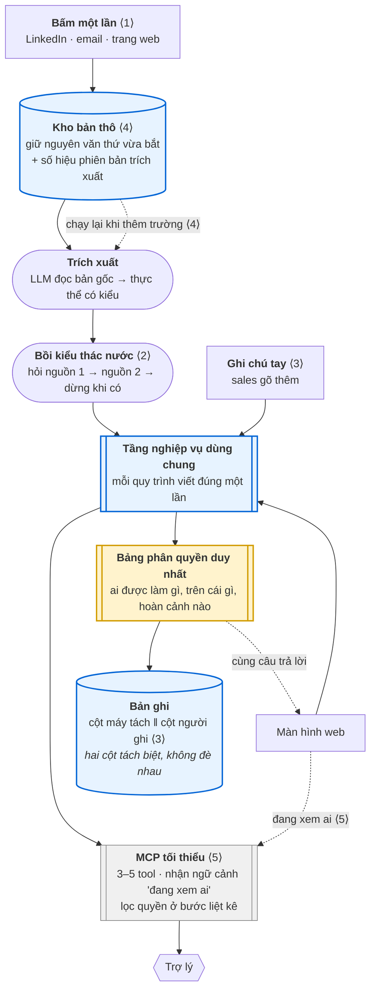

# Kiến trúc đề xuất

> # 🚧 WIP — TẠM HOÃN từ 8/8/2026
>
> **Không dùng tài liệu này để ra quyết định.** Nó thiếu đầu vào bắt buộc.
>
> ### Vì sao dừng
>
> BABOK `7.5.3` quy định đầu vào của *Define Design Options* là **requirement đã validate và đã
> ưu tiên hoá** — nguyên văn: *"**only validated requirements** are considered in design options"*.
>
> Chưa chạy `bmad-product-brief`, chưa chạy `bmad-prd`, nên **chưa có requirement nào**. Toàn bộ
> thiết kế dưới đây đứng trên giả định do người viết tự đặt ra.
>
> ### Bốn lỗi phương pháp đã xác định
>
> | | Lỗi | Điều khoản |
> |---|---|---|
> | 1 | Làm thiết kế trước khi có yêu cầu | `7.5.3` |
> | 2 | Chỉ có **một** phương án rồi sửa đi sửa lại, thay vì sinh 2–4 phương án rồi so | `7.5.8` · `7.6.2` |
> | 3 | Không ước tính lợi ích, chi phí, chi phí cơ hội cho từng phương án | `7.6.4.1` · `.2` |
> | 4 | Chỉ mô tả thành phần phần mềm — bỏ năm loại design element còn lại | `7.5.4.4` |
>
> Hai kết luận hợp lệ chưa bao giờ được đặt lên bàn, dù `7.6.2` nêu thẳng: **chạy nhiều
> proof-of-concept song song rồi đo**, và **không làm gì cả**.
>
> ### Mở lại khi nào
>
> Sau khi `bmad-prd` xong và requirement được ưu tiên hoá. Khi đó viết lại theo cấu trúc:
> 2–4 design option → mỗi cái ghi rõ **Create / Purchase / Combination** (`7.5.4.1`) → mô tả bằng
> **sáu loại design element** (`7.5.4.4`) → ước tính giá trị (`7.6.4`) → khuyến nghị.
>
> Ba ứng viên đã có sẵn: *ghép tinh hoa giữ thao tác truyền thống* · *tối giản kiểu Folk* ·
> *fork Twenty rồi đắp lớp*. Ba cái khác nhau đúng ở trục Create / Create / Combination.
>
> ### Phần nào vẫn dùng được ngay
>
> **Bốn quyết định nền ở mục 2** — tầng nghiệp vụ dùng chung, bảng phân quyền duy nhất, kho bản
> thô tối thiểu, tách cột máy ghi với cột người ghi. Chúng đứng vững **bất kể requirement là gì**,
> vì tiêu chí vào nhóm này là *rẻ khi làm sớm, không sửa được khi làm muộn* — không phải *phù hợp
> với yêu cầu X*.
>
> ⚠ Nhưng ngay cả bốn thứ đó cũng chưa ai xác nhận. Chúng là **phỏng đoán có cơ sở**, không phải
> quyết định đã chốt.
>
> **Mọi thứ khác trong tài liệu — mục 0, mục 1, mục 3 trở đi — đóng băng.**

---

**Vai trò tài liệu:** [`systems.md`](systems.md) khảo sát năm hệ thống nhưng không chốt gì. Đây
định là kiến trúc của **chính dự án này**.

**Lịch sử:** viết 8/8, phản biện hai vòng, đổi hướng hai lần (tối giản → ghép tinh hoa), rồi hoãn
khi đối chiếu với BABOK `7.5`/`7.6` phát hiện thiếu đầu vào.

---

## 0 · Sản phẩm là gì

Mục này dùng đúng khung đã áp cho năm hệ thống trong [`systems.md`](systems.md) — *là gì · giải
bài toán gì · điều gì đổi*. Kiến trúc ở các mục sau tồn tại để phục vụ mục này, không phải ngược
lại.

### Là gì

> **Bên ngoài là một CRM quen thuộc. Bên trong là tinh hoa của năm hệ thống đang dẫn đầu.**
>
> Người dùng vẫn mở danh sách, vẫn có form, vẫn kéo thả pipeline, vẫn xuất báo cáo — **không phải
> học lại gì cả**. Nhưng bên dưới lớp thao tác quen thuộc đó là năm thứ mà CRM truyền thống không
> có, mỗi thứ lấy từ một hệ thống đã chứng minh được nó hoạt động.

### Ràng buộc quyết định mọi thứ: giữ thao tác truyền thống

Đây không phải hạn chế, đây là **chỗ đứng**.

Cả năm hệ thống trong [`systems.md`](systems.md) đều đòi người dùng **đổi cách làm việc** — Day.ai
bắt nối cả hộp thư và bỏ hẳn form, Granola bắt để máy nghe suốt cuộc họp, Clay bắt sống trong một
công cụ thứ hai bên cạnh CRM. Mỗi lần đòi đổi hành vi là một lần mất phần lớn người dùng.

> **Ta không đòi đổi hành vi. Ta đòi bỏ bớt hành vi.**
>
> Người dùng làm y như cũ, chỉ là nhiều thao tác cũ **tự biến mất** vì hệ thống đã làm hộ.

Ai không tin phần tự động thì vẫn nhập tay được như mọi CRM khác — và đó chính là điều khiến phần
tự động **được phép sai** mà không làm hỏng sản phẩm.

### Năm phần tinh hoa, mỗi phần một hệ thống

Lấy đúng thứ **đắt giá nhất** của từng cái — thứ mà hãng đó dồn công sức vào nhất:

| | Lấy từ | Phần tinh hoa | Nó giải bài toán gì | Với CRM truyền thống thì thành gì |
|---|---|---|---|---|
| **1** | **Day.ai** | **Bắt trước, cấu trúc sau** — giữ bản gốc bất biến, schema chỉ là cách nhìn, nên **thêm trường hôm nay là điền ngược được cho toàn bộ lịch sử** | Thêm cột mới thì dữ liệu cũ rỗng, phải nhập lại từ đầu | Form vẫn còn, nhưng **phần lớn ô đã được điền sẵn** khi người dùng mở lên |
| **2** | **Attio** | **Mô hình đồ thị có quan hệ hai chiều** — sửa công ty của một người thì đội ngũ của công ty đó tự đổi theo, không cần mã đồng bộ | Dữ liệu quan hệ trong CRM luôn lệch giữa các màn hình | Danh sách và liên kết vẫn hiển thị y như cũ, **chỉ là không bao giờ lệch nữa** |
| **3** | **Attio** | **Danh mục năng lực dựng lại theo từng lượt** — trợ lý chỉ **nhìn thấy** việc nó được phép làm, lọc ngay ở bước liệt kê chứ không phải lúc gọi | Chatbot gắn ngoài tự đoán quy tắc rồi làm bậy | Phân quyền vẫn là bảng vai trò quen thuộc, **trợ lý dùng đúng bảng đó** |
| **4** | **Granola** | **Bắt ở đúng thời điểm phát sinh, chạy nền, không ai phải nhớ bấm** — và tách riêng phần máy ghi với phần người ghi | Ghi chép sau cuộc gặp thì đã quên; ghi trong lúc gặp thì không tập trung được | Ô ghi chú vẫn ở chỗ cũ, **nhưng đã có sẵn nội dung** khi mở ra |
| **5** | **Clay** | **Bồi dữ liệu từ nhiều nguồn theo thác nước** — hỏi lần lượt, nguồn nào có thì dừng, không trả tiền cho nguồn không dùng | Hồ sơ khách hàng luôn thiếu, không ai có thời gian đi tra | Nút "làm giàu" hoặc tự chạy nền, **hồ sơ tự đầy lên** |

### Kể thành một mạch

> Sales mở CRM như mọi ngày. Danh sách khách hàng quen thuộc, không có gì lạ.
>
> Mở một khách ra — **các ô đã có sẵn nội dung** ⟨1⟩. Chức danh, quy mô công ty, ngành nghề đều
> đã được bồi từ vài nguồn bên ngoài ⟨5⟩. Ô ghi chú đã có tóm tắt cuộc gọi tuần trước, và phần
> sales tự gõ nằm riêng bên dưới, không bị đè ⟨4⟩.
>
> Sales sửa công ty của người này. Bên hồ sơ công ty, danh sách nhân sự **tự cập nhật theo** —
> không phải vào sửa lần hai ⟨2⟩.
>
> Sales hỏi trợ lý *"khách này sao rồi"*. Trợ lý biết đang nói về ai, và **chỉ thấy được đúng
> phần mà sales này được phép thấy** ⟨3⟩.
>
> Tháng sau công ty thêm trường *"nguồn khách"*. Vì bản gốc còn nguyên, trường mới **có dữ liệu
> ngay cho toàn bộ khách cũ** ⟨1⟩ — không ai phải nhập lại.

Toàn bộ mạch trên diễn ra trong **giao diện CRM bình thường**. Không có màn hình lạ nào, không có
thao tác mới nào phải học.

### Vì sao chưa ai ghép năm thứ này

Vì mỗi hãng bán **một sản phẩm** chứ không bán một kiến trúc, nên phải chọn một chỗ để giỏi nhất
và bỏ phần còn lại. Day.ai giỏi bắt dữ liệu nhưng bỏ hẳn thao tác truyền thống. Attio giỏi mô
hình dữ liệu nhưng không bắt dữ liệu hộ. Granola không phải CRM. Clay không sở hữu dữ liệu.

Và cả năm đều **đòi người dùng đổi cách làm việc** — đó là chỗ trống thật sự.

⚠ **Đây là kiến trúc đích, không phải phạm vi tuần này.** Lấy phần đắt giá nhất của năm hệ thống
thì không vừa 49 giờ. Mục 2 chốt phần nền phải làm ngay; [`docs/plan/`](../plan/README.md) quyết
định tuần này đi được tới đâu trên con đường đó.

### Giải bài toán gì ⚠

⚠ **Giả định chưa xác minh, và nó đỡ toàn bộ phần còn lại:**

> Sales không lười. Họ **không có thời gian**. Mỗi lần nhập liệu là một lần dừng bán hàng để làm
> thư ký, nên dữ liệu trong CRM luôn thiếu — và CRM thiếu dữ liệu thì báo cáo sai, dự báo sai,
> quản lý mất niềm tin, rồi càng ép nhập, rồi càng không ai nhập.

Người duy nhất xác nhận hoặc bác bỏ được điều này là **Tung Nguyen (SME)** — 15 phút, câu hỏi đã
soạn ở [`kickoff.md`](../kickoff.md). Nếu nỗi đau thật là chuyện khác, mục 0 này phải viết lại, và
các mục sau đi theo.

Thị trường đứng về phía giả định: Day.ai, Attio, Folk và Clay — cả bốn — đều xây quanh đúng vấn
đề này. Nhưng đó là bằng chứng *vấn đề có thật ngoài kia*, **không** phải bằng chứng *vấn đề của
công ty mình*.

### Năm điều đổi cho người dùng

| | Trước | Sau | Mảnh |
|---|---|---|---|
| **①** | Mở CRM, tạo bản ghi, điền mười ô | **Bấm một lần** ngay tại chỗ đang xem | 1 |
| **②** | Tự đi tra thêm thông tin ở ba chỗ khác | **Máy bồi hộ**, hỏi lần lượt, có là dừng | 2 |
| **③** | Ghi chú riêng bị máy ghi đè, hoặc phải để ngoài CRM | Ghi chú của người **nằm cạnh** phần máy tách, không đè nhau | 3 |
| **④** | Thêm cột mới → rỗng cho mọi bản ghi cũ, nhập lại từ đầu | Còn bản gốc nên **chạy lại trích xuất**, cột mới có dữ liệu ngay | 4 |
| **⑤** | Hỏi trợ lý phải mô tả lại đang nói về ai | Trợ lý **biết bạn đang xem ai**, và chỉ thấy đúng phần bạn được thấy | 5 |

### Một câu cho phần trình bày

> *"CRM khác bắt bạn nhập liệu. Cái này chỉ bắt bạn **chỉ vào**."*

Hai điểm ít ai hỏi nhưng đắt nhất với người từng dùng CRM thật:

- **④** — họ đã gặp cảnh thêm trường rồi phải ngồi nhập lại từ đầu.
- **③** — họ đã gặp cảnh AI tóm tắt đè mất ghi chú tay, hoặc phải giữ ghi chú thật ở một file
  riêng ngoài CRM vì không tin hệ thống.

### Không phải cái gì

Ghi rõ để tránh trượt phạm vi giữa tuần:

- **Không** phải trợ lý tự động làm thay — người vẫn quyết mọi thứ được lưu
- **Không** phải công cụ nghe lén cuộc gọi — không có ghi âm, không có speech-to-text
- **Không** thay thế CRM đang dùng của công ty — đây là bản trình diễn một cách làm khác

---

## Nguyên tắc chọn kiến trúc

> **Ngân sách 49 giờ đòi hình dạng của hệ thống rẻ nhất, không phải hệ thống đẹp nhất.**

`systems.md` xếp hạng chi phí dựng lại: **Folk trọn vẹn · Clay trọn vẹn · Granola được ·
Day.ai một phần · Attio không**. Kiến trúc dưới đây neo vào **Folk**, mượn **một** ý của Day.ai,
và lấy bài học kỹ thuật của Attio mà **không** lấy hình dạng của Attio.

Năm mảnh ở mục 0 ánh xạ sang kiến trúc — và **chỉ hai mảnh cần quyết định nền**, ba mảnh còn lại
là tính năng làm sau được:

| Mảnh | Cần gì | Thuộc nhóm |
|---|---|---|
| **1** Bấm một lần | Một cửa vào mới | Tính năng |
| **2** Làm giàu kiểu thác nước | Gọi lần lượt 2–3 nguồn | Tính năng |
| **3** Gộp ghi chú người với bản máy | **Hai cột tách biệt trong mô hình dữ liệu** — máy ghi cột A, người ghi cột B, không đè nhau | ⚠ **Quyết định nền** — trộn chung một cột rồi thì không tách lại được |
| **4** Thêm trường điền ngược được | **Kho bản thô tối thiểu** | ⚠ **Quyết định nền ③** |
| **5** Trợ lý biết đang xem ai | Truyền ngữ cảnh + lọc quyền ở bước liệt kê | Quyết định nền ② lo phần lọc; phần truyền ngữ cảnh là tính năng |

**Mảnh 3 vừa phát hiện ra là quyết định nền, không phải tính năng.** Nếu ngày đầu để LLM ghi
thẳng vào cùng ô với ghi chú người, thì ngày thứ năm không tách ra được — và mất luôn điều đổi
③. Chi phí tách ngay từ đầu: **một cột thêm**.

---

## 1 · Hình dạng đích

Số trong ngoặc là **mảnh** tương ứng ở mục 0.



Bốn khối tô xanh/vàng là **quyết định nền** — làm sai ngày đầu thì không sửa được. Hai khối
`Bồi kiểu thác nước` và `MCP tối thiểu` là tính năng, thêm bớt tự do.

### Ánh xạ với bảy tầng của `systems.md`

Dùng đúng hệ quy chiếu đã dùng để so năm hệ thống, nên đặt cạnh nhau đối chiếu được:

| Tầng | Năm hệ thống | **Của mình** |
|---|---|---|
| 1 · Capture point | 4 kiểu khác nhau | **Nơi người dùng đang đứng** (Folk) |
| 2 · Raw store | Attio, Day.ai, Granola có · Folk, Clay không | **Có, tối thiểu** — chỉ bản gốc của thứ vừa bắt |
| 3 · Extraction | LLM | LLM |
| 4 · Data model | Particle / derived records | Bảng quan hệ thường |
| 5 · Agent indexing | **Chỉ Attio** | ✗ **Không làm** |
| 6 · Exposure | REST · MCP · UI | Web UI + **MCP tối thiểu** |
| 7 · Clients | web · agent | web · agent ngoài |

**Tầng 5 là tầng đắt nhất trong cả `systems.md` và ta bỏ hẳn.** Tầng 2 giữ ở mức tối thiểu.

---

## 2 · Bốn quyết định nền — chốt ngay

Tiêu chí vào nhóm này: **chi phí ≈ 0 khi làm sớm, không sửa được khi làm muộn.**

### ① Tầng nghiệp vụ dùng chung

**Quy trình được viết ra đúng một lần, mọi cửa đều đi qua nó.**

Lấy việc **tạo một cơ hội bán hàng**: kiểm quyền, kiểm thông tin đủ chưa, ghi vào hệ thống, báo
quản lý. Cơ hội vào bằng nhiều cửa — sales bấm one-click, nhập tay trên web, sau này có thể là
điện thoại hay agent.

Nếu mỗi cửa tự làm theo cách riêng thì có bấy nhiêu phiên bản của cùng một quy trình. Đến khi có
chính sách mới — *"cơ hội trên 500 triệu phải báo giám đốc"* — phải sửa từng chỗ. Quên một chỗ
thì chính sách bị lọt, và **không ai biết cho tới khi mất tiền**.

> Giống công ty có **một quầy xử lý hồ sơ duy nhất**: khách đến bằng cửa nào cũng theo cùng quy
> trình, thay vì mỗi cửa một kiểu.

### ② Bảng phân quyền duy nhất

**Một bản trả lời duy nhất cho câu "ai được làm gì".**

Quy tắc kiểu: *rep chỉ xem khách của mình · trưởng nhóm xem cả nhóm · giám đốc xem tất cả · gửi
email ra ngoài phải có người duyệt*. Quy tắc này bị hỏi ở màn hình danh sách, báo cáo, tìm kiếm,
và cả agent. Nếu mỗi nơi tự trả lời, chúng lệch nhau **âm thầm**:

| Chuyện xảy ra | Hậu quả |
|---|---|
| Màn hình ẩn nút, nhưng gọi thẳng vào hệ thống vẫn được | Lỗ hổng thật, chỉ là chưa ai phát hiện |
| Danh sách lọc đúng, báo cáo lọc sai | Rep thấy khách của người khác → tranh chấp hoa hồng |
| Agent không biết quy tắc "email ra ngoài phải duyệt" | Gửi thẳng cho khách, mất khách |

### ③ Kho bản thô — tối thiểu

**Giữ bản gốc của thứ vừa bắt, không giữ mọi thứ.**

Người dùng bấm one-click trên một hồ sơ LinkedIn hay một email. Hệ thống lưu **nguyên văn nội
dung đó**, rồi mới cho LLM đọc và tách ra thực thể.

Vì sao phải quyết ngay ngày đầu: nếu chỉ lưu kết quả trích xuất mà vứt bản gốc, thì **ngày thứ
năm muốn thêm một trường mới sẽ không có gì để chạy lại** — trường đó rỗng cho mọi bản ghi cũ, và
không có cách nào điền. Bản gốc là thứ duy nhất cho phép sửa sai về sau.

Đây là ý duy nhất mượn của Day.ai. Nhưng mượn **có cắt**: Day.ai hút mọi thứ từ Gmail, Calendar,
Zoom, Slack và giữ toàn bộ lịch sử liên lạc. Ta chỉ giữ những gì người dùng đã **chủ động bấm**.

### ④ Agent là một cửa — nhưng tối thiểu

Agent đi vào bằng **cùng cửa** với con người: cùng tầng nghiệp vụ, cùng bảng phân quyền. Khác
biệt duy nhất là agent **không nhìn thấy** việc nó không được phép làm — lọc ngay ở bước liệt kê
tool, không phải lúc gọi.

Phạm vi: **3–5 tool**, không có chỉ mục ngữ nghĩa. Đây là chỗ tách khỏi "CRM có chatbot": chatbot
gắn ngoài phải tự đoán quy tắc, còn agent đi cửa chính thì quy tắc áp lên nó y hệt áp lên người.

---

## 3 · Bốn thứ dứt khoát không làm

`systems.md` cho thấy Folk và Clay mạnh **chính nhờ bỏ tầng**. Ghi rõ để không ai lỡ tay làm:

| Không làm | Vì sao | Bỏ được cái gì |
|---|---|---|
| **Chỉ mục ngữ nghĩa / embeddings** | Kéo theo bài toán *External Consistency* — kho vector chạy lệch pha với database. Attio phải viết cả một tầng riêng để chống | Cả tầng 5, tầng đắt nhất |
| **Đa tổ chức** | Một công ty dùng thì không cần. Thêm sau được | Ràng buộc tenant trên mọi truy vấn |
| **OAuth 2.1 + xác thực tăng cường** | Attio nói đây là *phần khó nhất* của MCP server. Chạy cục bộ thì không cần | Dynamic client registration, token xoay vòng |
| **Đồng bộ thời gian thực / offline** | Là tính năng cho đội nhiều người dùng cùng lúc. Demo không cần | Toàn bộ tầng đồng bộ |

**Bốn thứ này không làm kiến trúc sai** — chúng làm sản phẩm **chưa sẵn sàng cho production**,
đúng sự thật của mọi bản demo một tuần. Ghi thẳng vào phần hạn chế khi trình bày.

### Một hệ quả tốt ngoài dự tính

**Chọn one-click nghĩa là không cần speech-to-text.** Không có bản ghi cuộc gọi thì không có STT,
không có hàng đợi, không có xử lý bất đồng bộ, và không phải trả lời câu *"máy nghe nhầm thì
sao"*.

Rủi ro *"STT tiếng Việt có đủ tốt không"* — trước đây là rủi ro lớn nhất của dự án — **biến mất
hoàn toàn**. Thay vào đó chỉ còn một rủi ro nhỏ hơn nhiều: LLM đọc nội dung văn bản tiếng Việt và
tách đúng thực thể.

---

## 4 · Bằng chứng — dẫn từ cả năm hệ thống

| Quyết định | Dẫn từ | Nguyên văn / cơ sở |
|---|---|---|
| ① Tầng nghiệp vụ dùng chung | **Attio** | *"Business logic does not live in the web app and not in the MCP server. **Both are adapters.**"* |
| ② Bảng phân quyền duy nhất | **Attio** | `capability registry` dựng lại mỗi lượt — lọc tool **ở bước liệt kê**, không ở bước gọi |
| ③ Kho bản thô tối thiểu | **Day.ai** | *structure-later* + *retroactive backfill*: thêm trường hôm nay thì chạy lại trích xuất trên dữ liệu cũ |
| ④ Agent tối thiểu | **Folk · Clay · Granola** | Cả ba **không có tầng agent** mà vẫn là sản phẩm tốt → tầng này là lựa chọn, không phải tất yếu |
| Điểm bắt dữ liệu | **Folk** | `folkX` — bắt tại nơi người dùng đang đứng, một cú click, human-in-the-loop |
| Phạm vi hẹp | **Clay** | *Scope là quyết định kiến trúc, không phải kỹ thuật* — không sở hữu cái gì không cần |
| Bỏ tầng 5 | **`systems.md` §chi phí** | *Attio — **Không** dựng lại được — tầng 5 và Rust query engine vượt xa ngân sách* |

### Bốn bài học kỹ thuật của Attio, áp cho phần MCP tối thiểu

Attio đã trả giá để rút ra, dùng lại miễn phí:

| Bài học | Áp thế nào |
|---|---|
| **Tool thô thắng tool nguyên tử** | Họ tách "list comments" / "fetch replies" rồi phải gộp lại vì agent luôn gọi nhiều lần. Ta làm 3–5 tool giàu ngữ cảnh, không làm 20 tool nhỏ |
| **Serialize theo token** | Trả về định dạng gọn, không phải JSON dài dòng |
| **Bỏ phân trang, dùng truy vấn tổng hợp** | Agent không nên duyệt hàng trăm bản ghi để trả lời một câu |
| **Xác thực là phần khó nhất** | Lý do đủ để chạy cục bộ và **không làm** OAuth — xem mục 3 |

⚠ **Không neo vào `mcp-first.ai`.** Cách sắp xếp bốn quyết định trên mượn từ manifest đó, nhưng
nền thật là *ports & adapters* (2005) và các hệ thống đang chạy trong `systems.md`. Trang kia là
spec v0.1, GitHub 1 sao, không kèm mã — mượn cái tên để kể chuyện, không dựa vào phần còn lại.

---

## 5 · Vì sao phải chốt ngay ngày đầu

> **Giống đặt đường ống trước khi đổ bê tông.** Đặt trước gần như không tốn gì. Đổ xong rồi mới
> muốn đặt thì phải đục nền.

| | Làm ngày đầu | Làm ngày thứ năm |
|---|---|---|
| Công sức | **~3,5 giờ** | Vài ngày |
| Rủi ro | Không có | Mở lại mọi thứ đã viết, không gì bảo đảm còn chạy đúng |
| Trong lúc đó | — | Vẫn phải làm tính năng cho kịp demo |

⚠ **Con số 3,5 giờ chưa được đo.** Không hệ thống nào trong `systems.md` cho biết chi phí dựng
tầng nghiệp vụ — đây là phỏng đoán, và nó đang là cơ sở cho lịch trong [`docs/plan/`](../plan/README.md).
Nếu quá 5 giờ thì cắt bảng phân quyền xuống 2 quy tắc.

Phân rã:

| | Giờ |
|---|---|
| Cấu trúc + một quy trình mẫu chạy đầu-cuối | 1 |
| Bảng phân quyền với 3–4 quy tắc thật của CRM | 1 |
| Nối **hai** cửa vào cùng một quy trình | 1 |
| Kho bản thô tối thiểu — một bảng, ghi rồi không sửa | 0,5 |

Việc thứ ba quan trọng nhất: **chỉ khi có hai cửa cùng gọi một quy trình mới biết mình đã tách
đúng.** Một cửa thì luôn tưởng là đã tách.

---

## 6 · Nó mua được gì cho phần trình bày

| Câu hỏi vặn | Trả lời |
|---|---|
| *"Thêm kênh mới thì sao?"* | Thêm một cửa tiếp nhận, **không viết lại nghiệp vụ** |
| *"Đổi chính sách thì sao?"* | Sửa một chỗ, mọi kênh đổi theo |
| *"AI có làm bậy được không?"* | Agent đi qua đúng bảng phân quyền như người, và **không nhìn thấy** việc nó không được phép |
| *"Sau này muốn thêm trường mới thì dữ liệu cũ có rỗng không?"* | Không — còn bản gốc nên **chạy lại trích xuất được** |

Câu cuối là câu ít ai hỏi nhưng ấn tượng nhất với người từng dùng CRM thật — vì họ đã gặp cảnh
thêm trường rồi phải nhập tay lại từ đầu.

---

## 7 · Ba thứ còn treo

| | Chờ gì | Ảnh hưởng tới kiến trúc |
|---|---|---|
| **Viết mới hay fork** | Timebox tối T2 + đề bài có cấm fork không | Plan B: bốn khối nằm **trên** nền fork thay vì trong mã của mình |
| **Nguồn nào để one-click** | Nỗi đau thật (hỏi SME) | Đổi **cửa vào**, không đụng bốn quyết định nền |
| **Có cần bậc 2 không** *(nguồn + thời điểm + độ tin cho mỗi mẩu thông tin)* | Còn dự phòng hay không | Thêm cột vào bản ghi, không đổi hình dạng |

**Cả ba đều không đụng vào mục 2** — đó là lý do mục 2 chốt được ngay.

### Kiến trúc này đổi thế nào theo hai plan

| | Plan A · Làm mới | Plan B · Fork Twenty |
|---|---|---|
| Tầng nghiệp vụ | Mình viết từ đầu | Mình viết, đặt **trên** nghiệp vụ có sẵn |
| Bảng phân quyền | Mình viết từ đầu | Bọc phân quyền của Twenty thành một cửa duy nhất |
| Kho bản thô | Một bảng mới | Một custom object mới |
| MCP tối thiểu | Tự viết | Tự viết, gọi vào tầng nghiệp vụ của mình |
| Phần đem trình bày | Toàn bộ | **Chỉ lớp mình đắp thêm** |

---

## 8 · Giả định và rủi ro ⚠

| Giả định | Nếu sai | Đỡ thế nào |
|---|---|---|
| 3,5 giờ đủ để dựng nền | Trễ dây chuyền ngay ngày đầu | **Chưa đo.** Quá 5 giờ thì cắt phân quyền xuống 2 quy tắc |
| LLM tách đúng thực thể từ văn bản tiếng Việt | Trích xuất tự động vô dụng, chỉ còn lưu bản thô | Đo bằng phép thử 30 phút — xem [`kickoff.md`](../kickoff.md). Đường lui: người dùng sửa tay bản trích xuất |
| Kiến trúc có trọng số trong barem | Đầu tư vào chỗ không được chấm | Bốn quyết định này rẻ tới mức vẫn đáng làm dù không được chấm — chúng giúp **làm nhanh hơn**, không chỉ để trình bày |
| Fork vẫn đắp được bốn khối lên trên | Plan B mất phần kiến trúc để trình bày | Timebox tối T2 kiểm luôn điều này, không chỉ kiểm "dựng được không" |
| Giám khảo nhận ra giá trị | Làm đúng mà không ghi điểm | Ưu tiên thứ **nhìn thấy được**: hộp xác nhận trước việc nguy hiểm |

**Rủi ro lớn nhất không nằm trong bảng:** dồn sức vào kiến trúc tới mức sản phẩm không chạy được.
Kiến trúc là điểm cộng, không phải sản phẩm.

---

## Phụ lục · Bản kỹ thuật

**Action layer** — nghiệp vụ ở tầng hành động, adapter chỉ dịch giao thức:

```ts
// action layer — không biết gì về HTTP hay MCP
async function createDeal(input, ctx) {
  if (!can(ctx.principal, 'deal.create', null, ctx)) throw new Forbidden()
  validate(input)
  const deal = await db.deals.insert(input)
  await notify(deal)
  return deal
}

// adapter web — ba dòng, KHÔNG chứa nghiệp vụ
app.post('/api/deals', (req, res) =>
  createDeal(req.body, { principal: req.user }).then(d => res.json(d)))

// adapter MCP — cũng chỉ dịch
tool('create_deal', (args, session) =>
  createDeal(args, { principal: session.user }))
```

**Quy tắc kiểm được:** adapter không chứa lệnh `if` nào về nghiệp vụ.

**`can()`** — một hàm, mọi nơi hỏi:

```ts
can(principal, action, resource, context) → boolean

can(repA,     'deal.update', deal123, { field: 'stage', to: 'won' })  // false
can(managerB, 'deal.update', deal123, { field: 'stage', to: 'won' })  // true
can(aiAgent,  'email.send',  null,    { external: true })             // false — cần người duyệt
```

Giao diện hỏi để **ẩn nút** · API hỏi để **chặn request** · MCP hỏi để **không liệt kê tool**.

**Kho bản thô tối thiểu** — một bảng, ghi rồi không sửa:

```
captures
  id · source_type (linkedin|email|web|note) · source_url
  raw_content (nguyên văn) · captured_by · captured_at
  extraction_version · extracted_record_id
```

`extraction_version` là cột cho phép chạy lại: đổi prompt hoặc thêm trường thì tăng version và
chạy lại trên toàn bộ `raw_content` đã có.
