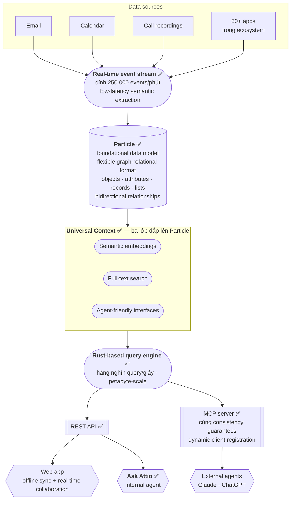
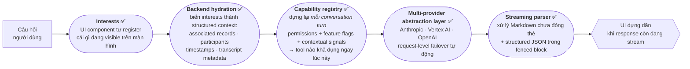
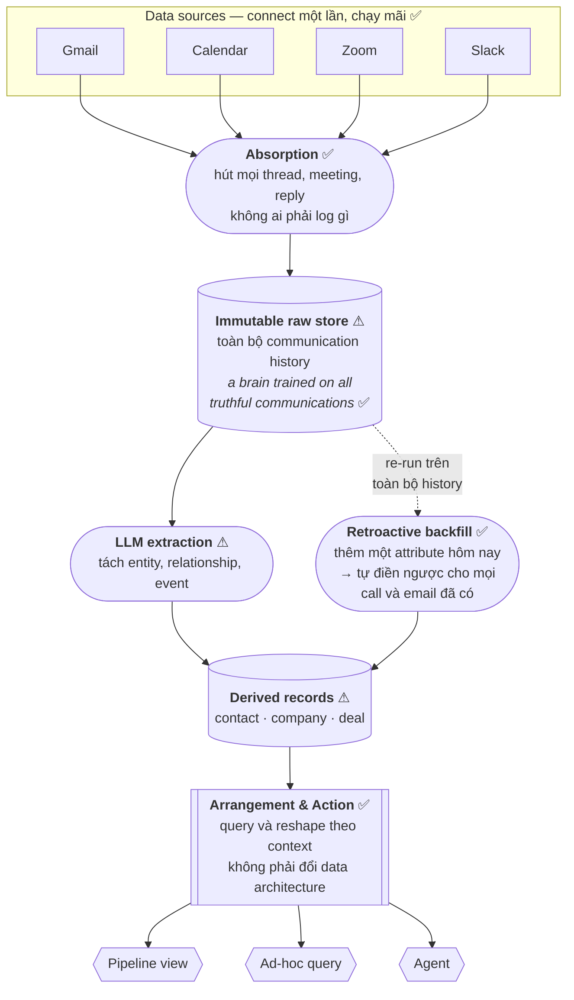
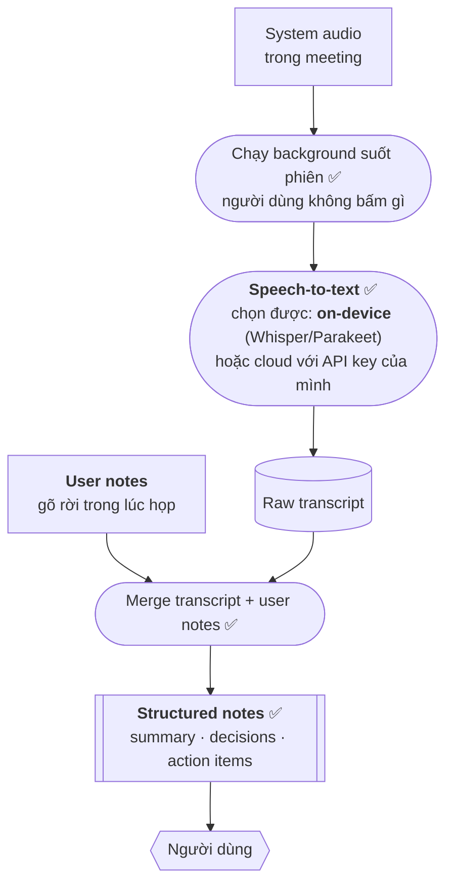
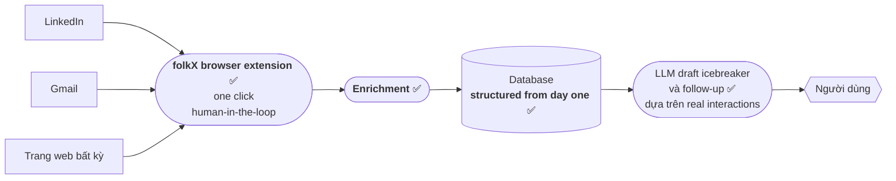
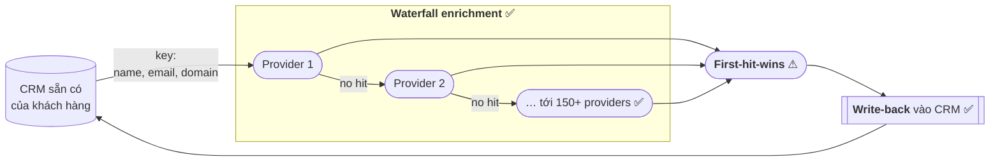
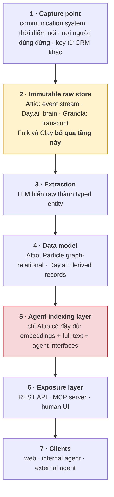

# Kiến trúc năm hệ thống AI-native

Mỗi hệ thống mô tả theo **cùng sáu mục** — là gì · giải bài toán gì · luồng chạy · quyết định
kiến trúc mấu chốt · đánh đổi · sơ đồ. Cùng cấu trúc để so được theo từng mục.

**Quy ước thuật ngữ:** diễn giải bằng tiếng Việt, **thuật ngữ kỹ thuật giữ nguyên tiếng Anh** —
để tra cứu ngược về tài liệu gốc không bị lệch nghĩa.

⚠ **Tài liệu này chỉ khảo sát, không chốt gì** — và phần khảo sát thì **vẫn dùng được**, không
phụ thuộc requirement.

🚧 Kiến trúc của chính dự án ở [`proposal.md`](proposal.md), **đang tạm hoãn** vì thiếu đầu vào
theo BABOK `7.5.3`. Sẽ viết lại thành 2–4 design option sau khi có PRD, và vẫn dẫn bằng chứng từ
đây.

**Mức chắc chắn** — đánh dấu ngay trên từng khối sơ đồ:

| Ký hiệu | Nghĩa |
|---|---|
| ✅ | Tên và vai trò do chính hãng công bố |
| ⚠ | Em suy ra từ hành vi sản phẩm — **có thể sai** |

**Ký hiệu khối:** `[ ]` data source · `([ ])` processing · `[( )]` storage · `[[ ]]` exposure
layer · `{{ }}` client

---

# 1 · Attio

### Là gì

CRM cho startup và đội go-to-market, xây quanh một **graph-relational data model** linh hoạt thay
vì bảng cố định. Người dùng tự định nghĩa object và attribute, hệ thống lo phần sync và indexing.

### Giải bài toán gì

Hai bài cùng lúc, và chính họ nói đó là chỗ khó:

1. **Kết hợp strongly-typed relational data với unstructured data.** Call recording và email nằm
   cạnh trường "deal stage" trong cùng một model.
2. **Giữ cho agent nhìn thấy đúng dữ liệu hiện tại.** Vector store thường chạy lệch pha với
   database — họ coi việc chống lệch đó là bài toán chính.

### Luồng chạy

1. Email, calendar, call recording và 50+ app đổ vào một **real-time event stream** — đỉnh
   **250.000 events/phút**, kèm **low-latency semantic extraction** ngay khi chảy qua.
2. Dữ liệu đọng vào **Particle**, foundational data model định dạng graph-relational:
   *objects* (khuôn), *attributes*, *records*, *lists*. Quan hệ **bidirectional** — sửa company
   của một person thì team của company đó tự cập nhật.
3. **Universal Context** đắp ba lớp lên Particle: **semantic embeddings**, **full-text search**,
   và **agent-friendly interfaces**.
4. Mọi truy vấn đi qua một **Rust-based query engine**, hàng nghìn query/giây, quy mô petabyte.
5. Lộ ra hai cửa: **REST API** cho lập trình viên, **MCP server** cho agent. Cả hai hưởng cùng
   consistency guarantees.

### Quyết định kiến trúc mấu chốt

**External Consistency.** Họ tự gọi là *"hệ thống đầu tiên trong bất kỳ CRM nào"* đảm bảo được:

> Semantic embeddings mà agent dùng để traverse dữ liệu **luôn khớp chính xác** với dữ liệu thật
> trong hệ thống.

Đây là lý do Universal Context phải nằm **trên** Particle chứ không nằm **cạnh**. Nếu nằm cạnh
thì thành hai source of truth, và agent sẽ trả lời theo bản cũ mà không ai biết.

**MCP server là adapter, không phải API wrapper.** Họ nói rõ lý do: *"Người dùng của một public
API là lập trình viên. Người dùng của một MCP server là autonomous agent."* Hai loại consumer đó
cần hai thiết kế khác nhau — pagination hợp với lập trình viên, vô nghĩa với agent.

### Đánh đổi

Agent indexing layer là tầng **đắt nhất** trong toàn bộ tài liệu này. Nó đòi một hệ sync riêng và
một query engine tự viết. Đổi lại, external agent (Claude, ChatGPT) thao tác được trên live data
mà không cần data export hay custom integration.

Họ cũng nêu một chỗ đau: **authentication là phần khó nhất** của MCP server. OAuth thường không
chạy, phải dùng **dynamic client registration**.

### Sơ đồ

### Bên trong agent Ask Attio

Đáng tách riêng vì đây là phần áp dụng được nhiều nhất.

**Luồng:** người dùng hỏi → UI tự khai báo cái đang hiển thị → backend hydration bồi thành
structured context → dựng **capability registry** cho **riêng turn này** → gọi model → streaming
parser dựng UI dần.

Ba quyết định đáng học:

1. **Conversation as a tree, not a list** — mỗi message trỏ về parent, nên branch và explore
   được thay vì chỉ nối đuôi.
2. **Capability registry dựng lại mỗi turn** — tool khả dụng là hàm của permission + context
   **tại thời điểm đó**. Agent không nhìn thấy tool nó không được dùng, nên không có cơ hội gọi
   sai.
3. **Interests** — UI tự khai báo cái đang hiển thị, nên agent biết người dùng đang nhìn gì mà
   không phải hỏi lại.

### Thuật ngữ của Attio

🏷️ tên riêng của hãng · 📖 khái niệm chung ngành

| | Thuật ngữ | Là gì |
|---|---|---|
| 🏷️ | **Particle** | Tên foundational data model của Attio. Định dạng graph-relational — vừa có kiểu chặt như bảng quan hệ, vừa nối nhau như đồ thị. **Không phải chuẩn ngành**, chỉ tồn tại trong Attio |
| 🏷️ | **Universal Context** | Ba lớp Attio đắp lên Particle: semantic embeddings + full-text search + agent-friendly interfaces. Tên riêng, công bố 2/2026 |
| 🏷️ | **External Consistency** | Tên Attio đặt cho đảm bảo: embeddings agent dùng **luôn khớp chính xác** dữ liệu thật. Họ tự nhận là CRM đầu tiên làm được |
| 🏷️ | **Ask Attio** | Agent nội bộ chạy trong sản phẩm |
| 🏷️ | **Interests** | Cơ chế để UI component **tự đăng ký** cái nó đang hiển thị, backend đọc được mà không phải hỏi |
| 🏷️ | **Backend hydration** | Bước biến danh sách interests thô thành structured context đầy đủ: records liên quan, participants, timestamps |
| 📖 | **objects · attributes · records · lists** | Bốn thành phần data model. *object* = khuôn (tương đương một bảng), *attribute* = cột, *record* = dòng, *list* = tập hợp record gom theo mục đích |
| 📖 | **bidirectional relationship** | Quan hệ hai chiều: sửa một đầu thì đầu kia tự cập nhật. Sửa company của một person → team của company đó đổi theo, không cần code đồng bộ |
| 📖 | **capability registry** | Danh mục tool mà agent được phép gọi. Điểm riêng của Attio là **dựng lại mỗi turn** thay vì cố định |
| 📖 | **dynamic client registration** | Cơ chế trong OAuth cho phép client tự đăng ký với server thay vì phải khai báo trước. Attio phải dùng vì OAuth thường không hợp MCP |
| 📖 | **semantic embeddings** | Biểu diễn văn bản thành vector số để tìm theo **nghĩa** chứ không theo từ khoá |
| 📖 | **petabyte-scale** | Quy mô 10¹⁵ byte — mốc mà kiến trúc phải thiết kế riêng, không dùng cách thông thường được |

---

# 2 · Day.ai

### Là gì

CRM do một cựu lãnh đạo sản phẩm HubSpot lập, Sequoia dẫn vòng gọi vốn đầu 2026. Điểm khác biệt
nằm ở chỗ **không có manual data entry** — hệ thống dựng record từ chính các cuộc trao đổi đã
diễn ra.

### Giải bài toán gì

CRM truyền thống bắt người dùng **định nghĩa schema trước khi capture được bất cứ thứ gì**: phải
tạo field, tạo object, tạo automation, rồi mới có chỗ để nhập. Ai cũng biết bước đó tốn công và
ai cũng biết dữ liệu cuối cùng vẫn thiếu.

Câu họ dùng để tóm tắt: *thay vì bắt người dùng nghĩ như máy, làm hệ thống nghĩ giống người.*

### Luồng chạy

1. Nối **một lần** vào Gmail, Calendar, Zoom, Slack — sau đó chạy mãi.
2. **Absorption**: hút mọi thread, mọi meeting, mọi reply. Không ai phải log gì.
3. Đọng vào một **immutable raw store** giữ nguyên toàn bộ communication history — họ gọi là
   *"a brain trained on all truthful communications"*.
4. **LLM extraction** tách entity và relationship, sinh ra **derived records**: contact, company,
   deal.
5. **Arrangement & Action**: query và reshape theo context — pipeline view, ad-hoc query, agent —
   mà **không phải đổi data architecture**.

### Quyết định kiến trúc mấu chốt

**Raw store là source of truth, schema chỉ là view.** Đây là chỗ đảo ngược so với CRM thường.

Hệ quả trực tiếp là **retroactive backfill**: thêm một attribute hôm nay thì hệ thống chạy lại
extraction trên **toàn bộ** call và email đã có, nên field mới **không rỗng**. CRM truyền thống
không làm được điều này — thêm field thì field đó trống cho mọi record cũ, và không có cách nào
điền lại.

### Đánh đổi

Độ phức tạp **chuyển từ người dùng sang hệ thống**. Người dùng không phải nhập liệu nữa, đổi lại
hệ thống phải đủ giỏi để hiểu unstructured communication. Nếu extraction kém thì không có kỷ luật
nhập liệu của con người để bù.

Ngoài ra raw store tốn chỗ và tốn thêm một processing stage — chi phí phải trả trước khi thấy lợi
ích.

⚠ Day.ai công bố ít hơn Attio nhiều. Bốn khối giữa trong sơ đồ là em suy ra từ mô tả hành vi.

### Sơ đồ

### Thuật ngữ của Day.ai

🏷️ tên riêng của hãng · 📖 khái niệm chung ngành · ⚠ tên mô tả do em đặt để gọi cho tiện

| | Thuật ngữ | Là gì |
|---|---|---|
| 🏷️ | **Absorption** | Tên pha đầu: hút mọi thread, meeting, reply từ các nguồn đã nối. Chạy liên tục, không ai kích hoạt |
| 🏷️ | **Arrangement & Action** | Tên pha sau: query và reshape dữ liệu theo context. Điểm mấu chốt — đổi cách nhìn **không phải đổi data architecture** |
| 🏷️ | **a brain trained on all truthful communications** | Cách Day.ai gọi kho dữ liệu thô của họ. Không phải mô hình học máy được huấn luyện thật — chỉ là cách nói về kho lịch sử liên lạc đầy đủ |
| 📖 | **capture-first, structure-later** | Nguyên tắc: bắt dữ liệu trước, định nghĩa cấu trúc sau. Ngược với CRM truyền thống bắt định nghĩa schema trước khi nhập được gì |
| 📖 | **retroactive backfill** | Thêm một field hôm nay → hệ thống chạy lại extraction trên toàn bộ dữ liệu cũ, nên field mới **không rỗng**. Chỉ khả thi khi còn giữ raw store |
| 📖 | **immutable raw store** | Kho bản gốc **không sửa được**. Là source of truth; mọi thứ khác dẫn xuất từ đây |
| 📖 | **derived records** | Bản ghi được sinh ra từ raw store bằng extraction — contact, company, deal. Xoá đi dựng lại được, vì raw store còn nguyên |
| 📖 | **source of truth** | Nơi giữ bản đúng nhất. Có hai source of truth là nguồn gốc của mọi lỗi lệch dữ liệu |

---

# 3 · Granola

### Là gì

AI notepad cho meeting. Chạy background trong lúc gọi, capture transcript, rồi sinh structured
notes — summary, decision, action item.

### Giải bài toán gì

Người ta không ghi chép trong lúc họp vì đang bận nói chuyện, và không ghi sau khi họp vì đã
quên. Các công cụ ghi âm sẵn có đòi phải **nhớ bấm nút record** — mà quên bấm là mất trắng.

### Luồng chạy

1. Capture system audio, **chạy background suốt phiên**, người dùng không bấm gì.
2. **Speech-to-text** — chọn được: chạy **on-device** (Whisper hoặc NVIDIA Parakeet) hoặc cloud
   bằng API key của chính mình.
3. Merge transcript máy nghe được với **user notes** người dùng gõ rời trong lúc họp.
4. Sinh structured notes.

### Quyết định kiến trúc mấu chốt

**Capture point đặt ở thời điểm nói chuyện, không phải sau đó.** Đây là khác biệt duy nhất nhưng
quyết định tất cả — nó loại bỏ hoàn toàn khả năng người dùng quên.

**Khối speech-to-text có thể đặt on-device.** Với CRM, call recording của khách hàng là dữ liệu
nhạy cảm — đặt khối này on-device biến một rủi ro thành một điểm để nói khi trình bày.

### Đánh đổi

Chạy background liên tục tốn tài nguyên máy. Chạy local model thì chậm hơn cloud và phụ thuộc
cấu hình máy người dùng. Bước merge user notes với transcript là phần khó nhất về mặt sản phẩm —
bỏ được nếu cần cắt.

### Sơ đồ

### Thuật ngữ của Granola

🏷️ tên riêng · 📖 khái niệm chung ngành

| | Thuật ngữ | Là gì |
|---|---|---|
| 📖 | **system audio capture** | Bắt âm thanh **của cả máy** thay vì chỉ micro — nên nghe được cả người bên kia, không cần họ cài gì |
| 📖 | **speech-to-text (STT)** | Chuyển giọng nói thành văn bản. Còn gọi là ASR (automatic speech recognition) |
| 📖 | **on-device** | Chạy ngay trên máy người dùng, dữ liệu **không rời máy**. Ngược với cloud |
| 🏷️ | **Whisper** | Model STT mã nguồn mở của OpenAI, chạy được on-device. Tên model, không phải sản phẩm Granola |
| 🏷️ | **NVIDIA Parakeet** | Model STT của NVIDIA, nhanh hơn Whisper trên máy có GPU |
| 📖 | **bring your own key (BYOK)** | Người dùng tự cắm API key của mình vào, tự trả tiền cho nhà cung cấp — hãng không giữ dữ liệu |
| 📖 | **structured notes** | Ghi chú đã được tách thành mục có kiểu: summary, decision, action item — thay vì một khối văn bản |
| ⚠ | **merge transcript + user notes** | Bước gộp bản máy nghe được với ghi chú người tự gõ. Granola có làm nhưng không đặt tên riêng — em gọi vậy để chỉ vào nó |

---

# 4 · Folk

### Là gì

CRM cho đội 20–50 người chạy multi-channel outreach. Điểm nhấn là **folkX**, một browser
extension capture dữ liệu ngay tại nơi người dùng đang nhìn thấy nó.

### Giải bài toán gì

Cùng bài với Day.ai — người dùng không nhập liệu — nhưng giải theo hướng ngược lại. Thay vì bỏ
hẳn thao tác của con người, nó **rút thao tác xuống còn one click**, ngay tại khoảnh khắc người
dùng đang xem hồ sơ khách hàng trên LinkedIn hay Gmail.

### Luồng chạy

1. Người dùng đang xem một profile trên LinkedIn, Gmail, hoặc trang bất kỳ.
2. Bấm extension — **một lần**.
3. **Enrichment** bồi thêm dữ liệu từ nguồn ngoài.
4. Lưu vào database **structured from day one**, không cần dọn sau.
5. LLM draft icebreaker và follow-up dựa trên real interactions.

### Quyết định kiến trúc mấu chốt

**Không có raw store, không có agent indexing layer.** Đây là hệ thống duy nhất trong năm cái bỏ
cả hai tầng đắt nhất — và vẫn là sản phẩm tốt.

**Human-in-the-loop ở khâu capture.** Máy không đoán xem profile nào đáng lưu; người dùng chỉ.
Nhờ vậy không cần async processing, không cần queue, không cần giải bài toán "extraction sai thì
sao".

### Đánh đổi

Vẫn cần một thao tác của con người, nên vẫn có khả năng bỏ sót. Đổi lại: **hình dạng đơn giản
nhất trong cả tài liệu**, và là hệ thống duy nhất dựng lại được trọn vẹn trong ngân sách 40–50
giờ-người.

### Sơ đồ

### Thuật ngữ của Folk

🏷️ tên riêng · 📖 khái niệm chung ngành

| | Thuật ngữ | Là gì |
|---|---|---|
| 🏷️ | **folkX** | Tên browser extension của Folk. Bắt contact từ LinkedIn, Gmail, hoặc trang bất kỳ bằng **một cú click** |
| 📖 | **human-in-the-loop** | Con người vẫn nằm trong vòng quyết định, máy không tự chạy hết. Ở đây: người dùng chọn hồ sơ nào đáng lưu |
| 📖 | **enrichment** | Bồi thêm dữ liệu từ nguồn ngoài vào một hồ sơ đã có — chức danh, ngành, quy mô công ty |
| 🏷️ | **structured from day one** | Khẩu hiệu của Folk: dữ liệu vào là đã có cấu trúc, **không cần dọn dẹp sau**. Ngược với nhập tự do rồi chuẩn hoá sau |
| 📖 | **multi-channel outreach** | Tiếp cận khách hàng qua nhiều kênh cùng lúc — email, LinkedIn, gọi điện |
| 📖 | **icebreaker** | Thuật ngữ sales: câu mở đầu cho tin nhắn đầu tiên, thường dựa vào một chi tiết riêng của người nhận |
| 📖 | **follow-up** | Tin nhắn theo dõi sau lần liên hệ đầu |

---

# 5 · Clay

### Là gì

Không phải CRM. Là **data enrichment layer** cắm vào CRM sẵn có của khách hàng, nối tới hơn 150
data provider.

### Giải bài toán gì

Dữ liệu trong CRM thiếu và cũ, nhưng thay CRM là việc lớn mà ít ai muốn làm. Clay nhận đề bài
hẹp hơn: **không đụng vào CRM, chỉ làm dữ liệu trong đó đầy hơn**.

### Luồng chạy

1. Nhận từ CRM một **key** — tên, email, hoặc domain.
2. Hỏi provider thứ nhất. Có kết quả thì dừng.
3. Không có thì hỏi provider thứ hai, rồi thứ ba… tới hơn 150 nguồn. Đây là cơ chế
   **waterfall enrichment**.
4. **Write-back** kết quả vào CRM gốc.

### Quyết định kiến trúc mấu chốt

**Scope là quyết định kiến trúc, không phải kỹ thuật.** Vì không sở hữu dữ liệu khách hàng và
không thay CRM, Clay cắm được vào bất kỳ hệ thống nào — và tránh được toàn bộ bài toán data
model, permission, UI.

**Waterfall thay vì parallel merge.** Hỏi lần lượt cho tới khi có kết quả, thay vì hỏi tất cả rồi
trộn. Rẻ hơn (không trả tiền cho provider không dùng) và đơn giản hơn (không phải giải conflict
giữa các nguồn).

### Đánh đổi

Phụ thuộc hoàn toàn vào chất lượng provider ngoài. Không kiểm soát được trải nghiệm người dùng vì
người dùng vẫn sống trong CRM cũ. Đổi lại: scope hẹp nhất, dựng nhanh nhất.

### Sơ đồ

### Thuật ngữ của Clay

🏷️ tên riêng · 📖 khái niệm chung ngành · ⚠ tên mô tả do em đặt

| | Thuật ngữ | Là gì |
|---|---|---|
| 🏷️ | **waterfall enrichment** | Hỏi lần lượt từng provider cho tới khi có kết quả, thay vì hỏi tất cả rồi trộn. Clay phổ biến hoá tên này |
| 📖 | **data provider** | Bên bán dữ liệu doanh nghiệp — email, chức danh, quy mô công ty. Clay nối hơn 150 nguồn |
| 📖 | **write-back** | Ghi kết quả **ngược trở lại** hệ thống nguồn, thay vì giữ ở hệ thống mình |
| 📖 | **key** | Mẩu dữ liệu tối thiểu dùng để tra cứu — tên, email, hoặc domain. Đầu vào duy nhất Clay cần |
| ⚠ | **first-hit-wins** | Kết quả đầu tiên tìm được thì dừng, không hỏi tiếp. Clay không đặt tên riêng — em gọi vậy để chỉ vào cơ chế |
| 📖 | **enrichment layer** | Tầng chỉ làm giàu dữ liệu, **không sở hữu** và **không thay** hệ thống gốc |

---

# Chồng năm hệ thống lên nhau

Hai tầng tô màu là hai chỗ **phân hoá** giữa các hệ thống:

- **Tầng 2 (vàng) — có giữ raw store hay không.** Giữ thì làm được retroactive backfill, đổi lại
  tốn chỗ và tốn một processing stage. Folk và Clay bỏ hẳn tầng này và vẫn là sản phẩm tốt.
- **Tầng 5 (đỏ) — agent indexing layer.** Chỉ Attio làm đủ, và phải giải bài External Consistency
  mới làm được. Đây là tầng đắt nhất trong cả sơ đồ.

### So sánh chéo

| | Capture point | Ai quyết cái gì được lưu | Raw store | Agent layer |
|---|---|---|---|---|
| **Attio** | Communication system + 50 app | Hệ thống | ✓ event stream | ✓ đầy đủ |
| **Day.ai** | Communication system | Hệ thống | ✓ brain | một phần |
| **Granola** | Thời điểm nói chuyện | Hệ thống | ✓ transcript | ✗ |
| **Folk** | Nơi người dùng đang đứng | **Con người** | ✗ | ✗ |
| **Clay** | Key từ CRM khác | Con người | ✗ | ✗ |

Cột **"ai quyết cái gì được lưu"** là cột đắt nhất: chỉ Folk và Clay trả lời "con người" — và đó
chính xác là hai hệ thống bỏ được cả hai tầng đắt nhất.

### Chi phí dựng lại trong 40–50 giờ-người

Ràng buộc: 2 người viết mã · buổi tối + cuối tuần.

| Hệ thống | Dựng lại được phần nào | Vì sao |
|---|---|---|
| **Folk** | **Trọn vẹn** | Không có tầng 2 và 5 — hình dạng đơn giản nhất |
| **Clay** | Trọn vẹn ở quy mô nhỏ | Waterfall với 2–3 provider thay vì 150 |
| **Granola** | Được, nếu bỏ bước merge user notes | On-device STT là phần tốn thời gian nhất |
| **Day.ai** | Chỉ tầng 1–4, một data source | Backfill rẻ **nếu** đã có raw store |
| **Attio** | **Không** | Tầng 5 và Rust query engine vượt xa ngân sách |

---

## Cái chưa quyết

Bốn câu còn treo, xếp theo mức ảnh hưởng — mỗi câu đổi phần lớn phần còn lại:

1. **Capture point đặt ở đâu** — bốn lựa chọn trong bảng so sánh chéo, chênh nhau một bậc chi phí.
2. **Viết mới hay fork** — nếu fork thì *config-over-fork* (EspoCRM, ~90% cấu hình được từ admin)
   và *code-first extension* (Twenty, TypeScript) là hai đường hoàn toàn khác nhau.
3. **Xử lý ở đâu** — cloud hay on-device, đặc biệt nếu chạm vào call recording.
4. **Có làm MCP layer không** — tầng 5 chỉ đáng làm nếu agent là một phần của câu chuyện.

## Giả định chưa xác minh ⚠

| Giả định | Ai xác minh được | Chi phí xác minh |
|---|---|---|
| Nỗi đau thật là "sales không nhập liệu" | Anh trưởng bộ phận sales | 15 phút hỏi |
| Speech-to-text tiếng Việt đủ tốt cho call recording thật | Chính anh | 1 giờ thử với 1 bản ghi |
| Kiến trúc có trọng số đáng kể trong barem | Ban tổ chức | Chờ đề |
| 40–50 giờ-người là con số đúng | Anh | — |

Câu đầu rẻ nhất và đắt giá nhất: nó quyết định capture point có ý nghĩa hay không.

## Hai thứ nên làm bất kể chọn hướng nào

Chi phí ≈ 0 nếu làm ngày 1, **phải viết lại nếu làm muộn**:

| | Nghĩa là gì |
|---|---|
| **Một action layer, nhiều adapter** | Web, CLI, MCP, API cùng gọi một tầng. Không adapter nào có private code path |
| **Một authorization function** | `can(principal, action, resource, context)` — đúng một chỗ. Hai chỗ check quyền sẽ lệch nhau, và lệch âm thầm |

## Nguồn

**Cấp một** — chính hãng:
[Attio · Universal Context](https://attio.com/engineering/blog/introducing-universal-context) ·
[Attio · Ask Attio agent](https://attio.com/engineering/blog/ask-attio-a-technical-look-at-our-new-agent) ·
[Attio · technical challenge in CRM](https://attio.com/engineering/blog/where-s-the-technical-challenge-in-crm-anyway-) ·
[Attio · building the MCP server](https://attio.com/engineering/blog/building-the-attio-mcp-server) ·
[Attio · data model](https://attio.com/help/reference/attio-101/attios-data-model/understanding-attio-data-model) ·
[Day AI · building the AI-native CRM](https://www.day.ai/resources/building-the-ai-native-crm-at-day-ai) ·
[Day AI · product](https://day.ai/product)

**Cấp hai:**
[Granola / Wispr Flow](https://aistoollab.com/en/granola-vs-wispr-flow-vs-superhuman-ai-productivity-tools-2026/) ·
[On-device STT alternatives](https://openwhispr.com/compare/granola) ·
[Folk · AI-native CRM](https://www.folk.app/articles/ai-native-crm) ·
[Attio review — object model](https://crm.org/news/attio-review) ·
[Open source CRM benchmark 2026](https://marmelab.com/blog/2026/01/09/open-source-crm-benchmark-2026.html)

Khảo sát 8/8/2026.
