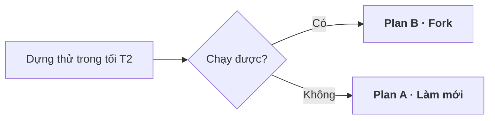

# Hai plan: làm mới và fork

Tuần chạy 10–16/8. Phân vai ở [`docs/roles/`](../roles/README.md) · câu hỏi cần trả lời ở
[`docs/kickoff.md`](../kickoff.md).

Lịch dưới đây là phác thảo, chờ ToanNH chốt quỹ thời gian thật rồi vẽ lại. Khi có đề bài, việc
đầu tiên là dành thời gian đọc kỹ rồi mới điều chỉnh phần còn lại.

---

## Ngày đầu chung — thử rồi mới quyết

Cả hai plan có cùng một ngày đầu, vì ngày đó tồn tại để chọn đi hướng nào.

| T2 · 10/8 | Việc |
|---|---|
| **Hanh + Toàn** | Dựng thử một CRM mã nguồn mở, thêm một trường riêng |
| **Tùng** | Trả lời nỗi đau thật của sales, ghi lại thành văn bản |

Rủi ro lớn nhất của fork là học mã nguồn lạ tốn hơn dự kiến. Thử một tối là biết ngay, thay vì
phát hiện ở ngày thứ tư.

---

## Plan A · Làm mới

| Ngày | **Hanh** | **Toàn** | **Tùng** | 👁️ Cuối ngày |
|---|---|---|---|---|
| **T3** | Workshop brief · soạn brief · thử trích xuất tiếng Việt | Workshop brief · khởi tạo dự án | Workshop brief | Có brief |
| **T4** | Workshop PRD · soạn PRD | Workshop PRD · CI và deploy | Workshop PRD | Có PRD · deploy được |
| **T5** | Kiến trúc · **thử bắt dữ liệu** | Đăng nhập cơ bản | Gom mẫu dữ liệu thật | Đăng nhập được · biết cách bắt dữ liệu có chạy không |
| **T6** | Cắt story · tầng nghiệp vụ | Khung giao diện | Đọc lại PRD | Có màn hình khung |
| **T7** | Tầng nghiệp vụ + phân quyền · mô hình dữ liệu | Màn hình chính | Kiểm thử · phản biện | Tạo và sửa được bản ghi |
| **CN** | Bắt và trích xuất dữ liệu · soát mã | Ghép nối · tập demo | Dữ liệu demo | **Dữ liệu tự chảy vào** |

Ba ngày đầu chưa có gì để nhìn — đăng nhập, CI, khung giao diện đều bắt buộc phải có nhưng không
ai chấm. Đó là cái giá của Plan A.

**Được:** kiến trúc là của mình, giải thích được từng dòng · không bị ràng buộc stack.

---

## Plan B · Fork

Ứng viên: **Twenty** — TypeScript/React, 45K+ sao GitHub, mở rộng bằng mã, chạy bằng Docker.

| Ngày | **Hanh** | **Toàn** | **Tùng** | 👁️ Cuối ngày |
|---|---|---|---|---|
| **T3** | Workshop brief · soạn brief · thử trích xuất tiếng Việt | Workshop brief · đọc mã nguồn | Workshop brief | Có brief |
| **T4** | Workshop PRD · soạn PRD | Workshop PRD · thêm trường riêng | Workshop PRD | Có PRD · có trường riêng |
| **T5** | Kiến trúc · **thử bắt dữ liệu** | Tuỳ biến giao diện | Gom mẫu dữ liệu thật | Biết cách bắt dữ liệu có chạy không |
| **T6** | Cắt story · lớp năng lực cho trợ lý | Tuỳ biến giao diện | Đọc lại PRD | Giao diện mang màu của mình |
| **T7** | Lớp năng lực + MCP · mô hình dữ liệu | Ghép nối | Kiểm thử · phản biện | **Trợ lý gọi được vào hệ thống** |
| **CN** | Bắt và trích xuất dữ liệu · soát mã | Đường demo · tập demo | Dữ liệu demo | **Dữ liệu tự chảy vào** |

Có sản phẩm chạy từ cuối ngày đầu, nên toàn bộ thời gian sau đó đắp lên thứ đã hoạt động.

**Điều quan trọng nhất nếu đi Plan B:** phần kiến trúc mang đi trình bày phải là **lớp mình đắp
thêm**, không phải lõi của Twenty. Câu chuyện đúng là:

> *"Chúng tôi lấy phần đã được kiểm chứng làm nền, và thêm vào những tầng mà CRM hiện có chưa
> có."*

Câu đó mạnh hơn *"chúng tôi tự viết CRM trong một tuần"* — vì ai cũng biết CRM viết trong một
tuần thì mỏng.

---

## So hai plan

| | **A · Làm mới** | **B · Fork** |
|---|---|---|
| Có thứ chạy được từ | cuối T6 | **cuối T2** |
| Thời gian đổ vào phần không ghi điểm | nhiều — đăng nhập, CI, khung giao diện | ít — chỉ học mã nguồn |
| Kiến trúc lõi | **của mình** | của Twenty |
| Kiến trúc để trình bày | toàn bộ | chỉ lớp đắp thêm |
| Ràng buộc stack | không | TypeScript · React · Docker |

Plan B nhanh có sản phẩm hơn và ít thời gian lãng phí hơn. Plan A hơn ở một điểm duy nhất: kiến
trúc lõi là của mình — và điểm đó đáng bao nhiêu thì phụ thuộc barem, thứ chưa ai biết.

Nên không quyết bằng lý lẽ. Quyết bằng buổi thử tối T2.

Nếu đề bài cấm dùng mã nguồn có sẵn thì Plan B bị loại thẳng.

---

## Bậc thang

Mỗi bậc là một sản phẩm chạy được, dừng ở đâu cũng có thứ để trình:

| Bậc | Làm gì | Thực tế |
|---|---|---|
| **0** | Tầng nghiệp vụ dùng chung + một chỗ kiểm quyền | Xong T7 |
| **1** | Bắt dữ liệu tự động từ **một** nguồn | **Mục tiêu** — xong sáng CN |
| **2** | Mỗi mẩu thông tin có nguồn, thời điểm, độ tin | Nếu còn thời gian |
| **3** | Hỏi xác nhận trước việc nguy hiểm | Nếu còn thời gian |
| **4** | Đánh dấu thông tin quá hạn | Không nằm trong kế hoạch |

Bậc 2 trở lên chưa có chỗ nào trong lịch. Đừng hứa với ai bậc 3 hay bậc 4.

---

## Nếu bắt dữ liệu tự động không chạy

Thử ở T5. Nếu trích xuất tiếng Việt không đạt, chuyển sang **để người bấm một lần** thay vì máy
tự làm: người dùng đang xem thông tin ở đâu thì bấm ngay ở đó, máy chỉ đọc và điền.

Cách này bỏ được hàng đợi, bỏ được xử lý nền, và không phải trả lời câu *"máy đọc sai thì sao"* —
vì người vẫn là người quyết. Đổi hướng tốn khoảng hai giờ, phần tầng nghiệp vụ không phải viết
lại.

---

## Mốc quyết định

Do Toàn chốt, đặt sẵn trong lịch:

| Khi nào | Quyết gì |
|---|---|
| Hết T2 | Plan A hay Plan B |
| Hết T5 | Cách bắt dữ liệu có chạy không. Không chạy thì chuyển hướng ngay |
| Hết T7 | Bậc 0 xong chưa. Chưa xong thì cắt phạm vi |
| Sáng CN | Dừng viết tính năng mới |

Chủ nhật không bắt đầu tính năng mới — hoàn tất cái đang dở thì được. Tính năng khởi động vào
ngày cuối là tính năng chưa ai chạy thử.
