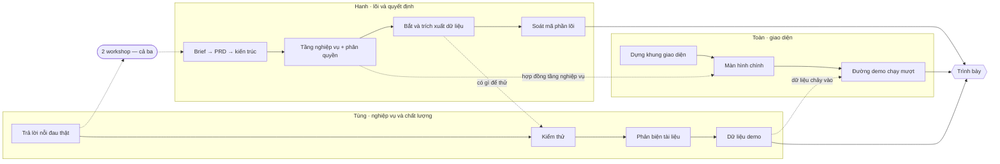

# Phân vai

Ba người, mỗi người kiêm nhiều vai. Lịch theo ngày ở [`docs/plan/`](../plan/README.md) · câu hỏi
cần trả lời ở [`docs/kickoff.md`](../kickoff.md).

---

## Ai là ai

| | Vai chính | Vai kiêm |
|---|---|---|
| **ToanNH** | Sponsor — bảo trợ, quyết nguồn lực và phạm vi | Dev · BA |
| **HanhNT2** | PM · Techlead | Dev · BA |
| **Tung Nguyen** | Chuyên gia nghiệp vụ | Tester duy nhất · BA |

Cả ba đều làm BA — ba góc nhìn cho cùng một bài toán.

---

## Ai quyết gì

Chữ **A** là người chịu trách nhiệm cuối, mỗi việc chỉ có một. Chữ **R** là người làm.

| Việc | Hanh | Toàn | Tùng |
|---|---|---|---|
| Đọc đề bài, chốt phạm vi | R | **A** | |
| Xác minh nỗi đau nghiệp vụ | R | | **A** |
| Chọn viết mới hay fork | R | **A** | |
| Product brief và PRD | **A** · điều phối | R · ghi chép | R · cấp nội dung |
| Soạn tài liệu sau workshop | **A** | | |
| Chốt kiến trúc | **A** | R | |
| Cắt việc thành story | **A** | R | |
| Viết mã phần lõi | **A** | R | |
| Viết mã giao diện | R | **A** | |
| Kiểm thử | | | **A** |
| Dữ liệu demo | | | **A** |
| Phản biện tài liệu | | | **A** |
| Kịch bản trình bày | R | **A** | R |
| Quyết dừng hay làm tiếp | R | **A** | |

Ba ô đáng chú ý:

**Xác minh nỗi đau — Tùng chịu trách nhiệm cuối.** Chuyên gia nghiệp vụ là vai duy nhất trả lời
được câu này.

**Dữ liệu demo — Tùng, không phải người viết mã.** Dữ liệu do lập trình viên bịa luôn trông giả.
Người biết một pipeline thật trông thế nào là Tùng.

**Quyết dừng hay làm tiếp — Toàn.** Người chịu rủi ro thì quyết cắt. Đặt các mốc quyết định sẵn
trong lịch, vì Toàn cũng viết mã và người viết mã luôn muốn làm thêm.

---

## Workshop chạy thế nào

Product brief và PRD làm chung cả ba, chia hai pha:

| Pha | Ai | Làm gì |
|---|---|---|
| **Họp** | Cả ba | Thu thập, tranh luận, chốt |
| **Soạn** | Hanh | Viết tài liệu, theo dõi mục còn treo |

Ba người cùng soạn một tài liệu không nhanh hơn, chỉ chậm hơn.

**Vai trong buổi họp:**

| Vai | Ai | Làm gì |
|---|---|---|
| Điều phối | **Hanh** | Nêu mục tiêu, giữ tập trung, đảm bảo mọi người đều được nói |
| Ghi chép | **Toàn** | Ghi quyết định theo mẫu định sẵn, theo dõi mục bị hoãn |
| Cấp nội dung | **Tùng** | Kiến thức nghiệp vụ, nghe góc nhìn khác |

Toàn ghi chép chứ không phát biểu chính: người có quyền quyết mà nói nhiều thì người khác ngại
nói. Vai ghi chép giữ được sự có mặt mà không lấn át.

Người điều phối không kiêm ghi chép — việc giữ cho mọi người được nói đã chiếm hết sự chú ý.

**Năm quy tắc dán lên tường:**

1. Tôn trọng ý kiến người khác
2. Mọi người đều phải đóng góp
3. Lạc đề thì giới hạn trong một khoảng thời gian định trước
4. Bàn về vấn đề, không bàn về người
5. Thống nhất trước cách ra quyết định — Hanh chốt nội dung, Toàn chốt phạm vi

Tùng vừa làm BA vừa là chuyên gia nghiệp vụ, nên nói rõ vai trước mỗi phát biểu: *"hỏi với tư
cách BA"* hay *"trả lời với tư cách người biết nghiệp vụ"*.

---

## Dùng skill BMad nào

BMad có 46 skill. Chạy chín cái:

| Skill | Ai |
|---|---|
| `bmad-product-brief` | Cả ba — dạng workshop |
| `bmad-prd` | Cả ba — dạng workshop |
| `bmad-architecture` | Hanh |
| `bmad-create-epics-and-stories` | Hanh |
| `bmad-quick-dev` | Hanh + Toàn — ngựa thồ chính |
| `bmad-dev-story` | Hanh — chỉ cho phần lõi |
| `bmad-review-adversarial-general` | Tùng |
| `bmad-code-review` | Hanh — chọn lọc trên phần lõi |
| `babok-business-analysis` | Cả ba — chạy kèm các skill khác |

Phản biện giao cho Tùng chứ không phải người viết: người viết không tự phản biện được mình, và
Tùng là chuyên gia nghiệp vụ nên bắt được lỗi nghiệp vụ chứ không chỉ lỗi trình bày.

**Không chạy:** nghiên cứu thị trường và kỹ thuật (đã làm, kết quả ở
[`systems.md`](../architecture/systems.md)) · UX (không ai chuyên) · sprint planning (ba người
ngồi cạnh nhau không cần) · sinh test tự động · retrospective (làm sau hackathon).

---

## Ba luồng song song

Không ai làm chung một thứ:

Hai điểm nối đều ở đầu tuần: **hai workshop** là nơi cả ba gặp nhau, và **hợp đồng tầng nghiệp
vụ** là thứ Hanh phải chốt sớm để Toàn chạy độc lập được tới cuối.

Luồng của Tùng mỏng nhưng nằm ở hai đầu — đầu tuần cấp nghiệp vụ, cuối tuần cấp dữ liệu demo và
phản biện.

---

Cách đặt câu hỏi cho từng vai và checklist làm việc với stakeholder giữ ở
[`babok-business-analysis/SKILL.md`](~/.claude/skills/babok-business-analysis/SKILL.md).
